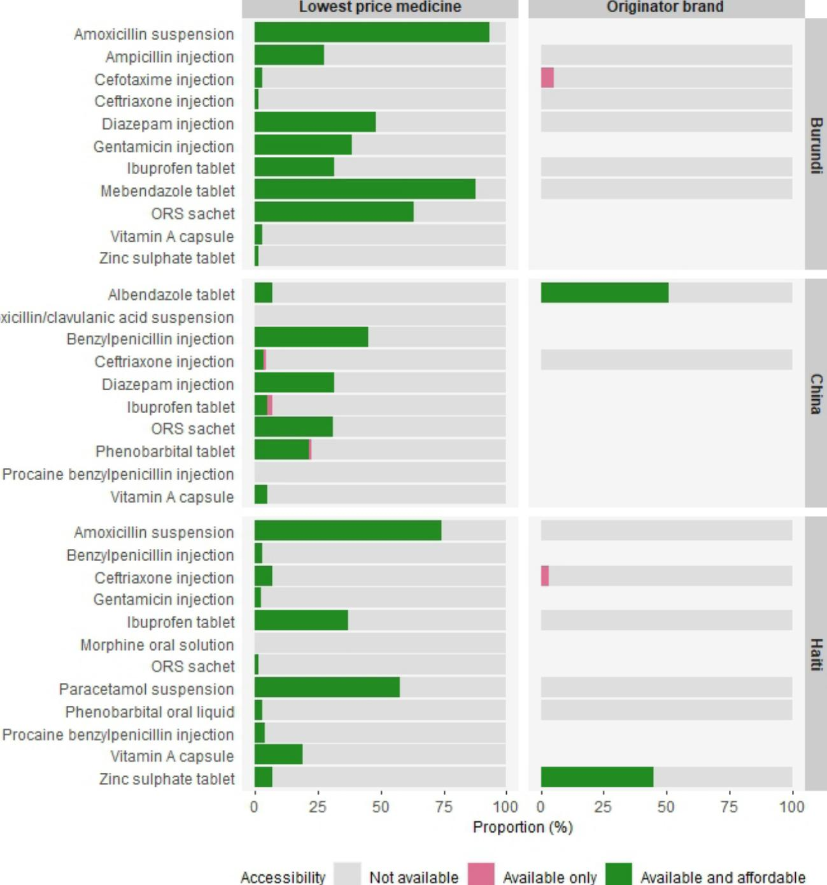

**To cite:** Joosse IR, Mantel-Teeuwisse AK, Suleman F, *et al*. Sustainable Development Goal indicator for measuring availability and affordability of medicines for children: a proof-of-concept study. *BMJ Open* 2023;13:e065929. doi:10.1136/ bmjopen-2022-065929 ► Prepublication history and additional supplemental material for this paper are available online. To view these files, please visit the journal online ([http://dx.doi.org/10.1136/bmjopen-2022-065929](http://dx.doi.org/10.1136/bmjopen-2022-065929)). Received 27 June 2022 Accepted 17 March 2023

# Sustainable Development Goal indicator for measuring availability and affordability of medicines for children: a proof-of-concept study

Iris R Joosse^1^, Aukje K Mantel-Teeuwisse^1^, Fatima Suleman^2^, Hendrika A van den Ham^1^

## ABSTRACT

Objectives To complement Sustainable Development Goal (SDG) indicator 3.b.3 that monitors access to medicines for all, a corresponding child-specific methodology was developed tailored to the health needs of children. This methodology could aid countries in monitoring accessibility to paediatric medicines in a validated manner and on a longitudinal basis. We aimed to provide proof of concept of this adapted methodology by applying the method to historical datasets.

Method A core set of child-appropriate medicines was selected for two groups of children: children aged 1–59 months and children aged 5–12 years. To enable calculation of affordability of medicines for children, the *number of units needed for treatment* was created, incorporating the recommended dosage and duration of treatment for the specific age group. The adapted methodology was applied to health facility survey data from Burundi (2013), China (2012) and Haiti (2011) for one age group. SDG indicator 3.b.3 scores and (mean) individual facility scores were calculated per country and sector.

Results We were able to calculate SDG indicator 3.b.3 based on historical data from Burundi, China and Haiti with the adapted methodology. In this case study, all individual facilities failed to reach the 80% benchmark of accessible medicines, resulting in SDG indicator 3.b.3 scores of 0% for all 3 countries. Mean facility scores ranged from 22.2% in Haiti to 40.3% in Burundi for lowest-price generic medicines. Mean facility scores for originator brands were 0%, 16.5% and 9.9% for Burundi, China and Haiti, respectively. The low scores seemed to stem from the low availability of medicines.

Conclusion The child-specific methodology was successfully applied to historical data from Burundi, China and Haiti, providing proof of concept of this methodology. The proposed validation steps and sensitivity analyses will help determine its robustness and could lead to further improvements.

## INTRODUCTION

Despite considerable progress in recent decades, unacceptably high numbers of preventable child deaths remain an important challenge in resource-limited countries. The number of child deaths is unevenly distributed: in 2020, over 80% of the 5.0million deaths in children under five years old occurred in just 2 regions—Sub-Saharan Africa and South Asia [[1]](#ref-1). A similar geographic disparity is visible in children and youth over 5 years of age, although mortality rates are somewhat lower in this group. [[1]](#ref-1) The large child populations in these regions put a further strain on often fragile health systems. [[1]](#ref-1) A key element in reducing the number of children suffering and dying from preventable and treatable diseases is improving access to medicines, as outlined in targets 3.8 and 3.b of the United Nations (UN) Sustainable Development Goals (SDGs). [[2]](#ref-2)

In order to promote access to essential medicines, countries' current performance and their progress need to be assessed and monitored. [[3]](#ref-3) This will help programme managers and policy-makers in planning their activities and developing targeted policies. Although SDG indicator 3.b.3 has been developed precisely for this purpose, [[4]](#ref-4) it predominantly targets adult medicines. As to not exclude children from access to medicines research, there is a need for an assessment method tailored to children.

SDG indicator 3.b.3 is a multidimensional index of medicines' access, reported as the proportion of health facilities that have a core set of essential medicines available at affordable prices relative to the total number of surveyed health facilities (at a national level). [[4]](#ref-4) Indicator 3.b.3 thus allows for a combined evaluation of two important dimensions of access to medicines—availability and affordability—while also permitting separate analysis of these dimensions if overall performance is poor. However, the core set of medicines used for this indicator targets diseases such as cardiovascular diseases and diabetes mellitus type 2, which are typically not prevalent among children. Moreover, age-appropriate formulations are not considered as part of this core set of medicines. [[5]](#ref-5) Yet, manipulation of adult formulations to obtain an appropriate dose for children risks administrating toxic or subtherapeutic doses through inaccurate dosing, as well as dosing errors. [[6]](#ref-6) The availability of age-appropriate formulations is thus required for safe and effective treatment of infants and young children. Finally, affordability of medicines in indicator 3.b.3 is based on defined daily dosages (DDDs), which are only applicable to adults. Hence, the current indicator fails to provide critical insight into access to paediatric medicines.

At present, there is no methodology for measuring accessibility of essential medicines specifically for children, but a number of studies have reported on the availability or price of medicines, or both [[7]](#ref-7)–[[35]](#ref-35). The methodologies for measuring these two important dimensions of access varied greatly between studies, as did the medicines surveyed, covering different age groups of children (e.g., children under 5, children under 12 or all children and adolescents), priority diseases (anticancer medicines, cardiovascular medicines or a range of diseases) and number of surveyed medicines. Results are therefore difficult to compare and may not reflect overall access to medicines for children in a country. This emphasises the need for a standardised and validated methodology for measuring access to medicines for children that will enable global comparison and eventually benchmarking of indicators.

In the present study, we propose a conceptual methodology for adapting the SDG indicator 3.b.3 that can be used to assess access to essential medicines for children. We apply the methodology to three case study countries (Burundi, China and Haiti) as proof of concept.

## STRENGTHS AND LIMITATIONS OF THIS STUDY

*   ⇒ A strength of this study is the adaptation of an existing tool that was made appropriate for children.
*   ⇒ In using an existing tool as starting point, the adapted methodology also inherits some of the limitations of this tool, such as the burden of disease weighting and the national poverty line in the calculation of affordability.
*   ⇒ In providing proof of concept of this tool, we were limited to historical data that were already available, which are of little relevance to the current situation.
*   ⇒ The historical datasets used are quality-assured through standardised data collection and through data validation and verification steps.
*   ⇒ Only a modest sample of age-appropriate medicines were surveyed in the historical datasets, demanding further analyses on larger datasets.

© Author(s) (or their employer(s)) 2023. Re-use permitted under CC BY-NC. No commercial re-use. See rights and permissions. Published by BMJ.

^1^ Utrecht WHO Collaborating Centre for Pharmaceutical Policy and Regulation, Division of Pharmacoepidemiology and Clinical Pharmacology, Utrecht Institute for Pharmaceutical Sciences (UIPS), Utrecht University, Utrecht, The Netherlands
^2^ WHO Collaborating Centre for Pharmaceutical Policy and Evidence Based Practice, Discipline of Pharmaceutical Sciences, School of Health Sciences, University of KwaZulu-Natal, Durban, South Africa

### Correspondence to

Dr Hendrika A van den Ham; h.a.vandenham@uu.nl

## METHODOLOGY

SDG indicator 3.b.3 is a composite bidimensional indicator of access, that can be calculated as follows [[4]](#ref-4):

$$
SDG_{3,b.3} \! = \! \frac{Facilities\,\,with\,\,available\,\,and\,\,affordable\,\,back\,of\,\,medicines\,\,(n)}{Suveyed\,\,Facilities\,\,(n)}\,\,\left( 1 \right)
$$

The indicator includes three core concepts used to calculate access to medicines:

*   1. A core set of globally relevant (quality-assured) essential medicines—weighted for the regional burden of disease.
*   2. Availability of medicines.
*   3. Affordability of medicines—based on the price of a medicine, the daily dose of the medicine needed for treatment, the national poverty line (NPL) and the lowest-paid unskilled government worker (LPGW) wage.

As both availability and affordability are important dimensions of access, the combination of these core concepts into a single measure allows evaluation of overall access to medicines. As SDG indicator 3.b.3 was formally approved by the UN Statistics Division, we aimed for an adapted indicator 3.b.3 for children to resemble the original indicator as closely as possible. In this section, we discuss the critical steps of the original framework and describe how the core concepts have been adapted to allow calculation of access to paediatric medicines.

## A core set of globally relevant essential medicines

The core set of medicines consists of tracer essential medicines, together indicative of overall access to medicines in primary healthcare. Over the years, several baskets of paediatric medicines have already been proposed. However, the list of medicines defined for the 2007 'Better medicines for children' project is not only dated, but also purposely excludes antiretroviral therapies for HIV. [[3]](#ref-3) Since HIV/AIDS is still prevalent among paediatric populations in low-income and middle-income countries, this selection of medicines is not suitable for the current purpose. In 2012, the WHO published a list of thirteen 'Priority life-saving medicines' for children under the age of 5, intended to help countries in prioritising those medicines that will have the biggest impact on reducing child morbidity and mortality. [[36]](#ref-36) We believe that an access indicator should serve a broader age group, especially since children aged 5–12 years may have different treatment requirements than the youngest. Additionally, the priority list only targets seven prevalent diseases, and is thus limited in its scope. With that, no existing basket of paediatric medicines was deemed suitable for the current purpose.

A new core set of medicines for children with ages 1month to 12 years for treating acute and chronic, communicable and non-communicable diseases in the primary healthcare setting and including child-appropriate formulations was thus established. To cater to the unique needs of children with different ages, separate baskets for two age groups were created: young children (infants, toddlers and preschool children) aged 1month to 59 months, and school-aged children 5–12 years of age. These groups will allow stakeholders to differentiate between health needs in terms of disease prevalence, required dosage strengths and preferred dosage forms. Children above the age of 12 often do not require paediatric formulations [[37]](#ref-37) and their health needs may already be adequately covered in the original SDG indicator 3.b.3 methodology.

To enable use of this methodology in a global context, medicines used for treating diseases with a high global prevalence were selected. Starting point for establishing a universal set of paediatric medicines were the 2019 global burden of disease estimates in children (Global Health Estimates (GHEs)). [[38]](#ref-38) We selected 10 priority conditions causing the most mortality and morbidity in disability-adjusted life years (DALYs) per age group, which were treatable with medicines from the 2019 WHO Essential Medicines List for Children (EMLc). [[39]](#ref-39) This excluded for example congenital defects and malnutrition. And although not separately represented in the GHEs, pain and palliative care was included in the selection of diseases for each age group as these are considered essential in supportive care of many conditions.

Priority conditions were linked to first-choice medicines in primary healthcare using WHO and South African treatment guidelines. [[40]](#ref-40)–[[44]](#ref-44) Multiple medicines from the same therapeutic class of medicines could be selected and can be considered interchangeable (including antiepileptics, anthelminthics, antimalarials). Medicines requiring cold-chain management were excluded, as these may not be widely available in primary health facilities. Additionally, although vaccines are a key component in healthcare, vaccination coverage is already included within indicator 3.b.1 of the SDGs and will therefore not be covered in indicator 3.b.3 as well. To ensure that the proposed basket of medicines sufficiently addresses priority health needs in clinical practice, a primary expert validation of the core set of essential medicines has taken place through an online survey (see [online supplemental](https://dx.doi.org/10.1136/bmjopen-2022-065929) [annex 1](https://dx.doi.org/10.1136/bmjopen-2022-065929) for details). The validated basket of medicines for children aged 1 month to 5 years can be found in [[Table 1]](#table-1). Child-appropriate medicine formulations were selected pragmatically, based on formulations present on the WHO EMLc and the required dosage strengths in young children.

## Availability of medicines

The second core concept in the SDG indicator 3.b.3 is the availability of medicines. Availability is a snapshot, binary variable: a medicine is considered available in a facility when found in the facility by the interviewer on the day of data collection. [[4]](#ref-4) The definition and analysis of availability in the original framework were deemed compatible with paediatric medicines and was applied without revisions.

## Affordability of medicines

A medicine is considered affordable in SDG indicator 3.b.3 when no extra daily wages (EDW) are needed for the LPGW to purchase a monthly dose treatment of this medicine after fulfilling basic needs, represented by the NPL (formula 2):

Extra daily wages ( EDW) = NPL+price per treatment daily wage of LPGW (2) In which

Price per treatment = Unit price**×**number of units needed per treatment 365/12 (3)

This measure indicates whether the LPGW wage is enough to cover the costs of daily expenditures for food and non-food items plus the cost of a medicine. The EDW is again transformed into a binary variable: a medicine is considered affordable when no EDW are required to purchase it (formula 4).

$$
\begin{cases}\n\text{if EDW} \leq 1, \text{ affordability} = 1, \\
\text{otherwise, affordability} = 0\n\end{cases} (4)
$$

## Number of units needed for treatment (NUNT)

The price per monthly treatment of a medicine is calculated from (1) the price of a medicine unit (e.g., tablet, millilitre, etc) and (2) the NUNT. In the original framework, the latter is based on DDDs that are not applicable to children. Hence, in order to calculate affordability for children, the NUNT was determined through the elements below:

*   1. The recommended dosing per age or weight group.
*   2. If applicable, the transformation of weight-based dosing (or based on body surface area (BSA)) to age-based dosing.
*   3. The duration of treatment.

Recommended (maintenance) doses per day in children—used for its main indication—were determined based on international treatment guidelines [[40]](#ref-40)–[[44]](#ref-44). As many dosing regimens are based on the body weight of a child, weight-based dosing regimens were converted to age-based regimens using weight-for-age charts. [[45]](#ref-45)–[[47]](#ref-47) Median weights of boys and girls within an age group were averaged to obtain a single measure per group. Medicines dosed based on BSA were converted through an extra calculation step, using the Meeh type equation. [[48]](#ref-48) Of note, each of the two age groups represents a range of ages. In order to calculate a single outcome for each group, the NUNT is based on the average age and weight of a child within a group (i.e., a 30-month-old child of 11kg and an 8-year-old child with a weight of 25kg). Some examples of how the NUNT was calculated are provided in [[Figure 1]](#figure-1). The NUNT was predetermined for all medicines in the core set of paediatric medicines ([online supplemental](https://dx.doi.org/10.1136/bmjopen-2022-065929) [annex 2](https://dx.doi.org/10.1136/bmjopen-2022-065929)).

## Weighting for burden of disease

In the original framework, accessible medicines are weighted according to the regional burden of disease to address differences in demand between medicines (weighting for regional burden of disease is a different process than selecting medicines for the core set based on global burden of disease) [[4]](#ref-4). This concept was applied to paediatric medicines as well, based on the GHEs [[38]](#ref-38). Each medicine in the basket was assigned a GHE code for one or several disease(s) that are treated/cured/controlled by that medicine. Indications of the medicines were determined according to their uses as described in the WHO EMLc (see [[Table 1]](#table-1)). [[39]](#ref-39) Some antibacterial medicines were also assigned the additional code (370), as a proxy for the broad use of these medicines in a variety of bacterial diseases.

The weight that each medicine is given in the calculation was computed as the proportion of associated DALYs for a medicine compared with the total sum of DALYs for all medicines surveyed. Of note, the GHEs include data for children 1–59 months and children 5–14 years. The weighting of children up to 12 years of age based on data for children up to 14 years old does not have a significant impact on the results as assigned weights are proportional weights.

## Calculating SDG indicator 3.b.3

The age-specific SDG indicator 3.b.3 can be calculated with formula 1. Assessing availability and affordability of medicines, and subsequent weighting for regional disease burden, was done at the facility level, meaning that a separate score is calculated for each health facility surveyed. Facilities with at least 80% of medicines in the basket available and affordable were considered to have accessible medicines. This threshold was adopted by the WHO Global Action Plan on Non-Communicable Diseases and used as a reference. [[49]](#ref-49) [[Table 2]](#table-2) presents a full summary of the adaptations to the original SDG 3.b.3 methodology to make it child appropriate. A hypothetical working example is provided in [online supplemental annex 3.](https://dx.doi.org/10.1136/bmjopen-2022-065929)

## Proof of concept

As proof of concept, the methodology described above was applied to three historical WHO/Health Action International (HAI) datasets for the young children age group (1 month to 5 years) (see [[Figure 2]](#figure-2) for an explanation of the WHO/HAI standardised methodology [[50]](#ref-50)).

Data on medicines' availability and price for Burundi (2013), China (2012) and Haiti (2011) was obtained from HAI. These datasets were selected because the highest absolute number of age-appropriate medicines that are listed in the proposed core set of medicines was included in these surveys (11, 10 and 12 out of 22 medicines, respectively) [[51]](#ref-51). Additionally, this selection represents countries with different income levels (e.g., Burundi and Haiti low-income countries, China an upper-middle income country) and from different geographical regions. To make the datasets appropriate for analysis, only the age-appropriate medicines as listed in [[Table 1]](#table-1) were selected. A selection in participating health facilities was not made.

Data on NPLs were obtained from World Bank reports on poverty. [[52]](#ref-52)–[[54]](#ref-54) NPLs were adjusted for inflation and deflation between the year data was reported and the survey year using the Consumer Price Index. [[55]](#ref-55) Monthly poverty lines were converted to daily time periods. LPGW wages were directly obtained from the datasets provided by HAI and thus required no corrections for the year of survey.

Because regional data on burden of disease in DALYs is available for every 5years only, the year closest in time to the year of survey was used (e.g., 2010 publication for China and Haiti and 2015 publication for Burundi) to weight for burden of disease [[38]](#ref-38).

In addition to estimating the overall SDG 3.b.3 indicator, mean individual facility scores were also calculated per country and sector. Results were disaggregated per medicine to investigate drivers of inaccessibility.

## Patient and public involvement

There was no patient or public involvement in the design or conduct of this study.

## RESULTS

Access to medicines for children aged 1month to 5 years was calculated for each of the three case study countries for its different health sectors. Analysis of data from Burundi showed a stark contrast between lowest-price generic medicines (LPM) and the originator brand (OB), with a mean facility score of 40.3% for LPMs vs 0.0% for the OB. The public and mission sector provided more accessible medicines than the private sector. The difference between LPMs and the OB was not as pronounced in China with mean facilities scores of 22.3% and 16.5% respectively, with LPMs more accessible in the public sector and the OBs more in the private sector. In Haiti, access was calculated for the public sector, the private sector, the non-profit sector and the mixed sector (health facilities managed by the government and non-profit organisation together). Mean facility scores for LPMs were similar across the sectors, with an overall mean of 22.2%. For OB medicines, scores varied between 0.6% in the private sector and 15.1% in the public sector. Results on SDG indicator 3.b.3 and mean facility scores across health facilities from different sectors are summarised in [[Table 3]](#table-3).

None of the facilities in either of the three countries were categorised as providing sufficient access to medicines, as all facilities failed to reach the 80% threshold. This resulted in SDG indicator 3.b.3 outcomes of 0% in all three countries. The main driver for the low scores was the low availability of medicines, as illustrated in [[Figure 3]](#figure-3). Notably, those medicines that were available on the day of survey were generally also affordable, with a few exceptions (four cefotaxime injections, six ceftriaxone injections, two ibuprofen tablets, one phenobarbital tablet). Age-appropriate dosage forms such as oral suspension or liquids were not associated with unaffordable prices in these case studies.

## DISCUSSION

This paper proposes an adapted methodology that can be used to measure access to paediatric medicines, based on the principles embedded in SDG indicator 3.b.3. This novel methodology could be an important tool for policymakers and programme managers in identifying major barriers to access and developing appropriate policies to improve access to medicines for children. In adapting the methodology, two proposed core sets of paediatric medicines were established for children of different ages, taking into account their specific health needs and age-appropriate formulations. Careful approaches were taken to create the NUNT—a novel parameter—which enables affordability calculations across ages. The adapted methodology was successfully applied to data from three individual countries, providing proof of concept of this methodology.

With no reliable method for measuring access to paediatric medicines having been established yet, the child-specific methodology presented in this paper can provide guidance to others aiming to study access to medicines for children. The use of a single methodology and core set of medicines to express access to medicines will allow for intercountry comparability of the SDG indicator. Another important advantage of such a standardised tool is its ease of use. By predetermining which medicines and formulations should be surveyed, by providing the typical NUNT, and demonstrating how accessibility should be calculated, this method only requires countries to collect the facility data and some additional inputs. Yet, standardisation can also be viewed as rigidity, which is inherent to any tool that uses a single core set for global reference. Local guidelines that recommend use of other active ingredients or formulations than those in the core set could lead to skewed outcomes. Therefore, this standardised method incorporates some flexibilities, allowing for several formulations or active ingredients from the same therapeutic class to be interchanged (i.e., antiepileptics, antimalarials, etc). This allows countries to apply this method to their national situation. Additionally, we recognise that the proposed core set should be subject to regular updates, in accordance with updates to the WHO EMLc and international treatment guidelines.

On closer examination of the case studies of Burundi, China and Haiti, the widespread inaccessibility seen in the results seemed to stem from unavailable rather than unaffordable medicines, for both LPMs and OBs. A recent systematic review on children's medicines identified 14 studies that reported on the availability of children's medicines and found a median availability of 38.1% and 24.2% for LPMs and OBs in the public sectors and of 35.9% and 21.1% in the private sectors, respectively [[56]](#ref-56). With that, the unavailability of child medicines detected in the present case studies is in line with the results of the systematic review. The same systematic review identified 11 studies that reported on the affordability of medicines, based on the number of days' wages of the LPGW. In the public sector, affordability was 83.6% and 48.5% for LPMs and OBs, with 72.2% and 68.8% in the private sector. The results of this systematic review emphasise the need for a method that combines the two dimensions into a single indicator, as separate evaluation of these elements overestimates actual access to medicines for the patient. Beyond that, some of the studies included in the systematic review included unrepresentative samples of medicines (e.g., studies focused on a single disease area or studies simply failing to consider child-appropriate formulations such as oral liquids or appropriate medicine strengths), again confirming the need for a standardised methodology to measure access to child medicines.

Before this methodology can, however, be applied on a widespread scale, several steps must be undertaken to further validate the methodology and examine the uncertainties introduced through our adaptations of the tool. First, the proposed core sets of medicines for school-aged children (not shown) should be validated through expert consultation. Additionally, the robustness of the adapted methodology with regard to the NUNT will need to be tested as it is an important variable when calculating affordability. The NUNT was determined based on recommended dosages and duration of treatment prescribed in international guidelines, which were often expressed as ranges. This generates some uncertainty when converting to a single NUNT. Also, determining an NUNT in many cases involved transformation of weight-based to age-based dosing through weight-to-age charts, introducing further uncertainties. The WHO provides international weight-for-age charts for boys and girls until the age of 5 [[45]](#ref-45) and ages 5–10 years [[46]](#ref-46), but no international charts are available for children above the age of 10. Therefore, Dutch growth diagrams were used to approximate median weights of children 10–12 years. [[47]](#ref-47) Initial comparison of international and Dutch growth charts shows that differences, if any, are small and will likely have had no significant impact on the NUNT. Furthermore, the NUNT is a single number used to represent an entire age group. How big the uncertainties with regard to the NUNT are and whether a single NUNT is indeed sufficiently representative for an entire age group should become clear in sensitivity analyses. Additionally, the case studies now performed were on a subset of the complete core set for young children, limited by the small number of age-appropriate medicines that had been surveyed in the three case study countries. Sensitivity analyses should also be performed to determine the minimum number of medicines required for a reliable measure of accessibility. To perform meaningful sensitivity analyses, more data on child medicines is needed than was available for the present case studies.

An important strength of this child-specific methodology is the use of an existing, formally approved tool as starting point which was adapted to suit the needs of children. Core concepts used in the adapted methodology and its data requirements are therefore in line with conventional methods and data collection tools. However, through this approach our methodology also inherits some of the limitations of the original 3.b.3 indicator methodology. Particularly, weighting for regional burden of disease when calculating access at the facility level as done in the original methodology raises several concerns. For one, the methodology assigns equal weights to medicines that are used to treat the same disease and thus counts the burden of this disease multiple times. To illustrate, the basket of medicines includes both oral rehydration salts and zinc sulphate for diarrheal diseases, whereas only retinol was selected for measles/vitamin A deficiency. This leads to disproportionate weighting for actual burden of disease when calculating access at the facility level. Disproportionality is also a concern for antibacterial medicines, which use may be overrepresented by using GHE code 20, a code that is linked to all infectious and parasitic diseases. Although a proxy for this GHE code was used in the present study (GHE code 370 for 'other infectious diseases'), additional analyses should demonstrate how different weighting approaches affect the results. Additionally, the quality of the underlying GHEs data is unclear, especially because these data may be more difficult to obtain for children than for adults. Lastly, arguments can be made that the current approach of weighting for burden of disease is undesirable because it implies that some medicines are more important than others, even though all medicines in the basket are essential medicines and should always be accessible.

On a similar note, expressing affordability as a function of a poverty line instead of the LPGW wage has been used previously [[57]](#ref-57), but a measure combining the NPL and LPGW wage as is used in the original 3.b.3 indicator has yet to prove itself. This is particularly relevant because it seems that somewhat less medicines were unaffordable in the present case studies than what was observed using the LPGW wage alone [[56]](#ref-56). Further testing of the proposed child-specific methodology should include several scenarios for weighting for burden of disease and calculating affordability, which could lead to further adaptations of the methodology.

Since no facilities met the benchmark of 80% in our case study countries, the overall SDG indicator 3.b.3 was by definition 0% in all countries. Through this benchmarking approach relevant differences in access between countries and sectors were lost (e.g., access in Burundi was better with a mean facility score of 40.3% vs 22.3% and 22.2% in China and Haiti, respectively). Additionally, the detail required for identifying the major obstacles in accessibility is also missing when the SDG indicator is reported as a single outcome. This highlights that disaggregated data on a facility and medicine level is vital in understanding the drivers of inaccessibility to medicines, particularly when the indicator value reflects a suboptimal level of access. We recommend that the indicator should therefore be reported in both a composite and disaggregated form.

To provide first evidence of the child-specific tool that we developed, we were limited to the use of historical datasets. In selecting suitable datasets for the case studies it was observed that only a small number of age-appropriate medicines are being surveyed in low-income and middle-income countries [[58]](#ref-58). The WHO/HAI datasets used for the present case studies were selected for their quality of data and relatively high inclusivity of age-appropriate medicines, yet they still included a modest sample of child-appropriate medicines. Further analyses on a dataset with a higher number of age-appropriate medicines are thus required, which may need to be collected prospectively. Although the relevance of the findings to the current situation of Burundi, China and Haiti is limited because of the older data, the aim of providing proof of concept of the adapted methodology was achieved nonetheless. Finally, the individual facility data that support the findings of this study are not publicly available, but aggregated data per medicine and country can be obtained from the HAI website. [[51]](#ref-51) The aggregated data are sufficient to allow initial comparison of our methodology to previously existing tools.

## CONCLUSION

This paper proposes a standardised methodology for measuring access to medicines for children that could complement the existing SDG indicator 3.b.3. This standardised method—once validated—can aid countries in assessing national accessibility to paediatric medicines in a validated manner and on a regular basis. The proposed validation steps of this method will help identify critical steps in the calculation and will determine its robustness, which could lead to further improvements of the method.

Acknowledgements The authors thank Veronika J Wirtz for preliminary discussions and valuable comments on the methodology. We are grateful to Agaath T van Mourik and Bram A Wagner for their contribution to the analysis of data.

Contributors All authors were involved in conception and study design. IRJ drafted the article, HAvdH, AKM-T and FS were involved in critical revision of the article. HAvdH is guarantor for this work and accepts full responsibility for the finished work and the conduct of the study. All authors approved the final article.

Funding The authors have not declared a specific grant for this research from any funding agency in the public, commercial or not-for-profit sectors.

Competing interests None declared.

Patient and public involvement Patients and/or the public were not involved in the design, or conduct, or reporting, or dissemination plans of this research.

Patient consent for publication Not applicable.

Provenance and peer review Not commissioned; externally peer reviewed.

Data availability statement Data may be obtained from a third party and are not publicly available. The individual facility data that support the findings of this study were obtained from Health Action International after submission and approval of the research protocol. Restrictions apply to the availability of these data, which were used under agreement for this study. Individual facility data may be obtained from Health Action International. Aggregated data on medicine and country level can be obtained from the Health Action International website.

Supplemental material This content has been supplied by the author(s). It has not been vetted by BMJ Publishing Group Limited (BMJ) and may not have been peer-reviewed. Any opinions or recommendations discussed are solely those of the author(s) and are not endorsed by BMJ. BMJ disclaims all liability and responsibility arising from any reliance placed on the content. Where the content includes any translated material, BMJ does not warrant the accuracy and reliability of the translations (including but not limited to local regulations, clinical guidelines, terminology, drug names and drug dosages), and is not responsible for any error and/or omissions arising from translation and adaptation or otherwise.

Open access This is an open access article distributed in accordance with the Creative Commons Attribution Non Commercial (CC BY-NC 4.0) license, which permits others to distribute, remix, adapt, build upon this work non-commercially, and license their derivative works on different terms, provided the original work is properly cited, appropriate credit is given, any changes made indicated, and the use is non-commercial. See: [http://creativecommons.org/licenses/by-nc/4.0/](http://creativecommons.org/licenses/by-nc/4.0/).

## ORCID iDs

Iris R Joosse <http://orcid.org/0000-0001-7677-8589>

Aukje K Mantel-Teeuwisse <http://orcid.org/0000-0002-8782-0698>

## REFERENCES

*   [[1]] Unicef. n.d. Goal 3: good health and well-being. Available: [https://data.unicef.org/sdgs/goal-3-good-health-wellbeing](https://data.unicef.org/sdgs/goal-3-good-health-wellbeing)
*   [[2]] United Nations. n.d. About the sustainable development goals. Available: [https://www.un.org/sustainabledevelopment/sustainable-development-goals](https://www.un.org/sustainabledevelopment/sustainable-development-goals)
*   [[3]] World health organization. *Better medicines for children project*. Geneva: WHO, 2009. Available: [https://www.who.int/childmedicines/progress/ChildMeds_pricing_surveys.pdf](https://www.who.int/childmedicines/progress/ChildMeds_pricing_surveys.pdf)
*   [[4]] United Nations. n.d. SDG indicators: metadata repository. Available: <https://unstats.un.org/sdgs/metadata?Text=&Goal=3&Target=3.b>
*   [[5]] Kristensen HG. Who Guideline development of paediatric medicines: points to consider in pharmaceutical development. *[Int J Pharm](http://dx.doi.org/10.1016/j.ijpharm.2012.05.054)* 2012;435:134–5.
*   [[6]] World Health Organization. *Promoting safety of medicines for children*. Geneva: WHO, 2007. Available: [https://www.who.int/medicines/publications/essentialmedicines/Promotion_safe_med_childrens.pdf](https://www.who.int/medicines/publications/essentialmedicines/Promotion_safe_med_childrens.pdf)
*   [[7]] Martei YM, Iwamoto K, Barr RD, *et al*. Shortages and price variability of essential cytotoxic medicines for treating children with cancers. *[BMJ Glob Health](http://dx.doi.org/10.1136/bmjgh-2020-003282)* 2020;5:e003282.
*   [[8]] Simonyan T, Papyan R, Danielyan S, *et al*. Availability of essential medicines for pediatric oncology in Armenia. *[Asian Pac J Cancer Prev](http://dx.doi.org/10.31557/APJCP.2019.20.4.991)* 2019;20:991–4.
*   [[9]] Droti B, O'Neill KP, Mathai M, *et al*. Poor availability of essential medicines for women and children threatens progress towards sustainable development goal 3 in africa. *[BMJ Glob Health](http://dx.doi.org/10.1136/bmjgh-2018-001306)* 2019;4:e001306.
*   [[10]] Orubu ESF, Robert FO, Samuel M, *et al*. Access to essential cardiovascular medicines for children: a pilot study of availability, price and affordability in nigeria. *[Health Policy Plan](http://dx.doi.org/10.1093/heapol/czz057)* 2019;34:iii20–6.
*   [[11]] Roy V, Singhal S, Tayal H, *et al*. Availability of pediatric formulations in public health care system in India: a case study. *[Indian J Pediatr](http://dx.doi.org/10.1007/s12098-020-03220-3)* 2021;88:227–34.
*   [[12]] Faruqui N, Martiniuk A, Sharma A, *et al*. Evaluating access to essential medicines for treating childhood cancers: a medicines availability, price and affordability study in New Delhi, India. *[BMJ Glob Health](http://dx.doi.org/10.1136/bmjgh-2018-001379)* 2019;4:e001379.
*   [[13]] Cohen P, Friedrich P, Lam C, *et al*. Global access to essential medicines for childhood cancer: a cross-sectional survey. *[J Glob Oncol](http://dx.doi.org/10.1200/JGO.18.00150)* 2018;4:1–11.
*   [[14]] Hailu AD, Mohammed SA. Availability, price, and affordability of who priority maternal and child health medicine in public health facilities of dessie, north-east Ethiopia. *[BMC Med Inform Decis Mak](http://dx.doi.org/10.1186/s12911-020-01247-2)* 2020;20:221.
*   [[15]] Johansson EW, Lindsjö C, Weiss DJ, *et al*. Accessibility of basic paediatric emergency care in Malawi: analysis of a national facility census. *[BMC Public Health](http://dx.doi.org/10.1186/s12889-020-09043-3)* 2020;20:992.
*   [[16]] Dorj G, Sunderland B, Sanjjav T, *et al*. Availability, affordability and costs of pediatric medicines in Mongolia. *[BMC Pediatr](http://dx.doi.org/10.1186/s12887-018-1123-x)* 2018;18:149.
*   [[17]] Tujo TM, Gurmu TG. Availability and utilization of who lifesaving medicines for children under five in public health facilities of the jimma zone, South West Ethiopia: a cross-sectional survey. *[Int J Pediatr](http://dx.doi.org/10.1155/2020/3505672)* 2020;2020:3505672.
*   [[18]] Swain TR, Rath B, Dehury S, *et al*. Pricing and availability of some essential child specific medicines in Odisha. *[Indian J Pharmacol](http://dx.doi.org/10.4103/0253-7613.165197)* 2015;47:496–501.
*   [[19]] Božić B, Stupar S, Stupar D, *et al*. Availability of pediatric-evaluated formulations in Serbia. *[Indian J Pharmacol](http://dx.doi.org/10.4103/ijp.IJP_66_16)* 2017;49:189–93.
*   [[20]] Sun X, Wei J, Yao Y, *et al*. Availability, prices and affordability of essential medicines for children: a cross-sectional survey in Jiangsu province, China. *[BMJ Open](http://dx.doi.org/10.1136/bmjopen-2018-023646)* 2018;8:e023646.
*   [[21]] Wang X, Fang Y, Yang S, *et al*. Access to paediatric essential medicines: a survey of prices, availability, affordability and price components in shaanxi Province, China. *[PLoS One](http://dx.doi.org/10.1371/journal.pone.0090365)* 2014;9:e90365.
*   [[22]] Sado E, Sufa A. Availability and affordability of essential medicines for children in the Western part of Ethiopia: implication for access. *[BMC Pediatr](http://dx.doi.org/10.1186/s12887-016-0572-3)* 2016;16:40.
*   [[23]] Balasubramaniam R, Benaragama BVSH, Sri Ranganathan S. A national survey of price and affordability of key essential medicines for children in Sri Lanka. *[Indian J Pediatr](http://dx.doi.org/10.1007/s12098-013-1024-9)* 2014;81:362–7.
*   [[24]] Vassal G, Kozhaeva O, Griskjane S, *et al*. Access to essential anticancer medicines for children and adolescents in Europe. *[Ann Oncol](http://dx.doi.org/10.1016/j.annonc.2020.12.015)* 2021;32:560–8.
*   [[25]] Barr R, Robertson J. Access to cytotoxic medicines by children with cancer: a focus on low and middle income countries. *[Pediatr Blood Cancer](http://dx.doi.org/10.1002/pbc.25722)* 2016;63:287–91.
*   [[26]] Nsabagasani X, Ogwal-Okeng J, Mbonye A, *et al*. Availability and utilization of the who recommended priority lifesaving medicines for under five-year old children in public health facilities in Uganda: a cross-sectional survey. *[J Pharm Policy Pract](http://dx.doi.org/10.1186/s40545-015-0038-2)* 2015;8:18.
*   [[27]] Rutebemberwa E, Buregyeya E, Lal S, *et al*. Assessing the potential of rural and urban private facilities in implementing child health interventions in Mukono district, central uganda-a cross sectional study. *[BMC Health Serv Res](http://dx.doi.org/10.1186/s12913-016-1529-9)* 2016;16:268.
*   [[28]] Robertson J, Forte G, Trapsida J-M, *et al*. What essential medicines for children are on the shelf? *[Bull World Health Organ](http://dx.doi.org/10.2471/blt.08.053645)* 2009;87:231–7.
*   [[29]] Shafiq Y, Shaikh BT, Kumar R. Availability and affordability of essential medicines: exploring the health seeking behaviours and health service utilisation for children under-5 years living in squatter settlement of Karachi, Pakistan. *[J Ayub Med Coll Abbottabad](http://dx.doi.org/22830168)* 2011;23:132–8.
*   [[30]] Balasubramaniam R, Beneragama BVSH, Sri Ranganathan S. A national survey of availability of key essential medicines for children in Sri Lanka. *[Ceylon Med J](http://dx.doi.org/10.4038/cmj.v56i3.3597)* 2011;56:101–7.
*   [[31]] Gitanjali B, Manikandan S. Availability of five essential medicines for children in public health facilities in India: a snapshot survey. *[J Pharmacol Pharmacother](http://dx.doi.org/10.4103/0976-500X.81900)* 2011;2:95–9.
*   [[32]] Tadesse T, Abuye H, Tilahun G. Availability and affordability of children essential medicines in health facilities of southern nations, nationalities, and people region, Ethiopia: key determinants for access. *[BMC Public Health](http://dx.doi.org/10.1186/s12889-021-10745-5)* 2021;21:714.
*   [[33]] Anson A, Ramay B, de Esparza AR, *et al*. Availability, prices and affordability of the world Health organization's essential medicines for children in Guatemala. *[Global Health](http://dx.doi.org/10.1186/1744-8603-8-22)* 2012;8:22.
*   [[34]] Abu-Arja MH, Rojas Del Río N, Morales La Madrid A, *et al*. Evaluation of the pediatric neuro-oncology resources available in chile. *[JCO Glob Oncol](http://dx.doi.org/10.1200/GO.20.00430)* 2021;7:425–34.
*   [[35]] Abrha S, Tadesse E, Atey TM, *et al*. Availability and affordability of priority life-saving medicines for under-five children in health facilities of tigray region, Northern Ethiopia. *[BMC Pregnancy Childbirth](http://dx.doi.org/10.1186/s12884-018-2109-2)* 2018;18:464.
*   [[36]] World Health Organization (WHO). *Priority life-saving medicines for women and children 2012*. Geneva: WHO, 2012. Available: [https://www.who.int/publications/i/item/WHO-EMP-MAR-2012-1](https://www.who.int/publications/i/item/WHO-EMP-MAR-2012-1)
*   [[37]] European Medicines Agency (EMA). *Reflection paper: formulations of choice for the paediatric population*. London: EMA, 2006. Available: [https://www.ema.europa.eu/en/documents/scientific-guideline/reflection-paper-formulations-choice-paediatric-population_en.pdf](https://www.ema.europa.eu/en/documents/scientific-guideline/reflection-paper-formulations-choice-paediatric-population_en.pdf)
*   [[38]] Global Health Observatory, World Health Organization (WHO). Global health estimates: leading causes of dalys. n.d. Available: [https://www.who.int/data/gho/data/themes/mortality-and-global-health-estimates/global-health-estimates-leading-causes-of-dalys](https://www.who.int/data/gho/data/themes/mortality-and-global-health-estimates/global-health-estimates-leading-causes-of-dalys)
*   [[39]] World Health Organization (WHO). *WHO model list of essential medicines for children - 7th list, 2019*. Geneva: WHO, 2019. Available: [https://www.who.int/publications/i/item/WHOMVPEMPIAU201907](https://www.who.int/publications/i/item/WHOMVPEMPIAU201907)
*   [[40]] World Health Organization. *Pocket book of hospital care for children: guidelines for the management of common childhood illnesses*. WHO, 2013. Available: [https://www.who.int/maternal_child_adolescent/documents/child_hospital_care/en/#:~:text=It%20is%20for%20use%20by,of%20Childhood%20Illness%20(IMCI)](https://www.who.int/maternal_child_adolescent/documents/child_hospital_care/en/#:~:text=It%20is%20for%20use%20by,of%20Childhood%20Illness%20(IMCI))
*   [[41]] National Department of Health. *Primary healthcare standard treatment guideline and essential medicine list*. Republic of South Africa: National Department of Health, 2018. Available: [https://www.knowledgehub.org.za/elibrary/primary-healthcare-standard-treatment-guidelines-and-essential-medicines-list-6th-edition](https://www.knowledgehub.org.za/elibrary/primary-healthcare-standard-treatment-guidelines-and-essential-medicines-list-6th-edition)
*   [[42]] World Health Organization (WHO). *Consolidated guidelines on HIV prevention, testing, treatment, service delivery and monitoring: recommendations for a public health approach*. Geneva: WHO, 2021. Available: <https://www.who.int/publications/i/item/9789240031593>
*   [[43]] World Health Organization (WHO). *WHO guidelines for malaria*. Geneva: WHO, 2021. Available: [https://www.who.int/publications/i/item/guidelines-for-malaria](https://www.who.int/publications/i/item/guidelines-for-malaria)
*   [[44]] World Health Organization (WHO). *Paediatric emergency triage, assessment and treatment: care of critically-ill children*. Geneva: WHO, 2016. Available: [https://www.who.int/publications/i/item/9789241510219](https://www.who.int/publications/i/item/9789241510219)
*   [[45]] World Health Organization (WHO). Child growth standards. n.d. Available: [https://www.who.int/tools/child-growth-standards/standards/weight-for-age](https://www.who.int/tools/child-growth-standards/standards/weight-for-age)
*   [[46]] World Health Organization (WHO). Growth reference data for 5-19 years. n.d. Available: [https://www.who.int/tools/growth-reference-data-for-5to19-years/indicators/weight-for-age-5to10-years](https://www.who.int/tools/growth-reference-data-for-5to19-years/indicators/weight-for-age-5to10-years)
*   [[47]] Tno.groeidiagrammen in PDF-formaat. 2021. Available: [https://www.tno.nl/nl/aandachtsgebieden/gezond-leven/roadmaps/youth/groeidiagrammen-in-pdf-formaat](https://www.tno.nl/nl/aandachtsgebieden/gezond-leven/roadmaps/youth/groeidiagrammen-in-pdf-formaat)
*   [[48]] Akkawi El Edelbi R, Lindemalm S, Nydert P, *et al*. Estimation of body surface area in neonates, infants, and children using body weight alone. *[Int J Pediatr Adolesc Med](http://dx.doi.org/10.1016/j.ijpam.2020.09.003)* 2021;8:221–8.
*   [[49]] World Health Organization (WHO). *Global action plan for the prevention and control of noncommunicable diseases 2013-2020*. Geneva: WHO, 2013. Available: [https://www.who.int/publications/i/item/9789241506236](https://www.who.int/publications/i/item/9789241506236)
*   [[50]] World Health Organization (WHO) & Health Action International (HAI). *Measuring medicine prices, availability, affordability and price components*. 2nd edn. Geneva: WHO, 2008. Available: [https://apps.who.int/iris/handle/10665/70013](https://apps.who.int/iris/handle/10665/70013)
*   [[51]] Health Action International (HAI). Medicine prices, availability, affordability & price components database [online]. n.d. Available: [https://haiweb.org/what-we-do/price-availability-affordability/price-availability-data](https://haiweb.org/what-we-do/price-availability-affordability/price-availability-data)
*   [[52]] World Bank. *[Burundi poverty assessment](http://dx.doi.org/10.1596/35555)*. Washington, DC: World Bank, 2016.
*   [[53]] World. *Poverty and equity brief china*. Washington, DC: World Bank, 2021. Available: [https://www.worldbank.org/en/topic/poverty/publication/poverty-and-equity-briefs](https://www.worldbank.org/en/topic/poverty/publication/poverty-and-equity-briefs)
*   [[54]] World Bank and Observatoire National de la Pauvreté et de l'Exclusion Sociale (ONPES). Investing in people to fight poverty in haiti, reflections for evidence-based policy making. Washington, DC, World Bank. 2014. Available: [https://openknowledge.worldbank.org/handle/10986/21519](https://openknowledge.worldbank.org/handle/10986/21519)
*   [[55]] World Bank. Consumer price index (2010 = 100). n.d. Available: <https://data.worldbank.org/indicator/FP.CPI.TOTL>
*   [[56]] Chen Z, Li S, Zeng L, *et al*. Accessibility of medicines for children: a systematic review. *[Front Pharmacol](http://dx.doi.org/10.3389/fphar.2021.691606)* 2021;12:691606.
*   [[57]] Niëns LM, Van de Poel E, Cameron A, *et al*. Practical measurement of affordability: an application to medicines. *[Bull World Health Organ](http://dx.doi.org/10.2471/BLT.10.084087)* 2012;90:219–27.
*   [[58]] Joosse IR, Mantel-Teeuwisse AK, Wirtz VJ, *et al*. Missing data on accessibility of children's medicines. *[Bull World Health Organ](http://dx.doi.org/10.2471/BLT.22.288137)* 2022;100:636–42.

## TL;DR
Not available

## Key Insights
Not available

## Metadata Summary
### Research Context
- **Research Question**: Not available
- **Methodology**: Not available
- **Key Findings**: Not available

### Analysis
- **Limitations**: Not available
- **Future Work**: Not available

## TABLES

| Disease area (GHE code) | Medicine name | Acceptable formulations |
|:----------------------------------------------------------------------------|:-------------------------------------------------|:-------------------------------------------------------------------------------------------------------------------------------------|
| Diarrhoeal diseases (110) | Oral rehydration salts | Powder sachet 200mL, 500mL or 1L |
| | Zinc sulphate | Cap/tab 20 mg |
| Epilepsy (970) | Carbamazepine OR | Cap/tab 100 mg; oral liquid 100mg/5mL |
| | Phenobarbital OR | Cap/tab 30 mg or 100mg; injection 100mg/mL or 200mg/mL; oral liquid 15mg/5mL |
| | Phenytoin OR | Cap/tab 25 mg, 50mg or 100mg; injection 50mg/mL; oral liquid 25 or 30mg/5mL |
| | Lamotrigine | Cap/tab 25 mg, 50mg or 100mg |
| | Valproic acid | Cap/tab 100 mg, 150mg, 200mg or 500mg; oral liquid 200mg/5mL |
| | Diazepam OR | Rectal solution 5mg/mL; injection 5mg/mL |
| | Lorazepam OR | Parenteral solution 2mg/mL or 4mg/mL |
| | Midazolam | Oromucosal solution 5mg/mL or 10mg/mL; ampoule 10mg/mL |
| HIV/AIDS (100) | Abacavir+lamivudine+ dolutegravir OR | Cap/tab 120/60 mg (abacavir/lamivudine) AND cap/tab 10 mg (dolutegravir) |
| | Abacavir+lamivudine+ lopinavir/ritonavir | Cap/tab 120/60 mg (abacavir/lamivudine) AND cap/tab 40/10 mg or 100/25mg (lopinavir/ritonavir) |
| Iron deficiency anaemia (580) | Ferrous salt | Cap/tab 60 mg or 200mg; oral liquid 25mg/mL |
| | Albendazole OR | Cap/tab 200 mg or 400mg |
| | Mebendazole | Cap/tab 100 mg |
| Malaria (220) | Artemether+lumefantrine OR | Cap/tab 20/120 mg |
| | Artesunate+amodiaquine OR | Cap/tab 25/67.5 mg or 50/135mg |
| | Artesunate+mefloquine OR | Cap/tab 25/55 mg |
| | Dihydroartemisinin+ piperaquine OR | Cap/tab 20/160 mg or 20/320mg |
| | Artesunate+ sulfadoxine–pyrimethamine OR | Cap/tab 50/500/25 mg or cap/tab 50 mg (artesunate) AND cap/tab 500/25 mg (sulfadoxine–pyrimethamine) |
| | Chloroquine | Cap/tab 100 mg; oral liquid 50mg/5mL |
| | Artesunate | Cap/tab 50 mg; suppository 50mg |
| Measles (150) Vitamin A deficiency (570) | Retinol | Cap/tab 25 000 IU, 100000 IU or 200000 IU |
| Pain and palliative care (weight=1/T*) | Paracetamol | Cap/tab 100 mg; suppository 100mg; suspension 120 or 125mg/5mL |
| | Morphine | Cap/tab (slow release) 10mg; injection 10mg/ampoule; oral liquid 10mg/5mL |
| | Ibuprofen | Cap/tab 200 mg; oral liquid 200mg/5mL |
| Tuberculosis (30) | Ethambutol+isoniazid+ pyrazinamide+rifampicin | Cap/tab 100 mg or 400mg or oral liquid 25mg/mL (ethambutol) AND cap/tab 50/150/75 mg (isoniazid+pyrazinamide+rifampicin) |
| Lower respiratory infections (390) Other infectious diseases (370) | Amoxicillin OR | Cap/tab 250 mg or 500mg; powder for injection 250mg/vial, 500mg/vial or 1g/vial; suspension 125mg/5mL or 250mg/5mL |
| | Amoxicillin+clavulanic acid | Cap/tab 100/125 mg, 250/125mg or 500/125mg; powder for injection 500/100mg/vial; oral liquid 125/53.25mg/5mL or 250/62.5mg/5mL |
| | Ampicillin | Cap/tab 250 mg or 500mg; injection 500mg/vial or 1g/vial |
| | Benzylpenicillin | Injection 1 MIU/vial |
| | Gentamicin | Injection 10mg/mL or 40mg/mL |
| **Table 1** Continued | | |
| Disease area (GHE code) | Medicine name | Acceptable formulations |
| Other infectious diseases (370) Meningitis (170) | Ceftriaxone | Injection 250mg/vial, 500mg/vial or 1g/vial |
| | Cefotaxime | Injection 1g/vial |
| Syphilis (50) | Procaine benzylpenicillin | Injection 1 MIU/vial |
| *T is the total number of surveyed medicines. | | |

Cap/tab, capsule/tablet; GHE, Global Health Estimates; MIU, milli-international units.

| **Table 2** Comparison of the original and child-specific SDG3.b.3 methodology | | | | | | | |
|:------------------------------------------------------------------------------|:--------------------------------------------------------------------------------------------------------------------------------------------------------------------------------------------------------------------------------------------------------------------------------------------------------|:----------------------------------------------------------------------------------------------------------------------------------------------------------------------------------------------------------------------------------------------------------------------------------------------------------------------------------------------------------------------------------------------------------------------------------------|:--|:--|:--|:--|:--|
| Input | Original SDG3.b.3 methodology^4^ | Child-specific SDG3.b.3 methodology | | | | | |
| SDG indicator 3.b.3 | | | | | | | |
| Calculation | ► Based on individual facility scores. ► Facilities considered as having accessible medicines when reaching an 80% threshold. | ► Based on individual facility scores. ► Facilities considered as having accessible medicines when reaching an 80% threshold. | | | | | |
| | Core set of globally relevant essential medicines | | | | | | |
| Selection of medicines | ► Defined on a global level. ► Selected from 2017 WHO EML. ► Selection process not described. | ► Defined on a global level. ► Selected from 2019 WHO EMLc. ► Selection based on global burden of disease (top 10 conditions causing disability/mortality that can be treated with medicines), international treatment guidelines and expert consultation. | | | | | |
| The basket | ► One basket for all. | ► Baskets defined for two age groups (young children; school aged children). | | | | | |
| | ► 32 tracer essential medicines for acute and chronic, communicable and non communicable diseases. | ► 22 tracer essential medicines for acute and chronic, communicable and non-communicable diseases for both young and school-aged children. | | | | | |
| | | ► Age-appropriate formulations selected per age group. | | | | | |
| Burden of disease | ► Weighting according to regional burden of disease (in DALYs). ► Based on WHO GHEs. ► Pre-defined GHE codes, with overarching GHE code for 'infectious and parasitic diseases' for antibacterials. ► Equal weights assigned to medicines that are used to treat the same disease. | ► Weighting according to regional burden of disease (in DALYs). ► Based on WHO GHEs, from period closest to year of survey. ► Affiliated GHE codes determined according to the uses as described in EMLc. GHE codes for antibacterials determined according to uses as described in EMLc plus code for 'other infectious diseases'. ► Equal weights assigned to medicines that are used to treat the same disease. | | | | | |
| Availability of medicines | | | | | | | |
| Availability | ► Captured as binary variable. ► As surveyed. | ► Captured as binary variable. ► As surveyed. | | | | | |
| Affordability of medicines | | | | | | | |
| Required inputs | ► Captured as binary variable. ► Calculated from the price of a medicine, the number of units needed for treatment, the NPL and the wage of the LPGW. | ► Captured as binary variable. ► Calculated from the price of a medicine, the NUNT, the NPL and the wage of the LPGW. | | | | | |
| Number of units needed for treatment | ► Total number of units needed per month or treatment course based on DDDs. ► Process for defining duration of treatment not described. | ► NUNT based on duration of treatment and recommended daily dosages per age or weight group. Weight-based dosing transformed to age-based dosing. ► Recommended daily dosages and duration of treatment derived from international treatment guidelines. | | | | | |

DALY, disability-adjusted life year; DDD, defined daily dosage; EML, Essential Medicines List; EMLc, Essential Medicines List for Children; GHE, Global Health Estimates; LPGW, lowest-paid unskilled government worker; NPL, national poverty line; NUNT, number of units needed for treatment; SDG, Sustainable Development Goal.

| **Table 3** Facility scores for access to paediatric medicines for children aged 1–59 months of originator brand and lowest-price generic medicines in Burundi, China and Haiti | | | Lowest-price generic Mean facility score (%), range | | Originator brand Mean facility score (%), range | |
|:--------------------------------------------------------------------------------------------------------------------------------------------------------------------------------|:--------------------|:-----------------------|:-------------------------------------------------------|:------------|:---------------------------------------------------|:-----------|
| | Sector | Facilities surveyed, n | | | | |
| Burundi (2013) | SDG indicator 3.b.3 | | 0% | | | |
| | Public | 23 | 49.1 | (12.1–76.0) | 0.0 | (0.0–0.0) |
| | Private | 27 | 29.1 | (8.3–57.3) | 0.0 | (0.0–0.0) |
| | Mission | 23 | 44.6 | (11.5–76.0) | 0.0 | (0.0–0.0) |
| | Overall | 73 | 40.3 | (8.3–76.0) | 0.0 | (0.0–0.0) |
| China (2012) | SDG indicator 3.b.3 | | 0% | | | |
| | Public | 60 | 34.5 | (0.0–54.7) | 10.2 | (0.0–32.4) |
| | Private | 60 | 10.1 | (0.0–58.6) | 22.6 | (0.0–32.4) |
| | Overall | 120 | 22.3 | (0.0–58.6) | 16.5 | (0.0–32.4) |
| Haiti (2011) | SDG indicator 3.b.3 | | 0% | | | |
| | Public | 54 | 20.4 | (0.0–60.3) | 15.1 | (0.0–22.0) |
| | Private | 35 | 25.9 | (13.3–34.9) | 0.6 | (0.0–22.0) |
| | Non-profit | 39 | 19.6 | (0.0–41.6) | 9.6 | (0.0–22.0) |
| | Mixed | 35 | 24.4 | (0.0–44.0) | 11.3 | (0.0–22.0) |
| | Overall | 163 | 22.2 | (0.0–60.3) | 9.9 | (0.0–22.0) |
| SDG, Sustainable Development Goal. | | | | | | |

## FIGURES

### **Paracetamol 100 mg cap/tab**

The recommended dosage for a child below five is 10-15 mg/kg 4-6 times daily. Assuming pain treatment is continuous (every day of the month), the number of unites needed for treatment (NUNT) is then calculated as:

= 12.5 / * 11 = 138 ≈ 1

= 1 * 5 * 30 = 150

### **Amoxicillin 50 mg/ml suspension**

The recommended dosage for a child below five is 40 mg/kg twice daily. Assuming the duration of treatment is 5 days, the NUNT is then calculated as:

^=^ ^40^ / ^*^ ^11^ ^50^ / ^=^ 9

= 9 * 2 * 5 = 90

Figure 1 Two example calculations of the number of units needed for treatment (NUNT).

## **The World Health Organization/Health Action International methodology**

The World health Organization (WHO)/Health Action International (HAI) methodology is considered the gold standard for the collection of evidence on the availability and prices of medicines. This standardized methodology outlines the steps needed to plan and conduct a survey to generate reliable information on medicines' prices and availability.

Key elements of the methodology include:

*   Data is collected in six geographical survey areas: a country's main urban center and five other areas.
*   Health facilities or medicine outlets from the public, private and up to two other sectors are selected through a systematic approach. In each survey area, data are collected in at least five medicine outlets per sector.
*   Up to 50 medicines are surveyed, including 14 core medicines that allow for global comparison.
*   Data on the price and availability of medicines are gathered by data collectors during visits to the selected health facilities.
*   For each medicine, data are collected on the originator brand and the lowest-priced generic equivalent found at each medicine outlet.

To ensure data quality of datasets, the collection of data is validated and all data is checked for any incomplete, erroneous or illegible data.

Figure 2 Core elements of the WHO/HAI methodology (adapted from World Health Organization (WHO) and Health Action International (HAI [[50]](#ref-50)).

Figure 3 Proportion of medicines accessible in Burundi, China and Haiti. Since the originator brand was not surveyed for all active ingredients, findings in the private sectors of all three countries are based on a very small number of medicines only. ORS, oral rehydration salts.