# New generation Energy Performance Certificate: development and application in an Italian case study as an EU proof of concept

Graziano Salvalai1\*, Marta Maria Sesana2 , and Ilaria Isacco1

1Department of Architecture, Built Environment and Construction Engineering (ABC), Politecnico di Milano, Milan, Italy

2Department of Civil, Environmental, Architectural Engineering and Mathematics (DICATAM), University of Brescia, Brescia, Italy

> Abstract. The Energy Performance of Buildings Directive recast, voted in March 2024, aims to boost the amelioration of the Energy Performance Certificate (EPC) with the introduction of new indicators in a dedicated template (Annex V), as a key tool towards the decarbonization of the building sector, in line with the Green Deal's climate neutrality goals. In this context, the H2020 Energy Performance Certificate Recast project develops a new generation of EPC focused on existing residential buildings. The paper presents the state of progress of the Energy Performance Certificate Recast methodology, comparing it with the standard national procedure in different EU partner countries. The novelty of the work is the testing methodology of a new generation of this tool, which aims to overcome the barriers identified in the current EPC procedure across Europe and to validate the reliability and user-friendliness of this new approach. The final goal of the work is to prove the applicability and potentialities of this innovative approach, providing a clear and punctual presentation of each step of the assessment and the testing methodology of the new generation of Energy Performance Certificate, coupled with its application in an Italian case study as a Proof of Concept.

# 1 Introduction

Decarbonization is one of the main objectives for the global energy transition and Europe is on the frontline, having set - with the Green New Deal - the goal of zero net emissions of Greenhouse Gases (GHG) by 2050 [1]. Currently, buildings' construction and operation are responsible for 40% of the energy consumption and 36% of the energy-related greenhouse gas emissions in the European context. Moreover, 75% of EU buildings are not energy efficient. Therefore, energy retrofit is a priority to cut energy needs and tackle energy poverty, helping people reduce energy use and energy bills.

In December 2023, at the COP28 UN Climate Change Conference in Dubai, a set of actions was identified to accelerate the path, including an agreement to transition away from

\* Corresponding author: graziano.salvalai@polimi.it

© The Authors, published by EDP Sciences. This is an open access article distributed under the terms of the Creative Commons Attribution License 4.0 (https://creativecommons.org/licenses/by/4.0/).

fossil fuels and to reduce global emissions by 43% by 2030. Focusing on the construction sector, a dedicated initiative, the so-called Buildings Breakthrough has been defined under the Breakthrough Agenda, to strengthen international collaboration to decarbonize the building sector and make clean technologies and sustainable solutions the most affordable, accessible, and attractive option in all regions by 2030.

To address the decarbonization of the European building stock, the revised Energy Performance of Buildings Directive (EPBD) promotes buildings' efficiency and renovation through several actions: (i) set Minimum Energy Performance Standards to upgrade the worst-performing 16% of the EU building stock from energy label G to at least energy label F by 2030 and the 26% to at least energy label E by 2033, (ii) require an Energy Performance Certificate (EPC) for all public buildings, for buildings undergoing major renovation and for the ones for which a rental contract is renewed, (iii) set charging infrastructure for electric vehicles in both residential and non-residential buildings, (iv) require an EPC for all buildings which are offered for sale or rent and state the energy label in all advertisement, (v) include in National Building Renovation Plans roadmaps for phasing out fossil fuels in heating and cooling by 2040 and stop financial incentives for the installation of systems powered by fossil fuels, (vi) provide a Building Renovation Passport to facilitate users' access to information and lower costs through a step-by-step renovation process, (vii) include renovation considerations in public and private financing rules and establish instruments to help lowincome households [2].

By placing more value on the EPC, the latest EPBD recast [3], paves the way for a new generation of EPCs, characterized by the implementation of a common template with a defined set of indicators presented in Annex V "Template for energy performance certificates". Most of the recommended indicators are related to energy efficiency (e.g., the energy performance class, the calculated annual primary energy use, and consumption, the calculated annual final energy use and consumption, the renewable energy production onsite and the share of renewable energy out of the energy use), while the decarbonization issue is addressed through the indication of the operational greenhouse gas emissions and of the greenhouse gas emission class. Annex V reports also some suggested indicators related to plant systems characterization, including renewable energy production and storage systems, building's envelope characterization, pollution due to the building's operation, indoor thermal comfort and air quality, sustainable mobility and metered energy consumption. Moreover, the new generation EPC should include, when present, a link to the smart readiness assessment of the building and the Digital Building Logbook. Besides the EPC's indicators, the latest EPBD promotes another important aspect to increase the potentialities of this tool: a user-centric approach for EPC comprehension and assessment. Making the final user (e.g., household, tenant) a central figure in the decarbonization path of the building stock would become a win-win solution to boost the implementation of a common and userfriendly language within a new generation of EPC, with clear and easy-to-understand indicators. Moreover, as stated in Art. 16, the certificate will be issued by independent experts after an on-site visit, thus ensuring its reliability and affordability. In this way, the new generation EPC will represent a key tool to support energy retrofit and trigger new investments in the building sector's efficiency.

In this context, the H2020 Energy Performance Certificate Recast (EPC RECAST) project [4] is part of a cluster of 12 other Horizon 2020 projects (QualDeEPC [5], U-CERT [6], X-tendo [7], D^2EPC [8], E-DYCE [9], ePANACEA [10], crossCert [11], EUB SuperHub [12], iBRoad2EPC [13], TIMEPAC [14], CHRONICLE [15], SmartLivingEPC [16]), started between 2019 and 2022, which work in continuous cooperation to enhance the development of new generation EPCs, through non-disclosed expert workshops to discuss outcomes and share knowledge, as well as, open events where all the projects are presented together to send a stronger message to all the stakeholders. Among them, the EPC RECAST project aims to develop a well-structured process and a toolbox to support the implementation and validation [17] of a new generation of EPCs, with a focus on existing residential buildings, for which retrofit is one of the most challenging and pressing issues. It involves 11 partners composing a multidisciplinary consortium, ranging from the research activity (e.g., CSTB, Tecnalia, Fraunhofer-Gesellschaft, Luxembourg Institute of Science and Technology, Politecnico di Milano) to industrial activity (e.g., EDF, ENGIE, BIMEO, ENBEE, R2M Solution) and international associations (e.g., REHVA).

To verify the compliance of the overall methodology in terms of user-friendliness and reliability of the calculation results [18], the project has framed a testing approach on selected case studies (i.e., buildings and dwellings from the different consortium partner countries). The state of progress of the methodological framework is described in section 2, followed by the application of the method to an Italian case study as a proof of concept of the overall approach in section 3. Afterward, the main results in terms of the applicability of the methodology and potentialities for improvement are highlighted and reported in the conclusions.

## 2 Methodology

The EPC RECAST testing method aims to assess both a valid national EPC, through the standard procedure currently in use in each country, and a new generation one, using the procedure developed in the project, benchmarking then the new process and output with the current ones. It is based on four main steps (Fig. 1): (i) site inspection preparation, (ii) onsite data collection, (iii) in-office modelling and calibration, (iv) EPC and Renovation Roadmap creation and delivery.

It involves actors with different levels of knowledge and familiarity with the energy performance assessment and certificates, namely the EPC RECAST case study responsible, who performs the new procedure, the EPC assessor, who performs the standard procedure, and the building or dwelling owner.

The active involvement of these different actors responds to the strong importance given to the user centric approach by the overall project methodology to deliver a clear, consistent and effective new generation EPC for both experts (e.g., EPC assessors, building energy auditors, engineering or construction companies and operators in charge of building refurbishment and/or renovation) and non-experts (e.g., building owners, dwellers and occupants, policymakers in charge of new legal recommendations' proposals on building renovation and refurbishment or revisions of the EPBD and other EU policies, banks and insurances needing consistent data for granting loans upon request).

The "site inspection preparation" is the first step of EPC RECAST testing method, which aims at preparing all the preliminary documents and analysis necessary for the application of the new energy performance assessment procedure. The EPC RECAST case study responsible oversees this phase, during which an overall presentation of the project is performed to the EPC assessor and the building or dwelling owner. At the same time, the case study responsible and the assessor co-define the common input data necessary for the energy consumption calculation, coupled with a preliminary analysis of the measured data collected for the case study and related to indoor and outdoor climate conditions (i.e., temperature and humidity), indoor air quality and energy consumption.

The second step, the so-called "on-site data collection" involves both the case study responsible, who explains to the assessor and the owner how the visit will be carried out and then collects the case study geometrical data through an Augmented Reality scanning procedure, and the EPC assessor, who collects the case study geometrical data through the standard national procedure currently in use in the respective EU country. During the audit, usually, the EPC RECAST responsible presents to the case study owner how the new generation EPC and Renovation Roadmap look like to better explain the key differences between the two EPC versions, the added value concerning the standard national EPC, but also to collect feedback to further improve the procedure.

The "in-office modelling and calibration" step involves both the case study responsible and the EPC assessor. In this phase they perform the energy simulation following, respectively, the new approach based on automatic conversion of collected data into the calculation engine and the standard approach based on the national calculation tool. Moreover, for some specific case studies, the EPC RECAST case study responsible calibrates the numerical model using the energy consumption measured data collected for the specific building or dwelling.

The fourth step is the "EPC and Renovation Roadmap creation and delivery", it is dedicated to the final output development, and it involves the case study responsible, the EPC assessor, and the case study owner. At this point of the procedure, the assessor completes the standard national EPC, while the EPC RECAST case study responsible completes the new generation EPC and finally compares their respective outputs results through the Quantitative Verification Strategy, explained more in detail in the following subsection.

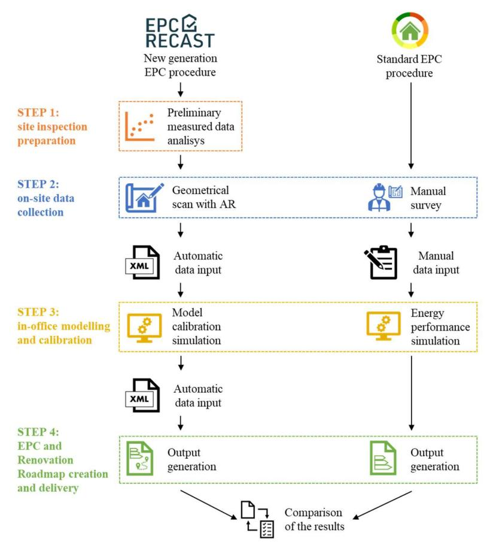

Fig. 1. EPC RECAST testing method. Authors' elaboration.

### 1 The Quantitative Verification Strategy

The Quantitative Verification Strategy is a procedure defined within the EPC RECAST project to verify the effective improvement of the EPC RECAST calculation process for the building energy consumption assessment. It is based on eight different Evaluation Strategies, namely an energy consumption comparison between the elements of the new generation EPC and the standard one in terms of climatic and building use conditions, input data collection method, calculation method, and output generation process. One of the comparisons focuses on the benchmark between the calculated energy consumption values and the measured ones, obtained by the Long-Term Monitoring (LTM) campaign on the specific case study, to assess the reliability of the EPC RECAST data through the overall procedure from collection and modelling to the final data assessment of the new generation EPC.

In particular, the case studies selected for the monitoring have been equipped with several LoRaWAN sensors for collecting long-term data. LoRaWAN is the protocol that runs "on top of" the LoRa (short for Long Range) modulation which manages the network connectivity. In other words, LoRa is a new and emerging wireless standard and LoRaWAN is the wireless sensors that provide ultra-long range to industry standard gateways. The collected data concern actual energy consumption and indoor conditions and they will be used in energy model calibration for further assessing the reliability of the EPC RECAST approach.

Fig. 2 graphically represents the elements considered within the Evaluation Strategies, clustered by three main areas: (1) climatic and building use conditions, (2) data collection, (3) calculation tool.

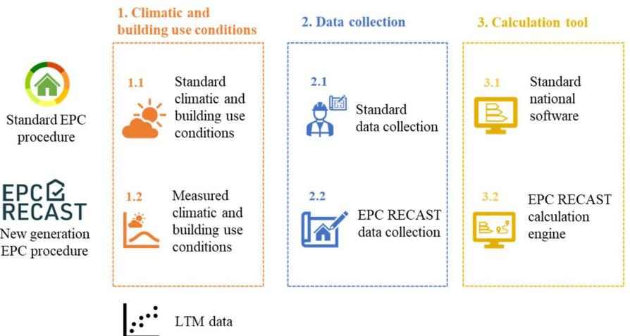

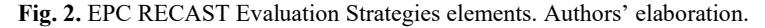

For the first area, the elements considered for the standard EPC and the new generation one are respectively: (1.1) standard climatic and building use conditions, namely the weather data and the standard occupancy profiles reported in the national regulations for the energy consumption calculation in residential buildings or the weather file recorded by the national weather stations, and (1.2) measured climatic and building use conditions, represented by the outdoor temperature and humidity data obtained through LTM and by the occupancy profiles extrapolated from the measured indoor temperature and energy consumption data. For the second area: (2.1) standard data collection, namely the national procedure currently in use in each country for collecting input data about the building or dwelling geometry, envelope and plant systems' characteristics, and (2.2) EPC RECAST data collection, carried out using an Augmented Reality geometrical scan which directly collects in the building or dwelling 3D model all the information about the envelope and plant systems' characteristics. Finally for the third area: (3.1) standard national software, namely the calculation tool currently in use in each country for the energy consumption assessment, and (3.2) the EPC RECAST calculation engine, based on an online interface automatically filled in through the XML file generated by the scanning tool.

Combining the elements described above, each Evaluation Strategy allows to compare the reliability and effectiveness of a specific phase of the EPC RECAST testing method, as well as of the whole process, from a technical and quantitative point of view. The first Evaluation Strategy, presented in Fig. 3, compares the energy consumption calculated through the new generation procedure, apart from model calibration, with the energy consumption measured through the LTM campaign. Its objective is to evaluate the reliability of the EPC RECAST process when it involves a non-calibrated numerical model.

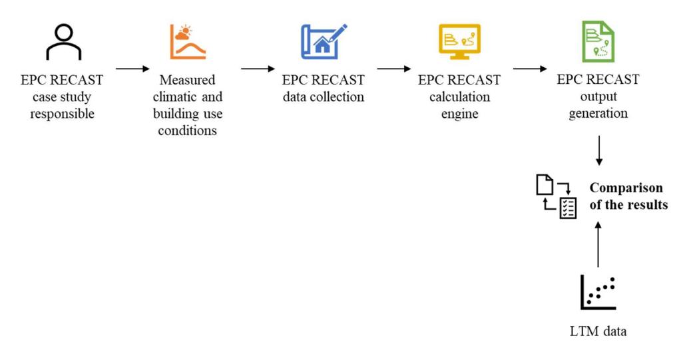

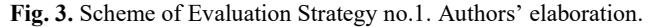

The second Evaluation Strategy allows instead the comparison between the energy consumption calculated through the whole new generation procedure, including the model calibration, and the energy consumption measured through the LTM campaign. Its objective is to assess the impact of using a calibrated numerical model.

The third Evaluation Strategy compares the energy consumption calculated through the new generation procedure with the energy consumption calculated through the new generation procedure combined with the standard data collection. Moreover, this Evaluation Strategy benchmarks the results of the two calculations with the energy consumption measured through the LTM campaign. Its objective is the assessment of the EPC RECAST data collection's impact.

The fourth Evaluation Strategy allows the comparison between the energy consumption calculated through the new generation procedure and the energy consumption calculated through the standard national procedure. Its objective is to evaluate the reliability of the EPC RECAST process.

The fifth Evaluation Strategy compares the energy consumption calculated through the standard national procedure with the energy consumption calculated through the new generation procedure combined with the standard national software. Its objective is the impact assessment of the EPC RECAST data collection within the standard national procedure for issuing an Energy Performance Certificate.

The sixth Evaluation Strategy compares the energy consumption calculated through the new generation procedure and the energy consumption calculated through the standard national procedure combined with the EPC RECAST calculation engine. Its objective is to assess the impact of EPC RECAST data collection within the new generation procedure.

The seventh Evaluation Strategy compares the energy consumption calculated through the standard national procedure with the energy consumption calculated through the new generation procedure combined with the standard data collection. Its objective is to evaluate the reliability of the EPC RECAST process when the data are collected through the standard method currently in use in each country.

Finally, the eighth Evaluation Strategy, graphically summarized in Fig. 4, allows the comparison between the energy consumption calculated through the new generation procedure and the energy consumption calculated through the standard national procedure combined with the EPC RECAST data collection. Its objective is to evaluate the reliability of the EPC RECAST calculation engine when the data are collected through the new generation method proposed within the project.

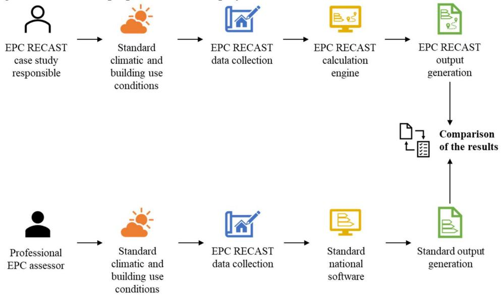

Fig. 4. Scheme of Evaluation Strategy no.8. Authors' elaboration.

The application of the Evaluation Strategies in each case study has been a milestone for the proof of concept of the overall EPC RECAST approach and case by case one of the eight strategies has been selected depending on its specific characteristics and the preliminary data analysis on the measured data.

# 3 Case studies for the application of the testing approach

The applicability of the developed methodology has been one of the main important goals to reach since the definition of the project, for this reason, the testing approach, described in the previous section, has been applied to several case studies in 6 EU countries corresponding to the EPC RECAST consortium partner countries (France, Germany, Italy, Luxembourg, Slovakia and Spain). In some cases, for each recruited building there is only one dwelling, while in some other cases, there is more than one, so the EPC RECAST testing approach will be applied to a total of 81 dwellings, corresponding to a total of 57 buildings. Fig. 5 presents the distribution of the case studies in the six EU countries and highlights the number of dwellings where Long-Term Monitoring is undergoing. The different case studies have been selected to be representative of the European building stock in terms of construction types and materials, building typologies, energy performance, heating and DHW systems, energy carriers, climate conditions, etc. To analyse a wide variety of the above-mentioned technical features, the case studies have been selected among buildings or dwellings constructed in different periods from 1900 to today and subjected to different levels of renovation actions.

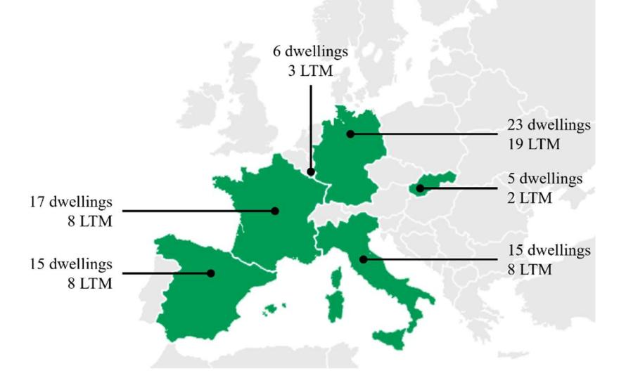

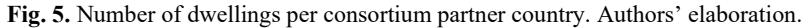

In the following subsection the current state of progress about the application of the testing approach to an Italian case study is presented.

## 1 Application of the methodology in a real case study

The case study described in this section has the goal to show and discuss the status of the testing approach validation on a residential building in Italy.

Specifically, the selected case study is an apartment in a multifamily building built in 2008 located in Lombardy Region. It is a three-room flat on the last floor of the building, composed of a living room with a kitchen, two bedrooms, and a bathroom (Fig. 6) and with a habitable surface of 66 m2 (165 m3 of volume). Moreover, the property is completed by a private terrace onto which all the rooms' windows open.

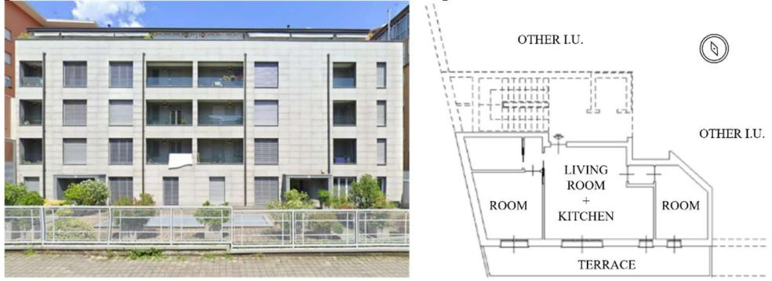

Fig. 6. Italian case study: façade view and plan. Authors' elaboration.

The building has a traditional reinforced concrete structure for pillars and beams, while the envelope is realized with different layers. The external walls are made of bricks, completed with polystyrene insulation and plaster coating on the outside and with rockwool insulation and plasterboard on the inside. The roof is instead composed by wood boards, with polystyrene insulation and metallic sheet finishing. Finally, the floor is made of an insulated concrete slab. To complete the envelope, double glazing windows with aluminium frame are installed everywhere. As regards the plant systems, the apartment is heated and cooled with a radiant floor powered by a centralized gas boiler in the winter season and by a centralized electrical cooling system in summer. Moreover, the flat is equipped with a single flux centralized mechanical ventilation system, while the DHW is produced by a centralized gas boiler and solar panel collectors.

The case study is part of the buildings and dwellings selected for the Long-Term Monitoring campaign, therefore, according to its plant systems' characteristics, the following set of sensors has been installed for collecting data about the climatic conditions and the energy vectors for heating, cooling, DHW and electricity: (i) an optical pulse sensor on the electrical meter for reading the hourly consumption, (ii) ultrasonic flow meters for DHW and heating mass flow detection, (iii) temperature sensors for measuring DHW and heating inlet and outlet water temperature, (iv) temperature and humidity sensors for measuring the indoor and outdoor climatic conditions. All the collected data are sent via router to the EPC RECAST monitoring platform through a dedicated LoRaWAN network. In addition to the installed sensors, the energy and water consumption of the case study are also monitored through the smart meter already present in the dwelling. For both the monitoring solutions, the data have been collected for more than one year, from February 2022 to November 2023.

The first step of the testing method (site inspection preparation) includes the preliminary analysis of the measured data collected through the Long-Term Monitoring campaign.

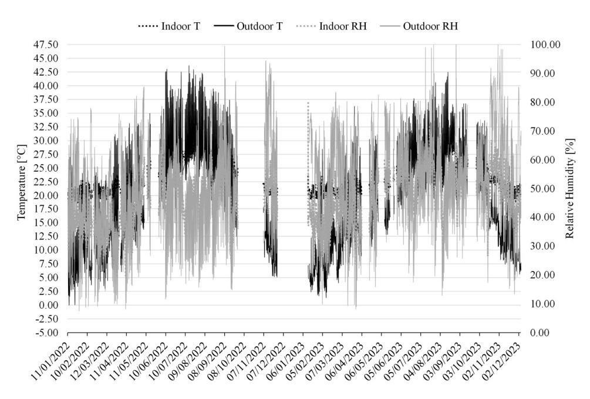

Fig. 7. Italian case study, temperature/humidity over time graph. The heating period indoor and outdoor mean temperatures are respectively equal to 21.26°C and 12.63°C, while the cooling period indoor and outdoor mean temperatures are respectively equal to 26.76°C and 26.55°C. Authors' elaboration.

The indoor and outdoor climatic conditions, registered by the installed sensors with an hourly timestep, allow to understand the relationship between the energy consumption for heating and cooling and the indoor-outdoor temperature difference.

Therefore, besides the temperature/humidity over time graph presented in Fig. 7, a more detailed analysis has been carried out calculating the mean indoor and outdoor temperatures registered during the heating period, defined by DPR 412/1993 [19] from 15th October to 15th April for Lecco (climate zone E) and during the cooling period, set from the end of May to the end of September based on experience.

As regards the energy consumption, the measured data for thermal energy has been collected through the smart meter and therefore the values corresponding to heating, cooling and DHW can be read separately. Presenting the consumptions both for thermal and electrical energy, Fig. 8 highlights a small difference between the energy consumption for heating and cooling, while the highest amount of energy is used for lighting, cooking, and appliances.

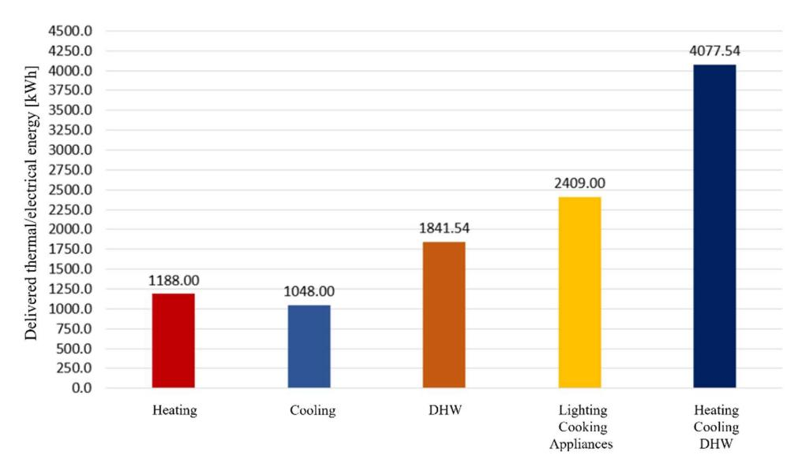

Fig. 8. Italian case study, thermal and electrical energy consumption measured between February 2022 and November 2023. Authors' elaboration.

In the context of EPC RECAST project, the measured data presented above allows to make a realistic correlation between the energy simulation of the apartment and what happens in real conditions. In particular, the outdoor climatic conditions are useful to understand the influence of the case study's specific location and of its surroundings on the standard simulation conditions currently in use in Italy, while the indoor temperature and humidity data allows to analyse the real condition of building use set by the occupants.

Finally, the measured data referred to the energy consumption will be used at the end of the testing approach to verify the effective reliability of the EPC RECAST methodology.

During the second step of the testing method (on-site data collection), the case study responsible collected the apartment geometrical data through the augmented reality scanner (Fig. 9 and Fig. 10) provided by the partner BIMEO, which allowed a fast survey of each room element (e.g., walls, floor, ceiling, windows, and doors).

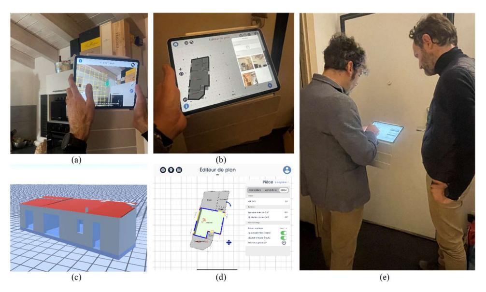

Fig. 9. Italian case study, on-site data collection using BIMEO app, (a) room scanning, (b) 2D geometrical model of the apartment, (c) 3D geometrical model of the apartment, (d) information automatically collected through the scanning of a room, (e) EPC RECAST case study responsible showing the scanning tool to the EPC assessor. Authors' elaboration.

| $\circ\circ\bullet$ | Éditeur de plan  |                                             | < Fermer                  | Questionnaire projet                      |
|---------------------|------------------|---------------------------------------------|---------------------------|-------------------------------------------|
|                     |                  | Mur Enregistrer                             |                           | Questionnaire objet Mes questionnaires |
|                     |                  | Informations Annotations Ecition            | Q Rechercher           |                                           |
|                     | <b>Bottoom</b>   | ANVARRA                                     | EPC_Wall-V0               | $\Box$ Copler $\Box$ Copler $\vee$        |
|                     | <b>Florest</b>   | 42€ toronie (m)                          |                           |                                           |
|                     | maria diam'r. | 215 Epokseur du mui estèrieur (m)        | · ThermalFunction         |                                           |
|                     |                  | <b>ERP</b> @ fpoisseur de la cicisen (m) | internal                  |                                           |
|                     |                  | <b>Governor</b>                             |                           |                                           |
|                     | <b>S</b>         | $\oplus$ Ajouter une porte               | · RetrofitYear            |                                           |
|                     |                  | Alcune una fonditio                         | <b>Bibles volvo bento</b> |                                           |
|                     |                  | $\bigoplus$ Apuder use porte-teneze      |                           |                                           |
|                     |                  | Renaent                                     |                           |                                           |
|                     | Suprimoniant     | $\bigoplus$ Abudes un rampord.           | · OutdoorColor            |                                           |
|                     |                  |                                             | Write                     |                                           |
|                     |                  |                                             |                           |                                           |
|                     |                  |                                             | · InsulationPosition      |                                           |
|                     |                  |                                             | Distributedneulotion      | $\sim$                                    |
|                     |                  |                                             |                           |                                           |
|                     | (a)              |                                             |                           | (b)                                       |

Fig. 10. Italian case study, geometrical model enrichment, (a) information automatically collected through the scanning of a wall, (b) wall's questionnaire. Authors' elaboration.

In parallel to the EPC RECAST data collection procedure by the BIMEO app, the EPC assessor performs the geometrical survey through the standard national procedure currently in use in Italy, which is commonly done using a tape measure or laser meter and manually collecting additional information from the owner about building materials, thermal properties, and plant systems characteristics.

The enriched geometrical data collected on-site by the case study responsible, and the information collected by the EPC assessor, have then been used as input for the respective calculation tools (Fig. 11).

The EPC RECAST process automatically generates an XML file of the data collected onsite, which has been imported into the calculation engine. This tool is structured as an online interface in which the case study responsible can check all the data and eventually add/modify some information, keeping in mind that the unknown values are calculated as mean values from related standards/regulations.

In the current practice, the EPC assessor needs, instead, to proceed with a manual sketchbased survey and build the model using a standard national calculation tool, where he/she manually adds all the technical information collected during the on-site inspection.

Referring to the Fig. 1, the current state of validation of the EPC RECAST testing method has completed Step 1 and Step 2.

The following steps foresee the data mining of the inputs collected in Step 2 to model and calibrate the results, which will become inputs for the Renovation Roadmap development and the assessment through the Quantitative Verification Strategy of Step 4.

| https://epc-recast.dimn-cstb.fr/projet ò                                                     |                                                        |                                                               |                         |                                          |                                |              |                          |                |                  |                 |             |
|-------------------------------------------------------------------------------------------------|--------------------------------------------------------|---------------------------------------------------------------|-------------------------|------------------------------------------|--------------------------------|--------------|--------------------------|----------------|------------------|-----------------|-------------|
| EPCC RECAST E+ Exporter le projet (*.json)                                                | Importer un projet (*.json)                            | <b>B</b> Enregistrer une copie O                   |                         |                                          |                                |              |                          |                |                  |                 |             |
| Données du projet                                                                               | Afficher tous les noeuds                               | Name *                                             |                         | WL 0_1                                   |                                |              |                          |                |                  |                 |             |
| Project                                                                                         |                                                        |                                                               |                         |                                          |                                |              |                          |                |                  |                 |             |
| • BuildingLocation                                                                              |                                                        | ThermalFunction +                                  |                         | External                                 |                                |              |                          |                |                  |                 |             |
| Location                                                                                        |                                                        |                                                               |                         |                                          |                                |              |                          |                |                  |                 |             |
| <b>v</b> BuildingList                                                                           |                                                        | Area *                                             |                         |                                          |                                |              |                          |                |                  |                 |             |
| · Building                                                                                      |                                                        |                                                               |                         |                                          |                                |              |                          |                |                  |                 |             |
| <b>v</b> WallList                                                                               |                                                        | Perimeter O*                                       |                         |                                          |                                |              |                          |                |                  |                 |             |
| Wall                                                                                            |                                                        |                                                               |                         |                                          |                                |              |                          |                |                  |                 |             |
| Wall                                                                                            |                                                        |                                                               |                         |                                          |                                |              |                          |                |                  |                 |             |
| Wall                                                                                            |                                                        | RetrofitYear O*                                    |                         |                                          |                                |              |                          |                |                  |                 |             |
|                                                                                                 |                                                        |                                                               |                         |                                          |                                |              |                          |                |                  |                 |             |
| Wall                                                                                            |                                                        | MainLayerMaterial *                                |                         | HollowBrick                              |                                |              |                          |                |                  |                 |             |
| Wall                                                                                            |                                                        |                                                               |                         |                                          |                                |              |                          |                |                  |                 |             |
| Wall                                                                                            |                                                        | MainLayerThickness O*                              |                         | 12                                       |                                |              |                          |                |                  |                 |             |
| <b>v</b> FloorList                                                                              |                                                        |                                                               |                         |                                          |                                |              |                          |                |                  |                 |             |
| Floor                                                                                           |                                                        | InsulationPosition +                               |                         |                                          |                                |              |                          |                |                  |                 |             |
| <b>v</b> RoofList                                                                               |                                                        |                                                               |                         |                                          | DistributedInsulation          |              |                          |                |                  |                 |             |
| Roof                                                                                            |                                                        |                                                               |                         |                                          |                                |              |                          |                |                  |                 |             |
| ▼ WindowsList                                                                                   |                                                        | InsulationThickness ®                              |                         | 15                                       |                                |              |                          |                |                  |                 |             |
| Window                                                                                          |                                                        |                                                               |                         |                                          |                                |              |                          |                |                  |                 |             |
| Window                                                                                          |                                                        | InsulationThermalResistance ®                      |                         | 3,890                                    |                                |              |                          |                |                  |                 |             |
| Window                                                                                          |                                                        |                                                               |                         |                                          |                                |              |                          |                |                  |                 |             |
|                                                                                                 |                                                        |                                                               |                         |                                          |                                |              |                          |                |                  |                 |             |
| Lancer la simulation PC Recast CSTB   @ 2023 (a)                                          |                                                        | ThermalTransmittance ® *                           |                         | 0,223                                    |                                |              |                          |                |                  |                 | Version 1.0 |
| File ß ш ÷ s m <b>Inferite</b> Archivia Nueve <b>Parete</b> Porta | Cin. H.  1  Serramento Solaio Coperture | 403 P Ponte Vetro Six farmer                      | ø Cassonette         | ß $+$                                 | $\mathsf{o}_{\mathsf{o}}$ B | (7) Auto     |                          |                |                  |                 |             |
| Archivio GENERALE                                                                               |                                                        | Archivio della RELAZIONE CORRENTE                             |                         |                                          | Stamps                         |              |                          |                |                  |                 |             |
|                                                                                                 |                                                        | Seleziona o crea le strutture dell'edificio                   |                         |                                          |                                |              |                          |                |                  |                 |             |
| <b>D</b> Archivio generale                                                                      | Strutture dell'edificio                                |                                                               |                         |                                          |                                |              |                          |                |                  |                 |             |
| Digita il testo da ricercare                                                                    | $x \mid z$ a F a V Ordina per                       |                                                               |                         | · Digita il testo da ricercare           |                                |              |                          |                |                  |                 | $x$ ;       |
| Nome della struttura                                                                            | $\sim$ $\sim$                                          | Struttuna                                                     | Codice                  | Tipo                                     | Verso                          | $\sim$       | $\Lambda$                | $U/\psi$       | $\epsilon$       | Uso             | Note        |
| <b>ARCHIVIO GENERALE</b>                                                                        | - III Pareti                                           |                                                               |                         |                                          |                                |              |                          |                |                  |                 |             |
| Strutture dell'archivio del programma - III Pareti                                           | $\,$                                                   | Parete esterna 40 cm Parete esterna principale 40 cm       |                         | $PAROO9 = Parete$ PAROTO = Parete     | Esterno Esterno             | 40.0 40.0 |                          | 0.443 0.443 | 34.702 34,702 | 34.12 238.35 |             |
| > Esterno                                                                                       |                                                        | parete interrato confinante con altr                          |                         | PAROO4 = Parete                          | Amb. confinante                | 30.0         |                          | 2.322          | 78.710           | 61.98           |             |
| > El Terreno                                                                                    |                                                        | Tramezzo interno                                              |                         | PAROD2 = Parete                          | Interno                        | 11.0         | $\overline{\phantom{a}}$ | 2.383          | 36,139           | 198.20          |             |
| > B Edificio confinante riscaldato                                                              |                                                        | - Il Intranezzo interno copertura piana (soffitto) (U=0.2  | <b>PAR002</b>           | <b>Parete</b>                            | Esterno                        | 33.5         |                          | 0.250          | 69.991           |                 |             |
| > B Da ZNR verso esterno <b>El Locale interno alla zona</b>                                  |                                                        | Parete esterna 40 cm (U=0.300)                                | <b>PAR003</b>           | [ Parete                                 | Esterno                        | 40.0         |                          | 0.300          | 34,702           |                 |             |
| > Bi Porte                                                                                      |                                                        | Parete esterna principale 40 cm (                             | PAROO4                  | [ Parete                                 | Esterno                        | 40.0         | ٠                        | 0.300          | 34.702           |                 |             |
| > Bij Cassonetti                                                                                |                                                        | soffitto interpiano ceramica (U=0., PAR005 tetto (U=0.250) |                         | <b>[</b> Parete                          | Esterno Esterno             | 36.3 21.0 | ä, ٠                  | 0.250 0.250 | 82.921 43,907 |                 |             |
| > k Pavimenti                                                                                   |                                                        |                                                               |                         | PAROO6   Parete                          |                                |              |                          |                |                  |                 |             |
| $\rightarrow \frac{1}{k}$ Soffitti                                                              | 4 □ Porte ×                              | Portonono blindato verso esterno                              | $PORO_{\infty}$ = Porta |                                          | Esterno                        | 0.7          |                          | 3.716          | 1,820            | 1.89            |             |
| > Coperture > Vetri                                                                          | 4 点 Pavimenti                                          |                                                               |                         |                                          |                                |              |                          |                |                  |                 |             |
| >    Serramenti                                                                                 |                                                        | pavi su vesp areato                                           |                         | PAVOO6 = Pavimento                       | Terreno                        | 24.5         |                          | 0.498          | 63,060           | 120.30          |             |
| Ponti termid                                                                                    |                                                        | pavimento interpiano ceramica                                 |                         | PAVOOS = Pavimento                       | Interno                        | 36.3         |                          | 0.427          | 62.372           | 104.69          |             |
| <b>I MIEI PROGETTI</b> í.                                                                    | a                                                      | pavimento interpiano parq                                     |                         | $PMVO08 = \text{Pavimento}$              | Interno                        | 36.3         |                          | 0.403          | 40,031           | 76.21           |             |
| C:\Users\graziano.salva'ai\Documents\,\Progetti                                                 | " Soffitti                                             |                                                               |                         | SOF012 = Soffitto Orizzontale            | Esterno                        | 33.5         |                          | 1571           | 69.991           | 48.38           |             |
| <b>ABACO DELLE STRUTTURE UNI 11552</b>                                                          |                                                        | copertura piana (soffitto) soffitto interpiano ceramica    |                         | SOF011 = Soffitto Orizzontale            | Esterno                        | 36.3         |                          | 0,429          | 82,921           | 176,61          |             |
| to delle strutture costituenti l'involuero opaco degli edifici                                  | Coperture                                              |                                                               |                         |                                          |                                |              |                          |                |                  |                 |             |
| <b>VERSIONI PRECEDENTI</b>                                                                      | copertura ٠                                         |                                                               |                         | !!!!!!!!!!!!!!!!!!!!!!!!!!!!!!!!!!!!!!!! | Esterno                        | 33.5         |                          |                | 1,571 69,991     | 80.75           |             |
| Archivi delle versioni precedenti di TERMOLOG $^{+}$                                         | - Il Intervento                                        |                                                               |                         |                                          | ٣A                             |              |                          |                |                  |                 |             |

Fig. 11. Italian case study, calculation tools, (a) EPC RECAST online interface, (b) standard national calculation tool (TERMOLOG by Logical Soft). Authors' elaboration.

# 4 Conclusions

The present work provides an overview of the research activities of the EPC RECAST project related to the development of the new generation EPC, with a focus on the testing and verification phase of the developed approach through its application in real case studies. The specific case study described in the paper allows to assess both the applicability of the testing approach at its current state of progress and the limits and potentialities for improvement of EPCs as key tools towards the decarbonization of the building sector. Two out of four steps of the developed methodology have been applied and validated. The collection of Long-Term Monitoring data through the IoT sensors in fact has proved to be affordable in terms of costs and at the same time reliable in terms of data quality and amount of storable information and the data collection tool proved its rapidity and adequate precision in scanning rooms of different dimensions and complexity. Moreover, the potentiality of the questionnaires and the georeferenced photos for the geometrical data enrichment avoids the loss of information, which is recorded by professionals as a very common barrier in the current practice. The complete validation of the methodology will be the subject of future publications once the two remaining steps will be applied and verified.

Regarding the improvement of EPCs, the state of progress of the EPC RECAST testing approach identifies the monitoring of real conditions (such as weather and internal set point and use conditions) as a critical element, not considered in the current Italian certification schemes, but potentially able to increase the reliability of the building's energy assessment as well as the reliability of the certificate from the user's perspective, providing an easy-tounderstand parameter directly related to the operational costs faced by the occupants.

Fundings: This work was supported by the Horizon 2020 research and innovation program of the European Commission, under Grant No. 893118.

Data availability statement: The data that support the findings of this study are available on request from the corresponding author.

Author contribution statement: Graziano Salvalai and Marta Maria Sesana: Conceptualization, Data curation, Investigation, Methodology, Supervision, Writing – original draft, Writing – review & editing. Ilaria Isacco: Data curation, Visualization, Writing – original draft.

## References

- 1. European Commission, Communication from the Commission to the European Parliament, the European Council, the Council, the European Economic and Social Committee and the Committee of the Regions, The European Green Deal, COM(2019) 640 final (2019).
- 2. European Commission, Commission welcomes political agreement on new rules to boost energy performance of buildings across the EU, European Commission – Press release (2023).
- 3. European Commission, Annexes to the Proposal for a Directive of the European Parliament and of the Council on the energy performance of buildings (recast), COM(2021) 802 final (2021).
- 4. EPC RECAST: Energy Performance Certificate Recast (2020-2024), Grant Agreement (GA) No: 893118, last accessed: December 2023, https://epc-recast.eu/
- 5. QualDeEPC: High-quality Energy Performance Assessment and Certification in Europe Accelerating Deep Energy Renovation (2019-2023), Grant Agreement (GA) No: 847100, last accessed: December 2023, https://qualdeepc.eu/

- 6. U-CERT: Towards a new generation of user-centered Energy Performance Assessment and Certification; facilitated and empowered by the EPB Center (2019-2023), Grant Agreement (GA) No: 839937, last accessed: December 2023, https://u-certproject.eu/
- 7. X-tendo: eXTENDing the energy performance assessment and certification schemes via a mOdular approach (2019-2022), Grant Agreement (GA) No: 845958, last accessed: December 2023, https://x-tendo.eu/
- 8. D^2EPC: Next-generation Dynamic Digital EPCs for Enhanced Quality and User Awareness (2020-2023), Grant Agreement (GA) No: 892984, last accessed: December 2023, https://www.d2epc.eu/en
- 9. E-DYCE: Energy flexible DYnamic building CErtification (2020-2023), Grant Agreement (GA) No: 893945, last accessed: December 2023, https://edyce.eu/
- 10. ePANACEA: Smart European Energy Performance AssessmeNt And CErtificAtion (2020-2023), Grant Agreement (GA) No: 892421, last accessed: December 2023, https://epanacea.eu/
- 11. crossCert: Cross Assessment of Energy Certificates in Europe (2021-2024), Grant Agreement (GA) No: 101033778, last accessed: December 2023, https://www.crosscert.eu/
- 12. EUB SuperHub: European Building Sustainability performance and energy certification Hub (2021-2024), Grant Agreement (GA) No: 101033916, last accessed: December 2023, https://eubsuperhub.eu/
- 13. iBRoad2EPC: Integrating Building Renovation Passports into Energy Performance Certification schemes for a decarbonised building stock (2021-2024), Grant Agreement (GA) No: 101033781, last accessed: December 2023, https://ibroad2epc.eu/
- 14. TIMEPAC: Towards innovative methods for energy performance assessment and certification of buildings (2021-2024), Grant Agreement (GA) No: 101033819, last accessed: December 2023, https://timepac.eu/
- 15. CHRONICLE: Building Performance Digitalisation and Dynamic Logbooks for Future Value-Driven Services (2022-2025), Grant Agreement (GA) No: 101069722, last accessed: December 2023, https://www.chronicle-project.eu/
- 16. SmartLivingEPC: Advanced Energy Performance Assessment towards Smart Living in Building and District Level (2022-2025), Grant Agreement (GA) No: 101069639, last accessed: December 2023, https://www.smartlivingepc.eu/en/
- 17. G. Salvalai, M.M. Sesana, Long-Term Monitoring Strategies for Increasing EPCs Reliability. Environ. Sci. Proc. 11, 16 (2021). https://doi.org/10.3390/environsciproc2021011016
- 18. G. Salvalai, M.M. Sesana, Monitoring Approaches for New-Generation Energy Performance Certificates in Residential Buildings. Buildings. 12, 469 (2022). https://doi.org/10.3390/buildings12040469
- 19. Italian Republic, Regolamento recante norme per la progettazione, l'installazione, l'esercizio e la manutenzione degli impianti termici degli edifici ai fini del contenimento dei consumi di energia, in attuazione dell'Art. 4, Comma 4, della Legge 9 gennaio 1991, n.10, DPR 26 agosto 1993, n. 412 (G.U. n.96 del 14/10/1993) (1993).
