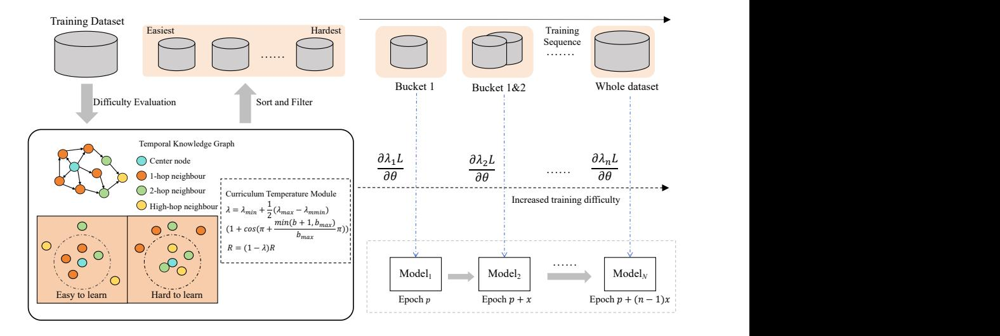
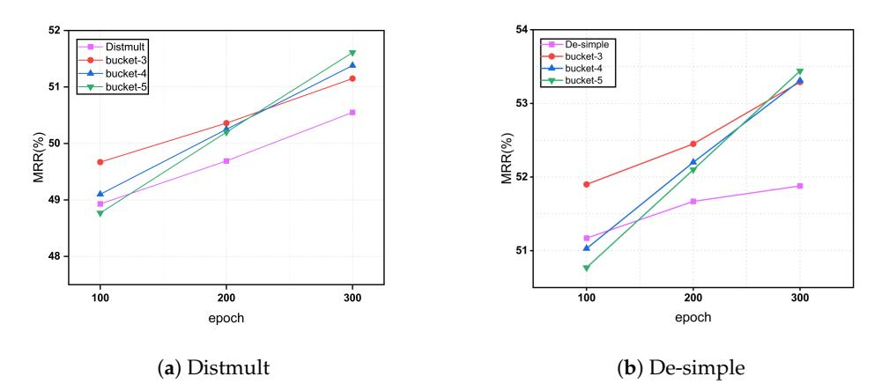
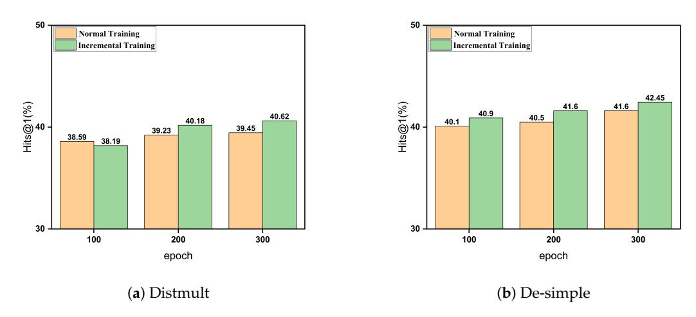

# *Article*Enhancing Temporal Knowledge Graph Representation with Curriculum Learning
**Yihe Liu, Yi Shen and Yuanfei Dai \***College of Computer and Information Engineering, Nanjing Tech University, Nanjing 211816, China; yihe\_liu@163.com (Y.L.); syhi5490@163.com (Y.S.)**\***Correspondence: daiyuanfei@njtech.edu.cn
**Abstract:**Temporal knowledge graph representation approaches encounter significant challenges in handling the complex dynamic relations among entities, relations, and time. These challenges include the high difficulty of training and poor generalization performance, particularly with large datasets. To address these issues, this paper introduces curriculum learning strategies from machine learning, aiming to improve learning efficiency through effective curriculum planning. The proposed framework constructs a high-dimensional filtering model based on graph-based high-order receptive fields and employs a scoring model that uses a curriculum temperature strategy to evaluate the difficulty of temporal knowledge graph data quadruples at each stage. By progressively expanding the receptive field and dynamically adjusting the difficulty of learning samples, the model can better understand and capture multi-level information within the graph structure, thereby improving its generalization capabilities. Additionally, a temperature factor is introduced during model training to optimize parameter gradients, alongside a gradually increasing training strategy to reduce training difficulty. Experiments on the benchmark datasets ICEWS14 and ICEWS05-15 demonstrate that this framework not only significantly enhances model performance on these datasets but also substantially reduces training convergence time.
**Keywords:**temporal knowledge graph; curriculum learning; difficulty evaluation

# 1. Introduction

Knowledge graphs (KGs), as multi-relational graphs, provide a structured representation of real-world events through factual data. Each fact in a knowledge graph is composed of two entities as nodes and the relation connecting these entities as edges. Due to their rich informational content, knowledge graphs have become increasingly popular in a variety of applications, including content-based recommendation systems [\[1,](#page-13-0)[2\]](#page-13-1), natural language question answering [\[3,](#page-13-2)[4\]](#page-13-3), and text-centric information retrieval [\[5,](#page-13-4)[6\]](#page-13-5).

As knowledge graphs continue to expand in scale, challenges like data sparsity and low computational efficiency have become more pronounced, making their application increasingly difficult. To address these issues, knowledge graph representation learning (KGRL) [\[7\]](#page-13-6) has been proposed. KGRL aims to map entities and relations into a continuous, low-dimensional semantic space, utilizing a fact-scoring function to evaluate the correctness of facts. This significantly enhances the cognitive and reasoning capabilities of knowledge graphs. KGRL has shown continuous development and widespread application in areas such as knowledge graph completion [\[8\]](#page-13-7), knowledge fusion [\[9\]](#page-13-8), knowledge reasoning [\[10\]](#page-13-9), and entity alignment [\[11\]](#page-13-10). However, existing KGRL methods often fall short of capturing the temporal dynamics of facts, as they typically assume facts to be static.

Recently, the emergence of temporal knowledge graph completion (TKGC) methods [\[12](#page-13-11)[,13\]](#page-13-12) has addressed some limitations of traditional knowledge graph representation techniques by incorporating temporal information for more accurate link prediction. TKGC methods not only consider the facts themselves but also integrate the timestamps associated with these facts into the learning process. Empirical results have demonstrated
**Citation:**Liu, Y.; Shen, Y.; Dai, Y. Enhancing Temporal Knowledge Graph Representation with Curriculum Learning.*Electronics* **2024**, *13*, 3397. [https://doi.org/10.3390/](https://doi.org/10.3390/electronics13173397) [electronics13173397](https://doi.org/10.3390/electronics13173397)

Academic Editor: Stefano Ferilli

Received: 22 July 2024 Revised: 17 August 2024 Accepted: 22 August 2024 Published: 26 August 2024

**Copyright:**© 2024 by the authors. Licensee MDPI, Basel, Switzerland. This article is an open access article distributed under the terms and conditions of the Creative Commons Attribution (CC BY) license [\(https://](https://creativecommons.org/licenses/by/4.0/) [creativecommons.org/licenses/by/](https://creativecommons.org/licenses/by/4.0/) 4.0/).

that TKGC methods generally outperform traditional methods in terms of link prediction accuracy across multiple knowledge graph datasets. Nevertheless, these methods face significant challenges during training, as they must consider the complex dynamic interactions between entities, relations, and temporal information. This complexity increases the difficulty of training and often results in inadequate model performance. Additionally, temporal knowledge graphs, typically constructed from historical data, are often sparse and incomplete, further complicating the training process.

To mitigate these challenges, curriculum learning (CL) strategies have been introduced. The concept of curriculum learning, inspired by the human learning process, progresses from simple to complex tasks to smooth the learning curve and enhance the model's ability to grasp underlying knowledge. Numerous studies have shown that CL strategies can improve generalization performance, accelerate the optimization of non-convex objectives, and enhance convergence speed during the early stages of training, even when dealing with noisy data.

In this paper, we introduce the concept of curriculum learning to temporal knowledge graph embedding algorithms. By segmenting the training dataset into multiple groups based on difficulty evaluation, we enable a smoother learning process for the model. Initially, a difficulty assessor identifies the subset of quadruples with the lowest learning difficulty for training. Subsequently, employing the concept of curriculum temperature, we ensure that the model adapts well to the data difficulty at each stage. Additionally, we optimize parameter settings and training strategies to further enhance model performance and robustness.

Overall, the contributions of this paper are as follows:

- 1. The proposed framework introduces curriculum learning strategies to progressively increase data difficulty and complexity during training, thereby improving model performance in temporal knowledge graph tasks. It mimics the gradual learning process of humans, enabling the model to learn more effectively from complex dynamic relations.
- 2. Temporal knowledge graph datasets are segmented by difficulty to gradually increase data complexity during training. A difficulty assessor selects the least challenging data subset each round, using curriculum temperature to aid model adaptation. Adding optimized parameters and training strategies to the curriculum further enhances the model's performance and robustness, improving its ability to learn complex relations and its reliability in real-world applications.
- 3. Experimental results demonstrate that the proposed method within the framework of curriculum learning significantly improves the performance of temporal knowledge graph representation models. The method enhances generalization capabilities on incomplete and sparse datasets, exhibits good scalability, and demonstrates adaptability. It is worth emphasizing that this framework only alters the order of training samples during the model training process without changing the model itself. Therefore, this framework is applicable to the vast majority of datasets and approaches.

## 2. Related Work

The field of knowledge graph representation and temporal knowledge graph modeling has seen significant advancements in recent years, driven by the increasing importance of structured knowledge in various artificial intelligence applications. This section provides an overview of the key developments in three interconnected areas: static knowledge graph representation algorithms, temporal knowledge graph representation algorithms, and curriculum learning.

#*2.1. Static Knowledge Graph Representation Methods*Knowledge graph embedding models have been a focal point of research in recent years, aiming to transform entities and relations within knowledge graphs into lowdimensional vector representations that capture semantic information. These models

can be broadly categorized into two main types: translation models and rotation models. Translation models, pioneered by TransE [\[14\]](#page-13-13), represent relations as translations from head entities to tail entities in a continuous vector space. TransE's simple yet effective approach paved the way for numerous extensions. For instance, TransR [\[15\]](#page-13-14) introduced relation-specific projection matrices to map entities from entity space to relation space before performing translations, allowing for more flexible representations of complex relations. Additionally, TransH [\[16\]](#page-13-15) proposed representing each relation as a hyperplane, with entities projected onto this hyperplane for relation-specific representations. These advancements aimed to address TransE's limitations in handling complex relation patterns such as one-to-many, many-to-one, and many-to-many relations. On the other hand, rotation models, exemplified by RotatE [\[17\]](#page-14-0), took a different approach by defining each relation as a rotation from the source entity to the target entity in a complex vector space. This innovative method allowed the model to capture and infer various relational patterns simultaneously, including symmetry, asymmetry, inversion, and composition. RotatE's ability to represent these diverse patterns in a unified framework marked a significant advancement in knowledge graph embedding techniques.

Despite these advancements, traditional supervised methods often face limitations due to the finite number of training samples, resulting in suboptimal performance in practical applications. To address this issue, researchers have proposed semi-supervised learning approaches. IPTransE [\[18\]](#page-14-1) introduced an iterative alignment model that utilizes both translation and linear transformation models. This approach aligns entities by mapping them into a unified representation space through the joint embedding of translations, linear transformations, and shared parameters. Building on this concept, BootEA [\[19\]](#page-14-2) proposed a bootstrapping strategy to mitigate error accumulation during the iterative alignment process. By iteratively labeling new alignment pairs and updating the embedding model, BootEA achieves improved performance in entity alignment tasks.

However, it is important to note that these static knowledge graph embedding models often face significant challenges when dealing with temporal information. Static knowledge graphs do not inherently account for the temporal dynamics of the data, which can result in limitations when representing time-sensitive interactions and evolving relations between entities. For example, in a dynamic scenario where relations change over time, such as tracking the affiliations of a researcher, static models may struggle to accurately capture and represent these changes. This limitation highlights the need for more advanced methods that can effectively incorporate temporal information into knowledge graph embeddings.

##*2.2. Temporal Knowledge Graph Representation Methods*As the importance of temporal information in knowledge graphs became increasingly apparent, researchers began developing methods to incorporate time into knowledge graph embeddings. These temporal knowledge graph modeling approaches typically extend traditional triples to time-quadruples, where time-aware embedding vectors provide information about when facts hold true.

TTransE [\[20\]](#page-14-3) was one of the early attempts to extend the TransE method to include temporal information. It introduced a temporal translation vector for each timestamp, allowing the model to capture how relations between entities evolve over time. This approach opened up new possibilities for temporal reasoning in knowledge graphs.

To further enhance the representation capability of temporal knowledge graphs, Dist-Mult [\[21\]](#page-14-4) represented relations as diagonal matrices and applied temporal shifts to entity and relation embeddings using timestamps. This method generates time-aware embeddings that can capture the temporal evolution of entities and relations more effectively than static embeddings.

DE-SimplE [\[22\]](#page-14-5) took a more dynamic approach by introducing time-dependent representations for entities and relations. This model learns different embeddings for entities and relations at various timestamps, allowing it to capture their temporal evolution more

accurately. DE-SimplE's ability to model dynamic changes in entities and relations over time made it particularly effective for temporal knowledge graph completion tasks.

ATiSE [\[23\]](#page-14-6) incorporated a time decay function into its model, making embeddings sensitive not only to the current time but also to past and future times. This approach generates time-sensitive embeddings that can capture both short-term and long-term temporal dependencies in knowledge graphs. ATiSE's ability to model complex temporal patterns has made it a powerful tool for temporal link prediction and other time-aware tasks in knowledge graphs.

The methods described above have broad applications across various domains that rely on temporal knowledge graphs. For instance, in healthcare [\[24](#page-14-7)[,25\]](#page-14-8), temporal knowledge graphs can be used to track patient histories and predict future medical conditions based on past data. In social network analysis [\[26\]](#page-14-9), temporal knowledge graphs can model the dynamics of user interactions, helping to understand the evolution of social structures and predict future connections. These diverse applications highlight the versatility and importance of temporal knowledge graph representations in capturing and leveraging time-dependent relations across various domains.

#*2.3. Curriculum Learning*Curriculum Learning (CL), introduced by Bengio et al. [\[27\]](#page-14-10), aims to improve model performance by gradually introducing training samples from easy to hard, mimicking the human learning process. This approach has shown promise in various machine learning tasks, including knowledge graph representation learning.

Self-paced learning (SPL) [\[28\]](#page-14-11), an extension of curriculum learning, measures sample difficulty by training loss rather than relying on heuristic rules. This allows the model to adjust the curriculum based on its current training status, leading to more adaptive and efficient learning processes.

Subsequent research has proposed several supervised metrics to determine curricula, such as sample diversity [\[29\]](#page-14-12) and model prediction consistency [\[30\]](#page-14-13). These metrics provide different ways to assess the difficulty and importance of training samples, allowing for a more nuanced curriculum design.

Empirical and theoretical studies have provided various explanations for why CL improves generalization performance. For instance, studies like MentorNet [\[31\]](#page-14-14) and Co-teaching [\[32\]](#page-14-15) empirically found that using CL strategies yields better generalization performance when the training data contain noise. Some research [\[33\]](#page-14-16) offered theoretical explanations regarding denoising mechanisms, suggesting that CL learners perceive noisy samples as harder, thus spending less time on them and focusing more on clean, informative samples.

The application of curriculum learning to temporal knowledge graph representation is a relatively unexplored area, presenting an opportunity to combine the benefits of CL with the challenges of temporal modeling in knowledge graphs. This intersection forms the basis for our proposed framework, which aims to leverage curriculum learning strategies to enhance the performance and efficiency of temporal knowledge graph representation algorithms.

## 3. Temporal Knowledge Graph Representation

Curriculum learning is an approach that seeks to enhance model training by structuring the learning process from simple to complex tasks. In our framework, we apply this concept to temporal knowledge graph representation by dividing the dataset into subsets of increasing difficulty. For each training iteration, the framework selects a subset of training samples based on two key factors: optimal complexity metrics and the model's current performance. This adaptive selection process allows the model to gradually tackle more challenging aspects of the temporal knowledge graph, potentially leading to improved learning outcomes and generalization capabilities.

The overall framework of the model is shown in Figure [1.](#page-4-0) First, using a graph receptive field-based sphere model and a curriculum temperature radius filtering model, the quadruples in the temporal knowledge graph training dataset are divided by difficulty, and training begins with the easiest subset. Next, a gradient optimization strategy based on curriculum temperature and an incrementally progressive training strategy are used to train the temporal knowledge graph completion model for all required datasets in the current stage. The trained model then generates entity embedding vectors, which are used to re-evaluate and filter the remaining untrained datasets. These steps are repeated until the entire training dataset is fully trained, ensuring a gradual increase in task complexity throughout the learning process.

<!-- Image Description: This image details a curriculum learning approach. It shows a training dataset sorted by difficulty using a temporal knowledge graph. Easier examples are trained first, with increasing difficulty in subsequent training epochs. A formula for a curriculum temperature module is presented, controlling the difficulty increase. The diagram depicts a model iteratively trained on progressively harder data subsets, indicated by the "Modeli" boxes and equations showing the loss gradient with respect to a parameter θ. -->
**Figure 1.**The model's framework begins by classifying quaternions in the temporal knowledge graph's training dataset by difficulty using the ball model and radius screening model. Training starts with the easiest dataset. A gradient optimization strategy and incremental training strategy are then used to train the required datasets. The trained model generates embedding vectors to re-evaluate and filter the remaining datasets. These steps repeat until the entire dataset is trained.

##*3.1. Difficulty Evaluation*The difficulty evaluation process consists of two main components: node difficulty evaluation and curriculum temperature. These components work together to assess the complexity of quadruples in the temporal knowledge graph.

### 1.1. Node Difficulty Evaluation

For each entity node*ε*, its corresponding embedding vector in dimensional space R is denoted as **e**. We establish a high-dimensional model centered at **e***i*with a radius*R*, as shown in the following formula:

$$
\mathbf{B}(\mathbf{e}_i, R) = \{\mathbf{e}_i \mid d(\mathbf{e}_i, \mathbf{r}_j) < R\},\tag{1}
$$

where *d*(·) represents the distance function between two entity embedding vectors in high-dimensional space. This filters out nodes whose distances from the entity are less than *R*. To mitigate the effects of variance in different directions, the vectors are normalized, and the cosine distance is used to alleviate the curse of dimensionality in high-dimensional feature spaces.

To measure the consistency of a node with its neighbors, we introduce the concept of *k*-hop neighbors. If node *u*is a*k*-hop neighbor of node *v*in the temporal knowledge graph, there exists a path such that*u*is reachable from*v*in*k* steps. Let N*k* (*v*) denote the set of *k*-hop neighbors of node *v*. We define a function as follows:

$$
I_v(u, \mathcal{N}_k(v)) = \begin{cases} 1 & \text{if } u \in \mathbf{B}(v, R) \cup u \in \mathcal{N}_k(v) \\ 0 & \text{otherwise.} \end{cases}
$$
 (2)

We can then calculate the proportion of *k*-hop neighbors within the sphere, denoted as *Pk* (*v*):

$$
P_k(v) = \frac{1}{\mathcal{N}_k(v)} \sum_{u \in E} I_v(u, \mathcal{N}_k(v)), \tag{3}
$$

where |N*k* (*v*)| denotes the number of *k*-hop neighbors of node *v*, and E describes the set of the whole entity.

#### 1.2. Curriculum Temperature

The curriculum temperature concept is introduced to dynamically adjust the difficulty of training data as the model advances through different learning stages. This approach complements the node difficulty evaluation by providing a mechanism to control the overall complexity of the training set at each stage.

At different stages of curriculum learning training, the model's representation capabilities vary. In the early stages, the model's ability to represent data is limited, necessitating the addition of a scaling factor to dynamically filter training data:

$$
R_n = (1 - \lambda_n)R,\t\t(4)
$$

where *Rn*is the radius of the sphere model at training iteration*n*, and *λn*is a scaling factor.

At the beginning of training, the initial value of*λn*is set to 0 to allow the model to focus on learning fundamental knowledge without restrictions. As*λn*gradually increases, the model learns more advanced knowledge as training difficulty increases. Given the variable*N*, the average loss of the temporal knowledge graph completion model with respect to the curriculum temperature module *lossn*should decrease over time.

As learning progresses, the model, having acquired prior knowledge, generalizes better to new data, accelerating training and improving performance. Additionally, the value of*λn*is monotonically increasing and initially set to 0.

In this method,*λn* increases following a cosine schedule:

$$
\lambda_n = \lambda_{\min} + \frac{1}{2} (\lambda_{\max} - \lambda_{\min}) (1 + \cos \frac{1 + \min(T_n, T^*)}{T^*} \pi), \tag{5}
$$

where *λmax*and*λmin*are the range of*λ*, *T*∗ is a preset parameter representing the number of curriculum stages, and*Tn*describes the current learning period. Initially, we set*λ*to 0, and the value gradually increases to 1, maintaining this level until the end of training.

# 1.3. Difficulty for Quadruples

After integrating the course temperature and the difficulty of individual nodes, we propose an evaluation function for the quadruple*Di f f*(*s*):

$$
Diff(s) = \frac{D(h) + D(t)}{2} = 1 - \frac{P_k(h) + P_k(t)}{2},
$$
\n(6)

where *s* represents a quadruple (*h*,*r*, *t*, *τ*) in the temporal knowledge graph. This formula calculates the difficulty of a quadruple based on the average difficulty of its head and tail entities. The difficulty is inversely proportional to the proportion of k-hop neighbors within the sphere for each entity. As the temporal and spatial relations serve as the number of layers connecting the entities to the real world, the learning model's training continuously incorporates these relations, thereby aligning the entities *eh*and*et*more closely with their embeddings in the real world.

#*3.2. Curriculum Learning Framework*Building upon the difficult evaluation process, our curriculum learning framework organizes the training process into stages of increasing complexity. This approach mirrors real-world educational strategies, where students progress from basic concepts to more advanced topics.

For curriculum learning, the objective is to identify the training sample set at each stage with the lowest difficulty. We define stages from 0 to n, with stage 0 being the beginning. The training sample distribution at each stage is determined based on a difficulty estimation. According to the principles of curriculum learning, the training samples at a given stage should be simpler than those at the subsequent stage. Thus, the distribution at each stage is adjusted to reflect this, taking into account both easy and hard samples, with a higher probability assigned to easier samples.

Additionally, the diversity and information content of the training samples should increase with each stage. This aligns with the educational objective of gradually presenting more complex and diverse tasks, enabling students to progressively enhance their learning and understanding. This means that the model requires various optimization policies to adapt to the training data of different stages. Thus, the model can gradually adapt to the complexity of the data at each stage, enhancing the model's generalization ability and breaking the limits of traditional model training.

# 2.1. Parameter Optimization Strategy

Incorporating the curriculum temperature concept introduced earlier, we propose a simple and effective method for curriculum temperature relaxation learning. By directly relaxing the loss*L*according to the temperature schedule parameter*λ*, we can organize the sequential knowledge distillation tasks from easy to difficult, *L*→*λL*. Therefore, the parameter *θ*temp will be updated using the following formula:

$$
\theta_{temp} = \theta_{temp} - \mu \frac{\partial \lambda \theta}{\partial L}.
$$
 (7)

This scaling adjusts the loss function's magnitude, allowing the model to focus on simple tasks early in training and handle more complex tasks later, stabilizing training and improving performance.

## 2.2. Training Strategy Optimization

Curriculum learning starts training with simple data to avoid early-stage complexity. Simple initial training helps the model quickly establish basic pattern recognition, efficiently handling complex data later. Traditional curriculum learning uses fixed training iterations for each data group, failing to reflect incremental data complexity. To fully utilize training resources and reflect the incremental complexity of data, we introduce an incrementally progressive learning strategy. This strategy involves setting increasing training iterations for each stage:

$$
p_i = p_{\min} + (i - 1) \cdot x,\tag{8}
$$

where *pi*is the number of training rounds for stage i,*p*min is the minimum training rounds, and *x*is the incremental training rounds for each stage.

We then derive formulas to compare the total training time of our curriculum learning approach with a baseline method. This comparison is crucial to demonstrate the efficiency of our proposed method. In curriculum learning, dividing data into*b*buckets from easy to hard, each with*k*samples, requires*g*seconds to train each sample on a GPU. For baseline convergence, the model needs*p*training iterations. The total training time*G*(*g*) of the model is:

$$
G(g) = bkgp. \t\t(9)
$$

According to the curriculum learning framework, if the model trains with the established training rounds for each stage, the total training time required is:

$$
f(g) = \sum_{i=1}^{b} i k g p,
$$
\n(10)

which can be simplified to:

$$
f(g) = kg \left[ \sum_{i=1}^{b} (p_{\min} + (i - 1) \cdot x) \right],
$$
 (11)

resulting in:

$$
f(g) = \frac{kg \cdot b \cdot (b+1)}{2} \left( p_{\min} + \frac{(2b-2)x}{3} \right).
$$
 (12)

To fully utilize training resources, we hope that curriculum learning can achieve the same training effect as the baseline. Therefore, we need to verify whether the training time *G*(*g*) equals *f*(*g*). In this case, we can compare the effects of each stage's training and find that the total training time obtained by the baseline is equal to the total time of the progressive learning method with increasing training rounds and the difference between *p*min and *x*:

$$
p = \frac{(b+1)}{2} \left( p_{\min} + \frac{(2b-2)x}{3} \right).
$$
 (13)

From the formula, it can be seen that for *p*min and *x*, the multi-stage process is only related to the number of buckets *b*. The progressive increase in training rounds allows the model to gradually adapt to the current stage's learning and match the complexity of the task at each stage. This mode improves the model's generalization ability and breaks through the upper limit of model training.

# 2.3. Training Strategy

Algorithm [1](#page-8-0) outlines the implementation of our curriculum learning framework for temporal knowledge graph representation:

This algorithm implements the concepts discussed in the previous sections, including difficulty evaluation, curriculum temperature, and progressive training strategies. It iteratively refines the model by training on increasingly difficult subsets of the data, continuously optimizing the temporal knowledge graph representation. Specifically, we divide the training into multiple stages, each dealing with data of different difficulties, and progressively increase the training iterations. By calculating the optimized curriculum temperature using the proposed formula, we ensure that the model can gradually adapt to more complex tasks. The entire training process involves iterative refinement and model parameter updates, continuously optimizing the model to ultimately achieve a well-trained temporal knowledge graph representation.

The computational complexity of traditional TKGC methods is typically O(*MND*), where *M*is the number of training epochs,*N*is the total number of training samples, and*D* is the embedding dimension. For our proposed curriculum learning approach, the core complexity remains O(*MND*), as we still process all samples across multiple epochs. However, our method introduces additional computation: O(E log E) for difficulty evaluation to sort E entities based on their difficulty scores. This additional step does not significantly alter the overall asymptotic complexity, because the difficulty evaluation

step is performed only once at the beginning of the training process and periodically for re-evaluation, not at every iteration.

# Algorithm 1 Curriculum Learning Guided Temporal Knowledge Graph Representation

**Input:** *Atrain* = {*sm* = (*hm*,*rm*, *tm*, *τm*)}*m*∈ (1, · · · ,*M*) ; *bucket*; *Di f f*;*Abucket*= ∅;*K*; *λ*; *λmax*, *λmin*; *Pmin*; *x*;*batch*\_*num*;

**Output:**Fully Trained Temporal Knowledge Graph Representation Algorithm 1: Initialize parameter

- 2:**while** *i*≤*bucket* **do**- 3:*λ*=*λmin* + 1 2 (*λmax*−*λmin*)(1 + cos 1+min(*i*,*bucket*) *bucket π*)
- 4: **for** *j*= 1 to*M* **do**- 5:*Di f f*(*s*) = *D*(*hj* )+*D*(*tj*) 2

6:**end for**- 7:*A s* = sort(*Di f f*,*Atrain*) //After calculating the complexity of all quadruple according to Equations (1)–(6), sort the quadruple from smallest to largest according to complexity
- 8: *Abucket*=*Abucket*∪*A s*9:*Atrain*=*Atrain*−*Abucket*- 10:**for** *j*= 1 to*Pmin*+*x* **do**- 11:**for** *k*= 1 to*batch*\_*num* **do** *k*- 12:*Lk*=*L*(*s*,*θ*) //training model
- 13: **end for**- 14:**end for**- 15:*h*0 = 1 *M*∑*M m*=1 *sm*16:*θ*=*θ*−*αn* · Adagrad(*θ*, *h*0) 17: **end while**18:**return** *θ*It is worth noting that while the asymptotic complexity remains similar to traditional methods, the actual running time may slightly increase due to the additional computations involved in difficulty assessment and curriculum adjustments. However, this increase is offset by the improved model performance and reduced number of epochs required for convergence, as demonstrated in our experimental results.

# 4. Experimental Results and Analysis

This section presents a comprehensive evaluation of our proposed curriculum learning guided temporal knowledge graph representation framework. We begin by introducing the datasets and baseline models used for comparison. Following this, we provide detailed experimental results that demonstrate the effectiveness of our approach in terms of performance metrics and training efficiency. To gain deeper insights into the framework's components, we conduct an ablation study, examining the impact of various modules and design choices. Through these experiments and analyses, we aim to validate the efficacy of our proposed method and its potential for improving temporal knowledge graph representations.

##*4.1. Datasets and Baseline Models*

To validate the effectiveness of the proposed framework, we conducted experiments on several classic and popular temporal knowledge graph completion models, using two subsets of the ICEWS dataset: ICEWS14 and ICEWS0515. The baseline models include the dynamic embedding method De-SimplE [\[22\]](#page-14-5), the time series decomposition method ATiSE [\[23\]](#page-14-6), and the static knowledge graph embedding method DistMult [\[21\]](#page-14-4). Evaluation metrics include Hits@K (K = 1, 3, 10) and Mean Reciprocal Rank (MRR), which comprehensively assess the models' performance.

Hits@K refers to the proportion of correct entities ranked in the top K predictions, measuring the model's ability to include true facts among the top K candidates. The formula is as follows:

$$
\text{Hits@K} = \frac{1}{|D|} \sum_{i=1}^{|D|} \mathbb{1}(\text{rank}_i < K),\tag{14}
$$

where |*D*| is the total number of predictions, rank*i*is the rank position of the correct entity for the*i*-th prediction, and 1(·) is the indicator function.

Mean reciprocal rank (MRR) is defined as the average of the reciprocal ranks of the correct entities:

$$
MRR = \frac{1}{N} \sum_{i=1}^{N} \frac{1}{\text{rank}_i},
$$
\n(15)

where rank*i*is the rank position of the correct entity for the*i*-th prediction, and *N*is the total number of predictions.

###*4.2. Experimental Results*

Through replication of the baseline models, we observed convergence around 500 epochs for the three comparison models. To provide a comprehensive comparison, we evaluated our curriculum learning framework against the baseline models at 100, 200, and 300 epochs, ensuring equivalent training time for fair comparison. The results of these comparisons are shown in Tables [1](#page-9-0)[–4.](#page-10-0)

**Table 1.**Results of curriculum learning and baseline training with 100 epochs. Bold font indicates better scores between corresponding baseline model and its counterpart with curriculum learning.

|              | ICEWS14 |        |         |       |      |        | ICEWS0515 |         |       |        |  |
|--------------|---------|--------|---------|-------|------|--------|-----------|---------|-------|--------|--|
|              | Hits@1  | Hits@3 | Hits@10 | MRR   | Time | Hits@1 | Hits@3    | Hits@10 | MRR   | Time   |  |
| ATiSE        | 25.60   | 46.18  | 66.77   | 39.15 | 701  | 31.15  | 54.14     | 75.57   | 45.95 | 4706   |  |
| DistMult     | 37.57   | 55.29  | 70.64   | 48.93 | 1510 | 35.45  | 53.37     | 70.85   | 47.36 | 7621   |  |
| De-SimplE    | 39.84   | 57.95  | 72.61   | 51.17 | 2290 | 37.91  | 56.53     | 73.87   | 50.03 | 12,029 |  |
| ATiSE+CL     | 27.50   | 49.43  | 69.52   | 41.45 | 722  | 32.43  | 56.19     | 76.23   | 46.76 | 4353   |  |
| DistMult+CL  | 38.19   | 55.96  | 70.91   | 49.67 | 1463 | 35.72  | 53.24     | 70.17   | 47.33 | 7347   |  |
| De-SimplE+CL | 40.90   | 58.70  | 72.24   | 51.90 | 2334 | 38.32  | 56.99     | 74.01   | 50.42 | 12,564 |  |
**Table 2.** Results of curriculum learning and baseline training with 200 epochs. Bold font indicates better scores between corresponding baseline model and its counterpart with curriculum learning.

|              |        |        | ICEWS14 |       |      | ICEWS0515 |        |         |       |        |  |
|--------------|--------|--------|---------|-------|------|-----------|--------|---------|-------|--------|--|
|              | Hits@1 | Hits@3 | Hits@10 | MRR   | Time | Hits@1    | Hits@3 | Hits@10 | MRR   | Time   |  |
| ATiSE        | 33.44  | 55.25  | 72.92   | 46.92 | 1411 | 35.48     | 58.09  | 78.08   | 49.76 | 8235   |  |
| DistMult     | 38.64  | 56.28  | 70.74   | 49.70 | 3089 | 35.88     | 54.03  | 71.12   | 47.78 | 13,590 |  |
| De-SimplE    | 40.59  | 58.47  | 72.52   | 51.67 | 3245 | 38.21     | 56.92  | 74.18   | 50.37 | 23,640 |  |
| ATiSE+CL     | 33.67  | 56.14  | 73.37   | 47.24 | 1389 | 35.83     | 59.11  | 78.34   | 49.87 | 8754   |  |
| DistMult+CL  | 40.18  | 56.93  | 71.03   | 50.36 | 3324 | 36.45     | 54.76  | 71.43   | 48.24 | 13,654 |  |
| De-SimplE+CL | 41.63  | 59.23  | 72.31   | 52.45 | 3187 | 38.96     | 57.59  | 74.39   | 51.00 | 25,693 |  |

**Table 3.** Results of curriculum learning and baseline training with 300 epochs. Bold font indicates better scores between corresponding baseline model and its counterpart with curriculum learning.

|           | ICEWS14 |        |         |       |      |        | ICEWS0515 |         |       |        |  |
|-----------|---------|--------|---------|-------|------|--------|-----------|---------|-------|--------|--|
|           | Hits@1  | Hits@3 | Hits@10 | MRR   | Time | Hits@1 | Hits@3    | Hits@10 | MRR   | Time   |  |
| ATiSE     | 37.46   | 59.18  | 74.56   | 50.50 | 2147 | 36.86  | 59.56     | 78.77   | 51.03 | 12,367 |  |
| DistMult  | 39.93   | 56.96  | 70.65   | 50.55 | 4612 | 36.15  | 54.13     | 71.47   | 48.12 | 13,590 |  |
| De-SimplE | 40.77   | 58.84  | 72.22   | 51.88 | 5761 | 38.21  | 56.92     | 74.18   | 50.37 | 23,640 |  |

|              |        | Table 3. Cont. |         |       |      |           |        |         |       |        |
|--------------|--------|----------------|---------|-------|------|-----------|--------|---------|-------|--------|
|              |        | ICEWS14        |         |       |      | ICEWS0515 |        |         |       |        |
|              | Hits@1 | Hits@3         | Hits@10 | MRR   | Time | Hits@1    | Hits@3 | Hits@10 | MRR   | Time   |
| ATiSE+CL     | 38.82  | 60.66          | 75.26   | 51.94 | 2357 | 37.11     | 60.00  | 79.17   | 51.33 | 12,103 |
| DistMult+CL  | 40.62  | 57.71          | 71.23   | 51.15 | 4510 | 36.61     | 54.62  | 71.58   | 48.63 | 21,544 |
| De-SimplE+CL | 41.63  | 59.23          | 72.92   | 53.29 | 5801 | 39.54     | 58.64  | 75.18   | 51.54 | 32,845 |

**Table 4.**Convergence results of curriculum learning and baseline training. Bold font indicates better scores between corresponding baseline model and its counterpart with curriculum learning.

|              |        |        | ICEWS14 |       | ICEWS0515 |        |        |         |       |        |
|--------------|--------|--------|---------|-------|-----------|--------|--------|---------|-------|--------|
|              | Hits@1 | Hits@3 | Hits@10 | MRR   | time      | Hits@1 | Hits@3 | Hits@10 | MRR   | time   |
| ATiSE        | 41.28  | 62.00  | 75.51   | 53.32 | 3556      | 37.09  | 60.45  | 79.29   | 51.48 | 20,545 |
| DistMult     | 39.29  | 57.30  | 70.72   | 50.76 | 6331      | 36.52  | 54.53  | 71.68   | 48.34 | 33,334 |
| De-SimplE    | 41.22  | 59.82  | 72.37   | 52.21 | 8936      | 39.07  | 57.67  | 74.74   | 51.14 | 57,340 |
| ATiSE+CL     | 38.82  | 60.66  | 75.26   | 51.94 | 2357      | 37.11  | 60.00  | 79.17   | 51.53 | 12,103 |
| DistMult+CL  | 40.62  | 57.71  | 71.23   | 51.15 | 4510      | 36.61  | 54.62  | 71.58   | 48.63 | 21,544 |
| De-SimplE+CL | 41.63  | 59.23  | 72.92   | 53.29 | 5801      | 39.54  | 58.64  | 75.18   | 51.54 | 32,845 |

By comparing our framework with all baseline models and analyzing the results in the above tables, we observe the following:

- From Tables [1](#page-9-0)[–3,](#page-9-1) it is evident that the DE-SimplE and DistMult models, when trained with our framework, outperform their original training results on the ICEWS14 dataset. The MRR improved by 1–2% by changing the training mode without altering the model structure. Similarly, on the ICEWS0515 dataset, the DistMult+CL and DE-SimplE+CL models showed significant performance improvements, particularly in Hits@10 and MRR metrics, with an approximately 1% increase.
- Table [4](#page-10-0) shows that our framework achieves better results than the baseline models in training time efficiency. Our framework achieved better performance in only 3/5 of the time required by the baseline models. Although the training iterations increased, the introduction of curriculum learning strategies allowed the model to achieve high accuracy and generalization with less training time. This demonstrates that our framework significantly improves both performance and training efficiency.
- Overall, our model shows a clear advantage in handling large-scale datasets, exhibiting robustness and strong generalization capabilities. The curriculum learning strategy not only enhances performance across various metrics but also ensures stable and efficient model performance when dealing with complex and diverse data. Our framework showcases excellent performance and broad application potential in terms of training time, accuracy, and data complexity handling.

#*4.3. Ablation Study*

To gain a deeper understanding of our proposed framework and evaluate the contribution of each component, we conducted a comprehensive ablation study. This study aims to isolate the effects of individual elements within our curriculum learning approach for temporal knowledge graph representation.

4.3.1. Effectiveness of Different Components in the Algorithm

To verify the effectiveness of each module in the curriculum learning framework, we designed experiments by removing specific modules to observe their impact on model performance: 1. Removing the difficulty assessor for evaluating quadruple difficulty (De-SimplE+CL(-DE)), making the model unable to differentiate data difficulty. 2. Removing the sphere filtering model from the difficulty assessor (De-SimplE+CL(-BM)), causing the

model to distinguish data only based on the high-order receptive field in the temporal knowledge graph. 3. Removing the curriculum temperature module (De-SimplE+CL(-CT)), preventing the model from dynamically filtering data based on difficulty at different stages.

From Table [5,](#page-11-0) we observe that without the difficulty assessor, the model cannot effectively differentiate data difficulty, potentially leading to inefficient training on difficult data. As a result, performance is close to, but still lower than, the De-SimplE model trained for the same time. For the De-SimplE+CL(-BM) model, although it does not use entity embedding vectors, the difficulty division based on the entity's receptive field helps model performance. However, it is slightly less effective than the De-SimplE+CL model that continuously optimizes the difficulty assessor using embedding vectors. Despite De-SimplE+CL(-CT) showing a 1% MRR improvement over the baseline model, the De-SimplE+CL model further improves MRR by 1.08% by adopting the curriculum temperature approach to meet data difficulty needs at each stage.

|                        | ICEWS14 |        |         |       |  |  |  |  |  |
|------------------------|---------|--------|---------|-------|--|--|--|--|--|
|                        | Hits@1  | Hits@3 | Hits@10 | MRR   |  |  |  |  |  |
| DistMult               | 39.29   | 56.30  | 70.72   | 50.06 |  |  |  |  |  |
| De-SimplE (300 epochs) | 40.77   | 58.84  | 72.22   | 51.88 |  |  |  |  |  |
| De-SimplE (best)       | 41.22   | 59.82  | 72.37   | 52.21 |  |  |  |  |  |
| De-SimplE+CL(-BM)      | 41.57   | 59.95  | 72.45   | 52.41 |  |  |  |  |  |
| De-SimplE+CL(-DE)      | 40.73   | 59.05  | 72.14   | 51.74 |  |  |  |  |  |
| De-SimplE+CL(-CT)      | 41.81   | 60.04  | 72.67   | 52.75 |  |  |  |  |  |
| De-SimplE+CL           | 42.48   | 60.14  | 72.92   | 53.29 |  |  |  |  |  |

**Table 5.**Results of different framework components on ICEWS data.

## 3.2. Effect of Different Buckets on Algorithm Performance

In all previous experiments, we set the number of buckets (stages in curriculum learning) to 3. In practice, the data can be divided into more groups to observe the model's performance with different bucket numbers. Therefore, we used Distmult and De-SimplE as the base model and ICEWS14 as the dataset to conduct experiments with 3, 4, and 5 buckets. The results are shown in Figure [2.](#page-11-1)

<!-- Image Description: The image contains two line graphs (a) and (b), both plotting Mean Reciprocal Rank (MRR) in percentage against the number of epochs. Each graph compares the performance of different models ("Distmult" and "De-simple") with varying bucket sizes (3, 4, and 5). The graphs illustrate how MRR improves with increasing epochs for each model and bucket configuration, allowing for a performance comparison across different model architectures and parameter settings. -->
**Figure 2.**Different buckets on algorithm performance.

When comparing our curriculum learning approach with different numbers of buckets to the baseline model at 100 epochs, we found that using 4 and 5 buckets resulted in slightly lower performance than the baseline. This is because, as the number of buckets increases, complex data receive relatively fewer training iterations. The model spends more time on simpler data in the early stages, achieving good initial performance, but insufficient training for complex data leads to suboptimal final results. However, with increased overall

training time, the performance with 4 and 5 buckets gradually improves and even slightly surpasses the MRR values of 3 buckets.

## 3.3. The Impact of Incremental Training Strategies on Model Performance

In the previous section, we detailed a method for optimizing the allocation of training resources in curriculum learning. This method involves employing a progressively incremental training strategy across different buckets. By incrementally increasing the number of training iterations, the model is able to gradually adapt from simple to complex data. Here, we present experimental results demonstrating the performance of different training strategies on the ICEWS14 dataset, specifically evaluating Hits@1.

As shown in Figure [3,](#page-12-0) the incremental training strategy achieves Hits@1 scores of 40.9%, 41.6%, and 42.45% after 100, 200, and 300 epochs, respectively. In comparison, the baseline strategy of uniform training across all buckets yields lower Hits@1 scores of 40.1%, 40.5%, and 41.5% at the same epochs.

<!-- Image Description: The image presents two bar charts comparing "Normal Training" and "Incremental Training" methods on two datasets: Distmult (a) and De-simple (b). Each chart displays Hits@1 (%) performance across different epochs (100, 200, 300). The charts illustrate how the performance metric varies with the training method and the number of epochs for each dataset, allowing for a comparison of the effectiveness of the two training approaches. -->
**Figure 3.**Impact of incremental training strategies on model performance.

In the early stages (around 100 epochs), the incremental strategy allocates more time to simpler data, which may result in similar performance compared to normal training that exposes the model to all data complexities from the start. At around 200 epochs, the incremental strategy reaches a balance between training on simpler and more complex data. This allows the model to build a strong foundation on easier examples before effectively tackling more challenging ones, leading to superior performance. The incremental strategy's performance at 200 epochs demonstrates its ability to achieve better results with less overall training time compared to normal training, highlighting its efficiency.

These results indicate that the incremental training strategy effectively enhances model accuracy at various training stages. The advantage of the incremental strategy lies in its ability to better leverage the specific characteristics of the data at each training stage, progressively optimizing model parameters. This approach enables the model to adapt and learn from the data more effectively, thereby improving predictive performance, enhancing generalization capabilities, and increasing robustness.

### 5. Conclusions

This paper presents a novel framework for temporal knowledge graph representation, addressing existing limitations through a curriculum learning-guided approach. We propose a difficulty assessor using a graph receptive field-based sphere filtering model to categorize the complexity of temporal knowledge graph data. Incorporating a curriculum temperature scaling strategy, our framework adapts to the varying difficulty of quadruple data at different training stages, ensuring optimal learning progression. By integrating the curriculum temperature concept into parameter optimization and adopting a progressively incremental training mode, we enhance both model performance and efficiency. Experimental results demonstrate that our framework improves model performance across various metrics and significantly enhances training efficiency, achieving better results in less time compared to baseline models. Additionally, since this framework only changes the order of training samples during the model training process without altering the model itself, the proposed framework shows strong adaptability and generalization capabilities across different temporal knowledge graph embedding models and datasets, indicating its potential for wide-ranging applications in the field.

Importantly, this paper achieved performance improvements for all tested models by merely changing the training sample order. While the improvements may be relatively modest in some cases, ranging from 1–2% in MRR scores, this approach offers a new perspective and methodology for advancing knowledge graph embedding models. The significance of these gains lies not just in the numerical improvements, but in demonstrating the potential of curriculum learning strategies in this domain.
**Author Contributions:**Methodology, Y.L. and Y.D.; validation, Y.L. and Y.S.; visualization, Y.L.; writing—original draft preparation, Y.L.; writing—review and editing, Y.S. and Y.D.; supervision, Y.D.; funding acquisition, Y.D. All authors have read and agreed to the published version of the manuscript.
**Funding:**This work is, in part, supported by the National Natural Science Foundation of China under Grant 62202221 and the Natural Science Foundation of Jiangsu Province under Grant BK20220331.
**Data Availability Statement:**Data are contained within the article.
**Conflicts of Interest:**The authors declare no conflicts of interest.

#### References

- 1. Chen, K.; Sun, S. CP-Rec: Contextual prompting for conversational recommender systems. In Proceedings of the AAAI Conference on Artificial Intelligence, Washington, DC, USA, 7–14 February 2023; Volume 37, pp. 12635–12643.
- 2. Wang, H.; Zhao, M.; Xie, X.; Li, W.; Guo, M. Knowledge graph convolutional networks for recommender systems. In Proceedings of the World Wide Web Conference, San Francisco, CA, USA, 13–17 May 2019; pp. 3307–3313.
- 3. Caballero, M. A brief survey of question answering systems.*Int. J. Artif. Intell. Appl. (IJAIA)* **2021**, *12*, 1–7. [\[CrossRef\]](http://doi.org/10.5121/ijaia.2021.12501)
- 4. Huang, X.; Zhang, J.; Li, D.; Li, P. Knowledge graph embedding based question answering. In Proceedings of the Twelfth ACM International Conference on Web Search and Data Mining, Melbourne, VIC, Australia, 11–15 February 2019; pp. 105–113.
- 5. Cai, X.; Weng, D.; Fu, T.; Fu, S.; Wang, Y.; Wu, Y. Linking Text and Visualizations via Contextual Knowledge Graph. *IEEE Trans. Vis. Comput. Graph.* **2024**, *Early Access*.
- 6. Dietz, L.; Kotov, A.; Meij, E. Utilizing knowledge graphs for text-centric information retrieval. In Proceedings of the 41st International ACM SIGIR Conference on Research & Development in Information Retrieval, Ann Arbor, MI, USA, 8–12 July 2018; pp. 1387–1390.
- 7. An, B.; Chen, B.; Han, X.; Sun, L. Accurate text-enhanced knowledge graph representation learning. In Proceedings of the 2018 Conference of the North American Chapter of the Association for Computational Linguistics, New Orleans, LO, USA, 1–6 June 2018; pp. 745–755.
- 8. Dai, Y.; Wang, S.; Xiong, N.N.; Guo, W. A survey on knowledge graph embedding: Approaches, applications and benchmarks. *Electronics* **2020**, *9*, 750. [\[CrossRef\]](http://dx.doi.org/10.3390/electronics9050750)
- 9. Dong, X.L.; Gabrilovich, E.; Heitz, G.; Horn, W.; Murphy, K.; Sun, S.; Zhang, W. From Data Fusion to Knowledge Fusion. *arXiv* **2014**, arXiv:1503.00302.
- 10. Chen, X.; Jia, S.; Xiang, Y. A review: Knowledge reasoning over knowledge graph. *Expert Syst. Appl.* **2020**, *141*, 112948. [\[CrossRef\]](http://dx.doi.org/10.1016/j.eswa.2019.112948)
- 11. Zhao, X.; Zeng, W.; Tang, J.; Wang, W.; Suchanek, F.M. An experimental study of state-of-the-art entity alignment approaches. *IEEE Trans. Knowl. Data Eng.* **2020**, *34*, 2610–2625. [\[CrossRef\]](http://dx.doi.org/10.1109/TKDE.2020.3018741)
- 12. Jung, J.; Jung, J.; Kang, U. Learning to walk across time for interpretable temporal knowledge graph completion. In Proceedings of the 27th ACM SIGKDD Conference on Knowledge Discovery & Data Mining, Virtual, 14–18 August 2021; pp. 786–795.
- 13. Bai, L.; Ma, X.; Zhang, M.; Yu, W. Tpmod: A tendency-guided prediction model for temporal knowledge graph completion. *ACM Trans. Knowl. Discov. Data* **2021**, *15*, 1–17. [\[CrossRef\]](http://dx.doi.org/10.1145/3443687)
- 14. Bordes, A.; Usunier, N.; Garcia-Duran, A.; Weston, J.; Yakhnenko, O. Translating embeddings for modeling multi-relational data. *Adv. Neural Inf. Process. Syst.* **2013**, *26*, 2787–2795.
- 15. Lin, Y.; Liu, Z.; Sun, M.; Liu, Y.; Zhu, X. Learning entity and relation embeddings for knowledge graph completion. In Proceedings of the AAAI Conference on Artificial Intelligence, Austin, TX, USA, 25–30 January 2015; Volume 29.
- 16. Wang, Z.; Zhang, J.; Feng, J.; Chen, Z. Knowledge graph embedding by translating on hyperplanes. In Proceedings of the AAAI Conference on Artificial Intelligence, Québec City, QC, Canada, 27–31 July 2014; Volume 28.

- 17. Sun, Z.; Deng, Z.H.; Nie, J.Y.; Tang, J. RotatE: Knowledge Graph Embedding by Relational Rotation in Complex Space. In Proceedings of the International Conference on Learning Representations, New Orleans, LA, USA, 6–9 May 2019.
- 18. Zhu, H.; Xie, R.; Liu, Z.; Sun, M. Iterative entity alignment via joint knowledge embeddings. In Proceedings of the 26th International Joint Conference on Artificial Intelligence, Melbourne, Australia, 19–25 August 2017; pp. 4258–4264.
- 19. Sun, Z.; Hu, W.; Zhang, Q.; Qu, Y. Bootstrapping entity alignment with knowledge graph embedding. In Proceedings of the 27th International Joint Conference on Artificial Intelligence, Stockholm, Sweden, 13–19 July 2018; pp. 4396–4402.
- 20. Jiang, T.; Liu, T.; Ge, T.; Sha, L.; Li, S.; Chang, B.; Sui, Z. Encoding temporal information for time-aware link prediction. In Proceedings of the 2016 Conference on Empirical Methods in Natural Language Processing, Austin, TX, USA, 1–5 November 2016; pp. 2350–2354.
- 21. Yang, B.; Yih, S.W.t.; He, X.; Gao, J.; Deng, L. Embedding Entities and Relations for Learning and Inference in Knowledge Bases. In Proceedings of the International Conference on Learning Representations (ICLR) 2015, San Diego, CA, USA, 7–9 May 2015.
- 22. Goel, R.; Kazemi, S.M.; Brubaker, M.; Poupart, P. Diachronic embedding for temporal knowledge graph completion. In Proceedings of the AAAI Conference on Artificial Intelligence, New York, NY, USA, 7–12 February 2020; Volume 34, pp. 3988–3995.
- 23. Xu, C.; Nayyeri, M.; Alkhoury, F.; Yazdi, H.; Lehmann, J. Temporal knowledge graph completion based on time series gaussian embedding. In Proceedings of the 19th International Semantic Web Conference, Athens, Greece, 2–6 November 2020; pp. 654–671.
- 24. Postiglione, M.; Bean, D.; Kraljevic, Z.; Dobson, R.J.; Moscato, V. Predicting future disorders via temporal knowledge graphs and medical ontologies. *IEEE J. Biomed. Health Inform.* **2024**, *28*, 4238–4248. [\[CrossRef\]](http://dx.doi.org/10.1109/JBHI.2024.3390419) [\[PubMed\]](http://www.ncbi.nlm.nih.gov/pubmed/38635388)
- 25. Chaturvedi, R. Temporal Knowledge Graph Extraction and Modeling across Multiple Documents for Health Risk Prediction. In Proceedings of the Companion Proceedings of the ACM on Web Conference 2024, Singapore, 13–17 May 2024; pp. 1182–1185.
- 26. Min, S.; Gao, Z.; Peng, J.; Wang, L.; Qin, K.; Fang, B. Stgsn—A spatial–temporal graph neural network framework for timeevolving social networks. *Knowl.-Based Syst.* **2021**, *214*, 106746. [\[CrossRef\]](http://dx.doi.org/10.1016/j.knosys.2021.106746)
- 27. Bengio, Y.; Louradour, J.; Collobert, R.; Weston, J. Curriculum learning. In Proceedings of the 26th Annual International Conference on Machine Learning, Montreal, QC, Canada, 14–18 June 2009; pp. 41–48.
- 28. Kumar, M.; Packer, B.; Koller, D. Self-paced learning for latent variable models. *Adv. Neural Inf. Process. Syst.* **2010**, *23*, 1189–1197.
- 29. Jiang, L.; Meng, D.; Yu, S.I.; Lan, Z.; Shan, S.; Hauptmann, A. Self-paced learning with diversity. *Adv. Neural Inf. Process. Syst.* **2014**, *2*, 2078–2086.
- 30. Jiang, L.; Zhou, Z.; Leung, T.; Li, L.J.; Fei-Fei, L. Mentornet: Learning data-driven curriculum for very deep neural networks on corrupted labels. In Proceedings of the International Conference on Machine Learning, PMLR, Stockholm Sweden, 10–15 July 2018; pp. 2304–2313.
- 31. Han, B.; Yao, Q.; Yu, X.; Niu, G.; Xu, M.; Hu, W.; Tsang, I.; Sugiyama, M. Co-teaching: Robust training of deep neural networks with extremely noisy labels. *Adv. Neural Inf. Process. Syst.* **2018**, *31*, 8536–8546.
- 32. Gong, T.; Zhao, Q.; Meng, D.; Xu, Z. Why curriculum learning & self-paced learning work in big/noisy data: A theoretical perspective. *Big Data Inf. Anal.* **2015**, *1*, 111–127.
- 33. Jäger, K. The limits of studying networks via event data: Evidence from the ICEWS dataset. *J. Glob. Secur. Stud.* **2018**, *3*, 498–511. [\[CrossRef\]](http://dx.doi.org/10.1093/jogss/ogy015)

**Disclaimer/Publisher's Note:** The statements, opinions and data contained in all publications are solely those of the individual author(s) and contributor(s) and not of MDPI and/or the editor(s). MDPI and/or the editor(s) disclaim responsibility for any injury to people or property resulting from any ideas, methods, instructions or products referred to in the content.
