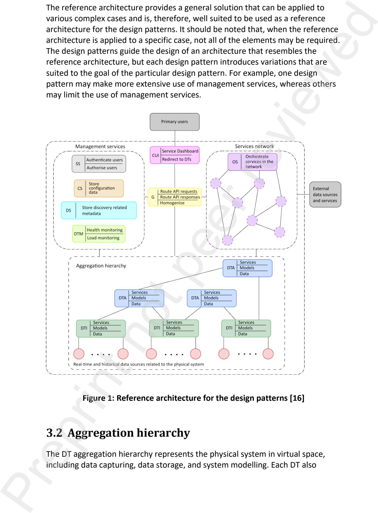
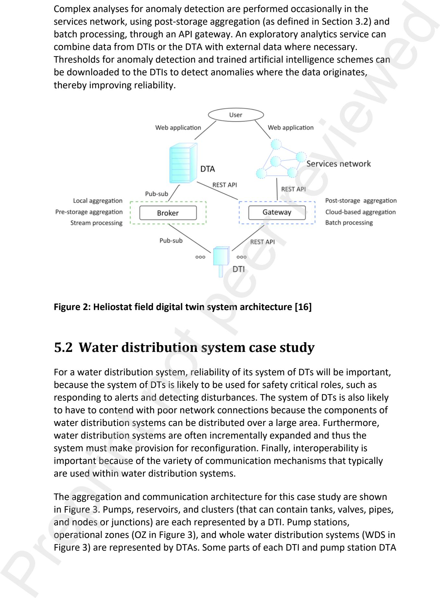
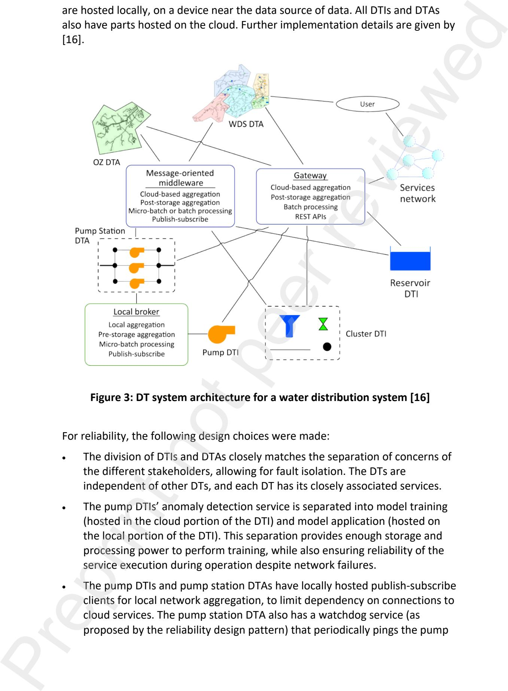
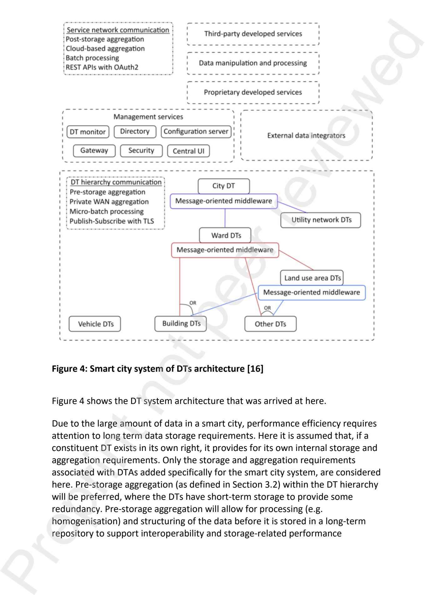

# Quality-focused design patterns for digital twin systems Preprint not peer reviewed

Carlo Humana1, Anton H Bassona2\*, Karel Krugera3 aDepartment of Mechanical and Mechatronic Engineering, Stellenbosch University, Stellenbosch, 7600, South Africa

> 1carlohuman@gmail.com 2ahb@sun.ac.za, ORCID 0000-0001-7998-330X 3kkruger@sun.ac.za, ORCID 0000-0003-0932-2850

> > \*Corresponding author

## Quality-focused design patterns for digital twin systems Preprint not peer reviewed

## Abstract

Complex physical systems have diverse details such as stakeholder needs, data integration, and software quality requirements. A system of digital twins, comprising multiple digital twins and software services, can be adapted in such domains to integrate information and support data-led decision-making, but designing such a system of digital twins involves a very large number of decisions.

To reduce the design complexity, this paper presents four design patterns for a quality-attribute focused approach to the design of a system of digital twins. The software quality attributes considered here are performance efficiency, reliability, reconfigurability, and interoperability. Each design pattern guides design choices that prioritise the particular quality attribute.

The design patterns are evaluated using three disparate case studies, i.e. a heliostat field, a water distribution system, and a smart city. The case studies demonstrate how the patterns guide design decisions and how multiple patterns can be applied in a given case. The paper, therefore, contributes a novel approach to digital twin design patterns, focusing on four typical software quality attributes.
**Keywords**: digital twin; design pattern; quality attribute; decision support

## 1 Introduction

The original premise of digital twins (DTs) was to create a virtual representation of a physical product, where the virtual representation could mirror the physical product throughout its lifecycle [1]. Since then, the DT concept has evolved and

has become a significant enabler of Industry 4.0 initiatives, including connectedness and intelligence to allow for decentralised and adaptable production environments [2]. The DT concept has become a popular means of capturing, integrating, and utilising data related to physical systems and has been applied in wide-ranging domains, such as manufacturing [3], smart cities [4], and maritime [5]. The data within DTs enable the integration of services and models to improve understanding and decision-making related to the physical system [6][7].

DTs that mirror the behaviour of complex systems offer particular advantages. System complexity can be measured by how difficult it is to understand the behaviour of a system and predict the consequences of changing the system [8]. DT simulations can aid in understanding and predicting system behaviour and, in this context, aggregation within the domain of DTs can have benefits [9]. Rather than representing a complex physical system by a single DT, an aggregation of DTs can be used to enhance separation of concerns, reconfigurability, and scalability [10][11][12]. It is possible to view a system from different perspectives, by aggregating different DTs and data features, while also allowing for different levels of detail for each perspective [10][13]. This ability to accommodate different perspectives makes it easier to accommodate multiple stakeholders and it makes the data more comprehensible [11][14]. Preprint not peer reviewed

Software services can also be coupled with a DT hierarchy and external data sources [15][16] to enhance separation of concerns, reconfigurability, and scalability. Some services can be hosted by digital twins, while others can form a microservices-based service-orientated architecture (SOA). In this paper, the term "a system of DTs" is used for a system that includes DT hierarchies, SOAs, and external data sources.

Designing a system of DTs for a complex system involves an extensive range of options and considerations that relate to the specific context and purpose of the system of DTs [17][18]. It is, therefore, a daunting task to design a system of DTs. However, the design task can be made easier by recognising that not all design challenges, and thus solutions, are unique [19], which leads to the notion of design patterns. Design patterns can provide proven solutions to generally applicable problems that can be applied within a given context [20], i.e. design patterns provide solutions to the problems that are shared among multiple architectures and domains. However, design patterns still allow for the integration of other elements that are unique to the design case.

This paper presents four design patterns for a system of DTs, aimed at situations where the system complexity justifies the use of a design pattern. Each design pattern prioritises a particular software quality attribute. The design patterns use the reference architecture and design framework of [18], thereby allowing more

specific design decisions. However, the reference architecture includes DT hierarchies and microservices, and is therefore widely applicable. The use of the design patterns and reference architecture are intended to improve the design process, by reducing design iterations and clarifying trade-offs, and thereby also improving the resulting design. In practical applications, the benefits of a pattern-based software architecture include ease of maintenance and reuse [21].

The next section of the paper considers related design patterns reported in literature (space limitations preclude a more complete review of DTs and SOAs). Thereafter, the reference architecture that the design patterns are based on, is outlined. This is followed by a discussion of the design patterns for the four quality attributes, an evaluation of the patterns, a discussion, and a conclusion.

## 2 Related work

Existing DT design patterns focus on designing a single DT or a microservices SOA, whereas the design patterns presented in this paper focus of the design of a system of DTs that can include both approaches.

## 2.1 Digital twin design patterns

[17] proposed a catalogue of nine design patterns for developing DTs based on the lifecycle stage and degree of control that the system aims to achieve. For example, the most basic design pattern is for a digital model that simply represents a blueprint for a physical object, whereas the most complex design pattern is for an autonomous DT that controls the physical twin and performs automatic synchronisation of a system state. These design patterns are primarily focussed on DT applications for control. Preprint not peer reviewed

[19] proposed a more general set of DT design patterns, grouped into four categories:

- Structural patterns: Patterns that describe the composition of the DTs considering various functional focus areas, e.g. DTs for big data acquisition or DTs for benchmarking and anomaly detection. Structural patterns are the focus of this paper.
- Creational patterns: Patterns related to how DTs could be realised in terms of modelling strategies, e.g. machine learning vs physics simulations with data augmentation.
- Computational patterns: Patterns that describe how computational load can be handled for more efficient operation.

Insight patterns: Patterns that describe how DTs can be used with other resources to create insight. This is further discussed below as part of the service patterns.

[22] identified eight *service patterns*. The term *service pattern* relates to the general aspects of the services which can be applied to numerous contexts. The service patterns include:

- Virtual sensor: Infer sensor feeds from digital models to provide data that is not captured in the real world when, e.g., sensor placements are limited due to cost, access, hazardous environments, etc.
- Anomaly: Detect abnormal behaviour by contrasting data from live sensor feeds with data from trusted digital models.
- Mirror: Manage assets remotely by enabling immersive operators' experience and informed decision-making from remote locations.

The above shows that the existing DT design patterns focus their patterns around lifecycle stages [17], composition [19] or functional intent [22], but the design patterns presented in this paper focus the patterns around software quality attributes.

## 2.2 Microservices design patterns

Microservices architectures also typically follow certain design patterns for specific subsets of the application. [23] distinguishes between three groups of design patterns, namely orchestration and coordination patterns, deployment patterns, and storage patterns. Similarly, [24] focuses on deployment and communication patterns within microservices architectures. Preprint not peer reviewed

[25] groups design patterns according to their intended benefits:

- Data persistence: Patterns aimed at improving database management, e.g. Command and Query Responsibility Separation.
- Communication: Patterns for efficient coordination and communication between services.
- Entry point: Patterns concerned with ensuring controlled access to services, e.g. API gateway.
- Distribution: Patterns aimed at improving the distribution of the services in a logical way or aimed at providing an organisation structure to help with integration of other systems.
- Fault tolerance: Patterns that help improve reliability through fault detection, diagnostics, isolation, and handling.

Supplementary: Patterns that address more specific problems that can be used to complement/supplement other patterns.

As with DTs, the design patterns published for microservices do not focus on quality attributes.

## 3 Reference digital twin system architecture

The first subsection of this section provides an overview of the reference architecture used in the design patterns. The subsequent subsections outline the features of the main components that are directly relevant to the design patterns.

## 3.1 Overview

As mentioned in the Introduction, the design patterns presented here use a reference architecture to allow more specific design decisions. The reference architecture, shown in Figure 1 (as adapted by [16] from [15]), comprises a DT aggregation hierarchy, a services network, and a set of management services. The architecture was devised to meet the requirements imposed by complex systems, particularly (adapted from [15]):

- A large number and a large variety of components must be accommodated. The variety may include different functions, different suppliers of components (and their digital twins), and different levels of digital maturity. This will typically lead to a variety of data being generated.
- A separation of concerns must be accommodated, such as allowing the supplier of a part of the overall system to keep control over proprietary information and decision making. The subsystems may be required to be operationally and managerially independent, as seen in systems of systems [8].
- The system of DTs should be able to integrate with legacy systems.

Given a complex physical system with the above requirements, the overall purpose of the system of DTs is to provide a stakeholder with the appropriate level of interaction, from the appropriate viewpoint, with appropriate filtering of information, at the appropriate time [14]. To fulfil its purpose towards services, the system of DTs must also provide the right services with adequate security and regulation, provide the right level of data detail to each service, aggregate the data appropriately, and respond to inputs in a timely manner. Preprint not peer reviewed The reference architecture provides a general solution that can be applied to various complex cases and is, therefore, well suited to be used as a reference architecture for the design patterns. It should be noted that, when the reference architecture is applied to a specific case, not all of the elements may be required. The design patterns guide the design of an architecture that resembles the reference architecture, but each design pattern introduces variations that are suited to the goal of the particular design pattern. For example, one design pattern may make more extensive use of management services, whereas others may limit the use of management services.

<!-- Image Description: Figure 1 is a reference architecture diagram showing a hierarchical structure for design patterns. It illustrates components like management services (authentication, configuration storage), a service network (orchestration), and an aggregation hierarchy representing the physical system in virtual space (data capturing, storage, modelling). The diagram uses boxes and circles to represent different elements and their relationships, clarifying how various components interact within the system. -->

****Figure 1:** Reference architecture for the design patterns [16]**## 3.2 Aggregation hierarchy

The DT aggregation hierarchy represents the physical system in virtual space, including data capturing, data storage, and system modelling. Each DT also

provides services that directly pertain to its corresponding part of the physical system and its data. The services provided by each DT also include providing the services network with up-to-date and historical information about its counterpart in the physical system.

Each DT will typically contain or manage a short-term data repository (typically located near the physical counterpart) and a long-term data repository. The former can be used to buffer data before aggregation, avoid data loss due to interruptions in communication with the long-term repository and enable lowlatency uses of the data being ingested. The long-term repository is the longterm "single source of truth" of the history and state of the physical counterpart.

Important characteristics of the DTs and aggregation hierarchy are:

- A DT is persistent and handles persistent data. It is intended to have a long lifespan or operational lifetime.
- A DT is dedicated to representing a specific part of the physical system, i.e. a subsystem.
- DTs can aggregate along multiple pathways, to serve multi-stakeholder environments [26].
- The hierarchy allows for a high degree of modularity and software reuse, improves scalability [27] that, in turn, allows for incremental and modular development for better interoperability [28].

The aggregation hierarchy consists of DT instances (DTIs) and DT aggregates (DTAs). DTIs represent the elementary components of the complex physical system and thus each DTI has direct links to a physical component or data repositories that contain the physical component's data. DTAs, on the other hand, aggregate the data from multiple DTIs and/or DTAs to represent higherlevel subsystems and the overall system. The hierarchically arranged, distributed computing environment improves the separation of concerns; enables a combination of distributed, clustered and/or centralised processing and/or decision-making; and allows for a high degree of modularity and software reuse [15]. Preprint not peer reviewed

For aggregation of data that originate in the physical system, it is necessary to distinguish between pre-storage aggregation and post-storage aggregation. The former refers to aggregation without relying on long-term storage of the data before aggregating it; the data may be stored before aggregation for a short term to avoid data loss or, if required for another purpose, for the long term after it was used for aggregation. Conversely, post-storage aggregation uses data that have already been placed in long-term repositories. As will be shown later in the paper, pre- and post-storage aggregation each has its own advantages and disadvantages. The choice of aggregation method is case dependent and, in a

given system of digital twins, the one method can be used for one type of data and the other for another type of data. [16] gives a more complete comparison of the two methods. It should be noted that, for both types of aggregation, the data sent from one DT to another for aggregation can, before sending, be transformed by the sending DT using knowledge about its physical counterpart or context, which can be considered to be a form of modelling.

### 3.3 Services network

The services network, which contains loosely coupled, highly reusable, and interoperable services [29], extends the distributed computing environment. The services network provides functionally focused services to manipulate and interrogate the data further. The services network typically employs a serviceoriented or microservices architecture, dynamically orchestrated to collectively achieve a business capability. The services network also provides entry points for external services and for any data that is relevant but does not originate from the physical system, such as financial data. Preprint not peer reviewed

Therefore, the services network is highly adaptable and provides for dynamic service requirements and rapidly changing user needs. The typical characteristics of the services network are:

- The services can be transient or persistent.
- The services are functionally focussed, as opposed to a DT's focus on a physical counterpart.
- The network is highly adaptable to changing stakeholder needs.

### 3.4 Management services

The management services improve the reliability and interoperability of the DT aggregation hierarchy and service network, by managing the distributed computing environment. The typical management services are:

- Security service (SS in Figure 1), which allows other services to delegate authentication and authorisation functionality.
- Directory service (DS in Figure 1), which serves as a central metadata repository that can be queried for discovery information about DTs and services within the system.
- DT monitoring service (DTM in Figure 1), which is responsible for health and load monitoring of individual DTs to ensure acceptable availability of the DTs.

Configuration server (CS in Figure 1), which is a central server that contains the start-up and operation configuration settings for the different digital components of the system.

For usability and interoperability, the primary users' interactions with the overall system are handled by the following:

- Central user interface (CUI in Figure 1), which provides a single entry-point into the system of DTs.
- Gateway service (G in Figure 1), which routes service requests to the appropriate services or DTs.

## 4 Design patterns

The reference architecture described in Section 3 is intentionally general and adaptable. Applying it to a specific case involves many trade-offs and design choices between alternatives. The design patterns presented here aim to reduce the range of choices by prioritising a particular, pre-selected quality attribute and recommending related design choices, thereby simplifying and accelerating the design process. Preprint not peer reviewed

The methodology used to develop the design patterns was as follows: quality attribute selections and the design patterns were formulated from the experience of the authors' research group where digital twin systems for wideranging applications are researched. The design patterns were also informed by recommendations in other, somewhat related, research domains, such as microservices, as well as commercial cloud and software platforms.

The next section discusses the selection of quality attributes used to focus the design patterns, followed by a description of the structure used to present the design pattern. Thereafter, four design patterns are described. More detailed descriptions of the design patterns are given by [16].

## 4.1 Selection of quality attributes

Each design pattern focusses on a particular quality attribute. The choice of attributes is therefore important. Table 1 gives relevant attributes, which were derived from the SQauRE model for software quality [30].

| | Definition | d Sub-attributes | | |
|--------------------------------------------------------------------------------|---------------------------------------------------------------------------------------------------------------------------------------------------------------------------------------------------------------------------------------------------------------------------------------------------------------------------------------------------------------------------------------------------------------------------------------------------------------------------------------------------------------------------------------------------------------------------------------------------------------------------------------------------------------------------------------------------------------------------------------------------------------------------------------------------------------------------------------------------------------|----------------------------------------------------------------------------------------------------------------------------|--|--|
| Performance efficiency | The system's performance relative to the amount of resources used. | e Time behaviour, resource utilisation, capacity. | | |
| Compatibility | The system's ability to exchange information with other systems and/or to perform its functions despite sharing a hardware or software environment. | w Co-existence, e interoperability. i v Maturity, availability, fault tolerance, recoverability. e | | |
| Reliability | The system's ability to perform specified functions under specified conditions for a specified period of time. | | | |
| Maintainability | The system's ability to allow for r effective and efficient modification to improve, correct or adapt to changes in the environment and requirements. | r Modularity, reusability, analysability, modifiability, testability. | | |
| Portability | e The system's ability to be transferred e between hardware and software environments, as well as between p operational and usage environments. | Adaptability, installability, replaceability. | | |
| | Performance efficiency and reliability are used for two design patters below. | | | |
| reconfigurability design pattern. n i r p design patterns. e | t o Experience has shown that the maintainability and portability design patterns lead to very similar design choices for systems of digital twins. Therefore, in the design patterns presented below, these quality attributes are addressed in the n t In the design of systems of DTs, design choices that relate to the compatibility metric in Table 1 are dominated by interoperability aspects. Therefore, interoperability is used to name the design pattern to clarify its focus. Security could also be seen as a quality attribute; however, in the present context, this aspect can be addressed by giving preference to the use of widely accepted standards for all aspects of the implementation. Security, therefore, need not be considered for a separate design pattern, but rather applies to all | | | |

### Table 1: Typical quality attributes for design pattern focus

## 4.2 Structure of design patterns

| | The design patterns presented in this paper were derived from a more general e design framework [16][18]. The design framework starts with a needs analysis, which results in lists of prioritised functional requirements and non-functional w requirements. The non-functional requirements often include quality attributes. The next steps in the design framework include identifying the potential DTs (considering separation of concerns and span of reality) and services mapping e (allocating each service to either a DT or the services network). Quality i considerations have particular influence in the subsequent refinement of the aggregation architecture and the related implementation decisions. The final v step of the design framework focusses on validation testing. e Each of the design patterns below are documented according to the aspects outlined in Table 2, which follows from the above-mentioned design framework. | | | |
|------------------------------------------------------------|----------------------------------------------------------------------------------------------------------------------------------------------------------------------------------------------------------------------------------------------------------------------------------------------------------------------------------------------------------------------------------------------------------------------------------------------------------------------------------------------------------------------------------------------------------------------------------------------------------------------------------------------------------------------------------------------------------------------------------------------------------------------------------------------------------------------------------------------------------------------------------------------------------------------------------------------------------------------------------------------------------------|--|--|--|
| | r **Table 2:** Aspects used to document the design patterns r | | | |
| Aspect | Description | | | |
| Name | e The name of the design pattern, which corresponds to a quality attribute. | | | |
| Related priorities | e p These are requirements that are related to the quality attribute in question and in some cases the terms are used synonymously. | | | |
| Related needs (problem and context) | t Typical system needs that necessitate the emphasis of the particular quality attribute that the pattern enforces. | | | |
| Conflicts | o Quality attributes and other system aspects that may require n conflicting design choices. | | | |
| Recommended t aggregation choices | Typical high-level architectural choices that influence the quality of the DTs and services. | | | |
| | Typical detailed architectural choices that influence the quality of the DTs and services. | | | |
| Recommended implementation choices | | | | |
| n i r Supplementary (or p related) patterns | More specific design patterns that complement the design patterns proposed in this paper. | | | |

| **Table 2:** Aspects used to document the design patterns | | | | | |
|-------------------------------------------------------|--|--|--|--|--|
|-------------------------------------------------------|--|--|--|--|--|

## 4.3 Performance efficiency design pattern

Please refer to Sections 4.1 and 4.2 for the rationale and structure of this design pattern.

Related priorities: Responsiveness, scalability, timeliness, capacity, resource utilisation.

### Related needs:

- Host machines and hardware often host more than one software component to optimise resource usage [20][24]. However, when some software components need to sustain high loads, they monopolise the resources (this is referred to as physical resource contention) [31]. This typically happens when there are very*dynamic workloads*. Therefore, physical resource contention between software components on the same host machine must be managed and avoided.
- Data is often gathered using power and resource constrained devices, such as IoT devices [32][33]. Therefore, *resource constrained*devices and sensors may have to be accommodated.
- The interconnectedness of complex systems results in large networks of diverse components where each component displays individual behaviour, while also contributing to a complex collective behaviour [34]. To represent such a system digitally, a*large amount of data*must be captured and exchanged resulting in high levels of data traffic and complex processing [35]. Therefore, the system of DTs must have the capacity to capture, process, transmit, and store a large amount of data in a timely manner [36][37].
- The system of DTs is intended to help users make better decisions related to their area of interest. Therefore, the system of DTs must be*responsive to user interactions* despite high system loads.

### Conflicts:

Interoperability: The use of intermediaries, such as brokers, middleware, or directories, is a common way to improve interoperability. However, such intermediaries can increase latency since they create extra communication steps and they often perform protocol conversions that require additional processing time. Furthermore, such intermediaries can become communication bottlenecks if they are not properly designed [38]. Highperformance middleware technologies typically find a good balance between interoperability and performance efficiency by making use of concepts such as load balancing and message queueing. Preprint not peer reviewed

- Data detail: In the context of modelling within DTs, high fidelity models require more detailed data and thus more processing, storage, and network bandwidth than lower fidelity models [39]. As a result, more resources must be utilised to manage the increased data load and possibly the increased latency. Therefore, it is important to determine what level of data detail is required by models and services. In some cases, it is useful to reduce data dimensionality to improve the comprehensibility of the data, even though some detail is lost [40]. Furthermore, structuring data to minimise the number of data queries is a way of retaining detail with minimal effect on time behaviour. Pre-computing computationally expensive queries and storing the results of those queries is also common [40], but there is then a trade-off between computational and storage resources that needs to be justified. It is also important to consider data management aspects and how those influence the performance efficiency. For example, when strong data consistency is required, latency is often increased and data persistence management requires long-term storage. Preprint not peer reviewed
- Portability: In the context of distributed software systems, there is a conflict between generalisation (the software's ability to handle a variety of scenarios without having to change the software) and specialisation (the software's ability to perform a specific task exceptionally well). Generalisation prioritises portability, particularly adaptability, whereas specialisation prioritises time performance and resource efficiency. [31]
- Security: There is always a trade-off between security and performance because security requires additional processing and possibly extra communication steps and storage. For example, encryption and decryption increase message size and overhead [38], authentication and authorisation can cause large initial delays in communication while a secure connection is being established, and security aspects such as non-repudiation and accountability require logging and thus additional storage. Security is always a concern in software systems and should never be sacrificed. However, there are degrees of security and there are some methods of ensuring security that do not influence performance too significantly. Typically, this includes using industry standards for security, such as the SSL/TLS protocol and the OAuth protocol, and making use of reputable cryptographic libraries.

### Recommended aggregation choices:

Design for the separation of concerns and the distribution of load across multiple DTs to improve the performance of large systems, i.e. to enhance scalability. When a large number of similar physical entities are present, they should each be presented by a DTI, so that the number of DTIs can grow as the system scales up, providing horizontal scalability [41]. If a DTA that

integrates a large number of DTIs becomes a bottleneck, more DTAs of the same type can be added to share the load, thus providing z-axis scalability [42].

- Define the data scope narrowly to improve query response times. This includes:
- Make use of only the necessary level of detail. The higher the level of detail, the more processing is required and thus the slower the queries are.
- As the physical scope gets larger, reduce the level of detail of the data further. This is generally possible because longer-term decision-making is typically applied at a higher level within a system hierarchy with aggregated data [40][43]. Preprint not peer reviewed
- Use DTs to encapsulate data and service functionality as opposed to orchestrating functionality among multiple services or DTs.
- Give preference to pre-storage aggregation (as defined in Section 3.2) to reduce latencies and/or to reduce storage requirements, which implies:
- Pre-process and pre-structure data before storage, such as removing duplicate values, data homogenisation, and data synchronisation.
- Exchange data through a messaging mechanism internal to the aggregation hierarchy software platform for more rapid data propagation to the higher levels of aggregation.
- Give preference to local aggregation (as opposed to cloud aggregation) to increase throughput and to reduce latencies. This includes:
- Use local infrastructure (i.e. local devices and fog servers) for reduced latencies and increased throughput.
- Reduce the physical distance between the platforms that host DTs for reduced latencies.
- Avoid limitations imposed by cloud platforms such as throttling.
- Aggregate through stream processing (nearly continuously) or micro-batch processing (frequently, in small batches), rather than in occasional large batches.
- Perform aggregation and other data processing at the lowest feasible level of the DT hierarchy (within the constraints of the available computational resources), to avoid higher-level DTs becoming bottlenecks.

Recommended implementation choices:

- Minimise the number of communication intermediaries between data source and data destination (for automatic decision-making) or requester and responder (for human decision-making).
- Minimise the physical distance between communication source and destination platforms to minimise network latencies.
- Minimise data formatting and protocol conversions, e.g. by using a commonly agreed upon format and protocol.
- Use request-response messaging patterns if lower point-to-point latencies are a priority, but consider that publish-subscribe patterns are more scalable. Some message-oriented middleware may allow for both.
- Use NoSQL databases, which typically support higher throughput and lower latencies than SQL databases. Also, NoSQL databases are more scalable. Using a specialised storage solution such as a time-series data store or a keyvalue store for temporary storage may also be useful. Preprint not peer reviewed
- Use local infrastructure or private cloud offerings where possible. Furthermore, hosting DTs and services in containers will allow for elasticity which is good for resource efficiency and it makes load balancing easier.

### Supplementary patterns:

- Multi-threading can reduce I/O latency and multi-processing can reduce computational latency. However, this is also dependent on the resources that are available in the DTs.
- A component can save resources by delegating some functions to other components, particularly processing intensive workloads. For example, a local device can use a secure fog server as a proxy where the fog server performs security services.
- Caching frequently queried data as opposed to accessing the database for every query can greatly reduce latencies but at the cost of higher memory usage.

### Testing metrics:

- Latency of network communications, computations, and I/O operations.
- Throughput of network, computations, and I/O operations.

## 4.4 Reliability design pattern

Please refer to Sections 4.1 and 4.2 for the rationale and structure of this design pattern.

Related priorities: Maturity, resilience, robustness, stability, recoverability, fault tolerance, availability.

### Related needs:

- High system availability.
- Compensation for poor network connections.
- Fault tolerance, such as minimal to no data loss or unintended data duplication.
- Suitability for safety critical systems, such as responding to alerts.
- Disturbance handling (unexpected inputs and disruptions to the system's functioning).

### Conflicts:

Agility is useful to reduce the time-to-market of software and it is useful to adapt to constantly changing user needs. However, these changes increase the risk of introducing new faults and failures into the current system and thus they increase the risk of downtime [6][28].

### Recommended aggregation choices:

- Design for separation of concerns (distribution of functional logic) and the distribution of load to allow for fault isolation, for example by separating services and distributing them. Also, promote independence of the DTs that host the services.
- Let functions like remote monitoring be performed by the lowest possible DTs in the aggregation hierarchy so that the communication failures or failure of higher-level DTs or DTs elsewhere in the hierarchy will not affect those functions. The encapsulation of functionality within a persistent and dedicated DT is also more reliable than service orchestration which relies on external connections. Preprint not peer reviewed
- Aggregate data after it has been stored. It is generally better for reliability because data is stored before it is transferred or manipulated, which allows for some redundancy. If latency is also important, a key-value store with periodic persistence, such as Redis, can be used as low latency temporary storage before aggregation.
- Use local aggregation. It is generally more reliable, if the computational resources are available, because the low latencies and high throughput of a local network allows for a higher capacity for interaction. Stream processing and micro-batch processing should be used for aggregation to avoid large batch failures.

- Employ redundancy, replication, and partitioning. This means that if one DT or service fails, another is available to continue the work (replication) or if one DT or service fails, the failure does not affect all the data (partitioning). Data is often stored at multiple levels of the system to build redundancy into the system. Preprint not peer reviewed
- Keep the infrastructure load below a reliable upper bound that has been established through experimentation. This means that infrastructure has been tested at a certain load, at which it is able to compensate for (most) disturbances.
- Limit dependencies on external networks and systems; where dependencies still exist, ensure good fault handling as well as redundancy features (such as locally storing data before sending it over a network).

### Recommended implementation choices:

- Use a system monitoring service or monitoring platform to ensure that infrastructure is not being overloaded and to ensure that software behaviour is as expected. At the very least, use a heartbeat protocol or watchdog services.
- Use reputable communication middleware that is reliable and scalable. Communication middleware decouples software components (here DTs and microservices) to allow for asynchronous communication and independent processing. Middleware typically uses short-term and temporary storage, which provides some redundancy.
- In resource constrained environments, give preference to publish-subscribe messaging which is typically more reliable than request-response because the broker decouples publishers and subscribers in time and space.
- Use SQL databases that exhibit the widely known atomic, consistent, isolated, durable (ACID) properties, which is considered to be highly reliable.
- Host software in virtual machines because it provides good resource isolation, as well as operating environment isolation. When hosting publicly available software, hosting on a cloud platform allows for highly scalable hosting environments. However, local machine buffer storage still may be desired to reduce data loss due to network problems.
- Use containers to provide resource and operating environment isolation. Containers further enhance reliable re-use of software.

### Supplementary patterns:

- Safe state logic is used to handle external failures or unexpected inputs.
- When introducing replacement systems, a split loading approach is used to gradually phase one system in while phasing the other system out. For

example, when a new version of a service is available, the load can be split between the old and the new version until the new version proves adequately reliable. Cloud platforms, such as Google Cloud Platform, provide services that enable this type of load splitting.

### Testing metrics:

- Percentage uptime within a given time period.
- The number of independent faults within a given time period
- The number of downstream failures caused by the initial fault.

## 4.5 Reconfigurability design pattern

Please refer to Sections 4.1 and 4.2 for the rationale and structure of this design pattern.

Related priorities: Maintainability, portability, modularity, modifiability, reusability, adaptability, analysability, expandability.

### Related needs:

- Retrofitting and accommodating differing levels of technological maturity.
- Efficient system reconfigurations, including the addition, removal or change of system components with minimal impact on other components.
- Long-term system maintenance and extension, including the upgrading of technologies in the system.
- Automating system support tasks, such as testing, (re)deployment, fault handling, and configuration of DTs.

### Conflicts:

- Security: reconfigurable systems typically are more modular, which introduces more interfaces and communication that can be attacked.
- Performance efficiency: some performance focussed recommendations given above counter reconfigurability, e.g. narrowing the scope of data, preferring to encapsulate services with digital twins rather than in the services network, using pre-storage aggregation (as defined in Section 3.2), minimising the number of communication intermediaries, using requestresponse (rather than publish-subscribe) protocols, etc. Preprint not peer reviewed
- Minimise the physical distance between communication source and destination platforms: reconfigurable systems are usually more distributed.

Reliability: reconfiguring a system potentially introduces new errors and unexpected behaviours.

### Recommended aggregation choices:

- The separation of concerns and modularity help make components more replaceable and interchangeable. Therefore, use loosely-coupled and highly cohesive software entities, i.e. nearly independent entities that are able to integrate easily. This allows for the separation of functional responsibilities and software entities can delegate functions to other entities, which helps to reduce the size of the code base. Preprint not peer reviewed
- Use clearly defined and simple interfaces for DTs and services and, thus, it is likely that there may be many, simpler DTs and/or services.
- Place a service that only relies on data from a well-defined span of reality with a DT that represents that span of reality. This combination will be easier to reconfigure as a unit.
- Avoid duplicating processing logic in multiple DTs or services so that, if the logic needs to change, it is easier to maintain consistency. However, centralising logic may cause system bottlenecks.
- Centralise connectivity metadata, e.g. in a directory service, so that changes to communication destinations or data sources are easy to maintain. This principle can be applied more widely, by general keeping a single source of truth for all data.
- Use cloud platforms that provide tools to manage complex architectures, including extensive diagnostic tools. These tools can speed up reconfiguration and, in particular, reduce testing and ramp-up time after reconfiguration. However, using cloud platforms does increase reliance on internet connectivity and network infrastructure.

### Recommended implementation choices:

- Use management services to provide common functions, such as a user interface gateway (to decouple user interfaces from the internal architecture of the system of DTs) and a single sign-on security system (to centralise security logic).
- Use management services, such as a central configuration server and orchestrator service, to centralise configuration data of multiple software entities.
- Use message-oriented middleware because it simplifies communication interfaces and provides information buffering.
- Use asynchronous, and preferably, publish-subscribe communication patterns amongst digital twins and services to reduce the likelihood of

unintended side-effects of a reconfiguration. Some middleware can support multiple communication patterns and protocols, which further simplifies the interfacing of multiple software entities.

- Use cloud platforms' "serverless" computing which means that long-term server related maintenance is delegated to the cloud service provider.
- Use containers to provide resource and operating environment isolation. Furthermore, containers are usually deployed with a cluster manager which can help with load-balancing and performance monitoring.

### Supplementary patterns:

- Code versioning software such as GitHub should be used.
- The system should be developed incrementally, in synergy with the reconfigurability of the system.
- Thorough documentation of interfaces and documentation management should be emphasised to support long-term maintenance and reconfigurability.

### Testing metrics:

- The time it takes to add, remove or change a system component without introducing failures.
- The rate of software reuse.
- The time it takes to identify the cause of a failure.
- The time it takes to install a system without introducing failures.
- The time it takes to upgrade or update systems without introducing failures.

## 4.6 Interoperability design pattern

Please refer to Sections 4.1 and 4.2 for the rationale and structure of this design pattern.

Related priorities: Compatibility, co-existence.

Related needs:

- Provide for proprietary technologies from multiple stakeholders and vendors.
- Integrate existing and new systems (information systems and physical systems) without introducing resource contention (e.g. imposing unexpected resource demands on existing systems). Preprin[t n](#page-9-0)ot peer reviewed

- Allow for easy integration of legacy and new technologies into the system of DTs.
- Facilitate heterogenous data handling.

### Conflicts:

- Security, as for the reconfigurability design pattern.
- Performance efficiency, as for the reconfigurability design pattern.

### Recommended aggregation choices:

- Homogenise and structure data before storage to make the data more understandable and to allow for easier querying.
- Use the services network to integrate external data and external services so that there is, preferably, a single point of entry in the system of DTs for each external data source and service. Such an interfacing service should hide the peculiarities of the external data source or service and the interfaces this service exposes internally to the remainder of the system of DTs should be consistent with the patterns used in this system. Preprint not peer reviewed
- Apply the separation of concerns and modularity recommendations for the reconfigurability design pattern because they also aid interoperability.

### Recommended implementation choices:

- Apply the implementation recommendations for the reconfigurability design pattern.
- If the system of DTs relies on external data, take into account the long-term availability of that data and the latency for accessing it. These two factors will indicate whether the system of DTs should duplicate the data or only maintain a connection to the external data source.

### Supplementary patterns:

- The aim is to ensure syntactically and semantically consistent data formats across different DTs and services; incorporate metadata to provide context.
- Preference is given to open standards, particularly security standards.

### Testing metrics:

- The time required to integrate new components.
- The time required to establish interfaces with external components.

## 5 Evaluation and results

Evaluating the design patterns is very challenging because they are intended to be generally valid or useful. It is infeasible to demonstrate or evaluate their range of application, in terms of types of physical systems and expertise of the users of the design patterns. A feasible approach is to apply the design patterns in a range of case studies that are selected to give some measure of their effectiveness and utility.

The above design patterns were, therefore, applied in three case studies: a heliostat field, a water distribution system and a smart city. Each of these cases present different challenges with regards to the data they generate and how data is managed by the DTs.

## 5.1 Heliostat field case study

A typical heliostat field can consist of tens of thousands of heliostats [44]. In this case, a system of DTs will typically be used for remote monitoring (a "mirror service" as defined in Section 2.1) and anomaly detection. The heliostats will each generate unique data that follows a common schema, passing through a large number of resource constrained computing devices. Therefore, performance efficiency will be an important quality attribute for the mirror service, but reliability will be important for anomaly detection.

In the architecture presented in Figure 2, DTIs represent small clusters of heliostats, each controlled by a resource-constrained cluster control unit. The DTAs each represent a field control unit that interfaces with a large number of cluster control units.

Pre-storage, local aggregation is performed through stream processing within the DT hierarchy, i.e. between the cluster control unit DTIs and the field control unit DTA, for the mirror service. These are all recommendations of the performance efficiency design pattern. Pre-storage aggregation (as defined in Section 3.2) allows for reduced data storage and lower latencies, while local aggregation further allows for lower latencies and higher throughput. Stream processing further lowers latencies. A locally hosted, lightweight broker facilitates aggregation using publish-subscribe communication, as recommended by the performance efficiency and portability design patterns. Publish-subscribe communication is scalable and it is well-suited to many-to-one communication as is the case for the heliostat field. Publish-subscribe also decouples the DTs, which is beneficial for reliability and replaceability. Preprint no[t](#page-23-0) [p](#page-23-0)eer reviewed Complex analyses for anomaly detection are performed occasionally in the services network, using post-storage aggregation (as defined in Section 3.2) and batch processing, through an API gateway. An exploratory analytics service can combine data from DTIs or the DTA with external data where necessary. Thresholds for anomaly detection and trained artificial intelligence schemes can be downloaded to the DTIs to detect anomalies where the data originates, thereby improving reliability.

<!-- Image Description: Figure 2 depicts a digital twin system architecture for a heliostat field. It's a diagram showing a user interacting with web applications that communicate with a DTA (Digital Twin Aggregate) and DTIs (Digital Twin Instances) via a gateway and broker using REST APIs and a pub-sub messaging system. Local, pre-storage, and post-storage data aggregation methods are highlighted. The purpose is to illustrate the system's architecture and data flow for anomaly detection. -->

****Figure 2:** Heliostat field digital twin system architecture [16]**

## 5.2 Water distribution system case study

For a water distribution system, reliability of its system of DTs will be important, because the system of DTs is likely to be used for safety critical roles, such as responding to alerts and detecting disturbances. The system of DTs is also likely to have to contend with poor network connections because the components of water distribution systems can be distributed over a large area. Furthermore, water distribution systems are often incrementally expanded and thus the system must make provision for reconfiguration. Finally, interoperability is important because of the variety of communication mechanisms that typically are used within water distribution systems.

The aggregation and communication architecture for this case study are shown in Figure 3. Pumps, reservoirs, and clusters (that can contain tanks, valves, pipes, and nodes or junctions) are each represented by a DTI. Pump stations, operational zones (OZ in Figure 3), and whole water distribution systems (WDS in Figure 3) are represented by DTAs. Some parts of each DTI and pump station DTA are hosted locally, on a device near the data source of data. All DTIs and DTAs also have parts hosted on the cloud. Further implementation details are given by [16].

<!-- Image Description: Figure 3 depicts the architecture of a water distribution system's data telemetry infrastructure. A diagram shows the system's components (DTIs and DTAs) distributed across local devices and the cloud, connected via a message-oriented middleware and a gateway. Local brokers handle pre-storage aggregation while the gateway performs post-storage aggregation and batch processing. The design emphasizes fault isolation and reliability through separation of concerns and local services. -->

****Figure 3:** DT system architecture for a water distribution system [16]**

For reliability, the following design choices were made:

- The division of DTIs and DTAs closely matches the separation of concerns of the different stakeholders, allowing for fault isolation. The DTs are independent of other DTs, and each DT has its closely associated services.
- The pump DTIs' anomaly detection service is separated into model training (hosted in the cloud portion of the DTI) and model application (hosted on the local portion of the DTI). This separation provides enough storage and processing power to perform training, while also ensuring reliability of the service execution during operation despite network failures.
- The pump DTIs and pump station DTAs have locally hosted publish-subscribe clients for local network aggregation, to limit dependency on connections to cloud services. The pump station DTA also has a watchdog service (as proposed by the reliability design pattern) that periodically pings the pump

DTIs and the pump scheduling service to ensure that all the components are active.

- A middleware client is present in the cloud-hosted part of each DT (except the pump DTI) to provide a common request-response communication mechanism within the DT hierarchy.
- In terms of the services hosting, mirror, and anomaly services (as defined in Section 2.1) are encapsulated in DTs to enhance reliability and avoid the need for service orchestration. However, a maintenance scheduling service requires data that is not captured by the DTs, such as personnel and financial data, and thus this service is located within the service network.

Design choices related to interoperability include the following:

- Sensor heterogeneity requires that the DTIs implement homogenisation before sending the data into the system of DTs.
- The separation of concerns and the use of middleware, as mentioned above for reliability, also enhance interoperability.

## 5.3 Smart city case study

Smart cities consist of many different devices and elements, some of which capture data about people. Therefore, in smart cities, interoperability and data security are key concerns [45]. The large amount of data generated in a smart city will also require attention to performance efficiency. The interoperability and performance efficiency design patterns will, therefore, be given priority but, as pointed out above, interoperability and reconfigurability share some recommendations.

This case study does not consider the internal architecture of the constituent DTs in the system of DTs because there may be constituent DTs that exist in their own right, irrespective of their inclusion in the system of DTs. These DTs can have various internal architectures and internal data storage architectures (like the water distribution system considered in the previous case study). The case study rather focusses on aggregation communication amongst DTs and related storage, as well as the services in the services network. In this way, the modularity and separation of concerns are maintained. Preprint not peer reviewed

<!-- Image Description: Figure 4 presents a hierarchical architecture for a smart city's data transfer (DT) system. The diagram uses boxes and connecting lines to illustrate the flow of data between various levels: City DT, Ward DTs, and Land Use Area DTs. Each level utilizes message-oriented middleware. The architecture emphasizes pre-storage aggregation for efficiency and interoperability, addressing the challenges of large data volumes in smart cities. -->

****Figure 4:** Smart city system of DTs architecture [16]**Figure 4 shows the DT system architecture that was arrived at here.

Due to the large amount of data in a smart city, performance efficiency requires attention to long term data storage requirements. Here it is assumed that, if a constituent DT exists in its own right, it provides for its own internal storage and aggregation requirements. Only the storage and aggregation requirements associated with DTAs added specifically for the smart city system, are considered here. Pre-storage aggregation (as defined in Section 3.2) within the DT hierarchy will be preferred, where the DTs have short-term storage to provide some redundancy. Pre-storage aggregation will allow for processing (e.g. homogenisation) and structuring of the data before it is stored in a long-term repository to support interoperability and storage-related performance

efficiency. This approach will also help prevent data persistence issues, such as data swamps or data graveyards.

Local aggregation is suggested in the performance efficiency design pattern, but the physical distribution of a smart city is likely to necessitate aggregation across networks. Therefore, the aggregation will resemble both local network aggregation and cloud-based aggregation. It is expected that many gateway devices and fog servers would be located within the city. Therefore, wide area network (WAN) aggregation can still be done to allow for aggregation before the data enters a cloud platform. Furthermore, a private WAN can be used for better throughput, security, and reliability. Considering that much of the data acquisition in smart cities is done using wireless sensor networks, micro-batch processing and transmission is likely to be necessary. Micro-batch processing allows for data synchronisation and is more suited to environments with intermittent network connectivity.

Some DTs in a smart city will have multiple lines of aggregation. For example, the building DTs in Figure 4 aggregate to a land use area, when they form part of a land use area with its own DT, and/or directly to the ward. However, the same data should not be aggregated by both the land use area DT and the ward DT because this could cause data inconsistencies.

DTs for mobile physical entities present particular opportunities and challenges. For example, vehicle DTs can capture data about the vehicle, as well as the environment, and they can contain other data, such as logs about the vehicle payload or data captured by vehicle manufacturers. The mobile nature of vehicles implies that the vehicle DTs interactions with some specific DTAs could be short-term. For example, environment data captured by a vehicle could be aggregated by a ward DTA, but the vehicle will likely drive through multiple wards in a typical journey and will not share a persistent spatial relationship with any other DTs in the hierarchy. Including the vehicle DT in the hierarchy will require frequent hierarchy reconfigurations, while the aggregating DTs will only receive data intermittently and at unpredictable intervals. Therefore, even though a vehicle is represented by a DT, its data rather should be aggregated by the services network. The services network, because of its adaptability, is more suited to accommodate the variety of stakeholders and the variety of vehicle data capture capabilities. A service (or a fixed set of services) that collect vehicle data can offer a unified point of entry for this data, as the interoperability design pattern recommends for external data sources. Preprint not peer reviewed

For a smart city, an extensive services network will be appropriate, including management services, external data integrators (services that acquire data not captured within the DT hierarchy, such as citizen comments), proprietary developed services (services designed by data owners that have full access to the applicable data), data manipulation and processing services (services that manipulate the data to make it suitable for third-parties), and third-party services (services that are designed by third-parties who do not have full access to the raw data). Because DTs will not know beforehand what data will be required by services, services will use post-storage aggregation (as defined in Section 3.2).

For messaging within the DT hierarchy, multiple message-oriented middleware that support a binary protocol with a publish-subscribe messaging pattern is suggested. Considering the variety of stakeholders and the size the system, having a single message-oriented middleware is not feasible. Instead, each group of aggregates will probably use their agreed message-orientated middleware and, in some cases, individual DTAs may require a dedicated message-oriented middleware. For example, some building DTAs, such as a DTA of a hospital, may require a dedicated middleware, whereas all the buildings in a land use area, such as a university, may use the same middleware. The middleware should support standard security protocols, like TLS, to enhance interoperability. Preprint not peer reviewed

Messaging in the services network will typically use REST APIs, for good interoperability, and OAuth2 for security.

In terms of hosting, services that require low latencies, higher security standards, and location awareness are better hosted on fog servers. Services that are open to the public and services that entail intensive periodic processing, such as training machine learning algorithms, are better served in the public cloud. Furthermore, different stakeholders may make use of different cloud platforms and thus multiple services networks may also be present. In such cases, the services networks of other stakeholders can be considered as external services to the services network being considered.

Furthermore, services that require stricter security measures or greater isolation can make use of virtual machines, but the most popular hosting option is likely to be containers. Containers' ability to allocate resources dynamically allows for more efficient resource utilisation and containers provide more support for performance and reliability monitoring. Furthermore, periodically invoked services will also benefit from containers' ability to deploy faster.

## 6 Discussion

Design patterns are intended to provide proven solutions to general problems, which in turn help to produce higher quality software with reduced development effort. A thorough evaluation of such design patterns is not feasible, as explained in the introductory paragraph of Section 5, but the three disparate case studies

presented above give some measure of the effectiveness and utility of the design patterns proposed here:

- The heliostat case study is typical of a case where a large volume of unique data, that follows a common schema, passes through a large number of resource constrained computing devices. Here the performance efficiency and reliability design patterns helped to find a suitable implementation.
- The water distribution network case study is characterised by the physical system's wide and sparse distribution, and the heterogeneity of the digital system elements. These characteristics and the safety-critical uses, led to the emphasis on reliability and interoperability. Again, the design patterns aided in formulating a suitable implementation.
- The smart city case study is a typical system-of-systems scenario, where preexisting DTs are integrated. Here the interoperability, performance efficiency, and reconfigurability design patterns were effective in guiding the design choices.

The results above show that quality attributes provide a useful focus for the design patterns because system designs are often characterised by one or two dominant quality attributes. Further, the results show that more than one design pattern can be applied in a system of DTs, with different system components tailored to different quality metrics. Further, user needs may require that more than one design pattern be applied to a single DT or service, but this will require trade-offs between some design choices and the designer will have to decide on suitable compromises.

The authors' experience is that the design patterns helped to design better systems and to design systems faster. The design patterns also guide the designer in identifying the design aspects important for a specific quality attribute, including where trade-offs may be required. The results are unavoidably subjective because there are no equivalent digital twin design patters to compare to and neither are there digital twin system designs published in sufficient detail so that they can serve as controls for comparison.

## 7 Conclusion

Designing a system of DTs for a complex system involves an extensive array of options and considerations that relate to the specific context and purpose of the DT system. The paper presents four quality-attribute focussed design patterns for a system of DTs. The design patterns prioritise, respectively, performance efficiency, reliability, reconfigurability, and interoperability. Aggregation and implementation recommendations are presented for each design pattern. The design patterns are based on a reference architecture that includes a DT aggregation hierarchy, a services network, and a set of management services. Preprint not peer reviewed The architecture was devised to meet the requirements imposed by complex systems.

This paper adds a new quality-attribute focus to previous research that proposed design patterns based on structural, creational, computational or implementation focusses.

The paper presents some evidence that the design patterns presented here help to design better digital twin systems and to design the systems faster. The design patterns are particularly for identifying the design aspects important for a specific quality attribute and for identifying where trade-offs may be required. However, the design patterns require time to master and apply and, therefore, should best be used when the added complexity of the design pattern is justified by the complexity of the digital twin system.

A limitation of the design patterns is that they do not help in quantifying the effects of trade-off decisions. The case study results presented give limited evidence of the validity of the design patterns, but [16] and [18] give some evaluation of the architectures presented in this paper. Further application is required to evaluate their generality and validity. Also, the extent to which these design patterns do improve the productivity of the design process, requires further research. The design patterns' suitability for adaptation to other reference architectures, should also be considered. Preprint not peer reviewed

## Acknowledgements

This work was supported by the Horizon 2020 PREMA project [award number 820561]. The project investigates concentrated solar thermal (CST) power, inter alia, for pre-heating of manganese ferroalloys to save energy and reduce CO2 emissions. Industry 4.0 technologies and concepts can play an important role, as it can increase the level of automation and improve the reliability of CST plants.

Other than providing funding, the sponsors did not influence any research or publication-related decisions.

## References

[1] Grieves, M. & Vickers, J. 2016.*Digital twin: Mitigating unpredictable, undesirable emergent behavior in complex systems*. In Kahlen F.J., Flumerfelt S., & Alves A. (eds.) Transdisciplinary Perspectives on Complex Systems: New Findings and Approaches. Cham: Springer International. 85–113.

- [2] Durão, L.F.C.S., Haag, S., Anderl, R., Schützer, K. & Zancul, E. 2018. *Digital twin requirements in the context of industry 4.0*. IFIP Advances in Information and Communication Technology. 540: 204–214.
- [3] Redelinghuys, A.J.H., Basson, A.H. & Kruger, K. 2020. *A six ‑ layer architecture for the digital twin: a manufacturing case study implementation*. Journal of Intelligent Manufacturing. 31: 1383–1402.
- [4] Lamb, K. 2019. *Principle-based digital twins: a scoping review*. Centre for Digital Built Britain: University of Cambridge, UK.
- [5] Bekker, A. 2018. Exploring the blue skies potential of digital twin technology for a polar supply and research vessel. in Marine Design XIII 1: 135–146.
- [6] Kuhn, T., Schnicke, F. & Oliveira Antonino, P. 2020*. Service-Based Architectures in Production Systems: Challenges, Solutions Experiences*. 2020 ITU Kaleidoscope: Industry-Driven Digital Transformation, ITU K 2020.
- [7] Longo, F., Nicoletti, L. & Padovano, A. 2019. *Ubiquitous knowledge empowers the Smart Factory: The impacts of a Service-oriented Digital Twin on enterprises' performance.*Annual Reviews in Control. 47: 221–236.
- [8] SEBoK Editorial Board. 2021.*The Guide to the Systems Engineering Body of Knowledge (SEBoK)*, v. 2.4, R.J. Cloutier (Editor in Chief). Hoboken, NJ: The Trustees of the Stevens Institute of Technology.
- [9] Minerva, R., Lee, G.M. & Crespi, N. 2020. *Digital Twin in the IoT Context: A Survey on Technical Features, Scenarios, and Architectural Models*. Proceedings of the IEEE. 108(10): 1785–1824.
- [10] Ciavotta, M., Bettoni, A. & Izzo, G. 2018. *Interoperable meta model for simulation-in-the-loop.*in Proceedings - 2018 IEEE Industrial Cyber-Physical Systems, ICPS 2018 IEEE. 702–707.
- [11] Lutze, R. 2019.*Digital Twins in eHealth: Prospects and Challenges Focussing on Information Management*. in Proceedings - 2019 IEEE International Conference on Engineering, Technology and Innovation, ICE/ITMC 2019. Preprint not peer reviewed
- [12] Redelinghuys, A.J.H., Kruger, K. & Basson, A.H. 2020. *A six-layer architecture for digital twins with aggregation*. Studies in Computational Intelligence. 853: 171–182.
- [13] Villalonga, A., Negri, E., Fumagalli, L., Macchi, M., Castaño, F. & Haber, R. 2020. *Local Decision Making based on Distributed Digital Twin Framework*. in IFAC World Congress 2020. 53: 10568–10573.

- [14] Lutters, E. & Damgrave, R. 2019. *The development of Pilot Production Environments based on digital twins and virtual dashboards*. in Procedia CIRP Vol. 84. Elsevier B.V. 94–99.
- [15] Kruger, K, Human, C, Basson, AH. 2022. *Towards the Integration of Digital Twins and Service-Oriented Architectures.*Studies in Computational Intelligence: International Workshop on Service Orientation in Holonic and Multi-Agent Manufacturing. 1034: 131-144. doi: 10.1007/978-3-030-99108- 1\_10. Preprint not peer reviewed
- [16] Human, C. 2022. A Design Framework for Aggregation in a System of Digital Twins, PhD Dissertation, Stellenbosch University, Stellenbosch, South Africa.
- [17] Tekinerdogan, B. & Verdouw, C. 2020.*Systems Architecture Design Pattern Catalog for Developing Digital Twins*. Sensors. 20: 5103. doi: 10.3390/s20185103.
- [18] Human, C , Basson, AH, Kruger, K. 2023. *A design framework for a system of digital twins and services.*Computers in Industry. 144: 103796. doi: 10.1016/j.compind.2022.103796.
- [19] Erikstad, S.O. 2018.*Design Patterns for Digital Twin Solutions in Marine Systems Design and Operations*. COMPIT' 18: 17th International Conference on Computer and IT Applications in the Maritime Industries. Pavone, Italy.
- [20] Bourque, P. & Fairley, R.E. 2014. *Guide to the software engineering body of knowledge (SWEBOK)*V3.0. IEEE Computer Society.
- [21] Aderaldo, C.M., Mendonça, N.C., Pahl, C. & Jamshidi, P. 2017.*Benchmark Requirements for Microservices Architecture Research*. in Proceedings - 2017 IEEE/ACM 1st International Workshop on Establishing the Community-Wide Infrastructure for Architecture-Based Software Engineering, ECASE 2017. 8– 13.
- [22] Erikstad, S.O. & Bekker, A. 2021*. Design Patterns for Intelligent Services Based on Digital Twins*. In Bertram V. (ed.) 20th International Conference on Computer and IT Applications in the Maritime Industries. 235–245.
- [23] Taibi, D., Lenarduzzi, V. & Pahl, C. 2018. *Architectural patterns for microservices: A systematic mapping study*. in CLOSER 2018 - Proceedings of the 8th International Conference on Cloud Computing and Services Science. 221–232.
- [24] Aksakalli, I.KÇelik, T., Can, A.B. & Tekinerdogan, B. 2021. *Deployment and communication patterns in microservice architectures: A systematic*

*literature review*. Journal of Systems and Software. 180: 111014. Doi: 10.1016/J.JSS.2021.111014.

- [25] Valdivia, J.A., Lora-González, A., Limón, X., Cortes-Verdin, K. & Ocharán-Hernández, J.O. 2020. *Patterns Related to Microservice Architecture: a Multivocal Literature Review*. Programming and Computer Software. 46: 594–608. doi: 10.1134/S0361768820080253
- [26] Harper, E., Malakuti, S. & Ganz, C. 2019*. Digital Twin Architecture and Standards*. IIC Journal of Innovation. (November):1–12.
- [27] O'Donovan, P., Leahy, K., Bruton, K. & O'Sullivan, D.T.J. 2015. *An industrial big data pipeline for data-driven analytics maintenance applications in largescale smart manufacturing facilities*. Journal of Big Data. 2:25(1): 1–26.
- [28] Ciavotta, M., Maso, G.D., Rovere, D., Tsvetanov, R. & Menato, S. 2020. *Towards the Digital Factory: A Microservices-Based Middleware for Real-to-Digital Synchronization*. In: Bucchiarone, A. *et al*. (eds) Microservices. Springer, Cham. 273–297. Preprint not peer reviewed
- [29] Santana, C., Andrade, L., Delicato, F.C. & Prazeres, C. 2021. *Increasing the availability of IoT applications with reactive microservices*. Service Oriented Computing and Applications. 15(2): 109–126.
- [30] BSI, ISO & IEC 25010. 2011. *Systems and software engineering Systems and software Quality Requirements and Evaluation (SQuaRE) — System and software quality models*. BSI Standard Publication. First Edition.
- [31] Lindsay, D., Gill, S.S., Smirnova, D. & Garraghan, P. 2021. *The evolution of distributed computing systems: from fundamental to new frontiers*. Computing 103: 1859-1878.
- [32] Pourghebleh, B. & Navimipour, N.J. 2017. *Data aggregation mechanisms in the Internet of things: A systematic review of the literature and recommendations for future research*. Journal of Network and Computer Applications. 97(April): 23–34.
- [33] Ullah, A., Azeem, M., Ashraf, H., Alaboudi, A.A., Humayun, M. & Jhanjhi, N.Z. 2021. *Secure Healthcare Data Aggregation and Transmission in IoT - A Survey*. IEEE Access. 9: 16849–16865.

[34] Mitchell, M. 2009. Complexity: A Guided Tour. Oxford University Press, Inc.

- [35] Huang, M., Liu, A., Xiong, N.N., Wang, T. & Vasilakos, A. V. 2020. *An effective service-oriented networking management architecture for 5G-enabled internet of things*. Computer Networks. 173(September 2019): 107208.
- [36] Bertoli, A., Cervo, A., Rosati, C.A. & Fantuzzi, C. 2021*. Smart node networks orchestration: A new e2e approach for analysis and design for agile 4.0 implementation*. Sensors. 21(5): 1–25.
- [37] Pan, Z., Shi, J. & Jiang, L. 2020. *A Novel HDF-Based Data Compression and Integration Approach to Support BIM-GIS Practical Applications*. Advances in Civil Engineering. 2020.
- [38] O'Brien, L., Merson, P. & Bass, L. 2007. *Quality attributes for service-oriented architectures*. in Proceedings - ICSE 2007 Workshops: International Workshop on Systems Development in SOA Environments, SDSOA'07. 3–9.
- [39] VanDerHorn, E. & Mahadevan, S. 2021. *Digital Twin: Generalization, characterization and implementation*. Decision Support Systems. 145 (February): 113524.
- [40] Fadlalla, A. 2005. *An experimental investigation of the impact of aggregation on the performance of data mining with logistic regression*. Information and Management. 42(5): 695–707. Preprint not peer reviewed
- [41] Tovarnitchi, V.M. 2019. *Designing distributed, scalable and extensible system using reactive architectures*. in Proceedings - 2019 22nd International Conference on Control Systems and Computer Science, CSCS 2019. 484–488.
- [42] Abbott, M. 2020. *The Scale Cube*. [Online], Available: https://akfpartners.com/growth-blog/scale-cube [2021, September 20].
- [43] Simon, H.A. 1996. The Sciences of the Artificial*.*Cambridge, Massachusetts: MIT Press.
- [44] Malan, K.J. 2014.*A Heliostat Field Control System*. MEng Thesis. Stellenbosch University, Stellenbosch, South Africa.
- [45] Silva, B.N., Khan, M. & Han, K. 2018. *Towards sustainable smart cities: A review of trends, architectures, components, and open challenges in smart cities.* Sustainable Cities and Society. 38(February): 697–713.
