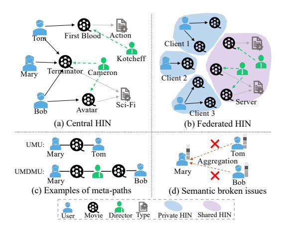
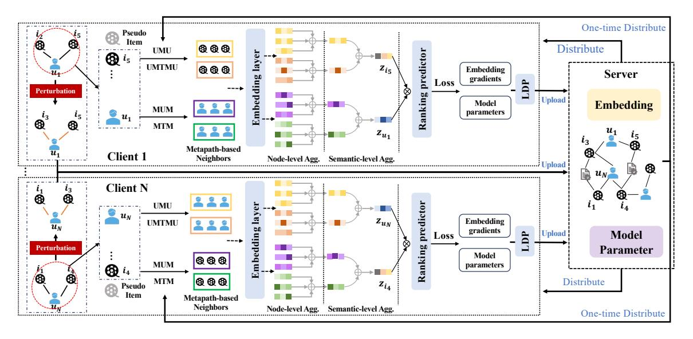
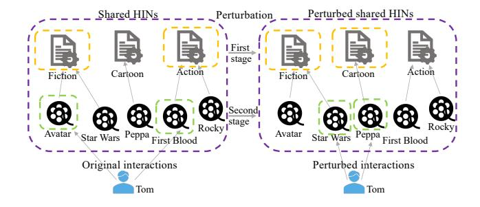
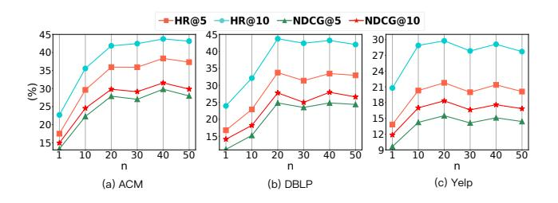
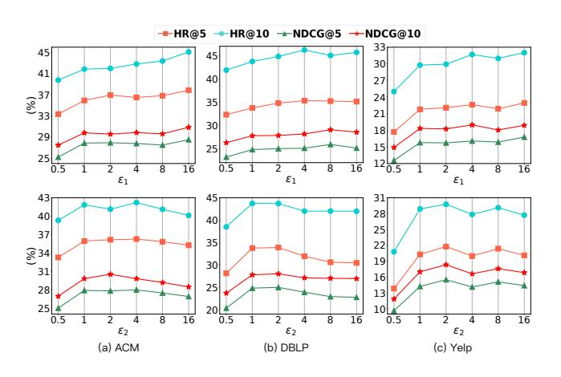
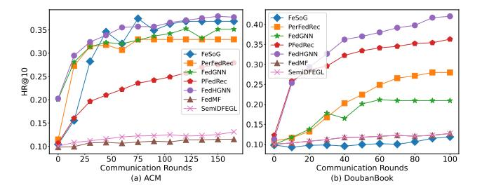

# Federated Heterogeneous Graph Neural Network for Privacy-preserving Recommendation

[Bo Yan](https://orcid.org/0000-0003-1750-3803) Beijing University of Posts and Telecommunications Beijing, China boyan@bupt.edu.cn

[Wenchuan Yang](https://orcid.org/0000-0003-3194-1690) National University of Defense Technology Changsha, China wenchuanyang97@163.com

[Yang Cao](https://orcid.org/0000-0002-6424-8633) Hokkaido University Sapporo, Japan yang@ist.hokudai.ac.jp

[Junping Du](https://orcid.org/0000-0002-9402-3806) Beijing University of Posts and Telecommunications Beijing, China junpingdu@126.com

# ABSTRACT

The heterogeneous information network (HIN), which contains rich semantics depicted by meta-paths, has emerged as a potent tool for mitigating data sparsity in recommender systems. Existing HIN-based recommender systems operate under the assumption of centralized storage and model training. However, real-world data is often distributed due to privacy concerns, leading to the semantic broken issue within HINs and consequent failures in centralized HIN-based recommendations. In this paper, we suggest the HIN is partitioned into private HINs stored on the client side and shared HINs on the server. Following this setting, we propose a federated heterogeneous graph neural network (FedHGNN) based framework, which facilitates collaborative training of a recommendation model using distributed HINs while protecting user privacy. Specifically, we first formalize the privacy definition for HIN-based federated recommendation (FedRec) in the light of differential privacy, with the goal of protecting user-item interactions within private HIN as well as users' high-order patterns from shared HINs. To recover the broken meta-path based semantics and ensure proposed privacy measures, we elaborately design a semantic-preserving user interactions publishing method, which locally perturbs user's high-order patterns and related user-item interactions for publishing. Subsequently, we introduce an HGNN model for recommendation, which conducts node- and semantic-level aggregations to capture recovered semantics. Extensive experiments on four datasets demonstrate that our model outperforms existing methods by a substantial margin (up to 34% in HR@10 and 42% in NDCG@10) under a reasonable privacy budget (e.g., = 1).

WWW '24, May 13–17, 2024, Singapore, Singapore

<https://doi.org/10.1145/3589334.3645693>

# [Haoyu Wang](https://orcid.org/0009-0004-1010-0723) Beijing University of Posts and Telecommunications Beijing, China wanghaoyu666@bupt.edu.cn

[Chuan Shi](https://orcid.org/0000-0002-3734-0266)∗ Beijing University of Posts and Telecommunications Beijing, China shichuan@bupt.edu.cn

## CCS CONCEPTS

• Security and privacy → Privacy-preserving protocols; • Information systems → Social recommendation.

### KEYWORDS

federated recommendation, heterogeneous information network, privacy-preserving, differential privacy

#### ACM Reference Format:

Bo Yan, Yang Cao, Haoyu Wang, Wenchuan Yang, Junping Du, and Chuan Shi. 2024. Federated Heterogeneous Graph Neural Network for Privacypreserving Recommendation. In Proceedings of the ACM Web Conference 2024 (WWW '24), May 13–17, 2024, Singapore, Singapore. ACM, New York, NY, USA, [11](#page-10-0) pages.<https://doi.org/10.1145/3589334.3645693>

#### 1 INTRODUCTION

Recommender systems play a crucial role in mitigating the challenges posed by information overload in various online applications [\[5,](#page-8-0) [16,](#page-8-1) [53\]](#page-8-2). However, their effectiveness is limited by the sparsity of user interactions [\[20,](#page-8-3) [23,](#page-8-4) [51\]](#page-8-5). To tackle this issue, heterogeneous information networks (HIN), containing multi-typed entities and relations, have been extensively utilized to enhance the connections of users and items [\[14,](#page-8-6) [30,](#page-8-7) [31,](#page-8-8) [50\]](#page-8-9). As a fundamental analysis tool in HIN, meta-path [\[32\]](#page-8-10), a relation sequence connecting node pairs, is widely used to capture rich semantics of HINs. Different meta-path can depict distinct semantics, as illustrated in Figure [1,](#page-1-0) the metapath UMU in the HIN for movie recommendation signifies that two users have watched the same movie, and the UMDMU depicts that two users have watched movies directed by the same director. Most HIN-based recommender methods leverage meta-path based semantics to learn effective user and item embeddings [\[13,](#page-8-11) [31\]](#page-8-8). Among them, early works integrate meta-path based semantics into useritem interaction modeling to enhance their representations [\[31,](#page-8-8) [50\]](#page-8-9). In recent years, the advent of graph neural networks (GNNs) have introduced a powerful approach to automatically capture meta-path based semantics, achieving remarkable results [\[8,](#page-8-12) [38,](#page-8-13) [52\]](#page-8-14). These GNN-based methods aggregate node embeddings along meta-paths to fuse different semantics, known as meth-path based neighbor aggregation [\[7,](#page-8-15) [15,](#page-8-16) [37,](#page-8-17) [51\]](#page-8-5), providing a more flexible framework for HIN-based recommendations.

∗Corresponding author.

Permission to make digital or hard copies of all or part of this work for personal or classroom use is granted without fee provided that copies are not made or distributed for profit or commercial advantage and that copies bear this notice and the full citation on the first page. Copyrights for components of this work owned by others than the author(s) must be honored. Abstracting with credit is permitted. To copy otherwise, or republish, to post on servers or to redistribute to lists, requires prior specific permission and/or a fee. Request permissions from permissions@acm.org.

© 2024 Copyright held by the owner/author(s). Publication rights licensed to ACM. ACM ISBN 979-8-4007-0171-9/24/05

WWW '24, May 13–17, 2024, Singapore, Singapore Bo Yan et al.

<!-- Image Description: This image illustrates different heterogeneous information network (HIN) architectures. (a) shows a centralized HIN, (b) a federated HIN, and (c) exemplifies meta-paths within the HIN. (d) depicts semantic inconsistencies in data aggregation across a HIN, highlighted by red crosses. Nodes represent users, movies, and directors, while edges represent relationships. The image serves to compare the architectures and illustrate potential challenges in HIN data integration. -->

Figure 1: Comparison of a HIN in the centralized setting and federated setting

Existing HIN-based recommendations hold a basic assumption that the data is centrally stored. As shown in Figure [1\(](#page-1-0)a) and (c), under this assumption, the entire HIN is visible and can be directly utilized to capture meta-path based semantics for recommendation. However, this assumption may not hold in reality since the user-item interaction data is highly privacy-sensitive, and the centralized storage can leak user privacy. Additionally, strict privacy protection regulations, such as the General Data Protection Regulation (GDPR)[1](#page-1-1) , prohibit commercial companies from collecting and exchanging user data without the user's permission. Therefore, centralized data storage may not be feasible in the future. As a more realistic learning paradigm, federated learning (FL) [\[25,](#page-8-18) [42\]](#page-8-19) has emerged to enable users to keep their personal data locally and jointly train a global model by transmitting only intermediate parameters. Federated recommendation (FedRec) is a crucial application of FL in the recommender scenario and many works have been dedicated to FedRec in recent years[\[1,](#page-8-20) [3,](#page-8-21) [18,](#page-8-22) [44\]](#page-8-23). Most of them focus on traditional matrix factorization (MF) based FedRec [\[3,](#page-8-21) [18\]](#page-8-22), where user embeddings are kept locally updated, and gradients of item embeddings are uploaded to the server for aggregation. Recently, a few studies have explored GNN-based FedRec [\[22,](#page-8-24) [24,](#page-8-25) [39\]](#page-8-26). They train local GNN models on the user-item bipartite graph and transmit gradients of embeddings and model parameters. Despite their success, they still suffer from data sparsity issues, which are further compounded by the distributed data storage.

A natural solution is utilizing HINs to enrich the sparse interactions. However, developing HIN-based FedRec is non-trivial. It faces two significant challenges. 1) How to give a formal definition of privacy in HIN-based FedRec? Traditional definitions based on solely user-item interactions may be infeasible in the HIN-based FedRec. Besides private user-item interactions, HIN-based FedRec can also utilize additional shared knowledge that contains no privacy and can be shared among users (e.g., movie-type and movie-director relations in Figure [1\(](#page-1-0)a)), which may also expose the user's highorder patterns, such as their favorite types of movies. Therefore, we should carefully consider the realistic privacy constraints of

HIN-based FedRec and give a rigorous privacy definition so that the privacy can be rigorously protected. 2) How to recover the broken semantics for HIN-based FedRec while protecting the defined privacy? The HIN is stored in a distributed manner in FedRec, as shown in Figure [1\(](#page-1-0)b), and users can only access their one-hop neighbors (interacted items). As a result, the integral semantics depicted by the meta-path are broken, leading to failure to conduct meta-path based neighbor aggregations, which is the key component for HIN-based recommendation. As depicted in Figure [1\(](#page-1-0)c) and (d), the meta-path based neighbor aggregations fail because of the broken semantics UMU and UMDMU. However, due to privacy constraints, it's unrealistic to directly exchange the user interaction data. Thus, it's challenging to recover the semantics with privacy guarantees.

To tackle these challenges, we delve into the study of HIN-based FedRec and propose a Federated Heterogeneous Graph Neural Network (FedHGNN) for privacy-preserving recommendations. 1) To clarify the privacy that should be protected, we present a formal privacy definition for HIN-based FedRec. We suggest a realistic setting that the entire HIN is partitioned into private HINs stored on the client side and shared HINs on the server side. Under this setting, we rigorously formalize two kinds of privacy for HIN-based FedRec in the light of differential privacy [\[6\]](#page-8-27), including the privacy reflecting the user's high-order patterns from shared HINs and the privacy of user-item interactions with specific patterns in the private HIN. 2) To recover the broken semantics while protecting proposed privacy, we introduce a semantic-preserving user interaction publishing algorithm, the core of which is a two-stage perturbation mechanism. Specifically, the first stage perturbs the user's high-order patterns from shared HINs by a dedicated designed exponential mechanism (EM) [\[6\]](#page-8-27). To maintain the utility of perturbed data, we select the shared HINs that are relevant to the user's true patterns with a higher probability. The second stage perturbs user-item interactions within each selected shared HIN in a degree-preserving manner, which avoids introducing more noise and also enhances the interaction diversity. Users perturb their interactions locally by the two-stage perturbation mechanism and upload them to the server for recovering semantics. We also provide rigorous privacy guarantees for this publishing process. Based on the recovered semantics, we further propose a general heterogeneous GNN model for recommendation, which captures semantics through a two-level meta-path-guided aggregation.

The major contributions of this paper are summarized as follows:

- To the best of our knowledge, this is the first work to study the HIN-based FedRec, which is an important and practical task in real-world scenarios.
- We design a FedHGNN framework for HIN-based FedRec. We give a formal privacy definition and propose a novel semantic-preserving perturbation method to publish user interactions for recommendation. We also give rigorous privacy guarantees for the publishing process.
- We conduct extensive experiments on four real-world datasets, which demonstrate that FedHGNN improves existing FedRec methods by up to 34% in HR@10 and 42% in NDCG@10, while maintaining a reasonable privacy budget. Additionally, FedHGNN achieves comparable or even superior results compared to centralized methods.

1https://gdpr-info.eu

Federated Heterogeneous Graph Neural Network for Privacy-preserving Recommendation WWW '24, May 13–17, 2024, Singapore, Singapore

#### 2 PRELIMINARY

In this paper, we conduct HIN-based FedRec for implicit feedback. Let and denote the user set and item set. We give the related concepts as follows.

#### 1 Heterogeneous Information Network

Definition 2.1. Heterogeneous Information Network (HIN) [\[34\]](#page-8-28). A HIN = ( , ) consists of an object set and a link set . It is also associated with an object type mapping function : → A and a link type mapping function : → R. A and R are the predefined sets of object and link types, where |A| + |R| > 2.

Definition 2.2. Meta-path. Given a HIN with object types A and link types R, a meta-path can be denoted as a path in the form of 1 1 −−→ 2 2 −−→ · · · −−→ +1 , where ∈ A and ∈ R. Meta-path describes a composite relation = 1 ◦2 ◦ ... ◦ between object 1 and +1 , where ◦ denotes the composition operator on relations. Then given a node and a meta-path , the meta-path based neighbors N of are the nodes connecting with via the meta-path . In a HIN, the rich semantics between two objects can be captured by multiple meta-paths.

#### 2 Privacy Definition

Definition 2.3. Private HIN. A private HIN = (, ) is defined as a subgraph of . It is associated with an object type mapping function : → A and a link type mapping function : → R , where R ⊂ R is the set of private link types. A user-level private HIN contains a user ∈ and its interacted item set ⊂ . The link set exists between and denoting personally private interactions.

Definition 2.4. Shared HIN. A shared HIN = ( , ) is defined as a subgraph of. It is associated with an object type mapping function : → A and a link type mapping function : → R , where R is the set of shared link types.

As depicted in Figure [1\(](#page-1-0)a) and (b), under federated setting, the movie network is divided into user-level private HINs stored in each client and shared HINs stored in the server. A user-level private HIN includes a user's private interactions while shared HINs contain shared knowledge such as movie-director relations.

A user could associate with many shared HINs based on interacted items. For example, Figure [1](#page-1-0) (a) and (b) depict that two shared HINs are related to Tom, and one shared HIN is related to Mary. These user-related shared HINs reflect high-order patterns of users (e.g., favorite types of movies) and should be protected. We call this privacy as semantic privacy, denoted as a user-related shared HIN list = (1, · · · , | G | ) ∈ {0, 1} | G | , where G denotes the whole shared HIN set. Then we formalize semantic privacy as follows:

Definition 2.5. -Semantic Privacy. Given a user-related shared HIN list , a perturbation mechanism M satisfies -semantic privacy if and only if for any ˆ, such that and ˆ only differ in one bit, and any ˜ ∈ (M), we have [M ()=˜] [M (ˆ)=˜] ≤ .

Besides, each user also owns a adjacency list = (1, · · · , | | ) ∈ {0, 1} | | . Given , we can extract a subset from the whole item set , which is called semantic guided item set. Similarly, we can obtain semantic guided adjacency list denoted as = (1, · · · , | | ) ∈ {0, 1} | | , which depicts the user-item interactions with specific patterns and should also be protected. we call this privacy as semantic guided interaction privacy and formalize as:

Definition 2.6. -Semantic Guided Interaction Privacy. Given a semantic guided adjacency list , a perturbation mechanism M satisfies -semantic guided interaction privacy if and only if for any ˆ , such that and ˆ only differ in one bit, and any ˜ ∈ (M), we have [M ( )=˜ ] [M (ˆ )=˜ ] ≤ .

 is called the privacy budget that controls the strength of privacy protection. It is obvious that if a perturbation algorithm satisfies these definitions, the attacker is hard to distinguish the user's highorder pattern as well as the true interacted items.

#### 3 Task Formulation

Based on the above preliminaries, we define our task as follows:

Definition 2.7. HIN-based FedRec. Given user-level private HINs G = { 1 ,2 , ...,| | } and shared HINs G = { 1 ,2 , ..., }. The corresponding to the user ∈ is stored in the -th client, while G is stored in the server. We aim to collaboratively train a global model based on these distributed HINs with satisfying -semantic privacy and -semantic guided interaction privacy, which can recommend a ranked list of interested items for each user ∈ .

#### 3 METHODOLOGY

In this section, we give a detailed introduction to the proposed model FedHGNN. We first give an overview of FedHGNN. Then we present two main modules of FedHGNN, the semantic-preserving user-item interaction publishing and heterogeneous graph neural networks (HGNN) for recommendation. Finally, we give a privacy analysis of the proposed publishing process.

#### 1 Overview of FedHGNN

Different from existing FedRec systems that only utilize user-item interactions, FedHGNN also incorporates HINs into user and item modeling, which can largely alleviate the cold-start issue caused by data sparsity. Besides, as a core component of FedHGNN, the semantic-preserving user-item publishing mechanism recovers semantics with rigorous privacy guarantees, which can be applied to all meta-path based FedRec systems technically. We present the overall framework of FedHGNN in Figure [2.](#page-3-0) As can be seen, it mainly includes two steps, i.e., user-item interaction publishing and HGNN-based federated training. At the user-item interaction publishing step, each client perturbs local interactions using our two-stage perturbation mechanism and then uploads the perturbed results to the server. After the server receives local interactions from all clients, it can form an integral perturbed HIN, which is then distributed to each client to recover the meta-path based semantics. Note that the publishing step is only conducted once in the whole federated training process. At the federated training step, clients collaboratively train a global recommendation model based on recovered neighbors, which performs node-level neighbor aggregations followed by semantic-level aggregations. Then a ranking loss is adapted to optimize embedding and model parameters. At

<!-- Image Description: This figure illustrates a distributed learning framework for recommendation systems. It depicts two client nodes (Client 1 and Client N) independently processing user-item interaction data, incorporating metapath-based neighbors and an embedding layer. Each client then uploads embedding gradients and model parameters to a central server via Local Differential Privacy (LDP). The server aggregates these, updates the embedding, and redistributes it. The diagram shows data flow and processing steps within a federated learning architecture. -->

Figure 2: The overall framework of FedHGNN

each communication round, each participating client locally trains the model and uploads the embedding and model gradients to the server for aggregations. To further protect privacy when uploading gradients, we apply local differential privacy (LDP) to the uploaded gradients. Besides, following previous work [\[22,](#page-8-24) [39\]](#page-8-26), we also utilize pseudo interacted items during local training.

# 2 Semantic-preserving User-item Interactions Publishing

To recover the semantics of the centralized HIN (obtaining the meta-path based neighbors), directly uploading the adjacency list to the server can not satisfy the privacy definition because the user-item interactions are exposed. To address this, we first present a naive solution based on random response (RR) [\[6\]](#page-8-27) and illustrate its defects of direct applications to our task. Then we give detailed introductions of our proposed two-stage perturbation mechanism for user-item interaction publishing. As depicted in Figure [3,](#page-3-1) it first perturbs the user-related shared HINs and then perturbs the user-item interactions within selected shared HINs, which not only achieves semantic-preserving but also satisfies the defined privacy. Random response (RR). As many homogeneous graph metrics publishing [\[11,](#page-8-29) [27,](#page-8-30) [35,](#page-8-31) [43\]](#page-8-32), a straw-man approach is directly utilizing RR [\[6\]](#page-8-27) to perturb each user's adjacency list , i.e., the user flips each bit of with probability = 1 1+ . However, this naive strategy faces both privacy and utility limitations. For privacy, although it satisfies the -semantic guided interaction privacy, it can not achieve our -semantic privacy goal. As for utility, it has been theoretically proved that RR would make a graph denser [\[27\]](#page-8-30). Unfortunately, there exists perturbation enlargement phenomenon [\[48\]](#page-8-33) in the HGNNs, i.e., introducing more edges may harm the HGNN's performance, which is also confirmed in our latter experiments. Besides, RR fails to accommodate the semantic-preserving since it perturbs all bits of . We can only perturb the semantic guided item set to preserve semantics but this will expose the user's

<!-- Image Description: The diagram illustrates a two-stage perturbation of a user's (Tom) heterogeneous information network (HIN). The left side shows the original HIN, with movie genre nodes (Fiction, Cartoon, Action) connected to movie nodes (Avatar, Star Wars, Peppa, First Blood, Rocky). The right depicts the perturbed HIN after two perturbation stages, showing altered connections between genres and movies. The purpose is to visually represent the data perturbation process within the HIN for robustness analysis, likely in the context of recommendation systems or similar applications. -->

Figure 3: The two-stage perturbation mechanism for useritem interaction publishing

high-order patterns. Furthermore, the denser graph largely hinders the training speed and compounds the communication overhead in the federated setting.

User-related shared HIN perturbation. Based on the above analysis, we propose a two-stage perturbation mechanism. The first stage performs user-related shared HIN perturbation, which utilizes EM to select shared HINs for publishing. Intuitively, the true user-related shared HIN should be selected with a high probability. Therefore, according to the theory of EM, for a user with related shared HIN set , we design the utility of selecting a shared HIN as follows:

$$
q(g, u, G_s) = sim(G_s, G_s^u)
$$

=
$$
\max_{G'_s \in G_s^u} \left\{ \frac{1}{2} (cos(e_{G_s}, e_{G'_s}) + 1) \right\},
$$
 (1)

where G is the shared HIN set of and ∈ G is the selected shared HIN. is the representation of which is the average of related items' embeddings. Eq. [\(1\)](#page-3-2) indicates that if a shared HIN is more similar to user-related shared HIN set G , it should be selected with a high probability. In this regard, the similarity function has multiple choices. We choose the highest cosine similarity score among G as the similarity function mainly in consideration of achieving a smaller sensitivity to obtain higher utility. In this way, the sensitivity Δ is:

$$
\Delta q = \max_{G_s} \max_{g \sim \hat{g}} |q(g, u, G_s) - q(\hat{g}, u, G_s)| = 1,
$$
 (2)

where ∼ ˆ denotes that and ˆ only differ in one bit. Then according to the EM, a shared HIN is selected with probability:

$$
Pr(G_s) = \frac{\exp(\epsilon q(g, u, G_s)/(2\Delta q))}{\sum_{G'_s \subset G_s} \exp(\epsilon q(g, u, G'_s)/(2\Delta q))}.
$$
 (3)

The above selection process is repeated |G | times without replacement to ensure diversity. Then we can obtain the perturbed user's shared HIN list ˜. By this mechanism, the user's high-order patterns are maximum preserved since we select similar shared knowledge with high probability.

User-item interaction perturbation. After obtaining the perturbed ˜ (w.r.t. G˜ ), we can extract a semantic guided item set . The user-item interaction perturbation is conducted within the rather than the whole item set. Since our -semantic guided interaction privacy is defined within the , ignoring the items outside of has no effect on privacy guarantees. Besides, it also avoids introducing more irrelevant items and reduces the communication cost. In light of the user-related shared HIN having been perturbed in the first stage, we can directly apply RR to perturb . However, in HIN-based recommendations, the size of is still large due to the relatively small number of shared HINs, thus introducing more irrelevant items.

Inspired by [\[11\]](#page-8-29), we propose a user-item interaction perturbation mechanism, which performs degree-preserving RR (DPRR) [\[11\]](#page-8-29) on each of semantic guided item set. Specifically, given user and G˜ , we can split semantic guided item set into |G˜ | subsets. For each subset , we use a adjacency list = ( 1 , . . . , | | ) ∈ |

{0, 1} to denote the user-item interactions. DPRR perturbs each bit of by first applying RR and then with probability to keep a result of 1 (a user-item interaction) unchanged. Thus the probability of each bit being perturbed to 1 is:

$$
Pr(\tilde{a}_{s_{i}j}^{u}=1) = \begin{cases} (1-p)q_{s_{i}}^{u} & (\text{if } a_{s_{i}j}^{u}=1) \\ pq_{s_{i}}^{u} & (\text{if } a_{s_{i}j}^{u}=0). \end{cases}
$$
(4)

Assuming the true degree of user within the subset is (i.e., the number of 1 in ), according to the degree preservation property [\[11\]](#page-8-29), the should be set as follows:

$$
q_{s_i}^u = \frac{d_{s_i}^u}{d_{s_i}^u (1 - 2p) + |I_{s_i}^u| p}.
$$
\n(5)

In practice, the will be further clipped to [0, 1] to form probability. Note that the subset may not contain user-item interactions due to the perturbation on the shared HINs, in which case =0. That is, we abandon a part of the interacted items, leading to semantic losses. Instead of that, we randomly select some items within so that the total degree is equal to the true degree . We argue that in this way the semantics of user-item interactions are preserved in light of our shared HIN selection mechanism.

# 3 Heterogeneous Graph Neural Networks for Recommendation

Given a recovered meta-path, our HGNN first utilizes node-level attention to learn the weights of different neighbors under the meta-path. Then the weighted aggregated embeddings are fed into a semantic-level attention to aggregate embeddings under different meta-paths. Following this process, we give an illustration of obtaining user embeddings, and item embeddings are the same.

Node-level aggregation. Let ℎ denotes the raw feature of a user . Giving a meta-path and the recovered meta-path based neighbors N of , the HGNN learns the weights of different neighbors via self-attention [\[33\]](#page-8-34) followed by a softmax normalization layer:

$$
\alpha_{u_i u_j}^{\rho_k} = \text{softmax}_{u_j \in \mathcal{N}_{u_i}^{\rho_k}} (\sigma(\mathbf{a}_{\rho_k}^T \cdot [\mathbf{W}_{\rho_k} \cdot h_{u_i} || \mathbf{W}_{\rho_k} \cdot h_{u_j}])). \tag{6}
$$

where W and a are the meta-path-specific learnable parameters. Note that N only keeps the user neighbors along with the meta-path. After obtaining the attention weights, the model performs node-level aggregations to get the meta-path based user embeddings:

$$
z_{u_i}^{\rho_k} = \sigma\left(\sum_{u_j \in \mathcal{N}_{u_i}^{\rho_k}} \alpha_{u_i u_j}^{\rho_k} \cdot h_{u_j}\right). \tag{7}
$$

Since the neighbors are all in the meta-path , the semantics of are fused into the user's embeddings. Thus given the meta-path set P = {1, . . . , }, we can obtain meta-path based embeddings { 1 , . . . , } of .

Semantic-level aggregation. User embedding with the specific meta-path only contains a single semantic (e.g., U-M-U). After we obtain user embeddings from different meta-paths, an attentionbased semantic-level aggregation is conducted to fuse different semantics. Specifically, The importance (attention weights) of specific meta-path is explained as averaging all corresponding transformed user embeddings, which is learned as follows:

$$
\beta^{\rho_k} = \text{softmax}_{\rho_k \in \mathcal{P}} \left( \frac{1}{|\mathcal{U}|} \sum_{u_i \in \mathcal{U}} \mathbf{q}^{\mathrm{T}} \cdot \tanh(\mathbf{W} \cdot z_{u_i}^{\rho_k} + \mathbf{b}) \right), \quad (8)
$$

where Wand q are the semantic-level parameters that are shared for all meta-paths and b is the bias vector. Then we perform semanticlevel aggregations based on learned attention weights to obtain the final user embedding :

$$
z_{u_i} = \sum_{\rho_k \in \mathcal{P}} \beta^{\rho_k} \cdot z_{u_i}^{\rho_k}.
$$
 (9)

Ranking loss. Through the above process, we can obtain the final individual user embedding and item embedding respectively. The ranking score is defined as the inner product of them: ˆ = T . Then, a typical Bayesian Personalized Ranking (BPR) loss function [\[29\]](#page-8-35) is applied to optimize the parameters:

$$
\mathcal{L}_{u_i} = -\sum_{v_j \in I^{u_i}} \sum_{v_k \notin I^{u_i}} \ln \sigma(\hat{y}_{u_i v_j} - \hat{y}_{u_j u_k}), \tag{10}
$$

where is the positive items set and ∉ is the negative item which is uniformly sampled.

## 4 Privacy Analysis

In this section, we give an analysis of our proposed semanticpreserving user-item interactions publishing, which satisfies both 1-semantic privacy and 2-semantic guided interaction privacy.

Theorem 3.1. The semantic-preserving user-item interactions publishing mechanism achieves 1-semantic privacy.

Proof. Let and ˆ denote any two user-related shared HIN lists which only differ in one bit, and any output ˜ after the firststage perturbation (denoted as M = {M 1 , . . . ,M } w.r.t. selections). Assuming the total privacy budget is 1 and each selection consumes 1 privacy budget. Since each selection is independent, we have:

$$
\frac{\Pr(M^{skp}(g^{u}) = \tilde{g^{u}})}{\Pr(M^{skp}(\hat{g^{u}}) = \tilde{g^{u}})} = \frac{\Pi_{i=1}^{n} \Pr(M_{i}^{skp}(g^{u}, q, \mathcal{G}_{s}) = G_{s_{i}})}{\Pi_{i=1}^{n} \Pr(M_{i}^{skp}(\hat{g^{u}}, q, \mathcal{G}_{s}) = G_{s_{i}})}
$$
\n
$$
= \Pi_{i=1}^{n} \frac{\Pr(M_{i}^{skp}(g^{u}, q, \mathcal{G}_{s}) = G_{s_{i}})}{\Pr(M_{i}^{skp}(\hat{g^{u}}, q, \mathcal{G}_{s}) = G_{s_{i}})},
$$

According to the EM, we have:

$$
\frac{\Pr(\mathcal{M}_i^{skp}(g^u, q, \mathcal{G}_s) = G_{s_i})}{\Pr(\mathcal{M}_i^{skp}(\hat{g^u}, q, \mathcal{G}_s) = G_{s_i})} \leq e^{\frac{\epsilon_1}{n}},
$$

Thus

$$
\frac{\Pr(\mathcal{M}^{skp}(g^u)=\tilde{g^u})}{\Pr(\mathcal{M}^{skp}(\hat{g^u})=\tilde{g^u})}\leq \Pi_{i=1}^n e^{\frac{\epsilon_1}{n}}=e^{\epsilon_1}.
$$

□

Theorem 3.2. The semantic-preserving user-item interactions publishing mechanism achieves 2-semantic guided interaction privacy.

Proof. After the first-stage perturbation, we can obtain the semantic guided item set and semantic guided adjacency list based on ˜. Let ˆ denotes any adjacency list that only differs one bit with . Without loss of generality, we assume 1 ≠ ˆ 1 . The second-stage perturbation is equivalent to first applying RR and then flipping each bit of 1 with probability 1 − . Denoting the RR perturbation as M, we have:

$$
\frac{\Pr(\mathcal{M}^{RR}(a_s^u) = \tilde{a}_s^u)}{\Pr(\mathcal{M}^{RR}(\hat{a}_s^u) = \tilde{a}_s^u)} = \frac{\Pr(a_{s1}^u \rightarrow \tilde{a}_{s1}^u) \dots \Pr(a_{s|I_s^u|}^u \rightarrow a_{s|I_s^u|}^u)}{\Pr(a_{s1}^{\hat{u}} \rightarrow \tilde{a}_s^{\hat{u}}) \dots \Pr(a_{s|I_s^u|}^u \rightarrow a_{s|I_s^u|}^u)} = \frac{\Pr(a_{s1}^u \rightarrow \tilde{a}_{s1}^{\hat{u}})}{\Pr(a_{s1}^{\hat{u}} \rightarrow \tilde{a}_{s1}^{\hat{u}})} \le \frac{1 - p}{p}
$$
$$
= e^{\epsilon_2}.
$$

The subsequent flipping operation can be viewed as post-processing on the ˜ , thus the whole perturbation also achieving 2-semantic guided interaction privacy. □

### 4 EXPERIMENTS

#### 1 Experimental Setup

Datasets. We employ four real HIN datasets, including two academic datasets (ACM and DBLP) and two E-commerce datasets (Yelp and Douban Book), where the basic information is summarized in

Table [1.](#page-5-0) The user nodes and the private link types are marked in bold. For ACM and DBLP, the item nodes means authors.

Table 1: Dataset statistics.

| Dataset        | # Nodes                                                                  | # Private/Shared Links              | Meta-paths                       |  |
|----------------|--------------------------------------------------------------------------|----------------------------------------|----------------------------------|--|
| ACM            | Paper (P): 4025 Author (A): 17431 Conference (C): 14               | P-A: 13407 P-C: 4025                | P-A-P P-C-P A-P-A          |  |
| DBLP           | Paper (P): 14328 Author (A): 4057 Conference (C): 20               | P-A: 19645 P-C: 14328               | P-A-P P-C-P A-P-A          |  |
| Yelp           | User (U): 8743 Business (B): 3985 Category (C): 511                | U-B: 14896 B-C: 11853               | U-B-U U-B-C-B-U B-U-B      |  |
| Douban Book | User (U): 6793 Book (B): 8322 Group (G): 2936 Author (A): 10801 | U-B: 21179 U-G: 664847 B-A: 8171 | U-B-U U-G-U B-U-B B-A-B |  |

Baselines. Following [\[39\]](#page-8-26), we compare FedHGNN with two kinds of baselines: recommendation model based on centralized data-storage (including HERec [\[31\]](#page-8-8), HAN [\[37\]](#page-8-17), NGCF [\[36\]](#page-8-36), light-GCN [\[10\]](#page-8-37), RGCN [\[30\]](#page-8-7), HGT [\[14\]](#page-8-6)) and federated setting for privacypreserving (including FedMF [\[3\]](#page-8-21), FedGNN [\[39\]](#page-8-26), FedSog [\[22\]](#page-8-24), PerFedRec [\[24\]](#page-8-25), PFedRec[\[46\]](#page-8-38), SemiDFEGL[\[28\]](#page-8-39)). The details of them are shown in Appendix [B.](#page-9-0)

Implementation Details. For all the baselines, the node features are randomly initialized and the hidden dimension is set to 64. We tune other hyper-parameters to report the best performance. We keep the available heterogeneous information (e.g., meta-paths) the same for all HIN-based methods. We modify the loss function to be the BPR loss as the same with ours. In FedHGNN, the learning rate is set as 0.01, 1 and 2 are all set as 1. For each dataset, we first perform item clustering based on shared knowledge so that each item only belongs to one shared HIN. The number of shared HIN (number of clustering) is set as 20 for all datasets. The batch size (the number of participated clients in each round) is set as 32. For LDP and pseudo-interacted items, we set the hyper-parameters as the same with [\[22\]](#page-8-24). Following [\[24\]](#page-8-25), we apply the leave-one-out strategy for evaluation and use HR@K and NDCG@K as metrics. We will also provide an implementation based on GammaGL [\[21\]](#page-8-40).

#### 2 Overall Performance

Table [2](#page-6-0) shows the overall results of all baselines on four datasets. The following findings entail from Table [2:](#page-6-0) (1) FedHGNN outperforms all the FedRec models by a big margin (up to 34% in HR@10 and 42% in NDCG@10), which demonstrates the effectiveness of our model. Surprisingly, FedHGNN also outperforms several centralized models (notably non-HIN based methods, e.g., NGCF), indicating the significance of utilizing rich semantics of HIN in FedRec. We also assume the perturbation can be seen as an effective data augmentation to alleviate cold-start issues. Since we find the interactions of some inactive users slightly increase after perturbation. (2) Among centralized baselines, HIN-based methods perform better, especially on sparse datasets (e.g., DBLP), owing to introducing

Federated Heterogeneous Graph Neural Network for Privacy-preserving Recommendation WWW '24, May 13–17, 2024, Singapore, Singapore

|            | Model | HERec  | HAN    | NGCF   | lightGCN | RGCN   | HGT    | FedMF  |         |        | FedGNN FedSog PerFedRec PFedRec |        | SemiDFEGL | FedHGNN |
|------------|-------|--------|--------|--------|----------|--------|--------|--------|---------|--------|---------------------------------|--------|-----------|---------|
| ACM        | H@5   | 0.3874 | 0.4152 | 0.3845 | 0.3684   | 0.2929 | 0.3834 | 0.0834 | 0.2608  | 0.2905 | 0.2516                          | 0.2733 | 0.2065    | 0.3593  |
|            | H@10  | 0.4525 | 0.4727 | 0.4379 | 0.4737   | 0.4619 | 0.5035 | 0.1331 | 0.345   | 0.3642 | 0.3229                          | 0.3533 | 0.3083    | 0.4185  |
|            | N@5   | 0.3222 | 0.335  | 0.322  | 0.2624   | 0.1752 | 0.2612 | 0.056  | 0.193   | 0.2201 | 0.1824                          | 0.1982 | 0.1384    | 0.2787  |
|            | N@10  | 0.3333 | 0.3537 | 0.3393 | 0.2968   | 0.2302 | 0.3001 | 0.072  | 0.2202  | 0.2438 | 0.2055                          | 0.224  | 0.171     | 0.298   |
|            | H@5   | 0.3265 | 0.3877 | 0.3161 | 0.3256   | 0.387  | 0.3252 | 0.0998 | 0.2301  | 0.1978 | 0.1676                          | 0.2843 | 0.1442    | 0.3376  |
| DBLP       | H@10  | 0.3882 | 0.4498 | 0.3895 | 0.4419   | 0.5074 | 0.4763 | 0.1606 | 0.3252  | 0.2691 | 0.2619                          | 0.3863 | 0.2518    | 0.4373  |
|            | N@5   | 0.2586 | 0.33   | 0.246  | 0.2281   | 0.2763 | 0.2264 | 0.0603 | 0.167   | 0.14   | 0.105                           | 0.2005 | 0.091     | 0.2481  |
|            | N@10  | 0.2717 | 0.3503 | 0.27   | 0.2646   | 0.3151 | 0.2748 | 0.0732 | 0.1963  | 0.163  | 0.1352                          | 0.2332 | 0.1253    | 0.2778  |
| Yelp       | H@5   | 0.2322 | 0.2877 | 0.1831 | 0.2368   | 0.2844 | 0.3322 | 0.0712 | 0.1801  | 0.1839 | 0.1513                          | 0.1572 | 0.1903    | 0.2178  |
|            | H@10  | 0.3322 | 0.4077 | 0.2958 | 0.3684   | 0.3907 | 0.4635 | 0.1259 | 0.2596  | 0.2715 | 0.237                           | 0.2249 | 0.28      | 0.2977  |
|            | N@5   | 0.1637 | 0.1929 | 0.1127 | 0.1881   | 0.2003 | 0.2311 | 0.0444 | 0.1221  | 0.1227 | 0.1002                          | 0.1077 | 0.121     | 0.1578  |
|            | N@10  | 0.1961 | 0.2316 | 0.1493 | 0.2307   | 0.2346 | 0.2733 | 0.0619 | 0.1477  | 0.1508 | 0.1277                          | 0.1294 | 0.1497    | 0.1834  |
| Book Db | H@5   | 0.248  | 0.2488 | 0.1572 | 0.2927   | 0.3321 | 0.3431 | 0.0859 | 0.1528  | 0.2505 | 0.2039                          | 0.2842 | 0.0911    | 0.3213  |
|            | H@10  | 0.323  | 0.3602 | 0.2331 | 0.3902   | 0.4819 | 0.4973 | 0.1411 | 0.22273 | 0.3464 | 0.2727                          | 0.3638 | 0.1367    | 0.438   |
|            | N@5   | 0.1767 | 0.1704 | 0.1067 | 0.2198   | 0.2239 | 0.2307 | 0.0529 | 0.1017  | 0.1743 | 0.1435                          | 0.2037 | 0.0636    | 0.2135  |
|            | N@10  | 0.2011 | 0.2084 | 0.1289 | 0.2518   | 0.2671 | 0.2802 | 0.066  | 0.1257  | 0.2053 | 0.1658                          | 0.2295 | 0.0804    | 0.2511  |

Table 2: Overall performance of different methods on Four datasets. The best result is in bold.

additional semantic information to alleviate cold-start issues. It has also been observed that GNN-based methods (HAN, RGCN, and HGT) achieve better results than non-GNN based methods (HERec), indicating that GNNs are more potent in capturing semantic information. (3) Among federated baselines, FedMF performs poorly because it ignores the high-order interactions which are significant for cold-start recommendation. Other federated models (FedGNN, FedSog, PerFedRec, and SemiDFEGL) improve this by privacy-preserving graph expansion (FedSog assumes social relation is public). SemiDFEGL performs relatively poorly since it focuses more on parameter efficiency and reducing communication costs rather than utility. It's surprising to find that PFedRec outperforms FedMF by a large margin and even outperforms some GNN-based FedRec baselines. We discover that it's attributed to the personal item embeddings and the same parameter initialization of score functions, which is an interesting finding and worth studying in future works. Compared to these methods, our FedHGNN further considers semantic information with theoretically guaranteed privacy protection.

#### 4.3 Ablation Study

To have an in-depth analysis of our two-stage perturbation mechanism, we conduct ablation studies to dissect the effectiveness of different modules. We design 7 variants based on FedHGNN and the performance of these variants is outlined in Table [3.](#page-7-0) FedHGNN∗ is the FedHGNN model without two-stage perturbation. RR means random response and DPRR is the degree-preserving RR. +S indicates adding corresponding perturbation to each semantic guided adjacency list , otherwise to each user's adjacency list . Note that SDPRR∗ indicates performing DPRR to the whole semantic guided adjacency list , which is the only difference with our Fed-HGNN. +E indicates adding EM perturbation. We set 2 = 2 = 1 for all variants except that 2 = 6 for RR-related variants, due to a smaller 2 makes the graph denser, which sharply increases training time and consumed memory.

From the table, we have several findings: (1) The performance of FedHGNN is even superior to the model without perturbation in ACM and DBLP, and removing the first-stage perturbation (+SDPRR) can achieve better results. In contrast, +DPRR obtains worse results, indicating that the main factor for improving the FedHGNN is the DPRR on each semantic guided adjacency list. Considering the relatively sparse datasets and a slight increment of some inactive user's interactions after the SDPRR, we conclude that SDPRR has the ability to tackle data sparsity in recommendations since it augments data in a semantic-preserving manner meanwhile keeping data diversity. (2) Pure RR and DPRR perform poorly since they perturb user-item interactions randomly without considering semantic preserving. Pure RR performs even worse due to it making a graph denser and causing perturbation enlargements [\[48\]](#page-8-33). DPRR preserves degrees but fails to preserve user-item interaction patterns. Thus we can draw a conclusion that semantic-preserving requires both degree-preserving and feature-preserving. Perturbation within the semantic guided item set (+SRR and +SDPRR) performs much better, which further verifies our conclusion. (3) Adding first-stage perturbation will harm the performance but is necessary, otherwise we can't protect the user's high-order patterns. Thanks to our designed similarity-based EM, the user's high-order patterns are maximum preserved and the performance has not decreased dramatically. Note that FedHGNN also outperforms +ESDPRR∗ , indicating we should keep the diversity of user-item interactions after EM, i.e., the interacted items should exist in each selected shared HIN.

#### 4 Parameter Analysis

In this section, we investigate the impacts of some significant parameters in FedHGNN, including the number of shared HINs, as well as the privacy budgets 1 and 2.

Analysis of different numbers of shared HINs. To demonstrate the effects of different numbers of shared HINs, we fix other hyper-parameters unchanged and vary to compare the performance. The results are depicted in Figure [4.](#page-7-1) Considering two

|      | Model   | FedHGNN∗ +RR +DPRR +SRR +SDPRR +E +ESRR |        | +ESDPRR∗ | FedHGNN |        |        |        |        |        |
|------|---------|-----------------------------------------------------------|--------|----------|---------|--------|--------|--------|--------|--------|
| ACM  | HR@5    | 0.3118                                                    | 0.0495 | 0.1749   | 0.3437  | 0.389  | 0.3461 | 0.2959 | 0.3475 | 0.3593 |
|      | HR@10   | 0.3961                                                    | 0.1118 | 0.2268   | 0.4998  | 0.5027 | 0.4004 | 0.3861 | 0.4069 | 0.4185 |
|      | NDCG@5  | 0.2293                                                    | 0.0345 | 0.1326   | 0.2312  | 0.2865 | 0.266  | 0.215  | 0.266  | 0.2787 |
|      | NDCG@10 | 0.2567                                                    | 0.0491 | 0.1492   | 0.2845  | 0.323  | 0.2835 | 0.2438 | 0.2852 | 0.298  |
| DBLP | HR@5    | 0.2824                                                    | 0.0694 | 0.1678   | 0.2224  | 0.3346 | 0.2616 | 0.2729 | 0.3156 | 0.3376 |
|      | HR@10   | 0.3934                                                    | 0.1237 | 0.2394   | 0.3154  | 0.4557 | 0.3701 | 0.3718 | 0.4227 | 0.4373 |
|      | NDCG@5  | 0.2176                                                    | 0.0429 | 0.1115   | 0.1458  | 0.2484 | 0.1835 | 0.1929 | 0.2273 | 0.2481 |
|      | NDCG@10 | 0.241                                                     | 0.0602 | 0.1413   | 0.1757  | 0.2801 | 0.2176 | 0.2249 | 0.2619 | 0.2778 |
| Yelp | HR@5    | 0.2583                                                    | 0.0663 | 0.1383   | 0.1172  | 0.2364 | 0.2244 | 0.223  | 0.1871 | 0.2178 |
|      | HR@10   | 0.3482                                                    | 0.1232 | 0.2079   | 0.1803  | 0.3245 | 0.3242 | 0.3257 | 0.2624 | 0.2977 |
|      | NDCG@5  | 0.1859                                                    | 0.0392 | 0.0963   | 0.0672  | 0.171  | 0.152  | 0.1538 | 0.1321 | 0.1578 |
|      | NDCG@10 | 0.2201                                                    | 0.0575 | 0.1185   | 0.0789  | 0.1976 | 0.1875 | 0.1804 | 0.1563 | 0.1834 |

Table 3: Performance of different variants of FedHGNN on three datasets.

<!-- Image Description: This image displays three line graphs comparing HR@5, HR@10, NDCG@5, and NDCG@10 metrics across datasets (ACM, DBLP, Yelp). The x-axis represents a parameter 'n', and the y-axis shows the percentage. Each graph illustrates the performance of these metrics as 'n' increases, allowing the comparison of algorithm performance across different datasets. The purpose is to demonstrate the impact of 'n' on the evaluation metrics in the context of the research. -->

Figure 4: Effects of different number of shared HINs

<!-- Image Description: The image presents nine line graphs, three sets of three, illustrating the performance of a ranking model across three datasets (ACM, DBLP, Yelp). Each graph shows HR@5, HR@10, NDCG@5, and NDCG@10 metrics as functions of parameters ε₁ and ε₂. The graphs visually compare the impact of these parameters on the ranking model's performance across different datasets, allowing for an assessment of the model's effectiveness under varying conditions. -->

Figure 5: Effects of different privacy budget 1 and 2

extreme conditions: when = 1, the two-stage perturbation degenerates to solely second-stage perturbation, i.e., perturbation by DPRR on the whole item set, which fails to preserve user-item interaction patterns as discussed in Section [4.3;](#page-6-1) When = | |, according to Eq. [\(5\)](#page-4-0), it is equivalent to performing RR in each 1's bit after the first-stage perturbation, which intuitively perform better than ≤ | |. According to this theory, the performance will increase when is larger. However, as can be seen, the performance of all datasets has a dramatic incremental trend at the initial stage of increasing ( ≤ 20), then the curve becomes smooth and even has

a decrement trend ( ≥ 20). We attribute this phenomenon to that the model with perturbed user-item interactions is performing better than with true interactions, as depicted in Table [3,](#page-7-0) and a large will reduce this effect. In summary, controls the trade-off between utility and privacy, a larger may bring relatively higher utility but weaker privacy protection, since the attacker can conclude the user-item interactions within a smaller scope.

Analysis of different privacy budgets. To analyze the effects of different 1 and 2, we fix one parameter as 1 and change another one from 0.5 to 16 to depict the model performance in Figure. [5.](#page-7-2) 1 controls the protection strength of user's high-order patterns (related-shared HINs). We can see that the metrics gradually increase with 1, indicating the user's high-order patterns are significant for recommendation and these patterns are undermined when 1 is too small (e.g., 0.5). When fixing 1 = 1, the performance curve of 2 will first increase and then slightly decrease. We suppose that due to the perturbation of user's high-order patterns in the first stage, the second stage perturbation is conducted on contaminated interaction patterns. As a result, the performance may still drop when 2 is large. It also shows that conducting moderate perturbation will promote the performance (e.g., 2 = 1).

#### 5 CONCLUSION

In this paper, we first explore the challenge problem of HIN-based FedRec. We formulate the privacy in federated HIN and propose a semantic-preserving user-item publishing method with rigorous privacy guarantees. Incorporating this publishing method into advanced heterogeneous graph neural networks, we propose a Fed-HGNN framework for recommendation. Experiments show that the model achieves satisfied utility under an accepted privacy budget.

#### ACKNOWLEDGMENTS

This work is supported in part by the National Natural Science Foundation of China (No. U20B2045, 62192784, U22B2038, 62002029, 62172052), the JSPS KAKENHI (No. JP22H00521, JP22H03595), and the BUPT Excellent Ph.D. Students Foundation (No. CX2021118).

Federated Heterogeneous Graph Neural Network for Privacy-preserving Recommendation WWW '24, May 13–17, 2024, Singapore, Singapore

#### REFERENCES

- [1] Muhammad Ammad-ud-din, Elena Ivannikova, Suleiman A. Khan, Were Oyomno, Qiang Fu, Kuan Eeik Tan, and Adrian Flanagan. 2019. Federated Collaborative Filtering for Privacy-Preserving Personalized Recommendation System. CoRR abs/1901.09888 (2019).
- [2] Jinheon Baek, Wonyong Jeong, Jiongdao Jin, Jaehong Yoon, and Sung Ju Hwang. 2023. Personalized Subgraph Federated Learning. In ICML (Proceedings of Machine Learning Research, Vol. 202). PMLR, 1396–1415.
- [3] Di Chai, Leye Wang, Kai Chen, and Qiang Yang. 2021. Secure Federated Matrix Factorization. IEEE Intell. Syst. 36, 5 (2021), 11–20.
- [4] Chaochao Chen, Huiwen Wu, Jiajie Su, Lingjuan Lyu, Xiaolin Zheng, and Li Wang. 2022. Differential Private Knowledge Transfer for Privacy-Preserving Cross-Domain Recommendation. In WWW. ACM, 1455–1465.
- [5] Junyang Chen, Ziyi Chen, Mengzhu Wang, Ge Fan, Guo Zhong, Ou Liu, Wenfeng Du, Zhenghua Xu, and Zhiguo Gong. 2023. A Neural Inference of User Social Interest for Item Recommendation. Data Sci. Eng. 8, 3 (2023), 223–233.
- [6] Cynthia Dwork and Aaron Roth. 2014. The Algorithmic Foundations of Differential Privacy. Found. Trends Theor. Comput. Sci. 9, 3-4 (2014), 211–407.
- [7] Shaohua Fan, Junxiong Zhu, Xiaotian Han, Chuan Shi, Linmei Hu, Biyu Ma, and Yongliang Li. 2019. Metapath-guided Heterogeneous Graph Neural Network for Intent Recommendation. In KDD. ACM, 2478–2486.
- [8] Xinyu Fu, Jiani Zhang, Ziqiao Meng, and Irwin King. 2020. MAGNN: Metapath Aggregated Graph Neural Network for Heterogeneous Graph Embedding. In WWW. ACM / IW3C2, 2331–2341.
- [9] Chaoyang He, Keshav Balasubramanian, Emir Ceyani, Yu Rong, Peilin Zhao, Junzhou Huang, Murali Annavaram, and Salman Avestimehr. 2021. FedGraphNN: A Federated Learning System and Benchmark for Graph Neural Networks. CoRR abs/2104.07145 (2021).
- [10] Xiangnan He, Kuan Deng, Xiang Wang, Yan Li, Yong-Dong Zhang, and Meng Wang. 2020. LightGCN: Simplifying and Powering Graph Convolution Network for Recommendation. In SIGIR. ACM, 639–648.
- [11] Seira Hidano and Takao Murakami. 2022. Degree-Preserving Randomized Response for Graph Neural Networks under Local Differential Privacy. CoRR abs/2202.10209 (2022).
- [12] Binbin Hu, Chuan Shi, Wayne Xin Zhao, and Tianchi Yang. 2018. Local and Global Information Fusion for Top-N Recommendation in Heterogeneous Information Network. In CIKM. ACM, 1683–1686.
- [13] Binbin Hu, Chuan Shi, Wayne Xin Zhao, and Philip S. Yu. 2018. Leveraging Metapath based Context for Top- N Recommendation with A Neural Co-Attention Model. In KDD. ACM, 1531–1540.
- [14] Ziniu Hu, Yuxiao Dong, Kuansan Wang, and Yizhou Sun. 2020. Heterogeneous Graph Transformer. In WWW. ACM / IW3C2, 2704–2710.
- [15] Houye Ji, Junxiong Zhu, Xiao Wang, Chuan Shi, Bai Wang, Xiaoye Tan, Yanghua Li, and Shaojian He. 2021. Who You Would Like to Share With? A Study of Share Recommendation in Social E-commerce. In AAAI. AAAI Press, 232–239.
- [16] Zhi-Yuan Li, Man-Sheng Chen, Yuefang Gao, and Chang-Dong Wang. 2023. Signal Contrastive Enhanced Graph Collaborative Filtering for Recommendation. Data Sci. Eng. 8, 3 (2023), 318–328.
- [17] Feng Liang, Weike Pan, and Zhong Ming. 2021. FedRec++: Lossless Federated Recommendation with Explicit Feedback. In AAAI. AAAI Press, 4224–4231.
- [18] Zhaohao Lin, Weike Pan, and Zhong Ming. 2021. FR-FMSS: Federated Recommendation via Fake Marks and Secret Sharing. In RecSys. ACM, 668–673.
- [19] Zhaohao Lin, Weike Pan, Qiang Yang, and Zhong Ming. 2023. A Generic Federated Recommendation Framework via Fake Marks and Secret Sharing. ACM Trans. Inf. Syst. 41, 2 (2023), 40:1–40:37.
- [20] Siwei Liu, Iadh Ounis, Craig Macdonald, and Zaiqiao Meng. 2020. A Heterogeneous Graph Neural Model for Cold-start Recommendation. In SIGIR. ACM, 2029–2032.
- [21] Yaoqi Liu, Cheng Yang, Tianyu Zhao, Hui Han, Siyuan Zhang, Jing Wu, Guangyu Zhou, Hai Huang, Hui Wang, and Chuan Shi. 2023. GammaGL: A Multi-Backend Library for Graph Neural Networks. In SIGIR. ACM, 2861–2870.
- [22] Zhiwei Liu, Liangwei Yang, Ziwei Fan, Hao Peng, and Philip S. Yu. 2022. Federated Social Recommendation with Graph Neural Network. ACM Trans. Intell. Syst. Technol. 13, 4 (2022), 55:1–55:24.
- [23] Yuanfu Lu, Yuan Fang, and Chuan Shi. 2020. Meta-learning on Heterogeneous Information Networks for Cold-start Recommendation. In KDD. ACM, 1563– 1573.
- [24] Sichun Luo, Yuanzhang Xiao, and Linqi Song. 2022. Personalized Federated Recommendation via Joint Representation Learning, User Clustering, and Model Adaptation. In CIKM. ACM, 4289–4293.
- [25] Brendan McMahan, Eider Moore, Daniel Ramage, Seth Hampson, and Blaise Agüera y Arcas. 2017. Communication-Efficient Learning of Deep Networks from Decentralized Data. In AISTATS (Proceedings of Machine Learning Research, Vol. 54). PMLR, 1273–1282.
- [26] Khalil Muhammad, Qinqin Wang, Diarmuid O'Reilly-Morgan, Elias Z. Tragos, Barry Smyth, Neil Hurley, James Geraci, and Aonghus Lawlor. 2020. FedFast: Going Beyond Average for Faster Training of Federated Recommender Systems.

In KDD. ACM, 1234–1242.

- [27] Zhan Qin, Ting Yu, Yin Yang, Issa Khalil, Xiaokui Xiao, and Kui Ren. 2017. Generating Synthetic Decentralized Social Graphs with Local Differential Privacy. In CCS. ACM, 425–438.
- [28] Liang Qu, Ningzhi Tang, Ruiqi Zheng, Quoc Viet Hung Nguyen, Zi Huang, Yuhui Shi, and Hongzhi Yin. 2023. Semi-decentralized Federated Ego Graph Learning for Recommendation. In WWW. ACM, 339–348.
- [29] Steffen Rendle, Christoph Freudenthaler, Zeno Gantner, and Lars Schmidt-Thieme. 2009. BPR: Bayesian Personalized Ranking from Implicit Feedback. In UAI. AUAI Press, 452–461.
- [30] Michael Sejr Schlichtkrull, Thomas N. Kipf, Peter Bloem, Rianne van den Berg, Ivan Titov, and Max Welling. 2018. Modeling Relational Data with Graph Convolutional Networks. In ESWC (Lecture Notes in Computer Science, Vol. 10843). Springer, 593–607.
- [31] Chuan Shi, Binbin Hu, Wayne Xin Zhao, and Philip S. Yu. 2019. Heterogeneous Information Network Embedding for Recommendation. IEEE Trans. Knowl. Data Eng. 31, 2 (2019), 357–370.
- [32] Chuan Shi, Yitong Li, Jiawei Zhang, Yizhou Sun, and Philip S. Yu. 2017. A Survey of Heterogeneous Information Network Analysis. IEEE Trans. Knowl. Data Eng. 29, 1 (2017), 17–37.
- [33] Ashish Vaswani, Noam Shazeer, Niki Parmar, Jakob Uszkoreit, Llion Jones, Aidan N. Gomez, Lukasz Kaiser, and Illia Polosukhin. 2017. Attention is All you Need. In NIPS. 5998–6008.
- [34] Xiao Wang, Deyu Bo, Chuan Shi, Shaohua Fan, Yanfang Ye, and Philip S. Yu. 2023. A Survey on Heterogeneous Graph Embedding: Methods, Techniques, Applications and Sources. IEEE Trans. Big Data 9, 2 (2023), 415–436.
- [35] Xiao Wang, Peng Cui, Jing Wang, Jian Pei, Wenwu Zhu, and Shiqiang Yang. 2017. Community Preserving Network Embedding. In AAAI. AAAI Press, 203–209.
- [36] Xiang Wang, Xiangnan He, Meng Wang, Fuli Feng, and Tat-Seng Chua. 2019. Neural Graph Collaborative Filtering. In SIGIR. ACM, 165–174.
- [37] Xiao Wang, Houye Ji, Chuan Shi, Bai Wang, Yanfang Ye, Peng Cui, and Philip S. Yu. 2019. Heterogeneous Graph Attention Network. In WWW. ACM, 2022–2032.
- [38] Xiao Wang, Nian Liu, Hui Han, and Chuan Shi. 2021. Self-supervised Heterogeneous Graph Neural Network with Co-contrastive Learning. In KDD. ACM, 1726–1736.
- [39] Chuhan Wu, Fangzhao Wu, Lingjuan Lyu, Tao Qi, Yongfeng Huang, and Xing Xie. 2022. A federated graph neural network framework for privacy-preserving personalization. Nature Communications 13, 1 (2022), 3091.
- [40] Fengli Xu, Jianxun Lian, Zhenyu Han, Yong Li, Yujian Xu, and Xing Xie. 2019. Relation-Aware Graph Convolutional Networks for Agent-Initiated Social E-Commerce Recommendation. In CIKM. ACM, 529–538.
- [41] Qiang Yang, Lixin Fan, and Han Yu (Eds.). 2020. Federated Learning - Privacy and Incentive. Lecture Notes in Computer Science, Vol. 12500. Springer.
- [42] Qiang Yang, Yang Liu, Tianjian Chen, and Yongxin Tong. 2019. Federated Machine Learning: Concept and Applications. ACM Trans. Intell. Syst. Technol. 10, 2 (2019), 12:1–12:19.
- [43] Qingqing Ye, Haibo Hu, Man Ho Au, Xiaofeng Meng, and Xiaokui Xiao. 2022. LF-GDPR: A Framework for Estimating Graph Metrics With Local Differential Privacy. IEEE Trans. Knowl. Data Eng. 34, 10 (2022), 4905–4920.
- [44] Senci Ying. 2020. Shared MF: A privacy-preserving recommendation system. CoRR abs/2008.07759 (2020).
- [45] Wei Yuan, Chaoqun Yang, Quoc Viet Hung Nguyen, Lizhen Cui, Tieke He, and Hongzhi Yin. 2023. Interaction-level Membership Inference Attack Against Federated Recommender Systems. In WWW. ACM, 1053–1062.
- [46] Chunxu Zhang, Guodong Long, Tianyi Zhou, Peng Yan, Zijian Zhang, Chengqi Zhang, and Bo Yang. 2023. Dual Personalization on Federated Recommendation. In IJCAI. ijcai.org, 4558–4566.
- [47] Chuxu Zhang, Dongjin Song, Chao Huang, Ananthram Swami, and Nitesh V. Chawla. 2019. Heterogeneous Graph Neural Network. In KDD. ACM, 793–803.
- [48] Mengmei Zhang, Xiao Wang, Meiqi Zhu, Chuan Shi, Zhiqiang Zhang, and Jun Zhou. 2022. Robust Heterogeneous Graph Neural Networks against Adversarial Attacks. In AAAI. AAAI Press, 4363–4370.
- [49] Shijie Zhang and Hongzhi Yin. 2022. Comprehensive Privacy Analysis on Federated Recommender System against Attribute Inference Attacks. CoRR abs/2205.11857 (2022).
- [50] Huan Zhao, Quanming Yao, Jianda Li, Yangqiu Song, and Dik Lun Lee. 2017. Meta-Graph Based Recommendation Fusion over Heterogeneous Information Networks. In KDD. ACM, 635–644.
- [51] Jiawei Zheng, Qianli Ma, Hao Gu, and Zhenjing Zheng. 2021. Multi-view Denoising Graph Auto-Encoders on Heterogeneous Information Networks for Cold-start Recommendation. In KDD. ACM, 2338–2348.
- [52] Jiayin Zheng, Juanyun Mai, and Yanlong Wen. 2022. Explainable Session-based Recommendation with Meta-path Guided Instances and Self-Attention Mechanism. In SIGIR. ACM, 2555–2559.
- [53] Zhihui Zhou, Lilin Zhang, and Ning Yang. 2023. Contrastive Collaborative Filtering for Cold-Start Item Recommendation. In WWW. ACM, 928–937.

WWW '24, May 13–17, 2024, Singapore, Singapore Bo Yan et al.

#### A RELATED WORK

HIN-based recommendation. HIN contains rich semantics for recommendation, which has been extensively studied in recent years [\[12,](#page-8-41) [40,](#page-8-42) [51\]](#page-8-5). Specifically, HERec [\[31\]](#page-8-8) utilizes a meta-path based random walk to generate node sequences and designs multiple fusion functions to enhance the recommendation performance. MCRec [\[13\]](#page-8-11) designs a co-attention mechanism to explicitly learn the interactions between users, items, and meta-path based context. In recent years, HGNNs have been introduced for HIN modeling. To tackle the heterogeneous information, one line aggregates neighbors after transforming heterogeneous attributes into the same embedding space [\[14,](#page-8-6) [30\]](#page-8-7). Typically, RGCN [\[30\]](#page-8-7) aggregates neighbors for each relation type individually. HetGNN [\[47\]](#page-8-43) adopts different RNNs to aggregate nodes with different types. HGT [\[14\]](#page-8-6) introduces transformer architecture [\[33\]](#page-8-34) for modeling heterogeneous node and edge types. Another line is performing meta-path based neighbor aggregation [\[7,](#page-8-15) [15,](#page-8-16) [37\]](#page-8-17). HAN [\[37\]](#page-8-17) proposes a dual attention mechanism to learn the importance of different meta-paths. HGSRec [\[15\]](#page-8-16) further designs tripartite heterogeneous GNNs to perform shared recommendations. Unlike HAN performing homogeneous neighbor aggregation, Meirec [\[7\]](#page-8-15) proposes a meta-path guided heterogeneous neighbor aggregation method for intent recommendation. Despite the great effectiveness of these HIN-based recommendations, they are all designed under centralized data storage and not geared for the federated setting with privacy-preserving requirements.

Federated recommendation. Federated learning (FL) is proposed to collaboratively train a global model based on the distributed data[\[9,](#page-8-44) [25,](#page-8-18) [41\]](#page-8-45). Accordingly, the global model in FedRec is collectively trained based on the user's local interaction data [\[17,](#page-8-46) [19,](#page-8-47) [26\]](#page-8-48). Each client maintains a local recommendation model and uploads intermediate data to the server for aggregation. In this process, the user's interaction behaviors (the set of interacted items or rating scores) should be protected [\[4,](#page-8-49) [45,](#page-8-50) [49\]](#page-8-51). FCF [\[1\]](#page-8-20) is the first FedRec framework, which is based on the traditional collaborative filter (FCF). The user embeddings are stored and updated locally while the gradients of item embeddings are uploaded to the server for aggregation. FedMF [\[3\]](#page-8-21) proves that the uploaded gradients of two continuous steps can also leak user privacy and thus applies homomorphic encryption to encrypt gradients. SharedMF [\[44\]](#page-8-23) utilizes secret sharing instead of homomorphic encryption for better efficiency and FR-FMSS [\[18\]](#page-8-22) further randomly samples fake ratings for better privacy. To achieve personalization, PFedRec removes user embedding and adds a parameterized score function. It keeps the score function locally updated and finetunes the global item embeddings. Recently, GNN-based FedRec has emerged [\[22,](#page-8-24) [24,](#page-8-25) [39\]](#page-8-26). FedGNN [\[39\]](#page-8-26) applies local differential privacy (LDP) to upload gradient and samples pseudo-interacted items for anonymity. Besides, a trusted third-party server is utilized to obtain high-order neighbors. To perform federated social recommendations, FedSoG [\[22\]](#page-8-24) employs a relation attention mechanism to learn local node embeddings and proposes a pseudo-labeling method to protect local private interactions. Considering personalization and communication costs, PerFedRec [\[24\]](#page-8-25) clusters users and learns a personalized model by combining different levels of parameters. To reduce communication costs, SemiDFEGL [\[28\]](#page-8-39) proposes a semi-decentralized federated ego graph learning framework, which incorporates device-to-device

communications by a fake common items sharing mechanism. Neither these FedRec methods utilize the rich semantics of HINs nor have rigorous privacy guarantees.

### B DESCRIPTION OF BASELINES

The detailed descriptions of baselines are presented as follows:

- HERec [\[31\]](#page-8-8) is a HIN-enhanced recommender framework based on matrix factorization. It first trains HIN-based embeddings and then incorporates them into matrix factorization.
- HAN [\[37\]](#page-8-17) introduces meta-path based neighbor aggregation to learn node embeddings. We utilize the learned embeddings to perform recommendations in an end-to-end fashion.
- NGCF [\[36\]](#page-8-36) is a GNN-based recommender method which learns embedding via message passing on user-item bipartite graph.
- lightGCN [\[10\]](#page-8-37) improves NGCF by removing feature transformation and nonlinear activation.
- RGCN [\[30\]](#page-8-7) utilizes GCN to learn node embeddings of knowledge graph. It performs message-passing along different relations.
- HGT [\[14\]](#page-8-6) proposes a transformer architecture for HIN modeling, which conducts heterogeneous attention when aggregating neighbors.
- FedMF [\[3\]](#page-8-21) is a FedRec framework based on matrix factorization. The user embedding is updated locally and the encrypted item gradient is uploaded to the server for aggregation.
- FedGNN [\[39\]](#page-8-26) is a GNN-based FedRec framework. It obtains high-order user neighbors through a third-party trustworthy server and utilizes pseudo-interacted item sampling to achieve privacy-preserving.
- FedSog [\[22\]](#page-8-24) is another GNN-based FedRec framework. It proposes a relational graph attention network to perform social recommendations.
- PerFedRec [\[24\]](#page-8-25) is a personalized FedRec method. It performs user clustering on the server and then aggregates parameters within each cluster to achieve personalization.
- PFedRec [\[46\]](#page-8-38) is another personalized FedRec method. Compared to FedMF, it removes user embeddings and adds a parameterized score function. It achieves personalization by locally updating score function and finetuning item embeddings.
- SemiDFEGL [\[28\]](#page-8-39) is a semi-decentralized GNN-based FedRec framework. It introduces device-to-device collaborative learning to reduce communication costs and utilizes fake common items to exploit high-order graph structures.

#### C ALGORITHM

The whole process of FedHGNN is presented in Algorithm [1.](#page-10-1) Each client executes the function Semantic\_preserving\_perturb before federated training to obtain the perturbed local user-item interaction data ˜ and upload it to the server. Server obtains the required meta-path based neighbors {N } ∈ P,∈ for each client based on { ˜ }∈ and then distributes {N } ∈ P,∈ to each client. After this one-step distribution, clients begin to collaboratively train a global recommendation model based on recovered neighbors. In each communication round, the sampled clients locally execute the function HGNN\_for\_rec to train the recommendation model and upload the gradients to the server for aggregation. Note that for better privacy protection, we also sample pseudo

items during local training and apply LDP to the uploaded gradients. This communication is executed multiple times until the model convergence.

### Algorithm 1 FedHGNN

| Input: Meta-paths:P; Learning rate:𝜂; Shared HIN set: ; The G𝑠 number of pseudo items:𝑝 |
|--------------------------------------------------------------------------------------------------|
| Output: Model parameters and embeddings: Θ                                                    |
| 1: Server initializes Θ and distributes to each client 𝑢 ∈ 𝑈 G𝑠                   |
| 2: for each client 𝑢 ∈ 𝑈 do                                                             |
| ˜𝑎 𝑢 𝑠 = Semantic_preserving_perturb(𝑢, ) G𝑠 3:                                |
| ˜𝑎 𝑢 Upload to server 4: 𝑠                                                        |
| 5: end for                                                                                       |
| {N𝜌 6: Server obtains meta-path based neighbors ∈ P,𝑢∈𝑈 based 𝑢 }𝜌                      |
| ˜𝑎 𝑢 on { }𝑢∈𝑈 𝑠                                                                  |
| {N𝜌 7: Distributes ∈ P,𝑢∈𝑈 to corresponding client 𝑢 𝑢 }𝜌                            |
| 8: while not converge do                                                                         |
| Server samples a client set 𝑈𝑐 ⊂ 𝑈 9:                                                   |
| Distributes Θ to each client 𝑢 ∈ 𝑈𝑐 10:                                              |
| for each client 𝑢 ∈ 𝑈𝑐 11: do 𝜌                                                   |
| ˜g 𝑢 = HGNN_for_rec({𝑁 ∈ P, P, Θ) 𝑢 }𝜌 12: Θ                             |
| ˜g 𝑢 Upload to server 13: Θ                                                       |
| 14: end for                                                                                   |
| ˜g 𝑢 Server aggregates into g¯Θ { }𝑢∈𝑈𝑐 15: Θ                            |
| Update · g¯Θ Θ = Θ − 𝜂 16:                                                              |
| 17: end while                                                                                    |
|                                                                                                  |

18: Function Semantic\_preserving\_perturb (, G ): // User-related shared HIN perturbation

19: for = 1, · · · , |G | do

- 20: Select a shared HIN from G with probability by Eq. (3) 21: end for
- 22: Obtain perturbed ˜ and G˜ based on above selections // User-item interaction perturbation
- 23: Obtain user-item adjacency list based on ˜ and G˜
- 24: Obtain ˜ by perturbing each bit of with probability by Eq. (4)
- 25: return ˜
- 26: Function HGNN\_for\_rec ({ } ∈ P, P, Θ):
- 27: Initialize local parameters with Θ
- //user embedding 28: for each ∈ P do
- 29: Obtain meta-path based user embeddings { } ∈ using Eq. (7)
- 30: Calculate using Eq. (8)
- 31: end for
- 32: Obtain final user embedding using Eq. (9) //item embeddings { } ∈ are obtained in the same way
- 33: sample pseudo items as positive items
- 34: Calculate BPR loss L with using Eq. (10)
- 35: Calculate gradients gΘ by L Θ
- 36: g˜Θ ← LDP(gΘ)
- 37: return g˜Θ

<!-- Image Description: The image contains two line graphs comparing the performance of several federated recommendation algorithms (FeSoG, PerFedRec, FedGNN, PFedRec, FedHGNN, FedMF, SemiDFEGL) across different communication rounds. Graph (a) shows results on the ACM dataset, while (b) shows results on the DoubanBook dataset. The y-axis represents HR@10 (Hit Rate at 10), a metric for recommendation accuracy. The x-axis represents the number of communication rounds in the federated learning process. The graphs illustrate how the algorithms' performance changes with increasing communication. -->

Figure 6: Coonvergence plots of different FedRecs in ACM and Douban Book datasets

# D ADDITIONAL RESULTS OF THE PERTURBATION

Since we only perturb edges (user-item interactions), the number of nodes is unchanged. We calculate the number and proportion of edges that are unchanged after perturbation, which are presented in Table [4.](#page-10-2) We can see that the proportion of edges unchanged after perturbation is extremely small (less than 1%) in all datasets, indicating that the privacy is maximum protected. In fact, the perturbation algorithm is based on differential privacy (DP) as discussed before, thus the adversary is hard to distinguish whether the unchanged edges really exist in the original graph, which already provides rigorous privacy guarantees. As for the utility, we conduct perturbation in a semantic-preserving manner, thus the semantics are maximum preserved and the number of unchanged edges can't reflect whether the semantics are lost. Besides, experiments also verify the effectiveness of our perturbation algorithm.

Table 4: The number and proportion of edges that are unchanged after perturbation on four datasets.

| Dataset     | # Edges | # Edges unchanged | Proportion |
|-------------|---------|-------------------|------------|
| ACM         | 9703    | 19                | 0.002      |
| DBLP        | 15368   | 79                | 0.005      |
| Yelp        | 11187   | 11                | 0.001      |
| Douban Book | 17083   | 150               | 0.009      |

## E CONVERGENCE ANALYSIS

Following [\[2\]](#page-8-52), we give convergence analysis in Figure [6,](#page-10-3) which shows the convergence plots of different FedRec models in ACM and Douban Book datasets. We visualize HR@10 on different communication rounds. It can be observed that our FedHGNN converges rapidly with better results, and we conjecture that by utilizing the recovered semantics, FedHGNN can rapidly capture the user-item interaction patterns. Also, the communication cost of each round of FedHGNN is moderate compared to baselines. Therefore, although some baselines achieve faster convergence (e.g., FedMF and SemiDFEGL), considering the relatively large improvements in performance, it's acceptable of the trade-off between communication cost and utility in FedHGNN.
