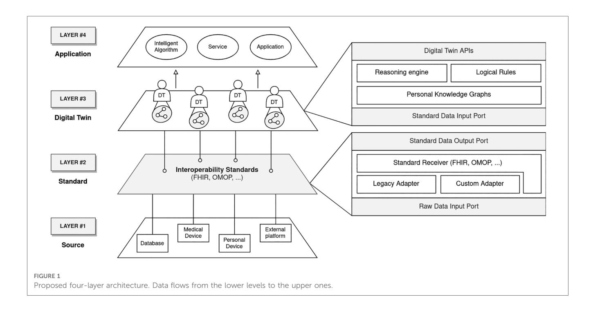
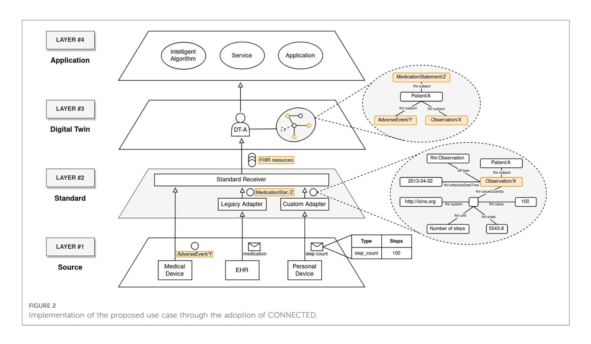

EDITED BY Lina F. Soualmia, Université de Rouen, France

REVIEWED BY Paraskevi Papadopoulou, American College of Greece, Greece Yeong-Tae Song, Towson University, United States

\*CORRESPONDENCE Antonella Carbonaro antonella.carbonaro@unibo.it

RECEIVED 16 October 2023 ACCEPTED 27 November 2023 PUBLISHED 07 December 2023

# CITATION

Carbonaro A, Marfoglia A, Nardini F and Mellone S (2023) CONNECTED: leveraging digital twins and personal knowledge graphs in healthcare digitalization. Front. Digit. Health 5:1322428. doi: [10.3389/fdgth.2023.1322428](https://doi.org/10.3389/fdgth.2023.1322428)

## COPYRIGHT

© 2023 Carbonaro, Marfoglia, Nardini and Mellone. This is an open-access article distributed under the terms of the [Creative](http://creativecommons.org/licenses/by/4.0/) [Commons Attribution License \(CC BY\).](http://creativecommons.org/licenses/by/4.0/) The use, distribution or reproduction in other forums is permitted, provided the original author(s) and the copyright owner(s) are credited and that the original publication in this journal is cited, in accordance with accepted academic practice. No use, distribution or reproduction is permitted which does not comply with these terms.

# [CONNECTED: leveraging digital](https://www.frontiersin.org/articles/10.3389/fdgth.2023.1322428/full) [twins and personal knowledge](https://www.frontiersin.org/articles/10.3389/fdgth.2023.1322428/full) [graphs in healthcare digitalization](https://www.frontiersin.org/articles/10.3389/fdgth.2023.1322428/full)

Antonella Carbonaro1 \*, Alberto Marfoglia1 , Filippo Nardini2 and Sabato Mellone3

1 Department of Computer Science and Engineering, Università di Bologna, Cesena, Italy, 2 Department of Industrial Engineering, Università di Bologna, Bologna, Italy, 3 Department of Electrical, Electronic, and Information Engineering "Guglielmo Marconi", Università di Bologna, Cesena, Italy

Healthcare has always been a strategic domain in which innovative technologies can be applied to increase the effectiveness of services and patient care quality. Recent advancements have been made in the adoption of Digital Twins (DTs) and Personal Knowledge Graphs (PKGs) in this field. Despite this, their introduction has been hindered by the complex nature of the context itself which leads to many challenges both technical and organizational. In this article, we reviewed the literature about these technologies and their integrations, identifying the most critical requirements for clinical platforms. These latter have been used to design CONNECTED (COmpreheNsive and staNdardized hEalth-Care plaTforms to collEct and harmonize clinical Data), a conceptual framework aimed at defining guidelines to overcome the crucial issues related to the development of healthcare applications. It is structured in a multi-layer shape, in which heterogeneous data sources are first integrated, then standardized, and finally used to realize general-purpose DTs of patients backed by PKGs and accessible through dedicated APIs. These DTs will be the foundation on which smart applications can be built.

## KEYWORDS

healthcare, digital twins, architectural framework, personal knowledge graphs, data integration

## Introduction

In the era of rapid technological advancements, digitalization has become a gamechanger in healthcare, with the potential to improve patient care quality and safety [\(1\)](#page-5-0). However, the successful realization of the digital revolution requires addressing several issues such as data fragmentation, lack of interoperability, and management of vast streams of real-time data ([2](#page-5-0)). Modern technologies, such as Digital Twin (DT), emerged as a response to these challenges [\(3\)](#page-5-0), but they are usually designed to have a vertical perspective which limits their capability to synergistically cooperate [\(4\)](#page-5-0).

On the other hand, precision medicine has been a hot topic in recent years, improving the effectiveness and decreasing the side effects of clinical treatments ([5](#page-5-0)). Personal Knowledge Graph (PKG) emerged as a promising solution to provide tailored services to its users ([6](#page-5-0)), offering a comprehensive and patient-centric perspective on the individual's health. Hence, there is an urgent need for architectural guidelines aimed at facilitating the development of an ecosystem of Digital Twins capable of communicating, which will act as a foundation for the implementation of healthcare applications.

In this perspective, we propose CONNECTED (COmpreheNsive and staNdardized hEalth-Care plaTforms to collEct and harmonize clinical Data), a conceptual multi-level framework aimed at integrating heterogeneous data sources using modern healthcare standards. The gathered information is fed to PKGs, which will support general-purpose patient DTs. Finally, custom applications can communicate with DTs through their APIs, realizing specific tasks, services, simulations, etc.

In the forthcoming sections, we will first review the existing literature on PKGs and DTs. Next, we will analyze current architectural approaches that incorporate these technologies, aiming to identify shared features. These highlighted characteristics will serve as the foundation for establishing the essential requirements that will guide the development of our framework.

### Recent advancements in personal knowledge graph

In the existing literature, PKGs have been defined in multiple ways ([6](#page-5-0)). According to Balog and Kenter [\(7\)](#page-5-0), a PKG is characterized as a source of structured knowledge about entities and their relationships, where the entities and relationships are of personal importance to the user. Diverging from conventional knowledge graphs, a PKG is intentionally crafted to capture an individual's personal knowledge and experiences, embodying a spiderweb-like layout. Thus, the primary aim is to facilitate the provision of services tailored specifically to its owner. In the current landscape, there has been significant interest in the application of PKGs, which have been employed in several healthcare applications.

Gyrard et al. propose a PKG framework aimed at developing personalized healthcare applications to effectively manage chronic disease ([8](#page-5-0)). Rastogi and Zaki suggest that PKGs could be used to personalize recommendations from good platforms to encourage a healthy lifestyle [\(9\)](#page-5-0). Ammar et al. present a mobile health digital intervention that combines both patients' personal health data and contextual knowledge from various sources [\(10\)](#page-5-0). The objective is to offer tailored recommendations for enhancing selfcare behaviors among diabetic adults. Seneviratne et al. introduce a PKG that supports the generation of tailored dietary recommendations for Type 2 Diabetes self-management [\(11](#page-5-0)). To do so, reasonings are made over the PKG, that encodes clinical guidelines represented in OWL.

#### Digital twin in healthcare

DTs have found application in many healthcare sectors, such as oncology [\(12\)](#page-5-0), cardiology ([13](#page-5-0)), geriatrics [\(14\)](#page-5-0), neurology ([15](#page-5-0)), internal medicine ([16](#page-5-0)), trauma management [\(17\)](#page-5-0), pharmaceutics ([18](#page-5-0)), orthopedics ([19](#page-5-0)), surgery ([20\)](#page-5-0).

Croatti et al. discussed the application of agent-based DTs to digitalize the process of severe trauma management, realizing a continuous monitoring [\(17\)](#page-5-0). A pre-hospital DT collects real-time information from the central unit, GPS systems, and smart rescuers' equipment, registers the severity of the ongoing trauma decided by the rescuers, and automatically compiles emergency forms. Information is later sent to another DT aimed at managing the trauma process inside the hospital. Its life cycle evolves according to the macrosteps related to trauma and terminates when the patient is ready for hospitalization.

Björnsson et al. proposed to build DTs of patients, which can be computationally treated with thousands of drugs to find the optimal one, evaluating each one's pros and cons [\(18\)](#page-5-0).

Aubert et al. developed a virtual replica to evaluate stabilization method variants for tibial plateau fracture surgery at distinct stages of bone healing ([19\)](#page-5-0). It demonstrates how DTs can provide quantitative and high-value information for clinical decision-making.

#### Architectural frameworks for digital twins

In the domain of DTs, the establishment of robust architectural frameworks serves as a cornerstone for molding their functionalities and expanding their utility ([21](#page-5-0)). This section delves into a selection of significant contributions that introduce architectural models designed to build and elevate DTs across different domains. After an analysis of each one, they will be summarized to highlight their main capabilities. Subsequently, these functionalities will provide the basis for developing our framework's requirements.

Malakuti et al. provide an abstract four-layer architecture pattern to construct DTs in the industrial context ([22](#page-5-0)). In their vision, the bottom layer consists of many heterogeneous information sources that feed data to the DTs through the Model layer, which aggregates information. The processed data is made accessible to applications through specialized DT APIs. Remarkably, this framework is intentionally engineered to be both extensible, accommodating a dynamic range of information sources, and flexible, enabling it to adeptly handle a variety of data types, making it a versatile foundation for DT development.

Sahlab et al. conceptualize a multi-layer KG-based architecture for the application of DTs in Cyber-Physical Systems, providing improved capabilities, such as internal linking and referencing, knowledge completion, error detection, collective reasoning, and semantic querying ([23](#page-5-0)). The result is the Intelligent DT, an evolution of the DT, equipped with a module for model comprehension using artificial intelligence to continuously adapt and learn. They propose a modular solution in which the communication between physical and virtual assets is bidirectional. It also includes a reasoning engine, aimed at deducing knowledge from heterogeneous models and running predictions of future states of the system.

Ricci et al. discuss a vision in which healthcare, a complex domain, can be modeled as an open ecosystem of DTs, owned by different organizations, but designed to communicate and cooperate in the same scenarios ([4\)](#page-5-0). In this perspective, DTs are not bound to a specific application, but they are thought more of as services exposing their APIs, leading to a Digital Twin-as-aservice approach. They shift away from the traditional vertical representation of DT, embracing a layered architecture in which their capabilities can be horizontally composed. Within this vision, DTs serves as a stable foundation on top of which applications and smart algorithms can be built.

The work presented underlines features that address shared crucial needs of DT frameworks, from which it was possible to explicitly derive the requirements of CONNECTED:

- Real-time data streaming: The framework must incorporate ports to enable the real-time flow of data streams. Therefore, it necessitates a layer capable of gathering real-time data from IoT devices, medical devices, smartphones, organizations, etc.
- Heterogeneous sources integration: It must be possible to collect data from diverse sources and feed them to the relevant DTs. To do that, the gathered information must be harmonized to a common domain model. Especially in the healthcare context, standards might facilitate this process, also improving interoperability across organizations.
- Symbolic reasoning: As Knowledge Graphs can effectively describe and manage healthcare information, by employing reasoning algorithms, they facilitate the derivation of insights regarding a patient's status and prognostications. Furthermore, the stored knowledge can be accessed through intuitive semantic queries, in an explorative search fashion.
- General-purpose Digital Twin: DTs should act as a foundation on top of which smart applications can be developed. Hence, they do not need to be aware of specific program details. In this regard, DTs can be represented by services exposing proper APIs, enabling effective communication with external software.

#### CONNECTED: a framework for general-purpose digital twins

In this section we introduce CONNECTED, a conceptual framework aimed at defining guidelines to develop healthcare applications based on DTs of patients. It has been based on the requirements defined in the previous section, and it has been designed following a modular approach. Hence, the result is a multi-layer architecture in which functionalities are partitioned into horizontal levels ([Figure 1](#page-3-0)): Source, Standard, Digital Twin, and Application. The communication between them is monodirectional, so data can flow from one layer to the above one only by passing through designated input and output interfaces.

#### 1. Level 1: Source

In the healthcare context, a wide array of data sources exists, including personal and medical devices, as well as various platforms and databases. A key aspect of the proposed architecture is its capability to effectively communicate with these sources. Since incoming data may vary in terms of volume, quality, and format, the Source layer functions as a sort of funnel. Its primary role is to efficiently manage this diverse information, accommodating different protocols for communication. Ultimately, its aim is to transmit the data stream to the higher-level layer.

#### 2. Level 2: Standard

The second level of the framework focuses on exploiting standards according to the interoperability requirement defined in [Section 4](#page-1-0). To this end, the adoption of a well-known solution, such as FHIR,1 proves essential in providing domain modeling that is validated by a vast international community of experts. This layer operates as a pipe, in which incoming raw data is harmonized and passed to the Digital Twin layer. In this regard, this level must include submodules (Adapters in [Figure 1](#page-3-0)) able to process data from legacy standards, and custom or proprietary formats to modern healthcare standards.

#### 3. Level 3: Digital Twin

To enhance our understanding of patients and their progress, we can utilize all the standardized data so far gathered to populate the DTs. From our perspective, these digital replicas serve as reliable sources of truth, enabling us to track a patient's evolution over time. While it doesn't provide simulation capabilities, this DT functions as a versatile repository of data that paints a comprehensive picture of the patient. This data can be leveraged to develop intelligent applications.

Given the heterogeneity of collected information and the constant evolution of the DT model, it is required a data structure capable of managing its changes and expressing semantic relationships between concepts. PKG is identified as an optimal solution to achieve that, as it allows us to capture personal information valuable for a specific subject and integrate it with general concepts of the healthcare domain. This can be done by taking advantage of web semantic tools such as ontologies (e.g., SNOMED-CT) and logical rules (e.g., SWRL). In fact, they can be provided as input to the semantic Reasoning Engine aimed at automatically inferring new knowledge about the patient to support a well-informed decision-making process. Finally, DTs offer APIs to run explorative queries on single patients' PKG. A matching subset of resources is returned to the caller.

#### 4. Level 4: Application

Since Level 3 doesn't provide computational resources, the computational models implementing DT applications are located on Level 4. This layer hosts all the applications that need to observe the state of DTs, through their APIs. Following the

1 <https://www.hl7.org/fhir/>

<!-- Image Description: Figure 1 presents a four-layer architecture for a digital twin system. The diagram shows data flowing upwards through layers representing: source data (databases, devices), interoperability standards (FHIR, OMOP), digital twins, and applications incorporating intelligent algorithms. A separate section details the Digital Twin APIs, including reasoning engines, logical rules, and data input/output ports. The figure illustrates the system's data flow and layered structure. -->

previously defined requirements, an application is not bound to a single DT, whereas one DT may serve many. Examples of such clients include a wide range of applications, going from simple user interfaces to visualize patient information, to more sophisticated ones like smart assistants to support decisionmaking or monitoring systems.

## Validation

In this section, we introduce a concrete scenario aimed at clarifying the framework data models and validating its expressiveness. The chosen case study revolves around the identification and prediction of accidental falls in elderly patients, especially those suffering from osteoporosis, a critical domain that benefits from a comprehensive data analysis. This entails capturing heterogeneous information, including patient activity preceding the accident, comprehensive EHR records (e.g. medications, treatments, and previous CT scans), besides measuring the impact of the fall itself. In CONNECTED, these diverse data sources are managed in the Source layer, and send messages towards the Standard level. Supposing Medical Device is FHIR complaint, the fall data is already structured as an AdverseEvent FHIR resource, while data coming from EHR, being based on an HL7 legacy version, requires a conversion step, made by a default adapter (Legacy Adapter in [Figure 2](#page-4-0)), transforming it into FHIR resources. As concerns the step count tracked by the patient's Personal Device, it operates using a proprietary format, requiring the development of an ad-hoc adapter (Custom Adapter in [Figure 2](#page-4-0)). The resulting information will be finally merged into the Patient DT existing PKG. Leveraging this data will enable smart algorithms to estimate fracture risk for continuous monitoring, facilitating prompt emergency response, if necessary.

### Discussion

In this article, we proposed CONNECTED, a modular framework in which various data sources are integrated through the adoption of modern healthcare standards, to feed generalpurpose DTs of patients. Indeed, we identified PKGs as a solid backbone for DTs, given their ability to model heterogeneous data while keeping their high semantic expressiveness and to enable semantic search, supported by a reasoner, which is ideal for complex, dynamic, and rapidly changing environments such as healthcare. General-purpose DTs act as a source of truth and establish a foundation to design and develop smart applications. At last, we presented a use case aimed at validating CONNECTED expressiveness.

Within this perspective, several challenges are yet to be addressed, given the high sensitivity of healthcare data. From a technical point of view, it is fundamental to guarantee the integrity and validity of collected data, ensuring the reliability of the information stored in the PKGs, and fostering their backbone role within the framework. Another primary concern is related to PKG realization. For example, if many PKGs are extracted by a unique underlying graph, it is hard to trace a clear boundary between distinct patients. On the other hand, if PKGs are physically separated, information might be duplicated, possibly leading to inconsistencies. To this end, access-control policies must be implemented to allow specific stakeholders to query only the DTs for which they are given rights. Furthermore, due to the nature of treated information, it is worth mentioning that this kind of platform must deal with complex legal, ethical, and

<!-- Image Description: Figure 2 illustrates the implementation of a proposed use case using CONNECTED. A layered architecture is shown, progressing from data sources (medical devices, EHR, personal devices) through standard adapters to a digital twin, ultimately processed by an intelligent algorithm. The diagram details data flow and transformation, including FHIR resource representation (MedicationStatement, AdverseEvent, Observation) and illustrates how data from various sources are integrated and processed within the system. -->

regulatory issues, such as different privacy policies of distinct organizations.

Future work will focus on selecting the best-suited technologies for implementing the proposed framework and its adoption in realuse case healthcare scenarios. In this regard, we are currently developing a solution aimed at unveiling the issues and practical challenges associated with the concrete implementation of the framework. Specifically, we are evaluating the use of Eclipse Hono2 for the Source layer. This technology empowers the architecture with the ability to communicate with a multitude of IoT devices, regardless of the communication protocol, as well as supporting custom adapters for data transformation. Afterward, standardized data streams are channeled through a distributed and asynchronous message bus, implemented using Apache Kafka3 . These streams ultimately converge on DTs, where they are stored in a graph database. Our choice for this database is Stardog,4 primarily due to its capacity to enable information querying and knowledge inference through the utilization of a reasoner. Our aim is to release the resulting prototype as opensource software for readers to validate them. Finally, further extensions of the framework should be investigated, such as the possibility of integrating computational models into the existing vision of DT, enabling simulation capabilities.

#### 2 <https://projects.eclipse.org/projects/iot.hono> 3 <https://kafka.apache.org/>

## Data availability statement

The original contributions presented in the study are included in the article/supplementary material, further inquiries can be directed to the corresponding author.

### Author contributions

AC: Conceptualization, Funding acquisition, Investigation, Methodology, Supervision, Writing – review & editing; AM: Data curation, Resources, Software, Writing – original draft, Writing – review & editing; FN: Data curation, Resources, Software, Writing – original draft, Writing – review & editing; SM: Conceptualization, Funding acquisition, Investigation, Methodology, Supervision, Writing – review & editing.

## Funding

The author(s) declare financial support was received for the research, authorship, and/or publication of this article.

This study was partially supported by the Italian Ministry of University and Research under PNRR-PNC Project PNC0000002 "DARE—Digital Lifelong Prevention" (CUP: B53C22006450001).

## Conflict of interest

The authors declare that the research was conducted in the absence of any commercial or financial relationships that could be construed as a potential conflict of interest.

4 <https://www.stardog.com/>

## Publisher's note

All claims expressed in this article are solely those of the authors and do not necessarily represent those of their affiliated

## References

1. Engstrom T, McCourt E, Canning M, Dekker K, Voussoughi P, Bennett O, et al. The impact of transition to a digital hospital on medication errors (TIME study). npj Digit Med. (2023) 6:1–9. [doi: 10.1038/s41746-023-00877-w](https://doi.org/10.1038/s41746-023-00877-w)

2. Mumtaz H, Riaz MH, Wajid H, Saqib M, Zeeshan MH, Khan SE, et al. Current challenges, potential solutions to the use of digital health technologies in evidence generation: a narrative review. Front Digit Health. (2023) 5:1–8. [doi: 10.3389/fdgth.](https://doi.org/10.3389/fdgth.2023.1203945) [2023.1203945](https://doi.org/10.3389/fdgth.2023.1203945)

3. Sun T, He X, Li Z. Digital twin in healthcare: recent updates, challenges. Digit Health. (2023) 9:205520762211496. [doi: 10.1177/20552076221149651](https://doi.org/10.1177/20552076221149651)

4. Ricci A, Croatti A, Montagna S. Pervasive, connected digital twins—a vision for digital health. IEEE Internet Comput. (2022) 26:26–32. [doi: 10.1109/MIC.2021.3052039](https://doi.org/10.1109/MIC.2021.3052039)

5. Cailleaux S, Sanchez-Ballester NM, Gueche YA, Bataille B, Soulairol I. Fused deposition modeling (FDM), the new asset for the production of tailored medicines. J Control Release. (2021) 330:821–41. [doi: 10.1016/j.jconrel.2020.10.056](https://doi.org/10.1016/j.jconrel.2020.10.056)

6. [Dataset] Skjæveland MG, Balog K, Bernard N, Lajewska W, Linjordet T. An ecosystem for personal knowledge graphs: a survey and research roadmap (2023).

7. Balog K, Kenter T. Personal knowledge graphs: a research agenda. Proceedings of the ACM SIGIR International Conference on the Theory of Information Retrieval (ICTIR). CA: ACM Digital Library (2019).

8. Gyrard A, Gaur M, Shekarpour S, Thirunarayan K, Sheth A. Personalized health knowledge graph. CEUR Workshop Proc. (2018) 2317:5. [doi: 10.5281/zenodo.7454721](https://doi.org/10.5281/zenodo.7454721)

9. [Dataset] Rastogi N, Zaki MJ. Personal health knowledge graphs for patients (2020). Available from:<https://doi.org/10.48550/arXiv.2004.00071>

10. Ammar N, Bailey JE, Davis RL, Shaban-Nejad A. Using a personal health library–enabled mHealth recommender system for self-management of diabetes among underserved populations: use case for knowledge graphs and linked data. JMIR Forma Res. (2021) 5:e24738. [doi: 10.2196/24738](https://doi.org/10.2196/24738)

11. [Dataset] Seneviratne O, Harris J, Chen CH, McGuinness DL. Personal health knowledge graph for clinically relevant diet recommendations (2021). Available from:<https://doi.org/10.48550/arXiv.2110.10131>

12. Sager S. Digital twins in oncology. J Cancer Res Clin Oncol. (2023) 149:5475–7. [doi: 10.1007/s00432-023-04633-1](https://doi.org/10.1007/s00432-023-04633-1)

organizations, or those of the publisher, the editors and the reviewers. Any product that may be evaluated in this article, or claim that may be made by its manufacturer, is not guaranteed or endorsed by the publisher.

13. Corral-Acero J, Margara F, Marciniak M, Rodero C, Loncaric F, Feng Y, et al. The 'Digital Twin' to enable the vision of precision cardiology. Eur Heart J. (2020) 41:4556–64. [doi: 10.1093/eurheartj/ehaa159](https://doi.org/10.1093/eurheartj/ehaa159)

14. Ying L, Zhang L, Yang Y, Longfei Z, Ren L, Wang F, et al. A novel cloud-based framework for the elderly healthcare services using digital twin. IEEE Access. (2019) 7:49088–101. [doi: 10.1109/ACCESS.2019.2909828](https://doi.org/10.1109/ACCESS.2019.2909828)

15. Voigt I, Inojosa H, Dillenseger A, Haase R, Akgün K, Ziemssen T. Digital twins for multiple sclerosis. Front Immunol. (2021) 12:1–17. doi: 10.3389/fi[mmu.2021.669811](https://doi.org/10.3389/fimmu.2021.669811)

16. Subramanian K. Digital twin for drug discovery and development—the virtual liver. J Indian Inst Sci. (2020) 100:653–62. [doi: 10.1007/s41745-020-00185-2](https://doi.org/10.1007/s41745-020-00185-2)

17. Croatti A, Gabellini M, Montagna S, Ricci A. On the integration of agents and digital twins in healthcare. J Med Syst. (2020) 44:161. [doi: 10.1007/s10916-020-01623-5](https://doi.org/10.1007/s10916-020-01623-5)

18. Bjornsson B, Borrebaeck C, Elander N, Gasslander T, Gawel D, Gustafsson M, et al. Digital twins to personalize medicine. Genome Med. (2019) 12:1–4. [doi: 10.](https://doi.org/10.1186/s13073-019-0701-3) [1186/s13073-019-0701-3](https://doi.org/10.1186/s13073-019-0701-3)

19. Aubert K, Germaneau A, Rochette M, Ye W, Severyns M, Billot M, et al. Development of digital twins to optimize trauma surgery and postoperative management. A case study focusing on tibial plateau fracture. Front Bioeng Biotechnol. (2021) 9:1–11. [doi: 10.3389/fbioe.2021.722275](https://doi.org/10.3389/fbioe.2021.722275)

20. [Dataset] HeartFlow. Case study: mobilizing care at cone health (no date).

21. Minerva R, Crespi N. Digital twins: properties, software frameworks, and application scenarios. IT Prof. (2021) 23:51–5. [doi: 10.1109/MITP.2020.2982896](https://doi.org/10.1109/MITP.2020.2982896)

22. Malakuti S, Schmitt J, Platenius-Mohr M, Grüner S, Gitzel R, Bihani P. A fourlayer architecture pattern for constructing and managing digital twins. In: Bures T, Duchien L, Inverardi P, editors. Software architecture. Cham: Springer International Publishing (2019). p. 231–46. Lecture Notes in Computer Science. Available from: [https://doi.org/10.1007/978-3-030-29983-5\\_16](https://doi.org/10.1007/978-3-030-29983-5_16)

23. Sahlab N, Kamm S, Müller T, Jazdi N, Weyrich M. Knowledge graphs as enhancers of intelligent digital twins. 2021 4th IEEE International Conference on Industrial Cyber-Physical Systems (ICPS). NJ: Institute of Electrical and Electronics Engineers (2021). p. 19–24. Available from: [https://doi.org/10.1109/ICPS49255.2021.](https://doi.org/10.1109/ICPS49255.2021.9468219) [9468219](https://doi.org/10.1109/ICPS49255.2021.9468219)
