# Human Digital Twin: Systematic Literature Review and Concept Disambiguation for Industry 5.0

Ben Gaffineta,b, Jana Al Haj Alia , Yannick Naudetb , Herv´e Panettoa

aUniversity of Lorraine, CNRS, CRAN, Nancy, F-54000, France bLuxembourg Institute of Science and Technology, Esch-sur-Alzette, L-4022, Luxembourg

## Abstract

Human Digital Twins (HDTs) are an emerging concept with the potential to create human-centric systems for Industry 5.0. The concept has rapidly spread to new application domains, most notably Healthcare, leading to diverging conceptual interpretations. This Systematic Literature Review analyses the conceptual understanding of HDTs across all application domains to clarify the conceptual foundation. Our review reveals a consensus that an HDT's twinned entity is a human individual. However, there is little agreement on the data flows between the individual and their HDT. We address this shortcoming by proposing three categories based on the level of data integration: Human Digital Models, Human Digital Shadows, and Human Digital Twins. Finally, we synthesise our findings in a domain-agnostic general definition for HDT. We highlight an edge case where the twinned entity is a human individual alongside a strongly coupled technical system, and name it augmented Human Digital Twin (aHDT). The definition and categorisation scheme provide the needed conceptual clarity for inter-disciplinary collaboration to address open challenges. Notable challenges are sensing human data, reliable data transfers and modelling, especially behavioural modelling. Additional ethical issues concerning security, privacy and consent are central to successful HDT adoption. We call for cross-disciplinary efforts to establish a standardised framework and ethical guidelines to enable future developments.

Keywords: Human Digital Twin, Industry 5.0, Digital Twin, Human-centricity

## Introduction

Industry 4.0 is a system-centric paradigm that seeks to optimize production outcomes by interconnecting cyber-physical systems and their ability to communicate, control, and compute. Building on the technological advancements from Industry 4.0, the Industry 5.0 paradigm [1] shifts the focus towards human-centricity, sustainability and resilience. Human-centricity in manufacturing goes beyond creating a safe and ergonomic environment for human workers, as it seeks to address higher needs like belonging, esteem and self-actualisation [2]. Humans are recognized as bringing valuable skills like creativity and decision making instead of merely being a cog in the machine. A symbiotic relationship between human and machine is envisioned, such that human capabilities are enhanced, not replaced. For this close human-machine relationship, it is not enough for machines to react to humans' movements and actions. They need to be aware of humans' physiological, psychological and even cognitive state. Ultimately, they have to become "empathic machines"[2] and learn continuously to grow together with human co-workers. The concept of Operator 4.0 is a significant step towards human-centricity. It seeks to enable a balanced and collaborative relation between operators and automated systems by equipping the operator with the required skills and tools. Operator 5.0 advocates to adapt the technological systems to the human instead, which requires awareness of the human state [3]. Enabling technologies for Industry 4.0 are mainly Cyber-Physical Systems (CPS), Internet of Things (IoT), and Digital Twins (DT), all increasingly supported by Artificial Intelligence (AI). They all can support the human-centricity targeted by Industry 5.0, but the DT could be a key element when it is used to represent humans digitally, serving technological systems adaptation sought by Operator 5.0.

Within a manufacturing context, a DT is defined as a "fit for purpose digital representation of an observable manufacturing element with synchronization between the element and its digital representation" [4]. The concept can be applied to physical entities outside the manufacturing context to monitor, analyse and predict the states and behaviours of the physical entity. Before being named Digital Twin in 2002 [5], the original concept of component-based emulation has been introduced in 2000 [6]. Typical application cases are tracking the status of a machine and triggering maintenance cycles predictably before expensive damage occurs, or triggering an emergency stop if parameters drift far from their nominal values. Aligned with the tenants of Industry 5.0, a new type of DT, known as Human-Centric Digital Twin was proposed. It includes the state of the human worker with the objective to enable systems that adapt and respond to human needs. An illustrative example is a DT that monitors worker fatigue to dynamically reallocate tasks. However the Human-Centric Digital Twin modelling scope is a system containing human participants and stops short of creating a holistic model of the humans themselves. An additional ethical concern is the collection of personal data to be used in a larger system. In contrast Human Digital Twins (HDT) focus specifically on digitally representing humans, rather than treating them as just another element of a larger system, making them well-suited to handle and protect personal data from their human counterparts. In the long-term vision an individual would be accompanied by their HDT throughout life to provide personalized assistance in a large variety of contexts and situations. The HDT would host interlinked models about numerous aspects of human nature (e.g. physiology and cognition), learn about individual preferences and evolve over time through continuous learning. In practice, creating a DT of a human comes with a broad variety of specific challenges. Machines can be designed with integrated sensors to provide exploitable data to their DTs, which is only true in a limited fashion for humans. For instance, humans understand their environment through stimuli which are hard to capture and feed to the HDT, not to mention the difficulty of modelling the subsequent cognitive processes transforming the stimuli into a specific reaction. In cognitive neuroscience, visual stimuli have been successfully decoded from neural activity measured by functional Magnetic Resonance Imaging [7] and brain-machine interfaces, for example, enable disabled individuals to use and control prostheses and wheelchairs [8]. Nonetheless, methods are limited and often invasive making gathering data from internal human processes significantly harder when compared to machines. A large body of literature addresses the technical challenges of gathering human data and building models on top of it. Papers addressing the conceptual basis of HDTs are rarer.

HDTs have first appeared in applications in Industry where traditional DTs are well understood. More recently HDTs spread to new communities, bringing not only new perspectives and interpretations, but also confusions about the concept. A key aspect of traditional DTs is the high level of data integration, i.e., the data flow between the DT and the physical entity. However in Healthcare we see examples of HDTs without persistent data flows, for instance HDTs that are used as simulation platforms [9]. Just as it was important to distinguish between digital models and digital twins for traditional DTs in industry, it is essential to clarify the vocabulary for HDTs. Building a human model is already a considerable challenge, requiring interdisciplinary efforts from fields like cognitive science, psychology and biomedicine. But synchronizing a model with real-world changes adds further complexity requiring expertise from, among others, computer science, communication systems and machine learning communities. To facilitate the required collaboration and identify the right challenges, it is imperative to clarify the conceptual basis for HDTs. Specifically in industry, it is important to determine whether HDT refers to a DT of an industrial system that considers human interactions and the influence of human factors, or if it refers to a DT of the human entities within the system.

Before the conceptual understanding between communities drifts further apart we perform a systematic literature review, considering all application domains, to extract and analyse their interpretation of what constitutes an HDT. We examine the differences between traditional DTs and HDTs and disambiguate the concept of HDT by identifying multiple categories that deserve to be differentiated. Finally we propose a domain-agnostic general definition that may serve as clear conceptual foundation for future HDT developments, irrespective of the application area.

## Prior Reviews

Recently a few landmark reviews have been performed on the progress of HDTs. The reviews come from authors with various backgrounds which informs their point of view and understanding and restricts the scope of their efforts. From Industry multiple reviews are investigating topics that are closely related and overlapping with HDTs, namely the topics of Humancentric DTs [10] and Human-Robot Collaboration DTs [11]. One review from Industry is exclusively focused on HDTs [12]. From Healthcare four reviews that exclusively focus on HDTs have been published [13, 14, 15, 16]. From the field of Mobility a pivotal review [17] has provided a solid basis for HDT developments in their discipline. Finally a set of two reviews are general in scope [18, 19] without restricting themselves to a specific application domain. Besides the application area, the reviews also differ in their focus. Some are interested in the conceptualisation of HDTs while others explore the enabling technologies to provide guidance for designers and developers. See Table 1

| Reference                   | Domain     | Scope    | Focus      |  |
|-----------------------------|------------|----------|------------|--|
| Asad et al. [10]            | Industry   | Other DT | Pragmatic  |  |
| Chen et al. [14]            | Healthcare | HDT      | Pragmatic  |  |
| Chen et al. [16]            | Healthcare | HDT      | Pragmatic  |  |
| Hu et al. [17]              | Mobility   | HDT      | Pragmatic  |  |
| Lauer-Schmaltz et al. [15]  | Healthcare | HDT      | Conceptual |  |
| Lin et al. [19]             | General    | HDT      | Conceptual |  |
| Miller and Spatz [18]       | General    | HDTS     | Conceptual |  |
| Ramasubramanian et al. [11] | Industry   | Other DT | Pragmatic  |  |
| Sahal et al. [13]           | Healthcare | HDT      | Pragmatic  |  |
| Wang et al. [12]            | Industry   | HDT      | Pragmatic  |  |
| Our Review                  | General    | HDT      | Conceptual |  |

Table 1: Classification of prior reviews and alignment of our own review.

for an overview on the domain, scope and focus of each review. We elaborate on the content of the past reviews and the perceived research gap we seek to address.

The first appearance of the keyword HDT in scientific literature is from Industry [20]. The first review paper appeared in 2022 on HDTs in Healthcare for behaviour change therapy [15]. Despite the highly specific use case the paper discusses fundamental differences between traditional DTs and HDTs. At the centre is the personal nature of medical data and an increased need for stringent data safety and privacy. Ethical questions, for instance whether an HDT should be deleted after death, are raised. To maintain trust in the HDT all decisions need to be explainable, and models based on human data need to deal with poor data quality and common data gaps. Capturing data about human cognition and modelling it is a unique challenge stemming from the human nature of the twinned entity. The paper provides a set of design considerations for how to develop an HDT, but clearly states that the definition, and essential components, of the HDT concept are underdeveloped and requires further research.

Two reviews focus on conceptual aspects of HDTs without a specific application case [18, 19]. In Miller and Spatz [18] the authors first propose a Digital Twin Systems (DTS) which is composed of a Real-World Twin, the DT itself, and an Interchange Component. As an extension a Human Digital Twin System (HDTS) follows the same structure but contains at least one human agent that is modelled alongside other machinery, sensors and actuators. This digital representation is considered an HDT, but it can be created, not only for a human individual but also for a human class. The authors take the position that the HDT can take the shape of a purely mathematical model and does not require a direct link with a physical human. The differentiation between HDT and HDTS represents a significantly different conceptual point of view.

A subsequent review by Lin et al. [19] proposes a more detailed HDTS framework. However, their framework exclusively focuses on a human individual and their digital model, without any surrounding entities. In their view an HDT conceptually requires a twinned human individual, real-time data gathering and modelling of the human. The authors further elaborate on the limitations and challenges of creating HDTS. A major limitation lies in the gathering and transmitting of heterogeneous data, while guaranteeing its safety and reasonable latency. The authors underline the need for ontologies that unify human body data. Societal challenges include ethical questions as well as problems related to trust and social regulation.

A second set of reviews has an increased focus on specific application domains. They are less concerned with the conceptual basis for HDTs and focus their efforts on enabling technologies, frameworks and architectures to enable future HDT developments. For the domain of Mobility applications an influential review by Hu et al. [17] applies the concept of HDTs to drivers. The review proposes a detailed framework to build a Driver Digital Twin with the goal to detect driver attention, distractions, intentions and drowsiness. For each of the four applications guidance is provided including taxonomies of the possible types of distractions and driver states. While the application domain is highly specific many identified challenges are general in nature. Both heterogeneous data and highly specialised scattered models are challenges. To develop the most impactful Driver Digital Twin holistic models are needed, but multi-model datasets are lacking. Another general challenge is the need for personalisation, especially when modelling behaviour which is highly dependent on the individual's characteristics. The authors distinguish the Driver DT from the Driver DT System, the former being a digital representation of a driver HDT, while the latter includes interconnected components from the car.

Within Healthcare the most investigated topic in terms of performed re-

views is personalised Healthcare. An extensive analysis of Personal Digital Twins is presented in Sahal et al. [13], which can be seen as synonymous with HDT. They discuss the benefits, potential applications, essential building blocks and open challenges. Particular attention is given to artificial intelligence and blockchain technology and how they can be integrated for enhanced personalised Healthcare services. A second extensive review by Chen et al. [14] investigates many facets of the concept for personalised medicine. One observation is how separate DTs for individual organs can merge into one holistic HDT for a patient. The central topic of the review is a network architecture that is divided in 5 layers; data acquisition; data communication; computation; data management; data analysis and decision making. For each layer the authors address in detail the enabling technologies and spend little time on conceptual questions. A third review with an interest in personalized Healthcare is presented in Chen et al. [16], where the authors perform an extensive review on how generative artificial intelligence techniques may address key challenges in HDT development. In particular the potential to generate synthetic data, enhance communication and data management, creating better digital models and performing data analysis is investigated thoroughly. All three reviews view an HDT as a digital replica or representation of a human being that evolves with time as the human changes. Two of them state that real-time data is needed [14, 16], implying continuous and automatic data acquisition, while the third review is not explicit on this matter [13].

Wang et al. [12] perform a review of HDTs for industrial cases, and specifically Industry 5.0. The central contribution is a system architecture organised in four layers to guide future developments. For each layer a detailed discussion of enabling technologies is provided. The conceptual grounding is not a central point in the paper but the authors align with the view that an HDT is necessarily twinned to a human in the physical world, with bidirectional data flow.

Ramasubramanian et al. [11] review DTs for Human-Robot Collaboration and identifies approaches related to HDTs. Operator data is included in the DT but the modelling efforts are mostly limited to the creation of 3D avatars and human motion. The review discusses the challenges of Human-Robot Collaboration which notably includes the dynamic nature of the human and a need to account for their behaviour. Modelling a human operator is recognized as extremely complex and difficult. Current technology is seen as insufficient to create a holistic Operator Digital Twin, that includes not only physical, but also emotional aspects.

Most recent reviews focus on enabling technologies and provide guidance to developers through guidelines, frameworks and architectures. From the three reviews that address conceptual aspects; one calls for further research into essential components and the definition [15]; one sees HDTs as digital representations of a human [19]; while the last proposes an alternative view where HDT may also represent a human class [18]. With our review we seek to address this gap and divergence in conceptual interpretation.

## Methodology

Research on HDTs is experiencing an accelerated growth since 2019. We choose to perform a systematic literature review to explore the literature on HDTs in an exhaustive and reproducible way. In this paper we rely exclusively on primary studies i.e.: original research. The objectives of the SLR are to (i) summarise the literature on the concept of the HDT, (ii) identify conflicting interpretations of the concept and (iii) propose a general coherent definition, (iv) summarising research challenges and give research directions.

To achieve exhaustive and reproducible results we adopt a methodology that consists of three main steps:

- Planning the Review: Define precise research questions and a detailed protocol.
- Conduct the Review: Identify research, select relevant primary research, extract and analyse content.
- Document the Review: Discuss review report, assess study quality, identify research directions.

## 1. Research Questions

To align our efforts with the main objective of the systematic literature review, we define an overall guiding research question which is:

# What is a general definition for HDTs that applies to all application areas?

From the overall guiding question, we define a set of specific research questions (RQ) to extract relevant information from selected papers. We list our research questions below alongside their rationale.

| ID    | Reseach Question                              | Section       |
|-------|-----------------------------------------------|---------------|
| RQ1   | How has the research into HDTs | Section 4.1   |
|       | evolved?                                      | Section 4.2   |
| RQ2   | What are the main application areas for       | Section 4.1   |
|       | HDTs?                                         |               |
| RQ3.1 | What is the scope of the twinned entity?      | Section 4.3.2 |
| RQ3.2 | How is the concept of DT understood           | Section 4.3.1 |
|       | and used?                                     |               |
| RQ4   | What are the challenges for HDT devel         | Section 6     |
|       | opment and future research directions?        |               |

Table 2: Summary of Research Questions with links to the relevant sections.

- RQ1: How has the research into HDTs evolved? With this research question we quantify the growth rate of HDT research and identify the main research locations that are active in the field. These insights help understand the influences and centre of interest for HDT research overall. The results of this research question are of special interest when considering them alongside the application areas which are at the centre of RQ2.
- RQ2: What are the main application areas for HDTs? While the concept of HDT has taken strong roots in manufacturing Industry and Healthcare, it is continuously expanding into new domains. With this research question we gain insights into the variety of fields that contribute to conceptualising and building HDTs. We have to understand the differences of vocabulary and methods for each field to establish a useful definition and taxonomy for all applications.
- RQ3: What is the conceptual understanding, or definition, of HDTs? The various backgrounds can lead to different understandings of what constitutes an HDT. With this research question we focus on the used definitions and what concepts they embody. We record

whether the authors explicitly use an existing definition or propose their own. In many cases, no definition is given but we record the implicit characteristics the author gives to their HDT implementation.

- RQ3.1: What is the scope of the twinned entity? The nature of the twinned entity varies depending on the application case. With this question we investigate whether there is consensus on the twinned entity.
- RQ3.2: How is the concept of DT understood and used? Not all HDTs are implemented, or conceptualised, with all the characteristics of a full DT. With this research question we explore proposed concepts and case studies and to what extent they include characteristics from DTs.

# • RQ4: What are the challenges for HDT development and future research directions?

## 2. Review Protocol

To guarantee reproducibility of results, we define a protocol for conducting the review based on the guidelines provided in [21]. It comprises two major steps: (i) identification of articles (Section 3.2.1), (ii) inclusion and exclusion of articles (Section 3.2.2).

## 2.1. Search Strategy

| 1. SCOPUS              | 5. MEDLINE        |
|------------------------|-------------------|
| 2. Web of Science      | 6. PubMed         |
| 3. ACM Digital Library | 7. ArXiv          |
| 4. IEEE Xplore         | 8. Google Scholar |

We select 8 databases to identify relevant research on HDTs. Given the novelty of the HDT concept and the limited literature we choose to use Google Scholar and arXiv to include preprint articles instead of restricting ourselves to journal and conference papers. The full list of selected databases can be seen at the start of the Section. The databases are queried using search strings that consist of keywords and logical operators. To cover the largest possible extent, we apply the search to the full body text instead of restricting ourselves to the Title, Keywords or Abstracts. To minimise the number of irrelevant papers collected we apply the following stopping criterion: Stop collecting articles after encountering 10 consecutive articles with no reasonable link to the search query. The stopping criterion is especially relevant for Google Scholar.

## 2.2. Inclusion and Exclusion Criteria

Not all papers will be relevant to answer the research questions. A set of inclusion and exclusion criteria is applied to screen the collected papers for their relevance. A paper that meets an inclusion criterion but also an exclusion criterion will be excluded from the review. See the list of all inclusion and exclusion criteria below:

- InC1: The document proposes an explicit HDT definition.
- InC2: The document proposes a (meta-)model, framework or architecture for an HDT.
- InC3: The document reports an implementation of an HDT use case.
- ExC1: The document is of a type that we exclude. We focus our review on scientific papers which includes preprints, conference papers and PhD theses (but not Master theses). Documents that we exclude are marketing material, presentations, blog articles and editorials. Full proceeding collections and syllabi are also excluded.
- ExC2: Only primary studies are considered which means that we exclude reviews. With good queries and snowballing we cover all papers. To ensure this is true we use review papers in the snowballing phase directly even if they are excluded from analysis. Review papers are discussed in the introduction.
- ExC3: The document is not accessible from the selected databases, which is mostly applicable to papers that are published as chapters in books.
- ExC4: The document is not in English. While our research team is multilingual, we choose to only review English papers to make the review more easily reproducible.

- ExC5: The document has no relation to DTs. This exclusion criterion does not apply if the author is using an incomplete DT. For example, papers that report creating a digital model are in principle excluded, except if the authors identify it as DT. This choice might lead to the inclusion of less relevant papers, but it is necessary to understand the common perception of what a DT consists of.
- ExC6: The twinned entity is in no related to humans. We don't consider it necessary that the twinned entity is a human individual. For our review it is sufficient when a human role or a human organ is considered. Factory DTs which explicitly include the worker are also included for review.

The established criteria are applied in two separate phases. First, we perform a coarse-grained filtering step during which only the title, abstract, introduction and conclusion are considered. In case of doubt the paper is included during this step and reanalysed in the subsequent step. The second fine-grained step is performed by analysing the full text of the paper.

## 3. Collection & Filtering Results

First we define our search string for the queries with the goal to find all papers that discuss HDTs and tangential concepts. A prominent example of a tangential concept is a Human Digital Shadow, which is a live representation of the twinned entity without returning any feedback. The search string is the following:

S1 = "Human Digital Twin" OR "Patient Digital Twin" OR "Worker Digital Twin" OR "Operator Digital Twin" OR"Student Digital Twin" OR "Driver Digital Twin" OR "Citizen Digital Twin" OR "Human Digital Shadow" OR "Customer Digital Twin" OR "Consumer Digital Twin" OR "Elderly Digital Twin" OR "Bio Digital Twin" OR "Human Digital Clone" OR "Human Virtual Twin"

An alternative approach we considered was a composite search string e.g.: ("Human" OR "Patient") AND "Digital Twin". Unfortunately this approach led to an unmanageable number of results, many with poor relevance. The above described string will include papers that use the words "Human" and "Digital Twin" independently and far apart in the article. We queried the

| Database        | Number of Papers | Percentage |
|-----------------|------------------|------------|
| ACM             | 23               | 4.11%      |
| arXiv           | 9                | 1.61%      |
| Google Scholar  | 302              | 53.93%     |
| IEEE Xplore     | 37               | 6.61%      |
| MEDLINE         | 10               | 1.79%      |
| PubMed          | 10               | 1.79%      |
| SCOPUS          | 71               | 12.68%     |
| Total collected | 560              | 100.00%    |
| Total unique    | 389              | 69.46%     |

Table 3: Number or records extracted by database and total number of unique records

databases listed in Section 3.2.1 on June 15th 2023 and obtain a total of 1009 results. During the collection of records our stopping criterion is applied which reduces the number of collected records to 560. The breakdown of how many results have been found for each database, and how many are unique, are listed in 3.3.

## 3.1. Coarse-grained filtering

The coarse-grained exclusion step results in 106 included papers and 283 excluded papers. For ExC1 most of the 28 exclusions were full proceedings from conferences whose papers are listed separately as well. Other excluded document types were slides, call for submissions, abstract collections and editorials. A total of 49 reviews and surveys were excluded, many of which covered tangential topics, such as IoT hardware or general digital health technologies. This type of review frequently briefly mentions HDT as a future ambition or future enabling technology. A non-negligible number of papers, 83 in total, were inaccessible. A final large category for exclusion was content based (ExC5 and ExC6) with 112 exclusions. We merge ExC5 and ExC6 because in many cases both apply at the simultaneously.

## 3.2. Fine-grained filtering

After fine-grained exclusion further 16 papers are excluded, leaving us with a collection of 90 papers for analysis. Half of the excluded papers did not talk in any substantial manner about DTs. These are papers that often mention the keyword DT in their abstract but never address it in the paper itself. Three papers were excluded for not being primary sources, and five more for being the wrong type of document. To be precise one was a guidebook, one a company blog post, two were Master's theses, and one was an unpublished draft for a future paper.

## Descriptive Analysis

The objective of the present paper is to describe and analyse the different viewpoints when it comes to the definition of an HDT. A way of categorising the papers is by application areas. The concept of HDT was born in the community of industrial research, where the concept of DTs itself has strong roots. Over time the concept has spread to other application domains such as Healthcare, Metaverse applications or Mobility. Both the variety of applications and ways of conceptualising the HDT have grown over time. In this part of the paper we present the main application areas and how the number of publications has evolved over time in Section 4.1, a quick look at the geographic distribution of research in Section 4.2, and a detailed exploration into the various conceptual understanding in Section 4.3.

## 1. Timeline & Application Areas

This section provides the answer to the first part, namely the evolution over time, of RQ1: How has the research into HDTs evolved? Alongside we provide the answer to RQ2: What are the main application areas for HDTs? We choose to combine the results of both research questions to show how the concept of HDT has spread into new domains with time. Figure 1 shows the key moments in HDT research, namely the appearance of new conceptual perspectives, and entry into new major application areas.

We have gathered all papers on HDTs based on our query defined in Section 3.3, including papers from all application domains of the papers. Four main domains emerged from our selection: (i) Industry (32.2%), (ii) Healthcare (28.9%), (iii) Metaverse (7.8%) and (iv) Mobility (5.5%). The first scientific publication that uses the concept of HDT was published in 2017 with an application in industrial production systems [20]. The author applies the concept of DT to a human to capture their behaviour and act as their representative. Since the first publication the concept has attracted increased interest, which manifests as an accelerated growth in the number of publications, as presented in Figure 2. Notably Industry was the first application area to adopt the concept and an increased number of publications follows over the next years. In 2019 the concept spreads for the first time to

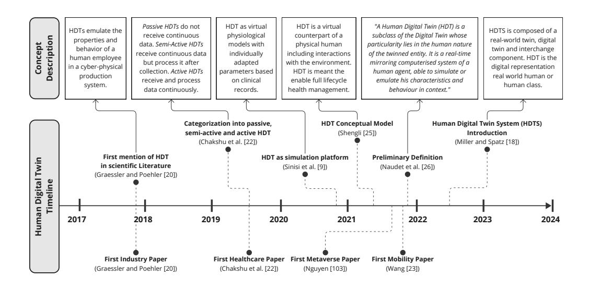

Figure 1: Timeline of Human Digital Twins (HDT) and various conceptual perspectives.

another domain, namely into Healthcare [22]. Within only 3 years the number of publications in Healthcare surpassed the ones from Industry, and is now the most active application area in terms of number of scientific publications. Since 2020 the concept of HDT is entering many different application areas. The number of application areas has been increasing since. Two notable application domains that emerged later are Mobility, and Metaverse applications. Research in Mobility applications started in 2021 [23] and has experienced a slight increase since.

**in scientific Literature Preliminary Definition** The total number of scientific publications by application area is shown in Figure 3(a). HDT research remains dominated by Healthcare and Industry with a combined 61.1% of all extracted scientific publications. Both Metaverse and Mobility applications are new additions that are worth setting apart. Notably a large number of publications is categorised in the Other application area category. This is due to the rapid introduction of HDTs in completely new, and highly diverse area. From Figure 2 the number of publications that don't fit prior categories is increasing rapidly around 2022. A more detailed breakdown on Figure 3(b) illustrates how wide the application areas have spread since 2022.

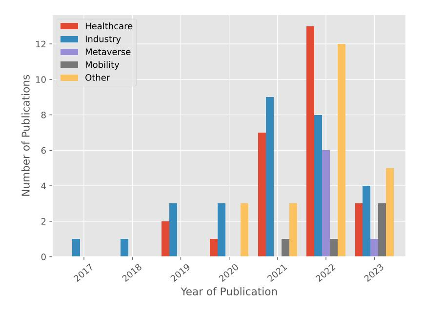

Figure 2: Number of publications by year and by application area. In 2023 papers were screened until the 15th of June.

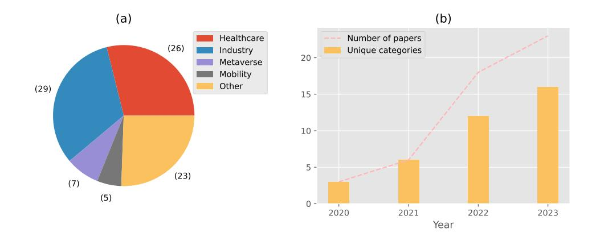

Figure 3: (a) Total number of publications by application area. (b) Total number of papers categorised as "Other" and number of unique categories that have less than 4 papers.

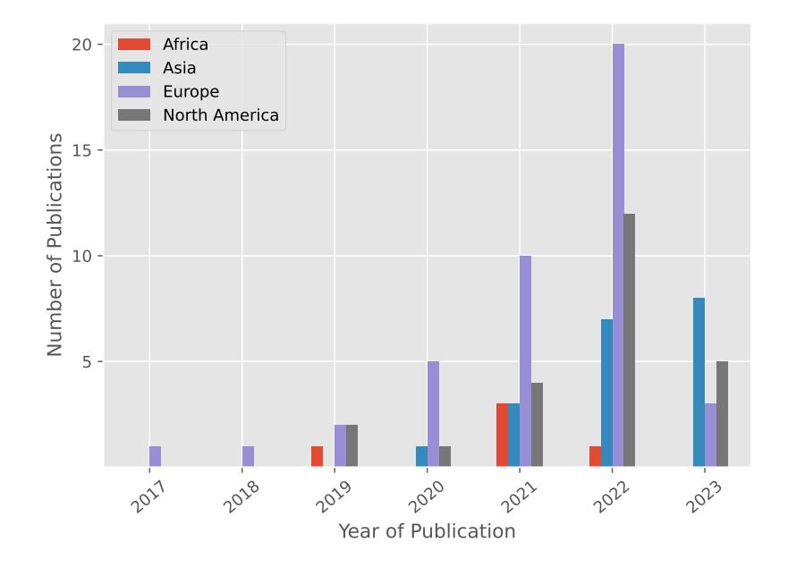

Figure 4: Number of publications by year and continent.

## 2. Geographic Distribution

This section provides an answer to the second part, namely the geographic distribution, of RQ1: How has the research into HDTs evolved? The start and evolution of HDT research divided by continent are shown in Figure 4. First publications start in Europe with a very low volume of publication for 3 years, before growing rapidly. By 2021 the research groups from Africa, North America and Asia have all published research on HDTs. A more detailed breakdown of publications by country and application area is presented in Figure 5. Notably the United States of America is leading in terms of total number of scientific publication, and is the only country to publish for Mobility applications.

## 3. Concept of HDT

This section provides an answer to RQ3: What is the conceptual understanding, or definition, of HDTs? Due to the high number of different application cases many different scientific communities are researching HDTs. With each community comes a different set of domain-specific vocabulary and understandings of what an HDT should consist of. In Figure 1 we highlight

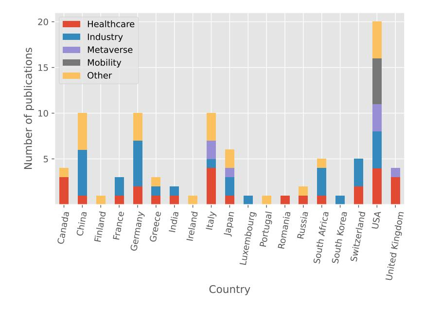

Figure 5: Number of publications by country and application area.

the appearance of conflicting perspectives on the HDT concept. A point of disagreement is the nature of the data flows between the human and HDT. To be precise HDTs are presented as simulation models without continuous synchronisation [9, 24] or as a fully synchronised digital representation that maintains bi-directional data flow with its human [25]. A second point of contention is the scope of the HDT's real-world twin. In Miller and Spatz [18] an HDT may model a class of humans, while a more common conception is that HDTs model human individuals.

The objective of our paper is to bridge the gap among scientific communities and provide a general, domain-agnostic definition for HDT. In prior work we proposed a preliminary definition which serves as starting point for the present systematic literature review:

A Human Digital Twin (HDT) is a subclass of the Digital Twin whose particularity lies in the human nature of the twinned entity. It is a real-time mirroring computerised system of a human agent, able to simulate or emulate his characteristics and behaviour in context. (Naudet et al. [26])

Before proposing a general definition in Section 5.5 we described the current landscape of HDT definitions and conceptualisations across application domains. An important number of papers do not introduce or define the concept of HDT before using it. Indeed 38.3% of papers don't reference any existing definition nor do they introduce the concept explicitly. Because of this shortcoming we need to extract the implicit understanding of the HDT concept from their implementation or proposed usage. From the preliminary definition in [26] a few key dimensions can be extracted.

- 1. Digital Twin: The concept of DT first found numerous applications in Industry. However it is a new concept for the Healthcare community. The perception of what constitutes a DT is not uniform within or across scientific communities. We discuss the definition and types of DTs encountered in literature when applied to humans in Section 4.3.1.
- 2. Twinned Entity: The twinned entity of an HDT needs to be of human nature. From the scientific literature we extracted what the twinned entity of HDTs is and present it in Section 4.3.2.

## 3.1. Digital Twin Conceptualisation

This section addresses RQ3.2: How is the concept of DT understood and used? A clear understanding of the DT concept is a fundamental part of any HDT definition. The first mention of the concept is attributed to work on Product Life cycle Management [5]. At its centre a DT is at least composed of a twinned physical system and a digital object that contains all measurable information about the physical system [27]. A later popular definition and model includes 5 dimensions, [28][29]; (1) physical entity (2) DT Data (3) Virtual Models (4) Services (5) Connections between each of the dimensions. Further extensions for specifically Human-Machine DTs have been proposed in [30], which explicitly include the environment, the human user, and a discussion on shared autonomy between the human and their DT.

In 2018 a major paper [31] presents how the concept of DT is used differently in various disciplines, as well as conceptual variations in the definitions themselves. According to the authors the level of data integration of the DT is not always considered explicitly. To harmonise the understanding they introduce three subcategories which are distinguished by their level of integration (see Figure 6), namely; (i) Digital Model, (ii) Digital Shadow, and (iii) Digital Twin.

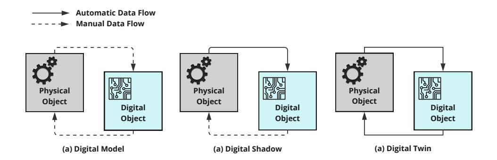

Figure 6: (a) Digital Model, (b) Digital Shadow and (c) Digital Twin as introduced in Kritzinger et al. [31]. The categories are distinguished by the level of data integration.

(i) Digital Models represent physical objects without any automated data exchange (e.g. simulations): "A change in state of the physical object has no direct effect on the digital object and vice versa." [31]

(ii) Digital Shadows receive data from the physical object through an automated data flow: "A change in state of the physical object leads to a change of state in the digital object, but not vice versa." [31]

(iii) Digital Twins have integrated and automatic data flows in both directions, which enables the DT to act as a control instance: "A change in state of the physical object directly leads to a change in state of the digital object and vice versa" [31].

As an additional anchor for our understanding of DTs we use a more recent definition as provided; A set of adaptive models that emulate the behaviour of a physical system in a virtual system getting real time data to update itself along its life cycle [...] (Semeraro et al. [32]). For our own analysis we extract three pieces of information from the scientific papers:

- 1. Have the authors explained the concept of DT before using it? Do they reference an existing DT definition, explicitly proposing a definition or explaining the concept in their own words all count?
- 2. We distinguish between papers that propose conceptual models, frameworks or architectures for HDTs (concept papers) from papers that describe implementations (case study papers). Authors that propose a

| Definition provided | Digital Twin | Digital Shadow | Digital Model |
|---------------------|--------------|----------------|---------------|
| or referenced       | Count        | Count          | Count         |
| Yes                 | 39           | 5              | 12            |
| No                  | 10           | 6              | 18            |

Table 4: Number of publications grouped by level of integration and whether they provide a definition before using the HDT concept.

conceptual approach and implement it in the same paper are counted as case study papers only.

3. Finally we categorise the conceptual models or implementations according to their level of integration following the three sub-categories from [31] as shown on Figure 6.

Out of the 90 papers on HDT analysed, 49 were about true DTs, 11 about Digital Shadows and the remaining 30 about Digital Models. The level of integration is changing significantly depending on whether authors provide a definition or not in their paper (See Table 4). Papers that don't provide a definition tend to follow the tenants of DTs less closely and have increased risk of developing Digital Models instead. It indicates a potential misidentification of the concept.

A second major factor that impacts the integration level is whether the paper is conceptual in nature or presents an implementation. Following this, Figure 7 shows the difference in level of integration for each application domain. For all application areas the level of integration is higher for conceptual papers than for case-studies. In aggregate 76.2% of conceptual papers propose true DTs, while only 42.9% of case-studies do. The difference is even more pronounced when counting the increase in Digital Models when moving from concept towards implementation; 16.7% of conceptual papers propose Digital Models while 46.9% of implementations are Digital Models. Please note that not all Digital Models are misidentified DTs as some authors choose to create a Digital Model first, before addressing the technical challenges to elevate it to become a DT. On Figure 7 a more granular overview is given. Notably the level of integration is decreasing for all application areas when going towards implementation. Paper from industrial applications achieve an overall high level of integration. The concept of DTs themselves stems from industrial research and the community has an increased familiarity with

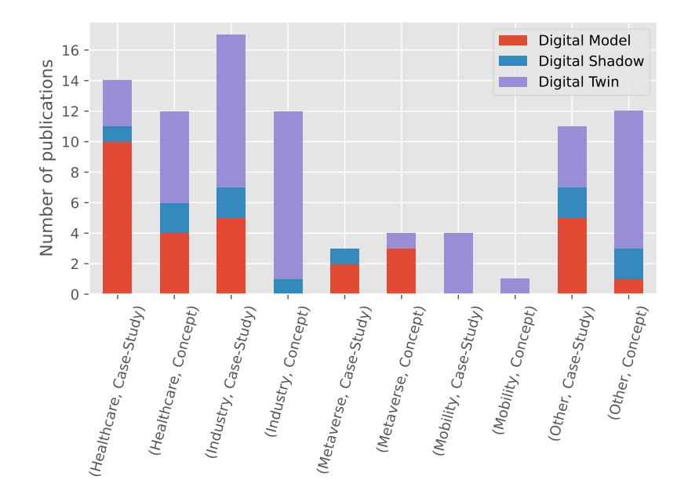

Figure 7: Level of data integration in reviewed paper, categorised by application domain and whether the study is conceptual in nature or a practical case-study.

the concept. All of the conceptual proposals are at least Digital Shadows indicating a more strict adherence to the tenants of digital twinning in the community. Nonetheless when implementing case studies nearly a third of the papers present digital models. Only Mobility applications succeed in having full data integration for both their conceptual models and implemented case studies, however the field is rather new and only 5 publications have been analysed. A third of papers from Healthcare that focus on the conceptual aspects of HDTs propose Digital Models instead, indicating a drift in conceptual understanding. Actual case studies are dominated by Digital Models because the research is mostly focused on creating working models first, and integrating said models later. Metaverse applications are highly focused on 3D avatar creation which tend to be decoupled from any human subject, as a consequence they should be considered Digital Models.

We observe that the interpretations and implementations of the DT tenants vary across application domains. The use of the word is ambiguous and often used interchangeably with Digital Model and Digital Shadow. We disambiguate the terms in Section 5.

## 3.2. Twinned Entity

This section addresses RQ3.1: What is the scope of the twinned entity? HDT is a special application of a DT. While a DT can in principle have any system as its twinned entity, an HDT should have a human entity as its twin. Understanding what is exactly meant by human entity constitutes the second part of our HDT definition.

From the literature a large majority of cases, to be precise 94.4%, considers a human individual as the twinned entity. However there are two other notable categories that emerged; human roles, and systems containing humans. A breakdown of the exact count is shown in Figure 8.

For human roles a model is created that is meant to reproduce the behaviour or attributes of a human class or a human in a specific role. These models are not connected in real time to an individual nor do they seek to simulate a specific individual. All three examples have a low level of data integration and all qualify as Digital Models. As an example, in [33], a model is created that reproduces the behaviour of a control room operator based on a cognitive architecture (ACT-R). However there is no live data from an individual being fed into the model, the goal instead is to simulate and approximate real operator behaviour. In other work a 3D model of a human is created either while sitting [34] or walking [35] to determine the impact on wireless connections using ray-tracing. While data from humans is used to adapt the model they remain generic in nature and don't seek to describe one specific individual.

The second category is DTs of systems containing humans. If the authors create a DT of a system that contains humans (e.g: factory, household, traffic system, hospitals) and identify the whole as an HDT, then we count it in this category. In [30] the authors extend the concept of DTs with a special focus on humans. They have a particular interest in Human-Machine systems and propose a holistic DT for the entire system. In that context the human is entirely integrated as part of the larger DT, named Human-Machine DT, and does not have its own HDT. Interestingly two types of humans are distinguished; those who are subject to data collection and are modelled; and those that are users of the DT through the service layer. In [36] an HDT reference model is proposed which includes factory entities and events as well.

From this analysis we can observe the overwhelming consensus that the twinned entity of an HDT is a human individual. It is to be distinguished

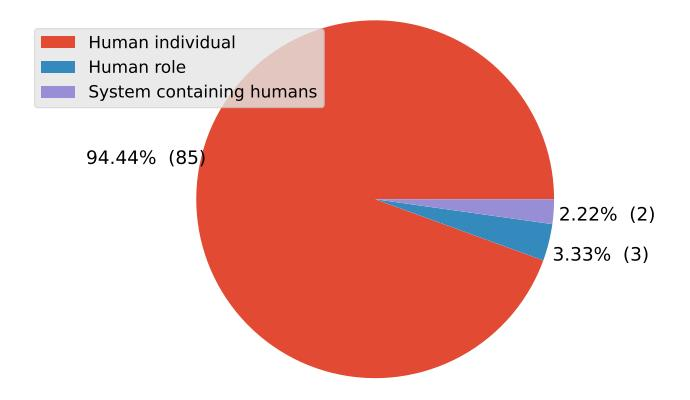

Figure 8: Count of publications categorised by the nature of the twinned entity.

from a human user of the HDT, which is similar to the operator of a traditional DT.

## Analysis & Discussion

Through our literature review we have explored the main conceptual components of HDTs as they are understood and used by various communities. It revealed that the term HDT is not only used to refer to true DTs, but also to Shadows or Models. In Kritzinger et al. [31] the notion of Digital Object and Physical Object is introduced. To avoid confusion, Figure 9 summarizes the vocabulary used for DTs and HDTs and common synonyms for the Physical Object.

For our analysis, we come back to the high-level model of a DT and its twinned entity. That is a physical object (the twinned entity), a digital object (the DT), and data flows between them. In the following, we clarify what are the physical object and the digital object in the case of an HDT, and we categorise HDTs variations based on the nature of data transfers. In Figure 10 we give a basic overview of the differences between (i) Human Digital Model; (ii) Human Digital Shadow; (iii) Human Digital Twin and; (iv) traditional Digital Twin. A traditional DT receives data automatically from a technical system through a data acquisition interface. It processes the data and runs models to return automatic feedback to the twinned sys-

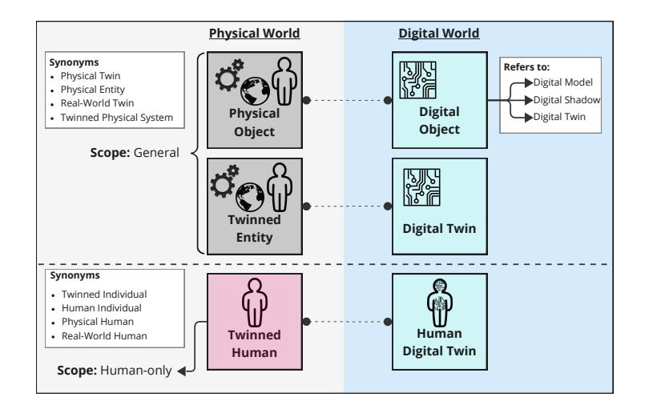

Figure 9: Vocabulary for Digital Twin and Human Digital Twin.

tem. Likewise, an HDT receives data automatically from a human individual through a data acquisition interface. However additional data can be entered manually. The data is processed and models are run to create feedback that is returned through a human-machine interface to the twinned human. How the feedback is given represents a major difference from traditional DTs and is discussed in a dedicated Section 5.4.

Each of the elements are discussed in detail in the Sections below; (i) Physical Object, also referred to as twinned entity (Section 5.1); (ii) automatic data flow to the Digital Object (Section 5.2); (iii) Digital Object (Section 5.3); (iv) automatic feedback to the Physical Object (Section 5.4). After covering all the elements that make up an HDT, and laying out the differences with a traditional DT, we aggregate all our findings in a general and application agnostic definition (Section 5.5).

## 1. HDT Specificities: Twinned Entity

For DTs in general the twinned entity can be any physical object. One aspect that separates an HDT from a traditional DT is that the twinned entity needs to be human. In our preliminary definition the twinned entity has to be of human nature. However in Section 4.3.2 we have established that there is high consensus that the twinned entity needs to be a human individual. We align ourselves with the consensus and refine the definition with the necessary, but not sufficient, condition that the twinned entity is a human individual.

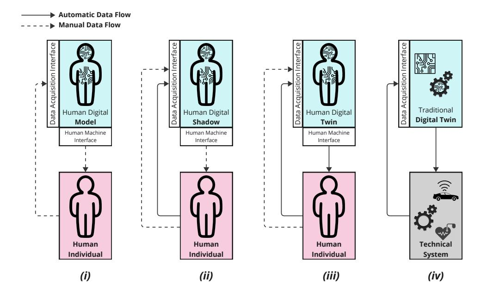

Figure 10: Overview of entities and data flows for (i) Human Digital Model; (ii) Human Digital Shadow; (iii) Human Digital Twin and; (iv) traditional Digital Twin.

However there is a special case which tests the boundary of this condition. Is it still an HDT if the twinned entity is a human individual including a strongly coupled technical system? A system is strongly coupled when its components are highly interdependent and hard to separate. A hypothetical example would be a pacemaker or insulin pump where the twinned human is highly dependent on the technical system's functioning. In contrast, for weakly coupled systems the human can remove themselves from the interaction and exist independently. An illustrative example of a weakly coupled technical system is a smart car that provides driver assistance [17]. Exoskeletons are another great example, where the coupling can be weak if a worker is using the exoskeleton temporarily [37], or strong if the augmented human is permanently dependent on the system.

We take the position that a single DT that encompasses a human and a weakly coupled technical system is not an HDT as the gathered data is no longer focused on the human individual but also the technical system. Additionally the human can remove themselves from the interaction and render the joint DT ineffective. For this reason it would be advisable to create

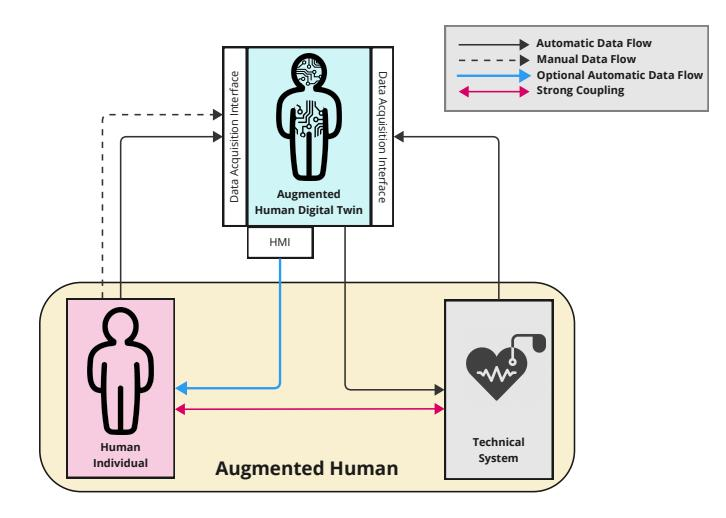

Figure 11: Data flows of an augmented Human Digital Twin (aHDT) where a human and a strongly coupled technical system is twinned to a single DT.

two separate DTs with the ability to share data with each other, as proposed in [38] for a Human-Robot Collaboration context. The most interesting edge case is a DT containing a human and a strongly coupled technical system. Like before data from both the human and technical system are gathered and processed, with the only difference being the level of interdependence. If the strongly coupled technical system is meant to accompany the human for a long period of time, or even their entire life, then we consider it a special type of HDT. To be precise with our language we propose that the DT of a human including technical systems that augment the twinned human should be referred to as Augmented Human Digital Twin (see Figure 11).

## 2. HDT Specificites: Data Flow to the Digital Object

When considering traditional DTs, for a machine, or an autonomous car for example, there is the possibility to design the technical system with integrated sensors. For a human individual does not come with integrated sensors and some of the internal processes are not easily measurable with today's technology. Lauer-Schmaltz et al. [15] identify that in particular gathering information about human cognition represents a substantial research gap. Besides the challenge of gathering data that provides insights into the human's internal state, it is important to consider how the data is transmitted to the HDT i.e., whether the data flow is manual or automatic, and whether the data is received in real-time.

For traditional DTs and Digital Shadows the data flow from physical object to digital object needs to be automatic [31]. The same necessary condition applies to HDTs and can, for example, be fulfilled with data collection through wearables or live video feeds. Depending on the application case the automatically gathered data may be insufficient and complementary manual input may be required. An illustrative case study is the prediction of fitness outcomes based on manual inputs about food consumption and automatically received data from wearables [39]. It is worth noting that traditional DTs may also receive manual inputs, but from an operator, not the twinned entity. This is markedly different from receiving manual data directly from the twinned human. An analogous situation for HDTs would be manual inputs from a Healthcare professional that has the role of monitoring the twinned human, similar to an operator monitoring a twinned technical system.

A second point of contention is whether a DT, in general, needs to receive data in real time as explicitly stated in the definition of DT in [32]. Depending on the application case the real time requirement is not needed for the HDT to be effective. For a Human-Robot Collaboration case where collisions have to be avoided it is necessary to track the movement of the human in real time. But to monitor the development of a disease to adapt treatment, it is not a necessary requirement to achieve effectiveness. Nonetheless both cases deserve to be considered HDTs which is why we believe the automatic nature of the data transfer is a more meaningful component of the definition.

In short, we take the position that an HDT necessarily receives data automatically from its twinned human individual but it is not necessary to receive the data in real time. The automatically received data can, but does not have to, be complemented by manual entries.

## 3. HDT Specificites: Digital Object

The Digital Object refers to the HDT itself and is purely digital in nature. Its primary role is to be a digital representation of the twinned individual, requiring a model that emulates the state, and possibly behaviour, of the twinned human. Like for a traditional DT, this model may be used to predict future states or run simulations. To build its model, the HDT receives data from its twinned individual through deployed sensors and manual inputs. The personal nature of the data makes security and data management a fundamental responsibility of the HDT. In addition an HDT may deploy communication interfaces to receive data from other DTs or technical systems to provide the needed context to the hosted models and send relevant messages to surrounding systems. The key components described here are fairly similar to traditional DTs, nonetheless we see two specific challenges for HDTs, namely the complexity of humans and the highly dynamic context they live in.

Traditional DTs mostly have human-made technical systems as their twinned entity. The engineering efforts to develop the technical system establish a minimum level of understanding and mastery of the system at hand. While technical systems can be highly complex, they pale when compared with the complexity of a human individual which is composed of highly interlinked cognitive, physical, physiological, social and biographic aspects. To truly reflect the state of a human, let alone predict their evolution, each aspect would need to be modelled including their interactions and dependencies. For practical use cases it may be sufficient to model a subset of human aspects to achieve a fit for purpose digital representation.

A second difference is the context in which a human or a technical system lives or operates in. Most technical systems are designed to operate in highly specific contexts and their DTs can be effective by hosting highly specialised models e.g.: autonomous cars operate on roads and industrial robots are operated on assembly lines. In contrast a human individual is exposed to an enormous spectrum of contexts within their lifetime making the transferability and generalisation of models increasingly challenging. For example, a model for visual attention can be applied in various contexts, such as driver behaviour, pedestrian street crossings, or factory worker alertness. Creating a generalised attention model is an enormous challenge but can benefit multiple applications simultaneously. These generalised models represent the building blocks for a holistic human model.

In summary, an HDT primarily emulates its twinned human's state and potentially behaviour. Beyond emulation the HDT may have additional functions such as simulation or prediction. Personal data needs to be safeguarded and contextual information may be received by other DTs or technical systems.

## 4. HDT Specificites: Feedback to the Physical Object

According to [31], "A change in state of the physical object directly leads to a change in state of the digital object and vice versa.". This means that for classical DTs, feedback should be direct and automated. However in reality feedback is partially directed towards the twinned system (prescribing real time actions [32]) and partially towards the human operator to adapt their decisions when optimising operations or scheduling maintenance. So we can distinguish two kinds of feedback: (i) direct feedback addressed at the twinned system directly, and (ii) indirect feedback which goes through an operator before any changes to the physical object are applied. The latter kind inhibits the automatic application of the feedback.

For traditional DTs the form of the feedback varies from warnings to the operator to direct control of the twinned entity. An illustrative example is from predictive maintenance where the DT pro-actively schedules maintenance based on real-time data of twinned machinery and the estimated Remaining Useful Life [40]. A DT may simulate a robotic arm to optimize path selection and provide a program with optimized behaviour as feedback. Even direct control is possible with DTs, for example the ventilation and air conditioning of buildings may be directly controlled to maintain ideal working conditions. In contrast a human cannot be directly controlled by their HDT. Instead recommendations and warnings can be sent, but a human may miss or ignore feedback messages. For instance a recommendation to take a break during an industrial assembly task can easily be ignored by the worker.

Just like for technical systems, humans can receive direct and/or indirect feedback from their HDT. Direct feedback is necessarily mediated through a Human-Machine Interface while indirect feedback goes through a third system before impacting the twinned individual. To fulfil the condition to be a DT the feedback needs to be automatic, which is the lens through which we analyse both direct and indirect feedback below.

Direct feedback is necessarily mediated through a Human-Machine Interface to be understandable to a human individual. Any model output from the HDT needs to be translated into a human understandable form and can take various forms, e.g., visual feedback on a screen, push notifications, lights and sounds for alerts or even haptic feedback. Depending on the modality of the feedback the human can easily ignore or unwillingly miss it, and even if the feedback is successfully received it can be disregarded by the human. Overall the feedback can be considered weak in its potential to control the twinned individual which is a fundamental difference to traditional DTs. In our view, any direct feedback that is automatically sent, independently on whether it has been accepted, fulfils the condition of [31]. Indirect feedback goes to another system first which can be a human entity or a technical system. An illustrative example for indirect feedback through a human is a Healthcare professional. They may use an HDT to receive updates about the progress of an affliction and adapt the treatment based on it, much alike the case of an operator receiving information about a machine to adapt its operating parameters. The introduction of a human entity that has to manually apply any change to the twinned human's state breaks the automatic nature of the data transfer and should not be considered an HDT. A technical system can be weakly or strongly coupled. A strong coupling implies that a change in the technical system will lead to a change in the state of the twinned human as well. Thus feedback received by a strongly coupled systems is functionally the same as a direct feedback. In contrast, a feedback mediated through a weakly coupled system is indirect in nature.

An HDT needs to provide automated feedback to the twinned individual. Direct feedback through a Human Machine Interface fulfils this condition. Indirect feedback through another human entity, or weakly coupled technical system, is insufficient and would fall into the category of Human Digital Shadow.

## 5. General Human Digital Twin Definition

Based on the prior sections on the specificity of an HDT compared to a traditional DT we synthesise a general domain-agnostic definition. From the prior discussion the following elements have been identified:

- The twinned entity is necessarily a human individual.
- The input data is necessarily gathered automatically and may be complemented by manual data entries.
- The HDT necessarily needs to host models to reflect the state of the twinned individual, that is be able to emulate the twinned individual. The HDT may host additional functions such as simulation or prediction.
- Feedback is necessarily given automatically to the twinned human.

## Proposed General Definition: Human Digital Twin

Human Digital Twin is a class of Digital Twin whose twinned entity is a human individual. It is a digital representation of the twinned human, emulating their state and dynamics. It automatically receives data, with optional manual entries, and provides automatic feedback directly to the twinned human.

With this definition we give our best proposal that respects the tenants of digital twinning and duly considers the conceptual understanding from different disciplines. The definition clarifies the exact nature of the twinned entity and characterises the required data transfers. It also requires HDTs to emulate their twinned human. HDTs may have additional functions, such as simulation and prediction functions. Also communication with other DTs or technical systems is allowed but not required.

During the prior discussions about the nature of the twinned entity (Section 5.1) we identified the special case of a human augmented by a strongly coupled technical system. This constitutes a special case of HDT which we named augmented Human Digital Twin and define as follows:

## Proposed Definition: Augmented Human Digital Twin

Augmented Human Digital Twin is a class of Human Digital Twin whose twinned entity is a human individual coupled strongly with a technical system. It returns automatic feedback directly to the twinned human individual or to the technical system.

## Challenges and Research Directions

This section addresses RQ4: What are the challenges for HDT development and future research directions?

## 1. Communication and Connectivity

HDTs rely on the data they receive but reliable data transfer is a major challenge. Depending on the use case, the twinned human individual may be moving in various environments throughout the day. Minimising the effect of mobility is a key technical challenge [41]. Lacking network coverage can lead to gaps in data collection which directly impact the HDT's ability to run models in real-time and provide feedback to the twinned individual. A promising approach for continuous real-time synchronisation is prediction-enhanced connectivity which uses the HDT's prediction to relieve the need for constant synchronisation [42]. The computing resources to run the deployed models should be in physical proximity of the human to reduce latency. Techniques like cloud-edge computing are promising approaches [43] that can help minimise the latency. Interesting choices have to be made for what models should be run at on an edge node and which should be delegated to the cloud. The place of models hosting, resource allocation and task off-loading are decisions that need to be optimized. A two-timescale optimization approach, where frequent decisions are run on the edge, while rare decisions are run on the cloud, can help balance accuracy, delay and energy consumption [44]. A set of guidelines to help designers decide which computation delegate to what level would be a helpful contribution to the community.

## 2. Sensing Human Data

Humans are complex systems and our capability to measure and model the human state is limited. External features like movement, position or gaze are measurable with current day technology through computer vision methods and eye tracking methods. Even for external features data from various sensor types are often required which leads to a need for effective and efficient data fusion techniques. Data about human physiology can be gathered through wearables but only provides a limited picture of the actual human state. Heavy limitations arise when trying to capture data about human cognition [15] where the measurements often rely on invasive imaging techniques like electroencephalography or functional Magnetic Resonance Imaging. Last, not all human aspects can be gathered through sensors, making data directly provided by the twinned human (e.g. issued from questionnaires) important for an HDT. Depending on the use-case, complementing real-time observations from sensors with "manual" data becomes essential. For example, personality today can mostly be obtained from standardised psychological tests (e.g. Big Five [45] or the like). Attempts exist to deduce personality traits from behaviour in games [46], but results are not as reliable as with normalised questionnaires. Another example is biographic data, which most of the time cannot be invented, though they can be retrieved from digital records when available.

## 3. Modelling

Once data is gathered about a specific aspect of the human individual, the challenge becomes modelling their state, evolution and behaviour. Current HDT developments are highly specialised and typically seek to create models that focus on very few aspects of the individual and are restricted to specific contexts. As a result a large variety of models are built and often function as proof of concept. The ambitious vision of HDTs is to create one persistent DT that accompanies the twinned individual throughout their life and is able to provide support in a large variety of contexts. To work towards this vision the efforts across communities need to be coordinated such that a multitude of specialised HDTs can be integrated into a holistic one. A standardised framework and architecture with precise design guidelines with the idea of integration in mind would be of enormous benefit to developers. Multiple frameworks and architectures have been proposed, often with a specific application in mind, but the current challenge is to build consensus across disciplines and decide on a standard.

Independent of the long term vision, challenges with specialised models persist and need to be addressed. When creating a specific model, the human nature of the subject creates a set of challenges. As not all types of data can be gathered at all times, models need to be robust to data gaps. Similar robustness is needed for poor data quality, especially when complementary manual data entries are used in the model. Especially Machine Learning models, and in general data-driven models, are affected by this limitation as they need large volumes of high quality data to be trained. The data scarcity and gaps may be addressed by Artificial Intelligence-Generate Content (AIGC). This approach advocates for the use of generative AI (e.g. GAN [47] or Diffusion model [48]) to create synthetic data. First models are pre-trained on general datasets, before fine-tuning it to the specific use, like a rare disease or personalization to a specific individual [49]. In addition, generative AI can help with data management by de-noising or imputing data, or even directly be used to model the human body [16]. In all cases trained data-driven models need to be validated in field conditions to determine whether they generalises well, especially when datasets are created in lab conditions. Explainability is an important requirement for critical application cases where an operator or Healthcare professional needs to understand the reason behind a given output. In more general terms explainability of the models is a key factor in building trust and acceptance.

Models may require multi-modal data to describe, track and predict the

behaviour of an individual. In this context data fusion is a challenge for development [50], which directly impacts the models that can be built on top of fused data. The phenomena influencing the state and behaviour of a human happen at different time scales which may pose a challenge to modelling efforts. A slow process like ageing, or shifting moods, impact the behaviour, just like fast processes like recalling instructions, or recognising a change in the environment.

If the HDT requires real-time operations (e.g. in collaborative motion planning [51]), or fast feedback, it imposes heavy restrictions on the computational complexity a model can have. Depending on the human aspects that are modelled the computational complexity for high-fidelity models can easily be prohibitive, therefore a trade-off between fidelity and complexity is an inevitable dilemma that arises.

Cognitive aspects represent a major modelling challenge [15]. HDTs seek to emulate humans including their cognition and could take inspiration from Cognitive Digital Twin (CDT) research. CDT development aims to create a digital representation of a physical system with additional cognitive capabilities to perform autonomous activities and adapt in real time to varying operational contexts [52]. The field has advanced modelling of perception, memory and reasoning. In particular CDTs can be driven by cognitive architectures that recreate the cognitive cycle of human cognition, to enable real-time adaptation of technical systems [53, 54]. The CDT cognitive cycle may well be used to represent human cognitive processes dynamically on different time scales and in different interaction contexts [55]. However, CDT and HDT pursue different goals, since the former seeks to use cognition to enhance a DT functions (e.g. analysis), while the latter needs to emulate cognition of a human-being [56].

## 4. Societal and Ethical Challenges

With new technologies come questions about their ethical use and societal acceptance. HDTs are inherently built on personal data that require more stringent protection. Poor data security & privacy, faulty models and lack of explainability can all erode trust in HDTs and hamper societal acceptance.

For secure data sharing blockchain technologies have been identified as a solution but struggle to meet latency requirements because of their expensive consensus mechanisms. A potential solution is dividing the blockchain into shards for parallel processing and use a reputation based mechanism to append transactions to the blockchain [57]. When building data-driven models classical approaches centralise the data for model training which necessarily requires the transfer of sensitive data. To maintain privacy federated learning is popular solution, i.e., instead of sharing data directly, a local model is trained and shared to be subsequently aggregated into a general model. The shared local models may still be used to infer personal data. Adding calibrated noise to the local model parameters has been proposed as a solution [58]. Additionally Okegbile et al. [58] propose a proof of model quality mechanism to validate the local models before aggregation.

Beyond challenges about trust that are related to technical challenges, there are ethical questions that need answering. Concerning data collection HDTs are potentially unduly intruding into an individual's private life, which alongside the risk of data breaches can lead to catastrophic consequences. A potential problem is informing the user about the functioning of the HDT and the use of their personal data in order to get informed consent for the data collection and processing. A clear process is needed for revoking consent and deleting the data in question. Linked to data deletion is the question of what should happen with an HDT upon death of the twinned individual. The gathered data can be of great benefit to domains like medical research, but it is unclear whether the data of the deceased can be used ethically after their death [59]. When HDTs rely on data-driven models, the problem of bias and discrimination becomes significant [60], especially when the HDT outputs are used for critical decisions such as who to hire or what treatment to apply for a disease. It can be argued that the twinned individual should retain control over any decision that impacts their own life. If HDTs become a tool to empower its users equitable access becomes an important priority to avoid creating a two tiered society with a significant section of the population left behind [61]. A last problem to consider is the intentional misuse of HDTs which includes surveillance by governments or corporations, manipulation by political operatives or commercial marketing.

HDTs concentrate data about a human individual and with an appropriate design philosophy can give the individual increased control over their data in question and how it is used, including what decisions impacting their own life can be made with it. Establishing guiding principles for ethical HDT development are an urgent need for industrialists [62] and requires interdisciplinary work with researchers from social sciences.

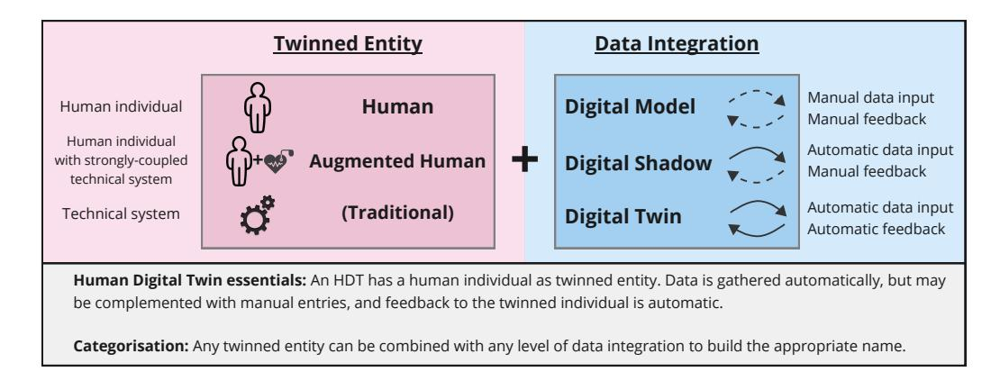

Figure 12: Essentials of Human Digital Twins and categorisation framework based on the twinned entity and level of data integration.

## Conclusions

In this systematic literature review, we surveyed the current day understanding of Human Digital Twin (HDT) across all application domains. We have shown how the concept started in Industry before spreading to Healthcare and subsequently to an ever increasing number of new domains. With new domains came new viewpoints, which contributed to a divergence of conceptual understandings. From the analysed papers, we extracted how HDTs were conceptualised and observed a consensus that an HDT's twinned entity is a human individual. In contrast, researchers have different views on the data flows between the individual and their HDT. We analysed the differences to clarify and disambiguate the concept itself. As a result, we provide a domain-agnostic general definition of an HDT, a special edge case of augmented HDT, and a categorisation framework to distinguish between model, shadow and twin, for technical systems, humans or augmented humans (see Figure 12).

We explored the differences between traditional and human DTs to propose our domain-agnostic general definition of HDT anchored in the literature from all application domains. We took position on the nature of (i) the physical object, (ii) the required data transfers to the digital object, (iii) the nature of the digital object, and finally (iv) the required data transfers to the physical object. Through our analysis, we came to the conclusion that an HDT has a human individual as physical object (its twinned entity), from which it automatically receives data which may be complemented with manual entries. We thus defined the HDT as a digital representation of a human, capable of emulating their state and dynamics, and providing them with automatic feedback. Additionally, we proposed a categorisation into Human Digital Model, Human Digital Shadow and Human Digital Twin, based on the level of data integration. During our analysis, we discussed an edge case where a single digital twin is created for a human and a strongly coupled technical system, which we named augmented Human Digital Twin.

Lastly we discussed the current day challenges for HDT research and development. HDTs have the potential to provide valuable personalised support to its users and enable a new generation of human-centric systems for Industry 5.0. However, HDT development faces a plethora of technical challenges and ethical implications. Technical challenges revolve around gathering data from humans, transferring it and modelling the twinned human individual, especially their behaviour. Measuring internal states like cognition remains an enormous hurdle. Current developments mostly take the shape of proof-of-concepts that operate in a highly specific context, but the long-term vision is creating a persistent Human Digital Twin to accompany the user in various life scenarios. Therefore we call for a cross-discipline effort to converge towards a standardised framework to enable the integration and interlinking of specialised models. Beyond technical challenges HDTs have profound ethical and societal implications. Trust and societal acceptance depend on stringent data security, highly reliable models, and explainability of their outputs. The users need to provide informed consent before their data is used, beyond which data privacy needs to be guaranteed. We call for the creation of ethical development guidelines for HDT development, such that HDTs empower their users with control over their data and decision-making processes that impact their own life.

## Appendix A. Systematic Literature Review Categorisation Table

In this appendix we list all the reviewed papers and in which categories they fall. We categorise papers by (i) Application Area, (ii) choice of twinned entity, (iii) level of data integration and (iv) type of study. Below we briefly explain the details of our categorisation:

Application Area: Papers are organised by application area. We identified four main application areas and use a fifth Other category for all areas with very few examples. The possible categories are encoded in the table as: Industry, Healthcare, Mobility, Metaverse, Other.

Twinned Entity: The twinned entity of an HDT is the physical entity from which data is gathered. Overall we identified three separate categories; human individuals; human roles; systems containing humans. The possible categories are encoded in the table as: Individual, Role, System.

Data Integration: With the level of data integration we distinguish papers by the types of data transfers that occur between the physical object and digital object. Digital Models (DM) have only manual data transfers between both objects. Digital Shadows (DS) have automatic data transfers from the physical object to the digital object, but the other direction is manual. Digital Twins (DT) have automated data transfers in both directions. The possible categories are encoded in the table as: DM, DS, DT

Study Type: We distinguish between papers that perform case studies and papers that present purely conceptual work. If a paper proposes a conceptual model and presents results from a case study in the same paper the paper will be classified as case study. Reviews are treated separately in Section 2 and are not included in the tables below. The possible categories are encoded in the table as: Case-Study, Concept

| R fe e re nc e                                                                       | A l ic io t p p a n | T in w                       | In io te t g ra n | T y p e              |
|-----------------------------------------------------------------------------------------------------|---------------------------------------------|------------------------------------|-------------------------------------|-------------------------------|
| [ ] l. B i e 6 3 t ar re s a                                       | l hc H t ea ar e          | d du l In iv i a | D T                              | C t on ce p       |
| [ ] Pe l. 5 0 t sa an e e a p                                   | H l hc t ea ar e          | In d du l iv i a | D T                              | C t on ce p       |
| [ ] O ke b le l. 4 i 1 t g e a                               | H l hc t ea ar e          | In d du l iv i a | D T                              | C t on ce p       |
| [ ] S he l i 2 5 ng                                                         | H l hc t ea ar e          | In d iv i du l a | D T                              | C t on ce p       |
| [ ] Lo da le l. 6 1 t ns e a                                       | H l hc t ea ar e          | In d iv i du l a | D T                              | C t on ce p       |
| [ ] ba l e l. Iq 5 9 t a                                                 | l hc H t ea ar e          | d du l In iv i a | D T                              | C t on ce p       |
| [ ] b l. Tr in 6 4 t g o er e a                              | H l hc t ea ar e          | In d du l iv i a | D T                              | C S dy tu as e |
| [ ] D B d l. ic is 6 5 t t e en e e a               | H l hc t ea ar e          | In d du l iv i a | D T                              | C S dy tu as e |
| [ ] A l- Zy d l. 6 6 t ou e a                                   | H l hc t ea ar e          | In d du l iv i a | D T                              | C S dy tu as e |
| [ ] H de B d l. 6 0 t er na n z- ou ss ar e a | H l hc t ea ar e          | In d iv i du l a | S D                              | C t on ce p       |
| [ ] l. R iv 6 7 t er a e a                                         | l hc H t ea ar e          | d du l In iv i a | S D                              | C t on ce p       |
| [ ] ba h l. K i e 6 8 t o y as a                             | l hc H t ea ar e          | d du l In iv i a | S D                              | C S dy tu as e |
| [ ] M l. is 6 9 tz t ou e a r                                   | H l hc t ea ar e          | In d du l iv i a | D M                              | C t on ce p       |
| [ ] C hu de O ko kw 4 2 n o -                                   | H l hc t ea ar e          | In d du l iv i a | D M                              | C t on ce p       |
| [ ] C i ha i e l. 7 0 t ar am a                                 | H l hc t ea ar e          | In d iv i du l a | D M                              | C t on ce p       |
| [ ] Je d D 7 1 ns en a n en g                                   | H l hc t ea ar e          | In d iv i du l a | D M                              | C t on ce p       |
| [ ] C ha ks hu l. 2 2 t e a                                        | l hc H t ea ar e          | d du l In iv i a | D M                              | C S dy tu as e |
| [ ] C ha ks hu d N h i ia 7 2 t a n ra su        | H l hc t ea ar e          | In d du l iv i a | D M                              | C S dy tu as e |
| [ ] U h le be l. 7 3 t n rg e a                              | H l hc t ea ar e          | In d du l iv i a | D M                              | C S dy tu as e |
| [ ] H l. 7 4 ig t er n ou e a                                   | H l hc t ea ar e          | In d du l iv i a | D M                              | C S dy tu as e |
| [ ] T ha ha l. 7 5 t t m o ra n e a                    | H l hc t ea ar e          | In d iv i du l a | D M                              | C S dy tu as e |
| [ ] A le ks l. 7 6 t ey ev e a                                  | l hc H t ea ar e          | d du l In iv i a | D M                              | C S dy tu as e |
| [ ] S l. in is i e 9 t a                                                 | l hc H t ea ar e          | d du l In iv i a | D M                              | C S dy tu as e |

| R fe e re nc e                                                           | A l ic io t p p a n | T in w                       | In io te t g ra n | T y p e              |
|-----------------------------------------------------------------------------------------|---------------------------------------------|------------------------------------|-------------------------------------|-------------------------------|
| [ ] d l. Ta in i e 7 7 t r a                           | l hc H t ea ar e          | d du l In iv i a | D M                              | C S dy tu as e |
| [ ] B hr l. i e 7 8 t a am a                           | H l hc t ea ar e          | In d du l iv i a | D M                              | C S dy tu as e |
| [ ] D l. 7 9 te t os e a                                  | H l hc t ea ar e          | In d du l iv i a | D M                              | C S dy tu as e |
| [ ] B de k is l. 8 0 t ou s e a                  | In du tr s y                    | In d iv i du l a | D T                              | C t on ce p       |
| [ ] Jo h l. 5 1 t se p e a                             | In du tr s y                    | In d iv i du l a | D T                              | C t on ce p       |
| [ ] C d d in Tr 6 2 te ar a n en sa ux     | du In tr s y                    | d du l In iv i a | D T                              | C t on ce p       |
| [ ] do l. En 8 1 t e a                                       | In du tr s y                    | In d du l iv i a | D T                              | C t on ce p       |
| [ ] W l. 8 2 t an g e a                                   | In du tr s y                    | In d du l iv i a | D T                              | C t on ce p       |
| [ ] Sp l. 8 3 t ar ro e a w                            | In du tr s y                    | In d du l iv i a | D T                              | C t on ce p       |
| [ ] N de l. 2 6 t t au e a                             | In du tr s y                    | In d iv i du l a | D T                              | C t on ce p       |
| [ ] G le d h le Po 2 0 ra es s r an e r | du In tr s y                    | d du l In iv i a | D T                              | C t on ce p       |
| [ ] l. M in i e 8 4 t t on a                           | du In tr s y                    | d du l In iv i a | D T                              | C t on ce p       |
| [ ] Z he l. 8 5 t ng e a                                  | In du tr s y                    | In d du l iv i a | D T                              | C S dy tu as e |
| [ ] M l. in i e 8 6 t t on a                           | In du tr s y                    | In d du l iv i a | D T                              | C S dy tu as e |
| [ ] S ha l. 8 7 t ng g ua n e a                  | In du tr s y                    | In d iv i du l a | D T                              | C S dy tu as e |
| [ ] Sp l. 8 8 t ar ro w e a                            | In du tr s y                    | In d iv i du l a | D T                              | C S dy tu as e |
| [ ] k l l. L ¨oc in 8 9 t e a                       | du In tr s y                    | d du l In iv i a | D T                              | C S dy tu as e |
| [ ] O l. i j 9 0 t g un se u e a              | In du tr s y                    | In d du l iv i a | D T                              | C S dy tu as e |
| [ ] Z ha l. 9 1 t ng e a                                  | In du tr s y                    | In d du l iv i a | D T                              | C S dy tu as e |
| [ ] L l. iu 9 2 t e a                                        | In du tr s y                    | In d du l iv i a | D T                              | C S dy tu as e |
| [ ] G le d Po h le 9 3 ra es s r an e r | In du tr s y                    | In d iv i du l a | D T                              | C S dy tu as e |
| [ ] l. M 9 4 t ar uy am a e a                       | du In tr s y                    | d du l In iv i a | D T                              | C S dy tu as e |
| [ ] l. M 9 5 te t er ns e a                            | du In tr s y                    | d du l In iv i a | S D                              | C t on ce p       |

| R fe e re nc e                                                                    | A l ic io t p p a n | T in w                       | In io te t g ra n | T y p e              |
|--------------------------------------------------------------------------------------------------|---------------------------------------------|------------------------------------|-------------------------------------|-------------------------------|
| [ ] C l l e l. 9 6 t ar o a                                     | In du tr s y                    | In d iv i du l a | S D                              | C S dy tu as e |
| [ ] G l. 9 7 t re co e a                                           | du In tr s y                    | d du l In iv i a | S D                              | C S dy tu as e |
| [ ] Le l. 9 8 t e e a                                                 | In du tr s y                    | In d du l iv i a | D M                              | C S dy tu as e |
| [ ] B ka l. 9 9 t as ra n e a                                | In du tr s y                    | In d du l iv i a | D M                              | C S dy tu as e |
| [ ] C l. 7 in 3 ta t t on s n es cu e a          | In du tr s y                    | In d du l iv i a | D M                              | C S dy tu as e |
| [ ] S ha l. 1 0 0 tr t ro y e a                           | In du tr s y                    | In d iv i du l a | D M                              | C S dy tu as e |
| [ ] la l. B j i e 3 3 t a a                                     | du In tr s y                    | le R o                       | D M                              | C S dy tu as e |
| [ ] l. M in i e 3 6 t t on a                                    | du In tr s y                    | Sy te s m                 | D T                              | C t on ce p       |
| [ ] A d V de ha 3 0 sc on e an an eg en r        | In du tr s y                    | Sy te s m                 | D T                              | C t on ce p       |
| [ ] D l lo d M f ia ie 1 0 1 t on a a n ar | M ta e ve rs e               | In d du l iv i a | D T                              | C t on ce p       |
| [ ] W l. 1 0 2 t u e a                                             | M ta e ve rs e               | In d iv i du l a | D S                              | C S dy tu as e |
| [ ] N 1 0 3 g uy en                                                      | M ta e ve rs e               | In d iv i du l a | D M                              | C t on ce p       |
| [ ] le l Ja 1 0 4 e                                                      | M ta e ve rs e               | d du l In iv i a | D M                              | C t on ce p       |
| [ ] N 1 0 5 g uy en                                                      | M ta e ve rs e               | In d du l iv i a | D M                              | C t on ce p       |
| [ ] In l. 1 0 6 t am ur a e a                                | M ta e ve rs e               | In d du l iv i a | D M                              | C S dy tu as e |
| [ ] S h l. 7 io 1 0 ta t cc e a                           | M ta e ve rs e               | In d du l iv i a | D M                              | C S dy tu as e |
| [ ] W l. 1 0 8 t an g e a                                       | M b i l i ty o            | In d iv i du l a | D T                              | C t on ce p       |
| [ ] l. L ia 1 0 9 t o e a                                       | b l M i i ty o            | d du l In iv i a | D T                              | C S dy tu as e |
| [ ] W 2 3 g an                                                                 | b l M i i ty o            | d du l In iv i a | D T                              | C S dy tu as e |
| [ ] W l. 4 3 t an g e a                                            | M b l i i ty o            | In d du l iv i a | D T                              | C S dy tu as e |
| [ ] W l. 1 1 0 t an g e a                                       | M b l i i ty o            | In d du l iv i a | D T                              | C S dy tu as e |
| [ ] Z i bu h ka l. 1 1 1 t sc e a                      | O he t r                           | In d iv i du l a | D T                              | C t on ce p       |
| [ ] Iw k i e l. 1 1 2 t a a                                     | O he t r                           | In d iv i du l a | D T                              | C t on ce p       |

| fe R e re nc e                                                                | A l ic io t p p a n | T in w                       | In io te t g ra n | T y p e              |
|----------------------------------------------------------------------------------------------|---------------------------------------------|------------------------------------|-------------------------------------|-------------------------------|
| [ ] In 1 1 3 am a ur                                                 | O he t r                           | In d du l iv i a | D T                              | C t on ce p       |
| [ ] Fu l. 4 in i e 1 1 t r a                                | O he t r                           | In d du l iv i a | D T                              | C t on ce p       |
| [ ] O ke b le d C i i 1 1 5 g a n a          | O he t r                           | In d du l iv i a | D T                              | C t on ce p       |
| [ ] fe H 1 1 6 a z                                                   | O he t r                           | In d iv i du l a | D T                              | C t on ce p       |
| [ ] l. M 1 1 7 ty t ar no v e a                       | O he t r                           | d du l In iv i a | D T                              | C t on ce p       |
| [ ] lo l. Ta 1 1 8 t y r e a                             | O he t r                           | d du l In iv i a | D T                              | C t on ce p       |
| [ ] C he 1 1 9 n                                                        | O he t r                           | In d du l iv i a | D T                              | C t on ce p       |
| [ ] B l. 1 2 0 t rn e e a y                              | O he t r                           | In d du l iv i a | D T                              | C S dy tu as e |
| [ ] Q l. 1 2 1 t u e a                                         | O he t r                           | In d iv i du l a | D T                              | C S dy tu as e |
| [ ] X ia l. 1 2 2 t ng e a                                  | O he t r                           | In d iv i du l a | D T                              | C S dy tu as e |
| [ ] A dr lo l. io 1 2 3 t n p ou s e a       | O he t r                           | d du l In iv i a | D T                              | C S dy tu as e |
| [ ] G l. 1 2 4 t ne cc o e a                             | O he t r                           | In d du l iv i a | D S                              | C t on ce p       |
| [ ] K l. 1 2 5 t op p on en e a                       | O he t r                           | In d du l iv i a | D S                              | C t on ce p       |
| [ ] R l. 1 2 6 t am os e a                                  | O he t r                           | In d du l iv i a | D S                              | C S dy tu as e |
| [ ] C he l. 1 2 7 t ng e a                                  | O he t r                           | In d iv i du l a | S D                              | C S dy tu as e |
| [ ] l. B in 1 2 8 t or g e a                             | O he t r                           | d du l In iv i a | D M                              | C t on ce p       |
| [ ] ho d he X in K ic 1 2 9 z u an uz m v | O he t r                           | d du l In iv i a | D M                              | C S dy tu as e |
| [ ] B l l l. ic i e 3 9 t ar e a r                 | O he t r                           | In d du l iv i a | D M                              | C S dy tu as e |
| [ ] C he 1 3 0 ng                                                       | O he t r                           | In d du l iv i a | D M                              | C S dy tu as e |
| [ ] Pr ks ha l. 3 5 t o c e a                            | O he t r                           | R le o                       | D M                              | C S dy tu as e |
| [ ] Pr ks ha l. 3 4 t o c e a                            | O he t r                           | R le o                       | D M                              | C S dy tu as e |

## References

- [1] E. Commission, D.-G. for Research, Innovation, M. Breque, L. De Nul, A. Petridis, Industry 5.0 – Towards a sustainable, human-centric and resilient European industry, Publications Office of the European Union, 2021. doi:doi/10.2777/308407.
- [2] Y. Lu, H. Zheng, S. Chand, W. Xia, Z. Liu, X. Xu, L. Wang, Z. Qin, J. Bao, Outlook on human-centric manufacturing towards industry 5.0, Journal of Manufacturing Systems 62 (2022) 612–627.
- [3] B. Gladysz, T.-a. Tran, D. Romero, T. van Erp, J. Abonyi, T. Ruppert, Current development on the operator 4.0 and transition towards the operator 5.0: A systematic literature review in light of industry 5.0, Journal of Manufacturing Systems 70 (2023) 160–185.
- [4] ISO-23247, Automation systems and integration—digital twin framework for manufacturing—Part 1: overview and general principles, Standard, International Organization for Standardization, Geneva, CH, 2020.
- [5] M. Grieves, Digital twin of physical systems: opportunities and challenges, in: Proceedings of the ASME 2002 International Mechanical Engineering Congress and Exposition, New Orleans, LA, USA, 2002, pp. 17–22.
- [6] B. Iung, D. Morel, P. Lhoste, Interoperable component-based emulation for validation of distributed control, IFAC Proceedings Volumes 33 (2000) 159–165. doi:10.1016/S1474-6670(17)38043-6.
- [7] M. Chen, J. Han, X. Hu, X. Jiang, L. Guo, T. Liu, Survey of encoding and decoding of visual stimulus via fmri: an image analysis perspective, Brain imaging and behavior 8 (2014) 7–23.
- [8] M. Lebedev, Brain-machine interfaces: an overview, Translational Neuroscience 5 (2014) 99–110.
- [9] S. Sinisi, V. Alimguzhin, T. Mancini, E. Tronci, F. Mari, B. Leeners, Optimal Personalised Treatment Computation through In Silico Clinical Trials on Patient Digital Twins\*, Fundamenta Informaticae 174 (2020) 283–310. doi:10.3233/FI-2020-1943.
- [10] U. Asad, M. Khan, A. Khalid, W. A. Lughmani, Human-Centric Digital Twins in Industry: A Comprehensive Review of Enabling Technologies and Implementation Strategies, Sensors 23 (2023) 3938. doi:10.3390/s23083938.

- [11] A. K. Ramasubramanian, R. Mathew, M. Kelly, V. Hargaden, N. Papakostas, Digital Twin for Human–Robot Collaboration in Manufacturing: Review and Outlook, Applied Sciences 12 (2022) 4811. doi:10.3390/app12104811.
- [12] B. Wang, H. Zhou, X. Li, G. Yang, P. Zheng, C. Song, Y. Yuan, T. Wuest, H. Yang, L. Wang, Human Digital Twin in the context of Industry 5.0, Robotics and Computer-Integrated Manufacturing 85 (2024) 102626. doi:10.1016/j.rcim.2023.102626.
- [13] R. Sahal, S. H. Alsamhi, K. N. Brown, Personal Digital Twin: A Close Look into the Present and a Step towards the Future of Personalised Healthcare Industry, Sensors 22 (2022) 5918. doi:10.3390/s22155918.
- [14] J. Chen, C. Yi, S. D. Okegbile, J. Cai, Xuemin, Shen, Networking Architecture and Key Supporting Technologies for Human Digital Twin in Personalized Healthcare: A Comprehensive Survey, IEEE Communications Surveys & Tutorials 26 (2024) 706–746. doi:10.1109/COMST.2023.3308717. arXiv:2301.03930.
- [15] M. W. Lauer-Schmaltz, P. Cash, J. P. Hansen, A. Maier, Designing Human Digital Twins for Behaviour-Changing Therapy and Rehabilitation: A Systematic Review, Proceedings of the Design Society 2 (2022) 1303–1312. doi:10.1017/pds.2022.132.
- [16] J. Chen, Y. Shi, C. Yi, H. Du, J. Kang, D. Niyato, Generative ai-driven human digital twin in iot-healthcare: A comprehensive survey, arXiv preprint arXiv:2401.13699 (2024).
- [17] Z. Hu, S. Lou, Y. Xing, X. Wang, D. Cao, C. Lv, Review and Perspectives on Driver Digital Twin and Its Enabling Technologies for Intelligent Vehicles, IEEE Transactions on Intelligent Vehicles 7 (2022) 417–440. doi:10.1109/TIV.2022.3195635.
- [18] M. E. Miller, E. Spatz, A unified view of a human digital twin, Human-Intelligent Systems Integration 4 (2022) 23–33. doi:10.1007/s42454-022- 00041-x.
- [19] Y. Lin, L. Chen, A. Ali, C. Nugent, C. Ian, R. Li, D. Gao, H. Wang, Y. Wang, H. Ning, Human digital twin: A survey, arXiv preprint arXiv:2212.05937 (2022).

- [20] I. Graessler, A. Poehler, Integration of a digital twin as human representation in a scheduling procedure of a cyber-physical production system, in: 2017 IEEE International Conference on Industrial Engineering and Engineering Management (IEEM), IEEE, Singapore, 2017, pp. 289–293. doi:10.1109/IEEM.2017.8289898.
- [21] B. Kitchenham, S. M. Charters, Guidelines for performing Systematic Literature Reviews in Software Engineering, Technical Report EBSE-2007-01, Keele University and University of Durham, 2007.
- [22] N. K. Chakshu, J. Carson, I. Sazonov, P. Nithiarasu, A semi-active human digital twin model for detecting severity of carotid stenoses from head vibration—A coupled computational mechanics and computer vision method, International Journal for Numerical Methods in Biomedical Engineering 35 (2019) e3180. doi:10.1002/cnm.3180.
- [23] Z. Wang, Mobility Digital Twin with Connected Vehicles and Cloud Computing, Pre-print (2021). doi:10.36227/techrxiv.16828759.v1, techRxiv.
- [24] U. K. Chude-Okonkwo, Conceptual Molecular Communication Solution for Developing Digital Twin to Enable Precision Medicine Implementation, in: 2021 15th International Conference on Signal Processing and Communication Systems (ICSPCS), IEEE, Sydney, Australia, 2021, pp. 1–10. doi:10.1109/ICSPCS53099.2021.9660222.
- [25] W. Shengli, Is Human Digital Twin possible?, Computer Methods and Programs in Biomedicine Update 1 (2021) 100014. doi:10.1016/j.cmpbup.2021.100014.
- [26] Y. Naudet, A. Baudet, M. Risse, Human Digital Twin in Industry 4.0: Concept and Preliminary Model:, in: Proceedings of the 2nd International Conference on Innovative Intelligent Industrial Production and Logistics, 2021, pp. 137–144. doi:10.5220/0010709000003062.
- [27] M. Grieves, J. Vickers, Digital Twin: Mitigating Unpredictable, Undesirable Emergent Behavior in Complex Systems, in: F.-J. Kahlen, S. Flumerfelt, A. Alves (Eds.), Transdisciplinary Perspectives on Complex Systems, Springer International Publishing, Cham, 2017, pp. 85–113. doi:10.1007/978- 3-319-38756-7 4.
- [28] F. Tao, J. Cheng, Q. Qi, M. Zhang, H. Zhang, F. Sui, Digital twin-driven product design, manufacturing and service with big data, The Interna-

tional Journal of Advanced Manufacturing Technology 94 (2018) 3563–3576. doi:10.1007/s00170-017-0233-1.

- [29] Q. Qi, F. Tao, T. Hu, N. Anwer, A. Liu, Y. Wei, L. Wang, A. Nee, Enabling technologies and tools for digital twin, Journal of Manufacturing Systems 58 (2021) 3–21. doi:10.1016/j.jmsy.2019.10.001.
- [30] C. Ascone, F. Vanderhaegen, Towards a Holistic Framework for Digital Twins of Human-Machine Systems, in: 15th IFAC Symposium on Analysis, Design and Evaluation of Human Machine Systems HMS 2022, volume 55, 2022, pp. 67–72. doi:10.1016/j.ifacol.2022.10.233.
- [31] W. Kritzinger, M. Karner, G. Traar, J. Henjes, W. Sihn, Digital twin in manufacturing: A categorical literature review and classification, IFAC-PapersOnLine 51 (2018) 1016–1022. URL: https://www.sciencedirect.com/science/article/pii/S2405896318316021. doi:https://doi.org/10.1016/j.ifacol.2018.08.474, 16th IFAC Symposium on Information Control Problems in Manufacturing INCOM 2018.
- [32] C. Semeraro, M. Lezoche, H. Panetto, M. Dassisti, Digital twin paradigm: A systematic literature review, Computers in Industry 130 (2021) 103469. doi:10.1016/j.compind.2021.103469.
- [33] B. Balaji, M. A. Shahab, B. Srinivasan, R. Srinivasan, ACT-R based human digital twin to enhance operators' performance in process industries, Frontiers in Human Neuroscience 17 (2023) 1038060. doi:10.3389/fnhum.2023.1038060.
- [34] A. Prokscha, F. Sheikh, D. Lessy, T. Kaiser, Portable Device-Centric Human Postures for Modeling Reliable THz Channels, in: 2022 Fifth International Workshop on Mobile Terahertz Systems (IWMTS), IEEE, Duisburg, Germany, 2022, pp. 1–5. doi:10.1109/IWMTS54901.2022.9832444.
- [35] A. Prokscha, F. Sheikh, D. Lessy, N. A. Ali, T. Kaiser, Multidisciplinary Data Fusion for THz Ray- Tracing, in: 2022 16th European Conference on Antennas and Propagation (EuCAP), IEEE, Madrid, Spain, 2022, pp. 1–5. doi:10.23919/EuCAP53622.2022.9769619.
- [36] E. Montini, V. Cutrona, N. Bonomi, G. Landolfi, A. Bettoni, P. Rocco, E. Carpanzano, An IIoT Platform For Human-Aware Factory Digital Twins, Procedia CIRP 107 (2022) 661–667. doi:10.1016/j.procir.2022.05.042.

- [37] C. Constantinescu, R. Rus, C.-A. Rusu, D. Popescu, Digital Twins of Exoskeleton-Centered Workplaces: Challenges and Development Methodology, Procedia Manufacturing 39 (2019) 58–65. doi:10.1016/j.promfg.2020.01.228.
- [38] B. Gaffinet, J. A. H. Ali, H. Panetto, Y. Naudet, Human-Centric Digital Twins: Advancing Safety and Ergonomics in Human-Robot Collaboration, in: S. Terzi, K. Madani, O. Gusikhin, H. Panetto (Eds.), Innovative Intelligent Industrial Production and Logistics, volume 1886, Springer Nature Switzerland, Cham, 2023, pp. 380–397. doi:10.1007/978-3-031-49339-3 24.
- [39] B. R. Barricelli, E. Casiraghi, J. Gliozzo, A. Petrini, S. Valtolina, Human Digital Twin for Fitness Management, IEEE Access 8 (2020) 26637–26664. doi:10.1109/ACCESS.2020.2971576.
- [40] P. Aivaliotis, K. Georgoulias, G. Chryssolouris, The use of digital twin for predictive maintenance in manufacturing, International Journal of Computer Integrated Manufacturing 32 (2019) 1067–1080.
- [41] S. D. Okegbile, J. Cai, D. Niyato, C. Yi, Human Digital Twin for Personalized Healthcare: Vision, Architecture and Future Directions, IEEE Network 37 (2023) 262–269. doi:10.1109/MNET.118.2200071.
- [42] S. Okegbile, J. Cai, J. Wu, J. Chen, C. Yi, A prediction-enhanced physicalto-virtual twin connectivity framework for human digital twin, Authorea Preprints (2023).
- [43] Z. Wang, R. Gupta, K. Han, H. Wang, A. Ganlath, N. Ammar, P. Tiwari, Mobility Digital Twin: Concept, Architecture, Case Study, and Future Challenges, IEEE Internet of Things Journal 9 (2022) 17452–17467. doi:10.1109/JIOT.2022.3156028.
- [44] Y. Yang, Y. Shi, C. Yi, J. Cai, J. Kang, D. Niyato, X. Shen, Dynamic human digital twin deployment at the edge for task execution: A two-timescale accuracy-aware online optimization, IEEE Transactions on Mobile Computing (2024).
- [45] L. R. Goldberg, The structure of phenotypic personality traits., American psychologist 48 (1993) 26.
- [46] Y. Naudet, A. Antoniou, I. Lykourentzou, E. Tobias, J. Rompa, G. Lepouras, Museum personalization based on gaming and cognitive styles: The blue

experiment, Int. J. Virtual Communities Soc. Netw. 7 (2015) 1–30. URL: https://api.semanticscholar.org/CorpusID:36078105.

- [47] M. AlAmir, M. AlGhamdi, The role of generative adversarial network in medical image analysis: An in-depth survey, ACM Computing Surveys 55 (2022) 1–36.
- [48] A. Kazerouni, E. K. Aghdam, M. Heidari, R. Azad, M. Fayyaz, I. Hacihaliloglu, D. Merhof, Diffusion models in medical imaging: A comprehensive survey, Medical Image Analysis 88 (2023) 102846.
- [49] J. Chen, C. Yi, H. Du, D. Niyato, J. Kang, J. Cai, X. Shen, A revolution of personalized healthcare: Enabling human digital twin with mobile aigc, IEEE Network (2024).
- [50] F. Pesapane, A. Rotili, S. Penco, L. Nicosia, E. Cassano, Digital Twins in Radiology, Journal of Clinical Medicine 11 (2022) 6553. doi:10.3390/jcm11216553.
- [51] A. J. Joseph, K. Kruger, A. H. Basson, An Aggregated Digital Twin Solution for Human-Robot Collaboration in Industry 4.0 Environments, in: T. Borangiu, D. Trentesaux, P. Leit˜ao, O. Cardin, S. Lamouri (Eds.), Service Oriented, Holonic and Multi-Agent Manufacturing Systems for Industry of the Future, volume 952, Springer International Publishing, Cham, 2021, pp. 135–147. doi:10.1007/978-3-030-69373-2 9.
- [52] X. Zheng, J. Lu, D. Kiritsis, The emergence of cognitive digital twin: vision, challenges and opportunities, International Journal of Production Research 60 (2022) 7610–7632.
- [53] J. A. H. Ali, B. Gaffinet, H. Panetto, Y. Naudet, Cognitive systems and interoperability in the enterprise: A systematic literature review, Annual Reviews in Control 57 (2024) 100954.
- [54] J. A. H. Ali, M. Lezoche, H. Panetto, Y. Naudet, B. Gaffinet, Cognitive architecture for cognitive cyber-physical systems, IFAC-PapersOnLine 58 (2024) 1180–1185.
- [55] T. Ji, J. Polzer, X. Xu, Cognitive digital twin framework for smart manufacturing, in: 2023 IEEE 19th International Conference on Automation Science and Engineering (CASE), IEEE, 2023, pp. 1–6.

- [56] Y. Naudet, J. Al Haj Ali, B. Gaffinet, H. Panetto, Cognition in digital twins for cyber-physical systems and humans: Where and why?, in: 18th Int. Workshop on Enterprise Integration, Interoperability and Networking (EI2N), 5th IFAC/INSTICC Int. Conf. on Innovative Intelligent Industrial Production and Logistics (IN4PL2024), Porto, Portugal, 2024.
- [57] S. D. Okegbile, J. Cai, J. Chen, C. Yi, A reputation-enhanced shard-based byzantine fault-tolerant scheme for secure data sharing in zero trust human digital twin systems, IEEE Internet of Things Journal (2024).
- [58] S. D. Okegbile, J. Cai, H. Zheng, J. Chen, C. Yi, Differentially private federated multi-task learning framework for enhancing human-to-virtual connectivity in human digital twin, IEEE Journal on Selected Areas in Communications (2023).
- [59] J. D. Iqbal, M. Krauthammer, N. Biller-Andorno, The Use and Ethics of Digital Twins in Medicine, Journal of Law, Medicine & Ethics 50 (2022) 583–596. doi:10.1017/jme.2022.97.
- [60] T. Hernandez-Boussard, P. Macklin, E. J. Greenspan, A. L. Gryshuk, E. Stahlberg, T. Syeda-Mahmood, I. Shmulevich, Digital twins for predictive oncology will be a paradigm shift for precision cancer care, Nature Medicine 27 (2021) 2065–2066. doi:10.1038/s41591-021-01558-5.
- [61] H. Lonsdale, G. M. Gray, L. M. Ahumada, H. M. Yates, A. Varughese, M. A. Rehman, The Perioperative Human Digital Twin, Anesthesia & Analgesia 134 (2022) 885–892. doi:10.1213/ANE.0000000000005916.
- [62] O. Cardin, D. Trentesaux, Design and use of human operator digital twins in industrial cyber-physical systems: Ethical implications, IFAC-PapersOnLine 55 (2022) 360–365. URL: https://www.sciencedirect.com/science/article/pii/S240589632200221X. doi:https://doi.org/10.1016/j.ifacol.2022.04.220, 14th IFAC Workshop on Intelligent Manufacturing Systems IMS 2022.
- [63] G. Barresi, C. Pacchierotti, M. Laffranchi, L. De Michieli, Beyond Digital Twins: Phygital Twins for Neuroergonomics in Human-Robot Interaction, Frontiers in Neurorobotics 16 (2022) 913605. doi:10.3389/fnbot.2022.913605.
- [64] M. Trobinger, A. Costinescu, H. Xing, J. Elsner, T. Hu, A. Naceri, L. Figueredo, E. Jensen, D. Burschka, S. Haddadin, A Dual Doctor-Patient Twin Paradigm for Transparent Remote Examination, Diagnosis, and Rehabilitation, in: 2021 IEEE/RSJ International Conference on Intelligent

Robots and Systems (IROS), IEEE, Prague, Czech Republic, 2021, pp. 2933– 2940. doi:10.1109/IROS51168.2021.9636626.

- [65] A. De Benedictis, N. Mazzocca, A. Somma, C. Strigaro, Digital Twins in Healthcare: An Architectural Proposal and Its Application in a Social Distancing Case Study, IEEE Journal of Biomedical and Health Informatics 27 (2023) 5143–5154. doi:10.1109/JBHI.2022.3205506.
- [66] I. Al-Zyoud, F. Laamarti, X. Ma, D. Tob´on, A. El Saddik, Towards a Machine Learning-Based Digital Twin for Non-Invasive Human Bio-Signal Fusion, Sensors 22 (2022) 9747. doi:10.3390/s22249747.
- [67] L. F. Rivera, M. Jim´enez, P. Angara, N. M. Villegas, G. Tamura, H. A. M¨uller, Towards Continuous Monitoring in Personalized Healthcare through Digital Twins, in: CASCON '19: Proceedings of the 29th Annual International Conference on Computer Science and Software Engineering, 2019.
- [68] T. Kobayashi, K. Fukae, T. Imai, K. Arai, Digital Twin Agent for Super-Aged Society, in: 2022 IEEE International Conference on Consumer Electronics (ICCE), IEEE, Las Vegas, NV, USA, 2022, pp. 1–6. doi:10.1109/ICCE53296.2022.9730230.
- [69] D. Mourtzis, J. Angelopoulos, N. Panopoulos, D. Kardamakis, A Smart IoT Platform for Oncology Patient Diagnosis based on AI: Towards the Human Digital Twin, Procedia CIRP 104 (2021) 1686–1691. doi:10.1016/j.procir.2021.11.284.
- [70] S. I. Caramihai, I. Dumitrache, M. A. Moisescu, I. S. Sacala, Decision Support Collaborative Platform for e-Health Integration in Smart Communities Context, Procedia Computer Science 214 (2022) 1152–1159. doi:10.1016/j.procs.2022.11.290.
- [71] J. Jensen, J. Deng, Digital Twins for Radiation Oncology, in: Companion Proceedings of the ACM Web Conference 2023, ACM, Austin TX USA, 2023, pp. 989–993. doi:10.1145/3543873.3587688.
- [72] N. K. Chakshu, P. Nithiarasu, An AI based digital-twin for prioritising pneumonia patient treatment, Proceedings of the Institution of Mechanical Engineers, Part H: Journal of Engineering in Medicine 236 (2022) 1662–1674. doi:10.1177/09544119221123431.

- [73] L. Uhlenberg, A. Derungs, O. Amft, Co-simulation of human digital twins and wearable inertial sensors to analyse gait event estimation, Frontiers in Bioengineering and Biotechnology 11 (2023) 1104000. doi:10.3389/fbioe.2023.1104000.
- [74] P. Hernigou, R. Olejnik, A. Safar, S. Martinov, J. Hernigou, B. Ferre, Digital twins, artificial intelligence, and machine learning technology to identify a real personalized motion axis of the tibiotalar joint for robotics in total ankle arthroplasty, International Orthopaedics 45 (2021) 2209–2217. doi:10.1007/s00264-021-05175-2.
- [75] P. Thamotharan, S. Srinivasan, J. Kesavadev, G. Krishnan, V. Mohan, S. Seshadhri, K. Bekiroglu, C. Toffanin, Human Digital Twin for Personalized Elderly Type 2 Diabetes Management, Journal of Clinical Medicine 12 (2023) 2094. doi:10.3390/jcm12062094.
- [76] V. V. Alekseyev, A. S. Vizgirda, D. I. Nefedyev, A. V. Tsareva, Measuring systems for monitoring the human state: Human digital twins based on a kinematic portrait, Journal of Physics: Conference Series 1889 (2021) 052029. doi:10.1088/1742-6596/1889/5/052029.
- [77] E. Tardini, X. Zhang, G. Canahuate, A. Wentzel, A. S. R. Mohamed, L. Van Dijk, C. D. Fuller, G. E. Marai, Optimal Treatment Selection in Sequential Systemic and Locoregional Therapy of Oropharyngeal Squamous Carcinomas: Deep Q-Learning With a Patient-Physician Digital Twin Dyad, Journal of Medical Internet Research 24 (2022) e29455. doi:10.2196/29455.
- [78] F. Bahrami, R. M. Rossi, T. Defraeye, Predicting transdermal fentanyl delivery using physics-based simulations for tailored therapy based on the age, Drug Delivery 29 (2022) 950–969. doi:10.1080/10717544.2022.2050846.
- [79] R. Doste, M. Lozano, G. Jimenez-Perez, L. Mont, A. Berruezo, D. Penela, O. Camara, R. Sebastian, Training machine learning models with synthetic data improves the prediction of ventricular origin in outflow tract ventricular arrhythmias, Frontiers in Physiology 13 (2022) 909372. doi:10.3389/fphys.2022.909372.
- [80] A. Bousdekis, D. Apostolou, G. Mentzas, A human cyber physical system framework for operator 4.0 – artificial intelligence symbiosis, Manufacturing Letters 25 (2020) 10–15. doi:10.1016/j.mfglet.2020.06.001.

- [81] Y. Endo, T. Maruyama, M. Tada, DhaibaWorks: A Software Platform for Human-Centered Cyber-Physical Systems, International Journal of Automation Technology 17 (2023) 292–304. doi:10.20965/ijat.2023.p0292.
- [82] B. Wang, H. Zhou, G. Yang, X. Li, H. Yang, Human Digital Twin (HDT) Driven Human-Cyber-Physical Systems: Key Technologies and Applications, Chinese Journal of Mechanical Engineering 35 (2022) 11. doi:10.1186/s10033-022-00680-w.
- [83] D. Sparrow, K. Kruger, A. Basson, Human Digital Twin for integrating human workers in Industry 4.0, COMA'19 (2019) 259.
- [84] E. Montini, N. Bonomi, F. Daniele, A. Bettoni, P. Pedrazzoli, E. Carpanzano, P. Rocco, et al., The human-digital twin in the manufacturing industry: Current perspectives and a glimpse of future, Trusted artificial intelligence in manufacturing: A review of the emerging wave of ethical and human centric AI technologies for smart production (2021) 132–147.
- [85] P. Zheng, S. Li, J. Fan, C. Li, L. Wang, A collaborative intelligence-based approach for handling human-robot collaboration uncertainties, CIRP Annals 72 (2023) 1–4. doi:10.1016/j.cirp.2023.04.057.
- [86] E. Montini, A. Bettoni, M. Ciavotta, E. Carpanzano, P. Pedrazzoli, A metamodel for modular composition of tailored human digital twins in production, Procedia CIRP 104 (2021) 689–695. doi:10.1016/j.procir.2021.11.116.
- [87] D. Shangguan, L. Chen, C. Su, J. Ding, C. Liu, A Triple Human-Digital Twin Architecture for Cyber-Physical Systems, Computer Modeling in Engineering & Sciences 131 (2022) 1557–1578. doi:10.32604/cmes.2022.018979.
- [88] D. E. Sparrow, K. Kruger, A. H. Basson, An architecture to facilitate the integration of human workers in Industry 4.0 environments, International Journal of Production Research 60 (2022) 4778–4796. doi:10.1080/00207543.2021.1937747.
- [89] A. L¨ocklin, T. Jung, N. Jazdi, T. Ruppert, M. Weyrich, Architecture of a Human-Digital Twin as Common Interface for Operator 4.0 Applications, Procedia CIRP 104 (2021) 458–463. doi:10.1016/j.procir.2021.11.077.
- [90] O. R. Ogunseiju, J. Olayiwola, A. A. Akanmu, C. Nnaji, Digital twin-driven framework for improving self-management of ergonomic risks, Smart and Sustainable Built Environment 10 (2021) 403–419. doi:10.1108/SASBE-03- 2021-0035.

- [91] Z. Zhang, Y. Ji, D. Tang, J. Chen, C. Liu, Enabling Collaborative Assembly between Humans and Robots Using a Digital Twin System for Human-Robot Symbiosis, Preprint, SSRN, 2023. doi:10.2139/ssrn.4423565.
- [92] X. Liu, L. Zheng, Y. Wang, W. Yang, Z. Jiang, B. Wang, F. Tao, Y. Li, Human-centric collaborative assembly system for large-scale space deployable mechanism driven by Digital Twins and wearable AR devices, Journal of Manufacturing Systems 65 (2022) 720–742. doi:10.1016/j.jmsy.2022.11.007.
- [93] I. Graessler, A. Poehler, Intelligent control of an assembly station by integration of a digital twin for employees into the decentralized control system, Procedia Manufacturing 24 (2018) 185–189. doi:10.1016/j.promfg.2018.06.041.
- [94] T. Maruyama, T. Ueshiba, M. Tada, H. Toda, Y. Endo, Y. Domae, Y. Nakabo, T. Mori, K. Suita, Digital twin-driven human robot collaboration using a digital human, Sensors 21 (2021) 8266.
- [95] A. Mertens, S. Putz, P. Brauner, F. Brillowski, N. Buczak, H. Dammers, M. Van Dyck, I. Kong, P. Konigs, F. Kordtomeikel, N. Rodemann, A. K. Schaar, L. Steuer-Dankert, S. Wlecke, T. Gries, C. Leicht-Scholten, S. K. Nagel, F. T. Piller, G. Schuh, M. Ziefle, V. Nitsch, Human Digital Shadow: Data-based Modeling of Users and Usage in the Internet of Production, in: 2021 14th International Conference on Human System Interaction (HSI), IEEE, Gda´nsk, Poland, 2021, pp. 1–8. doi:10.1109/HSI52170.2021.9538729.
- [96] T. Caroll, G. Hernandez, G. Koutitas, D. Wierschem, F. Mendez, D. Vallez, S. Aslan, R. Koldenhoven, J. Jimenez, Comparison of Inverse Kinematics Algorithms for Digital Twin Industry 4.0 Applications, in: 2020 IEEE International Conference on Systems, Man, and Cybernetics (SMC), IEEE, Toronto, ON, Canada, 2020, pp. 3319–3326. doi:10.1109/SMC42975.2020.9283253.
- [97] A. Greco, M. Caterino, M. Fera, S. Gerbino, Digital Twin for Monitoring Ergonomics during Manufacturing Production, Applied Sciences 10 (2020) 7758. doi:10.3390/app10217758.
- [98] H. Lee, S. D. Kim, M. A. U. A. Amin, Control framework for collaborative robot using imitation learning-based teleoperation from human digital twin to robot digital twin, Mechatronics 85 (2022) 102833. doi:10.1016/j.mechatronics.2022.102833.
- [99] S. Baskaran, F. A. Niaki, M. Tomaszewski, J. S. Gill, Y. Chen, Y. Jia, L. Mears, V. Krovi, Digital Human and Robot Simulation in Automotive

Assembly using Siemens Process Simulate: A Feasibility Study, Procedia Manufacturing 34 (2019) 986–994. doi:10.1016/j.promfg.2019.06.097.

- [100] A. Sharotry, J. A. Jimenez, F. A. M. Mediavilla, D. Wierschem, R. M. Koldenhoven, D. Valles, Manufacturing Operator Ergonomics: A Conceptual Digital Twin Approach to Detect Biomechanical Fatigue, IEEE Access 10 (2022) 12774–12791. doi:10.1109/ACCESS.2022.3145984.
- [101] L. Donatiello, G. Marfia, Proposing the RecursiVerse Overlay Application for the MetaVerse, in: 2022 IEEE Conference on Virtual Reality and 3D User Interfaces Abstracts and Workshops (VRW), IEEE, Christchurch, New Zealand, 2022, pp. 844–845. doi:10.1109/VRW55335.2022.00273.
- [102] J. Wu, Z. Wang, A. Sarker, M. Srivastava, Acuity: Creating Realistic Digital Twins Through Multi-resolution Pointcloud Processing and Audiovisual Sensor Fusion, in: Proceedings of the 8th ACM/IEEE Conference on Internet of Things Design and Implementation, ACM, San Antonio TX USA, 2023, pp. 79–92. doi:10.1145/3576842.3582363.
- [103] T. N. Nguyen, Cybonto: Towards Human Cognitive Digital Twins for Cybersecurity, arXiv preprint arXiv:2108.00551 (2021). doi:10.48550/arXiv.2108.00551.
- [104] S. Jaleel, The Metaverse A universe of human digital clones, in: 2022 IEEE International Conference on Metrology for Extended Reality, Artificial Intelligence and Neural Engineering (MetroXRAINE), IEEE, Rome, Italy, 2022, pp. 81–86. doi:10.1109/MetroXRAINE54828.2022.9967489.
- [105] T. N. Nguyen, Toward Human Digital Twins for Cybersecurity Simulations on the Metaverse: Ontological and Network Science Approach, JMIRx Med 3 (2022) e33502. doi:10.2196/33502.
- [106] T. Inamura, S. Eitoku, I. Toshima, S. Shimizu, A. Fukayama, S. Ozawa, T. Nakamura, Effect of repetitive motion intervention on self-avatar on the sense of self-individuality, in: Proceedings of the 10th International Conference on Human-Agent Interaction, ACM, Christchurch New Zealand, 2022, pp. 167–175. doi:10.1145/3527188.3561916.
- [107] L. Stacchio, M. Perlino, U. Vagnoni, F. Sasso, C. Scorolli, G. Marfia, Who will Trust my Digital Twin? Maybe a Clerk in a Brick and Mortar Fashion Shop, in: 2022 IEEE Conference on Virtual Reality and 3D User Interfaces Abstracts and Workshops (VRW), IEEE, Christchurch, New Zealand, 2022, pp. 814–815. doi:10.1109/VRW55335.2022.00258.

- [108] Z. Wang, Y. Liu, J. H. Hansen, Enhancing driver visual guidance through mobility digital twin, Towards Human-Vehicle Harmonization 3 (2023) 95.
- [109] X. Liao, X. Zhao, Z. Wang, Z. Zhao, K. Han, R. Gupta, M. J. Barth, G. Wu, Driver Digital Twin for Online Prediction of Personalized Lane-Change Behavior, IEEE Internet of Things Journal 10 (2023) 13235–13246. doi:10.1109/JIOT.2023.3262484.
- [110] Z. Wang, O. Zheng, L. Li, M. Abdel-Aty, C. Cruz-Neira, Z. Islam, Towards Next Generation of Pedestrian and Connected Vehicle In-the-Loop Research: A Digital Twin Co-Simulation Framework, IEEE Transactions on Intelligent Vehicles 8 (2023) 2674–2683. doi:10.1109/TIV.2023.3250353.
- [111] J. Zibuschka, C. Ruff, A. Horch, H. Roßnagel, A human digital twin as building block of open identity management for the internet of things, in: Open Identity Summit 2020, Gesellschaft f¨ur Informatik e.V., Bonn, 2020, pp. 133–142. doi:10.18420/ois2020 11.
- [112] T. Iwaki, K. Satoshi, N. Hajime, K. Takao, H. Keiichi, O. Shiro, Challenges facing human digital twin computing and its future prospects, NTT Technical Review 18 (2020) 19–24.
- [113] T. Inamura, Digital Twin of Experience for Human–Robot Collaboration Through Virtual Reality, International Journal of Automation Technology 17 (2023) 284–291. doi:10.20965/ijat.2023.p0284.
- [114] M. Furini, O. Gaggi, S. Mirri, M. Montangero, E. Pelle, F. Poggi, C. Prandi, Digital twins and artificial intelligence: As pillars of personalized learning models, Communications of the ACM 65 (2022) 98–104. doi:10.1145/3478281.
- [115] S. D. Okegbile, J. Cai, Edge-assisted human-to-virtual twin connectivity scheme for human digital twin frameworks, in: 2022 IEEE 95th Vehicular Technology Conference: (VTC2022-Spring), IEEE, Helsinki, Finland, 2022, pp. 1–6. doi:10.1109/VTC2022-Spring54318.2022.9860619.
- [116] W. Hafez, Human Digital Twin—Enabling Human-Agents Collaboration, in: 2021 4th International Conference on Intelligent Robotics and Control Engineering (IRCE), IEEE, Lanzhou, China, 2021, pp. 40–45. doi:10.1109/IRCE53649.2021.9570890.
- [117] V. Martynov, E. Filosova, Y. Egorova, Information Architecture to Support Engineering Education in the Era of Industry 4.0, in: 2022 VI

International Conference on Information Technologies in Engineering Education (Inforino), IEEE, Moscow, Russian Federation, 2022, pp. 1–5. doi:10.1109/Inforino53888.2022.9782999.

- [118] N. C. Taylor, A. Bekker, K. Kruger, MARINER 4.0: INTEGRATING SEA-FARERS INTO A MARITIME 4.0 ENVIRONMENT, International Journal of Maritime Engineering 164 (2023) 373–384. doi:10.5750/ijme.v164iA4.773.
- [119] X. Chen, Research on the Reform of Hybrid Teaching Mode Based on Digital Twin, in: 2021 16th International Conference on Computer Science & Education (ICCSE), IEEE, Lancaster, United Kingdom, 2021, pp. 672–675. doi:10.1109/ICCSE51940.2021.9569412.
- [120] N. Byrne, A. Chassiakos, S. Karatzas, D. Sweeney, V. Lazari, A. Karameros, G. Tardioli, A. G. Cabrera, A Multi-Level Digital Twin for Optimising Demand Response at the Local Level without Compromising the Well-being of Consumers, in: The 9th International Conference on Construction Engineering and Project Management, 2022.
- [121] Y. Qu, N. Zhao, H. Zhang, Digital twin technology of human–machine integration in cross-belt sorting system, Chinese Journal of Mechanical Engineering 37 (2024) 33.
- [122] H. Xiang, K. Wu, J. Chen, C. Yi, J. Cai, D. Niyato, Xuemin, Shen, Edge Computing Empowered Tactile Internet for Human Digital Twin: Visions and Case Study, Pre-print (2023). ArXiv:2304.07454.
- [123] N. Andriopoulos, K. Plakas, C. Mountzouris, J. Gialelis, A. Birbas, S. Karatzas, A. Papalexopoulos, Local Energy Market-Consumer Digital Twin Coordination for Optimal Energy Price Discovery under Thermal Comfort Constraints, Applied Sciences 13 (2023) 1798. doi:10.3390/app13031798.
- [124] V. M. Gnecco, F. Vittori, A. L. Pisello, Digital twins for decoding humanbuilding interaction in multi-domain test-rooms for environmental comfort and energy saving via graph representation, Energy and Buildings 279 (2023) 112652. doi:10.1016/j.enbuild.2022.112652.
- [125] A. Kopponen, A. Hahto, P. Kettunen, T. Mikkonen, N. Makitalo, J. Nurmi, M. Rossi, Empowering Citizens With Digital Twins: A Blueprint, IEEE Internet Computing 26 (2022) 7–16. doi:10.1109/MIC.2022.3159683.

- [126] D. Ramos, G. Goncalves, R. Faria, M. P. Sanches, Building a Drone Operator Digital Twin using a Brain-Computer Interface for Emotion Recognition, in: 2021 20th International Conference on Advanced Robotics (ICAR), IEEE, Ljubljana, Slovenia, 2021, pp. 824–829. doi:10.1109/ICAR53236.2021.9659360.
- [127] Z. Cheng, G. P. Zientara, R. W. Hoyt, Warfighter digital twin, Defense TechConnect Innovation Summit & Showcase (2019) 8–10.
- [128] R. Boring, T. Ulrich, J. Park, Y. Heo, J. Ahn, The hunter dynamic human reliability analysis tool: overview of the enhanced framework for modeling human digital twins, in: Proceedings of the Probabilistic Safety Assessment and Management (PSAM 16) Conference, 2022.
- [129] W. Xinzhou, V. Kuzmichev, Digital twins for wetsuit design, in: Proceedings Of Higher Education Institutions. Textile Industry Technology, 2022.
- [130] Z. Cheng, Human digital twin with applications, in: Proceedings of the 7th International Digital Human Modeling Symposium -, University of Iowa Libraries Publishing, 2022. doi:10.17077/dhm.31783.
