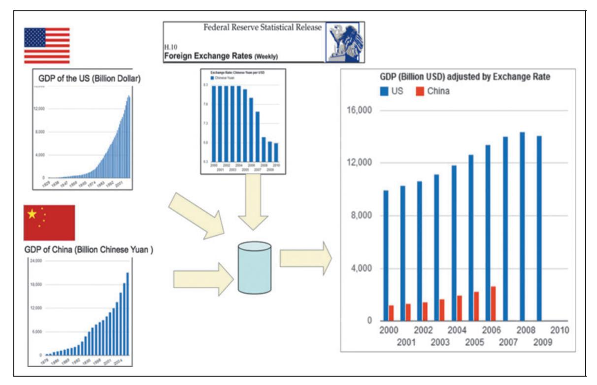
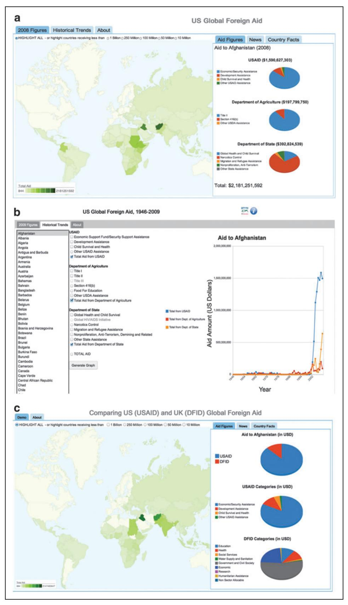
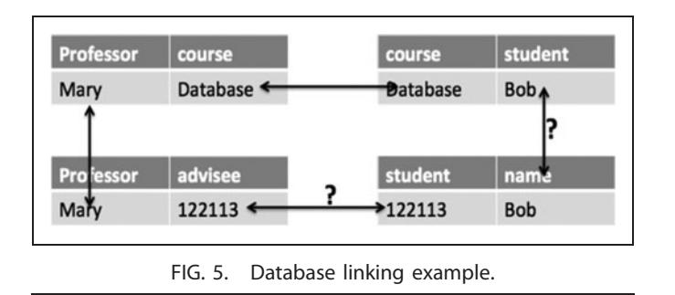
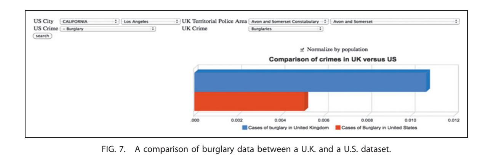

# DATA INTEGRATION FOR HETEROGENOUS DATASETS

## James Hendler

The Rensselaer Institute for Data Exploration and Applications, Rensselaer Polytechnic Institute, Troy, New York

<!-- Image Description: The image is a collage illustrating the concept of "integration" within a business context. A central element is a three-dimensional puzzle piece spelling out "INTEGRATION." Surrounding this are various smaller images suggesting data streams, networks, and textual keywords related to business processes, infrastructure, and resource management. The collage visually represents the complex interconnectedness of these elements, highlighting the paper's focus on system integration. -->

## Abstract

More and more, the needs of data analysts are requiring the use of data outside the control of their own organizations. The increasing amount of data available on the Web, the new technologies for linking data across datasets, and the increasing need to integrate structured and unstructured data are all driving this trend. In this article, we provide a technical overview of the emerging ''broad data'' area, in which the variety of heterogeneous data being used, rather than the scale of the data being analyzed, is the limiting factor in data analysis efforts. The article explores some of the emerging themes in data discovery, data integration, linked data, and the combination of structured and unstructured data.

## Introduction

With the advent of the big data movement, there is need to harness the techniques of data analytics and machine learning for more and more applications in increasingly many industries. However, over time it is being realized that the early users of big data, such as large web companies and ''big science'' projects, while still largely influencing research directions, are not typical of the needs of many other potential data users. Within the web world, there are the obvious big data applications of major companies, including search, social networking, healthcare, microblogging, and more. These companies typically have significant data archives of their own and much of their work is in data mining and knowledge discovery. (Political campaigns and others often tap into these repositories for cost, using them for a myriad of purposes.1 ) In the world of large science, the data may be coming at significant data rates and size from a single machine (such as the Large Hadron Collider) or may be distributed among scientists in a large-scale distributed project.\* In these cases, increasingly the communities are developing controlled vocabularies and/or ontologies and metadata standards to help with data integration efforts.{

For other users, however, the situation is often different. For large companies, the large investment in data warehouses typically provides a starting place for data analytics with respect to current practices. However, as new techniques for analysis might become usable or new opportunities emerge, companies may want to explore their data in ways that were not planned for in the original design of their data collections. These companies are increasingly looking at how they might integrate their structured data holdings with those of others and to explore links to both internal and external unstructured data sources. For nonprofits, small companies, and others trying to get a benefit from big data, access to data outside their own control is even more crucial. Figure 1 provides a few examples of the sorts of data that many organizations are trying to come to terms with, across a wide variety of industries and sectors.

The ability to federate data across datasets, catalogs, domains, and cultures can provide data users with the ability to find,

\*For example, the Sloan Foundation–funded Deep Carbon Observation supports over 1100 scientists from approximately 450 organizations around the world engaged in about 275 projects and field studies.

{ A number of such community vocabulary projects for science can be seen at the web site of the Research Data Alliance.

| Internal Resource          | <b>External Resource</b>           |
|----------------------------|------------------------------------|
| Examples:                  | Examples:                          |
| Manufacturing              | <b>Government Datasets</b>         |
| Customer/Sales             | Industry-specific norms            |
| Financial                  | <b>Scientific Data</b>             |
| <b>Structured Data</b>     |                                    |
|                            |                                    |
| <b>Unstructured Data</b>   |                                    |
| Examples:                  | Examples:                          |
| Design documents           | <b>Regulation/Policy documents</b> |
| <b>Maintenance Reports</b> | <b>Industry News</b>               |

FIG. 1. Users increasingly need to integrate data from multiple sources, and of multiple types, into their strategic data analyses.

access, integrate, and analyze combinations of datasets based on their needs. However, traditional database techniques have not generally focused on the problems that arise from issues such as searching for and finding data in large, not preorganized repositories, for linking what is found to other data, or for reusing and repurposing the data without significant effort.

Traditional enterprise approaches, such as creating data warehouses with carefully analyzed data organization and regular update and curation, are clearly the correct solution for organizing structured data that is well understood within the bounds of an organization. Whether using traditional relational models, or more modern NoSQL approaches, well understood, or heavily used, data can be organized for efficiency of retrieval. The results, coming in known structures, can be used for analytics and knowledge discovery. In one of the seminal articles on knowledge discovery from data (KDD2 ), for example, the authors described the technical KDD pipeline, after determining the mining goals, as selecting the target data set by focusing on a set of variables or samples, cleaning and preprocessing the data, and matching this to the particular data-mining method, followed by the analysis and search for patterns of importance. This process, still the most cited to date, assumes that the data generally starts from organized data systems (Database Management Systems, spreadsheets, etc.) and most of the current analytic toolsets for computing these algorithms are based on the assumption the data has been carefully curated and cleaned, whether locally or in the cloud. The current ''big data'' revolution in enterprise analytics is powered primarily by these tools. However, as the need to integrate with external data sources increases in importance, or for companies without major data holdings, new techniques are required.{

At the other end of the scale in Figure 1, when dealing with unstructured data, particularly large corpora of text, images, and video, traditional database techniques give way to search engines and metadata-based tools. Whether using web search engines or the offshoots of these commonly used in enterprise search, techniques for rapidly finding relevant documents (and more recently, relevant passages in large documents; cf. Ferrucci3 ) are becoming well established. More and more language tools are becoming available for searching organized document sets, and easier-to-use tools for providing metadata markup via controlled vocabularies are showing up on the market. The network and social media analytics that constitute the bulk of ''big data'' projects at search and social media companies are largely powered by these technologies, harnessing a combination of language tools with learning based on the dynamics of users' interactions.

However, between these two approaches are an increasing number of challenges that are not amenable to solution by these separate techniques. It is nontrivial to bring structured data into the search technologies, and the keyword capabilities of current search engines do not match the retrieval needs of data analytics. In a deep sense, there is a significant conflict between the use of the term ''retrieval'' within the database community, where it implies finding all and only the correct results, and in the search and language community, where it implies trying to find a good set of results for a user's needs. The completeness and correctness of data techniques used in evaluating database systems significantly differ from the F-metrics based on precision and recall used in natural language evaluations.

In short, as more and more data resides outside the control of the analyst, or as the sources and kinds of data diverge, new problems are arising that require new solutions from the data science community. In this article, I describe some of these challenges and some starting places in the solutions. The goal is not to present cutting-edge research, but rather to provide a technical overview of these emerging areas. Where technologies like MapReduce are used for mining large datasets that have been integrated and cleaned, addressing the ''Big data V'' of volume, this article looks more at the ''broad data'' problem of variety—trying to make sense out of a world that depends increasingly on finding data that is outside the user's control, increasingly heterogeneous, and of mixed quality.

For the examples, I draw from the extremely large and growing domain of open government data. (An article in the previous issue of this journal explores the use of such data in urban applications.4 ) The problems being discussed in this article are not restricted to this domain, but as there is increasingly more open data available on the Web, and less restrictions on the formats in which that data can be posted, this is becoming an increasingly useful laboratory for exploring the issues of data discovery, integration, and exploration.

{ To be fair to the authors, they do allude to the need for integrating data with other systems (p. 51), but the examples they cite are systems that also assume well-modeled data, with the complexity addressed primarily being the separate issue of mining data from sensors.

<!-- Image Description: The image is a simple alphanumeric identifier: "206BD". It likely serves as a label or code within the academic paper, possibly referring to a specific sample, experiment, or data set. No graphs, charts, or equations are present. The purpose is purely identification. -->

# Integrating Structured Data

Consider the following data analysis problem. The United States and China have both published, and made available in open data repositories, information about their gross domestic products for various years. Not surprisingly, the U.S. data are in dollars, and the Chinese in yuan. As shown in Figure 2, to integrate this data, one needs to find a third

dataset, one that can provide the mapping between these currencies for the given intervals. In this case, such a database is also found online, in the Federal Reserve's data, which includes exchange rates. Downloading this dataset, and doing some simple math, one is able to convert the currencies consistently and to generate a comparison of the values.

However, as simple as this example may seem, consider what is involved

in generating this output. We need to discover the information online, integrate it together, and bring it into tools that can be used to provide the analytics.

## Data discovery

First, there is the issue of finding the data. Discovery of data relevant to a project is the first real step in this sort of inte-

''WE NEED TO DISCOVER THE INFORMATION ONLINE, INTEGRATE IT TOGETHER, AND BRING IT INTO TOOLS THAT CAN BE USED TO PROVIDE THE ANALYTICS.''

grated data exploration. Data search is complex, even within a warehouse, but outside of a warehouse, and on the Web, it is even harder. Many current approaches are exploring how various kinds of lightweight metadata can be used to better facilitate data exploration. For example, in a previous column in this journal, I discussed how the search companies have extended schema.org to include dataset and data-catalog attributes for search,5 and a search tool focusing on datasets

with this markup has recently been made available at http://datasets .schema-labs.appspot.com/

One approach to discovery that is gaining popularity and being used by a number of governments is to create a faceted search based on the metadata used on their sites. For example, the U.S. government's main open data site, http://data.gov, provides a search engine for over 150,000 datasets with a faceted search containing

not just keyword search, but also the ability to filter by location, topics and categories, dataset types, tags, formats, organizations, and data publishers. Figure 3 shows a search for ''Federal Reserve'' with the facet ''finance'' for a topic. This uniquely identifies the page for downloading the data for exchange rates.

Although these sorts of faceted browsers have become more ubiquitous on open data sites, government and otherwise,

<!-- Image Description: This image from an academic paper presents a comparative analysis of US and Chinese GDP. It features four bar charts showing the GDP growth of both countries over time, in their respective currencies and then using a consistent USD exchange rate adjustment. A smaller bar chart displays weekly foreign exchange rates between the US dollar and the Chinese Yuan. A central diagram depicts a database (cylinder) receiving input from the GDP data and providing output for the adjusted GDP comparison chart. The figure illustrates the methodology used for comparing the economic growth of the two nations. -->

FIG. 2. A simple example integrating U.S. and Chinese data with an intermediary dataset.

<!-- Image Description: The image displays the alphanumeric code "BD207," likely a product identifier or catalog number. It's presented as a simple text label, serving as a reference within the academic paper, potentially identifying a specific material, device, or component under discussion. No diagrams, charts, graphs, or equations are present. -->

FIG. 3. The U.S. Data.gov and many other government web sites provide faceted browsers for searching through large dataset catalogs based on metadata features.

they present a number of complex challenges. The search shown here, for example, required knowing that the Federal

Reserve was the agency that had the exchange rate data we were looking for. Other choices of facets would go to different pages, some redirecting to the Department of Treasury page that does have a downloadable version of exchange rates, but only dating back a year, which would not have helped in the example above, where the GDP data was from further back. For more complex searches, the problem gets worse as one also has to figure out what catalogs information may be found in, what keywords might best describe the

data being looked for, what metadata features are most relevant, etc.

Research in this area has been exploring a number of directions. These generally have focused on either the development of more domain-specific metadata that focuses on improving search for data in particular domains. For example, for scientific research data, the Research Data Alliance (https://rd-

''ALTHOUGH THESE SORTS OF FACETED BROWSERS HAVE BECOME MORE UBIQUITOUS ON OPEN DATA SITES, GOVERNMENT AND OTHERWISE, THEY PRESENT A NUMBER OF COMPLEX CHALLENGES.''

alliance.org/) has created a number of interest groups exploring the development of metadata standards for specific scientific fields and a more general working group focusing on creating a metadata standards catalog to direct people to these. Within governments, a number of intergovernmental panels and/or research groups are also exploring how best to organize data catalogs for better search and exploration. Other efforts have explored how to extract metadata from data descriptions or from structured data

on web pages.6 Another approach is the careful design of URL naming systems, allowing catalogs to be more easily found and indexed (hierarchically) based on topics, organizations, etc. (See, for example, the United Kingdom's standards at https://insidegovuk.blog.gov.uk/url-standardsfor-gov-uk/).

<!-- Image Description: The image is a simple text label, "208BD," likely an identifier. The text is blue-grey. To the right, smaller text indicates "BIG DATA DECEMBER 2014," suggesting the data label relates to a large dataset from December 2014. The purpose is likely to identify or reference a specific portion of the dataset discussed within the paper. -->

## Integration

Having found the data, the next question is how to integrate it into a form such that visualization, analytics, or mining of the combined datasets can be performed. However, there are a number of obvious problems to be overcome. First and foremost, these datasets have generally not been designed to work well together. There are differences in formatting; for example, exported data may be in csv, xml, or PDF documents or many other, more specialized, formats. Even having found the data, recognizing what the rows and columns represent can be another challenge—many of the open datasets available on the Web have machine-readable descriptions, but often these are in very large data dictionary files full of terminology that is often designed primarily for the experts in a given field. Many of these documents run to hundreds of pages, and many of the fields in the data sets are used for items that are related to ''internal bookkeeping'' and not to the interesting data.

One way that application developers, open data users, and others are handling this issue is with the use of partial mappings and incremental iteration to explore data. For example, Figure 4a is a visualization of the U.S. aid to various countries based on the data from multiple datasets released by several different agencies. Using an open visualization system (in this case, Google's visualizer), we can extract from each dataset a few pieces of relatively obvious data—dates, dollar amounts, country names, etc. Based on this, one can explore what subcategories are used, and extend the ability to integrate more data. For example, Figure 4b drills further into the data showing the particular aid categories from the various agencies and creating timelines showing the change in those categories over time. By exploring this data, one can, in turn, see more about what is in the data set, get quick

''eyeball'' checks as to whether the integrated data appears to make sense (this will be discussed further below) and to further explore the data, extend the representations, etc.

Using this approach can also allow the integration of more datasets. For example, Figure 4c extends the demo of Figure 4a to show a comparison of U.S. and U.K. aid to foreign countries (and note that the

same currency conversion data used in the China example above is also used here to reconcile the exchange rates).

In doing this sort of ad hoc integration, there are obviously problems that can arise. While small amounts of coding can reconcile many issues (different date formats, numbers reported in different units, etc.), there are a number of problems that can arise, particularly when information that is either missing or unknown is involved in the data integration. For example, in some foreign data sets currency

''UNFORTUNATELY, AS ANYONE WHO HAS TRIED TO USE MULTIPLE DATABASES TO DO THIS SORT OF THING KNOWS, IT'S NEVER THAT EASY.''

rates are reported in inflation-adjusted U.S. dollars, some are in nonadjusted dollars, and some in local currencies. This problem can be particularly difficult when the data dictionary may be using terms that are known to an expert in the field, but perhaps not generally. For example, when using government data, to know what is and isn't included, one often finds references to legislation that would be familiar to an expert in the field, but not to someone exploring the data who is not as knowledgeable about the area.

While there is clearly no automated way to solve these problems at this point, there is an increasing use of new technologies for improving the situation. The first is to allow annotations of datasets so that users who do understand these things, or the producers of the data themselves, can alert others to the subtleties that might be involved in reusing the data. This can, of course, include simply allowing some form of comment or text fields in the metadata or on the web page, to allow this to be expressed in human-readable form. Increasingly, however, these annotations are moving into machine-readable formats that can either be embedded on web pages describing the datasets or included with the data as some form of links to other resources.

To understand how this works, consider the following simple example: at a university there are a set of databases available. One of them lists the graduate students and the courses they are taking, another lists courses and the professors who teach them, and a third has information on the students advised by each professor. By integrating these, we would expect to be able to answer the query, ''What professors are teaching classes that include students they advise?'' Unfortunately, as

anyone who has tried to use multiple databases to do this sort of thing knows, it's never that easy. For example, perhaps in the first database the students and classes are known by name since it is primarily used to print human-readable class lists. In the third database, the students are listed by ID number, because this is used for tracking graduation information internally. Adding the data from a fourth database that includes this mapping would solve the prob-

lem if we can reconcile all the terms (Fig. 5 illustrates the mapping problems in this example).

Clearly, to be able to answer our query, we now need some information that would allow us to assert where the equivalences between terms lie. We need to be able to assert that ''the student relation in DB2 corresponds to the name relation in DB3'' and that ''the ID number in the advisee field of DB4 corresponds to the ID number in the student field of DB3.'' This is painful, but easily fixed by having the university

<!-- Image Description: The image shows a text snippet from a paper published in December 2014, related to "Big Data." On the right, "BD209" likely denotes a paper ID or identifier within the publication's system. There are no diagrams, charts, graphs, or equations; only text. The purpose is likely to provide publication metadata or a reference. -->

## DATA INTEGRATION FOR HETEROGENOUS DATASETS Hendler

<!-- Image Description: The image displays three panels visualizing US global foreign aid data. Panel (a) shows a world map color-coded by aid amount received in 2008, alongside pie charts detailing aid distribution by US agency (USAID, Department of Agriculture, Department of State). Panel (b) presents a line graph tracking US aid to Afghanistan from 1946-2009, categorized by agency. Panel (c) compares US (USAID) and UK (DFID) aid distribution globally in a map format, with accompanying pie charts showing aid category breakdowns for each country. The purpose is to illustrate the geographical distribution, temporal trends, and agency-specific allocations of US and UK foreign aid. -->

FIG. 4. Comparing U.S. foreign aid. (a) Comparing U.S. foreign aid from various agencies. Data is reconciled by country, amounts, and years. (b) Extending the comparison to show U.S. foreign aid from various agencies and the specific types of aid over time. (c) Comparing U.S. foreign aid and British foreign aid by combining datasets and using the currency conversion data show in Figure 2.

<!-- Image Description: The image shows a header or footer likely from a draft of an academic paper. It contains the alphanumeric identifier "210BD" prominently displayed on the left, followed by a much smaller annotation on the right reading "BIG DATA DECEMBER 2014". This suggests the document is related to big data research and was produced in December 2014. The "210BD" likely serves as a unique internal identifier for the document or a specific section within the paper. -->

<!-- Image Description: Figure 5 illustrates database linking. Two tables are shown: one linking professors to courses, the other linking students to an advisee ID. Arrows depict relationships between the tables, demonstrating how data (like Professor Mary teaching "Database" and student Bob having ID "122113") can be connected across different tables based on shared values. The image showcases a simple relational database design. -->

either write mapping code or pull all these relationships into a warehouse where the combined queries can be answered.

However, consider what happens if, as we have been discussing, these relationships are distributed over different organizations. For example, in many universities students can take courses at other campuses, or professors can advise students in other schools. In this case, rather than saying, ''The ID number in the advisee field of DB4 corresponds to the student field of DB3,'' we would need to say something like, ''What university one calls a 'student' and lists by ID is what university two calls an 'advisee' and lists by the same ID'' (and if the IDs were different, yet another relationship would be brought in). This kind of data integration gets increasingly difficult as more of the data trying to be brought into the integrated scenario is out of the control of a single data provider and as more and more different formats and naming schemes come into the picture. A solution is needed that provides some way to refer to data in other databases and to express the correspondences between elements.

The need to solve this problem for data on the Web has led to the creation of the ''linked data'' approach.7,8 Essentially, this requires creating formats where data elements and relations can be expressed in the form of URIs (or other formats that can be dereferenced) to provide more information. For example, in the example of the students, if we can record that the Bob in the student relationship in DB2 is at the URL ''university1.edu/students/Bob'' and that that same URL corresponds to the Bob in the name relationship in DB4, then we get a unique naming. If we take a further step, then we can list at that URL a list of the various ways this same student appears in different databases across the Web.

To see how this can work in practice, let us return to the open data example and consider the U.S. state ''Alaska.'' In various U.S. government data sets, the name shows up in numerous forms. Some are easily dealt with (such as common abbreviations like AK) but others are more complex. For example, based on various use contexts in datasets that exist on the Data.gov site, Alaska may be referred to via a number that can represent its order in some list—state 1 in area, state 2 in alphabetical order, state 47 in population, state 49 in history of incorporation as a state, etc. Some datasets use fairly arbitrary abbreviations, and some use terms based on schemas or properties that are not externally meaningful; for example, an area in Alaska can be referred to as Alnwr17, which denotes a particular National Wildlife Refuge. This problem is solved in linked data by replacing or annotating the data elements, upon integration, with unique identifiers that can be resolved to a form where systems can recognize that they are referring to the same thing. Figure 6 shows a portion of the information about Alaska that is collected from a number of government datasets using this approach. In particular, the URL http://logd.tw.rpi.edu/ih2/id/us/ state/Alaska.html (which you can type into any standard web browser to dereference) is used to describe many different ways that the state's name can be expressed in different ways.

Increasingly common is to link to entities in dbpedia, a version of Wikipedia in the Resource Description Framework (RDF) that provides unique identifiers and a set of known relations between items in Wikipedia.9 For example, when the web page shown in Figure 6 is created for human readability, a corresponding page (in this case http://logd.tw.rpi.edu/id/us/ state\_page/Alaska) was created that provides machine-readable links to http://dbpedia.org/resource/Alaska as well as to other resources such as the dbpedia entries corresponding to Alaska in other language Wikipedia entries, in the open database system Freebase, where it is known as http://rdf.freebase.com/ns/ m.0hjy, and a number of others. (It is worth noting that these pages, in turn, can link to other definitions and other examples; for example, from the Freebase page you could discover that Alaska is the location used in the 2012 novel The Killing Grounds by Dana Stabenow, which is available at Amazon from the page www.amazon.com/Killing-Grounds-Dana-Stabenow/dp/ 190880064X). Taking this idea further, these items could also be linked to terms in other machine-readable vocabularies, giving rise to ''semantic data integration'' where terms from different databases are related through common superclasses (or other relationships) in online ontologies.x

As the information from more databases is linked together, the relationships between data elements get increasingly complex. In fact, managing these kinds of links, whether in RDF or other formats, often can require mappings that lead to graphs, rather than tables. When combining tables from different databases, there is no guarantee that terms align or even that joins would not result in cycles where information from different sets would relate to each other in unusual ways. One of the ways this is dealt with is to load the data into graph databases (the examples above use an RDF triple store; cf. Shadbolt et al.10), but numerous projects are exploring the use of other stores. In fact, this is one of the reasons that graph stores are becoming more popular.

One other important direction being explored in this area is the creation of protocols for creating APIs for accessing data

<!-- Image Description: The image shows the alphanumeric identifier "BD211," likely a product code or designation. It's presented as a simple, stylized text label. The purpose within the academic paper is presumably to identify a specific item, component, or sample referenced in the text. No diagrams, charts, graphs, or equations are present. -->

x The details of semantic data integration are beyond the scope of this article. Some useful references for more information include Noy11 and Grimm et al.12

| RPI Tetherless World Instance Hub                  | <b>Classes</b> <b>Named Graphs</b> Home                                                                | Search                                                                                              |
|----------------------------------------------------|--------------------------------------------------------------------------------------------------------------|-----------------------------------------------------------------------------------------------------|
| <b>Alaska</b> ě 4 <b>ALASKA</b> Google | Map Satellite Map data @2014 Google Terms of Use Report a map error                                       |                                                                                                     |
| <b>Subject</b>                                     | Predicate                                                                                                    | Object                                                                                              |
| Alaska                                             | rdf:type                                                                                                     | local_ih2_source_twc-rpi-edu_dataset_instance-hub-us-states- and-territories_vocab:State         |
|                                                    | owl:sameAs                                                                                                   | dbpedia:Alaska                                                                                      |
|                                                    | dcterms:isReferencedBy                                                                                       | local_ih2_source_twc-rpi-edu_dataset_instance-hub-us-states- and-territories_version:2011-Oct-09 |
|                                                    | dcterms:identifier                                                                                           | Alaska                                                                                              |
|                                                    | dcterms:identifier                                                                                           | AK                                                                                                  |
|                                                    | dcterms:identifier                                                                                           | 02                                                                                                  |
|                                                    | dcterms:identifier                                                                                           | alaska                                                                                              |
|                                                    | dcterms:identifier                                                                                           | <b>ALASKA</b>                                                                                       |
|                                                    | dcterms:identifier                                                                                           | ak                                                                                                  |
|                                                    | dcterms:title                                                                                                | Alaska                                                                                              |
|                                                    | foaf:isPrimaryTopicOf                                                                                        | local_ih2_id_us_state_page:Alaska                                                                   |
|                                                    | ov:csvRow                                                                                                    | $\mathbf{3}$                                                                                        |
|                                                    | void:inDataset                                                                                               | local_ih2_source_twc-rpi-edu_dataset_instance-hub-us-states- and-territories_version:2011-Oct-09 |
|                                                    | local_ih2_source_twc- rpi-edu_dataset_instance-hub-us-states- and-territories_vocab_enhancement_1:fips | 02                                                                                                  |

FIG. 6. A tabular depiction of some of the different ways the state ''Alaska'' is referred to in different databases.

with accompanying data descriptions that can be used by application developers. The Odata protocol, originally introduced by Microsoft and now being standardized under OASIS, for example, is an attempt to create service-based interfaces that can, in their terms, ''unlock data'' for sharing. The use of interface protocols allows for more protection of data in a business-to-business data-sharing arrangement (or other restricted data). In particular, instead of granting access to a whole database (either as data dump or via a JSON API), as is typically done in the government open data sector, access can be controlled on a query-by-query basis as is done in current access control systems. Integrating the data from accessible databases through these protocols, using the techniques described above, promises to open significant new opportunities, as businesses will be able to explore the sharing and integration of their internal resources, without having to build special purpose programs as is currently often required.

### Validation

While the integration discussed above can be very powerful, and allows for putting data together across datasets in ways that can be incrementally explored, the problems that are only partially solved by semantic integration can lead to a number of odd problems. Consider the example in Figure 7. In generating this comparison, data from U.S. and U.K. crime databases are compared for the category ''burglary.'' The result seems quite surprising; it appears that burglaries per person in Avon and Somerset county, a largely nonmetropolitan area in the United Kingdom, are higher than those in the city of Los Angeles, California. This could of course be the case, but common sense would dictate that something may be

<!-- Image Description: Figure 7 is a 3D bar chart comparing burglary rates (normalized by population) in Avon and Somerset, UK, and Los Angeles, CA, USA. A search interface is shown, indicating the data sources used. The chart visually represents the difference in burglary rates between the two locations. The US rate is notably higher than the UK rate. -->

wrong here since burglaries are generally more common in large cities. From the datasets and data definitions, there is no obvious way to resolve this difficulty, and in fact resolution requires bringing in the expertise of those who know more about crime reporting in the two countries.

However, note that by integrating and exploring the data we are able to see the probable problem. What is it?! Other kinds of problems that often show up in integrated data include missing data, improperly entered data, or other common ''dirty data'' problems. Often, the integrated data lets these problems be seen in ways that individual datasets cannot, and this can even, in some cases, lead to improvements in data quality without the need for extensive cleansing.13

Another way data integration can be used to check validity is by looking for similar correlations that occur between different datasets that may be known to be different. For ex-

ample, when a correlation is discovered between two datasets, we know that we should not assume causality. However, we can explore as to whether the correlation seems unique to these datasets or whether, correlating the same data to other datasets, we see similar relations. That is, a number of factors, separately or together, could thus be the basis of the correlation. If, on the other hand, it seemed that very few other curves were similar, or that most went

other directions, that would be good evidence (although not proof) that the correlation may be real.\*\*

There are many other known problems in trying to deduce information from correlations, and many critics of big data argue that too much of the work in the field confuses these issues, and especially that when many correlations are all checked in concert, there are sure to be some spurious ones that show up.14 Statistical methods for dealing with these problems are becoming increasingly important in big data analytics, but the use of data integration and comparisons can be a key area of going beyond the ''sniff test'' failure of the burglary example to putting multiple-dataset validation on a firmer footing.

## Adding Natural Language

As discussed in the introduction, increasingly there is a need to explore how textual data, whether in text fields of semistructured data or complete unstructured texts, corresponds with what is seen in structured data. One common approach is simply to merge articles (or the text strings from semistructured data) based on a timeline. This approach was popularized by Google analytics and trends and made available in their visualization API. More sophisticated integrations, such as the one shown in Figure 8, add geolocation to integrate

> mapping with the text and data. While this makes for good demos, and is useful in exploring simple text/data mixes, it is clearly unsatisfactory for really comparing data and text.

> Currently, exploring how best to integrate structured and unstructured data is primarily a research topic. More complex language analytic tools are coming along, and many open source language packages are available, but the deeper integration remains difficult. However, one very

promising direction that is currently being explored actively is taking the information that language tools can extract from documents, and turning these into forms that can be linked to data. For example, an active research area is the ''wikification'' of texts, in which terms in textual documents are linked to appropriate referents in dbpedia, thus allowing them to be linked to data elements that have also been semantically linked as discussed previously. The language tools

\*\*The interested reader is directed to Cook et al.,15 who describe quasi-experimental design and methods for increasing (or decreasing) evidence for a potential causal relation given positive correlations.

''OTHER KINDS OF PROBLEMS THAT OFTEN SHOW UP IN INTEGRATED DATA INCLUDE MISSING DATA, IMPROPERLY ENTERED DATA, OR OTHER COMMON 'DIRTY DATA' PROBLEMS.''

<!-- Image Description: The image contains text indicating a publication date ("DECEMBER 2014") and topic ("BIG DATA"). A separate section shows "BD213," likely an identifier or code, possibly a paper ID or a conference code, related to the Big Data topic from December 2014. There are no diagrams, charts, graphs, or equations. -->

<!-- Image Description: Figure 8 is a caption describing a method, not showing a diagram or graph. It explains a technique using news titles and tweets' sentiment analysis combined with time and geolocation data to correlate and visualize information. The caption outlines a data integration and visualization approach, not a visual representation of the results. -->

''ALTHOUGH BIG DATA RESEARCHERS GENERALLY DESCRIBE THE CHALLENGES IN TERMS OF THE 'V'S' OF VOLUME, VELOCITY, AND VARIETY, THE BULK OF THE WORK IN THE FIELD HAS BEEN FOCUSED ON THE FIRST TWO.''

use a number of machine-learning techniques to disambiguate the terms. Thus, for example, based on the context of the language use, the tools would recognize whether to link ''Alaska'' to the U.S. state, any of the various movies, songs, or musical groups with that name, or any of the multiple other locations named Alaska that can be found in Wikipedia (cf. Ratinov et al.16).

An even more ambitious approach, currently being tested in the ''knowledge base population'' track of the Text Analysis

Conference, is to generate a knowledge base from large text corpora, extracting information about events, organizations, people, etc., and putting this into a form where the information can be retrieved using data retrieval techniques (usually from a graph database). Thus, in one of the experiments underway, a corpus of texts about terrorism might be presented and the system asked to answer a query such as finding all ''entities who are organizations and have members that have a role as attacker.'' The query results

would thus be in the form of a data table (or subgraph) allowing integration with structured data. These are promising directions for future work, and an area making rapid progress (with startup companies beginning to form around various aspects of the work).

## Conclusions

Although big data researchers generally describe the challenges in terms of the ''V's'' of volume, velocity, and variety, the bulk of the work in the field has been focused on the first two. However, as more and more business processes rely on data, and often on data out of the control of the individual analyst, the need for interacting with heterogeneous data increases. Being able to discover data from other sources, to rapidly integrate that data with one's own, and to perform

> simple analyses, often by eye (via visualizations), can lead to insights that can be important assets. While the techniques overviewed in this article need to be followed up with serious analytics for deeper insights, they can be used to rapidly screen potential data and to quickly explore potential correlations. Further, as new language processing technologies are coming on line, the ability to integrate structured and nonstructured data is increasing. Details of the future of these technologies remain to be seen, but one thing is

becoming increasingly obvious—there are important business opportunities to be explored. Much as the Web of documents has revolutionized so much of society, the increasingly broad Web of data holds promise for exciting innovations yet to be seen.

<!-- Image Description: The image is a simple alphanumeric identifier: "214BD". The text "BIG DATA DECEMBER 2014" is present, suggesting the identifier relates to a dataset from December 2014. It likely serves as a label or reference for a specific data subset within the paper. There are no diagrams, charts, graphs, or equations. -->

## Acknowledgments

Except where otherwise cited, the examples in this article are based on those developed by graduate students in the Tetherless World Constellation at Rensselaer Polytechnic Institute (RPI). A number of demos were developed for the 2010 Semantic Web Challenge at the International Semantic Web Conference. Details of the technologies and approaches used can be found in Ding et al.17 These and a number of other demos of the principles described in this article can be found at http://logd.tw.rpi.edu as well as the technologies that produced them. I am indebted to the many students who have developed the demos—the list can be found at http:// logd.tw.rpi.edu/about. This work was funded in part by the National Science Foundation through EAGER Grant 1143585, the Defense Advanced Research Projects Agency SMISC program (subcontract to Sentimetrix Corp), a gift from Microsoft Research, and the RPI endowment. This research was also sponsored in part by the Army Research Laboratory and was accomplished under Cooperative Agreement Number W911NF-09-2-0053 (the ARL Network Science CTA).

## Disclaimer

The views and conclusions contained in this article are those of the authors and should not be interpreted as representing the official policies, either expressed or implied, of the Army Research Laboratory or the U.S. government. The U.S. government is authorized to reproduce and distribute reprints for government purposes notwithstanding any copyright notation hereon.

## Author Disclosure Statement

No conflicting financial interests exist.

## References

- 1. Nickerson D, Rogers T. Political campaigns and big data. J Econ Perspect 2014; 28.
- 2. Fayyad U, Piatetsky-Shapiro G, Smyth P. The KDD process for extracting useful knowledge from volumes of data. Commun ACM 1996; 39:27–34.
- 3. Ferrucci D. (ed). Special issue: This is Watson. IBM J Res Dev 2012; 56.
- 4. Barbosa L, Pham K, Silva C, et al. Structured open urban data: understanding the landscape. Big Data 2014; 2:144–154.

- 5. Hendler J. Peta vs. Meta. Big Data 2013; 1:82–84.
- 6. Cafarella MJ, Halevy A, Madhavan J. Structured data on the web. Commun ACM 2011; 54:72–79.
- 7. Bizer C, Heath T, Berners-Lee T. Linked data-the story so far. Int J Semantic Web Inf Syst 2009; 5:1–22.
- 8. Heath T, Bizer C. Linked data: Evolving the web into a global data space. Synth Lect Semantic Web Theor Technol 2011; 1:1–136.
- 9. Auer S, Bizer C, Kobilarov G, et al. Dbpedia: A Nucleus for a Web of Open Data. Berlin: Springer, 2007.
- 10. Shadbolt N, Hall W, Berners-Lee T. The semantic web revisited. Intell Syst IEEE 2006; 21:96–101.
- 11. Noy NF. Semantic integration: a survey of ontologybased approaches. ACM Sigmod Rec 2004; 33:65–70.
- 12. Grimm S, Abecker A, Vo¨lker J, Studer R. Ontologies and the semantic web. In Domingue J, Fensel D, and Hendler J, eds. Handbook of Semantic Web Technologies, pp. 507–579. Berlin: Springer, 2011.
- 13. Waterman KK, Hendler J. Getting the dirt on big data. Big Data 2013; 1:137–140.
- 14. boyd D, Crawford K. Critical questions for big data: Provocations for a cultural, technological, and scholarly phenomenon. Inf Commun Soc 2012; 15:662–679.
- 15. Cook TD, Campbell DT, Day A. Quasi-experimentation: Design & Analysis Issues for Field Settings. Boston: Houghton Mifflin, 1979.
- 16. Ratinov L, Roth D, Downey D, Anderson M. Local and global algorithms for disambiguation to wikipedia. In Proceedings of the 49th Annual Meeting of the Association for Computational Linguistics: Human Language Technologies, Volume 1, pp. 1375–1384. Stroudsburg, PA: Association for Computational Linguistics, 2011.
- 17. Ding L, Lebo T, Erickson JS, DiFranzo D, Williams GT, Li X, and Michaelis J, et al. TWC LOGD: A portal for linked open government data ecosystems. Web Semantics: Science, Services and Agents on the World Wide Web 9, no. 3, 2011; 325–333.

Address correspondence to:

## James Hendler

The Rensselaer Institute for Data Exploration and Applications Rensselaer Polytechnic Institute 110 8th Street Troy, NY 12180

E-mail: hendler@cs.rpi.edu

<!-- Image Description: The image displays a Creative Commons (CC) license attribution graphic. Specifically, it shows the CC logo, a symbol representing a person, and the abbreviation "BY," indicating a "Attribution" license. This graphic signifies that the content of the paper is licensed under a Creative Commons Attribution license, meaning others may reuse and share it with proper attribution to the original creator. -->

This work is licensed under a Creative Commons Attribution 3.0 United States License. You are free to copy, distribute, transmit and adapt this work, but you must attribute this work as ''Big Data. Copyright 2013 Mary Ann Liebert, Inc. http://liebertpub.com/big, used under a Creative Commons Attribution License: http://creativecommons.org/licenses/ by/3.0/us/''

<!-- Image Description: The image contains text only. On the left, it shows a bullet point followed by "DECEMBER 2014 BIG DATA". On the right, it displays "BD215", likely an identifier or code. The text likely indicates the date and topic of a data set or project discussed in the paper, with BD215 serving as a reference code for that specific dataset. -->
