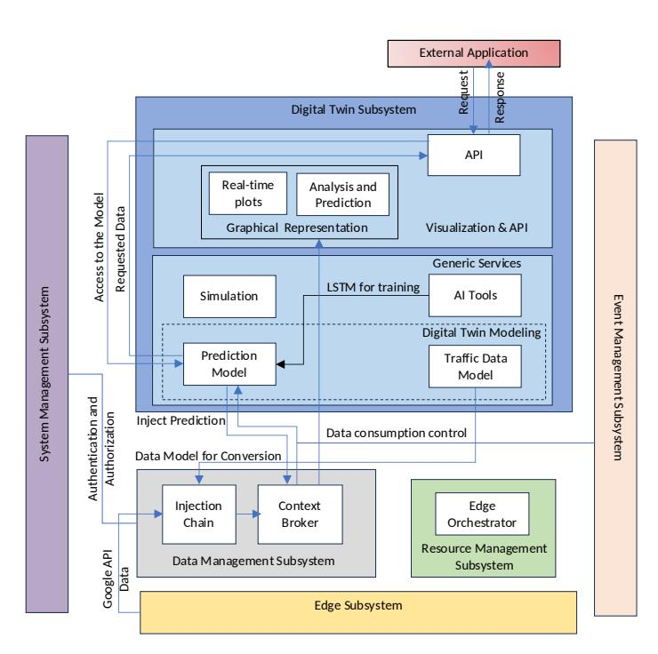
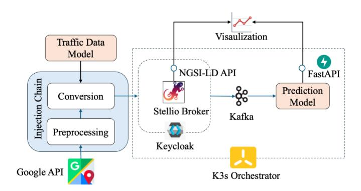
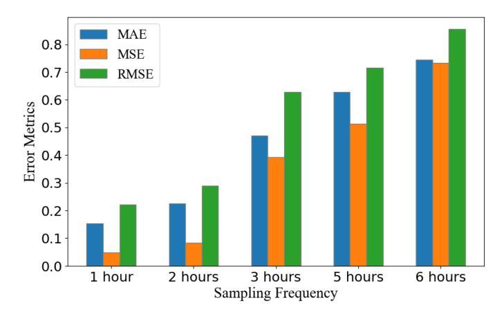
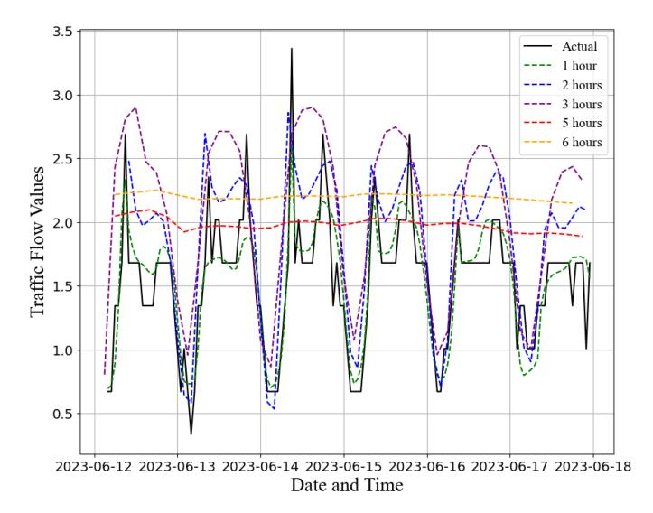
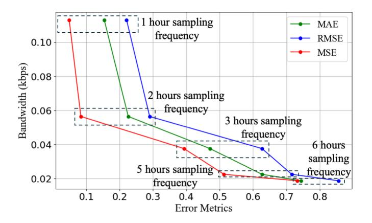
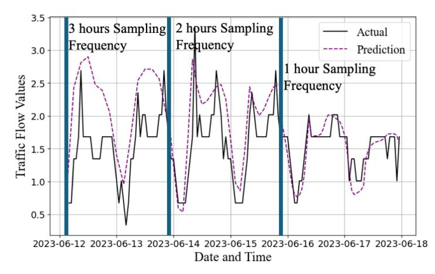

# Smart City Digital Twins: A Modular and Adaptive Architecture for Real-Time Data-Driven Urban Management

Manoj Herath, Maira Alvi, Roberto Minerva, Hrishikesh Dutta, Noel Crespi, Syed Mohsan Raza

Samovar, Telecom SudParis, Institut Polytechnique de Paris, 91120 Palaiseau, France.

Email: {manoj.herath, maira.alvi, roberto.minerva, hrishikesh.dutta, noel.crespi, syed-mohsan raza}@telecom-sudparis.eu

**Abstract:** This paper presents a modular Digital Twin software architecture designed for smart cities, leveraging Edge-Cloud Continuum to enable the development of flexible and scalable DT-based solutions. Digital Twin technology provides a powerful framework for simulating, analyzing, and optimizing urban environments by integrating real-time and historical data from various city sensors through IoT, AI, and cloud computing. The proposed architecture addresses the limitations of existing DT frameworks by focusing on smart city-specific requirements such as dynamic resource management, real-time data processing, and autonomous decision-making. The viability of the proposed framework is demonstrated through a case study on autonomous traffic management in the city of Issyles-Moulineaux. It shows how the proposed framework predicts traffic patterns and manages network resource allocation by adjusting the data sampling frequency to balance prediction accuracy and communication costs. The architecture's modular design supports seamless integration and adaptability, making it suitable for various smart city applications, thereby advancing the development of more efficient, sustainable, and resilient urban environments.

**Index Terms:** Digital Twin, Software Architecture, Smart City, Artificial Intelligence

## I. INTRODUCTION

Digital Twin (DT) technology represents a significant advancement in the development of smart cities, providing a sophisticated method for simulating, analyzing, and optimizing urban environments. It enables comprehensive monitoring and management of city operations by creating a virtual model that reflects the real-world environment. This model can simulate various scenarios, forecast potential issues, and optimize resource allocation, which is essential for sustainable urban development. DTs leverage technologies such as IoT, AI, big data, and cloud computing to collect and analyze data from numerous city sensors, providing actionable insights for city planners and decision-makers. This integrated approach facilitates more informed and proactive urban governance, improving city services like transportation, healthcare, energy management, and disaster response.

The framework for a city Digital Twin involves several key components: data acquisition through IoT sensors, real-time data processing, and the creation of dynamic simulations that mirror real-world behaviors [1]. DT can help predict traffic congestion patterns, optimize energy consumption, and manage urban infrastructure more efficiently. Moreover, emerging technologies like blockchain and 5G further enhance the capabilities of city Digital Twin by ensuring secure data exchange and supporting high-speed communication. By enabling realtime remote monitoring and facilitating data-driven decisionmaking, DT technology is poised to revolutionize urban management, creating more responsive, resilient, and sustainable cities.

A DT can use the smart city's real-time and historical data in a secure and efficient form, as well as contribute to planning and operation. As a result of analysis capability, it can assist in bridging the gap in decision-making. The advantages of using DT technology include increased reliability and availability through monitoring and simulation to improve performance. They are instrumental in enhancing infrastructure performance, analyzing human dynamics, identifying interdependencies, and monitoring fluctuations over time. DTs offer key capabilities such as monitoring, analysis, prediction, and simulation. Monitoring provides real-time insights into the current behavior of the city, while analysis delves deeper into the data to uncover additional insights. By leveraging historical and real-time data, DTs can predict future behaviors of both humans and infrastructure. Additionally, they can simulate 'what-if' scenarios to anticipate emergent behaviors, helping to understand how a smart city might respond under different conditions and identifying underlying causes.

In the presence of such complexities in designing a DT for Smart Cities, with many integrated and interdependent components, a comprehensive framework is important for effective management. The availability of a well-curated and modular framework could attract more developers with low expertise in DT modeling. To that end, in this paper, we propose a modular DT software architecture, operating in the realm of Edge-Cloud Continuum, to support the development of DT-based solutions for smart cities.

With the long-term goal of demonstrating the working of the proposed system for different problem domains of smart cities, in this work, we particularly consider the traffic management problem. Autonomous traffic management is essential for optimal city planning; air and noise pollution control; and sustainable urban development. We specifically show how the proposed architecture allows the autonomous and standalone implementation of a Smart City Digital Twin by means of a collection of real-time data from IoT devices, processing and storing the collected data, performing historical analysis and inferencing from the data, and predicting and visualizing future traffic patterns. In addition to these application-level requirements, the proposed framework also considers the problem of network resource management and allows on-the-fly decisionmaking on maintaining the right balance between performance and resource usage.

There are existing works that deal with defining software architecture platforms for DT. Several DT architectures have been proposed, including frameworks proposed in [2]–[9], each focusing on different core DT attributes and layers, such as synchronization, data flow, and security. However, most of these architectures are either too generalized or specific to industrial applications, making them unsuitable for smart cities. Standardization efforts, like ISO 23247-2 1 and ITU-T Y.30902 , target manufacturing and networking, lacking adaptability for urban environments. Other existing architectures also often fail to support DT functions such as resource provisioning and software alignment.

Although there are existing applications of smart city DTs [10]–[12], there is a literature gap that exists because of a lack of software architectures in the context. As a result, it is challenging for smart city DT developers to use a standard modular architecture to achieve goals. Existing applications often lack a modular design approach, rendering them ineffective for reusability, scalability, and adaptability. To address these gaps, a novel modular DT architecture is proposed emphasizing key DT requirements and integrating supporting functions to simplify software development and deployment.

The paper has the following specific contributions:

- A modular Digital Twin software architecture is proposed, tailored specifically for smart cities, leveraging an Edge-Cloud Continuum approach to support the development of DT-based solutions.
- The viability of the proposed architecture is demonstrated in autonomous traffic management, showcasing its ability to collect real-time data from IoT devices, perform historical analysis, and predict future traffic patterns.
- The proposed framework also addresses the gaps in existing Digital Twin architectures, which are often either too generalized or specific to industrial applications, by focusing on smart city requirements such as resource management, scalability, and adaptability.

## II. RELATED WORK

Architectures for DT have always been of interest to researchers. Josifovska et al. [2] proposed a DT framework that extensively exploits the composition in physical entities, virtual entities, data management, and service. Nwogu et al. [9] proposed a requirement-driven architecture that addresses the DT core attributes such as synchronization, learning and adaptability, bi-directional data flow, monitoring, predictive and prescriptive capabilities, and optimization. The Digital Twin Consortium3 in collaboration with several industry partners, proposed a six-layer architecture focused on modeling and represents an attempt at standardization. Notably, these architectures are often too generalized and require significant adaptation when applied to smart cities. In addition, the standardization organizations have also proposed architectures such as ISO 23247-2 4 DT framework for the manufacturing domain and the ITU-T Y.30905 standard reference architecture for network DT. However, there is currently no standardized DT architecture for smart cities provided by standardization organizations.

There are research works that propose domain-specific DT architectures mainly for industrial applications [3]–[8]. The 5C architecture is developed for cyber-physical systems with layers of smart connections for data acquisition, inference, analytics, decision support, and resilience through selfconfiguration and adaptation [3]. Alam and El Saddik [4] proposed an architecture including cloud technologies and integrating web services. Based on the 5C architecture a sixlayer architecture is developed depicting also the data and information communication [5]. Abburu et al. [6] proposed a five-layer architecture that addresses managing different models and the DT lifecycle. Aheleroff et al. [7] proposed a threedimensional DT architecture based on reference architectural model industrie 4.0 [8]. However, the specificity of these architectures for manufacturing hinders their usage in smart city DT.

Some frameworks presented in the literature suggest the requirements that software for smart city DTs should fulfill but do not clearly define a corresponding software architecture. For instance, frameworks reported in [10]–[12]. In this context, FIWARE6 provides a framework, not specifically for DT, but for a range of smart solutions, including smart cities. However, it understates some key functions of DT such as behavior modeling and simulation.

The existing software architectures mentioned above have several limitations. Specifically, the architectures designed for DT in manufacturing, including standardized ones, lack the necessary generalization capability, limiting their use in the context of smart cities. Furthermore, these architectures often fail to address critical supporting functions needed during DT operation, such as the provisioning of computing resources and their management. Another significant limitation is the lack of alignment with the software and tools. For instance architecture proposed in [3], lacks thorough specifications within their key segments, making it difficult for developers to select appropriate software and tools. Conversely, some architectures, like the one proposed in [7], lack modularity, which hinders their practical implementation.

To overcome the aforementioned limitations, we propose a modular DT software architecture specifically designed for smart cities. The proposed architecture not only addresses

1https://www.iso.org/standard/78743.html

2https://www.itu.int/rec/T-REC-Y.3090

3https://www.digitaltwinconsortium.org/

4https://www.iso.org/standard/78743.html

5https://www.itu.int/rec/T-REC-Y.3090

6https://www.fiware.org/

the key requirements of DT but also integrates essential supporting functions. It is composed of several well-defined subsystems, each with clearly specified roles, which simplifies the organization of software components. This streamlined approach accelerates both the development and deployment of DTs in the smart city context.

## III. PROPOSED ARCHITECTURE

In this section, we describe the proposed software architecture for smart city DT. As shown in Figure 1, the proposed architecture consists of six primary subsystems: edge, data management, digital twin, event management, resource management, and system management each with its constituent components. An architectural view of the proposal and the components involved in the different segments for smart city traffic management is detailed below.

<!-- Image Description: This architecture diagram depicts a digital twin system. It shows three main subsystems: Digital Twin, Data Management, and Edge. The Digital Twin subsystem includes components for prediction modeling (using LSTM), simulation, visualization, and API interaction. The Data Management subsystem handles data injection and context brokering. The Edge subsystem manages resources. The diagram illustrates data flow and interactions between these subsystems and an external application. -->

**Figure 1:** Smart City Digital Twin Architecture: Interactions in respective architectural segments for Traffic Management

## *A. Edge Subsystem*

The edge infrastructure comprises edge servers, Jetson, and Raspberry Pi that connect IoT devices and sensor nodes. The Edge Subsystem represents the software and drivers required for efficient data collection using IoT devices. This subsystem connects, controls, and manages various heterogeneous IoT device data that interact with the DT. In the scenario of smart city traffic management, the IoT sensors collect time-series data monitoring traffic flow intensity. Additionally, cameras can be integrated as well [13]. In this paper, data collection is simulated using the Google Distance Matrix API7 .

7https://developers.google.com/maps/documentation/distance-matrix

## *B. Data Management Subsystem*

The Data Management Subsystem comprises various tools and processes needed to handle data from the edge and other external sources, transform them using well-defined data models, and store them. This is the source of data that the DT functionalities will use to achieve their goals. The Data Management Subsystem is essentially responsible for ensuring data organization, effective management, and availability for retrieval. The Injection Chain, with the help of the DT subsystem, preprocesses and converts into predefined data models before storing.

The incoming traffic data is preprocessed and normalized in accordance with the guidelines provided by Alvi et al. [14]. The traffic intensity is classified into satisfactory (≥ 20 km/h), moderate (15-20 km/h), heavy (11-15 km/h), and congested (< 11 km/h). As shown in Figure 1 and 2 data conversion is then performed by the data models defined by the DT subsystem that is capable of explicitly determining the structure of data in the context of traffic.

These data are then sent to the Context Broker for storage and retrieval. Persistent data storage and retrieval are required, so a scalable and generalized storage mechanism is essential. To accomplish this, we leveraged Stellio8 , an opensource Context Broker that works on linked-data principles and adherence to the NGSI-LD standard [15]. Stellio offers a standardized API, supporting data retrieval, entity querying, and subscription mechanisms, while enabling compatibility with various data models from different domains. This API is a REST API that supports data retrieval and publishing in NGSI-LD format. Depending on the total volume of data, Context Broker federation is also supported by the architecture to expand the storage and to provide distributed storage.

## *C. Digital Twin Subsystem*

The DT subsystem is one of the key components of this architecture and contains elements that are necessary to create and manage a DT. It provides a set of functions, tools, and mechanisms to drive the execution of the DTs and to support the needs of user applications (traffic management and prediction in this case). As can be observed in Figure 1, the DT subsystem comprises two modules: i) Generic Services and ii) Visualization and API. The generic services module comprises the core functionalities of DT and the Visualization and API module denotes visual representation and access to external applications. The Generic Services module is composed of several application-specific DT models. As depicted in Figure 1, there are two models in this context of traffic management, that is, the Traffic Data Model, and the Prediction Model. The Prediction Model is implemented using AI Tools that can be used for Simulation. Similarly, the Visualization and API module is composed of two primary components responsible for graphical representation and API calls respectively.

## *Generic Services Module* :

8https://stellio.readthedocs.io/en/latest/

*1) Traffic Data Model:* Selecting an appropriate data model to accurately represent the physical system is crucial and depends on the specific requirements of the application. The Data Management Subsystem relies on these data models during the data injection process. In our case, a data model capable of representing time-series traffic information is required. A transportation data model "Traffic Flow Observed" from the smart data models9 that adheres with NGSI-LD principles is used for this purpose. This data model includes attributes such as date observed, intensity, location, and address that can represent the date and time information, traffic intensity, and geographical location in a smart city. It is provided for the conversion as a reference in the Data Management Subsystem.

*2) Prediction Model and AI Tools:* Data-driven techniques are used to characterize physical systems and identify inputoutput relationships from data. The ML methods play a greater role here by facilitating knowledge extraction, forecasting, reasoning, and consequently decision-making. The AI tools are responsible for encompassing the necessary algorithms, functions, and tools to support these processes. In this case, we developed a Prediction Model using an AI tool comprising a Long Short Term Memory (LSTM) network. LSTM is a type of recurrent neural network architecture commonly used for time-series prediction due to its ability to identify temporal correlations in time-series data. The Prediction Model was trained using seven months of data collected in Issy-les-Moulineaux for specific configurations: 30 epochs and a batch size of 32. To optimize the training process and prevent overfitting, we employed the early stopping method. The data are retrieved from the Context Broker API and processed by the DT Subsystem for traffic prediction. The refined Prediction Model's output is then sent back to the Context Broker with a prediction tag, making it available for further visualization and analysis.

*3) Simulation:* Simulation is one of the fundamental requirements in the life cycle of DT. In the design phase, it is used to lay out the basic model components and in the execution phase, it is a means to verify the behavior under various situations. In our architecture Simulation module includes the tools and the plugins that can be used when creating and verifying the model by executing what-if scenarios in particular contexts to understand the physical system behavior. The models can be simulated under various configurations to understand the behavior of the traffic. One example scenario of the significance of the Simulation module in the context of traffic management is to analyze the spatial-temporal behavior of traffic intensity change in situations of road closure and accidents.

## *Visualization-API Module*:

Visualization enables relevant stakeholders to gain insights into smart city data effectively. The proposed architecture includes a dedicated component for this purpose, which uses mainly Context Broker data to provide information to the users and stakeholders. Either visualization tools or graphical

9https://smartdatamodels.org/

representations can be used. With a visualization tool, data can be filtered, grouped, and compared effectively. In our use case, we used graphical representations to represent the actual and predicted traffic values as shown in Figure 4. As previously mentioned, since both the actual and predicted data are available at the Context Broker, any visualization tool can access this data via the Context Broker's API.

Moreover, to enable external applications to access DT models and data, we incorporate an API component in our architecture. This API can be equipped with an API gateway to facilitate access to various models. The Prediction Model is integrated with an interface to communicate using HTTPS protocol with external applications. We adopted the FastAPI10 library to provide a REST interface to the Prediction Model. This setup allows the Prediction Model to return predicted values to an external application when a prediction request is made. This facilitates the expansion of the use of models developed within the architecture for other applications in the smart city domain.

<!-- Image Description: This flowchart depicts a traffic prediction system's architecture. Traffic data, processed via Google API, undergoes conversion and preprocessing before being sent through an NGSI-LD API to a Stellio broker. Kafka streams data to a prediction model (FastAPI), visualized thereafter. Keycloak handles authentication, and K3s orchestrates the system's deployment. -->

**Figure 2:** Smart City Traffic Management DT Software Components

## *D. Event Management Subsystem*

A mechanism is required for data exchange and control between subsystems, as well as for transmitting commands to physical systems. The Event Management Subsystem ensures the smooth flow of data, making the right information available at the right place, time, and frequency. Our architecture introduces an event broker to capture the data from the data sources, making it accessible to consumer modules, while also storing, manipulating, and processing event streams in realtime and retrospectively. Additionally, it facilitates seamless connectivity by managing communication with external IoT devices.

The event broker is used to input the data from the Context Broker to the Prediction Model in different sampling frequencies as per the application requirement. This setup aims to find the optimal data collection frequency for the Prediction Model to find the right balance between prediction

10https://fastapi.tiangolo.com/

performance and resource requirement. Apache Kafka11 is used for implementing the Event Management Subsystem in this work. As presented in the results demonstrated in Section IV, this subsystem allows dynamic adjustment of IoT data sampling frequency to cater to performance needs and effective utilization of network bandwidth and energy.

## *E. Resource Management Subsystem*

Our architecture encourages using the container images [16] that applications and their dependencies are packaged into lightweight, portable units for the utilized software. This approach offers unique advantages, such as flexibility, scalability, and ease of deployment. The Resource Management Subsystem is one of the supporting functions offered in the architecture to manage computing resources to run these containers based on system and user requirements. The architecture promotes the utilization of computing resources distributed across both edge and cloud resources. By leveraging edge resources such as Jetsons and Raspberry Pis, processing can occur at an early stage. This allows the cloud to focus on computing expensive operations rather than relying solely on the cloud for all computing needs [17].

We propose three orchestration strategies: 1. A single orchestrator for both cloud and edge, 2. Two separate orchestrators for the two environments, 3. A federated orchestrator with cloud and edge orchestrators. The first strategy is suitable for small-scale systems, while the other two strategies are for large-scale systems due to their greater autonomy. In our implementation, we converted our Prediction Model into a container image, and the existing container images of the Context Broker, authentication and authorization application, and event broker are used. Due to the system's moderate scale, we adopted the orchestration strategy of separate but interworking orchestrators for edge and cloud which allows orchestrating the edge and cloud computing resources. The Context Broker runs at an edge server and the others are run at the Jetsons and Raspberry Pis by considering the operational simplicity, using K3S12 orchestrator.

## *F. System Management Subsystem*

The System Management Subsystem is responsible for maintaining the overall security, reliability, and performance of the system. We have incorporated this subsystem into the architecture to emphasize the need for addressing various security requirements. This subsystem addresses four key aspects: security management to handle security policies and protocols for data protection; configuration management to oversee configuration information for system components; monitoring manager to track faults and system performance; and authentication and authorization management to control access permissions.

Further, to uphold security requirements, all communication utilizes the HTTPS protocol, and access to the data stored in the Data Management Subsystem is restricted to authorized

12https://k3s.io/

personnel through appropriate control mechanisms. In our implementation, Keycloak13, an authentication and authorization manager, is employed to secure access to the context broker by providing basic rules and functions when accessing the Context Broker.

In comparison with the existing DT architectures, the proposed architecture detailed above provides a clear perspective on the constituent components in each segment. This makes it easy for developers to select appropriate software and tools for each segment. This modular architecture places a greater focus on DT modeling by incorporating data models, which focus on data representation, and behavior models, which focus on behavior and dynamics. This architecture addresses the supporting functions required for DT operation for system management, resource management, and event management, by assigning individual modules to each of these.

## IV. EXPERIMENTS AND RESULTS

The proposed DT architectural framework has been evaluated for traffic data collected for the city of Issy-les-Moulineaux (a commune located in Paris). The data collection spanned from December 2022 to June 2023. The details of the Deep Learning models used, including the hyperparameters and architectural specifications, are tabulated in Table I.

Note that the learning models for traffic prediction are implemented using the Generic Service Module of the Digital Twin Subsystem explained in the proposed architecture. The data collected using the IoT traffic sensors and devices in the edge infrastructure are stored and processed in the Data Management Subsystem, which is used for continuous training of the learning models of the DT Subsystem. The authentication and authorization are taken care of by the System Management Subsystem, while any event that calls for any change or update (such as sampling frequency update) in the functioning of these subsystems is handled using the Event Management Subsystem.

TABLE I: Specifications of the Learning Model and Hyperparameters

| Hyperparameters | Value |
|---------------------|--------------------|
| LSTM Layers | 2 |
| Epochs | 30 |
| Batch size | 32 |
| Activation function | ReLU |
| Optimizer | Adam |
| Loss function | Mean Squared Error |

The experiments mainly focused on analyzing the tradeoff between prediction performance and the communication bandwidth cost. To that end, experiments were conducted for different sampling frequencies at which the data was collected by the traffic sensors and uploaded. The comparison of the predicted traffic intensity and the true traffic intensity is demonstrated in Figure 4. The general observation here is that with the increase in the sampling frequency, the predicted traffic flow becomes closer and closer to the ground truth.

13https://stellio.readthedocs.io/en/latest/admin/keycloak integration.html

11https://kafka.apache.org/

TABLE II: Prediction performance for different sampling frequencies

| Sampling | Error Values | | | Change compared to 1 hr | | |
|-----------|--------------|-------|-------|-------------------------|-------|-------|
| Frequency | MAE | MSE | RMSE | MAE | MSE | RMSE |
| 1 hour | 0.154 | 0.049 | 0.221 | - | - | - |
| 2 hours | 0.226 | 0.084 | 0.290 | 0.072 | 0.035 | 0.069 |
| 3 hours | 0.471 | 0.393 | 0.627 | 0.317 | 0.345 | 0.406 |
| 5 hours | 0.627 | 0.513 | 0.716 | 0.473 | 0.464 | 0.495 |
| 6 hours | 0.744 | 0.733 | 0.856 | 0.590 | 0.684 | 0.635 |

This is because of the fact that with an increase in data, the model sees a better representation of the variability and diversity in the data (such as noise, different distributions, and anomalies). This helps the model learn to handle different scenarios, reducing prediction errors. The prediction models can learn intricate and hierarchical feature representations more effectively with more training examples obtained by sampling data at a higher frequency. The prediction errors, in terms of MAE, MSE, and RMSE, for different sampling frequencies are reported in Table II and Figure 3. The observation reported above, that is, performance improvement with an increase in sampling frequency, can also be visualized here. Specifically, the following points can be noted: (1) the sampling frequency of 1 hour is consistently superior to the others, in terms of prediction error, as compared to the frequency of 2 hours 0.072, 0.035, and 0.069 reductions in MAE, MSE, and RMSE. However, the prediction errors with 2-hours data sampling frequency are in the same ballpark as that of the 1-hour sampling frequency. (2) The change of error between the frequency of 3 hours and 2 hours is quite significant. The MAE doubles when the sampling frequency changes to 3 hourly update. (3) The prediction errors gradually increase from the frequencies of 3 hours to 6 hours and are not suitable for prediction performance.

<!-- Image Description: The bar chart displays Mean Absolute Error (MAE), Mean Squared Error (MSE), and Root Mean Squared Error (RMSE) for different sampling frequencies (1, 2, 3, 5, and 6 hours). It illustrates how these error metrics increase with less frequent sampling, indicating a relationship between sampling frequency and prediction accuracy. The chart's purpose is to show the impact of sampling frequency on model performance as measured by common error metrics. -->

**Figure 3:** Comparison of Error Metrics for different sampling frequencies

Note that with an increase in the sampling frequency (like 1 hour and 2 hours), although better prediction performance is achieved, however, this comes at a higher communication cost. In other words, with the increase in sampling frequency,

<!-- Image Description: The image is a time series line graph depicting traffic flow values over several days. The solid black line represents actual traffic flow, while the dashed lines of various colors represent predicted traffic flow using different prediction horizons (1-6 hours). The graph shows how the accuracy of traffic flow prediction decreases as the prediction horizon increases. The x-axis shows the date and time, and the y-axis shows the traffic flow values. -->

**Figure 4:** Actual and prediction (dashed lines) values for the different sampling frequencies.

<!-- Image Description: The figure displays a line graph showing the relationship between bandwidth (kbps) and error metrics (MAE, RMSE, MSE) for various sampling frequencies (1, 2, 3, 5, and 6 hours). Each line represents a different sampling frequency, and the data points illustrate how bandwidth decreases as error metrics increase. Dashed boxes highlight data at specific error metric ranges. The graph helps assess the trade-off between sampling frequency and bandwidth in relation to error. -->

**Figure 5:** Comparison of Error Metrics for Different Sampling Frequencies

there is higher bandwidth usage for uploading the data to the cloud. This is demonstrated in Figure 5, which denotes a clear trade-off between performance and bandwidth usage. It can be observed that the bandwidth cost decreases while the error metrics increase with the frequency. There is a significant decrease in bandwidth cost when the sampling frequency decreases from 1 to 2 hourly updates, however, the prediction error is still under control. Based on the available bandwidth and application-specific performance requirements, the suitable sampling frequency can be selected by the Event Management Subsystem which would help to save resources while maintaining the error margins.

Adjusting the sampling frequency dynamically by the Event Management Subsystem to find a suitable balance between performance and communication cost is demonstrated in Figure 6. It is observed that depending on the resource (bandwidth/energy) availability, the sampling frequency of the IoT

<!-- Image Description: The figure displays a time series graph comparing actual and predicted traffic flow values. A solid line represents actual values, and a dashed line shows predictions. Vertical bars demarcate sampling frequencies of 3, 2, and 1 hour. The graph illustrates the model's predictive accuracy at different sampling rates over several days. -->

**Figure 6:** Effect of Sampling Frequency Transition on Prediction

traffic sensors can be adjusted by the Event Management Subsystem to suit application-specific performance needs. For example, when the resource is very limited (in terms of energy-bandwidth availability), then the Event Management Subsystem would select a low sampling frequency so that the networking resource is meticulously managed. On the other extreme, in the scenario of no constraints on resources, the only goal should be to focus on the prediction performance improvement.

## V. CONCLUSION AND FUTURE WORK

This paper presented a modular Digital Twin software architecture specifically designed for smart cities, leveraging the Edge-Cloud Continuum to support the deployment of DT-based solutions. The proposed architecture addresses the limitations of existing DT frameworks, which are often too generalized and lack modularity. It then introduces a more adaptable approach that incorporates key functionalities such as real-time data acquisition, processing, storage, and decisionmaking. The application of this architecture was demonstrated in the context of autonomous traffic management for the city of Issy-les-Moulineaux, showcasing its ability to collect and analyze real-time data from IoT devices, predict traffic patterns, and optimize resource allocation.

The results of the experiments indicate that increasing the sampling frequency of traffic data collection improves the prediction accuracy of traffic models, as the models benefit from a more detailed representation of data variability and diversity. However, this performance improvement comes at the cost of higher communication bandwidth usage, highlighting a trade-off between prediction accuracy and resource usage. The proposed Event Management Subsystem in the architecture provides a mechanism to adjust the sampling frequency based on available resources and application-specific requirements, ensuring optimal performance while minimizing communication and computation costs.

The proposed modular architecture offers a flexible and scalable framework for implementing Digital Twins in smart cities, accommodating diverse urban management needs such as traffic control, energy optimization, and disaster response. Future works will focus on validating the architecture for other application areas of smart city digital twin, such as healthcare, energy, pollution management, climate change management, etc.

## ACKNOWLEDGMENT

This research work is supported by Project CLOUD CON-TINUUM SOUVERAIN ET JUMEAUX NUMERIQUES ´ under Grant AMI CLOUD-1 C2JN (DOS0179613/00, DOS0179612/00).

## REFERENCES

- [1] R. Minerva, G. M. Lee, and N. Crespi, "Digital twin in the iot context: A survey on technical features, scenarios, and architectural models," *Proceedings of the IEEE*, vol. 108, no. 10, pp. 1785–1824, 2020.
- [2] K. Josifovska, E. Yigitbas, and G. Engels, "Reference framework for digital twins within cyber-physical systems," in *2019 IEEE/ACM 5th International Workshop on Software Engineering for Smart Cyber-Physical Systems (SEsCPS)*. IEEE, 2019, pp. 25–31.
- [3] J. Lee, B. Bagheri, and H.-A. Kao, "A cyber-physical systems architecture for industry 4.0-based manufacturing systems," *Manufacturing letters*, vol. 3, pp. 18–23, 2015.
- [4] K. M. Alam and A. El Saddik, "C2ps: A digital twin architecture reference model for the cloud-based cyber-physical systems," *IEEE access*, vol. 5, pp. 2050–2062, 2017.
- [5] A. Redelinghuys, A. H. Basson, and K. Kruger, "A six-layer architecture for the digital twin: a manufacturing case study implementation," *Journal of Intelligent Manufacturing*, vol. 31, pp. 1383–1402, 2020.
- [6] S. Abburu, A. J. Berre, M. Jacoby, D. Roman, L. Stojanovic, and N. Stojanovic, "Cognitwin–hybrid and cognitive digital twins for the process industry," in *2020 IEEE International Conference on Engineering, Technology and Innovation (ICE/ITMC)*. IEEE, 2020, pp. 1–8.
- [7] S. Aheleroff, X. Xu, R. Y. Zhong, and Y. Lu, "Digital twin as a service (dtaas) in industry 4.0: An architecture reference model," *Advanced Engineering Informatics*, vol. 47, p. 101225, 2021.
- [8] M. A. Pisching, M. A. Pessoa, F. Junqueira, D. J. dos Santos Filho, and P. E. Miyagi, "An architecture based on rami 4.0 to discover equipment to process operations required by products," *Computers & Industrial Engineering*, vol. 125, pp. 574–591, 2018.
- [9] C. Nwogu, G. Lugaresi, A. Anagnostou, A. Matta, and S. J. Taylor, "Towards a requirement-driven digital twin architecture," *Procedia CIRP*, vol. 107, pp. 758–763, 2022.
- [10] L. Deren, Y. Wenbo, and S. Zhenfeng, "Smart city based on digital twins," *Computational Urban Science*, vol. 1, pp. 1–11, 2021.
- [11] G. Castelli, A. Cesta, M. Diez, M. Padula, P. Ravazzani, G. Rinaldi, S. Savazzi, M. Spagnuolo, L. Strambini, G. Tognola *et al.*, "Urban intelligence: a modular, fully integrated, and evolving model for cities digital twinning," in *2019 IEEE 16th International Conference on Smart Cities: Improving Quality of Life Using ICT & IoT and AI (HONET-ICT)*. IEEE, 2019, pp. 033–037.
- [12] G. White, A. Zink, L. Codeca, and S. Clarke, "A digital twin smart city ´ for citizen feedback," *Cities*, vol. 110, p. 103064, 2021.
- [13] A. K. Myat, R. Minerva, A. Taparugssanagorn, P. Rajapaksha, and N. Crespi, "Traffic intensity detection using general-purpose sensing," *IEEE Sensors Letters*, 2023.
- [14] M. Alvi, R. Minerva, P. Rajapaksha, N. Crespi, and U. Alvi, "Traffic flow prediction in sensor-limited areas through synthetic sensing and data fusion," *IEEE Sensors Letters*, 2024.
- [15] ETSI. (2024) Gs cim 009 v1.5.1 context information management (cim); ngsi-ld api. [Online]. Available: https://www.etsi.org/deliver/etsi gs/CIM/001 099/009/01.08.01 60/gs CIM009v010801p.pdf
- [16] D. Merkel *et al.*, "Docker: lightweight linux containers for consistent development and deployment," *Linux j*, vol. 239, no. 2, p. 2, 2014.
- [17] S. M. Raza, R. Minerva, B. Martini, and N. Crespi, "Empowering microservices: A deep dive into intelligent application component placement for optimal response time," *Journal of Network and Systems Management*, vol. 32, no. 4, p. 84, 2024.