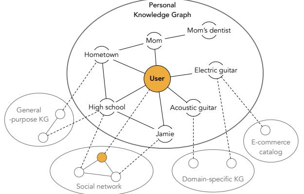
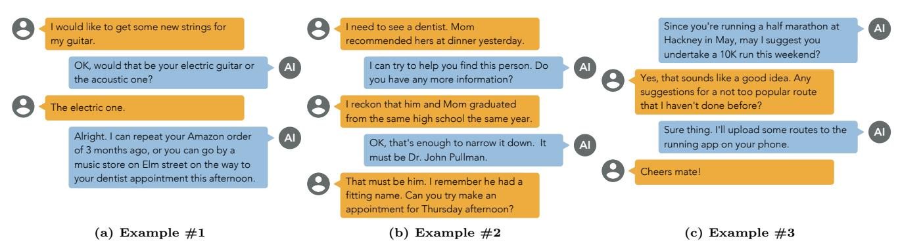

# Personal Knowledge Graphs: A Research Agenda

Krisztian Balog Google London, UK krisztianb@google.com

## ABSTRACT

Knowledge graphs, organizing structured information about entities, and their attributes and relationships, are ubiquitous today. Entities, in this context, are usually taken to be anyone or anything considered to be globally important. This, however, rules out many entities people interact with on a daily basis. In this position paper, we present the concept of personal knowledge graphs: resources of structured information about entities personally related to its user, including the ones that might not be globally important. We discuss key aspects that separate them for general knowledge graphs, identify the main challenges involved in constructing and using them, and define a r esearch agenda.

### CCS CONCEPTS

Information systems Entity relationship models.

### KEYWORDS

Personal knowledge graphs, knowledge representation, personal information management

#### ACM Reference Format:

Krisztian Balog and Tom Kenter. 2019. Personal Knowledge Graphs: A Research Agenda. In The 2019 ACM SIGIR International Conference on the Theory of Information Retrieval (ICTIR '19), October 2–5, 2019, Santa Clara, CA, USA. ACM, New York, NY, USA, [4](#page-3-0) pages. <https://doi.org/10.1145/3341981.3344241>

### 1 INTRODUCTION

Knowledge graphs (KGs)—resources of structured information about entities, their attributes, and relations between them—are ubiquitous today. They have become powerful assets for a broad range of search, recommendation, and mining scenarios. Obvious use cases include enabling rich knowledge panels and direct answers in search result pages, powering smart assistants, supporting data exploration and visualization (tables and graphs), and facilitating media monitoring and reputation management [\[1\]](#page-3-1). Public KGs include generalpurpose ("encyclopaedic") resources, such as Wikidata, DBpedia, YAGO, and Freebase, as well as domain-specific ones, like GeoNames for geographical data and MusicBrainz for

[This work is licensed under a Creative Commons Attribution-NonCommercial-](https://creativecommons.org/licenses/by-nc-nd/4.0/)NoDerivsInternational 4.0 License.

ICTIR '19, October 2–5, 2019, Santa Clara, CA, USA ©2019 Copyright held by the owner/author(s). ACM ISBN 978-1-4503-6881-0/19/10. <https://doi.org/10.1145/3341981.3344241>

Tom Kenter Google London, UK tomkenter@google.com

<!-- Image Description: This diagram illustrates a personal knowledge graph. A central "User" node connects to various nodes representing personal relationships (Mom, Jamie), locations (Hometown, High School), and interests (guitars). Dashed lines link the personal graph to external knowledge sources: a general-purpose knowledge graph and domain-specific knowledge graphs (e.g., an e-commerce catalog and social network). The image showcases the integration of personal information with broader knowledge bases. -->

Figure 1: Illustration of a personal knowledge graph.

music-related information. Major search providers have also developed (proprietary) KGs to enhance functionality.

Entities, in public resources, are usually taken to be anyone or anything "prominent enough" to be included in the KGs. This, however, rules out many entities we interact with on a daily basis. For example, people who are not "famous enough" to make it to Wikipedia, like personal friends and relations, are not represented there as entities. As another example, imagine asking a smart assistant "Where can I buy strings for my guitar?". A web search for "my guitar" is not likely to yield useful results, as a general web search engine is not aware of the particular type of guitar the user has. However, just as it can be helpful for a search engine to have access to structured knowledge about commonly known entities, services personal to the user might benefit from having structured information about entities personally relevant to the user to their avail.

In this position paper, we present the concept of a personal knowledge graph (PKG)—a resource of structured information about entities personally related to its user, their attributes and the relations between them. In Fig. [1,](#page-0-0) a toy example of a personal knowledge graph is pictured. We see entities of personal interest to the user, some of which are linked to external knowledge repositories.[1](#page-0-1) The figure illustrates three key aspects of PKGs that separate them from general KGs: (1) PKGs include entities of personal interest to the user; (2) PKGs have a distinctive shape ("spiderweb" layout), where the user is always in the center; (3) integration with external data sources is an inherent property of PKGs.

1Following [\[1\]](#page-3-1), a knowledge repository is defined as a (semi-)structured catalog of entities and their types, with optional descriptions or properties of entities. Thus, it is a weaker concept than a KG.

The notion of personal knowledge graphs has been conceived of before. As detailed in the Sect. [2](#page-1-0) on existing work, efforts up to now have focussed on subproblems, particular use cases, or personalisation of existing KGs. These relatively dispersed efforts have a common denominator in the need for personal information to be available in a structured and uniform way. The time is ripe, therefore, for these research efforts to mature into a separate subfield. As main contributions of this work, we (1) define the concept of a PKG; (2) relate tasks and challenges connected to PKGs to existing work around KGs; (3) propose a research agenda for PKGs, by formulating specific research questions.

### 2 RELATED WORK

Montoya et al. [\[15\]](#page-3-2) develop a personal knowledge management system, built around the notion of a PKG. Three types of entities are considered—agents (persons, organizations), events, and locations. Users can issue queries such as "places visited during my last trip to London." In their work, the PKG is treated as a view over personal data, which may contain duplicates. Instead, we view the PKG as a consolidated resource that stores only unique entities (which may additionally be linked to external sources). Gyrard et al. [\[6\]](#page-3-3) develop a personalized health knowledge graph, aggregating knowledge from heterogeneous sources, including medical datasets and IoT devices. It is a subgraph of larger KGs, containing only information relevant to the user, while the PKG we envision can contain entities that do not exist in any other KG. In recent work, Yen et al. [\[21\]](#page-3-4) extract life events from a user's tweets with the purpose of constructing a PKG. While they map events to KG predicates, they do not perform entity consolidation or linking.

A knowledge graph, tailored with respect to person's Twitter profile, is presented in [\[20\]](#page-3-5). The key difference between personalized KGs, and the personal KGs we present here, is that personalized KGs do not go beyond a general-purpose KG, but rather customize it in some way to match a user's need or profile, while personal KGs exist next to other KGs, containing a disjoint set of entities (with links to other KGs, where possible). Generally speaking, PKGs inherently enable personalization, but their purpose extends beyond that (including, e.g., analysis over personal data and interoperability with external services).

PKGs are also related to the body of work on personal information management (PIM) [\[8\]](#page-3-6). Both deal with the organization of personal information; PIM's main emphasis is on centralization and control, while PKGs focus on capturing semantics in terms of entities and their relationships. Thus, the two should be viewed as complementary efforts.

### 3 PERSONAL KNOWLEDGE GRAPHS

We now present the concept of personal knowledge graph (PKG) by providing a definition (Sect. [3.1\)](#page-1-1) and a discussion of associated problems (Sect. [3.2\)](#page-1-2), in which explicit research questions are introduced. A number of motivation examples shown in Fig. [2.](#page-2-0) These illustrate scenarios between a user and a digital assistant that would not be possible if only generic KGs were available. We will use these examples in our discussion to highlight certain characteristics of PKGs.

## 3.1 Definition

We define a personal knowledge graph to be a source of structured knowledge about entities and the relation between them, where the entities and the relations between them are of personal, rather than general, importance. The graph has a particular "spiderweb" layout, where every node in the graph is connected to one central node: the user.

### 3.2 Associated Problems

This section presents a series of problems associated with PKGs, divided into four topical themes [\[1\]](#page-3-1). For each of these themes, we discuss related work on general KGs, identify key differences for PKGs, and formulate research questions.

3.2.1 Knowledge Representation. A KG, being a source of structured information, is organized according to a knowledge model, i.e., an ontology or schema. A PKG is not different in this respect, i.e., it is governed by a (shared) global schema. There is, however, one constraint that must apply to every entity in a PKG: it has to have a (direct or indirect) connection to the user. This constraint accounts for the "spiderweb" architecture of the PKG.

Note that information about entities can be sparse in a PKG. It might be that little more is known about an entity than its type (and, of course, the relation to the user), e.g., "Mom's dentist" in Fig. [2b.](#page-2-0) Furthermore, the PKG should not contain all the possible entity attributes, but only those that are of importance to the user. For example, for a movie that the user has seen, the list of all cast members may not be of significance, while it is important how the user rated the movie and what she liked or disliked about it.

Time is an important aspect of all KGs [\[7\]](#page-3-7). Particular to the setting of PKGs, however, is that relations can be short-lived (e.g., "the ingredients of the dinner I planned on cooking tonight"). In the case of a general purpose KG, a relation being well-established and relatively stable over time is an important criterion for it to be considered for inclusion in the graph, and it would be undesirable for relations this ephemeral to be included [\[19\]](#page-3-8). In the case of PKGs, the contrary might be the case, as relations will typically be short-lived by nature.

Lastly, freely defined semantic categories (with the mere objective of "grouping things," without restrictions to relations) have proven to be very useful in Wikipedia [\[2,](#page-3-9) [16\]](#page-3-10). Perhaps an equivalent of this is needed for PKGs.

The issues above lead to the following research question (RQ1): How should entities and their properties and relations be represented, considering the vast but sparse set of possible predicates and their short-lived nature?

3.2.2 Semantic Annotation of Text. Semantic annotation of text with respect to a knowledge repository, commonly known as entity linking, is one of the most popular ways

<!-- Image Description: The image presents three example conversational dialogues between a user and an AI assistant. Each example (a, b, c) displays a multi-turn conversation as a sequence of text bubbles, with user messages in orange and AI responses in light blue. The dialogues illustrate different scenarios showcasing the AI's ability to understand user requests, ask clarifying questions, and provide helpful responses, implying a context-aware system capable of task completion and proactive suggestions. The AI is denoted by "AI". -->

Figure 2: Motivating examples of interactions between a user and a digital assistant (depicted as AI).

KGs are utilized [\[1\]](#page-3-1). Entity linking usually involves three subtasks—mention detection, entity disambiguation, and NIL-detection[2](#page-2-1)—all of which typically rely on an existing KG as a source of information. This immediately brings out a key difference between the generic and the PKG case: little to no information about entities might be available in a PKG for linking algorithms to leverage.

To illustrate this point, consider the case of a new candidate in a presidential campaign, where a stream of newspaper articles might be tapped into, plus profiles of candidates in earlier positions. This is in contrast to an entity like "my guitar" in Fig. [2a,](#page-2-0) or "Jamie" in Fig. [1,](#page-0-0) who might not be mentioned in any newspaper article, who can not be expected to have Wikipedia page, professional or social media profile, or, in fact, any digital presence at all to be employed by an algorithm. As such, any linking of personal entities in a PKG can be thought of, what is usually referred to as, "long tail" entity linking [\[13\]](#page-3-11).

The task of NIL-detection is usually associated with entities not present in the existing KG. For PKGs, a frequently occurring situation is when a given entity is mentioned for the first time; it is not in the user's PKG yet, but it might, or might not, exists in some other KG. Moreover, unlike in traditional entity linking, where entities are typically proper nouns, for PKGs they can also be other grammatical constructions (e.g., "my guitar").

In the context of PKGs we see that entity linking, knowledge graph population, and NIL-detection become intertwined, as one could also reason about the properties of the detected entities (cf. Sect. [3.2.3\)](#page-2-2). We identify the following research question (RQ2a): How can entity linking be performed against a PKG, where structured entity information to rely on is potentially absent? It should also be noted that linking against a PKG is not always needed; consider the user reading her emails vs. news on the Web. This leads to (RQ2b): When should entity linking be performed against a PKG as opposed to a general-purpose KG?

3.2.3 Population and Maintenance. Knowledge graph population is the task of extending a KG either from external sources (e.g., KB acceleration [\[4\]](#page-3-12)) or via internal inferencing (i.e., completing type assertions [\[18\]](#page-3-13) and predicting relations [\[17\]](#page-3-14)).

Maintenance involves verification of facts in the KG [\[12,](#page-3-15) [14\]](#page-3-16) (finding erroneous type assertions, relations, literal values). A related effort is automatic determination of KG completeness, with respect to certain entities or properties [\[5\]](#page-3-17).

The curation of KGs is typically a shared responsibility of a group of people—volunteers (public KGs) or knowledge editors (proprietary KGs), who must abide by a strict set of guidelines. As PKGs do not have no curators, this task becomes more difficult. It is desired that population happens automatically, upon the first reference made to an entity. Based on context, properties of new entities may be inferred. In the example with Mom's dentist (Fig. [2b\)](#page-2-0), it could be inferred with certainty that the entity is of type person→doctor→dentist[3](#page-2-3) . Additional information, such as high school graduated from in our example, would allow reasoning about the identity of the person in question probabilistically. While neural approaches have shown to be successful in predicting links in KGs [\[14\]](#page-3-16), they are known to be "data hungry," and as such may not be expected to work for PKGs. Irrespective of how population happens, consideration for users' control over and verification of information stored in her PKG, is important to take into account.

Given the aforementioned, the following research question arises (RQ3): How can PKGs be automatically populated and reliably maintained?

3.2.4 Integration with External Sources. The problem of recognizing the same entity across multiple data sources has long been identified, both in the database and in the Semantic Web communities. The former refers to it as the problem of object resolution or record linkage [\[3\]](#page-3-18), while the latter knows it as ontology mapping [\[9\]](#page-3-19).

In case of PKGs, there is a number of important differences. First, unlike traditional record linkage, which typically happens between two data sources, linking in the PKG context is a one-to-many task, where the PKG is to be integrated with several other knowledge repositories. Second, this integration effort is not one-off but continuous. Another, potentially desirable functionality, would be two-way synchronization between the PKG and external data sources. For example, the user could instruct an intelligent assistant to update her

2The referent entity is not contained in the KG.

3Here, A→B denotes that B is subType of A

address or affiliation across all online services she is registered to. Similarly, the other way around, information about a friend moving to a new city or switching jobs, shared on a social media platform, could prompt updates in the PKG. Note that, as already pointed out in Sect. [3.2.1,](#page-1-3) the PKG does not aim to store all facts known about a given entity, but rather those that are of interest to its user. In this integration process, the user may need to be in the loop, granting access to updates that are to be made to the PKG as well as to those triggered by it. Finally, as a result of linking, there might be conflicting facts or relations that need resolving. Again, these could prompt human intervention (with possible automatic suggestions to provide aid).

In short, the considerations above lead to (RQ4): How should external knowledge sources continuously be integrated with, in a two-way process, potentially involving the user?

#### 3 Further Opportunities and Challenges

The focus of this paper is to identify the key properties and aspects of PKGs in relation to general KGs. There is a range of further issues, opportunities, and open challenges associated with PKGs. We highlight three specific areas.

3.3.1 Evaluation. Work on general PKGs has benefited from resources such as Wikidata, DBpedia, and Freebase, which are large-scale and open. Both these properties are key—scale enables effective utilization by supervised algorithms, while open availability facilitates the development of task-specific test collections based on them. Large open datasets like these are currently not available in the PKG domain. Generating them from real data would require an environment where users interact with an existing PKG and for these interactions to be logged, with feedback on specific system actions by the user. This is a highly non-trivial effort, both in terms of costs involved, and in terms of privacy concerns. Synthetic data, such as employed in personalized recommender systems to solve a similar problem [\[10\]](#page-3-20), might be an alternative.

3.3.2 Implementation. By focusing on PKGs in an abstract setting, details of how the envisioned functionality is to be realized are left out. The implementation of PKGs, however, brings about a set of open challenges. How can a PKG interact with a range of external services, while considering access control? Where is it stored? On device, in the cloud, or both? What if a user has multiple devices? What happens if the user is offline? How can security and privacy be ensured?

3.3.3 Utilization. The examples in Fig. [2](#page-2-0) showcase ways in which a PKG could be utilized by an intelligent personal assistant. In fact, it is difficult to imagine a truly personal assistant without a PKG. Yet, PKGs can be of avail in simpler settings too, such as a calendar application enriched with data from the PKG, or a health and wellbeing app.

Lastly, PKGs enable personalization for various components of (conversational) search systems [\[11\]](#page-3-21), from query understanding ("my guitar" in Fig. [2a\)](#page-2-0) to personalized ranking ("a not too popular route" in Fig. [2c\)](#page-2-0) to intelligent agents proactively initiating a conversation (cf. Fig. [2c\)](#page-2-0).

### 4 CONCLUSION

In this paper, we have defined the concept of personal knowledge graphs, discussed key aspects that separate them for general knowledge graphs, identified the main challenges involved, and defined a research agenda by articulating a series of specific research questions. Our intent is that this description of open problems will help to inspire researchers and provide foundations to coordinate efforts in this direction.

#### REFERENCES

- [1] Krisztian Balog. 2018. Entity-Oriented Search. Springer.
- [2] Krisztian Balog, Marc Bron, and Maarten De Rijke. 2011. Query Modeling for Entity Search Based on Terms, Categories, and Examples. ACM Trans. Inf. Syst. 29, 4 (Dec. 2011), 22:1–22:31.
- [3] Peter Christen. 2012. A Survey of Indexing Techniques for Scalable Record Linkage and Deduplication. IEEE Trans. on Knowl. and Data Eng. 24, 9 (Sept. 2012), 1537–1555.
- [4] John R. Frank, Max Kleiman-Weiner, Daniel A. Roberts, Ellen Voorhees, and Ian Soboroff. 2014. Evaluating stream filtering for entity profile updates in TREC 2012, 2013, and 2014. In Proc. of TREC'14.
- [5] Luis Gal´arraga, Simon Razniewski, Antoine Amarilli, and Fabian M. Suchanek. 2017. Predicting Completeness in Knowledge Bases. In Proc. of WSDM'17. 375–383.
- [6] Amelie Gyrard, Manas Gaur, Saeedeh Shekarpour, Krishnaprasad Thirunarayan, and Amit Sheth. 2018. Personalized Health Knowledge Graph. In Proc. of CKG'18 workshop.
- [7] Johannes Hoffart, Fabian M. Suchanek, Klaus Berberich, and Gerhard Weikum. 2013. YAGO2: A Spatially and Temporally Enhanced Knowledge Base from Wikipedia. Artif. Intell. 194 (Jan. 2013), 28–61.
- [8] William Jones, William P. Jones, and Jamie Teevan. 2007. Personal Information Management. University of Washington Press.
- [9] Yannis Kalfoglou and Marco Schorlemmer. 2003. Ontology Mapping: The State of the Art. Knowl. Eng. Rev. 18, 1 (Jan. 2003), 1–31.
- [10] Alexandros Karatzoglou, Xavier Amatriain, Linas Baltrunas, and Nuria Oliver. 2010. Multiverse Recommendation: N-dimensional Tensor Factorization for Context-aware Collaborative Filtering. In Proc. of RecSys'10. 79–86.
- [11] Tom Kenter and Maarten de Rijke. 2017. Attentive Memory Networks: Efficient Machine Reading for Conversational Search. In Proc. of CAIR'17 workshop.
- [12] Furong Li, Xin Luna Dong, Anno Langen, and Yang Li. 2017. Knowledge Verification for Long-tail Verticals. Proc. VLDB Endow. 10, 11 (Aug. 2017), 1370–1381.
- [13] Thomas Lin, Mausam, and Oren Etzioni. 2012. No Noun Phrase Left Behind: Detecting and Typing Unlinkable Entities. In Proc. of EMNLP-CoNLL'12. 893–903.
- [14] Yankai Lin, Zhiyuan Liu, Maosong Sun, Yang Liu, and Xuan Zhu. 2015. Learning Entity and Relation Embeddings for Knowledge Graph Completion. In Proc. of AAAI'15. 2181–2187.
- [15] David Montoya, Thomas Pellissier Tanon, Serge Abiteboul, Pierre Senellart, and Fabian M. Suchanek. 2018. A Knowledge Base for Personal Information Management. In Proc. of LDOW'18 workshop.
- [16] Vivi Nastase and Michael Strube. 2008. Decoding Wikipedia Categories for Knowledge Acquisition. In Proc. of AAAI'08. 1219– 1224.
- [17] Maximilian Nickel, Kevin Murphy, Volker Tresp, and Evgeniy Gabrilovich. 2016. A Review of Relational Machine Learning for Knowledge Graphs. Proc. IEEE 104, 1 (2016), 11–33.
- [18] Heiko Paulheim and Christian Bizer. 2013. Type Inference on Noisy RDF Data. In Proc. of ISWC'13. 510–525.
- [19] Nicoleta Preda, Gjergji Kasneci, Fabian M. Suchanek, Thomas Neumann, Wenjun Yuan, and Gerhard Weikum. 2010. Active Knowledge: Dynamically Enriching RDF Knowledge Bases by Web Services. In Proc. of SIGMOD'10. 399–410.
- [20] Seyedmahmoud Talebi, K Manoj, and G Hemantha Kumar. 2019. Building Knowledge Graph Based on User Tweets. In Proc. of DAL'18. 433–443.
- [21] An-Zi Yen, Hen-Hsen Huang, and Hsin-Hsi Chen. 2019. Personal Knowledge Base Construction from Text-based Lifelogs. In Proc. of SIGIR'19. 185–194.
