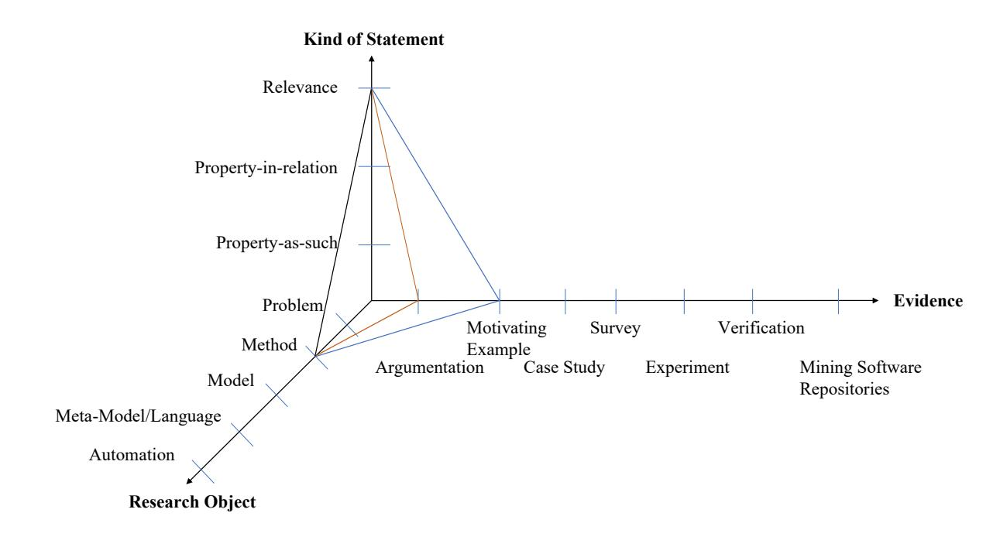

# A Classification for Managing Software Engineering Knowledge

Angelika Kaplan angelika.kaplan@kit.edu Karlsruhe Institute of Technology Karlsruhe, Germany

Maximilian Walter maximilian.walter@kit.edu Karlsruhe Institute of Technology Karlsruhe, Germany

Robert Heinrich heinrich@kit.edu Karlsruhe Institute of Technology Karlsruhe, Germany

## ABSTRACT

This taxonomy paper presents a novel way of knowledge engineering in the software engineering research community. Till now, research papers are organized digitally as documents, mostly in PDF files. Not much effort is spent on effective knowledge classification, retrieval, storage, and representation. In contrast to the current paper-based approach for knowledge documentation, we present a statement-based approach, where each statement is linked to arguments and data of its evidence as well as to related statements. We argue that in this way, knowledge will be easier to retrieve, compare, and evaluate in contrast to current paper-based knowledge engineering in scientific search engines and digital libraries. Therefore, we present as a first step a novel multi-dimensional classification for statements in software engineering research. Statements are classified according to their research object, their kind (e.g., relevance), and their underlying evidence. This classification is validated and extended with a first systematic literature review. Additionally, we provide an example for illustration purpose.

## CCS CONCEPTS

• General and reference → Surveys and overviews; • Software and its engineering;

### KEYWORDS

meta-research in software engineering, validation, classification, knowledge management system

#### ACM Reference Format:

Angelika Kaplan, Maximilian Walter, and Robert Heinrich. 2021. A Classification for Managing Software Engineering Knowledge. In Evaluation and Assessment in Software Engineering (EASE 2021), June 21–23, 2021, Trondheim, Norway. ACM, New York, NY, USA, [7](#page-6-0) pages. [https://doi.org/10.1145/](https://doi.org/10.1145/3463274.3463357) [3463274.3463357](https://doi.org/10.1145/3463274.3463357)

#### 1 INTRODUCTION

Software engineering (SE) research is the study of approaches for developing, operating, and maintaining software (cf. IEEE Std 610.12- 1990 [\[1\]](#page-6-1)). Knowledge engineering deals with technical, scientific, and social aspects involved in building, maintaining knowledge in organizations and communities [\[5\]](#page-6-2). This paper aims to present an idea of knowledge engineering for the SE research community based on a classification.

Nowadays, like in many scientific communities, hypotheses and insights depending on their nature with associated arguments and data are published in scientific monolithic PDF articles for communicating SE research. Not much effort is spent on reorganizing these information and knowledge. Our point in this paper is that (a) it should be done much better given the increase of SE research and its relevance for basically any kind of technical innovation and (b) it could be done much better, given scalable, modern data management tools.

Already now, great effort is spent to find a relevant subset of papers being concerned with a specific question or intention in mind (e.g., for conducting systematic literature studies with database search, finding adequate related work, or building consensus). Keyword-based search has been most popular and an alleged easy to used technique in scientific electronic databases like Google Scholar, ACM Digital Library, and IEEE Xplore that store SE publications and are currently suitable for SE-searches, as there is no dedicated search engine just for SE research papers (cf. [\[16\]](#page-6-3)). While it is never certain whether the usually paper-title-based keyword search and thus, the resource-dependent searches in these electronic databases and different data sources found all relevant papers to that specific question in mind, sorting out the irrelevant ones after paper content analysis is also tremendously time consuming (cf. [\[9\]](#page-6-4)). Extended full-text searches, poor standard of abstracts of SE publications, and ambiguous terminology in different research domains or potentially dealing with unclear semantic relations, such as synonyms, homonyms and meronymies regarding keywords yield even more false positive hits, which increases the manual challenge of identifying relevant papers (cf. [\[9\]](#page-6-4), [\[11\]](#page-6-5)). In addition to these limitations and the rapidly increasing number of SE papers (Figure 3 in [\[13\]](#page-6-6)), the aforementioned problems are progressively emphasized and intensified. As time progresses, searches and result inspections have to be repeated manually for all new publications.

Thus, we observe the following difficulties:

- (i) One paper can be related to many statements.
- (ii) Each statement may give different kinds and strength of evidence.
- (iii) Papers may add evidence to a statement of other papers with additional data or arguments.
- (iv) Papers may contain statements that refine statements of other papers or
- (v) even contradict them with some evidence.

In this case, we define a statement as a fact, a hypothesis or conclusions out of data results of a research object with a given evidence. The statement can either be about an intrinsic property of the research object, a relationship between the object and its context (e.g., user behavior, technical or process environment) or about the relevance of the object. However, usually we do not find

Publication rights licensed to ACM. ACM acknowledges that this contribution was authored or co-authored by an employee, contractor or affiliate of a national government. As such, the Government retains a nonexclusive, royalty-free right to publish or reproduce this article, or to allow others to do so, for Government purposes only. EASE 2021, June 21–23, 2021, Trondheim, Norway

© 2021 Copyright held by the owner/author(s). Publication rights licensed to ACM. ACM ISBN 978-1-4503-9053-8/21/06. . . \$15.00 <https://doi.org/10.1145/3463274.3463357>

all such statements easily with keyword-based title, title-abstract or full-text-based searches without paper content analysis in the corresponding PDF file. In addition, of course, older papers cannot reference newer ones, although they may be highly related in the above listed terms (iii-v). Even worse, the evidence of a statement is too often not clear. For instance, the famous statement that making a software asset reusable is only worthwhile if it is re-used more than three times. A citation of this statement like a fact can be found, e.g., among many others in [\[17\]](#page-6-7). However, one of the first original occurrences of this statement can be traced back to [\[12,](#page-6-8) [18,](#page-6-9) [19\]](#page-6-10). Here, it is clearly marked as a rough estimation without stronger empirical evidence. In contrast to this state of the current practice, we propose an idea of a new knowledge management system (KMS) for SE research which makes statements (e.g., conclusions out of data results or theorems as mentioned before) first-class entities. This idea is motivated by Vannevar Bush and his proposition of a machine Memex that allows associative linking of documents [\[10\]](#page-6-11). This concept of presenting information and knowledge by using machine support for human memory and associative thinking reflected in a statement-based classification approach for KMS in SE research is central.

The remainder of this taxonomy paper is organized as follows: In Section [2,](#page-1-0) we elaborate the idea of a novel KMS in more detail. Next, we present a three dimensional classification for SE statements in Section [3.](#page-1-1) Afterwards, we provide an illustration example to show the applicability of our classification approach. We validated and refined our classification by conducting a systematic literature review (SLR) and discuss limitations of the classification in Section [5.](#page-4-0) Related work is discussed in Section [6.](#page-5-0) Finally, the paper concludes with a summary and ongoing work.

# 2 SOFTWARE ENGINEERING RESEARCH KNOWLEDGE MANAGEMENT

Our idea of a KMS for SE publications allows queries on statements regarding their research object, kind of statement, and the underlying evidence. Kind of statement means either property of an object, relation of object to its context or relevance of the object. In addition, queries can relate to existing statements. Examples of queries – all could easily be formulated in a formal query language – would be in natural language:

- (1) "List and compare all statements about the applicability of the UML language based on case studies."
- (2) "List and compare all statements about the relevance of agile methods based on surveys."
- (3) "What are controlled experiments in terms of the productivity loss of programmers on Mondays?"

Answering such queries (1) – (3) relies on a classification of SE statements and of course existing classifications of software engineering knowledge (e.g., the appropriate parts of the ACM computing classification [\[2\]](#page-6-12) or the SWEBOK guide Version 3.0 [\[22\]](#page-6-13)) to cover SE topics aligned to the research object for further refinement. A first initial version of such a classification is presented in the next section. Even query (3), which defines a relationship between statements, does not need semantic processing via an ontology or even a formalism with undecidable properties. It can be answered by referring back to the classification and then looking for accordingly

classified statements. Thus, for realizing this management system for SE research knowledge, we need a novel classification approach for statements and their relations. However, manually classifying research papers is a very time-consuming process. Therefore, we propose an automatic process to reduce the manual effort (e.g., by using text classification techniques). We see the potential benefits of such a KMS in:

- (i) A faster progress in science, as (a) authors can find relevant work for their foundations and related work more easily. In addition, inadequately validated statements, missing statements or statements with high relevance may motivate further investigations. Beyond that, a significantly reduced effort for literature reviews, as compared to the current titlesubstring- or full-text-based search and a better precision / recall should be achieved (cf. [\[9,](#page-6-4) [11\]](#page-6-5)). Hence, efforts are more concentrated on true advancements beyond the state-of-theart and (b) reviewers can give more precise feedback on the novelty of reviewed papers.
- (ii) A faster transfer of ideas into practice, as evidence on methods and practices becomes visible for industry and experiences of pilot projects with commercial partners find their way back into a well accessible body of knowledge.
- (iii) An easier access to the state-of-the-art for teachers and students, where the evidence of statements is documented, including even contradictions between statements. This helps to eliminate outdated content from teaching material and to better understand in which context approaches work beneficially.

Of course, these benefits have to be empirically proven in future work. In the next Section [3,](#page-1-1) we present our novel classification for statements and their relations.

## 3 CLASSIFICATION

The following classification tries to classify statements on SE problems and solutions in three dimensions: (1) research object, (2) kind of statement, (3) evidence of statement.

Figure [1](#page-2-0) provides an overview of the different classes in each dimension. This classification is about statements on SE solutions in terms of methods, algorithms, models and languages. Hence, it is concerned with primary research, not with secondary and tertiary research as described in Kitchenham et al.'s [\[16\]](#page-6-3) research type classification to categorize empirical studies.

For the research object (dimension 1), we identified five classes:

- (1.1) Problem: The object of research can be a problem, even if no solution is presented. However, the investigation and understanding of a problem is the base for a future solution. Most of these papers take place in social or social-technical context settings.
- (1.2) Method: This object of research refers to any human-driven approach for fulfilling SE tasks (e.g., code reviews, pair programming). This can include tool-supported and -automated subtasks and processes. However, the main approach is driven by humans.
- (1.3) Model: Models are abstractions from the real world for a certain designated use for which certain properties of the modeled entity hold [\[23\]](#page-6-14). In SE, models are, e.g., reference

<!-- Image Description: The image is a 3D diagram illustrating a framework for classifying research statements. The axes represent "Kind of Statement" (relevance, property-in-relation, property-as-such), "Research Object" (problem, method, model, etc.), and "Evidence" (motivating example, survey, experiment, etc.). Lines connect points representing different statement types, showing their relationships within the framework. The diagram's purpose is to provide a structured way to categorize and analyze research claims within the paper. -->

### Figure 1: Dimensions of the Classification with Example Application from Section [4](#page-3-0)

architectures for software systems, (prediction) models of software development process or software product qualities.

- (1.4) Metamodel/Language: Metamodels serve as language specifications like grammars do. Such languages can be results and objects of SE research. Examples range from programming languages to specification languages.
- (1.5) Automation: This subclass refers to algorithms, tools, and applications, hence fully automated tasks in SE. Of course, elements from this class can perform subtasks of humandriven approaches (see Method (1.2)).

Different kind of statements (dimension 2) can be made about a research object. This dimension is divided into three main classes:

- (2.1) Property-as-such: Statements about intrinsic properties of a research object, which do not depend on external factors. For instance, "Compiler C is modularized into modules for lexing, parsing, abstract syntax tree attributation and code generation and a symbol table". Although this is certainly not the only way to modularize a compiler, it is a statement on the modularization of the described compiler C.
- (2.2) Property-in-relation: Statements about a research object which are related to its context. This can be either statements on (i) the existence of influence factors, e.g., "Compiler C's performance mainly depends on the size of the input file and the performance of the file system." or (ii) it can be statements on the influence itself: "Compiler C's performance depends polynomially on the given input file size and linearly on the performance of the file system." In General, context can, e.g., be a user behavior, technical or process environment.

(2.3) Relevance: Statements about the importance of a research object, necessarily relating to a given context. Of course, the term relevance itself includes many properties such as the broadness of applicability, the size of the impact of the application. From a scientific point of view, the depth of thought and the originality can also be seen as aspects of relevance. An example is: "Object-oriented modeling can be applied beneficially to all application domains of software except driver programming.". However, this is not a statement about its applicability (how difficult the application is) but about the potential areas of a positive application.

The aforementioned classes of statements are underlined with different kind of evidences (dimension 3), i.e., empirical or nonempirical evidence:

- (3.1) Argumentation: This kind of statement has no significant empirical evidence or formal verification (cf. Verification (3.6)). Statements here could imply the description of solution approaches (e.g., algorithms in pseudo-code or corresponding text-based descriptions).
- (3.2) Motivating example: A first exemplary demonstration of a research object with an example made by the authors or taken from the community. Terms like running example can be identified as synonyms.
- (3.3) Case study: Properties of the research object are validated in a case study. Further specific subclasses are possible (e.g., community case studies as representative of a particular subset of case study research). So far, we suggest that case studies are always related to property-in-relation (2.2).

- (3.4) Survey through interview or questionnaire: Empirical data on a property of a research object taken from surveys (either qualitatively or quantitatively evaluated). Subclasses in terms of unstructured, (semi-) structured interviews can be defined.
- (3.5) Experiment: Experiments that collect data regarding properties of a research object gained through a controlled experiment, usually with humans (i.e., research subjects) or automated as benchmark.
- (3.6) Verification: Mathematical proofs relating to a set of axioms and proof-rules. This can be, e.g., analyses of properties of algorithms.
- (3.7) Mining software repositories (MSR): This class represents software repositories such as version control systems, requirements- or bug-tracking systems, and mail archives that record software developers' activities.

For demonstration purposes, we describe the application of this classification to the existing evaluation of our context-based confidentiality analysis approach [\[8\]](#page-6-15).

## 4 EXAMPLE APPLICATION

In this section, we first give an example by applying our classification on existing research work for illustration purpose. Based on the given illustration example, we describe possible use cases for our proposed KMS.

### 1 Applying the Classification

Our example approach in [\[8\]](#page-6-15) extends the work of [\[20\]](#page-6-16) and uses an architectural model together with a context model to analyze the dataflow regarding confidentiality violations in dynamic Industrial IoT scenarios. In these scenarios determining the confidentiality is difficult, because of the heterogeneous and fast changing environment. However, a loose of confidentiality might result in high monetary expenses. Therefore, it is important to achieve early feedback about the confidentiality. The analysis is realized by modeling data characteristics and propagating these characteristics. These characteristics describe access policies, which can be evaluated. This enables us to consider confidentiality or access control already in early design time.

First, we start the classification process by identifying the contributions and afterward mapping them to the research object. However, the research object is not necessarily always a contribution of the paper. Therefore, an approach can have more research objects than contributions. In our case, there exists a single direct mapping of contributions and research objects. The illustration paper [\[8\]](#page-6-15) consists of 3 contributions, an extension to the overall modeling and analysis process, a metamodel to describe context properties, and an extension to the analysis part that realized by a model to model transformation. Therefore, we select as research objects the classes Method (1.2), Model (1.4), and Automation (1.5). The first class Method is selected as the extended process describes a human-driven approach to model confidentiality. This description matches the definition of a human-driven SE task. The approach contains a metamodel for modeling context attributes that is why class Metamodel (1.4) is chosen. The analysis extension is realized by an automated model to model (m2m) transformation and matches the description of class Automation (1.5) with fully automated tasks.

For assigning the statements and evidence classes, we analyzed first the dedicated evaluation section [\[8\]](#page-6-15). The evaluation consists of an accuracy comparison based on different equivalence classes in different scenarios and a scalability investigation, where different parameters of the approach have been varied. We additionally included the approach sections for adding further non-empirical validation aspects. The assignments for each contribution are:

- (1) process extension: The paper describes only the need for these kinds of analysis processes and the general applicability. Therefore we select relevance (2.3) and as evidence (3.1) as well as (3.2), since we do not give empirical evidence of the general applicability but argue it and provide a motivating example.
- (2) metamodel: The metamodel is not explicitly evaluated but rather whether it is suitable as an input for the analysis. We, therefore, select (2.2) as it is a related property. The evidence is given by the motivating example (3.2) and the executed scenarios based on different case studies (3.3). Additionally, by using case studies from industrial partners to model the scenario, we investigated the relevance (2.3).
- (3) analysis: The analysis is firstly evaluated by analyzing different scenarios and comparing the output to the expected output. We evaluated there only the functional properties. Therefore we would choose (2.1) as property-as-such since these mainly check whether the behavior is as expected. The type of evidence is (3.2) and (3.3) since we use different case studies and a motivating example. Additionally, we investigated the scalability of the approach. This is a property-inrelation statement (2.2) since we investigated the execution time compared to different input parameter sizes. As evidence class, we select (3.5) since we scaled the selected input parameter and then observed the system's behavior.

Table [1](#page-4-1) summarizes our classification. It shows for each contribution the assigned classifications. Figure [1](#page-2-0) also illustrates for the process extension the classification with the connecting lines between the different selected classes.

#### 2 Application Use Cases

After describing the classification and giving an example application, we illustrate potential use cases within the KMS (cf. Section [2\)](#page-1-0).

For instance, with the help of the classification and topic restriction to further narrow the search space in a KMS for SE papers, such as ACM computing classification [\[2\]](#page-6-12), we can search for all papers which describe a confidentiality process. We would then get our approach back and could see easily, that the approaches use additionally a metamodel and an automation. We could see, what kind of statements are evaluated and which evidence is given. This could then be used for further searches for example regarding metamodels and confidentiality.

Another possible use case could be, that we have developed a metamodel and want to investigate what kind of evaluation is commonly used. Here we would again insert the research object and then have a look at the given evidence to get insights, how other researchers have evaluated their approaches to compare own results with state-of-the-art.

| Contributions                 | Research Object | Kind of Statement                                          | Evidence            |
|-------------------------------|-----------------|------------------------------------------------------------|---------------------|
| process extension             | (1.2)           | (2.3) applicable to scenarios                              | (3.1), (3.2)        |
| context metamodel             | (1.4)           | (2.2) suitable for analysis, (2.3) applicable to scenarios | (3.2), (3.3)        |
| analysis (m2m transformation) | (1.5)           | (2.1) accurate results, (2.2) scalable                     | (3.2), (3.3), (3.5) |

#### Table 1: Classification Results Based on Research Object

## 5 VALIDATION

We give a brief overview of our methodology to validate and extend our proposed classification in Section [3](#page-1-1) based on primary studies. Therefore, we followed the guidelines of Kitchenham et al. [\[16\]](#page-6-3) to conduct a literature review.

The aim of this review is to analyze the content of research documents mainly with regard to the statements in scientific SE papers with taking research object and evidence of statement into account. We applied our classification to the results of the review to investigate applicability and completeness of our classification. In case of missing classes, we want to consolidate the classes along the three dimensions of the classification.

### 1 Literature Review Research Questions

Based on our aim of this literature review, we defined the following research questions (RQ)s:

- RQ1 What kind of research objects can be found in scientific SE papers?
- RQ2 What kind of statements about the research objects are made?
- RQ3 How are these statements validated and what kind of evidence can be found in scientific SE papers?

#### 2 Search Strategy

We use manual search as search strategy and choose the International Conference on Software Engineering (ICSE) as high-ranked conference with a broad topic scope, covering all facets of SE research. Thus, we obtained 129 papers from the technical track published at ICSE 2020 for further data selection and analysis.

#### 3 Study Selection

Regarding the study selection process, we defined the following inclusion (I) and exclusion (E) criteria:

- Topic. (I): Any SE topic in primary research is considered for further analysis. The context settings can be social, technical, and socio-technical. (E): As meta-research has now established itself as a scientific discipline (cf. [\[6,](#page-6-17) [15\]](#page-6-18)), these paper types (primary, secondary or tertiary research on SE-research) are not considered in our review. Papers that present taxonomies or are secondary studies (i.e., research maps or (semi)-systematic literature studies) on a specific SE topic are excluded in the first iteration of our SLR.
- Method Design. (I): Papers that present some kind of empirical and non-empirical validation (i.e., the stated claim has to be validated in the paper) are included. (E): Papers without validation (e.g., solution approach without evaluation) are excluded.

- Paper Research Artifacts. (I): Every paper has to clearly state the research object including the new proposed solution and the corresponding validation approach.
- Paper Characteristics. (I): We only include accepted so called full research papers written in English (i.e., ICSE papers with 10-12 pages). (E): Any other paper type published at ICSE in the categories doctoral symposium, workshops, tool demos etc. is excluded.
- Publication Year. (I): We focused on the publication year 2020.

## 4 Data Extraction Format

Derived from our aforementioned RQs, we define a data extraction form (cf. Table [2\)](#page-4-2). Thus, we validated and refined the definitions of the classes for each dimension.

### Table 2: Data Extraction Form

| RQ | Data Item                           | Description                                                                                                                                                  |
|----|-------------------------------------|--------------------------------------------------------------------------------------------------------------------------------------------------------------|
|    | RQ1 Research object RQ3 Evidence | Investigated object of research RQ2 Kind of statement property of object (e.g., relevance, novelty etc.) Method design, evidence of statement validity |

#### 5 Findings

After applying our classification, our findings were the following: Our initial classification worked well for constructive contributions and their validation as intended (i.e., new solution approaches either motivated from scientific interest or practical problems in industry). These types of papers helped us to refine the meaning and definition of each subclass of our three dimensions. Further research types (e.g., investigating a problem with no solution approach) were not considered initially. Therefore, we added, e.g., Problem (1.1) to the first dimension (i.e., research object) as a prospective extension (cf. Section [3\)](#page-1-1).

#### 6 Limitations of Approach

So far, we considered knowledge retrieved from scientific SE papers and identified three main limitations of our approach.

Firstly, the classification is limited to primary research in SE in the sense of [\[16\]](#page-6-3). In particular, any meta-research like this paper cannot be classified. This limitation could be overcome by an extension of the research object dimension. However, statements about problems and solutions differ from statements about meta-research. Hence, it is an open question whether dimension 2 (i.e., kind of statement) might need other values.

Secondly, not all information is carried out in research text documents. Our initial proposed classification is currently limited to

content data in SE publications. Supplementary material to SE publications like datasets, software repositories, replication packages, and meta-data (e.g., author name, venue, ORCID[1](#page-5-1) etc.) is so far not taken into account in our initial classification. However, the first type could be easily integrated by adding further (sub-)classes to the third evidence dimension.

Thirdly, our approach is currently complementary to recent initiatives for availability and reusability of research data (cf. [\[3\]](#page-6-19)). Ultimately, annotations of papers based on our classification about this evidence should contain links to the respective published research data resources.

## 7 Threats to Validity

In the following, we discuss threats to validity to our review and potential biases based on the guidelines of Kitchenham et al. [\[16\]](#page-6-3).

Selection Bias. We systematically use manual search (i.e., no random choose) and investigated published full track papers from ICSE 2020. Validity threats are related to the data used to validate the classification. Potentially, there could be a bias in the selected publications in ICSE. Although widely considered as the flagship conference, there is a potential threat whether ICSE covers all subdisciplines of SE equally. This limitation could be overcome by adding additional publications from different venues in the SLR.

Measurement and Exclusion Bias. We used pre-defined inclusion and exclusion criteria for further data analysis. They are chosen to fit our research goals (i.e., validating our classification for primary SE papers) as well as reasonably possible and not to compromise the quality of our results. The classification proposed and to be validated is based on a narrative definition of terms that could allow different interpretations by different researchers. In this review, this risk was addressed through several workshop and meeting sessions to get an common understanding. In general, the inclusion of examples that clarify the values assigned to each dimension and classes can reduce the risk. With this procedure, we refined the definitions of the classes in each dimensions and were able to add new classes if necessary.

Performance Bias. For avoiding performance bias, which focuses on the repeatability, we documented our method design in a written protocol by defining research questions, search strategy, filtering criteria and data extraction form for data analysis.

## 6 RELATED WORK

In the following, we present related work and identify two main areas of related work with regard to our initial classification described in Section [3:](#page-1-1) (i) papers in SE research domain and (ii) other research domains.

# 1 Related Work in Software Engineering Research

As this paper mainly contributes to meta-research in SE, we regard papers as related work that report on classification schemes for SE research.

Mary Shaw [\[21\]](#page-6-20) proposes a classification for SE that shows the diversity of research strategies (i.e., type of question, type of result, and type of validation) to explain the character of SE research. Although the paper serves as a minitutorial, it also includes a literature study limited to ICSE 2002 proceedings. This classification is validated and partly extended in follow-up studies by Theisen et al. [\[24\]](#page-6-21) and Bertolino et al. [\[6\]](#page-6-17).

Further, we regard related classifications of research strategies focused on subdisciplines of SE. Wieringa et al. [\[26\]](#page-6-22) define a set of evaluation criteria in requirements engineering for different paper types (e.g., personal experience papers, opinion papers, proposal of solution paper). For prediction models, Böhme et al. [\[7\]](#page-6-23) define three levels of validation (i.e., metric validation, applicability validation, benefit validation).

Classification of empirical SE methods and strategies are also related to our work referred to the evidence of statements in dimension 3 (cf. Wohlin et al. [\[27\]](#page-6-24), Zelkowitz et al. [\[28\]](#page-6-25), and Glass et al. [\[14\]](#page-6-26)). In theses works, classifications of SE topics are also partly addressed.

These related classifications apply research papers as first class entities to knowledge documentation. In contrast to such classifications, we propose a statement-based approach, where statements are first class entities and each statement is linked to arguments and data of its evidence as well as to related statements.

In SE, we have to shape the classification for a novel KMS with regard to our domain, as we use specific kind of research strategies like solutions approaches (e.g., algorithms and implementations) with evaluation in contrast to mathematics, where only definitions and theorem proofs are necessary for statement specifications. This issue influences our classes along the dimensions.

## 2 Related Work in other Research Domains

When we take a look at classifications in other research domains, we can find, e.g., the Mathematics Subject Classification (MSC) [\[4\]](#page-6-27). This classification is also implemented in the electronic database MathSciNet[2](#page-5-2) and allows to search for papers that are labeled with a MSC-topic-identifier. As stated in the introduction, this search strategy with keywords is very time-consuming with a specific question in mind and the results are listed successively documentwise without any related links.

### 7 CONCLUSION AND ONGOING WORK

In this taxonomy paper, we presented our idea of a new KMS for SE research using a statement-based approach. Therefore, we provided an initial classification validated in a first literature review and gave an example for illustration purpose. As a preliminary result, we define classes for three main dimensions (cf. data extraction form in Section [5\)](#page-4-0): (i) research object, (ii) kind of statement, (iii) evidence. The scope of the proposed classification encompasses various research work and research questions for further investigation.

First of all, we want to extend our literature review in terms of a longer time span consideration and a broader venue selection (i.e., regarding top-tier and high-ranked conferences and journals with a broad range covering all facets of SE research like the International Conference on Software Engineering (ICSE), the ACM

1<https://orcid.org/>

2<https://mathscinet.ams.org/mathscinet/>

A Classification for Managing Software Engineering Knowledge EASE 2021, June 21–23, 2021, Trondheim, Norway

Joint European Software Engineering Conference and Symposium on the Foundations of Software Engineering (ESEC/FSE), IEEE Transactions on Software Engineering (TSE), ACM Transactions on Software Engineering and Methodology (TOSEM), and Empirical Software Engineering: an international journal (ESEJ). Further selected papers can help us to refine the classes of each dimension and to overcoming discussed limitations. Thus, we want to create a reliable, holistic and comprehensive classification scheme for a SE research KMS.

Next, we will evaluate our proposed classification in more detail in terms of reliability and usefulness. Therefore, we use three validation criteria (i.e., orthogonality demonstration, benchmarking and utility demonstration cf. [\[25,](#page-6-28) [29\]](#page-6-29)). For this purpose (i.e., utility demonstration), we have to transform our classification into a machine-readable format and develop a (semi-)automatic text classification approach to our proposed solution (cf. Section [2\)](#page-1-0). Next, the alternative design of front-end and back-end of this KMS has to be done to better retrieve knowledge, to display statement-based knowledge in order to compare and link statements within and between papers for a better search experience compared to current approaches.

## ACKNOWLEDGMENTS

This work was supported by the KASTEL institutional funding.

### REFERENCES

- [1] 1990. IEEE Standard Glossary of Software Engineering Terminology. IEEE Std 610.12-1990 (Dec 1990), 1–84.<https://doi.org/10.1109/IEEESTD.1990.101064>
- [2] 2012. ACM Computing Classification System (CCS). [https://www.acm.org/](https://www.acm.org/publications/class-2012) [publications/class-2012](https://www.acm.org/publications/class-2012) visited on 19.03.2021.
- [3] 2020. ACM CSS Artifact Review and Badging Initiative. [https://www.acm.org/](https://www.acm.org/publications/policies/artifact-review-and-badging-current) [publications/policies/artifact-review-and-badging-current](https://www.acm.org/publications/policies/artifact-review-and-badging-current) visited on 19.03.2021.
- [4] 2020. MathSciNet - Mathematical reviews on the Web. [https://mathscinet.ams.](https://mathscinet.ams.org/msnhtml/msc2020.pdf/) [org/msnhtml/msc2020.pdf/](https://mathscinet.ams.org/msnhtml/msc2020.pdf/) visited on 19.03.2021.
- [5] Nathalie Aussenac-Gilles, Jean Charlet, and Chantal Reynaud. 2020. Knowledge Engineering. In A Guided Tour of Artificial Intelligence Research. Springer, 733– 768.
- [6] Antonia Bertolino, Antonello Calabrò, Francesca Lonetti, Eda Marchetti, and Breno Miranda. 2018. A categorization scheme for software engineering conference papers and its application. Journal of Systems and Software 137 (2018), 114–129.<https://doi.org/10.1016/j.jss.2017.11.048>
- [7] Rainer Böhme and Ralf H. Reussner. 2005. Validation of Predictions with Measurements. In Dependability Metrics: Advanced Lectures [result from a Dagstuhl seminar, October 30 - November 1, 2005] (Lecture Notes in Computer Science, Vol. 4909), Irene Eusgeld, Felix C. Freiling, and Ralf H. Reussner (Eds.). Springer, 14–18. [https://doi.org/10.1007/978-3-540-68947-8\\_3](https://doi.org/10.1007/978-3-540-68947-8_3)
- [8] Nicolas Boltz, Maximilian Walter, and Robert Heinrich. 2020. Context-Based Confidentiality Analysis for Industrial IoT. In 46th Euromicro Conference on Software Engineering and Advanced Applications, SEAA 2020, Portoroz, Slovenia, August 26-28, 2020. IEEE, 589–596.<https://doi.org/10.1109/SEAA51224.2020.00096>
- [9] Pearl Brereton, Barbara A. Kitchenham, David Budgen, Mark Turner, and Mohamed Khalil. 2007. Lessons from applying the systematic literature review process within the software engineering domain. Journal of Systems and Software 80, 4 (2007), 571–583.<https://doi.org/10.1016/j.jss.2006.07.009> Software Performance.
- [10] Vannevar Bush. 1945. As We May Think. The atlantic monthly 176, 1 (1945), 101–108.<http://www.theatlantic.com/unbound/flashbks/computer/bushf.htm>
- [11] Oscar Anna Grimán Dieste and Natalia Juristo Juzgado. 2009. Developing search strategies for detecting relevant experiments. Empirical Software Engineering 14, 5 (2009), 513–539.<https://doi.org/10.1007/s10664-008-9091-7>
- [12] John Favaro. 1991. What Price Reusability? A Case Study. In Proceedings of the First International Symposium on Environments and Tools for Ada (Redondo Beach, California, USA) (SETA1). Association for Computing Machinery, New York, NY, USA, 115–124.<https://doi.org/10.1145/112629.112643>
- [13] Vahid Garousi and João M. Fernandes. 2016. Highly-cited papers in software engineering: The top-100. Information and Software Technology 71 (2016), 108–128. <https://doi.org/10.1016/j.infsof.2015.11.003>

- [14] Robert L. Glass, Iris Vessey, and Venkataraman Ramesh. 2002. Research in software engineering: an analysis of the literature. Information and Software Technology 44, 8 (2002), 491–506. [https://doi.org/10.1016/S0950-5849\(02\)00049-6](https://doi.org/10.1016/S0950-5849(02)00049-6)
- [15] John PA Ioannidis. 2018. Meta-research: Why research on research matters. PLoS biology 16, 3 (2018), e2005468.
- [16] Barbara Kitchenham and Stuart Charters. 2007. Guidelines for performing Systematic Literature Reviews in Software Engineering. Technical Report EBSE 2007-001. Keele University and Durham University Joint Report. [http://www.dur.ac.uk/](http://www.dur.ac.uk/ebse/resources/Systematic-reviews-5-8.pdf) [ebse/resources/Systematic-reviews-5-8.pdf](http://www.dur.ac.uk/ebse/resources/Systematic-reviews-5-8.pdf)
- [17] W. C. Lim. 1994. Effects of reuse on quality, productivity, and economics. IEEE Software 11, 5 (1994), 23–30.<https://doi.org/10.1109/52.311048>
- [18] Johan Margano and Lynn Lindsey. 1991. Software reuse in the air traffic control advanced automation system. In Joint Symposia and Workshops: Improving the Software Process and Competitive Position, Vol. 29.
- [19] Johan Margono and Thomas E. Rhoads. 1992. Software Reuse Economics: Cost-Benefit Analysis on a Large-Scale Ada Project. In Proceedings of the 14th International Conference on Software Engineering (Melbourne, Australia) (ICSE '92). Association for Computing Machinery, New York, NY, USA, 338–348. <https://doi.org/10.1145/143062.143151>
- [20] Stephan Seifermann, Robert Heinrich, and Ralf H. Reussner. 2019. Data-Driven Software Architecture for Analyzing Confidentiality. In IEEE International Conference on Software Architecture, ICSA 2019, Hamburg, Germany, March 25-29, 2019. IEEE, 1–10.<https://doi.org/10.1109/ICSA.2019.00009>
- [21] Mary Shaw. 2003. Writing Good Software Engineering Research Papers: Minitutorial. In Proceedings of the 25th International Conference on Software Engineering (Portland, Oregon) (ICSE '03). IEEE Computer Society, USA, 726–736.
- [22] IEEE Computer Society, Pierre Bourque, and Richard E. Fairley. 2014. Guide to the Software Engineering Body of Knowledge (SWEBOK(R)): Version 3.0 (3rd ed.). IEEE Computer Society Press, Los Alamitos, CA, USA.
- [23] H. Stachowiak. 1973. Allgemeine Modelltheorie. Springer-Verlag.
- [24] Christopher Theisen, Marcel Dunaiski, Laurie A. Williams, and Willem Visser. 2017. Software Engineering Research at the International Conference on Software Engineering in 2016. ACM SIGSOFT Softw. Eng. Notes 42, 4 (2017), 1–7. [https:](https://doi.org/10.1145/3149485.3149496) [//doi.org/10.1145/3149485.3149496](https://doi.org/10.1145/3149485.3149496)
- [25] Muhammad Usman, Ricardo Britto, Jürgen Börstler, and Emilia Mendes. 2017. Taxonomies in software engineering: A Systematic mapping study and a revised taxonomy development method. Information and Software Technology 85 (2017), 43–59.<https://doi.org/10.1016/j.infsof.2017.01.006>
- [26] Roel Wieringa, Neil Maiden, Nancy Mead, and Colette Rolland. 2006. Requirements engineering paper classification and evaluation criteria: a proposal and a discussion. Requirements Engineering 11, 1 (March 2006), 102–107. [https:](https://doi.org/10.1007/s00766-005-0021-6) [//doi.org/10.1007/s00766-005-0021-6](https://doi.org/10.1007/s00766-005-0021-6)
- [27] Claes Wohlin, Per Runeson, Martin Höst, Magnus C. Ohlsson, and Björn Regnell. 2012. Experimentation in Software Engineering. Springer. [https://doi.org/10.1007/](https://doi.org/10.1007/978-3-642-29044-2) [978-3-642-29044-2](https://doi.org/10.1007/978-3-642-29044-2)
- [28] Marvin V. Zelkowitz and Dolores Wallace. 1997. Experimental validation in software engineering. Information and Software Technology 39, 11 (1997), 735– 743. [https://doi.org/10.1016/S0950-5849\(97\)00025-6](https://doi.org/10.1016/S0950-5849(97)00025-6) Evaluation and Assessment in Software Engineering.
- [29] Darja Šmite, Claes Wohlin, Zane Galvin, a, and Rafael Prikladnicki. 2014. An empirically based terminology and taxonomy for global software engineering. Empirical Software Engineering 19, 1 (Feb. 2014), 105–153. [https://doi.org/10.](https://doi.org/10.1007/s10664-012-9217-9) [1007/s10664-012-9217-9](https://doi.org/10.1007/s10664-012-9217-9)
