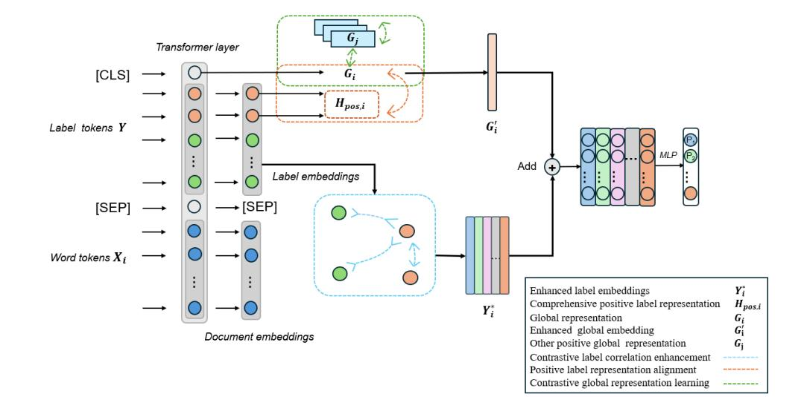
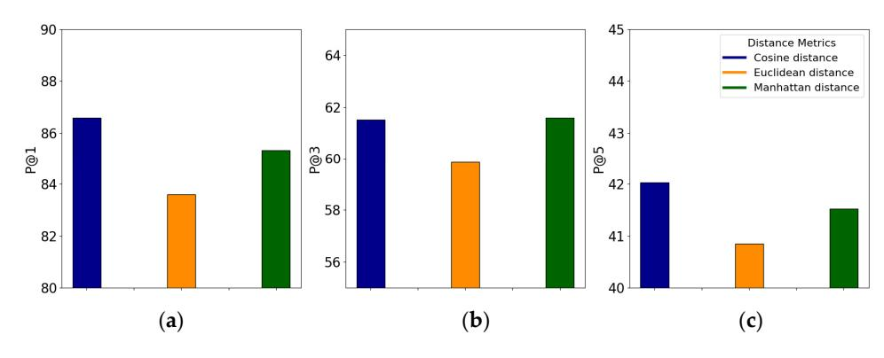
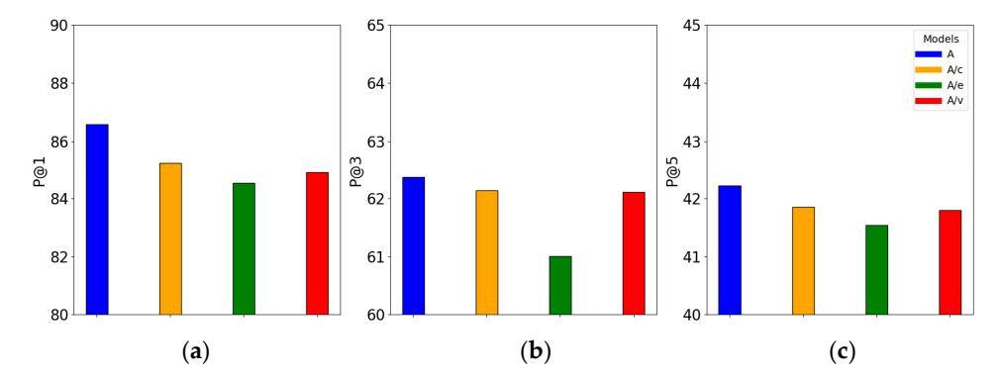
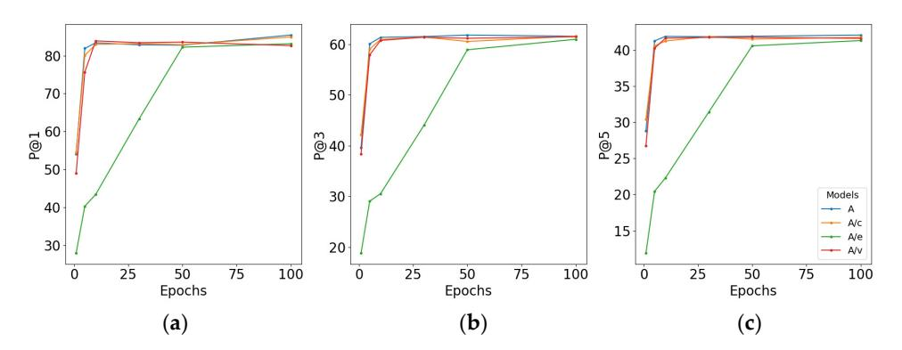

**Tianxiang Wu and Shuqun Yang \***School of Electronic and Electrical Engineering, Shanghai University of Engineering Science, Shanghai 201620, China**\***Correspondence: shqyang@sues.edu.cn
**Abstract:**Multi-label text classification (MLTC) aims to assign appropriate labels to each document from a given set. Prior research has acknowledged the significance of label information, but its utilization remains insufficient. Existing approaches often focus on either label correlation or label textual semantics, without fully leveraging the information contained within labels. In this paper, we propose a multi-perspective contrastive model (MPCM) with an attention mechanism to integrate labels and documents, utilizing contrastive methods to enhance label information from both textual semantic and correlation perspectives. Additionally, we introduce techniques for contrastive global representation learning and positive label representation alignment to improve the model's perception of accurate labels. The experimental results demonstrate that our algorithm achieves superior performance compared to existing methods when evaluated on the AAPD and RCV1-V2 datasets.
**Keywords:**multi-label text classification; label correlation; label textual semantics; contrastive learning

# 1. Introduction

Text classification is a fundamental task in natural language processing (NLP) [\[1\]](#page-11-0), aiming to automatically categorize large-scale text data. Multi-label text classification (MLTC) is a specialized subset of text classification where multiple labels can be assigned to a single text from a predefined set of labels [\[2\]](#page-11-1). Compared to traditional single-label text classification, MLTC is more realistic and challenging.

Traditional machine learning methods for MLTC typically involve mapping highdimensional data to a lower-dimensional space by using techniques such as principal component analysis (PCA) [\[3\]](#page-11-2) and linear discriminant analysis (LDA) [\[4\]](#page-11-3), aiming to transform data that are difficult to classify in the original space into a space where classification is easier; however, these methods often require significant feature engineering to extract relevant features from the data and can be sensitive to noise, which may lead to poor performance when incorrect features are selected or the features contain too much noise. With the rapid advancement in deep learning, neural network-based approaches for MLTC have achieved substantial success. These methods avoid the need for tedious feature engineering by allowing neural networks to adaptively model data distribution, leading to improved performance [\[5\]](#page-11-4). Current deep learning-based methods for MLTC can be categorized into two main types: document-only methods and document–label methods.

Document-only methods focus solely on the information contained within a document and use various architectures to learn hidden representations of the document for classification. Current approaches in this category include convolutional neural networks (CNNs) [\[6\]](#page-11-5), recurrent neural networks (RNNs) [\[7\]](#page-11-6), long short-term memory networks (LSTMs) [\[8\]](#page-11-7), bidirectional LSTMs (BiLSTMs) [\[9\]](#page-12-0), and attention mechanisms [\[10\]](#page-12-1). However, these methods often overlook the valuable information contained within labels.

In recent years, document–label methods have emerged, improving classification performance by combining both document and label information; however, obtaining effective label representations remains a challenge. Research on label representation can be divided into two main areas: label textual semantics and label correlation. Approaches focusing on label textual semantics typically enhance the semantic representation of labels
**Citation:**Wu, T.; Yang, S. Contrastive Enhanced Learning for Multi-Label Text Classification.*Appl. Sci.* **2024**, *14*, 8650. [https://doi.org/10.3390/](https://doi.org/10.3390/app14198650) [app14198650](https://doi.org/10.3390/app14198650)

Academic Editor: Anton Civit

Received: 16 August 2024 Revised: 21 September 2024 Accepted: 24 September 2024 Published: 25 September 2024

**Copyright:**© 2024 by the authors. Licensee MDPI, Basel, Switzerland. This article is an open access article distributed under the terms and conditions of the Creative Commons Attribution (CC BY) license [\(https://](https://creativecommons.org/licenses/by/4.0/) [creativecommons.org/licenses/by/](https://creativecommons.org/licenses/by/4.0/) 4.0/).

by integrating information from both text and labels, but they often overlook the relationships between labels. On the other hand, methods emphasizing label correlation seek to model the relationships between labels but may struggle to effectively connect label information with the document content. Consequently, both strategies have limitations in fully capturing and utilizing label information for improved classification.

Current strategies have utilized label information from various perspectives, but there is still significant room for improvement. Specifically, there is a lack of a unified strategy to capture both the textual semantics and correlations between labels. To address these challenges, we propose a model that combines contrastive learning with an attention mechanism to enhance both label correlation and textual semantics. Contrastive learning [\[11\]](#page-12-2) is a powerful technique that helps models learn discriminative representations by bringing similar samples closer in the embedding space while pushing dissimilar samples apart. In MLTC, this means that positive label pairs (labels associated with the same document) are encouraged to have similar representations, while negative label pairs (labels from different documents) are pushed to be farther apart [\[12\]](#page-12-3). By leveraging contrastive learning, we can enhance the correlation between labels that share semantic meaning, as well as better differentiate labels with distinct meanings.

We first use transformer-based sentence embeddings to capture prior label textual information and apply an attention mechanism to learn the relationships between labels and documents, thus enhancing the semantic richness of the labels. Additionally, recognizing that MLTC differs from traditional multi-class classification (where a document may have multiple labels and the same label may correspond to multiple documents), we employ contrastive label representation, learning to strengthen the correlations between labels associated with the same document. We also introduce contrastive global representation learning for samples sharing the same label, thereby enhancing the model's generalization ability and sensitivity to rare labels. To further enhance the model's ability to recognize positive labels, we use positive label representation alignment to align the global representation with the comprehensive representation of the corresponding labels.

We conducted experiments on the AAPD and RCV1-v2 datasets, demonstrating significant improvements over competitive baselines. We also validated the effectiveness of each component of our method. The main contributions of this work are as follows:

- 1. We propose an effective model specifically designed for MLTC, utilizing contrastive learning to enhance both label correlation and textual semantics within a BERTbased framework.
- 2. We introduce positive label representation alignment and contrastive global representation learning to improve the model's sensitivity in extracting label information and its generalization capability.
- 3. We compare our method with multiple baselines and validate the effectiveness of each component in the model.

## 2. Related Work

Existing multi-label text classification (MLTC) methods can be broadly categorized into two main types: document-only methods and document–label methods. Document–label methods can be further divided into approaches focusing on label textual semantics and label correlation information.

#*2.1. Document-Only Methods*Document-only methods classify texts by modeling their distribution without considering label information during the process, treating labels solely as mapping targets for classification. Traditional machine learning approaches rely on explicit distribution modeling and often require manual feature extraction. With the advancement of deep learning, deep neural network-based approaches have emerged as powerful tools for MLTC, enabling automated and implicit feature extraction.

Kim et al. [\[6\]](#page-11-5) first proposed a CNN-based text classification model. Lai et al. [\[13\]](#page-12-4) introduced TextRCNN, a cyclic convolutional neural network model that combines CNN and RNN architectures. Yang et al. [\[14\]](#page-12-5) proposed a hierarchical attention network for document classification. Peng et al. [\[15\]](#page-12-6) developed a graph-CNN-based deep learning model that transforms texts into graphs of words and applies graph convolution operations to enhance classification. Although these methods have been successful, they overlook the information embedded in the label itself. Consequently, there has been a growing focus on utilizing label information in recent years.

##*2.2. Document–Label Methods*Document–label methods aim to improve classification performance by incorporating label information. These methods can be divided into two main categories: label textual semantic methods and label correlation information methods.

Label textual semantic methods focus on deriving meaningful and effective textual semantic information from labels. Since labels often lack pre-trained word embeddings, these methods typically use attention mechanisms to integrate labels with text, thereby training the semantic representation of labels based on textual context. Xiao et al. [\[16\]](#page-12-7) constructed label-specific document representations by leveraging label information. Xun et al. [\[17\]](#page-12-8) utilized BERT [\[18\]](#page-12-9) to create a joint representation of the text and all candidate labels.

Label correlation information methods aim to enhance classification performance by exploring the co-occurrence relationships between labels. For instance, MAGNET [\[19\]](#page-12-10) proposed a model based on graph attention networks that incorporates both label embeddings as node features and their correlations. Su et al. [\[20\]](#page-12-11) introduced a KNN mechanism to retrieve neighbor instances and interpolate model outputs with their labels. Wang et al. [\[21\]](#page-12-12) employed contrastive learning to encode the hierarchical structure of labels into text representations, achieving hierarchical awareness even without constant label features.

Beyond these approaches, there are other methods, like tree-based models [\[22\]](#page-12-13), contrastive learning [\[23\]](#page-12-14), and various attention mechanisms, that aim to capture associations between labels; however, these methods often face challenges in balancing the textual semantic and relational information of labels. They typically combine label and document information in a simplistic manner, limiting the classifier's ability to fully utilize the information contained in the labels.

# 3. Materials and Methods

In this section, we introduce our proposed method in detail. As depicted in Figure [1,](#page-2-0) we design a contrastive enhanced learning method for MLTC. We then present three main parts of our model in more detail, including contrastive label representation learning, contrastive global representation learning, and positive label representation approximating.*Appl. Sci.* **2024**, *14*, x FOR PEER REVIEW 4 of 14

**Figure 1.**The overall architecture of our MPCM for MLTC.**Figure 1.**The overall architecture of our MPCM for MLTC.

##*3.1. Preliminaries*Problem formulation: Let*D* = (*Xi* ,*Yi*)} *N i*=1 denote the training data with *N*documents;*Xi*is a text sequence and*Yi*=*y*1,*i*, . . . ,*yk*,*i*, . . . ,*yL*,*i*is its corresponding label set. Here,*Xi* = {*x*1,*i*,*x*2,*i*, . . . ,*xm*,*i*} represents a document with *m*words, and*yk*,*i*∈ {0, 1} indicates whether the document,*Xi*, possesses the*i*-th label in a label space consisting of *L*class labels. Additionally, let*Y* = {*Y*1, . . . ,*YL*} denote the entire label token set, which is a predefined collection of label tokens associated with the current dataset. For example, in the AAPD dataset, *Y*1 = "cs.it" is a shorthand for "Computer Science, Information Theory". The aim of MLTC is to train a classifier to assign the most relevant labels to new documents.

### *3.2. Contrastive Enhanced Label Representation Learning*

#### 2.1. Document–Label Representation

As shown in Figure [1,](#page-2-0) we use a BERT base model to capture both document and label information. The first token in the input sequence is always the [*CLS*] token, whose associated output vector serves as a global representation of the entire document and labels and can be utilized for classification purposes.

For each document, *Xi*, the input sequence consists of two parts: label tokens,*Y* = {*Y*1, . . . ,*Yk* , . . . ,*YL*}, and word tokens, {*x*1,*i*,*x*2,*i*, . . . ,*xm*,*i*}. To capture the textual semantic information embedded in the labels, we leverage BertTokenizer to extract the prior textual semantic information associated with each label. Specifically, for the label "cs. IT", we treat its complete representation, "Computer Science, Information Theory", as a sentence and input it to BertTokenizer to obtain its corresponding embeddings, which contain the textual semantic information of the label itself. In this way, the model leverages our pre-trained label embeddings during training. Thus, for a sample,*i*, our overall input is {[*CLS*],*Y*1, . . . ,*YL*, [*SEP*], *x*1,*i*, . . . ,*xm*,*i*}, where [*SEP*] is the separator token between the label and the document.

During model training, within the BERT framework, attention mechanisms are employed to integrate the prior textual semantic information embedded in the labels with the document content. Based on the label token set *Y*, this process allows us to generate an embedding set, *Y*∗*i*= n*Y* ∗ 1,*i* , . . . ,*Y*∗*k*,*i* , . . . ,*Y*∗*L*,*i*o , for each document*i*, effectively representing the document from the perspective of each label. These embeddings will be used to assist in classifier decision making. We also obtain a global representation, *Gi* , of comprehensive labels and document information through [*CLS*]. However, the label embeddings currently do not include correlation information between labels, and the global representation, *Gi*, has a weak ability to capture label information for classification. Therefore, additional enhancements are necessary for both the label embeddings and the global representation.

#### 2.2. Contrastive Label Correlation Enhancement

In multi-label text classification (MLTC), each document is typically associated with multiple labels. To effectively capture the relationships between these labels, we treat the labels corresponding to a document as positive samples and those that are not associated with it as negative samples. The objective is to create embeddings where positive samples (labels that are actually assigned to a document) are closely aligned in the embedding space, while embeddings for positive and negative samples (labels not assigned to the document) are well separated. This contrastive approach is crucial for enhancing the correlation information between labels and for improving the overall accuracy of label predictions.

Given a document,*Xi*, and its corresponding label set,*Yi*=*y*1,*i*, . . . ,*yk*,*i*, . . . ,*yL*,*i*, we define the set of positive sample embeddings as*Ai* ={*Y*∗*m*,*i ym*,*i*= 1,*m*∈ {1, 2, . . . ,*L*}} , which represents the embeddings of the labels actually associated with *Xi*. The set of negative sample embeddings is defined as*Ii* = {*Y*∗*n*,*i yn*,*i*= 0,*n*∈ {1, 2, . . . ,*L*}} , representing the negative sample embeddings. For a given sample, *i*, our contrastive loss can be defined as follows:

$$
L_{con,i} = \sum_{z \in A_i} \sum_{q \in A_i \setminus z} -log \frac{e^{(z \cdot \frac{q}{\gamma})}}{ \sum_{z^* \in I_i} e^{(z \cdot \frac{z^*}{\gamma})}},
$$
(1)

where *γ*∈ R+ is the temperature factor, and the symbol · denotes a similarity metric. In I this context, we use cosine similarity to construct the label vector space. The numerator indicates the similarity between positive sample pairs, while the denominator represents the contrast between positive and negative sample pairs. By applying this contrastive loss, the model learns to pull together the embeddings of labels that frequently co-occur with the same documents, while pushing apart those that are less related. This process enables the model to capture the intrinsic structure and relationships between labels, thereby constructing a more effective and informative label vector space.

Furthermore, this enhanced label vector space facilitates better label predictions by providing a richer representation of the label semantics. The effectiveness of this metric will be demonstrated in our subsequent experiments, where we compare different similarity metrics and assess their impact on the quality of the label embeddings and the overall classification performance.

####*3.3. Contrastive Global Representation Enhancement*By minimizing the above contrastive loss,*Lcon*,*i*, we incorporate label correlation information into the model's training process, enabling the model to learn more effective label embeddings. However, we still need to ensure that our global representation,*Gi*, can utilize these label embeddings to assist in classification. To address this, we propose two strategies to enhance global features: positive label representation alignment and contrastive global representation learning.

#### 3.1. Positive Label Representation Alignment

In MLTC, the effectiveness of label information utilization is crucial for accurate classification. To fully leverage label information, it is essential that the global representation,*Gi*, resides in the same space as the label embedding space,*Y*∗*i*. This alignment ensures that the model can effectively integrate label information when making classification decisions based on*Gi*and*Y*∗*i*.

To achieve this, we propose a method called positive label representation alignment, which strengthens the connection between the global representation and the label embeddings. This approach not only enhances the utilization of label information but also promotes a unified representation space where the global and label-specific features coexist harmoniously, leading to more effective decision making during classification.

Let*Ai* ={*Y*∗*m*,*i ym*,*i*= 1,*m*∈ {1, 2, . . . ,*L*}} represent the set of positive sample embeddings, where the embeddings vary depending on the input document, *i*. The global representation of the document is denoted by *Gi*. To encapsulate the label information effectively, we define a comprehensive positive label representation,*Hpos*,*i* , as the average of the positive label embeddings:

$$
H_{pos,i} = \frac{1}{|A_i|} \sum_{Y_{m,i}^* \in A_i} Y_{m,i}^* \tag{2}
$$

Here, |*Ai*| represents the number of positive labels associated with document*i*. This comprehensive positive label representation serves as a proxy for the overall label information associated with the document. By averaging the embeddings, we obtain a more stable and representative vector that encapsulates the collective information of all positive labels. As shown in Figure [1,](#page-2-0) the global representation, *Gi*, of the document is derived from the [CLS] token output of the BERT model, which captures a contextualized summary of the entire input, integrating both the document and label tokens. Next, we aim to approximate

this comprehensive positive label representation,*Hpos*,*i*, with the global representation,*Gi*, by enhancing their similarity.

Since cosine similarity is in the range of [−1, 1], with larger values indicating higher similarity, directly using it is not aligned with our optimization direction. Therefore, we use cosine distance, defined as 1 − cosine similarity, to ensure positive values and to align the optimization direction with the overall loss function. The similarity measure is defined as follows:

$$
L_{diff,i} = 1 - G_i \cdot H_{pos,i}.
$$
\n(3)

Here, the symbol · also denotes cosine similarity. As*Ldi f f* ,*i*is minimized, the global representation,*Gi*, and the comprehensive positive label representation,*Hpos*,*i*, align in space and become closer to each other. By using the same measurement strategy as in the contrastive learning phase, we maintain consistency in how the model evaluates vector relationships across different components. This spatial consistency is crucial for enabling the model to make accurate classification decisions, as it ensures that the global representation is well aligned with the label-specific information. This approach not only strengthens the connection between document and label representations, but also contributes to the overall effectiveness of the classification process by ensuring that all relevant information is integrated coherently.

### 3.2. Contrastive Global Representation Learning for Long-Tail Labels

In MLTC, a common challenge is the long-tail distribution of labels, where a few labels (head labels) have a large number of associated samples, while many others (tail labels) have only a few. This imbalance often leads to models that are biased towards head labels, resulting in poor performance on tail labels, which are typically more challenging to predict. To address this issue, we introduce a method called contrastive global representation learning, designed to enhance the model's sensitivity to tail label data by leveraging the relationships between head and tail labels. We aim to further enhance the expressiveness of*Gi*through this method.

The core idea is to utilize the global representations of different samples within a minibatch as positive samples in a contrastive learning framework. By doing so, we aim to transfer the robust features learned from head labels to improve the representation and classification of tail labels. Given a minibatch of size*b*, let (*Xi* ,*Yi*) represent a specific instance within this minibatch, where *Xi*is the input document and*Yi*is the corresponding set of labels. The global representation of this instance is denoted by*Gi*. For each instance*i*, we consider the remaining instances in the minibatch *P*=*Xj* ,*Yj j*∈ {1, 2, ...,*b*}, *j*̸=*i*. For one sample,*Xj* ,*Yj*∈*P*, let *Gj*represent its global representation.

Inspired by the work in [\[20\]](#page-12-11), we formulate the contrastive loss,*Lpair*, as follows:

$$
L_{pair} = \sum_{i=1}^{b} \sum_{j=1, j \neq i}^{b} -\beta_{ij} log \frac{e^{-(G_i + G_j)/\varphi}}{\sum_{k \in \{1, 2, \ldots, b\}, k \neq i} e^{-(G_i + G_k)/\varphi}}.
$$
(4)

Here, *φ*∈ R+ is a temperature factor that controls the smoothness of the distribution, and the symbol · denotes cosine similarity, which is used to measure the similarity between the global representations of different instances. The parameter*βij*is a weighting factor that accounts for the similarity between samples based on their labels. It is defined as follows:

$$
C_{ij} = Y_i^T Y_j, \ \beta_{ij} = \frac{C_{ij}}{\sum_{k \in \{1, 2, \dots, b\}, k \neq i} C_{ik}} \tag{5}
$$

Here,*Cij*calculates the number of identical labels between samples*i*and*j*. The weighting factor *βij*thus reflects the degree of label overlap between the two samples, with a higher value indicating a greater similarity. By incorporating this weighting factor into the loss function, we ensure that the contrastive learning process places more emphasis on samples with similar labels, thereby reinforcing the learning of shared features between head and tail labels. Essentially,*Lpair*computes, in a weighted fashion, the contrastive loss for every pair of global representations in the batch as positive pairs, and then sums their losses. Therefore, it is computed from the perspective of the entire batch.

This contrastive enhancement method serves a dual purpose. Firstly, it allows the model to leverage the rich information present in documents associated with head labels to improve the representation of documents with tail labels. This transfer of information is particularly beneficial in scenarios where tail labels are under-represented, as it enables the model to learn more robust features for these challenging cases. Secondly, by enforcing similarity between documents with shared labels, the model becomes better at capturing the subtle nuances that distinguish different labels, leading to more accurate classification outcomes.

After the dual contrastive enhancement processes of positive label representation alignment and contrastive global representation learning, we enhance*Gi*to*G*′*i*, which will ultimately be used for classification.

####*3.4. Prediction*After obtaining the enhanced global representation,*G*′*i*, and the individual label representations,*Y*∗*i*, for a given sample, we proceed to combine these representations to predict the labels. Specifically, we add the enhanced global representation,*Gi*′, to each label representation,*Y*∗*i*, and then pass this combined vector,*H*, through a series of fully connected layers to generate predictions:

$$
\hat{\mathbf{y}} = sigmoid(WH). \tag{6}
$$

Here, *W*represents the trainable weight matrix of the fully connected layers, and*H*is the sum of both the global representation,*G*′*i*, and the label representation,*Y*∗*i*. The sigmoid function is applied to the output to map the values into probabilities, effectively indicating the likelihood of each label being relevant to the document.

We then use cross-entropy loss to measure the discrepancy between the predicted probabilities and the true label values, encouraging the model to produce accurate predictions. Specifically, let*yij*denote the true binary label value for the*i*-th document and the *j*-th label, where *yij*= 1 indicates that the label is relevant to the document and*yij*= 0 otherwise. The predicted probability of the*j*-th label being relevant to the *i*-th document is denoted by *y*ˆ*ij*. The cross-entropy loss function, defined over a minibatch of size *b*, is then as follows:

$$
L_{cls} = -\sum_{i=1}^{b} \sum_{j=1}^{L} [y_{ij} log(\hat{y}_{ij}) + (1 - y_{ij}) log(1 - \hat{y}_{ij})]. \tag{7}
$$

Finally, the overall loss function, which drives the training process, is a weighted combination of multiple components, each targeting a specific aspect of the model's performance. This loss function is applied to each minibatch during training, guiding the optimization process for every batch:

$$
L_{overall} = L_{cls} + \alpha_1 L_{con} + \alpha_2 L_{diff} + \alpha_3 L_{pair}
$$
\n(8)

Here, *Loverall*and*Lpair*are defined over the entire minibatch, while the contrastive losses,*Lcon*and*Ldi f f*, are computed by summing their instance-level losses across all samples in the minibatch:

$$
L_{con} = \sum_{i=1}^{b} L_{con,i}, \ L_{diff} = \sum_{i=1}^{b} L_{diff,i}.
$$
 (9)

Thus,*Loverall*combines various types of losses. The following terms apply:

-*Lcls*is the cross-entropy loss that focuses on improving classification accuracy.
-*Lcon*is the contrastive loss designed to enhance label correlation by separating positive and negative label pairs in the embedding space.

-*Ldi f f*is the loss that approximates the global representation to the comprehensive positive label representation, ensuring alignment in the embedding space.
-*Lpair*is the contrastive global representation learning loss, aimed at improving the sensitivity to tail labels by leveraging the relationships between head and tail labels.

The terms*α*1, *α*2, and *α*3 are hyperparameters that balance the influence of each component in the overall loss, allowing the model to jointly optimize for label prediction accuracy, label correlation, and representation alignment.

### 4. Experiments

In this section, we evaluate the proposed model on two standard benchmark datasets to verify the performance.

#### *4.1. Experiment Setting*

Datasets: We validate our proposed model on two multi-label text classification datasets: AAPD [\[24\]](#page-12-15) and RCV1-v2 [\[25\]](#page-12-16). The AAPD dataset contains the abstracts and corresponding subjects of 55,840 papers from arXiv in the field of computer science. The RCV1-v2 dataset contains more than 80,000 manually categorized news stories belonging to 103 classes. The statistics of the datasets are summarized in Table [1.](#page-7-0)

**Table 1.**Summary of experimental datasets.

| Dataset | N 1     | L   | ¯ L | W      |
|---------|---------|-----|--------|--------|
| AAPD    | 55,840  | 54  | 2.41   | 163.42 |
| RCV1-v2 | 804,314 | 103 | 3.18   | 123.94 |

1 Statistics of datasets.*N*is the number of training instances,*L*is the total number of classes,*L*is the average number of labels per document, and*W*is the average number of words per document.

Evaluation metrics: We utilized commonly used metrics, precision at top*K* (*P@k*) [\[26\]](#page-12-17) and the normalized discounted cumulated gains at top *K* (*nDCG@k*), to measure the accuracy of the model in predicting the top *K*results, where*K*= 1, 3, 5.

Baseline models: To verify the effectiveness of the MPCM, we selected several most representative baseline models:

- XML-CNN [\[27\]](#page-12-18): A CNN-based model with a dynamic pooling layer to extract highlevel features for MLTC.
- DXML [\[28\]](#page-12-19): A deep embedding method that models the feature space and label graph structure simultaneously.
- Attention-XML [\[29\]](#page-12-20): A label-tree-based deep learning model with attention mechanisms to build label-aware document representation.
- LSAN [\[16\]](#page-12-7): A label-specific attention network for multi-label text classification, using label embeddings to explicitly compute the semantic relations between document words and labels.
- SGM [\[24\]](#page-12-15): Regards the multi-label classification task as a sequence generation problem and applies a sequence generation model with a novel decoder structure.
- LightXML [\[30\]](#page-12-21): Utilizes end-to-end training and dynamic negative label sampling to improve efficiency and accuracy. It integrates generative collaborative networks for label recall and ranking, enabling the dynamic sampling of negative labels.
- EAXM [\[31\]](#page-12-22): Combines an interactive mechanism to capture word-level matching signals in text classification tasks for fine-grained classification.
- HTTN [\[32\]](#page-12-23): Captures meta-knowledge from head to tail for mapping few-shot network parameters to many-shot network parameters.
- X-Transformer [\[33\]](#page-12-24): Constructs the label set through semantic label indexing, finetuning the transformer to achieve the mapping from the text to the label set, and finally using the ensemble ranking component to achieve classification.

#*4.2. Details*We use 'bert-base-uncased' from transformers [\[34\]](#page-13-0) as the base architecture. Our batch size is set to 64 and we utilize the AdamW [\[35\]](#page-13-1) optimizer with a constant learning rate of 1 × 10−5 and a weight decay of 1 × 10−2 for bias and layer norm weights in the model. The hyperparameters*γ*and*φ*are set to 0.1 and 1. The loss balancing factors*α*1, *α*2, and *α*3, are set to 1, 1, and 0.1, respectively. We implement our model in PyTorch 1.11.0 and train it on an NVIDIA RTX 3080 (NVIDIA, Santa Clara, CA, USA).

## *4.3. Results*

The comparative experimental results on the AAPD and RCV1-v2 datasets are presented in Tables [2](#page-8-0) and [3,](#page-8-1) respectively. From these tables, some conclusions can be drawn. Firstly, XML-CNN shows a significant performance gap compared to other models, primarily because it does not consider label information and fails to adequately extract document features. Among the models that do incorporate label information, DXML, Attention-XML, and LSAN demonstrate good performance, highlighting the importance of leveraging label information to enhance classification effectiveness. Secondly, HTTN, which is specifically designed for long-tail MLTC tasks, exhibits superior performance on the AAPD dataset, underscoring its effectiveness in handling imbalanced label distributions. Thirdly, X-transformer also utilizes label information to construct the label space for classification, but its drawback lies in constructing the label space using only the textual semantic information of the labels without considering their relationship with the document. Notably, models such as Attention-XML and LightXML achieve more outstanding performance on the RCV1-v2 dataset. This is due to the more sophisticated data preprocessing of the RCV1-v2 dataset, which better facilitates model learning. Additionally, these models are particularly effective at leveraging the larger label set present in the RCV1-v2 dataset, enabling them to capture more fine-grained label relationships and improve classification performance compared to datasets with fewer labels. This advantage highlights their ability to handle complex multi-label scenarios more efficiently. Overall, the MPCM achieves competitive results on both datasets, owing to its comprehensive consideration of various label information to construct the label space in addition to the ability to leverage the label space to enhance classification performance.

| Model         | P@1   | P@3   | P@5   | nDCG@3 | nDCG@5 |
|---------------|-------|-------|-------|--------|--------|
| XML-CNN       | 74.37 | 53.85 | 37.78 | 71.12  | 75.93  |
| SGM           | 75.67 | 56.75 | 35.65 | 72.36  | 75.35  |
| DXML          | 80.54 | 56.30 | 39.16 | 77.23  | 80.99  |
| Attention-XML | 83.70 | 60.70 | 41.96 | 80.10  | 84.52  |
| EAXM          | 83.26 | 59.77 | 40.66 | 79.10  | 82.79  |
| HTTN          | 83.84 | 59.92 | 40.79 | 79.27  | 82.67  |
| X-Transformer | 84.45 | 61.53 | 42.16 | 75.89  | 85.07  |
| LSAN          | 85.28 | 61.12 | 41.84 | 80.84  | 84.78  |
| LightXML      | 85.07 | 60.43 | 41.40 | 76.47  | 84.06  |
| Ours          | 86.58 | 62.37 | 42.22 | 81.93  | 85.32  |

**Table 2.** Comparison of results on AAPD.

**Table 3.**Comparison of results on RCV1-v2.

| Model   | P@1   | P@3   | P@5   | nDCG@3 | nDCG@5 |
|---------|-------|-------|-------|--------|--------|
| EAXM    | 93.67 | 75.80 | 52.73 | 86.85  | 87.71  |
| XML-CNN | 95.75 | 78.63 | 54.94 | 89.89  | 90.77  |

| Model         | P@1   | P@3   | P@5   | nDCG@3 | nDCG@5 |
|---------------|-------|-------|-------|--------|--------|
| SGM           | 95.37 | 81.36 | 53.06 | 91.76  | 90.69  |
| DXML          | 95.37 | 78.65 | 54.38 | 89.83  | 90.21  |
| HTTN          | 95.86 | 78.92 | 55.27 | 89.61  | 90.86  |
| AttentionXML  | 96.41 | 80.91 | 56.38 | 91.88  | 92.70  |
| X-Transformer | 96.67 | 82.36 | 57.03 | 93.88  | 94.85  |
| LSAN          | 96.81 | 81.89 | 56.92 | 92.83  | 93.43  |
| LightXML      | 96.98 | 82.90 | 57.26 | 94.18  | 95.07  |
| Ours          | 98.35 | 86.58 | 62.19 | 95.21  | 95.75  |
**Table 3.** *Cont.*###*4.4. Evaluation of Metric Methods Appl. Sci.*2024,*14*, x FOR PEER REVIEW 11 of 14

Our model employs contrastive learning to construct a label space and uses positive label representation alignment to aid in classification. To maintain spatial consistency, we apply the same metric to measure the distance between vectors. However, different distance measurement methods can significantly impact the construction and effectiveness of the label space for prediction. Therefore, we evaluated the model's performance using various distance metrics: cosine distance, Euclidean distance, and Manhattan distance. The results are presented in Figure 2. individual dimensions. In multi-label classification, where certain dimensions or labels may be noisy or less important, Euclidean distance can disproportionately emphasize these differences. This sensitivity to scale and feature distribution likely explains why Euclidean distance performs the worst in our model, as it struggles to capture the nuanced relationships between labels in t[he](#page-9-0) constructed label space.

**Figure 2.** Results of different metric methods on the AAPD dataset: (**a**–**c**) represent the best performance of P@1, P@3, and P@5 for different distance metrics. **Figure 2.** Results of different metric methods on the AAPD dataset: (**a**–**c**) represent the best performance of P@1, P@3, and P@5 for different distance metrics.

*4.5. Ablation Study*  We conducted ablation testing to analyze the impact of key components in the MPCM. The full MPCM is denoted as A and is compared with the following variants: the MPCM without contrastive label representation learning (denoted as A/e), the MPCM without positive label representation alignment (denoted as A/v), and the MPCM without contrastive global representation learning (denoted as A/c). The results for P@1, P@3, and P@5 on the AAPD dataset are presented in Figure 3, leading to several interesting observations. (**a**) (**b**) (**c**) It is evident from Figure [2](#page-9-0) that, regardless of the evaluation metric used, the label space constructed using cosine distance consistently outperforms the others, followed by Manhattan distance, with Euclidean distance performing the worst. This indicates that the choice of distance measurement strategy has a global impact on model performance, underscoring the importance of selecting an appropriate metric. We believe cosine distance performs best because it is particularly effective in high-dimensional spaces where the direction of features plays a more critical role than their exact magnitudes. Cosine distance emphasizes the overall similarity of label representations in terms of their direction, which is crucial in multi-label classification, where the relationships between labels often depend on semantic alignment rather than precise numerical differences. Manhattan distance, which calculates the absolute difference between corresponding dimensions and sums these differences across all dimensions, shows robustness due to its ability to treat each dimension independently. This makes it less sensitive to large variations in any single feature, which is advantageous in multi-label classification, where labels or features may vary significantly in importance. However, its overall effectiveness can be limited in handling diverse feature distributions. In contrast, Euclidean distance, which measures the straight-line distance between vectors, is highly sensitive to outliers and variations in individual dimensions. In multi-label classification, where certain dimensions or labels may be noisy or less important, Euclidean distance can disproportionately emphasize these differences. This sensitivity to scale and feature distribution likely explains why

Euclidean distance performs the worst in our model, as it struggles to capture the nuanced relationships between labels in the constructed label space. **Figure 2.** Results of different metric methods on the AAPD dataset: (**a**–**c**) represent the best performance of P@1, P@3, and P@5 for different distance metrics.

(**a**) (**b**) (**c**)

#### *4.5. Ablation Study*We conducted ablation testing to analyze the impact of key components in the

We conducted ablation testing to analyze the impact of key components in the MPCM. The full MPCM is denoted as A and is compared with the following variants: the MPCM without contrastive label representation learning (denoted as A/e), the MPCM without positive label representation alignment (denoted as A/v), and the MPCM without contrastive global representation learning (denoted as A/c). The results for P@1, P@3, and P@5 on the AAPD dataset are presented in Figure [3,](#page-10-0) leading to several interesting observations. MPCM. The full MPCM is denoted as A and is compared with the following variants: the MPCM without contrastive label representation learning (denoted as A/e), the MPCM without positive label representation alignment (denoted as A/v), and the MPCM without contrastive global representation learning (denoted as A/c). The results for P@1, P@3, and P@5 on the AAPD dataset are presented in Figure 3, leading to several interesting observations.

**Figure 3.** Results of the ablation test on the AAPD dataset: (**a**–**c**) represent the best performance of P@1, P@3, and P@5 for the ablation test. "A" denotes the complete MPCM, A/e denotes the MPCM with contrastive label representation learning removed, A/v denotes the MPCM with positive label representation alignment removed, and A/c denotes the MPCM with contrastive global representation learning removed. **Figure 3.** Results of the ablation test on the AAPD dataset: (**a**–**c**) represent the best performance of P@1, P@3, and P@5 for the ablation test. "A" denotes the complete MPCM, A/e denotes the MPCM with contrastive label representation learning removed, A/v denotes the MPCM with positive label representation alignment removed, and A/c denotes the MPCM with contrastive global representation learning removed.

and A/v exhibit similar levels of decline. This difference arises because both positive label representation alignment and contrastive global representation learning refine the label space, thereby improving performance. In contrast, contrastive label representation learning directly constructs the label space, making it the most critical factor for classification performance. Additionally, positive label representation alignment, though a straightforward optimization method, significantly enhances overall performance despite not Firstly, the most pronounced performance degradation is observed in A/e, while A/c and A/v exhibit similar levels of decline. This difference arises because both positive label representation alignment and contrastive global representation learning refine the label space, thereby improving performance. In contrast, contrastive label representation learning directly constructs the label space, making it the most critical factor for classification performance. Additionally, positive label representation alignment, though a straightforward optimization method, significantly enhances overall performance despite not involving complex computations. This finding also implicitly validates the effectiveness and robustness of this optimization approach.

Secondly, as shown in Figure [4,](#page-11-8) removing contrastive label representation learning led to a significant decrease in the model's training speed, with A/e requiring around 50 epochs to achieve the same performance that other variants reached in just 5 epochs. Since the majority of the model's computational load is concentrated in the BERT model, the time per epoch remains largely consistent across different variants. Thus, we believe that the increased number of epochs required to achieve comparable performance after removing the contrastive label representation learning module suggests its role in accelerating the construction of the label space. Despite this slowdown, the model without the contrastive label representation learning module can still achieve a good level of performance after an extended training period. This suggests that even in the absence of this module, the model can construct a similar label space through positive label representation alignment and contrastive global representation learning, although this process is evidently less efficient.

**Figure 4.** Results of training speed on the AAPD dataset: (**a**–**c**) represent the performance of P@1, P@3, and P@5 over the same number of epochs. The absence of contrastive label representation learning results in a significant decrease in the training speed. **Figure 4.** Results of training speed on the AAPD dataset: (**a**–**c**) represent the performance of P@1, P@3, and P@5 over the same number of epochs. The absence of contrastive label representation learning results in a significant decrease in the training speed.

#### 5. Conclusions 5. Conclusions

less efficient.

In this paper, we propose a novel multi-label text classification (MLTC) algorithm that effectively integrates label and document information using attention mechanisms. Our approach enhances label information by leveraging both semantic and relevance perspectives through contrastive methods. Additionally, we introduce techniques such as contrastive global representation learning and positive label representation alignment to improve the model's ability to identify correct labels. The experimental results demonstrate that our algorithm outperforms existing methods on the AAPD and RCV1-v2 datasets, showcasing its superior performance. In this paper, we propose a novel multi-label text classification (MLTC) algorithm that effectively integrates label and document information using attention mechanisms. Our approach enhances label information by leveraging both semantic and relevance perspectives through contrastive methods. Additionally, we introduce techniques such as contrastive global representation learning and positive label representation alignment to improve the model's ability to identify correct labels. The experimental results demonstrate that our algorithm outperforms existing methods on the AAPD and RCV1-v2 datasets, showcasing its superior performance.

dation, T.W. and S.Y.; writing—original draft preparation, T.W.; writing—review and editing, T.W. and S.Y.; visualization, T.W.; funding acquisition, S.Y. All authors have read and agreed to the published version of the manuscript. **Funding:**This research received no external funding.**Author Contributions:**Conceptualization, T.W.; methodology, T.W. and S.Y.; software, T.W.; validation, T.W. and S.Y.; writing—original draft preparation, T.W.; writing—review and editing, T.W. and S.Y.; visualization, T.W.; funding acquisition, S.Y. All authors have read and agreed to the published version of the manuscript.
**Institutional Review Board Statement:**Not applicable.**Funding:**This research received no external funding.
**Informed Consent Statement:**Not applicable.**Institutional Review Board Statement:**Not applicable.
**Data Availability Statement:**The original contributions presented in the study are included in the**Informed Consent Statement:**Not applicable.

article, further inquiries can be directed to the corresponding author.**Conflicts of Interest:**The authors declare no conflicts of interest.**Data Availability Statement:**The original contributions presented in the study are included in the article, further inquiries can be directed to the corresponding author.
**Conflicts of Interest:**The authors declare no conflicts of interest.

#### References

- 1. Huang, Y.; Giledereli, B.; Köksal, A.; Özgür, A.; Ozkirimli, E. Balancing Methods for Multi-label Text Classification with Long-Tailed Class Distribution.*arXiv* **2021**, arXiv:2109.04712.
- 2. Wu, J.; Xiong, W.; Wang, W.Y. Learning to Learn and Predict: A Meta-Learning Approach for Multi-Label Classification. *arXiv* **2019**, arXiv:1909.04176.
- 3. Pearson, K. LIII. On lines and planes of closest fit to systems of points in space. *Lond. Edinb. Dublin Philos. Mag. J. Sci.* **1901**, *2*, 559–572. [\[CrossRef\]](https://doi.org/10.1080/14786440109462720)
- 4. Ghassabeh, Y.A.; Rudzicz, F.; Moghaddam, H.A. Fast incremental LDA feature extraction. *Pattern Recognit.* **2015**, *48*, 1999–2012. [\[CrossRef\]](https://doi.org/10.1016/j.patcog.2014.12.012)
- 5. Bengio, Y.; Courville, A.; Vincent, P. Representation learning: A review and new perspectives. *IEEE Trans. Pattern Anal. Mach. Intell.* **2013**, *35*, 1798–1828. [\[CrossRef\]](https://doi.org/10.1109/TPAMI.2013.50)
- 6. Kim, Y. Convolutional Neural Networks for Sentence Classification. In Proceedings of the 2014 Conference on Empirical Methods in Natural Language Processing (EMNLP 2014), Doha, Qatar, 25–29 October 2014; pp. 1746–1751.
- 7. Liu, P.; Qiu, X.; Huang, X. Recurrent Neural Network for Text Classification with Multi-Task Learning. *arXiv* **2016**, arXiv:1605.05101.
- 8. Tai, K.S.; Socher, R.; Manning, C.D. Improved Semantic Representations from Tree-Structured Long Short-Term Memory Networks. In Proceedings of the 52nd Annual Meeting of the Association for Computational Linguistics (ACL 2014), Baltimore, MD, USA, 22–27 June 2014; pp. 1556–1566.

- 9. Graves, A.; Jaitly, N.; Mohamed, A.-R. Hybrid speech recognition with deep bidirectional LSTM. In Proceedings of the 2013 IEEE Workshop on Automatic Speech Recognition and Understanding, Olomouc, Czech Republic, 8–12 December 2013.
- 10. Liu, M.; Liu, L.; Cao, J.; Du, Q. Co-attention network with label embedding for text classification. *Neurocomputing* **2022**, *471*, 61–69. [\[CrossRef\]](https://doi.org/10.1016/j.neucom.2021.10.099)
- 11. He, K.; Fan, H.; Wu, Y.; Xie, S.; Girshick, R. Momentum contrast for unsupervised visual representation learning. In Proceedings of the IEEE/CVF Conference on Computer Vision and Pattern Recognition, Seattle, WA, USA, 13–19 June 2020; pp. 9729–9738.
- 12. Yan, Y.; Li, R.; Wang, S.; Zhang, F.; Wu, W.; Xu, W. Consert: A contrastive framework for self-supervised sentence representation transfer. *arXiv* **2021**, arXiv:2105.11741.
- 13. Lai, S.; Xu, L.; Liu, K.; Zhao, J. Recurrent Convolutional Neural Networks for Text Classification. In Proceedings of the AAAI Conference on Artificial Intelligence, Austin, TX, USA, 25–30 January 2015.
- 14. Yang, Z.; Yang, D.; Dyer, C.; He, X.; Smola, A.; Hovy, E. Hierarchical attention networks for document classification. In Proceedings of the 2016 Conference of the North American Chapter of the Association for Computational Linguistics: Human Language Technologies, NAACL HLT 2016, San Diego, CA, USA, 12–17 June 2016; pp. 1480–1489.
- 15. Peng, H.; Li, J.; He, Y.; Liu, Y.; Bao, M.; Wang, L.; Song, Y.; Yang, Q. Large-scale hierarchical text classification with recursively regularized deep graph-CNN. In *Web Conference 2018, Proceedings of the World Wide Web Conference, WWW 2018, Lyon, France, 23–27 April 2018*; International World Wide Web Conferences Steering Committee: Geneva, Switzerland, 2018; pp. 1063–1072.
- 16. Xiao, L.; Huang, X.; Chen, B.; Jing, L. Label-Specific Document Representation for Multi-Label Text Classification. In Proceedings of the 2019 Conference on Empirical Methods in Natural Language Processing and the 9th International Joint Conference on Natural Language Processing (EMNLP-IJCNLP), Hong Kong, China, 3–7 November 2019; pp. 466–475.
- 17. Xun, G.; Jha, K.; Sun, J.; Zhang, A. Correlation Networks for Extreme Multi-label Text Classification. In Proceedings of the 26th ACM SIGKDD International Conference on Knowledge Discovery and Data Mining, Online, 6–10 July 2020; pp. 1074–1082.
- 18. Devlin, J.; Chang, M.-W.; Lee, K.; Google, K.T.; Language, A.I. BERT: Pre-training of Deep Bidirectional Transformers for Language Understanding. In Proceedings of the 2019 Conference of the North American Chapter of the Association for Computational Linguistics (NAACL-HLT), Minneapolis, MN, USA, 2–7 June 2019; pp. 4171–4186.
- 19. Pal, A.; Selvakumar, M.; Sankarasubbu, M. Magnet: Multi-label text classification using attention-based graph neural network. In Proceedings of the ICAART 2020, 12th International Conference on Agents and Artificial Intelligence, Valletta, Malta, 22–24 February 2020; pp. 494–505.
- 20. Su, A.; Wang, R.; Dai, X. Contrastive Learning-Enhanced Nearest Neighbor Mechanism for Multi-Label Text Classification, Short Papers. In Proceedings of the 60th Annual Meeting of the Association for Computational Linguistics, Dublin, Ireland, 22–27 May 2022; pp. 672–679.
- 21. Wang, Z.; Wang, P.; Huang, L.; Sun, X.; Wang, H. Incorporating Hierarchy into Text Encoder: A Contrastive Learning Approach for Hierarchical Text Classification. *arXiv* **2022**, arXiv:2203.03825.
- 22. Zhou, J.; Ma, C.; Long, D.; Xu, G.; Ding, N.; Zhang, H.; Xie, P.; Liu, G. Hierarchy-Aware Global Model for Hierarchical Text Classification. In Proceedings of the 58th Annual Meeting of the Association for Computational Linguistics Association for Computational Linguistics, Online, 5–10 July 2020; pp. 1106–1117.
- 23. Chen, Q.; Zhang, R.; Zheng, Y.; Mao, Y. Dual Contrastive Learning: Text Classification via Label-Aware Data Augmentation. *arXiv* **2022**, arXiv:2201.08702.
- 24. Yang, P.; Sun, X.; Li, W.; Ma, S.; Wu, W.; Wang, H. SGM: Sequence Generation Model for Multi-label Classification. *arXiv* **2018**, arXiv:1806.04822.
- 25. Lewis, D.D.; Yang, Y.; Rose, T.G.; Li, F.; Li Lewis, F. RCV1: A New Benchmark Collection for Text Categorization Research. *J. Mach. Learn. Res.* **2004**, *5*, 361–397.
- 26. Yang, Y. An Evaluation of Statistical Approaches to Text Categorization. *Inf. Retr.* **1999**, *1*, 69–90. [\[CrossRef\]](https://doi.org/10.1023/A:1009982220290)
- 27. Liu, J.; Chang, W.C.; Wu, Y.; Yang, Y. Deep learning for extreme multi-label text classification. In *SIGIR 2017, Proceedings of the 40th International ACM SIGIR Conference on Research and Development in Information Retrieval, Tokyo, Japan, 7–11 August 2017*; Association for Computing Machinery: New York, NY, USA, 2017; pp. 115–124.
- 28. Zhang, W.; Yan, J.; Wang, X.; Zha, H. Deep extreme multi-label learning. In *ICMR 2018, Proceedings of the 2018 ACM International Conference on Multimedia Retrieval, Yokohama, Japan, 11–14 June 2018*; Association for Computing Machinery: New York, NY, USA, 2018; pp. 100–107.
- 29. You, R.; Zhang, Z.; Wang, Z.; Dai, S.; Mamitsuka, H.; Zhu, S. AttentionXML: Label Tree-based Attention-Aware Deep Model for High-Performance Extreme Multi-Label Text Classification. *Adv. Neural Inf. Process. Syst.* **2019**, *32*, 1–12.
- 30. Jiang, T.; Wang, D.; Sun, L.; Yang, H.; Zhao, Z.; Zhuang, F. LightXML: Transformer with Dynamic Negative Sampling for High-Performance Extreme Multi-label Text Classification. *Proc. AAAI Conf. Artif. Intell.* **2021**, *35*, 7987–7994. [\[CrossRef\]](https://doi.org/10.1609/aaai.v35i9.16974)
- 31. Du, C.; Chin, Z.; Feng, F.; Zhu, L.; Gan, T.; Nie, L. Explicit Interaction Model towards Text Classification. In Proceedings of the AAAI Conference on Artificial Intelligence, Honolulu, HI, USA, 27 January–1 February 2019.
- 32. Xiao, L.; Zhang, X.; Jing, L.; Huang, C.; Song, M. Does Head Label Help for Long-Tailed Multi-Label Text Classification. In Proceedings of the AAAI Conference on Artificial Intelligence, Online, 2–9 February 2021.
- 33. Chang, W.C.; Yu, H.F.; Zhong, K.; Yang, Y.; Dhillon, I.S. Taming Pretrained Transformers for Extreme Multi-label Text Classification. In Proceedings of the ACM SIGKDD International Conference on Knowledge Discovery and Data Mining, Online, 6–10 July 2020; pp. 3163–3171.

- 34. Wolf, T.; Debut, L.; Sanh, V.; Chaumond, J.; Delangue, C.; Moi, A.; Cistac, P.; Rault, T.; Louf, R.; Funtowicz, M.; et al. Transformers: State-of-the-Art Natural Language Processing. In Proceedings of the 2020 Conference on Empirical Methods in Natural Language Processing: System Demonstrations, Online, 16–20 November 2020.
- 35. Loshchilov, I.; Hutter, F. Decoupled Weight Decay Regularization. *arXiv* **2017**, arXiv:1711.05101.

**Disclaimer/Publisher's Note:** The statements, opinions and data contained in all publications are solely those of the individual author(s) and contributor(s) and not of MDPI and/or the editor(s). MDPI and/or the editor(s) disclaim responsibility for any injury to people or property resulting from any ideas, methods, instructions or products referred to in the content.
