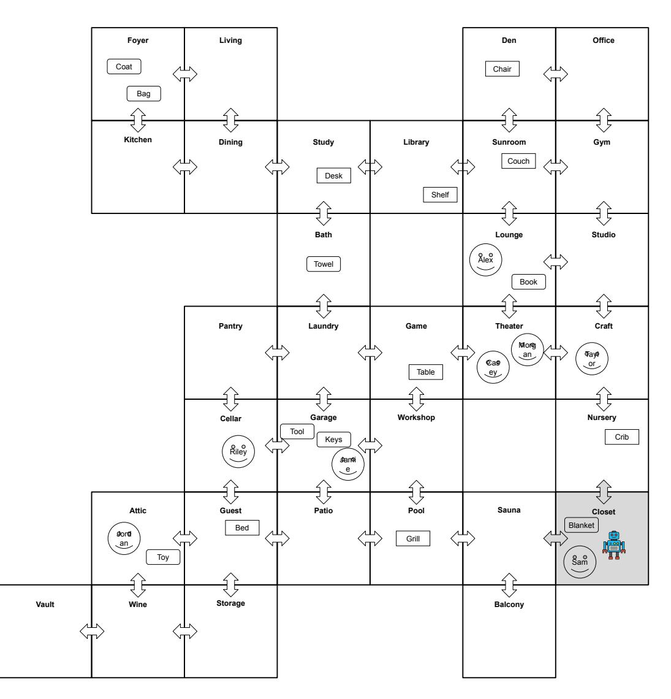
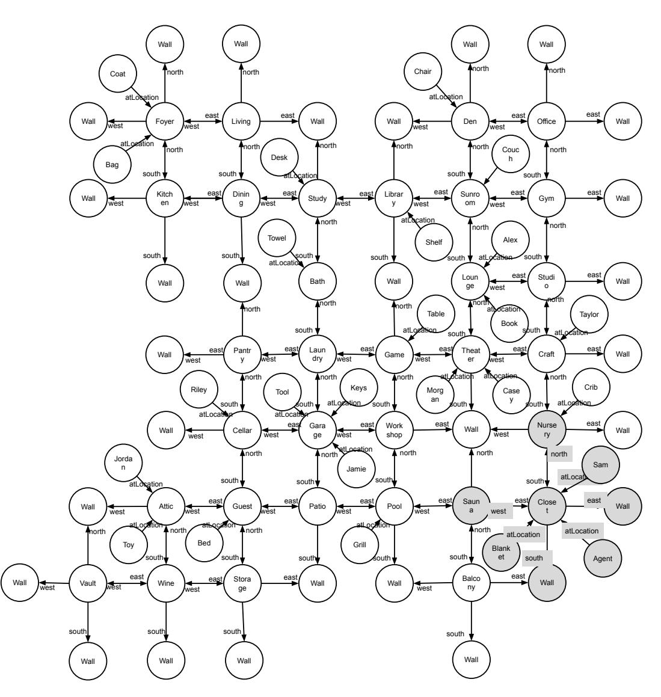
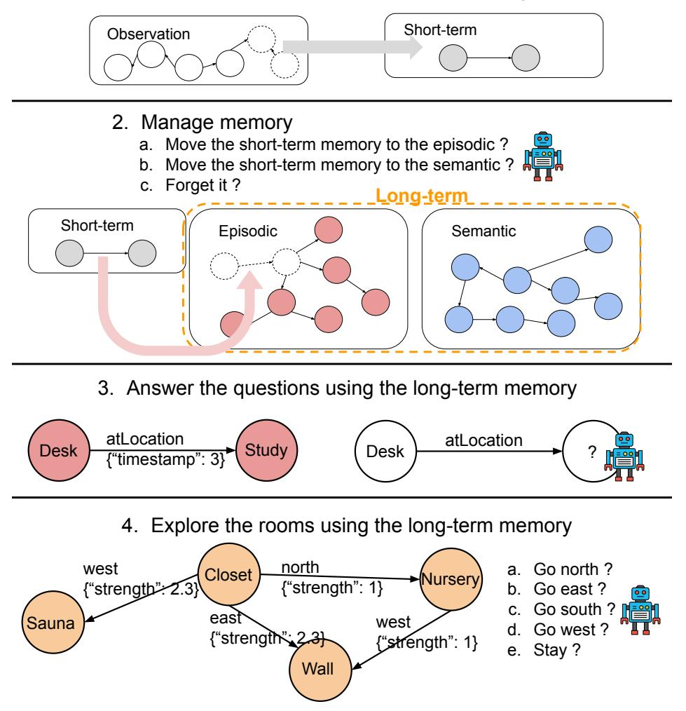
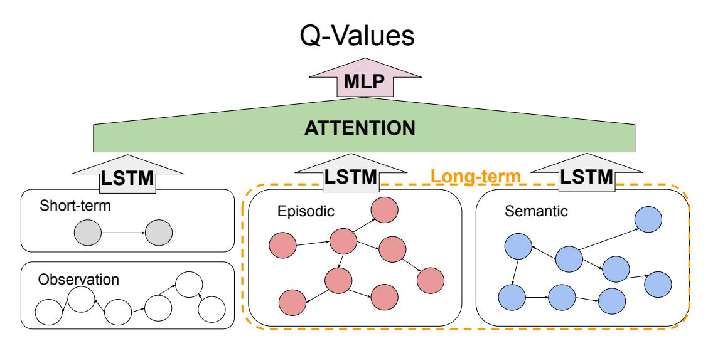
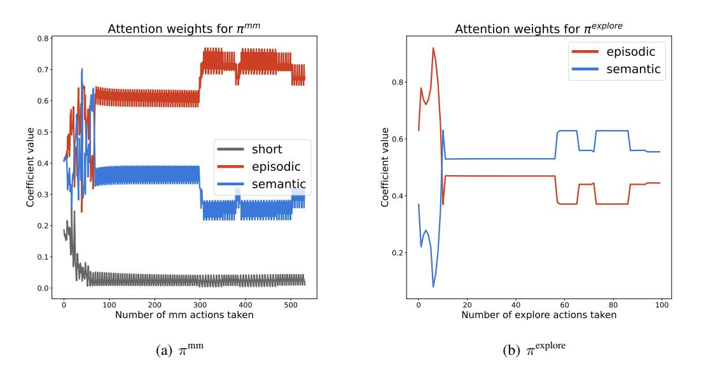
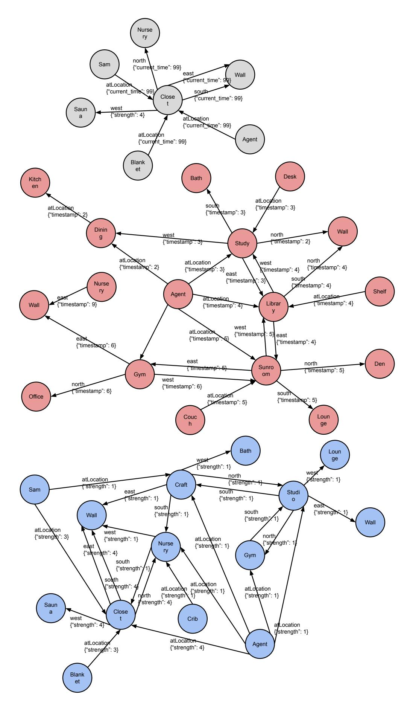

cite_key: kim_2024
title: Leveraging Knowledge Graph-Based Human-Like Memory Systems to Solve Partially Observable Markov Decision Processes
authors: Taewoon Kim, Michael Cochez
year: 2024
doi: 10.48550/arXiv.2408.05861
url: https://arxiv.org/abs/2408.05861
relevancy: High
downloaded: 'Yes'
tags:
- POMDP
- Knowledge Graphs
- Memory Systems
- Human-Like AI
- Cognitive Computing
tldr: AI can learn and utilize long-term memory through knowledge graph-based memory
  systems in partially observable environments.
date_processed: '2025-07-02'
phase2_processed: true
original_folder: kg_human_memory_systems_pomdp_2024
images_total: 6
images_kept: 6
images_removed: 0
keywords:
- agent-room-env
- graph-based
- human-like
- knowledge graph
- long-term
- machine-readable
- open-sourced
---

# Leveraging Knowledge Graph-Based Human-Like Memory Systems to Solve Partially Observable Markov Decision Processes

Taewoon Kim1 , Vincent Franc¸ois-Lavet1 , Michael Cochez1 ,

> 1Vrije Universiteit Amsterdam {t.kim, vincent.francoislavet, m.cochez}@vu.nl

## Abstract

Humans observe only part of their environment at any moment but can still make complex, long-term decisions thanks to our long-term memory. To test how an AI can learn and utilize its long-term memory, we have developed a partially observable Markov decision processes (POMDP) environment, where the agent has to answer questions while navigating a maze. The environment is completely knowledge graph (KG) based, where the hidden states are dynamic KGs. A KG is both human- and machine-readable, making it easy to see what the agents remember and forget. We train and compare agents with different memory systems, to shed light on how human brains work when it comes to managing its own memory. By repurposing the given learning objective as learning a memory management policy, we were able to capture the most likely hidden state, which is not only interpretable but also reusable. The code is open-sourced at [https://github.com/humemai/agent-room-env-v2-lstm.](https://github.com/humemai/agent-room-env-v2-lstm)

## TL;DR
AI can learn and utilize long-term memory through knowledge graph-based memory

## Key Insights  
Dynamic KGs represent hidden states in POMDP; enables human- and machine-readable memory tracking; demonstrates learning of memory management policies similar to human cognitive processes.

## 1 Introduction

The cognitive science theory suggests that humans have long-term memory [\(Tulving 1983,](#page-9-0) [1985;](#page-9-1) [Tulving and Thom](#page-9-2)[son 1973\)](#page-9-2). This allows humans to solve various tasks, although they can only observe the world partially. For example, when trying to navigate through a familiar city, humans rely on stored memories of the layout and landmarks. This enables the recall of past experiences, aiding in decisionmaking and problem-solving even when immediate sensory input is limited. Similarly, when answering a question, humans draw on long-term memory to retrieve relevant facts, concepts, and previous knowledge.

Although there have been many studies, we still lack a comprehensive understanding of how our long-term memory is managed. Research has identified mechanisms for encoding, storing, and retrieving memories, but the precise regulation and optimization of these processes remain unclear [\(Artuso and Palladino 2019;](#page-8-0) [Squire 2009\)](#page-9-3).

Understanding memory management is not only a fundamental question in cognitive science but also has significant implications for artificial intelligence (AI). By studying how humans efficiently encode, store, and retrieve information, we can develop more sophisticated AI systems that mimic these processes. AI agents that can manage long-term memory effectively are potentially better equipped to handle complex tasks that require recalling past information, adapting to new situations, and making informed decisions based on incomplete data. This motivation drives our research to create a controlled environment where we can systematically explore these memory management strategies in AI, ultimately aiming to bridge the gap between human cognitive processes and AI [\(Hassabis et al. 2017;](#page-8-1) [Lake et al. 2017\)](#page-9-4).

The contributions of this paper are as follows.

- KG-based Environment Design: We design and release a KG-based environment, compatible with Gymnasium [\(Towers et al. 2023\)](#page-9-5), where an agent has to answer questions while navigating a maze. This environment is highly configurable and offers various levels of complexity.
- Comparative Analysis of Memory Systems: We compare agents with different memory systems and discuss parallels with how human brains work when it comes to managing its own memory systems.
- Optimal Memory Management Policy: We show that the best agent is the one that repurposes the given learning objectives as learning a memory management policy, allowing itself to capture the most likely hidden state, which is not only interpretable but also reusable.

## 2 Background

## 1 A Machine With Human-Like Memory Systems

Recent advances in cognitive science and AI have inspired the development of machines with memory systems inspired by human memory. Kim et al. [\(Kim et al. 2022,](#page-9-6) [2023\)](#page-9-7) introduced an agent model that explicitly incorporates both semantic and episodic memory, demonstrating that such an agent outperforms those with only one type of long-term memory. Their environment is designed to challenge the agent's ability to encode, store, and retrieve memories effectively.

Both episodic and semantic memories are part of a human long-term memory system. Episodic memory pertains to the recollection of specific events and experiences that are tied to particular times and places. It involves personal memories that include contextual details about when and where they occurred. Semantic memory, on the other hand, deals with general world knowledge and facts that are not linked to specific occurrences. For example, knowing that Paris is the capital of France is a semantic memory, whereas recalling a visit to the Eiffel Tower involves episodic memory.

To computationally model memory, Kim et al. [\(Kim et al.](#page-9-6) [2022,](#page-9-6) [2023\)](#page-9-7) add relation qualifier key-value pairs to RDF (Resource Description Framework) triples to make them RDF quadruples [\(Lanthaler, Wood, and Cyganiak 2014;](#page-9-8) [Hartig et al. 2024\)](#page-8-2). For example, given a memory triple (Agent, atLocation, Library), they would turn this into something like (Agent, atLocation, Library, {timestamp: 42}), and (Agent, atLocation, Library, {strength: 2}), to turn them into episodic and semantic memories, respectively.

KGs are advantageous because they are both human- and machine-readable, facilitating the structured encoding, storing, and retrieving of information.

### 2 Reinforcement Learning (RL) in Partially Observable Markov Decision Process (POMDP)

RL is useful when supervision of every action is not feasible, such as in memory management. Solving an RL problem is often formalized as a Markov Decision Process (MDP) or a Partially Observable MDP (POMDP), which account for partial observability.

We consider an agent interacting with its environment over discrete time steps. The underlying dynamics of the environment is modeled as an MDP [\(Bellman 1957\)](#page-8-3), but the agent can only partially observe it, making it a POMDP [\(Astr](#page-10-0) ˚ om [1965;](#page-10-0) [Franc¸ois-Lavet et al. 2019\)](#page-8-4). It is de- ¨ fined by: (i) a state space S that is discrete or continuous; (ii) an action space A that is discrete or continuous; (iii) the environment's transition function T : S × A → P(S); (iv) the environment's reward function R : S × A → R that is either deterministic or stochastic; (v) an observation space Ω that is discrete or continuous; (vi) the observation model O : S × A → P(Ω); and (vii) a discount factor γ ∈ [0, 1). In our environment, S, A, and Ω, are discrete, T and O are stochastic, and R is deterministic.

Taking advantage of belief states can help solve POMDP problems. The environment starts in an initial state distribution. At time step t, the agent maintains a belief state bt, which is a probability distribution over the state space S. The agent then chooses an action at ∈ A based on its current belief state bt according to a policy π : B → P(A), where B denotes the belief space. After taking action at ∼ π(at | bt), the agent observes an observation ot+1 ∈ Ω. Using the observation ot+1 and the action at, the agent updates its belief state to bt+1.

The agent's objective is to choose a policy π that maximizes the cumulative discounted rewards:

$$
\max_{\pi} \mathbb{E}_{\pi} \left[ \sum_{t=0}^{\infty} \gamma^t r_t \right] \tag{1}
$$

where rt = R(st, at), at ∼ π(at | bt), st+1 ∼ T(st, at), and ot+1 ∼ O(ot+1 | st+1, at). The belief state bt+1(st+1) is updated using the current belief state bt, the action at, and the observation ot+1, along with the observation model O and the transition model T. The update is done by b ′ (s ′ ) = η O(o ′ | s ′ , a) P s T(s ′ | s, a)b(s), where O(o ′ | s ′ , a) is the observation likelihood, T(s ′ | s, a) is the transition model, and η is a normalizing constant.

Updating the belief state is computationally expensive because it involves maintaining a probability distribution over a potentially vast state space, requiring summing over all possible states while applying transition and observation probabilities. This process is further complicated by the need for the world model, i.e., the observation model and transition function.

A simple way to mitigate this computational expense, especially in the era of deep learning, is to use the history of the past τ observations h (τ) t = (ot−τ+1, . . . , ot) as the estimated state sˆt, with which we learn the policy π(at | ˆst). Although not perfect, this alleviates the need to maintain or update the belief state bt.

## 3 Methodology

## 1 The Rooms Environment

The Rooms Environment provides a simulation for evaluating AI agents with long-term memory. Unlike the previous work, this environment consists of multiple interconnected rooms, each containing various types of objects. Static objects, such as beds and tables, remain fixed in their locations and do not move. Independent objects, like Bob and Alice, move between rooms according to probabilistic rules that dictate their movements. Dependent objects, which cannot move by themselves, may be transported by independent objects with a certain probability that depends on the current state of the room. Finally, the agent represents the RL agent that navigates between rooms based on its exploration policy. This configuration allows for the study of how agents manage and utilize long-term memory to make decisions in a dynamic and partially observable environment.

In this environment, hidden states (st) are represented as dynamic KGs that capture the entire rooms and the locations of all objects within them. Each room and its contents form a sub-graph of this overall KG. Since the agent can only be present in one room at a time, it can only observe the objects within that particular room. This partial observability requires the agent to utilize its long-term memory.

A dynamic KG is defined as a directed graph G = (V, R, T , E). Here, V represents the set of entities, R the set of relations, T the set of (discrete) timestamps, and E ⊆ V ×R×V ×T the set of edges. Each edge in E is a tuple (vi , rk, vj , t) indicating that a relation rk exists from entity vi to entity vj at time t. This structure enables the graph to dynamically reflect the changes within V and E over time, under the governance of temporal rules.

Figure [1](#page-3-0) and [2](#page-4-0) show an example hidden state st and partial observation ot. In this example, there are 32 rooms, i.e., Office room, Kitchen, . . . , and 25 objects, i.e., Coat, Towel, . . . , Agent. Therefore, the number of all hidden states is |S| = N (Nobjects−Nstatic objects) rooms = 3225−8 ≈ 3.8 × 1025 , since every object is located in one of Nrooms and the static objects do not move. The number of possible subgraphs, i.e., partial observation, that the agent can observe is 2 (Nobjects−Nstatic objects) × Nrooms = 225−4 ≈ 6.7 × 107 , since the agent can either see or do not see an object in the room. Although the environment might look simple, we have a huge state space, which can be too much for typical table-based RL methods.

In this example, the partial observation (subgraph of the hidden dynamic KG) is { (Closet, north, Nursery), (Closet, east, Wall), (Closet, south, Wall), (Closet, west, Sauna), (Agent, atLocation, Closet), (Sam, atLocation, Closet) }. The hidden state is a much bigger KG that contains this sub-graph.

The exploration policy, π explore(a explore|ot), allows the agent to navigate through the room by taking one of five possible actions: North, East, South, West, or Stay. As the agent explores, the environment intermittently poses questions about the object locations. Consequently, the agent must not only learn an effective exploration policy, but also develop a robust question-answering function, answer = f qa(ot, question). The question-answering function also serves as the reward function: the agent receives a reward of +1 for each correctly answered question and 0 otherwise. Although straightforward, using ot for the exploration and question answering is not enough. Therefore, the agent should take advantage of its previous partial observations to form memory.

To maximize its rewards, π explore should guide the agent to spend more time in "informative" rooms, where the likelihood of encountering valuable information is higher. This is crucial because objects do not spend equal amounts of time in each room, meaning that not all sub-graphs are equally informative. Therefore, the agent needs to utilize its longterm memory to maintain and retrieve information about the maze layout and object locations, which is essential for both exploration and answering questions.

In this work, "question answering" is approached as a form of KG reasoning, specifically restricted to answering one-hop queries. These queries involve predicting the tail in a given RDF triple (s, r, ?), where s is the subject, r is the relation, and ? is the unknown tail. This type of reasoning involves traversing the graph from a known entity using a specified relation.

When the environment randomly samples objects to generate questions, not all objects have an equal probability of being sampled. This bias in sampling affects both the exploration policy and the question-answering function. The agent must account for this sampling bias by focusing its exploration on areas with a higher likelihood of being queried.

The environment randomly samples a triple from its current hidden state and turns it into a question. In our running example, for instance, (Phone, atLocation, Kitchen) and (Alice, atLocation, Library) can be selected and turned into (Phone, atLocation, ?) and (Alice, atLocation, ?), respectively.

The Rooms environment is highly configurable, allowing for a wide range of experimental setups. Researchers can adjust various parameters such as the question frequency, the total number of questions, the number of rooms, the room layout, the number and types of objects, and the number of steps per episode, etc. This flexibility enables the creation of diverse scenarios and difficulty levels.

## 2 Agents and Their Learning Objectives

Baseline The baseline agent utilizes the history of the past τ observations, denoted as h (τ) t = (ot−τ+1, . . . , ot), to represent the current estimated state sˆt. This approach is the most straightforward method. For the question-answering function f qa, the agent employs a simple strategy: use the most recent relevant memory to answer the question. This strategy assumes that the most recent observation contains the most accurate and relevant information for the question.

In this setup, solving the POMDP involves optimizing the exploration policy π explore(aexplore t | h (τ) t ). Thus, the "current state" for π explore is h (τ) t , and the "next state" is the updated h (τ) t+1, where the oldest observation is removed, and the new observation is added to the sequence.

HumemAI The agent with human-like memory systems (hereinafter HumemAI) introduces a function, f mm, "the memory management function". This agent has a memory system Mt, which includes both short-term and longterm memory components, Mshort t and Mlong t , respectively. The long-term memory is further divided into episodic (Mepisodic t ) and semantic (Msemantic t ).

f mm first transfers the current partial observation to the short-term memory system by adding the relation qualifier *current time*along with its value: Mshort t = ot ∪ {current time: t}. For example, (Agent, atLocation, Home Office) at t = 42 becomes (Agent, atLocation, Home Office, {current time: 42}). The function then determines whether this short-term memory should be (1) moved to the episodic part of the long-term memory, (2) moved to the semantic part, or (3) forgotten. If option (1) is selected, the short-term memory is stored in the episodic memory as (Agent, atLocation, Home Office, {timestamp: 42}). If (2) is chosen, it is stored as (Agent, atLocation, Home Office, {strength: 1}).

The "strength" term indicates the generalizability of this memory in the semantic memory system, with higher values representing repeated additions of the same memory. We also introduce an exponentially decaying factor for each semantic memory to ensure that all memories gradually weaken over time, allowing for continuous adaptation. The decaying of semantic memory is well studied in cognitive science [\(Rogers and Friedman 2008;](#page-9-9) [Milberg et al. 1999;](#page-9-10) [Silveri et al. 2018;](#page-9-11) [Catricala et al. 2015\)](#page-8-5). `

In essence, the long-term memory system is updated at each step according to the equation Mlong t = f mm(Mlong t−1 ,Mshort t , amm t ). The agent begins with an empty long-term memory and progressively updates it with each new observation.

We aim to learn the function f mm using RL. To achieve this, we "fix" the exploration policy π explore with a handcrafted function f explore, which directs the agent to "go to

<!-- Image Description: This diagram depicts a house layout, divided into rooms with directional arrows indicating movement between them. Each room contains labeled objects or occupants represented by small icons. The purpose is likely to illustrate a spatial reasoning or object location problem within the context of a robotics or AI paper, using the house as a simulated environment. The robot icon in the closet suggests a focus on robot navigation or task completion. -->

**Figure 1:** An illustration of a hidden state st (in white) and partial observation ot (in gray).

random rooms while avoiding walls, utilizing the long-term memory." For the question-answering function f qa, we use the strategy of "look up the most recent or the strongest relevant memory." By doing this, we have repurposed the original learning objective into learning the memory management policy π mm(a mm t |Mlong t−1 ,Mshort t ), where a mm t represents one of the three memory management actions. As for π mm, the "current state" is the current memory and the "next state" is the next memory. Figure [3](#page-5-0) shows the four steps involved in training.

The learning process involves two distinct phases. First, we focus on learning π mm(a mm t |Mlong t−1 ,Mshort t ). This phase ensures that the agent can effectively manage its long-term memory by deciding which observations to store as episodic or semantic memories, or which to forget. Once this is optimized, we proceed to the second phase, which involves learning the exploration policy π explore(a explore t |Mlong t ), by taking advantage of the function f mm learned in the first

["Riley", "atlocation", "Cellar", 99], ["Keys", "atlocation", "Garage", 99], ["Book", "atlocation", "Lounge", 99], ["Toy", "atlocation", "Attic", 99], ["Towel", "atlocation", "Bath", 99], ["Tool", "atlocation", "Garage", 99], ["Blanket", "atlocation", "Balcony", 99], ["Bag", "atlocation", "Foyer", 99] ]) phase. In this phase, the agent uses its long-term memory to make informed navigation decisions within the environment. Here, the "current state" for π explore is the current long-term memory Mlong t , and the "next state" is Mlong t+1, updated by Mlong t+1 = f mm(Mlong t ,Mshort t+1 , amm t+1)

An advantage of this two-phase approach is that the human-like long-term memory can effectively capture the most likely snapshot of the environment (the most likely hidden state). This enables the agent to make well-informed decisions on exploration and question-answering.

## 3 The Learning Algorithm

Given the discrete nature of the action spaces for both the baseline and the HumemAI agents, we opt for a value-based RL algorithm [\(Watkins and Dayan 1992\)](#page-10-1), i.e., DDQN [\(Hasselt, Guez, and Silver 2016\)](#page-9-12) instead of the vanilla DQN [\(Mnih et al. 2013\)](#page-9-13), to avoid the overestimation of state-action values. On top of that, we decouple

<!-- Image Description: The image is a directed graph representing a spatial knowledge base. Nodes represent locations (e.g., "Living Room," "Kitchen," "Garage") and objects ("Chair," "Desk"). Edges, labeled with directions (north, south, east, west), indicate spatial relationships between them. "atLocation" labels on some edges suggest object placement within locations. The graph likely serves to illustrate a spatial reasoning system or knowledge representation used in the paper. -->

**Figure 2:** A hidden state st (in white) and partial observation ot (in gray) represented as a KG.

value and advantage in the deep Q-networks (DQN), i.e., dueling network [\(Wang et al. 2016\)](#page-9-14), to generalize learning across actions. A stochastic gradient descent algorithm, Adam [\(Kingma and Ba 2015\)](#page-9-15), was used to minimize the temporal difference (TD):

$$
\mathcal{L}(\theta) = \mathbb{E}_{(s,a,r,s') \sim D} \left[ (y - Q(s,a;\theta))^2 \right]
$$
(2)

where

$$
y = r + \gamma Q(s', \arg\max_{a'} Q(s', a'; \theta); \theta^{-})
$$
(3)

In the above equations, L(θ) represents the TD loss function. (s, a, r, s′ ) are the state, action, reward, and next state, respectively, sampled from the replay buffer D. Q(s, a; θ) is the Q-value predicted by the current Q-network parameterized by θ. y is the target value computed using the reward r and the discounted maximum Q-value of the next state s ′ . γ is the discount factor. θ − represents the parameters of the target Q-network, which are periodically updated with θ.

The DQN receives as input eitherMt for HumemAI agent or h (τ) t for the baseline agent, and outputs the Q-values of the actions. This deep neural network involves KG embeddings (KGEs), LSTMs [\(Hochreiter and Schmidhuber 1997\)](#page-9-16), and MLPs [\(Sanger and Baljekar 1958\)](#page-9-17). Algorithm [1](#page-8-6) shows how a forward pass is made to compute the Q-values for the HumemAI agent.

The algorithm to compute the Q-values for the HumemAI agent is for one policy only. Since this agent learns two policies, i.e., π mm and π explore, the algorithm is repeated twice. All the weights are randomly initialized except one: θ LSTM explore is initialized with θ LSTM mm because we want to leverage the memory management knowledge already learned by the agent.

As for π mm, out of Nobservations observations within a given

1. Encode observation as short-term memory

<!-- Image Description: This image from an academic paper illustrates a memory management system. It uses diagrams to represent stages: 1) observation moving to short-term memory; 2) short-term memory transfer to episodic or semantic long-term memory (shown as node graphs); 3) querying long-term memory based on location and timestamp; and 4) pathfinding in a room graph using "strength" weighted edges to determine navigation decisions. The robot icons highlight agent interaction with the system. -->

**Figure 3:** A visualization of the four steps involved in training.

room, only one of them gets stored as a short-term memory at a time. This is because each quadruple (short-term memory) requires an action. In the end, all Nobservations of them will be moved to the episodic, semantic, or be forgotten, but they are done sequentially, not all at once.

The algorithm is simpler for the baseline agent, since it does not have different memory types and it just learns one exploration policy. It does not need scaling factors or attention.

KGE converts a symbolic KG into a list of learnable embeddings. Batch processing for the LSTM requires padding to ensure all samples are of equal length. Memories are ordered to help the LSTM discern the relative differences in qualifier values, such as which memories were stored earlier and which have higher strength values. The output of the LSTM is the final-hidden representation, which encapsulates the processed information from the sequence of memories. max val is the maximum number of steps in an episode, e.g., 100. s helps adjust the influence of different qualifiers based on their significance. A performs attention to weigh the contributions of different memory types. The dueling network architecture is integrated within the MLP. Figure [4](#page-6-0) shows the DQN architecture for the HumemAI agent.

## 4 Experiments

We evaluate with varying sizes of memory to see how it influences the performance. Additionally, for the HumemAI agent, we create two extra variants for ablation: one utilizing only an episodic memory and the other utilizing only semantic. This allows us to analyze the individual contributions of each memory type to the overall performance.

We designed the training setup to ensure fair comparison between all agents. HumemAI, trained in two phases, has about 85,000 learnable parameters and undergoes 100 training episodes per phase. The decaying factor semantic memory was set to 0.8. For parity, baseline agents have 170,000 learnable parameters and 200 training episodes. All other

<!-- Image Description: This diagram illustrates an attention-based model architecture for Q-value estimation. It uses three LSTM networks: one for short-term observations, and two for long-term memory (episodic and semantic). These LSTMs feed into an attention mechanism, which processes the information and outputs to a Multilayer Perceptron (MLP) that produces Q-values. The diagram visually depicts the information flow and the different memory types involved in the model. -->

**Figure 4:** Diagram of the DQN architecture for the HumemAI agent, illustrating the steps from memory as KGs to Q-value calculation. The Q-values can be for either memory management actions or exploration actions.

hyperparameters remain constant across agents. We select the best-performing model from training and runs in a separate test environment with a greedy policy. We ran in total of 5 runs. Table [1](#page-8-7) shows the overall results.

Table [1](#page-8-7) shows the superior performance of the HumemAI agent, especially those with both episodic and semantic memory. The two-phase training approach proves effective, with Phase 1 optimizing memory management and Phase 2 leveraging this to improve exploration. The HumemAI agents consistently outperform baselines across all memory capacities. Interestingly, longer observation histories for baseline agents do not necessarily improve performance, as seen with the capacity 192 baseline performing worse than the HumemAI agents with capacity 12. This suggests that longer histories may include irrelevant information or confuse the learning process. Training efficiency is also notable, with the HumemAI agent (capacity 48) requiring 40 minutes in total, while a baseline agent (capacity 48) took about 50 minutes on a single-CPU machine (AMD Ryzen 9 7950X 16-Core Processor). The exact details of the hyperparameters can be found in the supplementary material.

Figure [5](#page-7-0) illustrates the attention weights of π mm and π explore over time for the HumemAI agent with capacity 48. In [5\(a\),](#page-7-1) we observe a decrease in the agent's focus on short-term memory as the time passes, while attention to long-term memory increases. This shift is logical, given that the long-term memory starts empty at the beginning of an episode. Interestingly, for both π mm and π explore, the agent shows a preference change from the episodic to the semantic as the time passes. This indicates that the agent increasingly relies on semantic memory over time, likely because semantic memory encodes generalizable knowledge that becomes more valuable as the episode progresses.

Figure [6](#page-11-0) illustrates the agent's memory systems at the final time step of a test episode. It essentially captures the summarization of the hidden state, e.g., maze layout, object locations, etc. It can be seen that most of the episodic memories were captured in the beginning of the episode, while most of the semantic memories were captured in the later time horizon, confirming our attention analysis. This memory distribution demonstrates the agent's ability to adapt its storage strategy based on the nature of the information and its relevance to the task at hand.

## 5 Related Work

Our work stands at the intersection of cognitive science, KG, and RL, and while there has been significant research in each of these areas individually, there is relatively little work that combines them to address the challenges of POMDPs.

One thing to mention is that in RL, the term "episodic memory" is often used to refer to state-action pairs experienced by the agent, similar to the replay buffer used in DQN [\(Mnih et al. 2013\)](#page-9-13). However, this usage diverges from our approach, which adheres closely to the cognitive science definition of episodic memory introduced by Tulving et al. [\(Tulving 1983,](#page-9-0) [1985;](#page-9-1) [Tulving and Thomson 1973\)](#page-9-2), emphasizing its recency property.

The cognitive architectures like ACT-R [\(Anderson 2007\)](#page-7-2) and Soar [\(Laird 2012\)](#page-9-18) offer comprehensive frameworks for understanding human memory systems and their applications in AI agents, yet they fall short in providing computational methods for training RL agents with these memory systems. Extensions of these frameworks, such as the work by Gorski and Laird [\(Gorski and Laird 2011\)](#page-8-8) and Li [\(Li](#page-9-19) [2020\)](#page-9-19), focus on learning episodic memory retrieval within these architectures, though they do not leverage KGs or sophisticated RL techniques.

Memory-based RL approaches, such as those by Ming et al. [\(Meng, Gorbet, and Kulic 2021\)](#page-9-20) and Lin et al. [\(Lin](#page-9-21) ´ [et al. 2018\)](#page-9-21), add memory components to address partial observability and sample efficiency, respectively. Lin et al. use episodic memory to regularize DQN, but differs from our method by not leveraging KGs for interpretability and longterm memory management.

<!-- Image Description: The image displays two line graphs visualizing attention weights over time for two different policies, πmm and πexplore. Graph (a) shows the "short," "episodic," and "semantic" attention weights changing over the number of πmm actions. Graph (b) shows "episodic" and "semantic" weights for πexplore actions. The graphs illustrate the evolution of attention weight values across different policy types and actions, likely to demonstrate the model's learning process or behavior. -->

**Figure 5:** Attention weights of π mm and π explore, respectively, over time for the HumemAI agent with capacity = 48

In a similar vein, Han et al. [\(Han et al. 2019\)](#page-8-9) integrate RL with memory systems to improve questionanswering performance. However, their memory system lacks the structured, interpretable nature of KGs, relying instead on numeric embeddings. Demir [\(Demir 2023\)](#page-8-10) introduces memory-modifying actions and intrinsic motivation to guide memory retention in partially observable environments, focusing on event sequences without employing KGs.

Young et al. [\(Young, Sutton, and Yang 2018\)](#page-10-2) and Hu et al. [\(Hu et al. 2021\)](#page-9-22) propose methods for maintaining episodic memory through reservoir sampling and generalizable episodic memory representations, respectively. These approaches aim to improve RL performance by conditioning policy networks on past experiences, but they do not address the structured nature of KGs or the human-like episodicsemantic memory systems utilized in our work.

Incorporating KGs into RL has primarily focused on KG reasoning [\(Wan et al. 2020;](#page-9-23) [Das et al. 2018;](#page-8-11) [Xiong, Hoang,](#page-10-3) [and Wang 2017;](#page-10-3) [Wang et al. 2022;](#page-9-24) [Park et al. 2022\)](#page-9-25), where the goal is to learn to reason about the relationships between entities. These works typically use current triples or concatenated visited triples as state representations, differing from our approach that constructs and updates a dynamic KG as part of the agent's state representation. The actions in KG reasoning involve selecting outgoing edges from the current node, whereas our actions include memory management and navigation based on the KG state.

Several works use KGs as prior knowledge to enhance RL performance. Hopner et al. [\(Hopner, Tiddi, and van Hoof](#page-9-26) ¨ [2022\)](#page-9-26) improve sample efficiency by leveraging KGs, while Piplai et al. [\(Piplai et al. 2020\)](#page-9-27) guide exploration using KGs. Chen et al. [\(Chen et al. 2022\)](#page-8-12) employ RL to learn rule mining within KGs. These approaches highlight the benefits of integrating KGs with RL but do not focus on the human-like memory systems or the partially observable environments that our work addresses.

## 6 Conclusion

We introduced an approach to solving POMDPs by leveraging KG-based human-like memory systems. We developed the Rooms Environment with varying levels of complexity, where agents navigate and answer questions based on partial observations. We compared a baseline agent with observation history to the HumemAI agent, which incorporates episodic and semantic memory. Results show that our agent that aims to capture the most likely hidden state outperforms the baseline.

There is room for improvement in our paper. For example, jointly learning memory management and exploration policies could yield better performance. Additionally, exploring other function approximators, such as graph neural networks (GNNs), might offer improvements over the currently used LSTM. Transitioning from handcrafted question-answering functions to learning them directly could also be beneficial.

## 7 Acknowledgments

This research was (partially) funded by the Hybrid Intelligence Center, a 10-year program funded by the Dutch Ministry of Education, Culture and Science through the Netherlands Organization for Scientific Research, [https://](https://www.hybrid-intelligence-centre.nl/) [www.hybrid-intelligence-centre.nl/.](https://www.hybrid-intelligence-centre.nl/)

## References

Anderson, J. R. 2007.*How Can the Human Mind Occur in the Physical Universe?*Oxford University Press. ISBN 9780195324259.

## Algorithm 1: A forward pass to compute the Q-values

Input: A memory system M; the maximum qualifier value for normalization, max val; the learnable parameters including the embedding matrix E, scaling factors for the relation qualifiers s, and θ LSTM, θ MLP , θ key , θ query , θ value . Output: The Q-values.

### 1: Step 1: Convert Memory System to KGE

- 2: for all memory type i ∈ {short, episodic, semantic} do
- 3: KGE(M(i) ) ← [] // initialize as an empty list
- 4: M(i) sorted ← M(i) sorted by qualifier value.

5:**for all**$$
(h, r, t, key-value pair) \in M_{sorted}^{(i)}
$$
**do**- 6: normalized ← value
- max val 7: Append E[h] + E[r] + E[t] + (E[key] × normalized × s[key]) to KGE(M(i) )
- 8: end for
- 9: end for
- 10:

11: Step 2: Obtain LSTM-based Representations

12: for all memory type i ∈ {short, episodic, semantic} do

13: h (i) ← LSTM(KGE(M(i) ))

- 14: end for
- 15: Stack the column vectors h (i) horizontally to form the matrix H = [h short , h episodic , h semantic] T .
- 16:
- 17: Step 3: Compute Attention Weights 18: Q, K,V ← QueryNet(H), KeyNet(H), ValueNet(H) 19: A ← softmax(QKT ) 20: 21: Step 4: Attention-weighted Summation 22: vmem ← ( P i (AV )i,:) T 23: 24: Step 5: Calculate Q-values 25: Q(M, a) ← MLP(vmem, a; θ MLP) 26: 27: return Q(M, a)

Artuso, C.; and Palladino, P. 2019. Long-term memory effects on working memory updating development.*PLOS ONE*, 14: e0217697.

Bellman, R. 1957. A Markovian Decision Process. *Journal of Mathematics and Mechanics*, 6(5): 679–684.

Catricala, E.; Della Rosa, P. A.; Plebani, V.; Perani, D.; Gar- ` rard, P.; and Cappa, S. F. 2015. Semantic feature degradation and naming performance. Evidence from neurodegenerative disorders. *Brain and Language*, 147: 58–65. Epub 2015 Jun 11.

Chen, L.; Jiang, S.; Liu, J.; Wang, C.; Zhang, S.; Xie, C.; Liang, J.; Xiao, Y.; and Song, R. 2022. Rule mining over knowledge graphs via reinforcement learning. *Knowledge-Based Systems*, 242: 108371.

Das, R.; Dhuliawala, S.; Zaheer, M.; Vilnis, L.; Durugkar, I.; Krishnamurthy, A.; Smola, A.; and McCallum, A. 2018. Go for a Walk and Arrive at the Answer: Reasoning Over

| Capacity | Agent Type | Phase 1 | Phase 2 |
|----------|-------------|-----------|-----------|
| 12 | HumemAI | 105 (±37) | 160 (±30) |
| | HumemAI (E) | 191 (±42) | 194 (±29) |
| | HumemAI (S) | 111 (±43) | 124 (±65) |
| | Baseline | N/A | 144 (±14) |
| 24 | HumemAI | 127 (±26) | 214 (±64) |
| | HumemAI (E) | 227 (±21) | 209 (±30) |
| | HumemAI (S) | 98 (±45) | 112 (±79) |
| | Baseline | N/A | 138 (±52) |
| 48 | HumemAI | 118 (±18) | 235 (±37) |
| | HumemAI (E) | 201 (±42) | 225 (±25) |
| | HumemAI (S) | 192 (±13) | 226 (±97) |
| | Baseline | N/A | 200 (±15) |
| 96 | Baseline | N/A | 155 (±77) |
| 192 | Baseline | N/A | 144 (±68) |

**Table 1:** Average test episode rewards (±σ) for various agent types and capacities, after 5 random seeded runs. Capacity denotes the maximum number of memories stored. HumemAI (E) is only with episodic, while (S) is only with semantic. The best performing agent per capacity is in bold. The Phase 1 column represents the phase where we learn π mm while f explore remains fixed with a heuristic. Phase 2 denotes the phase where we learn π explore while f mm is the neural network learned from Phase 1. One episode consists of 100 steps, where each step involves 10 random questions, resulting in a total of 1,000 questions. Although a theoretical maximum episode reward is 1,000, this is unattainable in practice, as the agent cannot maintain a complete hidden state in its memory throughout the entire episode.

Paths in Knowledge Bases using Reinforcement Learning. In *International Conference on Learning Representations*.

Demir, A. 2023. Learning what to memorize: Using intrinsic motivation to form useful memory in partially observable reinforcement learning. *Applied Intelligence*, 53(16): 19074–19092.

Franc¸ois-Lavet, V.; Rabusseau, G.; Pineau, J.; Ernst, D.; and Fonteneau, R. 2019. On overfitting and asymptotic bias in batch reinforcement learning with partial observability. *Journal of Artificial Intelligence Research*, 65: 1–30.

Gorski, N. A.; and Laird, J. E. 2011. Learning to use episodic memory. *Cognitive Systems Research*, 12(2): 144– 153. The 9th International Conference on Cognitive Modeling. Manchester, UK, July 2009.

Han, M.; Kang, M.; Jung, H.; and Hwang, S. J. 2019. Episodic Memory Reader: Learning What to Remember for Question Answering from Streaming Data. In *Proceedings of the 57th Annual Meeting of the Association for Computational Linguistics*, 4407–4417. Florence, Italy: Association for Computational Linguistics.

Hartig, O.; Seaborne, A.; Kellogg, G.; and Champin, P.-A. 2024. RDF 1.2 Concepts and Abstract Syntax. W3C working draft, W3C. Https://www.w3.org/TR/2024/WD-rdf12 concepts-20240307/.

Hassabis, D.; Kumaran, D.; Summerfield, C.; and Botvinick,

M. 2017. Neuroscience-Inspired Artificial Intelligence. *Neuron*, 95: 245–258.

Hasselt, H. v.; Guez, A.; and Silver, D. 2016. Deep Reinforcement Learning with Double Q-Learning. In *Proceedings of the Thirtieth AAAI Conference on Artificial Intelligence*, AAAI'16, 2094–2100. AAAI Press.

Hochreiter, S.; and Schmidhuber, J. 1997. Long Short-Term Memory. *Neural Comput.*, 9(8): 1735–1780.

Hopner, N.; Tiddi, I.; and van Hoof, H. 2022. Leveraging Class Abstraction for Commonsense Reinforcement Learning via Residual Policy Gradient Methods. In Raedt, L. D., ed., *Proceedings of the Thirty-First International Joint Conference on Artificial Intelligence, IJCAI-22*, 3050–3056. International Joint Conferences on Artificial Intelligence Organization. Main Track.

Hu, H.; Ye, J.; Zhu, G.; Ren, Z.; and Zhang, C. 2021. Generalizable Episodic Memory for Deep Reinforcement Learning. In Meila, M.; and Zhang, T., eds., *Proceedings of the 38th International Conference on Machine Learning*, volume 139 of *Proceedings of Machine Learning Research*, 4380–4390. PMLR.

Kim, T.; Cochez, M.; Francois-Lavet, V.; Neerincx, M.; and Vossen, P. 2022. A Machine With Human-Like Memory Systems.

Kim, T.; Cochez, M.; Francois-Lavet, V.; Neerincx, M.; and Vossen, P. 2023. A Machine with Short-Term, Episodic, and Semantic Memory Systems. *Proceedings of the AAAI Conference on Artificial Intelligence*, 37(1).

Kingma, D.; and Ba, J. 2015. Adam: A Method for Stochastic Optimization. In *International Conference on Learning Representations (ICLR)*. San Diega, CA, USA.

Laird, J. E. 2012. *The Soar Cognitive Architecture*. The MIT Press. ISBN 0262122960.

Lake, B. M.; Ullman, T. D.; Tenenbaum, J. B.; and Gershman, S. J. 2017. Building machines that learn and think like people. *Behavioral and Brain Sciences*, 40: e253.

Lanthaler, M.; Wood, D.; and Cyganiak, R. 2014. RDF 1.1 Concepts and Abstract Syntax. W3C recommendation, W3C. Https://www.w3.org/TR/2014/REC-rdf11-concepts-20140225/.

Li, J. 2020. Integrating Declarative Long-Term Memory Retrievals into Reinforcement Learning. In *Eighth Annual Conference on Advances in Cognitive Systems*.

Lin, Z.; Zhao, T.; Yang, G.; and Zhang, L. 2018. Episodic Memory Deep Q-Networks. In *Proceedings of the 27th International Joint Conference on Artificial Intelligence*, IJ-CAI'18, 2433–2439. AAAI Press. ISBN 9780999241127.

Meng, L.; Gorbet, R.; and Kulic, D. 2021. Memory- ´ Based Deep Reinforcement Learning for POMDPs. In *2021 IEEE/RSJ International Conference on Intelligent Robots and Systems (IROS)*, 5619–5626. IEEE Press.

Milberg, W.; Mcglinchey-Berroth, R.; Duncan, K.; and Higgins, J. A. 1999. Alterations in the dynamics of semantic activation in Alzheimer's disease: Evidence for the Gain/Decay hypothesis of a disorder of semantic memory. *Journal of the International Neuropsychological Society*, 5: 641 – 658. Mnih, V.; Kavukcuoglu, K.; Silver, D.; Graves, A.; Antonoglou, I.; Wierstra, D.; and Riedmiller, M. A. 2013. Playing Atari with Deep Reinforcement Learning. *CoRR*, abs/1312.5602.

Park, S.-J.; Chae, D.-K.; Bae, H.-K.; Park, S.; and Kim, S.-W. 2022. Reinforcement Learning over Sentiment-Augmented Knowledge Graphs towards Accurate and Explainable Recommendation. In *Proceedings of the Fifteenth ACM International Conference on Web Search and Data Mining*, WSDM '22, 784–793. New York, NY, USA: Association for Computing Machinery. ISBN 9781450391320.

Piplai, A.; Ranade, P.; Kotal, A.; Mittal, S.; Narayanan, S. N.; and Joshi, A. 2020. Using Knowledge Graphs and Reinforcement Learning for Malware Analysis. In *2020 IEEE International Conference on Big Data (Big Data)*, 2626– 2633.

Rogers, S.; and Friedman, R. 2008. The underlying mechanisms of semantic memory loss in Alzheimer's disease and semantic dementia. *Neuropsychologia*, 46: 12–21.

Sanger, T.; and Baljekar, P. N. 1958. The perceptron: a probabilistic model for information storage and organization in the brain. *Psychological review*, 65 6: 386–408.

Silveri, M.; Brita, A.; Liperoti, R.; Piludu, F.; and Colosimo, C. 2018. What is semantic in semantic dementia? The decay of knowledge of physical entities but not of verbs, numbers and body parts. *Aphasiology*, 32: 1009 – 989.

Squire, L. R. 2009. Memory and Brain Systems: 1969–2009. *Journal of Neuroscience*, 29(41): 12711–12716.

Towers, M.; Terry, J. K.; Kwiatkowski, A.; Balis, J. U.; Cola, G. d.; Deleu, T.; Goulao, M.; Kallinteris, A.; KG, A.; Krim- ˜ mel, M.; Perez-Vicente, R.; Pierre, A.; Schulhoff, S.; Tai, ´ J. J.; Shen, A. T. J.; and Younis, O. G. 2023. Gymnasium.

Tulving, E. 1983. *Elements of Episodic Memory*. Oxford University Press.

Tulving, E. 1985. Memory and consciousness. *Canadian Psychology/Psychologie canadienne*, 26(1): 1.

Tulving, E.; and Thomson, D. M. 1973. Encoding specificity and retrieval processes in episodic memory. *Psychological Review*, 80: 352–373.

Wan, G.; Pan, S.; Gong, C.; Zhou, C.; and Haffari, G. 2020. Reasoning Like Human: Hierarchical Reinforcement Learning for Knowledge Graph Reasoning. In Bessiere, C., ed., *Proceedings of the Twenty-Ninth International Joint Conference on Artificial Intelligence, IJCAI-20*, 1926–1932. International Joint Conferences on Artificial Intelligence Organization. Main track.

Wang, X.; Liu, K.; Wang, D.; Wu, L.; Fu, Y.; and Xie, X. 2022. Multi-Level Recommendation Reasoning over Knowledge Graphs with Reinforcement Learning. In *Proceedings of the ACM Web Conference 2022*, WWW '22, 2098–2108. New York, NY, USA: Association for Computing Machinery. ISBN 9781450390965.

Wang, Z.; Schaul, T.; Hessel, M.; Van Hasselt, H.; Lanctot, M.; and De Freitas, N. 2016. Dueling Network Architectures for Deep Reinforcement Learning. In *Proceedings of the 33rd International Conference on International Conference* *on Machine Learning - Volume 48*, ICML'16, 1995–2003. JMLR.org.

Watkins, C. J. C. H.; and Dayan, P. 1992. Q-learning. *Machine Learning*, 8(3): 279–292.

Xiong, W.; Hoang, T.; and Wang, W. Y. 2017. DeepPath: A Reinforcement Learning Method for Knowledge Graph Reasoning. In Palmer, M.; Hwa, R.; and Riedel, S., eds., *Proceedings of the 2017 Conference on Empirical Methods in Natural Language Processing*. Copenhagen, Denmark: Association for Computational Linguistics.

Young, K. J.; Sutton, R. S.; and Yang, S. 2018. Integrating Episodic Memory into a Reinforcement Learning Agent using Reservoir Sampling. *CoRR*, abs/1806.00540.

Astr ˚ om, K. 1965. Optimal control of Markov processes ¨ with incomplete state information. *Journal of Mathematical Analysis and Applications*, 10(1): 174–205.

<!-- Image Description: The image displays a directed graph, likely representing a spatial-temporal knowledge graph. Nodes represent locations (e.g., "Bath," "Office," "Study") and agents ("Sam," "Nurse"). Edges depict movements or interactions, labeled with direction ("north," "east") and timestamps or "strength" values. The graph's purpose is to illustrate the relationships between locations and agents over time, potentially for reasoning or pathfinding within a specific environment. The two distinct node colors might indicate different types of entities. -->

**Figure 6:** An example of the agent's (HumemAI with capacity = 48) memory systems, Mt=99. There are 7 short-term, 24 episodic, and 24 semantic memories. The nodes are colored differently by the memory type.

## Metadata Summary
### Research Context
- **Research Question**: How can AI learn and utilize long-term memory similar to human cognitive processes in partially observable environments?
- **Methodology**: Developed POMDP environment with KG-based hidden states; agents navigate maze and answer questions; repurposed learning objective as memory management policy learning; compared agents with different memory systems.
- **Key Findings**: Demonstrated AI can learn memory management policies; captured most likely hidden states through KG representation; provided interpretable and reusable memory state tracking.

### Analysis
- **Limitations**: Abstract lacks specific performance metrics; evaluation details limited; scalability considerations not addressed.
- **Future Work**: Further exploration of memory systems in AI agents; optimize KG structures for different tasks; develop benchmarks for memory-based POMDP solving.