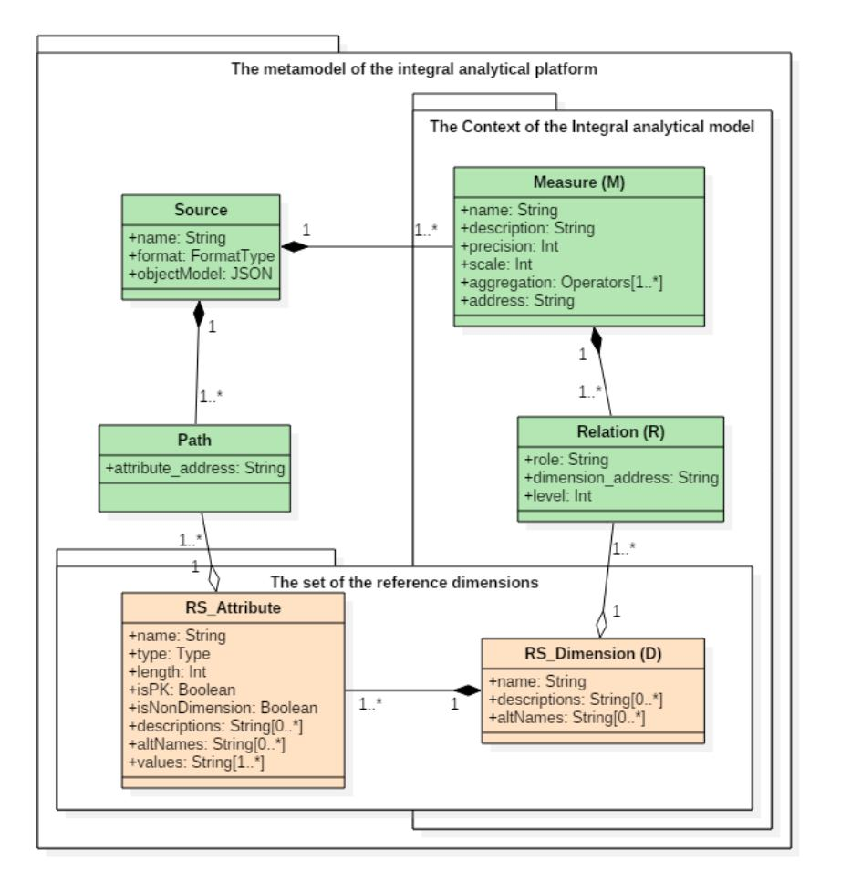

# Matching disparate dimensions for analytical integration of heterogeneous data sources

Anna Korobko Department of Applied Computer Science ICM SB RAS Krasnoyarsk, Russia gglhroom@gmail.com

Aleksei Korobko Department of Applied Computer Science ICM SB RAS Krasnoyarsk, Russia agoook@gmail.com

## ABSTRACT

The paper presents the first steps towards an authorial integration methodology for heterogeneous data. Exposing information from multiple heterogeneous data sources demands a global (mediated) schema. We need a model to couple with the mismatches between schemata of different sources and to provide uniform access to the data. The virtual global schema is apparently more convenient for assembling big data sources because of useless time consumption during the processes of materialization and synchronization. Thus, an integral analytical model has been proposed as the global schema of heterogeneous data sources. The suggested model provides virtual integration of complex and diverse information for further analytical processing. It combines the original multidimensional design and lattice structure according to the formal conceptual analysis. The main goal of the paper is to suggest an approach to automatic mapping between the schemata of the disparate data sources and virtual integral analytical model with human moderation.

### CCS CONCEPTS

• Information systems➝Data management systems • Middleware for databases ➝ Data federation tools.

#### KEYWORDS

Analytical Data Integration; OLAP; FCA; Heterogeneous Data; Semantic Analysis.

#### ACM Reference format:

Anna Korobko, Aleksei Korobko. 2019. Matching disparate dimensions for analytical integration of heterogeneous data sources. In *Proceedings of the 11th International Conference on Management of Digital EcoSystems (MEDES'19). ACM, New York, NY, USA, 7 pages.*https://doi.org/10.1145/3297662.3365809

© 2019 Copyright is held by the owner/author(s). Publication rights licensed to ACM.

ACM ISBN 978-1-4503-6238-2/19/11…\$15.00 https://doi.org/10.1145/3297662.3365809

#### 1 Introduction

The growth of computer science and technology provides an increasing volume of accumulated information. Surprisingly, it is an enormous opportunity. In modern economy, information should be the prime asset: raw material for new products and services, smarter decisions, competitive advantages for companies, and larger growth and productivity [25]. The enhancement of the on-line analytical processing (OLAP) of the accumulated data becomes a more important issue for advanced decision-making support.

The main trends in modern business intelligence are merging internal and external enterprise data and democratizing OLAP technology. The goal is to broaden analytical (i.e. informational) base and to increase the availability of OLAP tools for users. As a rule, the problem of analytical integration of diverse sources is solved through physical data consolidation, design and creation of the data warehouse (DW). However, modern leading researchers have proposed several approaches for the development of OLAP technology. The first suggested approach is Self-service Business Intelligence. It reduces requirements for the user skills [5]. The second one is Exploratory OLAP. It supports ad-hoc arbitrary query execution [2,22]. The conceptual description of these approaches opens a way for further studies and provides a lot of possibilities for developing. These approaches allow creating tools and methods to provide automatization of routine data preprocessing and intelligence support of arbitrary user query construction over complex data.

The main issue of the data pre-processing is reconciliation and integration of heterogeneous sources for the analysis. For this purpose, modern researchers unanimously emphasize the need for constructing a global (or mediated) model for uniform access to data [6,24]. According to OLAP the cornerstone metamodel is a multidimensional cube. It is used for modeling [14], storage [19,33,38], query processing[11,29], interaction between independent systems [9,42] and, of course, for heterogeneous data integration [1]. The extract-transformation-load (ETL) process is perhaps the most common way of data integration over a multidimensional paradigm [37]. However, this implies physical integration. By doing this, it is difficult to tackle the problem of information overload. It requires highly experienced modelers and designers to compare a wide variety of domain artifacts.

Permission to make digital or hard copies of part or all of this work for personal or classroom use is granted without fee provided that copies are not made or distributed for profit or commercial advantage and that copies bear this notice and the full citation on the first page. Copyrights for third-party components of this work must be honored. For all other uses, contact the owner/author(s). MEDES '19, November 12–14, 2019, Limassol, Cyprus

The virtual global schema began gaining popularity a few years ago[17]. Nowadays, researchers tend to seek for alternatives to the multidimensional cube model. Ontology is proposed for information disclosure in integrated data [7,26], as a virtual global schema. The integral analytical model (IAM) of a data source [23] is suggested in the "virtual schema" approach. This approach combines the best features of the multidimensional view, which is more essential for analytical processing, and those of the lattice representation, providing great opportunities for clustering compound data sources and information retrieval. The goal of IAM is to unify access to a set of autonomous and heterogeneous data sources in a flexible and efficient manner.

The central topic of the research is reconciliation and merging of heterogeneous sources for further on-line analytical processing. The paper is aimed at addressing the problem of development of the original integration methodology for heterogeneous data based on IAM. One of the important stages of integrating data is to bridge the gap between the schemata of diverse sources. Hence, the paper is devoted to the development of a solution in order to overcome the data heterogeneity and automatic data integration. We have reviewed the best experience in integrating data and combined them, considering the IAM features.

The paper is organized as follows. In Section 2, we consider the validation of the classical multidimensional model and propose an original simplified multidimensional view for heterogeneous data sources. Section 3 presents the main idea of automatic data integration based on a set of reference dimensions of the integral analytical model. In Section 4, we suggest an algorithm for matching disparate dimensions and illustrate it in the case of collaborative analytical processing of XML-data of the All-Russian website of procurement over the relational data of The Local System of procurement.

#### 2 MULTIDIMENSIONAL MODEL

First of all, OLAP provides multidimensional logical views of data to facilitate the analysis [35] according to the requirements of Codd [10]. OLAP demonstrates the ability to analyze large amounts of data by providing intuitive views along multiple dimensions of the problem. In this context, the dimensionality of data and that of a decision problem refer to the parameters of the problem domain which have bearing on the specific decision problem. OLAP provides multidimensional data structures and aggregation techniques for the fast and intuitive execution of complex analytical queries [39]. The multidimensional view provides a technical basis for the on-line analysis [15].

Multidimensional models categorize data either as facts with the associated numerical measures or as textual dimensions, characterizing the facts. Queries aggregate measure values over a range of dimension values to provide results such as the total sales per month of a given product [30]. A multidimensional cube model (data cube) represents facts with n dimensions by points in an n-dimensional space. A point (a fact) is identified by the values of dimensions and has an associated set of measures [4]. In the case of a retail business, a purchase would be a fact and the purchase amount and price would be measures; the type of product being bought, the purchase time and location would be dimensions.

The problem of constructing a multidimensional model [40] has successfully been solved by many researchers since 1998, both for structured data storage formats [38] and for semi-structured ones [3]. Most of the existing studies are devoted to the implementation of the multidimensional model to build data warehouses for a specific domain or for a distinct enterprise [28], as well as to the combination of multiple sources of primary data[29]. A significant shortcoming is the requirement of physical consolidation of data [12] and involvement of a specialist to design a common storage scheme [13]. This limitation does not allow the technology to adapt to an explosive growth of the volume of available information [36] and to provide a "hot" integration of new data sources.

A novel idea appeared in 2010 [20], which is to use the formal concept analysis (FCA) for constructing an analytical model. The proposed approach allows one to construct a lattice of OLAPcubes for one source [8]. The lattice describes all possible analytical combinations which do not contradict the requirements of integrity and consistency of the data scheme. Moreover, all the OLAP-cubes are dense over the data source owing to the FCA capability of clustering. In [21,32] the method of constructing the analytical model was proposed, with the study being supported by the Russian Foundation for Basic Research. The model was referred to as a conceptual OLAP-model.

The research was continued in [22]. It formally describes the process of building a conceptual OLAP-model for heterogeneous sources, which is referred to as an integral analytical model (IAM). The integral model, as an algebraic lattice, provides the intelligence support of analytical processing of consolidated data and prompts all possible analytical combinations to the user over the merged data sources [16]. The key requirement of the FCA applicability is representation information as a binary matrix – the so-called context. Originally, the pairs <object, attribute> are represented as a context. We suggest considering measures as objects and dimensions as attributes. While the classical multidimensional model groups the measures as facts, we cannot get a link to each measure separately. Also, direct straight access to analytical artifacts, such as a measure or a dimension, is needed for the execution of the user queries. Thus, a simplified multidimensional model has been proposed.

Throughout the remainder of the paper we will use the term "simplified multidimensional model" (SMM) for a triplet , where is a set of the dimensions, - a set of the measures of the source and is a relation of analytical compatibility of the dimensions with the measures. The relation of comparability R between and (described by ) indicates that the dimension can be processed with the measure in the analytical query. The triplet depicts only main parts of SMM without details concerning practical realization.

A distinct feature of SMM is an independent representation of the analytical concepts. Thus, each element of the XML document and each column of the table is represented as an atomic artifact of the analysis. The independent view of the analytical concepts enables one to construct a binary integral context to implement the FCA "magic".

However, it is not enough to support the exploratory queries, including heterogeneous measures and aspects of the analysis. Querying to the integral analytical model requires several additional properties for the analytical concept. These features are associated with the format and way of data storage. The method of matching SMMs is also required.

### 3 SET OF REFERENCE DIMENSIONS OF THE INTEGRAL ANALYTICAL MODEL

The efficiency of solving the problem of merging of diverse SMMs depends on the choice of the matching paradigm (policy). An advantage of using the paradigm of virtual integration model is that the mediated schema requires only specifying mappings between the data sources and the mediated schema rather than between each pair of the data sources [6]. As mentioned above, the multidimensional model is used for designing data warehouse architecture. Therefore, to find a proper way to match the integral model with the integrated SMMs it is useful to consider the most common approach to designing the data warehouse for miscellaneous data integration.

Ralph Kimball proposed the bus architecture [18] which is to create a bus of dimension-tables corresponding to the main analytic aspects of the studied area, and a set of views or fact tables which make reference to these classifiers. These dimensions must be conformed and have a unique interpretation and representation to be shared in DW [4]. To construct a contextualized DW the same approach is taken in [34]. The authors extract the dimension values from unstructured contents of documents and match the documents with the corporate facts characterized by the same dimension values in a stationary DW. This architecture provides quick access to data and ability to collectively analyze measures associated with different facts. All these benefits are important for the integral analytical model which combines heterogeneous sources as well.

With the efficiency of integrating the heterogeneous data in mind, the most appropriate way to merge data is to find common dimensions. The intersection of different subject areas under the common aspects of the analysis gives us the desired analytical freedom to compare measures characterizing the studied object from different viewpoints. The dimensions presented, as a rule, by references and classifiers, have a fixed set of descriptive characteristics and a restricted set of possible values. Here, we suggest not to match the measures from the diverse data sources as a numerical characteristic of the studied objects with possibly common dimensions. The properties of dimensions allow us to speak about automatic comparison and integration of heterogeneous data. Several additional attributes are suggested in order to specify the Simplified multidimensional model. The class diagram for the metamodel of the integral analytical model is represented using the UML notation (Figure 1).

The extension of SMM is presented as a part of the metamodel of the integral analytical model. It describes the semantic content and diversity of the dimension features. The set of dimensions of SMM is represented as the class "RD\_Dimension". The class "Measure" corresponds to the set of the measures and the class "Relation" is the relation from the SMM triplet. Together they constitute the metamodel of SMM as well as the context of the integral analytical model. The prefix "RD" is aimed at emphasizing that these classes are concerned with the common dimensions for the integrated sources and represent a set of the reference dimensions. As soon as in different schemes of the integrated data storages the dimensions have a different set of properties and a different structure, the class "RD\_Attribute" is added. Other classes strictly correspond to the sources.

Since we intend to integrate disparate data sources with different formats along with semi-structured data, it is important to consider that algorithms disclosing analytical artifacts can mesh structural elements with various names and descriptions. Therefore, the features "altNames" and "descriptions" are included into the classes "RD\_Dimension" and "RD\_Attribute". The cardinality of the type shows a possible number of items in the sets. Besides, the class "RD\_Attribute" has an important Boolean feature "isNonDimension" which defines the analytical type of the dimension attribute. According to classical multidimensional philosophy a dimension can have several attributes. Some of them are dimensional – the main features of the analytical aspect (name of a customer, for example) which is used for the OLAP operations like "slice-and-dice". However, others are non-dimensional, serving as additional information (address, phone number, etc.). The rest of the class features are secondary.

The task of the analysis of municipal procurement is considered as a case study demanding simultaneous analysis of heterogeneous data. According to the Russian Federal Law for supplying municipal needs the Official All-Russian website of procurement (zakupki.gov.ru) has been developed. It consolidates municipal demands, ongoing purchases and contracts all over the country. It sends and receives data in XML format according to the predefined XSD schemas. We treat it as a semi-structured data source. Otherwise, the Local System of procurement makes up municipal demand orders and a scheduled plan of purchases using Oracle DBMS to store data and metadata. It is an example of a relational data source. If someone is to trace a certain purchase from a demand order to a contract or to analyze some supplier activity, he needs to integrate these heterogeneous data.

<!-- Image Description: This image presents a class diagram depicting the metamodel of an integral analytical platform. It shows entities like `Source`, `Measure`, `Relation`, `RS_Attribute`, and `RS_Dimension`, with their attributes defined (e.g., name, type, address). Relationships between entities are illustrated using cardinality notations (e.g., 1, 1.*, 1..*). The diagram clarifies the structure and relationships within the platform's data model. -->
**Figure 1. The class diagram for the metamodel of the integral analytical model**The proposed metamodel of IAM is implemented using the model-driven development paradigm [27]. The models from the lower levels represent a metadata storage structure and consider a special aspect of the program realization of the theoretical approach. The next step of the current study is to develop a means for matching the dimensions of an integrated data source and a set of the reference dimensions of the integral analytical model.

### 4 ALGORITHM FOR MATCHING DISPARATE DIMENSIONS

There are several important statements on the analytical integration of the disparate data sources: (1) we are only looking for common dimensions in SMMs; (2) we aim at finding correspondence between the dimensions of a new data source and reference dimensions of IAM; (3) we use semantic information about the dimensions we have collected from the primary data sources. At the current state of research, matching disparate dimensions is conducted based on their names, alternative names and descriptions. The proposed algorithm is represented as Python code in Figure 2. The implementation uses open source libraries for data structures, converting a collection of raw documents to a matrix of TF-IDF features (with 3-grams option) [41] and computing the cosine similarity between the samples [31].

The main idea of the algorithm is to pairwise compare the reference dimensions and dimensions of the integrated data source. At first, we calculate the similarity scores for dimensions names as plain texts (words) (Figure 2 line 56). As a result, we obtain a matrix of scores. Further, we calculate the similarity scores matrix for all the pairs of alternative names of each pair of the compared dimensions (Figure 2 line 63). Then, we add the maximum similarity score for the alternative names to the similarity score for the names of dimensions. So, the pairwise estimation of the dimension similarity becomes complex. In addition, we calculate the similarity scores matrix for the dimension descriptions and add the best score to the complex score of the pairwise similarity (Figure 2 line 71).
**Figure 2. The algorithm of matching disparate dimensions as Python code**The algorithm was tested in the case of comparing two sets of dimensions: those derived from XSD-file and relational database structure. The fragment of matching the dimensions of the Official All-Russian website as related to contracts and that of the Local System of procurement for customer's demands is shown in Figure 3.

The table presents a set of reference dimension names in rows and a set of new source dimension names in columns. It should be mentioned that the row dimensions are from the relational data source and the column dimensions are from the XSD-document. In both cases, the dimension names may include English words, an abbreviation of English expressions, reduced consonant combinations and a transliteration of Russian abbreviations. For example, OKEI is a transliteration of the Russian abbreviation for the All-Russian Classifier of Units. Here, RQRT is a designation for Requirement. In the case of this study, we have to deal with various rules for naming elements of the original storage scheme.

The proposed algorithm compares names, alternative names and descriptions of the dimensions. As a result, the algorithm forms a matrix of assessments of their similarity (scores). Now, we need to find a similar reference dimension to each new dimension if possible. We propose to define the similar reference dimension as a column with maximum similarity score in the matrix raw corresponded with the integrated dimension. Additionally, we need to establish a threshold for the similarity scores to consider. The value of the similarity score should be bigger than 0.5 or else we do not use it.

| dim                                      |             |             | dosageOKEI extrabudget fundsBudgetLevel | <b>KTRU</b>             | OKEI        | <b>OKTMO</b> | status      |
|------------------------------------------|-------------|-------------|-----------------------------------------|-------------------------|-------------|--------------|-------------|
| <b>ANALOGGR</b>                          | 0,075714473 | 0,066156531 |                                         |                         | o           | Ω            | о           |
| <b>DISTRICT</b>                          | 0,046348895 | 0,006732722 |                                         | 0,0394366 0,035303059   | n           | Ω            |             |
| <b>FOKEI</b>                             | 0,358797982 | 0,01791478  |                                         | 0,412855646 0,016622445 | 0,600247262 | Ω            |             |
| <b>INVENTORY</b>                         | 0,086677437 | 0,076713541 | 0,031254768                             |                         |             |              |             |
| <b>INVENTORYCLAS</b>                     | 0,079837526 | 0,087132604 |                                         |                         |             |              |             |
| MО                                       | 0,24328418  | 0,049134583 |                                         | 0,090844615 0,136437031 | 0           | 0,28128348   |             |
| <b>MOSTATUS</b>                          |             |             | 0,117758738                             |                         |             | 0            | 0,649865971 |
| <b>OKVEDII</b>                           | 0,083387743 |             | 0,079441378                             | 0                       | 0,116803614 | 0,094769586  |             |
| <b>PERIODICITY</b>                       | 0,020592262 | 0,018761423 | 0,033678585                             |                         |             |              |             |
| <b>PRCACTIVITY</b>                       | 0,027313537 | 0,024424091 |                                         | 0,154308497 0,046220713 |             |              | o           |
| !!!!!!!!!!!!!!!!!!!!!!!!!!!!!!!!!!!!!!!! | 0           | 0,02996114  |                                         | 0,055017793             |             |              | o           |
| <b>PRCSUBACTIVITY</b>                    | 0           | 0,005850749 | 0,126651055                             | 0,093047148             | 0           | Ω            | 0           |
| <b>PRIVILEGESPR</b>                      | 0           | 0,03822991  | 0                                       | 0,017442206             | 0           | 0            | 0           |
| <b>RQRT</b>                              | 0           | 0           | 0,026500806                             | 0,019843723             | 0           | Ω            | 0           |
| <b>RQRT OBJ</b>                          |             |             |                                         |                         |             |              | Ω           |
| TMO                                      | 0,190356579 | 0,037284036 | 0,041143256                             | 0,126145659             | 0           | 0,471499251  | o           |
| <b>UO</b>                                | 0,130430805 | 0,049439185 |                                         | 0.088507343             | n           |              | Ω           |
**Figure 3. The fragment of the score matrix for similarity of dimensions**It our example, the set of reference dimensions includes the XSD schema dimensions because this source was first integrated into IAM. And, there is the dimension "OKEI" in the set of reference dimensions. Then, according to the proposed approach, we want to integrate data from the Local System of procurement into IAM. There is the dimension "FOKEI" in the new integrated relational source. So, proposed algorithm shows that the pairs (MOSTATUS, status) and (FOKEI, OKEI) have the significant similarity score. Thus, we make a conclusion that they can be merged and treated as a common (shared) dimension for two heterogeneous sources. Of course, the results of matching dimensions should be affirmed by human before committing. The new dimension of the set of reference dimensions will contain descriptions and alternative names of both similar elements. Other new dimensions will be added into the set of reference dimensions of IAM. The proposed algorithm allows us to integrate the schemata of disparate data sources and construct the virtual integral analytical model with shared dimensions.

#### 5 CONCLUSION

The research has been done to develop a new integration methodology for heterogeneous data based on IAM. The review of the existing approaches allows us to justify the choice of the virtual integrating schema and multidimensional representation. The integral analytical model and simplified multidimensional model are clearly described as the theoretical background. The matching policy for SMMs, the reference dimensions and, finally, the algorithm of matching disparate dimensions are suggested. SMM has been developed and presented to facilitate the formation of the context for the lattice of the OLAP-cubes, namely IAM. The proposed matching policy supports mappings between the data sources and IAM using only their dimensions. The reference dimension accumulates the names, alternative names and descriptions of one aspect of the analysis from diverse sources. The algorithm proposed in this study integrates OLAP, FCA and methods of semantic analysis to reconcile and merge heterogeneous sources using additional textual features of the dimensions (alternative names and descriptions). The implementation uses open source libraries for data structures, converting a collection of raw documents to a matrix of TF-IDF features (with the 3-grams option) and computing the cosine similarity between the samples.

The presented findings are new because of new initial conditions of the research, namely the new integration methodology used. The obtained result is a small step towards developing the solution for overcoming the data heterogeneity and automatic data integration. Moreover, it is the opportunity to support the exploratory analysis of heterogeneous resources in a self-service way. The present study strengthens the theory for the proposed approach. It becomes the formal foundation for automatic merging of heterogeneous sources, formation of IAM and support for the online execution of arbitrary user queries.

The obtained results show the importance of further research and development of intelligence merging algorithms. The further study will address the intellectualization of matching the dimension attributes and the development of the user interface to support the user queries to IAM.

### REFERENCES

- [1] Alberto Abelló, Jérôme Darmont, Lorena Etcheverry, Matteo Golfarelli, Jose-Norberto Mazón, Felix Naumann, Torben Pedersen, Stefano Bach Rizzi, Juan Trujillo, Panos Vassiliadis, and Gottfried Vossen. 2013. Fusion Cubes: towards self-service Business Intelligence.*Int. J. Data Warehous. Min.*9, 2 (2013), 66– 88. DOI:https://doi.org/10.4018/jdwm.2013040104
- [2] Alberto Abelló, Oscar Romero, Torben Bach Pedersen, Rafael Berlanga, Victoria Nebot, María José Aramburu, and Alkis Simitsis. 2015. Using semantic web technologies for exploratory OLAP: A survey.*IEEE Trans. Knowl. Data Eng.*27, 2 (February 2015), 571–588. DOI:https://doi.org/10.1109/TKDE.2014.2330822
- [3] S Abiteboul, P Buneman, and D Suciu. 1999. Data on the Web: from relations to semistructured data and XML. (1999), 258. DOI:https://doi.org/10.978.1558606/227
- [4] Antonio Albano. 2015. Decision Support Databases Essentials.*Univ. Pisa, Dep. Comput. Sci.*(2015), 138. Retrieved April 30, 2019 from

http://pages.di.unipi.it/ghelli/bd2/DWessential.pdf

- [5] Paul Alpar and Michael Schulz. 2016. Self-Service Business Intelligence.*Bus. Inf. Syst. Eng.*58, 2 (2016), 151–155. DOI:https://doi.org/10.1007/s12599-016- 0424-6
- [6] Doan AnHai, Halevy Alon, and Ives Zachary. 2012.*Principles of Data Integration*. Elsevier. DOI:https://doi.org/10.1016/C2011-0-06130-6
- [7] Michael Benedikt, Bernardo Cuenca Grau, and Egor V. Kostylev. 2018. Logical foundations of information disclosure in ontology-based data integration. *Artif. Intell.*262, (2018), 52–95. DOI:https://doi.org/10.1016/j.artint.2018.06.002
- [8] Garrett Birkhoff and Saunders Mac Lane. 1998.*A survey of modern algebra*. AK Peters/CRC Press.
- [9] DT Chang. 2000. Common Warehouse Metamodel (CWM), UML and XML. *Vor. auf Meta Data Conf. (March 19-23, 2000)*(2000), 56.
- [10] EF Codd and SB Codd. 1993. Providing OLAP (on-line analytical processing) to user-analysts: An IT mandate.*Codd Date*(1993).
- [11] Claudia Diamantini, Domenico Potena, and Emanuele Storti. 2018. Multidimensional query reformulation with measure decomposition.*Inf. Syst.*78, (2018), 23–39. DOI:https://doi.org/10.1016/j.is.2018.05.002
- [12] Henrique José Rosa Dias. 2018. Augmenting data warehousing architectures with hadoop.
- [13] Ayoub Elotmani and Pr. Halima Bouden. 2017. Automating the Conceptual Modeling of Data Warehouse in Information System ERP Type.*Trans. Mach. Learn. Artif. Intell.*5, 4 (2017). DOI:https://doi.org/10.14738/tmlai.54.3330
- [14] MATTEO GOLFARELLI, DARIO MAIO, and STEFANO RIZZI. 1998. the Dimensional Fact Model: a Conceptual Model for Data Warehouses.*Int. J. Coop. Inf. Syst.*07, 02n03 (1998), 215–247. DOI:https://doi.org/10.1142/S0218843098000118
- [15] Jiawei Han. 2013. OLAP Mining: An Integration of OLAP with Data Mining. In*Data Mining and Reverse Engineering*. 3–20. DOI:https://doi.org/10.1007/978-0-387-35300-5\_1
- [16] Dilshod Ibragimov, Katja Hose, Torben Bach Pedersen, and Esteban Zimányi. 2014. Towards Exploratory OLAP over Linked Open Data–A Case Study. *Enabling Real-Time Bus. Intell.*(2014), 1–18. DOI:https://doi.org/10.1007/978- 3-662-46839-5\_8
- [17] Pradeeban Kathiravelu, Ashish Sharma, Helena Galhardas, Peter Van Roy, and Luís Veiga. 2018. On-demand big data integration: A hybrid ETL approach for reproducible scientific research.*Distrib. Parallel Databases*September (2018). DOI:https://doi.org/10.1007/s10619-018-7248-y
- [18] Ralph Kimball and Margy Ross. 2011.*The data warehouse toolkit: the complete guide to dimensional modeling*. John Wiley & Sons.
- [19] Ralph Kimball and Margy Ross. 2013. *The Data Warehouse Toolkit, The Definitive Guide to Dimensional Modeling*. DOI:https://doi.org/10.1145/945721.945741
- [20] A.V. Korobko and T.G. Penkova. 2010. On-line analytical processing based on formal concept analysis. In *Procedia Computer Science*. DOI:https://doi.org/10.1016/j.procs.2010.04.259
- [21] A.V. Korobko, T.G. Penkova, V.V. Nicheporchuk, and A.S. Mihalev. 2013. The integral OLAP-model of the emergency risk estimation in the case of Krasnoyarsk region. In *2013 36th International Convention on Information and Communication Technology, Electronics and Microelectronics, MIPRO 2013 - Proceedings*.
- [22] Anna Korobko. 2016. Technology of Exploratory OLAP Based on the Integral Analytical Model. *Adv. Intell. Syst. Res.*133, (2016), 43–47.
- [23] Anna KOROBKO and Aleksei KOROBKO. 2017. Multidimensional Design from XML Sources for the Integral Analytical Model.*DEStech Trans. Comput. Sci. Eng.*aiie (2017).
- [24] Michael Mireku Kwakye, Iluju Kiringa, Herna Lydia Viktor, and Herna L Viktor. 2014.*Merging Multidimensional Data Models: A Practical Approach for Schema and Data Instances*. Retrieved April 29, 2019 from https://www.researchgate.net/publication/236861867
- [25] Steve Lohr. 2011. When There's No Such Thing as Too Much Information. *New York Times*Aprill 23 (2011).
- [26] Silverio Martínez-Fernández, Petar Jovanovic, Xavier Franch, and Andreas Jedlitschka. 2018. Towards Automated Data Integration in Software Analytics. (2018). DOI:https://doi.org/10.1145/3242153.3242159
- [27] Omg and Object Management Group. 2014. Object Management Group, Model Driven Architecture (MDA).*OMG Doc. ormsc/2014-06-01*2.0, June (2014), 1– 15. DOI:https://doi.org/ormsc/10-09-06
- [28] Sellappan Palaniappan and Cs Ling. 2008. Clinical decision support using

OLAP with data mining.*IJCSNS Int. J. Comput. Sci. Netw. Secur.*8, 9 (2008), 290–296. Retrieved from http://paper.ijcsns.org/07\_book/200809/20080942.pdf

- [29] Juan Manuel Pe, Berlanga Rafael, Maria Jose Aramburu, and Torben Bach Pederson. 2008. Integrating Data Warehouses with Web Data : A Survey.*IEEE Trans. Knowl. Data Eng.*20, 7 (2008), 940–955. DOI:https://doi.org/10.1109/TKDE.2007.190746
- [30] Torben Bach Pedersen and C. S. Jensen. 2001. Multidimensional database technology.*Computer (Long. Beach. Calif).*34, 12 (2001). DOI:https://doi.org/10.1109/2.970558
- [31] Fabian Pedregosa FABIANPEDREGOSA, Vincent Michel, Olivier Grisel OLIVIERGRISEL, Mathieu Blondel, Peter Prettenhofer, Ron Weiss, Jake Vanderplas, David Cournapeau, Fabian Pedregosa, Gaël Varoquaux, Alexandre Gramfort, Bertrand Thirion, Olivier Grisel, Vincent Dubourg, Alexandre Passos, Matthieu Brucher, Matthieu Perrot andÉdouardand, andÉdouard Duchesnay, and FRÉdouard Duchesnay EDOUARDDUCHESNAY. 2011.*Scikit-learn: Machine Learning in Python Gaël Varoquaux Bertrand Thirion Vincent Dubourg Alexandre Passos PEDREGOSA, VAROQUAUX, GRAMFORT ET AL. Matthieu Perrot*. Retrieved May 3, 2019 from http://scikitlearn.sourceforge.net.
- [32] T. Penkova and A. Korobko. 2013. *Constructing the integral OLAP-model for scientific activities based on FCA*. DOI:https://doi.org/10.1007/978-3-642- 37343-5\_17
- [33] T.G. Penkova, A.V. Korobko, V.V. Nicheporchuk, and L.F. Nozhenkova. 2016. On-line control of the state of technosphere and environment objects in Krasnoyarsk region based on monitoring data. *Int. J. Knowledge-Based Intell. Eng. Syst.*20, 2 (2016). DOI:https://doi.org/10.3233/KES-160330
- [34] Juan Manuel Pérez, Rafael Berlanga, María José Aramburu, and Torben Bach Pedersen. 2005.*A Relevance-Extended Multi-dimensional Model for a Data Warehouse Contextualized with Documents*. Retrieved April 29, 2019 from http://www.ischool.drexel.edu/faculty/song/dolap/dolap05/paper/p19-perez.pdf
- [35] Rahul Singh, Victoria Y. Yoon, and Richard T. Redmond. 2002. Integrating Data Mining and On-line Analytical Processing for Intelligent Decision Systems. *J. Decis. Syst.*11, 2 (2002), 185–204. DOI:https://doi.org/10.3166/jds.11.185-204
- [36] Uthayasankar Sivarajah, Muhammad Mustafa Kamal, Zahir Irani, and Vishanth Weerakkody. 2017. Critical analysis of Big Data challenges and analytical methods.*J. Bus. Res.*70, (2017), 263–286. DOI:https://doi.org/10.1016/j.jbusres.2016.08.001
- [37] David Taniar and Li Chen. 2011. Integrations of Data Warehousing, Data Mining and Database Technologies.*Innov. approaches*(2011). DOI:https://doi.org/10.4018/978-1-60960-537-7
- [38] Olivier Teste. 2010. Towards Conceptual Multidimensional Design in Decision Support Systems.*Architecture*04, (2010). Retrieved from http://arxiv.org/abs/1005.0224
- [39] Erik Thomsen. 2002.*OLAP Solutions: Building Multidimensional Information Systems (Google eBook)*. Wiley. Retrieved April 30, 2019 from https://books.google.ru/books?hl=ru&lr=&id=eskZA1CFdqMC&oi=fnd&pg=P R9&dq=OLAP+Solutions:+Building+Multidimensional+Information+Systems &ots=W4\_qkKwdLj&sig=AIrNmisMl7wrlJeePfXLu\_1bI2Y&redir\_esc=y#v=o nepage&q=OLAP Solutions%3A Building Multidimensional Infor
- [40] Nectaria Tryfona, Frank Busborg, and Gottfried Vossen. 1999. Conceptual data warehouse design. *Dol. 99 Proc. 2nd ACM Int. Work. Data Warehous. Ol.*(1999), 3–8. DOI:https://doi.org/10.1145/319757.319776
- [41] Esko Ukkonen. 1992. Approximate string-matching with q-grams and maximal matches.*Theor. Comput. Sci.*92, 1 (1992), 191–211.
- [42] Jovan Varga, Oscar Romero, Torben Bach Pedersen, and Christian Thomsen. 2018. Analytical metadata modeling for next generation BI systems.*J. Syst. Softw.* 144, (2018), 240–254. DOI:https://doi.org/10.1016/j.jss.2018.06.039
