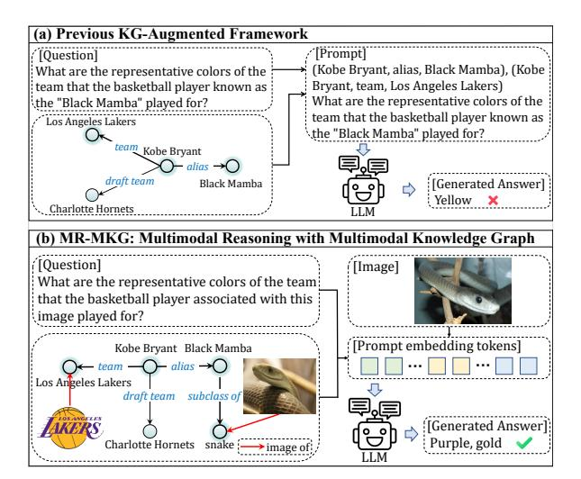
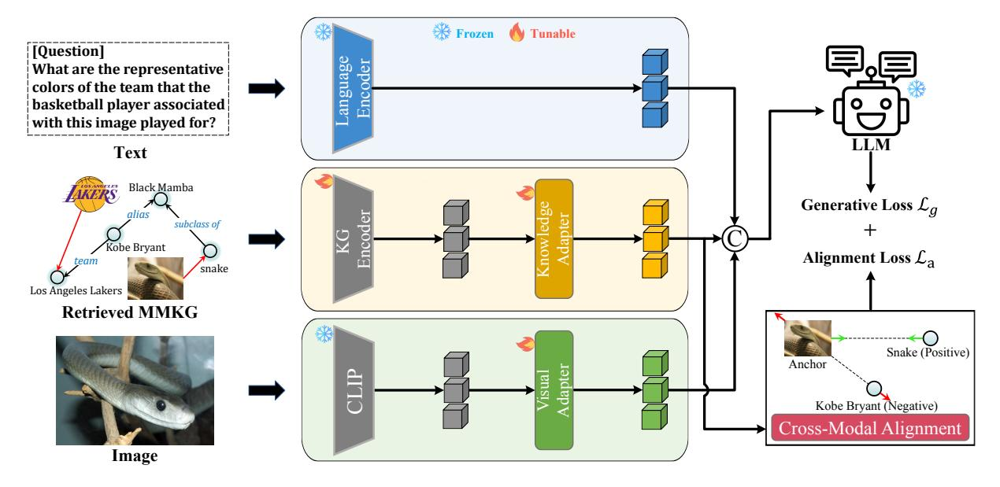
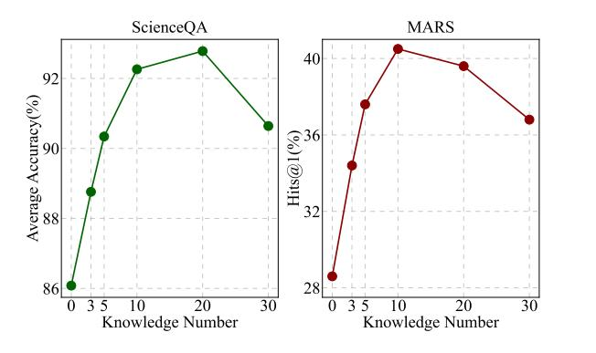
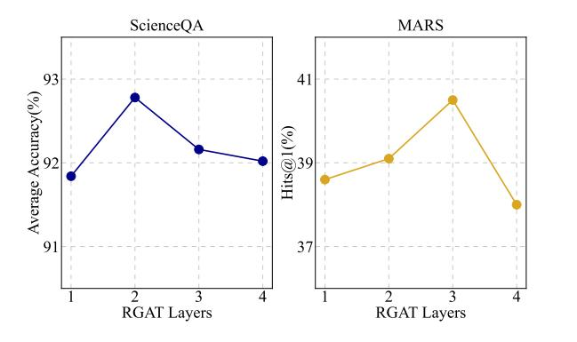
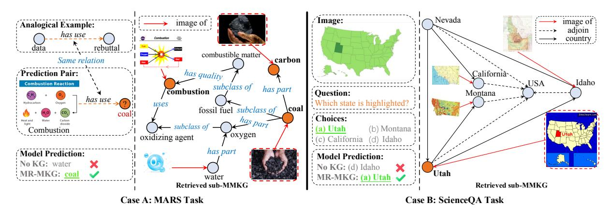
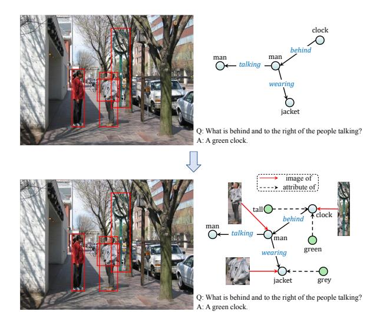
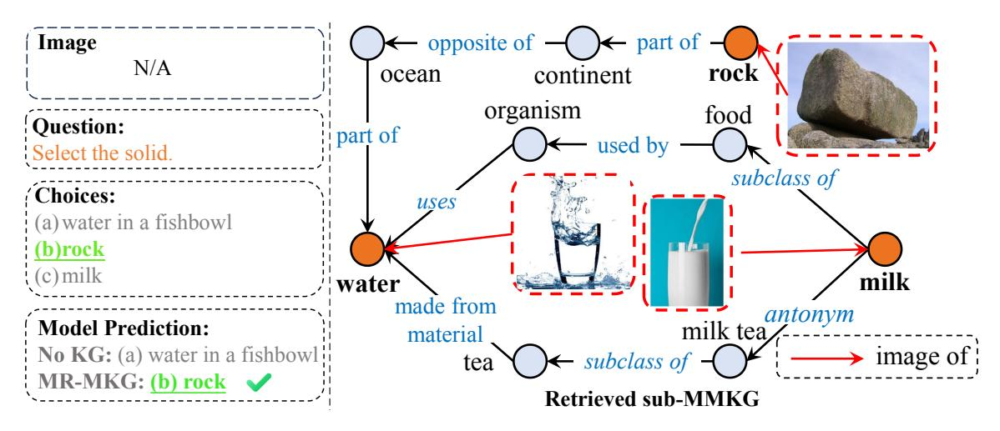
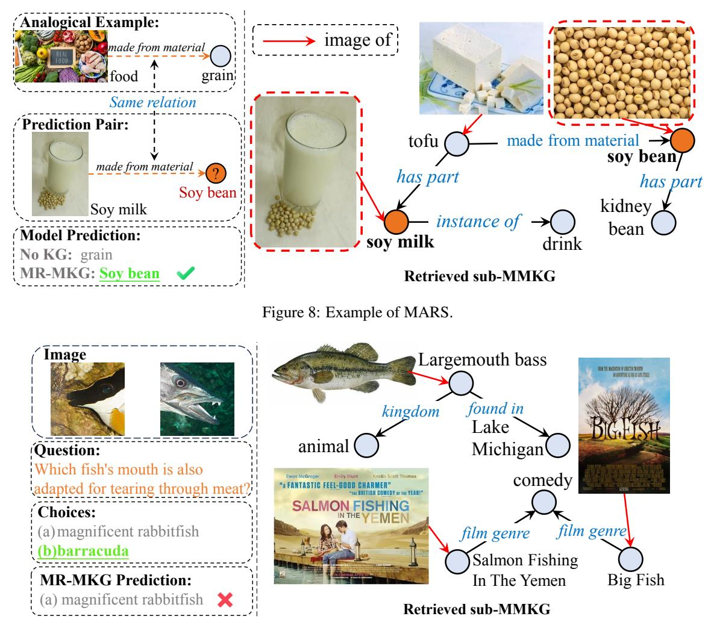

# arXiv:2406.02030v1 [cs.CL] 4 Jun 2024

# Multimodal Reasoning with Multimodal Knowledge Graph

Junlin Lee1 Yequan Wang2 Jing Li1∗ Min Zhang1 1Harbin Institute of Technology, Shenzhen, China 2Beijing Academy of Artificial Intelligence, Beijing, China leejunlin27@gmail.com tshwangyequan@gmail.com jingli.phd@hotmail.com zhangmin2021@hit.edu.cn

# Abstract

Multimodal reasoning with large language models (LLMs) often suffers from hallucinations and the presence of deficient or outdated knowledge within LLMs. Some approaches have sought to mitigate these issues by employing textual knowledge graphs, but their singular modality of knowledge limits comprehensive cross-modal understanding. In this paper, we propose the Multimodal Reasoning with Multimodal Knowledge Graph (MR-MKG) method, which leverages multimodal knowledge graphs (MMKGs) to learn rich and semantic knowledge across modalities, significantly enhancing the multimodal reasoning capabilities of LLMs. In particular, a relation graph attention network is utilized for encoding MMKGs and a cross-modal alignment module is designed for optimizing image-text alignment. A MMKGgrounded dataset is constructed to equip LLMs with initial expertise in multimodal reasoning through pretraining. Remarkably, MR-MKG achieves superior performance while training on only a small fraction of parameters, approximately 2.25% of the LLM's parameter size. Experimental results on *multimodal question answering* and *multimodal analogy reasoning* tasks demonstrate that our MR-MKG method outperforms previous state-of-the-art models.

# 1 Introduction

Recently, Large Language Models (LLMs) [\(Chen](#page-9-0) [et al.,](#page-9-0) [2020;](#page-9-0) [Achiam et al.,](#page-9-1) [2023\)](#page-9-1) have demonstrated their superiority and robustness across a variety of NLP tasks [\(Zhang et al.,](#page-12-0) [2024b;](#page-12-0) [Robin](#page-10-0)[son et al.,](#page-10-0) [2023;](#page-10-0) [Chang et al.,](#page-9-2) [2024\)](#page-9-2). To further unlock the potential of LLMs, researchers [\(Wu](#page-11-0) [et al.,](#page-11-0) [2023a;](#page-11-0) [Huang et al.,](#page-9-3) [2023;](#page-9-3) [Su et al.,](#page-11-1) [2022;](#page-11-1) [Li et al.,](#page-10-1) [2023b\)](#page-10-1) have attempted to endow them with multimodal reasoning capabilities, as exemplified by visual LLMs like BLIP-2 [\(Li et al.,](#page-10-2) [2023a\)](#page-10-2), MiniGPT-4 [\(Zhu et al.,](#page-12-1) [2023\)](#page-12-1), LLaVA [\(Liu et al.,](#page-10-3)

Figure 1: (a) The inadequate knowledge encapsulated within textual KG results in the incorrect answer. (b) Our MR-MKG produces the correct answer by reasoning with richer multimodal information.

[2023\)](#page-10-3), etc. Although these models have made significant strides in enabling reasoning with both images and text, they are still prone to *hallucinations* [\(Rohrbach et al.,](#page-10-4) [2018;](#page-10-4) [Jones et al.,](#page-10-5) [2024\)](#page-10-5), often caused by inadequate or outdated information.

Fine-tuning Large Language Models (LLMs) to update their knowledge base is often a timeconsuming and costly process. An alternative strategy, as suggested by [Wu et al.](#page-11-2) [2023c,](#page-11-2) involves leveraging knowledge graphs (KGs) as a means to directly augment LLMs with the requisite knowledge. Although recent efforts [\(Baek et al.,](#page-9-4) [2023;](#page-9-4) [Sen et al.,](#page-11-3) [2023;](#page-11-3) [Kim et al.,](#page-10-6) [2023;](#page-10-6) [Sun et al.,](#page-11-4) [2024\)](#page-11-4) have focused on employing textual KGs, their singular modality limits LLMs' ability to process and reason with multimodal information (as illustrated in Figure [1a](#page-0-0)). This limitation leads us to consider the use of multimodal knowledge graphs (MMKGs) instead of textual KGs (See Figure [1b](#page-0-0)).

In this paper, we propose the Multimodal Reasoning with Multimodal Knowledge Graphs (MR-MKG) method, designed to expand the mul-

∗ Corresponding author.

timodal knowledge of LLMs by learning from MMKGs. In particular, MR-MKG first encodes the retrieved MMKG using a relation graph attention network (RGAT) [\(Ishiwatari et al.,](#page-10-7) [2020\)](#page-10-7), which generates knowledge node embeddings that are able to capture complex graph structures. Then, knowledge and visual adapter layers are designed to bridge the cross-modal gap, mapping both knowledge nodes and visual embeddings to word embedding of LLMs, respectively. Finally, embeddings of knowledge nodes, image and text are concatenated to form the prompt and subsequently forwarded to LLMs to provide guidance and instructions. In addition, we introduce a novel cross-modal alignment module to optimize the image-text alignment through a matching task within MMKGs. To equip the model with initial expertise in multimodal reasoning, we first pretrain MR-MKG on a customized MMKG-grounded dataset, which is constructed by matching each VQA [\(Krishna et al.,](#page-10-8) [2017\)](#page-10-8) instance with a corresponding MMKG, derived from the scene graph of its image and containing essential knowledge for answering questions.

To thoroughly evaluate our MR-MKG method, we conduct comprehensive experiments on *multimodal question answering* [\(Lu et al.,](#page-10-9) [2022\)](#page-10-9) and *multimodal analogy reasoning* [\(Zhang et al.,](#page-12-2) [2022\)](#page-12-2) tasks, spanning various LLM sizes and training configurations. The experimental results confirm that MR-MKG effectively processes and utilizes knowledge from MMKGs for multimodal reasoning, outperforms previous state-of-the-art models with a 1.95% increase in accuracy and a 10.4% improvement in the Hits@1 metric. Importantly, MR-MKG freezes both LLM and the visual encoder, with only a small fraction of the parameters, approximately 2.25% of the LLM's parameter size, being updated. In summary, our main contributions are three-fold:

- To the best of our knowledge, we are the first to investigate the problem of expanding multimodal reasoning capabilities of LLMs by utilizing knowledge derived from MMKGs.
- We propose the MR-MKG method, specifically designed to extract valuable knowledge from MMKGs and seamlessly integrate multimodal information into LLMs. Additionally, we also develop a MMKG-grounded dataset for initially enhancing multimodal reasoning.
- We extensively evaluate MR-MKG on two multimodal reasoning tasks. MR-MKG achieves stateof-the-art performance by significant margins, outperforming recent baseline methods.

# 2 Related Work

#### 2.1 Multimodal Knowledge Graph

The primary benefit of MMKG lies in their integration of additional modalities into traditional KGs. By associating entities with related images or textual descriptions, MMKGs bring valuable visual and textual dimensions to the knowledge base, enhancing its ability to tackle complex tasks. For instance, approaches [\(Xie et al.,](#page-11-5) [2017;](#page-11-5) [Mousselly-](#page-10-10)[Sergieh et al.,](#page-10-10) [2018\)](#page-10-10) integrate images with entity features in KGs, significantly improving entity representations for applications like knowledge graph completion and triple classification. [Zhao and Wu](#page-12-3) [2023](#page-12-3) introduce a method to enhance entity-aware image captioning through the use of MMKGs, where the MMKG associates visual objects with named entities and captures relationships between these entities. In the realm of recommendation systems, [Sun et al.](#page-11-6) [2020](#page-11-6) employ MMKGs, combining various data modalities such as images and texts, to enhance item representations. Our approach differs from these existing solutions in that it stands as a pioneering effort in equipping LLMs with multimodal reasoning capabilities using MMKGs, rather than integrating MMKGs in a specific task.

#### 2.2 Knowledge-Augmented LLMs

While LLMs benefit from extensive pretraining on vast text corpora, they still face issues like hallucination and reliance on outdated knowledge, which hinder their reasoning abilities. Consequently, recent studies [\(Baek et al.,](#page-9-4) [2023;](#page-9-4) [Sen et al.,](#page-11-3) [2023;](#page-11-3) [Wu](#page-11-2) [et al.,](#page-11-2) [2023c;](#page-11-2) [Mondal et al.,](#page-10-11) [2024\)](#page-10-11) have focused on incorporating knowledge directly into LLM prompts to mitigate these problems, thus eliminating the need for retraining the LLM. [Baek et al.](#page-9-4) [2023](#page-9-4) extract relevant triples from KGs, converting them into text using linear verbalization techniques. [Wu et al.](#page-11-2) [2023c](#page-11-2) develop a KG-to-Text approach for creating high-quality prompts, enhancing LLM performance in KG-based question answering by transforming relevant triples into more informative knowledge text. [Tian et al.](#page-11-7) [2023](#page-11-7) observe that directly inputting triples from KGs into LLMs can introduce noise due to irrelevant contexts in KGs. They propose a graph neural prompt capable of extracting valuable knowledge from KGs for integration into pre-trained LLMs. [Mondal et al.](#page-10-11) [2024](#page-10-11) incorporates external knowledge from text-based KGs into the multimodal chain of thought reasoning, enabling the model to achieve a deeper con-

Figure 2: The overview of our MR-MKG approach. Text, multimodal knowledge graph, and image are independently embedded and then concatenated to form prompt embedding tokens. A cross-modal alignment module is designed to enhance the image-text alignment through a matching task within MMKGs.

textual understanding. However, these methods primarily concentrate on textual KGs, which may limit their effectiveness in multimodal reasoning tasks due to the inherent differences in modalities. To address this issue, we aim to enhance multimodal reasoning abilities by incorporating additional multimodal information from MMKGs.

#### 2.3 Multimodal Large Language Models

The capabilities of purely text-based LLMs fall short of the evolving demands, leading to significant research efforts [\(Wu et al.,](#page-11-0) [2023a;](#page-11-0) [Huang et al.,](#page-9-3) [2023;](#page-9-3) [Su et al.,](#page-11-1) [2022;](#page-11-1) [Koh et al.,](#page-10-12) [2023\)](#page-10-12) aimed at developing LLMs proficient in handling multimodal inputs and tasks. Current research trends [\(Wu et al.,](#page-11-8) [2023b;](#page-11-8) [Zhu et al.,](#page-12-1) [2023\)](#page-12-1) primarily focus on integrating an adapter or projection layer to align the embedding spaces of various modal encoders with the text embedding space of the LLM. For example, popular visual LLMs like LLaVA [\(Liu](#page-10-3) [et al.,](#page-10-3) [2023\)](#page-10-3) and MiniGPT-4 [\(Zhu et al.,](#page-12-1) [2023\)](#page-12-1) achieve this by freezing the LLM and training a visual projection to interpret visual data. This approach is mirrored in other multimodal LLMs, including auditory LLMs [\(Zhang et al.,](#page-12-4) [2023a\)](#page-12-4) and video LLMs [\(Zhang et al.,](#page-12-5) [2023b\)](#page-12-5). Recently, PandaGPT [\(Su et al.,](#page-11-9) [2023\)](#page-11-9), integrating the multimodal encoder ImageBind [\(Girdhar et al.,](#page-9-5) [2023\)](#page-9-5), is capable of understanding and processing six different modalities. Similarly, NExT-GPT [\(Wu et al.,](#page-11-8) [2023b\)](#page-11-8) demonstrates proficiency in comprehending

and generating content across four distinct modalities. However, these multimodal LLMs are still susceptible to hallucinations. While they enhance the alignment between modalities, they do not acquire new knowledge and may introduce new noise. Our MR-MKG method differs from above methods in that the incorporation of MMKGs not only provides LLMs with additional, relevant information but also holds the promise of mitigating the noise generated during the transformation and alignment processes of multimodal data.

# 3 Method

In this section, we begin with an overview of MR-MKG, followed by a detailed description on its architectural design and training approach.

#### 3.1 MR-MKG Overview

The main objective of our method is to effectively leverage the capabilities of the Visual encoder and multimodal knowledge derived from MMKGs to enhance the multimodal reasoning abilities of LLMs. A visual workflow is depicted in Figure [2.](#page-2-0) Text, multimodal knowledge graph and image are independently embedded using a language encoder, KG encoder and visual encoder, respectively. The Visual and knowledge Adapters are designed to align the embedding spaces of visual and KG encoders with the text embedding space of the LLM. The cross-modal alignment module is specifically

designed to improve image-text alignment by utilizing a matching task within MMKGs.

#### 3.2 The MR-MKG Architecture

MR-MKG consists of five components: a language encoder, a visual encoder, a KG encoder, a knowledge adapter and a cross-modal alignment module.

Language Encoder. We adopt the embedding layers from readily available LLMs like LLaMA and T5 as the language encoder, which remains fixed during both the training and inference phases. Formally, the text is processed by the language encoder, resulting in text embedding HT .

Visual Encoder. For an input image, we employ a pre-trained visual encoder like CLIP [\(Radford](#page-10-13) [et al.,](#page-10-13) [2021\)](#page-10-13), which transfers the image into the visual feature XI . To ensure compatibility between the visual and language space, a visual adapter implemented with a linear layer is used to transform the visual feature XI into visual-language embedding HI , sharing the same dimensionality as the LLM's word embedding vector. Subsequently, a single-head attention network is utilized to obtain final visual features H′ I associated with the text embedding HT by the following functions:

$$
H_I = W_I \cdot X_I + b_I \tag{1}
$$

$$
H'_I = \text{Softmax}(\frac{H_T H_I^\top}{\sqrt{d_k}}) H_I \tag{2}
$$

where dk represents the dimension of HT , and WI represents the trainable visual adapter matrix.

KG Encoder. Given the text or image, MR-MKG first identifies related knowledge by retrieving a subgraph G from MMKG, which comprises the Top-N most relevant triples. However, the retrieved subgraph G may also contain irrelevant triples, potentially introducing noise. Thus, if all these triples are directly fed into the prompt, the noise impedes the LLM's ability to efficiently process the essential knowledge. Additionally, the sequential prompt does not effectively capture the structural relationships in MMKG. Therefore, we employ the relation graph attention network (RGAT) [\(Ishiwatari et al.,](#page-10-7) [2020\)](#page-10-7) to embed knowledge nodes by considering the intricate structures of G. Specifically, we first use CLIP to initialize node and relation embeddings. Next, we use the RGAT network to encode G to generate knowledge node embeddings XK. The process is as follows:

$$
X_K = f_{RGAT}(\mathcal{G})\tag{3}
$$

Knowledge Adapter. To enable LLM to comprehend multimodal knowledge node embeddings, we introduce a knowledge adapter that transforms XK into text embeddings which are understandable by LLMs. This knowledge adapter is designed to bridge the inherent gap between multimodal knowledge and text, fostering a more seamless alignment. Specifically, the node embeddings XK are mapped to knowledge-language embeddings H′ K by:

$$
H_K = W_K \cdot X_K + b_K \tag{4}
$$

$$
H'_{K} = \text{Softmax}(\frac{\mathcal{Q}H_{K}^{\top}}{\sqrt{d_{k}}})H_{K}
$$
 (5)

where WK represents the trainable knowledge adapter matrix, and Q corresponds to either HT or HI , based on the specific scenario at hand.

Cross-Modal Alignment. This module involves selecting a set of image entities from G at random and prompting the model to accurately match them with their corresponding textual entities. The knowledge node embeddings corresponding to the selected images are represented as H′ KI , and the embeddings for their associated text nodes are denoted as H′ KT . We use the Triplet Loss [\(Schroff](#page-11-10) [et al.,](#page-11-10) [2015\)](#page-11-10) for alignment. When the embeddings of one image entity {H′ KI}i serve as an anchor xa, its corresponding text entity embeddings {H′ KT }i serve as a positive sample xp. Concurrently, other text entity embeddings {H′ KT }j̸=i serve as negative samples xn. The goal of alignment is to minimize the distance between positive samples and the anchor sample while maximizing the distance between negative samples and the anchor sample. The definition of alignment loss is as follows:

$$
\mathcal{L}_a = \sum_{i=1}^{M} \max(d(x_a, x_p) - d(x_a, x_n) + \alpha, 0)
$$
 (6)

where d represents the Euclidean distance, M is the number of selected image entities, and α is a constant used to ensure a certain margin between the distances of positive and negative examples.

#### 3.3 Training Objectives

The auto-regressive training objective focuses on training the LLM to predict subsequent tokens accurately. Specifically, we calculate the probability of generating the target answer A by:

$$
\mathcal{L}_g = \sum_{i=1}^L \log p(A_i | prompt, A_{0:i-1}; \theta_a)
$$
 (7)

where L is the length of the target answer A, and *prompt* = H′ K ⊕ H′ I ⊕ HT is the concatenation of visual embeddings H′ I , knowledge embeddings H′ K, and text embeddings HT . θa denotes the adaptation parameters.The final objective function L is defined as the combination of Lg and La:

$$
\mathcal{L} = \mathcal{L}_g + \lambda \mathcal{L}_a \tag{8}
$$

where λ is a trade-off weight for balancing two losses. The training of MR-MKG is structured as a two-stage process. In the first stage, the model undergoes pre-training to develop foundational visual capabilities and to gain proficiency in understanding MMKGs. The second stage involves applying the model to specific scenarios that require advanced multimodal reasoning. It is important to note that throughout both stages, the weights of both LLM and the visual encoder are unchanged.

# 4 Experiments

#### 4.1 Setups

Evaluation Datasets. We conduct experiments on multimodal question answering and multimodal analogy reasoning tasks, namely ScienceQA and MARS. See Appendix [A.1](#page-12-6) for additional details.

- ScienceQA. This dataset is a large-scale multimodal science question answering dataset [\(Lu](#page-10-9) [et al.,](#page-10-9) [2022\)](#page-10-9), each multiple-choice question is accompanied by a textual or visual context. This dataset is not purely multimodal, only 48.7% of the data includes images.
- MARS. MARS [\(Zhang et al.,](#page-12-2) [2022\)](#page-12-2) is a novel dataset designed for evaluating multimodal analogical reasoning over the multimodal knowledge graph MarKG.

Multimodal Knowledge Graphs. In theory, any knowledge-rich MMKG can be applied to multiple benchmarks. However, the suitable MMKG will vary depending on the benchmark's domain. In particular, MMKG is used in conjunction with ScienceQA, whereas MarKG is employed to support MARS. The reason is provided in Appendix [A.2.](#page-12-7)

- MMKG. This dataset [\(Liu et al.,](#page-10-14) [2019\)](#page-10-14) is extracted from FreeBase [\(Bordes et al.,](#page-9-6) [2013\)](#page-9-6), DBpedia [\(Auer et al.,](#page-9-7) [2007\)](#page-9-7), and YAGO [\(Suchanek et al.,](#page-11-11) [2007\)](#page-11-11), respectively. Each entity is associated with approximately 36 corresponding images from Google.
- MarKG. MarKG [\(Zhang et al.,](#page-12-2) [2022\)](#page-12-2) is a multimodal knowledge graph dataset devel-

oped from seed entities and relations in E-KAR [\(Chen et al.,](#page-9-8) [2022a\)](#page-9-8) and BATs [\(Glad](#page-9-9)[kova et al.,](#page-9-9) [2016\)](#page-9-9). It aims to support MARS to do multimodal analogical reasoning, sharing the same entity and relationship with MARS.

Pretraining setup. We extract the image, QA pairs, and modified scene graph for each data instance to construct the MMKG-grounded dataset based on Visual Genome [\(Krishna et al.,](#page-10-8) [2017\)](#page-10-8) for pretraining. Specifically, the object entities in the original scene graph are linked to their corresponding images and attributes through the "*image of* " and "*attribute of* " relations, respectively. More details are provided in Append [A.3.](#page-13-0) This modified scene graph serves as the MMKG in pretraining.

Baselines. For ScienceQA, we compare our approach against four kinds of baselines, including the zero- & few-shot GPT Model [\(Lu et al.,](#page-10-9) [2022\)](#page-10-9), SOTA method MM-Cot [\(Zhang et al.,](#page-12-8) [2023c\)](#page-12-8), representative end-to-end multimodal LLM model LLaVA [\(Liu et al.,](#page-10-3) [2023\)](#page-10-3), and parameter-efficient methods such as LLaMA-Adapter [\(Zhang et al.,](#page-12-9) [2024a\)](#page-12-9) and LaVIN [\(Luo et al.,](#page-10-15) [2023\)](#page-10-15). For MARS, we compare our approach against two kinds of baselines, MKGE methods like IKRL [\(Xie](#page-11-5) [et al.,](#page-11-5) [2017\)](#page-11-5), TransAE [\(Wang et al.,](#page-11-12) [2019\)](#page-11-12), and RSME [\(Wang et al.,](#page-11-13) [2021\)](#page-11-13), Multimode pre-trained transformer model(MPT), VisualBERT [\(Li et al.,](#page-10-16) [2019\)](#page-10-16), ViLT [\(Kim et al.,](#page-10-17) [2021\)](#page-10-17), and MKGformer [\(Chen et al.,](#page-9-10) [2022b\)](#page-9-10), etc. Each baseline undergoes pre-training on MarKG, equipping them with essential prior knowledge about entities and relations for enhancing multimodal reasoning.

Implementation. We select the ViT-L/32 [\(Rad](#page-10-13)[ford et al.,](#page-10-13) [2021\)](#page-10-13) as the visual encoder and RGAT as the knowledge embedding model for both datasets. In ScienceQA, we adopt FLAN-T5 3B and FLAN-T5 11B [\(Chung et al.,](#page-9-11) [2022\)](#page-9-11) as the LLMs and implement the Multimodal-CoT prompting method [\(Zhang et al.,](#page-12-8) [2023c\)](#page-12-8). To verify the generality of MR-MKG, FLAN-UL2 19B [\(Chung et al.,](#page-9-11) [2022\)](#page-9-11) is also used as the backbone. For MARS, LLaMA-2 7B [\(Touvron et al.,](#page-11-14) [2023\)](#page-11-14) is selected to initialize our model. Regarding knowledge triple retrieval, we set the number of triples to either 10 or 20, and the hop distance for triple retrieval is maintained at one. All experiments are conducted on a NVIDIA 8×A800-SXM4-80GB machine. More details are provided in Appendix [A.7.](#page-14-0)

| Method                                       | #T-Param | NAT   | Subject SOC | LAN   | TXT   | Context Modality IMG | NO    | G1-6  | Grade G7-12 | Average |
|----------------------------------------------|----------|-------|----------------|-------|-------|-------------------------|-------|-------|----------------|---------|
| Human (Lu et al., 2022)                      | -        | 90.23 | 84.97          | 87.48 | 89.60 | 87.50                   | 88.10 | 91.59 | 82.42          | 88.40   |
| GPT-3.5 (CoT) (Lu et al., 2022)              | -        | 75.44 | 70.87          | 78.09 | 74.68 | 67.43                   | 79.93 | 78.23 | 69.68          | 75.17   |
| GPT-4 (Liu et al., 2023)                     | -        | 84.06 | 73.45          | 87.36 | 81.87 | 70.75                   | 90.73 | 84.69 | 79.10          | 82.69   |
| UnifiedQABase (Lu et al., 2022)              | 223M     | 71.00 | 76.04          | 78.91 | 66.42 | 66.53                   | 81.81 | 77.06 | 68.82          | 74.11   |
| UnifiedQABase(MM-CoT) (Zhang et al., 2023c)  | 223M     | 87.52 | 77.17          | 85.82 | 87.88 | 82.90                   | 86.83 | 84.65 | 85.37          | 84.91   |
| UnifiedQALarge(MM-CoT) (Zhang et al., 2023c) | 738M     | 95.91 | 82.00          | 90.82 | 95.26 | 88.80                   | 92.89 | 92.44 | 90.31          | 91.68   |
| LLaVA (Liu et al., 2023)                     | 13B      | 90.36 | 95.95          | 88.00 | 89.49 | 88.00                   | 90.66 | 90.93 | 90.90          | 90.92   |
| LLaMA-Adapter (Zhang et al., 2024a)          | 1.8M     | 84.37 | 88.30          | 84.36 | 83.72 | 80.32                   | 86.90 | 85.83 | 84.05          | 85.19   |
| LaVIN-7B (Luo et al., 2023)                  | 3.8M     | 89.25 | 94.94          | 85.24 | 88.51 | 87.46                   | 88.08 | 90.16 | 88.07          | 89.41   |
| LaVIN-13B (Luo et al., 2023)                 | 5.4M     | 89.88 | 94.49          | 89.82 | 88.95 | 87.61                   | 91.85 | 91.45 | 89.72          | 90.83   |
| MR-MKG (FLAN-T5-3B)                          | 77M      | 90.67 | 85.38          | 86.45 | 90.96 | 87.46                   | 87.39 | 90.27 | 85.23          | 88.47   |
| MR-MKG (FLAN-T5-11B)                         | 248M     | 94.93 | 90.1           | 90.55 | 94.53 | 92.12                   | 92.2  | 93.83 | 90.9           | 92.78   |
| MR-MKG (FLAN-UL2-19B)                        | 248M     | 95.74 | 90.33          | 92.00 | 95.50 | 92.41                   | 93.31 | 93.98 | 93.01          | 93.63   |

Table 1: Results on the ScienceQA *test* set with accuracy (%). #T-Params = number of trainable parameters. Question classes: NAT = natural science, SOC = social science, LAN = language science, TXT = text context, IMG = image context, NO = no context, G1-6 = grades 1-6, G7-12 = grades 7-12. Previous SOTA results are underlined. The second segment: Zero- & few-shot methods. The third segment: SOTA and representative models. The fourth segment: Parameter-efficient methods. The fifth segment: Our MR-MKG results.

#### 4.2 Main Results

# Results on Multimodal Question Answering.

Table [1](#page-5-0) reports the experimental results on ScienceQA. We can make the following observations:

First, our MR-MKG approach outperforms all baseline methods in terms of the average accuracy. The second segment of the table shows zero- and few-shot methods, even when applied to a popular LLM like GPT, still do not reach humanlevel performance. Notably, GPT-4, with its enhanced multimodal capabilities and larger parameter size, shows considerable improvements over GPT-3.5. Although UnifiedQALarge(MM-CoT) achieves previous SOTA, it requires training with its full parameters, leading to high training costs. In contrast, MR-MKG requires training only a small fraction of the parameters and still achieve superior results. For instance, MR-MKG (FLAN-T5 3B) only trains 77M parameters but outperforms UnifiedQA*Base* by 3.56%, almost reaching human performance. MR-MKG (FLAN-T5 11B), with a comparable number of trainable parameters (249M) to UnifiedQA*Base* (223M), achieves an absolute improvement of 7.87% over it. This indicates that our method achieves a more favorable balance between performance and training efficiency.

Second, although LLaVA achieves the best performance in the SOC category, MR-MKG surpasses LLaVA in all other categories, with an average accuracy gain of +1.86%. Importantly, our MR-MKG method (FLAN-T5-11B), is trained on just 248M parameters, in contrast to LLaVA, which is trained

| Method                              | Hits@1 | Hits@3 | Hits@5 | Hits@10 | MRR   |
|-------------------------------------|--------|--------|--------|---------|-------|
| IKRL (Xie et al., 2017)             | 0.266  | 0.294  | 0.301  | 0.310   | 0.283 |
| TransAE (Wang et al., 2019)         | 0.261  | 0.285  | 0.289  | 0.293   | 0.276 |
| RSME (Wang et al., 2021)            | 0.266  | 0.298  | 0.307  | 0.311   | 0.285 |
| MarT_VisualBERT (Li et al., 2019)   | 0.261  | 0.292  | 0.308  | 0.321   | 0.284 |
| MarT_ViLT (Kim et al., 2021)        | 0.245  | 0.275  | 0.287  | 0.303   | 0.266 |
| MarT_ViLBERT (Lu et al., 2019)      | 0.256  | 0.312  | 0.327  | 0.347   | 0.292 |
| MarT_FLAVA (Singh et al., 2022)     | 0.264  | 0.303  | 0.309  | 0.319   | 0.288 |
| MarT_MKGformer (Chen et al., 2022b) | 0.301  | 0.367  | 0.380  | 0.408   | 0.341 |
| Visual_LLaMA-2 7B                   | 0.286  | 0.373  | 0.409  | 0.457   | 0.347 |
| MR-MKG (Visual_LLaMA-2 7B)          | 0.405  | 0.465  | 0.497  | 0.531   | 0.449 |

Table 2: Results on the MARS *test* set. The second segment: multimodal knowledge graph embedding (MKGE) methods. The third segment: multimodal pre-trained Transformer (MPT) methods. The fourth segment: MR-MKG. MarT indicates that models are pre-trained on MarKG. Visual\_LLaMA means that LLaMA is equipped with a visual adapter.

on a much larger scale of 13 billion parameters. We attribute this to the fact that MR-MKG is effective in enhancing multimodal reasoning, leveraging the multimodal knowledge derived from MMKGs.

Third, LLaMA-Adapter and LaVIN represent parameter-efficient approaches, focusing on training a lightweight adapter to assimilate different modal information. In comparison, MR-MKG (FLAN-T5-11B) demonstrates significant superiority over these models, achieving absolute improvements of 7.59% and 3.37%, respectively.

Fourth, to assess the generalizability of MR-MKG across different backbones, we experimented with LLMs of various sizes and types. The results in Table [1,](#page-5-0) reveal that expanding the parameters of the FLAN-T5 model from 3B to 13B leads to a significant performance boost, specifically an increase of +4.31%. This suggests that larger models benefit

| Settings           | NAT   | SOC   | LAN   | TXT   | IMG   | NO    | G1-6  | G7-12 | Average      |
|--------------------|-------|-------|-------|-------|-------|-------|-------|-------|--------------|
| Visual_FLAN-T5-11B | 88.45 | 81.89 | 84.09 | 88.47 | 86.51 | 85.51 | 86.75 | 84.64 | 86.08(+0.00) |
| + KG               | 93.78 | 88.64 | 89.55 | 93.35 | 90.47 | 91.08 | 92.77 | 89.65 | 91.74(+5.66) |
| + MMKG             | 94.23 | 89.20 | 90.00 | 93.94 | 91.77 | 91.43 | 93.39 | 89.85 | 92.21(+6.13) |
| + Alignment        | 94.40 | 89.54 | 90.09 | 94.18 | 91.98 | 91.50 | 93.32 | 90.38 | 92.36(+6.28) |
| + Pre-training     | 94.93 | 90.10 | 90.55 | 94.53 | 92.12 | 92.20 | 93.83 | 90.90 | 92.78(+6.70) |

Table 3: Ablation study on the ScienceQA *test* set. "MMKG" indicates using MMKG to replace KG.

| Settings                                            | Accuracy (%) on samples                                      | Settings                            | Hits@1 on MARS                                  |
|-----------------------------------------------------|--------------------------------------------------------------|-------------------------------------|-------------------------------------------------|
| Visual_FLAN-T5-11B + KG + MMKG + Alignment | 86.59(+0.00) 90.37(+3.78) 91.78(+5.19) 92.32(+5.73) | Visual_LLaMA-2 7B + KG + MMKG | 0.286(+0.000) 0.352(+0.066) 0.381(+0.095) |
|                                                     |                                                              | + Alignment                         | 0.394(+0.108)                                   |

Table 4: Ablation study on the samlpes.

more from our approach. However, when both the backbone model and its parameters are altered, as with FLAN-UL2-19B, we observe the state-of-theart performance, although the improvement margin is relatively modest. This could be attributed to the consistent number of training parameters or the inherent challenge in achieving higher accuracy improvements in already highly accurate models.

#### Results on Multimodal Analogical Reasoning.

To further assess the generalizability of our MR-MKG method, we extend our experiments to a different task, i.e., multimodal analogical reasoning. The experimental results, as displayed in Table [2,](#page-5-1) clearly show that MR-MKG significantly outperforms all other methods on the MARS dataset. It is noteworthy that the performances of the multimodal knowledge graph embedding methods and multimodal pre-trained Transformer models are relatively comparable, with MKGformer standing out with superior performance. In contrast, the visual LLaMA-2 7B model, when equipped with a visual adapter, achieves results on par with MKGformer, albeit with a slightly lower Hits@1 score, but shows improvements in other metrics.

This underscores the effectiveness and wellcrafted design of the visual adapter component. Remarkably, when enhanced with MR-MKG, the visual LLaMA-2 7B exhibits a 10.4% increase in terms of Hits@1 score, alongside significant improvements in other metrics.

### 4.3 Ablation Study

To understand the impact of each component within MR-MKG method, we performed an ablation study Table 5: Ablation study on MARS *test* set.

on ScienceQA. As shown in Table [3,](#page-6-0) each component was added independently and their individual contributions were analyzed. The results in Table [3](#page-6-0) clearly illustrate the beneficial effect of each component on enhancing multimodal reasoning.

Most notably, the inclusion of knowledge extracted from KG results in the most substantial improvement, yielding a +5.66% increase in performance. This highlights the pivotal role of KGenhanced reasoning in the method. When multimodal knowledge from MMKG is incorporated, there is a further improvement in performance, rising from 91.74% to 92.21%. This indicates that multimodal knowledge effectively supplements the reasoning process with additional information.

The addition of an image-text matching task in the cross-modal alignment module leads to a modest increase in accuracy to 92.36%, underscoring its utility in refining the LLM's understanding of cross-modal information. Lastly, pre-training our model on the MMKG-grounded dataset brings an average accuracy improvement of +0.42%, thereby demonstrating the advantages of pre-training. In conclusion, these ablation studies distinctly validate the effectiveness of each component in the MR-MKG method, showing how they collectively contribute to the overall performance enhancement.

However, we observe that the impact of MMKG and cross-modal alignment is relatively marginal. This is because ScienceQA is primarily textoriented. As a QA dataset, its core questions and choices are presented in text form, resulting in fewer questions that require visual knowledge to answer. Additionally, ScienceQA is not entirely

| LLM Method |                                         | ScienceQA               |  |  |
|---------------|-----------------------------------------|-------------------------|--|--|
| FLAN-T5-11B   | Text-Only Image-Only Text + Image | 92.78 91.58 92.03 |  |  |

Table 6: Average Accuracy(%) with different subgraph retrieve methods on the ScienceQA *test* set.

| Model       | Design | ScienceQA | MARS |
|-------------|--------|-----------|------|
|             | GNN    | 92.23     | 39.1 |
| FLAN-T5-11B | GAT    | 91.94     | 39.6 |
| /LLaMA-2 7B | RGAT   | 92.78     | 40.5 |

Table 7: Impact of different KGE architectures. The metric is Average Accuracy and Hits@1, respectively.

multimodal, with only 48.7% of the data containing images, which further diminishes the true effectiveness of MMKG and cross-modal alignment. Moreover, when the model achieves higher accuracy, further increasing accuracy becomes challenging, resulting in less pronounced changes.

To prove the true effectiveness of MMKG and cross-modal alignment, we manually selected 1973 samples from ScienceQA. These samples all contain images, and their subjects are social science or natural science. We hypothesize that these samples require visual knowledge to reason the answer.

Table [4](#page-6-1) shows the additional ablation study results on these samples. We can observe that the utilization of KG yields a 3.78% increase in performance, and the use of MMKG yields a 1.41% improvement. The addition of cross-modal alignment results in a performance improvement of 0.54%. Compared to the improvements of using MMKG (0.47%) and cross-modal alignment (0.15%) in the original ablation study, the performance gains (1.41% & 0.54%) from these samples are more significant. This confirms the true effectiveness of MMKG and cross-modal alignment.

In addition, We also supplement the results of the ablation study on MARS. Table [5](#page-6-2) shows that when using MMKG and cross-modal alignment, the model's performance significantly improved (2.9% & 1.3%). These improvements relative to the improvement from using KG (6.6%) are also noticeable. Therefore, the performance gain is relatively significant when the model's performance is low. Conversely, improving performance becomes much more challenging when the model's performance is already high.

Figure 3: Impact of numbers of knowledge triplets.

Figure 4: Impact of numbers of KGE layers.

#### 4.4 Further Analysis

In this section, we quantitatively investigate the impact of various architectural choices.

Impact of different subgraph retrieval methods. The experimental results, as detailed in Table [6,](#page-7-0) indicate that the text-only retrieval strategy is the most effective, followed by the combined text and image strategy, while the image-only approach yields the least favorable results. This pattern can be attributed to the characteristics of the ScienceQA dataset. This finding underscores the importance of tailoring the retrieval strategy to the specific nature of the problem at hand, rather than relying exclusively on one particular modality.

Impact of different knowledge graph embedding methods. We experimented with three distinct KGE architectures: GNN [\(Scarselli et al.,](#page-11-16) [2008\)](#page-11-16), GAT [\(Velickovi](#page-11-17) ˇ c et al. ´ , [2017\)](#page-11-17), and RGAT [\(Ishi](#page-10-7)[watari et al.,](#page-10-7) [2020\)](#page-10-7). As shown in Table [7,](#page-7-1) the performances of GNN and GAT are quite comparable across both tasks, albeit slightly trailing behind RGAT. Notably, RGAT demonstrates the best performance in both tasks, underlining its efficacy as a widely adopted GNN architecture for explicitly

Figure 5: Two examples from MRAS and scienceQA datasets. In case A, the model needs to predict coal based on an Analogical Example and the image of combustion. In case B, the model needs to select the correct answer based on the image and the question. Relevant entities for reasoning are marked in orange or highlighted with a red box.

modeling relationships in graph data.

Impact of different numbers of knowledge triplets. As depicted in Figure [3,](#page-7-2) we observe that as the number of triplets increases from 0 to 10, there is a proportional improvement in the performance of both models. However, an interesting trend emerges as the number of triplets extends beyond 20 to 30. In this range, we notice a decline in performance for both models. This decline implies that the quantity of useful knowledge triplets within the MMKG is limited, and an excess of triplets can introduce irrelevant information.

Impact of different numbers of KGE layers. Figure [4](#page-7-3) demonstrates our exploration into the impact of varying the number of layers in RGAT. The trend indicates that an appropriate stacking of RGAT layers can positively affect the encoding of graph structures and representation of knowledge.

#### 4.5 Qualitative Analysis

Figure [5](#page-8-0) (and Figure [7](#page-14-1) & [8](#page-15-0) in Appendix) visualize the retrieved sub-MMKG for each task. For visual clarity, we only show relevant entities and relations. In MARS, the model aims to predict "coal" based on the image of combustion and an example of (data, rebuttal). Our MR-MKG approach identifies and retrieves entities like "combustion", "carbon" "water", and "oxygen" from the image. The sub-MMKG provides an indirect connection linking "combustion" with "coal". The similarity between carbon and coal images guides the model to the correct prediction of "coal", demonstrating the pivotal role of multimodal knowledge from MMKGs.

In the ScienceQA example, where the question is "*Which state is highlighted?*", the model must identify this state's shape. Lacking sufficient intrinsic knowledge, the model without KG inaccurately predicts "Idaho". However, the sub-MMKG retrieved under MR-MKG holds crucial information about the shapes of different states in the options, directly informing the model about Utah's shape. Both of these examples demonstrate the effectiveness of the multimodal knowledge derived from MMKGs.

# 5 Conclusion

In this study, we addressed the challenge of enhancing the multimodal reasoning capabilities of LLMs through the use of multimodal knowledge graphs. Our proposed approach, termed MR-MKG, is designed to empower LLMs with advanced multimodal reasoning skills by harnessing the rich knowledge (image, text and knowledge triplets) contained in MMKGs. Comprehensive experiments on *multimodal question answering* and *multimodal analogy reasoning* tasks demonstrated the effectiveness of our MR-MKG approach, achieving the new state-of-the-art results in these tasks. Furthermore, we also conducted a series of ablation studies, analytical examinations, and case studies to provide additional evidences of effectiveness.

# Acknowledgements

This work was supported in part by NSFC (U23B2055), Shenzhen College Stability Support Plan (GXWD20231128103232001), Department of Science and Technology of Guangdong (2024A1515011540) , National Science and Technology Major Project (2022ZD0116314) and NSFC (62106249).

# Limitations

In this section, we faithfully discuss the limitations that we would like to improve in future work.

First, the efficacy of the retrieved submultimodal knowledge graph is contingent upon the success of the knowledge retrieval strategy employed. Should the retrieval scheme prove ineffective or underperform, it risks failing to procure pertinent knowledge for the posed question. This shortfall directly diminishes the probability of the LLM yielding accurate responses (refer to Figure [9](#page-15-1) in the Appendix and Table [6](#page-7-0) for instances of such errors). Thus, a pivotal direction for future research involves refining the retrieval scheme to ensure it can supply the necessary and more precise knowledge essential for multimodal reasoning tasks.

Second, due to constraints in computational resources, our evaluation was limited to four LLMs across two multimodal reasoning tasks–ScienceQA and MARS. However, there are still many LLMs with larger parameter sizes, such as LLaMA-2 70B [\(Touvron et al.,](#page-11-14) [2023\)](#page-11-14). Therefore, one of the future works is to scale up our method to even larger model sizes and assess its performance on a broader range of multimodal reasoning tasks.

# Ethical Considerations

Due to the limited knowledge retrieval capabilities and the potential for errors or outdated knowledge, the performance of our MR-MKG method is not yet perfect. Our approach has been evaluated on two publicly available datasets, ScienceQA and MARS. We explicitly claim that the applicability of our method and findings may be confined to similar datasets or domains. The performance of our method on other specific datasets or domains remains uncertain. Thus, there are potential risks when applying our method to privacy-sensitive or high-risk datasets. We should be cautious and verify whether the method generates correct answers.

# References

- Josh Achiam, Steven Adler, Sandhini Agarwal, Lama Ahmad, Ilge Akkaya, Florencia Leoni Aleman, Diogo Almeida, Janko Altenschmidt, Sam Altman, Shyamal Anadkat, et al. 2023. Gpt-4 technical report. *arXiv preprint arXiv:2303.08774*.
- Sören Auer, Christian Bizer, Georgi Kobilarov, Jens Lehmann, Richard Cyganiak, and Zachary Ives. 2007. Dbpedia: A nucleus for a web of open data. In *Pro-*

*ceedings of the International Semantic Web Conference (ISWC)*, pages 722–735. Springer.

- Jinheon Baek, Alham Fikri Aji, and Amir Saffari. 2023. Knowledge-augmented language model prompting for zero-shot knowledge graph question answering. In *Proceedings of the Annual Meeting of the Association for Computational Linguistics (ACL)*.
- Antoine Bordes, Nicolas Usunier, Alberto Garcia-Duran, Jason Weston, and Oksana Yakhnenko. 2013. Translating embeddings for modeling multirelational data. *Advances in neural information processing systems (NeurIPS)*, 26.
- Yapei Chang, Kyle Lo, Tanya Goyal, and Mohit Iyyer. 2024. Booookscore: A systematic exploration of book-length summarization in the era of llms. In *Proceedings of the International Conference on Learning Representations (ICLR)*.
- Jiangjie Chen, Rui Xu, Ziquan Fu, Wei Shi, Zhongqiao Li, Xinbo Zhang, Changzhi Sun, Lei Li, Yanghua Xiao, and Hao Zhou. 2022a. E-kar: A benchmark for rationalizing natural language analogical reasoning. In *Proceedings of the Annual Meeting of the Association for Computational Linguistics (ACL)*.
- Ting Chen, Simon Kornblith, Kevin Swersky, Mohammad Norouzi, and Geoffrey E Hinton. 2020. Big self-supervised models are strong semi-supervised learners. *Advances in neural information processing systems (NeurIPS)*, 33:22243–22255.
- Xiang Chen, Ningyu Zhang, Lei Li, Shumin Deng, Chuanqi Tan, Changliang Xu, Fei Huang, Luo Si, and Huajun Chen. 2022b. Hybrid transformer with multi-level fusion for multimodal knowledge graph completion. In *Proceedings of the International Conference on Research and Development in Information Retrieva (SIGIR)*, pages 904–915.
- Hyung Won Chung, Le Hou, Shayne Longpre, Barret Zoph, Yi Tay, William Fedus, Eric Li, Xuezhi Wang, Mostafa Dehghani, Siddhartha Brahma, et al. 2022. Scaling instruction-finetuned language models. *arXiv preprint arXiv:2210.11416*.
- Rohit Girdhar, Alaaeldin El-Nouby, Zhuang Liu, Mannat Singh, Kalyan Vasudev Alwala, Armand Joulin, and Ishan Misra. 2023. Imagebind: One embedding space to bind them all. In *Proceedings of the IEEE/CVF Conference on Computer Vision and Pattern Recognition (CVPR)*, pages 15180–15190.
- Anna Gladkova, Aleksandr Drozd, and Satoshi Matsuoka. 2016. Analogy-based detection of morphological and semantic relations with word embeddings: what works and what doesn't. In *Proceedings of the Student Research Workshop, SRW@HLT-NAACL 2016*, pages 8–15.
- Shaohan Huang, Li Dong, Wenhui Wang, Yaru Hao, Saksham Singhal, Shuming Ma, Tengchao Lv, Lei Cui, Owais Khan Mohammed, Barun Patra, Qiang Liu, Kriti Aggarwal, Zewen Chi, Johan Bjorck,

Vishrav Chaudhary, Subhojit Som, Xia Song, and Furu Wei. 2023. Language is not all you need: Aligning perception with language models. *arXiv preprint arXiv:2302.14045*.

- Taichi Ishiwatari, Yuki Yasuda, Taro Miyazaki, and Jun Goto. 2020. Relation-aware graph attention networks with relational position encodings for emotion recognition in conversations. In *Proceedings of the Conference on Empirical Methods in Natural Language Processing (EMNLP)*, pages 7360–7370.
- Erik Jones, Hamid Palangi, Clarisse Simões, Varun Chandrasekaran, Subhabrata Mukherjee, Arindam Mitra, Ahmed Awadallah, and Ece Kamar. 2024. Teaching language models to hallucinate less with synthetic tasks. In *Proceedings of the International Conference on Learning Representations (ICLR)*.
- Jiho Kim, Yeonsu Kwon, Yohan Jo, and Edward Choi. 2023. Kg-gpt: A general framework for reasoning on knowledge graphs using large language models. In *Proceedings of the Conference on Empirical Methods in Natural Language Processing (EMNLP)*.
- Wonjae Kim, Bokyung Son, and Ildoo Kim. 2021. Vilt: Vision-and-language transformer without convolution or region supervision. In *Proceedings of the International Conference on Machine Learning (ICML)*, volume 139, pages 5583–5594.
- Jing Yu Koh, Daniel Fried, and Ruslan Salakhutdinov. 2023. Generating images with multimodal language models. *Advances in Neural Information Processing Systems (NeurIPS)*.
- Ranjay Krishna, Yuke Zhu, Oliver Groth, Justin Johnson, Kenji Hata, Joshua Kravitz, Stephanie Chen, Yannis Kalantidis, Li-Jia Li, David A Shamma, et al. 2017. Visual genome: Connecting language and vision using crowdsourced dense image annotations. *International journal of computer vision*, 123:32–73.
- Junnan Li, Dongxu Li, Silvio Savarese, and Steven C. H. Hoi. 2023a. BLIP-2: bootstrapping languageimage pre-training with frozen image encoders and large language models. In *Proceedings of the International Conference on Machine Learning (ICML)*, pages 19730–19742.
- Kunchang Li, Yinan He, Yi Wang, Yizhuo Li, Wenhai Wang, Ping Luo, Yali Wang, Limin Wang, and Yu Qiao. 2023b. Videochat: Chat-centric video understanding. *arXiv preprint arXiv:2305.06355*.
- Liunian Harold Li, Mark Yatskar, Da Yin, Cho-Jui Hsieh, and Kai-Wei Chang. 2019. Visualbert: A simple and performant baseline for vision and language. *arXiv preprint arXiv:1908.03557*.
- Haotian Liu, Chunyuan Li, Qingyang Wu, and Yong Jae Lee. 2023. Visual instruction tuning. *Advances in Neural Information Processing Systems (NeurIPS)*.

- Ye Liu, Hui Li, Alberto Garcia-Duran, Mathias Niepert, Daniel Onoro-Rubio, and David S Rosenblum. 2019. Mmkg: multi-modal knowledge graphs. In *Proceedings of the Extended Semantic Web Conference (ESWC)*, pages 459–474. Springer.
- Jiasen Lu, Dhruv Batra, Devi Parikh, and Stefan Lee. 2019. Vilbert: Pretraining task-agnostic visiolinguistic representations for vision-and-language tasks. In *Advances in Neural Information Processing Systems (NeurIPS)*, pages 13–23.
- Pan Lu, Swaroop Mishra, Tanglin Xia, Liang Qiu, Kai-Wei Chang, Song-Chun Zhu, Oyvind Tafjord, Peter Clark, and Ashwin Kalyan. 2022. Learn to explain: Multimodal reasoning via thought chains for science question answering. *Advances in Neural Information Processing Systems (NeurIPS)*, 35:2507–2521.
- Gen Luo, Yiyi Zhou, Tianhe Ren, Shengxin Chen, Xiaoshuai Sun, and Rongrong Ji. 2023. Cheap and quick: Efficient vision-language instruction tuning for large language models. *Advances in Neural Information Processing Systems (NeurIPS)*.
- Debjyoti Mondal, Suraj Modi, Subhadarshi Panda, Rituraj Singh, and Godawari Sudhakar Rao. 2024. Kamcot: Knowledge augmented multimodal chain-ofthoughts reasoning. In *Proceedings of the AAAI Conference on Artificial Intelligence (AAAI)*, pages 18798–18806.
- Hatem Mousselly-Sergieh, Teresa Botschen, Iryna Gurevych, and Stefan Roth. 2018. A multimodal translation-based approach for knowledge graph representation learning. In *Proceedings of the Joint Conference on Lexical and Computational Semantics*, pages 225–234.
- Alec Radford, Jong Wook Kim, Chris Hallacy, Aditya Ramesh, Gabriel Goh, Sandhini Agarwal, Girish Sastry, Amanda Askell, Pamela Mishkin, Jack Clark, et al. 2021. Learning transferable visual models from natural language supervision. In *Proceedings of the International Conference on Machine Learning (ICML)*, pages 8748–8763.
- Colin Raffel, Noam Shazeer, Adam Roberts, Katherine Lee, Sharan Narang, Michael Matena, Yanqi Zhou, Wei Li, and Peter J Liu. 2020. Exploring the limits of transfer learning with a unified text-to-text transformer. *The Journal of Machine Learning Research*, 21(1):5485–5551.
- Joshua Robinson, Christopher Michael Rytting, and David Wingate. 2023. Leveraging large language models for multiple choice question answering. In *Proceedings of the International Conference on Learning Representations (ICLR)*.
- Anna Rohrbach, Lisa Anne Hendricks, Kaylee Burns, Trevor Darrell, and Kate Saenko. 2018. Object hallucination in image captioning. In *Proceedings of the Conference on Empirical Methods in Natural Language Processing (EMNLP)*.

- Franco Scarselli, Marco Gori, Ah Chung Tsoi, Markus Hagenbuchner, and Gabriele Monfardini. 2008. The graph neural network model. *IEEE transactions on neural networks*, 20(1):61–80.
- Florian Schroff, Dmitry Kalenichenko, and James Philbin. 2015. Facenet: A unified embedding for face recognition and clustering. In *Proceedings of the IEEE/CVF Conference on Computer Vision and Pattern Recognition (CVPR)*, pages 815–823.
- Christoph Schuhmann, Romain Beaumont, Richard Vencu, Cade Gordon, Ross Wightman, Mehdi Cherti, Theo Coombes, Aarush Katta, Clayton Mullis, Mitchell Wortsman, et al. 2022. Laion-5b: An open large-scale dataset for training next generation imagetext models. *Advances in Neural Information Processing Systems (NeurIPS)*, 35:25278–25294.
- Priyanka Sen, Sandeep Mavadia, and Amir Saffari. 2023. Knowledge graph-augmented language models for complex question answering. In *The Workshop on Natural Language Reasoning and Structured Explanations (NLRSE)*, pages 1–8.
- Amanpreet Singh, Ronghang Hu, Vedanuj Goswami, Guillaume Couairon, Wojciech Galuba, Marcus Rohrbach, and Douwe Kiela. 2022. FLAVA: A foundational language and vision alignment model. In *Proceedings of the IEEE/CVF Conference on Computer Vision and Pattern Recognition (CVPR)*, pages 15617–15629.
- Yixuan Su, Tian Lan, Huayang Li, Jialu Xu, Yan Wang, and Deng Cai. 2023. Pandagpt: One model to instruction-follow them all. *arXiv preprint arXiv:2305.16355*.
- Yixuan Su, Tian Lan, Yahui Liu, Fangyu Liu, Dani Yogatama, Yan Wang, Lingpeng Kong, and Nigel Collier. 2022. Language models can see: Plugging visual controls in text generation. *arXiv preprint arXiv:2205.02655*.
- Fabian M Suchanek, Gjergji Kasneci, and Gerhard Weikum. 2007. Yago: a core of semantic knowledge. In *Proceedings of the International Conference on World Wide Web (WWW)*, pages 697–706.
- Jiashuo Sun, Chengjin Xu, Lumingyuan Tang, Saizhuo Wang, Chen Lin, Yeyun Gong, Heung-Yeung Shum, and Jian Guo. 2024. Think-on-graph: Deep and responsible reasoning of large language model with knowledge graph. In *Proceedings of the International Conference on Learning Representations (ICLR)*.
- Rui Sun, Xuezhi Cao, Yan Zhao, Junchen Wan, Kun Zhou, Fuzheng Zhang, Zhongyuan Wang, and Kai Zheng. 2020. Multi-modal knowledge graphs for recommender systems. In *Proceedings of the ACM International Conference on Information & Knowledge Management (CIKM)*, pages 1405–1414.
- Yi Tay, Mostafa Dehghani, Vinh Q Tran, Xavier Garcia, Jason Wei, Xuezhi Wang, Hyung Won Chung, Dara

Bahri, Tal Schuster, Steven Zheng, et al. 2022. Ul2: Unifying language learning paradigms. In *Proceedings of the International Conference on Learning Representations (ICLR)*.

- Yijun Tian, Huan Song, Zichen Wang, Haozhu Wang, Ziqing Hu, Fang Wang, Nitesh V Chawla, and Panpan Xu. 2023. Graph neural prompting with large language models. *Advances in Neural Information Processing Systems (NeurIPS)*.
- Hugo Touvron, Louis Martin, Kevin Stone, Peter Albert, Amjad Almahairi, Yasmine Babaei, Nikolay Bashlykov, Soumya Batra, Prajjwal Bhargava, Shruti Bhosale, et al. 2023. Llama 2: Open foundation and fine-tuned chat models. *arXiv preprint arXiv:2307.09288*.
- Petar Velickovi ˇ c, Guillem Cucurull, Arantxa Casanova, ´ Adriana Romero, Pietro Lio, and Yoshua Bengio. 2017. Graph attention networks. *arXiv preprint arXiv:1710.10903*.
- Meng Wang, Sen Wang, Han Yang, Zheng Zhang, Xi Chen, and Guilin Qi. 2021. Is visual context really helpful for knowledge graph? A representation learning perspective. In *Proceedings of the ACM International Conference on Multimedia (MM)*, pages 2735–2743.
- Zikang Wang, Linjing Li, Qiudan Li, and Daniel Zeng. 2019. Multimodal data enhanced representation learning for knowledge graphs. In *Proceedings of the International Joint Conference on Neural Networks (IJCNN)*, pages 1–8.
- Chenfei Wu, Shengming Yin, Weizhen Qi, Xiaodong Wang, Zecheng Tang, and Nan Duan. 2023a. Visual chatgpt: Talking, drawing and editing with visual foundation models. *arXiv preprint arXiv:2303.04671*.
- Shengqiong Wu, Hao Fei, Leigang Qu, Wei Ji, and Tat-Seng Chua. 2023b. Next-gpt: Any-to-any multimodal llm. *arXiv preprint arXiv:2309.05519*.
- Yike Wu, Nan Hu, Guilin Qi, Sheng Bi, Jie Ren, Anhuan Xie, and Wei Song. 2023c. Retrieve-rewriteanswer: A kg-to-text enhanced llms framework for knowledge graph question answering. *arXiv preprint arXiv:2309.11206*.
- Ruobing Xie, Zhiyuan Liu, Huanbo Luan, and Maosong Sun. 2017. Image-embodied knowledge representation learning. In *Proceedings of the International Joint Conference on Artificial Intelligence (IJCAI)*, pages 3140–3146.
- Michihiro Yasunaga, Antoine Bosselut, Hongyu Ren, Xikun Zhang, Christopher D Manning, Percy S Liang, and Jure Leskovec. 2022. Deep bidirectional language-knowledge graph pretraining. In *Advances in neural information processing systems (NeurIPS)*.

- Dong Zhang, Shimin Li, Xin Zhang, Jun Zhan, Pengyu Wang, Yaqian Zhou, and Xipeng Qiu. 2023a. Speechgpt: Empowering large language models with intrinsic cross-modal conversational abilities. *arXiv preprint arXiv:2305.11000*.
- Hang Zhang, Xin Li, and Lidong Bing. 2023b. Videollama: An instruction-tuned audio-visual language model for video understanding. *arXiv preprint arXiv:2306.02858*.
- Ningyu Zhang, Lei Li, Xiang Chen, Xiaozhuan Liang, Shumin Deng, and Huajun Chen. 2022. Multimodal analogical reasoning over knowledge graphs. *Proceedings of the International Conference on Learning Representations (ICLR)*.
- Renrui Zhang, Jiaming Han, Aojun Zhou, Xiangfei Hu, Shilin Yan, Pan Lu, Hongsheng Li, Peng Gao, and Yu Qiao. 2024a. Llama-adapter: Efficient fine-tuning of language models with zero-init attention. *Proceedings of the International Conference on Learning Representations (ICLR)*.
- Tianyi Zhang, Faisal Ladhak, Esin Durmus, Percy Liang, Kathleen McKeown, and Tatsunori B Hashimoto. 2024b. Benchmarking large language models for news summarization. *Transactions of the Association for Computational Linguistics*, 12:39–57.
- Zhuosheng Zhang, Aston Zhang, Mu Li, Hai Zhao, George Karypis, and Alex Smola. 2023c. Multimodal chain-of-thought reasoning in language models. *arXiv preprint arXiv:2302.00923*.
- Wentian Zhao and Xinxiao Wu. 2023. Boosting entityaware image captioning with multi-modal knowledge graph. *IEEE Transactions on Multimedia*.
- Deyao Zhu, Jun Chen, Xiaoqian Shen, Xiang Li, and Mohamed Elhoseiny. 2023. Minigpt-4: Enhancing vision-language understanding with advanced large language models. *arXiv preprint arXiv:2304.10592*.

| Settings            | Hits@1 on MARS |  |
|---------------------|----------------|--|
| MR-MKG (with MarKG) | 0.405(0.000)   |  |
| MR-MKG (with MMKG)  | 0.384(-0.021)  |  |
| Base (no MMKG)      | 0.286(-0.119)  |  |

Table 8: Impact of different MMKG on MARS.

# A Additional Experimental Setups

# A.1 Datasets

We provide additional details for two multimodal reasoning datasets, namely ScienceQA and MARS.

ScienceQA. ScienceQA is divided into training, validation, and test sets, consisting of 12,726, 4,241, and 4,241 instances, respectively. This dataset includes rich annotations, with lectures and explanations provided for the answers and context provided for the question. This dataset is unique in its combination of multimodal questions (text and image contexts) and its extensive coverage of 26 topics, 127 categories, and 379 skills.

MARS. MARS features a mix of visual and textual modalities and is underpinned by the multimodal knowledge graph MarKG. MARS is among 2063 entities and 27 relations, each of these entities has corresponding images. It includes 10,685 training, 1,228 validation, and 1,415 test instances.

# A.2 Multimodal Knowledge Graphs

MMKG. MMKG [\(Liu et al.,](#page-10-14) [2019\)](#page-10-14) is constructed using FB15K as a template to generate the multimodal knowledge graph. Alignment of entities from FB15K with those in other knowledge graphs is achieved through the use of *sameAs* links, resulting in DB15K and YAGO15K. In total, there are 812,899 triples among 14,951 entities and 1,345 relations. Most entities have corresponding images.

MarKG. MarKG [\(Zhang et al.,](#page-12-2) [2022\)](#page-12-2) comprises 11,292 entities, 192 relations, and 76,424 images. The image data is sourced through Google searches and queries from the multimodal data Laion-5B [\(Schuhmann et al.,](#page-11-18) [2022\)](#page-11-18), using text descriptions of entities.

MarKG is chosen to support MARS to do multimodal analogical reasoning because MarKG and MARS come from the same work [\(Zhang et al.,](#page-12-2) [2022\)](#page-12-2). They have identical data sources and construction methods, sharing the same entities and relationships. Therefore, we hypothesize that the

Figure 6: The process of transforming scene graph into a multimodal knowledge graph involves linking the object entities to their corresponding images and attributes.

knowledge contained in MarKG is highly compatible with MARS and is more suitable for MARS compared to MMKG [\(Liu et al.,](#page-10-14) [2019\)](#page-10-14). Additionally, we replace MarKG with MMKG to validate this hypothesis.

Table [8](#page-12-10) shows that when MarKG is replaced with MMKG, the model's performance decreases from 40.5% to 38.4%. This indicates that the knowledge contained in MarKG is more crucial for MARS, but it doesn't imply that MMKG is ineffective, it still significantly improves the model's performance. So any knowledge-rich MMKG can be applied to multiple benchmarks. However, their enhancement for specific tasks may not be as effective as specific MMKG, but they can still improve the model to some extent. Therefore, the only selection criterion for MMKG is whether the knowledge required for the task is sufficient. For ScienceQA, we directly use MMKG to support it.

#### A.3 MMKG-Grounded Dataset Construction

Visual Genome [\(Krishna et al.,](#page-10-8) [2017\)](#page-10-8) is a largescale image semantic understanding dataset. It consists of five main components for each data: Question-Answer pair, Region Description, Region Graph, Scene Graph, and Image. Each image is segmented into multiple regions, each of which is described separately. All objects and relationships within the image are extracted to construct the Scene graph. Two types of QA pairs are annotated: 1. Freeform QA based on the entire image (without specifying a region), and 2. Region-based QA based on the selected regions within the image.

| Hyper-parameters | MarKG | MARS  |
|------------------|-------|-------|
| epoch            | 3     | 3     |
| sequence length  | 96    | 128   |
| learning rate    | 2e-5  | 5e-6  |
| batch size       | 8     | 4     |
| optimizer        | AdamW | AdamW |
| Weight decay     | 0.01  | 0.01  |

Table 9: Hyper-parameter settings of MARS training.

We construct the MMKG-grounded dataset by extracting the image, QA pairs, and modified scene graph for each data instance. In this context, the combination of the image and the associated questions and answers constitutes a Visual Question Answering (VQA) task, representing multimodal reasoning. The modified scene graph functions as a multimodal knowledge graph, encompassing knowledge about the objects in the image (as shown in Figure [6\)](#page-13-1). Specifically, we crop out images of objects based on their bounding boxes and link them to their corresponding object entities using the "*image of* " relation. Additionally, connections are established between object attributes and their respective entities through the "*attribute of* " relation. Finally, we exclusively opt for Region-based QA data, as the corresponding multimodal scene graph contains key knowledge for reasoning out the answers. In total, we constructed 18,448 instances.

#### A.4 Large Language Models

We describe the specific details of Large Language Models (LLMs) that we used for evaluation.

FLAN-T5. T5 [\(Raffel et al.,](#page-10-19) [2020\)](#page-10-19) is an encoderdecoder model. For the same number of parameters, FLAN-T5 [\(Chung et al.,](#page-9-11) [2022\)](#page-9-11) has been finetuned based on T5 on more than 1000 additional tasks covering a wider range of languages.

FLAN-UL2. FLAN-UL2 [\(Chung et al.,](#page-9-11) [2022\)](#page-9-11) expands on the FLAN-T5, using the upgrade pretraining process of UL2 [\(Tay et al.,](#page-11-19) [2022\)](#page-11-19) which is a unified framework for pretraining models.

LLaMA-2. LLaMA-2 [\(Touvron et al.,](#page-11-14) [2023\)](#page-11-14) is a free and open-source decoder-only model.

#### A.5 Detailed Evaluation Metrics

For the ScienceQA dataset, we only use accuracy as the evaluation metric. For the MARS dataset, we use Hits@k and MRR as our evaluation metrics. These metrics are all within the [0,1] range.

Figure 7: Example of ScienceQA.

A higher value indicates better performance. The Hits@k metric is obtained by calculating the number of times the correct entity appears at the first k positions in the predictions. Denote the rank of the correct entity of i triple as ranki , and the reciprocal rank is 1/ranki . The Mean Reciprocal Rank (MRR) is the average of the reciprocal ranks across all triples in the multimodal knowledge graph:

$$
MRR = \frac{1}{|\mathcal{M}|} \sum_{i}^{|\mathcal{M}|} \frac{1}{rank_i}
$$
 (9)

where |M| is the total number of the training set.

# A.6 Knowledge Retrieve Schemes

The sub-MMKG G is retrieved based on the text or image information. This involves embedding the text or image information along with all the triples from the MMKG into the representation space. The cosine similarity between them is then computed, and all the entities of the Top-n relevant triples form E′ . Subsequently, G is retrieved based on the entities in E′ , encompassing their one-hop neighbors and the relations connecting them [\(Yasunaga](#page-11-20) [et al.,](#page-11-20) [2022\)](#page-11-20). Finally, we select the Top-N most relevant triples in G based on cosine similarity.

#### A.7 Implementation Details

ScienceQA. We use Multimodal-CoT prompting in ScienceQA task. It is a two-stage framework that separates rationale generation and answer inference. In each prediction, the model initially generates a rationale and then predicts the final answer based on the question and the rationale. Relevant sub-MMKGs are retrieved based on text features, which are concatenated by question, context, and

options. We fine-tune the models up to 3 epochs, with a learning rate of 4e-5. We set the maximum number of input and output token lengths of LLMs is 512. The batch size is 1 and the optimizer is AdamW with a weight decay of 0.01.

MARS. Initially, we pre-train the models on the MarKG dataset, focusing on tasks such as entity prediction and relation prediction. It can acquire entity and relation embeddings matrix. Subsequently, we further fine-tune the models on MARS. The details of hyper-parameters can be seen in Table [9.](#page-13-2) Relevant sub-MMKGs are retrieved based on the question entity, and all entities are embedded and transformed according to their modes.

MMKG-Grounded Dataset. We first pre-train our MR-MKG method on the MMKG-grounded dataset up to 2 epochs, with a learning rate of 5e-5. We set the maximum number of input and output token lengths of LLMs are 512 and 128, respectively. The batch size is 2 and the optimizer is AdamW with a weight decay of 0.01. Relevant sub-MMKGs are retrieved based on the question.

# B Additional Examples of Case Studies

To better understand the behavior of MR-MKG, we provide additional examples for case analysis.

Additional Case Studies. Figure [7](#page-14-1) and Figure [8](#page-15-0) are additional examples. In Figure [7,](#page-14-1) the model needs to choose the solid among the options: "rock", "milk", and "water in a fishbowl". MR-MKG retrieves these entities and constructs the sub-MMKG. This sub-MMKG directly supplies images of these entities, enabling the model to better distinguish which option is the solid and obtain

Figure 9: Error example.

the correct answer, unaffected by "fishbowl" in option a. In Figure [8,](#page-15-0) the model aims to predict "soy bean" based on the image of soy milk and an example of (image of food, grain). The sub-MMKG provides an indirect connection linking "soy bean" with "soy milk" through the intermediary "tofu". Within the sub-MMKG, the image of soy milk directly incorporates visual features of soy bean that closely resemble the image of soy bean itself. This guides the model to accurately predict "soy bean", highlighting the pivotal role of multimodal knowledge from MMKGs in multimodal reasoning.

Error Analysis. we also conduct an error case study, as illustrated in Figure [9.](#page-15-1) In this instance, the question is "Which fish's mouth is also adapted for tearing through meat?". However, the sub-MMKG retrieved by MR-MKG does not contain any useful information. Specifically, it contains knowledge about other fish and even two movies with names associated with fish. We can see the hardship of the MR-MKG method: 1) Insufficient knowledge: The utilized MMKG itself lacks relevant information, impeding its ability to provide effective knowledge for multimodal reasoning. 2) Ambiguity of knowledge: Inherent ambiguities in the knowledge itself may lead to retrieve unrelated knowledge. In this example, "BIG FISH" does not refer to the fish but rather to a movie, introducing ambiguity.