# The role of working memory capacity in the temporal compression of episodic memories: An individual differences approach

Nathan Leroy, Steve Majerus, and Arnaud D'Argembeau

University of Liège, Belgium

**© 2024, American Psychological Association. This paper is not the copy of record and may not exactly replicate the final, authoritative version of the article. Please do not copy or cite without authors' permission. The final article is available, upon publication, via its DOI: 10.1037/xlm0001350**## Authors Note

Nathan Leroy, https://orcid.org/0000-0003-2211-1345, Psychology and Neuroscience of Cognition Research Unit, University of Liège, Belgium; Steve Majerus, https://orcid.org/0000-0002-8206-8097, Psychology and Neuroscience of Cognition Research Unit, University of Liège, Belgium; Arnaud D'Argembeau, https://orcid.org/0000-0003-3618- 9768, Psychology and Neuroscience of Cognition Research Unit, University of Liège, Belgium.

Nathan Leroy is a doctoral researcher at the Fonds de la Recherche Scientifique (F.R.S.-FNRS), Belgium. Arnaud D'Argembeau is a Research Director at the Fonds de la Recherche Scientifique (F.R.S.-FNRS), Belgium. This work was supported by the University of Liège (Crédit Facultaire 2021).

Correspondence concerning this article should be addressed to Nathan Leroy, Psychology and Neuroscience of Cognition Research Unit, University of Liège, Place des Orateurs 1 (B33), 4000 Liège, Belgium. E-mail: [nathan.leroy@uliege.be.](mailto:nathan.leroy@uliege.be)

## Transparency and openness

The design of this study, the analysis plan, and all hypotheses were preregistered on OSF [\(https://osf.io/jt9ph\)](https://osf.io/jt9ph). We report how we determined our sample size, all data exclusions, transformations, and all measures. All data, analysis scripts, and research materials are available at [https://osf.io/5xeha.](https://osf.io/5xeha)

## Abstract

Remembering past events usually takes less time than their actual duration—their unfolding is temporally compressed in episodic memory. The rate of temporal compression (i.e., the ratio of the actual duration of an event to the duration of its remembering) is not constant but varies between individuals and as a function of the structure of events (e.g., how they can be divided into shorter sub-events). However, the cognitive mechanisms underlying these variations remain poorly understood. Given its role in the encoding and retrieval of information in episodic memory, working memory (WM) capacity could be an important determinant of temporal compression rates. We tested this hypothesis in two experiments in which we asked participants to watch and then mentally replay short videos showing people engaged in daily life activities. We showed that temporal compression rates depend on an interplay between WM and the structure of the remembered events: individuals' WM capacity (assessed using complex span tasks) were negatively associated with temporal compression rates, but only when the remembered events contained few event boundaries (i.e., few sub-events). This suggests that the temporal compression of events in episodic memory emerges when some of the sub-events to be retained are too long to be fully represented in WM.
*Keywords:* Temporal compression, episodic memory, working memory, event segmentation.

# The role of working memory capacity in the temporal compression of episodic memories: An individual differences approach

Everyday experiences involve a continuous stream of incoming information that unfolds over time. Remembering such experiences typically takes less time than their actual duration in the past: the unfolding of events appears to be temporally compressed in episodic memories (D'Argembeau et al., 2022). The rate of this temporal compression is not constant but varies across events and individuals (Jeunehomme & D'Argembeau, 2020; Michelmann et al., 2023). While recent findings have shed light on the characteristics of events that determine their temporal structure and compression in memory (Bird, 2020; Brunec et al., 2018; Clewett et al., 2019; Jeunehomme & D'Argembeau, 2020; Zacks, 2020), the cognitive mechanisms underlying individual differences in compression rates remain to be elucidated. A consistent body of research has shown that working memory (WM) capacity plays an important role in the encoding and retrieval of information in episodic memory (Unsworth, 2019). However, most of these studies assessed memory for discrete stimuli (e.g., word lists) that lack the temporal structure of naturalistic events. Other studies suggest that WM capacity is involved in the segmentation and memorization of the continuous stream of sensory information (Jafarpour et al., 2022; Sargent et al., 2013), but its role in the temporal compression of events is unknown. To address this question, the present study aimed to investigate whether individual differences in episodic memory compression rates are related to WM capacity.

## The temporal compression of episodic memories

If you try to remember an activity you performed earlier in the day (e.g., making coffee), it will probably take you less time than the actual event duration. This phenomenon has been referred to as the temporal compression of events in episodic memory

(D'Argembeau et al., 2022). Evidence for such compression mainly comes from studies that have examined how the unfolding of real-world or naturalistic events is remembered (e.g., Bonasia et al., 2016; Jeunehomme & D'Argembeau, 2019, 2023; Michelmann et al., 2019). For example, in some studies, participants were asked to mentally replay a series of events they previously experienced during a walk on a university campus. The duration of their mental replay of each event was measured by asking them to press a key at the beginning and end of their remembering. Temporal compression was then quantified by calculating the ratio between the actual event duration (as measured by a wearable camera that participants wore while experiencing the events) and the duration of its mental replay. On average, events were mentally replayed about eight times faster than their actual duration (Jeunehomme & D'Argembeau, 2019). Interestingly, however, there was substantial variation in compression rates across both individuals and events (i.e., the time needed to remember some events was close to their actual duration, whereas other events were remembered far more quickly). Verbal reports of memory content further showed that participants recalled the unfolding of events as a sequence of moments of past experience—referred to as experience units (e.g., "I left the building", "then I walked to the bus stop"). Each experience unit was composed of a set of details that characterized a given moment of past experience, such as the people, objects, actions, and mental states involved. Importantly, however, the succession of experience units in memory was not a replica of the continuous flow of past experience but included discontinuities in the representation of the unfolding of events, as if participants mentally jumped from one moment of experience to another without representing everything that happened in between. Consequently, the rate of temporal compression of an event was negatively related to the density of recalled experience units (i.e., the number of experience units recalled by time unit of the actual event) that represented its unfolding (Folville et al., 2020; Jeunehomme et al., 2020).

Based on these empirical studies, Jeunehomme and D'Argembeau (2020) proposed that the rate of temporal compression of an event in episodic memory depends on the proportion of past experience that is represented by the sequence of recalled experience units. According to this view, the unfolding of past episodes is remembered as a succession of experience units — each representing a particular moment of the past experience — that are separated by temporal discontinuities (i.e., moments of the past experience that are not remembered; Jeunehomme & D'Argembeau, 2020, 2023). The remembering of long and numerous experience units would increase the proportion of past experience that is represented in memory and thus lower temporal compression rates. According to this framework, temporal discontinuities (and thus temporal compression) in memory representations could result from at least two factors. First, from the fact that some sub-events are not remembered. For example, if I try to remember my breakfast this morning, I can see myself taking a mug from the cupboard and, immediately after, pouring coffee into it; the different things that happened between these two sub-events are skipped in my memory representation. This type of discontinuity depends on the number of recalled experience units. Second, some of the remembered sub-events may be only partially replayed. Let's take the "coffee pouring" moment, this sub-event could, in reality, have lasted six seconds, but I could mentally relive only 2 of these 6 s. Thus, temporal compression also depends on the duration of recalled experience units. However, the cognitive mechanisms underlying the formation and retrieval of experience units remain unclear. Here, we suggest that WM capacity plays an important role in this respect, thereby modulating the rate of temporal compression of events in episodic memory. In the following sections, we first give a brief overview of research that has highlighted the role WM capacity in classical episodic memory tasks, and then discuss its role in naturalistic event processing.

## Role of WM capacity in episodic memory

WM enables the short-term maintenance and processing of information, which support many cognitive tasks such as solving math equation, reading, or understanding a narrative (Baddeley & Hitch, 1974). The efficiency of this system varies considerably from one individual to another and is frequently evaluated with complex span tasks in which participants are required to alternate between completing a processing task and memorizing a series of items (Conway et al., 2005). Research using these tasks has evidenced the important role of WM capacity in episodic memory. A recent review by Unsworth (2019) showed that performance on working and episodic memory tasks is strongly and consistently correlated (mean-weighted correlation coefficient = 0.58, 95%*CI*[0.56, 0.61]). Furthermore, research suggests that WM plays an important role in both the encoding (e.g., via its attentional control component, allowing for efficient, detailed and structured encoding) and retrieval (e.g., by supporting the self-generation and use of cues during memory search) of information in episodic memory (Unsworth, 2019). Taken together, studies that have examined the links between WM and episodic memory indicate that high WM capacity may support the construction of richer episodic memories, as well as a more efficient retrieval of those memories (for a review, see Unsworth, 2019; see also Lugtmeijer et al., 2019; Memel et al., 2019; Miller et al., 2019; Sahu et al., 2016; Sörqvist & Rönnberg, 2012).

## Working memory and event memory

While the contribution of WM in various aspects of episodic memory has been extensively studied, its role in temporal aspects of naturalistic memories (such as temporal segmentation and compression) has received much less attention. Beyond its implication in the memorization of discrete stimuli (e.g., word lists), WM may also play an important role in the ability to remember complex and temporally extended events (Bird, 2020; Loschky et al.,

2020; Richmond & Zacks, 2017; Zacks, 2020; Zacks et al., 2007). According to event segmentation theory, we constantly segment the continuous flow of experience into meaningful units (e.g., pouring coffee, photocopying a document, writing an email, and so on). These events are temporally delimited by the perception of event boundaries (EBs; i.e., the perception that an event ends and another begins; Kurby & Zacks, 2008), which are triggered by significant shifts in the physical or conceptual features of the situation (e.g., entering a new room or moving on to another topic in a conversation). Between EBs, WM may enable the construction and maintenance of a mental model of the current situation (i.e., an event model) while continuously processing incoming information. These mental models representing "what is going on" would be used to make predictions about the near future and guide behavior accordingly (Richmond & Zacks, 2017). Following this view, when an EB is perceived, the current event model is updated and integrated in the episodic memory representation of the ongoing sequence of events—an experience unit is created in episodic memory on the basis of WM content (Bird, 2020; D'Argembeau, 2020; Loschky et al., 2020). This idea is supported by empirical studies showing that the number of recalled experience units when remembering the unfolding of events is predicted by the number of EBs contained in the events (Bonasia et al., 2016; Jeunehomme & D'Argembeau, 2020).

Based on this framework, we suggest that the temporal compression of episodic memories depends on WM capacity because of its role in the encoding of experience units that represent the unfolding of events. Both the number and duration of experience units formed to represent an event in memory could vary according to the individuals' WM capacity (see Figure 1a). First, the number of experience units formed to represent an event in memory may depend on how it is segmented. The identification of EBs at relevant moments of an event enables a better recall of its unfolding and a person's segmentation ability lies in the aptitude to identify these particular EBs (as evidenced by the tendency to segment events

in a normative way; Sargent et al., 2013). This ability to segments events at relevant moments has been shown to be positively associated with WM capacity (Sargent et al., 2013) and negatively associated with WM forgetting rate (Jafarpour et al., 2022). Because of their better segmentation ability, individuals with high WM capacity may therefore recall more experience units. Second, individuals with higher WM capacity may also form longer experience units because they are able to accumulate more information in WM between successive event model updates (i.e., between EBs). The formation of more and longer experience units in episodic memory would then lead individuals with higher WM capacity to remember events with lower temporal compression.

Besides its role in episodic memory encoding, WM may also be involved in the retrieval of experience units when remembering past experiences (see Figure 1b). When recalling a list of words after a delay, individuals with higher WM capacity have a stronger tendency to consecutively recall items that shared nearby list positions (i.e., they show a stronger*temporal contiguity effect*; Healey et al., 2019; Howard & Kahana, 1999; Kahana, 1996; Spillers & Unsworth, 2011), which could in part explain why they outperform individuals with lower WM capacity in free recall tasks. This and related findings suggest that individuals with higher WM capacity are better able to retrieve contextual-temporal information linked to items and to use this information to probe memory for subsequent items, leading to better and more structured recall (Healey et al., 2019).

Although this remains to be investigated, a similar mechanism could be involved in the retrieval of the unfolding of dynamic experiences, as suggested by the recent findings of Diamond & Levine (2020). When an experience unit is remembered, its encoding context may be retrieved and then serve as a cue for retrieving subsequent experience units. Higher WM capacity may allow for a more efficient retrieval and use of these temporal-contextual

cues, leading to a higher number of retrieved experience units. In addition, WM capacity could influence the duration of retrieved experience units. Event models represented in memory by experience units can be considered as multidimensional and temporally extended representations (Bird, 2020; Loschky et al., 2020; Richmond & Zacks, 2017; Zacks et al., 2007) that integrate the different elements characterizing the ongoing situation (e.g., people, locations, objects, goals, and so on), as well as their temporal evolution (during spans of time in the order seconds). Memory for this temporal evolution may be more or less complete depending on the ease with which individuals are able to access information in long-term memory, which depends on WM capacity (Unsworth, 2019). As a results, individuals with lower WM capacity may retrieve some experience units only partially, such that the duration of retrieved experience units would be shorter (e.g., only 2 s of the 6-seconds event represented by the experience unit could be retrieved). Thus, WM capacity may in part determine temporal compression by modulating both the number and duration of experience units that can be accessed and maintained in mind during episodic retrieval.

## The current research

As a first step to investigate the role of WM capacity in the temporal compression of events in episodic memory, we aimed to determine whether individual differences in WM capacity are related to temporal compression rates. As this study was the first to empirically investigate the potential link between WM capacity and the temporal compression of episodic memories, our goal was not to tease apart the different mechanisms by which WM could impact temporal compression (e.g., encoding vs retrieval processes) but rather to examine the global relationship between WM capacity and temporal compression rates, and to determine whether this relation depends on the segmental structural of events (i.e., the density of event boundaries).

We investigated these questions in two experiments. In each experiment, participants were asked to watch 40-s video clips showing people engaged in daily life activities. The number of EBs typically identified within these activities (i.e., EBs density) was high for half of the videos, and low for the other half. After each video, participants had to mentally replay its unfolding (allowing us to estimate temporal compression rates) and then to write down the content of their mental replay. This written description allowed us to identify the number of recalled experience units (using a standardized rating system) and their duration (by dividing the remembering duration by the number of experience units). We examined to what extent the temporal compression of events, as well as the number and duration of recalled experience units, were related to participants' WM capacity (which was assessed with complex span tasks) and EBs density.

If the efficient formation and retrieval of experience units in episodic memory relies (at least in part) on WM processes, WM capacity should be positively associated with the number and duration of recalled experience units, and negatively related to temporal compression rates. In addition, if the sequence of experience units recalled during the mental replay of past episodes mirror the meaningful units (i.e., events and sub-events) identified during perception by segmentation processes, the number of recalled experience units should be higher (and temporal compression lower) for videos that contain a higher density of EBs. Finally, we predicted the effect of EBs density on episodic memory would also depend on WM capacity.

### Figure 1

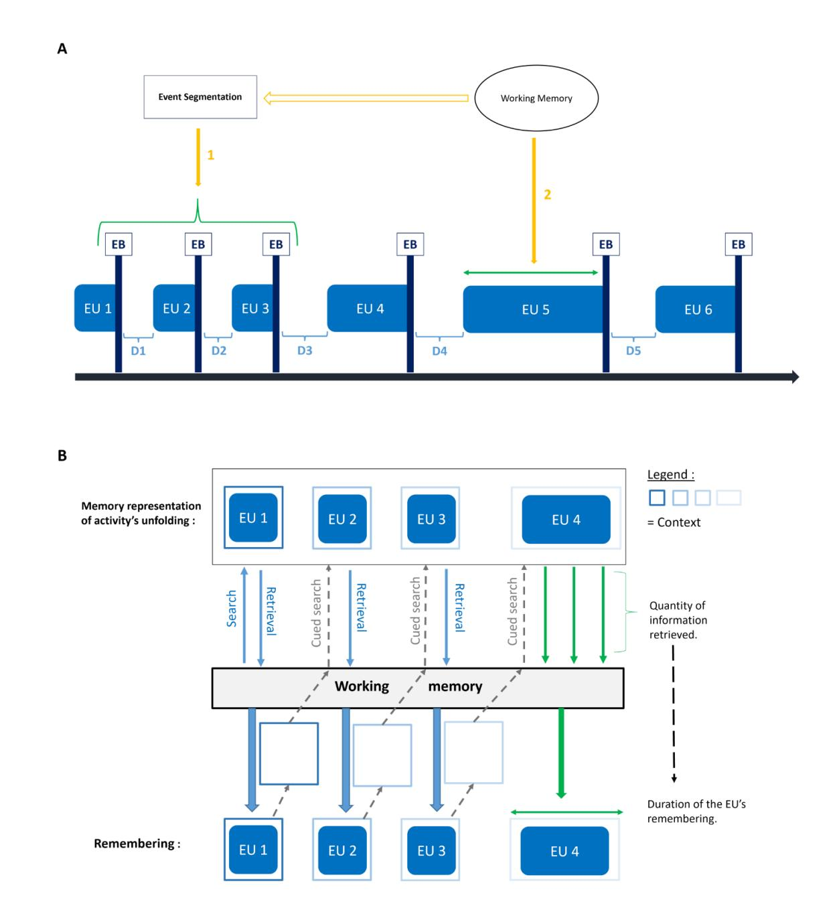
<!-- Image Description: The image presents two diagrams illustrating a model of event segmentation and memory. Diagram A shows a timeline depicting events (EU) grouped into segments (EB) based on boundaries (D). Event segmentation feeds into working memory (numbered 1 & 2). Diagram B illustrates the memory representation of activity unfolding, showing how information from events is searched for and retrieved into working memory before being remembered. The diagram uses boxes and arrows to represent the flow of information and duration of remembering. -->

*Hypothetical role of WM in the encoding and retrieval of experience units in episodic memory*

*Note. (A) During ongoing experience, people maintain an active representation of "what's happening now" (an event model) in WM. Each time they perceive an event boundary (EB), this event model is updated and transferred in episodic memory in the form of an experience unit. The number and duration of experience units composing the memory representation of an event determine its temporal compression. We assume that WM contributes to this process in two ways. First, WM may play a role in the segmentation process (i.e., in the identification of EBs), which then determines the number of experience units created for a given event (arrow 1). Second, WM may influence the duration of*

*experience units by determining the quantity of information that can be retained and integrated as a single unit between event model updates (arrow 2). (B) When retrieving an event from episodic memory, WM could influence the completeness of the mental replay of events, and thus their temporal compression, in two ways. First, the number of experience units remembered may depend on memory search processes driven by WM. WM capacity may allow to use temporal-contextual information to facilitate the retrieval of temporally contiguous experience units that represent the unfolding of the event (blue and gray arrows). Second, WM may also influence the duration of experience units that can be remembered by determining the quantity of information that can be retrieved and maintained within each experience unit (green arrows). EU: Experience unit, EB: Event boundary, D: temporal discontinuity.*## Experiment 1

In Experiment 1, participants were asked to watch video clips showing people engaged in daily life activities. The number of EBs typically identified within these activities was high for half of the videos, and low for the other half. After each video, participants had to mentally replay its unfolding and then to write down the content of their mental replay. Individual differences in WM capacity were assessed using complex span tasks. We expected individual differences in WM capacity to be positively associated with the number of recalled experience units. Regarding the relation between WM capacity and the temporal compression of episodic memories, we formulated two hypotheses. Our main hypothesis was that a higher WM capacity would enable the recall of more and longer experience units, and thus be associated with lower temporal compression rates (hypothesis 1). However, people with higher WM capacity could be faster at retrieving experience units, which would reduce the time needed to mentally replay the videos and thus be associated with apparently higher temporal compression rates (hypothesis 2). To disentangle these two hypotheses, we examined estimates of the time needed to remember an experience unit (i.e., the total duration of memory replay divided by the number of recalled experience units). Indeed, according to

hypothesis 1, WM capacity should be positively associated with the duration of remembered experience units, whereas hypothesis 2 predicted a negative relationship.

We also expected our episodic memory measures to differ according to the segmental structure of events, such that we would observe a higher number of recalled experience units for videos that contained more EBs. Furthermore, the temporal compression of events should be negatively associated with the number of recalled experience units and should thus be lower for videos that contain a higher density of EBs.

Finally, in so far as the ability to perceive relevant EBs (i.e., EBs facilitating the creation of experience units in episodic memory) is associated with WM capacity (Sargent et al., 2013), we hypothesized that the effect of EBs density on our measures of interest (temporal compression and recalled experience units) would be greater for individuals with higher WM capacity. Thus, we expected to observe an interaction between the density of EBs within videos and WM capacity, such that the magnitude of the difference between high and low EBs videos would be positively associated with WM capacity.

These hypotheses, as well as the methodological design and planned analyses, were pre-registered on OSF [\(https://osf.io/jt9ph\)](https://osf.io/jt9ph).

## Method

##*Participants*

Seventy-eight participants aged between 18 and 35 years (*M*= 26.06,*SD = 5.84*) were recruited on Prolific [\(https://www.prolific.co/;](https://www.prolific.co/) Palan & Schitter, 2018; Peer et al., 2021) and received a monetary compensation of £7.50 for their participation (the experiment lasted 60 min, on average). To be eligible, participants had not to be currently taking any medication that could affect their ability to concentrate or have a history of psychiatric, psychological, or

neurological disorders. All participants were native English speakers. The study was approved by the ethics committee of the Faculty of Psychology of the University of Liège (ref. 2021- 030).

The sample size of this study was estimated a priori using G\*Power 3 (Faul et al., 2007) to have a statistical power of 0.90 (with an alpha of .05, two-tailed) to detect a significant relationship between individual differences in WM capacity and our measures of interests (temporal compression rates, and the number and duration of recalled experience units), with an effect size of *r*= 0.35 (see Miller et al., 2019).

##*Materials*

**WM capacity**. To evaluate WM capacity, we used a battery of three automated complex span tasks whose content validity has been well established in the literature: the operation span (OSpan; Kane et al., 2004; Unsworth et al., 2005), symmetry span (SymSpan; Kane et al., 2004; Unsworth et al., 2009) and rotation span (RotSpan; Harrison et al., 2013; Kane et al., 2004). Given that this study was conducted online, we used the shortened complex span tasks developed by Foster et al. (2015) to reduce the time needed for participants to complete the study and thus limit dropout. These shortened versions allow to reduce the time needed to complete the three WM tasks by 28% without unduly affecting the psychometric qualities of the measures (for more detail on how these shortened versions were developed, see Foster et al., 2015).

The structure of these shortened tasks is similar to that of the classical versions. Participants are presented with a sequence of items that they must remember (i.e., the storage part of the task). In addition, they have to perform a secondary processing task between the presentation of each item in the sequence (i.e., the processing part of the task). The number of to-be-remembered items varies unpredictably from trial to trial. In the shortened tasks,

participants see each sequence length only once (for more detail, see Supplementary Materials).

*OSpan task.*In the OSpan task, participants are asked to memorize letters (consonants) while solving mathematical problems that involve a parenthetical multiplication or division problem, followed by a number to be added to or subtracted from the product or dividend. The number of to-be-remembered items varies from three to seven.
*SymSpan task.*In the SymSpan task, participants must determine if black and white geometric figures are symmetric along their vertical axes while also memorizing the location of red squares in a 4x4 grid. The number of to-be-remembered items varies from two to five.
*RotSpan task.*During the RotSpan task, participants have to judge if presented letters are oriented correctly while memorizing the size and orientation of black arrows. The number of to-be-remembered items varies from two to five.

Participants' performance on each complex span task was evaluated by calculating the total number of items they accurately recalled in the correct serial position (for all trials), regardless of whether all items of the trial were correctly recalled or not (i.e., following the partial credit load method; Conway et al., 2005; Foster et al., 2015; Gonthier et al., 2016). Participants' scores on the three complex span tasks were transformed into*z*-scores, which were then averaged to compute a global WM score for each participant (Gonthier et al., 2016; Miller et al., 2019). The internal consistency of this composite measure was estimated using an omega total coefficient (ωt = 0.71; Gonthier et al., 2016; McDonald, 1999; Revelle & Zinbarg, 2009). Descriptive statistics for each WM task are available in the Supplementary Materials.

**Temporal compression in episodic memory.** Individual differences in temporal compression, as well as the effect of EBs density on compression rates, were assessed using eight videos showing people performing daily life activities. Four videos contained a low

number of normative EBs (EB- videos) and the other four a high number of normative EBs (EB+ videos). Following the method of Bangert et al. (2019), these videos were edited from eight videos (lasting between 329 and 432 s) that were previously used in studies on event segmentation (Eisenberg & Zacks, 2016; Kurby & Zacks, 2011; Sargent et al., 2013). In these studies, while watching the videos, participants had to identify the smallest event units they found meaningful by pressing a key each time a sub-event ended and another sub-event begun. The number of normative EBs was computed for each second of each video by dividing the number of key presses by the number of participants who completed the segmentation task. Then, we calculated, within each video, the number of key presses for all possible segments of 40 s. 1 Among the eight videos, we selected four segments that included a low number of EBs and four segments that included a high number of EBs. On average, the EB- and EB+ videos included 3.4 and 5.69 EBs, respectively (see Supplementary Materials for more detail regarding normative segmentation data of each video segment used in this study).

The temporal compression task (see Figure 2) contained eight trials (each participant saw the same eight videos in a random order). Each trial started with a fixation cross (3 s) followed by a video. Participants were instructed to carefully watch the video and, when it was over, to mentally replay its unfolding, in as much detail as possible. The time needed to remember the video was measured by asking participants to press the spacebar to indicate the start and end of their mental replay (Arnold et al., 2016; Bonasia et al., 2016; Jeunehomme et

1 Since the present experiment was carried out online, we wanted to reduce the time needed to complete it as much as possible (to avoid dropout), so we opted for 40 s videos. This duration was chosen based on a pre-test where we compared different durations, from 20 to 60 s, and which showed that a 40 s duration allowed to obtain an optimal ratio between segmentation effects and task duration.

al., 2020; Jeunehomme & D'Argembeau, 2019)2 . Then, they had to write down every action that came to their mind during their mental replay of the video (they were instructed to write down one action per line; Zheng et al., 2020).

Before starting the experimental trials, participants saw a video tutorial (filmed from a first-person perspective) summarizing what they need to do to perform the task properly. This video tutorial, as well as the stimuli used in the temporal compression task, are publicly available on OSF (https://osf.io/5xeha). The instructions were adapted from previous studies on temporal compression (Folville et al., 2020; Jeunehomme et al., 2020; Jeunehomme & D'Argembeau, 2019, 2020). Participants had to perform one practice trial to familiarize them with the entire procedure before starting the main task.

For each trial of the main task, we computed the rate of temporal compression in memory as the ratio of the original duration of the video to the time taken to mentally replay it (Jeunehomme & D'Argembeau, 2019). A temporal compression rate of 1 indicates that the time taken to mentally replay the video was equal to its original duration, and temporal compression rates above 1 indicate the occurrence of temporal compression (e.g., a temporal compression rate of 2 means that the mental replay of the video was 2 times faster than its actual duration).

The number of experience units recalled by participants was quantified based on the written descriptions of their memories. We used a scoring system developed by Schwartz et al., (1991), the "Action Coding System", which is frequently used in studies on event

2 We used a silent mental replay task rather than a think aloud procedure because research has shown that the verbalization of mental contents in the think aloud procedure takes time and thus increases the duration of a cognitive process (Fox et al., 2011), which would provide a biased estimate of remembering duration.

segmentation and memory (e.g., Sargent et al., 2013; Smith et al., 2021; Zheng et al., 2020). We considered the number of type 1 actions recalled by participants as a proxy of the number of experience units they mentally replayed. A type 1 action is defined as "*the smallest component of a behavioral sequence that achieves a concrete, functional result of transformation, describable as the movement of an object from one place to another or as a change in the state of an object (e.g., from open to closed, on to off*)…" (Schwartz et al., 1991, p. 384). The first author scored the content of each description and, to assess the reliability of the coding scheme, a second coder independently scored a random selection of 20% of descriptions. The inter-rater agreement was good (*ICC* = 0.93, 95%*CI* [0.9, 0.95], robust agreement = 0.87, 95%*CI*[0.79, 0.92]; see Supplementary Materials for more details).

Finally, we estimated the time taken by participants to mentally replay each experience unit they reported for a given video by dividing the duration their mental replay by the number of experience units they reported.

The reliability (average split-half) of the three measures of interest was*r*= 0.89 for temporal compression rate,*r*= 0.91 for the number of recalled experience units, and*r*= 0.93 for the duration of recalled experience units.

## Figure 2

##*Unfolding of a trial in the temporal compression task*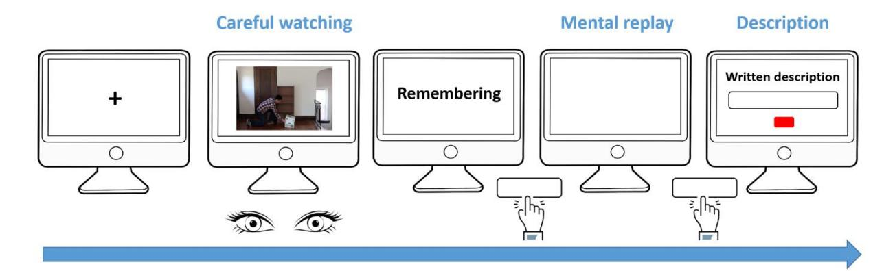
<!-- Image Description: The image is a flowchart illustrating an experimental procedure. It depicts a sequence of stages: a fixation cross, video viewing ("Careful watching"), a blank screen ("Remembering"), a mental replay phase, and finally, a written description entry. Computer monitor icons represent each stage. Human eyes and clicking hand icons emphasize user interaction. The flowchart demonstrates the process of memory recall and description, likely for a study on visual memory or cognitive processes. -->
*Note. First, participants saw a fixation cross during 3 s and then a 40-s video showing a person engaged in a daily life activity. As soon as the video ended, they had to mentally replay its unfolding in as much detail as possible. They were asked to press the space bar to indicate the beginning and end of their remembering. Finally, they had to write down the content of their mental replay.*##*Procedure*Participants received an URL (on their prolific account) allowing them to take part in the experiment through Gorilla ([\(https://gorilla.sc/\)](https://gorilla.sc/), a platform providing reliable RTs measures for online studies (Anwyl-Irvine et al., 2021; Anwyl-Irvine et al., 2020). They were asked to perform the tasks in a quiet and distraction-free environment and were informed that they must complete all tasks (in their entirety) to receive the monetary compensation. They first performed the three complex span tasks (Ospan, SymSpan and RotSpan) on E-Prime GO (https://pstnet.com/eprime-go/)3 , which was downloaded from Gorilla. After the three

3 These tasks were originally developed on the E-Prime software (https://pstnet.com/products/eprime/) by the Georgia Tech Attention and Working Memory Lab, which kindly shared with us the E-Studio files necessary to create an online version of each task using the E-Prime Go platform. E-Run files for the three tasks are available for download from their website (http://englelab.gatech.edu).

complex span tasks, participants were allowed to take a 30 min break and then performed the temporal compression task on Gorilla.

##*Data cleaning*When using complex span tasks to evaluate WM capacity, it is recommended to exclude participants who show poor performance on the processing part of the tasks (to avoid including participants who neglected the processing part of the tasks; Conway et al., 2005). Following the approach of Gonthier et al., (2016), we excluded participants whose processing accuracy was below the fifth lower percentile of the sample for one of the three tasks (see Supplementary Materials for more detail).

Regarding the temporal compression task, following our pre-registered plan, we excluded from the analyses: 1) all experimental trials for which the difference between the video's duration of presentation and its real duration was greater than 3 s (to remove trials in which the video was not displayed correctly), and 2) trials with a duration of mental replay less than 2 s (i.e., to remove trials during which the participant inadvertently pressed the button twice or did not properly follow the instructions). If more than half of trials of one type (high or low density of EBs) had to be excluded for a given participant, the entire participant was excluded and replaced.

#*Statistical analyses*All statistical analyses were conducted using*R*(version 4.0.3; R Core Team, 2020) and RStudio (version 1.3.1093; RStudio Team, 2020) on Windows 10 x64 (build 19044). Specific packages used for each analysis are detailed in the Supplementary Materials. Our main hypotheses were tested using linear mixed-effects models (Brown, 2021). We fitted three models with the following outcome variables: temporal compression rates, the number of recalled experience units, the duration of recalled experience units. Three predictors were included in all models: 1) participants' WM composite score, which was a continuous predictor varying between subjects, 2) the EBs density of videos, which was a dichotomous within-subjects predictor, and 3) their interaction. We also ran another mixed-effects model evaluating if the number of recalled experience units predicted temporal compression rates (this model also included EBs density, WM score, and their interaction as predictors). In all models, EBs density was coded as -0.5 and 0.5, WM score was standardized, and the number of recalled experience units was centered at the participant level (Brauer & Curtin, 2018; Schielzeth, 2010).

As the application conditions of classical linear mixed-effects models were not met, we used a robust alternative. We estimated our models with the DAStau procedure implemented in the robustlmm package (Koller, 2016). This method enables to handle both within- and between- participants outliers as well as missing values (Koller, 2013). Equations were estimated with the smoothed Hubber function (Koller, 2013). We first tried to include the maximal random effects structure for each analysis (Barr et al., 2013) and then we iteratively simplified the model until it converged and the equations could be properly estimated (Brauer & Curtin, 2018; Mirman, 2014). The models reported here contained two random effects: a random intercept for the participants and a random intercept for the stimuli (i.e., the videos; Baayen et al., 2008; Judd et al., 2017). For each model, explained variance was assessed by computing Nakagawa's*R2*s (Johnson, 2014; Nakagawa et al., 2017; Nakagawa & Schielzeth, 2013).

Regarding inference criteria for fixed effects, we computed Wald's 95% confidence intervals (95 % *CIs)*and*p-values* from standard errors (*SE*) and *t*-statistics returned by the models (considering an *alpha*of 0.05, two tailed). For each model, we extracted estimated marginal means, estimated marginal slopes and their standard errors. We computed

asymptotic 95 %*CIs*for estimated marginal means and performed*z*-tests to assess the statistical significance of estimated marginal slopes.

In the Results section, the match between our hypotheses and the collected data is assessed in the light of the different models described above. Descriptive statistics associated with each outcome are available in the Supplementary Materials.

## Results

## *Temporal compression rates*

We fitted a mixed-effects model examining the effects of WM capacity, EBs density, and their interaction on the rates of temporal compression of events in episodic memory. Contrary to our prediction, we did not observe a significant main effect of WM capacity on temporal compression rates (Table 1). Interestingly, however, there was a significant interaction between WM capacity and the density of event boundaries included in the videos (see Figure 3A). Follow-up tests revealed that WM capacity was a significant predictor of temporal compression rates for videos that included a low density of EBs (*b =* -0.36*, SE*= 0.16,*z*=*-*2.19*, p* = 0.028), but not for videos that included a high density of EBs (*b =* -0.18*, SE*= 0.16,*z*=*-*1.09*, p*= 0.274). According to the model estimates, for EB- stimuli, people whose WM score were one*SD*below the mean took, on average, 12.75 s (temporal compression rate = 3.14) to mentally replay the videos, while people with WM score one*SD*higher than the mean took, on average, 16.56 s (temporal compression rate = 2.42) to mentally replay the same videos. Finally, we obtained a weak but significant effect of EBs density (according to the model estimates, temporal compression rates were lower when EBs density was high).

## Table 1

| Parameter      | Coefficient | SE   | t     | df  | p      | 95% CI         |
|----------------|-------------|------|-------|-----|--------|----------------|
| Intercept      | 2.55        | 0.18 | 13.87 | 585 | < .001 | [2.19, 2.92]   |
| WM capacity    | -0.27       | 0.16 | -1.68 | 585 | .093   | [-0.59, 0.05]  |
| EBs density    | 0.44        | 0.19 | 2.31  | 585 | .021   | [0.07, 0.82]   |
| Interaction    | -0.18       | 0.07 | -2.69 | 585 | .007   | [-0.31, -0.05] |
| Observations   | 589         |      |       |     |        |                |
| Marginal R2    | 0.05        |      |       |     |        |                |
| Conditional R2 | 0.76        |      |       |     |        |                |
*Robust linear mixed effects model predicting temporal compression rates in Experiment 1*##*Number of recalled experience units*Next, we fitted a similar mixed-effects model with the number of recalled experience units as outcome. This showed that WM capacity was positively associated with the number of recalled experience units, independently of EBs density (the interaction was not significant; Table 2, Figure 3B). According to the model estimates, participants with a WM score one*SD* below the mean recalled, on average, 7.93 experience units, 95%*CI*[6.10, 9.79], while participants with a WM score one*SD* above the mean recalled, on average, 9.17 experience units, 95%*CI*[7.31, 10.68]. The main effect of segmentation was not significant.

## Table 2
*Robust linear mixed-effects model predicting the number of recalled experience units in Experiment 1*| Parameter      | Coefficient | SE   | t     | df  | p      | 95% CI        |
|----------------|-------------|------|-------|-----|--------|---------------|
| Intercept      | 8.55        | 0.92 | 9.33  | 585 | < .001 | [6.75, 10.34] |
| WM capacity    | 0.62        | 0.24 | 2.59  | 585 | .010   | [0.15, 1.09]  |
| EBs density    | -3.01       | 1.78 | -1.70 | 585 | .090   | [-6.49, 0.47] |
| Interaction    | -0.14       | 0.17 | -0.87 | 585 | .386   | [-0.47, 0.18] |
| Observations   | 589         |      |       |     |        |               |
| Marginal R2    | 0.16        |      |       |     |        |               |
| Conditional R2 | 0.76        |      |       |     |        |               |

##*Associations between temporal compression and recalled experience units*According to our hypotheses, temporal compression would result (at least in part) from the fact that the experience units remembered for a given past episode do not represent its entire unfolding (i.e., some segments of the past episode are not recalled). Thus, we expected that the number of recalled experience units would be negatively associated with temporal compression rates. WM capacity could be negatively associated with temporal compression rates not only because higher WM capacity would allow the recollection of more experience units, but also because it would increase the duration of recalled experience units (see Introduction). If it was the case, WM capacity should remain a significant predictor of temporal compression rates when the number of recalled experience units is taken into account. To investigate this possibility, we ran a model that not only included WM, EBs density, and their interaction as predictors of temporal compression rates, but also the number

of recalled experience units. Consistent with previous studies (e.g., Folville et al., 2020; Jeunehomme et al., 2020; Jeunehomme & D'Argembeau, 2019), the number of recalled experience units was negatively associated with temporal compression rates (Figure 3C). Importantly, the interaction between WM and EBs remained significant (Table 3).

# Table 3
*Robust linear mixed-effects model predicting temporal compression rates (with the number of recalled experience units included as predictor) in Experiment 1*| Parameter                 | Coefficient | SE   | t     | df  | p      | 95% CI         |
|---------------------------|-------------|------|-------|-----|--------|----------------|
| Intercept                 | 2.56        | 0.16 | 15.77 | 584 | < .001 | [2.24, 2.88]   |
| Recalled experience units | -0.08       | 0.01 | -6.48 | 584 | < .001 | [-0.11, -0.06] |
| WM capacity               | -0.27       | 0.16 | -1.66 | 584 | .096   | [-0.59, 0.05]  |
| EBs density               | 0.20        | 0.08 | 2.62  | 584 | .009   | [0.05, 0.35]   |
| Interaction               | -0.21       | 0.07 | -3.07 | 584 | .002   | [-0.34, -0.07] |
| Observations              | 589         |      |       |     |        |                |
| Marginal R2               | 0.07        |      |       |     |        |                |
| Conditional R2            | 0.77        |      |       |     |        |                |

##*Duration of recalled experience units*Our conceptualization of the role of WM capacity in the temporal compression of events in episodic memory assumed that WM capacity should be positively associated with both the number and duration of remembered experience units. This higher number and duration of recalled experience units should be associated to lower temporal compression rates. However, because of a greater facility to access information in long term memory (Unsworth, 2019), people with higher WM capacity could be faster at retrieving and mentally reviewing experience units, which could then shorten overall mental replay durations. To investigate this possibility, we fitted a last model with the duration of remembered experience units as outcome. Neither WM capacity, EBs density, nor their interaction were significant predictors of the duration of recalled experience units (Table 4).
*Robust linear mixed-effects model predicting the duration of recalled experience units in Experiment 1*| Parameter      | Coefficient | SE   | t     | df  | p      | 95% CI        |
|----------------|-------------|------|-------|-----|--------|---------------|
| Intercept      | 2.49        | 0.19 | 12.91 | 585 | < .001 | [2.11, 2.87]  |
| WM capacity    | 0.06        | 0.15 | 0.40  | 585 | .689   | [-0.23, 0.34] |
| EBs density    | 0.33        | 0.26 | 1.24  | 585 | .214   | [-0.19, 0.84] |
| Interaction    | 0.13        | 0.08 | 1.71  | 585 | .087   | [-0.02, 0.28] |
| Observations   | 589         |      |       |     |        |               |
| Marginal R2    | 0.01        |      |       |     |        |               |
| Conditional R2 | 0.66        |      |       |     |        |               |

## Figure 3

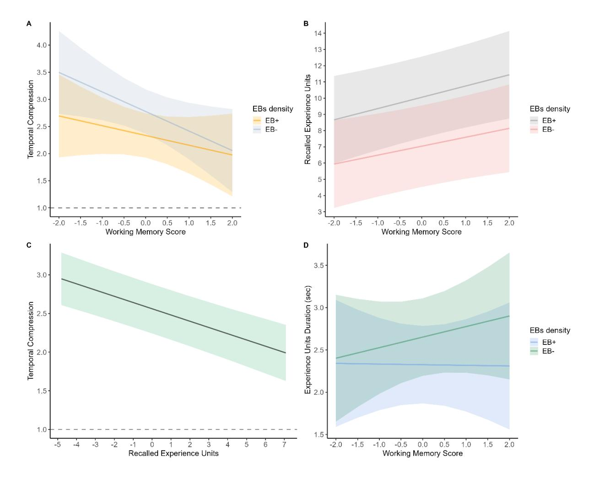
<!-- Image Description: The image contains four panels (A-D) showing regression plots. Panels A and B display the relationship between working memory score and (A) temporal compression and (B) recalled experience units, categorized by EBs density (EB+, EB-). Panel C illustrates the relationship between recalled experience units and temporal compression. Panel D shows the relationship between working memory score and experience units duration, again categorized by EBs density. Shaded areas represent confidence intervals. The plots analyze how different factors affect temporal perception and memory. -->
*Plot of fitted values (and their 95% CIs) for each model of Experiment 1*

*Note. (A) Prediction of temporal compression by WM capacity for high and low EBs density videos. (B) Prediction of the number of recalled experience units by WM capacity for high and low EBs density videos. (C) Prediction of temporal compression by the number of recalled experience units. (D) Prediction remembered experience units duration by WM capacity, for high and low EBs density videos.*## Discussion

The main goal of Experiment 1 was to investigate the impact of WM capacity and EBs density on temporal compression rates in episodic memory. The main effect of WM capacity was not statistically significant but there was a significant interaction between the density of EBs and WM capacity. WM capacity was negatively associated with temporal compression rates, but only when EBs density was low. The lower and non-significant relation between WM capacity and temporal compression rates when the recalled activity contained a high density of EBs was against our expectations.

We then focused on the number and duration of recalled experience units. First, we found that the number of recalled experience units was positively associated with WM capacity, regardless of EBs density. Second, we observed a significant negative relation between the number of recalled experience units and temporal compression rates, thus replicating results of previous studies (Folville et al., 2020; Jeunehomme et al., 2020; Jeunehomme & D'Argembeau, 2019). The interaction between WM capacity and EBs density in predicting temporal compression rates remained significant. Taken together, these results suggest that the interaction between WM capacity and EBs density in predicting compression rates is not due to differences in the number of recalled experience units. Another possibility would be that WM capacity allows the formation and retrieval of longer experience units for events that have fewer EBs. However, although the duration of remembered experience units for EB- stimuli tended to be longer with increasing WM capacity (see Figure 3D), this difference failed to reach statistical significance. We thus decided to conduct a second experiment to investigate whether the interaction between WM capacity and EB density on compression rates could be replicated, and to further investigate the associations between WM capacity and the number and duration of recalled experience units.

## Experiment 2

The results of Experiment 1 suggest that the influence of individual differences in WM capacity on temporal compression in episodic memory is complex and depends on the density of EBs within events. Thus, the first aim of Experiment 2 was to replicate the observed interaction between WM capacity and EB density on compression rates, using a sample size determined a priori for the investigation of this interaction. Furthermore, given the lack of significant main effect of EBs density on the number of recalled experience units in Experiment 1, we selected EB+ and EB- videos that were more contrasted regarding normative EBs density. Given these more contrasted videos, we expected to observe a significant effect of EBs density on both temporal compression rates and the number of recalled experience units. Other effects should be the same as in Experiment 1.

## Method

##*Participants*

Participants were 210 young adults (109 females, 97 males and 4 non defined), aged between 18 and 35 years (*M*= 27.70,*SD* = 4.99), who were recruited on Prolific [\(https://www.prolific.co/;](https://www.prolific.co/) Palan & Schitter, 2018; Peer et al., 2021). They received a monetary compensation of £7.50 for their participation. The study was approved by the ethics committee of the Faculty of Psychology of the University of Liège (ref. 2021-030). The inclusion criteria were the same as in Experiment 1. The sample size was estimated a priori using the R package simr (1.0.5 ; Green & MacLeod, 2016; Kumle et al., 2021). Using data from Experiment 1, we ran Monte-Carlo simulations (Brysbaert & Stevens, 2018; DeBruine & Barr, 2021) to estimate the power we would have for the detection of the interaction between WM capacity and EBs density in the prediction of temporal compression across a range of sample sizes (between 80 and 240 participants). This analysis indicated that a

statistical power of 90.70% (95%*CI*[88.73, 92.43]) could be achieved with a sample size of 210 participants (considering an alpha of 0.05 and the same effect size as the one obtained in Experiment 1; see Supplementary Materials).

##*Materials and procedure*Stimuli used in Experiment 1 were initially created for another study investigating the effects of event segmentation and duration on temporal compression (following the method presented in Bangert et al., 2019). When designing that study, we not only had to extract a pair of 40-s segments (one EB+ and one EB-), but also a pair of 20-s segments (one EB+ and one EB-), for each of the eight videos. The four segments should not overlap, and the two pairs had to be contrasted in terms of normative EBs. Given these constrains, the 40-s EB+ segment extracted from a given video was not always the segment with the higher possible number of EBs (similarly, the 40-s EB- segments were not always those with the lower possible number of EBs-). Therefore, to obtain more contrasted stimuli in Experiment 2, we selected new video segments. Within each of the eight videos, we extracted the 40-s segment with the higher number of EBs and the segment with the lower number of EBs. Then, among these sixteen videos, we chose the eight videos (each extracted from a different video) with the highest and lowest number of EBs, resulting in four EB+ and four EB- stimuli. The average number of normative EBs was 3.6 for EB- videos and 6.33 for EB+ videos. In addition, we were careful not to include in EB+ videos sequences in which the actor performed the same action many times consecutively (even if the video, due to this repetition, contained many normative EBs). Otherwise, all tasks and procedures were identical to those of Experiment 1.

##*Data cleaning and statistical analyses*

Data cleaning and statistical analyses were identical to Experiment 1. Again, there was a good inter-rater agreement for the scoring of the number of recalled experience units (*ICC* = 0.96, 95%*CI* [0.94, 0.97], robust agreement = 0.80, 95%*CI* [0.76, 0.84]). Internal consistency of the WM score was similar to Experiment1 (ωt = 0.76), as was the split-half reliability for temporal compression rates (*r* = 0.92), the number of recalled experience units (*r* = 0.89) and the duration of recalled experience units (*r*= 0.88). When an expected interaction was observed, we assessed the statistical significance of estimated marginal slopes with a onetailed*z*-test. All data and analysis scripts are available on OSF [\(https://osf.io/jt9ph\)](https://osf.io/jt9ph).

## Results

## *Temporal compression rates*

First, we replicated the interaction between WM capacity and EBs density observed in Experiment 1 (Table 5, Figure 4a). More precisely, we found that WM capacity was a significant predictor of temporal compression for EB- videos (*b* = -0.25*, SE*= 0.13,*z*=*-*1.93*, p* = 0.027), but not for EB+ videos (*b* = -0.10*, SE*= 0.13,*z =* 0.81*, p*= 0.21). According to model estimates, for EB- stimuli, individuals with WM score one*SD*below the mean took, on average, 10.93 s (temporal compression rate = 3.66) to remember the videos, whereas individuals with WM score one*SD*above the mean took, on average, 12.63 s (temporal compression rate = 3.17) to mentally replay the same videos.

As expected, there was also a significant main effect of EBs density on temporal compression rates (compression was lower when EBs density was high). The main effect of WM capacity was not significant (as in Experiment 1).
*Robust linear mixed-effects model predicting temporal compression rates in Experiment 2*| Parameter      | Coefficient | SE   | t     | df    | p      | 95% CI         |
|----------------|-------------|------|-------|-------|--------|----------------|
| Intercept      | 2.88        | 0.19 | 15.44 | 1,540 | < .001 | [2.51, 3.24]   |
| WM capacity    | -0.17       | 0.12 | -1.41 | 1,540 | .159   | [-0.42, 0.07]  |
| EBs density    | 1.07        | 0.28 | 3.78  | 1,540 | < .001 | [0.51, 1.63]   |
| Interaction    | -0.14       | 0.06 | -2.37 | 1,540 | .018   | [-0.26, -0.02] |
| Observations   | 1,544       |      |       |       |        |                |
| Marginal R2    | 0.07        |      |       |       |        |                |
| Conditional R2 | 0.72        |      |       |       |        |                |

##*Number of recalled experience units*

As expected, participants recalled significantly more experience units for EB+ videos compared to EB- videos (Table 6). According to model estimates, 5.35 experience units were recalled on average for EB- videos (95%*CI* [1.91, 8.8]) vs. 11.62 for EB+ videos (95%*CI*[8.18, 15.05]). However, contrary to Experiment 1, there was no significant relationship between WM capacity and the number of recalled experience units (Figure 4b). There was also no significant interaction.
*Robust linear mixed-effects model predicting the number of recalled experience units in Experiment 2*| Parameter      | Coefficient | SE   | t     | df    | p      | 95% CI          |
|----------------|-------------|------|-------|-------|--------|-----------------|
| Intercept      | 8.48        | 1.25 | 6.79  | 1,540 | < .001 | [6.03, 10.93]   |
| WM capacity    | 0.09        | 0.22 | 0.40  | 1,540 | .690   | [-0.35, 0.53]   |
| EBs density    | -6.27       | 2.46 | -2.55 | 1,540 | .011   | [-11.09, -1.44] |
| Interaction    | -0.12       | 0.16 | -0.79 | 1,540 | .430   | [-0.43, 0.18]   |
| Observations   | 1,544       |      |       |       |        |                 |
| Marginal R2    | 0.25        |      |       |       |        |                 |
| Conditional R2 | 0.77        |      |       |       |        |                 |

##*Relations between temporal compression and recalled experience units*As in Experiment 1, there was a significant effect of the number of recalled experience units on temporal compression rates, such that temporal compression decreased with the number of recalled experience units (Figure 4c). In addition, the interaction between WM capacity and EBs density on compression rates remained significant when the number of recalled experience units was taken into account (Table 7).
*Robust linear mixed-effects model predicting temporal compression rates (with the number of recalled experience units included as predictor) in Experiment 2*| Parameter                 | Coefficient | SE   | t     | df    | p      | 95% CI         |
|---------------------------|-------------|------|-------|-------|--------|----------------|
| Intercept                 | 2.88        | 0.18 | 16.15 | 1,539 | < .001 | [2.53, 3.23]   |
| Recalled experience units | -0.03       | 0.01 | -2.53 | 1,539 | .011   | [-0.05, -0.01] |
| WM capacity               | -0.17       | 0.12 | -1.39 | 1,539 | .164   | [-0.41, 0.07]  |
| EBs density               | 0.91        | 0.27 | 3.36  | 1,539 | .001   | [0.38, 1.44]   |
| Interaction               | -0.14       | 0.06 | -2.33 | 1,539 | .020   | [-0.26, -0.02] |
| Observations              | 1,544       |      |       |       |        |                |
| Marginal R2               | 0.07        |      |       |       |        |                |
| Conditional R2            | 0.72        |      |       |       |        |                |

##*Duration of recalled experience units*

There was a significant effect of EBs density on the duration of recalled experience units (i.e., recalled experience units were longer when EBs density was low). According to model estimates, the average experience unit duration was 2.16 s (95%*CI* [1.43, 2.90]) when EBs density was high and 3.63 s (95%*CI*[2.90, 4.37]) when EBs density was low. The analysis also revealed a significant interaction between WM capacity and EBs density (Table 8). As illustrated in Figure 4D, the trend observed in the first experiment (see Figure 3D) was confirmed. WM capacity was positively associated with the duration of remembered experience units, but only when EBs density was low (EB-:*b* = 0.25*, SE =* 0.11*, z* = 2.25*, p*= 0.012; EB+:*b =* 0.01*, SE* = 0.11*, z* = 0.05*, p*= 0.479). According to model estimates, for EBvideos, experience units remembered by individuals with WM score one SD above the mean were, on average, 506 ms longer than those remembered by individuals with WM score situated one SD below the mean.
*Robust linear mixed-effects model predicting the duration of recalled experience units in Experiment 2*| Parameter           | Coefficient | SE   | t     | df            | p      | 95% CI        |  |
|---------------------|-------------|------|-------|---------------|--------|---------------|--|
| Intercept           | 2.90        | 0.27 | 10.56 | 1,540         | < .001 | [2.36, 3.44]  |  |
| WM capacity         | 0.13        | 0.11 | 1.22  | 1,540         | .221   | [-0.08, 0.34] |  |
| EBs density 1.47 |             | 0.51 | 2.87  | 1,540 .004 |        | [0.47, 2.47]  |  |
| Interaction         | 0.25        | 0.07 | 3.31  | 1,540         | .001   | [0.10, 0.39]  |  |
| Observations        | 1,544       |      |       |               |        |               |  |
| Marginal R2         | 0.11        |      |       |               |        |               |  |
| Conditional R2      | 0.60        |      |       |               |        |               |  |

## Figure 4

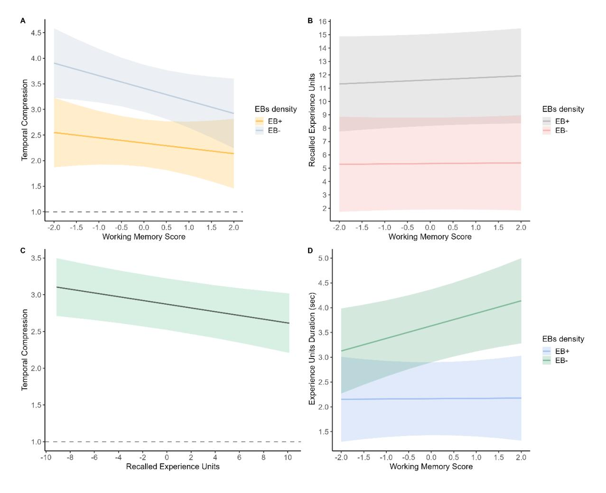
<!-- Image Description: The image displays four panels (A-D) of regression plots visualizing the relationships between working memory scores and temporal experience. Panel A shows how working memory score relates to temporal compression, separated by experience type (EB+, EB-). Panel B illustrates the recalled experience units as a function of working memory, again differentiated by experience type. Panel C presents the relationship between recalled experience units and temporal compression. Finally, panel D depicts how working memory score affects experience duration, categorized by experience type (EB+, EB-). Each plot uses lines and shaded areas to represent regression lines and confidence intervals. -->
*Plot of fitted values (and their 95% CIs) for each model of Experiment 2*

*Note. (A) Prediction of temporal compression by WM capacity for high and low EBs density videos. (B) Prediction of the number of recalled experience units by WM capacity for high and low EBs density videos. (C) Prediction of temporal compression by the number of recalled experience units. (D) Prediction remembered experience units duration by WM capacity, for high and low EBs density videos.*## Discussion

The interaction between WM capacity and EBs density in predicting compression rates in episodic memory was replicated in Experiment 2 with a sample size that was specifically determined to investigate this interaction. Similarly to Experiment 1, individual differences in WM capacity were predictive of temporal compression rates for events with a low density of EBs (the higher the WM capacity, the lower the temporal compression rates), but not for events with a high density of EBs.

We also found a clear effect of EBs density on both recalled experience units and temporal compression rates (the number of recalled experience units was significantly higher and temporal compression rates were significantly lower for EB+ videos compared to EBvideos). These results further highlight the key role of event segmentation in shaping the way we remember their unfolding. However, contrary to Experiment 1, we did not observe a significant main effect of WM capacity on the number of recalled experience units. This discrepancy could result from the use of more contrasted stimuli in Experiment 2 (see the Method section). In these more contrasted stimuli, the sub-events composing the depicted activities (e.g., changes/updates in the actions performed by the actors) were perhaps obvious enough to be identified with little WM resources. Consequently, the number of recalled experience units might be less dependent on WM capacity. Despite this possibility, it is worth noting that the number of recalled experience units remained a strong predictor of temporal compression rates.

Finally, by using videos more contrasted in terms of EBs density, we sought to clarify the interplay between EBs density and WM capacity in determining the duration of remembered experience units. We found that the mean duration of recalled experience units was significantly shorter for EB+ videos than for EB- videos. In addition, we observed a

significant interaction between EBs density and WM capacity: the duration of remembered experience units was longer with higher WM capacity, but only for EB- videos. Note that a similar pattern was observed in Experiment 1 (see Figure 3D), although the interaction failed to reach statistical significance. This further suggests that the association between WM and the temporal compression of events in episodic memory when EBs density is low results from the need of high WM capacity to remember experience units representing longer sub-events.

## General Discussion

The main goal of this research was to examine the role of WM capacity in the temporal compression of events in episodic memory. We hypothesized that individuals with higher WM capacity would compress events to a lesser extent because they would recall more and longer experience units to represent the unfolding of events. Our results showed that the relation between WM capacity and temporal compression was in fact dependent on the segmental structure of events.

## WM, event segmentation, and the duration of experience units

The results of Experiments 1 and 2 showed that WM capacity was related to the temporal compression of information in episodic memory when events included few EBs: in this case, higher WM capacity was associated with lower compression rates. Furthermore, Experiment 2 revealed a positive association between the duration of recalled experience units and WM capacity for events with a low EBs density. Considering the fact that events with fewer EBs were composed of longer sub-events, these results suggest that higher WM capacity may reduce the temporal compression of events in episodic memory by enabling the remembering of longer segments of past experience (i.e., the duration of remembered subevents is closer to their actual duration in the past). By contrast, our results suggest that when events can be segmented into smaller meaningful units, remembering their unfolding is less demanding in terms of WM resources.

The role of WM capacity in determining the duration of experience units that represent the unfolding of events in episodic memory could take place during event perception. When there is little change in the ongoing situation (e.g., a man continuously turning a car jack during 40 s), perceived EBs are temporally distant from each other, such that additional WM resources may be needed to enable the active maintenance of longer event models. When the

event model that needs to be maintained exceeds WM capacity, the corresponding sub-event would be only partially integrated in episodic memory as an experience unit—some proportion of experience would not be represented (Figure 5). Therefore, the duration of experience units formed to represent long sub-events may depend on WM capacity: the higher this capacity, the longer the experience units encoded in episodic memory, and thus the lower the temporal compression of events4 .

## Figure 5
*Schematic representation of the assumed influence of WM capacity on the duration of experience units that compose episodic memories*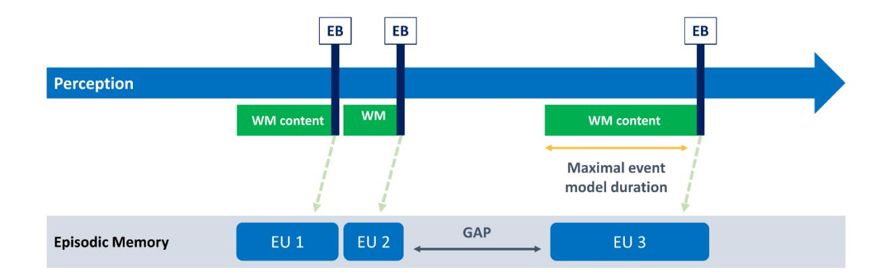
<!-- Image Description: This figure is a timeline illustrating an episodic memory model. A blue horizontal bar represents the perception phase, with green boxes showing working memory (WM) content. Vertical dark blue lines denote event boundaries (EB). Dashed lines connect WM content to episodic memory units (EU1, EU2, EU3) in the bottom section. A gap between EU2 and EU3 is depicted, and an orange line shows the maximal event model duration. The figure clarifies the temporal relationship between perception, WM, and episodic memory formation. -->
*Note. When the event model that needs to be maintained between two EBs exceeds WM capacity (e.g., because of its duration), it is only partially integrated in episodic memory, leading to temporal gaps in the representation of the event's unfolding (see EU 3). Thus, temporal compression may depend on both the temporal distance between perceived EBs and WM storage capacity. EU: Experience unit, EB: Event boundary.*4 The duration of experience units formed to represent long sub-events may depend on individual's WM capacity but also on different features of the sub-event (e.g., the complexity of perceptual information). The identification of these features, as well as their interaction with sub-events duration, will be needed to deepen our understanding of the mechanisms determining the duration of experience units formed during event perception.

Another, not mutually exclusive, possibility is that WM capacity determines the duration of experience units at the time of retrieval. When one remembers an experience, past event models corresponding to particular moments of that experience (i.e., experience units) are sequentially reactivated (Jeunehomme et al., 2022). The quantity of information retrieved for each experience unit—details about the temporal evolution of persons, objects, actions, and so on—may depend on the ease with which individuals are able to access and maintain information in memory, an ability strongly associated with WM capacity (Unsworth, 2019). WM capacity may thus determine the quantity of information that can be represented within each experience unit5 during retrieval (i.e., information that is retrieved, maintained online, and manipulated for the purpose of mental replay; Hassabis & Maguire, 2007), such that the duration of replayed experience units is longer with increasing WM capacity.

## WM, event segmentation, and the number of recalled experience units

We expected to observe a higher number of recalled experience units for activities that included a higher number of normative EBs and a positive relationship between WM capacity and the number of recalled experience units. In Experiment 1, participants recalled, on average, more experience units for EB+ videos compared to EB- videos, but the difference was not statistically significant. In Experiment 2, where more contrasted stimuli were used, there was a statistically significant effect of EBs density; on average, participants recalled two times more actions for EB+ videos than EB- videos. These results are in line with the view

5 Research examining the holistic vs fragmented nature of information forgetting in episodic memory (e.g., Andermane et al., 2021) suggests that the retrieval of event representations tend to be all-ornone: either all components (e.g., objects, persons, location) are remembered or the event is not remembered. Nevertheless, in most of these studies, event representations corresponded to learned associations between static elements (e.g., a place, a celebrity and an object). The dynamic/temporally extended nature of memory representations for daily-life events was not taken into account.

that the perception of EBs plays an important role in shaping memories for naturalistic events (Brunec et al., 2018; Jeunehomme & D'Argembeau, 2020; Radvansky & Zacks, 2017; Zacks, 2020).

The relation between WM and the number of recalled experience units was less clear. Although we observed a weak but a statistically significant increase of recalled experience units as a function of participants' WM capacity in Experiment 1, this effect was not replicated in Experiment 2. The lack of a robust link between WM capacity and the number of recalled experience units may seem surprising given the results of Sargent et al. (2013) who reported a positive association between WM capacity and the number of sub-events recalled after watching videos depicting everyday events. This discrepancy could be due to methodological differences between the two studies. Notably, there were substantial differences in the duration of stimuli (351 s, on average, in the study of Sargent et al. vs. 40 s in the present study). Event segmentation is known to operate simultaneously at multiple time scales, leading to the formation of hierarchically organized memory representations: groups of fine-grained events cluster into larger event units (Hard et al., 2011; Radvansky & Zacks, 2017; Zacks, 2020). The involvement of WM in the formation of event models could be more important at particular levels of this hierarchy (e.g., for abstract event models covering long periods of time vs more specific models corresponding to shorter sub-events). As a result, the number of experience units representing the event in episodic memory could be more or less dependent on WM capacity at different levels of event model specificity. To test this hypothesis, it would be worthwhile to investigate whether the relationship between WM capacity and the number of recalled experience units varies as a function of the duration of the remembered event, and whether this relates to differences in event segmentation efficiency.

Regarding memory retrieval, previous studies suggest that high WM individuals tend to outperform low WM individuals because they are better at retrieving the different contexts/categories associated with clusters of items and to switch between them (Unsworth, 2019). Hence, they recall more items in total but not more items per cluster. In the same vein, when remembering complex and hierarchically organized events, high WM individuals may recall a higher number of basic event models because they are better at retrieving their shared contexts (i.e., the higher-level event models to which they belong). It follows that the involvement of WM in the retrieval of experience units could also depend on the level of specificity of recall (and thus, on the duration of the remembered episode).

## Limitations and perspectives

In this study, we showed that individual differences in the temporal compression of events in episodic memory result, at least in part, from an interplay between WM capacity and the segmental structure of the remembered events. Although our main findings were in line with our conceptualization and consistent across two experiments, some limitations should be acknowledged. First, we evaluated global WM capacity and in future studies it would be interesting to further investigate the specific role of WM sub-processes in the temporal compression of events in episodic memory. Another limitation of our results is that they do not allow us to determine whether WM determines the temporal compression of events in episodic memory during the encoding or retrieval of events, or both. Future studies are needed to investigate the role of WM at these different phases of episodic memory processing. In addition, since participants did not segment the videos, we had no means to know the number and duration of segments they identified during event perception. Future studies including a segmentation task would be useful to evaluate if the relation between WM capacity and temporal compression is mediated (at least partially) by individual differences in segmentation ability. Finally, in our two experiments, we manipulated the average number of normative EBs included in the videos, but the temporal distance between EBs was not controlled (although, because the duration of the videos was constant, videos that included a higher number of EBs also included EBs that were on average closer in time). Future studies could specifically manipulate the duration of the sub-events to be remembered. This would enable to further characterize how WM determines the duration up to which event models can be remembered without loss of temporal resolution.

## Conclusion

This study sheds a first light on the contribution of WM to the temporal compression of daily life events in episodic memory. We showed that the role of WM capacity depends on the segmental structure of the to-be-remembered events. When individuals have to remember events composed of a small number of long sub-events, high WM capacity allows for more complete remembering of event unfolding and thus lowers temporal compression rates. Nevertheless, WM capacity seems less important when events can be more easily decomposed into sub-events. Further studies need to specify the exact mechanisms of the influence of WM on the temporal compression of information in episodic memory.

## References

- Andermane, N., Joensen, B. H., & Horner, A. J. (2021). Forgetting across a hierarchy of episodic representations.*Current Opinion in Neurobiology*, *67*, 50‑57. https://doi.org/10.1016/j.conb.2020.08.004
- Anwyl-Irvine, A., Dalmaijer, E. S., Hodges, N., & Evershed, J. K. (2021). Realistic precision and accuracy of online experiment platforms, web browsers, and devices. *Behavior Research Methods*, *53*(4), 1407‑1425. https://doi.org/10.3758/s13428-020-01501-5
- Anwyl-Irvine, A. L., Massonnié, J., Flitton, A., Kirkham, N., & Evershed, J. K. (2020). Gorilla in our midst : An online behavioral experiment builder. *Behavior Research Methods*, *52*(1), 388‑407. https://doi.org/10.3758/s13428-019-01237-x
- Arnold, A. E. G. F., Iaria, G., & Ekstrom, A. D. (2016). Mental simulation of routes during navigation involves adaptive temporal compression. *Cognition*, *157*, 14‑23. https://doi.org/10.1016/j.cognition.2016.08.009
- Baayen, R. H., Davidson, D. J., & Bates, D. M. (2008). Mixed-effects modeling with crossed random effects for subjects and items. *Journal of Memory and Language*, *59*(4), 390‑412. https://doi.org/10.1016/j.jml.2007.12.005
- Bangert, A. S., Kurby, C. A., & Zacks, J. M. (2019). The influence of everyday events on prospective timing "in the moment". *Psychonomic Bulletin & Review*, *26*(2), 677‑684. https://doi.org/10.3758/s13423-018-1526-6
- Barr, D. J., Levy, R., Scheepers, C., & Tily, H. J. (2013). Random effects structure for confirmatory hypothesis testing : Keep it maximal. *Journal of Memory and Language*, *68*(3), 255‑278. https://doi.org/10.1016/j.jml.2012.11.001
- Bird, C. M. (2020). How do we remember events? *Current Opinion in Behavioral Sciences*, *32*, 120‑125. https://doi.org/10.1016/j.cobeha.2020.01.020

- Bonasia, K., Blommesteyn, J., & Moscovitch, M. (2016). Memory and navigation : Compression of space varies with route length and turns. *Hippocampus*, *26*(1), 9‑12. https://doi.org/10.1002/hipo.22539
- Brauer, M., & Curtin, J. J. (2018). Linear mixed-effects models and the analysis of nonindependent data: A unified framework to analyze categorical and continuous independent variables that vary within-subjects and/or within-items. *Psychological Methods*, *23*(3), 389‑411. https://doi.org/10.1037/met0000159
- Brown, V. A. (2021). An Introduction to Linear Mixed-Effects Modeling in R. *Advances in Methods and Practices in Psychological Science*, *4*(1), 1‑19. https://doi.org/10.1177/25152459209
- Brunec, I. K., Moscovitch, M., & Barense, M. D. (2018). Boundaries Shape Cognitive Representations of Spaces and Events. *Trends in Cognitive Sciences*, *22*(7), 637‑650. https://doi.org/10.1016/j.tics.2018.03.013
- Brysbaert, M., & Stevens, M. (2018). Power Analysis and Effect Size in Mixed Effects Models : A Tutorial. *Journal of Cognition*, *1*(1), 9. https://doi.org/10.5334/joc.10
- Clewett, D., DuBrow, S., & Davachi, L. (2019). Transcending time in the brain : How event memories are constructed from experience. *Hippocampus*, *29*(3), 162‑183.

https://doi.org/10.1002/hipo.23074

- Conway, A. R. A., Kane, M. J., Bunting, M. F., Hambrick, D. Z., Wilhelm, O., & Engle, R. W. (2005). Working memory span tasks : A methodological review and user's guide. *Psychonomic Bulletin & Review*, *12*(5), 769‑786. https://doi.org/10.3758/BF03196772
- D'Argembeau, A. (2020). Zooming In and Out on One's Life : Autobiographical Representations at Multiple Time Scales. *Journal of Cognitive Neuroscience*, *32*(11), 2037‑2055. https://doi.org/10.1162/jocn\_a\_01556
- D'Argembeau, A., Jeunehomme, O., & Stawarczyk, D. (2022). Slices of the past: How events are temporally compressed in episodic memory. *Memory*, *30*(1), 43‑48. https://doi.org/10.1080/09658211.2021.1896737

- DeBruine, L. M., & Barr, D. J. (2021). Understanding Mixed-Effects Models Through Data Simulation. *Advances in Methods and Practices in Psychological Science*, *4*(1), 251524592096511. https://doi.org/10.1177/2515245920965119
- Diamond, N. B., & Levine, B. (2020). Linking Detail to Temporal Structure in Naturalistic-Event Recall. *Psychological Science*, *31*(12), 1557‑1572. https://doi.org/10.1177/0956797620958651
- Eisenberg, M. L., & Zacks, J. M. (2016). Ambient and focal visual processing of naturalistic activity. *Journal of Vision*, *16*(2), 5. https://doi.org/10.1167/16.2.5
- Faul, F., Erdfelder, E., Lang, A.-G., & Buchner, A. (2007). G\*Power 3 : A flexible statistical power analysis program for the social, behavioral, and biomedical sciences. *Behavior Research Methods*, *39*(2), 175‑191. https://doi.org/10.3758/BF03193146
- Folville, A., Jeunehomme, O., Bastin, C., & D'Argembeau, A. (2020). The impact of age on the temporal compression of daily life events in episodic memory. *Psychology and Aging*, *35*(4), 484‑496. https://doi.org/10.1037/pag0000456
- Foster, J. L., Shipstead, Z., Harrison, T. L., Hicks, K. L., Redick, T. S., & Engle, R. W. (2015). Shortened complex span tasks can reliably measure working memory capacity. *Memory & Cognition*, *43*(2), 226‑236. https://doi.org/10.3758/s13421-014-0461-7
- Fox, M. C., Ericsson, K. A., & Best, R. (2011). Do procedures for verbal reporting of thinking have to be reactive? A meta-analysis and recommendations for best reporting methods. *Psychological Bulletin*, *137*(2), 316‑344. https://doi.org/10.1037/a0021663
- Gonthier, C., Thomassin, N., & Roulin, J.-L. (2016). The composite complex span: French validation of a short working memory task. *Behavior Research Methods*, *48*(1), 233‑242. https://doi.org/10.3758/s13428-015-0566-3
- Green, P., & MacLeod, C. J. (2016). SIMR: An R package for power analysis of generalized linear mixed models by simulation. *Methods in Ecology and Evolution*, *7*(4), 493‑498. https://doi.org/10.1111/2041-210X.12504

- Hard, B. M., Recchia, G., & Tversky, B. (2011). The shape of action. *Journal of Experimental Psychology: General*, *140*(4), 586‑604. https://doi.org/10.1037/a0024310
- Harrison, T. L., Shipstead, Z., Hicks, K. L., Hambrick, D. Z., Redick, T. S., & Engle, R. W. (2013). Working Memory Training May Increase Working Memory Capacity but Not Fluid Intelligence. *Psychological Science*, *24*(12), 2409‑2419. https://doi.org/10.1177/0956797613492984
- Hassabis, D., & Maguire, E. A. (2007). Deconstructing episodic memory with construction. *Trends in Cognitive Sciences*, *11*(7), 299‑306. https://doi.org/10.1016/j.tics.2007.05.001
- Healey, M. K., Long, N. M., & Kahana, M. J. (2019). Contiguity in episodic memory. *Psychonomic Bulletin & Review*, *26*(3), 699‑720. https://doi.org/10.3758/s13423-018-1537-3
- Hedges, L. V., & Olkin, I. (1985). *Statistical Methods for Meta-Analysis*. Academic Press.
- Howard, M. W., & Kahana, M. J. (1999). Contextual variability and serial position effects in free recall. *Journal of Experimental Psychology: Learning, Memory, and Cognition*, *25*(4), 923‑941. https://doi.org/10.1037/0278-7393.25.4.923

Jafarpour, A., Buffalo, E. A., Knight, R. T., & Collins, A. G. E. (2022). Event segmentation reveals working memory forgetting rate. *iScience*, *25*(3), 103902.

https://doi.org/10.1016/j.isci.2022.103902

- Jeunehomme, O., & D'Argembeau, A. (2019). The time to remember : Temporal compression and duration judgements in memory for real-life events. *Quarterly Journal of Experimental Psychology*, *72*(4), 930‑942. https://doi.org/10.1177/1747021818773082
- Jeunehomme, O., & D'Argembeau, A. (2020). Event segmentation and the temporal compression of experience in episodic memory. *Psychological Research*, *84*(2), 481‑490. https://doi.org/10.1007/s00426-018-1047-y
- Jeunehomme, O., & D'Argembeau, A. (2023). Memory editing : The role of temporal discontinuities in the compression of events in episodic memory editing. *Journal of Experimental Psychology: Learning, Memory, and Cognition*, *49*(5), 766‑775. https://doi.org/10.1037/xlm0001141

- Jeunehomme, O., Heinen, R., Stawarczyk, D., Axmacher, N., & D'Argembeau, A. (2022). Representational dynamics of memories for real-life events. *iScience*, *25*(11), 105391. https://doi.org/10.1016/j.isci.2022.105391
- Jeunehomme, O., Leroy, N., & D'Argembeau, A. (2020). The temporal compression of events during episodic future thinking. *Cognition*, *205*, 104416. https://doi.org/10.1016/j.cognition.2020.104416
- Johnson, P. C. D. (2014). Extension of Nakagawa & Schielzeth's *R*2 GLMM to random slopes models.*Methods in Ecology and Evolution*, *5*(9), 944‑946. https://doi.org/10.1111/2041-210X.12225
- Judd, C. M., Westfall, J., & Kenny, D. A. (2017). Experiments with More Than One Random Factor: Designs, Analytic Models, and Statistical Power. *Annual Review of Psychology*, *68*(1), 601‑625. https://doi.org/10.1146/annurev-psych-122414-033702
- Kahana, M. J. (1996). Associative retrieval processes in free recall. *Memory & Cognition*, *24*(1), 103‑109. https://doi.org/10.3758/BF03197276
- Kane, M. J., Hambrick, D. Z., Tuholski, S. W., Wilhelm, O., Payne, T. W., & Engle, R. W. (2004). The Generality of Working Memory Capacity: A Latent-Variable Approach to Verbal and Visuospatial Memory Span and Reasoning. *Journal of Experimental Psychology: General*, *133*(2), 189‑217. https://doi.org/10.1037/0096-3445.133.2.189
- Koller, M. (2013). *Robust Estimation of Linear Mixed Models*[Doctoral thesis, ETH Zurich]. ETH Repository for Publications and Research Data. https://doi.org/10.3929/ethz-a-007632241
- Koller, M. (2016).**robustlmm**: An*R*Package for Robust Estimation of Linear Mixed-Effects Models.*Journal of Statistical Software*, *75*(6). https://doi.org/10.18637/jss.v075.i06
- Kumle, L., Võ, M. L.-H., & Draschkow, D. (2021). Estimating power in (generalized) linear mixed models : An open introduction and tutorial in R. *Behavior Research Methods*, *53*(6), 2528‑2543. https://doi.org/10.3758/s13428-021-01546-0
- Kurby, C. A., & Zacks, J. M. (2008). Segmentation in the perception and memory of events. *Trends in Cognitive Sciences*, *12*(2), 72‑79. https://doi.org/10.1016/j.tics.2007.11.004

- Kurby, C. A., & Zacks, J. M. (2011). Age differences in the perception of hierarchical structure in events. *Memory & Cognition*, *39*(1), 75‑91[. https://doi.org/10.3758/s13421-010-0027-2](https://doi.org/10.3758/s13421-010-0027-2)
- Leroy, N., & D'Argembeau, A. (2023, July 5). The relation between WM capacity and the temporal structure of events in episodic memory: An individual differences approach. <https://doi.org/10.17605/OSF.IO/JT9PH>
- Leroy, N., & D'Argembeau, A. (2023, July 5). The relation between WM capacity and the temporal structure of events in episodic memory: An individual differences approach. Retrieved from osf.io/5xeha
- Loschky, L. C., Larson, A. M., Smith, T. J., & Magliano, J. P. (2020). The Scene Perception & Event Comprehension Theory (SPECT) Applied to Visual Narratives. *Topics in Cognitive Science*, *12*(1), 311‑351. https://doi.org/10.1111/tops.12455
- Lugtmeijer, S., de Haan, E. H. F., & Kessels, R. P. C. (2019). A comparison of visual working memory and episodic memory performance in younger and older adults. *Aging, Neuropsychology, and Cognition*, *26*(3), 387‑406. https://doi.org/10.1080/13825585.2018.1451480

McDonald, R. P. (1999). *Test theory: A unified treatment*. L. Erlbaum Associates.

- Memel, M., Woolverton, C. B., Bourassa, K., & Glisky, E. L. (2019). Working memory predicts subsequent episodic memory decline during healthy cognitive aging: Evidence from a crosslagged panel design. *Aging, Neuropsychology, and Cognition*, *26*(5), 711‑730. https://doi.org/10.1080/13825585.2018.1521507
- Michelmann, S., Hasson, U., & Norman, K. A. (2023). Evidence That Event Boundaries Are Access Points for Memory Retrieval. *Psychological Science*, 095679762211282. https://doi.org/10.1177/09567976221128206
- Michelmann, S., Staresina, B. P., Bowman, H., & Hanslmayr, S. (2019). Speed of time-compressed forward replay flexibly changes in human episodic memory. *Nature Human Behaviour*, *3*(2), 143‑154. https://doi.org/10.1038/s41562-018-0491-4

- Miller, A. L., Gross, M. P., & Unsworth, N. (2019). Individual differences in working memory capacity and long-term memory: The influence of intensity of attention to items at encoding as measured by pupil dilation. *Journal of Memory and Language*, *104*, 25‑42. https://doi.org/10.1016/j.jml.2018.09.005
- Mirman, D. (2014). *Growth curve analysis and visualization using R*(1st éd.). Chapman and Hall/CRC. https://doi.org/10.1201/9781315373218
- Nakagawa, S., Johnson, P. C. D., & Schielzeth, H. (2017). The coefficient of determination R2 and intraclass correlation coefficient from generalized linear mixed-effects models revisited and expanded.*The Royal Society Publishing*, *14*. http://dx.doi.org/10.1098/rsif.2017.0213
- Nakagawa, S., & Schielzeth, H. (2013). A general and simple method for obtaining *R*2 from generalized linear mixed-effects models.*Methods in Ecology and Evolution*, *4*(2), 133‑142. https://doi.org/10.1111/j.2041-210x.2012.00261.x
- Palan, S., & Schitter, C. (2018). Prolific.ac—A subject pool for online experiments. *Journal of Behavioral and Experimental Finance*, *17*, 22‑27. https://doi.org/10.1016/j.jbef.2017.12.004
- Peer, E., Rothschild, D., Gordon, A., Evernden, Z., & Damer, E. (2021). Data quality of platforms and panels for online behavioral research. *Behavior Research Methods*.

https://doi.org/10.3758/s13428-021-01694-3

- R Core Team. (2020). *R: A language and environment for statistical computing*[Logiciel]. R Foundation for Statistical Computing. https://www.R-project.org/
- Radvansky, G. A., & Zacks, J. M. (2017). Event boundaries in memory and cognition.*Current Opinion in Behavioral Sciences*, *17*, 133‑140. https://doi.org/10.1016/j.cobeha.2017.08.006
- Revelle, W., & Zinbarg, R. E. (2009). Coefficients Alpha, Beta, Omega, and the glb : Comments on Sijtsma. *Psychometrika*, *74*(1), 145‑154. https://doi.org/10.1007/s11336-008-9102-z
- Richmond, L. L., & Zacks, J. M. (2017). Constructing Experience: Event Models from Perception to Action. *Trends in Cognitive Sciences*, *21*(12), 962‑980. https://doi.org/10.1016/j.tics.2017.08.005

- RStudio Team. (2020). *RStudio: Integrated development environment for R*. RStudio, Inc. http://www.rstudio.com/
- Sahu, A., Christman, S. D., & Propper, R. E. (2016). The contributions of handedness and working memory to episodic memory. *Memory & Cognition*, *44*(8), 1149‑1156. https://doi.org/10.3758/s13421-016-0625-8
- Sargent, J. Q., Zacks, J. M., Hambrick, D. Z., Zacks, R. T., Kurby, C. A., Bailey, H. R., Eisenberg, M. L., & Beck, T. M. (2013). Event segmentation ability uniquely predicts event memory. *Cognition*, *129*(2), 241‑255. https://doi.org/10.1016/j.cognition.2013.07.002
- Schielzeth, H. (2010). Simple means to improve the interpretability of regression coefficients : *Interpretation of regression coefficients*. *Methods in Ecology and Evolution*, *1*(2), 103‑113. https://doi.org/10.1111/j.2041-210X.2010.00012.x
- Schwartz, M. F., Reed, E. S., Montgomery, M., Palmer, C., & Mayer, N. H. (1991). The Quantitative Description of Action Disorganisation after Brain Damage: A Case Study. *Cognitive Neuropsychology*, *8*(5), 381‑414. https://doi.org/10.1080/02643299108253379
- Smith, M. E., Loschky, L. C., & Bailey, H. R. (2021). Knowledge guides attention to goal-relevant information in older adults. *Cognitive Research: Principles and Implications*, *6*(1), 56. https://doi.org/10.1186/s41235-021-00321-1
- Sörqvist, P., & Rönnberg, J. (2012). Episodic Long-Term Memory of Spoken Discourse Masked by Speech: What Is the Role for Working Memory Capacity? *Journal of Speech, Language, and Hearing Research*, *55*(1), 210‑218. https://doi.org/10.1044/1092-4388(2011/10-0353)
- Spillers, G. J., & Unsworth, N. (2011). Variation in working memory capacity and temporal–contextual retrieval from episodic memory. *Journal of Experimental Psychology: Learning, Memory, and Cognition*, *37*(6), 1532‑1539. https://doi.org/10.1037/a0024852
- Unsworth, N. (2019). Individual differences in long-term memory. *Psychological Bulletin*, *145*(1), 79‑139. https://doi.org/10.1037/bul0000176

- Unsworth, N., Brewer, G. A., & Spillers, G. J. (2009). There's more to the working memory capacity— Fluid intelligence relationship than just secondary memory. *Psychonomic Bulletin & Review*, *16*(5), 931‑937. https://doi.org/10.3758/PBR.16.5.931
- Unsworth, N., Heitz, R. P., Schrock, J. C., & Engle, R. W. (2005). An automated version of the operation span task. *Behavior Research Methods*, *37*(3), 498‑505. https://doi.org/10.3758/BF03192720
- Zacks, J. M. (2020). Event Perception and Memory. *Annual Review of Psychology*, *71*(1), 165‑191. https://doi.org/10.1146/annurev-psych-010419-051101
- Zacks, J. M., Speer, N. K., Swallow, K. M., Braver, T. S., & Reynolds, J. R. (2007). Event perception: A mind-brain perspective. *Psychological Bulletin*, *133*(2), 273‑293. https://doi.org/10.1037/0033-2909.133.2.273
- Zheng, Y., Zacks, J. M., & Markson, L. (2020). The development of event perception and memory. *Cognitive Development*, *54*, 100848.<https://doi.org/10.1016/j.cogdev.2020.100848>

## Supplementary materials

## Additional information about sample characteristics

We used an ID filter implemented in Prolific to ensure that participants who were recruited for Experiment 1 would not be allowed to take part in Experiment 2.

## *Sample characteristics: Experiment 1*The number of studies participants had previously successfully completed on Prolific, the number of studies from which they were rejected, their approval rate, and the time they took to complete the experiment are shown in Table S1. The nationality of participants is shown on Figure S1.

## Table S1

|        | Number of | Number of  | Prolific | Time taken |  |  |
|--------|-----------|------------|----------|------------|--|--|
|        | approvals | rejections | scores   | (minutes)  |  |  |
| Min    | 21        | 0          | 96       | 39.18      |  |  |
| Q1     | 137.25    | 0          | 100      | 58         |  |  |
| Median | 291       | 1          | 100      | 67.63      |  |  |
| Q3     | 568.25    | 2.75       | 100      | 79.71      |  |  |
| Max    | 2079      | 13         | 100      | 115        |  |  |
*Supplementary information about participants included in Experiment 1 (n = 78)*## Figure S1

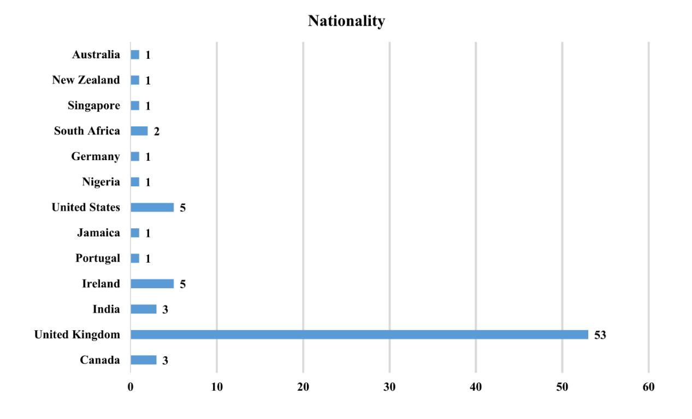
<!-- Image Description: The image is a horizontal bar chart titled "Nationality," displaying the distribution of participants' nationalities in a study. The chart shows the number of participants from various countries, with the United Kingdom having the highest number (53), followed by considerably fewer participants from other countries including Canada (3), India (3), Ireland (5), and the United States (5). The chart's purpose is to illustrate the geographical representation within the study's sample. -->
*Nationality of participants included in Experiment 1*#*Sample characteristics: Experiment 2*The number of studies participants had previously successfully completed on Prolific, the number of studies from which they were rejected, their approval rate, and the time they took to complete the experiment are shown in Table S2. The nationality of participants is shown on Figure S2.

## Table S2

|        | Number of               | Number of | Prolific | Time taken |  |  |
|--------|-------------------------|-----------|----------|------------|--|--|
|        | approvals rejections |           | scores   | (minutes)  |  |  |
| Min    | 18                      | 0         | 87       | 43.17      |  |  |
| Q1     | 103                     | 0         | 100      | 56.68      |  |  |
| Median | 208.5                   | 1         | 100      | 66.65      |  |  |
| Q3     | 447.75                  | 2         | 100      | 83         |  |  |
| Max    | 3526                    | 20        | 100      | 145        |  |  |
|        |                         |           |          |            |  |  |
*Supplementary information about participants included in Experiment 2 (n = 210)*# Figure S2
*Nationality of participants included in Experiment 2*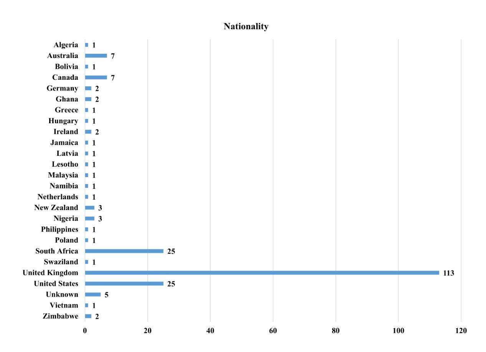
<!-- Image Description: The image is a horizontal bar chart displaying the nationality of participants in a study. The x-axis represents the count of participants, and the y-axis lists various nationalities (e.g., United States, United Kingdom, South Africa). The chart shows the distribution of participants across different countries, with the United States having the highest number (113). The purpose is to present the demographic data on participant nationality. -->

## Supplementary information about video stimuli

Stimuli used in Experiments 1 and 2 were edited based on the same eight videos showing people engaged in daily life activities (see Figure S3). These had previously been used in studies on event segmentation (e.g., Eisenberg & Zacks, 2016; Kurby & Zacks, 2011; Sargent et al., 2013). Data from these previous studies enabled us to create 40-s videos depicting events with either a high or a low number of normative event boundaries (EBs; see Table 3).

# Figure S3
*Daily life activities depicted in the eight basic videos*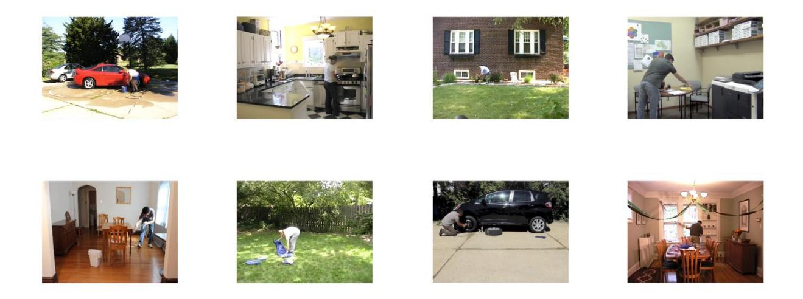
<!-- Image Description: This image is a montage of eight photographs depicting various scenes of everyday activities. The photos show people engaged in tasks such as car washing, cooking, yard work, car maintenance, and indoor cleaning. There are no graphs, charts, equations or diagrams; it appears to be a qualitative data illustration, possibly used in a paper about human activity recognition or a similar topic. The purpose is likely to visually represent the range of activities analyzed or used as a case study. -->
*Note. From left to right: a woman washing her car (432s), a woman preparing breakfast (329s), a man gardening (353 s), a man photocopying the pages of a book (348s), a man sweeping a room (329s), a lady setting up a tent (379s), a man changing the tire of his car (342s), a man preparing a livingroom for a birthday party (378s).*## Table S3

|                                          | Washing car | Breakfast | Gardening | Photocopying | Sweeping | Tent | Tire | Party |
|------------------------------------------|----------------|-----------|-----------|--------------|----------|------|------|-------|
| Number of participants in the norm | 40             | 42        | 42        | 28           | 28       | 67   | 28   | 42    |
| Number of normative EBs            | 1.65           | 4.62      | 8.17      | 5            | 5.8      | 2.18 | 3.79 | 5.24  |
| Density of EBs                        | Low            | Low       | High      | High         | High     | Low  | High | Low   |
*Supplementary information about the normative segmentation data of the selected 40-s videos*Experiment 1

## Experiment 2

|                                          | Washing car | Breakfast | Gardening | Photocopying | Sweeping | Tent | Tire | Party |
|------------------------------------------|----------------|-----------|-----------|--------------|----------|------|------|-------|
| Number of participants in the norm | 40             | 42        | 42        | 28           | 28       | 67   | 28   | 42    |
| Number of normative EBs            | 1              | 8.5       | 4.26      | 5            | 5.8      | 6    | 0.7  | 8.45  |
| Density of EBs                        | Low            | High      | Low       | High         | High     | High | Low  | Low   |
*Note. The number of normative EBs was computed by dividing the total number of EBs identified in the videos during previous studies by the number of participants who performed the segmentation task. In Experiment 2, despite the high number of keypresses, the party video was selected as a low EBs stimulus because the keypresses refer to the repetition of the same action (i.e., a man putting a plate on the table).*## Additional information about the complex span tasks

The unfolding of the trials was similar across the three tasks (OSpan, SymSpan, RotSpan). First, participants were presented with a problem from the processing task and were instructed to solve it as quickly as possible (and to click on the mouse as soon as it was done; this step must be completed within a limited time window; see Methods). Then, they gave their answer and immediately received a feedback. Immediately after, one of the items they had to memorize was briefly displayed. A new problem then appeared on the screen and so on. At recall, participants were asked to select the items they were presented with, in the order they were presented. They were provided with a "Blank" button to indicate that they remembered seeing an item but did not know which one and a "Clear" button for modifying their answers. After recall, they received a feedback on how many items they correctly recalled and how many errors they made during the processing problems. Immediately afterwards, the next trial began. The specificities of each task are shown in Figure S4.

Before each task, participants received built-in standardized instructions. Then, they received a practice session consisting of three parts. First, they were trained on the "storage" part alone, then on the "processing" part alone. During these first two parts, they received feedback after each answer they gave. Finally, they had to perform a series of trials including both the "storage" and the "processing" parts (as in the main task).

During the "processing only" part of the training, participants' response times were recorded. During the processing part of the main task, participants had to systematically give their answers within a defined time window (to minimize opportunities to refresh the to-beremembered items). The upper limit of this time window was individualized for each participant and corresponded to the participant's average response time during the last part of the training + 2.5*SD*s.

# Figure S4

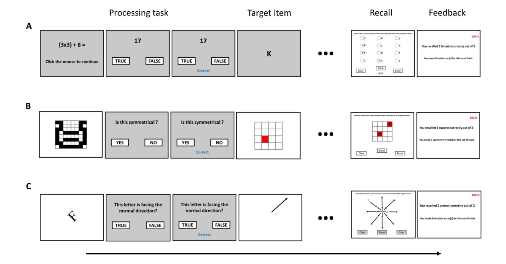
<!-- Image Description: This figure displays the experimental design of a cognitive psychology study. Three panels (A, B, C) illustrate trial sequences: processing tasks (arithmetic, symmetry judgment, orientation judgment); target item presentation; a recall phase (requiring subjects to reproduce the target); and feedback showing accuracy. Each panel showcases example stimuli and the user interface for responding and receiving feedback on performance. The figure visually details the study's procedure and stimulus presentation format. -->

## *Unfolding of a trial in the three complex span tasks*

*Note. Panel A: Operation span. Participants first see a math problem (parenthetical multiplication or division problem, followed by a number to add or subtract from the product or dividend ; e.g., (3x3) + 8 = ?; all terms and signs are randomly selected). Then, a digit (e.g., 3) is presented and the participants are required to click either a "true" or "false" box to indicate whether the number presented is the correct solution to the problem they saw just before. After receiving feedback on their response, they are presented with a letter for 1 s (consonant; written in Arial font, size 28). Then, another math problem is displayed and so on. At recall, a 4 x 3 matrix of letters (F, H, J, K, L, N, P, Q, R, S, T, and Y; i.e., the 12 letters used in the task) is displayed. Participants must select the letters they have seen, in the correct order, by checking the boxes next to them. Panel B: Symmetry span. During the processing task, an 8 × 8 matrix is presented with some squares filled with black. Then, participants have to judge whether the black-square design is symmetric along its vertical axis by clicking on either a "yes" or "no" box. Next, a 4 x 4 array with one cell filled with red is displayed for 650 ms. At recall, participants have to click on the cells of an empty matrix to reproduce the sequence of red square locations in the order they appeared during the previous presentations. Panel C: Rotation Span. The processing task starts with the presentation of a normal or mirror-reversed G, F, R, J or L rotated at 0°, 45°, 90°, 135°, 180°, 225°, 270°, or 315°. Then, participants must indicate whether the letter was in the normal orientation or mirror reversed (by clicking either on a "yes" or a "no" box). After that, a short or long arrow pointing in one of eight directions is displayed for 650 ms. At recall, participants are presented with eight short and eight long arrows radiating from the center of the screen. Participants have to recall all of the arrows from the preceding displays, in the order they appeared, by clicking on their head.*## Processing accuracy criteria in the WM tasks

When using complex span tasks to evaluate WM capacity, it is usually recommended to exclude participants who show poor performance on the processing part of the tasks (to avoid including participants who neglected the processing part of the tasks; Conway et al., 2005). A common approach is to exclude participants who scored below 85% of accuracy (Redick et al., 2012; Unsworth et al., 2005), which is what we had planned to do when preregistering the study. However, Gonthier et al. (2016) argued that this criterion is too severe and its application to our sample would have led the exclusion of more than 25% of the data. Thus, following the approach of Gonthier et al., (2016), we decided to only exclude participants whose processing accuracy was below the fifth lower percentile of the sample for one of the three tasks (see the*Method*section).

To ensure that the relations we observed between our variables of interest were not dependent on the chosen exclusion criterion, we also performed our main analyses (for the two experiments) with a dataset including only participants who scored above 85% on the processing parts of the three tasks. The results were similar to those reported in the main text (for Experiment 1, see Figure S5; for Experiment 2 see Figure S6).

## Figure S5
*Results for the main analyses of Experiment 1 when including only participants who scored above 85% for the processing part of each of the three complex span tasks (N participants =*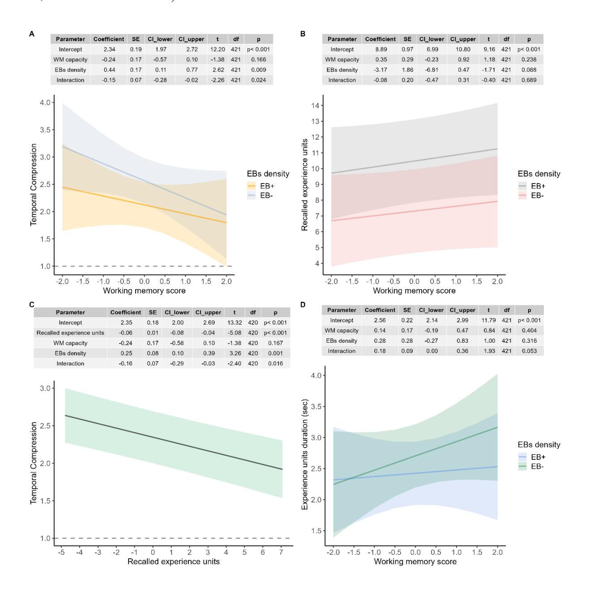
<!-- Image Description: The image presents four panels (A-D) analyzing the effects of working memory capacity and event boundary (EB) density on temporal compression and recalled experience. Panels A and B display regression tables and interaction plots showing the relationship between working memory and temporal compression, and working memory and recalled experience units, respectively, mediated by EB density. Panels C and D similarly present tables and plots illustrating relationships between recalled experience units and temporal compression, and working memory and experience duration, respectively, also mediated by EB density. The shaded areas in the plots represent confidence intervals. -->
*56, N observations = 425)*

*Note. (A) Prediction of temporal compression by WM capacity for high and low EBs density videos. (B) Prediction of the number of recalled experience units by WM capacity for high and low EBs density videos. (C) Prediction of temporal compression by the number of recalled experience units. (D) Prediction of remembered experience units duration by WM capacity, for high and low EBs density videos.*## Figure S6
*Results for the main analyses of Experiment 2 when including only participants who scored above 85% for the processing part of each of the three complex span tasks (N participants = 166, N observations = 1220)*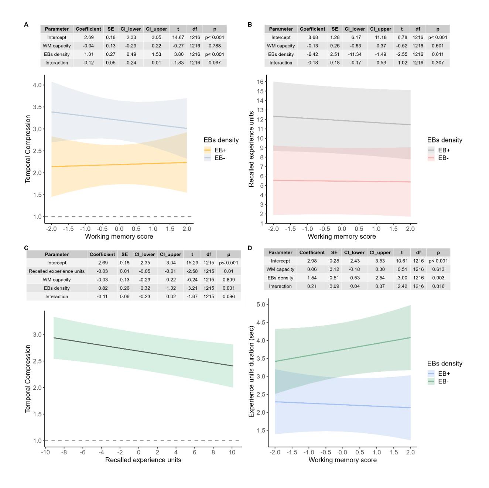
<!-- Image Description: The image presents four panels (A-D) displaying regression analyses results. Each panel includes a table showing regression coefficients, standard errors, confidence intervals, t-statistics, degrees of freedom, and p-values for different predictors (intercept, working memory capacity, EBs density, and interaction). Accompanying each table is a line graph visualizing the effects of working memory score and EBs density on temporal compression (A, C) and experience units duration (B, D). The graphs show interaction effects between working memory and EBs density on both dependent variables. -->
*Note. (A) Prediction of temporal compression by WM capacity for high and low EBs density videos. (B) Prediction of the number of recalled experience units by WM capacity for high and low EBs density videos. (C) Prediction of temporal compression by the number of recalled experience units. (D) Prediction of remembered experience units duration by WM capacity, for high and low EBs density videos.*## Inter-rater agreement

##*Experiment 1*Following guidelines proposed by Hallgren (2012) and Koo & Li (2016), inter-rater reliability was assessed with a*two-way agreement ICC*(single rater,*average-measures*; (McGraw & Wong, 1996; Shrout & Fleiss, 1979). The resulting *ICC* was 0.93 (95%*CI* [0.90, 0.95]). Nevertheless, the number of recalled experience units was not normally distributed. We thus computed a non-parametric agreement index (binomial proportions test; Bland & Altman, 1999), which indicated that the difference between the two raters was equal or inferior to one experience unit in 86.67% of the cases (95%*CI*[79.34, 91.67]). We further inspected the agreement between the two raters through a Bland-Altman analysis (Giavarina, 2015). We looked for the presence of potential fixed bias, or, in other words, systematic variations in the differences between the number of experience units identified by the first and the second rater as a function of the number of recalled experience units (computed by averaging estimations of the two raters). There was no notable bias.

##*Experiment 2*

Again we had good inter-rater agreement for the scoring of the number of recalled experience units (*ICC* = 0.96, 95%*CI* [0.94, 0.97], robust agreement = 0.80, 95%*CI*[0.76, 0.84]). The Bland-Altman analysis did not reveal any substantial bias.

## R packages

The R project dependencies were managed with renv version 0.17.3 (Ushey & Wickham, 2023). Data formatting and pre-processing were performed with the help of the dplyr package (v1.0.5; Wickham et al., 2021).

Internal consistency/reliability measures were computed with the psych package (v2.3.6; Revelle, 2023).

Regarding inter-rater agreement,*ICCs* were computed with the package irr (v0.84.1; Gamer et al., 2019) and the non-parametric agreement indices with the package SimplyAgree (v0.1.2; Caldwell, 2022)*.*Robust linear mixed-effects models were fitted with the robustlmm package (v2.4.4, Koller, 2016).*CIs*and*p-values*associated with fixed effects coefficients, as well as models'*R2s,*were computed with functions from the packages parameters (v0.13.0; Lüdecke et al., 2020) and performance (v0.7.1; Lüdecke et al., 2021). For each model, we extracted estimated marginal means, estimated marginal slopes and their standard errors with the package emmeans (v1.6.3; Lenth, 2016). Extraction of models' estimates across different values of manipulated variables (and their asymptotic 95%*CI*s) was done with the effects package (v4.2.0; Fox & Weisberg, 2019).

Tables were made with the packages insight (v0.14.15; Lüdecke et al., 2019), flextable (v0.9.1; Gohel & Skintzos, 2023) and rempsyc (v0.1.1; Thériault, 2023). Figures were made with the packages ggplot2 (v3.3.5; Wickham, 2016), gridExtra (v2.3; Auguie, 2017) and ggpubr (v0.4.0; Kassambara, 2020).

## Power analyses for Experiment 2

The sample size of Experiment 2 was estimated a priori using the R package simr (v1.0.5; Green & MacLeod, 2016; Kumle et al., 2021). We used data from Experiment 1 to run Monte-Carlo simulations (Brysbaert & Stevens, 2018; DeBruine & Barr, 2021) in order to estimate the power we would have for the detection of the interaction between WM capacity and EBs density in the prediction of temporal compression across a range of sample sizes (between 80 and 240 participants). The estimated power (and its 95% *CI*) for each sample size is reported on Figure S7 (panels A and B). We also conducted a sensitivity analysis. With a sample size fixed at 210 participants, we estimated the power we would have for the detection of an interaction, with an effect size from 5% to 20% smaller than the one observed in Experiment 1 (Figure S7C).

## Figure S7

*Power curves for the detection of the interaction between WM capacity and EBs density in the prediction of temporal compression (based on 1000 simulations)*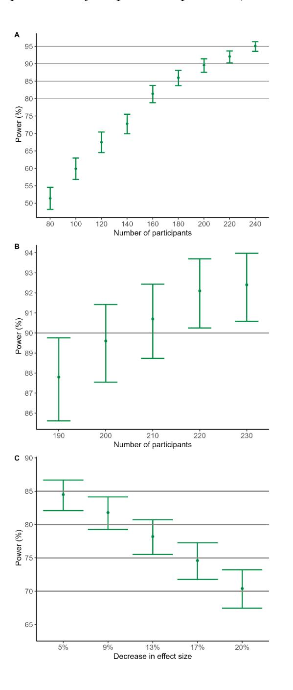
<!-- Image Description: The figure displays three graphs showing statistical power (%). Panel A plots power against the number of participants, demonstrating increasing power with more participants. Panel B shows a similar relationship, but with a different range of participant numbers. Panel C illustrates how power changes with decreasing effect size, revealing a decrease in power as the effect size diminishes. All graphs use error bars to indicate variability. The figure likely illustrates the impact of sample size and effect size on statistical power within the study. -->
*Note. (A) estimates of statistical power (and its 95% CI) across a range of sample sizes (ranging from 80 to 240 participants). (B) estimates for sample sizes ranging from 190 to 230 participants (zoom on the panel A). (C) estimates of the statistical power achievable with a sample size of 210 participants and an effect size from 5% to 20% smaller than the one obtained in Experiment 1.*## Descriptive statistics

Descriptive statistics for each WM task and outcome variables are shown in Tables S4 and S5 (for Experiment 1) and Tables S7 and S8 (for Experiment 2). A detailed distributional plot for each outcome variable is displayed in Figure S8 for Experiment 1 and S10 for Experiment 2. In Tables S6 (for Experiment 1) and S9 (for Experiment 2), we report correlations between all variables involved in the statistical analyses. Finally, Figures S9 (for Experiment 1) and S11 (for Experiment 2) show the distribution of the differences of temporal compression rates between EB+ and EB- stimuli as a function of participants' WM score.

## Table S4

| Span Tasks | Descriptive Statistics |       |      |       | Correlations (Pearson's r) |       |         |         |
|------------|------------------------|-------|------|-------|-------------------------------|-------|---------|---------|
|            | N                      | Mean  | SD   | Skew  | Kurtosis                      | OSpan | RotSpan | SymSpan |
| Ospan      | 78                     | 19.63 | 5.21 | -1.60 | 2.71                          |       |         | 0.34    |
| SymSpan    | 78                     | 10.37 | 2.67 | -0.37 | -0.48                         |       | 0.50    |         |
| RotSpan    | 78                     | 9.24  | 3.25 | -0.33 | -0.95                         | 0.17  |         |         |
*Descriptive statistics regarding WM tasks and correlations between them (Experiment 1)*## Table S5

##*Descriptive statistics for outcome variables (Experiment 1)*| Outcome                                  | N  | Mean | SD   | Skew  | Kurtosis | Distribution |
|------------------------------------------|----|------|------|-------|----------|--------------|
| TCR                                      | 78 | 3.19 | 2.60 | 2.44  | 7.07     |              |
| Recalled experience units          | 78 | 8.47 | 2.24 | -0.06 | -0.74    |              |
| Recalled experience units duration | 78 | 2.84 | 1.74 | 1.72  | 3.83     |              |

## Figure S8
*Density plot and descriptive statistics for the three outcome variables (Experiment 1). Values are reported separately for each EBs density*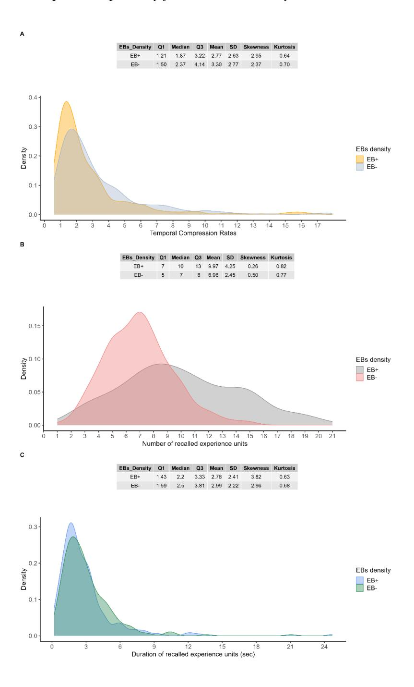
<!-- Image Description: The image contains three panels (A, B, C), each showing kernel density estimations of temporal experience data, comparing two groups (EB+, EB-). Panel A displays distributions of "Temporal Compression Rates," B shows "Number of recalled experience units," and C illustrates "Duration of recalled experience units (sec)." Each panel includes descriptive statistics (Q1, Median, Q3, Mean, SD, Skewness, Kurtosis) for both groups. The purpose is to visually compare and statistically describe the differences in temporal experience perception between the two groups. -->
*Note. (A) Temporal compression rates. (B) The number of recalled experience units. (C) The duration of recalled experience units. Skewness and Geary's kurtosis measures (Borroni & De Capitani, 2022; Geary, 1936) were computed with the package moments (v0.14.1; Komsta & Novomestky, 2022)*## Table S6

| Correlations between WM scores and the three outcome variables for EB- stimuli (Spearman's rho) |       |                                 |                                          |          |  |  |  |  |
|-------------------------------------------------------------------------------------------------------|-------|---------------------------------|------------------------------------------|----------|--|--|--|--|
|                                                                                                       | TCR   | Recalled experience units | Recalled experience units duration | WM Score |  |  |  |  |
| TCR                                                                                                   | 1.00  | -0.31                           | -0.87                                    | -0.25    |  |  |  |  |
| Recalled experience units                                                                       | -0.31 | 1.00                            | -0.09                                    | 0.28     |  |  |  |  |
| Recalled experience units duration                                                              | -0.87 | -0.09                           | 1.00                                     | 0.12     |  |  |  |  |
| WM Score                                                                                              | -0.25 | 0.28                            | 0.12                                     | 1.00     |  |  |  |  |
*Correlation matrices for Experiment 1*

**Correlations between WM scores and the three outcome variables for EB+ stimuli (Spearman's rho).**|                                          | TCR   | Recalled experience units | Recalled experience units duration | WM Score |
|------------------------------------------|-------|---------------------------------|------------------------------------------|----------|
| TCR                                      | 1.00  | -0.28                           | -0.77                                    | -0.16    |
| Recalled experience units          | -0.28 | 1.00                            | -0.28                                    | 0.25     |
| Recalled experience units duration | -0.77 | -0.28                           | 1.00                                     | -0.01    |
| WM Score                                 | -0.16 | 0.25                            | -0.01                                    | 1.00     |

## Figure S9
*Density plots representing the distribution of the differences of temporal compression between EB+ and EB- stimuli (at the subject level; Experiment 1)*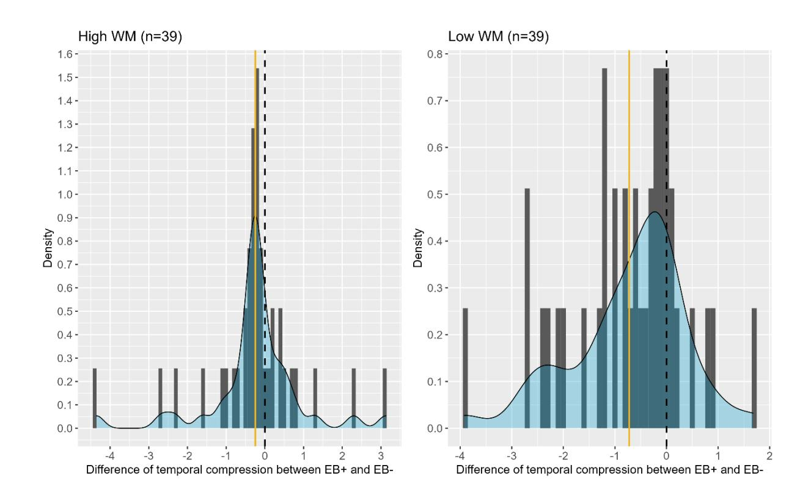
<!-- Image Description: The image displays two density plots, one for high working memory (WM) and one for low WM groups (n=39 each). Each plot shows the distribution of the difference in temporal compression between two conditions (EB+ and EB-). A vertical dashed line indicates the mean difference, while a solid line represents the median. The plots compare the distributions of temporal compression differences across the two WM groups, likely to investigate the impact of WM capacity on temporal perception. -->
*Note. The golden line represents the average difference. (A) participants whose WM score was above the sample median. (B) participants whose WM score was below the sample median.*## Table S7

| Descriptive statistics regarding WM tasks and correlations between them (Experiment 2) |
|----------------------------------------------------------------------------------------|
|----------------------------------------------------------------------------------------|

| Span Tasks | Descriptive Statistics |       |      |       |          | Correlations (Pearson's r) |         |         |
|------------|------------------------|-------|------|-------|----------|----------------------------|---------|---------|
|            | N                      | Mean  | SD   | Skew  | Kurtosis | OSpan                      | RotSpan | SymSpan |
| Ospan      | 210                    | 20.03 | 4.54 | -1.07 | 1.02     |                            |         | 0.31    |
| SymSpan    | 210                    | 9.93  | 3.04 | -0.63 | 0.14     |                            | 0.53    |         |
| RotSpan    | 210                    | 9.60  | 2.98 | -0.38 | -0.41    | 0.33                       |         |         |

## Table S8
*Descriptive statistics for outcome variables (Experiment 2)*| Outcome                                  | N   | Mean | SD   | Skew | Kurtosis | Distribution |
|------------------------------------------|-----|------|------|------|----------|--------------|
| TCR                                      | 210 | 3.61 | 2.75 | 1.71 | 3.26     |              |
| Recalled experience units             | 210 | 8.76 | 3.21 | 0.47 | 0.52     |              |
| Recalled experience units duration | 210 | 3.93 | 3.26 | 2.60 | 8.81     |              |

## Figure S10
*Density plot and descriptive statistics for the three outcome variables (Experiment 2). Values are reported separately for each EBs density*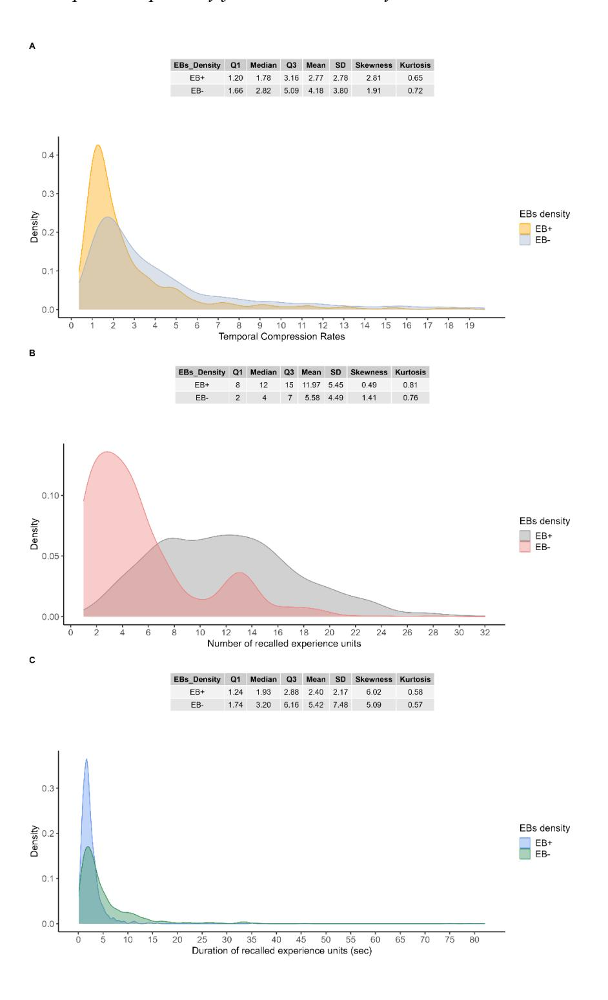
<!-- Image Description: The image displays three panels (A, B, C) of kernel density plots, each comparing distributions for two groups (EB+ and EB−). Panel A shows temporal compression rates, Panel B shows the number of recalled experience units, and Panel C shows the duration of recalled experience units (seconds). Each panel includes descriptive statistics (Q1, Median, Q3, Mean, SD, Skewness, Kurtosis) for both groups, highlighting differences in the distributions of these variables between EB+ and EB−. The plots visualize the data's distribution and allow for a comparison between the two groups. -->
*Note. (A) Temporal compression rates. (B) The number of recalled experience units. (C) The duration of recalled experience units.*## Table S9

| Correlations between WM scores and the three outcome variables for EB- stimuli (Spearman's rho) |       |                              |                                          |          |  |  |  |  |
|-------------------------------------------------------------------------------------------------------|-------|------------------------------|------------------------------------------|----------|--|--|--|--|
|                                                                                                       | TCR   | Recalled experience units | Recalled experience units duration | WM Score |  |  |  |  |
| TCR                                                                                                   | 1.00  | -0.27                        | -0.67                                    | -0.07    |  |  |  |  |
| Recalled experience units                                                                          | -0.27 | 1.00                         | -0.36                                    | -0.05    |  |  |  |  |
| Recalled experience units duration                                                              | -0.67 | -0.36                        | 1.00                                     | 0.10     |  |  |  |  |
| WM Score                                                                                              | -0.07 | -0.05                        | 0.10                                     | 1.00     |  |  |  |  |

#*Correlation matrices for Experiment 2*

**Correlations between WM scores and the three outcome variables for EB+ stimuli (Spearman's rho)**|                                          | TCR   | Recalled experience units | Recalled experience units duration | WM Score |
|------------------------------------------|-------|------------------------------|------------------------------------------|----------|
| TCR                                      | 1.00  | -0.44                        | -0.70                                    | -0.04    |
| Recalled experience units             | -0.44 | 1.00                         | -0.18                                    | -0.01    |
| Recalled experience units duration | -0.70 | -0.18                        | 1.00                                     | -0.02    |
| WM Score                                 | -0.04 | -0.01                        | -0.02                                    | 1.00     |

## Figure S11
*Density plots representing the distribution of the differences of temporal compression between EB+ and EB- stimuli (at the subject level; Experiment 2)*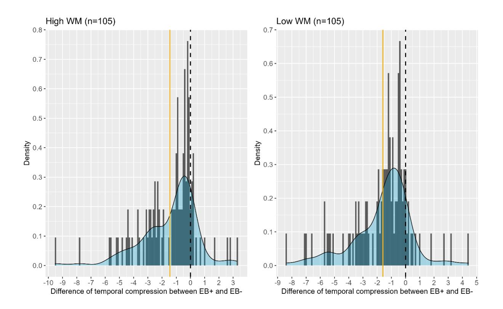
<!-- Image Description: The image presents two density plots comparing the difference in temporal compression between two groups (EB+ and EB-) for individuals with high and low working memory (WM). Each plot shows a histogram overlaid with a kernel density estimate. A gold vertical line indicates the mean difference, while a dashed black line marks zero difference. The plots illustrate the distribution of temporal compression differences and their relation to WM capacity. -->
*Note. The golden line represents the average difference. (A) participants whose WM score was above the sample median. (B) participants whose WM score was below the sample median.*## References

- Auguie, B. (2017).*gridExtra : Miscellaneous Functions for « Grid » Graphics*. https://CRAN.Rproject.org/package=gridExtra
- Bland, J. M., & Altman, D. G. (1999). Measuring agreement in method comparison studies. *Statistical Methods in Medical Reasearch*, *8*, 135‑160.

Borroni, C. G., & De Capitani, L. (2022). Some measures of kurtosis and their inference on large datasets. *AStA Advances in Statistical Analysis*, *106*(4), 573‑607. https://doi.org/10.1007/s10182-022-00442-y

- Brysbaert, M., & Stevens, M. (2018). Power Analysis and Effect Size in Mixed Effects Models: A Tutorial. *Journal of Cognition*, *1*(1), 9. https://doi.org/10.5334/joc.10
- Caldwell, A. R. (2022). SimplyAgree: An R package and jamovi Module for Simplifying Agreement and Reliability Analyses. *Journal of Open Source Software*, *7*(71), 4148. https://doi.org/10.21105/joss.04148
- Conway, A. R. A., Kane, M. J., Bunting, M. F., Hambrick, D. Z., Wilhelm, O., & Engle, R. W. (2005). Working memory span tasks: A methodological review and user's guide. *Psychonomic Bulletin & Review*, *12*(5), 769‑786. https://doi.org/10.3758/BF03196772
- DeBruine, L. M., & Barr, D. J. (2021). Understanding Mixed-Effects Models Through Data Simulation. *Advances in Methods and Practices in Psychological Science*, *4*(1), 251524592096511. https://doi.org/10.1177/2515245920965119
- Eisenberg, M. L., & Zacks, J. M. (2016). Ambient and focal visual processing of naturalistic activity. *Journal of Vision*, *16*(2), 5. https://doi.org/10.1167/16.2.5
- Fox, J., & Weisberg, S. (2019). *An R Companion to Applied Regression*(3rd éd.). Sage. https://socialsciences.mcmaster.ca/jfox/Books/Companion/index.html
- Gamer, M., Lemon, J., & Singh, I. F. P. (2019).*irr: Various Coefficients of Interrater Reliability and Agreement*. https://www.r-project.org
- Geary, R. C. (1936). Moments of the Ratio of the Mean Deviation to the Standard Deviation for Normal Samples. *Biometrika*, *28*, 295‑307.

- Giavarina, D. (2015). Understanding Bland Altman analysis. *Biochemia Medica*, *25*(2), 141‑151. https://doi.org/10.11613/BM.2015.015
- Gohel, D., & Skintzos, P. (2023). *flextable: Functions for Tabular Reporting*. https://CRAN.Rproject.org/package=flextable
- Gonthier, C., Thomassin, N., & Roulin, J.-L. (2016). The composite complex span: French validation of a short working memory task. *Behavior Research Methods*, *48*(1), 233‑242. https://doi.org/10.3758/s13428-015-0566-3
- Green, P., & MacLeod, C. J. (2016). SIMR: An R package for power analysis of generalized linear mixed models by simulation. *Methods in Ecology and Evolution*, *7*(4), 493‑498. https://doi.org/10.1111/2041-210X.12504
- Hallgren, K. A. (2012). Computing Inter-Rater Reliability for Observational Data: An Overview and Tutorial. *Tutorials in Quantitative Methods for Psychology*, *8*(1), 23‑34. https://doi.org/10.20982/tqmp.08.1.p023
- Kassambara, A. (2020). *ggpubr: Ggplot2 Based Publication Ready Plots*. https://rpkgs.datanovia.com/ggpubr/
- Koller, M. (2016). **robustlmm**: An *R*Package for Robust Estimation of Linear Mixed-Effects Models.*Journal of Statistical Software*, *75*(6). https://doi.org/10.18637/jss.v075.i06
- Komsta, L., & Novomestky, F. (2022). *moments: Moments, Cumulants, Skewness, Kurtosis and Related Tests*. https://CRAN.R-project.org/package=moments
- Koo, T. K., & Li, M. Y. (2016). A Guideline of Selecting and Reporting Intraclass Correlation Coefficients for Reliability Research. *Journal of Chiropractic Medicine*, *15*(2), 155‑163. https://doi.org/10.1016/j.jcm.2016.02.012
- Kumle, L., Võ, M. L.-H., & Draschkow, D. (2021). Estimating power in (generalized) linear mixed models : An open introduction and tutorial in R. *Behavior Research Methods*, *53*(6), 2528‑2543. https://doi.org/10.3758/s13428-021-01546-0
- Kurby, C. A., & Zacks, J. M. (2011). Age differences in the perception of hierarchical structure in events. *Memory & Cognition*, *39*(1), 75‑91. https://doi.org/10.3758/s13421-010-0027-2

- Lenth, R. V. (2016). Least-Squares Means: The *R*Package**lsmeans**. *Journal of Statistical Software*, *69*(1). https://doi.org/10.18637/jss.v069.i01
- Lüdecke, D., Ben-Shachar, M., Patil, I., & Makowski, D. (2020). Extracting, Computing and Exploring the Parameters of Statistical Models using R. *Journal of Open Source Software*, *5*(53), 2445. https://doi.org/10.21105/joss.02445
- Lüdecke, D., Ben-Shachar, M., Patil, I., Waggoner, P., & Makowski, D. (2021). performance: An R Package for Assessment, Comparison and Testing of Statistical Models. *Journal of Open Source Software*, *6*(60), 3139. https://doi.org/10.21105/joss.03139
- Lüdecke, D., Waggoner, P., & Makowski, D. (2019). insight: A Unified Interface to Access Information from Model Objects in R. *Journal of Open Source Software*, *4*(38), 1412. https://doi.org/10.21105/joss.01412
- McGraw, K. O., & Wong, S. P. (1996). Forming Inferences About Some Intraclass Correlation Coefficients. *Psychological Methods*, *1*(1), 30‑46.
- Redick, T. S., Broadway, J. M., Meier, M. E., Kuriakose, P. S., Unsworth, N., Kane, M. J., & Engle, R. W. (2012). Measuring Working Memory Capacity With Automated Complex Span Tasks. *European Journal of Psychological Assessment*, *28*(3), 164‑171. https://doi.org/10.1027/1015- 5759/a000123
- Sargent, J. Q., Zacks, J. M., Hambrick, D. Z., Zacks, R. T., Kurby, C. A., Bailey, H. R., Eisenberg, M. L., & Beck, T. M. (2013). Event segmentation ability uniquely predicts event memory. *Cognition*, *129*(2), 241‑255. https://doi.org/10.1016/j.cognition.2013.07.002
- Shrout, P. E., & Fleiss, J. L. (1979). Intraclass Correlations: Uses in Assessing Rater Reliability. *Psychological Bulletin*, *86*(2), 420‑428.
- Thériault, R. (2023). *rempsyc: Convenience Functions for Psychology*. https://rempsyc.remitheriault.com
- Unsworth, N., Heitz, R. P., Schrock, J. C., & Engle, R. W. (2005). An automated version of the operation span task. *Behavior Research Methods*, *37*(3), 498‑505. https://doi.org/10.3758/BF03192720

- Ushey, K., & Wickham, H. (2023). *renv: Project environments*. https://CRAN.Rproject.org/package=renv
- Wickham, H. (2016). *ggplot: Elegant Graphics for Data Analysis*. Springer-Verlag New York. https://ggplot2.tidyverse.org
- Wickham, H., François, R., Henry, L., & Müller, K. (2021). *dplyr: A Grammar of Data Manipulation*. https://CRAN.R-project.org/package=dplyr
- William Revelle. (2023). *psych: Procedures for Psychological, Psychometric, and Personality Research*. Northwestern University. https://CRAN.R-project.org/package=psych
