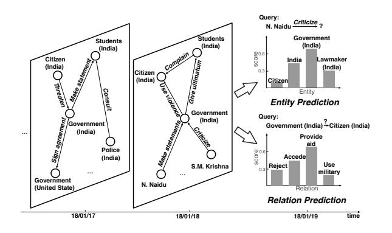
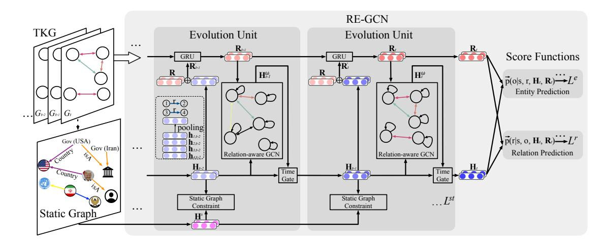
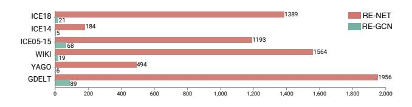

# Temporal Knowledge Graph Reasoning Based on Evolutional Representation Learning

Zixuan Li^1,2^, Xiaolong Jin^1,2^, Wei Li^3^, Saiping Guan^1,2^, Jiafeng Guo^1,2^, Huawei Shen^1,2^, Yuanzhuo Wang^1,2^ and Xueqi Cheng^1,2^

^1^School of Computer Science and Technology, University of Chinese Academy of Sciences, Beijing, China

^2^CAS Key Lab of Network Data Science and Technology, Institute of Computing Technology,

Chinese Academy of Sciences, Beijing, China

^3^Baidu Inc., Beijing, China

{lizixuan,jinxiaolong,guansaiping,guojiafeng,shenhuawei,wangyuanzhuo,cxq}@ict.ac.cn;liwei85@baidu.com

## ABSTRACT

Knowledge Graph (KG) reasoning that predicts missing facts for incomplete KGs has been widely explored. However, reasoning over Temporal KG (TKG) that predicts facts in the future is still far from resolved. The key to predict future facts is to thoroughly understand the historical facts. A TKG is actually a sequence of KGs corresponding to different timestamps, where all concurrent facts in each KG exhibit structural dependencies and temporally adjacent facts carry informative sequential patterns. To capture these properties effectively and efficiently, we propose a novel Recurrent Evolution network based on Graph Convolution Network (GCN), called RE-GCN, which learns the evolutional representations of entities and relations at each timestamp by modeling the KG sequence recurrently. Specifically, for the evolution unit, a relationaware GCN is leveraged to capture the structural dependencies within the KG at each timestamp. In order to capture the sequential patterns of all facts in parallel, the historical KG sequence is modeled auto-regressively by the gate recurrent components. Moreover, the static properties of entities, such as entity types, are also incorporated via a static graph constraint component to obtain better entity representations. Fact prediction at future timestamps can then be realized based on the evolutional entity and relation representations. Extensive experiments demonstrate that the RE-GCN model obtains substantial performance and efficiency improvement for the temporal reasoning tasks on six benchmark datasets. Especially, it achieves up to 11.46% improvement in MRR for entity prediction with up to 82 times speedup compared to the state-of-the-art baseline.

### CCS CONCEPTS

* **Computing methodologies**→**Temporal reasoning**.

*SIGIR '21, July 11–15, 2021, Virtual Event, Canada*© 2021 Association for Computing Machinery.

ACM ISBN 978-1-4503-8037-9/21/07…$15.00

<https://doi.org/10.1145/3404835.3462963>

### KEYWORDS

Temporal knowledge graph, evolutional representation learning, graph convolution network

### ACM Reference Format:

Zixuan Li^1,2^, Xiaolong Jin^1,2^, Wei Li^3^, Saiping Guan^1,2^, Jiafeng Guo^1,2^, Huawei Shen^1,2^, Yuanzhuo Wang^1,2^ and Xueqi Cheng^1,2^. 2021. Temporal Knowledge Graph Reasoning Based on Evolutional Representation Learning. In*Proceedings of the 44th International ACM SIGIR Conference on Research and Development in Information Retrieval (SIGIR '21), July 11–15, 2021, Virtual Event, Canada.*ACM, New York, NY, USA, [[10]](#ref-10) pages. <https://doi.org/10.1145/3404835.3462963>

### 1 INTRODUCTION

Knowledge Graphs (KGs) have facilitated many real-world applications [[44]](#ref-44). However, they are usually incomplete, which restricts the performance and range of KG-based applications. To alleviate this problem, reasoning over KG [[2]](#ref-2), [[35]](#ref-35) that attempts to predict missing facts, is a critical task in natural language processing. Traditionally, a KG is considered to be static multi-relational data. However, recent availability of a large amount of event-based interaction data [[3]](#ref-3) that exhibits complex temporal dynamics has created the need for approaches that can characterize and reason over Temporal Knowledge Graph (TKG) [[3]](#ref-3), [[11]](#ref-11), [[12]](#ref-12). A fact in a TKG can be represented in the form of (subject entity, relation, object entity, timestamp). Actually, a TKG can be denoted as a sequence of KGs with timestamps, each of which contains the facts that cooccur at the same timestamp. The left part of Figure [[1]](#ref-1) illustrates an example of TKG from the ICEWS18 [[16]](#ref-16) dataset. Despite the ubiquitousness of TKGs, the methods for reasoning over such kind of data are relatively unexplored both in effectiveness and efficiency.

Reasoning over a TKG from timestamps ^0^ to primarily has two settings, interpolation and extrapolation [[16]](#ref-16). The former [[4]](#ref-4), [[9]](#ref-9), [[21]](#ref-21) attempts to infer missing facts from ^0^ to [[16]](#ref-16). The latter [[16]](#ref-16), [[17]](#ref-17), [[33]](#ref-33), [[34]](#ref-34), which aims to predict future facts (events) for time*>*^t^, is much more challenging. For TKG, predicting new facts at future timestamps based on the observed historical KGs is helpful for understanding the hidden factors of events and responding to emerging events [[20]](#ref-20), [[25]](#ref-25), [[26]](#ref-26). Thus, reasoning under the extrapolation setting is very vital and can be helpful for many practical applications, such as disaster relief [[31]](#ref-31) and financial analysis [[1]](#ref-1). In this paper, the temporal reasoning tasks (i.e., reasoning under the extrapolation setting over TKGs) contains two subtasks as shown in the right part of Figure [[1]](#ref-1):

Permission to make digital or hard copies of all or part of this work for personal or classroom use is granted without fee that copies are not made or distributed for profit or commercial advantage and that copies bear this notice and the full citation on the first page. Copyrights for components of this work owned by others than ACM must be honored. Abstracting with credit is permitted. To copy otherwise, or republish, to post on servers or to redistribute to lists, requires prior specific permission and/or a fee. Request permissions from permissions@acm.org.

**Figure 1:** An illustration of temporal reasoning over a TKG. We present two subgraphs from the KGs at timestamps 18/01/17 and 18/01/18, respectively.
- **Entity Prediction**: Predict which entity will have a given relation together with a given entity at a certain future timestamp (e.g., Who will N.Naidu criticize on 18/01/19?);
- **Relation Prediction**: Predict the relation that will occur between two given entities at a certain future timestamp (e.g., What will happen between Government (India) and citizen (India) on 18/01/19?).

To accurately predict future facts, the model is required to dive deeply into historical facts. At each timestamp, entities influence each other via concurrent facts, which form a KG and exhibit complex **structural dependencies**. As an example shown in Figure [[1]](#ref-1), the concurrent facts on 18/01/18 demonstrates that *Government (India)*is under pressure from many people, which may influence the behaviors of*Government (India)*on 18/01/19. Besides, the behaviors of each entity embodied in temporally adjacent facts may carry informative**sequential patterns**. As shown in Figure [[1]](#ref-1), the historical behaviors of *N. Naidu*reflect his preferences and affect his future behaviors to a certain degree. The combination of these two kinds of historical information drives the behavioral trends and preferences of entities and relations.

Some earlier attempts, including Know-evolve [[33]](#ref-33) and its extension DyRep [[34]](#ref-34), learn evolutional entity representations by modeling the occurrence of all facts in the history as a temporal point process. However, they can not model concurrent facts at the same timestamps. Some recent attempts extract related historical information for each query in a heuristic manner. Specifically, RE-NET [[16]](#ref-16), [[17]](#ref-17) extracts those directly-engaged historical facts for the given entity in each query of entity prediction and then encodes them sequentially. CyGNet [[43]](#ref-43) models the historical facts with the same entity and relation to each query of entity prediction, and thus mainly focuses on predicting facts with repetitive patterns. As a TKG is actually a KG sequence, the existing methods have three main restrictions: (1) mainly focusing on the entity and relation of a given query and neglecting the structural dependencies among all the facts in the KG at each timestamp; (2) low efficiency by encoding the history for each query individually; (3) ignoring the function of some static properties of entities such as entity types. Besides, the existing methods only focus on entity prediction, while relation prediction cannot be solved simultaneously by the same model.

In this work, we treat TKG as a KG sequence and model the whole KG sequence simultaneously to encode all historical facts into entity and relation representations to facilitate both entity and relation prediction tasks. Thus, we propose a novel GCN-based Recurrent Evolution network, namely RE-GCN, which learns the evolutional representations of entities and relations at each timestamp by modeling the KG sequence recurrently. Specifically, for each evolution unit, a relation-aware GCN is leveraged to capture the structural dependencies within the KG at each timestamp. In this way, the interactions among all the facts in a KG can be effectively modeled. The historical KG sequence is modeled auto-regressively by the gate recurrent components to capture the sequential patterns across all temporally adjacent facts efficiently. All the historical information of entities and relations in the TKG are encoded in parallel. Moreover, the static properties of entities, such as entity types, are also incorporated via a static-graph constraint component to obtain better entity representations. Then, the tasks of entity prediction and relation prediction at future timestamps can be realized based on the evolutional representations.

In general, this paper makes the following contributions:

- We propose an evolutional representation learning model RE-GCN for temporal reasoning over TKGs, which considers the structural dependencies among concurrent facts in a KG, the sequential patterns across temporally adjacent facts, and the static properties of entities. To the best of our knowledge, this is the first study that integrates all of them into the evolutional representations for temporal reasoning.
- By characterizing TKG from the view of a KG sequence, RE-GCN efficiently models all the historical information in the TKG into evolutional representations, which are applicable for both entity and relation prediction simultaneously. Therefore, it enables up to 82 times speedup compared to the state-of-the-art baseline.
- Extensive experiments demonstrate that, by modeling the history more comprehensively, RE-GCN achieves consistently and significantly better performance (up to 11.46% improvement in MRR) over both entity and relation prediction tasks on six commonly used benchmarks.

### 2 RELATED WORKS

**Static KG Reasoning.**Existing models for static KG reasoning attempt to infer missing facts in KGs. Recently, embedding based models [[2]](#ref-2), [[6]](#ref-6), [[30]](#ref-30), [[35]](#ref-35), [[41]](#ref-41) have drawn much attention. As GCN [[19]](#ref-19) is a representative model to combine content and structural features in a graph, some studies have generalized it to relation-aware GCNs so as to deal with KGs. Among them, R-GCN [[28]](#ref-28) extends GCN with relation-specific filters, and WGCN [[30]](#ref-30) utilizes learnable relation-specific weights during aggregation. VR-GCN [[42]](#ref-42) and CompGCN [[36]](#ref-36) jointly embeds both nodes and relations in a relational graph during GCN aggregation. The above models are all set in the static KG, and they cannot predict facts in the future.
**Temporal KG Reasoning.**Reasoning over TKG can be categorized into two settings, interpolation and extrapolation [[16]](#ref-16). For the first setting, the models [[4]](#ref-4), [[8]](#ref-8)–[[10]](#ref-10), [[13]](#ref-13), [[21]](#ref-21), [[27]](#ref-27), [[37]](#ref-37), [[38]](#ref-38), [[40]](#ref-40) attempt to infer missing facts at the historical timestamps. TA-DistMult [[9]](#ref-9), TA-TransE [[9]](#ref-9) and TTransE [[21]](#ref-21) integrate the time when the facts

**Figure 2:** An illustrative diagram of the proposed RE-GCN model for temporal reasoning at timestamp *t* + 1.

| Notations | Descriptions |
|---|---|
| *G*~s~, *G*~t~ | TKG, static graph, KG at timestamp *t* in the TKG |
| V, R, E~t~ | entity set, relation set, fact set (at *t*) in the TKG |
| V~s~, R~s~, E~s~ | entity set, relation set, edge set in the static graph |
| H~t~, R~t~ | embedding matrices of entities, relations at *t* |
| H~0~, R~0~, H~s~ | randomly initialized embedding matrices of entities and relations, static embedding matrix of entities |
**Table 1:** Important notations and their descriptions.
occurred into the embeddings of relations. HyTE [[4]](#ref-4) associates each timestamp with a corresponding hyperplane. However, they are not able to predict facts at future timestamps and can not directly compatible with the extrapolation setting.

The extrapolation setting, which this paper focuses on, attempts to predict new facts at future timestamps based on historical ones. Orthogonal to our work, some models [[14]](#ref-14), [[33]](#ref-33), [[34]](#ref-34) conduct the future fact prediction by estimating the conditional probability via a temporal point process. They are more capable of modeling TKGs with continuous time, where no facts may occur at the same timestamp. Glean [[5]](#ref-5) incorporates a word graph constructed by the event summary into the modeling of future fact prediction. However, not all the events have the summary text in the practical application. CyGNet [[43]](#ref-43) and RE-NET [[16]](#ref-16) are the most related works with us. They attempt to solve the entity prediction task from the view of each given query, which encodes the historical facts related to the subject entity in each query. CyGNet uses a generate-copy network to model the frequency of the historical facts with the same subject entities and relations to the given queries (i.e., repetitive patterns). RE-NET applies a GCN and GRU to model the sequence of 1-hop subgraphs related to the given subject entity. They both neglect the structural dependencies within KGs at different timestamps and the static properties of entities. Differently, RE-GCN models the KG sequence as a whole, which considers all structural dependencies and enables great improvement in efficiency.

## 3 PROBLEM FORMULATION

A TKG can be formalized as a sequence of KGs with timestamps, i.e., *G* = {*G*~1~, *G*~2~, ..., *G*~t~, ...}. Each KG, *G*~t~ = (V, R, E~t~), at timestamp *t* is a directed multi-relational graph, where V is the set of

entities, R is the set of relations, and E~t~ is the set of facts at timestamp *t* (*t* is a discrete integer). Any fact in E~t~ can be denoted as a quadruple, (*s*, *r*, *o*, *t*), where *s*, *o* ∈ V and *r* ∈ R. It represents a fact of relation *r* that occurs with *s* as its subject entity and *o* as its object entity at timestamp *t*. For each quadruple (*s*, *r*, *o*, *t*), the inverse quadruple (*o*, *r*^-1^, *s*, *t*) is also appended to the dataset. The static graph is denoted as *G*~s~ = (V~s~, R~s~, E~s~), where V~s~, R~s~ and E~s~ are the entity set, the relation set and the set of edges in the static graph. The important mathematical notations are in Table [[1]](#ref-table-1).

The entity prediction task aims to predict the missing object entity of a query (*s*, *r*, ?*,* *t*+1) and the missing subject entity of a query (?*,* *r*, *o*, *t*+1). The relation prediction task attempts to predict the missing relation of a query (*s*, ?*,* *o*, *t*+1). Under the assumption that the prediction of the facts at a future timestamp *t* + 1 depends on the KGs at the latest *m* timestamps (i.e., {*G*~t-m+1~, ..., *G*~t~}) and the information of the historical KG sequence is modeled in the evolutional embedding matrices of the entities **H**~t~ ∈ R^|V|×d^ and the relations **R**~t~ ∈ R^|R|×d^ at timestamp *t* (*d* is the dimension of the embeddings), the two temporal reasoning tasks can be formulated as follows:
**Task 1. Entity Prediction.** Given a query (*s*, *r*, ?*,* *t*+1), RE-GCN models the conditional probability vector of all object entities with the subject entity *s*, the relation *r* and the historical KG sequence *G*~t-m+1:t~: given:

$$
\vec{p}(o|s,r,G_{t-m+1:t}) = \vec{p}(o|s,r,H_t,R_t). \tag{1}
$$
**Task 2. Relation Prediction.** Given a query (*s*, ?*,* *o*, *t*+1), RE-GCN models the conditional probability vector of all relations with the subject entity *s*, the object entity *o* and the historical KG sequence *G*~t-m+1:t~: given:

$$
\vec{p}(r|s, o, G_{t-m+1:t}) = \vec{p}(r|s, o, H_t, R_t). \tag{2}
$$

## 4 THE RE-GCN MODEL

RE-GCN integrates the structural dependencies in a KG at each timestamp, the informative sequential patterns across temporally adjacent facts, and the static properties of entities into the evolutional representations of entities and relations. Based on the learned entity and relation representations, temporal reasoning at future

timestamps can be made with various score functions. Thus RE-GCN contains an evolution unit and multi-task score functions, as illustrated in Figure [[2]](#ref-2). The former is employed to encode the historical KG sequence and obtain the evolutional representations of entities and relations. The latter contains score functions for corresponding tasks with the evolutional representations (i.e., embeddings) at the final timestamp as the input.

## 4.1 The Evolution Unit

The evolution unit consists of a relation-aware GCN, two gate recurrent components, and a static graph constraint component. The relation-aware GCN attempts to capture the structural dependencies within the KG at each timestamp. The two gate recurrent components model the historical KG sequence auto-regressively. Specifically, a time gate recurrent component and a GRU component get the evolutional representations of entities and relations at each timestamp correspondingly.The static graph constraint component integrates the static properties to the evolutional embeddings by adding some constraints between static embeddings and evolutional embeddings of entities. Formally, the evolution unit computes a mapping from a sequence of KGs at the latest *m* timestamps (i.e., {*G*~t-m+1~, ..., *G*~t~}) to a sequence of entity embedding matrices (i.e., {**H**~t-m+1~, ..., **H**~t~}) and a sequence of relation embedding matrices (i.e., {**R**~t-m+1~, ..., **R**~t~}) recurrently. Particularly, the input at the first timestamp, including the entity embedding matrix **H**~0~ and the relation embedding matrix **R**~0~, are randomly initialized.

4.1.1 **Structural Dependencies among Concurrent Facts.** The structural dependencies among concurrent facts capture the associations among the entities through facts and the associations among relations through the shared entities. Since each KG is a multi-relational graph and GCN is a powerful model for the graphstructured data [[28]](#ref-28), [[30]](#ref-30), [[36]](#ref-36), [[42]](#ref-42), an *L*-layer relation-aware GCN is used to model the structural dependencies. More specifically, for a KG at timestamp *t*, an object entity *o* at layer *l* ∈ [0*,* *L* − 1] gets information from its subject entities under a message-passing framework with embeddings of the relations at layer *l* considered and obtains its embedding at the next *l* + 1 layer, i.e.,

$$
\vec{h}_{o,t}^{l+1} = f\left(\frac{1}{c_o} \sum_{(s,r),\exists (s,r,o)\in\mathcal{E}_t} \mathbf{W}_1^l(\vec{h}_{s,t}^l + \vec{r}_t) + \mathbf{W}_2^l \vec{h}_{o,t}^l\right), \quad (3)
$$

where *h*^l^~s,t~, *h*^l^~o,t~, *r*~t~ denote the *l*^th^ layer embeddings of entities *s*, *o* and relation *r* at timestamp *t*, respectively; **W**^l^~1~, **W**^l^~2~ are the parameters for aggregating features and self-loop in the *l*^th^ layer; *h*^l^~s,t~+*r*~t~ implies the translational property between the subject entity and the corresponding object entity via the relation *r*; *c*~o~ is a normalization constant, equal to the in-degree of entity *o*; *f*(·) is the RReLU activation function [[39]](#ref-39). Note that, for those entities that are not involved in any fact, only a self-loop operation with the extra parameters **W**~3~ is carried out. Actually, the relation-aware GCN gets the entity embeddings according to the facts occurred among them at each timestamp and the self-loop operation can be considered as the self-evolution of the entities.

4.1.2**Sequential Patterns across Temporally Adjacent Facts.** For an entity *e*, the sequential patterns contained in its historical facts reflect its behavioral trends and preferences. To cover the historical facts as many as possible, the model needs to take all its temporally adjacent facts into consideration. As the output of the final layer of the relation-aware GCN, *h*^L-1^~e,t~, already models the structure of the adjacent facts at timestamp *t* − 1, one straightforward and effective approach to contain the information of the temporally adjacent facts is to use the output entity embedding matrix at *t* − 1, **H**~t-1~, as the input of the relation-aware GCN at *t*, **H**^0^~t~. Therefore, the potential sequential patterns are modeled by stacking the *L*-layer relation-aware GCN. However, although the adjacent KGs are different, the over-smoothing problem [[19]](#ref-19), i.e., the embeddings of entities converge to the same values, also exists when the repetitive relations occur between the same entity pairs at adjacent timestamps [[43]](#ref-43). And when the historical KG sequence gets longer, the large number of stacked layers of GCN may cause the vanishing gradient problem. Thus, following [[23]](#ref-23), we apply a time gate recurrent component to alleviate these problems. In this way, the entity embedding matrix **H**~t~ is determined by two parts, namely, the output **H**^ω^~t~ of the final layer of the relation-aware GCN at timestamp *t* and **H**~t-1~ from the previous timestamp. Formally,

$$
\mathbf{H}_t = \mathbf{U}_t \otimes \mathbf{H}_t^{\omega} + (1 - \mathbf{U}_t) \otimes \mathbf{H}_{t-1},\tag{4}
$$

where ⊗ denotes the dot product operation. The time gate **U**~t~ ∈ R^|V|×d^ conducts nonlinear transformation as:

$$
\mathbf{U}_t = \sigma(\mathbf{W}_4 \mathbf{H}_{t-1} + \mathbf{b}),\tag{5}
$$

where σ(·) is the sigmoid function and **W**^4^ ∈ R^d×d^ is the weight matrix of the time gate. Besides, the sequential pattern of relations captures the information of entities involved in the corresponding facts. Thus, the embeddings of a relation *r* at timestamp *t* are influenced by the evolutional embeddings of *r*-related entities V~r,t~ = {*e* | (*s*, *r*, *o*, *t*) or (*o*, *r*, *s*, *t*) ∈ E~t~} at timestamp *t* and its own embedding at timestamp *t* − 1. Thus, a GRU component is adopted to model the sequential pattern of relations.

By applying mean pooling operation over the embedding matrix of *r*-related entities at timestamp *t* − 1, **H**~t-1,V~r,t~~, the input of the GRU at timestamp *t* for relation *r*, is

$$
\vec{r}'_t = [pooling(\mathbf{H}_{t-1,\mathcal{V}_{r,t}}); \vec{r}], \tag{6}
$$

where *r*~0~ is the embedding of relation *r* in **R**~0~ and [; ] denotes the vector concatenation operation. For the relation that does not have corresponding facts occurred at timestamp *t*, *r*^'^~t~ = *r*~0~. Then we update the relation embedding matrix **R**~t-1~ to **R**~t~ via the GRU,

$$
\mathbf{R}_t = GRU(\mathbf{R}_{t-1}, \mathbf{R}'_t),\tag{7}
$$

where **R**~0~ ∈ R^|R|×d^ consists of *r*~0~ of all the relations. Note that, the L2-norm of each line of **H**~t~ and **R**~t~ is constrained to 1.

4.1.3**Static Properties.** Besides the information contained in the historical KG sequence, some static properties of entities, which form a static graph, can be seen as the background knowledge of the TKG and is helpful for the model to learn more accurate evolutional representations of entities. Thus we incorporate the static graph into the modeling of the evolutional representations. We construct the static graphs of the three TKGs from ICEWS based on the entity property information originally contained in the name strings of entities. Most name strings of entities therein

are in the form of 'entity types (country)'. Take an entity named 'Police (Australia)' in ICEWS18 [[17]](#ref-17) for example, we add relation 'isA' from this entity to the property entity 'Police' and relation 'country' to the property entity 'Australia'. The bottom left of figure [[2]](#ref-2) shows an example of a static graph. Since the static graph is a multi-relational graph and R-GCN [[28]](#ref-28) can model the multirelational graph without any more extra embeddings for relations. Thus, we adopt a 1-layer R-GCN [[28]](#ref-28) without self-loop to get the static embeddings of entities in the TKG. Then, the update rule for the static graph is defined as follows:

$$
\vec{h}_i^s = \Upsilon \left( \frac{1}{c_i} \sum_{(r^s, j), \exists (i, r^s, j)) \in \mathcal{E}^s} \mathbf{W}_{r^s} \vec{h}_i'^s(j) \right),\tag{8}
$$

where *h*~i~^s^ and *h*^'^~i~^s^ are the *i*^th^ and *i*^th^ lines of **H**~s~ and **H**^0^~s~, which are the output and randomly initialized input embedding matrices, respectively; **W**~r^s^ ∈ R^d×d^ is the relation matrix of *r*^s^ in R-GCN; Υ(·) is ReLU function; *c*~i~ is a normalization constant equal to the number of entities connected with entity *i*. Note that, ||*h*~i~^s^||^2^ = 1.

To reflect the static properties in the learned sequence of entity embedding matrices **H**~t-m~, **H**~t-m+1~,…**H**~t~, we confine the angle between the evolutional embedding and the static embedding of the same entity not to exceed a timestamp-related threshold. It increases over time since the permitted variable range of the evolutional embeddings of entities continuously extends over time with more and more facts occurring. Thus, it is defined as

$$
\theta_x = \min(\gamma x, 90^\circ),\tag{9}
$$

where γ denotes the ascending pace of the angle and *x* ∈ [0*,* *m* − 1*, ..,*]. We set the max angle of the two embeddings of an entity to 90°.

Then, the cosine value of the angle between the two embeddings of entity *i*, denoted as cos(*h*~i~^s^, *h*~t-m+x,i~), should be more than cosθ~x~.

Thus, the loss of the static graph constraint component at timestamp *t* can be defined as below:

$$
L_x^{st} = \sum_{i=0}^{|\mathcal{V}|-1} \max\{cos\theta_x - cos(\vec{h}_i^s, \vec{h}_{t-m+x,i}), 0\}. \tag{10}
$$

The loss of the static graph constraint component is *L*^st^ = Σ^m-1^~x=0~ *L*^st^~x~.

### 4.2 Score Functions for Different Tasks

Previous works [[6]](#ref-6), [[30]](#ref-30), [[36]](#ref-36) on KG reasoning involve score functions (i.e., decoder) to model the conditional probability in Equation [[1]](#ref-1) and [[2]](#ref-2), which can be seen as the probability score of candidate triples (*s*, *r*, *o*). As the previous work [[36]](#ref-36) shows that GCN with the convolutional score functions gets good performance on KG reasoning and in order to reflect the translational property of the evolutional embeddings of entities and relations implied in Equation [[3]](#ref-3), we choose ConvTransE [[30]](#ref-30) as our decoder. ConvTransE contains a one-dimensional convolution layer and a fully connected layer. We use ConvTransE(·) to represent these two layers. Then, the probability vector of all entities is:

$$
\vec{p}(o|s, r, \mathbf{H}_t, \mathbf{R}_t) = \sigma(\mathbf{H}_t \text{ConvTransE}(\vec{s}_t, \vec{r}_t)). \tag{11}
$$

Similarly, the probability vector of all the relations is:

$$
\vec{p}(r|s, o, \mathbf{H}_t, \mathbf{R}_t) = \sigma(\mathbf{R}_t \text{ConvTransE}(\vec{s}_t, \vec{o}_t)), \tag{12}
$$

where σ(·) is the sigmoid function, *s*~t~, *r*~t~, *o*~t~ are the embeddings of s, r and o in **H**~t~ and **R**~t~, respectively. ConvTransE(*s*~t~,*r*~t~)*,*ConvTransE (*s*~t~,*o*~t~) ∈ R^d×1^. The details of ConvTransE are omitted for brevity. Note that, ConvTransE can be replaced by other score functions.

## 4.3 Parameter Learning

Both the entity prediction task and the relation prediction task can be seen as the multi-label learning problems. Let *y*^e^~t+1~ ∈ R^|V|^ and *y*^r^~t+1~ ∈ R^|R|^ denote the label vectors for the two tasks at the timestamp *t* + 1, respectively. The elements of vectors *y*^e^~t+1~ ∈ R^|V|^ and *y*^r^~t+1~ ∈ R^|R|^ are 1 for facts that do occur, otherwise, 0. Then,

$$
L^{e} = \sum_{t=0}^{T-1} \sum_{(s,r,o,t+1) \in \mathcal{E}_{t+1}} \sum_{i=0}^{|\mathcal{V}|-1} y_{t+1,i}^{e} \log p_{i}(o|s,r,\mathbf{H}_{t},\mathbf{R}_{t}), \quad (13)
$$

$$
L^{r} = \sum_{t=0}^{T-1} \sum_{(s,r,o,t+1) \in \mathcal{E}_{t+1}} \sum_{i=0}^{|\mathcal{R}|-1} y_{t+1,i}^{r} \log p_i(r|s,o,\mathbf{H}_t, \mathbf{R}_t), \qquad (14)
$$

where *T* is the number of timestamps in the training set, *y*^e^~t+1,i~,*y*^r^~t+1,i~ is the *i*^th^ element in *y*^e^~t+1~, *y*^r^~t+1~. *p*~i~(*o* | *s*, *r*, **H**~t~, **R**~t~) and *p*~i~(*r* | *s*, *o*, **H**~t~, **R**~t~) are the probability score of entity *o* and relation *r*.

The two temporal reasoning tasks are conducted under the multitask learning framework. Therefore, the final loss *L* = *L*^e^ + *L*^r^ + *L*^st^. λ~1~ and λ~2~ are the parameters that control the loss terms.

## 4.4 Computational Complexity Analysis.

To see the efficiency of the proposed RE-GCN, we analyze the computational complexity of its evolution unit. The time complexity of the relation-aware GCN at a timestamp is *O*(|E~t~|), where |E~t~| is the maximum number of concurrent facts in the historical KG sequence. The pooling operation to get the input of the GRU component at every timestamp has the time complexity *O*(|R|*d*), where *d* is the maximum number of entities involved in a relation at timestamp *t* and |R| is the size of relation set. The time complexity to get the static embeddings is *O*(|E~s~|). As we unroll *m* steps for the GRU component and the relation-aware GCN, the time complexity for the evolution unit is finally *O*(*m*(|E~t~| + |R|*d*) + |E~s~|).

### 5 EXPERIMENTS

## 5.1 Experimental Setup

5.1.1 **Datasets.**There are six typical TKGs commonly used in previous works, namely, ICEWS18 [[16]](#ref-16), ICEWS14 [[9]](#ref-9), ICEWS05- 15 [[9]](#ref-9), WIKI [[21]](#ref-21), YAGO [[24]](#ref-24) and GDELT [[22]](#ref-22). The first three ones are from the Integrated Crisis Early Warning System [[3]](#ref-3) (ICEWS). GDELT [[16]](#ref-16) is from the Global Database of Events, Language, and Tone [[22]](#ref-22). We evaluate RE-GCN on all these datasets. We divide ICEWS14 and ICEWS05-15 into training, validation, and test sets, with a proportion of 80%, 10% and 10% by timestamps following [[16]](#ref-16). The details of the datasets are presented in Table [[2]](#ref-table-2). The time interval represents time granularity between temporally adjacent facts.

5.1.2**Evaluation Metrics.** In the experiments, MRR and Hits@{1*,* 3*,*10} are employed as the metrics for entity prediction and relation prediction. For the entity prediction task on WIKI and YAGO, we only report the MRR and Hits@3 results because the results of Hits@1 were not reported by the prior work RE-NET [[16]](#ref-16).

| Datasets | V | R | E~train~ | E~valid~ | E~test~ | E~s~ | V~s~ | Time interval |
|---|---|---|---|---|---|---|---|---|
| ICEWS18 | 23,033 | 256 | 373,018 | 45,995 | 49545 | 29,774 | 8,647 | 24 hours |
| ICEWS14 | 6,869 | 230 | 74,845 | 8,514 | 7,371 | 8,442 | 3,499 | 24 hours |
| ICEWS05-15 | 10,094 | 251 | 368,868 | 46,302 | 46,159 | 12,392 | 5,179 | 24 hours |
| WIKI | 12,554 | 24 | 539,286 | 67,538 | 63,110 | – | – | 1 year |
| YAGO | 10,623 | 10 | 161,540 | 19,523 | 20,026 | – | – | 1 year |
| GDELT | 7,691 | 240 | 1,734,399 | 238,765 | 305,241 | – | – | 15 mins |
**Table 2:** Statistics of the datasets (**|E~train~|**,** |E~valid~|**,**|E~test~|**are the numbers of facts in training, validation, and test sets.).**

As mentioned in [[7]](#ref-7), [[14]](#ref-14), [[15]](#ref-15), the filtered setting used in [[2]](#ref-2), [[16]](#ref-16), [[43]](#ref-43), which removes all the valid facts that appear in the training, validation, or test sets from the ranking list of corrupted facts, is not suitable for temporal reasoning tasks. Take a typical query (*s*, *r*, ?*,* *t*~1~) with answer *o*~1~ in the test set for example, and assume there is another fact (*s*, *r*, *o*~2~*,* *t*~2~). Under this filtered setting, *o*~2~ will be wrongly considered a correct answer and thus removed from the ranking list of candidate answers. However, *o*~2~ is incorrect for the given query, as (*s*, *r*, *o*~2~) occurs at timestamp *t*~2~ instead of *t*~1~. Thus, the filtered setting may probably get incorrect higher ranking scores. Without loss of generality, only the experimental results under the raw setting are reported.

5.1.3**Baselines.**The RE-GCN model is compared with static KG reasoning models and TKG reasoning models. DistMult [[41]](#ref-41), ComplEx [[35]](#ref-35), R-GCN [[28]](#ref-28), ConvE [[6]](#ref-6), ConvTransE [[30]](#ref-30), RotatE [[32]](#ref-32) are selected as static models. HyTE [[4]](#ref-4), TTransE [[21]](#ref-21) and TA-Dist Mult [[9]](#ref-9) are selected as the temporal models under the interpolation setting. For temporal models under the extrapolation setting, CyGNet [[43]](#ref-43) and RE-NET [[16]](#ref-16) are compared. For Know-evolve and DyRep, RE-NET extends them to the temporal reasoning task but does not release their codes. Thus, we only report the results in their papers. Besides, GCRN [[29]](#ref-29) is the model for homogeneous graphs and RE-NET extends it to R-GCRN by replacing GCN with R-GCN.

5.1.4**Implementation Details.** For the evolution unit, the embedding dimension is set to 200; the number of layers of the relation-aware GCN is set to 1 for YAGO and 2 for the other datasets; the dropout rate is set to 0.2 for each layer of the relation-aware GCN. We perform grid search on the length of the historical graph sequence (1, 15) and the ascending pace of the angle (1° -20°) on the validation sets. The optimal lengths of history for ICEWS18, ICEWS14, ICEWS05-15, WIKI, YAGO, and GDELT are 6, 3, 10, 2, 1, 1, respectively. γ is experimentally set to 10°. Adam [[18]](#ref-18) is adopted for parameter learning with the learning rate of 0.001. As for the R-GCN used in the static graph constraint component, we set the block dimension to 2 × 2 and the dropout rate for each layer to 0*.2*. For ConvTransE, the number of kernels is set to 50, the kernel size is set to 2 × 3 and the dropout rate is set to 0*.2*. For the joint learning of the entity prediction task and the relation prediction task, λ~1~ and λ~2~ are experimentally set to 0*.7* and 0*.3*, respectively. The statistics of the static graphs are presented in Table [[2]](#ref-table-2). We only report the results without the static graph constraint on WIKI, YAGO and GDELT because the static information is missing in these datasets. To conduct the multi-step inference [[16]](#ref-16), which seeks to predict the facts at different timestamps in the validation set and the test set

based on the observations in the training set, we evaluate the performance of RE-GCN with the evolutional embeddings at the final timestamp of the training set as the input of score functions following [[43]](#ref-43). Besides, we also report the results of the models with ground truth history given during multi-step inference on the test set, namely, w. GT. All experiments are carried out on Tesla V100. Codes are available at <https://github.com/Lee-zix/RE-GCN>.

## 5.2 Experimental Results

| Model | | | ICE18 | | ICE14 | | | | ICE05-15 | | | |
|---|---|---|---|---|---|---|---|---|---|---|---|---|
| | MRR | H@1 | H@3 | H@10 | MRR | H@1 | H@3 | H@10 | MRR | H@1 | H@3 | H@10 |
| DistMult | 13.86 | 5.61 | 15.22 | 31.26 | 20.32 | 6.13 | 27.59 | 46.61 | 19.91 | 5.63 | 27.22 | 47.33 |
| ComplEx | 15.45 | 8.04 | 17.19 | 30.73 | 22.61 | 9.88 | 28.93 | 47.57 | 20.26 | 6.66 | 26.43 | 47.31 |
| R-GCN | 15.05 | 8.13 | 16.49 | 29.00 | 28.03 | 19.42 | 31.95 | 44.83 | 27.13 | 18.83 | 30.41 | 43.16 |
| ConvE | 22.81 | 13.63 | 25.83 | 41.43 | 30.30 | 21.30 | 34.42 | 47.89 | 31.40 | 21.56 | 35.70 | 50.96 |
| ConvTransE | 23.22 | 14.26 | 26.13 | 41.34 | 31.50 | 22.46 | 34.98 | 50.03 | 30.28 | 20.79 | 33.80 | 49.95 |
| RotatE | 14.53 | 6.47 | 15.78 | 31.86 | 25.71 | 16.41 | 29.01 | 45.16 | 19.01 | 10.42 | 21.35 | 36.92 |
| HyTE | 7.41 | 3.10 | 7.33 | 16.01 | 16.78 | 2.13 | 24.84 | 43.94 | 16.05 | 6.53 | 20.20 | 34.72 |
| TTransE | 8.44 | 1.85 | 8.95 | 22.38 | 12.86 | 3.14 | 15.72 | 33.65 | 16.53 | 5.51 | 20.77 | 39.26 |
| TA-DistMult | 16.42 | 8.60 | 18.13 | 32.51 | 26.22 | 16.83 | 29.72 | 45.23 | 27.51 | 17.57 | 31.46 | 47.32 |
| RGCRN | 23.46 | 14.24 | 26.62 | 41.96 | 33.31 | 24.08 | 36.55 | 51.54 | 35.93 | 26.23 | 40.02 | 54.63 |
| CyGNet | 24.98 | 15.54 | 28.58 | 43.54 | 34.68 | 25.35 | 38.88 | 53.16 | 35.46 | 25.44 | 40.20 | 54.47 |
| RE-NET | 26.17 | 16.43 | 29.89 | 44.37 | 35.77 | 25.99 | 40.10 | 54.87 | 36.86 | 26.24 | 41.85 | 57.60 |
| RE-GCN | 27.51 | 17.82 | 31.17 | 46.55 | 37.78 | 27.17 | 42.50 | 58.84 | 38.27 | 27.43 | 43.06 | 59.93 |
| RE-GCN w. GT | 30.55 | 20.00 | 34.73 | 51.46 | 41.50 | 30.86 | 46.60 | 62.47 | 46.41 | 35.17 | 52.76 | 67.64 |

**Table 3:** Performance (in percentage) for the entity prediction task on ICEWS18, ICESW14 and ICEWS05-15 with raw metrics.

| Model | | WIKI | | | YAGO | | | | GDELT | |
|---|---|---|---|---|---|---|---|---|---|---|
| | MRR | H@3 | H@10 | MRR | H@3 | H@10 | MRR | H@1 | H@3 | H@10 |
| DistMult | 27.96 | 32.45 | 39.51 | 44.05 | 49.70 | 59.94 | 8.61 | 3.91 | 8.27 | 17.04 |
| ComplEx | 27.69 | 31.99 | 38.61 | 44.09 | 49.57 | 59.64 | 9.84 | 5.17 | 9.58 | 18.23 |
| R-GCN | 13.96 | 15.75 | 22.05 | 20.25 | 24.01 | 37.30 | 12.17 | 7.40 | 12.37 | 20.63 |
| ConvE | 26.03 | 30.51 | 39.18 | 41.22 | 47.03 | 59.90 | 18.37 | 11.29 | 19.36 | 32.13 |
| ConvTransE | 30.89 | 34.30 | 41.45 | 46.67 | 52.22 | 62.52 | 19.07 | 11.85 | 20.32 | 33.14 |
| RotatE | 26.08 | 31.63 | 38.51 | 42.08 | 46.77 | 59.39 | 3.62 | 0.52 | 2.26 | 8.37 |
| HyTE | 25.40 | 29.16 | 37.54 | 14.42 | 39.73 | 46.98 | 6.69 | 0.01 | 7.57 | 19.06 |
| TTransE | 20.66 | 23.88 | 33.04 | 26.10 | 36.28 | 47.73 | 5.53 | 0.46 | 4.97 | 15.37 |
| TA-DistMult | 26.44 | 31.36 | 38.97 | 44.98 | 50.64 | 61.11 | 10.34 | 4.44 | 10.44 | 21.63 |
| RGCRN | 28.68 | 31.44 | 38.58 | 43.71 | 48.53 | 56.98 | 18.63 | 11.53 | 19.80 | 32.42 |
| CyGNet | 30.77 | 33.83 | 41.19 | 46.72 | 52.48 | 61.52 | 18.05 | 11.13 | 19.11 | 31.50 |
| RE-NET | 30.87 | 33.55 | 41.27 | 46.81 | 52.71 | 61.93 | 19.60 | 12.03 | 20.56 | 33.89 |
| RE-GCN | 39.84 | 44.43 | 53.88 | 58.27 | 65.62 | 75.94 | 19.15 | 11.92 | 20.40 | 33.19 |
| RE-GCN w. GT | 51.53 | 58.29 | 69.53 | 63.07 | 71.17 | 82.07 | 19.31 | 11.99 | 20.61 | 33.59 |
**Table 4:** Performance (in percentage) for the entity prediction task on WIKI, YAGO and GDELT with raw metrics.

5.2.1 **Results on Entity Prediction.** The experimental results on the entity prediction task are presented in Tables [[3]](#ref-table-3) and [[4]](#ref-table-4). RE-GCN consistently outperforms the baselines on the three ICEWS datasets, WIKI and YAGO. The results convincingly verify its effectiveness. Specifically, RE-GCN significantly outperforms the static models (i.e., those in the first blocks of Tables [[3]](#ref-table-3) and [[4]](#ref-table-4)) because RE-GCN considers the sequential patterns across timestamps. RE-GCN performs better than the temporal models for the interpolation setting (i.e., those in the second blocks of Tables [[3]](#ref-table-3) and [[4]](#ref-table-4)) because RE-GCN additionally captures temporally sequential patterns and static properties of entities. It can thus obtain more accurate evolutional representations for the unobserved timestamps. Especially, RE-GCN outperforms the temporal models for the extrapolation setting (i.e., those in the third blocks of Tables [[3]](#ref-table-3) and [[4]](#ref-table-4)). It outperforms RGCRN because the newly designed graph convolution operation and the two recurrent components in the evolution unit learn better evolutional embeddings and the static graph helps learn better evolutional embeddings of entities. CyGNet and RE-NET's good performance verify the importance of the repetitive patterns and 1-hop neighbors to the entity prediction task. Despite this, it is not surprising that RE-GCN performs better than CyGNet because there is much useful information except the repetitive patterns in the history. RE-GCN also performs better than RE-NET, which neglects the structural dependencies within a KG and the static properties of entities. By capturing more comprehensive structural dependencies and sequential patterns, RE-GCN outperforms RE-NET on most datasets. From the last two lines in Tables [[3]](#ref-table-3) and [[4]](#ref-table-4), it can be observed that the performance gap between the last two lines becomes large when the time interval between two adjacent timestamps of the datasets becomes large. For the two datasets, WIKI and YAGO, with the time interval as one year, the model's performance drops rapidly without knowing the ground truth history. This is because the evolutional representations become inaccurate when the time interval is large during the multi-step inference.

Note that RE-GCN even achieves the improvements of 8.97/11.46 % in MRR, 10.60/12.91% in Hits@3 and 12.61/14.01% in Hits@10

| Model | | | ICE18 ICE14 ICE05-15 | | | WIKI YAGO GDELT |
|---|---|---|---|---|---|---|
| ConvE | 37.73 | 38.80 | 37.89 | 78.23 | 91.33 | 18.84 |
| ConvTransE | 38.00 | 38.40 | 38.26 | 86.64 | 90.98 | 18.97 |
| RGCRN | 37.14 | 38.04 | 38.37 | 88.88 | 90.18 | 18.58 |
| RE-GCN | 39.48 | 39.73 | 38.56 | 95.63 | 95.18 | 19.17 |
| RE-GCN w.GT | 40.53 | 41.06 | 40.63 | 97.92 | 97.74 | 19.22 |
**Table 5:** Performance on the relation prediction task.
over the best baseline on WIKI and YAGO. For the two datasets, there are more structural dependencies at each timestamp because the time interval is much large than the other datasets. Therefore, only modeling repetitive patterns or one-hop neighbors will lose a lot of structural dependencies and sequential patterns. The results demonstrate that RE-GCN is more capable of modeling these

datasets containing complex structural dependencies among concurrent facts.

The experimental results of static models and temporal models are similarly poor on GDELT, as compared with those of the other five datasets. We further analyze the GDELT dataset and find that many of its entities are abstract concepts that do not indicate specific entities (e.g., POLICE and GOVERNMENT). Among the top 50 frequent entities, 28 are abstract concepts and 43.72% corresponding facts involve abstract concepts. Those abstract concepts make the temporal reasoning for some entities under the raw setting almost impossible, since we cannot predict a government's activities without knowing which country it belongs to. Thus, all the models can only predict partial facts in the GDELT dataset and get similar results. Besides, the noise produced by the abstract concepts influences the evolutional representations of other entities as RE-GCN

| Model | | | ICE18 ICE14 ICE05-15 | | | WIKI YAGO GDELT |
|---|---|---|---|---|---|---|
| RE-GCN w. GT | 30.55 | 41.50 | 46.41 | 51.53 | 63.07 | 19.31 |
| RE-NET w. GT | 27.87 | 39.13 | 42.92 | 32.44 | 48.60 | 21.29 |
| -EE w. GT | 23.22 | 31.50 | 30.28 | 30.89 | 46.67 | 19.07 |
| +FCN w. GT | 29.32 | 40.34 | 45.89 | 46.00 | 58.96 | 19.02 |
| -st w. GT | 29.10 | 39.48 | 44.68 | – | – | – |
| -tg w. GT | 24.51 | 34.85 | 37.65 | 51.70 | 62.23 | 18.55 |
**Table 6:** Ablation studies on entity prediction.
models the KG sequence as a whole, which makes the results of RE-GCN a little worse than RE-NET.

5.2.2**Results on Relation Prediction.**Since some models are not designed for the relation prediction task and for space limitation, we select the typical ones from the baselines and present the experimental results in terms of only MRR in Table [[5]](#ref-table-5). In more detail, we select ConvE [[6]](#ref-6), ConvTransE [[30]](#ref-30) from the static models, as well as RGCRN [[29]](#ref-29) from the temporal models. RE-NET and CyGNet are not adopted, as they cannot be applied to the relation prediction task directly. It can observe that RE-GCN performs better than all the baselines. The outperformance of RE-GCN demonstrates that our evolution unit can obtain more accurate evolutional representations by modeling the history comprehensively.

The performance gap between RE-GCN and other baselines on the relation prediction task is smaller than the entity prediction task. It is because the number of relations is much less than the number of entities. Fewer candidates make the relation prediction task much easier than the entity prediction task. The performance on WIKI and YAGO is much better than the other datasets because the numbers of relations in the two datasets are only 24 and 10, respectively. The results on the GDELT dataset for the static models and the temporal models are also similarly poor, which verifies our observations mentioned in Section [[5.2.1]](#ref-5-2-1) again.

## 5.3 Comparison on Prediction Time

**Figure 3:** Runtime (seconds) comparison to RE-NET.
To investigate the efficiency of RE-GCN, we compare RE-GCN to RE-NET in terms of runtime for entity prediction on the test set under the same environment. For a fair comparison, the two models conduct entity prediction with the ground truth history given. From the results in Fig [[3]](#ref-3), it can be seen that RE-GCN is much faster than RE-NET by 66, 36, 17, 82, 82, 22 times on ICE18, ICE14, ICE05-15, WIKI, YAGO, and GDELT, respectively. It is because RE-NET processes individual queries one by one for each timestamp, while RE-GCN characterizes the evolutional representation learning from the view of KG sequence and obtains the representations for all the queries at the same timestamp simultaneously. Therefore, RE-GCN is more efficient than the best baseline, RE-NET.

| Model | | | ICE18 ICE14 ICE05-15 | | | WIKI YAGO GDELT |
|---|---|---|---|---|---|---|
| RE-GCN w. GT | 40.53 | 41.06 | 40.63 | 97.92 | 97.74 | 19.22 |
| RGCRN w. GT | 38.07 | 38.28 | 39.33 | 90.12 | 91.27 | 18.73 |
| -EE w. GT | 38.00 | 38.40 | 38.26 | 86.64 | 90.98 | 18.97 |
| +FCN w. GT | 39.63 | 40.23 | 40.55 | 97.23 | 93.66 | 19.03 |
| -st w. GT | 39.23 | 40.00 | 40.38 | – | – | – |
| -tg w. GT | 37.47 | 38.14 | 37.62 | 97.56 | 93.86 | 18.94 |
**Table 7:** Ablation studies on relation prediction.
### 5.4 Ablation Studies

To eliminate the bias between training and testing on the results, we conduct all ablation studies with ground truth history given on the test sets. To further show the effectiveness of each part of RE-GCN, we also report the results of RE-NET w. GT in Table [[6]](#ref-table-6) and the results of RGCRN w. GT in Table [[7]](#ref-table-7).

5.4.1**Impact of the Evolution Unit.**To demonstrate how the evolution unit contributes to the final results of RE-GCN, we conduct experiments of only using the ConvTransE score function with the randomly initialized learnable embeddings. The results denoted as -EE w. GT, are demonstrated in Tables [[6]](#ref-table-6) and [[7]](#ref-table-7). It can be observed that removing the evolution unit has a great impact on the results for all the datasets except GDELT, suggesting that modeling the historical information is vital for all the datasets. For GDELT, only using the ConvTransE can get good results. It also matches our observations mentioned in Section [[5.2.1]](#ref-5-2-1).

To further verify the effectiveness of our evolution unit under different score functions, we replace the ConvTransE in RE-GCN with a simple one layer Fully Connected Network (FCN), denoted as +FCN w. GT. The experimental results are presented in Tables [[6]](#ref-table-6) and [[7]](#ref-table-7). It can be observed that the results are worse than RE-GCN w. GT on most datasets. It matches the observation in [[42]](#ref-42), the convolutional score functions are more suitable for the GCN. However, even with a simple score function, +FCN w. GT still shows strong performance on both entity and relation predictions.

5.4.2**Impact of the Static Graph Constraint Component.**The results denoted as –st w. GT in Tables [[6]](#ref-table-6) and [[7]](#ref-table-7) demonstrate the performance of RE-GCN without the static graph constraint component. It can be seen that –st w. GT performs consistently worse than RE-GCN w. GT in ICEWS datasets, which justifies the necessity of the static graph constraint component to the RE-GCN model. The static information can be seen as the background knowledge of the TKG. The entity type and location information in the static graph enriches the evolutional representations of entities and helps obtain better initial evolutional representations of entities. Note that, even without the static information, –st w. GT still outperforms the state-of-art RE-NET w. GT and RGCRN w. GT.

5.4.3**Impact of the Time Gate Recurrent Component.**–tg w. GT in Tables [[6]](#ref-table-6) and [[7]](#ref-table-7) denote the variants of RE-GCN directly using the evolutional representations at the last timestamp as the input of the evolution unit at the current timestamp without the time gate. The performance of –tg w. GT decreases rapidly when the historical KG sequence gets longer, as compared to RE-GCN w. GT, which sufficiently indicates the necessity of the time gate recurrent

| History at *t* − 2 | History at *t* − 1 | Query at *t* | Answer |
|---|---|---|---|
| Protester, Demonstrate, Defense ministry | Defense ministry, Endorse, Police | Protester, ?, Police | Protest violently |
| Citizen, Conduct bombing, Government | Government, Make statement, Defense ministry Defense Ministry, Make Statement, Police | Defense ministry, Make request, ? | Citizen |
| New Zealand, Host a visit, FIJI | New Zealand, Criticize, Japan | New Zealand, Diplomatic cooperation, ? | FIJI |
**Table 8:** Case study. The first two lines are two cases for entity prediction and the last line is a case for relation prediction.

| Tasks | Entity Prediction | | | | | | | Relation Prediction | | | | | | | | | | | | |
|---|---|---|---|---|---|---|---|---|---|---|---|---|---|---|---|---|---|---|---|---|---|
| Subsets | | seen | | | | | unseen | | | seen | | | | unseen | | | | | | |
| | a | b | c | d | e | a | b | c | d | e | a | b | c | d | e | a | b | c | d | e |
| % | 0 | 1.8 | 3.9 | 13.8 | 21.0 | 19.8 | 7.6 | 9.1 | 9.8 | 13.2 | 0 | 22.3 | 6.0 | 5.2 | 1.0 | 37.3 | 8.7 | 11.4 | 5.2 | 1.0 |
| H@3 | 0 | 78.6 | 78.4 | 71.6 | 53.3 | 35.2 | 33.2 | 28.8 | 21.4 | 6.9 | 0 | 76.1 | 68.8 | 51.1 | 29.0 | 48.6 | 42.2 | 37.0 | 33.5 | 30.6 |
**Table 9:** Hits@3 on different subsets from the validation set of ICEWS18. The % row shows the proportion of each subset.
component. Actually, the time gate recurrent component helps RE-GCN capture the sequence patterns by a deep-stacked GCN, which usually faces the over-smoothing and vanishing gradient problems when the number of layers becomes large.

## 5.5 Case Study

In order to show the structural dependencies among concurrent facts and the sequential patterns across temporally adjacent facts learned by RE-GCN, we illustrate in Table [[9]](#ref-table-9) three cases from the test set of ICEWS18 where RE-GCN ranks the right answers at the top. The first case shows the sequential pattern that*(A, host a visit, B, t-2)*can lead to*(A, diplomatic cooperation, B, t)*. The second case shows that the sequential pattern *(A, Conduct bombing, B, t-2)*, *(B, Make statement, C, t-1)*and structural dependencies of*C*at timestamp −1 joint lead to the final result. The third case illustrates the sequential pattern*(A, Demonstrate, B, t-2), (B, Endorse, C, t-1)*helps the relation prediction*(A, ?, C, t)*. By modeling the KG sequence as a whole, RE-GCN does not omit useful information in the history.

## 5.6 Detailed Analysis

In order to get insight into the performance of RE-GCN on different kinds of data, we conduct a detailed analysis on the validation set of ICEWS18. For entity prediction, we split the validation set according to the number of the one-hop neighbors of a given entity (0 (a), 1 (b), 2-3 (c), 4-10 (d), >10 (e)) and whether the answer entity has direct interactions with the given entity (i.e., seen and unseen) at the latest *m* (=6) timestamps. For relation prediction, we split the validation set according to the number of relations between two given entities (0 (a), 1 (b), 2-3 (c), 4-10 (d), >10 (e)) and whether the answer relation occurred between the given entities at the latest *m* timestamps. (i.e., seen and unseen). Table [[9]](#ref-table-9) shows the results of RE-GCN with Hits@3 on each subset. For entity prediction, it can be observed that the performance decreases when the number of the neighbors gets large and RE-GCN gets better results in the subset

where the two entities have seen each other in the history. Interestingly, RE-GCN can even conduct predictions where the subject entities have no history. A possible reason is that the static graph and the shared initial evolutional representations already provide some background knowledge and information out of the historical KG sequence. For relation prediction, it can be seen that the performance decreases when the number of relations is large. Table [[9]](#ref-table-9) also demonstrates the repetitive facts account for a certain proportion in the dataset, which further proves the necessity of the time gate recurrent component in RE-GCN.

## 6 CONCLUSIONS

This paper proposed RE-GCN for temporal knowledge graph reasoning, which learns evolutional representations of entities and relations by capturing the structural dependencies among concurrent facts and the informative sequential patterns across temporally adjacent facts. Moreover, it incorporates the static properties of entities such as entity types into the evolutional representations. Thus, temporal reasoning is conducted with various score functions based on the evolutional representations at the final timestamps. Experimental results on six benchmarks demonstrate the significant merits and superiority of RE-GCN on two temporal reasoning tasks. Moreover, by modeling the KG sequence as a whole, RE-GCN enables 17 to 82 times speedup in entity prediction comparing to RE-NET, the state-of-the-art baseline.

## ACKNOWLEDGE

The work is supported by the National Key Research and Development Program of China under grant 2016YFB1000902, the National Natural Science Foundation of China under grants U1911401, 62002341, 61772501, U1836206, 91646120, and 61722211, the GFKJ Innovation Program, Beijing Academy of Artificial Intelligence under grant BAAI2019ZD0306, and the Lenovo-CAS Joint Lab Youth Scientist Project.

## REFERENCES

- [[1]](#ref-1) Johan Bollen, Huina Mao, and Xiaojun Zeng. 2011. Twitter mood predicts the stock market. *Journal of computational science* 2, 1 (2011), 1–8.
- [[2]](#ref-2) Antoine Bordes, Nicolas Usunier, Alberto Garcia-Duran, Jason Weston, and Oksana Yakhnenko. 2013. Translating embeddings for modeling multi-relational data. In*Advances in neural information processing systems*. 2787–2795.
- [[3]](#ref-3) Elizabeth Boschee, Jennifer Lautenschlager, Sean O'Brien, Steve Shellman, James Starz, and Michael Ward. 2015. ICEWS coded event data. *Harvard Dataverse* 12 (2015).
- [[4]](#ref-4) Shib Sankar Dasgupta, Swayambhu Nath Ray, and Partha Talukdar. 2018. Hyte: Hyperplane-based temporally aware knowledge graph embedding. In*Proceedings of the 2018 Conference on Empirical Methods in Natural Language Processing*. 2001–2011.
- [[5]](#ref-5) Songgaojun Deng, Huzefa Rangwala, and Yue Ning. 2020. Dynamic Knowledge Graph based Multi-Event Forecasting. In *Proceedings of the 26th ACM SIGKDD International Conference on Knowledge Discovery & Data Mining*. 1585–1595.
- [[6]](#ref-6) Tim Dettmers, Pasquale Minervini, Pontus Stenetorp, and Sebastian Riedel. 2018. Convolutional 2d knowledge graph embeddings. In *Thirty-Second AAAI Conference on Artificial Intelligence*.
- [[7]](#ref-7) Zifeng Ding, Zhen Han, Yunpu Ma, and Volker Tresp. 2021. Temporal Knowledge Graph Forecasting with Neural ODE. *arXiv preprint arXiv:2101.05151*(2021).
- [[8]](#ref-8) Cristóbal Esteban, Volker Tresp, Yinchong Yang, Stephan Baier, and Denis Krompaß. 2016. Predicting the co-evolution of event and knowledge graphs. In*2016 19th International Conference on Information Fusion (FUSION)*. IEEE, 98– 105.
- [[9]](#ref-9) Alberto García-Durán, Sebastijan Dumančić, and Mathias Niepert. 2018. Learning sequence encoders for temporal knowledge graph completion. *arXiv preprint arXiv:1809.03202*(2018).
- [[10]](#ref-10) Rishab Goel, Seyed Mehran Kazemi, Marcus Brubaker, and Pascal Poupart. 2020. Diachronic embedding for temporal knowledge graph completion. In*Proceedings of the AAAI Conference on Artificial Intelligence*, Vol. 34. 3988–3995.
- [[11]](#ref-11) Simon Gottschalk and Elena Demidova. 2018. Eventkg: A multilingual eventcentric temporal knowledge graph. In *European Semantic Web Conference*. Springer, 272–287.
- [[12]](#ref-12) Simon Gottschalk and Elena Demidova. 2019. EventKG–the hub of event knowledge on the web–and biographical timeline generation. *Semantic Web* Preprint (2019), 1–32.
- [[13]](#ref-13) Zhen Han, Peng Chen, Yunpu Ma, and Volker Tresp. 2020. Dyernie: Dynamic evolution of riemannian manifold embeddings for temporal knowledge graph completion.*arXiv preprint arXiv:2011.03984*(2020).
- [[14]](#ref-14) Zhen Han, Yunpu Ma, Yuyi Wang, Stephan Günnemann, and Volker Tresp. 2020. Graph Hawkes Neural Network for Forecasting on Temporal Knowledge Graphs.*8th Automated Knowledge Base Construction (AKBC)*(2020).
- [[15]](#ref-15) Prachi Jain, Sushant Rathi, Soumen Chakrabarti, et al. 2020. Temporal Knowledge Base Completion: New Algorithms and Evaluation Protocols. In*Proceedings of the 2020 Conference on Empirical Methods in Natural Language Processing (EMNLP)*. 3733–3747.
- [[16]](#ref-16) Woojeong Jin, Meng Qu, Xisen Jin, and Xiang Ren. 2020. Recurrent Event Network: Autoregressive Structure Inference over Temporal Knowledge Graphs. In *EMNLP*.
- [[17]](#ref-17) Woojeong Jin, Changlin Zhang, Pedro Szekely, and Xiang Ren. 2019. Recurrent Event Network for Reasoning over Temporal Knowledge Graphs. *arXiv preprint arXiv:1904.05530*(2019).
- [[18]](#ref-18) Diederik P Kingma and Jimmy Ba. 2014. Adam: A method for stochastic optimization.*arXiv preprint arXiv:1412.6980*(2014).
- [[19]](#ref-19) Thomas N Kipf and Max Welling. 2016. Semi-supervised classification with graph convolutional networks.*arXiv preprint arXiv:1609.02907*(2016).
- [[20]](#ref-20) Gizem Korkmaz, Jose Cadena, Chris J Kuhlman, Achla Marathe, Anil Vullikanti, and Naren Ramakrishnan. 2015. Combining heterogeneous data sources for civil unrest forecasting. In*Proceedings of the 2015 IEEE/ACM International Conference on Advances in Social Networks Analysis and Mining 2015*. 258–265.
- [[21]](#ref-21) Julien Leblay and Melisachew Wudage Chekol. 2018. Deriving validity time in knowledge graph. In *Companion Proceedings of the The Web Conference 2018*. International World Wide Web Conferences Steering Committee, 1771–1776.
- [[22]](#ref-22) Kalev Leetaru and Philip A Schrodt. 2013. Gdelt: Global data on events, location, and tone, 1979–2012. In *ISA annual convention*, Vol. 2. Citeseer, 1–49.
- [[23]](#ref-23) Guohao Li, Matthias Müller, AliThabet, and Bernard Ghanem. [n.d.]. DeepGCNs: Can GCNs Go As Deep As CNNs?. In *2019 IEEE/CVF International Conference on Computer Vision (ICCV)*. IEEE, 9266–9275.
- [[24]](#ref-24) Farzaneh Mahdisoltani, Joanna Biega, and Fabian Suchanek. 2014. Yago3: A knowledge base from multilingual wikipedias. In *7th biennial conference on innovative data systems research*. CIDR Conference.
- [[25]](#ref-25) Sathappan Muthiah, Bert Huang, Jaime Arredondo, David Mares, Lise Getoor, Graham Katz, and Naren Ramakrishnan. 2015. Planned protest modeling in news and social media. In *Twenty-Seventh IAAI Conference*. Citeseer.

- [[26]](#ref-26) Lawrence Phillips, Chase Dowling, Kyle Shaffer, Nathan Hodas, and Svitlana Volkova. 2017. Using social media to predict the future: a systematic literature review. *arXiv preprint arXiv:1706.06134*(2017).
- [[27]](#ref-27) Ali Sadeghian, Miguel Rodriguez, Daisy Zhe Wang, and Anthony Colas. 2016. Temporal reasoning over event knowledge graphs. In*Workshop on Knowledge Base Construction, Reasoning and Mining*.
- [[28]](#ref-28) Michael Schlichtkrull, Thomas N Kipf, Peter Bloem, Rianne Van Den Berg, Ivan Titov, and Max Welling. 2018. Modeling relational data with graph convolutional networks. In *European Semantic Web Conference*. Springer, 593–607.
- [[29]](#ref-29) Youngjoo Seo, Michaël Defferrard, Pierre Vandergheynst, and Xavier Bresson. 2018. Structured sequence modeling with graph convolutional recurrent networks. In *International Conference on Neural Information Processing*. Springer, 362–373.
- [[30]](#ref-30) Chao Shang, Yun Tang, Jing Huang, Jinbo Bi, Xiaodong He, and Bowen Zhou. 2019. End-to-end structure-aware convolutional networks for knowledge base completion. In *Proceedings of the AAAI Conference on Artificial Intelligence*, Vol. 33. 3060–3067.
- [[31]](#ref-31) Alessio Signorini, Alberto Maria Segre, and Philip M Polgreen. 2011. The use of Twitter to track levels of disease activity and public concern in the US during the influenza A H1N1 pandemic. *PloS one* 6, 5 (2011), e19467.
- [[32]](#ref-32) Zhiqing Sun, Zhi-Hong Deng, Jian-Yun Nie, and Jian Tang. 2018. RotatE: Knowledge Graph Embedding by Relational Rotation in Complex Space. In*International Conference on Learning Representations*.
- [[33]](#ref-33) Rakshit Trivedi, Hanjun Dai, Yichen Wang, and Le Song. 2017. Know-evolve: Deep temporal reasoning for dynamic knowledge graphs. In *Proceedings of the 34th International Conference on Learning-Volume 70*. JMLR. org, 3462–3471.
- [[34]](#ref-34) Rakshit Trivedi, Mehrdad Farajtabar, Prasenjeet Biswal, and Hongyuan Zha. 2018. Dyrep: Learning representations over dynamic graphs. (2018).
- [[35]](#ref-35) Théo Trouillon, Johannes Welbl, Sebastian Riedel, Éric Gaussier, and Guillaume Bouchard. 2016. Complex embeddings for simple link prediction. In *International Conference on Machine Learning*. 2071–2080.
- [[36]](#ref-36) Shikhar Vashishth, Soumya Sanyal, Vikram Nitin, and Partha Talukdar. 2019. Composition-based Multi-Relational Graph Convolutional Networks. In *International Conference on Learning Representations*.
- [[37]](#ref-37) Jiapeng Wu, Meng Cao, Jackie Chi Kit Cheung, and William L Hamilton. 2020. TeMP: Temporal Message Passing for Temporal Knowledge Graph Completion. *arXiv preprint arXiv:2010.03526*(2020).
- [[38]](#ref-38) Tianxing Wu, Arijit Khan, Huan Gao, and Cheng Li. 2019. Efficiently embedding dynamic knowledge graphs.*arXiv preprint arXiv:1910.06708*(2019).
- [[39]](#ref-39) Bing Xu, Naiyan Wang, Tianqi Chen, and Mu Li. 2015. Empirical evaluation of rectified activations in convolutional network.*arXiv preprint arXiv:1505.00853*(2015).
- [[40]](#ref-40) Chenjin Xu, Mojtaba Nayyeri, Fouad Alkhoury, Hamed Yazdi, and Jens Lehmann. 2020. Temporal Knowledge Graph Completion Based on Time Series Gaussian Embedding. In*International Semantic Web Conference*. Springer, 654–671.
- [[41]](#ref-41) Bishan Yang, Wen-tau Yih, Xiaodong He, Jianfeng Gao, and Li Deng. 2014. Embedding entities and relations for learning and inference in knowledge bases. *arXiv preprint arXiv:1412.6575*(2014).
- [[42]](#ref-42) Rui Ye, Xin Li, Yujie Fang, Hongyu Zang, and Mingzhong Wang. 2019. A vectorized relational graph convolutional network for multi-relational network alignment. In*Proceedings of the Twenty-Eighth International Joint Conference on Artificial Intelligence, IJCAI-19*. 4135–4141.
- [[43]](#ref-43) Cunchao Zhu, Muhao Chen, Changjun Fan, Guangquan Cheng, and Yan Zhan. 2020. Learning from History: Modeling Temporal Knowledge Graphs with Sequential Copy-Generation Networks. *arXiv preprint arXiv:2012.08492*(2020).
- [[44]](#ref-44) Xiaohan Zou. 2020. A survey on application of knowledge graph. In*Journal of Physics: Conference Series*, Vol. 1487. IOP Publishing, 012016.

## TL;DR
Research on temporal knowledge graph reasoning based on evolutional representation learning providing insights for knowledge graph development and data integration.

## Key Insights
Provides approaches for temporal data modeling and time-based analysis in knowledge systems, contributing to temporal-first architecture design patterns for PKG implementations.

## Metadata Summary
### Research Context
- **Research Question**: How can we effectively and efficiently predict future facts in Temporal Knowledge Graphs (TKGs) by thoroughly understanding historical facts, considering structural dependencies, sequential patterns, and static properties of entities?
- **Methodology**: The paper proposes RE-GCN, a novel Recurrent Evolution network based on Graph Convolution Network (GCN). It learns evolutional representations of entities and relations by recurrently modeling the KG sequence. Key components include a relation-aware GCN for structural dependencies, gate recurrent components for sequential patterns, and a static graph constraint component for incorporating static entity properties. Fact prediction is then performed using these evolutional representations with score functions (e.g., ConvTransE).
- **Key Findings**: RE-GCN significantly outperforms state-of-the-art baselines in both entity and relation prediction tasks across six benchmark datasets, achieving up to 11.46% improvement in MRR for entity prediction. It also demonstrates substantial efficiency gains, with up to 82 times speedup compared to the best baseline (RE-NET), by processing the KG sequence as a whole rather than individual queries. The ablation studies confirm the importance of each proposed component (evolution unit, static graph constraint, time gate recurrent component).

### Analysis
- **Limitations**: The model's performance on datasets with abstract concepts (like GDELT) is limited, as these concepts introduce noise and make temporal reasoning challenging. The multi-step inference performance drops rapidly when the time interval between adjacent timestamps is large, indicating that evolutional representations become less accurate over long unobserved periods.
- **Future Work**: Future work could focus on improving the model's robustness to abstract concepts and large time intervals. Further exploration of different score functions and their integration with the evolution unit could also be beneficial.