<!-- Image Description: That's not a technical image; it's the Elsevier logo.  It's an artistic rendering of a tree with a person beneath it, possibly allegorical.  There are no diagrams, charts, graphs, equations, or technical illustrations present. The image is purely symbolic and serves as a publisher's identifier. -->

Contents lists available at [ScienceDirect](www.sciencedirect.com/science/journal/09505849)

# Information and Software Technology

journal homepage: [www.elsevier.com/locate/infsof](https://www.elsevier.com/locate/infsof)

<!-- Image Description: That's not a diagram, chart, graph, equation, or technical illustration; it's the cover of a book titled "Information and Software Technology".  The cover features a stylized graphic design: a central, bright blue circle with a lighter center, set against a gray background with horizontal lines radiating outwards.  There's no technical content presented. -->

# Microservice extraction based on knowledge graph from monolithic applications

<!-- Image Description: That's not a technical image from an academic paper; it's a button or icon.  The image shows a square button with a circular icon featuring a red bookmark inside a yellow and blue ring.  The text "Check for updates" is displayed below.  There are no diagrams, charts, graphs, or equations.  It's a graphical user interface element, not a technical illustration of data or methodology. -->

Zhiding Li a , Chenqi Shang a , Jianjie Wu a,\* , Yuan Li b,\*

a *School of Software Engineering, Huazhong University of Science and Technology, Hubei, PR China* b *School of Electronics and Information Engineering, Hubei Open University, Hubei, PR China* 

| ARTICLE INFO                                                                                                        | ABSTRACT                                                                                                                                                                                                                                                                                                                                                                                                                                                                        |  |  |
|---------------------------------------------------------------------------------------------------------------------|---------------------------------------------------------------------------------------------------------------------------------------------------------------------------------------------------------------------------------------------------------------------------------------------------------------------------------------------------------------------------------------------------------------------------------------------------------------------------------|--|--|
| Keywords: Microservice extraction Knowledge graph Monolithic architecture Constrained Louvain algorithm | Context: Re-architecting monolithic systems with microservice architecture is a common trend. However, determining the "optimal" size of individual services during microservice extraction has been a challenge in software engineering. Common limitations of the literature include not being reasonable enough to be put into practical application; relying too much on human experience; neglection of the impact of hardware environment on the performance. |  |  |
|                                                                                                                     | Objective: To address these problems, this paper proposes a novel method based on knowledge-graph to support the extraction of microservices during the initial phases of re-architecting existing applications. Method: According to the microservice extraction method based on the AKF principle which is a widely practiced                                                                                                                                           |  |  |
|                                                                                                                     | microservice design principle in the industry, four kinds of entities and four types of entity-entity relationships are designed and automatically extracted from specification and design artifacts of the monolithic application to                                                                                                                                                                                                                                        |  |  |
|                                                                                                                     | build the knowledge graph. A constrained Louvain algorithm is proposed to identify microservice candidates. Results: Our approach is tested based on two open-source projects with the other three typical methods: the domain-driven design-based method, the similarity calculation-based method, and the graph clustering-based                                                                                                                                        |  |  |

# **1. Introduction**

The architecture of software systems has changed dramatically in response to the rapid development of the software industry: from monolithic architecture that encapsulates all functions together to vertical architecture that follows the Model-View-Controller (MVC) hierarchy [\[1\]](#page-18-0), then to Service-Oriented Architecture (SOA) [\[2\]](#page-18-0). These designs bring us several advantages, such as simple deployment, minimal labor cost, and easy testing. However, as requirements evolve and business iterates, a monolithic application's code size grows, and the system's complexity rises, posing a slew of issues. New technologies, for example, are hard to integrate into the original design; an increasingly bloated structured program makes deployment and debugging difficult; and the failure of a single module might bring the entire software system down. Researchers have suggested microservice architecture (MSA) [\[3\]](#page-18-0), which decomposes a massive, complex application system into multiple small-scale, independently deployable services to address the above issues. Each service in a microservice architecture focuses on a single business function and adheres to the idea of single responsibility. In other words, the acquired microservices have their service boundaries and life cycles, and several services collaborate to complete their tasks [\[4\].](#page-18-0) The advantages of microservices include strong maintainability, scalability, automated deployment, and flexibility of technology choices. Microservice has been universally acknowledged both in academics and industry. As a result, several of the world's most successful online companies, including Netflix, Amazon, and eBay, have switched to microservice architecture [\[11\]](#page-18-0)[\[19](#page-19-0)]. The extraction of microservices, on the other hand, is one of the numerous challenges connected with this procedure. There is no uniform method for determining the boundary and scale of microservices due to various factors such as the complexity of the business logic, the cost of inter-service communications, and the size of the development team [\[5\].](#page-18-0) Microservice extraction has attracted considerable attention from scholars [\[6\]](#page-18-0).

method . Conducted experiments show that our method performs well concerning all the evaluation metrics.

In recent years, some specialists have devoted themselves to research on microservice extraction. Code-scale-based methods [\[7\]](#page-18-0), domain-driven design [\[8\]](#page-18-0), similarity-calculation-based algorithms [\[9\]](#page-18-0), and graph clustering methodologies [\[10\]](#page-18-0) are all common approaches. However, much of the literature appears to suffer from the following

\* Corresponding author. *E-mail addresses:* [wujianjie@hust.edu.cn](mailto:wujianjie@hust.edu.cn) (J. Wu), [lyjingmen@sina.com](mailto:lyjingmen@sina.com) (Y. Li).

<https://doi.org/10.1016/j.infsof.2022.106992>

Available online 3 July 2022 0950-5849/© 2022 Elsevier B.V. All rights reserved. Received 12 December 2021; Received in revised form 21 June 2022; Accepted 28 June 2022 limitations: being difficult to be applied in practical engineering projects due to significant design limitations (code-scale-based methods); leaning too much on human experience, resulting in high time costs (domain-driven design); largely reliant on well-defined interfaces or codes, which many monolithic programs lack (similarity-calculation-based algorithms); seldom focused on hardware environment (graph clustering approaches). This paper presents a novel microservice extraction method to address the mentioned difficulties. First, analyze the system modules, functions, domain entities, and the system's reliance on hardware resources to define four types of entities to construct a knowledge graph. Second, convert the monolithic program into a graph structure that uses these four types of entities. Finally, use a restricted Louvain algorithm to perform graph clustering to get a set of microservice candidates. We apply the proposed method and three other typical microservice extraction methods to two software projects with different scales. The experimental findings demonstrate that the suggested technique performs well in terms of team size reduction, cohesion, coupling, and code redundancy. The strategy of this study also overcomes some of the limitations of existing methods.

The rest of the paper is arranged as follows. Section 2 surveys the related work. [Section 3](#page-2-0) describes the mechanism we proposed for microservice extraction. [Section 4](#page-7-0) presents two typical case studies and discusses the experimental validation. [Section 5](#page-17-0) concludes the work and lists potential future work.

# **2. Related Work**

With the rise of SOA [\[11\]](#page-18-0), microservice architectures originated in the agile developer community and have received industry and academic attention in recent years. Microservices, as opposed to monolithic applications, are autonomously deployed services. Microservices have a single, well-defined purpose and provide a variety of benefits [\[12\]](#page-18-0). However, migrating to microservices is not an easy task [[13,](#page-18-0)[14,15](#page-19-0)]. One of the difficulties is the problem of microservice extraction. This section will briefly discuss the current four mainstream microservice extraction approaches.

# (1) Code-scale-based microservice extraction

The code-scale-based microservice extraction approach identifies microservices by assessing the number of lines of code. The work of Gerald Scherman et al. [\[7\]](#page-18-0) is a typical representative of them. When examining the ideal size of individual services, Gerald Scherman et al. paid great attention to the topic of microservice granularity. They inquired of some participants about the usual scale of microservices inside their businesses, as measured by LOC (Line of Code). The survey showed that 94 percent of participants stated that service scales in the range of 100 to 1,000 LOC or 1,000 to 10,000 LOC were dominant. Very few services are exactly micro. For this reason, they developed a code-scale-based strategy in which microservices' code size is limited to between 10 and 100 lines of code. The use of code size to establish the granularity and boundaries of microservices has the advantage of being straightforward to implement. It does, however, have a series of weaknesses. First, it ignores the influence of diverse programming languages and architectures on microservice extraction. Various languages or frameworks may require different LOCs to perform the same function [\[16\]](#page-19-0). Second, having a small service size causes frequent communication and interaction between services, resulting in worse system efficiency and performance. Due to significant design limitations, such techniques remain largely unexamined in actual engineering projects.

#### (1) Domain-Driven Design (DDD) microservice extraction

Domain-Driven Design (DDD) is a popular model-driven methodology for capturing domain knowledge relevant to software design [\[17\]](#page-19-0). DDD provides the means for decomposing domains into contexts, each

clustering coherent domain concepts. These contexts are functional microservices that provide distinct business capabilities [\[18\].](#page-19-0) The DDD strategy divides an independent application into multiple autonomous microservices based on bounded contexts, with each microservice corresponding to a specific bounded context [\[8\].](#page-18-0) Chen et al. [\[19\]](#page-19-0) proposed a data flow-driven microservice extraction approach that uses business requirements and data flow diagrams. The method groups operations that produce the same type of output data and their accompanying data into microservices. Levcovitz et al. [\[20\]](#page-19-0) manually identified software project subsystems, categorized database tables, established the static dependency graph of the code, and ultimately extracted the microservices from the bottom up. Manual business analysis and domain modeling are required for this strategy. It's challenging to get consistent results using this strategy to extract microservices because of the heavy reliance on architects.

# (1) Similarity-calculation-based microservice extraction

Microservice extraction based on similarity calculation takes the original monolithic application's interfaces or codes as input text and employs similarity calculation to generate microservice candidates. The research mainly focuses on how to define and extract features from a monolithic program to represent a microservice. The Pearson Correlation Coefficient [\[21\]](#page-19-0), the Euclidean Distance [\[22\],](#page-19-0) and the Cosine Similarity [\[23\]](#page-19-0) are regularly adopted methods for calculating similarity, that is, the distance between two feature vectors. Baresi et al. [\[24\]](#page-19-0)  developed an API (Application Programming Interface) specification description-based semantic similarity solution approach. This method creates a collection of features to represent the system's APIs (interfaces or function points), calculates API feature similarity, and then combines APIs with high similarity into the same service. Yang et al. [\[25\]](#page-19-0) proposed a semantically coupled microservice extraction technique based on a comparison of the source code that constitute a monolithic system. Calculate the similarities between files by marking the characteristics of each file with a well-defined vocabulary. Files having a high degree of similarity are put together in a single service. Besides code, other system components such as functions and interfaces do not contribute to the similarity in the similarity-calculation-based method. Furthermore, the approach relies excessively on interfaces or code that are well-defined, well-named, and well-described [\[26\]](#page-19-0). In actuality, however, this is not always the case. The original monolithic system may or may not fully comply with programming standards, which architecture migrators cannot ensure. All of the above limitations seriously restrict the applicability of this strategy.

# (1) Graph clustering microservice extraction

The graph clustering algorithm draws on the ideas and methods of traditional software modularity to extract graph nodes from a monolithic application or brand new software and establish relationships between nodes. As the resultant graph structure reflects the structure of the original software system, the graph structure clustering leads to the identification of microservice candidates [\[27\].](#page-19-0) Gysel et al. [\[10\]](#page-18-0) designed a set of coupling metrics for extracting Nanoenity nodes that compose the original system at a smaller granularity. For graph clustering, ServiceCutter, a visualization tool, was employed. However, Service-Cutter requires users to manually prepare all of the input files, making large-scale system migration impractical. Mazlami et al. [\[28\]](#page-19-0) presented a formal microservice extraction model for algorithmic microservice candidate selection. The logical coupling strategy, semantic coupling strategy, and contributor coupling degree strategy are the three microservice extraction strategies from existing monolithic codebases. Many of the program's behaviors aren't directly mirrored in the source code, and code-level association isn't always the same as function cohesion [\[29\]](#page-19-0). In this light, the microservices classification findings aren't entirely compelling.

# **3. Knowledge-Graph-based Microservice Extraction**

# *3.1. Microservice Extraction Method*

Microservice extraction should follow microservice design principles. It may directly benefit from the AKF concept [\[30\]](#page-19-0), a widely practiced microservice design approach in the industry. The AKF principle asserts that while decomposing a monolithic application, three aspects should be taken into account: data extraction, business function decomposition, and horizontal replication capabilities. Fig. 1. shows the AKF Scalability Cube. Restructuring the monolithic application into the three dimensions depicted in the figure might theoretically result in the most optimal scalability.

The basic strategy for microservice decomposition in this research is as follows, based on the AKF principle:

- (1) In terms of the data dimension, the traditional approach to software modularization does not allow for data entity separation in a monolithic software system. Data operations will become a performance bottleneck for the entire system as the system evolves and the data volume grows. As a result, we should group various data entities into separate microservices.
- (2) In terms of function dimension, we divide modules into different microservices based on the data they operate on, which ultimately leads to module division. Therefore when dividing microservices, the system modules and functions should be further divided to reach a more refined function level than modules in the splitting granularity.
- (3) In terms of the resource dimension, system businesses will reorganize and form microservices after the system business function decomposition. Unlike monolithic applications, the dependence of microservices on hardware is more complex. The allocation of hardware resources has a substantial influence on microservice performance. Accordingly, we need to incorporate the dependency of system business functions on resources into microservice extraction. It may help support allocating the most appropriate hardware resources to specific microservices during microservice resource initialization. This method may assist in enhancing the software system's horizontal scalability.

Based on the above strategies, this paper proposes a novel microservice extraction method, as shown in [Fig. 2.](#page-3-0)

The migration of a monolithic application to microservices, according to this strategy, consists of three stages:

(1) Stage 1: Entity definition. Analyze the original monolithic application's design information and define entities for knowledge mapping.

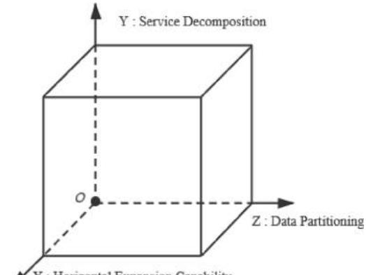
<!-- Image Description: The image displays a three-dimensional Cartesian coordinate system representing service decomposition (Y-axis), data partitioning (Z-axis), and horizontal expansion capability (X-axis).  A cube is shown within this system, illustrating the interrelationship of these three factors in a system design.  The origin (0,0,0) is marked. -->

- (2) Stage 2: Graph structure creation. Extract graph nodes based on the entities defined in the first stage and establish inter-node relationships.
- (3) Stage 3: Microservice extraction based on graph clustering. Use a restricted Louvain algorithm to determine a collection of microservice candidates that give practical service extraction proposals to system architects.

Based on stage 1 and stage 2, the knowledge graph of a monolithic system is constructed, which will serve as the foundation for further microservice extraction.

# *3.2. Knowledge Graph Construction*

Knowledge graph of the monolithic applictation is constructed based on definitions of entities and their relationships.

# *3.2.1. Entity Definition*

The core of a software system is business logic. Regardless of its architecture, the system's business logic remains stable in response to user requirements. Business logic usually consists of domain entities, business rules, integrity constraints, workflows, and other components. During software development, the business logic is primarily represented in the relevant design (including design documents and database design) and source code. By evaluating the above resources, we can easily construct the knowledge graph of a monolithic application.

Based on the aforementioned basic strategies of microservice extraction, we define four types of entities for the knowledge graph in this study.

(1) Data Entity based on system data storage and operation

During the database design, the entity-relationship (ER) design and database table design mainly represent data storage and operations in monolithic applications. Consequently, all entities in ER design are defined as data entities according to the principle under data dimension in microservice extraction.

(1) Module Entity based on system business composition

We define module entity according to the microservice extraction principle under the functional dimension, that is, the system business domain description in the project design document of the monolithic application. The module entity represents business areas containing multiple functions or subsystems. Accordingly, a module is a fundamental component of the system that provides services to users.

(1) Function Entity based on system business composition

We define the interfaces provided by the software system to users or other applications as functional entities. There is a containment and inclusion relationship between module entities and function entities. A module entity can embody multiple function entities. A function entity, on the other hand, may only be assigned to one module entity at a time. At the same time, the data entity will establish direct communication with the function entity, as it is the fundamental unit for data manipulation. The process of function implementation is also accompanied by data reading and storing.

(1) Resource Entity based on system hardware dependency

Without the support of various hardware resources, the software system will not function properly. We define the different types of hardware required to support the functioning of software systems as resource entities. The hardware configuration of a monolithic applica-**Fig. 1.** Schematic diagram of AKF scalable cube tion is determined at the time of system deployment and cannot be

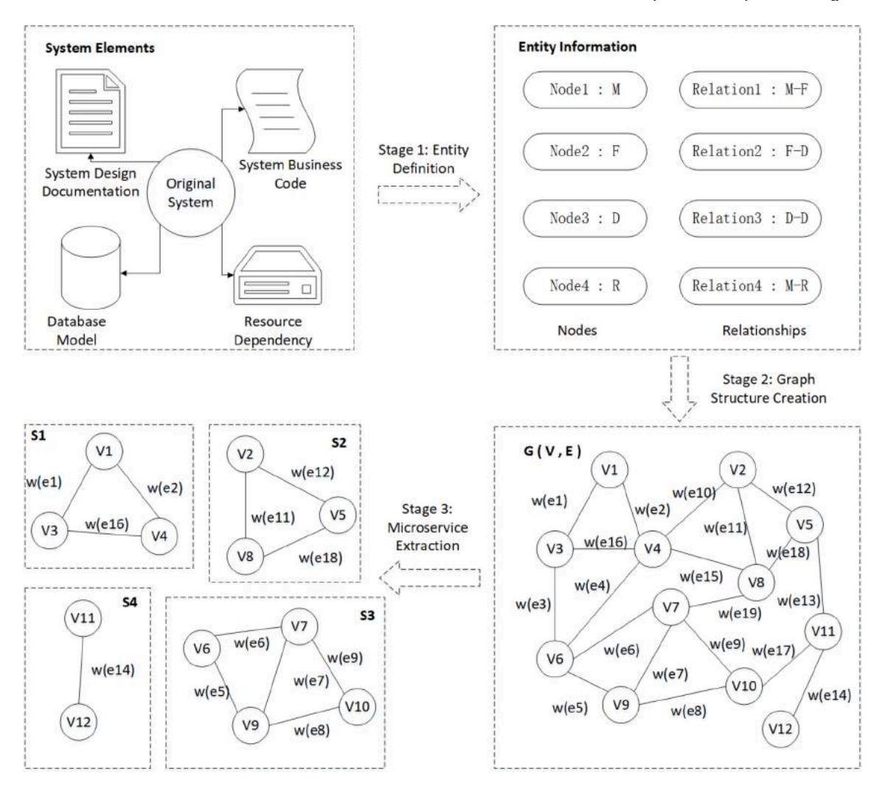
<!-- Image Description: The image details a microservice extraction process.  It shows a workflow diagram, transitioning from an original system's code and design documentation to a graph representation G(V,E).  This graph is partitioned into smaller subgraphs (S1-S4), representing potential microservices.  Entity information (nodes and relationships) is initially defined before graph structure creation.  Edge weights (w(ei)) are shown in the graph. -->

**Fig. 2.** Microservice extraction method based on knowledge graph

changed, resulting in low resource utilization. One of the complications of splitting a monolithic application into microservices is how to make better use of resources. In the case of using microservices, resources need to be allocated on demand for each microservice. How many resources should be allocated for each microservice? Considering the resource dependency of modules when extracting microservices will help provide valuable guidance for the actual startup allocation of microservice resources. For example, if high memory requirements are observed for commodity-related modules when a monolithic application is running, more memory can be allocated to commodity services at an early stage of deployment.

#### *3.2.2. Graph Structure Design*

Design documents (e.g., API definition documents), databases, and source code developed during high-level design comprise the initial data for a monolithic program. To describe this monolithic application, we construct an undirected weighted graph structure based on the four categories of entities discussed before. Define a monolithic software system as *G* = {*V, E*}, with *V* representing the set of vertices and *E*  representing the set of edges. For ∀*vi* ∈ *V*, *vi* corresponds to one of the monolith's four types of entities. For ∀*ek* ∈∈ *E*, *ek* represents the relationship between two nodes. Weight functions define the weight of each edge.

# *3.2.2.1. Node Extraction.*

#### (1) Module node extraction

A module is an appropriately scaled, well-defined, and relatively independent unit formed after the software system's modularization. Modularization is, in fact, the process of analyzing the system's business logic. In general, we can decompose a massive program into modules according to business functions by adopting top-down, progressive decomposition, and divide-and-conquer ideas.

Generally speaking, organizations that follow the standardized development process will prepare and form complete and standardized documents during software development, mainly including requirements specifications, system and software design specifications, and system interface documents. In particular, for projects with frontend and back-end separation, system interface documents are often generated in the back-end development process, which usually contain basic information such as request mode, request parameters, status code definition, return result type, and so on, to facilitate the communication between developers. Generally, the documentation for large-scale software projects in the industry is complete, while the documents for projects with a chaotic organization do not have the above documents.

The design documents will indicate the module division of a monolithic system for projects with process specifications and detailed documentation. As a result, we may automatically identify module nodes from the document directory structure using the system requirements specification or system interface document as input.

Many projects don't have the essential design documentation, or the

module division is unreasonable (with the module granularity being too large or an unclear module domain). Module nodes can be obtained for such projects by vertically and horizontally decomposing the original application, as shown in Fig. 3. Borrowing from the MVC pattern [\[31\]](#page-19-0), we may vertically segregate aspects of a monolithic design into four layers from top to bottom: the user interface layer, network access layer, service logic layer, and data persistence layer. For example, in the SpringMVC-framework [\[1,](#page-18-0) [32](#page-19-0)], developers frequently aggregate closely related functions into one class. The source code of this layer reflects the functional composition and modular structure of the system. Accordingly, each class in the business logic layer can be a module. In this case, the system module can be automatically detected. While in the horizontal direction, we can obtain module nodes of the system by referring to the SOA design idea [\[33\]](#page-19-0) and analyzing the system's business manually. For example, if a set of methods ("Adding items to the shopping cart," "Deleting items from the shopping cart," "Querying items in the shopping cart," and "Emptying the shopping cart") are all directly related to the same business area ("Shopping Cart Management"), we can extract the "Shopping Cart Management" module, with these four functions belonging to this module.

Suppose *mi* denotes the *i*th module node, the set *M* of module nodes extracted from a monolithic application is:

$$
M = \{m_1, m_2, \cdots, m_i, \cdots, m_{nm}\}\tag{1}
$$

where *nm* is the total number of module nodes.

# (1) Function node extraction

Function nodes aim to reflect how the system provides functions to users. Compared with modules, functions are smaller requirements description units, and the implementation of functions will directly manipulate specific data entities. Usually, interface documents or API design documents for software projects describe the functions provided by the system in detail. Therefore, we can automatically extract the function nodes directly from such documents. Under the MVC pattern, the Controller maps user actions to Model updates and selects View. In other words, the Controller is responsible for processing the business logic. According to this feature, we can also extract the function nodes by automatically analyzing control classes of the source code.

Suppose *fi* denotes the *i*th function node, the set *F* of function nodes extracted from a monolithic application is:

$$
F = \{f_1, f_2, \cdots, f_i, \cdots, f_{nf}\}\tag{2}
$$

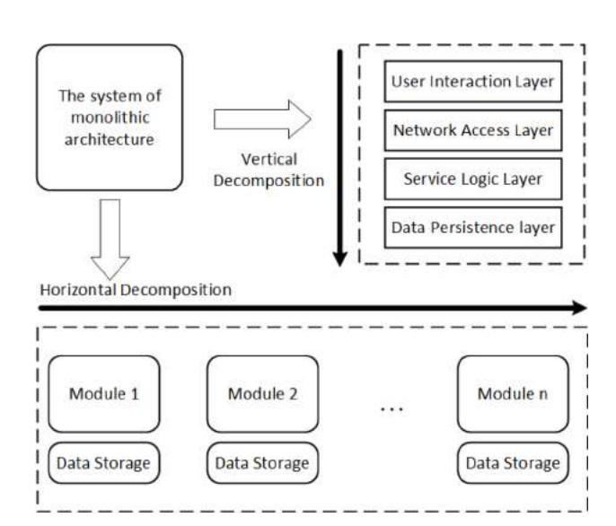
<!-- Image Description: The diagram illustrates software architecture decomposition. A monolithic system is first vertically decomposed into layers (User Interaction, Network Access, Service Logic, Data Persistence).  Then, horizontal decomposition divides it into modules (Module 1, Module 2... Module n), each with its own data storage.  The arrows indicate the transformation steps. -->

where *nf* is the total number of function nodes.

# (1) Data node extraction

To a considerable extent, the complexity of data entities indicates the system's complexity. The Entity-Relationship (E-R) diagram describes the relationships between all entities in the system in great detail. In the absence of documentation, we can automatically extract data nodes from the field design of the database tables.

Suppose *di* represents the *i*th data node, the set *D* of data nodes extracted from a monolithic application is*:* 

$$
D = \{d_1, d_2, \cdots, d_i, \cdots, d_{nd}\}\tag{3}
$$

where *nd* is the total number of data nodes.

# (1) Resource node extraction

In terms of performance, allocating specific hardware resources to the corresponding system modules as needed helps to significantly improve the system performance. Take the Time to Last Byte (TTLB) as an example. It is an essential performance indicator. A common and effective means of improving the performance of the software system on it is to optimize the hardware device configuration. It is necessary to consider assigning specific hardware resources to the system modules that need them most. The typical key hardware elements that affect the performance of software systems are the CPU, memory, hard disk, and network resources. Therefore, we define these four types of hardware resources as the resource nodes of the system.

Suppose *ri* denotes the *i*th resource node, the set *R of* resource nodes is obtained from the monolithic application as follows.

$$
R = \{r_1, r_2, \cdots, r_i, \cdots, r_{nr}\}\tag{4}
$$

where *nr* is the total number of resource nodes.

Thus, the set of vertices for a monolithic application *V* consists of a collection of nodes of the above four types in the following form.

$$
V = F \cup M \cup D \cup R \tag{5}
$$

*3.2.2.2. Node Relationship Establishment.* The four types of nodes proposed in this paper are not independent. According to the microservice concept of high cohesion and low coupling, the closer nodes are related, the more likely they are to be in the same microservice. We need to assign weights to each edge of the graph to indicate the closeness of the interaction between nodes in order to convert the monolithic program to a graph structure. A higher edge weight value suggests a tighter link between nodes. This type of node is more likely to be part of the same microservice. This paper establishes the following node relationships based on the analysis of the business logic of the software system.

# (1) Module-function relationship

A module is the system's basic unit for delivering services. Similarly, a function is also a requirement description unit with a smaller granularity than modules. A module entity and a functioning entity may have a confinement and inclusion relationship. Let the module-function relationship be denoted by *Wmf*(*mj, fk*). It should satisfy the following equation:

$$
W_{mf}(m_j, f_k) = \begin{cases} 1 & \text{if } m_j \text{ contains } f_k \\ 0 & \text{otherwise} \end{cases}
$$
 (6)

where *mj* represents a module node, and *fk* denotes a function node.

(1) Data-data relationship

**Fig. 3.** Horizontal and vertical slices of the monolithic architecture

The data entities reflect the entity relationships of the database design. Therefore, the connections between data nodes match the E-R diagram in database design. One-to-one, one-to-many, and many-tomany are the three most common forms of entity relationships. Compared to the one-to-many entity relationship, the one-to-one entity relationship is closer. However, the one-to-many entity relationship is tighter than the many-to-many entity relationship. Assuming that the data-data node connection is *Wdd*(*dj,dk*), we may compute it as follows:

$$
W_{dd}(d_j, d_k) = \begin{cases} \delta_1 & \text{if relationship of two nodes is } 1:1 \\ \delta_2 & \text{if relationship of two nodes is } 1:n \\ \delta_3 & \text{if relationship of two nodes is } m:n \end{cases} \tag{7}
$$

where *dj, fk* denotes two different data nodes. And 0 *< δ*3 ≤ *δ*2 ≤ *δ*1 *<* 1.

# (1) Function-data relationship

In the process of software development, the realization of functions often requires the manipulation of certain entities. Functions read and modify data, which precisely portrays the connection between function entities and data entities. The frequency of function access to data is frequently correlated with the connection between function and data inside the software system. In the case of a shopping scenario, the search function will read the product data entity, the add to cart function will modify the shopping cart data entity, and the order function will update the order data entity. As a result, the number of operations represents how tightly function entities and data entities are linked. *Wfd*(*fj, dk*) is the function-data relationship. Calculate it using the following equation:

$$
W_{fd}(f_j, d_k) = \frac{T(f_j, d_k)}{Max(T(f_j, d_k))}
$$
\n(8)

where *T*(*fj, dk*) represents the frequency that function node *fj* visits data node *dk*, i.e., the number of times that the function node reads and writes data nodes at the code level.*Max*(*T*(*fj, dk*)) denotes the maximum number of accesses to data node *dk* by all function nodes. The final value of *Wfd* satisfies 0 ≤ *Wfd* ≤ 1.

#### (1) Module-resource relationship

When modules serve users with business functions, they consume a certain amount of hardware resources. Hardware resources for microservices are flexible and configurable. It's critical to consider the influence of hardware resources on the operation of associated modules. Of particular concern is that hardware resources may influence the performance of the services provided in a microservice architecture. The more a module utilizes a certain kind of hardware resource, the more dependent it is on it. Modules and resources that are so tightly related should be in the same microservice. In practice, we can record relevant real-time operation data, calculate the corresponding performance indicators, and evaluate the dependence of software modules on hardware resources through monolithic application performance testing, allowing us to accurately describe the relationship between modules and resources.

Suppose the module-resource relationship is *Wmr*(*mj,rk*). Give arbitrary module node *mj* and resource node *rk*, if all the module nodes that are associated with the resource node *rk* form a set *Drk* = {*m*1*, m*2*,* ⋯*, mnd*}, and *nd* denotes the size of the set, then *Wmr* can be computed as follows:

$$
W_{mr}(m_j, r_k) = \frac{Rank(r_k, D_{r_k})}{nm}
$$
\n(9)

where *Rank*(*rk, Drk* ) represents the dependence of module *mj* on resources *rk* under normal operating conditions of the software system. *nm*  is the total number of module nodes and *nd* satisfies *nd*≤*nm*.

For simplicity, all module nodes in set *D* are sorted from smallest to largest according to the dependency on resource node *rk*. The minimum is 1, and the maximum is *nd*. Therefore, the value of Rank corresponds to the order in which module node *mj* is sorted by dependency on resource node *rk*. The final value of *Wmr* will be between 0 and 1.

# *3.3. Microservice Extraction*

The original monolithic program may be converted into an undirected weighted graph using the extracted nodes and relationships. This study proposes a restricted graph clustering approach for automatically extracting microservices. The Louvain method [\[34\]](#page-19-0) partitions the overall graph structure of the system into multiple highly interconnected internal subgraphs. We incorporate constraints into the graph clustering to assure a collection of low-coupling microservice candidates with acceptable granularity. After the restricted graph clustering, each resulting subgraph represents a monolithic system microservice candidate.

The Louvain algorithm is a community detection algorithm. A precise definition of what a "community" really is does not exist yet. Newman and Girvan Girvan [\[35\]](#page-19-0) provides one of the most widely accepted and used definitions: "A community is a subgraph containing nodes which are more densely linked to each other than to the rest of the graph, or equivalently, a graph has a community structure if the number of links into any subgraph is higher than the number of links between those subgraphs." A microservice is an example of such a community. The problem of microservice extraction naturally becomes a community detection problem. To assure the quality of the microservice division, choosing an appropriate community detection algorithm is necessary. Table 1 analyzes the time complexity, clustering cohesiveness, and algorithm stability of several current mainstream community detection algorithms for graph clustering [\[36,37](#page-19-0)]. The Louvain algorithm [\[34\]](#page-19-0), based on modular calculation, outperforms the GN algorithm [[35,38](#page-19-0)], the K-L algorithm (Kernighan & Lin algorithm) [\[39\]](#page-19-0), and the Spectral Bisection algorithm [\[40\].](#page-19-0) This algorithm not only has the best stability and time complexity, but it also has the best clustering results. As a result, the Louvain algorithm is used as the basis for microservice extraction in this paper.

Louvain is an algorithm based on multi-level (round by round heuristic iteration) modularity optimization. The modularity function [\[41\]](#page-19-0)  is a measurement method to evaluate the partition of a community network. It is calculated in Eqs. 10 and 11.

$$
Q = \frac{1}{2m} \sum_{i,j} \left[ A_{ij} - \frac{k_i k_j}{2m} \right] \delta(c_i, c_j)
$$
\n(10)

$$
\delta(u, v) = \begin{cases} 1 & \text{when } u = v \\ 0 & \text{when } u \neq v \end{cases}
$$
 (11)

where *Aij* represents the weight on the edge connecting nodes *i* and *j*. When the graph is non-weighted, its value is set to one.

*ki* represents the sum of the weights of all edges connected to node *i*. *ki* = ∑ *j Aij*.

*m* represents the sum of the weights of all edges in the graph. *ci* indicates the community to which node *i* currently belongs. The implementation of the algorithm is composed of two steps: (1) Step 1 traverses the nodes in the graph, assigning individual

| Table 1                                                           |  |
|-------------------------------------------------------------------|--|
| Comparison between four mainstream community detection algorithms |  |

| Algorithm          | Time complexity | Cohesion | Algorithm stability |
|--------------------|-----------------|----------|---------------------|
| GN                 | Highest         | High     | High                |
| K-L                | High            | Fair     | Low                 |
| Spectral Bisection | Low             | Low      | Low                 |
| Louvain            | Lowest          | High     | High                |

nodes to the communities that result in the most modularity gains.

First, assign a different community to each node in the graph. Second, evaluate the modularity gain that would take place by removing node *i* from its community and by placing it in the community of its neighbor node *j*. Finally, place node *i* in the community with the highest modularity gain. It is worth noting that adjust node *i* only with a positive modularity gain. Or, node i will remain in its original community. Apply the above rules to all nodes repeatedly and sequentially until there will be no further improvement and the first step is then completed. The modularity gain obtained by moving an isolated node *i* into a community C is calculated by:

$$
\Delta Q = \left[ \frac{\sum_{in} + k_{i,in}}{2m} - \left( \frac{\sum_{tot} + k_i}{2m} \right)^2 \right] - \left[ \frac{\sum_{in}}{2m} - \left( \frac{\sum_{tot}}{2m} \right)^2 - \left( \frac{k_i}{2m} \right)^2 \right]
$$
(12)

Where ∑ *in* , represents the sum of the weights of the links (i.e. edges in

this paper) inside community C. For undirected weighted graph, its value is twice the sum of the weights of all edges inside community C. ∑

*tot* , represents the sum of the weights of the links incident to nodes in

community C.

*ki*, is the sum of the weights of links connected to node *i*.

*ki,in*, is the sum of the weights of the links from node *i* to nodes in community C.

*m* is the same as in [Eq.\(3.](#page-4-0)[10\)](#page-5-0).

(2) Step 2 reconstructs the structure of the graph.

The second step of the algorithm is to create a new network whose nodes are now the communities discovered in the first step. Therefore, we may determine the weights between the new nodes by the sum of the weights between the nodes in the corresponding two communities.

Continue with the two steps iteratively until the number of communities remains stable and no increase of modularity is possible (i.e. a maximum modularity is achieved). Fig. 4. depicts the above process. As shown in Fig. 4, there are 13 nodes in the initial diagram. Calculate the modularity in step 1 during the first iteration. Each node is associated with a community (represented in different colors). For example, V1, V3, and V4 are all members of the same community. The nodes in the same community are then merged (compressed) into a composite node in step 2. For example, node c1 represents a community of V1, V3, and V4. The graph of 13 nodes is compressed to only four nodes after the first iteration, with each composite node made up of several original nodes. After the second iteration, the initial nodes are clustered into two communities.

The specific steps are shown in Algorithm 1: Step 1, traverses the

# **Algorithm 1**

Louvain Clusterring Algorithm

|  |  | 1 function CLUSTER(Graph) |
|--|--|---------------------------|
|--|--|---------------------------|

- 2 repeat
- 3 // Assign a community to each node
- 4 for all *nodei* ∈ *Graph* do
- 5 *Ci* = {*nodei*}
- 6 end for 7 repeat
- 8 for all *nodei* ∈ *Graph* do 9 for all *nodej neighborNodes*(*i*) do
- 10 compute △*Q* using [Eqs.11](#page-5-0)
- 11 end for
- 12 if max(△*Q*) *>* 0 then
- 13 remove *nodej* from *Ci*
- 14 add *nodej* to *Cj*
- 15 end for
- 16 until no node movement
- 17 if Modularitynew Modularity *<*= 0 then
- 18 break

19 end if

- 20 Modularity ← Modularitynew
- 21 // Refactoring graph: each community as a node
- 22 *Vnew* ← *C*
- 23 *Enew* ← *E*(*Cu, Cv*)
- 24 *Graphnew* = (*Vnew, Enew*)
- 25 *Graph* ← *Graphnew*
- 26 until break
- 27 end function

nodes and divides them into different communities. Step 2, reconstructs the structure of the graph.

The graph structure constructed in this paper represents the interactions between different entities through four different types of nodes, which are heterogeneous networks. Therefore, apply two constraints to the generated communities during the clustering process to ensure that the microservice candidates have appropriate granularity and low coupling between them.

# *Constraint 1: A community should not contain only one function node*

Not all functions involve read and write operations on data. When a function node does not need to perform read and write operations on data, it may form a separate community during clustering. This situation should be avoided in microservice extraction because the granularity of the microservice represented by such a community is too tiny.

# *Constraint 2: A community cannot contain only one data node*

In a monolithic application, data nodes frequently exhibit two

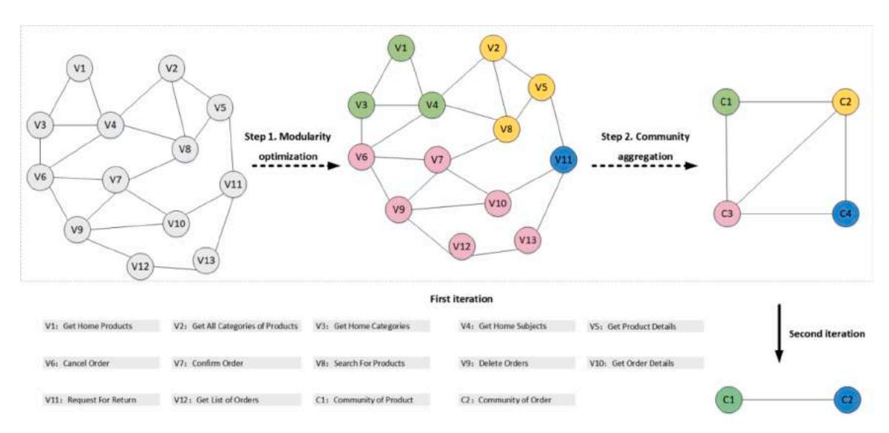
<!-- Image Description: The image displays a graph-based algorithm.  It shows a network's transformation through two steps: modularity optimization, which restructures the graph (V1-V13 nodes), and community aggregation, which groups nodes into communities (C1-C4). A second iteration further simplifies the community structure.  Each node represents a function, and the final structure indicates a hierarchical clustering of functions. -->

**Fig. 4.** Visualization of the steps of the Louvain algorithm

behaviors. One is the low frequency with which functions read data. A weak relationship between a data entity and other entities is the other. During clustering, both of these scenarios may result in a distinct community. According to the definition, a microservice should have the ability to offer at least the functional aspects of invocation for users or other services. It is unacceptable to extract a community with only one data node as a standalone microservice.

At this point, we finally cluster the graph of the monolithic system into several internally tightly connected communities, i.e., subgraphs, each of which serves as a microservice candidate.

# **4. Case Study and Evaluations**

#### *4.1. Case Introduction*

To validate the proposed algorithm, we assessed it through two case studies.

The first case is an e-commerce project "E-commerce System", an open-source project developed by Macrozheng et al [\[42\]](#page-19-0).

The "E-commerce System" uses a layered architecture that supports Web and mobile access. It is built on Spring Boot, a Java-based framework. Use MySQL and MongoDB for data storage. Take Redis for hotspot data storage. ElasticSearch is used for product search and log collection. At present, the scale of the project reaches over 65,000 lines of code. The project includes a front-end mall system and a back-end management system. The business functions that the front-end mall system provides include Brand Management, Home Page Content, Shopping Cart Management, User Login Registration, User Order Management, Return Management, User Product Browsing History, and ser Shipping Addresses.

The "E-Commerce System" can be regarded as a typical enterprise monolithic application. The case project has a good structure. However, the strategy suggested in this paper is not overly reliant on the completeness of the project documentation or the quality of the source code. As a consequence, the project's quality will not have a significant impact on the experiments. The project itself may have a slight influence on the efficiency of the experimental process: if there is a lot of missing software project documentation, it will be necessary to manually examine the code to extract the module or functional information of the system. However, this is an uncommon occurrence. As a result, the "E-Commrce System" is a good choice for the case study of our approach.

The second case is the DDD sample application "Cargo Tracking System" that accompanies the DDD book [\[48\].](#page-19-0) The existing implementation is available on SourceForge [\[49\]](#page-19-0).

Compared with "E-commerce System", the complexity of "Cargo Tracking System" might not be mentioned as the systems from enterprises. However, it is a complete system. Moreover, at least two related studies (ServiceCutter[10]; Baresi et al. [\[24\]](#page-19-0)) also used it to evaluate their decomposition approaches. The "Cargo Tracking System" is a good choice to demonstrate the complexity of decomposition close to reality as well as enable the comparison of our approach to other related studies with the same case.

# *4.2. Environment Configuration*

We employ one local physical server and two Ali Cloud servers in the studies. The majority of the work, such as microservice extraction and testing, is undertaken on the local server. The cloud servers, which are elastic and secure virtual cloud servers supplied by Alibaba Group, are in charge of ensuring that the suggested microservice extraction algorithm's execution outcomes are feasible. The two Ali Cloud servers have identical setups. We run the experiments using the Linux operating system with the kernel version: CentOS 8.2.2004-x84\_64. Table 2 illustrates the server settings in detail.

In the experiments, we use ApachBench (version 2.4.48) to test the performance and utilize Neo4j (version 1.4.3) to establish the

| Table 2 |                      |
|---------|----------------------|
|         | Server configuration |

| Server Type  | Parameters CPU (core) | Memory (G) | Hard disk (G) | Bandwidth(M) (M) | Quantity (pcs) |
|-----------------|-----------------------------|---------------|------------------|---------------------|-------------------|
| Local Server | 4                           | 16            | 500              | -                   | 1                 |
| Cloud Server | 2                           | 4             | 50               | 3                   | 2                 |

knowledge graph. We use IntelliJ IDEA (version 2021.1.2) and Visual Studio Code (version 1.56) as the development tools and Spring cloud (version 2020.0.3) as the microservice framework. Finally, we run the project in the docker (version 17.03) container.

# *4.3. Evaluation Indicators*

## *4.3.1. To Evaluate the Quality of Microservice Extraction*

While there are well-defined and well-known quality metrics in fields like object-oriented design, there has been little work in microservices research. Newman [\[43\]](#page-19-0) pointed out that high cohesion and low coupling are the fundamental characteristics of microservice extraction when it comes to evaluating the quality of microservice architecture. For easier code management, high cohesion puts relevant business logic in the same service. Low coupling reduces dependencies between services, allowing independent modification and deployment of services. High-quality microservices, on the other hand, imply better performance. One of its characteristics is lower communication costs between services. Microservices include more communication code to accomplish functionality. Consequently, migrating a monolithic program to a microservices design will increase the amount of source code. As a result, a reduced code redundancy rate corresponds to cheaper communication costs and improved performance. In addition to directly improving the microservice design itself, human considerations have a role in the quality of microservice design. A well-structured development team always requires constructing and maintaining a well-designed microservices system. Conversely, if a project team's structure is excellent, the project's microservice architecture will be high-quality as well.

As a result, we propose the following index system to evaluate the quality of microservice extraction based on the above thinking.

#### (1) Cohesion

Each microservice should "do things well" [\[44\]](#page-19-0). Cohesion is the degree of functional relevance of activities performed by service to realize a business process [\[45\].](#page-19-0) The high cohesion of microservice design requires that each microservice perform a centralized and generally autonomous business responsibility [\[46\].](#page-19-0) Service cohesiveness, according to Daghaghzadeh et al. [\[46\]](#page-19-0), is the relationship between entities inside a service. They proposed a new metric for service and overall service design cohesiveness that considers connections between entities as well as interactions between activities and entities (both Entity-Entity and Entity-Activity relations). The metric converts the calculation of microservice cohesion into the complexity of the connection between internal entities of the service.

The function module of service directly reflects the business functions offered by the service. Therefore, the cohesiveness of a microservice is the average cohesion of the module nodes associated with the microservice. The cohesion of the whole system may be evaluated by the average cohesion of the extracted microservices from the monolithic application. Based on Daghaghzadeh's entity cohesion [\[46\]](#page-19-0), Microservice Design Cohesion (MDC) is introduced in this study to evaluate the system cohesion.

(a) First, calculate the cohesion between two activities, i.e., function

nodes, in a service.

We build a complete bipartite graph with business entities, i.e., data nodes. Each edge with endpoints *A* and *B* has a weight *w* coming from row *A* and column *B* in the distance table [\[46\].](#page-19-0) Cohesion between two function nodes *i* and *j* called Function Cohesion (FC), is computed as follows:

$$
FC(i,j) = \frac{1}{|R|} \sum_{i=1}^{|R|} \frac{1}{Weight(R(i))}
$$
\n(13)

Where *R* is a set that keeps the selected edges, i.e., the collection of edges with the shortest distance between all data nodes related to the two function nodes. The relationship distance between entities corresponding to edge *R*(*i*), represented by *Weight*(*R*(*i*)), is the number of edges on the shortest path between data nodes. The calculation is given by:

$$
Distance(E_1, E_2) = \{ \begin{aligned} \min_p \sum_{i=0}^{e_p} d_i & p > 0\\ \infty & |p = 0 \end{aligned} \tag{14}
$$

Where *ep* is the number of edges in the path between *E*1 and *E*2, *p* is the number of existing paths between *E*1 and *E*2, *d*i is relationship distance which comes from the distance table [\[46\].](#page-19-0)

(b) Second, calculate the MDC of the system.

The cohesion of the system (MDC) is calculated as:

$$
MDC = \frac{\sum_{k=1}^{s} SC_k}{s} \tag{15}
$$

where s denotes the number of all microservices in the whole system. And *SCk* denotes the cohesion of the *k*th microservice*,* which is calculated as shown in Eq.16.

$$
SC_k = \left\{ \sum_{i=1}^r \sum_{j=1, i>j}^r \frac{FC(i,j)}{r(r-1)}, \quad r > 1 \right\}
$$
\n
$$
1, \qquad r \le 1
$$
\n(16)

where *r* denotes the number of function nodes in the *k*th microservice. *FC*(*i, j*) is the cohension degree between function nodes, shown in Eq.13. The higher the MDC's value, the better the system's cohesion. Coupling

The coupling of services explains how one service is dependent on another [\[45\]](#page-19-0). The calculation of the coupling degree can be converted into the communication cost of mutual calls between services [\[19\]](#page-19-0). Zhong et al. [\[50\]](#page-19-0) believe that messages are transmitted between services at different frequencies, which reflect different degrees of service coupling. They propose to express the size of such messages by the number and complexity of attributes transmitted between services. Based on the above point of view, we believe that in microservice applications, the access of function nodes between different services to data nodes reflects service interdependence; that is, if a service's function accesses data entities of another service to meet its business requirements, the two services are said to be coupled. Based on this point of view, we proposed the Microservice Coupling (MCP) metric to measure the coupling degree of microservice design, expressed by the message interaction between services. In this work, we observe and record how microservice function realizations (i.e., function nodes) interact with entities (i.e., data nodes) in other microservices.

Now, we can calculate the coupling degree for each microservice *i*  by:

$$
MCD_i = \sum_{j=1}^{n_i} \left(Rt(f_j) \times Rf(f_j) + Wt(f_j) \times Wf(f_j)\right)
$$
\n(17)

Where *n*i denotes the number of function nodes in the *i*th microservice. *Rt*(*fj*) denotes the number of times that function node *f*j in the *i*th microservice reads data nodes of other microservices at the code level. *Rf*(*fj*) denotes the frequency that *f*j reads data nodes of other microservices. *Wt*(*fj*) denotes the number of times that function node *f*j in the *i*th microservice writes to data nodes of other microservices at the code level. *Wf*(*fj*) denotes the frequency that *f*j writes to data nodes of other microservices.

To reasonably control the computational workload, we ignore the complexity of the message itself. Meanwhile, *Rf* corresponds to the number of calls to function node *fj* during system operation, as determined by business logic. We use the order of magnitude to set specific values for the levels. An order of magnitude means quantity scale or size level. A fixed proportion is maintained between each level. Therefore, we set three levels here: low, medium, and high, corresponding to values of 1, 10, and 100, respectively. Generally, we set the access frequency of function nodes related to registration to low, while for function nodes related to browsing product information, we set the call frequency to high. Other function nodes may have a medium call frequency.

The coupling of the whole system (MCP) is calculated as:

$$
MCP = \frac{1}{s} \sum_{i=1}^{s} MCD_i
$$
\n(18)

Where *s* denotes the number of microservices in the system. The lower the value of *MCP*, the better the coupling of the system.

Code Redundancy Rate

Migrating a monolithic application to a microservice architecture will increase the amount of source code because the microservice adds additional communication code to fulfill functions. More code after migration indicates higher inter-service communication costs and lower code reuse rates. Therefore, we propose the Code Redundancy Rate (CRR) metric, which is calculated by:

$$
CRR = \frac{\sum_{i=1}^{s} C_i - C_m}{C_m} \tag{19}
$$

where *Cm* is the original overall application code volume, *Ci* is the code volume of microservice *i,* and *s* is the total number of microservices.

The smaller the value of this indicator, the more reasonable the division result of microservices is. However, the programming skills of programmers may have an impact on how to migrate specific applications to microservices. Even if the same microservice division is adopted, different developers will produce varying degrees of code redundancy when converting the same original monolithic application to microservices. As a result, *CRR* is influenced by the programming competence of the programmer to a certain extent.

#### (1) Team Size Reduction Rate

One of the advantages of microservices is that it improves the organization of development teams, reducing team size and complexity [\[43\]](#page-19-0). Instead of focusing on communication among team members, the team may concentrate more intensely and effectively on the actual domain problem and the service for which it is accountable. Mazlami et al. [\[28\]](#page-19-0) proposed the TSR metric, which is obtained by dividing the average team size across all microservice candidates by the original monolith's team size. Inspired by this indicator, this paper introduces the Team Size Reduction Rate (*TSRR*) for the team-oriented quality aspect. The formula is as follows:

$$
TSRR = \frac{1}{s} \times \sum_{k=1}^{s} \frac{ATS - STS_k}{ATS}
$$
\n(20)

where *s* represents the number of all microservices in the system, *ATS*  represents the team size of the original software, and *STSk* denotes the team size of the *k*th microservice.

The essence of *TSRR* is to focus on the team reduction of each extracted microservice relative to the monolithic system and calculate

the average candidate microservice team reduction rate. The higher the value of the team size reduction rate, the more likely the division of microservices is to improve the development team's quality.

# *4.3.2. To Evaluate Method Effectiveness*

We offer the following four assessment metrics to verify the effectiveness of the microservice extraction approach proposed in this paper.

- (1) Applicability of the method. The greater the applicability of a microservice extraction approach, the more likely it can be applied to practical projects.
- (2) Reliance on human experience. If a method needs less human experience, it may achieve more automation. It may also efficiently decrease the time and labor costs of microservice extraction.
- (3) Reliance on well-defined software. The less dependent the strategy is on code standardization and quality, the more widely it may be used in varied projects.
- (4) Whether the hardware is under consideration. Different hardware resources are required for various services. Taking hardware into account will help realize the reasonable allocation of hardware resources and improve hardware usage.

# *4.4. Graph construction and microservice extraction*

We'll explain the results of applying our strategy to the "E-commerce System" in this part.

# *4.4.1. Knowledge Graph Construction*

Using the method proposed in this paper, the structure of the monolithic "E-commerce System" is constructed as follows.

# (1) Module node extraction

The business functions of the "E-commerce System" mainly focus on four areas: commodities, users, activities, and themes. The software requirement specification and design document describe the system modules in detail. Each module is associated with several functions, mainly the API interfaces provided to third-party callers or front-end. Fig. 5. shows part of the system interface document. It can be seen that module nodes can be extracted automatically from the name and description of the interface. As for this e-commerce project, 12 module nodes are completely extracted by automatically analyzing the directory structure of the system interface document.

#### (1) Function node extraction

The controller describes the business logic and reflects the functional composition of the monolithic application. We extract function nodes automatically by analyzing the control classes. Finally, we get 61 function nodes from this "E-commerce System". To take as an example the class MemberAttentionController, this class defines five methods (i. e., "Add Brand Follow", "Unfollow", "Show Follow List", "Show Details of Brand Follow" and "Clear Follow List") to be called by external users or applications. Thus, we define these methods as function nodes. [Fig. 6](#page-10-0). shows the structure diagram of the class MemberAttentionController.

# (1) Data node extraction

As the database design provides information on the system data entities, we extract data entities from the database design, i.e., the E-R diagrams of the "E-commerce System". We get ten data nodes, each from one entity. As far as this "E-commerce System" is concerned, there are five sub-entity relationship diagrams in total in the high-level design document of the system database, namely "product management", "order management", "marketing management", "theme management", and "user management". Thirty entities such as products, orders, and users are involved. A total of 30 data nodes are identified from the project. [Fig. 7](#page-10-0) describes a local E-R diagram of "E-commerce System".

# (1) Resource node extraction

E-commerce systems should generally meet the requirements of high performance, high concurrency, and high availability. The pre-defined four types of resource nodes (see [Section 3.2.2](#page-3-0)) provide corresponding hardware metrics related to these requirements.

The design of resource nodes can provide suggestions for the resource allocation of the migrated microservice system. In other words, we may evaluate the resource requirements of system modules by examining the dependency of module nodes on various types of resource nodes. As a result, we do not need to extract resource nodes. On the other hand, the connection between modules and hardware resources should always be identified through a performance test. Therefore, we conduct stress tests on each module of the e-commerce software system, record the data changes of each performance index, and determine the dependence of each module node on the resource node through these tests. We performed the stress test five times for each module. [Fig. 8](#page-11-0). depicts the memory utilization curves of four modules during the stress test, namely "Product Management", "Brand Management", "Order Management", and "Home Content". The horizontal axis represents the

| <b><i><u>ANTIBER STRANDS</u></i></b> | <i><u><b>Departments</b></u></i> | 100.835.88888 |
|--------------------------------------|----------------------------------|---------------|
| 200                                  | OK                               |               |
| 201                                  | Created                          |               |
| 401                                  | Unauthorized 아버지 아버지가 아니다     |               |
|                                      | Forbidden                        |               |
| 104                                  | Not Found                        |               |

#### **Fig. 5.** Part of the system interface documentation

<!-- Image Description: The image is a figure caption that describes the contents of Figure 6 in an academic paper.  It states that Figure 6 shows the structure of a "class MemberAttentionController."  No diagram, chart, graph, or equation is present in the image itself; the image only provides a textual description of what is presumably depicted in the missing Figure 6. -->

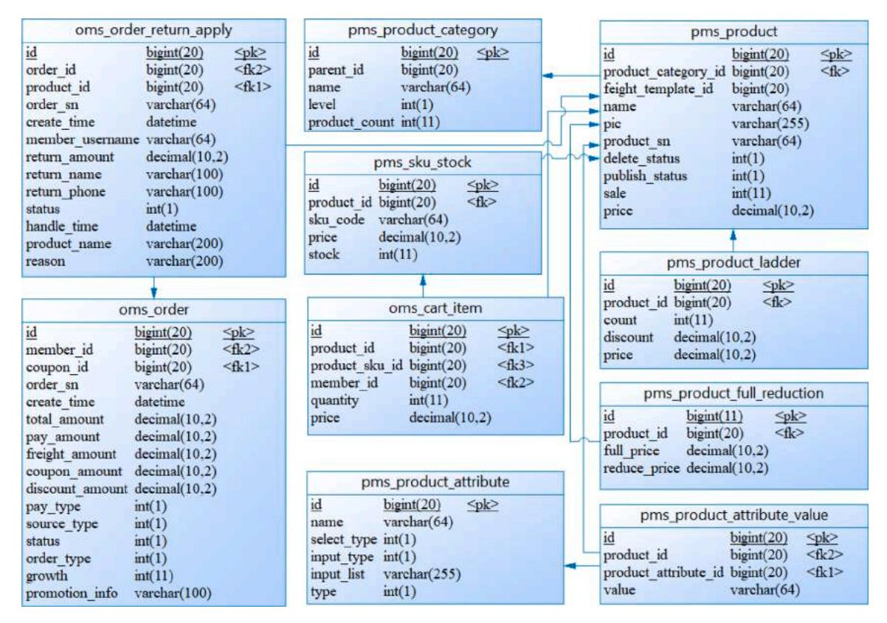
<!-- Image Description: This image displays an entity-relationship diagram of a database schema.  Multiple tables (e.g., `oms_order`, `pms_product`) are shown, each with attributes and data types (e.g., `bigint(20)`, `varchar(64)`).  Relationships between tables are indicated by connecting lines, illustrating the database's structure for managing product information, orders, and returns.  Primary keys (`<pk>`) and foreign keys (`<fk>`) are specified. -->

**Fig. 7.** Local E-R diagram of "E-commerce System"

number of requests, and the vertical axis represents the memory utilization.

# (1) Graph Construction

We calculate the corresponding node relationship based on the extracted four types of nodes. In particular, to establish the value of the module-resource relationship, we execute 12 rounds of performance tests on all 12 modules of the system, each for one module.

Based on the extracted nodes and relationships, the graph structure representing this "E-commerce System" is constructed. [Fig. 9](#page-11-0). shows a local structure. Please note that the edges between nodes are undirected, and the arrows in the figure have no practical meaning.

As illustrated in [Table 3,](#page-11-0) three groups of parameter values are set to establish the relationship between the data nodes. We construct the graph structure and extract microservices under each group of parameters. [Table 3](#page-11-0) also shows the average modularity and number of the detected communities.

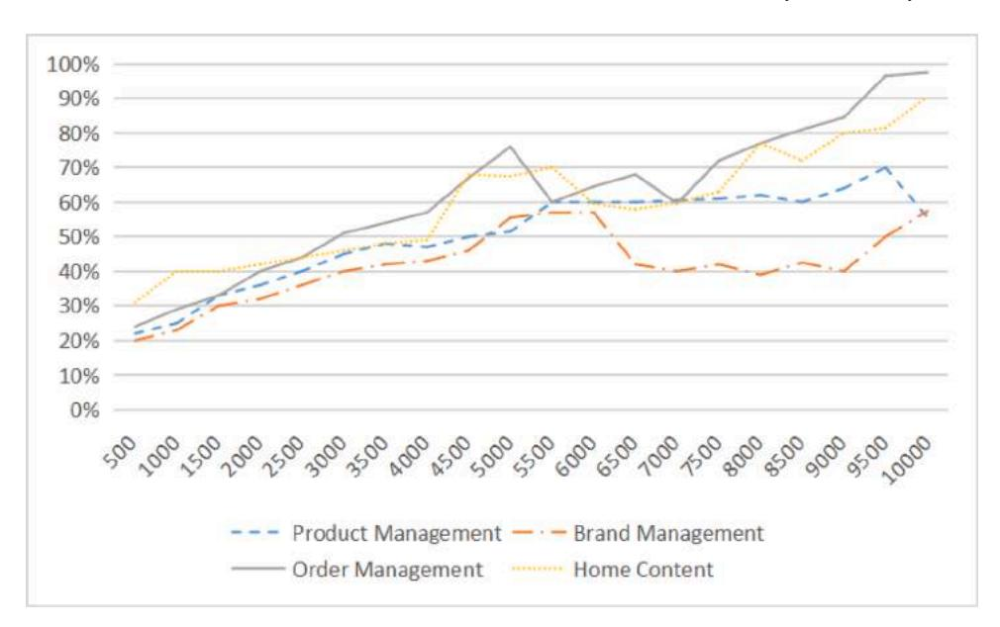
<!-- Image Description: The image displays a line graph showing percentage values over a range of 500 to 10000 on the x-axis.  Four lines represent "Product Management," "Brand Management," "Order Management," and "Home Content."  The graph tracks the percentage change of each category across the x-axis range, revealing varying trends in growth and decline for each. -->

**Fig. 8.** Trend of memory utilization rate for four modules in stress testing

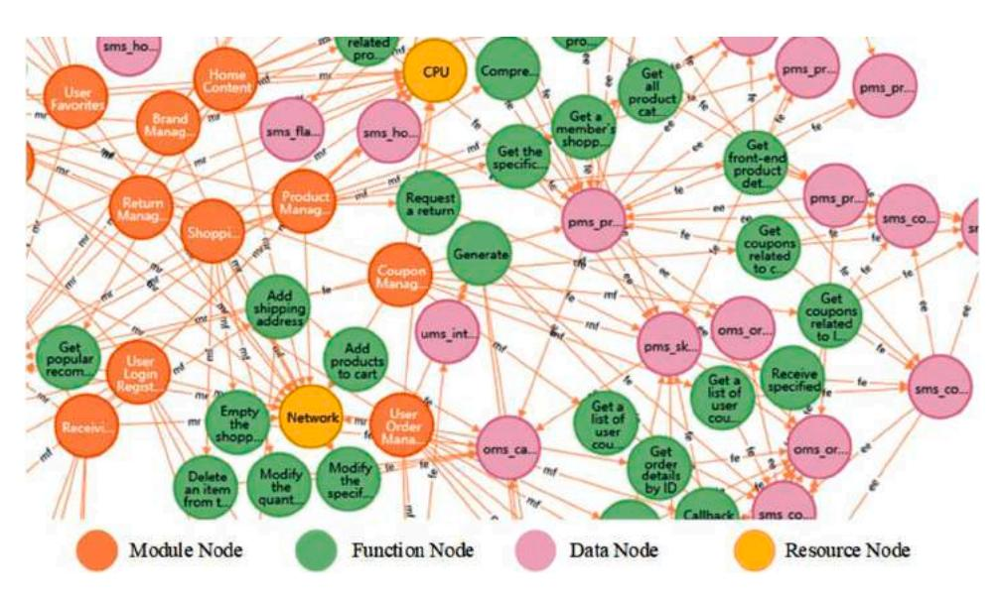
<!-- Image Description: This image displays a network graph depicting a software system's architecture.  Nodes represent modules (orange), functions (green), data (pink), and resources (yellow).  Edges show relationships between these components, illustrating data flow and functional dependencies within the system.  The graph visually represents the system's complex interconnections. -->

**Fig. 9.** Part of the diagram structure of the "E-commerce System"

**Table 3**  Three Groups of Parameters for Data-data Relationship and Results of Community Detection

| Group | Parameters |     |     | Average Modularity | Number of Communities |
|-------|------------|-----|-----|--------------------|-----------------------|
|       | δ1         | δ2  | δ3  |                    |                       |
| 1     | 0.8        | 0.5 | 0.2 | 0.6254738339       | 10                    |
| 2     | 1.0        | 0.5 | 0.1 | 0.6247740453       | 10                    |
| 3     | 0.7        | 0.5 | 0.3 | 0.6258240199       | 10                    |

As can be observed, the number of communities under different parameter values is the same. The value difference in the average modularity achieved by community detection is relatively minimal under different parameter settings. As a consequence, the parameter value of the data node relationship has little effect on the results in general. Finally, we use the first set of parameters in the case study.

# *4.4.2. Microservice Extraction Based on Graph Clustering*

The generated graphs are clustered based on the restricted Louvain

algorithm. After graph clustering, the nodes in the knowledge graph are partitioned into ten different communities, corresponding to ten microservice candidates, as shown in Table 4. And [Fig. 10](#page-12-0). displays the global picture of clustering result (Nodes with the same color represent

| Table 4                                                        |  |
|----------------------------------------------------------------|--|
| The extracted microservice candidates and related module nodes |  |

| Microservices | Module Nodes                  | Abbreviations |
|---------------|-------------------------------|---------------|
| A             | Brand Management              | BM            |
| B             | Coupon Management             | CM            |
| C             | Home Page Content             | HPC           |
|               | Product Management            | PM            |
| D             | Shopping Cart Management      | SCM           |
| E             | User-Focused Brands           | UFB           |
| F             | User Favorite Products        | UFP           |
| G             | User Login Registration       | ULR           |
| H             | User Order Management         | UOM           |
|               | Return Management             | RM            |
| I             | User Product Browsing History | UPBH          |
| J             | User Shipping Address         | USA           |

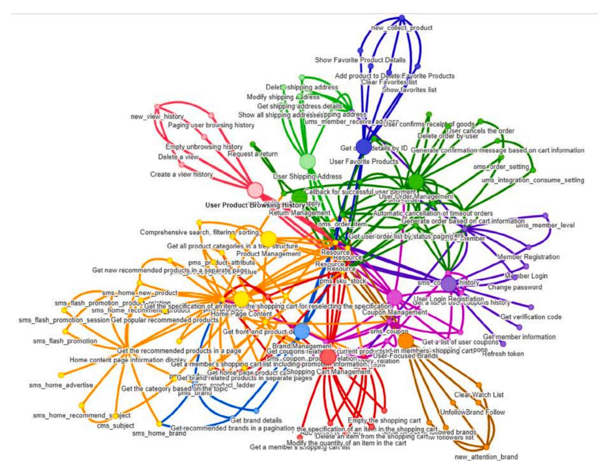
<!-- Image Description: The image displays a network graph illustrating relationships between various e-commerce functions.  Nodes represent functions (e.g., "User Order Management," "Product Management"), and edges depict their interdependencies.  Edge colors likely represent different interaction types. The graph visualizes the complex workflow and data flow within an online store's system. -->

**Fig. 10.** The global picture of clustering result

an identical candidate microservice).

# *4.5. Discussions*

To evaluate the microservice extraction mechanism, we focus on three aspects. The first is the quality evaluation of microservice extraction. The second is the evaluation of the effectiveness of microservice extraction methods, and the third is the rationality of business logic.

We experiment the algorithm in this paper (referred to as GD) with three typical microservice extraction methods: the domain-driven design-based approach (referred to as DD) [\[47\],](#page-19-0) the similarity calculation-based approach (referred to as AS) by Baresi et al[.\[24\]](#page-19-0), and the graph clustering-based method by Gysel et al. (abbreviated as SC) [10].

The above four methods are applied to the "E-commerce System" (abbreviated as E-comm) and "Cargo Tracking System" (abbreviated as Cargo) respectively. Table 5 shows the microservice extraction results.

#### *4.5.1. The Quality of Microservice Extraction*

*4.5.1.1. Disscussion on E-comm project.* As for E-comm project, the

**Table 5** 

The results of microservice extraction using different methods on two cases

| Number of Algorithm Microservice Case | DD     | AS     | SC     | GD      |
|---------------------------------------|--------|--------|--------|---------|
| E-comm Cargo                       | 5 4 | 9 4 | 8 3 | 10 4 |

performance of the proposed method in predefined evaluation indicators ([Section 4.3.1](#page-7-0)) is analyzed as follows.

# (1) Cohesion

[Fig. 11.](#page-13-0) gives the values of cohesion obtained by different microservice extraction methods for the e-commerce system. It can be observed that GD, the proposed method in this study, receives the highest value (0.60 in [Fig. 11](#page-13-0).) and represents the best performance in cohesion among the four methods. This phenomenon implies that each service focuses on a specific business logic, which avoids excessive granularity of services, brings a clear bounded context to the service, and makes the service more comprehensible, maximizing the service advantages [\[35\]](#page-19-0).

# (1) Coupling

The experiment results in coupling indexes of different methods are displayed in [Fig. 12.](#page-13-0) The suggested strategy yields the lowest coupling value, implying that the system produced by this method has a lower coupling than the other three strategies. Better performance in coupling means that modifications to other services have less impact on the current service (that is, the system has better flexibility and can adapt to changes in demand more quickly).

#### (1) Code Redundancy Rate

The migration from monolithic to microservice architecture is accomplished for the "E-commerce System" based on the microservice

<!-- Image Description: The image displays a bar chart comparing four methods (DD, AS, SC, GD) based on a numerical metric.  Values range from 0.00 to 0.70. GD shows the highest value (0.60), while DD has the lowest (0.14).  AS (0.51) and SC (0.41) show intermediate values.  The chart likely represents performance or effectiveness scores. -->

**Fig. 11.** MDC of four microservice extraction methods (E-comm project)

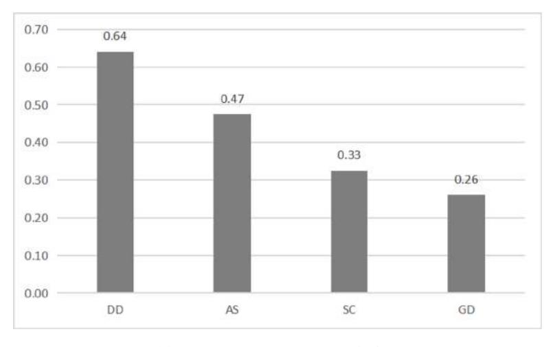
<!-- Image Description: The bar graph displays four categories (DD, AS, SC, GD) with corresponding values: 0.64, 0.47, 0.33, and 0.26 respectively.  The y-axis represents a scale from 0.0 to 0.7, likely indicating a proportion or other metric.  The graph visually compares the magnitude of these four values. -->

**Fig. 12.** MCP of four microservice extraction methods (E-comm project)

candidates that are generated using different extraction techniques. The redundancy rate is computed for each new software system in the microservice architecture corresponding to each extraction algorithm. Statistic, a plugin for IntelliJ IDEA, is used for the LOC statistics of the project. To achieve an accurate calculation, those codes related to the SpringBoot framework itself, or configurations of the project, are not taken into account. Fig. 13. shows the CRR corresponding to the four microservice extraction methods.

From the above results, we can see that the microservice implemented by the proposed method has the lowest code redundancy rate. This indicates that the proposed algorithm produces a microservice system with fewer message exchanges between services and improved

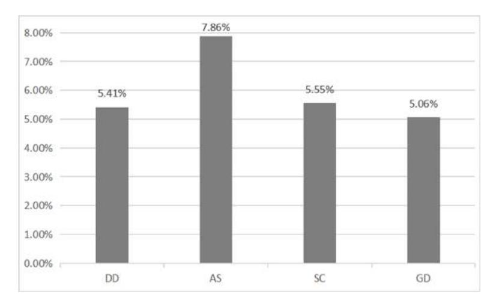
<!-- Image Description: The image displays a bar chart showing percentages.  Four categories (DD, AS, SC, GD) are represented, with AS exhibiting the highest percentage (7.86%), followed by SC (5.55%), GD (5.06%), and DD (5.41%).  The chart likely represents the relative proportions of these four categories within a larger dataset. -->

**Fig. 13.** CRR of four microservice extraction methods (E-comm project)

# system efficiency.

# (1) Team Size Reduction Rate

As we represent the number of teams by the number of functions, the original team size is 51 (corresponding to 15 functions). The team size of each microservice is equal to the number of functions contained in the service, as shown in Table 6.

[Fig. 14](#page-15-0). depicts the TSRR of the four strategies. When compared to DD method, the other three algorithms all outperform DD method concerning team size improvement. The proposed technique has a slight advantage in that it achieves the greatest TSRR of 90%. The findings show that the average development team size of the new system developed by the three approaches (AS, SC, and GD) has been significantly reduced, making each programmer's duty clearer, the service boundary more obvious, and team development efficiency greater.

To further verify the proposed microservice extraction method, we undertake performance tests on the microservice systems obtained by the four methods. Take TP50, TP80, TP99, and TP9991 as performance indicators respectively. Repeat each performance test five times, and take the average value of each indicator. [Table 7](#page-15-0) summarizes the results.

We can see from the table that regardless of whether 50% or 90% of the requests are served, the microservice system corresponding to the suggested technique can always complete the response at a faster speed, even if the difference with other methods is not noticeable. The performance test shows that the microservice extracted by the suggested strategy has relatively better performance.

*4.5.1.2. Disscussion on Cargo project.* As for Cargo project, the performance of the four methods on the predefined index are displayed in [Fig. 15~](#page-15-0)[Fig. 18.](#page-16-0) And the team size of each microservice is shown in [Table 8](#page-17-0).

From the perspective of microservice division results, GD (our algorithm), DD, and AS generate four microservices each, whereas the SC technique only produces three. Our algorithm has the highest performance in quality metrics such as cohesion and TSRR. The index values of the four methods are relatively close in terms of coupling degree, and our methodology is slightly better than the AS method. The DD approach adopts manual business analysis and domain modeling, making full use of manual experience to a certain extent. Therefore, it helps the DD method perform best in the coupling degree index, which is probably the limitation of the proposed GD algorithm. The less it depends on manual work, the more probable the accuracy of business knowledge will be constrained by the quality of the design documentation of the original monolithic application. When compared to the SC technique, the GD approach has a minor disadvantage in terms of coding redundancy rate. Although DD still outperforms our algorithm, as mentioned earlier, this index may also be limited by the level and ability of architecture migrators.

Again, we undertake performance tests on the microservice systems obtained by the four methods. [Table 9](#page-17-0) summarizes the results.

The findings reveal that in the Cargo project, the microservice system

# **Table 6**

|  |  |  |  | Team size of each microservice for the four methods |
|--|--|--|--|-----------------------------------------------------|
|  |  |  |  |                                                     |

| Methods | Number of Microservices | Team Size of Each Microservice |
|---------|-------------------------|--------------------------------|
| DD      | 5                       | 3, 25, 11, 9, 13               |
| AS      | 9                       | 6, 8, 4, 5, 11, 8, 5, 6, 8     |
| SC      | 8                       | 6, 14, 5, 11, 8, 5, 6, 6       |
| GD      | 10                      | 9, 11, 6, 5, 3, 5, 8, 4, 5, 5  |
|         |                         |                                |

obtained by the approach suggested in this research is not always capable of completing the response in the shortest time. But overall, the difference between this procedure and others is negligible.

In comparison to an e-commerce system, the Cargo project's code scale is quite modest (about 6119 lines of code), which is less than onetenth of the E-comm system's code scale (about 65497 lines of code). A small-scale software system like cargo, for example, does not need to use a microservice architecture. Therefore, it is feasible to apply the proposed algorithm to microservice extraction for small software projects that are not well suited to a microservice architecture, but it may not fully exploit its advantages when compared to other methods.

#### *4.5.2. The Effectiveness of the Method*

[Table 10](#page-17-0) shows the results of a comparison of the four approaches from the perspective of method effectiveness.

- (1) Applicability of the method. The four approaches may be applied to practical cases.
- (2) Reliance on human experience. Method SC requires developers to learn in advance a detailed and exhaustive specification of the system together with ad-hoc and subjective specification artifacts associated with coupling criteria [\[19\]](#page-19-0). Method DD also requires the architect to have extensive domain experience and participate during the whole process. Recalling the experimental process described in the research, most of the work is automatically fulfilled, such as the knowledge graph construction and community detection, which dramatically reduces the reliance on human experiences.
- (3) Reliance on well-defined software. Baresi's technique identifies microservices based on the interface information in the OpenAPI specification, which requires developers to offer meaningful and well-defined interfaces. The method proposed in this paper can extract the function node information by analyzing the control classes when the design document is missing, which does not have high requirements for design document standardization.
- (4) Whether the hardware is under consideration. Gysel et al. [\[10\]](#page-18-0)  proposed a coupling criterion, including 16 coupling criteria in ServiceCutter to describe an architecturally significant requirement why two nanoentities should or should not be owned by the same service. Storage Similarity, one of the hardware-related criteria, says: the user classifies nanoentities into the given characteristics and the classification is system specific. However, the application of such criteria to practical projects has not been seen. The method proposed in this paper takes into account the hardware resources and applies it to the cases, which may help to improve the utilization of hardware resources.

#### *4.5.3. The Rationality of Business Logic*

From the perspective of business logic, we will analyze the microservice extraction outcomes of the E-comm project in this section.

As shown in [Table 4,](#page-11-0) most module nodes of the original monolithic program constitute a separate microservice, with two exceptions. Modules HPC and PM are both parts of the same microservice (see Service C in [Table 4](#page-11-0)). Take microservice C as an example. The module HPC provides functions such as getting product classifications and basic information about recommended products. The PM module contains operations including product sorting and obtaining product details. On one hand, from the standpoint of the business process, the user first views the recommended product on the mall's homepage, then clicks on it to explore product details. As far as the data entities involved in the functions are concerned, placing orders and returning goods are both related to the reading and writing of product entities. Module HPC and PM are closely linked, whether in business logic or data operations. Therefore, integrating the two modules into one microservice avoids the risk of strong coupling between services. Another exception is that the modules UOM and RM are assigned to Service H (see [Table 4](#page-11-0)). The UOM

1 The TP999 is a minimum time under which 99.9% of requests have been served.

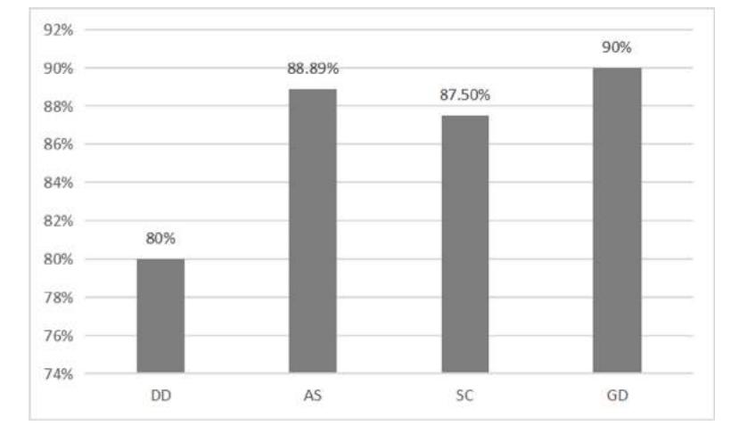
<!-- Image Description: The bar chart displays percentages for four categories (DD, AS, SC, GD).  DD shows 80%, AS shows 88.89%, SC shows 87.50%, and GD shows 90%.  The chart likely represents success rates or similar metric across different methods or groups. -->

**Fig. 14.** TSRR for four microservice extraction methods (E-comm project)

**Table 7**  Results of Performance Tests on E-comm Project

| Methods | TP50  | TP80  | TP99  | TP999 |
|---------|-------|-------|-------|-------|
| DD      | 20.03 | 24.58 | 46.96 | 67.53 |
| AS      | 19.98 | 23.99 | 46.37 | 66.94 |
| SC      | 20.57 | 25.17 | 47.52 | 69.10 |
| GD      | 19.63 | 23.92 | 45.46 | 66.18 |

module provides features such as order payment and order cancellation, while the RM module contains activities including refund and return. From the viewpoint of business rules, order and payment are a precondition for return and refund. Furthermore, returns and refunds necessarily require modification of the order status. Assigning these two highly logically coupled modules to one community is conducive to improving the cohesion of the service. As far as the data entities involved in the function are concerned, order placement and return are related to the reading and writing of the order entity. Functions that operate on the same data entity should be combined into one microservice [\[19\].](#page-19-0) In conclusion, the extraction of microservice H is reasonable.

The experiments also show that constraints play an important role in graph clustering. Without Constraint1, three function nodes, namely "Refresh Token", "Get Member Information" and "Get Verification Code", are mistakenly marked as separate communities. Take the function node "Get Verification Code" as an example. This function node is classified as a separate community because it is not associated with any data node.

Applying Constraint1, this node is finally assigned to microservice G (see [Table 4](#page-11-0)) and is associated with module "User Login Registration". [Fig. 19.](#page-17-0) shows part of the results of graph clustering. Circles with different sizes in the graph represent the defined four types of nodes. Connected circles with the same color represent a community, i.e., microservice, formed by graph clustering. Circles with different colors mean different microservices. As shown in [Fig. 19\(](#page-17-0)a), the three function nodes "Refresh Token", "Get Member Information" and "Get Verification Code" are blue, dark orange, and green respectively, representing three independent microservices. While in [Fig. 19\(](#page-17-0)b), the three function nodes are orange, the same color as the module "User Login Registration". It indicates that they are associated with the module "User Login Registration" and grouped in the same microservice G (see [Table 4](#page-11-0)). In terms of actual design, the module "User Login Registration" mainly involves the functions related to user login and registration. The "Refresh Token" node implements the token update function, the "Get Member Information" node realizes the user information update, and the node "Get Verification Code" is responsible for functions related to verification code. The above functions comply with the functional design of the module "User Login Registration".

It is customary that a microservice (community) implements a unique complex functionality, e.g., user's authentication, credit card validation. How to correctly identify processing-centric microservices (that usually provide a single functionality) in the presence of Constraint 1 has become a huge challenge. By introducing a labeling mechanism, we may choose whether or not to apply Constraint 1 in the clustering

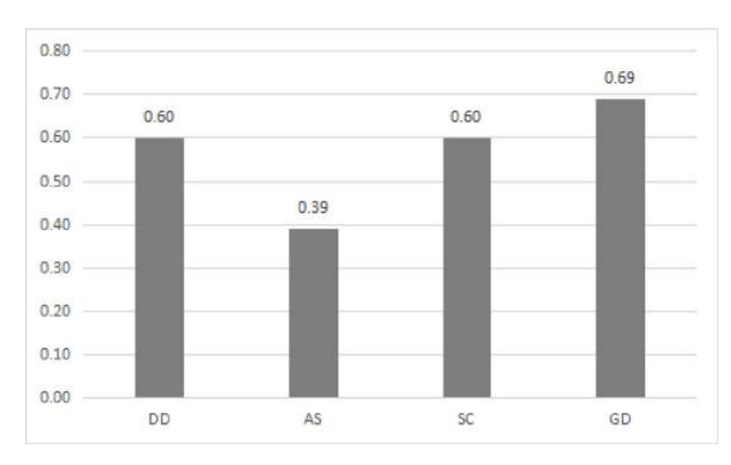
<!-- Image Description: The image displays a bar chart comparing four groups (DD, AS, SC, GD) based on a numerical value.  The values range from approximately 0.39 to 0.69. GD shows the highest value (0.69), while AS has the lowest (0.39).  DD and SC both have values of 0.60.  The chart likely represents a quantitative comparison of some metric across the four groups. -->

**Fig. 15.** MDC of four microservice extraction methods (Cargo project)

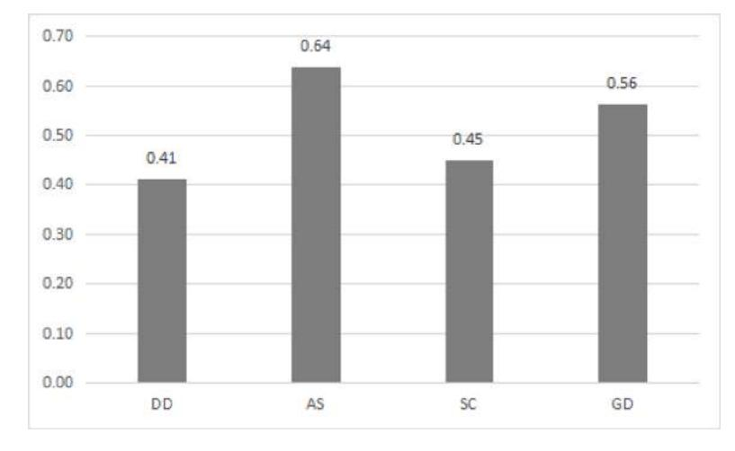
<!-- Image Description: The image displays a bar chart showing the values of four variables: DD (0.41), AS (0.64), SC (0.45), and GD (0.56).  The y-axis represents a scale from 0.0 to 0.7, likely representing a metric or measurement; the x-axis represents the four variables.  The chart visually compares the magnitude of these four values. -->

**Fig. 16.** MCP of four microservice extraction methods (Cargo project)

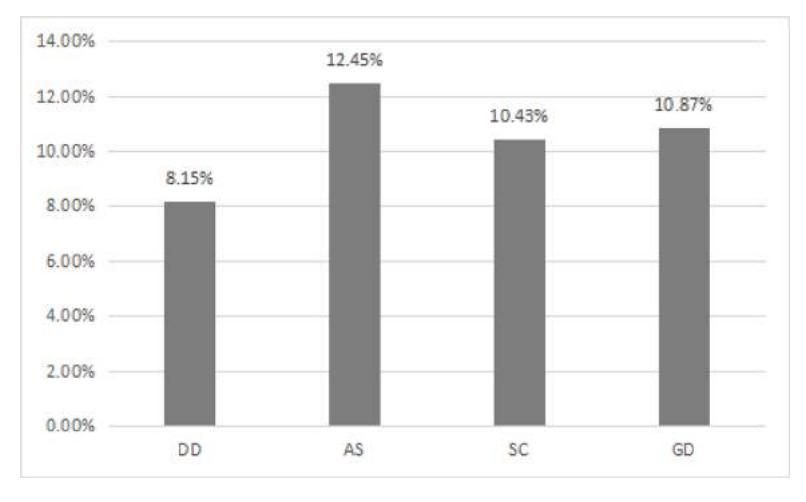
<!-- Image Description: The bar chart displays percentages for four categories (DD, AS, SC, GD).  AS shows the highest percentage (12.45%), followed by GD (10.87%), SC (10.43%), and DD (8.15%).  The chart likely represents proportions or frequencies of these categories within a dataset. -->

**Fig. 17.** CRR of four microservice extraction methods (Cargo project)

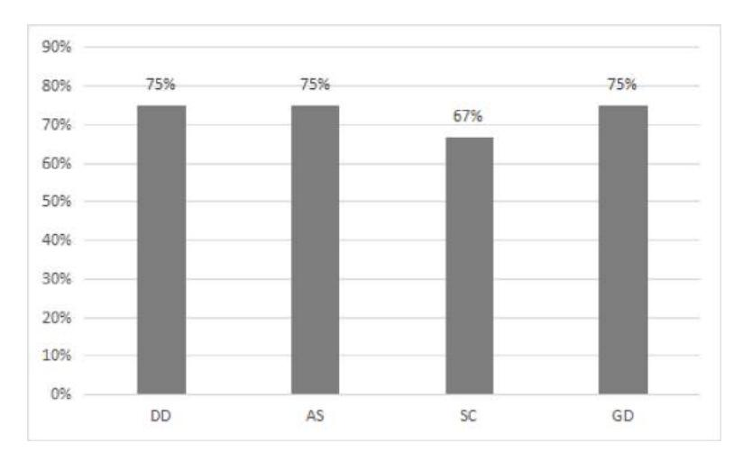
<!-- Image Description: The image displays a bar chart showing percentages.  Four categories (DD, AS, SC, GD) are represented, with corresponding percentage values of 75%, 75%, 67%, and 75%, respectively.  The chart visually compares the proportion of each category. -->

**Fig. 18.** TSRR for four microservice extraction methods (Cargo project)

process, allowing this kind of function to generate an autonomous community. More research on intelligent processing is still needed.

A similar situation also appears with Constraint2. Without Constrant 2, the node "sms\_home\_advertisement" is individually marked as a microservice. With Constrant 2, the original node "sms\_home\_advertisement" is grouped into the microservice C (see [Table 4](#page-11-0)).

What makes the data node "sms\_home\_advertisement" so unique? The reason is that only one function reads data from this node at a low frequency. Microservices with only one data node will aggravate the coupling of the system. Fortunately, the algorithm effectively detects this situation by adding Constraint2 and successfully adds such a data node to the microservice where the "home page information display" is

# **Table 8**

Team size per microservice

| Methods | Number of Microservices | Team Size of Each Microservice |  |  |
|---------|-------------------------|--------------------------------|--|--|
| DD      | 4                       | 2, 1, 4, 2                     |  |  |
| AS      | 4                       | 2, 1, 3, 3                     |  |  |
| SC      | 3                       | 1, 2, 6                        |  |  |
| GD      | 4                       | 4, 1, 2, 2                     |  |  |

**Table 9** 

Results of Performance Tests on Cargo Project

| Methods | TP50 | TP80  | TP99  | TP999 |
|---------|------|-------|-------|-------|
| DD      | 6.48 | 13.58 | 39.28 | 49.54 |
| AS      | 6.98 | 14.75 | 42.33 | 54.42 |
| SC      | 6.89 | 13.89 | 42.12 | 51.67 |
| GD      | 6.92 | 14.33 | 41.92 | 52.17 |
|         |      |       |       |       |

# **Table 10**

Performance of the Effectiveness of Methods

| Characteristics                                                                         | DD            | AS     | SC            | GD          |
|-----------------------------------------------------------------------------------------|---------------|--------|---------------|-------------|
| Applicability of the Method (Yes/No) Reliance on Human Experiences (Strong/ Weak) | Yes Strong | Yes    | Yes Strong | Yes Weak |
| Reliance on Well-defined Software (Strong/ Weak)                                     |               | Strong | Strong        | Weak        |
| Take Hardware into Consideration (Yes/No)                                               | No            | No     | Yes           | Yes         |

located. The function nodes "Homepage content" and "Commodity management" contained in microservice C are closely related to the homepage advertising data corresponding to this data node. Putting the data node "sms\_home\_advertisement" into microservice C is in line with the design.

There is a "strange" phenomenon among the final ten microservices. There are primarily two communities in the figure, as illustrated in [Fig. 20.](#page-18-0) (a). The blue node community (i.e., services related to brand management in [Table 4\)](#page-11-0) represents microservice A. Microservice C offers services relating to the home page and product management and is represented by the yellow nodes. The module node "Brand Management" (BM in short) and the function node "Get Brand Related Products in Separate Pages" belong to two different communities, as can be observed. This function node is, however, subordinate to the module node "BM," according to the API design document (see [Fig. 20\(](#page-18-0)b)). From the perspective of software design, it is puzzling that these two closely related nodes fall into two different microservices.

Further investigation of the monolithic application reveals that the function's business logic is as follows. The user begins by clicking on the brand name. The front end then issues a request to the system with the brand ID as the parameter. Then, the backend queries the commodity information table. Finally, the software system returns the goods list.

Reading or writing brand data is not part of the entire business process. Function node GBRP operates the product data entity and outputs product information. It does not read and write the data entity of service A. While in microservice C, functions including "Get recommended brands in a pagination" and "Get brand details" operate the brand data entity and output brand information. Therefore, the function node GBRP has no business relevance to the other two. Unfortunately, developers artificially assign this function to module BM during the software design process of the initial monolithic program, which is unreasonable. The algorithm proposed in this paper can identify this design defect and extract the correct microservice candidate. Function node GBRP is correctly assigned to microservice C related to product management.

#### **5. Conclusions and Future Work**

This paper proposes a novel method based on knowledge-graph to support the extraction of microservices during the initial phases of rearchitecting existing applications. According to the microservice extraction method based on the *AKF* principle, four kinds of entities and four types of entity-entity relationships are designed and automatically extracted from specification and design artifacts of the monolithic application to build the knowledge graph. Propose a constrained Louvain community detection algorithm to identify microservice candidates. Test our approach with the other three typical methods based on two open-source projects. Conducted experiments show that our method performs well concerning most of the evaluation metrics, including team size reduction, cohesion, coupling, and code redundancy rate. The main strengths of this study include low dependency on human experience in graph construction from monolithic systems, and applicable focuses on the influence of hardware resources on microservices. It also highlights the potential uses of checking the design rationality of the original

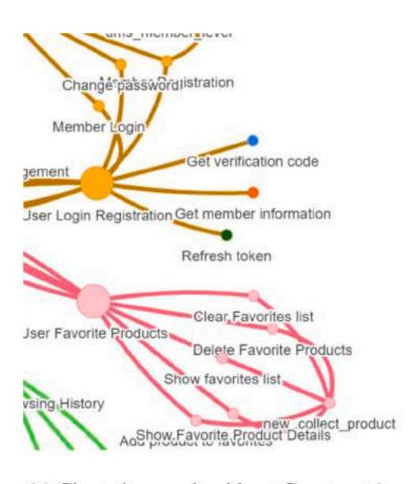
<!-- Image Description: The image displays two node-link diagrams illustrating user actions.  The top diagram (gold) shows user login/registration processes, including password changes and verification.  The bottom diagram (pink) depicts user interactions with favorite products, including viewing, adding, deleting, and clearing the favorites list. A smaller green section represents browsing history.  Each node represents an action, and links indicate connections between them. -->

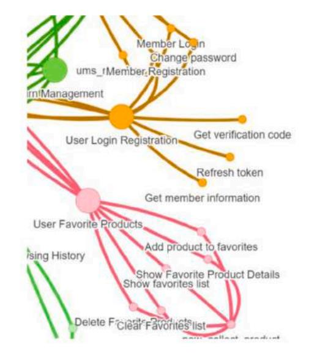
<!-- Image Description: This image displays a node-link diagram illustrating a system's architecture.  Colored lines connect nodes representing different functionalities, such as user login, member registration, and favorite product management.  The diagram visually represents the relationships and data flow between these functions, possibly for software design or analysis. -->

**Fig. 19.** Part of the clustering result without Constraint1 and with Constraint1

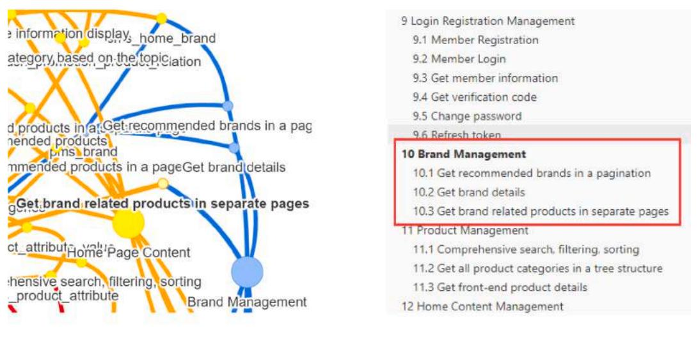
<!-- Image Description: The image displays a system architecture. A node-link diagram on the left visualizes data flow between system components like "Home Page Content" and "Brand Management," using color-coded edges to represent different data streams.  A numbered list on the right details functional modules, including "Brand Management" with sub-functions for retrieving brand and product information. -->

**Fig. 20.** Part of the clustering result about function node "Get brand related products in separate pages"

monolithic application and discovering possible design defects.

In-depth research will carry out in the future in the following aspects. (he extraction method of resource nodes needs further research and optimization. Restricted by the objective experimental environment, only a few parameters are considered in the extraction of resource node information in this experiment. However, such evaluations in cloud scenarios often involve many complex, multi-level parameters, which are also the objects we need to focus on in the future.

- (1) More entity types will be introduced to better reflect the system composition. For software projects of very large scale and complexity, extracting nodes from three perspectives may still have the problem of too much node granularity. Therefore, the developer's modification history of the code and the security requirements of the system business can be considered to be included in the extraction model from the developer's perspective and the security perspective. In this way, developer entities, security level entities are abstracted to better decompose the monolithic system.
- (2) The granularity of data splitting in the current method is at the table level. But the number of fields in a single data table of a monolithic system can reach tens or hundreds, which may involve table splitting operations in the process of migration to microservices. Therefore, one of the future directions of work is to split the data of a single system at the field level to get more accurate extracting results.

# **CRediT authorship contribution statement**

Chenqi Shang and Jianjie Wu contributed to the conception of the study;

Zhiding Li verified the method.

Zhiding Li and Chenqi Shang performed the experiments.

Zhiding Li,Chenqi Shang, and Jianjie Wu wrote the manuscript.

Yuan Li, check and review the manuscript.

All authors read and approved the final manuscript.

# **Declaration of Competing Interest**

The authors declare that they have no known competing financial interests or personal relationships that could have appeared to influence the work reported in this paper.

# **Data Availability**

No data was used for the research described in the article.

# **Supplementary materials**

Supplementary material associated with this article can be found, in the online version, at [doi:10.1016/j.infsof.2022.106992](https://doi.org/10.1016/j.infsof.2022.106992).

# **References**

- [1] C.H. Chang, C.W. Lu, P.A. Hsiung, Pattern-based framework for modularized software development and evolution robustness, Information and Software Technology 53 (4) (2011) 307–316, [https://doi.org/10.1016/j.infsof.2010.11.006.](https://doi.org/10.1016/j.infsof.2010.11.006)
- [2] [D. Krafzig, K. Banke, D. Slama, Enterprise SOA: service-oriented architecture best](http://refhub.elsevier.com/S0950-5849(22)00124-0/sbref0002)  [practices, Prentice Hall Professional, 2004. ISBN: 0131465759.](http://refhub.elsevier.com/S0950-5849(22)00124-0/sbref0002)
- [3] P. Valderas, V. Torres, V. Pelechano, A microservice composition approach based on the choreography of BPMN fragments, Information and Software Technology 127 (2020), 106370, [https://doi.org/10.1016/j.infsof.2020.106370.](https://doi.org/10.1016/j.infsof.2020.106370)
- [4] H. Knoche, W. Hasselbring, Drivers and barriers for microservice adoption-a survey among professionals in germany, Enterprise Modelling and Information Systems Architectures (EMISAJ)-International Journal of Conceptual Modeling 14 (1) (2019) 1–35, <https://doi.org/10.1016/j.jclepro.2019.118825>.
- [5] J.X. Liu, K.Q. He, J. Wang, F. Liu, X.X. Li, Service organization and recommendation using multi-granularity approach, Knowledge-Based Systems (73) (2015) 181–198, [https://doi.org/10.1016/j.knosys.2014.10.002.](https://doi.org/10.1016/j.knosys.2014.10.002)
- [6] [X.Y. Mao, Y.Y. Xin, A review of microservice portfolio verification methods,](http://refhub.elsevier.com/S0950-5849(22)00124-0/sbref0006) [Wireless Communication Technology 28 \(3\) \(2019\) 46](http://refhub.elsevier.com/S0950-5849(22)00124-0/sbref0006)–50.
- [7] G. Schermann, J. Cito, P. Leitner, All the services large and micro: Revisiting industrial practice in services computing, in: A. Norta, W. Gaaloul, G. Gangadharan, H. Dam (Eds.), Service-Oriented Computing – ICSOC 2015 Workshops. ICSOC 2015. Lecture Notes in Computer Science 9586, Springer, Berlin, Heidelberg, 2022, [https://doi.org/10.1007/978-3-662-50539-7\\_4](https://doi.org/10.1007/978-3-662-50539-7_4).
- [8] G.S. Zhang, Microservice software modeling based on domain-driven design and C4 layered architecture model, Journal of Chinese Academy of Electronic Science 16 (02) (2021) 119–126, [https://doi.org/10.3969/j.issn.1673-5692.2021.02.003.](https://doi.org/10.3969/j.issn.1673-5692.2021.02.003)
- [9] C. Davide, M. Enrico, P.R. Daniele, Novel metrics for computing semantic similarity with sense embeddings, Knowledge-Based Systems, 2020, 206, 106346, https://doi.org/10.1016/j.knosys.2020.106346.
- [10] M. Gysel, L. Kolbener, ¨ W. Giersche, O. Zimmermann, Service cutter: a systematic approach to service decomposition, in: European Conference on Service-Oriented and Cloud Computing, Springer, Cham, 2016, pp. 185–200, [https://doi.org/](https://doi.org/10.1007/978-3-319-44482-6_12)  [10.1007/978-3-319-44482-6\\_12.](https://doi.org/10.1007/978-3-319-44482-6_12)
- [11] S.S. Li, H. Zhang, Z.J. Jia, C.X. Zhong, C. Zhang, Z.H. Shan, J.F. Shen, M.A. Babar, Understanding and addressing quality attributes of microservices architecture: A Systematic literature review, Information and Software Technology 131 (2021), 106449, <https://doi.org/10.1016/j.infsof.2020.106449>.
- [12] J. Lewis, M. Fowler, Microservices (2014-03-25) [2021-12-02], [https://www.marti](https://www.martinfowler.com/articles/microservices.html)  [nfowler.com/articles/microservices.html](https://www.martinfowler.com/articles/microservices.html).
- [13] D. Taibi, V. Lenarduzzi, C. Pahl, Processes, motivations, and issues for migrating to microservices architectures: an empirical investigation, 4, IEEE Cloud Computing, 2017, pp. 22–32, <https://doi.org/10.1109/MCC.2017.4250931>.

- [14] J. Soldani, D.A. Tamburri, W.J.V.D. Heuvel, The pains and gains of microservices: a systematic grey literature review, Journal of Systems and Software (146) (2018) 215–232, [https://doi.org/10.1016/j.jss.2018.09.082.](https://doi.org/10.1016/j.jss.2018.09.082)
- [15] F. Auer, V. Lenarduzzi, M. Felderer, D. Taibi, From monolithic systems to microservices: an assessment framework, Information and Software Technology, 2021, 137, 106600, https://doi.org/10.1016/j.infsof.2021.106600.
- [16] N. Medvidovic, R.N. Taylor, A classification and comparison framework for software architecture description languages, IEEE Transactions on software engineering 26 (1) (2000) 70–93, <https://doi.org/10.1109/32.825767>.
- [17] [E. Evans, R. Szpoton, Domain-driven design, Helion \(2015\). ISBN:](http://refhub.elsevier.com/S0950-5849(22)00124-0/sbref0017)
- [9780321125217.](http://refhub.elsevier.com/S0950-5849(22)00124-0/sbref0017) [18] [M. Richards, Microservices vs.Service-Oriented Architecture, O](http://refhub.elsevier.com/S0950-5849(22)00124-0/sbref0018)'Reilly Media, [2016. ISBN: 9781491941607.](http://refhub.elsevier.com/S0950-5849(22)00124-0/sbref0018)
- [19] R. Chen, S. Li, Z. Li, From monolith to microservices: a dataflow-driven approach, in: 2017 24th Asia-Pacific Software Engineering Conference (APSEC), IEEE, 2017, pp. 466–475, [https://doi.org/10.1109/APSEC.2017.53.](https://doi.org/10.1109/APSEC.2017.53)
- [20] A. Levcovitz, R. Terra, M.T. Valente, Towards a technique for extracting microservices from monolithic enterprise systems, arXiv preprint (2016) arXiv: 1605.03175, <https://arxiv.org/abs/1605.03175>.
- [21] M.R. Berthold, Frank Hoppner, On clustering time series using euclidean distance and pearson correlation, arXiv preprint (2016) arXiv:1601.02213, [https://arxiv.](https://arxiv.org/abs/1601.02213) [org/abs/1601.02213](https://arxiv.org/abs/1601.02213).
- [22] [M.J.T. David, R. Duin, D.D. Ridder, Classification, parameter estimation and state](http://refhub.elsevier.com/S0950-5849(22)00124-0/sbref0022)  [estimation: an engineering approach using MATLAB, John Wiley and Sons, 2004.](http://refhub.elsevier.com/S0950-5849(22)00124-0/sbref0022)  [ISBN: 0-470-09013-8.](http://refhub.elsevier.com/S0950-5849(22)00124-0/sbref0022)
- [23] [P.N. Tan, M. Steinbach, V. Kumar, Introduction to data mining, Addison-Wesley,](http://refhub.elsevier.com/S0950-5849(22)00124-0/sbref0023)  [2005. ISBN: 9780321321367.](http://refhub.elsevier.com/S0950-5849(22)00124-0/sbref0023)
- [24] L. Baresi, M. Garriga, A.D. Renzis, Microservices identification through interface analysis, European Conference on Service-Oriented and Cloud Computing. springer, cham (2017) 19–33, [https://doi.org/10.1007/978-3-319-67262-5\\_2.](https://doi.org/10.1007/978-3-319-67262-5_2)
- [25] N. Yang, [Master'[s thesis\], Beijing University of Posts and Telecommunications](http://refhub.elsevier.com/S0950-5849(22)00124-0/sbref0025) [Library, Beijing, 2019.](http://refhub.elsevier.com/S0950-5849(22)00124-0/sbref0025)
- [26] J.W. Shao, Q.Q. Liu, H.Q. Wang, Y.W. Chen, D.J. Yu, S. Boranbaev, A classdependency-based microservice identification approach under resource constraints, Computer Applications 40 (12) (2020) 3604–3611, [https://doi.org/](https://doi.org/10.11772/j.issn.1001-9081.2020040495)  [10.11772/j.issn.1001-9081.2020040495.](https://doi.org/10.11772/j.issn.1001-9081.2020040495)
- [27] Y.W. Zhang, Y.Y. Zhou, F.T. Wang, Z. Sun, Q. He, Service recommendation based on quotient space granularity analysis and covering algorithm on spark, Knowledge-Based Systems (147) (2018) 25–35, [https://doi.org/10.1016/j.](https://doi.org/10.1016/j.knosys.2018.02.014) [knosys.2018.02.014.](https://doi.org/10.1016/j.knosys.2018.02.014)
- [28] G. Mazlami, J. Cito, P. Leitner, Extraction of microservices from monolithic software architectures, in: 2017 IEEE International Conference on Web Services (ICWS), 2017, pp. 524–531, <https://doi.org/10.1109/ICWS.2017.61>.
- [29] W.X. Jin, T. Liu, Q.H. Zheng, D. Cui, Y. Cai, Functionality-oriented microservice extraction based on execution trace clustering, in: Proc. of the IEEE Internatioanl Conference on Web Services (ICWS), 2018, pp. 211–218, [https://doi.org/10.1109/](https://doi.org/10.1109/ICWS.2018.00034)  [ICWS.2018.00034](https://doi.org/10.1109/ICWS.2018.00034).
- [30] [M.L. Abbott, M.T. Fisher, The art of scalability: scalable web architecture,](http://refhub.elsevier.com/S0950-5849(22)00124-0/sbref0030) [processes and organizations for the modern enterprise, Addison-Wesley](http://refhub.elsevier.com/S0950-5849(22)00124-0/sbref0030)  [Professional, 2015. ISBN: 9780134032801.](http://refhub.elsevier.com/S0950-5849(22)00124-0/sbref0030)
- [31] V. Ramp´erez, J. Soriano, D. Lizcano, J.A. Lara, FLAS: A combination of proactive and reactive auto-scaling architecture for distributed services, Future Generation Computer Systems (118) (2021) 56–72, [https://doi.org/10.1016/j.](https://doi.org/10.1016/j.future.2020.12.025)  [future.2020.12.025.](https://doi.org/10.1016/j.future.2020.12.025)
- [32] D.D. Zhang, Z.Q. Wei, Y.Q. Yang, Research on lightweight MVC framework based on spring MVC and mybatis, in: 2013 Sixth International Symposium on

Computational Intelligence and Design 1, IEEE, 2013, pp. 350–353, [https://doi.](https://doi.org/10.1109/ISCID.2013.94) [org/10.1109/ISCID.2013.94](https://doi.org/10.1109/ISCID.2013.94).

- [33] D. Ameller, X. Burgu´es, O. Collell, D. Costal, Franch X, M.P. Papazoglou, Development of service-oriented architectures using model-driven development: A mapping study, Information and Software Technology (62) (2015) 42–66, [https://](https://doi.org/10.1016/j.infsof.2015.02.006)  [doi.org/10.1016/j.infsof.2015.02.006.](https://doi.org/10.1016/j.infsof.2015.02.006)
- [34] V.D. Blondel, J.L. Guillaume, R. Lambiotte, E. Lefebvre, Fast unfolding of communities in large networks, Journal of statistical mechanics: theory and experiment (10) (2008) P10008, [https://doi.org/10.1088/1742-5468.](https://doi.org/10.1088/1742-5468)
- [35] M.E.J. Newman, M. Girvan, Finding and evaluating community structure in networks, Physical Review E 69 (2004), 026113, [https://doi.org/10.1103/](https://doi.org/10.1103/physreve.69.026113)  [physreve.69.026113.](https://doi.org/10.1103/physreve.69.026113)
- [36] J.J. Shi, A study of three classical complex network community structure division algorithms, Computer and Information Technology 19 (04) (2011) 42–43, [https://](https://doi.org/10.19414/j.cnki.1005-1228.2011.04.014)  [doi.org/10.19414/j.cnki.1005-1228.2011.04.014](https://doi.org/10.19414/j.cnki.1005-1228.2011.04.014). +79.
- [37] A. Lancichinetti, S. Fortunato, Community detection algorithms: a comparative analysis, Physical Review E 80 (5) (2009), 056117, [https://doi.org/10.1103/](https://doi.org/10.1103/PhysRevE.80.056117)  [PhysRevE.80.056117](https://doi.org/10.1103/PhysRevE.80.056117).
- [38] M. Girvan, M.E.J. Newman, Community structure in social and biological networks, The Proceedings of the National Academy of Sciences 99 (12) (2002) 7821–7826, [https://doi.org/10.1073/pnas.122653799.](https://doi.org/10.1073/pnas.122653799)
- [39] B.W. Kernighan, S. Lin, A efficent heuristic procedure for partitioning graphs, The Bell System Technical Journal 49 (2) (1970) 291–307, [https://doi.org/10.1002/](https://doi.org/10.1002/j.1538-7305.1970.tb01770.x)  [j.1538-7305.1970.tb01770.x](https://doi.org/10.1002/j.1538-7305.1970.tb01770.x).
- [40] E.R. Barnes, An algorithm for partitioning the nodes of a graph, SIAM Journal on Algebraic Discrete Methods 3 (4) (1982) 541–550, [https://doi.org/10.1137/](https://doi.org/10.1137/0603056) [0603056](https://doi.org/10.1137/0603056).
- [41] M.E.J. Newman, Fast algorithm for community structure in networks, Physical Review E 69 (2004), 066133, <https://doi.org/10.1103/PhysRevE.69.066133>.
- [42] Macrozheng: mall. (2021-12-02)[2021-12-02]. [https://github.com/macrozh](https://github.com/macrozheng/mall)  [eng/mall.](https://github.com/macrozheng/mall)
- [43] [S. Newman, Building Microservices, O](http://refhub.elsevier.com/S0950-5849(22)00124-0/sbref0043)'Reilly Media, Inc., 2015. ISBN: [9781491950357.](http://refhub.elsevier.com/S0950-5849(22)00124-0/sbref0043)
- [44] D. Malavalli, S. Sathappan, Scalable microservice based architecture for enabling DMTF profiles, in: Proc. CNSM 2015, IEEE, 2015, pp. 428–432, [https://doi.org/](https://doi.org/10.1109/CNSM.2015.7367395)  [10.1109/CNSM.2015.7367395](https://doi.org/10.1109/CNSM.2015.7367395). November.
- [45] A. Erradi, N. Kulkarni, P. Maheshwari, Service design process for reusable services: financial services case study, in: 5th International Conference on Service Oriented Computing (ICSOC'07), Lecture Notes in Computer Science, Springer, Berlin, Heidelberg, 2007, pp. 606–617, [https://doi.org/10.1007/978-3-540-74974-5\\_56.](https://doi.org/10.1007/978-3-540-74974-5_56)
- [46] M. Daghaghzadeh, A.B. Dastjerdi, H. Daghaghzadeh, A metric for measuring degree of service cohesion in service oriented designs, in: Proc. of the International Journal of Computer Science Issues 5, 2011, pp. 83–89. [http://citeseerx.ist.psu.edu](http://citeseerx.ist.psu.edu/viewdoc/download;jsessionid=1CF0FA63AE0619C07C15EFD851C540A8?doi=10.1.1.402.7383&tnqh_x0026;rep=rep1&tnqh_x0026;type=pdf)  /viewdoc/download;jsessionid=[1CF0FA63AE0619C07C15EFD851C540A8?doi](http://citeseerx.ist.psu.edu/viewdoc/download;jsessionid=1CF0FA63AE0619C07C15EFD851C540A8?doi=10.1.1.402.7383&tnqh_x0026;rep=rep1&tnqh_x0026;type=pdf)  =[10.1.1.402.7383](http://citeseerx.ist.psu.edu/viewdoc/download;jsessionid=1CF0FA63AE0619C07C15EFD851C540A8?doi=10.1.1.402.7383&tnqh_x0026;rep=rep1&tnqh_x0026;type=pdf)&rep=rep1&type=pdf.
- [47] X.G. Ning, X.F. Huang, Approach to dividing microservices based on domain driven design, Journal of Southwest University of Science and Technology 34 (1) (2019) 80–85. [http://en.cnki.com.cn/Article\\_en/CJFDTotal-XNGX201901014.htm.](http://en.cnki.com.cn/Article_en/CJFDTotal-XNGX201901014.htm)
- [48] [\[Evans2003\]E. Evans, Domain-driven design: tackling complexity in the heart of](http://refhub.elsevier.com/S0950-5849(22)00124-0/sbref0048)  [software, Pearson Education, 2003. ISBN: 9787115376756](http://refhub.elsevier.com/S0950-5849(22)00124-0/sbref0048).
- [49] A. Erradi, S. Anand, N. Kulkarni, SOAF: an architectural framework for service definition and realization, in: Proceedings of the IEEE International Conference on Services Computing' 06, 2006, pp. 151–158, [https://doi.org/10.1109/](https://doi.org/10.1109/Scc.2006.97) [Scc.2006.97.](https://doi.org/10.1109/Scc.2006.97)
- [50] C.X. Zhong, S.S. Li, H. Zhang, C. Zhang, Evaluating granularity of microservicesoriented system based on bounded context, Journal of Software 30 (10) (2019) 3227–3241 (in Chinese), [http://www.jos.org.cn/1000-9825/5797.htm.](http://www.jos.org.cn/1000-9825/5797.htm)