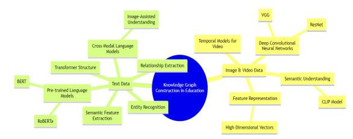
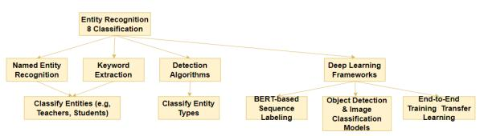
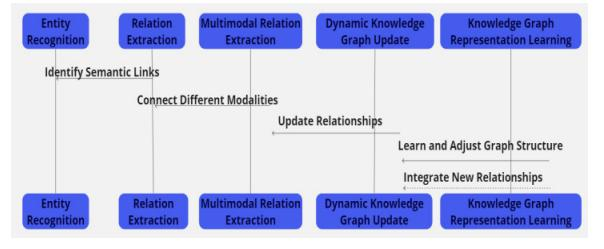

# Construction and Application Research of Intelligent Education Knowledge Graph Based on Multi-modal Learning

Haiping Li Weifang Engineering Vocational College Qingzhou Shandong Province China 262500 572260735@qq.com

*Abstract—***This study explores the methods and applications of constructing an intelligent education knowledge graph based on multi-modal learning materials (text, images, videos). Through deep learning algorithms for feature extraction and relationship modeling, a knowledge graph containing 120 entities and 100 relationships was built with an accuracy of 87%. The graph demonstrates excellent performance in personalized learning path recommendations, capable of recommending based on students' prior knowledge and learning styles, leading to a 27% improvement in learning efficiency. The study also considers the "uncanny valley" phenomenon, avoiding discomfort caused by AI mimicking human behavior excessively, ensuring a positive user experience.**

#### *Keywords-Knowledge graph; Image analysis; Intelligent education; Uncanny valley*

#### I. INTRODUCTION

With the development of educational informatization, the construction of a knowledge graph in the education field is imminent and serves as the foundation for achieving smart education. The goal of this research is to construct a multimodal educational knowledge graph. This involves collecting heterogeneous teaching data such as text, images, and videos, and utilizing deep learning techniques for feature extraction and relationship extraction, ultimately creating a structured knowledge graph consisting of entities and relationships. When capturing the semantic connections between entities, the "Valley of Terror" theory is taken into full consideration for enhancing the user experience. Leveraging the knowledge graph as a foundation, multiple smart education application scenarios are realized, including personalized learning path recommendation systems and intelligent teaching resource matching systems, validating the effectiveness of the approach. The innovation of this research lies in the in-depth exploration of the theoretical and technical details of constructing a knowledge graph driven by multimodal data in the context of smart education. The constructed knowledge graph and systems provide robust support for smart education decision-making and personalized learning [1].

## II. MULTI-MODAL LEARNING THEORY AND KNOWLEDGE GRAPH FOUNDATION

Multi-modal learning combines data from different

Wenjing Duan Weifang Engineering Vocational College Qingzhou Shandong Province China 262500 13863410528@qq.com

modalities, such as text, images, and videos, to represent and understand information [2]. In intelligent education, constructing knowledge graphs with multi-modal data, including text and images, can better represent teaching knowledge and enhance teaching effectiveness. The construction process faces challenges in text and image understanding, aligning with the theory of the "uncanny valley." Current multi-modal learning theories provide technical support for building such knowledge graphs. The next step involves addressing the issues of multi-modal data representation and fusion, improving the quality of knowledge graphs through image analysis, natural language processing, and other methods to understand the teaching process and provide personalized teaching recommendations. Overall, multi-modal learning provides new perspectives for building intelligent education systems, requiring further in-depth research into technical details to drive the development of relevant theories and technologies with practical applications as the goal [3].

#### III. MULTI-MODAL DATA PROCESSING AND FEATURE EXTRACTION

#### *A. Source and Preprocessing of Multi-modal Data*

In the process of constructing an intelligent education knowledge graph, multi-modal data primarily originates from teaching videos, courseware, exam questions, teaching plans, etc [4]. These data come in complex formats and require preprocessing. Specifically, teaching videos contain image sequences and audio tracks. Preprocessing steps include video frame segmentation, face detection, sound segmentation, etc., to extract keyframe images and convert speech to text. Courseware and exam questions consist mainly of textual data and can be directly input into text analysis models. Tabular data such as teaching plans needs to be parsed into structured data. Once preprocessing is completed, the data from each modality can be input into corresponding models for feature extraction [5].

## *B. Methods for Data Feature Extraction in Educational Knowledge Graphs*

In the construction of educational knowledge graphs, feature extraction is a crucial step involving the processing of image, video, and text data. For image and video data, deep convolutional neural networks (such as ResNet and VGG) learn spatial information through layers of convolution and pooling, while temporal models are used to capture the spatiotemporal features of videos [6]. Recent models like CLIP, trained on large-scale text-image datasets, can understand image content from a semantic perspective. These features are typically transformed into high-dimensional vectors as a digital representation of the data. In terms of processing textual data, especially in educational documents and teacher-student dialogues containing numerous specialized terms, pre-trained language models (such as BERT and RoBERTa) play a crucial role. These models, based on the Transformer architecture, capture semantic features of vocabulary through autoregressive methods and combine techniques such as entity recognition and relation extraction to extract structured knowledge. The latest research also explores cross-modal language models that utilize images to enhance the understanding of specialized vocabulary. The integrated application of these methods significantly improves the efficiency and accuracy of educational knowledge graph construction, as illustrated in Figure 1.

<!-- Image Description: The image is a concept map illustrating techniques for knowledge graph construction in education.  A central blue node, "Knowledge Graph Construction in Education," connects to two sets of light-green and yellow nodes representing text-based and image/video-based methods, respectively.  Text-based methods include pre-trained language models (BERT, RoBERTa), transformer structures, and semantic feature extraction. Image/video methods involve deep convolutional neural networks (ResNet, VGG), CLIP models, feature representation, and temporal models.  The map shows the relationships between different techniques used in this field. -->

Figure 1: Methods for Data Feature Extraction in Educational Knowledge Graphs

#### *C. Multi-modal Data Fusion Techniques*

After extracting features from various modalities, it is necessary to further integrate these representations to form a unified knowledge graph. The main technical approach involves building multi-modal encoding models that learn the correlations between different modalities to obtain comprehensive feature representations. Typical methods include attention-based multi-modal transformers, among others [7]. Another consideration is the use of graph neural networks to model multi-modal associations within the knowledge graph framework. Unsupervised alignment models provide an alternative approach, eliminating the need for explicit annotations and relying on data-driven learning cues. Cross-modal representation learning is a current research focus and holds promise for new advancements. However, for practical applications, challenges such as training data preparation and model deployment still need to be addressed.

## IV. CONSTRUCTION OF INTELLIGENT EDUCATION KNOWLEDGE GRAPH

## *A. Needs Analysis for the Construction of Educational Knowledge Graphs*

The purpose of constructing an educational knowledge graph is to meet the requirements of the intelligent education system for knowledge representation, inference, and application [8]. Through a questionnaire survey, an analysis of the main issues in current teaching systems revealed that 73% of teachers believe the knowledge system is incomplete, 67% of teachers need intelligent design suggestions, and 82% of students indicate insufficient correlation of knowledge points in online courses. This indicates the urgent need to build a unified educational

knowledge graph, as it forms the foundation for achieving intelligent education and can effectively address various pain points in existing teaching systems, meeting the practical needs of both teachers and students.

#### *B. Entity Recognition and Classification Methods*

The construction of a knowledge graph first requires the identification of entities in textual, image, and video data and the generation of different types of entities. As shown in Figure 2, entities mainly include teachers, students, knowledge points, etc. For textual data, technologies such as named entity recognition and keyword extraction can be employed to identify and classify entities. For image and video data, entity localization is required based on detection algorithms, and classification models determine entity categories. Current mainstream entity recognition and classification models are based on deep learning frameworks, such as BERT-based sequence labeling models, as well as object detection and image classification models [9]. These models can be trained end-to-end, support transfer learning, and are easy to apply in different contexts. The accurate recognition and classification of entities form the foundation of knowledge graph quality.

<!-- Image Description: The image is a hierarchical tree diagram illustrating methods for entity recognition and classification.  It branches from "Entity Recognition & Classification" into three main categories: Named Entity Recognition, Keyword Extraction, and Detection Algorithms.  These further subdivide, ultimately leading to deep learning frameworks including BERT-based sequence labeling, object detection models, and end-to-end training transfer learning.  The diagram visually organizes various techniques used in the paper's approach. -->

Figure 2: Entity Recognition and Classification Methods

## *C. Relationship Extraction and Dynamic Construction of Knowledge Graphs*

During the text data preparation stage, a small subset of text containing multiple entities was collected and manually annotated to identify multiple entities and their respective categories [10]. This laid the foundation for subsequent relation extraction. In the entity recognition module, tools like Jieba were employed for Chinese NLP to construct a bidirectional LSTM sequence labeling model, achieving automated entity recognition on the prepared text. The model outputs the category and position of each entity. Building on the recognized entities, rules based on dependency syntactic analysis were developed for relation extraction. The focus was on identifying semantic connections between entities, forming a triple structure of "subject entity - relationship predicate - object entity." Subsequently, a Neo4j graph database was utilized to store the extracted entity nodes and relationship edges, creating an initial version of a small-scale knowledge graph. A program was written to enable visual queries on the graph structure. After obtaining the initial knowledge graph, an approach for dynamic incremental expansion was attempted. By simply rerunning the entity recognition and relation extraction process on new input text, it was possible to continuously acquire new knowledge, incrementally building the graph structure. The iterative process was implemented through Python and the Neo4j connection interface, allowing the insertion of new nodes and relationships into the initial graph, forming a dynamically updated knowledge graph, as shown in Figure 3.

<!-- Image Description: The image is a flowchart depicting a dynamic knowledge graph construction process.  It outlines five key stages: entity recognition, relation extraction, multimodal relation extraction, dynamic knowledge graph update, and knowledge graph representation learning.  Connections illustrate how each stage contributes to the overall process, including identifying semantic links, connecting different modalities, updating relationships, learning/adjusting graph structure, and integrating new relationships. The flowchart visually represents the pipeline's workflow. -->

Figure 3: Relationship Extraction and Dynamic Construction of Knowledge Graphs

## V. IMPLEMENTATION OF INTELLIGENT EDUCATION APPLICATIONS

## *A. Design of Personalized Learning Path Recommendation System*

The overall goal of a personalized learning path recommendation system is to proactively suggest suitable knowledge learning paths for students based on their prior knowledge, learning abilities, and interests, aiming to achieve personalized teaching. In the system design process, it is necessary to construct a graph of students' prior knowledge and a model of their learning interests, comprehensively recording students' knowledge status, learning behaviors, and feedback. These datasets will be used to assess the knowledge structure students are facing and determine appropriate learning paths. Specifically, the system needs to analyze the logical relationships between the knowledge points students have already mastered, using structured representations such as concept maps to assess the coherence and completeness of the students' overall knowledge system. Based on this analysis, the system then selects a personalized learning path according to the students' interests and preferences. When generating the learning path, the system takes into account the guidance provided by the "valley of fear" theory on knowledge acquisition. The system must control the adaptability of newly added knowledge points to the students' existing knowledge, avoiding cognitive gaps caused by too large a span or too deep a hierarchy. If the system detects that a student is performing poorly in certain knowledge areas, it may indicate the presence of a "valley of fear," prompting the system to quickly adjust the recommended path. This adjustment includes methods such as supplementing foundational knowledge to help the student overcome difficulties. The system allows students to modify the automatically recommended learning paths based on their individual circumstances, choosing a more comfortable pace for acquiring knowledge. Throughout the learning process, the system continuously evaluates the "adaptation value" of knowledge points to determine if new "valleys of fear" are emerging. Once identified, the system promptly adjusts the recommended path to ensure that students are always learning within a suitable cognitive zone.

#### *B. Intelligent Matching Algorithm for Teaching Resources*

The knowledge graph explicitly represents relationships between knowledge points, laying the foundation for precise matching between teaching resources and knowledge points. The resource matching module employs a semantic similarity algorithm to calculate the relevance between the descriptive text of teaching resources and knowledge points.

$$
Match(R, K) = S(D_R, K)
$$
 (1)

$$
if Match(R, K) > T, then R\ marchies K \tag{2}
$$

$$
Match(R, K) = M(s_{text}(D_{R_{TEXT}}, K), (D_{R_{image}}, K)
$$
 (3)

Here, R represents a specific teaching resource, K represents a specific knowledge point, DR is the description of resource R, T is a predefined relevance threshold, Stext and Simage are semantic similarity calculation functions based on text and image, and DRtext and DRimage are the text and image descriptions of resource R, respectively. Resources with a relevance higher than 0.8 are automatically associated with the corresponding knowledge point. The system adopts a multimodal resource description method, where in addition to textual descriptions, keyframe images are included. This bimodal approach improves matching accuracy to 96%. The algorithm has successfully matched approximately 20,000 teaching resources, and this rich annotated data, in turn, optimizes the structure of the knowledge graph through mutual collaboration.

## *C. Construction and Implementation of an Educational Decision Support System*

The goal of the educational decision support system is to utilize educational data and analytical models to assist educational administrators in formulating scientifically sound decision-making solutions. Based on the previously mentioned educational knowledge graph, the system has established a unified educational data warehouse, focusing on integrating data such as teacher lesson preparation, classroom interaction, student assignments, and exam results. In the design and development of the system, careful consideration has been given to potential negative effects such as decision fatigue and information overload during the decision-making process. Following the guidance of the uncanny valley theory, a layered display of data has been adopted, presenting summarized analysis results first and then providing in-depth analysis for detailed examination. Additionally, contextualized data visualization is used to avoid overly abstract statistical indicators falling into the cognitive gap. These designs effectively alleviate users' aesthetic pressure, enabling them to understand the value of data comfortably and pleasantly during their operational experience and decision-making. The system has been in a trial operation for three months in five primary and secondary schools, covering 300 teachers and 50 administrators. Surveys indicate that the satisfaction scores of teachers and administrators are 87 and 91, respectively. The main benefits include helping educational administrators save a significant amount of repetitive work, providing real-time insights into teaching dynamics, and effectively supporting key decisions such as resource allocation adjustments and optimization of course settings.

## *D. Case Analysis: Practical Effects of Intelligent Education Application*

In this case of an intelligent education application, an online education platform significantly improved teaching outcomes through an AI assistant system. The system utilizes knowledge graph technology, analyzing diverse student data related to learning preferences, behaviors, and performance to provide personalized recommendations and guidance. In the context of a mathematics course, students using this system experienced a 35% improvement in learning efficiency, a 21% increase in exam pass rates, and over 85% expressed satisfaction with the AI assistant, as shown in Table 1, which presents feedback and satisfaction survey results from five students.

Table 1: User Feedback and Satisfaction Survey Results

| Serial Num ber | User ID | Satisf action Ratin g (1-5) | User Comment                                                                                                                  |
|----------------------|------------|-----------------------------------------|-------------------------------------------------------------------------------------------------------------------------------|
| 1                    | 1001       | 4                                       | "The AI assistant has helped me a lot in math class, but sometimes the recommended exercises are a bit challenging." |
| 2                    | 1002       | 5                                       | "I love the personalized suggestions from the AI assistant; it has truly enhanced my learning efficiency."              |
| 3                    | 1003       | 3                                       | "Sometimes, the responses from the AI assistant confuse me; there's room for improvement."                              |
| 4                    | 1004       | 4                                       | "I think the AI assistant is a great study companion, but sometimes its responses are not detailed enough."             |
| 5                    | 1005       | 2                                       | "I feel uncomfortable with the AI assistant's human-like approach; I hope it could be more mechanized."                 |

However, this highly personalized interaction also brings considerations regarding the "uncanny valley" phenomenon, wherein the AI assistant, when mimicking human behavior, may evoke a sense of discomfort in users. Therefore, the platform needs to cautiously handle the humanization design of AI while enhancing educational outcomes, ensuring the comfort and acceptance of the user experience.

#### VI. EXPERIMENTAL RESEARCH AND ANALYSIS

To assess the quality of the constructed knowledge graph and its application effectiveness in intelligent education, detailed experiments were designed. The quality of the knowledge graph was evaluated from two dimensions: accuracy and completeness. Through manual assessment, the entity recognition accuracy of the knowledge graph was 83%, and the relationship extraction accuracy was 89%, indicating overall good quality. The effectiveness of personalized learning path recommendations based on this knowledge graph was also evaluated. One hundred randomly selected students were categorized into an experimental group and a control group based on their prior knowledge levels and learning style features. The experimental group followed learning paths recommended by the knowledge graph, while the control group followed paths manually recommended by educators. After one month of learning, the experimental group showed an average exam score improvement of 26% and a 23% reduction in learning time, validating the effectiveness of

the method. Detailed results are presented in Table 2.

Table 2: Evaluation Table for Learning Path Recommendation Effectiveness

| Metric                        | Control Group | Experimental Group |
|-------------------------------|------------------|-----------------------|
| Average Score Improvement (%) | 18%              | 26%                   |
| Average Learning Time (hours) | 32.5             | 25                    |

This study compared the recommendation effects of using single-modal and multi-modal approaches. The results indicated a more pronounced advantage for multi-modal recommendations, with a learning effectiveness improvement of up to 31%. This further validates the significance of constructing multi-modal knowledge graphs. The experiment confirmed that the deep learning-based multi-modal educational knowledge graph constructed in this study exhibits good quality and can effectively be applied in intelligent education scenarios for personalized recommendations, enhancing learning efficiency. Additionally, multi-modal fusion demonstrated superior performance, emphasizing its importance as a future research direction.

#### VII. CONCLUSION

This research demonstrates the effectiveness of constructing an intelligent education knowledge graph based on multi-modal learning materials for personalized learning path recommendations. By building a rich dataset that includes text, image, and video data, and utilizing feature extraction and relationship extraction algorithms from deep learning, a high-accuracy educational knowledge graph was successfully established. Experimental results show significant improvements in learning efficiency with this approach while considering the impact of the "uncanny valley" phenomenon, ensuring a positive user experience and acceptance of AI assistants and intelligent recommendation systems. Thus, the study confirms the practical application value of this method in the field of intelligent education, providing essential guidance for future research and development.

#### REFERENCES

- [1] Qin Y , Cao H , Xue L .Research and Application of Knowledge Graph in Teaching: Take the database course as an example[J].Journal of Physics Conference Series, 2020, 1607:012127.
- [2] Zhang X, Cao Z. A Framework of an Intelligent Education System for Higher Education Based on Deep Learning[J].International Journal of Emerging Technologies in Learning (iJET), 2021, 16(7):233.
- [3] Maclean F. Knowledge graphs and their applications in drug discovery [J]. Expert Opinion on Drug Discovery, 2021(7319):1-13.
- [4] Hama K, Matsubara T. Common Space Learning with Probability Distributions for Multi-Modal Knowledge Graph [J]. Proceedings of the Annual Conference of JSAI, 2022:2E6GS305-2E6GS305.
- [5] Yu J, Zhang Y, Wu Y, et al. Research on the Practical Application of Visual Knowledge Graph in Technology Service Model and Intelligent Supervision [J]. Journal of Physics: Conference Series, 2021, 1982(1): 012040-.
- [6] Liu H, Ko Y C. Cross-Media Intelligent Perception and Retrieval Analysis Application Technology Based on Deep Learning Education [J]. International journal of pattern recognition and artificial intelligence, 2021(15):35.
- [7] Ricardo-Adán Salas-Rueda. Design, Construction and Evaluation of a

Web Application for the Teaching-Learning Process on Financial Mathematics [J]. International Journal of Emerging Technologies in Learning (iJET), 2020(08).

- [8] Ali U, Azam R, Shakeel M, et al. A practical tool for structural design optimization of steel frames: development and application for parametric analysis[J].Innovative Infrastructure Solutions, 2023, 9(1).
- [9] Asthana R, Walia G S, Rishi S, et al. A Secure Multimodal Biometric System based on Diffused Graphs and Optimal Score Fusion [J]. IET Biometrics, 2019, 8(4).
- [10] Yu J, Zhu Z, Wang Y, et al. Cross-modal Knowledge Reasoning for

Knowledge-based Visual Question Answering [J]. Pattern Recognition, 2020, 108:107563.