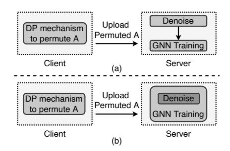
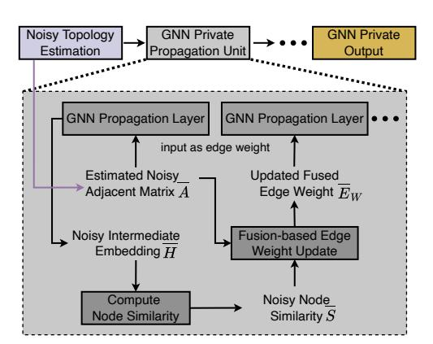
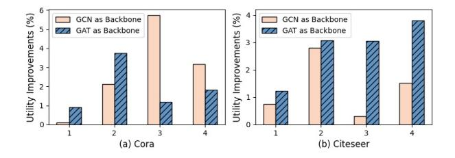

# LinkGuard: Link Locally Privacy-Preserving Graph Neural Networks with Integrated Denoising and Private Learning

Yuxin Qi Shanghai Jiao Tong University Shanghai, China qiyuxin98@sjtu.edu.cn

Gaolei Li Shanghai Jiao Tong University Shanghai, China gaolei\_li@sjtu.edu.cn

Xi Lin∗ Shanghai Jiao Tong University Shanghai, China linxi234@sjtu.edu.cn

Jingyu Wang Ocean University of China Qingdao, China wangjingyu3186@stu.ouc.edu.cn

Ziyao Liu Nanyang Technological University Singapore, Singapore liuziyao@ntu.edu.sg

Jianhua Li Shanghai Jiao Tong University Shanghai, China lijh888@sjtu.edu.cn

## ABSTRACT

Recent studies have introduced privacy-preserving graph neural networks to safeguard the privacy of sensitive link information in graphs. However, existing link protection mechanisms in GNNs, particularly over decentralized nodes, struggle to strike an optimal balance between privacy and utility. We argue that a pivotal issue is the separation of noisy topology denoising and GNN private learning into distinct phases at the server side, leading to an under-denoising problem in the noisy topology. To address this, we propose a dynamic, adaptive Link LDP framework that performs noisy topology denoising on the server side in a dynamic manner. This approach aims to mitigate the impact of local noise on the GNN training process, reducing the uncertainty introduced by local noise. Furthermore, we integrate the noise generation and private training processes across all existing Link LDP GNNs into a unified framework. Experimental results demonstrate that our method surpasses existing approaches, obtaining around a 7% performance improvement under strong privacy strength and achieving a better trade-off between utility and privacy.

## CCS CONCEPTS

• Security and privacy → Privacy-preserving protocols; Social network security and privacy; Privacy protections.

## KEYWORDS

Privacy-Preserving, Differential Privacy, Graph Neural Network

### ACM Reference Format:

Yuxin Qi, Xi Lin, Ziyao Liu, Gaolei Li, Jingyu Wang, and Jianhua Li. 2024. LinkGuard: Link Locally Privacy-Preserving Graph Neural Networks with Integrated Denoising and Private Learning. In Companion Proceedings of the ACM Web Conference 2024 (WWW '24 Companion), May 13–17, 2024,

WWW '24 Companion, May 13–17, 2024, Singapore, Singapore

© 2024 Copyright held by the owner/author(s). Publication rights licensed to ACM. ACM ISBN 979-8-4007-0172-6/24/05 <https://doi.org/10.1145/3589335.3651533>

Singapore, Singapore. ACM, New York, NY, USA, [4](#page-3-0) pages. [https://doi.org/10.](https://doi.org/10.1145/3589335.3651533) [1145/3589335.3651533](https://doi.org/10.1145/3589335.3651533)

### 1 INTRODUCTION

In recent years, Graph Neural Networks (GNNs) have shown impressive potential in a variety of fields, including social network analysis, recommendation systems, and anomaly detection. However, training on graph data can lead to the exposure of private information, making it vulnerable to privacy attacks like membership inference [\[10,](#page-3-1) [13\]](#page-3-2), attribute inference [\[7\]](#page-3-3), and edge stealing [\[3,](#page-3-4) [11\]](#page-3-5). This conflicts with the privacy protections required by the General Data Protection Regulation (GDPR). As a result, the study of privacy-preserving techniques for GNNs has gained attention, with several methods being proposed to safeguard sensitive information.

In this paper, we focus on the protection of graph topology, with a particular focus on link Local Differential Privacy (LDP). A general two-stage process for link LDP is: first, each client adds noise to their neighbor information and sends it to the server, along with uploading their original feature data. Subsequently, the server leverages the permuted links to perform denoising on the permuted graph without compromising Differential Privacy (DP) constraints, aiming to reduce the adverse effects of the noisy graph on subsequent graph learning, which is then followed by GNN training and optimization. Our focus on this scenario is driven by two considerations: firstly, the role of links in a graph, which signify connections between nodes, highlights a unique challenge distinct from conventional DP Deep Learning (DL) in DP GNNs. Specifically, the capacity of GNNs to incorporate the connections between nodes throughout the learning and optimization stages represents a critical divergence from traditional DL approaches. Second, while many studies have focused on protecting topology, achieving a balanced trade-off between privacy and utility remains challenging. We argue that a major reason for the difficulty in navigating the privacy-utility trade-off in existing work is that after actively injecting noise, the denoising operation and the GNN learning process on the server side are usually separated into two steps, without effective integration. This separation results in insufficient denoising (we define as under-denoising in this paper) at the server side, leaving the learning process significantly affected by the noise's uncertainty. Therefore, exploring a privacy-preserving framework that can protect link local privacy while resisting the impact of noisy graphs on the GNN learning process is imperative.

∗Corresponding author

Permission to make digital or hard copies of all or part of this work for personal or classroom use is granted without fee provided that copies are not made or distributed for profit or commercial advantage and that copies bear this notice and the full citation on the first page. Copyrights for components of this work owned by others than the author(s) must be honored. Abstracting with credit is permitted. To copy otherwise, or republish, to post on servers or to redistribute to lists, requires prior specific permission and/or a fee. Request permissions from permissions@acm.org.

The core challenge that needs to be tackled concerns the significant impact that removing edges can have on GNN model performance. A single incorrect link could result in the misclassification of all neighboring nodes. Within the framework of link LDP, the server receives only a noisy graph. The crucial issue, therefore, is how the server can effectively reduce the impact of noise—introduced by clients to safeguard link privacy—on the model's utility during the GNN learning and training process.

To overcome the under-denoising challenge stemming from separating denoising and GNN learning, we propose a novel approach that integrates denoising directly into the GNN learning process under LDP. This strategy enhances server-side, privacy-aware learning by dynamically incorporating edge denoising to improve the balance between privacy and utility. This work represents the first to identify the utility decline from segregating denoising and learning processes and provides a unified solution for integrating denoising with GNN learning. Our results show that this framework not only maintains privacy under link LDP guarantees but also significantly improves the balance between privacy and utility, which is applicable to all GNN models. To better illustrate the comparison between existing link LDP methods and our proposed framework, we show the overflow of DP-GNN methods in Figure [1](#page-1-0) as follows:

<!-- Image Description: This figure illustrates two data processing workflows (a) and (b). Both involve a client employing a differential privacy (DP) mechanism to permute data 'A', then uploading it to a server. The server performs denoising before GNN (Graph Neural Network) training. The difference lies in the server-side architecture: (a) shows separate denoising and GNN training stages, while (b) integrates them. The figure compares alternative architectures for privacy-preserving GNN training. -->

**Figure 1:** Difference between existing Link LDP methods and proposed schema. (a) Overflow of existing Link LDP GNN methods. (b) Overflow of the proposed framework.

### 2 RELATED WORKS

Recent advancements have explored employing DP techniques to ensure privacy at both the node and link levels within GNNs.

For node-level privacy, Daigavane et al. [\[2\]](#page-3-6) developed a method that extends DP-SGD to graphs with bounded degrees. PrivGNN [\[6\]](#page-3-7) achieves node-level DP by leveraging the PATE framework, training a student GNN with publicly available graph data and labels generated by teacher models tailored to specific nodes. DPDGC [\[1\]](#page-3-8) introduced Graph Differential Privacy (GDP) to address the need for multi-granular protection of both graph topology and node information. The Locally Private Graph Neural Network (LPGNN) [\[9\]](#page-3-9) offers a framework for GNNs under local differential privacy in decentralized settings, safeguarding node features and labels but falling short in scenarios requiring edge privacy.

For link-level (also as edge-level) privacy, several innovative approaches have been introduced. Solitude [\[5\]](#page-3-10) achieves both edge and node privacy under LDP by calibrating the noise scale injected into the graph and refining the adjacency matrix to mitigate noise

effects on GNN training. LinkTeller [\[11\]](#page-3-5) employs the Laplace mechanism to permute the graph's adjacency matrix, training a GNN on this perturbed graph for edge privacy. LDPGen [\[8\]](#page-3-11) and DPRR [\[4\]](#page-3-12) focus on link local differential privacy, with the former generating synthetic graphs from clustered nodes and noisy degree vectors, and the latter enhancing privacy through edge sampling and unbiased degree estimation. These methods collectively underscore the ongoing efforts to safeguard edge-level privacy without compromising the functionality of GNNs.

However, existing link-level LDP methods on GNN separate the denoise process and GNN optimization into two steps on the server slide, which leads to the under-denoise problem and decreases the balance between privacy and utility.

### 3 METHOD

### 1 Problem Formulation

Consider an undirected, unweighted graph G, defined by a set of nodes V, a set of edges E, a feature matrix , and a label matrix . The adjacency matrix ∈ 0, 1 × , where = |V | indicates the number of nodes, encodes the link between nodes: = 1 if an edge connects node to node . The feature matrix ∈ R × compiles the feature vectors for all nodes ∈ V , denoting the feature dimension. The label matrix ∈ R × contains the ground truth labels for the nodes , where is the total class number.

We aim to preserve the local privacy of graph links using LDP, incorporating topology denoising directly within the phases of GNN training and optimization. The trade-off between utility and privacy is considered on the server side. Following [\[14\]](#page-3-13), we choose node classification as the target task for it is highly influenced by graph topology. Then the problem can be formulated as ˆ = F (G, {Θ}), where ˆ is the predicted label, F (·) is the learned private GNN, G is the input graph and {Θ} are the learned parameters set.

Following are the two definitions related to DP constraints.

Definition 1 (Link adjacent graphs). Graph G and G ′ are link adjacent graphs if at most one bit of graph links is different. Without loss of generality, let G results from adding or deleting a link in G ′ .

Definition 2 (-link LDP). Given a privacy budget > 0, a random algorithm A satisfies -link LDP if, for any pair of adjacent graphs G and G ′ , and for any set of outputs ⊆ (A), the following condition is satisfied:

$$
Pr[\mathcal{A}(\mathcal{G}) \in S] \le e^{\epsilon} Pr[\mathcal{A}(\mathcal{G}') \in S]. \tag{1}
$$

### 2 Overall Framework

We first show the overall framework of the server side in Figure [2](#page-2-0) as follows. We unify the denoise and computation processes of existing works into three main steps: Noisy Topology Estimation, GNN Private Propagation Unit, and GNN Private Output. Note that we deeper exploit the existing noisy topology estimation methods in the following GNN training process. We mainly focus on the GNN Private Propagation Unit.

### 3 GNN Private Propagation Unit

To address the issue of under-denoising caused by the separation of the denoising process and GNN training on the server side, we introduce the GNN Private Propagation Unit. This unit integrates LinkGuard: Link Locally Privacy-Preserving Graph Neural

<!-- Image Description: This flowchart illustrates a graph neural network (GNN) architecture for handling noisy data. It shows a series of processing steps: noisy topology estimation feeds into multiple GNN private propagation units. Internally, a GNN propagation layer uses an estimated noisy adjacency matrix to compute a noisy intermediate embedding. Node similarity is calculated, feeding into a fusion-based edge weight update, iteratively refining the edge weights and ultimately producing a GNN private output. The diagram details the data flow and transformations within the GNN model. -->

**Figure 2:** The framework of the proposed method.

GNN training with topology denoising, offering a dynamic and training-adaptive denoising method on the server side. This approach not only mitigates the under-denoising problem without compromising privacy protection but also enhances the utility of privacy-preserving GNN models.

As illustrated in Figure [2,](#page-2-0) the GNN Private Propagation Unit primarily consists of T+2 computational steps, where T represents the number of layers in the propagation, and the +2 accounts for the calculation of node similarity based on private node representations, along with the adaptive fusion and updating of edge weights. It should be noted that variables marked with an overline in Figure [2](#page-2-0) indicate perturbed variables. For simplicity, the figure only shows a GNN learning iteration that includes two propagation steps. Multiple learning iterations can be broken down into successive sets of two-layer propagation.

Initially, the first propagation utilizes the Estimated Noisy Adjacency Matrix as the initial weight, where indicates the probability of edge presence, calculated by the preceding module: Noisy Topology Estimation. The private propagation process is as:

$$
\overline{h}_{i}^{(k)} = \text{Aggregate}(\{\overline{A}_{ij}\overline{h}_{j}^{(k-1)}, \overline{A}_{ij} \in \overline{A}\}),\tag{2}
$$

where ℎ () is the -th layer private embedding of node . Up to now, the computation is similar to that of Blink [\[14\]](#page-3-13). However, given that a small privacy budget (indicating a high degree of privacy protection) can significantly perturb , relying solely on as the edge weight introduces excessive uncertainty into subsequent rounds of GNN learning. To mitigate the impact of perturbation noise and consider the homogeneous properties in graphs, we incorporate node similarity into the update of . For instance, in social graphs, adjacent nodes (i.e., users with social connections) exhibit similarities, such as liking the same celebrity. To unearth such similarities, we exploit the weighted propagation to obtain the Noisy Intermediate Embedding , analyzing distances between embeddings to calculate node similarity values , employing various similarity computation methods. In this work, we use cosine similarity. Based on obtained, we fuse it with the Estimated Noisy Adjacency Matrix to derive the updated Fused edge weight , which then serves as the weight for the next GNN propagation layer. To eliminate the impact of degree on weights, we normalized

along the degree dimension. Subsequent layers alternate between using and as the edge weight. Note that multiple fusion methods can be applied; in this paper, we opt for linear aggregation due to its low additional computational cost, high explainable capability, and effectiveness in preserving the fusion's impact. The fusion process can be represented as

$$
\overline{E}_{W,i} = \beta \overline{A}_{ij} + (1 - \beta) s_{ij} / \overline{deg}_i,
$$
(3)

where , is the updated weight of node , is a learnable parameter, is the degree of on noisy graph. Note that our framework did not introduce extra pre-defined parameters.

This weighted private GNN update and fusion method not only delves deeper into the output of Noisy Topology Estimation but also corrects the during the training process based on the principle of graph isomorphism. It achieves dynamic denoising of the noisy topology's impact on GNN training, effectively minimizing noise interference and enhancing model accuracy through an adaptive approach that leverages both the initial noise estimation and the inherent structural similarities within the graph.

Note: The server side only has access to the noisy topology in the denoise and GNN phase. According to the DP post-processing theorem, the whole algorithm still satisfies DP constraints.

### 4 EXPERIMENT

In this section, we evaluate the proposed method in privacy strength and model utility. We seek to answer the following two questions:

- R1. How is the proposed framework performance compared with Link LDP guaranteed GNNs?
- R2. How does the proposed framework balance privacy and utility across different GNNs?

### 1 Datasets and Experimental Setup

Two publicly available datasets are tested, including citation networks Cora and Citeseer [\[12\]](#page-3-14). Following [\[9\]](#page-3-9), the datasets are divided into the training, validation, and test set in the ratio of 75%, 10%, and 15%, and all the graphs are bounded by limiting the maximum degree to 100. The backbone GNNs include two convolutional layers with hidden dimension 16, RELU activation function, and a dropout layer with a probability of 0.5. The model performance is measured by training 10 consecutive rounds on the test set and taking the average value and standard deviation. All experiments are implemented on a Linux machine by using PyTorch and PyTorch-Geometric (PyG) with NVIDIA GeForce RTX 3090 and 64 GB RAM.

### 2 Results and Analysis

Utility-privacy Trade-off Compared with SOTA Link LDP GNNs (R1). In Table [1,](#page-3-15) we present the performance of our proposed framework in terms of model utility. We use the accuracy to measure the utility. Table [1](#page-3-15) demonstrates that our framework outperforms the SOTA link LDP GNNs' original implementations of LDPGen [\[8\]](#page-3-11), DPRR [\[4\]](#page-3-12), the local version of DPGCN [\[11\]](#page-3-5), and Blink [\[14\]](#page-3-13), achieving performance enhancements across various privacy budget settings varying from {4, 3, 2, 1}. These improvements are primarily attributed to the combined computation of private GNN training and topology denoising. Notably, our framework tends to obtain higher performance gains under stronger

WWW '24 Companion, May 13–17, 2024, Singapore, Singapore Yuxin Qi et al.

| Dataset | Cora | | | | Citeseer | | | |
|---------------------|------------|------------|------------|------------|------------|------------|------------|------------|
| | 𝜖=4 | 𝜖=3 | 𝜖=2 | 𝜖=1 | 𝜖=4 | 𝜖=3 | 𝜖=2 | 𝜖=1 |
| LDPGen | 27.61±0.04 | 26.08±0.06 | 28.10±0.02 | 28.57±0.02 | 31.37±0.01 | 23.39±0.03 | 25.61±0.02 | 28.36±0.02 |
| LDPGen (with Ours) | 30.88±0.05 | 28.99±0.04 | 31.57±0.03 | 30.44±0.04 | 36.36±0.01 | 30.92±0.03 | 29.47±0.04 | 36.00±0.02 |
| | + 0.75 | + 2.81 | + 0.3 | + 1.51 | + 4.99 | + 7.53 | + 3.86 | +7.64 |
| DPRR | 31.10±0.01 | 29.85±0.01 | 30.04±0.00 | 29.19±0.00 | 19.61±0.01 | 20.04±0.01 | 20.20±0.01 | 20.08±0.00 |
| DPRR (with Ours) | 35.73±0.35 | 30.49±0.01 | 30.93±0.01 | 29.82±0.00 | 24.26±0.02 | 21.51±0.02 | 21.79±0.02 | 20.72±0.00 |
| | + 4.63 | + 2.91 | + 3.47 | + 1.87 | + 4.65 | + 1.47 | + 1.59 | + 0.64 |
| L-DPGCN | 73.32±0.02 | 73.91±0.00 | 74.95±0.00 | 74.48±0.01 | 66.50±0.02 | 68.14±0.01 | 73.43±0.00 | 73.49±0.01 |
| L-DPGCN (with Ours) | 73.65±0.01 | 74.48±0.00 | 75.19±0.00 | 74.53±0.01 | 67.81±0.01 | 68.94±0.01 | 73.51±0.00 | 73.74±0.00 |
| | + 0.33 | + 0.57 | + 0.24 | + 0.05 | + 1.31 | + 0.80 | + 0.08 | + 1.27 |
| BLink | 81.13±0.02 | 52.56±0.08 | 41.87±0.07 | 37.09±0.11 | 64.80±0.03 | 47.25±0.09 | 27.03±0.07 | 26.69±0.07 |
| BLink (with Ours) | 81.23±0.01 | 54.67±0.14 | 47.61±0.08 | 40.27±0.09 | 65.55±0.03 | 50.06±0.09 | 27.33±0.06 | 28.20±0.07 |
| | + 0.1 | + 2.11 | + 5.74 | + 3.18 | + 0.75 | + 2.81 | + 0.3 | + 1.51 |

**Table 1:** Quantitative comparison on two datasets to evaluate our framework under the Link LDP guarantee.

privacy strengths (i.e., lower values). For instance, on the Citeseer dataset, at = 3 and = 1, compared to the original LDPGen, our framework achieved improvements of 7.53% and 7.64%, respectively. This indicates that dynamic denoising during the GNN training process effectively reduces the impact of uncertainty introduced by permuted topology during propagation.

Utility-privacy Trade-off over Different GNNs (R2). To demonstrate the generalization of our proposed framework, we selected two classic GNN architectures, GCN and GAT, as the backbone to validate the effectiveness in achieving a better utility-privacy trade-off. To highlight the improvements in this trade-off, Figure [3](#page-3-16) illustrates the accuracy improvement of our framework compared to the original Blink under various privacy budgets, with different GNNs as the backbone. Different backbones show different tolerance to topology noise. The improvement always greater than zero shows that our proposed framework allows for a better utility under the same privacy constraints.

<!-- Image Description: The image presents two bar charts comparing utility improvements (in percent) achieved using Graph Convolutional Networks (GCN) and Graph Attention Networks (GAT) as backbones for two datasets: Cora (a) and Citeseer (b). Each chart shows improvement levels across four categories (1-4, not explicitly defined). The charts visually represent the comparative performance of GCN and GAT backbones in terms of utility gains on the specified datasets. -->

**Figure 3:** Utility improvements over different backbones.

### 5 CONCLUSION

In this paper, we focus on the under-denoising issue on the server side within Link LDP GNNs, attributing it to the division of noisy topology denoising and GNN private learning into separate stages. The field of DP GNN remains nascent, presenting numerous unresolved challenges. Our work introduces a novel paradigm that dynamically and adaptively integrates permuted topology denoising with GNN private learning, aiming for an improved trade-off between privacy and utility.

### 6 ACKNOWLEDGEMENT

This work was supported in part by the National Natural Science Foundation of China under Grant 62202302 and U20B2048.

### REFERENCES

- [1] Eli Chien, Wei-Ning Chen, Chao Pan, Pan Li, Ayfer Ozgur, and Olgica Milenkovic. 2023. Differentially Private Decoupled Graph Convolutions for Multigranular Topology Protection. In Thirty-seventh Conference on Neural Information Processing Systems.
- [2] Ameya Daigavane, Gagan Madan, Aditya Sinha, Abhradeep Guha Thakurta, Gaurav Aggarwal, and Prateek Jain. 2021. Node-level differentially private graph neural networks. arXiv preprint arXiv:2111.15521 (2021).
- [3] Xinlei He, Jinyuan Jia, Michael Backes, Neil Zhenqiang Gong, and Yang Zhang. 2021. Stealing links from graph neural networks. In 30th USENIX Security Symposium (USENIX Security 21). 2669–2686.
- [4] Seira Hidano and Takao Murakami. 2022. Degree-Preserving Randomized Response for Graph Neural Networks under Local Differential Privacy. arXiv preprint arXiv:2202.10209 (2022).
- [5] Wanyu Lin, Baochun Li, and Cong Wang. 2022. Towards private learning on decentralized graphs with local differential privacy. IEEE Transactions on Information Forensics and Security 17 (2022), 2936–2946.
- [6] Iyiola Emmanuel Olatunji, Thorben Funke, and Megha Khosla. 2023. Releasing Graph Neural Networks with Differential Privacy Guarantees. Transactions on Machine Learning Research (2023).
- [7] Iyiola E Olatunji, Anmar Hizber, Oliver Sihlovec, and Megha Khosla. 2023. Does Black-box Attribute Inference Attacks on Graph Neural Networks Constitute Privacy Risk? arXiv preprint arXiv:2306.00578 (2023).
- [8] Zhan Qin, Ting Yu, Yin Yang, Issa Khalil, Xiaokui Xiao, and Kui Ren. 2017. Generating synthetic decentralized social graphs with local differential privacy. In Proceedings of the 2017 ACM SIGSAC Conference on Computer and Communications Security. 425–438.
- [9] Sina Sajadmanesh and Daniel Gatica-Perez. 2021. Locally private graph neural networks. In Proceedings of the 2021 ACM SIGSAC Conference on Computer and Communications Security. 2130–2145.
- [10] Xiuling Wang and Wendy Hui Wang. 2022. Group property inference attacks against graph neural networks. In Proceedings of the 2022 ACM SIGSAC Conference on Computer and Communications Security. 2871–2884.
- [11] Fan Wu, Yunhui Long, Ce Zhang, and Bo Li. 2022. Linkteller: Recovering private edges from graph neural networks via influence analysis. In 2022 IEEE Symposium on Security and Privacy (SP). IEEE, 2005–2024.
- [12] Zhilin Yang, William Cohen, and Ruslan Salakhudinov. 2016. Revisiting semisupervised learning with graph embeddings. In International conference on machine learning. PMLR, 40–48.
- [13] Zhikun Zhang, Min Chen, Michael Backes, Yun Shen, and Yang Zhang. 2022. Inference attacks against graph neural networks. In 31st USENIX Security Symposium (USENIX Security 22). 4543–4560.
- [14] Xiaochen Zhu, Vincent YF Tan, and Xiaokui Xiao. 2023. Blink: Link Local Differential Privacy in Graph Neural Networks via Bayesian Estimation. In Proceedings of the 2023 ACM SIGSAC Conference on Computer and Communications Security. 2651–2664.
