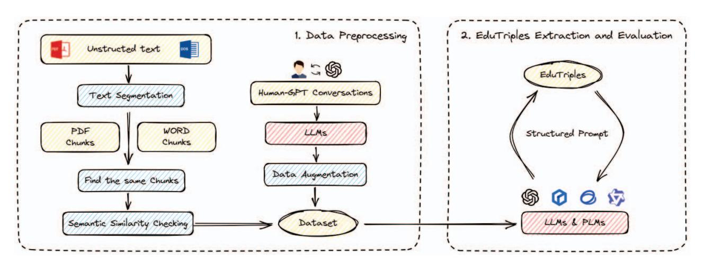
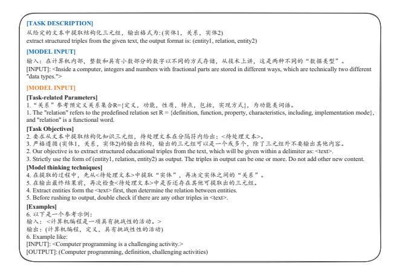

# LLM4EduKG: LLM for Automatic Construction of Educational Knowledge Graph

Jianing Sun1, Zhichao Zhang2 and Xueli He1∗,

School of Computer Science, Shaanxi Normal University, Xi'an, China School of Information Science and Technology, Hainan Normal University, Hainan, China Email: {sunjianing, hxl}@snnu.edu.cn Email: zhangzhichao@hainnu.edu.cn

*Abstract*—The field of education is undergoing a significant transformation towards digital and intelligent education, driven by advancements in artificial intelligence. Knowledge graphs (KGs), as a structured representation of knowledge and information, offering a powerful way to integrate diverse and multisourced heterogeneous data from across the Internet. The current methodologies for constructing educational knowledge graphs, however, are confronted with challenges including labor-intensive, time-consuming, and the necessity for substantial computational resources, which severely limit their practical application, especially in resource-constrained environments. In this paper, we proposed an LLM-based automatic construction method to alleviate the labor and time consumption in existing methods, and further explored LLM's capabilities in Chinese-speaking context. Specifically, we designed a structured prompt framework to automatically extract and evaluate educational triples generated from original text. The prompt encompasses both task and model dimensions, allowing for flexible adjustments to different tasks and models, thus significantly improved the transferability of our method. Comparative experimental results from two real-world Chinese-datasets, across four advanced LLMs, demonstrate the effectiveness of the proposed method. We believe that our work represents a significant attempt by the LLM in the field of education.

*Index Terms*—Large Language Model; Knowledge graph; Prompt tuning; Intelligent Education

## I. INTRODUCTION

The rapid development of the Internet and big data has not only pushed Artificial Intelligence to become the core driving force, leading a new round of scientific and technological and industrial revolution, but also accumulated massive data across industries. In the field of education, the concept of "Artificial Intelligence + Education" has been put forward and uesd to guide the innovation of educatuion industry. This requires us to integrate the diverse and heterogeneous knowledge over the internet from a new perspective, so as to better promote the transformation from traditional education to digital and intelligent education. However, how to effectively utilize this massive amount of data across industries is a key challenge during this transformation.

Introduced by Google in 2012, Knowledge Graphs (KGs) originated from semantic networks [1]. With triples as semantic units and directed labeled graphs as data structures, it can associate structured and unstructured data in the form of network-structure, providing systematic, standardized forms of knowledge representation. Since KG has strict logical semantics, it provides a potential method for organizing knowledge in the transformation of education. Applied in the field of education, Educational Knowledge Graphs (EduKGs) incorporate knowledge points and learning resources as nodes, integrating various conceptual relations to construct a comprehensive framework of related subjects. The applications of EduKGs have already extended to course content visualization [2], university course management [3], and personalized learning resource recommendations [4], [5].

Due to the inherently abstract nature of EduKGs, where entities and relations are more difficult to represent and extract compared with general KGs, the construction of EduKGs still largely relies on traditional manual methods [6], which are labor-intensive, time-consuming, and carry the risk of subjectivity. With the development of deep learning technologies, researchers have been working on the automatic construction method based on deep learning algorithms, utilizing neural network models to extract educational concepts and automatically generate knowledge triples from textbooks [7]. However, the deep learning-based method involves complex algorithms design and massive computational resources, thereby imposing high demands on data quality and integrity, which has further aggravated the difficulty under the reality that it is difficult to obtain high-quality educational data from open resources. As a result, while it appears that the current new methods address the labor and time consumption caused by the traditional manual methods, the reality is that the design of complex deep learning algorithms and the computational resources required for neural network training represent another form of labor and time consumption. These issues reduce the practical usability of EduKGs in real-world.

More recently, the remarkable performance of advanced Large Language Models (LLMs), like ChatGPT and Chat-GLM, on knowledge-intensive tasks [8], suggests that largescale automated knowledge acquisition and innovative forms of knowledge representation are now within reach. This provides us with a novel perspective on the automatic construction of EduKGs. Existing research demonstrates that LLMs have developed the capability to solve complex reasoning problems in the field of education and have exhibited performance that exceeds expectations. Nonetheless, certain scholars still cast doubt on LLM's ability in actual education, as there still exists a significant gap between them and realistic standards. One primary reason is that the performance of LLMs in Chinese-speaking context remains largely unexplored. LLMs may struggle with the semantic and cultural differences, as well as the complexity of the Chinese language structure. Such limitations pose challenges to the practical implementation and comprehensive promotion of LLM technologies in real-world educational scenarios.

Based on the above, in this paper, we focuses on the role of LLMs in automatic construction of educational knowledge graphs, and the potential ability in Chinese-speaking context. Leveraging the inherent contextual understanding, logical reasoning, and text generation capabilities of LLMs, we aim to alleviate the labor and time consumption associated within traditional manual construction methods. The proposed method enables individuals across various disciplines to leverage LLMs for their distinct educational requirements, particularly benefiting those lacking proficiency in developing complex neural network algorithms, including school teachers and students' parents. Our main contributions are listed as follows:

- We proposed a highly automatic construction method for educational knowledge graphs, using the latest Large Languages Models to automatically extract teaching concepts and identify the conceptual relations from multisources heterogeneous data.
- We designed a structured Prompt framework in the proposed LLM-based method, to automatically extract and evaluate educational triples. For different tasks, only the corresponding contents need to be replaced, thus greatly enhancing the applicability of the designed Prompt framework and the portability of the proposed method.
- We conducted extensive experiments on two real-world Chinese-datasets, across four models, and comparative experiments on three model thinking techniques to verify the effectiveness of the proposed method.

The rest of the paper is organized as follows. Section II reviews the current state of research. Section III specifically describe the extraction and evaluation process of educational triples using the structured prompt framework. Section IV is the experimental results and analysis. Finally we present the conclusion and outlook of this paper.

## II. RELATED WORK

## *A. Automatic construction of KG*

The automatic construction method of knowledge graph is to automatically extract entities and relations from largescale text data through information extraction technology, thus constructing a large entity-relation database. The existing information extraction technologies are mainly divided into three categories: rule-based methods, machine learning-based methods, and deep learning-based methods.

Rule-based automated construction methods utilize a series of extraction rules to extract entities and relations from text [9]. Initially, entities and relations are recognized by manually crafted rules, which will inevitably bring a lot of labor and time consumption, and the generalization and transferability of the method are very poor. With the development of machine learning, deep learning, and natural language processing technologies, the rule-based method has changed from manually to algorithm-based approaches.

Machine learning-based methods uses machine learning algorithms to automatically learn and extract rules from the annotated corpus [10], and automatically determines whether a word is an entity or a relation. In the case of scarcity of manually labeled datasets, Liu et al. [11] combined the KNN classifier and CRF model to mitigate the issue of insufficient training data. Nevertheless, the effectiveness of this method is constrained by the availability of labeled datasets, as achieving superior recognition results necessitates a substantial quantity of manually labeled data, thereby exposing to the issue of error propagation, which cannot be entirely circumvented during the process of algorithm design.

Deep learning-based methods offer an effective solution to the error propagation problem mentioned above. [12] employed Convolutional Neural Networks (CNN) for named entity recognition (NER) tasks, whereas [13] utilized CNN to extract lexical and sentence features for relation extraction. [14] utilized Recurrent Neural Networks (RNN) to acquire vector representations of sentences for relation classification tasks, but cannot deal with the long-term dependence problem. [15] introduced a joint classification model that transforms relation extraction tasks into multi-label classification tasks, aiming to address the EntityPairOverlap(EPO) problem encountered during the construction process. HAO-Graph [16] can automatically generate a real-time speech knowledge graph based on the speaker's speech topic, and can dynamically switch between various knowledge maps as the topic evolves.

Generally, existing automatic construction methods are primarily employed to extract textual information, such as name, places, organizations, etc. However, these are not well-suited for the field of education, where knowledge is often more implicit and lacks clear demarcations. The necessity to consider cross-sentence information in complex, lengthy contexts and the requirement for background knowledge to effectively address out-of-context expressions are two key issues in the automatic construction of KGs.

## *B. Automatic construction of EduKG*

With the deepening of the digital transformation in various fields, the knowledge graph, with its unique capabilities in data organization and management, is increasingly serving as a key technology to promote educational innovation and optimize the learning experience [7].

At present, the construction of knowledge graph in the field of education is mainly divided into two ways: top-down construction method and bottom-up construction method. The top-down construction method needs to build the ontology first, and then use the ontology to model and standardize the disciplinary knowledge. However, as the number and types of

<!-- Image Description: This flowchart details a two-stage process.  The first stage preprocesses unstructured text (PDFs, Word docs) via segmentation, identifying and semantically comparing chunks, and then uses human-GPT conversations and LLMs for data augmentation to create a dataset. The second stage uses this dataset to extract and evaluate EduTriples via a cyclical process involving structured prompts and LLMs/PLMs.  The diagram visually outlines the workflow and key components of the proposed methodology. -->

Fig. 1. The framework of LLM4CEduKG. There are two main components: 1) Data Preprocessing: including the text segmentation, data cleaning, data filter for original text data, and LLM-based data augmentation for human-GPT conversations; 2) EduTriples Extraction and Evaluation: the proposal of structured prompt and its application in EduKGs.

disciplinary knowledge continue to expand, some data types may not be included in the existing ontology. In such cases, the ontology needs to be revised based on the data characteristics, leading to extra workload, which makes it challenging to convert fragmented knowledge into structured knowledge points and to automate the construction of EduKGs.

Bottom-up construction method based on the technology of information extraction, including entity extraction and relation extraction. Chen et al. [7] transferred the entity extraction task into a sequence labeling task, using neural sequence labeling algorithm to extract teaching concepts, which demonstrated high portability. Pan et al. [17] started with MOOC resources and utilized machine learning algorithms such as random forests algorithm to find the potential relations in disciplinary knowledge resources, effectively solving the problem of which prerequisite knowledge should be acquired before studying subsequent knowledge. However, both approaches previously mentioned rely on feature engineering, which is also timeconsuming and expertise required. Chen et al. [18] utilized a Named Entity Recognition (NER) model to extract educational concepts from data sources such as curriculum standards and applied data mining techniques to identify cognitive prerequisite relationships between these concepts. Despite these, this approach can not avoid the inherent limitations of traditional NER models in polysemy and nested-NER tasks. Zhang et al. [19] chose remote supervision technology to carry out knowledge extraction. This kind of technology can automatically process a large amount of unlabeled data without manual extraction. Nonetheless, it is limited to processing one single sentence and cannot consider relations existing in crosssentences.

## *C. LLMs in Automatic Construction of EduKG*

The emergence of machine learning and deep learning technologies has effectively addressed the issues caused by the traditional manual rule-based method, such as being timeconsuming, having insufficient coverage, being hard to maintain, and having low automation levels. While the machine learning-based method is limited by the availability of labeled datasets, the deep learning-based method lacks interpretability, both require the design of sophisticated algorithms and have low transferability. These limitations make them suitable only for researchers with specialized knowledge and pose challenges in effectively promoting to people who are actually using it in various industries.

With the rise and development of Language Models (LMs), their inherent contextual understanding capabilities enable them to easily acquire rich semantic representations on largescale datasets. This kind of deep understanding provides support for the accurate construction and enrichment of EduKGs. Currently, researchers has proposed BERT-BiLSTM-CRF model [20] to automatically identify knowledge points by combining BERT [21] with BiLSTM-CRF technology. In this approach, BERT is trained to to obtain the vector representation of text data firstly. Then BiLSTM and CRF are used to extract features and label sequences, achieving automatic identification of knowledge points. Zhang et al. [22] improved the BERT-BiLSTM-CRF model by introducing IDCNN and conducting verification experiments on the elementary mathematics entity dataset. The experimental results showed that this approach effectively alleviated the shortcomings of traditional NER models in representing the polysemy of words and considering the global features of text. Using the BIO annotation method and referencing the predefined entity-relation set, Zhou et al. [23] leveraged BERT's classification and clustering capabilities to predict the type of each token, realizing the extraction of entities and relations from unstructured data such as textbooks.

While LLMs are expected to address cross-sentence problems and out-of-context expresssions, it is undeniable that existing pre-trained language models (PLMs) require substantial computational resources, and the time consumption increases with the length of the text and the number of model layers. In response to this issue, we consider the Prompt Tuning method in model training, which will be discussed in detail in Section III.

## III. METHODOLOGY

In this section, we introduce the proposed method, as shown in figure 1, mainly consisting of two phases: (1) Data Preprocessing: for obtaining high-quality datasets; (2) EduTriples Extraction and Evaluation: for LLM to automatically extract and evaluate educational triples (EduTriples). Here, structured Prompt is used to automatically extract knowledge points as entities, and relations between entities are predefined in the Prompt.

## *A. Data Preprocessing*

In the current downstream tasks conducted by LLMs, researchers usually focus on model-centric technologies, such as adopting the most advanced LLMs and applying the most effective fine-tuning technology, ignoring the decisive impact of datasets on model training and performance. Therefore, in the preprocessing stage, we focus on how to obtain highquality data from low-resource samples.

The data comes from unstructured text data encountered in real teaching environment, such as textbook, tutorials and course syllabus. Additionally, we have gathered some interactions between students and ChatGPT previously as human-GPT conversations. As for the text data, we start with two formats of data, extracting sentence segments from the PDF version and the WORD version respectively, and then taking the same items as the initial data. Since the text data used in real teaching environment mostly contain examples and demonstrations when explaining a certain knowledge point, which is not what we need, so after obtaining the initial data, we will remove irrelevant data by calculating the semantic similarity between each sentence segment and the predefined subject topic.

Under the reality that only a small part of the material obtained in real teaching environment is effective. We asked students to make some inquiries to ChatGPT based on predefined subject topic in advance and collected their conversations as a supplement. For these conversations, since they were generated by the predefined subject topic, we don't have to do the filter. As for these human-GPT conversations, we apply the data augmentation. The technique of data augmentation offers a cost-effective solution to address challenges associated with limited quantity and quality of training data. Inspired by the success of Dai et al. [24], We use LLM to rewrite each sentence in human-GPT conversations into multiple conceptually similar but semantically different statements, examples shown in the figure 2, thereby increasing the number and diversity of the original dataset. By introducing various transformations, augmented data enhances the model's generalization capabilities and reduces the risk of overfitting. Additionally, as it does not require any modifications to the underlying model architecture, it is applicable across a wide range of tasks, thereby enhancing the model's robustness to variations in input data.

For the final dataset, to ensure its effectiveness, we have experts randomly sample it and check whether the contents of the sample is presented correctly and from the original textbook.

| [ORIGINAL TEXT] ᐹቊ㊱ශ(Boolean type)ᱥж〃䙱䗇ᮦᦤ㊱ශθᆹਠᴿњѠ਌ٲθ䙐ᑮᱥtrueૂfalseȾ Boolean type is a logical data type that has only two values, typically true and false.                                                                                                                                                                                                                                                                                                                                                                                                                                                                                                                                                                                                                                                                                                     |  |
|----------------------------------------------------------------------------------------------------------------------------------------------------------------------------------------------------------------------------------------------------------------------------------------------------------------------------------------------------------------------------------------------------------------------------------------------------------------------------------------------------------------------------------------------------------------------------------------------------------------------------------------------------------------------------------------------------------------------------------------------------------------------------------------------------------------------------------------------------------------------|--|
| [GPT GENERATED] 1. ᐹቊ㊱ශ(Boolean type)൞㕌ぁѣ⭞ӄ㺞⽰њ〃⣬ᘷθ঩ⵕૂٽθᑮ⭞ӄᶗԬ࡚ᯣૂ䙱䗇䘆㇍Ⱦ Boolean type in programming is used to represent two states, true and false, commonly used for conditional judgment and logical operations. 2. ᐹቊ㊱ශ(Boolean type)൞㕌ぁѣ⭞ӄ䙱䗇࡚ᯣθਥԛᑤࣟぁᓅṯᦤᶗԬᢝ㺂уੂⲺᬃ֒Ⱦ Boolean type in programming is used for logical judgment, helping programs execute different operations based on conditions. 3. ൞㕌ぁѣθᐹቊ㊱ශ(Boolean type)ᱥж〃ㆶঋⲺ䙱䗇㊱ශθᆹਠ᧛਍њѠٲφtrue(ⵕ)ᡌfalse(ٽ(Ⱦ In programming, the Boolean type is a simple logical type that accepts only two values: true or false. 4. ᐹቊ㊱ශ(Boolean type)ᱥ䇗㇍ᵰ〇ᆜѣⲺж〃ะ⹶ᮦᦤ㊱ශθᆹӻᴿњѠ⣬ᘷφⵕ(true)ૂٽ)false)Ⱦ The Boolean type is a fundamental data type in computer science, with only two states: true and false.                                                                                             |  |
| [GLM GENERATED] 1.ᐹቊ㊱ශᱥ䇗㇍ᵰ㕌ぁѣⲺж〃ㆶঋᮦᦤ㊱ශθᆹⲺٲਠ㜳ᱥtrueᡌfalseȾ Boolean type is a simple data type in computer programming that can only take true or false values. 2.ᐹቊ㊱ශ(Boolean type)ኔӄ䙱䗇ᮦᦤ㊱ශθӻऻ੡њѠਥ㜳Ⲻٲθж㡢ᱥⵕ(true)ૂٽ)false)θ⭞ӄ࡚ᯣᶗԬᡌ㺞䗴䙱 䗇ⵕٲȾ Bool1ean types are logical data types that contain only two possible values, typically true and false, and are used to determine conditions or express logical truth values. 3.൞䙱䗇ᮦᦤ㊱ශѣθᐹቊ㊱ශԛެӻᴿⲺњѠٲθⵕ(true)ૂٽ)false)θᶛ㺞⽰⣬ᘷᡌᶗԬθᒵ⌑ᓊ⭞ӄ䇗㇍ᵰ㕌ぁૂ 䙱䗇᧞⨼ѣȾ In logical data types, Boolean types have only two values, true and false, to represent a state or condition, which is widely used in computer programming and logical reasoning. 4.൞䇗㇍ᵰ〇ᆜѣθᐹቊᮦᦤ㊱ශᱥж〃ะ⹶㊱ශθᆹਠᴿњѠ⣬ᘷφtrueૂfalseȾ In computer science, the Boolean data type is a primitive type that has only two states: true and false. |  |

Fig. 2. Generated examples on human-GPT conversations.

## *B. EduTriples Extraction and Evaluation*

After we get the high-quality training data, We use Prompt Tuning to extract the EduTriples. Prompt tuning is a lightweight model tuning method that does not change the structure of the model [25]. Unlike traditional fine-tuning methods, which update model's weights for each specific task, prompt tuning only adjusts the prompts used to guide the output. This means that we only need to design different prompts for different tasks, making a single PLM sufficient to handle a range of tasks. This kind of tuning method requires fewer computational resources, making it more efficient and cost-effective, especially for large model deployment with limited resources. By preserving the original model weights, prompt tuning also reduces the risk of overfitting, which is a common issue in fine-tuning when dealing with small datasets.

By means of the context understanding ability of LLMs, extracting EduTriples with the help of Prompt Tuning represents not only an important attempt for semi-automatic knowledge graph to highly automatic construction of EduKGs, but also offers a more user-oriented approach to addressing the challenges faced by traditional methods. It also greatly alleviates the cross-sentence problem commonly encountered in information extraction tasks.

Specifically, we conceptualize the Prompt-based method as a process of mapping text to key-value pairs, seen in (1).

$$
f: text \overset{prompt}{\rightarrow} \{(key_i, value_i)\}_{i=1}^N
$$
 (1)

In the mapping *f*, the dataset to be processed is defined as *text* and the mapping result is represented as a collection of key-value pairs {(*key*i*, value*i)} N i=1. Here, each *key*i corresponds uniquely to a *value*i, where every *key*i represents a specific data item within *text*, and *value*i represents the corresponding mapping results. The *prompt* is a set of instructions that guide the model's output, containing all the inputs relevant to the task. It is refined into three components: (1) Task Description: serves as a blueprint, outlining the problem to be addressed; (2) Model Input: refers to the dataset intended for processing, which is *text*; (3) User Input (Options) : acts as a supplement to (1) and (2), encompassing four parts at both task level and model level, including task-related parameters, task objectives, model thinking techniques and examples of corresponding techniques.

This multidimensional, optional input mode allows for a customized approach to every task, significantly enhancing the model's adaptability and effectiveness in dealing with a range of complex and diverse tasks. For a given task, we merely need to selectively replace the contents of the components.

<!-- Image Description: The image displays the technical specifications for a natural language processing task.  It details the input format (text enclosed in angle brackets),  the expected output format (structured triples of entity1, relation, entity2), and task objectives. The provided examples illustrate the desired input-output relationship, aiming to extract structured educational triples from text.  The text includes definitions of parameters like "relation" and outlines the model's processing steps. -->

Fig. 3. EduTriples Extraction Prompt

Take the task of EduTriples Extraction as an example. The *text* consists of multiple trunks, each chunk is stored in a *key*i. The EduTriples are stored in relevant *value*i, as the form of (*e*1*, r, e*2), where *e*1*, e*2 ∈ *text* denotes entities extracted from the chunk, *r* ∈ *R* represents the relation between *e*1 and *e*2. While *R* is a predefined set of relations giving in "taskrelated parameters". we specify a set of steps to be followed in "task objectives", as shown in Figure 3. Initially, we clarify the form in which the text will be given, and then we detail the extraction requirements, including the output format and some restrictions.

Data Evaluation refers to the verification of the EduTriples obtained. For this evaluation, we'll compare the given text and the extracted triples to determine their alignment in terms of entities, relations, and overall meaning. Here The evaluation prompt considers three critical aspects: (1) conformity of the output structure with the predefined requirements; (2) consistency of the content expressed by the EduTriples with their corresponding text chunks; and (3) logical accuracy of the entities and relations depicted within the EduTriples. For this purpose, we apply GPT-4 to give a score ranging from 0 to 10, where 0 indicates no correspondence, and 10 signifies perfect alignment, as the metric for evaluation. A benchmark score of 8 has been established as the minimum threshold for acceptance.

## IV. EXPERIMENT AND RESULTS

In this section, We experimentally evaluate the effectiveness of proposed method in generating Chinese EduTriples from giving text. Firstly, we introduce the environment deployment, including the model deployment and model-related parameters setting. Then a variety of experiments were conducted on four models to analyze the potential influence of different factors on the experimental results.

## *A. Environment Deployment*

In this paper, we chose structured data extracted from the original textbook and augmented human-GPT conversations as dataset. Four domestic advanced large language models, including GLM series [26] from Zhipu AI , ERNIE [27] from Baidu , and Tongyi Qianwen [28] from Alibaba Cloud were selected as experimental LLMs, with GPT4 [29] from OpenAI as evaluation model. In terms of model fine-tuning, we applied P-Tuning v2 [30], which can effectively improve the performance of various tasks without directly modifying the weight of the pre-trained model, to fine-tune ChatGLM2- 6B and ChatGLM3-6B respectively, each was fine-tuned for 1,000 epochs with a learning rate of 2e-2.

The specific parameters of the model deployment are shown in table I, with \* stands for fine-tuning models.

TABLE I MODEL DEPLOYMENT AND PARAMETERS SETTING

| Model        | deployment     | parameters                  |  |
|--------------|----------------|-----------------------------|--|
| GPT4         | Web default |                             |  |
| ERNIE        | Web            | default                     |  |
| qwen-turbo   | API            | Temperature=0.85, Top P=0.8 |  |
| GLM4         | API            | Temperature=0.95, Top P=0.7 |  |
| ChatGLM2-6B  | Locally load   | default                     |  |
| ChatGLM3-6B  | Locally load   | default                     |  |
| ChatGLM2-6B* | P-Tuning v2    | Epoch=1000, LR=2e-2         |  |
| ChatGLM3-6B* | P-Tuning v2    | Epoch=1000, LR=2e-2         |  |

## *B. Evaluation Metrics*

For the assessment of the model's performance, the values of precision (P), recall (R), and F1-score (F1) are used as evaluation indicators, with the formulas as follows:

$$
P = \frac{TP}{TP + FP} \times 100\%
$$
 (2)

$$
R = \frac{TP}{TP + FN} \times 100\%
$$
 (3)

$$
F1 = \frac{2PR}{P + R} \times 100\%
$$
\n(4)

Where TP (True Positives) represents the correctly identified samples, FP (False Positives) are the incorrectly identified samples, and FN (False Negatives) are the samples that were not identified. The F1 score is the harmonic mean of precision and recall, ranging from 0.0 to 1.0, where a higher value indicates better performance.

## *C. Experimental Results*

For the method proposed in this paper, we conducted experiments on four models respectively and compared the experimental results, as shown in Table II. Among all the models, as ERNIE was deployed on interactive web pages, we randomly sampled 20% of the dataset for its experiment.

TABLE II RESULTS (%) ON DIFFERENT MODELS

| Model        | Precision | Recall | F1    |
|--------------|-----------|--------|-------|
| ERNIE        | 95.24     | 86.96  | 90.91 |
| Qwen-turbo   | 83.95     | 84.47  | 84.21 |
| GLM4         | 95.48     | 86.36  | 90.69 |
| ChatGLM2-6B  | 51.22     | 75.90  | 61.17 |
| ChatGLM3-6B  | 59.26     | 80.00  | 68.09 |
| ChatGLM2-6B* | 71.62     | 81.54  | 76.27 |
| ChatGLM3-6B* | 83.75     | 83.75  | 83.75 |
|              |           |        |       |

From Table II, we can see that the best two results are from ERNIE and GLM4. In our proposed LLM-based EduTriples extraction method, we place more emphasis on the correctness of extracted triples. As in real educational applications, it is crucial to ensure that the correctness of the provided content to the greatest extent possible, even if some expected triples are not extracted. This means that our primary goal should be to maximize precision, even at the expense of lower recall.

In Table II, both ERNIE and GLM4 achieve precision at above 90%, while also requiring minimal labor consumption and are easy to implement. Especially the ERNIE, accessing through interactive web pages, which is less constrained by resource-constrained environments. These findings results indicate the feasibility of our approach. When considering the results of the GLM series, on the whole, it becomes apparent that incremental version updates have resulted in moderate improvements in corresponding results. Despite the experimental prompt is defined in detail, the performance of the base models remains subpar. Moreover, while model finetuning has led to a notable increase in precision by around 20% and F1 score by around 15%, there still exists a significant gap when compared to the most advanced model, GLM4. In particular, although both GLM4 and Qwen-turbo are deployed by API, the results of GLM4 are much better than Qwen-turbo.

Furthermore, we surprisingly noticed that the performance of fine-tuned ChatGLM3-6B is closely equivalent to Qwenturbo across all three evaluation metrics. This insight suggests the possibility of implementing personalized educational practices through the local deployment of individual models.

In addition, as illustrated by the prompt in Figure 3, we instructed the LLM to extract entities first during reasoning, then to determine the relations between entities, and have provided corresponding examples. This kind of model thinking technique combines one-shot learning and chain of thought (CoT) methods. Therefore, we further investigated the impact of different model thinking techniques on experimental results. The experiments were conducted using GLM4 as an example, with the results shown in Table 4, where we only present the Precision scores.

TABLE III RESULTS (%) ON DIFFERENT MODEL THINKING TECHNIQUES (BASED ON GLM4)

| Model Thinking Techniques | Precision |
|---------------------------|-----------|
| Our method                | 95.48     |
| zero-shot [31]            | 71.55     |
| few-shots [32]            | 84.31     |
| CoT [33]                  | 75.61     |

As depicted in Table III, the few-shot technique, which involves providing the model with a small number of examples before task execution, has demonstrated significant improvement compared to the zero-shot technique that does not utilize any examples. Furthermore, guiding the models through step-by-step instructions in CoT, has also resulted in some enhancements. This indicates that even a small number of examples can significantly improve the final performance, under the application where Prompt is used to guide the LLM in generating Chinese EduTriples from given text.

## V. CONCLUSION

To better alleviate the issues of labor and time consumption, and low resource constrain in constructing educational knowledge graphs, we propose an LLM-based method for automatically constructing the educational knowledge graphs. Taking Chinese-speaking context environment as example, we further explore the potential capability of Large Language Models (LLMs) in the field of education. Specifically, we designed a structured prompt framework, guiding the LLM to automatically extract and evaluate Chinese Educational triples from giving text. Extensive comparative experiments were conducted across four domestic advanced LLMs on two real datasets, with three different model thinking techniques also taken into account. The high Precision of GLM4 and ERNIE demonstrate the feasibility and effectiveness of our method. Surprisingly, we found the model fine-tuning achieved unexpected performance and even approaching those deployed by API.

The automatically generated EduKGs present complex concepts and their relations in the form of intuitive graphs, not only providing learners with a richer and more interconnected knowledge system, but also holding potential for personalized recommendations, learning assessments, and teaching resource suggestions. In future work, we plan to extend the application to large-scale datasets while maintaining high accuracy, and delve deeper into personalizing educational practices through the deployment of individual models at local lightweight mode.

## ACKNOWLEDGMENT

This work was supported by the Fundamental Research Funds for the Central Universities(6142103190207), and the Digital Education Research and Practice Project of Shaanxi Normal University (JYSZH201301).

## REFERENCES

- [1] S. Ji, S. Pan, E. Cambria, P. Marttinen, and S. Y. Philip, "A survey on knowledge graphs: Representation, acquisition, and applications," *IEEE transactions on neural networks and learning systems*, vol. 33, no. 2, pp. 494–514, 2021.
- [2] Y. Li, J. Zhao, L. Yang, and Y. Zhang, "Construction, visualization and application of knowledge graph of computer science major," in *Proceedings of the 2019 International Conference on Big Data and Education*, 2019, pp. 43–47.
- [3] I. Aliyu, A. Kana, and S. Aliyu, "Development of knowledge graph for university courses management," *International Journal of Education and Management Engineering*, vol. 10, no. 2, p. 1, 2020.
- [4] D. Shi, T. Wang, H. Xing, and H. Xu, "A learning path recommendation model based on a multidimensional knowledge graph framework for elearning," *Knowledge-Based Systems*, vol. 195, p. 105618, 2020.
- [5] H. K. Ahmad, B. Liu, B. A. Muhammad, and M. Umar, "Prebige: Course recommendation using course prerequisite relation embedding and bipartite graph embedding," *Journal of Networking and Network Applications*, vol. 2, no. 4, pp. 161–171, 2022.
- [6] Y. Qin, H. Cao, and L. Xue, "Research and application of knowledge graph in teaching: Take the database course as an example," in *Journal of Physics: Conference Series*, vol. 1607, no. 1. IOP Publishing, 2020, p. 012127.
- [7] P. Chen, Y. Lu, V. W. Zheng, X. Chen, and B. Yang, "Knowedu: A system to construct knowledge graph for education," *IEEE Access*, vol. 6, pp. 31 553–31 563, 2018. [Online]. Available: https://api.semanticscholar.org/CorpusID:49558384
- [8] A. Radford, J. Wu, R. Child, D. Luan, D. Amodei, I. Sutskever *et al.*, "Language models are unsupervised multitask learners," *OpenAI blog*, vol. 1, no. 8, p. 9, 2019.
- [9] J. Luo, Y. Wang, and D. Jiang, "Rule-based hidden relation recognition for large scale knowledge graphs," *Pattern Recognition Letters*, vol. 125, pp. 13–20, 2019.
- [10] P. Heyvaert, B. De Meester, A. Dimou, and R. Verborgh, "Rule-driven inconsistency resolution for knowledge graph generation rules. semant. web. 10,(2019)."
- [11] X. Liu, S. Zhang, F. Wei, and M. Zhou, "Recognizing named entities in tweets," in *Proceedings of the 49th annual meeting of the association for computational linguistics: human language technologies*, 2011, pp. 359–367.
- [12] R. Collobert, J. Weston, L. Bottou, M. Karlen, K. Kavukcuoglu, and P. Kuksa, "Natural language processing (almost) from scratch," *Journal of machine learning research*, vol. 12, pp. 2493–2537, 2011.
- [13] D. Zeng, K. Liu, S. Lai, G. Zhou, and J. Zhao, "Relation classification via convolutional deep neural network," in *Proceedings of COLING 2014, the 25th international conference on computational linguistics: technical papers*, 2014, pp. 2335–2344.
- [14] R. Socher, B. Huval, C. D. Manning, and A. Y. Ng, "Semantic compositionality through recursive matrix-vector spaces," in *Proceedings of the 2012 joint conference on empirical methods in natural language processing and computational natural language learning*, 2012, pp. 1201–1211.
- [15] Y. Liu, A. Li, J. Huang, X. Zheng, H. Wang, W. Han, and Z. Wang, "Joint extraction of entities and relations based on multi-label classification," in *2019 IEEE Fourth International Conference on Data Science in Cyberspace (DSC)*. IEEE, 2019, pp. 106–111.

- [16] X. Fu, J. Zhang, H. Yu, J. Li, D. Chen, J. Yuan, and X. Wu, "A speechto-knowledge-graph construction system," in *Proceedings of the Twenty-Ninth International Conference on International Joint Conferences on Artificial Intelligence*, 2021, pp. 5303–5305.
- [17] L. Pan, C. Li, J. Li, and J. Tang, "Prerequisite relation learning for concepts in moocs," in *Proceedings of the 55th Annual Meeting of the Association for Computational Linguistics (Volume 1: Long Papers)*, 2017, pp. 1447–1456.
- [18] P. Chen, Y. Lu, V. W. Zheng, X. Chen, and X. Li, "An automatic knowledge graph construction system for k-12 education," in *Proceedings of the fifth annual ACM conference on learning at scale*, 2018, pp. 1–4.
- [19] L. Zhang and W. Hou, "An automatic construction technology of chinese knowledge graph for teaching plan," in *International Conference on Artificial Intelligence and Security*. Springer, 2022, pp. 95–105.
- [20] Y. Su and Y. Zhang, "Automatic construction of subject knowledge graph based on educational big data," in *Proceedings of the 2020 3rd International Conference on Big Data and Education*, 2020, pp. 30–36.
- [21] J. Devlin, M.-W. Chang, K. Lee, and K. Toutanova, "Bert: Pre-training of deep bidirectional transformers for language understanding," *arXiv preprint arXiv:1810.04805*, 2018.
- [22] Y. Zhang, S. Wang, B. He, P. Ye, and K. Li, "Named entity recognition method of elementary mathematical text based on bert," *Journal of Computer Applications*, vol. 42, no. 2, p. 433, 2022.
- [23] X. Zhou, Z. Tang, L. Tang, X. Li, and X. Lu, "Construction of junior high school mathematics knowledge graph based on multi-source heterogeneous data fusion," *Wuhan University Journal of Natural Sciences*, vol. 67, no. 2, pp. 118–126, 2021.
- [24] H. Dai, Z. Liu, W. Liao, X. Huang, Y. Cao, Z. Wu, L. Zhao, S. Xu, W. Liu, N. Liu *et al.*, "Auggpt: Leveraging chatgpt for text data augmentation. arxiv 2023," *arXiv preprint arXiv:2302.13007*, vol. 10.
- [25] B. Lester, R. Al-Rfou, and N. Constant, "The power of scale for parameter-efficient prompt tuning," *arXiv preprint arXiv:2104.08691*, 2021.
- [26] Z. Du, Y. Qian, X. Liu, M. Ding, J. Qiu, Z. Yang, and J. Tang, "Glm: General language model pretraining with autoregressive blank infilling," in *Proceedings of the 60th Annual Meeting of the Association for Computational Linguistics (Volume 1: Long Papers)*, 2022, pp. 320– 335.
- [27] Y. Sun, S. Wang, Y. Li, S. Feng, X. Chen, H. Zhang, X. Tian, D. Zhu, H. Tian, and H. Wu, "Ernie: Enhanced representation through knowledge integration," *arXiv preprint arXiv:1904.09223*, 2019.
- [28] J. Bai, S. Bai, Y. Chu, Z. Cui, K. Dang, X. Deng, Y. Fan, W. Ge, Y. Han, F. Huang, B. Hui, L. Ji, M. Li, J. Lin, R. Lin, D. Liu, G. Liu, C. Lu, K. Lu, J. Ma, R. Men, X. Ren, X. Ren, C. Tan, S. Tan, J. Tu, P. Wang, S. Wang, W. Wang, S. Wu, B. Xu, J. Xu, A. Yang, H. Yang, J. Yang, S. Yang, Y. Yao, B. Yu, H. Yuan, Z. Yuan, J. Zhang, X. Zhang, Y. Zhang, Z. Zhang, C. Zhou, J. Zhou, X. Zhou, and T. Zhu, "Qwen technical report," *arXiv preprint arXiv:2309.16609*, 2023.
- [29] J. Achiam, S. Adler, S. Agarwal, L. Ahmad, I. Akkaya, F. L. Aleman, D. Almeida, J. Altenschmidt, S. Altman, S. Anadkat *et al.*, "Gpt-4 technical report," *arXiv preprint arXiv:2303.08774*, 2023.
- [30] X. Liu, K. Ji, Y. Fu, W. L. Tam, Z. Du, Z. Yang, and J. Tang, "P-tuning v2: Prompt tuning can be comparable to fine-tuning universally across scales and tasks," *arXiv preprint arXiv:2110.07602*, 2021.
- [31] T. Kojima, S. S. Gu, M. Reid, Y. Matsuo, and Y. Iwasawa, "Large language models are zero-shot reasoners," *Advances in neural information processing systems*, vol. 35, pp. 22 199–22 213, 2022.
- [32] T. Brown, B. Mann, N. Ryder, M. Subbiah, J. D. Kaplan, P. Dhariwal, A. Neelakantan, P. Shyam, G. Sastry, A. Askell *et al.*, "Language models are few-shot learners," *Advances in neural information processing systems*, vol. 33, pp. 1877–1901, 2020.
- [33] J. Wei, X. Wang, D. Schuurmans, M. Bosma, F. Xia, E. Chi, Q. V. Le, D. Zhou *et al.*, "Chain-of-thought prompting elicits reasoning in large language models," *Advances in neural information processing systems*, vol. 35, pp. 24 824–24 837, 2022.