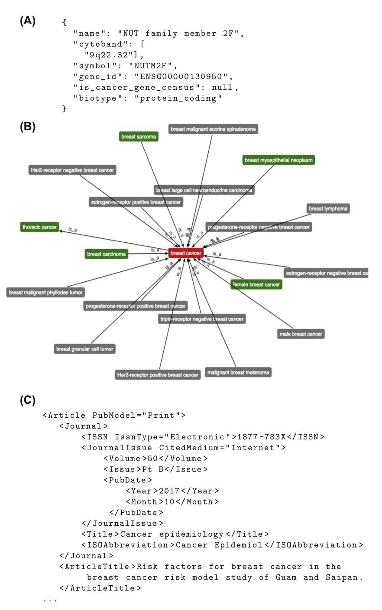
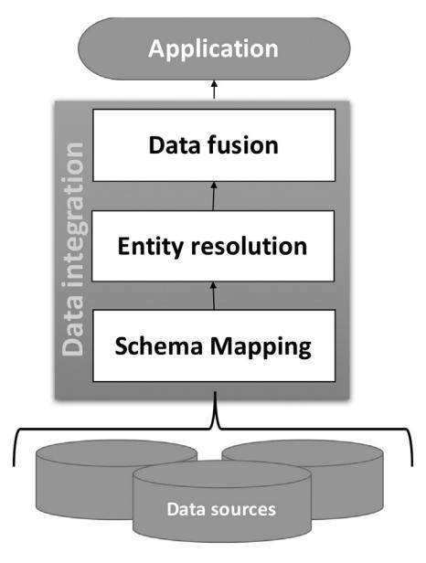

# 9

# Dealing With Data Heterogeneity in a Data Fusion Perspective: Models, Methodologies, and Algorithms

Federica Mandreoli<sup>1</sup> , Manuela Montangero Dip. di Scienze Fisiche, Informatiche e Matematiche, Modena, Italy <sup>1</sup> Corresponding author

# INTRODUCTION

The proliferation of data sources accessible via the Web and the availability of large amount of data created by humans and machines represent an enormous opportunity to improve knowledge in a wide range of application fields, including life science.

In particular, next-generation sequencing (NGS) and other highthroughput technologies, traced clinical procedure, Internet of Things, and personal health acquisition devices are rapidly transforming life sciences into data-intensive domains, where sophisticated computational analysis is needed to infer relevant information from raw data. In addition to machine-generated data, the Web is becoming the main means to publish data related to genomics, health care, molecular biology, toxicogenomics, environmental sciences, clinical research, and so on. These data are cured by domain experts and hence are of high quality level. Moreover, they are publicly available and thus can be exploited in an open data perspective.

The availability of so many data coming from different data sources opens a wide range of new opportunities for knowledge discovery. At the same time, it represents a new challenge that can be addressed only if one is able to analyze the data sources of interest in a unified and integrated way. Indeed, scientists have acknowledged that life science phenomena cannot be understood by the analysis of single-type datasets [\[1\]](#page-30-0). As a matter of fact, life science research has made novel data integration strategies crucial for the advancements and discovery in many of its fields, for instance, in 2010 the National Research Council of the National Academies in United States organized a workshop to "explore alternative visions for achieving large-scale data integration in fields of importance to the federal government" [\[1\]](#page-30-0).

In the computer science research field, data integration is a longstanding challenge that has attracted much interest in different disciplines, namely, database management, information retrieval, machine learning, natural language processing, and statistics. The discipline is continuously evolving to address new issues that are arising in many newly emerging application fields, not only life science but also sensor networks, social media and social networks, virtual factories, and so on.

Traditionally, two main challenges are associated with data integration: data discovery and data exploitation [\[2\].](#page-30-0) The former is defined as the identification of relevant data sources, whereas the latter refers to the effective use of collective information to obtain new insights. One of the main issues that arises in this context is data heterogeneity. Indeed, data from distinct sources are often heterogenous because they stem from independent and disparate activities and are managed and maintained by different owners. Therefore, these data often differ both in their values and in their structures, even if they relate to the same phenomena.

The ability to deal with data heterogeneity in an effective and efficient way is of utmost importance for data integration systems [\[2\]](#page-30-0) and a prerequisite to several other applications. For instance, when focusing on the Web of data, it enables semantic search in terms of entities and relations on top of the Web of text and deep reasoning using related ontologies, thus creating the Web of knowledge.

When dealing with multiple heterogeneous data sources, the final aim is often to fuse the different manifestations of the same real-world entity (e.g., a person, a protein) to get a unified view that gives users the illusion of interacting with one single data source. In the management field, this goal is achieved by means of a three-step procedure:

- Schema mapping: to solve heterogeneity at structure level;
- Entity resolution: to solve heterogeneity at value level by grouping the different descriptions of the same real-world entity;
- Data fusion: to solve heterogeneity at value level by fusing such different descriptions into a single representation.

This chapter focusses on the main sources of heterogeneity in the life science context, presents the main problems that arise when dealing with heterogeneity at value level, and provides a review of the solutions proposed in the computer science literature. The main aim of the chapter is thus to show how data heterogeneity problems that are typical of life science application contexts can be afforded by adopting systematic solutions stemming from the computer science field. To this end, it presents the main models, methodologies, and algorithms that emerged in the last decades for entity resolution and data fusion and provides an overview of the recent advances in these two fields that answer to the data integration needs of novel application scenarios, namely, big data and crowdsourcing data.

The rest of the chapter is organized as follows. Section 2 provides an overview of the data sources that can be exploited in life science applications. [Section 3](#page-4-0) presents an example from a computer science perspective and an overview of the main traditional techniques to deal with entity resolution and data fusion. [Section 4](#page-20-0) presents some new challenges that emerged more recently and relative proposed solutions.

# OVERVIEW OF LIFE SCIENCE DATA SOURCES

This section provides an overview of the different kinds of publicly available data sources that can be exploited in a data integration application for the life science domain.

The publication of specialized Web databases has flourished in the last decade owing to the relative ease of creation and maintenance and the reputation that it brings to the developers [\[1\].](#page-30-0) Web-specialized databases provide data that can be exploited to answer specific needs of the research community. Two examples are the pathways and microRNA (miRNA) and related databases. For instance, by 2017, Pathguide [\[3\]](#page-30-0) is a catalogue of about 700 biological pathway-related resources and molecular interactionerelated resources; miRBase [\[4\]](#page-30-0) contains 28,645 entries representing hairpin precursor miRNAs, expressing 35,828 mature miRNA products, in 223 species; Tarbase [\[5\]](#page-30-0) indexes more than 1 million of experimentally supported miRNA targets; and Gene Expression Ombinus [\[6\]](#page-30-0) is an international public repository that archives and freely distributes microarray, NGS, and other forms of high-throughput functional genomics data submitted by the research community.

Other interesting examples of specialized Web databases are the outcomes of projects aiming to investigate biological systems at several levels and create large heterogeneous datasets. In the following, we describe three projects and the related databases. The Cancer Genome Atlas Project (TCGA) [\[7\]](#page-30-0) wants to generate insights into the heterogeneity of different

cancer subtypes by creating a map of molecular alterations for every type of cancer at multiple levels. Each form of cancer is caused by errors in DNA that cause cells to grow uncontrolled. So, the project argues that identifying the changes in each cancer's complete set of DNA, i.e., its genome, and understanding how such changes interact to drive the disease will lay the foundation for improving cancer prevention, early detection, and treatment. A detailed description of the main features of the TGCA database is provided in Ex. 1. Immunological Genome Project (ImmGen) [\[8\]](#page-30-0) aims to generate a complete microarray dissection of gene expression and its regulation in the immune system of the mouse. The compendium of expression profiles and the description of genomic modules and networks are publicly accessible through ImmGen's online browser [\[9\]](#page-30-0). The diXa project [\[10\]](#page-30-0) aimed at collecting the large amounts of data produced by toxicogenomics studies during the last decade. DiXa [\[11\]](#page-30-0) consists of a central warehouse containing data from toxicogenomics projects and other public repositories. Currently, 34 studies involving 469 compounds are deposited in DiXa. Such data have been generated through in vitro and in vivo rat and human transcriptomics, metabolomics, and proteomics experiments.

Another source of knowledge for life science are the ontologies. An ontology is a formal naming and definition of the types, properties, and interrelationships of the entities that really exist in a particular domain of discourse. MeSH [\[12\]](#page-30-0), ICD [\[13\],](#page-30-0) NCIs thesaurus [\[14\],](#page-30-0) SNOMED [\[15\],](#page-30-0) and OMIM [\[16\]](#page-30-0) are only few samples of publicly available ontologies describing life scienceerelated domains. For instance, the latter is a comprehensive, authoritative compendium of human genes and genetic phenotypes that is freely available and updated daily. To bring some coordination and consolidation to the proliferation of ontologies across the biological and biomedical research fields, the Open Biological and Biomedical Ontologies (OBO) got together. The OBO is a collaborative experiment involving developers of science-based ontologies who are establishing a set of principles for ontology development with the goal of creating a suite of orthogonal interoperable reference ontologies in the biomedical domain. Currently the OBO foundry promotes about 30 OBO ontologies.

Of particular interest for knowledge sharing on the Web in a wide range of application scenarios are the Linked Open Data (LOD). Linked Data [\[17\]](#page-30-0) provides a publishing paradigm in which data become a firstclass citizen of the Web, thereby promoting the extension of the Web with a global data space based on open standards. LOD are described as a recommended best practice for exposing, sharing, and connecting pieces of data, information, and knowledge on the Semantic Web. LOD are represented using the Resource Description Framework (RDF) [\[18\].](#page-30-0) RDF provides a data model that is extremely simple on the one hand but <span id="page-4-0"></span>strictly tailored toward the Web architecture on the other. The underlying structure of any expression in RDF is a collection of triples, each consisting of a subject, a predicate, and an object. A set of such triples is called an RDF graph. Thus, RDF data are essentially graph-modeled data. Currently, the LOD cloud [\[19\]](#page-30-0) includes many life science datasets. The Bio2RDF [\[20\]](#page-31-0) is an open source project to generate and provide Linked Data for the Life Sciences. At present, the cloud of life science LOD generated through the Bio2RDF project includes about 10 billion triples across 30 biomedical databases and datasets [\[21\]](#page-31-0). MeSH, PubMed, and OMIM are samples of datasets that have been converted in the LOD format thanks to the Bio2RDF project. The main advantage of using LOD in life science data integration applications is that the LOD cloud forms a global interconnected data space through seamless connections between datasets, thus enabling rich pathways through diverse learning resources.

Finally, life science digital libraries can be exploited to enable the connection of life science data to the related literature. PubMed [\[22\]](#page-31-0) is probably the most known digital library for the biomedical literature. PubMed comprises more than 27 million citations for the biomedical literature from MEDLINE, life science journals, and online books. Citations may include links to full-text content from PubMed Central and publisher websites. It supports a highly expressive query language. Queries can contain Boolean operators, such as AND and OR, and field-based filters, such as searches limited to the title fields, and the specification of MeSH terms.

# ADDRESSING DATA HETEROGENEITY

Dealing with multiple manifestations of the same real-world entity across several data sources is a very common challenge for many modern applications, including life science applications. This challenge is referenced as data heterogeneity in the data management research field where the final aim is often to get a unified or integrated view of the real-world entities represented in the data sources.

Example 1. In [\[23\]](#page-31-0), the authors examine publicly and freely available cancer-related datasets that can be of support to tumor growth analysis. The datasets are classified under five different categories: genomic data, incidence data, imaging data, disease associations, and literature data.

Essentially, each dataset provides a detailed and highly specialized view of the real-world entities of interests, i.e., the different types of cancers. An in-depth analysis of the available data shows that such views are often complementary and overlapping as to the conveyed information. Moreover, because datasets are developed and managed independently, data differ in values, structures, and semantics. To illustrate

these concepts, in the following we will exemplify the main features of five datasets, one for each category, for the breast cancer case.

The TCGA [\[24\]](#page-31-0) is a comprehensive, multidimensional map of the key genomic changes in 33 types of cancer. The TCGA dataset contains 2.5 petabytes of data describing tumor tissue and matched normal tissues from more than 11,000 patients. Data can be downloaded in the JavaScript Object Notation (JSON) [\[25\]](#page-31-0) or Tab Separated Value (TSV) [\[26\]](#page-31-0) format. For instance, [Fig. 9.1](#page-6-0)A shows an instance of the collected genomic changes for breast cancer in JSON format.

CancerData.com [\[27\]](#page-31-0) is a website developed and maintained by the Medical Informatics and Knowledge Engineering team of Maastro Clinic, Maastricht, The Netherlands, whose main aim is to create a shared database with medical imaging and characteristics in patients with cancer, tumors and treatments. For instance, the Tumor Hypoxia dataset stems from an assessment of time-dependent gene-expression changes in response to hypoxia. This study provides additional biological insights and helps in predicting the impact of hypoxia on patient prognosis. Transcriptome profiling was performed for three cancer cell lines (DU145, HT29, and MCF7) after hypoxic exposure (0%) at eight time points (0, 1, 2, 4, 8, 12, 16, and 24 h). The breast cancer cell line is MCF7. The MCF7 data set is made up of one cell intensity file in CEL format for each time point and one TSV file that contains metainformation about the conducted experiments.

The Cancer Incidence in Five Continents [\[28\]](#page-31-0) provides comparable data on cancer incidence from as wide a range of geographical locations worldwide as possible. For instance, CI5plus contains updated annual incidence rates for 118 selected populations from 102 cancer registries, for the longest period available (up to 2007), for all cancers and 27 major types. The data are recorded as text files in Comma Separated Value (CSV) format, and can be incorporated easily into statistical packages for further analysis. Registries and cancers are associated with numerical codes. Annual incidence data about breast cancer can be obtained by selecting the rows containing the breast cancer code.

The Disease Ontology (DO) [\[29\]](#page-31-0) is an OBO foundry ontology for human disease. Its purpose is to provide consistent, reusable, and sustainable descriptions of human disease terms, phenotype characteristics, and related medical vocabulary disease concepts. Each concept in DO has a unique identifier, denoted as DOID, an explicit name, a definition, and a list of synonyms and is related to other DOIDs through a set of relationships, such as hypernymy and hyponymy. Moreover, it is mapped to the concepts of other widely diffused ontologies, i.e., MeSH, ICD, NCIs thesaurus, SNOMED, and OMIM. For instance, a screenshot of the breast cancer DOID and related DOIDs (synonyms in blue, hypernymies and hyponimies in gray) is shown in [Fig. 9.1](#page-6-0)B. DO can be downloaded in OWL format [\[30\].](#page-31-0)

<span id="page-6-0"></span>
<!-- Image Description: The image contains three parts. (A) shows JSON-formatted data describing a gene, including its name, location, symbol, ID, and classification. (B) is a graph illustrating relationships between different types of breast cancer, with "breast cancer" as the central node. (C) displays XML metadata describing a journal article, including publication details and title. The image likely illustrates data integration and analysis within a cancer genomics study. -->

FIGURE 9.1 Data samples. (A) A TCGA record in JSON format; (B) Representation of the DO concept "breast cancer"; (C) A PubMed record in XML format.

The last data sample comes from PubMed [\[22\]](#page-31-0). Search results can be represented in different formats: text, MEDLINE, and XML. For instance, [Fig. 9.1C](#page-6-0) shows an extract of one of the results for the query "NUT family breast cancer" in XML format.

As evidenced in [\[23\],](#page-31-0) integrating publicly and freely available data on cancer, like the ones presented earlier, is a key research direction to enable knowledge discovery in health informatics generally and on tumor growth specifically. This means dealing with the different facets of data heterogeneity in an effective way.

In line with the data management terminology and without loss of generality, in the following we will adopt the following terminology. Schemas are data descriptions available at the data sources. Schemas describe data through classes whereby each class has a set of properties. Each property is defined over a domain. Samples of domains are integers, reals, characters, and strings. The data, or records, available at the data sources can be class instances, and each record is represented as a collection of property values. For ease of reference, we denote a class C with n properties as the tuple (p1: D1,., pn: Dn) where pi is a property with domain Di, for <sup>i</sup> ¼ 1, ., <sup>n</sup>, and a record <sup>r</sup> with <sup>n</sup> property values as (p1: <sup>v</sup>1,., pn: vn) where r.pi denotes the value vi of property pi, for <sup>i</sup> <sup>¼</sup> 1, ., <sup>n</sup>. Finally, entities from the real world are also referenced as objects.

Data heterogeneity is dealt with by having three objectives in mind: completeness, conciseness, and correctness of the data available to users and applications through the unified view [\[31\]](#page-31-0). Completeness measures the amount of data, in terms of both the number of records and the number of properties. Conciseness measures the uniqueness of object representations in the unified data, in terms of both the number of unique objects and the number of unique properties of the objects. Finally, correctness measures correctness of data, that is, whether the data conform to the real world. High completeness can be obtained by adding more data sources to the unified view, whereas achieving the other two goals is nontrivial.

To meet these requirements, data heterogeneity is faced in a twofold manner. First, different data sources often describe the same domain in different ways. Heterogeneity can exist at the schema level, where different data sources represent the same domain using different schemas. This topic is out of the scope of the present chapter. Interested readers can refer to the literature on schema mapping and matching [\[32\]](#page-31-0) and model management [\[33\]](#page-31-0) for a detailed study. Heterogeneity can also arise at the instance level, where different data sources represent the same real-world entity through different data values. This problem is called entity resolution (a.k.a. record linkage or duplicate detection) and consists in identifying (or linking, or grouping) different records referring to the same real-world entity.

Second, different sources can provide conflicting data. Conflicts can arise because of incomplete data, erroneous data, and out-of-date data. Returning incorrect data in a query result can be misleading and even harmful. This challenge is addressed by means of data fusion techniques that are able to fuse records on the same real-world entity into a single record and resolve possible conflicts from different data sources. Entity resolution aims at removing redundancy and increasing conciseness of the data, whereas data fusion aims at increasing correctness of data.

Traditionally, schema mapping and matching, entity resolution, and data fusion represent the three main steps of a data integration process as shown in Fig. 9.2. The output of the first step is a unified view of the involved data sources at the schema level. Although different approaches and architectures on how to manage data sharing at schema level are currently available, for ease of reference in the following we assume that the output of this phase is a global schema where all the data available at the source level can be represented. The next steps, i.e., entity resolution and data fusion, are the focus of this chapter and will then operate on such a global data view.


<!-- Image Description: The image is a layered architecture diagram illustrating a data integration process. Three data sources feed into a schema mapping layer, followed by entity resolution and then data fusion. The final output is fed to an application. The diagram visually represents the sequential steps involved in combining data from multiple sources into a unified view for a specific application. -->

FIGURE 9.2 The data integration process.

## 244 9. DEALING WITH DATA HETEROGENEITY IN A DATA FUSION PERSPECTIVE

# 1 Entity Resolution

This entity resolution problem consists in identifying different records referring to the same real-world entity. The problem comes into different declinations reflecting different perspectives:

- Record linkage: link records that match across distinct databases.
- Deduplication: group together records that correspond to the same entity, and eventually define a representative for each group.
- Reference matching: match noisy records to a reference set of clean records.

In the following we will refer to the general entity resolution problem. Traditionally, entity resolution techniques can be broadly divided into two categories: similarity based and learning based.

# 1.1 Similarity-Based Techniques

Similarity-based techniques require similarity functions and thresholds to determine if two records are similar or not. Similarity is computed component by component using a similarity function that is proper for the property domain. To decide if the two records are similar or not, there are two main ways to proceed:

• Combine properties-wise similarities using an arithmetic function, usually a weighed sum or the average [\[34\]](#page-31-0). The records are declared a match (respectively, a no match) if the final similarity value is above (respectively, under) a given threshold.

For example, given two records r<sup>1</sup> and r<sup>2</sup> with properties (we omit domains for the sake of presentation)

```text
(name, symbol, gene-id, is-cancer-gene)
```text

a similarity function s fi and a weight wi for each property pi, <sup>i</sup> <sup>¼</sup> 1,2,3,4, and a threshold s, the two records are declared a match if

```text
w1$s f1(r1:name; r2:name)
þw2$s f2(r1:symbol; r2:symbol)
þw3 s f3(r1:gene-id; r2:gene-id)
þw4$s f4(r1:is-cancer-gene; r2:is-cancer-gene) -
                                                   s:
```text

This method is easy to implement; nevertheless it is not trivial to tune the threshold value and, eventually, weights that should reflect which, among the record properties, are more predictive.

• Make experts combine properties-wise similarities by formulating rules expressed as Boolean expressions or using a declarative language.

Referring to the former example, given thresholds s1, s2, s3, we can define matching records those for which

```text
s f4(r1.is-cancer-gene; r2:is-cancer-gene) > s1 AND
[s f1(r1:name; r2:name) > s2 OR s f3(r1:gene-id; r2:gene-id) > s3].
```text

This method requires experts to meticulously design rules and tune thresholds; unfortunately, these tasks are particularly hard, even if they potentially produce a high-quality result.

## 1.2 Learning-Based Techniques

In many current approaches the entity resolution problem is seen as a classification problem where pairs of records have to be divided into two classes M and U, respectively, match and unmatch. To this end, classifiers are trained using labeled examples of matching and nonmatching pairs. Then, the input to the classifiers are vectors of pairwise similarities properties values. Thus, the general learning-based workflow is divided in two phases: first, in the training phase, record pairs are manually (and usually off-line) labeled according to the fact that they are a match or not and are annotated with similarity values. Labels and annotations are then used by a machine learning algorithm to generate a classifier. Second, in the application phase, the classifier is applied to unlabeled record pairs.

The classical model used in this setting is the probabilistic model introduced in [\[35\]](#page-31-0): given a pair of records (r1, r2) with n properties each, we define the comparison vector <sup>g</sup>r1;r<sup>2</sup> (referred to only as g if there is no ambiguity) as a vector with <sup>n</sup> components, where each <sup>g</sup><sup>i</sup> (for <sup>i</sup> <sup>¼</sup> 1,., <sup>n</sup>) is a similarity score for the values of the ith property of records r<sup>1</sup> and r2. The value of <sup>g</sup><sup>i</sup> can be defined as the value of a similarity function sim (r1, pi, <sup>r</sup>1, pi) computed on the values <sup>r</sup>1.pi and <sup>r</sup>2.pi. In alternative, <sup>g</sup><sup>i</sup> might assume binary values, where <sup>g</sup><sup>i</sup> <sup>¼</sup> 1 if <sup>r</sup>1, pi matches <sup>r</sup>2, pi, that is, if sim (r1, pi, <sup>r</sup>2, pi) <sup>s</sup>, for a given threshold <sup>s</sup>, and zero otherwise.

Assume that g is a random vector with a density function that is different for the two classes M and U, then the problem can be stated in the following way: given a random g as input, apply a decision rule to assign g to <sup>M</sup> or <sup>U</sup>. The decision rule in [\[35\]](#page-31-0) is expressed in terms of two thresholds s<sup>1</sup> < s<sup>2</sup> and the following value:

$$
R(r_1, r_2) = \frac{m(\gamma)}{u(\gamma)} = \frac{Pr(\gamma | (r_1, r_2) \in M)}{Pr(\gamma | (r_1, r_2) \in U)}.
$$

The pair is declared a nonmatch if <sup>R</sup>(r1, <sup>r</sup>2) <sup>s</sup>1, a match if <sup>R</sup>(r1, <sup>r</sup>2) s2, and undefined otherwise.

In practice, however, computing Prðgjðr1;r2Þ˛MÞ and Prðgjðr1;r2Þ˛UÞ is inefficient: usually g is multidimensional and the computation of a similarity function for each component might be a time-consuming operation. The commonly adopted approach is to assume conditional

independence of components of g (match or nonmatch) and, thus, compute the former probabilities in the following way:

$$
m(\gamma) = \prod_{j=1}^{n} Pr(\gamma_j | (r_1, r_2) \in M),
$$

$$
u(\gamma) = \prod_{j=1}^{n} Pr(\gamma_j | (r_1, r_2) \in U).
$$

The computation of <sup>m</sup>ðgjÞ ¼ Prðg<sup>j</sup> ðr1;r2Þ˛MÞ, however, requires some knowledge of the matches that can be acquired by using a training set of prelabeled record pairs. At this aim, several supervised machine learning algorithms have been devised by means of different techniques, for example, Support Vector Machines [\[36\],](#page-31-0) decision trees [\[37\]](#page-31-0), clustering [\[38,39\],](#page-31-0) Conditional Random Fields [\[40\]](#page-31-0), Markov Chains [\[41\]](#page-31-0), and ensembles of classifiers [\[42\].](#page-31-0)

Exploiting transitivity, a postprocessing step can be applied to the results computed by these approaches [\[43\]](#page-32-0): a graph is created where each record is a node, and there is an edge between two nodes if the two records have been classified as a match. Then, records in the same connected component are considered as representing the same entity in the real world.

The main drawback of the former methods is the need to generate a proper training set; this is all but an easy task for two main reasons: first, the cardinality of the two classes M and U are greatly unbalanced, with the latter much larger than the former, thus making it is not trivial to find enough pairs of record to be manually labelled as a match. Moreover, it is difficult to generate ambiguous matches that are important to create classifiers with high accuracy. Second, there might be pairs that are difficult to judge (hence label) also for humans, because they are ambiguous or incomplete.

When no satisfactory training set is available to apply supervised learning, there are two possible alternative strategies:

1. Unsupervised techniques such as expectation maximization algorithms can be used and have been shown [\[44\]](#page-32-0) to work well, even when a limited number of interactions is allowed between the variables. Authors in [\[45\]](#page-32-0) propose to compute values <sup>m</sup>ðgjÞ<sup>s</sup> and <sup>u</sup>ðgjÞs in the following way: assume that g½ <sup>j</sup> ¼ 1 if the property <sup>j</sup> matches and 0 otherwise, then <sup>m</sup>ðgjÞ can be computed using an expectation maximization algorithm, whereas <sup>u</sup>ðgjÞ can be estimated by taking random pairs of records, that will be a nomatch with high probability. When the conditional independence assumption cannot be reasonably made [\[46\],](#page-32-0) propose to use a general expectation maximization algorithm to compute the <sup>m</sup>ðgjÞ<sup>s</sup> and <sup>u</sup>ðgjÞs. Alternatively, authors in [\[47\]](#page-32-0) describe a hierarchical graphical model framework to approach the problem.

<span id="page-12-0"></span>2. Active learning techniques can be used to automatically locate ambiguous pairs. Active learning algorithms interactively query the user to obtain information on unlabeled data, the user labels the given data, and the algorithm incrementally learns. With respect to supervised techniques, in this case, there is no need of a complete large enough training set, but usually the number of examples needed to learn a concept (in this case to learn to distinguish between matches and no-matches) is much smaller.

Authors in [\[48\]](#page-32-0) designed their system starting from the idea that there are many cases in which the classification can be easily done starting from a small training set and without the need of manual labeling. On the other hand, manual labeling is of great importance for ambiguous cases; thus, their goal is to find these cases and learn as much and as soon as possible form their manual labeling, to increase the accuracy of the classifiers. The same idea is exploited in [\[49,50\]](#page-32-0) with the addition of the use of multiple classifiers that have been trained slightly different.

A loss function for a classification is a function that is intended to capture the price paid for inaccuracy in the prediction of the classification and active learning techniques try to carefully select examples to label while learning a good classifier, according to a given loss function. Traditional active learning techniques concentrate in the 0e1 loss function that, unfortunately, turns out to be a bad choice for entity resolution, mainly because of the unbalanced nature of the classification. Hence, authors in [\[51\]](#page-32-0) propose to use a loss function that maximizes recall (fraction of real matches that are labeled as matches) under a constraint that precision (fraction of pairs labeled as matches that are real matches) should be greater than a specified threshold and propose an active learning algorithm. Ref. [\[52\]](#page-32-0) highlights some criticalities of the former work (including computational complexity) and proposes a more efficient algorithm to optimize recall under the precision constraint, using as a black box any active learning approach that minimizes the 0e1 loss. They also show that the classifier learnt by their algorithm is pareto-optimal and close to the true optimal in terms of recall.

### 1.3 Similarity Functions

Similarity functions are fundamental in all approaches to entity resolution. The choice of the similarity function is crucial, as a wrong choice might compromise the quality of the classification (into matches and nomatches). Here we report some of the most commonly used functions of interest in the life science context.

Edit-based similarity functions. This kind of measures are useful to detect typographical errors in texts, but some are widely used also when comparing biological sequences such as DNA or protein chains (actually, many have been proposed for problems arising in this field).

Given two strings over the same alphabet, the Levenshtein edit distance [\[53,54\]](#page-32-0) between the two strings is defined as the number of edit operations needed to transform the first into the second, where one edit operation is one of the following three: (1) insert a new character into the string, (2) delete a character from the string, (3) replace one character in the string with a different one. For example, the edit distance between the words tgcatat and atccgat is four; indeed, starting from the first word, insert a as a new first character, replace the third character with c, replace the fifth character with g, and delete the sixth character. Needleman and Wunsh [\[55\]](#page-32-0) generalized the edit distance definition by allowing different costs for different edit operations, including different costs for replacing different pairs of characters, for example, when typing, it is likelier to misspell w with e, than w with m. This approach is widely used in computational biology to compare and align strings that are proteins or DNA strands, and specific score matrices (PAM [\[56\]](#page-32-0) and BLOSUM [\[57\]\)](#page-32-0) have been devised to define costs for pairwise character substitutions, taking into consideration biological and physical characteristics of amino acids and DNA bases.

Waterman and Smith [\[58\]](#page-32-0) propose a variation to the edit distance (called affine gap distance) to properly handle the case of consecutive delete operations (called gap). They assume that it is more onerous to open a gap than to continue a gap. This metric is useful for shortened personal names or truncate words or to model transpositions in DNA strands. Further extending the ideas behind the affine gap distance, in the Smithe Waterman distance [\[59\]](#page-32-0) gaps at the beginning or at the end of strings have lower costs than gaps in the middle. This metric works well when the two strings have sensible different lengths, as it is possible to have a high score if the shorter sequence is a good match for a subsequence of the longer. Again, this distance is widely used in molecular biology to find local alignments of short sequences versus longer ones.

When dealing with short words a useful distance function is the JaroeWinkler distance [\[60\]](#page-32-0). Distance values lie in the interval [0,1], with 1 meaning exact matching and 0 meaning no matching characters (opposite of what one would think of a distance), and it is not a metric as it does not obey the triangle inequality.

The JaroeWinkler distance is a variation of the Jaro distance [\[45\]](#page-32-0), a function that, intuitively, is related to the minimum number of single character transpositions required to change one string into the other. Given two strings s<sup>1</sup> and s<sup>2</sup> to define the Jaro distance we have to previously compute the number of matches m and the number of transpositions t in the two strings, then we have:

$$
Jaro(s_1, s_2) = \begin{cases} 0 & \text{if } m = 0\\ \frac{1}{3} \left( \frac{m}{|s_1|} + \frac{m}{|s_2|} + \frac{m - t/2}{m} \right) & \text{otherwise.} \end{cases}
$$

For example, we have that Jaro(CARTHA, CARHTA) ¼ 17/18 ¼ 0:944, evidence of a short distance and high similarity.

The JaroeWinkler distance has been devised to give a higher weight to prefix matches because these are considered more important when dealing with last or first name matching. Given two strings s<sup>1</sup> and s<sup>2</sup> the JaroeWinkler distance is defined as:

$$
JaroWinkler(s1, s2) = Jaro(s1, s2) + (l \cdot p \cdot (1 - Jaro(s1, s2))),
$$

where, l is the length of the prefix that the two strings have in common up to four characters and p is a scaling factor, which should be not greater than 1/4 to have distances not greater than one and intended to determine the importance of the common prefix in the measure. The default value for p is 0.1.

Continuing with the former example, JaroWinklers(CARTHA, CARHTA) ¼ 17/18 þ (3\$1/10\$(1e17/18)) ¼ 173/180 ¼ 0.961. This value is higher than the simple Jaro distance because of the three-character prefix CAR common to the two strings.

Token-based similarity functions. Edit-based functions consider each character independently and work well for typos, but there are cases in which it is more convenient to consider sequences of characters as a whole. One such case is word rearrangement, in which two sentences can be considered very similar if they contain very similar sets of words, even if they appear in different order. For example, female breast cancer, breast cancer in females and breast cancer among females are different expressions to address the same topic and it is desirable that they have high similarities. Therefore, such similarity functions might be useful when dealing with texts, such as the scientific literature.

Token-based similarity functions identify sequences of characters with a single object, called token, and then work with tokens instead of single characters; i.e., strings are considered as multisets of words (tokens). Tokenization is the operation of dividing a string of characters (e.g., a text) into a sequence of words. Given two strings s<sup>1</sup> and s2, let S<sup>1</sup> (respectively, S2) be the set of tokens in s<sup>1</sup> (respectively, s2). There are some simple metrics (coefficients) that can be used to measure similarity among the two strings by comparing (in different ways) the similarity of the corresponding sets of tokens:

$$
overlap(s_1, s_2) = \frac{|S_1 \cap S_2|}{\min\{|S_1|, |S_2|\}},
$$
$$
Jaccard(s_1, s_2) = \frac{|S_1 \cap S_2|}{|S_1 \cup S_2|},
$$
$$
Dice(s_1, s_2) = \frac{2 \cdot |S_1 \cap S_2|}{|S_1| + |S_2|}.
$$

#### 250 9. DEALING WITH DATA HETEROGENEITY IN A DATA FUSION PERSPECTIVE

The MongeeElkan [\[61\]](#page-33-0) similarity function has been proposed to deal with long strings. It compares each token of the first string with all tokens of the second to find the best match according to a secondary similarity function sim for tokens (e.g., the Levenshtein edit distance) and then, the function is defined as:

*Money – Elkan*(
$$
s_1, s_2
$$
) =  $\frac{1}{k} \sum_{i=1}^{k} \max_{j=1}^{h} sim(t_1, i, t_2, j)$ .

The TF.IDF (term frequencyeinverse document frequency) weighting scheme associates weights to words to reflect how important they are for a document (string) in a set of documents (strings) D, called corpus. Given a string <sup>s</sup> <sup>¼</sup> <sup>t</sup>1t2.tk with <sup>k</sup> tokens, TFsðt1;s<sup>Þ</sup> is the number of times (term frequency) the token ti appears in the string <sup>s</sup> (document) and IDFsðt1; <sup>D</sup><sup>Þ</sup> (inverse document frequency) is the inverse fraction of the number of documents that contain the token, obtained by dividing the total number of documents by the number of documents containing the term. IDFsðt1; <sup>D</sup>Þ is a measure of how much information the word provides. The weight of ti with respect to D is defined as:

$$
TF.IDF(ti, s, D) = log(TFs(ti, s) + 1) \cdot log(IDFs(ti, D)).
$$

TF.IDF weights are used [\[62\]](#page-33-0) to define the cosine similarity between two tokenized strings s<sup>1</sup> and s<sup>2</sup> with respect to the set of strings D. Let T be the set of token intersection of the tokens in the two strings, then we define:

$$
cosine(s_1, s_2) = \frac{\sum_{t \in T} \text{TF.IDF}(t, s_1, D) \cdot \text{TF.IDF}(t, s_2, D)}{\sqrt{\sum_{t \in T} \text{TF.IDF}(t, s_1, D)^2} \sqrt{\sum_{t \in T} \text{TF.IDF}(t, s_2, D)^2}}.
$$

The cosine similarity is suitable for a large variety of entries, especially when the location of words in a text is nondeterminant and it induces a high similarity in the presence of word moves and swaps. For example, when analyzing the scientific literature, it is possible to use such similarity to compare article abstracts. Those with higher similarity are more likely related to the same topic. On the other hand, the function does not take into any consideration spelling errors. To address this problem, the Soft-TF.IDF metric has been introduced [\[36\]](#page-31-0). In this case also pairs of similar (and not identical) tokens are considered in the computation of the cosine similarity, where token similarity is computed by using an internal measure. This metric is suitable for names and short texts.

Instead of considering words as tokens, we might use short substrings of a given length: a q-gram is a string of length q (sometimes referred as n-grams). Typical values for q are 2, leading to bigrams, and 3, leading to trigrams. For example, the string female breast cancer has the following set of bigrams: {fe, em, ma, al, le, e, <sup>e</sup>b, br, re, ea, as, st, te, ec, ca, an, nc, ce, er}. Using q-grams, we deal with a much finer grain and this allows to better handle spelling errors, as a small number of such errors does not drastically affect the set of q-grams of two strings.

Similarity functions for numerical data. In many cases numbers are treated as strings and, thus, can be compared using the functions already described. Alternatively, they are compared with simple numerical functions. This might be the case, for example, of numbers that are the outputs of scientific experiments or medical trials.

Given a maximum admissible distance dmax among two numbers n<sup>1</sup> and n2, we can define the following similarity measure using the absolute value:

$$
abs(n_1, n_2) = \begin{cases} 1 - \frac{|n_1 - n_2|}{d_{\text{max}}} & \text{if } |n_1 - n_2| < d_{\text{max}} \\ 0 & \text{otherwise.} \end{cases}
$$

Analogously, given a maximum admissible percentage pmax, we can define the following similarity measure:

$$
abs(n_1, n_2) = \begin{cases} 1 - \frac{p}{p_{max}} & \text{if } p < p_{max} \\ 0 & \text{otherwise,} \end{cases}
$$

where <sup>p</sup> ¼ <sup>j</sup>n<sup>1</sup>n<sup>2</sup><sup>j</sup> maxfjn<sup>1</sup>j;jn<sup>2</sup>jg: 100 is the percentage difference between the two numbers.

# 2 Data fusion

Data fusion consists in combining records that refer to the same realworld entity into a single representation by resolving possible conflicts from different data sources.

## 2.1 Dealing With Conflicts

Possible conflicts fall into two categories: uncertainty and contradiction. Uncertainty occurs in case of missing information, that is when a data source either does not represent a property for a given entity that instead is represented in other data sources or exhibits a null value for that property. Contradiction, instead, is a conflict between two nonnull values for the same property and the same entity.

Data conflicts occur frequently in highly heterogeneous and dataintensive scenarios such as life science and can be addressed in different ways. The various strategies range from conflict ignoring strategies to conflict avoiding and conflict resolution strategies. The first one does not take a position on what to do in case of conflict, for instance, by presenting all different values as the Pass It On strategy does. The second one always adopt the same strategy to solve conflicts, regardless of the involved values. As an example, the Trust Your Friends strategy prefers data coming from a special data source over the others. For instance, when data sources such as patient forums can be of interest from various points of view, for instance, to understand the feeling of patients on diseases, treatment effectiveness, and side effects, and so on. However, not all kinds of data available in these sources are trustworthy because of the lack of scientific knowledge of the involved people. So, in case of data conflicts with "more controlled" data sources (see, e.g., those presented in Ex. 1), the Trust Your Friends strategy would prefer data coming from such sources.

Finally, conflict resolution strategies do regard all the data and the knowledge about the data before deciding. A conflict resolution strategy that chooses one of the available values is named deciding strategy. Instead, if it presents a value that can also be out of the available values, it is a mediating strategy. For instance, the Keep Up to Date strategy is a deciding strategy that selects the most recent value, whereas the Meet in the Middle strategy is a mediating strategy that takes an average value. Details on alternative strategies and their implementations are available in [\[63\].](#page-33-0)

To implement a conflict resolution strategy [\[63,64\],](#page-33-0) introduce the notion of conflict resolution function. A conflict resolution function is a function that, applied to a set of conflicting values, outputs a single resolved value. Several conflict resolution functions can be defined. Samples of conflict resolution functions related to the strategies presented earlier are shown in [Table 9.1.](#page-18-0)

Definition 1 (Conflict Resolution Function [\[64\]](#page-33-0)). An n-ary conflict resolution function is a function f defined on a domain D and maps a set C of n conflicting input values to one output value of the same or another domain S:

$$
f: D \times \ldots \times D \rightarrow S
$$

Choosing a good conflict resolution function for a specific data heterogeneity problem is not an easy task. To this end, expert users usually weight different aspects such as the cost of the strategy, in terms of the

| Function       | Definition                                                                                                                           | Strategy           |
|----------------|--------------------------------------------------------------------------------------------------------------------------------------|--------------------|
| CONCAT         | Returns the<br>concatenated values.<br>May include<br>annotations, such as the<br>names of the data<br>sources                       | Pass It On         |
| MOST COMPLETE  | Returns the nonnull<br>value of the source that<br>contains the fewest null<br>values in the property<br>in question                 | Trust Your Friends |
| AVERAGE/MEDIAN | Compute average and<br>median of all present<br>nonnull data values                                                                  | Meet in the Middle |
| MOST RECENT    | Returns the most recent<br>value. Recency is<br>evaluated with the help<br>of another attribute or<br>other metadata about<br>values | Keep Up to Date    |

<span id="page-18-0"></span>TABLE 9.1 Samples of Conflict Resolution Functions From [\[65\]](#page-33-0) for the Strategies Described in the Text

computation cost, the quality of the results, and the information at function disposal.

### Algorithm 1 Data fusion

1: Remove exact duplicates from R

2: if fuse without subsumed records then

3: <sup>R</sup> ¼ R\ subsumed <sup>e</sup> records(R)

4: End if

5: Compute <sup>r</sup> ¼ ðp<sup>1</sup> : <sup>v</sup>1;.; pn : vn<sup>Þ</sup>

#### 2.2 The Data Fusion Process

The data fusion process takes in input a collection of records referring to the same real-world entity and comes up with a single consistent representation of the real-world object by implementing the conflict resolution strategy and function selected for the specific task.

Data fusion can take place by including subsumed records or not. Roughly speaking, one record is subsumed if it is less informative than other records in the record set and thus it can be safely dropped. The formal definition follows.

Definition 2 (Record subsumption). A record r<sup>1</sup> subsumes another record r<sup>2</sup> if (1) r<sup>2</sup> contains more null values than r1; (2) r<sup>2</sup> coincides in all nonnull values with r1.

Algorithm 1 shows the pseudocode of the overall process. After removing all exact duplicates from R, the algorithm removes also the subsumed records, if required, and finally computes the output record r.

Specifically, the input parameters to the data fusion process are:

- a set <sup>R</sup> <sup>¼</sup> <sup>f</sup>r1; .;rng of <sup>n</sup> records referring to the same real-world entity and having the same schema <sup>S</sup> ¼ ðp<sup>1</sup> : <sup>D</sup>1;.;pn : AnÞ. The set of properties in S is identified as P;
- a set <sup>F</sup> <sup>¼</sup> <sup>f</sup>f1; .; fkg of <sup>k</sup> identifying properties that are used to identify a real-world entity. Therefore, all records in R share the same property values of properties in F;
- a set CR ¼ fcr1; .; crhg of <sup>h</sup> conflict resolution functions;
- a set CP <sup>¼</sup> <sup>f</sup>cpcr1; .; cpcrhg of <sup>h</sup> corresponding properties such that CP and <sup>F</sup> are disjoint and <sup>P</sup> ¼ CPWF.

The output is a record <sup>r</sup> ¼ ðp<sup>1</sup> : <sup>v</sup>1; .; pn : vn<sup>Þ</sup> where the property values of the properties in F correspond to the property values of any record in R and the property values of the properties in CP are the output of the corresponding conflict resolution function applied to the property values of the records in <sup>R</sup>, i.e., vi <sup>¼</sup> <sup>r</sup>1\$pi, if pi˛F, and vi <sup>¼</sup> crjðVj<sup>Þ</sup> where Vj ¼ ðr<sup>1</sup> : pi;.;rn : piÞ, if pi˛CP and pi <sup>¼</sup> cpcrj .

Many researches address the implementation of the data fusion process in practical contexts. The most diffused data model is the relational model that is implemented in Relational Database Management Systems (RDMSs). Samples of RDMSs are IBM DB2 [\[66\],](#page-33-0) Oracle [\[67\],](#page-33-0) and PostgreSQL [\[68\]](#page-33-0). Standard techniques are devised in terms of the standard database operators join and union: join-based techniques generally combine records from different tables while evaluating some predicates on some of their properties; union-based techniques generally build a common schema first and then append the different record sets from the source tables. Less standard techniques extend the relational model or the existing relational operators or combine operators to incorporate additional information and fuse data. A detailed implementation of the data fusion process in the relational model is described in [\[69\]](#page-33-0). This work introduces standard and advanced relational operators and examines their abilities in fusing data from different data sources. Moreover, it compares different data integration systems with respect to the kind of data fusion support.

# LATEST TRENDS AND CHALLENGES

<span id="page-20-0"></span>Entity resolution and data fusion are problems that have been initially addressed for "controlled" data sources, usually databases, whereby the owner of the data source can guarantee a high degree of data representation homogeneity, correctness, up-to-dateness, security, and so on. Nowadays, the situation has greatly changed, mostly because of the advent of the Internet and the Web. New opportunities arose, as well as new problems to be addressed. In particular, we can detect the following emerging research fields and directions: Big Data provide access to a huge amount of dynamic, heterogeneous, and interesting data that are not guaranteed to be consistent; crowd-sourcing easily provides the possibility to involve a large number of human workers to collaborate on tasks that are still difficult for computers; privacy issues arise when dealing with data sources that might contain sensitive and private information; integration of textual data with nontextual data, for example, images, that are more and more available and might contain interesting information.

In the following section we concentrate on Big Data integration (BDI) and the use of crowdsourcing. We present new challenges and newly arising problems, providing some of the solutions devised up to now.

# 1 Big Data Integration

We are now living in what is called the Big Data era, that is, we are now generating, collecting, and storing an incredible amount of digital data at a high rate every day. Data come from the most variable sources in most variable domains: medical records, genomics, sensor networks, social networks, Web logs, Web text documents, e-commerce product details, and so on. Big Data applications work with data coming from different sources not only to improve their data quality but also to enrich their data or to perform data analysis that might be impossible if data are derived from a single source. For example, to prevent the outbreak of epidemics it is fundamental to be able to find out as soon as possible (ideally in real time) the occurrence of unusual patterns of symptoms. Early detection of such patterns might be conducted by collecting and analyzing very heterogeneous data coming from several different sources: emergency hospital admissions, travel and immigrant records, drug purchases in pharmacies, family doctor files, social network data, and probably many others.

Big Data applications come with great expectations and opportunities, but they have to face new situations in which "the data is too big, moves too fast, or doesn't fit the structures of your database architectures" [\[70\]](#page-33-0). Hence, there are several new critical aspects that have to be taken into consideration when dealing with BDI [\[71,72\]](#page-33-0), and they require new solutions: (1) the volume of data coming from sources; (2) the velocity with which data are produced and updated: data sources might be dynamic and evolving; (3) the variety of data coming from different sources, even if they describe the same real-world entity (data might also be unstructured); (4) the veracity of data, as data sources might be in conflict and, moreover, data might be copied from one source to another, propagating inaccurate data very quickly.

## 1.1 Entity Resolution With Large Volumes of Data

The naı¨ve approach to entity resolution that compares all pairs of records becomes quickly unfeasible when the set of records is large, not only because the number of pairs is quadratic in the number of records but also because each record contains several fields and thus each record comparison requires multiple field comparisons, and each field comparison might be expensive (e.g., if the content of a field is a long text, then computing the edit distance is linear with the product of the number of characters in the two strings to compare). For example, given 1 million records we have almost 1012/2 pairs. Assuming that a single comparison takes 1 ms, we need around 11 days to complete the pairwise process. The problem has been approached from two perspectives: (1) avoid unnecessary pair comparisons through blocking, metablocking, and canopies techniques, and (2) parallelize the pair comparison jobs through distributed techniques.

Blocking. The idea is to divide the set of records into disjoints sets (called blocks) and then make pairwise comparisons only between records in the same block, avoiding comparisons between records belonging to different blocks. The intuition behind this idea is that there are cases in which one can tell a priori that some records cannot match (e.g., people living in different towns have a very small probability to be the same person in real life). This approach tries to reduce the pairwise comparison time at the expense of missing some matches due to errors in subdividing records into blocks.

The general way to proceed to define blocks is to identify one (or more) blocking key(s) as the one (or more) most informative record filed(s) and place into a block all records with the same, or similar, blocking key(s). If only one key is used, then one record will belong to only one block, whereas if multiple keys are used, then the same record might belong to several blocks.

A straightforward way to build blocks is to define a hash table keyed on the blocking key and blocks are formed by records assigned to the same value by the hash function. Alternatively, build an inverted index that associates to each value assumed by the blocking key a list of records with that value as blocking key. To better handle blocking keys value similarity (and not exact match) the inverted index might be built starting from q-grams1 of the blocking key values [\[73,74\]](#page-33-0), or to the list of suffixes of those values that are longer than a given value [\[75,76\].](#page-33-0) The Sorted Neighborhood [\[77\]](#page-33-0) works in three steps: in the first step, a key for each record is computed extracting relevant information from record fields; in the second step, records are alphabetically ordered according to key values; in the third step, a window of fixed length slides along the sorted list and, at each iteration, the newly entered record is compared with all the others. Clearly, the quality of the solution strongly depends on the choice of the key. There are other more complex blocking procedures, such as Blocking trees [\[78\]](#page-33-0), Chain trees [\[78\],](#page-33-0) Disjunctive blocking [\[79\]](#page-33-0), MinHash blocking [\[80\]](#page-33-0).

When data coming from different sources are extremely heterogeneous and it is even difficult to devise a common scheme [\[81\]](#page-34-0), propose token blocking: extract all tokens<sup>2</sup> that are contained in the filed values and create one block for each token, so that each block contains all entities related to the given token. As token blocking does not take into consideration the distinction of values in fields [\[82\]](#page-34-0), it proposes to first cluster fields placing in the same cluster those fields whose values show a higher similarity, and then to apply token blocking within each cluster.

When the result is overlapping blocks, two undesired phenomena happen: the pairwise comparisons for those pairs of entities that appear in more than one block (redundant comparisons) are repeated several times, and entities that have already been matched with some other entity (superfluous comparisons) are still compared with others. Some postprocessing techniques can be used to reduce the number of comparisons: (1) remove blocks whose cardinality is above a given threshold; (2) examine first blocks, which more likely contain matches [\[81\]](#page-34-0) (and discard low-order blocks that do not add much insight); (3) perform first the comparisons that more likely result in a match [\[83,84\]](#page-34-0) (and discard loworder comparisons).

Metablocking. [\[82\]](#page-34-0) Presents a procedure for block reconstruction, to be applied before postprocessing, and it has been proposed to transform a collection of overlapping blocks into a new one with the aim of reducing the number of redundant and superfluous comparisons while maintaining the same number of matching comparisons. The main idea behind the metablocking procedure is that two entities appearing in the same original block share one token and, hence, the more (original) blocks they share, the higher the probability that they are a match. Metablocking builds a blocking graph where there is a node for each record and one edge between two nodes if the two corresponding records co-occur in the same block. The weight on edges is the number of blocks in which the two

<sup>1</sup> A definition of q-grams can be found in [Section 3.1.3.](#page-12-0)

<sup>2</sup> A definition of token can be found in [Section 3.1.3.](#page-12-0)

records co-occur. The blocking graph can be used to discard redundant comparisons (already performed comparisons) and superfluous comparisons (between nonmatch, for example, those appearing in a very small number of blocks).

Canopies. [\[85\]](#page-34-0) Propose to expressly allow overlapping sets (called canopies) and, analogously as for blocking, only records in the same canopy will be compared pairwise. The idea is to use a fast similarity function to produce canopies and a more expensive similarity function to compare records within canopies, leading to a better qualitative result in a shorter time. Canopies are defined by a simple procedure: given a distance function d( , ) and two thresholds s<sup>1</sup> and s2, randomly select an uncovered record as the center of a new canopy. All records at distance smaller than s<sup>1</sup> are placed in the canopy and cannot be centers of other canopies, whereas records at distance smaller than s<sup>2</sup> are placed in the canopy but might also be centers of other canopies.

Distributed ER. Once records have been partitioned into disjoint blocks, it is very natural to distribute the subsequent pairwise comparisons to distinct nodes of a distributed (or parallel) system: each block can be assigned to a distinct node that can work independently.

MapReduce [\[86,87\]](#page-34-0) is one of the most commonly used programming models in this context. It has been developed and used at Google and provides a simple and powerful interface that enables fault-tolerant automatic parallelization and distribution of large-scale computations, with up to thousands of processors (called reducer). The MapReduce model assumes a two-step computation: the map step, in which a set of pairs (key, value) are processed to produce a set of intermediate (key, value) pairs, followed by the reduce step that processes all intermediate values associated with the same intermediate key. In both map and reduce, pairs with the same key are processed by the same reducer. The user just has to write proper functions for map and reduce, according to his/her problem, while all details of parallelization, fault-tolerance, locality optimization, and load balancing are hidden from him/her.

A straightforward way to use MapReduce is to think to the map phase as blocking and rearranging records and to the reduce phase as intrablock comparisons. More sophisticated applications can be found in [\[88](#page-34-0)e90].

Nevertheless, when blocks are not disjoint, nodes cannot work completely independent from one another. In particular, in the presence of inference rules, the information needed for a record might be in different nodes: node i finds out that record r<sup>1</sup> matches record r2, and node j finds out that record r<sup>1</sup> matches record r3. By transitivity r<sup>2</sup> matches r3, but there is no way for the two nodes to find that out unless they communicate, in some way. Authors in [\[91\]](#page-34-0) propose a simple iterative message passing algorithm to deal with this situation: run the entity matcher locally in each canopy at a single node; if a match is found, then send a message to all other nodes with the found evidence; if new evidences are received, run the matcher locally again; repeat until no new match is found in all canopies. Unfortunately, the algorithm converges to sound matches but is not complete. The variant of the simple message passing algorithm in which a message is sent not only for found matches but also for potential matches finds more matches than the former one but does still not guarantee completeness.

### 1.2 Entity Resolution With Dynamic Data

There are situations in which data sources produce/collect/store records related to real entities for long periods of time (e.g., the registry office) and the values of some record properties might change over time (e.g., family or first names, living addresses, affiliations). Data dynamicity might resolve into traditional entity resolution solutions to identify as the same real entity records that refer to different ones (e.g., the new owner of a house has a family name similar to the old one and has, of course, the same address) or to miss to associate one (or more) record(s) to a single real entity because the value of some properties is greatly different (e.g., when moving to a different town, one changes street name, ZIP code, and town).

Temporal entity resolution tries to address the former problem by using temporal information as special record properties (e.g., a time stamp issued when the record has been created and modified). Obviously, this approach can be used only if some kind of temporal information is given with each record.

Temporal entity resolution models adjust the way in which pairwise similarities are computed to work in this setting, usually adopting a machine learning approach [92e[94\].](#page-34-0) Temporal entity resolution techniques determine the way in which pairs of records should be compared taking into consideration the way in which they evolved in time, often using a similarity function defined in a temporal entity resolution model [\[93,95\].](#page-34-0)

#### 1.3 Data Fusion and Big Data

In the context of Big Data, the variety of sources, especially those accessible on the Web, brings along new problems that cannot be ignored if one wants to resolve conflicts and produce quality integrated data. Indeed, some sources might be copies, crawls, or aggregates from others, some might be produced by humans, and some might be built by exchanging data with or buying data from other sources [\[96\]](#page-34-0). Moreover, data often dynamically change and sources undergo continuous updates to reflect these changes, leaving behind an evolving history of true values. The consequence is that many sources might provide erroneous or out-ofdate data and these undesired data might be propagated by copiers (sources that copied data from other sources). To make things more complicated, also copiers behavior might vary in time, by changing coping source or stopping coping or coping at different time rates. Traditional techniques for data fusion are usually not suitable in the Big Data context as they have been devised to work off-line, are time-consuming, and do not take into consideration the fact that, during the aggregation process, data might have changed.

Authors in [\[97\]](#page-34-0) are the first to propose an on-line data fusion system that does not wait to complete the data fusion process before returning answers. Their system processes one source at the time and, starting form the first source and constantly refreshing the answers, processes all sources. Answers are given together with the likelihood that the answer is correct, based on the retrieved data and knowledge of the source quality. Moreover, the system terminates the fusion process if it has enough confidence that the answers will not be further modified by the data in the sources that have not been processed yet. At this aim, they also propose an ordering strategy for data sources, so that the system can output correct answers at an early stage.

The work in [\[98\]](#page-34-0) addresses the problem of determining the copying relationship between sources and between the evolving true values. They also propose some measures for the quality of data sources, such as coverage (how many values in history a given source covers), exactness (how many updates conform to the reality), and freshness (how quickly a source captures a new value).

# 2 A Crowdsource Approach

Problems related to data integration have been studied for decades and many automated algorithms have been devised; nevertheless, at the same time other studies described the difficulties and limits of machine-based approaches in producing exact results [\[99\].](#page-34-0) Starting from the beginning of the new millennium, some works began investigating the benefits of human interaction to help solving problems that are difficult for computers [\[48,51,100\]](#page-32-0). The concept of Human-in-the-loop refers to the idea of using human cognitive abilities in the process of solving a problem. Sometimes an expert in the field might be needed, but in other cases the fact of being human and not a machine might be sufficient. More recently, crowdsourcing has attracted significant attention because of the availability of easily accessible crowdsourcing platforms (e.g., Amazon Mechanical Turk (AMT) [\[101\],](#page-35-0) CrowdFlower [\[102\],](#page-35-0) MicroWorkers [\[103\],](#page-35-0) etc.), which help "people with a problem" meet "people available to work to the problem."

In a generic crowdsourcing scenario there are two kinds of users: the requester who has a set of tasks to accomplish and the crowd worker (or simply worker) who is a Web user is willing to perform tasks proposed by requesters, typically for some kind of reward (monetary or not). The requester designs the tasks for workers and sets up some properties of the task: the price (reward) of the task, time constraints (expiration time and/ or time bound to answer), the number of workers that has to answer, and so on. Then, usually, the requester relies on a crowdsourcing platform to publish these tasks and look for workers. Workers willing to collaborate submit their answers through the platform, which collects all answers and reports them back to the requester and rewards the workers.

For what concerns the entity resolution problem, the widely adopted and straightforward method to design tasks is to generate pair-comparisonbased tasks: show the worker a pair of records and ask him/her to answer YES or NO depending on the fact that the two records refer to the same entity or not, respectively. This method generates simple tasks, each requiring a short time to be concluded, but produces a large number of tasks that might incur high costs (monetary and time). Alternatively, one can generate clustering-based tasks [\[104,105\]](#page-35-0) whereby the requester shows the worker a set of records and asks him/her questions such as: determine which records correspond to the same entity, or partition the set into clusters in such a way that records in the same cluster refer to the same entity, and records in different clusters correspond to different entities. This method might reduce the number of tasks (there is no need to produce all entity pairs but just a proper cover of the set of entity) but produces more complicated tasks that need more time to be accomplished. Hence, task design must balance the number and the size of record sets to be shown to workers.

For what concerns the data fusion problem, the adoption of crowdsourcing solution is much more recent and it has been used to refine data fusion results obtained by machine-based methods [\[106\].](#page-35-0) In this setting, a task is a fact and workers are asked to answer with true or false.

There are some critical issues that have to be taken into consideration when designing a crowdsourcing approach in general and, hence, also for entity resolution and data fusion. In the following, we give a brief description of issues and existing solutions (a complete dissertation can be found in [\[107\]](#page-35-0)):

• Quality. Malicious, untrained, unexperienced workers might result into low-quality answers. Hence, one cannot exclude the possibility that crowdsourced results are noisy. To reduce this effect, possible actions are model worker qualities and, according to the model, eliminate low-quality workers or spammers (worker elimination); assign the same task to a set of workers and aggregate their answers (answer aggregation); or assign tasks to workers with specific high qualities for those specific tasks (task assignment). Alternatively, one (expert) can label a small portion of tasks to derive a ground truth for that subset (called golden tasks) and use this to assess workers' quality by means of two different methods: (1) in the qualification test, each worker is first required to answer (without reward) to some tasks among the golden tasks and his/ her quality is determined according to the performance on those golden tasks. This method might discourage workers into participating, as they are required to answer extra tasks for free. (2) In the hidden test, the golden tasks are mixed with the other tasks and, again, the worker's quality is determined according to the performance on the golden tasks only. This method incurs extra cost, as workers are paid to answer to golden tasks, for which the answer has already been computed and is reliable.

- Cost. Even if the price for each single task is small, the number of tasks might be quite high and, thus, the requester might incur a total large expense. For example, the number of entity pairs is quadratic with the number of entities: given 10,000 entities, we have 50 million pairs, for a total of half million euros if a single task is priced at 1 euro cent, without considering multiple tasks assignment. There are some techniques that can be used to reduce the number of tasks to propose to workers: (1) pruning, automatically remove tasks for which the answer can be easily computed using a computer (e.g., when considering entity pairs, similarity functions might be used to detect pairs with small similarity, for which the answer is NO); (2) sampling, sample a subset of tasks to crowdsource and use answers on samples to infer answers on full data set; (3) task selection, crowdsource those tasks that have higher priority.
- Latency. Humans are much slower than computers, get distracted and bored much easier, might not be interested is some kind of tasks, or think they are too difficult for them. The consequence might be that crowdsourcing takes too much time to be completed, larger than the requester time constraint. One way to overcome this problem is to raise the price tasks, hoping to attract a larger number of workers, and use well-known and widely used crowdsourcing platforms, hoping to reach a larger number of workers. One might also use models to predict and adjust expected latency.

In the following, we review the main solutions that have been proposed to address the aforementioned crowdsourcing issues both for entity resolution and data fusion.

Crowdsourcing for entity resolution. In [\[105\]](#page-35-0), authors propose using a similarity method first, to prune dissimilar entities, and then generating clusters of pairs and asking workers to find duplicate records in the group. Their experiments show that using a relatively small threshold in the pruning phase dramatically reduces the number of pairs that have to be analyzed by the crowd, with a minor loss of quality. As this method has been proved to be effective, it has been used in many successive works to reduce costs related to crowdsourcing entity resolution. For what concerns cluster generation, they observe that it is important to balance the number of clusters (for cost containment) and the number of pairs in clusters (for latency containment, tasks cannot be too large to still be easy to accomplish). They show that finding the optimal division in clusters is NP-hard (i.e., at present it is not known if it is possible to design an efficient algorithm to find an optimal solution) and gives an approximation algorithm that can be used instead.

Authors in [\[108\]](#page-35-0) observe that, when exploiting transitivity, the order in which pairs are asked to the crowd can affect the number of total questions. They show that devising the optimal strategy (i.e., leading to the minimum number of tasks) is NP-hard and study the performance of two strategies. The first is to randomly sample pairs to be given to the crowd. They show that this approach works well both in practice and in theory. The second is to define the priority of records according to their expected number of duplicates and then, for each record, ask whether it is a duplicate of a higher-priority record, in decreasing order of matching probability, until a match is found. They prove that both strategies are at most O(k) worse that the optimal, where k is the number of real entities.

The work in [\[109\]](#page-35-0) presents a correlation clustering method to mitigate the effect of workers' wrong answers and the consequences of using inference over such inaccurate answers. Their method works in three steps. The first step automatically prunes dissimilar pairs according to a similarity measure and a given similarity threshold. In the second step, workers are asked only a selection of pairs and a similarity score function for record pairs is defined based on the crowd answers. This score is then used to partition records in clusters using an approximation algorithm for the correlation clustering problem. Finally, in the third step, clusters are refined by asking the crowd pairs not asked before. This approach has been proved to improve accuracy at the expense of an overhead on crowdsourcing costs.

Authors in [\[110\]](#page-35-0) propose a hybrid humanemachine data integration method for entity resolution that works in two steps. In the first one, they design rule-based methods to find candidate pair of entities, automatically pruning a large number of dissimilar pairs. This step involves experts to generate high-quality rules. The second step uses the crowdsourcing approach to refine the set of candidates and identify the actual matching pairs. To reduce costs and latency, authors propose the tasks in rounds starting from those pairs with the highest similarity (taken as a measure of the probability that the pair is actually a match) and use transitivity for result inference. Finally, they address the problem of lowquality results (given by malicious or unexperienced workers) using standard truth inference solutions. They developed their crowdsourcing database system, called CDB [\[111\],](#page-35-0) and made it available on-line [\[112\]](#page-35-0).

Crowdsourcing for data fusion. Authors in [\[106\]](#page-35-0) state that they are the first to address Web data fusion with crowdsourcing. They propose to define a task as a fact, where facts are the output of one of the existing probabilitybased data fusion methods. A fact is represented as a triple {subject, predicate, object} and can assume value true or false. Their system works in rounds until there still is budget for crowdsourcing. In each round a set of facts is presented to workers and, using the answers, data quality is improved.

Crowdsourcing has attracted much attention in the last years, and many approaches have been proposed to address, with the help of human capabilities, many problems that are still difficult for machines. Here we have been focusing on problems related to data integration, but there are many other distinct fields in which crowdsourcing is exploited, e.g., sentiment analysis and image recognition.

Even if crowdsourcing is promising, we have seen that it opens a new world of problematics that have to be addressed. First, we do not have to forget that crowdsourcing needs a budget to be dedicated to this activity and that a too small budget might result in useless results, if the number of answers is not enough. Second, humans can make mistakes too, and hence quality issues have to be taken into serious considerations if one does not want to frustrate the effort (and the budget). Last (but not for importance), authors in [\[113\]](#page-35-0) consider what is called the Truth Inference problem: given the workers' answers, how do we effectively infer the truth for each task? They compare 17 different existing algorithms on five datasets and show that these algorithms are not stable across datasets and that no one consistently outperforms the others. Hence, they conclude that the truth inference problem has not been fully solved and suggest some possible future research directions.

# CONCLUSIONS

This chapter reviews the main modeling, methodological, and algorithmic solutions that stemmed from the computer science field to address the issue of data heterogeneity in a data integration context.

It is intended for life science researchers and practitioners who need to integrate disparate and heterogeneous data sources to improve knowledge of specific phenomena. To this end, it provides an overview of the different publicly available data sources that can be exploited in the life science context and promotes a systematic approach to address data heterogeneity issues founded on computer science solutions. Finally, it <span id="page-30-0"></span>provides an overview of the main challenges that researchers studying data integration solutions are facing to provide valuable answers to cutting-edge applications.

# References

- [1] D. Gomez-Cabrero, I. Abugessaisa, D. Maier, E. Andrew, Teschendorff, M. Merkenschlager, A. Gisel, E. Ballestar, E. Bongcam-Rudloff, A. Conesa, J. Tegner, Data integration in the era of omics: current and future challenges, BMC Syst. Biol. 8 (S-2) (2014) I1.
- [2] B. Golshan, A. Halevy, G. Mihaila, W.-C. Tan, Data integration: after the teenage years, in: Proceedings of the 36th ACM SIGMOD-SIGACT-SIGAI Symposium on Principles of Database Systems, PODS '17, 2017, pp. 101e106.
- [3] [http://pathguide.com.](http://pathguide.com)
- [4] [http://www.mirbase.org.](http://www.mirbase.org)
- [5] D. Karagkouni, M.D. Paraskevopoulou, S. Chatzopoulos, I.S. Vlachos, S. Tastsoglou, I. Kanellos, D. Papadimitriou, I. Kavakiotis, S. Maniou, G. Skoufos, T. Vergoulis, T. Dalamagas, A.G. Hatzigeorgiou, Diana-tarbase v8: a decade-long collection of experimentally supported mirnagene interactions, Nucleic Acids Res. (2017) gkx1141.
- [6] T. Barrett, S.E. Wilhite, P. Ledoux, C. Evangelista, I.F. Kim, M. Tomashevsky, K.A. Marshall, K.H. Phillippy, P.M. Sherman, M. Holko, A. Yefanov, H. Lee, N. Zhang, C.L. Robertson, N. Serova, S. Davis, A. Soboleva, NCBI GEO: archive for functional genomics data sets update, Nucleic Acids Res. 41 (D1) (2013) D991eD995.
- [7] M. Gerlinger, A.J. Rowan, S. Horswell, J. Larkin, D. Endesfelder, E. Gronroos, P. Martinez, N. Matthews, A. Stewart, P. Tarpey, I. Varela, B. Phillimore, S. Begum, N.Q. McDonald, A. Butler, D. Jones, K. Raine, C. Latimer, C.R. Santos, M. Nohadani, A.C. Eklund, B. Spencer-Dene, G. Clark, L. Pickering, G. Stamp, M. Gore, Z. Szallasi, J. Downward, P.A. Futreal, C. Swanton, Intratumor heterogeneity and branched evolution revealed by multiregion sequencing, New Engl. J. Med. 366 (10) (2012) 883e892.
- [8] T. Shay, J. Kang, Immunological genome project and systems immunology, Trends immunol. 34 (12) (2013) 602e609.
- [9] <https://www.immgen.org>.
- [10] D.M. Hendrickx, H.J.W.L. Aerts, F. Caiment, D. Clark, T.M.D. Ebbels, C.T.A. Evelo, H. Gmuender, D.G.A.J. Hebels, R. Herwig, J. Hescheler, D.G.J. Jennen, M.J.A. Jetten, S. Kanterakis, H.C. Keun, V. Matser, J.P. Overington, E. Pilicheva, U. Sarkans, M.P. SeguraLepe, I. Sotiriadou, T. Wittenberger, C. Wittwehr, A. Zanzi, J.C.S. Kleinjans, diXa: a data infrastructure for chemical safety assessment, Bioinformatics 31 (9) (2015) 1505e1507.
- [11] [http://www.dixa-fp7.eu.](http://www.dixa-fp7.eu)
- [12] [https://www.ncbi.nlm.nih.gov/mesh.](https://www.ncbi.nlm.nih.gov/mesh)
- [13] <http://bioportal.bioontology.org/ontologies/ICD10>.
- [14] [https://ncit.nci.nih.gov.](https://ncit.nci.nih.gov)
- [15] [http://www.snomed.org/snomed-ct.](http://www.snomed.org/snomed-ct)
- [16] [https://www.ncbi.nlm.nih.gov/omim.](https://www.ncbi.nlm.nih.gov/omim)
- [17] T. Heath, C. Bizer, Linked Data: Evolving the Web into a Global Data Space. Synthesis Lectures on the Semantic Web, Morgan & Claypool Publishers, 2011.
- [18] G. Klyne, J.J. Carroll, Resource Description Framework (RDF): Concepts and Abstract Syntax - W3C Recommendation, 2004. [http://www.w3.org/TR/rdf-concepts/.](http://www.w3.org/TR/%20rdf-concepts/)
- [19] [http://lod-cloud.net.](http://lod-cloud.net)

## <span id="page-31-0"></span>266 9. DEALING WITH DATA HETEROGENEITY IN A DATA FUSION PERSPECTIVE

- [20] F. Belleau, M.-A. Nolin, N. Tourigny, P. Rigault, J. Moris-sette, Bio2rdf: towards a mashup to build bioinformatics knowledge systems, J. Biomed. Inform. 41 (5) (2008) 706e716.
- [21] M. Dumontier, A. Callahan, J. Cruz-Toledo, P. Ansell, V. Emonet, F. Belleau, A. Droit, Bio2rdf release 3: a larger connected network of linked data for the life sciences, in: Proceedings of the 2014 International Conference on Posters & Demonstrations Track, vol. 1272, 2014, pp. 401e404.
- [22] <https://www.ncbi.nlm.nih.gov/pubmed>.
- [23] F. Jeanquartier, C. Jean-Quartier, T. Schreck, D. Cemernek, A. Holzinger, Integrating open data on cancer in support to tumor growth analysis, in: Proc. of the 7th International Conference Information on Technology in Bio- and Medical Informatics, ITBAM, 2016, pp. 49e66.
- [24] [https://cancergenome.nih.gov.](https://cancergenome.nih.gov)
- [25] <http://json.org/>.
- [26] [https://en.wikipedia.org/wiki/Tab-separated\\$\\\_\\$values.](https://en.wikipedia.org/wiki/Tab-separated$_$values)
- [27] [https://www.cancerdata.org.](https://www.cancerdata.org)
- [28] [http://www.cdc.gov/cancer/dcpc/data/index.htm.](http://www.cdc.gov/cancer/dcpc/data/index.htm)
- [29] <https://disease-ontology.org>.
- [30] [http://www.w3.org/OWL.](http://www.w3.org/OWL)
- [31] D. Xin Luna, N. Felix, Data fusion resolving data conflicts for integration, PVLDB 2 (2) (2009) 1654e1655.
- [32] E. Rahm, P.A. Bernstein, A survey of approaches to automatic schema matching, VLDB J. 10 (4) (2001) 334e350.
- [33] P.A. Bernstein, S. Melnik, Model management 2.0: manipulating richer mappings, in: Proceedings of the ACM SIGMOD International Conference on Management of Data, 2007, pp. 1e12.
- [34] S. Sarkar, D. Dey, P. De, Entity matching in heterogeneous databases: a distance based decision model, in: Proceedings of 31st Ann. Hawaii Intl Conf. System Sciences (HICSS 98), 1998, pp. 305e313.
- [35] I.P. Fellegi, A.B. Sunter, A theory for record linkage, J. Am. Stat. Assoc. 64 (1969) 1183e1210.
- [36] M. Bilenko, R.J. Mooney, W.W. Cohen, P. Ravikumar, S.E. Fienberg, Adaptive name matching in information integration, IEEE Intell. Syst. 18 (5) (2003) 16e23.
- [37] M. Cochinwala, V. Kurien, G. Lalk, D.E. Shasha, Efficient data reconciliation, Inf. Sci. 137 (1e4) (2001) 1e15.
- [38] W.W. Cohen, J. Richman, Learning to match and cluster large high-dimensional data sets for data integration, in: Proceedings of the Eighth ACM SIGKDD International Conference on Knowledge Discovery and Data Mining, July 23e26, 2002, Edmonton, Alberta, Canada, 2002, pp. 475e480.
- [39] A. McCallum, B. Wellner, Conditional models of identity uncertainty with application to noun coreference, in: Advances in Neural Information Processing Systems 17 [Neural Information Processing Systems, NIPS 2004, December 13e18, 2004, Vancouver, British Columbia, Canada], 2004, pp. 905e912.
- [40] R. Gupta, S. Sarawagi, Domain adaptation of information extraction models, SIGMOD Rec. 37 (4) (March 2009) 35e40.
- [41] H. Pasula, B. Marthi, B. Milch, S.J. Russell, I. Shpitser, Identity uncertainty and citation matching, in: Advances in Neural Information Processing Systems 15 [Neural Information Processing Systems, NIPS 2002, December 9e14, 2002, Vancouver, British Columbia, Canada], 2002, pp. 1401e1408.
- [42] X. Lian, L. Chen, S. Song, Consistent query answers in inconsistent probabilistic databases, in: Proceedings of the ACM SIGMOD International Conference on Management

of Data, SIGMOD 2010, Indianapolis, Indiana, USA, June 6e10, 2010, 2010, pp. 303e314.

- <span id="page-32-0"></span>[43] A.E. Monge, C. Elkan, An efficient domain-independent algorithm for detecting approximately duplicate database records, in: Workshop on Research Issues on Data Mining and Knowledge Discovery, DMKD 1997 in cooperation with ACM SIGMOD'97, Tucson, Arizona, May 11, 1997, 1997.
- [44] W.E. Winkler, Methods for Record Linkage and Bayesian Networks. Technical Report Technical Report Statistical Research Report Series RRS2002/05, US Bureau of the Census, Washington D.C, 2002.
- [45] M.A. Jaro, Advances in record-linkage methodology as applied to matching the 1985 census of Tampa, Florida, J. Am. Stat. Assoc. 84 (406) (1989) 414e420.
- [46] W.E. Winkler, Improved Decision Rules in the Felligisunter Model of Record Linkage. Technical Report Technical Report Statistical Research Report Series RR93/12, US Bureau of the Census, Washington D.C, 1993.
- [47] P. Ravikumar, W.W. Cohen, A hierarchical graphical model for record linkage, in: UAI '04, Proceedings of the 20th Conference in Uncertainty in Artificial Intelligence, Banff, Canada, July 7e11, 2004, 2004, pp. 454e461.
- [48] S. Sarawagi, A. Bhamidipaty, Interactive deduplication using active learning, in: Proceedings of the Eighth ACM SIGKDD International Conference on Knowledge Discovery and Data Mining, July 23e26, 2002, Edmonton, Alberta, Canada, 2002, pp. 269e278.
- [49] S. Tejada, C.A. Knoblock, S. Minton, Learning domain-independent string transformation weights for high accuracy object identification, in: Proceedings of the Eighth ACM SIGKDD International Conference on Knowledge Discovery and Data Mining, July 23e26, 2002, Edmonton, Alberta, Canada, 2002, pp. 350e359.
- [50] S. Tejada, C.A. Knoblock, S. Minton, Learning object identification rules for information integration, Inf. Syst. 26 (8) (2001) 607e633.
- [51] A. Arasu, M. Go¨tz, R. Kaushik, On active learning of record matching packages, in: Proceedings of the ACM SIGMOD International Conference on Management of Data, SIGMOD 2010, Indianapolis, Indiana, USA, June 6e10, 2010, 2010, pp. 783e794.
- [52] K. Bellare, S. Iyengar, G. Aditya, Parameswaran, V. Rastogi, Active sampling for entity matching, in: Proceedings of the 18th ACM SIGKDD International Conference on Knowledge Discovery and Data Mining, KDD, ACM, New York, NY, USA, 2012, pp. 1131e1139.
- [53] V.I. Levenshtein, Binary codes capable of correcting deletions, insertions and reversals, Soviet Phys. Doklady 10 (8) (1966) 707e710.
- [54] G. Navarro, A guided tour to approximate string matching, ACM Comput. Surv. 33 (1) (2001) 31e88.
- [55] S.B. Needleman, C.D. Wunsch, A general method applicable to the search for similarities in the amino acid sequence of two proteins, J. Mol. Biol. 48 (3) (1970) 443e453.
- [56] M.O. Dayhoff, R. Schwartz, B.C. Orcutt, A model of evolutionary change in proteins, Nat. Biomed. Res. Found. 5 (1978) 345e358.
- [57] S. Henikoff, J.G. Henikoff, Amino acid substitution matrices from protein blocks, Proc. Natl. Acad. Sci. 89 (22) (1992) 10915e10919.
- [58] M.S. Waterman, T.F. Smith, W.A. Beyer, Some biological sequence metrics, Adv. Math. 20 (3) (1976) 367e387.
- [59] T.F. Smith, M.S. Waterman, Identification of common molecular subsequences, J. Mol. Biol. 147 (1) (1981) 195e197.
- [60] W.E. Winkler, String comparator metrics and enhanced decision rules in the Fellegi-Sunter model of record linkage, in: Proceedings of the Section on Survey Research Methods, American Statistical Association, 1990, pp. 354e359.

### <span id="page-33-0"></span>268 9. DEALING WITH DATA HETEROGENEITY IN A DATA FUSION PERSPECTIVE

- [61] A.E. Monge, C. Elkan, The field matching problem: algorithms and applications, in: Proceedings of the Second International Conference on Knowledge Discovery and Data Mining (KDD-96), Portland, Oregon, USA, 1996, pp. 267e270.
- [62] W.W. Cohen, Integration of heterogeneous databases without common domains using queries based on textual similarity, in: , Proceedings ACM SIGMOD International Conference on Management of Data, June 2e4, 1998, Seattle, Washington, USA, SIG-MOD 1998, 1998, pp. 201e212.
- [63] J. Bleiholder, F. Naumann, Conflict handling strategies in an integrated information systems, in: Proceedings of the IJCAI Workshop on Information on the Web (IIWeb), 2006.
- [64] J. Bleiholder, Data Fusion and Conflict Resolution in Integrated Information Systems, PhD thesis, Hasso-Plattner-Institut fu¨r So waresystemtechnik Fachgebiet Informationssysteme, 2010.
- [65] J. Bleiholder, F. Naumann, Declarative data fusion syntax, semantics, and implementation, in: Advances in Databases and Information Systems, 9th East European Conference ADBIS, 2005, pp. 58e73.
- [66] https://www.ibm.com/analytics/us/en/db2.
- [67] [http://www.oracle.com/index.html.](http://www.oracle.com/index.html)
- [68] <https://www.postgresql.org>.
- [69] J. Bleiholder, F. Naumann, Data fusion, ACM Comput. Surv. 41 (1) (2008) 1:1e1:41.
- [70] Big data now: 2016 edition, OReilly Media (2016).
- [71] D. Srivastava, Big data integration, in: 19th International Conference on Management of Data, COMAD 2013, Ahmedabad, India, December 19e21, 2013, 2013, p. 3.
- [72] C.K. Emani, N. Cullot, C. Nicolle, Understandable big data: a survey, Comput. Sci. Rev. 17 (Supplement C) (2015) 70e81.
- [73] R. Baxter, P. Christen, T. Churches, A comparison of fast blocking methods for record linkage, in: Proceedings of the KDD-2003 Workshop on Data Cleaning, Record Linkage, and Object Consolidation, 2003, pp. 25e27.
- [74] L. Gravano, P.G. Ipeirotis, H.V. Jagadish, N. Koudas, S. Muthukrishnan, D. Srivastava, Approximate string joins in a database (almost) for free, in: Proceedings of 27th International Conference on Very Large Data Bases, September 11e14, 2001, Roma, Italy, VLDB 2001, 2001, pp. 491e500.
- [75] K. Oyama, H. Ishikawa, A.N. Aizawa, Analysis of topics and relevant documents for navigational retrieval on the web, in: 2005 International Workshop on Challenges in Web Information Retrieval and Integration (WIRI 2005), 8e9 April 2005, Tokyo, Japan, 2005, pp. 157e163.
- [76] T.de Vries, H. Ke, S. Chawla, P. Christen, Robust record linkage blocking using suffix arrays, in: Proceedings of the 18th ACM Conference on Information and Knowledge Management, CIKM 2009, Hong Kong, China, November 2e6, 2009, 2009, pp. 305e314.
- [77] M.A. Hernandez, S.J. Stolfo, Real-world data is dirty: data cleansing and the merge/ purge problem, Data Min. Knowl. Discov. 2 (1) (1998) 9e37.
- [78] A.D. Sarma, A. Jain, A. Machanavajjhala, P. Bohannon, An automatic blocking mechanism for large-scale de-duplication tasks, in: Proceedings of the 21st ACM International Conference on Information and Knowledge Management, CIKM '12, ACM, New York, NY, USA, 2012, pp. 1055e1064.
- [79] M. Bilenko, B. Kamath, R.J. Mooney, Adaptive blocking: learning to scale up record linkage, in: Proceedings of the 6th IEEE International Conference on Data Mining (ICDM 2006), 18e22 December 2006, Hong Kong, China, 2006, pp. 87e96.
- [80] H-sik Kim, D. Lee, Harra: fast iterative hashed record linkage for large-scale data collections, in: Proceedings of the 13th International Conference on Extending Database Technology, EDBT '10, ACM, New York, NY, USA, 2010, pp. 525e536.

#### REFERENCES 269

- <span id="page-34-0"></span>[81] G. Papadakis, W. Nejdl, Efficient entity resolution methods for heterogeneous information spaces, in: Workshops Proceedings of the 27th International Conference on Data Engineering, ICDE 2011, April 11e16, 2011, Hannover, Germany, 2011, pp. 304e307.
- [82] C.-M. Kastorini, G. Papadakis, H.J. Milionis, K. Kalantzi, P.E. Puddu, V. Nikolaou, K.N. Vemmos, J.A. Goudevenos, D.B. Panagiotakos, Comparative analysis of a-priori and a-posteriori dietary patterns using state-of-the-art classification algorithms: a case/case-control study, Artif. Intelligence Med. 59 (3) (2013) 175e183.
- [83] G. Papadakis, G. Koutrika, T. Palpanas, W. Nejdl, Meta-blocking: taking entity resolution to the next level, IEEE Trans. Knowl. Data Eng. 26 (8) (2014) 1946e1960.
- [84] S.E. Whang, D. Marmaros, H. Garcia-Molina, Pay-as-you-go entity resolution, IEEE Trans. Knowl. Data Eng. 25 (5) (2013) 1111e1124.
- [85] A. McCallum, K. Nigam, L.H. Ungar, Efficient clustering of high-dimensional data sets with application to reference matching, in: Proceedings of the Sixth ACM SIGKDD International Conference on Knowledge Discovery and Data Mining, Boston, MA, USA, August 20e23, 2000, 2000, pp. 169e178.
- [86] J. Dean, S. Ghemawat, MapReduce: simplified data processing on large clusters, Commun. ACM 51 (1) (2008) 107e113.
- [87] [https://hadoop.apache.org.](https://hadoop.apache.org)
- [88] L. Kolb, H. Kopeke¨, A. Thor, E. Rahm, Learning-based entity resolution with MapReduce, in: Proceedings of the Third International Workshop on Cloud Data Management, 2011, pp. 1e6.
- [89] L. Kolb, A. Thor, E. Rahm, Load balancing for MapReduce-based entity resolution, in: IEEE 28th International Conference on Data Engineering (ICDE 2012), Washington, DC, USA (Arlington, Virginia), 1e5 April, 2012, 2012, pp. 618e629.
- [90] L. Kolb, A. Thor, E. Rahm, Don't match Twice: redundancy-free similarity computation with MapReduce, in: Proceedings of the Second Workshop on Data Analytics in the Cloud, 2013, pp. 1e5.
- [91] V. Rastogi, N.N. Dalvi, M.N. Garofalakis, Large-scale collective entity matching, PVLDB 4 (4) (2011) 208e218.
- [92] P. Li, X. Luna Dong, A. Maurino, D. Srivastava, Linking temporal records, Front. Comput. Sci. 6 (3) (June 2012) 293e312.
- [93] F. Li, M. Li Lee, W. Hsu, W.-C. Tan, Linking temporal records for profiling entities, in: Proceedings of the 2015 ACM SIGMOD International Conference on Management of Data, SIGMOD '15, ACM, New York, NY, USA, 2015, pp. 593e605.
- [94] Y.-H. Chiang, A.H. Doan, J.F. Naughton, Modeling entity evolution for temporal record matching, in: International Conference on Management of Data, SIGMOD 2014, Snowbird, UT, USA, June 22e27, 2014, 2014, pp. 1175e1186.
- [95] Y.-H. Chiang, A.H. Doan, J.F. Naughton, Tracking entities in the dynamic world: a fast algorithm for matching temporal records, PVLDB 7 (6) (2014) 469e480.
- [96] L. Berti-E´quille, A. Das Sarma, X. Dong, A. Marian, D. Srivastava, Sailing the Information Ocean with Awareness of Currents: Discovery and Application of Source Dependence, 2009. CoRR, abs/0909.1776.
- [97] X. Liu, X. Luna Dong, B. Chin Ooi, D. Srivastava, Online data fusion, PVLDB 4 (11) (2011) 932e943.
- [98] Xin Luna Dong, Laure Berti-Equille, and Divesh Srivastava. Truth discovery and copying detection in a dynamic world, Proc. VLDB Endow. 2 (1) (August 2009) 562e573.
- [99] H. Kopcke¨ Andreas Thor, E. Rahm, Evaluation of entity resolution approaches on realworld match problems, PVLDB 3 (1) (2010) 484e493.
- [100] S.R. Jeffery, M.J. Franklin, A.Y. Halevy, Pay-as-you-go user feedback for dataspace systems, in: Proceedings of the ACM SIGMOD International Conference on Management of Data, SIGMOD 2008, Vancouver, BC, Canada, June 10e12, 2008, 2008, pp. 847e860.

#### <span id="page-35-0"></span>270 9. DEALING WITH DATA HETEROGENEITY IN A DATA FUSION PERSPECTIVE

- [101] [http://www.mturk.com.](http://www.mturk.com)
- [102] [https://www.crowdflower.com.](https://www.crowdflower.com)
- [103] <https://microworkers.com>.
- [104] A. Marcus, E. Wu, D.R. Karger, S. Madden, R.C. Miller, Human-powered sorts and joins, PVLDB 5 (1) (2011) 13e24.
- [105] J. Wang, T. Kraska, M.J. Franklin, J. Feng, Crowder: crowdsourcing entity resolution, PVLDB 5 (11) (2012) 1483e1494.
- [106] Y. Chen, L. Chen, C.J. Zhang, Crowdfusion: a crowdsourced approach on data fusion refinement, in: 33rd IEEE International Conference on Data Engineering, ICDE 2017, San Diego, CA, USA, April 19e22, 2017, 2017, pp. 127e130.
- [107] G. Li, J. Wang, Y. Zheng, M.J. Franklin, Crowdsourced data management: a survey, in: 33rd IEEE International Conference on Data Engineering, ICDE 2017, San Diego, CA, USA, April 19e22, 2017, 2017, pp. 39e40.
- [108] N. Vesdapunt, K. Bellare, N.N. Dalvi, Crowdsourcing algorithms for entity resolution, PVLDB 7 (12) (2014) 1071e1082.
- [109] S. Wang, X. Xiao, C.-H. Lee, Crowd-based deduplication: an adaptive approach, in: Proceedings of the 2015 ACM SIGMOD International Conference on Management of Data, Melbourne, Victoria, Australia, May 31-June 4, 2015, 2015, pp. 1263e1277.
- [110] G. Li, Human-in-the-loop data integration, PVLDB 10 (12) (2017) 2006e2017.
- [111] G. Li, C. Chai, J. Fan, X. Weng, J. Li, Y. Zheng, Y. Li, X. Yu, X. Zhang, H. Yuan, CDB: optimizing queries with crowd-based selections and joins, in: Proceedings of the 2017 ACM International Conference on Management of Data, SIGMOD Conference 2017, Chicago, IL, USA, May 14e19, 2017, 2017, pp. 1463e1478.
- [112] <https://github.com/TsinghuaDatabaseGroup>.
- [113] Y. Zheng, G. Li, Y. Li, C. Shan, R. Cheng, Truth inference in crowdsourcing: is the problem solved? PVLDB 10 (2017) 541e552.
