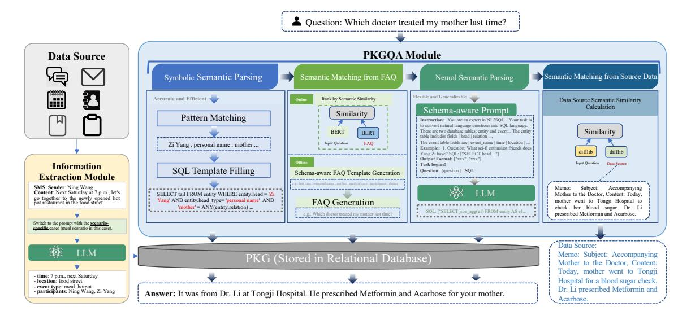
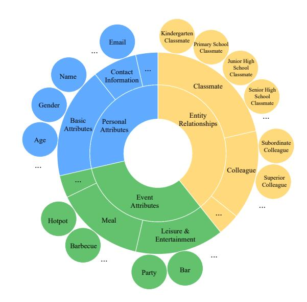
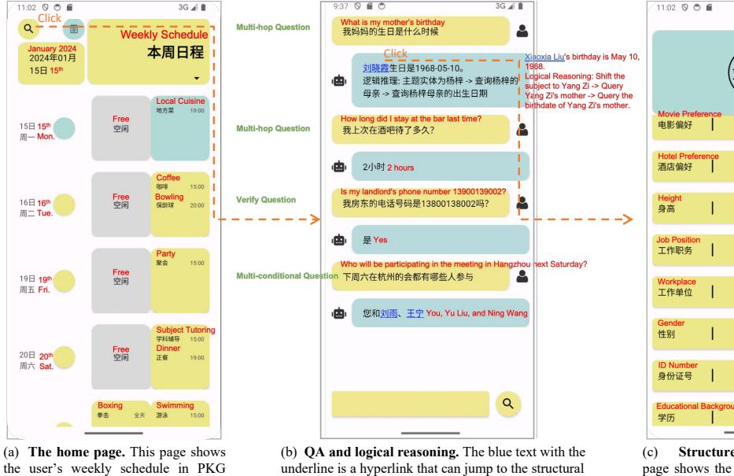
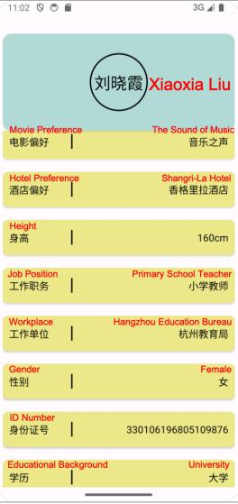
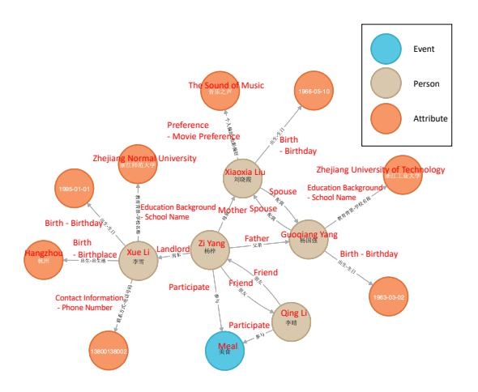

# A Question-Answering Assistant over Personal Knowledge Graph

Lingyuan Liu∗ Southeast University Nanjing, China 220224295@seu.edu.cn

Mengying Guo Huawei Technologies Co. Ltd. Shenzhen, China guomengying@huawei.com

Huifang Du∗ Tongji University Shanghai, China duhuifang@tongji.edu.cn

Haofen Wang† Tongji University Shanghai, China carter.whfcarter@gmail.com

Xiaolian Zhang Huawei Technologies Co. Ltd. Shenzhen, China zhangxiaolian@huawei.com

Meng Wang† Tongji University Shanghai, China wangmengsd@outlook.com

# ABSTRACT

We develop a Personal Knowledge Graph Question-Answering (PKGQA) assistant, seamlessly integrating information from multiple mobile applications into a unified and user-friendly query interface to offer users convenient information retrieval and personalized knowledge services. Based on a fine-grained schema customized for PKG, the PKGQA system in this paper comprises Symbolic Semantic Parsing, Frequently Asked Question (FAQ) Semantic Matching, and Neural Semantic Parsing modules, which are designed to take into account both accuracy and efficiency. The PKGQA system achieves high accuracy on the constructed dataset and demonstrates good performance in answering complex questions. Our system is implemented through an Android application, which is shown in [https://youtu.be/p732U5KPEq4.](https://youtu.be/p732U5KPEq4)

# CCS CONCEPTS

• Information systems → Question answering.

# KEYWORDS

knowledge graph, question answering, neural networks, symbolic system, intelligent personal assistant

### ACM Reference Format:

Lingyuan Liu, Huifang Du, Xiaolian Zhang, Mengying Guo, Haofen Wang, and Meng Wang. 2024. A Question-Answering Assistant over Personal Knowledge Graph. In Proceedings of the 47th International ACM SIGIR Conference on Research and Development in Information Retrieval (SIGIR '24), July 14–18, 2024, Washington, DC, USA. ACM, New York, NY, USA, [5](#page-4-0) pages. <https://doi.org/10.1145/3626772.3657665>

# 1 INTRODUCTION

In the current information age, numerous applications offer distinct functionalities and generate a substantial amount of isolated or

SIGIR '24, July 14–18, 2024, Washington, DC, USA

© 2024 Copyright held by the owner/author(s). Publication rights licensed to ACM. ACM ISBN 979-8-4007-0431-4/24/07 <https://doi.org/10.1145/3626772.3657665>

Figure 1: An example of a user frequently switching applications when arranging a dinner gathering with a friend.

fragmented data. To seek out diverse pieces of information, users frequently have to switch between multiple apps. This issue arises from the multitude of independent applications creating information silos, thereby hindering efficiency.

For example, as shown in Figure [1,](#page-0-0) when arranging a dinner gathering with friends, users may first consult their Calendar, where daily schedules are structured and well-organized, to review their schedule to determine a suitable time for the gathering. Subsequently, they may search through their chat history, a typical example of unstructured data, to recall the preferred dishes mentioned by the friend before. Following this, the user consults their Notes to decide on which restaurant to reserve, taking into account the friend's preferences. Finally, they add the new appointment to their Calendar to finalize the arrangements. This scenario highlights a user experience characterized by frequent application switching, which is cumbersome, inconvenient, and time-consuming. Hence, integrating and associating information from various data sources and providing a unified assistant will contribute to addressing this issue of information silos. This is crucial for improving user experience and maximizing the potential of mobile technology.

Recently, the introduction of the Personal Knowledge Graph (PKG) has presented a viable direction for the integration of mobile data [\[1,](#page-4-1) [21\]](#page-4-2). Previous studies [\[5,](#page-4-3) [6,](#page-4-4) [9,](#page-4-5) [10,](#page-4-6) [21\]](#page-4-2) have developed PKGs with relatively straightforward schemas, focusing primarily on common categories of personal relationships and events. However, the coarse-grained schemas proposed in these works are insufficient to encompass the usage scenarios of mobile devices in their scope. In contrast, non-PKG works [\[13,](#page-4-7) [14,](#page-4-8) [18\]](#page-4-9) often propose schemas with a broad array of entity categories, which do not necessarily correspond to the typical usage patterns of mobile devices. Therefore, to better fit the usage scenarios on mobile devices, we introduce a more comprehensive and finer 2-level granularity schema centered around persons and events, capable of encompassing a wider range of scenarios on mobile devices.

∗Both authors contributed equally to this research.

†Corresponding author.

Permission to make digital or hard copies of all or part of this work for personal or classroom use is granted without fee provided that copies are not made or distributed for profit or commercial advantage and that copies bear this notice and the full citation on the first page. Copyrights for components of this work owned by others than the author(s) must be honored. Abstracting with credit is permitted. To copy otherwise, or republish, to post on servers or to redistribute to lists, requires prior specific permission and/or a fee. Request permissions from permissions@acm.org.

Figure 2: The overview of PKGQA system. When a question is posed, components in PKGQA module are operated sequentially.

Knowledge Graph Question-Answering (KGQA) [\[4,](#page-4-10) [15,](#page-4-11) [16,](#page-4-12) [20\]](#page-4-13) systems provide users with a simple and intuitive interaction method for querying information across multiple applications. Based on the newly defined schema, we design and implement a multi-strategy PKGQA system, which is comprised of 3 targeted modules according to different types of questions: (1) a Symbolic Semantic Parsing module, (2) a Frequently Asked Question (FAQ) Semantic Matching module, and (3) a Neural Semantic Parsing module. These modules operate in sequence, triggered based on the availability of an answer within previous steps. For simple questions, Symbolic Semantic Parsing and FAQ Semantic Matching modules are capable of providing answers with high efficiency and accuracy. Only complex questions require the Neural Semantic Parsing module, aiming to enhance the flexibility and generalizability of the PKGQA system while ensuring timely responses.

To provide a user-friendly Graphic User Interface (GUI) for our PKGQA system, we design and implement a cross-application personal QA assistant at the Android system level. The application provides seamless integration with various mobile applications, allowing users to access a wide range of information sources without having to switch between multiple applications.

The storage of PKG is designed to be capable of being stored locally on mobile devices, without relying on collective patterns or data among users, thereby ensuring the protection of user privacy and personal data.

### 2 SYSTEM DESIGN AND IMPLEMENTATION

### 2.1 Schema Modeling

As mentioned in Section [1,](#page-0-1) existing schemas proposed in previous works are inadequate to cover the fine-grained data produced by mobile devices. To better accommodate the everyday use of mobile devices, we design a more comprehensive and detailed PKG schema, which is specifically tailored to capture the complexities and nuances of mobile data usage, ensuring a more accurate and user-centric approach.

Figure 3: An overview of our schema. We defined personal attributes, entity relationships, and event attributes in our schema. Each of these categories is defined as two levels of granularity, thereby suitable for application in diverse personal information or questions.

More specifically, as shown in Figure [3,](#page-1-0) two levels of granularity are defined in our schema, focusing on personal attributes, entity relationships, and event attributes. Different levels of granularity can be chosen according to specific scenarios. For example, in the schema proposed by Yang et al. [\[21\]](#page-4-2), the "Family" relationship is at its most granular level. In contrast, our research enriches this categorization by introducing 12 subcategories under "Family", such as "Father", "Mother", and "Spouse".

A Question-Answering Assistant over Personal Knowledge Graph SIGIR '24, July 14–18, 2024, Washington, DC, USA

information page.

(c) **Structured information.** This page shows the attributes of the entity "Xiaoxia Liu" in PKG.

Figure 4: The screenshots of our demonstration.

### 2.2 QA System Design and Implementation

with a clear timeline view.

Based on the schema definition mentioned in Section [2.1,](#page-1-1) we categorize daily information queries from users into three types of questions: simple questions, FAQs, and complex questions. Correspondingly, we design three modules for addressing these categories: Symbolic Semantic Parsing, FAQ Semantic Matching, and Neural Semantic Parsing, as shown in Figure [2.](#page-1-2) These modules operate sequentially, where a question that cannot be resolved by one module is passed on to the subsequent module for processing.

Symbolic Semantic Parsing. The initial phase of question processing is managed by the Symbolic Semantic Parsing module, notable for its precision and efficiency [\[11\]](#page-4-14). This module aims to address straightforward questions, such as "When is the birthday of my landlord?". It operates through a two-stage process: pattern matching and Structured Query Language (SQL) template filling. During pattern matching, the focus is on discerning multi-hop relationships present within user queries, followed by aligning these with a pre-established SQL template library. Successful identification leads to the SQL template-filling stage.

Semantic Matching from FAQ. For questions that can not be parsed by the Symbolic Semantic Parsing module, we perform semantic matching from pre-defined FAQs. This module aims to address questions frequently asked by users, such as "What is my schedule for this week?". To better calculate the similarity between questions and FAQs, we fine-tune BERT [\[7\]](#page-4-15) on the mobile app data, then employ this model to convert the question into an embedding, which is subsequently utilized to identify the most semantically similar FAQ.

Neural Semantic Parsing. For more complex or vague questions where Symbolic Semantic Parsing falls short and no corresponding FAQ is available, the system smoothly switches to utilizing the Neural Semantic Parsing module. This module leverages the flexibility and robust generalization capabilities of LLMs, adopting Natural Language to SQL (NL2SQL) [\[8,](#page-4-16) [12\]](#page-4-17) technology to formulate query statements for complex questions. In our implementation, we integrate GPT-4 [\[2\]](#page-4-18) and inform it of the database table structures directly within the prompt. Additionally, we supply the model with few-shot examples with several question-SQL pairs. The In-Context Learning (ICL) feature [\[2\]](#page-4-18) enables this module to extrapolate and interpret complex questions effectively. This approach significantly improves the system's understanding and processing of a wide variety of natural language expressions, expanding its applicability.

Semantic Matching from Source Data. Finally, if all the above methods cannot find a definite answer, the system will enable Semantic Matching from Source Data. The purpose of this mechanism is to provide as much relevant information as possible by retrieving raw data from the data source when a specific answer cannot be found. The system retrieves and directly reads data from the original text from applications, sourcing the raw data that is semantically most relevant to the user's question from the data source, thereby providing useful clues about the question.

Through the close cooperation of these four modules, our PKGQA system can not only handle various types of queries but also provide quick and accurate responses in different situations. This design ensures the system's flexibility and strong adaptability, meeting the growing information needs of users.

Implementation. In implementation, we focus on the usage scenario of smartphones and build an Android app as the GUI. Simultaneously, we encapsulate the PKGQA system as a Representational

Figure 5: A demonstration of our PKG, where persons, attributes, and events are all treated as entities.

State Transfer (RESTful) API to ensure seamless integration and functionality. Additionally, our GUI is capable of displaying additional information, including structured data and logical reasoning contained within the PKG. For instance, when a user asks, "When is my mother's birthday?" (refer to Figure [4\(](#page-2-0)b)), our system not only provides the answer but also displays the underlying multi-hop logic reasoning. Entities like "Xiaoxia Liu" are presented as linked texts; clicking on them redirects to their respective structured information display page (refer to Figure [4\(](#page-2-0)c)). Additionally, we present the query results of the user's weekly schedule in PKG in a structured format on the application's homepage, offering users a clear and functional entry (refer to Figure [4\(](#page-2-0)a)).

### 3 EVALUATION

### 3.1 Data Preparation

The PKG is built from the text data in the Android system applications, including Messages, Email, Notes, Clipboard, Calendar, and Contacts. Firstly, to construct our PKG dataset, we simulate a user "Zi Yang" as the owner of the device and employ an LLM to generate data that mimic various applications. During this process, we take into consideration the distinct textual styles associated with different applications. Then, we perform Information Extraction (IE) from these text data based on LLMs to further optimize information extraction [\[17\]](#page-4-19). We design a task decomposition method based on Chain of Thought (CoT) [\[19\]](#page-4-20), operating in the following steps: firstly, matching the predefined schema's major categories according to the scene, then retrieving specific examples based on the major categories, and finally synthesizing the results of these two steps to obtain fine-grained extraction results. Finally, extracted entities, events, attributes, entity relationships, and event-entity relationships are stored in a relational database.

A QA dataset targeting this PKG is constructed, which encompasses 200 multi-hop reasoning questions, 100 multi-conditional constraint questions, and 100 verify questions. After completing the PKG construction, we adopt the "locating and asking" method [\[3\]](#page-4-21), initially identifying a series of multi-hop paths or acyclic subgraphs, ultimately leading to the target entity. For example, for the

Method Accuracy (%) Multi-hop Multi-conditional Verify Total all 94.0 60.0 81.0 83.0 w/o SSP 53.0 54.0 44.0 54.0

w/o NSP 93.5 0.0 80.0 69.0 w/o FAQ 97.5 63.0 81.0 80.0

Table 1: Ablation results of the PKGQA system under differ-

chosen path "Zi Yang → mother → Xiaoxia Liu → birthday → 1968-05-10", the generated question-answer pair is ("When is my mother's birthday?", "1968-05-10"). We then employ rules to combine different conditions to generate questions, and ultimately use a LLM (GPT-3.5-turbo in our case) for question rewriting, enhancing the diversity and naturalness of the questions.

### 3.2 Performance

ent question categories.

To elucidate the functions of Symbolic Semantic Parsing, FAQ Semantic Matching, and Neural Semantic Parsing, the three components of the PKGQA system proposed in Section [2,](#page-1-3) we conducted ablation experiments in this section by removing each component from the system one at a time for comparison with the complete system. The experimental results are shown in Table [1,](#page-3-0) where "w/o SSP", "w/o NSP", and "w/o FAQ" denote the configurations that exclude the Symbolic Semantic Parsing module, the Neural Semantic Parsing module, and the FAQ Semantic Matching module, respectively. The result indicates that eliminating any component reduces overall accuracy, highlighting the particular importance of both the Symbolic Semantic Parsing and Neural Semantic Parsing modules. They notably enhance performance on multi-hop and multi-conditional questions, respectively. The superior performance of the w/o FAQ model on multi-hop tasks is caused by the potential for FAQ to mismatch before the Neural Semantic Parsing module, consequently leading to the skipping of the Neural Semantic Parsing module. Our system is capable of responding to the majority of simple queries within milliseconds, and can also address complex questions within 2-3 seconds, all of which can be considered acceptable response times.

### 4 CONCLUSION

In this paper, we delve into the methodology of integrating data from different applications into a unified PKGQA system. Our research focuses on leveraging PKG to provide accurate, personalized user experiences while ensuring the efficiency and flexibility of the processing. The design and implementation of the PKGQA system demonstrate an accurate and efficient processing workflow, including Symbolic Semantic Parsing, FAQ Semantic Matching, and Neural Semantic Parsing. This process highlights the flexibility and strong adaptability of our system, ensuring fast and accurate responses under various scenarios. We then construct a PKGQA dataset to perform experimental evaluations on our PKGQA system, demonstrating the effectiveness of our system. Moreover, our PKGQA system features an easy-to-use GUI with a well-organized layout to showcase knowledge in PKG with additional information. A Question-Answering Assistant over Personal Knowledge Graph SIGIR '24, July 14–18, 2024, Washington, DC, USA

### REFERENCES

- [1] Krisztian Balog and Tom Kenter. 2019. Personal knowledge graphs: A research agenda. In Proceedings of the 2019 ACM SIGIR International Conference on Theory of Information Retrieval. 217–220.
- [2] Tom Brown, Benjamin Mann, Nick Ryder, Melanie Subbiah, Jared D Kaplan, Prafulla Dhariwal, Arvind Neelakantan, Pranav Shyam, Girish Sastry, Amanda Askell, et al. 2020. Language models are few-shot learners. Advances in neural information processing systems 33 (2020), 1877–1901.
- [3] Shulin Cao, Jiaxin Shi, Liangming Pan, Lunyiu Nie, Yutong Xiang, Lei Hou, Juanzi Li, Bin He, and Hanwang Zhang. 2022. KQA Pro: A Dataset with Explicit Compositional Programs for Complex Question Answering over Knowledge Base. In Proceedings of the 60th Annual Meeting of the Association for Computational Linguistics (Volume 1: Long Papers). 6101–6119.
- [4] Nilesh Chakraborty, Denis Lukovnikov, Gaurav Maheshwari, Priyansh Trivedi, Jens Lehmann, and Asja Fischer. 2021. Introduction to neural network-based question answering over knowledge graphs. WIREs Data Mining and Knowledge Discovery 11, 3 (2021), e1389.<https://doi.org/10.1002/widm.1389>
- [5] Prantika Chakraborty, Sudakshina Dutta, and Debarshi Kumar Sanyal. 2022. Personal research knowledge graphs. In Companion Proceedings of the Web Conference 2022. 763–768.
- [6] Prantika Chakraborty and Debarshi Kumar Sanyal. 2023. A comprehensive survey of personal knowledge graphs. Wiley Interdisciplinary Reviews: Data Mining and Knowledge Discovery 13, 6 (2023), e1513.
- [7] Jacob Devlin, Ming-Wei Chang, Kenton Lee, and Kristina Toutanova. 2019. BERT: Pre-training of Deep Bidirectional Transformers for Language Understanding. In Proceedings of the 2019 Conference of the North American Chapter of the Association for Computational Linguistics: Human Language Technologies, Volume 1 (Long and Short Papers). 4171–4186.
- [8] Chenxu Hu, Jie Fu, Chenzhuang Du, Simian Luo, Junbo Zhao, and Hang Zhao. 2023. ChatDB: Augmenting LLMs with Databases as Their Symbolic Memory. arXiv preprint arXiv:2306.03901 (2023).
- [9] Bei Hui, Lizong Zhang, Xue Zhou, Xiao Wen, and Yuhui Nian. 2022. Personalized recommendation system based on knowledge embedding and historical behavior. Applied Intelligence (2022), 1–13.
- [10] Eleni Ilkou. 2022. Personal knowledge graphs: use cases in e-learning platforms. In Companion Proceedings of the Web Conference 2022. 344–348.
- [11] Aishwarya Kamath and Rajarshi Das. 2019. A Survey on Semantic Parsing. In Automated Knowledge Base Construction (AKBC). [https://openreview.net/forum?](https://openreview.net/forum?id=HylaEWcTT7)

[id=HylaEWcTT7](https://openreview.net/forum?id=HylaEWcTT7)

- [12] Gerhard Georg Klager and Axel Polleres. 2023. Is GPT fit for KGQA?–Preliminary Results. Joint Proceedings of TEXT2KG (2023), 171–191.
- [13] Shuangjie Li, Wei He, Yabing Shi, Wenbin Jiang, Haijin Liang, Ye Jiang, Yang Zhang, Yajuan Lyu, and Yong Zhu. 2019. Duie: A large-scale chinese dataset for information extraction. In Natural Language Processing and Chinese Computing: 8th CCF International Conference, NLPCC 2019, Dunhuang, China, October 9–14, 2019, Proceedings, Part II 8. Springer, 791–800.
- [14] Xinyu Li, Fayuan Li, Lu Pan, Yuguang Chen, Weihua Peng, Quan Wang, Yajuan Lyu, and Yong Zhu. 2020. DuEE: a large-scale dataset for Chinese event extraction in real-world scenarios. In Natural Language Processing and Chinese Computing: 9th CCF International Conference, NLPCC 2020, Zhengzhou, China, October 14–18, 2020, Proceedings, Part II 9. Springer, 534–545.
- [15] Lihui Liu, Boxin Du, Jiejun Xu, Yinglong Xia, and Hanghang Tong. 2022. Joint knowledge graph completion and question answering. In Proceedings of the 28th ACM SIGKDD Conference on Knowledge Discovery and Data Mining. 1098–1108.
- [16] Apoorv Saxena, Aditay Tripathi, and Partha Talukdar. 2020. Improving multi-hop question answering over knowledge graphs using knowledge base embeddings. In Proceedings of the 58th Annual Meeting of the Association for Computational Linguistics. 4498–4507.
- [17] Lewis Tunstall, Edward Beeching, Nathan Lambert, Nazneen Rajani, Kashif Rasul, Younes Belkada, Shengyi Huang, Leandro von Werra, Clémentine Fourrier, Nathan Habib, et al. 2023. Zephyr: Direct distillation of lm alignment. arXiv preprint arXiv:2310.16944 (2023).
- [18] Denny Vrandečić and Markus Krötzsch. 2014. Wikidata: a free collaborative knowledgebase. Commun. ACM 57, 10 (2014), 78–85.
- [19] Jason Wei, Xuezhi Wang, Dale Schuurmans, Maarten Bosma, Fei Xia, Ed Chi, Quoc V Le, Denny Zhou, et al. 2022. Chain-of-thought prompting elicits reasoning in large language models. Advances in Neural Information Processing Systems 35 (2022), 24824–24837.
- [20] Haobo Xiong, Shuting Wang, Mingrong Tang, Liping Wang, and Xuemin Lin. 2021. Knowledge graph question answering with semantic oriented fusion model. Knowledge-Based Systems 221 (2021), 106954.
- [21] Yu Yang, Jiangxu Lin, Xiaolian Zhang, and Meng Wang. 2022. PKG: A personal knowledge graph for recommendation. In Proceedings of the 45th International ACM SIGIR Conference on Research and Development in Information Retrieval. 3334–3338.