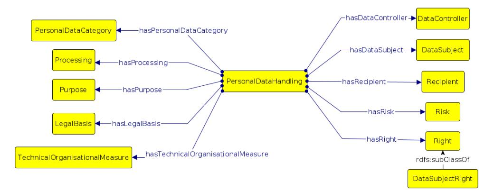

# *Article*PRIVAFRAME: A Frame-Based Knowledge Graph for Sensitive Personal Data
**Gaia Gambarelli 1,2,\* ,[†](https://orcid.org/0000-0002-7697-2848) and Aldo Gangemi 1,3,\* ,†**- 1 Department of Filologia Classica e Italianistica (FICLIT), University of Bologna, 40126 Bologna, Italy
- 2 Ellysse s.r.l., 42124 Reggio Emilia, Italy
- 3 Institute of Cognitive Sciences and Technologies, National Research Council (ISTC-CNR), 00185 Roma, Italy
-**\***Correspondence: gaia.gambarelli2@unibo.it (G.G.); aldo.gangemi@unibo.it (A.G.)
- † These authors contributed equally to this work.
**Abstract:**The pervasiveness of dialogue systems and virtual conversation applications raises an important theme: the potential of sharing sensitive information, and the consequent need for protection. To guarantee the subject's right to privacy, and avoid the leakage of private content, it is important to treat sensitive information. However, any treatment requires firstly to identify sensitive text, and appropriate techniques to do it automatically. The Sensitive Information Detection (SID) task has been explored in the literature in different domains and languages, but there is no common benchmark. Current approaches are mostly based on artificial neural networks (ANN) or transformers based on them. Our research focuses on identifying categories of personal data in informal English sentences, by adopting a new logical-symbolic approach, and eventually hybridising it with ANN models. We present a frame-based knowledge graph built for personal data categories defined in the Data Privacy Vocabulary (DPV). The knowledge graph is designed through the logical composition of already existing frames, and has been evaluated as background knowledge for a SID system against a labeled sensitive information dataset. The accuracy of PRIVAFRAME reached 78%. By comparison, a transformer-based model achieved 12% lower performance on the same dataset. The top-down logical-symbolic frame-based model allows a granular analysis, and does not require a training dataset. These advantages lead us to use it as a layer in a hybrid model, where the logical SID is combined with an ANNs SID tested in a previous study by the authors.
**Keywords:**sensitive personal data; semantic models; privacy protection; privacy knowledge graph; graph-based AI

# 1. Introduction

Sharing personal information is a common habit in virtual environments. The sensitive information detection (SID) task concerns the identification of those parts of text considered sensitive in a particular context [\[1\]](#page-16-0). What makes personal information sensitive is none other than its relationship to identifiable individuals, as defined by the General Data Protection Regulation (GDPR): "any information relating to an identified or identifiable natural person ("data subject"); an identifiable natural person is one who can be identified, directly or indirectly, in particular by reference to an identifier such as a name, an identification number, location data, an online identifier or to one or more factors specific to the physical, physiological, genetic, mental, economic, cultural or social identity of that natural person" (GDPR, 4.1) [\[2\]](#page-16-1).

To be treated and protected, this information must be identified first. A lot of works in the literature [\[1,](#page-16-0)[3,](#page-16-2)[4\]](#page-17-0) concern the SID task; however, only some of these focus on the specific domain of personal information: basic personal information [\[5,](#page-17-1)[6\]](#page-17-2), personal health information (PHI) [\[7\]](#page-17-3), ethnic origin and political opinion information [\[8\]](#page-17-4). The investigated domain of the present work excludes the strict identification of basic personal information
**Citation:**Gambarelli, G.; Gangemi, A. PRIVAFRAME: A Frame-Based Knowledge Graph for Sensitive Personal Data.*Big Data Cogn. Comput.* **2022**, *6*, 90. [https://](https://doi.org/10.3390/bdcc6030090) [doi.org/10.3390/bdcc6030090](https://doi.org/10.3390/bdcc6030090)

Academic Editors: Marco Fisichella and Antonia Russo

Received: 4 August 2022 Accepted: 19 August 2022 Published: 26 August 2022

**Publisher's Note:**MDPI stays neutral with regard to jurisdictional claims in published maps and institutional affiliations.
**Copyright:** © 2022 by the authors. Licensee MDPI, Basel, Switzerland. This article is an open access article distributed under the terms and conditions of the Creative Commons Attribution (CC BY) license [\(https://](https://creativecommons.org/licenses/by/4.0/) [creativecommons.org/licenses/by/](https://creativecommons.org/licenses/by/4.0/) 4.0/).

and focuses on a large number of categories. These categories have been identified through an authoritative reference resource: the Data Privacy Vocabulary (DPV) [\[9\]](#page-17-5).

Furthermore, recent works have adopted mainly deep learning approaches to solve the problem [\[1,](#page-16-0)[4,](#page-17-0)[10\]](#page-17-6).

In this work, a new logical-symbolic approach, never explored in the literature, is proposed. PRIVAFRAME is a knowledge graph created with a top-down approach that aims to give a frame-based representation of personal data categories (PDCs).

The work is structured as follows: In Section [2,](#page-1-0) the related works are analyzed, focusing mainly on the logical and rules-based approaches and underlining the innovative characteristics of the proposed approach. In Section [3.1,](#page-3-0) a description of and motivation for our choice of reference resource (Data Privacy Vocabulary) are provided. Section [3.2](#page-6-0) presents the manually labeled PDCs corpora, constructed by the authors and used for the model evaluation; it was very important to create a common benchmark, which was until now absent for the SID task. In Section [4](#page-7-0) is a description of PRIVAFRAME, the created frame-based knowledge graph, from grounded theoretical bases (Section [4.1\)](#page-7-1) up to its articulation (Section [4.2\)](#page-8-0). Section [5](#page-9-0) is dedicated to the experimental results which evaluate the effectiveness of PRIVAFRAME, followed by a detailed error analysis. The experimental results are strengthened by a comparative experiment conducted using a transformer-based approach. Section [6](#page-14-0) is dedicated to discussion: we reflect on the advantages and disadvantages of the knowledge graph approach, and we introduce a hybrid and more extensive architectural proposal for SID, in which PRIVAFRAME can be integrated. Conclusions and future work are summarized in Section [7.](#page-15-0)

# 2. Related Work

Some research solutions for the SID task adopt a rule-based approach [\[11,](#page-17-7)[12\]](#page-17-8). Chow et al. [\[11\]](#page-17-7) proposed a model based on the idea that sensitive information can be derived from words that frequently co-occur with sensitive keywords. The specific investigated domains are healthcare privacy, legislation compliance and the protection of organizations' sensitive information (intellectual property, client data, etc.). The authors worked on the first task with a focus a particular topic's detection through identification of all its inference keywords in a Web document. The second task concerned the classification of a sensitive topic when certain words co-occur with seed words. For the first task, the sensitive topics were HIV/AIDS, genetic information, mental health and communicable diseases; for the second task, the sensitive topic "University of Wharton" was explored and evaluated in the Enron dataset [\[13\]](#page-17-9). The inference model achieved 81% recall and 73% precision.

Sensitive information can then be learned using word-for-word inference rules. Geng et al. [\[12\]](#page-17-8) supported a sensitivity framework that identifies sensitive entities based on quasi-identifying entities (QIEs), and therefore, highly sensitive (names, age, weight, etc.) and sensitive entities (SEs). SEs, at the same time, are divided into objective SEs (e.g., "Marco has been recognized as disabled") and subjective (e.g., "Marco often suffers from migraines"). QIEs are obtained as nominative entities from text. The extraction of both SEs and QIEs sets is based again on unigrams, assigning sensitivity scores. They focus on PHI entities in medical records and achieved 84% recall and 74% precision.

In Sánchez et al. [\[14\]](#page-17-10), the n-gram approach was extended to a bi-gram context. The authors proposed a privacy model, called C-sanitized, for document redaction and sanitization. The model detects the semantic inference/disclosure of sensitive entities in unstructured documents, measuring the association between sensitive and non-sensitive words in a document through a statistical measure of association, the pointwise mutual information (PMI) [\[15\]](#page-17-11). They evaluated the model on Wikipedia pages of individuals, e.g., movie stars. They use manual annotation for sentences related to sensitive personal information, which was typically defined by keywords, corresponding to personally identifiable information (PII), e.g., HIV (state of health), Catholicism (religion) and homosexuality (sexual orientation). Thereby, 97% of the docs were sanitized. This dataset is not publicly

available, and in any case, complex sensitive categories were not considered. The detection concerned the identification of specific terms.

As analyzed in Neerbek et al. [\[1\]](#page-16-0), such approaches based on a single word, or in which a simple word count is considered, are not context-aware. The author proposed a contextualized approach based on automatic paraphrasing and recursive neural networks [\[1\]](#page-16-0).

Context-aware approaches can, however, also be considered in rule-based models. Garcia et al. [\[16\]](#page-17-12) proposed a model which is based on an ontological approach. The model aims to identify associations between potentially sensitive concepts and their subsequent sensitive concerns. The domain presents organizational information (a NASA website dataset) and is treated considering its complexity and compositional relationships. Sensitive concepts (the system, its components, mission, launch, orbit, capabilities, specifications, etc.) do not correspond to single terms, but correlations of terms that together can equate to sensitive information. The text is run using named entity recognition and a coreference resolution annotator. The information is then transformed into an ontological knowledge graph; subsequently, it can be analyzed through inference, in form of SPARQL queries, in order to detect sensitivity concerns, which can be present at a document or paragraph level. Unfortunately, the model has not been evaluated.

PRIVAFRAME can be considered as rule-based, due to its logical-symbolic structure, but it presents a substantial difference if compared to the aforementioned works. While these are often based on the identification of keywords, PRIVAFRAME considers a broader context: semantic frames extracted from discourse structure. It aims to identify complex categories of sensitive data based on the semantics of the sentence, and proposes a finegrained analysis of the types of sensitive content present in the text. Compared to the work of Garcia et al. [\[16\]](#page-17-12), PRIVAFRAME produces a frame-based knowledge graph, in which the categories of sensitive data are conceptually represented as a frame composition. Frame extraction is ideally preceded by the classification of sentences as either containing sensitive or non-sensitive content. This classification is discussed in Section [7,](#page-15-0) where a hybrid approach is proposed.

As noted in Section [1,](#page-0-0) the most recent approaches exploit algorithms based on neural networks and transformer networks. Xu et al. [\[4\]](#page-17-0) worked with the Chinese language on identifying sensitive data in military and political documents using convolutional neural networks (CNNs). Lin et al. [\[10\]](#page-17-6) also worked on the Chinese language, and in particular on unstructured texts with bidirectional-long short-term memory (Bi-LSTM) neural networks, and Genetu et al. did the same [\[8\]](#page-17-4). In another recent study [\[7\]](#page-17-3), the authors worked on the identification of PHI in Spanish and implemented a BERT–BiLSTM–attention model that reached an F1 of 99.15% (limited to basic PHI). A study on the identification of basic personal information in Portuguese [\[5\]](#page-17-1) adopted a named entity recognition hybrid model, which combines rule-based and lexicon approaches with machine learning and deep learning algorithms. The approaches were evaluated on two corpora (HAREM corpus [\[17\]](#page-17-13) and SIGARRA corpus [\[18\]](#page-17-14)). The lexicon-based approach (which aims to identify personal categories, e.g., person, location, profession and medical information) achieved an F1-score of 62.36% on the first corpus and of 60.64% on the second. For what concerns the statistical models, the conditional random field (CRF) model achieved an F1-score of 65.50%, and the Bi-LSTM model, 83.01%.

Neural network approaches are context-aware; however, they operate at the sentence or document level, whereas inference-based approaches can work at a word or even (as in PRIVAFRAME) at entity/relation level. Frames are able to capture broad semantic context, and at the same time return a much more precise identification of the sensitive portion of a sentence. While recent models based on neural networks seem to give promising results, this paper brings to light the advantages of a new logical-symbolic approach, and how it can enrich the existing state-of-the-art, and contribute to a hybrid, improved resolution of the SID task.

Finally, as the review shows, the aforementioned works differ greatly in relation to the language, domain and techniques considered. The lack of a common benchmark, also due to the difficulty in finding labeled corpora of sensitive information (see Section [3.2\)](#page-6-0), is a problem highlighted in SID literature [\[1\]](#page-16-0).

# 3. Materials and Methods

In this section, the materials and methods considered to develop PRIVAFRAME are described. Section [3.1](#page-3-0) is dedicated to the authoritative resource taken as a reference for the implementation of our top-down knowledge graph: the aforementioned DPV [\[9\]](#page-17-5); Section [3.2](#page-6-0) presents the sensitive data corpus created by the authors and used as the test corpus for the evaluation of PRIVAFRAME.

## *3.1. A Reference Resource: The Data Privacy Vocabulary*Our work focuses on identifying PDCs for the English language. Considering the definition of "personal data" given by the GDPR (Section [1\)](#page-0-0), there are many types of data that can be textually identified, hence the need to start from an authoritative taxonomy to outline the PDCs to be modeled.

In the literature, moreover, there are ontologies, but these are mostly dedicated to the semantic organization of privacy policies, such as PrOnto [\[19\]](#page-17-15) and Privonto [\[20\]](#page-17-16). Pandit et al. [\[9\]](#page-17-5) described also (i) GDPRtEXT, a linked data representation of the GDPR text and a glossary of GDPR compliance concepts. It allows the linking of information with specific GDPR clauses and concepts. (ii) GDPRov, which represents the origin of activities related to personal data and consent in the ex ante and ex post phases. (iii) GConsent, which represents information relating to consent.

The DPV [\[21\]](#page-17-17) is a resource created by the World Wide Web Consortium (W3C) [\[22\]](#page-17-18). The W3C Data Privacy Vocabularies and Controls Community Group (DPVCG) was formed in 2018 through the SPECIAL H2020 Project and aims at ensuring the interoperability of data privacy through contributions from various stakeholders across computer science, IT, law, sociology, philosophy-representing academia, industry, policymakers and activists. It acts as a framework of common concepts, and it aims to fill the lack of the following aspects:

- 1. Validated vocabularies to represent information about personal data use and processing;
- 2. Taxonomies that describe purposes of processing personal data which are not restricted to a particular domain or use case;
- 3. Machine-readable representations of concepts that can be used for technical interoperability of information.

It was developed using SKOS [\[23\]](#page-17-19). It can be used as a taxonomy or collection of concepts, because of its structure and concepts and relationships.

The "Basic Ontology" describes the first level classes that define a legal policy for the processing of personal data (see Figure [1\)](#page-4-0) and represent information regarding the what, how, where, who and why of personal data and its processing.

The DPV provides the concept PERSONAL DATA and the relation HAS PERSONAL DATA to indicate what categories or instances of personal data have been processed. The DPV has a section, DPV-PD [\[24\]](#page-17-20): an extension that is a real ontology of PDCs. In DPV-PD the concepts are structured in a top-down schema based on an opinionated structure contributed by R. Jason Cronk from EnterPrivacy (see Figure [2\)](#page-4-1). In particular, SENSITIVE PERSONAL DATA (SPD) is the class to indicate personal data considered sensitive in terms of privacy and/or impact and that require additional considerations and/or protection. The SPDs subclass is the SPECIAL DATA category, which includes PDCs such as HEALTH, MENTAL HEALTH and DISABILITY.

<!-- Image Description: This image presents an entity-relationship diagram illustrating a data model for personal data handling. "PersonalDataHandling" is the central entity, linked to other entities such as "PersonalDataCategory," "Processing," "Purpose," "LegalBasis," "TechnicalOrganisationalMeasure," "DataController," "DataSubject," "Recipient," "Risk," and "Right." Relationships are represented by labeled arrows, indicating attributes and connections between entities. The diagram likely serves to visually define the data structure used in the paper's analysis. -->
**Figure 1.**Base Vocabulary DPV. The figure can be found in the DPV documentation [\[24\]](#page-17-20). Reprint format: Copyright [\(https://www.w3.org/Consortium/Legal/ipr-notice#Copyright,](https://www.w3.org/Consortium/Legal/ipr-notice#Copyright) accessed on 3 August 2022) 2022, the Contributors to the Data Privacy Vocabulary (DPV) Specification, published by the Data Privacy Vocabularies and Controls Community Group [\(https://www.w3.org/groups/](https://www.w3.org/groups/cg/dpvcg) [cg/dpvcg,](https://www.w3.org/groups/cg/dpvcg) accessed on 3 August 2022) under the W3C Community Contributor License Agreement (CLA) [\(https://www.w3.org/community/about/agreements/cla/,](https://www.w3.org/community/about/agreements/cla/) accessed on 3 August 2022).

<!-- Image Description: The image is a conceptual data model illustrating the hierarchy of personal data types. A directed acyclic graph shows "Special Category Personal Data" and "Sensitive Personal Data" as subtypes of "Personal Data," which is further categorized (dpv-pd) into "Historical," "Tracking," "Financial," "Social," "External," and "Internal" data types. "Thing" is also linked to "Personal Data" indicating a relationship. The diagram clarifies the relationships and classifications within a personal data ontology. -->
**Figure 2.** Personal data concepts within DPV and their extensions in DPV-PD. The classes of the extended taxonomy have been structured by utilizing their relevance and origin. The figure can be found in the introductory document to DPV concepts [\[24\]](#page-17-20). Reprint format: Copyright [\(https:](https://www.w3.org/Consortium/Legal/ipr-notice#Copyright) [//www.w3.org/Consortium/Legal/ipr-notice#Copyright,](https://www.w3.org/Consortium/Legal/ipr-notice#Copyright) accessed on 3 August 2022) 2022, the Contributors to the Data Privacy Vocabulary (DPV) Specification, published by the Data Privacy Vocabularies and Controls Community Group [\(https://www.w3.org/groups/cg/dpvcg,](https://www.w3.org/groups/cg/dpvcg) accessed on 3 August 2022) under the W3C Community Contributor License Agreement (CLA) [\(https://www.](https://www.w3.org/community/about/agreements/cla/) [w3.org/community/about/agreements/cla/,](https://www.w3.org/community/about/agreements/cla/) accessed on 3 August 2022).

Concepts within DPV-PD are broadly structured in a top-down fashion and are divided into macro-categories:

- 1. INTERNAL (within the person): e.g., PREFERENCES, KNOWLEDGE and BELIEFS.
- 2. EXTERNAL (visible to others): e.g., BEHAVIORAL, DEMOGRAPHICS, PHYSICAL, SEXUAL and IDENTIFYING.
- 3. SOCIAL: e.g., FAMILY, FRIENDS, PROFESSIONAL, PUBLIC LIFE and COMMUNICATION.
- 4. FINANCIAL: e.g., TRANSACTIONAL, OWNERSHIP and FINANCIAL ACCOUNT.
- 5. TRACKING: e.g., LOCATION, DEVICE-BASED and CONTACT.
- 6. HISTORICAL: e.g., LIFE HISTORY.

The DPV document states that the sensitivity of personal data can be universal, and those data are always sensitive, or contextual, which means a use-case needs to declare it as such. Our model aims to cover the identification of universal PDCs. It can be adapted case by case to specific needs, becoming a contextualized model.

The DPV-PD presents 168 PDCs. In truth, with the latest release of May 2022, 18 categories were added, which are, however, only further specifications of already existing categories. Each category is described with a definition and additional information in Table [1.](#page-5-0) Starting from these definitions, the construction of compositional frames can be articulated, as Section [4](#page-7-0) describes.

**Table 1.** Example of a tabular description of the PDC: AGE as can be found in the DPV-PD resource [\[24\]](#page-17-20). Adapt format: Copyright [\(https://www.w3.org/Consortium/Legal/ipr-notice#](https://www.w3.org/Consortium/Legal/ipr-notice#Copyright) [Copyright,](https://www.w3.org/Consortium/Legal/ipr-notice#Copyright) accessed on 3 August 2022) 2022, the Contributors to the Data Privacy Vocabulary (DPV) Specification, published by the Data Privacy Vocabularies and Controls Community Group [\(https:](https://www.w3.org/groups/cg/dpvcg) [//www.w3.org/groups/cg/dpvcg,](https://www.w3.org/groups/cg/dpvcg) accessed on 3 August 2022) under the W3C Community Contributor License Agreement (CLA) [\(https://www.w3.org/community/about/agreements/cla/,](https://www.w3.org/community/about/agreements/cla/) accessed on 3 August 2022).

| IRI             | https://w3id.org/dpv/dpv-pd#Age, accessed on 3 August 2022 |
|-----------------|------------------------------------------------------------|
| Term:           | Age                                                        |
| Definition:     | Information about age                                      |
| SubType of:     | dpv-pd:PhysicalCharacteristic                              |
| Source:         | EnterPrivacy Categories of Personal Information            |
| Created:        | 4 June 2019                                                |
| Contributor(s): | Elmar Kiesling; Harshvardhan J. Pandit, Fajar Ekaputra     |

Furthermore, the 168 categories were divided into five different types, concerning their nature and the characteristics that can affect their automatic identification. The subdivision is summarized in Table [2.](#page-5-1) First of all, five of these are macro-categories, to which the SPECIAL CATEGORY PERSONAL DATA was added. Out of the other 162, we asked: which of these can be expressed implicitly or explicitly in written sentences? Information closely related to a person's accent can be extracted from speech, but certainly not from a written text; and the logs of calls made by an individual or fingerprints are data that do not emerge from the text and cannot be investigated through linguistic elements. For this reason, 44 categories were necessarily excluded from our perimeter of interest. Out of the other 118 categories, 74 categories were identified, which would be interesting to investigate through linguistic patterns and textual features useful for automatic identification. At the same time, 21 out of the 118 were excluded because they are uniquely identifiable through regular expressions and named entity recognition, e.g., BANK ACCOUNT and CREDIT CARD NUMBER. Finally, 23 categories were conceptually defined as broad and generic, which is why they are more difficult to deal with (e.g., ATTITUDE, INTENTION and INTEREST).

**Table 2.**Analysis of the 168 PDCs of the DPV [\[25\]](#page-17-21).

| N. | Type                                                                 | Examples                                                       |
|----|----------------------------------------------------------------------|----------------------------------------------------------------|
| 6  | Macro-categories                                                     | FINANCIAL, EXTERNAL, INTERNAL, HISTORICAL, SOCIAL, TRACKING |
| 74 | Identifiable through textual analysis                                | AGE, FAVORITE, HEALTH                                          |
| 23 | Broad boundaries categories identifiable through textual analysis | ATTITUDE, INTEREST, INTENTION                                  |
| 21 | Uniquely identifiable                                                | BANK ACCOUNT, BLOOD TYPE, CREDIT CARD                       |
| 44 | Identifiable mainly through non-textual elements                     | ACCENT, BIOMETRIC, CALL LOG                                    |

It is not easy to find corpora of annotated sensitive data in the literature. Some public corpora often used for SID are the Enron Email Dataset [\[1,](#page-16-0)[3,](#page-16-2)[11\]](#page-17-7) and the Monsanto trial Dataset [\[1,](#page-16-0)[26\]](#page-17-22), both concerning the domain of organizational sensitive data. The first one contains more than 600,000 e-mails from the American Enron Corporation, having approximately 2720 documents manually labeled by human annotators, lawyers and professionals in 2010. Annotations cover specific topics, including business transactions, forecasts, projects, actions, intentions, etc. [\[27\]](#page-17-23). The Enron corpus could be representative of conversations in the real world. However, since it dates to 2002, it cannot be considered very representative of today's communication style. The second one, the Monsanto Dataset [\[28\]](#page-18-0), published in 2017, consists of secret legal acts. The Monsanto Dataset, although more recent, is a domain-specific corpus does not cover many PDCs, other than those closely related to the legal domain.

For the aforementioned reasons, they could not represent a point of reference for the specific identification of personal data. The corpora used in personal data identification studies were the following:

- Wikipedia articles. Wikipedia articles or pages are very easy to acquire and contain different types of sensitive information. A Wikipedia test corpus of 10,000 articles that were randomly collected was used in Hart et al. [\[3\]](#page-16-2). Sánchez et al. [\[14\]](#page-17-10) used Wikipedia pages of individuals, e.g., movie stars. They used manual annotation for sentences on Wikipedia pages relating to sensitive personal information typically defined by keywords and corresponding to PII, e.g., HIV (state of health), Catholicism (religion) and homosexuality (sexual orientation). Unfortunately, this dataset is not publicly available, and in any case, complex sensitive categories are not considered.
- Dataset from Pastebin. The domain of this dataset used in the literature [\[6\]](#page-17-2) concerns PII (personally identifiable information). The data were collected from Pastebin [\[29\]](#page-18-1) and were labeled with four types of PII information using regular expressions for content-based sensitive information and the BERT–BiLSTM–attention model to automatically extract context-based sensitive information from preprocessed text. The sensitive information concerned:
  -**–**Personal information: name, social security number, date of birth, nationality, address, phone number, occupation, health and education.
  -**–**Network identity information.
  -**–**Secret and credential information.
  -**–** Financial information.

The dataset is not currently available. The categories refer to PII frequently detected through regular expressions or very narrow linguistic patterns.

Due to the lack of a common benchmark in automatic SID, SPeDaC, a manually labeled corpus for PDCs, was constructed and presented in a previous work [\[25\]](#page-17-21) by the authors. Personal data in informal online conversations are the context domain of our interest. The TenTen corpus family is a large resource, made up of texts collected from the Internet [\[30\]](#page-18-2). The TenTen corpora are available in more than 40 languages. The most recent version of the English TenTen corpus (enTenTen2020) consists of 36 billion words. The texts were downloaded between 2019 and 2021. The sample texts were manually checked; content with poor quality text and spam was removed.

Three datasets were created: SPeDaC1, SPeDaC2 and SPeDaC3 (for dataset size, see Table [3\)](#page-6-1).

**Table 3.** Sizes of SPeDaC1, SPeDaC2 and SPeDaC3.

|           | SPeDaC1 | SPeDaC2 | SPeDaC3 |
|-----------|---------|---------|---------|
| Sentences | 10,675  | 5133    | 5562    |
| Tokens    | 270,904 | 134,860 | 157,508 |

SPeDaC1 is the dataset for the identification of sensitive and non-sensitive sentences. The 10,675 sentences collected from the enTenTen corpus have two types of labels: (1) sentences with sensitive content; (2) sentences with non-sensitive content. Non-sensitive examples correspond to sentences that contain the same linguistic patterns found in sensitive sentences, but in a context that does not confer their sensitivity.

In SPeDaC2, the sentences of the corpus represent the 74 PDCs considered in a balanced way. The total of the sentences amounts to 5133, and they are labeled with the PDCs macro-categories, excluding HISTORICAL, due to its inconsistency (it has only LIFE HISTORY as PDC subclasses).

SPeDaC3 matches SPeDaC2 (plus LIFE HISTORY PDC), presenting instead a finegrained annotation PDC within sensitive sentences.

The labeled datasets were evaluated also through an inter-annotator agreement. Its Krippendorff's alpha [\[31\]](#page-18-3) shows a satisfactory agreement score (>0.70 for SPeDaC1; >0.80 for SPeDaC2 and SPeDaC3) [\[25\]](#page-17-21).

Such corpora may contribute to the lack of public reference material in the field of SID tasks. The datasets are made of publicly collected texts, in which the labels that identify personal data cannot be traced back to univocally identifiable subjects. Nevertheless, the resource may be used improperly, contrary to the research purposes on privacy protection aimed at here. For this ethical reason, the downloading of SPeDaC has been bounded to the prior signing of the user of an agreement that establishes the ethical research purposes (GitHub repository: [https://github.com/Gaia-G/SPeDaC-corpora,](https://github.com/Gaia-G/SPeDaC-corpora) accessed on 3 August 2022).

For the knowledge graph evaluation and the experiment described below (Section [4\)](#page-7-0), a part of SPeDaC3 was used, adding to each sentence a multi-labeled annotation (if more than one category of PDCs was present in the sentence). The corpus has also the SPeDaC2 annotations: each specific PDC is traced to its macro-category.

# 4. PRIVAFRAME: A Frame-Based Knowledge Graph

The aim was to contribute to the state of the art in personal data identification for privacy protection, investigating semantic models and techniques for a context-aware approach.

# *4.1. Theoretical Basis*The novelty of the approach lies in the implementation of frame semantics [\[32–](#page-18-4)[34\]](#page-18-5), which is a solid, cognitively grounded basis for semantic interoperability.

A semantic or conceptual frame means the representation of a situation, state or event through lexical units and semantic roles. Frames are usually evoked by the verbs in the sentence. Frame theory is a formal theory of meaning [\[35\]](#page-18-6). This theory holds that the meaning of a word can be understood concerning its context, or the frame by which that word is surrounded. We can then access real-world knowledge through semantic frames that describe situations, objects, events or participants. This theory can be applied to the frame detection activity [\[36\]](#page-18-7), identifying complex relationships in natural language that can contribute to the construction of meaning. Some categories of personal data could be identified through the simple recognition of entities, but as mentioned, our approach is undoubtedly context-aware. The association of lemmas to the frames they evoke and to other lemmas belonging to the same frame should help in terms of recognition and affirmation of coherence [\[33\]](#page-18-8). However, since the need is to represent and identify information from a well-circumscribed domain—the sensitive personal data domain—a frame-based knowledge graph has been designed and implemented.

The rest of the section reports the resources used for the creation of the compositional frames.

## 1.1. FrameNet

FrameNet (FN) is a lexical resource based on Fillmore's theory [\[37\]](#page-18-9). In FrameNet, the meanings of words are described through semantic frameworks composed of frame elements (FEs) that represent an event, a relationship, an entity or the participants. The lexical units (LUs) are connected to the frame, e.g., words that can evoke this frame. The annotation of the sentence shows how the FEs adapt syntactically to the evoked words. Each frame presents a name, a description and a list of frame elements with their descriptions and examples (core and non-core FEs) and the relations among them. The main frame– frame relations concern hierarchical relations (inheritance, compositional or subframe), temporal relations (e.g., temporal precedence relations), and logical relations (e.g., causative and inchoative relations). For example, the frame Age is defined as follows: "An Entity has existed for a length of time, the Age. The Age can be characterized as a value of the age Attribute, or a Degree modifier may express the deviation of the Age from the norm. The Expressor exhibits qualities of the age of the entity." The core FEs are Age, Attribute, Degree, Entity, Expressor. Non-core FEs include Circumstances, Descriptor, Duration or Time and LUs, e.g., nouns (age, maturity) or adjectives (ancient, oldish, etc.). E.g., Measurable\_attributes is related to Age by inheritance. FrameNet has more than 1000 semantic frames and approximately 11,000 LUs. Data are freely available.

# 1.2. WordNet

WordNet (WN) [\[38\]](#page-18-10) is a large English lexical database. It contains more than 117,000 synsets, e.g., sets of synonyms (nouns, verbs, adjectives, adverbs), each of which expresses a distinct concept. The synsets are interconnected with each other with semantic and lexical relationships (hyperonymy, hyponymy, meronymy, troponymy, antinomy, etc.). Combining WN and FN gives a more complete semantic representation of the meaning of a text than the resources could do on their own [\[39\]](#page-18-11).

## 1.3. Framester

The richest knowledge graph containing frame-based linguistic and factual knowledge is Framester [\[34\]](#page-18-5). Framester acts as a hub between linguistic resources, such as FrameNet, WordNet, VerbNet, BabelNet, etc., and factual resources (DBpedia, Yago, DOLCE-Zero, etc.). It is an interoperable predicate space formalized according to semiotics. Framester uses WordNet and FrameNet internally, expands them to other resources in a transitive way and represents them in a formal (OWL, the Web Ontology Language) version of Fillmore's frame semantics. Frames are interpreted as multigrade intensional predicates (cf. [\[40\]](#page-18-12)):

$$
f=(e,x_1,\ldots,x_n)
$$

where*f*is a first-order relation,*e*indicates the variable for events or states of affair of the frame and*x*indicates any argument place. Following this definition, in the sentence, "My mum is a medical doctor," the multigrade intensional predicate is:*Be (e, My mum, medical doctor)*; *e* is the situation, represented in Framester as FrameClass. WordNet synsets could be considered as specialized frames or semantic types. They can evoke frames and can be represented in Framester as SynsetFrame. The Framester information about frames is maintained and it is presented in FrameNet, but hierarchical relations with a map of generic frame elements and semantic roles are added. The semantic relations are created starting from the relations already present in WordNet.

# *4.2. The PRIVAFRAME Knowledge Graph*

Since Framester covers generic knowledge, it does not necessarily cover the sensitive semantics represented in PDCs. It is therefore possible to resort to the definition of PRI-VAFRAME: a knowledge graph of new compositional frames, built on the hypothesis that each category of sensitive data can be formally described as a compositional frame. A compositional frame is a new frame in which already existing frames and synsets are combined

through logical relationships. Let us take, for example, the PDC CAR OWNED. There is no specific frame that can explicitly represent this category; however, there are more generic frames that can be combined to do so. The code is expressed in OWL; uniform resource identifier (URI) schema prefixes are interpreted as follows: dpv: <http://www.w3.org/ns/dpv#>, accessed on 3 August 2022, owl: <http://www.w3.org/2002/07/owl#>, accessed on 3 August 2022, fscore: <https://w3id.org/framester/data/framestercore/>, accessed on 3 August 2022. The CAR OWNED compositional frame takes on this form:

dpv:CarOwned> owl:equivalentClass [ owl:unionOf ( [ owl:intersectionOf (fscore:Possession fscore:Vehicle) ] ) ( [ owl:intersectionOf (fscore:CommerceBuy fscore:Vehicle) ] ) ] .

The POSSESSION and COMMERCE BUY frames are placed in the intersection of VEHI-CLE, forming two subsets linked in turn by the union relationship.

Let us take a concrete example from the SPeDaC dataset (see Section [3.2\)](#page-6-0), a sentence with sensitive content: "I have civil engineer diploma of three years". In this sentence, the PDC presented is PROFESSIONAL CERTIFICATION. The compositional frame that represents it, with the combination of intersection and union relationship, is the following:

dpv:ProfessionalCertification owl:equivalentClass [ owl:intersectionOf ( [ owl:unionOf (fscore:PeopleByVocation fscore:Work fscore:Being\_employed ) ] fscore:Documents ) ] .

Framester automatically extracts from the sentence the frames Documents and PeopleByVocation; through the alignment with PRIVAFRAME, it is possible to identify the compositional PROFESSIONAL CERTIFICATION.

Therefore, for the construction of the knowledge graph, a top-down approach has been adopted, starting from the definition associated with each PDCs of the authoritative resource described in Section [3.1,](#page-3-0) the DPV. The compositional frames of the resource (and therefore, the PDCs analyzed) are currently 86. Table [4](#page-9-1) summarizes the densities of the present types of compositional relations.

**Table 4.**Compositional Relations in PRIVAFRAME.

| Compositional Relation             |    |
|------------------------------------|----|
| owl:equivalentClass                | 12 |
| owl:intersectionOf                 | 16 |
| owl:unionOf                        | 15 |
| owl:intersectionOf ( owl:unionOf ) | 19 |
| owl:unionOf ( owl:intersectionOf ) | 24 |

The resource is in turtle syntax and the dataset connected to it (Graph IRI) is the following: [https://w3id.org/framester/dpv2fn,](https://w3id.org/framester/dpv2fn) accessed on 3 August 2022. The realized resource has been uploaded to the Framester SPARQL endpoint. It is accessible here: [http://etna.istc.cnr.it/framester2/sparql,](http://etna.istc.cnr.it/framester2/sparql) accessed on 3 August 2022. It can be explored through SPARQL queries.

PRIVAFRAME contributes formal models, to date scarcely explored in the literature, for the SID task. It introduces a new approach, and it can work on a large number of PDCs without the need to collect training data, as a machine learning approach typically requires.

## 5. Experiments

This paragraph describes the PRIVAFRAME evaluation experiments conducted on SPeDaC3 (see Section [3.2\)](#page-6-0) and the analysis of the performances obtained by the model in the PDCs identification.

#*5.1. Experimental Process*

**PRIVAFRAME experiment**. For the evaluation of the model, SPeDaC3 was used. The resource presents only one labeled PDC per sentence. First, 34% of the dataset was used for preliminary tests to refine the model during its design, and the PDCs were analyzed in a balanced way. The rest of SPeDaC3 constituted the test set, which included 3671 sentences. Those sentences were multi-tagged; e.g., sentence-level labels were added when they included more than one specific PDC. Furthermore, some PDCs were merged by similarity, e.g., CRIMINAL CHARGE, CONVICTION and PARDON, which were considered under the more generic CRIMINAL PDC. The target labels were in total 33. The detailed distribution can be seen in Table 6. The test-set can be found in the PRIVAFRAME repository: [https://](https://github.com/Gaia-G/PRIVAFRAME) [github.com/Gaia-G/PRIVAFRAME,](https://github.com/Gaia-G/PRIVAFRAME) accessed on 3 August 2022. Due to the aforementioned ethical concerns (Section [3.2\)](#page-6-0), the evaluation labeled dataset and the developed python script can be downloaded in order to replicate the experimental process once an ethical use agreement is signed by interested parties.

The knowledge graph currently includes the representation of broad-boundaries categories as well. These have not been evaluated yet, as they would require a newly labeled dataset.

For the dataset analysis, the tool used was FRED [\[41\]](#page-18-13). FRED [\[42\]](#page-18-14) is an automatic reader for the Semantic Web: it is able to analyze natural language text and transform it into linked data (RDF, resource description framework, and OWL knowledge graphs). It is implemented in Python and available as a REST service and as a suite of Python libraries (fredlib). FRED can get and return Framester alignments. After extracting frames and WordNet synsets with FRED, the semantic elements identified in each sentence were automatically matched to the compositional frames of our knowledge graph, and each sentence was labeled accordingly with the prediction of one or more PDCs.

**Comparison experiment**. As underlined in Sections [2](#page-1-0) and [3,](#page-3-1) one of the major problems in the SID task lies in the lack of a common benchmark. Related studies differ greatly in terms of language, domain and approach adopted. With the construction and evaluation of the SPeDaC datasets [\[25\]](#page-17-21), a new benchmark on PDCs domain has been proposed. In the previous study, SPeDaC1 and SPeDaC2 were evaluated with a neural network approach. The same approach, based on the RoBERTa transformer model, was used on the PRIVAFRAME evaluation dataset as a comparison model.

The dataset was randomly split into training, validation and test sets (see Table [5\)](#page-10-0). A single label sentence-level annotation was used (the annotation can be found in the dataset at the aforementioned GitHub repository) for the multiclassification task.

**Split Dataset** TRAIN Dataset 2641 VALIDATION Dataset 294 TEST Dataset 736

**Table 5.**Size of each dataset used for the comparison experiment.

The RoBERTa-base model used presents pre-trained weights and 768 hidden dimensions; the maximum sequence length was set to 256 and the train lot size to 8. AdamW optimizer [\[43\]](#page-18-15) was used to optimize the model, and a learning rate of 1e-5 was set. The performance was evaluated by the loss of binary cross entropy.

##*5.2. Experimental Results*

**PRIVAFRAME experiment**. Concerning correctly identified labels, even on multilabeled sentences, the model achieved an accuracy of 78%; 75% of the sentences (single and multi-labeled) obtained complete identification of the PDCs labels, and 10.2% obtained partial correctness (e.g., not all the labels of the sentence have been predicted). However, it was necessary to analyze the fine-grained analysis performed by the model. You can

see the number of detected labels (true positives, TP) for each PDC and an overview in Table [6.](#page-11-0) In the table you can also see the number of false positives (FP): the model reached a precision of 60%.

**Table 6.** Test-set: number of PDCs labels and number of labels detected.

| PDC                                                               | Labels | TP [%]    | FP  |
|-------------------------------------------------------------------|--------|-----------|-----|
| Age                                                               | 109    | 57 [52%]  | 156 |
| Credit & Salary                                                   | 122    | 87 [71%]  | 181 |
| Criminal (Charge, Conviction & Pardon)                            | 16     | 16 [100%] | 20  |
| Disability                                                        | 93     | 88 [95%]  | 2   |
| Ethnicity                                                         | 68     | 46 [68%]  | 16  |
| Family, Sibling & Parent                                          | 676    | 488 [72%] | 120 |
| Favorite (Food, Color & Music)                                    | 213    | 171 [80%] | 11  |
| Fetish                                                            | 51     | 37 [72%]  | 0   |
| Gender                                                            | 80     | 45 [56%]  | 4   |
| Demographic, Country & Location                                   | 179    | 146 [82%] | 376 |
| Hair Color                                                        | 80     | 79 [99%]  | 29  |
| Health (Medical & Mental), Health History & Family Health History | 407    | 308 [76%] | 119 |
| Income Bracket                                                    | 40     | 39 [97%]  | 1   |
| Job, Professional & Employment History                            | 360    | 318 [88%] | 241 |
| Language                                                          | 155    | 125 [81%] | 48  |
| Name                                                              | 101    | 92 [91%]  | 63  |
| Offspring                                                         | 159    | 124 [78%] | 16  |
| Personal Possession, Apartment Owned, Car Owned & House Owned     | 300    | 284 [95%] | 746 |
| Physical Traits (Height, Weight, Piercing & Tattoo)               | 223    | 121 [54%] | 33  |
| Physical Health                                                   | 46     | 28 [61%]  | 77  |
| Political Affiliation                                             | 9      | 0 [0%]    | 0   |
| Prescription & Drug Test Result                                   | 205    | 203 [99%] | 1   |
| Privacy Preference                                                | 8      | 1 [12%]   | 1   |
| Professional Certification                                        | 22     | 0 [0%]    | 0   |
| Professional Evaluation                                           | 5      | 0 [0%]    | 0   |
| Professional Interview                                            | 42     | 28 [67%]  | 26  |
| Race                                                              | 54     | 21 [39%]  | 3   |
| Reference                                                         | 12     | 0 [0%]    | 0   |
| Relationship, Divorce, Marriage & Marital Status                  | 460    | 429 [93%] | 129 |
| Religion                                                          | 69     | 45 [65%]  | 8   |
| School                                                            | 166    | 149 [90%] | 38  |
| Sexual, Sexual Preference, Sexual History & Proclivity            | 221    | 124 [56%] | 3   |
| Skin Tone                                                         | 58     | 57 [98%]  | 6   |

Some PDCs were almost always identified, e.g., DISABILITY, NAME, PERSONAL POS-SESSION and RELATIONSHIP; and we can observe particularly critical categories, e.g., PO-LITICAL AFFILIATION, PROFESSIONAL CERTIFICATION, PROFESSIONAL EVALUATION and REFERENCE. Table [7](#page-11-1) presents an overview.

**Table 7.**Score range of PDCs identification.

| Performance (% acc.) | PDCs                                                                                                                                                                                       |
|----------------------|--------------------------------------------------------------------------------------------------------------------------------------------------------------------------------------------|
| Excellent (+90%)     | CRIMINAL; DISABILITY; HAIR COLOR; INCOME BRACKET; NAME; PERSONAL POSSESSION; PRESCRIPTION & DRUG TEST RESULT; RELATIONSHIP, DIVORCE, MARRIAGE & MARITAL STATUS; SCHOOL; SKIN TONE |
| Very Good (+75%)     | HEALTH; FAVORITE; DEMOGRAPHIC, COUNTRY & LOCATION; JOB, PROFESSIONAL & EMPLOYMENT HISTORY; LANGUAGE; OFFSPRING                                                                          |
| Good (+65%)          | FAMILY, PARENT & SIBLING; FETISH; ETHNICITY; PROFESSIONAL INTERVIEW; RELIGION                                                                                                           |
| Sufficient (+55%)    | CREDIT & SALARY; GENDER; PHYSICAL HEALTH; SEXUAL                                                                                                                                           |
| Critical (−55%)      | AGE; PHYSICAL TRAITS; POLITICAL AFFILIATION; PRIVACY PREFERENCE; PROFESSIONAL CERTIFICATION; PROFESSIONAL EVALUATION; RACE; REFERENCE                                                |

The model performances on the PDCs are calculated in terms of accuracy (the ratio between correct predictions and total predictions for each category).
**Comparison experiment**. The multiclassification model achieved 66% accuracy. As Figure [3](#page-12-0) shows, not all the PDCs can be found in the predictions. Some PDCs were well classified, e.g., FAVORITE, HEALTH, JOB, LANGUAGE, POSSESSION, PRESCRIPTION & DRUG TEST RESULT, RELATIONSHIP and SEXUAL. Others received a logically justifiable classification; e.g., OFFSPRING was often classified as FAMILY, and SKIN TONE was classified as PHYSICAL TRAITS. Finally, there are categories for which an erroneous classification could instead be observed: DISABILITY and RELIGION were often classified as LANGUAGE, and CRIMINAL was often classified as HEALTH. Table [8](#page-12-1) presents the comparison data.

<!-- Image Description: The image is a stacked bar chart showing the percentage distribution of different attribute categories (e.g., Age, Credit, Criminal, etc.) across various data points. Each bar represents a data point, segmented into colored sections representing the proportion of each attribute category present in that data point. The chart visualizes the relative importance of different attributes within each data point, aiding in the analysis of attribute distribution and correlation within the paper's dataset. -->

**Figure 3.**Predictions of the RoBERTa comparison experiment.

|  | Table 8. Comparison of RoBERTa and PRIVAFRAME in SPeDaC3. |  |
|--|-----------------------------------------------------------|--|
|  |                                                           |  |

|            | Train./Val. Sentences | Tested Sentences | Types of Label | Labels | Detected Labels | % Acc. |
|------------|--------------------------|---------------------|-------------------|--------|--------------------|--------|
| RoBERTa    | 2935                     | 736                 | 33                | 736    | 487                | 66%    |
| PRIVAFRAME | 0                        | 3671                | 33                | 4809   | 3751               | 78%    |
**Error analysis**. The rule-based model can be fully explained through an in-depth analysis of the extracted frames, and consequently of the assumptions made. We can identify three main types of recurring hypothesized errors due to the following reasons: (a) Failure of FRED on frames extraction; (b) Lacks or complexity in compositional frame modeling; (c) Errors due to the structure of the sample sentences to be identified (too complex or with few distinctive features). Some errors may likewise be due to dataset labeling errors, but these cannot be assumed as recurring for specific categories. In the error analysis, for each point analyzed we will report in brackets the type(s) of error hypothesized (a, b, or c). The PDCs which report an evident criticality (−55% of TP sentences) can be first observed:

1. AGE (a,c): AGE labeling is often not correctly defined. Analyzing the error frequently in detail: it seems to have been due to the failure of FRED in frames' extraction. In fact, it is possible to observe sentences, e.g., "[. . . ] i am a 31 year old woman," being correctly identified, and at the same time sentences, e.g., "Hi My name is Megisiana (Megi) I am 13 years old [. . . ]," in which the label AGE is missing. Sometimes, the problem was also due to the structure of the sentence, which does not contain sufficient elements for identification, e.g., "I am 24 male."

- 2. PHYSICAL TRAITS (b): The generic category includes specific PDCs, namely, HEIGHT, WEIGHT, TATTOO and PIERCING. If the PDC HEIGHT is often identified, this not happens for WEIGHT. There are no significant complexities concerning the variety or structure of the sentences. The compositional frame is very articulated, with both AND and OR relationships. FRED identifies some of the interested frames but rarely manages to reconstruct the complete composition. A more generic rule could be modeled, losing a few points in precision. As for the TATTOO and PIERCING PDCs, the problem lies in the fact that compositional frames to adequately represent the categories could not be found. However, these categories were not even identified on a more generic level, such as PHYSICAL TRAITS. Again, a different modeling strategy should be investigated.
- 3. POLITICAL AFFILIATION, PRIVACY PREFERENCE, PROFESSIONAL CERTIFICATION, PROFESSIONAL EVALUATION, RACE and REFERENCE (b,c): these PDCs are represented by rather articulated compositional frames. As it can be seen, they had a very low number of or zero FP. In particular, sentences that represent PROFESSIONAL CERTIFICATION, e.g., "I had a diploma", often have the double labeling SCHOOL and PERSONAL POSSESSION; PROFESSIONAL EVALUATION was often confused with PROFESSIONAL INTERVIEW. The sentences representing REFERENCE often were labeled with SCHOOL and PROFESSIONAL. In these cases, more generic modeling, or a merging of specific PDCs into one could address the problem. It is also advisable to increase the number of sample sentences. Those tested are structurally complex and very varied from each other.

Problems related to FRED's missed frame extraction (a) are also highlighted for PDCs e.g., GENDER and RELIGION, in which sentences with recurring structures and LUs were not always identified. Other PDCs could perhaps improve their accuracy through an expansion of the LUs with which they are represented (b), e.g., ETHNICITY, FAMILY, PARENT & SIBLING, PHYSICAL HEALTH and SEXUAL. Others may appear in the form of structurally more varied sentences and are represented by more complex and sometimes too articulated compositional frames, so it would be advisable first of all to intervene in modeling (b,c), e.g., CREDIT & SALARY, FETISH and PROFESSIONAL INTERVIEW.

In relation to the precision score, there are some PDCs that produce a large number of FP compared to the number of TP, e.g., AGE, CREDIT & SALARY, DEMOGRAPHIC, COUNTRY & LOCATION, JOB, PROFESSIONAL, EMPLOYMENT & WORK HISTORY and PERSONAL POSSESSION. In particular, the following observations are highlighted:

- 1. AGE: The sentences in which AGE is present as FP contain elements related to age not directly attributable to the subject. Age could refer to non-animated things (e.g., the car purchased by the subject) or events (e.g., "My Mum had bowel cancer about 7 years ago") or subjects not directly identifiable (e.g., "I am married with 2 children," where the information directly associated with the subject concerns the FAMILY PDC).
- 2. CREDIT & SALARY: The compositional frame Earnings\_and\_Losses tends to expand its labeling to sentences that contain LUs attributable to gain and loss in a broad sense.
- 3. DEMOGRAPHIC, COUNTRY & LOCATION: FP often concern sentences that present personal information about the individual's history (WORK EMPLOYMENT, HEALTH HISTORY), in which some information concerning the individual's movements could be presumed; or, information belonging to the CAR OWNED or HOUSE OWNED PDCs in which, in the same way, movements or transfers are mentioned (e.g., "I bought a home and after 6 years of living there I rented it to my first tenant"; "I trained and worked as an electrician for six years before deciding to go to college").
- 4. JOB, PROFESSIONAL, EMPLOYMENT & WORK HISTORY: Many identifications are confused with the FAMILY and RELATIONSHIP PDCs' presence, as the profession of a family member or of a person with whom the interested subject has a relationship is made explicit; or with the PRESCRIPTION & DRUG TEST RESULT PDC, because the figure of the attending physician is appointed. In addition, there are many sentences that are labeled with the PDC SCHOOL that also have the PROFESSIONAL label.

The confusion could be reduced by introducing more specific rules that represent the PDC.

5. PERSONAL POSSESSION: This category has a highest number of FP. PERSONAL POSSESSION and OWNERSHIP are very generic PDCs; it is sufficient for identification that in the sentence the subject refers to something that belongs to him, not necessarily material (e.g., "I have a terrible headache") . If we observe the FP of the more specific CAR OWNED, HOUSE OWNED and APARTMENT OWNED, the FP are significantly reduced to 33.

For number 5, and in part for number 3, the problem, therefore, lies in the too much potential extension of the PDC, and certainly, the identification becomes more precise when it is reduced to more detailed sub-PDCs. Problems 1, 2 and 4 should instead be faced with the design of additional rules that strengthen the labeling (presumably consequently finding an accuracy decrease).

Finally, the results of the deep learning model on fine-grained PDCs identification are presented. The BERT-based model returns as output only a some of the labels on which it is trained, and mostly tends not to recognize very specific PDCs. E.g., DISABILITY, OFFSPRING, INCOME BRACKET and PHYSICAL HEALTH do not produce any output. The model provides a single label classification, but above all, it strongly depends on the training sentences that are provided to it. It is not difficult to think how much its performance could increase if larger training sets were provided for each of the proposed labels. However, if, as in this case, the labeled data available are likely to be scarce compared to the number of labels to be identified, the knowledge graph approach is more accurate.

# 6. Discussion

PRIVAFRAME proposes a frame-based approach never used in the SID task. PRI-VAFRAME exploits the compositionality of symbolic AI, top-down representing the frame of a PDC as a combination of generic frames, related to each other through logical connections [\[44\]](#page-18-16).

This paragraph highlights the advantages and disadvantages of adopting this approach and considers new application perspectives for the model. A parallel study conducted by the authors investigated the use of transformer neural networks for the task [\[25\]](#page-17-21). RoBERTa has been trained on the examples from SPeDaC1 and SPeDaC2 (partly coinciding with those used in Section [5\)](#page-9-0). The first test concerned the classification of sensitive and non-sensitive sentences; the second one, the classification of PDCs macro-category in sensitive sentences. The model gave excellent results (accuracy 98% on SPeDaC1; 95% on SPeDaC2). Personal information becomes sensitive if the context in which it appears gives it sensitivity, based on elements that relate this sentence to a potentially identifiable person (e.g., the writer, often identifiable in online contexts). PRIVAFRAME is able to identify the specific PDCs; however, due to the theory on which it is based, it can only disambiguate sensitive sentences from non-sensitive ones based on its own frame annotation. Let us observe the following sentences:

- 1. "I have an apartment in the historic center."
- 2. "If I had an apartment in the historic center, I would be the happiest man in the world."

The knowledge graph identifies the frames (POSSESSION) and synsets (APARTMENT), labeling both sentences as the APARTMENT OWNED category. However, the former can be considered sensitive, and the latter is nothing more than a hypothetical sentence. PRI-VAFRAME works on granularity, but it needs a more general layer, which could consider the context of the sentence beyond frame information. This is also one of the causes of the high rate of FP that the model scores. On the other hand, as already said, if the aim is to identify very specific PDCs without having a large training set, the knowledge-based model is more accurate. In fact, one of the well-known problems in the SID task is precisely the possibility of having labeled material. PRIVAFRAME also has a further advantage in terms of specificity: the model identifies frames, and therefore, specific text spans within

the sentence. The identification of sensitive data can be spatially more accurate than sentence-level labeling.

We have implemented a hybrid model, with a first layer based on deep learning for the raw identification of sensitive sentences, and a second layer that granularly identifies the type of personal data involved. If PRIVAFRAME is unable to identify the specific category, the transformer model is used again for a coarser-grain macro-category (Figure [4\)](#page-15-1).

<!-- Image Description: This flowchart illustrates a two-layer sentence classification system. Layer 1 uses RoBERTa for binary classification (sensitive/non-sensitive). Layer 2 employs RoBERTa multiclass classification for non-sensitive sentences (special data, financial tracking, social, internal, external), and PRIVAFAME frame-based analysis for sensitive sentences (yielding 'Specific PDC'). The diagram details the process flow and different classification levels. -->

**Figure 4.**Architectural structure of the hybrid model.

PRIVAFRAME enables one to move from a sentence classification approach to the specific (entity- and relation-based) identification of personal information. Intending to apply techniques of privacy protection (e.g., obfuscation), the model is able to identify the sensitive portion of the text, and establish a different treatment for each PDC.

It cannot be excluded that the logical-symbolic model can contribute in an even more articulated way than the one currently implemented. At the moment, as already said, the discrimination process between sensitive and non-sensitive sentences is delegated to the transformer-based layer. This hybrid model allowed us to conduct short-cut experiments that can confirm its effectiveness. The assumption is that neural networks can help to manage specific ambiguous cases (such as ironic contexts, or expressions of hopes and desires that make the content non-sensible). However, we envision an ontological extension of PRIVAFRAME that considers the introduction of attributes of thematic roles of frames, e.g., the indication of whom the sensitive data refer to to, and therefore, the definition of a sensitivity variable. This approach would exploit FRED, which, in addition to automatically extracting the frames, is able to give information on the thematic roles of the sentences. It would also follow the approach adopted in Sentilo [\[45\]](#page-18-17) for the automatic sentiment recognition, in relation to the role, which is sensitive if there is an opinion expressed directly or indirectly on a given event or situation, and the factual impact of an event on a specific role.

## 7. Conclusions and Future Work

We provide novel contributions to the SID task. First of all, the chosen domain. If most of the studies deal with sensitive organizational information [\[1\]](#page-16-0) or circumscribed domains, such as PHI identification [\[6,](#page-17-2)[7\]](#page-17-3), our domain refers to the PDCs mentioned in the authoritative resource DPV that are considered identifiable through linguistic-textual analysis. Furthermore, we have decided not to deal with basic personal data (e.g., credit card numbers, social security number and addresses), not only treated with great success in the literature [\[6\]](#page-17-2), but which also have identification tools marketed, e.g., Microsoft [\[46\]](#page-18-18). We deal with broader sensitive personal data that can be evoked both explicitly and implicitly. Secondly, we proposed a novel to identifying sensitive data: a knowledge graph based

on compositional frames. The model was evaluated in this paper on a new dataset of PDCs. PRIVAFRAME opens our horizons to hybrid approaches, based not only on the well-established deep learning or transformer approach, but on the combination between the latter and the symbolic and frame-based one, which adds quality and granularity to the analysis.

The hybrid model can be used by anyone who needs to protect and obfuscate online conversations and textual interactions from sensitive information. PRIVAFRAME allows the analysis of specific PDCs at a granular level; it is potentially customizable (the PDCs to identify and protect can be chosen according to one's needs) and can be easily extended thanks to top-down modeling.

The next step concerns the in-depth analysis of the PDCs that revealed a critical identification with PRIVAFRAME (a bottom-up approach, which aims to improve the knowledge graph performances). Furthermore, we intend to extend the knowledge graph to PDCs not yet considered so far, and to perform further experimental validation of the hybrid model described and proposed in Section [6.](#page-14-0) Finally, the extension of PRIVAFRAME to the ontological level is envisaged.
**Author Contributions:**Both authors contributed to the realization of the following work. Conceptualization, G.G. and A.G.; methodology, G.G. and A.G.; software, G.G.; validation, G.G.; formal analysis, G.G. and A.G.; investigation, G.G.; resources, G.G.; data curation, G.G.; writing—original draft preparation, G.G.; writing—review and editing, G.G. and A.G.; visualization, G.G.; supervision, A.G.; project administration, A.G.; funding acquisition, A.G. All authors have read and agreed to the published version of the manuscript.
**Funding:**This research received no external funding.
**Institutional Review Board Statement:**Ethical review and approval were not required for this study. The dataset created presents publicly available texts, labeled by categories of sensitive data but in no way attributable to identifiable subjects. This dataset simulates contexts of sensitivity, but is not actually sensitive. Nevertheless, the dataset and the semantic model we release can certainly be used for malicious aims contrary to those we pursue. To avoid this possibility, we have bound the downloading of them to the prior signing of an agreement that establishes ethical research purposes.
**Informed Consent Statement:**Informed consent was not required for this study.
**Data Availability Statement:**Datasets cited in Section [3.2](#page-6-0) can be shared with the interested parties by prior agreement to use them for ethical purposes: [https://github.com/Gaia-G/SPeDaC-corpora,](https://github.com/Gaia-G/SPeDaC-corpora) (accessed on 3 August 2022). The PRIVAFRAME resource is a Graph IRI of Framester: [https:](https://w3id.org/framester/dpv2fn) [//w3id.org/framester/dpv2fn,](https://w3id.org/framester/dpv2fn) (accessed on 3 August 2022). It is accessible in [http://etna.istc.cnr.](http://etna.istc.cnr.it/framester2/sparql) [it/framester2/sparql,](http://etna.istc.cnr.it/framester2/sparql) (accessed on 3 August 2022) and it can be explored through SPARQL queries. The experimental process can be replicated through the Python code presented in the repository [https://github.com/Gaia-G/PRIVAFRAME,](https://github.com/Gaia-G/PRIVAFRAME) (accessed on 3 August 2022). The same repository contains the test set used for the model evaluation. For the previous reasons, code and dataset could be downloaded once the ethical agreement is signed.
**Acknowledgments:**The research is supported by Ellysse s.r.l. and TAILOR Project, H2020-ICT-2019- 3, Foundations of Trustworthy AI—Integrating Reasoning, Learning and Optimization, EC GA952215.
**Conflicts of Interest:**The authors declare no conflict of interest.

# References

- 1. Neerbek, J.; Eskildsen, M.; Dolog, P.; Assent, I. A Real-World Data Resource of Complex Sensitive Sentences Based on Documents from the Monsanto Trial. In Proceedings of the 12th Language Resources and Evaluation Conference, Marseille, France, 11–16 May 2020; European Language Resources Association: Marseille, France, 2020; pp. 1258–1267.
- 2. EU General Data Protection Regulation (EU-GDPR). Available online: <https://www.privacy-regulation.eu/en/4.htm> (accessed on 3 August 2022).
- 3. Hart, M.; Manadhata, P.; Johnson, R. Text Classification for Data Loss Prevention. In*Privacy Enhancing Technologies*; Fischer-Hübner, S., Hopper, N., Eds.; Springer: Berlin/Heidelberg, Germany, 2011; pp. 18–37. [\[CrossRef\]](http://doi.org/10.1007/978-3-642-22263-4_2)

- 4. Xu, G.; Qi, C.; Yu, H.; Xu, S.; Zhao, C.; Yuan, J. Detecting Sensitive Information of Unstructured Text Using Convolutional Neural Network. In Proceedings of the 2019 International Conference on Cyber-Enabled Distributed Computing and Knowledge Discovery (CyberC), Guilin, China, 17–19 October 2019; pp. 474–479. [\[CrossRef\]](http://dx.doi.org/10.1109/CyberC.2019.00087)
- 5. Dias, M.; Boné, J.; Ferreira, J.C.; Ribeiro, R.; Maia, R. Named Entity Recognition for Sensitive Data Discovery in Portuguese. *Appl. Sci.* **2020**, *10*, 2303. [\[CrossRef\]](http://dx.doi.org/10.3390/app10072303)
- 6. Guo, Y.; Liu, J.; Tang, W.; Huang, C. Exsense: Extract sensitive information from unstructured data. *Comput. Secur.* **2021**, *102*, 102156. [\[CrossRef\]](http://dx.doi.org/10.1016/j.cose.2020.102156)
- 7. García Pablos, A.; Perez, N.; Cuadros, M. Sensitive Data Detection and Classification in Spanish Clinical Text: Experiments with BERT. In Proceedings of the 12th Language Resources and Evaluation Conference, Marseille, France, 11–16 May 2020; European Language Resources Association: Marseille, France, 2020; pp. 4486–4494.
- 8. Genetu, A.; Tegegne, T. Designing Sensitive Personal Information Detection and Classification Model for Amharic Text. In Proceedings of the 2021 International Conference on Information and Communication Technology for Development for Africa (ICT4DA), Bahir Dar, Ethiopia, 22–24 November 2021; pp. 54–58. [\[CrossRef\]](http://dx.doi.org/10.1109/ICT4DA53266.2021.9672227)
- 9. Pandit, H.; Polleres, A.; Bos, B.; Brennan, R.; Bruegger, B.; Ekaputra, F.; Fernández, J.; Hamed, R.; Kiesling, E.; Lizar, M.; et al. Creating a Vocabulary for Data Privacy. In *On the Move to Meaningful Internet Systems: OTM 2019 Conferences*; Springer International Publishing: Cham, Switzerland, 2019; pp. 714–730. [\[CrossRef\]](http://dx.doi.org/10.1007/978-3-030-33246-4_44)
- 10. Lin, Y.; Xu, G.; Xu, G.; Chen, Y.; Sun, D. Sensitive Information Detection Based on Convolution Neural Network and Bi-Directional LSTM. In Proceedings of the 2020 IEEE 19th International Conference on Trust, Security and Privacy in Computing and Communications (TrustCom), Guangzhou, China, 29 December 2020–1 January 2021; pp. 1614–1621. [\[CrossRef\]](http://dx.doi.org/10.1109/TrustCom50675.2020.00223)
- 11. Chow, R.; Golle, P.; Staddon, J. Detecting privacy leaks using corpus-based association rules. In Proceedings of the 14th ACM SIGKDD international conference on Knowledge discovery and data mining, Las Vegas, NV, USA, 24–27 August 2008; Association for Computing Machinery: New York, NY, USA, 2008; pp. 893–901. [\[CrossRef\]](http://dx.doi.org/10.1145/1401890.1401997)
- 12. Geng, L.; You, Y.; Wang, Y.; Liu, H. Privacy Measures for Free Text Documents: Bridging the Gap between Theory and Practice. In Proceedings of the Trust, Privacy and Security in Digital Business, Toulouse, France, 29 August–2 September 2011; Furnell, S., Lambrinoudakis, C., Pernul, G., Eds.; Springer: Berlin/Heidelberg, Germany, 2011; pp. 161–173. [\[CrossRef\]](http://dx.doi.org/10.1007/978-3-642-22890-2_14)
- 13. Klimt, B.; Yang, Y. The Enron Corpus: A New Dataset for Email Classification Research. In Proceedings of the Machine Learning: ECML 2004, Pisa, Italy, 20–24 September 2004; Boulicaut, J.F., Esposito, F., Giannotti, F., Pedreschi, D., Eds.; Springer: Berlin/Heidelberg, Germany, 2004; pp. 217–226. [\[CrossRef\]](http://dx.doi.org/10.1007/978-3-540-30115-8_22)
- 14. Sánchez, D.; Batet, M.; Viejo, A. Utility-preserving sanitization of semantically correlated terms in textual documents. *Inf. Sci.* **2014**, *279*, 77–93. [\[CrossRef\]](http://dx.doi.org/10.1016/j.ins.2014.03.103)
- 15. Church, K.; Gale, W.; Hanks, P.; Hindle, D., Using statistics in lexical analysis. In *Lexical Acquisition: Exploiting On-Line Resources to Build a Lexicon*; Psychology Press: London, UK, 1991; pp. 115–164. [\[CrossRef\]](http://dx.doi.org/10.4324/9781315785387-8)
- 16. Garcia, A.X. *Identifying Sensitive Information in Text Using an Ontological Knowledge Base Information Extraction and Logical Inferencing*; Technical Report; Sandia National Lab. (SNL): Albuquerque, NM, USA, 2017.
- 17. Santos, D.; Cardoso, N. A Golden Resource for Named Entity Recognition in Portuguese. In Proceedings of the Computational Processing of the Portuguese Language, Itatiaia, Brazil, 13–17 May 2006; Vieira, R., Quaresma, P., Nunes, M.d.G.V., Mamede, N.J., Oliveira, C., Dias, M.C., Eds.; Springer: Berlin/Heidelberg, Germany, 2006; pp. 69–79. [\[CrossRef\]](http://dx.doi.org/10.1007/11751984_8)
- 18. Mota, C.; Nascimento, A.; Miranda, P.; Mello, R.; Maldonado, I.; Filho, J.C. Reconhecimento de entidades nomeadas em documentos jurídicos em português utilizando redes neurais. In Proceedings of the Anais do XVIII Encontro Nacional de Inteligência Artificial e Computacional, Online Event, 29 November–3 December 2021; SBC: Porto Alegre, Brasil, 2021; pp. 130–140. [\[CrossRef\]](http://dx.doi.org/10.5753/eniac.2021.18247)
- 19. Palmirani, M.; Martoni, M.; Rossi, A.; Bartolini, C.; Robaldo, L. PrOnto: Privacy Ontology for Legal Reasoning. In Proceedings of the Electronic Government and the Information Systems Perspective, Regensburg, Germany, 3–5 September 2018; K˝o, A., Francesconi, E., Eds.; Springer International Publishing: Cham, Switzerland, 2018; pp. 139–152. [\[CrossRef\]](http://dx.doi.org/10.1007/978-3-319-98349-3_11)
- 20. Oltramari, A.; Piraviperumal, D.; Schaub, F.; Wilson, S.; Cherivirala, S.; Norton, T.; Russell, N.; Story, P.; Reidenberg, J.; Sadeh, N. PrivOnto: A semantic framework for the analysis of privacy policies. *Semant. Web* **2017**, *9*, 1–19. [\[CrossRef\]](http://dx.doi.org/10.3233/SW-170283)
- 21. Data Privacy Vocabulary (DPV). Available online: <https://w3c.github.io/dpv/dpv/> (accessed on 3 August 2022).
- 22. W3C. Available online: <https://www.w3.org/> (accessed on 3 August 2022).
- 23. SKOS Simple Knowledge Organization System. Available online: <https://www.w3.org/2004/02/skos/> (accessed on 3 August 2022).
- 24. DPV-PD: Extended Personal Data Concepts for DPV. Available online: <https://w3c.github.io/dpv/dpv-pd/> (accessed on 3 August 2022).
- 25. Gambarelli, G.; Gangemi, A.; Tripodi, R. Is Your Model Sensitive? SPeDaC: A New Benchmark for Detecting and Classifying Sensitive Personal Data. *arXiv* **2022**, arXiv:2208.06216.
- 26. Timmer, R.C.; Liebowitz, D.; Nepal, S.; Kanhere, S.S. Can pre-trained Transformers be used in detecting complex sensitive sentences?—A Monsanto case study. In Proceedings of the 2021 Third IEEE International Conference on Trust, Privacy and Security in Intelligent Systems and Applications (TPS-ISA), Atlanta, GA, USA, 13–15 December 2021; IEEE Computer Society: Los Alamitos, CA, USA, 2021; pp. 90–97. [\[CrossRef\]](http://dx.doi.org/10.48550/ARXIV.2203.06793)
- 27. Enron Email Dataset. Available online: <https://www.cs.cmu.edu/~enron/> (accessed on 3 August 2022).

- 28. Monsanto Papers. Available online: [https://www.baumhedlundlaw.com/toxic-tort-law/monsanto-roundup-lawsuit/monsanto](https://www.baumhedlundlaw.com/toxic-tort-law/monsanto-roundup-lawsuit/monsanto-papers/)[papers/](https://www.baumhedlundlaw.com/toxic-tort-law/monsanto-roundup-lawsuit/monsanto-papers/) (accessed on 3 August 2022).
- 29. Pastebin. Available online: <https://pastebin.com/> (accessed on 3 August 2022).
- 30. Jakubíˇcek, M.; Kilgarriff, A.; Kováˇr, V.; Rychlý, P.; Suchomel, V. The TenTen Corpus Family. In Proceedings of the 7th International Corpus Linguistics Conference CL 2013, Lancaster, UK, 23–26 July 2013; pp. 125–127.
- 31. Hayes, A.F.; Krippendorff, K. Answering the Call for a Standard Reliability Measure for Coding Data. *Commun. Methods Meas.* **2007**, *1*, 77–89. [\[CrossRef\]](http://dx.doi.org/10.1080/19312450709336664)
- 32. Minsky, M. *A Framework for Representing Knowledge*; Technical Report; Massachusetts Institute of Technology: Cambridge, MA, USA, 1974. [\[CrossRef\]](http://dx.doi.org/10.1016/B978-1-4832-1446-7.50018-2)
- 33. Fillmore, C.J.; Baker, C.F. Frame semantics for text understanding. In Proceedings of the WordNet and Other Lexical Resources Workshop, NAACL, Pittsburgh, PA, USA, 3–4 June 2001; Volume 6.
- 34. Gangemi, A.; Alam, M.; Asprino, L.; Presutti, V.; Reforgiato Recupero, D. Framester: A Wide Coverage Linguistic Linked Data Hub. In Proceedings of the Knowledge Engineering and Knowledge Management, Bologna, Italy, 19–23 November 2016; Springer International Publishing: Cham, Switzerland, 2016; pp. 239–254. [\[CrossRef\]](http://dx.doi.org/10.1007/978-3-319-49004-5_16)
- 35. Presutti, V.; Draicchio, F.; Gangemi, A. Knowledge Extraction Based on Discourse Representation Theory and Linguistic Frames. In Proceedings of the Knowledge Engineering and Knowledge Management, Galway City, Ireland, 8–12 October 2012; Springer: Berlin/Heidelberg, Germany, 2012; Volume 7603, pp. 114–129. [\[CrossRef\]](http://dx.doi.org/10.1007/978-3-642-33876-2_12)
- 36. Coppola, B.; Gangemi, A.; Gliozzo, A.; Picca, D.; Presutti, V. Frame Detection over the Semantic Web. In Proceedings of the The Semantic Web: Research and Applications, Heraklion, Greece, 31 May–4 June 2009; Springer: Berlin/Heidelberg, Germany, 2009; Volume 5554, pp. 126–142. [\[CrossRef\]](http://dx.doi.org/10.1007/978-3-642-02121-3_13)
- 37. Fillmore, C.J. Frame Semantics and the Nature of Language. *Ann. N. Y. Acad. Sci.* **1976**, *280*, 20–32. [\[CrossRef\]](http://dx.doi.org/10.1111/j.1749-6632.1976.tb25467.x)
- 38. Fellbaum, C.D. A Semantic Network of English: The Mother of All WordNets. *Comput. Humanit.* **1998**, *32*, 209–220. [\[CrossRef\]](http://dx.doi.org/10.1023/A:1001181927857)
- 39. Baker, C.F.; Fellbaum, C. WordNet and FrameNet as Complementary Resources for Annotation. In Proceedings of the Third Linguistic Annotation Workshop (LAW III), Singapore, 6–7 August 2009; Association for Computational Linguistics: Singapore, 2009; pp. 125–129.
- 40. Gangemi, A. Closing the Loop between Knowledge Patterns in Cognition and the Semantic Web. *Semant. Web*. **2020**, *11*, 139–151. [\[CrossRef\]](http://dx.doi.org/10.3233/SW-190383)
- 41. FRED STlab Tool. Available online: <http://wit.istc.cnr.it/stlab-tools/fred/> (accessed on 3 August 2022).
- 42. Gangemi, A.; Presutti, V.; Reforgiato Recupero, D.; Nuzzolese, A.; Draicchio, F.; Mongiovì, M. Semantic Web machine reading with FRED. *Semant. Web* **2016**, *8*, 1–21. [\[CrossRef\]](http://dx.doi.org/10.3233/SW-160240)
- 43. Loshchilov, I.; Hutter, F. Decoupled Weight Decay Regularization. *arXiv* **2017**, arXiv:1711.05101. [\[CrossRef\]](http://dx.doi.org/10.48550/arXiv.1711.05101)
- 44. McCarthy, J. Generality in Artificial Intelligence. *Commun. ACM* **1987**, *30*, 1030–1035. [\[CrossRef\]](http://dx.doi.org/10.1145/33447.33448)
- 45. Reforgiato Recupero, D.; Presutti, V.; Consoli, S.; Gangemi, A.; Nuzzolese, A. Sentilo: Frame-Based Sentiment Analysis. *Cogn. Comput.* **2014**, *7*, 211–225. [\[CrossRef\]](http://dx.doi.org/10.1007/s12559-014-9302-z)
- 46. Andreas, B.; David, M.; Muiris, W. Protecting Personally Identifiable Information (PII) Using Tagging and Persistence of PII. US Patent 10,885,225, 5 January 2021.
