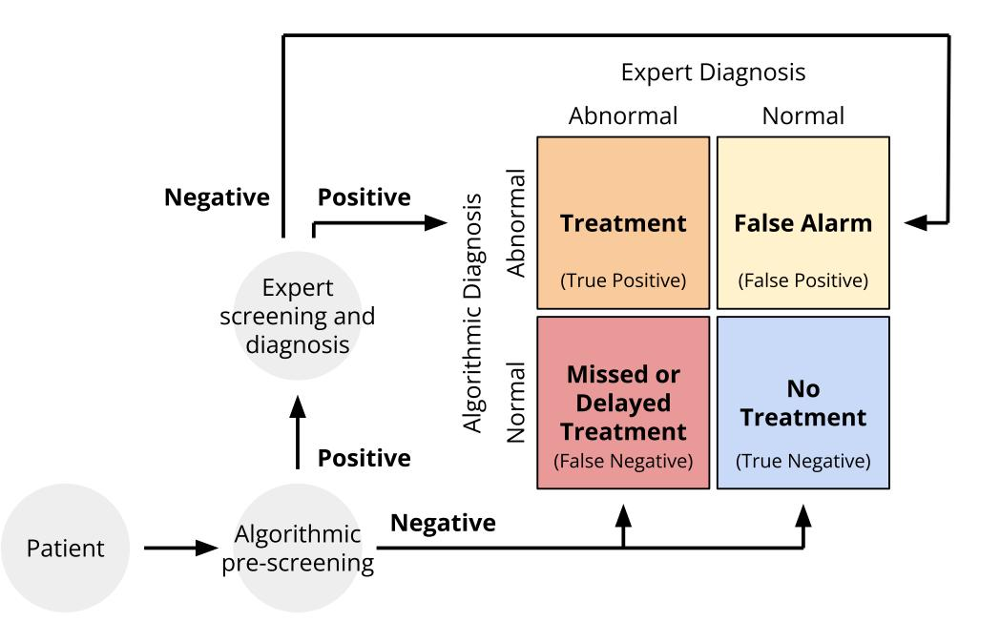
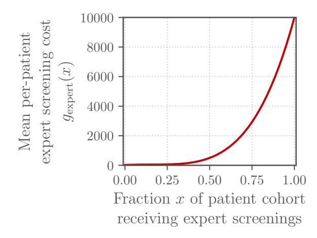
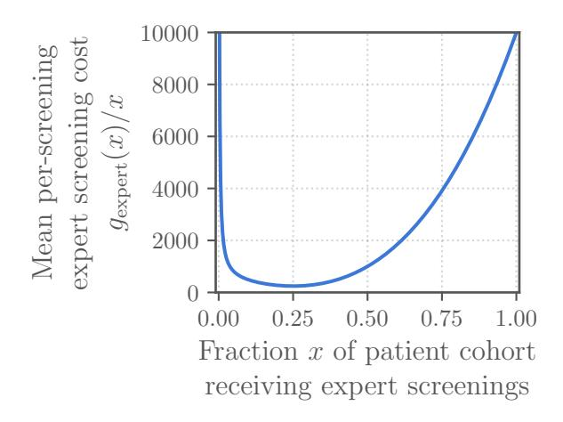

<!-- cite_key: reyna2022 -->

# Heart Murmur Detection from Phonocardiogram Recordings: The George B. Moody PhysioNet Challenge 2022

Matthew A. Reyna1 , Yashar Kiarashi1 , Andoni Elola2 , Jorge Oliveira3 , Francesco Renna4 , Annie Gu1 , Erick A. Perez Alday1 , Nadi Sadr1,5, Ashish Sharma1 , Sandra Mattos6 , Miguel T. Coimbra4 , Reza Sameni1 , Ali Bahrami Rad1 , Gari D. Clifford1,7

1Department of Biomedical Informatics, Emory University, Atlanta, GA, USA 2Department of Electronic Technology, University of the Basque Country UPV/EHU, Eibar, Gipuzkoa, Spain 3REMIT, Universidade Portucalense, Porto, Portugal 4 INESC TEC, Faculdade de Ciˆencias, Universidade do Porto, Porto, Portugal 5ResMed, Sydney, Australia 6Unidade de Cardiologia e Medicina Fetal, Real Hospital Portuguˆes, Recife, Pernambuco, Brazil 7Department of Biomedical Engineering, Emory University and the Georgia Institute of Technology, Atlanta, GA, USA E-mail: matthew.a.reyna@emory.edu

Abstract. Objective: Cardiac auscultation is an accessible diagnostic screening tool that can help to identify patients with heart murmurs for follow-up diagnostic screening and treatment, especially in resource-constrained environments. However, experts are needed to interpret the heart sound recordings, limiting the accessibility of auscultation for cardiac care. The George B. Moody PhysioNet Challenge 2022 invites teams to develop automated approaches for detecting abnormal heart function from multi-location phonocardiogram (PCG) recordings of heart sounds.

Approach: For the Challenge, we sourced 5272 PCG recordings from 1568 pediatric patients in rural Brazil. We required the Challenge participants to submit the complete code for training and running their models, improving the transparency, reproducibility, and utility of the diagnostic algorithms. We devised a cost-based evaluation metric that captures the costs of screening, treatment, and diagnostic errors, allowing us to investigate the benefits of algorithmic pre-screening and facilitate the development of more clinically relevant algorithms.

Main results: So far, over 80 teams have submitted over 600 algorithms during the course of the Challenge, representing a diversity of approaches in academia and industry. We will update this manuscript to share an analysis of the Challenge after the end of the Challenge.

Significance: The use of heart sound recordings for both heart murmur detection and clinical outcome identification allowed us to explore the potential of automated approaches to provide accessible pre-screening of less-resourced populations. The submission of working,

> open-source algorithms and the use of novel evaluation metrics supported the reproducibility, generalizability, and relevance of the researched conducted during the Challenge.

## Introduction

Cardiac auscultation via stethoscopes remains the most common and most cost-effective tool for cardiac prescreening. Despite its popularity, the technology has limited diagnostic sensitivity and accuracy [\[1\]](#page-12-0), [\[2\]](#page-12-1), as its interpretation requires many years of experience and skill, making it rather non-objective due to clinical disagreement between medical personnel [\[3\]](#page-12-2), [\[4\]](#page-12-3). Digital phonocardiography has emerged as a more objective alternative for traditional cardiac auscultation, enabling the use of algorithmic methods for heart sound analysis and diagnosis [\[5\]](#page-12-4). The phonocardiogram (PCG) is acquired by a combination of high-fidelity stethoscope front-ends and high-resolution digital sampling circuitry, which enable the registration of the PCG as a discrete-time signal.

As acoustic signals, heart sounds are mainly generated by the vibrations of cardiac valves as they open and close during the cardiac cycle, and by the blood flow turbulence within the arteries. The PCG typically captures the fundamental heart sounds during a normal cardiac cycle, namely the first heart sound (S1) that is produced by the closure of the mitral and tricuspid valves at the beginning of the systole, and the second heart sound (S2) that is produced by the closure of the aortic and pulmonary valves at the beginning of the diastole [\[6\]](#page-12-5). The interval between S1 and S2 is called the systolic phase and the interval between the S2 and the S1 of the next cardiac cycle is the diastolic phase. During these intervals, turbulent blood flow may create enough vibrations to make audible heart sounds and abnormal waveforms in the PCG, which are known as murmurs. Different kind of murmurs exist, and they are characterized by parameters such as location timing, duration, shape, intensity, and pitch. The identification and analysis of murmurs provide valuable information about cardiovascular pathologies.

Experts are needed to interpret the heart sound recordings, limiting the accessibility of auscultation for cardiac care. Learning to correctly interpret PCGs for murmur detection or to identify different pathologies requires time and broad clinical experience. Therefore, an objective interpretation of the PCG remains a difficult skill to acquire.

The 2022 George B. Moody PhysioNet Challenge (formerly the PhysioNet/Computing in Cardiology Challenge) provided an opportunity to address these issues by inviting teams to develop fully automated approaches for detecting abnormal heart function from PCG recordings in a pediatric population using multiple auscultation locations from the same patient. We asked teams to identify both heart murmurs and the clinical outcomes of a full diagnostic screening. The Challenge explores the diagnostic potential of automated approaches for interpreting PCG recordings.

## Methods

## 1. Challenge Data

The CirCor DigiScope dataset [\[7\]](#page-12-6) was used for the 2022 George B. Moody PhysioNet Challenge. The dataset consists of one or more PCG recordings from different auscultation locations on each patient's body. The dataset was collected during two screening campaigns in the state of Paraiba, Brazil, from July 2014 to August 2014 and from June 2015 to July 2015. The study protocol was approved by the 5192-Complexo Hospitalar HUOC/PROCAPE Institutional Review Board, under the request of the Real Hospital Portugues de Beneficencia em Pernambuco. A detailed description of the dataset can be found in [\[7\]](#page-12-6).

During the data collection sessions, the participants answered a socio-demographic questionnaire, followed by a clinical examination (anamnesis and physical examination), a nursing assessment (physiological measurements), and cardiac investigations (chest radiography, electrocardiogram, and echocardiogram) as appropriate. The collected data, including physical examination, auscultation, and echocardiogram, were then analyzed by an expert pediatric cardiologist. The expert could re-auscultate the patient or request further complementary tests if necessary. At the end of the session, the patient was discharged if there was no need for further investigation, i.e., no pathogenic cardiac conditions. Otherwise, the patient was either directed for a follow-up appointment or was referred to cardiac catheterization or heart surgery as appropriate.

The PCGs were recorded using an electronic auscultation device (Littmann 3200 stethoscope) from four prominent auscultation locations on the body: aortic valve, pulmonary valve, tricuspid valve, and mitral valve. However, some patients have recordings from fewer than four locations, and some have multiple recordings per location. Thus, the number of recordings, location, and duration varies between patients. For each patient, the PCGs were recorded by the same operator sequentially (not simultaneously) from different locations on the patient's body. The PCGs were then inspected for signal-quality and annotated into segments by a cardiac physiologist. The segmentation was carried out semi-automatically using the three algorithms proposed in [\[8\]](#page-12-7), [\[9\]](#page-12-8), and [\[10\]](#page-12-9) and the cardiac physiologist's judgment. The segmentation was done for the identification of the fundamental heart sounds (S1 and S2 sounds) and their corresponding boundaries. The signal quality assessment and segmentation were performed by different experts.

The murmur annotation (present, absent, and unknown) and characteristics (location, timing, shape, pitch, quality, and grade) were manually identified by a cardiac physiologist independent of available clinical notes and PCG segmentation. The cardiac physiologist inspected the PCGs by listening to the audio recordings and by visually inspecting the waveforms. The murmur annotations indicate whether the expert annotator could detect the presence or absence of a murmur in a patient from the PCG recordings or whether the

annotator was unsure about the presence or absence of a murmur. The murmur annotations were performed by a single expert.

The clinical outcome annotations indicate if the clinical outcome as diagnosed by the medical expert is normal or abnormal. The clinical expert analyzed the PCG recordings and considered all clinical notes, including patient history, physical examination, and echocardiogram report.

The Challenge dataset consists of 5272 PCG recordings from 1568 patients, divided into training, validation, and test sets. We have publicly released 60% of the data as the training set and retained the remaining 10% as the validation and 30% as the test sets. The validation and test sets are hidden and will be used to evaluate the entries of the 2022 Challenge and will be released only after the end of the Challenge.

2.1.1. Challenge Data Variables Table [1](#page-4-0) shows the available information in the training, validation, and test sets of the Challenge data.

We note that the labels may have errors, but we have used the provided labels for scoring. We also note that no ages were recorded for pregnant women. It is unclear if the pregnant women belong to the age group of the rest of the patients, or if they had a set of exclusion criteria that was different from the other patients.

## 2. Challenge Objective

We designed the Challenge to explore the potential for algorithmic pre-screening of abnormal heart function with application in resource-constrained environments. We asked the Challenge participants to design working, open-source algorithms for identifying heart murmurs and clinical outcomes from PCG recordings. For each patient encounter, each algorithm interprets the PCG recordings and/or demographic data.

2.2.1. Challenge Timeline This year's Challenge was the 23rd George B. Moody PhysioNet Challenge [\[12\]](#page-13-0). As with previous years, this year's Challenge had an unofficial phase and an official phase.

The unofficial phase (February 1, 2022 to April 8, 2022) introduced the teams to the Challenge. We publicly shared the Challenge objective, training data, example classifiers, and evaluation metrics at the beginning of the unofficial phase. We invited the teams to submit their code for evaluation, and we scored at most 5 entries from each team on the hidden validation set during the unofficial phase.

Between the unofficial phase and official phase, we took a hiatus (April 9, 2022 to April 30, 2022) to improve the Challenge in response to feedback from teams, the broader community, and our collaborators.

Table 1: Demographic, murmur, and clinical outcome information provided with the training, validation, and test sets for the Challenge data; nan values indicate unknown or missing values.

| Variable        | Short description                                 | Possible values                  | Datasets         |
|-----------------|---------------------------------------------------|----------------------------------|------------------|
| Age             | Age category                                      | Neonate, Infant, Child,          | Training,        |
|                 |                                                   | Adolescent, Young Adult, nan     | validation, test |
| Sex             | Reported sex                                      | Female, Male                     | Training,        |
|                 |                                                   |                                  | validation, test |
| Height          | Height in centimeters                             | Positive number or nan           | Training,        |
|                 |                                                   |                                  | validation, test |
| Weight          | Weight in kilograms                               | Positive number or nan           | Training,        |
|                 |                                                   |                                  | validation, test |
| Pregnancy       | Reported pregnancy status                         | True, False                      | Training,        |
| status          |                                                   |                                  | validation, test |
| Murmur          | Indicates if a murmur                             | Present, Absent, Unknown         | Training         |
|                 | is present, absent, or                            |                                  |                  |
|                 | unidentifiable for the annotator;                 |                                  |                  |
|                 | a Challenge label                                 |                                  |                  |
| Murmur          | Auscultation locations for                        | PV, TV, AV, MV, Phc, nan         | Training         |
| locations       | observed murmurs                                  | (concatenated with +)            |                  |
| Most audible    | Auscultation location where                       | PV, TV, AV, MV, Phc, nan         | Training         |
| location        | murmurs sounded most intense                      |                                  |                  |
| Systolic murmur | Timing of the murmur within                       | Early-systolic, Mid-systolic,    | Training         |
| timing          | the systolic period                               | Late-systolic, Holosystolic, nan |                  |
| Systolic murmur | Shape of the murmur in the                        | Crescendo, Decrescendo,          | Training         |
| shape           | systolic period                                   | Diamond, Plateau, nan            |                  |
| Systolic murmur | Pitch of the murmur in the                        | Low, Medium, High, nan           | Training         |
| pitch           | systolic period                                   |                                  |                  |
| Systolic murmur | Grading of the murmur in the                      | I/VI, II/VI, III/VI, nan         | Training         |
| grading         | systolic period according to the                  |                                  |                  |
| Systolic murmur | Levine scale [11] Quality of the murmur in the |                                  | Training         |
| quality         | systolic period                                   | Blowing, Harsh, Musical, nan     |                  |
| Diastolic       | Timing of the murmur within                       | Early-diastolic, Mid-diastolic,  | Training         |
| murmur timing   | the diastolic period                              | Holodiastolic, nan               |                  |
| Diastolic       | Shape of the murmur in the                        | Decrescendo, Plateau, nan        | Training         |
| murmur shape    | diastolic period                                  |                                  |                  |
| Diastolic       | Pitch of the murmur in the                        | Low, Medium, High, nan           | Training         |
| murmur pitch    | diastolic period                                  |                                  |                  |
| Diastolic       | Grading of the murmur in the                      | I/IV, II/IV, III/IV, nan         | Training         |
| murmur grading  | diastolic period                                  |                                  |                  |
| Diastolic       | Quality of the murmur in the                      | Blowing, Harsh, nan              | Training         |
| murmur quality  | diastolic period                                  |                                  |                  |
| Outcome         | Indicates normal or abnormal                      | Normal, Abnormal                 | Training         |
|                 | clinical outcome as diagnosed                     |                                  |                  |
|                 | by the medical expert; a                          |                                  |                  |
|                 | Challenge label                                   |                                  |                  |
| Campaign        | Screening campaign attended                       | CC2014, CC2015                   | Training         |
|                 | by the patient                                    |                                  |                  |
| Additional ID   | Other patient identifier for                      | Patient identifier               | Training         |
|                 | patients who attended both                        |                                  |                  |
|                 | screening campaigns                               |                                  |                  |

The official phase (May 1, 2022 to August 15, 2022) allowed the teams to refine their approaches for the Challenge. We updated the Challenge objectives, data, example classifiers, and evaluation metric at the beginning of the official phase. We again invited teams to submit their code for evaluation, and we will score at most 10 entries from each

team on the hidden validation set during the official phase.

After the end of the official phase, we will ask each team to choose a single entry from their team for evaluation on the test set. We will allow the teams to choose any successful model from the official phase, but most teams will choose their highest-scoring entry. We will only evaluate one entry from each team on the test set to prevent sequential training on the test set. The winners of the Challenge are the teams with the best scores on the test set, and we will announce the winners at the end of the Computing in Cardiology (CinC) 2022 conference.

The teams will present and defend their work at CinC 2022, and they will write four-page conference proceeding papers describing their work. We will publicly release the algorithms after the end of the Challenge and the publication of these papers.

2.2.2. Challenge Rules and Expectations While we encouraged teams to ask questions, pose concerns, and discuss the Challenge in a public forum, we prohibited the teams from discussing or sharing their work during the unofficial phase, hiatus, and official phase of the Challenge to preserve the diversity and uniqueness of the teams' approaches.

For both phases of the Challenge, we required teams to submit their code for training and running their models, including any code for processing or relabeling the data. We first ran each team's training code on the public training data to create trained models. We then ran the trained models on the hidden validation and test sets to label the recordings; we ran the trained models on the recordings sequentially to better reflect the screening process. We then scored the outputs from the models.

We allowed the teams to submit either MATLAB or Python code; other implementations were considered upon request. Participants containerized their code in Docker and submitted it by sharing private GitHub or Gitlab repositories with their code. We downloaded their code and ran it in containerized environments on Google Cloud. We described the computational architecture of these environments entries more fully in [\[13\]](#page-13-2).

Each entry had access to 8 virtual CPUs, 52 GB RAM, 50 GB local storage, and an optional NVIDIA T4 Tensor Core GPU (driver version 470.82.01) with 16 GB VRAM. We imposed a 72 hour time limit for training the models on the training set without a GPU, a 48 hour time limit for training the models on the training set with a GPU, and a 24 hour time limit for running the trained models on the validation set or test set either with or without a GPU.

To aid teams, we shared example MATLAB and Python entries. These examples used random forest classifiers with age group, sex, height, weight, pregnancy status, and the presence, mean, variance, skewness (the first four order statistics) of the numerical values in each recording as features. We did not design these example models to be competitive. Instead, we used them to provide minimal working examples of how to read the Challenge data and write the classifier outputs.

2.2.3. Challenge Evaluation To capture the focus of this year's Challenge on algorithmic pre-screening, we developed scoring metrics for each of the two Challenge tasks: detecting heart murmurs and identifying abnormal clinical outcomes from PCGs.

The murmurs are directly observable from the PCGs, but the clinical outcomes reflected a more comprehensive diagnostic screening, including the interpretation of an echocardiogram. However, despite these differences, we asked teams to perform both tasks using only PCGs and routine demographic data to explore the diagnostic potential of algorithmic approaches for interpreting PCGs.

The algorithms for both of these Challenge tasks effectively pre-screen patients for expert referral. If an algorithm infers abnormal cardiac function, i.e., the classifier outputs are murmur present, murmur unknown, or outcome abnormal, then it refers the patient to a human expert for a confirmatory diagnosis and potential treatment. If the algorithm infers normal cardiac function, i.e., if the classifier outputs are murmur absent or outcome normal, then it does not refer the patient to an expert, and the patient does not receive treatment, even if the patient has abnormal cardiac function that would have been detected by the expert who provided the annotated labels. Fig. [1](#page-7-0) illustrates algorithmic pre-screening in the larger diagnostic pipeline.

For the murmur detection task, we introduced a weighted accuracy metric that assessed the ability of an algorithm to reproduce the results of a skilled human annotator. For the clinical outcome identification task, we introduced a cost-based scoring metric that reflected the cost of human diagnostic screening as well as the costs of timely, delayed, and missed treatments. The team with the highest weighted accuracy metric won the murmur detection task, and the team with the lowest cost-based scoring metric won the clinical outcome identification task.

We formulated versions of both of these metrics for both tasks to allow for more direct comparisons; see the Appendix for the additional metrics. We also calculated several traditional evaluation metrics to provide additional context.

Cost-based scoring is controversial because healthcare costs are an imperfect proxy for health needs [\[14\]](#page-13-3), [\[15\]](#page-13-4); we reflect on this important issue in the Section [4.](#page-11-0) However, screening costs necessarily limit the ability to perform screening, especially in less-resourced environments, so we have considered the ability of algorithmic pre-screening to defray costs as an important part of improving access to cardiac screening.

Weighted Accuracy Metric We introduced a weighted accuracy metric to evaluate the murmur detection classifiers. This metric assesses the ability of these classifiers to reproduce the decisions of a physician expert. This weighted accuracy metric is similar to the traditional accuracy metric, but it assigns more weight to patients that have or potentially have murmurs than to patients that do not have murmurs. These weights reflect the rationale that, in general, a missed diagnosis is more harmful than a false alarm.

Figure 1: Screening and diagnosis pipeline for the Challenge. All patients receive algorithmic pre-screening, and patients with positive results from algorithmic pre-screening receive confirmatory expert screening and diagnosis. (i) Patients with positive results from algorithmic pre-screening and expert screening and diagnosis receive treatment; they are true positive cases. Patients with positive results from algorithmic pre-screening and negative results from expert screening and diagnosis do not receive treatment; they are false positive cases or false alarms. Patients with negative results from algorithmic prescreening who would have received positive results according to the expert annotations have missed or delayed treatment; they are false negative cases. Patients with negative results from algorithmic pre-screening who would have also received negative results from expert screening and diagnosis also do not receive treatment; they are true negative cases.

|                   |         | Murmur Expert |         |        |
|-------------------|---------|---------------|---------|--------|
|                   |         | Present       | Unknown | Absent |
|                   | Present | mPP           | mPU     | mPA    |
| Murmur Classifier | Unknown | mUP           | mUU     | mUA    |
|                   | Absent  | mAP           | mAU     | mAA    |

Table 2: Confusion matrix for murmur detection with three classes: murmur present, murmur unknown, and murmur absent. The columns are the ground truth labels from the human annotator, and the rows are the classifier outputs. Each entry of the confusion matrix provides the number of patients with each classifier output for each ground truth label.

We defined a weighted accuracy metric for the murmur detection task as

$$
a_{\text{murmur}} = \frac{5m_{\text{PP}} + 3m_{\text{UU}} + m_{\text{AA}}}{5(m_{\text{PP}} + m_{\text{UP}} + m_{\text{AP}}) + 3(m_{\text{PU}} + m_{\text{UU}} + m_{\text{AU}}) + (m_{\text{PA}} + m_{\text{UA}} + m_{\text{AA}})},\tag{1}
$$

where Table [2](#page-7-1) defines a three-by-three confusion matrix M = [mij ] for the murmur present, murmur unknown, and murmur absent classes.

The coefficients were chosen to reflect the trade-off between false positives and false negatives, where clinicians may tolerate multiple false alarms to avoid a single missed diagnosis. In this case, murmur present cases have five times the weight of murmur absent cases (and the murmur unknown cases have three times the weight of murmur absent cases) to reflect a tolerance of five false alarms for every one false positive.

Like the traditional accuracy metric, this metric only rewards algorithms for correctly classified recordings, but it provides the highest reward for correctly classifying recordings with murmurs and the lowest reward for correctly classifying recordings without murmurs, i.e., recordings that were labeled as having or not having murmurs, respectively. It provides an intermediate reward for correctly classifying recordings of unknown murmur status to reflect the difficulty and importance of indicating when the quality of a recording is not adequate for diagnosis.

We used [\(1\)](#page-8-0) to rank the Challenge algorithms for the murmur detection task. The team with the highest value of [\(1\)](#page-8-0) will win this task.

Cost-based evaluation metric We introduced a cost-based evaluation metric to evaluate the clinical outcome classifiers. This metric explores the ability of these classifiers to reduce the costs associated with diagnosing and treating patients, primarily by reducing expert screening of patients without abnormal cardiac function. We emphasize that healthcare costs are an imperfect surrogate for health needs [\[14\]](#page-13-3), [\[15\]](#page-13-4). However, these costs are a necessary consideration as part of a resource-constrained environment.

For each patient encounter, the algorithm interprets the PCG recordings and demographic data for the encounter. If an algorithm infers abnormal cardiac function, then it refers the patient to a human expert for a confirmatory diagnosis. If the expert confirms the diagnosis, then the patient receives treatment, and if the expert does not confirm the diagnosis, then the patient does not receive treatment. If the algorithm infers normal cardiac function, then it does not refer the patient to an expert, and the patient does not receive treatment, even if the patient has abnormal cardiac function that would have been detected as indicated by the annotated labels. Fig. [1](#page-7-0) illustrates algorithmic pre-screening in the larger diagnostic pipeline.

We associated each of these steps with a cost: the costs of algorithmic pre-screening, the costs of expert screening, the costs of timely treatment, and the cost of delayed or missed treatment.

|                             |          | Clinical Outcome Expert |        |
|-----------------------------|----------|-------------------------|--------|
|                             |          | Abnormal                | Normal |
|                             | Abnormal | nTP                     | nFP    |
| Clinical Outcome Classifier | Normal   | nFN                     | nTN    |

Table 3: Confusion matrix for clinical outcome detection with two classes: clinical outcome abnormal and clinical outcome normal. The columns are the ground truth labels from the human annotator, and the rows are the classifier outputs. Each entry of the confusion matrix is the number of patients with the classifier outputs for the ground truth labels.

For simplicity, we assumed that algorithmic pre-screening has a relatively small cost that depends linearly on the number of pre-screenings. We also assume that timely treatments and delayed or missed treatments have relatively large costs that, on average, depend linearly on the number of individuals. Given our focus on the ability of algorithmic pre-screening to reduce human screening of patients with normal cardiac function, we assumed that expert screening has an intermediate cost that depends non-linearly on the number of screenings as well as the infrastructure and capacity of the healthcare system[‡](#page-9-0) Screening far below the capacity of the healthcare system is inefficient and incurs a low total cost but high average cost. Screening above the capacity of the healthcare system is highly inefficient and incurs both a high average cost and a high total cost.

Therefore, we introduced the following cost-based evaluation metric for identifying clinical outcomes in this setting. We defined the total cost of diagnosis and treatment with algorithmic pre-screening as

$$
c_{\text{outcome}}^{\text{total}} = f_{\text{algorithm}}(n_{\text{patients}}) + f_{\text{expert}}(n_{\text{TP}} + n_{\text{FP}}, n_{\text{patients}}) + f_{\text{treatment}}(n_{\text{TP}}) + f_{\text{error}}(n_{\text{FN}}), (2)
$$

where Table [3](#page-9-1) defines a two-by-two confusion matrix N = [nij ] for the clinical outcome abnormal and normal classes, npatients = nTP + nFP + nFN + nTN is the total number of patients, and falgorithm, fexpert, ftreatment, ferror are defined below.

Again, for simplicity, we assumed that the costs for algorithmic pre-screening, timely treatment, and missed or late treatments were linear. We defined

$$
f_{\text{algorithm}}(s) = 10s \tag{3}
$$

as the total cost of s pre-screenings by an algorithm,

$$
f_{\text{treatment}}(s) = 10000s\tag{4}
$$

as the total cost of s treatments, and

$$
f_{\rm error}(s) = 50000s\tag{5}
$$

‡ Of course, the treatment costs should be non-linear as well for similar reasons, but non-urgent treatment is better able to utilize the capacity of the broader healthcare system.

(a) Mean per-patient expert screening cost gexpert(x), i.e., the total expert screening cost for a patient cohort divided by the number of patients in the cohort.

(b) Mean per-screening expert screening cost gexpert(x)/x, i.e., the total expert screening cost for a patient cohort divided by the number of patients in the cohort and the fraction of screenings in the cohort.

Figure 2: The expert screening cost gexpert(x) defined for the Challenge: mean cost for screening a fraction x of a patient cohort for cardiac abnormalities.

as the total cost of s missed or delayed treatments.

To capture the utility of algorithmic pre-screening, we assumed the cost for expert screening was non-linear. We defined

$$
f_{\text{expert}}(s, t) = \left(25 + 397 \frac{s}{t} - 1718 \frac{s^2}{t^2} + 11296 \frac{s^4}{t^4}\right)t\tag{6}
$$

as the total cost of s screenings by a human expert out of a population of t patients so that

$$
g_{\text{expert}}(x) = 25 + 397x - 1718x^2 + 11296x^4 \tag{7}
$$

is the mean cost of screenings by a human expert when x = s/t of the patient cohort receives expert screenings; this reparameterization of [\(6\)](#page-10-0) allows us to compare algorithms on datasets with different numbers of patients. We designed [\(6\)](#page-10-0) and [\(7\)](#page-10-1) so that the mean cost of an expert screening was lowest when only 25% of the patient cohort received expert screenings but higher when screening below and above the capacity of the system. Figure [2](#page-10-2) shows these costs across different patient cohort and screening sizes, and the Appendix provides a fuller derivation of [\(6\)](#page-10-0) and [\(7\)](#page-10-1).

To compare costs for databases with different numbers of patients, e.g., the training, validation, and test databases, we defined the mean per-patient cost of diagnosis and

treatment with algorithmic pre-screening as

$$
c_{\text{outcome}} = \frac{c_{\text{outcome}}^{\text{total}}}{n_{\text{patients}}}.\tag{8}
$$

We used [\(8\)](#page-11-1) to rank the Challenge algorithms for the murmur detection task. The team with the lowest value of [\(8\)](#page-11-1) will win this task.

## Challenge Results

We will share an analysis of the Challenge results in an updated version of this manuscript after the Challenge concludes.

We received 294 entries from over 81 teams during the unofficial phase of the Challenge. The official phase of the Challenge is currently ongoing.

## 4. Discussion

We will share a discussion of the Challenge in an updated version of this manuscript after the Challenge concludes.

## Conclusions

We will share conclusions about the Challenge in an updated version of this manuscript after the Challenge concludes.

This year's Challenge explored the potential for algorithmic pre-screening of abnormal heart function in resource-constrained environments. We asked the Challenge participants to design working, open-source algorithms for identifying heart murmurs and clinical outcomes from phonocardiogram (PCG) recordings. By reducing human screening of patients with normal cardiac function, algorithms can lower healthcare costs and increase screening capacity for patients with abnormal cardiac function.

## Acknowledgements

This research is supported by the National Institute of General Medical Sciences (NIGMS) and the National Institute of Biomedical Imaging and Bioengineering (NIBIB) under NIH grant numbers 2R01GM104987-09 and R01EB030362 respectively, the National Center for Advancing Translational Sciences of the National Institutes of Health under Award Number UL1TR002378, as well as the Gordon and Betty Moore Foundation and MathWorks under unrestricted gifts. GC has financial interests in Alivecor, LifeBell AI and Mindchild Medical. GC also holds a board position in LifeBell AI and Mindchild Medical. AE receives financial support from the Spanish Ministerio de Ciencia, Innovacion y Universidades through grant

RTI2018-101475-BI00, jointly with the Fondo Europeo de Desarrollo Regional (FEDER), and by the Basque Government through grant IT1229-19. None of the aforementioned entities influenced the design of the Challenge or provided data for the Challenge. The content of this manuscript is solely the responsibility of the authors and does not necessarily represent the official views of the above entities.

## References

- [1] D. S. Amin and B.-R. Fethi, "Features for heartbeat sound signal normal and pathological," Recent Patents on Computer Science, vol. 1, no. 1, pp. 1–8, 2008.
- [2] J. Singh and R. S. Anand, "Computer aided analysis of phonocardiogram," Journal of Medical Engineering & Technology, vol. 31, no. 5, pp. 319–323, 2007. doi: [10.1080/](https://doi.org/10.1080/03091900500282772) [03091900500282772](https://doi.org/10.1080/03091900500282772).
- [3] G. Marcus, J. Vessey, M. V. Jordan, et al., "Relationship Between Accurate Auscultation of a Clinically Useful Third Heart Sound and Level of Experience," Archives of Internal Medicine, vol. 166, no. 6, pp. 617–622, Mar. 2006, issn: 0003- 9926. doi: [10.1001/archinte.166.6.617](https://doi.org/10.1001/archinte.166.6.617).
- [4] A. A. Ishmail, S. Wing, J. Ferguson, T. A. Hutchinson, S. Magder, and K. M. Flegel, "Interobserver agreement by auscultation in the presence of a third heart sound in patients with congestive heart failure," Chest, vol. 91, no. 6, pp. 870–873, 1987, issn: 0012-3692. doi: [10.1378/chest.91.6.870](https://doi.org/10.1378/chest.91.6.870).
- [5] H. Vermarien, "Phonocardiography," Encyclopedia of medical devices and instrumentation, 2006.
- [6] M. Chizner, "Cardiac auscultation: Rediscovering the lost art," Current problems in cardiology, vol. 33, pp. 326–408, Aug. 2008. doi: [10.1016/j.cpcardiol.2008.03.003](https://doi.org/10.1016/j.cpcardiol.2008.03.003).
- [7] J. H. Oliveira, F. Renna, P. Costa, et al., "The CirCor DigiScope dataset: From murmur detection to murmur classification," IEEE Journal of Biomedical and Health Informatics, pp. 1–1, 2021. doi: [10.1109/jbhi.2021.3137048](https://doi.org/10.1109/jbhi.2021.3137048).
- [8] C. Liu, D. Springer, Q. Li, et al., "An open access database for the evaluation of heart sound algorithms," Physiological Measurement, vol. 37, no. 12, pp. 2181–2213, Nov. 2016. doi: [10.1088/0967-3334/37/12/2181](https://doi.org/10.1088/0967-3334/37/12/2181).
- [9] J. Oliveira, F. Renna, T. Mantadelis, and M. Coimbra, "Adaptive sojourn time HSMM for heart sound segmentation," IEEE Journal of Biomedical and Health Informatics, vol. 23, no. 2, pp. 642–649, Mar. 2019. doi: [10.1109/jbhi.2018.2841197](https://doi.org/10.1109/jbhi.2018.2841197).
- [10] F. Renna, J. Oliveira, and M. T. Coimbra, "Deep convolutional neural networks for heart sound segmentation," IEEE Journal of Biomedical and Health Informatics, vol. 23, no. 6, pp. 2435–2445, Nov. 2019. doi: [10.1109/jbhi.2019.2894222](https://doi.org/10.1109/jbhi.2019.2894222).

- [11] A. R. Freeman, "The clinical significance of the systolic murmur," Annals of Internal Medicine, vol. 6, no. 11, p. 1371, May 1933. doi: [10.7326/0003-4819-6-11-1371](https://doi.org/10.7326/0003-4819-6-11-1371).
- [12] A. L. Goldberger, L. A. Amaral, L. Glass, et al., "PhysioBank, PhysioToolkit, and PhysioNet: components of a new research resource for complex physiologic signals," Circulation, vol. 101, no. 23, e215–e220, 2000. doi: [10.1161/01.CIR.101.23.e215](https://doi.org/10.1161/01.CIR.101.23.e215).
- [13] M. A. Reyna, C. Josef, R. Jeter, et al., "Early prediction of sepsis from clinical data: the PhysioNet/Computing in Cardiology Challenge 2019," Critical Care Medicine, vol. 48, pp. 210–217, 2 2019. doi: [10.1097/CCM.0000000000004145](https://doi.org/10.1097/CCM.0000000000004145).
- [14] S. Mullainathan and Z. Obermeyer, "On the inequity of predicting A while hoping for B," in AEA Papers and Proceedings, vol. 111, 2021, pp. 37–42. doi: [10.1257/pandp.](https://doi.org/10.1257/pandp.20211078) [20211078](https://doi.org/10.1257/pandp.20211078).
- [15] M. A. Reyna, E. O. Nsoesie, and G. D. Clifford, "Rethinking Algorithm Performance Metrics for Artificial Intelligence in Diagnostic Medicine," JAMA, vol. 328, no. 4, pp. 329–330, Jul. 2022, issn: 0098-7484. doi: [10.1001/jama.2022.10561](https://doi.org/10.1001/jama.2022.10561).

Clinical Outcome Expert

|                   |         | Abnormal | Normal |
|-------------------|---------|----------|--------|
|                   | Present | oPA      | oPN    |
| Murmur Classifier | Unknown | oUA      | oUN    |
|                   | Absent  | oAA      | oAN    |

Table A1: Confusion matrix for murmur detection task with three classes (murmur present, murmur unknown, and murmur absent) using clinical outcomes with two classes (clinical outcome abnormal and clinical outcome normal). The columns are the ground truth labels from the human annotator, and the rows are the classifier outputs. Each entry of the confusion matrix is the number of patients with the classifier outputs for the ground truth labels.

## Appendix A. Further Challenge Evaluation

## Appendix A.1. Additional scoring metrics

We defined additional scoring metrics to allow us to make more direct comparisons between methods and tasks.

In particular, we defined a weighted accuracy metric for the clinical outcome identification task as

$$
a_{\text{outcome}} = \frac{5n_{\text{TP}} + n_{\text{TN}}}{5(n_{\text{TP}} + n_{\text{FN}}) + (n_{\text{FP}} + n_{\text{TN}})},
$$
(A.1)

where Table [3](#page-9-1) defines a two-by-two confusion matrix N = [nij ] for the clinical outcome abnormal and normal classes.

We defined the total cost of diagnosis and treatment with algorithmic pre-screening of murmurs as

$$
c_{\text{outcome}}^{\text{total}} = f_{\text{algorithm}}(n_{\text{patients}})
$$

+  $f_{\text{expert}}(o_{\text{PA}} + o_{\text{PN}} + o_{\text{UA}} + o_{\text{UN}}, n_{\text{patients}})$
+  $f_{\text{treatment}}(o_{\text{PA}} + o_{\text{UA}})$
+  $f_{\text{error}}(o_{\text{AA}}),$  (A.2)

where Table [A1](#page-14-0) defines a three-by-two confusion matrix O = [oij ] for the clinical outcome abnormal and normal classes, npatients is the total number of patients, and falgorithm, fexpert, ftreatment, ferror are defined above.

## Appendix A.2. Mathematical derivation of the cost-based scoring metric

We defined the cost of expert screening to reflect the non-linear costs associated with a limited screening capacity of healthcare systems. While few screenings incurs lower costs,

the screenings are typically more expensive on a per-screening basis because of the wasted capacity of the system. Similarly, while more screenings incur higher costs, the screenings are also typically more expensive on a per-screening basis because of the inadequate capacity of the system.

Let s be the number of expert screenings in a patient cohort of t patients, and let x = s/t be the fraction of the cohort receiving expert screenings. We defined gexpert(x) = a + bx + cx2 + dx4 as the mean expert screening cost for screening a fraction x of a cohort, and we in turn defined fexpert(s, t) = gexpert(s/t)t = at + bs + cs2 t + ds4 t 3 as the total cost for s expert screenings in a cohort of t patients. These quantity are quartic functions with four unknowns, allowing us to satisfy four criteria:

- (i) We set gexpert(0) = 25 to define a cost for maintaining the ability to perform expert screening incurs a cost, even when screening x = 0 of a cohort, i.e., screening none of the cohort.
- (ii) We set d dx gexpert(x)/x |x= 1 4 = 0 so that mean expert screening cost cost achieved its minimum when screening x = 1 4 of a cohort, which was roughly half of the prevalence rate of abnormal cases in the database,
- (iii) We set gexpert( 1 2 ) = 1000 so that the mean expert screening cost was \$1000 when screening x = 1 2 of a cohort, which is roughly the prevalence rate of abnormal cases in the database.
- (iv) We set gexpert(1) = 10000 so that the mean expert screening cost was \$10000 when screening x = 1, i.e., screening all of the cohort, which is ten times the cost of screening half of the database.

The unique coefficients that satisfy these conditions are a = 25, b = 397, c = −1718, and d = 11296.
