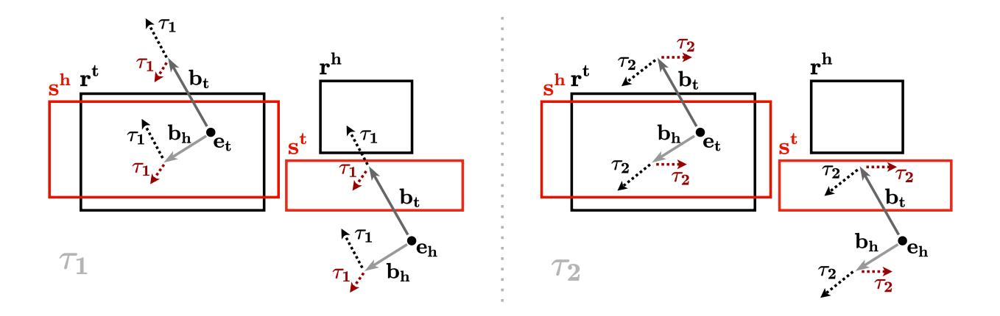

# Temporal Knowledge Graph Completion Using Box Embeddings

Johannes Messner, Ralph Abboud, ˙Ismail ˙Ilkan Ceylan

Department of Computer Science University of Oxford, UK messnerjo@gmail.com, {ralph.abboud, ismail.ceylan}@cs.ox.ac.uk

## Abstract

Knowledge graph completion is the task of inferring missing facts based on existing data in a knowledge graph. Temporal knowledge graph completion (TKGC) is an extension of this task to temporal knowledge graphs, where each fact is additionally associated with a *time stamp*. Current approaches for TKGC primarily build on existing embedding models which are developed for (static) knowledge graph completion, and extend these models to incorporate time, where the idea is to learn latent representations for entities, relations, and time stamps and then use the learned representations to predict missing facts at various time steps. In this paper, we propose BoxTE, a box embedding model for TKGC, building on the static knowledge graph embedding model BoxE. We show that BoxTE is fully expressive, and possesses strong inductive capacity in the temporal setting. We then empirically evaluate our model and show that it achieves state-of-the-art results on several TKGC benchmarks.

## TL;DR
Research on temporal knowledge graph completion using box embeddings providing insights for knowledge graph development and data integration.

## Key Insights
Provides approaches for temporal data modeling and time-based analysis in knowledge systems, contributing to temporal-first architecture design patterns for PKG implementations.

### 1 Introduction

Knowledge graphs (KGs) are sets of (binary) facts of the form r(h, t), where h and t represent *entities*, and r represents a *relation* that holds between these entities. KGs play an increasingly prominent role in *representing*, *storing*, and *processing* information. KGs such as YAGO [[1]](#ref-1) (Mahdisoltani, Biega, and Suchanek 2015), Knowledge Vault [[2]](#ref-2) (Dong et al. 2014), Freebase [[3]](#ref-3) (Bollacker, Cook, and Tufts 2007) and NELL [[4]](#ref-4) (Mitchell et al. 2018) store hundreds of millions of facts, and are key drivers for downstream tasks, such as *question answering* [[5]](#ref-5) (Bordes, Chopra, and Weston 2014), *information retrieval* [[6]](#ref-6) (Xiong, Power, and Callan 2017), and *recommender systems* [[7]](#ref-7) (Wang et al. 2018).

Notably, most KGs are inherently *incomplete*, which negatively affects their use in downstream applications. This has motivated a large body of work for automatically inferring missing facts, a task known as *knowledge graph completion* (KGC). One prominent approach for KGC is based on KG embedding models, where the idea is to learn embeddings for entities and relations through training over known facts, and subsequently use the learned embeddings to compute plausibility scores for all possible facts [[8]](#ref-8) (Bordes et al. 2013).

Standard KG embedding models, however, operate under the assumption that the input KG is *static*, i.e., the ground truth of a fact is independent of time. This assumption is not always realistic, as, e.g., a person living in a location could move to a different location, invalidating the associated fact in the future. Indeed, many real-world KGs include temporal information for their facts, most commonly in the form of time stamps, indicating *when* the fact holds [[9]](#ref-9) (Kazemi et al. 2020). Specifically, a *temporal (binary) fact* is a fact of the form r(h, t|τ ), where h and t represent *entities*, τ is a *time stamp*, and r represents a *relation* that holds between these entities at the time specified by τ . A *temporal knowledge graph* (TKG) is then a (finite) set of temporal facts.

The focus of this work is on *temporal knowledge graph completion* (TKGC) which is the task of inferring missing temporal facts from a TKG. The main challenge in TKGC is to additionally learn embeddings for time stamps, such that embedding models perform scoring jointly based on relation, entity and time stamp embeddings. This perspective has led to the development of several embedding models, building on static embedding models [[10]](#ref-10); [[11]](#ref-11) (Leblay and Chekol 2018; Lacroix, Obozinski, and Usunier 2020), or having dedicated neural architectures [[12]](#ref-12); [[13]](#ref-13) (Wu et al. 2020; Garc´ıa-Duran, Du- ´ manciˇ c, and Niepert 2018), to appropriately represent tem- ´ poral information. However, no current embedding model, to our knowledge, studies TKGC from the perspective of capturing *temporal inference patterns* despite their prevalence in real-world data [[14]](#ref-14) (Toutanova and Chen 2015).

In this paper, we propose BoxTE, a box embedding model for TKGC. BoxTE builds on the static KG embedding model BoxE [[15]](#ref-15) (Abboud et al. 2020), and extends it with dedicated time embeddings, allowing to flexibly represent temporal information. In BoxTE, time embeddings are unique for each time point, but they are specific for every relation, which yields a very flexible and powerful representation. Our contibutions are manifold. We first show that BoxTE is fully expressive, and has strong inductive capacity, capturing, e.g., a rich class of *rigid* inference patterns, and *cross-time* inference patterns. Our study presents the first thorough analysis of inductive capacity in the context of TKGC. Empirically, we conduct a detailed experimental evaluation, and show that BoxTE achieves state-of-the-art performance on several TKGC benchmarks, even with a limited number of parameters.

The full version of this work, including all proofs and ex-

Copyright © 2022, Association for the Advancement of Artificial Intelligence (www.aaai.org). All rights reserved.

perimental details, is available on arXiv [[16]](#ref-16) (Messner, Abboud, and Ceylan 2021). This version additionally includes a dedicated ablation study in its appendix, where we validate the BoxTE temporal mechanism by comparing with alternate model variations, inspired by existing literature, and show the strength of our proposal.

## 2 Temporal Knowledge Graph Completion

In what follows, we consider a *relational vocabulary*, which consists of a finite set E of *entities*, and a finite set R of *relations*. We additionally consider a finite set of *time stamps* T. We denote *static binary facts* as r(h, t), and *temporal binary facts* as r(h, t|τ ), where h, t ∈ E are entities, r ∈ R is a binary relation, and τ ∈ T is a time stamp. Temporal facts are also referred as *quadruples*; and, for a temporal fact r(h, t|τ ), h is referred to as the *head entity* and t as the *tail entity*, a convention inherited from static binary facts.

A *knowledge graph* (KG) G consists of a finite set of binary facts over (E, R); or equivalently, a KG is a multi-labeled graph, where the nodes correspond to entities, and labels correspond to relations. A *temporal knowledge graph* (TKG) G consists of a finite set of temporal binary facts over (E, R, T). Given a TKG G, *temporal knowledge graph completion* (TKGC) is the task of predicting new, unseen facts over (E, R, T) based on existing facts in G.

Typically, TKGC models define a *scoring function* for temporal facts, and are optimized to score true facts in G higher than corrupted, *negatively sampled* facts. This negative sampling produces *corrupted facts* from a true fact r(h, t|τ ) from G by replacing either h or t with a random entity h^0^ != h (resp., t^0^ != t). Empirically, TKGC models are evaluated by scoring true facts from the TKG test set, and then comparing with scores for all possible corrupted facts not appearing in the training, validation, or test set. Using all scores, standard metrics [[8]](#ref-8) (Bordes et al. 2013) are then computed, and these include mean rank (MR), the average rank of facts against their corrupted counterparts, mean reciprocal rank (MRR), their average inverse rank (i.e., 1/rank), and Hits@K, the proportion of facts with rank at most K.

Conceptually, TKGC models are characterized by their *expressiveness* and *inductive capacity*. More specifically, a model is *fully expressive* if, for any disjoint sets of *true* and *false* facts, it admits a configuration that accurately classifies all facts. On the other hand, *inductive capacity* describes the *inference patterns* that a model can learn and capture. Example inference patterns include relation symmetry, hierarchy and mutual exclusion. Both expressiveness and inductive capacity are key for TKGC, as the former enables fitting the input TKG, and the latter offers a strong inductive bias which improves model generalization.

### 3 Related Work

Knowledge graph embedding models. Knowledge graph embedding (KGE) models represent KG entities and relations using *embeddings*, which are learned from data to compute scores for all possible KG facts. KGE models can broadly be classified into translational, bilinear, and neural models. Translational models, such as TransE [[8]](#ref-8) (Bordes et al. 2013) and RotatE [[17]](#ref-17) (Sun et al. 2019), represent entities as points in a low-dimensional space, relations as translations or rotations in this space, and score binary facts based on the distance between the relation-translated head embedding and the tail embedding. A variation on this approach is spatio-translational models, such as BoxE [[15]](#ref-15) (Abboud et al. 2020), where fact correctness depends on *absolute* representation position in the embedding space. Bilinear models, such as RESCAL [[18]](#ref-18) (Nickel, Tresp, and Kriegel 2011), TuckER [[19]](#ref-19) (Balazevic, Allen, and Hospedales 2019) and ComplEx [[20]](#ref-20) (Trouillon et al. 2016) are based on *tensor factorization*: they embed entities as vectors, and relations as matrices or tensors, such that the bilinear product between these embeddings yields fact scores. Finally, neural models, such as rGCN [[21]](#ref-21) (Schlichtkrull et al. 2018) and ConvE [[22]](#ref-22) (Dettmers et al. 2018) use a neural architecture to perform scoring over KG embeddings. KGE models have widely been investigated in recent years, but these models assume that facts are static, and thus do not incorporate temporal information.

Temporal knowledge graph embedding models. Analogously to KGE models, temporal knowledge graph embedding (TKGE) models use embeddings to represent entities, relations, and time stamps in a TKG, and subsequently perform fact scoring. Most TKGE models hence build on existing KGE models. For instance, TTransE [[10]](#ref-10) (Leblay and Chekol 2018) extends TransE, and encodes time stamps as translations, analogously to relations, such that these translations additionally move head representations in the embedding space. ChronoR [[23]](#ref-23) (Sadeghian et al. 2021) builds on RotatE, and represents time-relation pairs with rotation and scaling in the embedding space. Concretely, relation and time stamp representations are concatenated to yield an overall rotation vector applied on entity representations. Furthermore, TComplEx and TNTComplEx [[11]](#ref-11) (Lacroix, Obozinski, and Usunier 2020) are based on ComplEx, and analogously factorize the input TKGC, which both models represent as a fourth-order tensor. TComplEx applies this factorization directly, whereas TNTComplEx divides this factorization into a temporal and a non-temporal component.

Other proposals include TKGE models which initially process temporal information, and subsequently pass the resulting time-conditioned representation to a static KGE model. For example, TeRo [[24]](#ref-24) (Xu et al. 2020) represents time as a rotation in complex vector space that applies on entity embeddings, following which the TransE scoring mechanism applies. HyTE [[25]](#ref-25) (Dasgupta, Ray, and Talukdar 2018) represents each time stamp as a learnable hyper-plane in d-dimensional space, and then projects entity and relation embeddings into this hyper-plane and applies the TransE scoring function on the projections. Diachronic embeddings [[26]](#ref-26) (Goel et al. 2020) map entity and relation embeddings, paired with temporal information, into a KGE model space, thus defining a framework yielding specific models such as DE-TransE and DE-SimplE.

Finally, dedicated neural architectures are used to exploit the sequential structure inherent in time, and to leverage the graph structure present in temporal knowledge graphs. Recurrent neural networks (RNNs) [[13]](#ref-13) (Garc´ıa-Duran, Duman ´ ciˇ c,´ and Niepert 2018) are used to model the changes in relations over time, thereby encoding the sequential nature of time. More recently, *TeMP* [[12]](#ref-12) (Wu et al. 2020) is proposed, which leverages message passing graph neural networks (MPNNs) to learn structure-based entity representations at every time stamp, and then aggregates representations across all time stamps using an encoder, yielding the models TeMP-GRU (gated recurrent unit encoder) and TeMP-SA (self-attention encoder). Similarly to other models, the final entity representations can subsequently be used with a static KGE model, e.g., TransE.

### 4 A Temporal Box Embedding Model

In this section, we introduce BoxTE, a box embedding model for temporal knowledge graph completion. BoxTE builds on the static BoxE model [[15]](#ref-15) (Abboud et al. 2020), and extends it with a *temporal representation*, which allows to additionally capture inference patterns *across time* and model certain temporal relational information. We first briefly recall BoxE, and then present BoxTE.

### The Box Embedding Model BoxE

BoxE [[15]](#ref-15) (Abboud et al. 2020) is a spatio-translational knowledge base completion model that can predict facts across relations of arbitrary arity. For our purposes, we only present BoxE restricted to the binary setting.

Representation. In BoxE, every entity h ∈ E is represented by two vectors, a *base position* vector e^h^ ∈ R^d^, and a *translational bump* vector b^h^ ∈ R^d^, which translates the entity that co-occurs in a fact with h. For a binary fact r(h, t), the *final embeddings* of the head entity h and the tail entity t are respectively given as:

$$
e_h^{r(h,t)} = e_h + b_t, \qquad \qquad e_t^{r(h,t)} = e_t + b_h.
$$

BoxE represents every binary relation r with two ddimensional boxes: a head box r^h^, and a tail box r^t^. Semantically, a fact r(h, t) is considered true if final entity representations for h and t appear in their corresponding boxes:

$$
e_h^{r(h,t)} \in r^h, \qquad e_t^{r(h,t)} \in r^t.
$$

Scoring. BoxE scoring function for a true fact r(h, t) encourages box membership, and is defined as:

$$
\texttt{score}(r(h,t)) = \left\| \delta(e_h^{r(h,t)}, r^h) \right\|_x + \left\| \delta(e_t^{r(h,t)}, r^t) \right\|_x,
$$

where δ intuitively computes the distance between a point and a box, and x indicates the L-x norm.

Properties. BoxE has several desirable properties. First, it is fully expressive. Second, it captures a wide array of inference patterns, and thus has strong inductive capacity. For more details and illustrations, we refer the reader to the original paper [[15]](#ref-15) (Abboud et al. 2020).

### The Temporal Box Embedding Model BoxTE

We now introduce BoxTE, a box embedding model for temporal knowledge graph completion. At a high level, BoxTE extends BoxE with *time bumps* to represent time stamps in an input knowledge graph, such that these time bumps additionally translate final entity representations. However, unlike entity bumps, time bumps are *not* standard learnable embeddings, but are *induced* by the *relation* of a given target fact, based on a set of *time stamp embeddings*.

Representation. In addition to entity and relation representations, BoxTE defines, (i) for every time stamp τ ∈ T, a set of k d-dimensional embeddings, represented by a matrix K^τ^ ∈ R^k×d^, and (ii) for every relation r, a k-dimensional scalar vector α^r^. Then, for every time stamp τ ∈ T and relation r ∈ R, a corresponding *time bump* is given by:

$$
\boldsymbol{\tau}^{\boldsymbol{r}}=\boldsymbol{\alpha}^{\boldsymbol{r}}\mathbf{K}^{\tau}
$$

For a temporal fact r(h, t|τ ), the *final entity representations* for h and t are given as:

$$
e_h^{r(h,t|\tau)} = e_h + b_t + \tau^r, \quad e_t^{r(h,t|\tau)} = e_t + b_h + \tau^r.
$$

Scoring is then performed analogously to BoxE. Intuitively, time bumps produce distinct final embeddings at every time stamp. However, within this time stamp, every relation also induces potentially distinct entity representations. In particular, time bumps induce distinct final embeddings for h and t for facts r(h, t|τ ) and s(h, t|τ ), due to the distinct scalars of relations r and s, respectively. Therefore, time bumps in BoxTE represent *relation-specific temporal dynamics* by learning appropriate scalars α^r^.

The role of relation-specific representation. BoxTE defines k embeddings per time stamp τ (via the matrix K^τ^) and k scalars per relation r (the vector α^r^), which it linearly combines to compute time bumps. This allows individual relations to learn *distinct* temporal behaviors, while maintaining *information sharing*. To illustrate this, we consider two extreme scenarios. On one hand, if k = 1, then relations can only vary the *magnitude* of time bumps, which is restrictive. On the other hand, if relations are assigned their own learnable time bumps (k = |R|, α^r^ is a one-hot encoding of r), then the model is overparametrized, and time bumps do not share parameters. Therefore, the current setup provides a trade-off using the hyper-parameter k, supporting both representational flexibility and efficient parameter sharing.

Illustrating the model. We illustrate BoxTE with an example, shown in Figure 1. In this example, and throughout the paper, we fix T = {τ1, ..., τ^|T|^} and refer to individual time stamps as τ^i^, to reflect natural temporal ordering.

Example 4.1. *Consider the following temporal knowledge graph* G = {r(h, t|τ1), s(t, h|τ1), s(t, h|τ2)}*, defined over* E = {h, t}*,* R = {r, s}*, and* T = {τ1, τ2}*. The BoxTE configurations at time stamps*τ^1^* and*τ^2^* are shown on the left and right of Figure 1, respectively. The relations*r*and*s*are color coded with black and red, respectively.*

**Observe that the fact:** r(h, t)*is true in time stamp* τ1*, but false at time stamp* τ2*, while the fact*s(t, h)*remains true for both time stamps. In more detail, BoxTE assigns larger magnitude time bumps*τ^r^1^* and*τ^r^2^* for the relation* r*. In turn,*τ^r^1^* makes*r(h, t|τ1)*true, as this bump moves the final representation of*h*into* r^h^*, and*τ^r^2^* makes*r(h, t|τ2)*false, by bumping this representation away from* r^h^*. By contrast, for 
<!-- Image Description: The image displays two diagrams illustrating spatial transformations (τ1 and τ2) on a pair of rectangular objects. Each diagram shows a "before" and "after" state of the objects and their relative positions, represented by labeled vectors indicating translations (τ1, τ2) along the x and y axes. The red rectangles depict the object's bounding box before and after the transformation. The purpose is to visually demonstrate the effects of the transformations. -->

**Figure 1:** A sample BoxTE configuration for the TKG G at time stamps τ^1^ (left) and τ^2^ (right). Time bumps τ^r^1^, τ^r^2^, τ^s^1^ and τ^s^2^ are computed as τ^r^1^ = α^r^K^τ^1^^, τ^r^2^ = α^r^K^τ^2^^, τ^s^1^ = α^s^K^τ^1^^, and τ^s^2^ = α^s^K^τ^2^^, respectively, and represented by dotted arrows. Relation r and corresponding time bumps τ^r^1^, τ^r^2^ are color coded with black, whereas the relation s, and the corresponding time bumps τ^s^1^, τ^s^2^ are color coded in red. For all time bumps, relation superscripts are dropped in the figure for better visibility.
*the relation* s*,*τ^s^1^* and*τ^s^2^* are smaller, and do not ultimately affect the correctness of the fact*s(t, h)*over time. As all time bumps are computed from the same matrices*K^τ^1^* and*K^τ^2^*, this implies that BoxTE learns a smaller-norm*α^s^*, reflecting the temporal stability of relation* s*.*

### 5 Model Properties

We now study the representation power and inductive capacity of BoxTE. In particular, we show that BoxTE is fully expressive and extends the inductive capacity of BoxE to capture inference patterns *across time*.

### Full Expressiveness

We first show that BoxTE is fully expressive:

Theorem 5.1. *BoxTE is a fully expressive model for temporal knowledge graphs with the embedding dimensionality*d*of entities, relations, bumps, and time bumps set to* d = min(|R| |T| |E| , |R| |E|^2^)*.* Importantly, this result already holds for the special case where k = 1 and α^r^ = 1, ∀r ∈ R, i.e., for time bumps defined as relation-independent learnable embeddings.

The full proof of this result can be found in the extended version. Briefly, the proof verifies two lemmas, corresponding to the |R||T||E| and |R||E|^2^ bounds respectively, by providing two BoxTE constructions. For the former lemma, the construction builds on the original BoxE full expressiveness proof [[15]](#ref-15) (Abboud et al. 2020), as bumps are used to make a given fact false without affecting other facts. However, this proof additionally relies on time bumps to make a temporal fact r(h, t|τi) false without affecting the correctness of facts of the form r(h, t|τ^j^), where j != i. For the latter lemma, the construction starts from a static BoxE configuration, and uses time bumps to make temporal facts true, while using relation boxes to maintain the correctness and falsehood of other facts. Finally, we note that this result is only a *worstcase* bound that is only tight when all KG facts are independent (i.e., random). In real-world applications, much smaller dimensionalities are sufficient, as we will later show in our experimental evaluation.

### Inference Patterns

When studying inductive capacity, we say a model captures an inference pattern if it admits a set of parameters *exactly* and *exclusively* satisfying the pattern, following BoxE [[15]](#ref-15) (Abboud et al. 2020).

Rigid inference patterns and relations. BoxTE inherits the inductive capacity of BoxE in the static setting, where each pattern holds at *all* time stamps. We refer to such patterns as *rigid inference patterns*, as, for example, the rule:

$$
\forall \tau_i, \tau_j \in \mathbf{T} : (\forall x, y \; r_1(x, y | \tau_i) \Rightarrow r_2(x, y | \tau_j))
$$

specifies that the relation r^1^ is subsumed by the relation r^2^ regardless of the time stamps we consider, and thus represents a rigid property. While we quantify over given time stamps T, it is worthwhile noting that rigidity holds beyond known time stamps (i.e, the property extrapolates).

Rigid inference patterns can be captured in BoxTE, as standard BoxE can be emulated by setting identical (or zerovalued) relation scalars, i.e., ∀r, s ∈ R, α^r^ = α^s^. Hence, BoxTE captures any inference pattern, and even rule language, captured by BoxE, in this sense.

Additionally, BoxTE can capture rigid relations, i.e., relations that do not vary with time, defined as:

$$
\forall x, y \ (\forall \tau \in \mathbf{T} : r(x, y|\tau)) \lor (\forall \tau \in \mathbf{T} : \neg r(x, y|\tau))
$$

This essentially implies that a relation r is static over time, and corresponds to the parametrization α^r^ = 0.

Cross-time inference patterns. In the temporal setting, a more interesting case is the study of inference patterns *across specific time stamps*. For example, we may be interested in capturing the pattern for some fixed τ1, τ2:

$$
\forall x, y \; r_1(x, y | \tau_1) \Rightarrow r_2(x, y | \tau_2),
$$

Cross-time inference patterns

| Pattern | Description |
|---|---|
| Inversion | r1(x, y|τ1) ⇔ r2(y, x|τ2) |
| Hierarchy | r1(x, y|τ1) ⇒ r2(x, y|τ2) |
| Intersection | r1(x, y|τ1) ∧ r2(x, y|τ2) ⇒ r3(x, y|τ3) |
| Composition | r1(x, y|τ1) ∧ r2(y, z|τ2) ⇒ r3(x, z|τ3) |
| Mutual exclusion | r1(x, y|τ1) ∧ r2(x, y|τ2) ⇒ ⊥ |

**Table 1:** Cross-time inference patterns, where we omit universal quantification over variables. BoxTE captures all these patterns, but composition. Fixed-time inference patterns are the special case where the time stamps coincide.

which requires r^1^ at τ^1^ to be subsumed in r^2^ at τ2, without any implications on the state of these relations on other time stamps. The list of such cross-time inference patterns is provided in Table 1. BoxTE captures all these cross-time inference patterns, but composition. To study cross-time patterns, we define, for a time stamp τ and relation r, the timeinduced relation head box r^h|τ^ and the time-induced relation tail box r^t|τ^ as:

$$
r^{\bm h|\bm\tau} = r^{\bm h} - \bm \tau^{\bm r}, \qquad \quad r^{\bm t|\bm\tau} = r^{\bm t} - \bm \tau^{\bm r}
$$

.

.

Intuitively, time-induced relation boxes offer an alternative, but equivalent, perspective to BoxTE representations, where time bumps apply to *relation boxes* and translate them in the opposite direction. To show this equivalence, we recall the correctness criteria for BoxTE for a given fact r(h, t|τ ):

$$
e_h^{r(h,t|\tau)}\in r^h, \qquad \qquad e_t^{r(h,t|\tau)}\in r^t.
$$

Subtracting τ^r^ from both sides, respectively, yields:

$$
e_h^{r(h,t)} \in r^{h|\tau}, \qquad \qquad e_t^{r(h,t)} \in r^{t|\tau}
$$

Hence, BoxTE can be interpreted as inducing, at every time stamp, a *translated* set of relation boxes, which can then be compared with static final entity embeddings to verify temporal fact correctness. Therefore, cross-time inference patterns can be studied by comparing time-induced relation boxes, analogously to standard BoxE. In particular, the hierarchy pattern is captured with the parametrization:

$$
r_1^{h|\tau_1}\subset r_2^{h|\tau_2},\qquad r_1^{t|\tau_1}\subset r_2^{t|\tau_2},
$$

where ⊂ denotes box containment. The *intersection* pattern is captured by setting:

$$
r_3^{h|\tau_3}=r_1^{h|\tau_1}\cap r_2^{h|\tau_2}, \qquad r_3^{t|\tau_3}=r_1^{t|\tau_1}\cap r_2^{t|\tau_2},
$$

where ∩ denotes box intersection. Mutual exclusion and inversion hold by analogous arguments. Note that capturing inference patterns at a *fixed* time stamp is a special case.

By capturing cross-time inference patterns, BoxTE can model the interplay between relations across time. For instance, BoxTE can represent that any two entities engaging in formal negotiations at time stamp τ^1^ sign a formal agreement at time stamp τ2. It can also model relation behavior at single time stamp granularity, and thus capture patterns specifically at times when they hold, while learning appropriate temporal relation-specific behaviors. By contrast, existing models have shortcomings when combining inference

| | ICEWS14 | ICEWS05-15 | GDELT |
|:------------|:----------|:-----------|:----------|
| E | 7,128 | 10,488 | 500 |
| R | 230 | 251 | 20 |
| T | 365 | 4017 | 366 |
| Gtrain | 72,826 | 386,962 | 2,735,685 |
| Gvalid | 8,963 | 46,092 | 341,961 |
| Gtest | 8,941 | 46,275 | 341,961 |
| G | 90,730 | 479,329 | 3,419,607 |
| Timespan | 1 year | 11 years | 1 year |
| Granularity | Daily | Daily | Daily |

**Table 2:** TKGC datasets with dataset statistics

patterns and time modeling. For instance, TTransE can only capture rigid inverse relations if either the relation translation is set to 0, or if the time translation is set to 0, effectively eliminating the temporal component of the model.

### 6 Experiments

In this section, we evaluate BoxTE on TKG benchmarks ICEWS14, ICEWS15 [[13]](#ref-13) (Garc´ıa-Duran, Duman ´ ciˇ c, and ´ Niepert 2018), and GDELT [[27]](#ref-27) (Leetaru and Schrodt 2013). We run experiments both in the standard temporal graph completion setting, and with the recently proposed boundedparameter setting [[11]](#ref-11) (Lacroix, Obozinski, and Usunier 2020). We first present these datasets, and then report setup and results for both aforementioned experiments.

In addition to these two experiments, we study the interpretability of BoxTE using a subset of YAGO [[28]](#ref-28) (Suchanek, Kasneci, and Weikum 2007), perform an ablation study on BoxTE with different model variations, and conduct a robustness analysis relative to embedding dimensionality. These additional experiments can be found in the appendix of the full paper.

Datasets. We briefly present ICEWS14, ICEWS5-15, and GDELT, and report their statistics in Table 2. *ICEWS14* and *ICEWS5-15* [[13]](#ref-13) (Garc´ıa-Duran, Duman ´ ciˇ c, and Niepert 2018) ´ are both subsets of the *Integrated Crisis Early Warning System (ICEWS)* dataset [[29]](#ref-29) (Boschee et al. 2015), which stores temporal socio-political facts starting from 1995. More specifically, ICEWS14 includes facts from 2014 involving frequently occurring entities, and ICEWS5-15 includes analogous facts between 2005 and 2015 inclusive. By design, ICEWS datasets are limited in their temporal patterns, as geo-political events, e.g., negotiations, visits, are sparse and largely temporally uncorrelated across distinct entities.
**GDELT:** is a subset of the larger *Global Database of Events, Language, and Tone* (GDELT) TKG [[27]](#ref-27) (Leetaru and Schrodt 2013), which stores facts about human behavior starting from 1979. GDELT contains facts with daily time stamps between April 1, 2015 and March 31, 2016 inclusive, and only includes facts involving the 500 most frequent entities and 20 most common relations. Unlike ICEWS, GDELT is dense (~2.7 million facts for 500 entities, 20 relations), includes rich temporal patterns, and captures a diverse range of relationships with complicated temporal dynamics.

| Model | ICEWS14 | | | | | ICEWS5-15 | | | | | GDELT | | | | |
|:------------|:----------|:-----|:-----|:-----|:-----|:----------|:-----|:-----|:-----|:-----|:--------|:-----|:-----|:-----|:-----|
| | MR | MRR | H@1 | H@3 | H@10 | MR | MRR | H@1 | H@3 | H@10 | MR | MRR | H@1 | H@3 | H@10 |
| TTransE | - | .255 | .074 | - | .601 | - | .271 | .084 | - | .616 | - | .115 | 0.0 | .160 | .318 |
| DE-SimplE | - | .526 | .418 | .592 | .725 | - | .513 | .392 | .578 | .748 | - | .230 | .141 | .248 | .403 |
| TA-DistMult | - | .477 | .363 | - | .686 | - | .474 | .346 | - | .728 | - | .206 | .124 | .219 | .365 |
| ChronoR(a) | - | .594 | .496 | .654 | .773 | - | .684 | .611 | .730 | .821 | - | - | - | - | - |
| ChronoR(b) | - | .625 | .547 | .669 | .773 | - | .675 | .596 | .723 | .820 | - | - | - | - | - |
| TComplEx | - | .610 | - | - | - | - | .660 | - | - | - | - | - | - | - | - |
| TNTComplEx | - | .620 | .520 | .660 | .760 | - | .670 | .590 | .710 | .810 | - | - | - | - | - |
| TeLM | - | .625 | .545 | .673 | .774 | - | .678 | .599 | .728 | .823 | - | - | - | - | - |
| TeMP-SA | - | .607 | .484 | .684 | .840 | - | .680 | .553 | .769 | .913 | - | .232 | .152 | .245 | .377 |
| TeMP-GRU | - | .601 | .478 | .681 | .825 | - | .691 | .566 | .782 | .917 | - | .275 | .191 | .297 | .437 |
| BoxTE (k=2) | 161 | .615 | .532 | .667 | .767 | 98 | .664 | .576 | .720 | .822 | 48 | .339 | .251 | .366 | .507 |
| BoxTE (k=3) | 162 | .614 | .530 | .668 | .765 | 101 | .666 | .582 | .719 | .820 | 49 | .344 | .259 | .369 | .507 |
| BoxTE (k=5) | 160 | .613 | .528 | .664 | .763 | 96 | .667 | .582 | .719 | .820 | 50 | .352 | .269 | .377 | .511 |

**Table 3:** Temporal knowledge graph completion results for BoxTE on ICEWS14, ICEWS5-15, and GDELT. Results for competing models are the best reported from their respective papers, which are referenced in Section 3.

### Temporal Knowledge Graph Completion

Experimental setup. In this experiment, we train BoxTE on all three benchmark datasets, report test set performance for the best validation setup and compare against baseline models for TKGC. More specifically, we evaluate BoxTE using mean rank (MR), mean reciprocal rank (MRR), and Hits@{1,3,10}. We experiment with k values in the set {2, 3, 5}, and use validation to tune embedding dimensionality d, training batch size, and the number of negative samples. We additionally conduct experiments using the temporal smoothness regularizer from TNTComplEx [[11]](#ref-11) (Lacroix, Obozinski, and Usunier 2020), and also consider factorizations of time embeddings to encourage parameter sharing. Finally, we train BoxTE with cross-entropy loss, and use the Adam optimizer [[30]](#ref-30) (Kingma and Ba 2015) (learning rate 10^-3^). Full details and explanations about hyper-parameter setup are provided in the appendix of the full version.

Results. The empirical results for the standard TKGC setting can be found in Table 3. We observe that BoxTE achieves state-of-the art performance on GDELT, comfortably surpassing TeMP [[12]](#ref-12) (Wu et al. 2020) in terms of MRR. Furthermore, BoxTE also performs strongly on ICEWS14, and ICEWS15. On ICEWS14, BoxTE also outperforms TeMP, and is competitive with TNTComplEx and ChronoR. This trend also carries to ICEWS15, where BoxTE remains strong despite the sparsity of the dataset.

These results are encouraging, particularly given the difficulty of GDELT. Indeed, GDELT involves significant temporal variability: some facts persist across multiple consecutive time stamps, whereas others are momentary and sparse. Hence, GDELT requires strong temporal inductive capacity. In fact, most TKGC models fail to beat the simple rulebased system TED [[12]](#ref-12) (Wu et al. 2020) on GDELT, further highlighting the prevalence of temporal patterns in this dataset. Hence, the very strong performance of BoxTE suggests that the model captures temporal patterns, and exploits this information to outperform existing models.

On the other hand, both ICEWS datasets offer limited temporal information. Indeed, the relations in these datasets are rather sparse, and typically encode one-time patterns with limited, if any, regularity, e.g., official visits, negotiations, statements. Hence, ICEWS datasets are substantially less temporally rich and variable, instead relying more on entity-driven predictions. This is further highlighted by the fact that the same TKGC models performing poorly on GDELT now substantially outperform TED on ICEWS14 and ICEWS5-15 [[12]](#ref-12) (Wu et al. 2020). Hence, both ICEWS datasets include few temporal patterns for BoxTE to capture, and this substantially reduces the inductive advantage of this model relative to its competitors.

In terms of performance relative to k, BoxTE performs best with k = 2 on ICEWS14, whereas the optimal k value is 5 for both ICEWS5-15 and GDELT. This may seem unintuitive, especially given the large similarity between both ICEWS datasets, but this can be attributed to the significantly larger number of time steps in ICEWS5-15. Indeed, ICEWS5-15 includes 4017 time stamps, whereas ICEWS14 only includes 365. Thus, more flexibility is needed to learn sufficiently distinct temporal behaviors across these time stamps, and this aligns with our intuition about the advantages of higher k. GDELT results also highlight the importance of higher k, as they confirm the need for more flexibility to fit the rich set of facts it provides.

Finally, we note that BoxTE is robust when training on all benchmarks, as it maintains strong performance even when not supplemented with temporal smoothness regularization. By contrast, TNTComplEx and ChronoR suffer significantly without regularization. This further highlights the inductive capacity of BoxTE, which can autonomously learn temporal properties from data, and suggests that this model is a strong, natural choice for applications on novel datasets where such regularizations are not known, or are not compatible with the data. We discuss this experiment in more detail as an ablation study in the appendix of the full paper.

| Model | ICEWS14 | | | | | ICEWS5-15 | | | | | GDELT | | | | |
|:------------|:----------|:-----|:-----|:-----|:-----|:----------|:-----|:-----|:-----|:-----|:--------|:-----|:-----|:-----|:-----|
| | MR | MRR | H@1 | H@3 | H@10 | MR | MRR | H@1 | H@3 | H@10 | MR | MRR | H@1 | H@3 | H@10 |
| DE-SimplE | - | .526 | .418 | .592 | .725 | - | .513 | .392 | .578 | .748 | - | .230 | .141 | .248 | .403 |
| TComplEx | - | .560 | - | - | - | - | .580 | - | - | - | - | - | - | - | - |
| TNTComplEx | - | .560 | - | - | - | - | .600 | - | - | - | - | - | - | - | - |
| BoxTE (k=1) | 183 | .576 | .478 | .639 | .753 | 122 | .564 | .452 | .635 | .770 | 62 | .250 | .167 | .270 | .411 |
| BoxTE (k=2) | 177 | .580 | .483 | .642 | .755 | 110 | .567 | .458 | .631 | .775 | 63 | .246 | .164 | .265 | .404 |
| BoxTE (k=3) | 182 | .582 | .491 | .640 | .748 | 125 | .570 | .465 | .636 | .763 | 64 | .242 | .161 | .260 | .398 |
| BoxTE (k=5) | 183 | .581 | .493 | .632 | .742 | 134 | .567 | .469 | .623 | .746 | 66 | .236 | .156 | .253 | .390 |

**Table 4:** TKGC results for BoxTE and competing models in the bounded-parameter setting.

### Parameter-bounded Experiments for TKGC

Experimental setup. In this experiment, we train and evaluate BoxTE analogously to the standard TKGC setup, but, we impose a dimensionality constraint, such that the total number of parameters used by the model does not exceed that of 100-dimensional DE-SimplE, in keeping with the literature [[11]](#ref-11) (Lacroix, Obozinski, and Usunier 2020). Hence, this experiment aims to evaluate the robustness of models with a restricted computational budget. Given this restriction, we additionally evaluate BoxTE with k = 1, so as to allow for a slightly improved dimensionality, albeit at the expense of flexibility. Further details about the parameter counts of BoxTE and competing models are provided in the appendix of the full paper.

Results. The empirical results for the bounded-parameter setup are reported in Table 4. In this setup, we see that BoxTE now achieves state-of-the-art performance on both ICEWS14 and GDELT, and maintains its strong performance despite parametrization constraints. In particular, BoxTE only drops by 0.03 in terms of MRR on ICEWS14 relative to its performance on in the standard setup, whereas it drops by 0.10 on GDELT, and by 0.09 on ICEWS5-15. This further reflects the simplicity of ICEWS14, as a low number of parameters remains sufficient for high performance, and highlights the richness of GDELT, as well as the complexity of ICEWS5-15, owing primarily to its larger number of time stamps.

The results of this experiment relative to different k also portray an interesting interplay between this parameter and embedding dimensionality d, which manifests differently across the three benchmark datasets. Conceptually, the bounded-parameter setting imposes a trade-off on the choice of k: a small k maximizes dimensionality, but reduces flexibility, whereas a larger k is more flexible, but substantially reduces the available dimensionality. Hence, the optimal value of k is not obvious, and varies substantially among datasets. On ICEWS14, we see that k values of 2 and above perform similarly well, and slightly outperform the k = 1 model, despite their lower dimensionality. This also aligns with the optimal k in the standard setting, and suggests that capturing relational temporal dynamics to some extent (via k > 1) on ICEWS14 is more important than storing more information through larger dimensionality.

On ICEWS5-15, we see that MRR improves as k in-

creases, and that k = 3 provides strong overall performance. This improvement relative to k is surprising, as the large number of time stamps in this dataset causes embedding dimensionality to decrease substantially as k increases. In fact, d = 137 when k = 1, but this drops to d = 104 when k = 3. Nonetheless, model performance improves. This further highlights the higher importance of capturing relational temporal dynamics in ICEWS5-15 relative to higher dimensionality, and aligns with our expectations given the large number of time stamps in this dataset.

Finally, for GDELT, BoxTE achieves optimal performance with only k = 1, which stands in sharp contrast with k = 5 being optimal in the standard setting. However, this can be traced back to the density of this dataset. Indeed, as every entity and relation appears in a large number of facts, more dimensionality is needed to capture the information represented by existing facts. Hence, the reduction of dimensionality in this setup causes significant loss in representation capacity, and this severely hurts BoxTE on GDELT. Given this bottleneck, increasing dimensionality is substantially more beneficial in the parameter-bounded setting than improving flexibility, and thus lowering k offers more gain on GDELT.

Overall, these results show that BoxTE offers a state-ofthe-art, robust baseline for temporal knowledge base completion even under a restricted computational budget.

### 7 Summary and Outlook

In this paper, we presented BoxTE, a temporal knowledge graph embedding model, and showed that this model is fully expressive and captures a rich class of temporal inference patterns. We then evaluated BoxTE empirically, and showed that the model achieves state-of-the-art performance for TKGC, and benefits substantially from its inductive capacity and robustness. Similarly to BoxE, BoxTE naturally applies to higher-arity knowledge bases. Unfortunately, there are no established benchmarks for higher-arity temporal knowledge graph completion, despite its significant potential and wide applicability. One interesting future direction is therefore, introducing new benchmarks for temporal knowledge base completion, involving higher-arity facts to study the performance of BoxTE, as well as other models, in this setting. We think that this work will motivate further research leading to the development of expressive, inductively rich TKGE models.

### Acknowledgments

Ralph Abboud is funded by the Oxford-DeepMind Graduate Scholarship and the Alun Hughes Graduate Scholarship. Experiments were conducted on the Advanced Research Computing (ARC) cluster administered by the University of Oxford [[31]](#ref-31) (Richards 2015).

### References

1. Mahdisoltani, F.; Biega, J.; and Suchanek, F. M. 2015. YAGO3: A Knowledge Base from Multilingual Wikipedias. In *Proceedings of the Seventh Biennial Conference on Innovative Data Systems Research, CIDR*.

2. Dong, X.; Gabrilovich, E.; Heitz, G.; Horn, W.; Lao, N.; Murphy, K.; Strohmann, T.; Sun, S.; and Zhang, W. 2014. Knowledge Vault: A Web-scale Approach to Probabilistic Knowledge Fusion. In *Proceedings of the Twentieth ACM SIGKDD International Conference on Knowledge Discovery and Data Mining, KDD*, 601–610.

3. Bollacker, K. D.; Cook, R. P.; and Tufts, P. 2007. Freebase: A Shared Database of Structured General Human Knowledge. In *Proceedings of the Twenty-Second AAAI Conference on Artificial Intelligence, AAAI*, 1962–1963.

4. Mitchell, T. M.; Cohen, W. W.; Jr., E. R. H.; Talukdar, P. P.; Yang, B.; Betteridge, J.; Carlson, A.; Mishra, B. D.; Gardner, M.; Kisiel, B.; Krishnamurthy, J.; Lao, N.; Mazaitis, K.; Mohamed, T.; Nakashole, N.; Platanios, E. A.; Ritter, A.; Samadi, M.; Settles, B.; Wang, R. C.; Wijaya, D.; Gupta, A.; Chen, X.; Saparov, A.; Greaves, M.; and Welling, J. 2018. Never-ending Learning. *Communications of the ACM*, 61(5): 103–115.

5. Bordes, A.; Chopra, S.; and Weston, J. 2014. Question Answering with Subgraph Embeddings. In *Proceedings of the 2014 Conference on Empirical Methods in Natural Language Processing, EMNLP*, 615–620.

6. Xiong, C.; Power, R.; and Callan, J. 2017. Explicit Semantic Ranking for Academic Search via Knowledge Graph Embedding. In *Proceedings of the Twenty-Sixth International Conference on World Wide Web, WWW*, 1271–1279.

7. Wang, H.; Zhang, F.; Wang, J.; Zhao, M.; Li, W.; Xie, X.; and Guo, M. 2018. RippleNet: Propagating User Preferences on the Knowledge Graph for Recommender Systems. In *Proceedings of the Twenty-Seventh ACM International Conference on Information and Knowledge Management, CIKM*, 417–426.

8. Bordes, A.; Usunier, N.; Garc´ıa-Duran, A.; Weston, J.; and ´ Yakhnenko, O. 2013. Translating Embeddings for Modeling Multi-relational Data. In *Proceedings of the Twenty-Sixth Annual Conference on Advances in Neural Information Processing Systems, NIPS*, 2787–2795.

9. Kazemi, S. M.; Goel, R.; Jain, K.; Kobyzev, I.; Sethi, A.; Forsyth, P.; and Poupart, P. 2020. Representation Learning for Dynamic Graphs: A Survey. *J. Mach. Learn. Res.*, 21: 70:1–70:73.

10. Leblay, J.; and Chekol, M. W. 2018. Deriving Validity Time in Knowledge Graph. In *Proceedings of the Companion of the The World Wide Web Conference, WWW*, 1771–1776.

11. Lacroix, T.; Obozinski, G.; and Usunier, N. 2020. Tensor Decompositions for Temporal Knowledge Base Completion. In *Proceedings of the Eighth International Conference on Learning Representations, ICLR*.

12. Wu, J.; Cao, M.; Cheung, J. C. K.; and Hamilton, W. L. 2020. TeMP: Temporal Message Passing for Temporal Knowledge Graph Completion. In *Proceedings of the 2020 Conference on Empirical Methods in Natural Language Processing, EMNLP*, 5730–5746.

13. Garc´ıa-Duran, A.; Duman ´ ciˇ c, S.; and Niepert, M. 2018. ´ Learning Sequence Encoders for Temporal Knowledge Graph Completion. In *Proceedings of the 2018 Conference on Empirical Methods in Natural Language Processing, EMNLP*, 4816–4821.

14. Toutanova, K.; and Chen, D. 2015. Observed versus Latent Features for Knowledge Base and Text Inference. In *Proceedings of the Third Workshop on Continuous Vector Space Models and their Compositionality*, 57–66.

15. Abboud, R.; Ceylan, ˙I. ˙I.; Lukasiewicz, T.; and Salvatori, T. 2020. BoxE: A Box Embedding Model for Knowledge Base Completion. In *Proceedings of the Thirty-Fourth Annual Conference on Advances in Neural Information Processing Systems, NeurIPS*, 9649–9661.

16. Messner, J.; Abboud, R.; and Ceylan, ˙I. ˙I. 2021. Temporal Knowledge Graph Completion using Box Embeddings. *CoRR*, abs/2109.08970.

17. Sun, Z.; Deng, Z.; Nie, J.; and Tang, J. 2019. RotatE: Knowledge Graph Embedding by Relational Rotation in Complex Space. In *Proceedings of the Seventh International Conference on Learning Representations, ICLR*.

18. Nickel, M.; Tresp, V.; and Kriegel, H. 2011. A Three-Way Model for Collective Learning on Multi-Relational Data. In *Proceedings of the Twenty-Eighth International Conference on Machine Learning, ICML*, 809–816.

19. Balazevic, I.; Allen, C.; and Hospedales, T. M. 2019. TuckER: Tensor Factorization for Knowledge Graph Completion. In *Proceedings of the 2019 Conference on Empirical Methods in Natural Language Processing and the Ninth International Joint Conference on Natural Language Processing, EMNLP-IJCNLP*, 5184–5193.

20. Trouillon, T.; Welbl, J.; Riedel, S.; Gaussier, E.; and ´ Bouchard, G. 2016. Complex Embeddings for Simple Link Prediction. In *Proceedings of the Thirty-Third International Conference on Machine Learning, ICML*, 2071–2080.

21. Schlichtkrull, M. S.; Kipf, T. N.; Bloem, P.; van den Berg, R.; Titov, I.; and Welling, M. 2018. Modeling Relational Data with Graph Convolutional Networks. In *Proceedings of the Fifteenth International Conference on the Semantic Web, ESWC*, 593–607.

22. Dettmers, T.; Minervini, P.; Stenetorp, P.; and Riedel, S. 2018. Convolutional 2D Knowledge Graph Embeddings. In *Proceedings of the Thirty-Second AAAI Conference on Artificial Intelligence, AAAI*, 1811–1818.

23. Sadeghian, A.; Armandpour, M.; Colas, A.; and Wang, D. Z. 2021. ChronoR: Rotation Based Temporal Knowledge Graph Embedding. In *Proceedings of the Thirty-Fifth AAAI Conference on Artificial Intelligence, AAAI*, 6471–6479.

24. Xu, C.; Nayyeri, M.; Alkhoury, F.; Yazdi, H. S.; and Lehmann, J. 2020. TeRo: A Time-aware Knowledge Graph Embedding via Temporal Rotation. In *Proceedings of the Twenty-Eighth International Conference on Computational Linguistics, COLING*, 1583–1593.

25. Dasgupta, S. S.; Ray, S. N.; and Talukdar, P. 2018. HyTE: Hyperplane-based Temporally Aware Knowledge Graph Embedding. In *Proceedings of the 2018 Conference on Empirical Methods in Natural Language Processing, EMNLP*, 2001–2011.

26. Goel, R.; Kazemi, S. M.; Brubaker, M.; and Poupart, P. 2020. Diachronic Embedding for Temporal Knowledge Graph Completion. In *Proceedings of the Thirty-Fourth AAAI Conference on Artificial Intelligence, AAAI*, 3988– 3995.

27. Leetaru, K.; and Schrodt, P. A. 2013. GDELT: Global Data on Events, Location, and Tone, 1979–2012. *ISA Annual Convention*, 2(4): 1–49.

28. Suchanek, F. M.; Kasneci, G.; and Weikum, G. 2007. YAGO: A Core of Semantic Knowledge. In *Proceedings of the Sixteenth International Conference on World Wide Web*, WWW, 697–706.

29. Boschee, E.; Lautenschlager, J.; O'Brien, S.; Shellman, S.; Starz, J.; and Ward, M. 2015. ICEWS Coded Event Data.

30. Kingma, D. P.; and Ba, J. 2015. Adam: A Method for Stochastic Optimization. In *Proceedings of the Third International Conference on Learning Representations, ICLR*.

31. Richards, A. 2015. University of Oxford Advanced Research Computing. *DOI: 10.5281/zenodo.22558*.

## Metadata Summary
### Research Context
- **Research Question**: This paper addresses the task of temporal knowledge graph completion (TKGC), which involves inferring missing facts in knowledge graphs where each fact is associated with a time stamp.
- **Methodology**: The authors propose BoxTE, a box embedding model for TKGC. BoxTE extends the static knowledge graph embedding model BoxE by incorporating dedicated time embeddings, which are relation-specific and allow for flexible representation of temporal information. The model's expressiveness and inductive capacity are analyzed theoretically, and its performance is empirically evaluated on several TKGC benchmarks (ICEWS14, ICEWS5-15, and GDELT).
- **Key Findings**: BoxTE is shown to be fully expressive and capable of capturing a rich class of temporal inference patterns, including rigid and cross-time patterns. Empirically, BoxTE achieves state-of-the-art results on the GDELT dataset and performs strongly on ICEWS14 and ICEWS5-15, even with a limited number of parameters. The model demonstrates robustness and the ability to autonomously learn temporal properties from data without explicit regularization.

### Analysis
- **Limitations**: The paper notes that the full expressiveness result is a worst-case bound, and in real-world applications, much smaller dimensionalities are sufficient. While BoxTE captures many cross-time inference patterns, it does not capture composition. The ICEWS datasets offer limited temporal information, which reduces the inductive advantage of BoxTE compared to its competitors on these specific benchmarks.
- **Future Work**: A key future direction is to introduce new benchmarks for temporal knowledge base completion involving higher-arity facts to study the performance of BoxTE and other models in this setting, as BoxTE naturally applies to higher-arity knowledge bases but established benchmarks are lacking. The authors believe this work will motivate further research into expressive, inductively rich TKGE models.