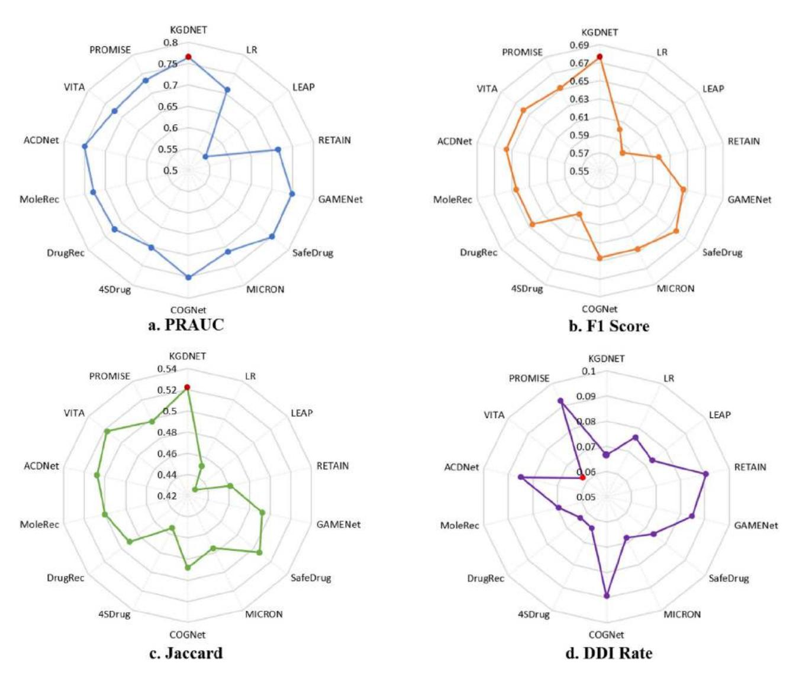
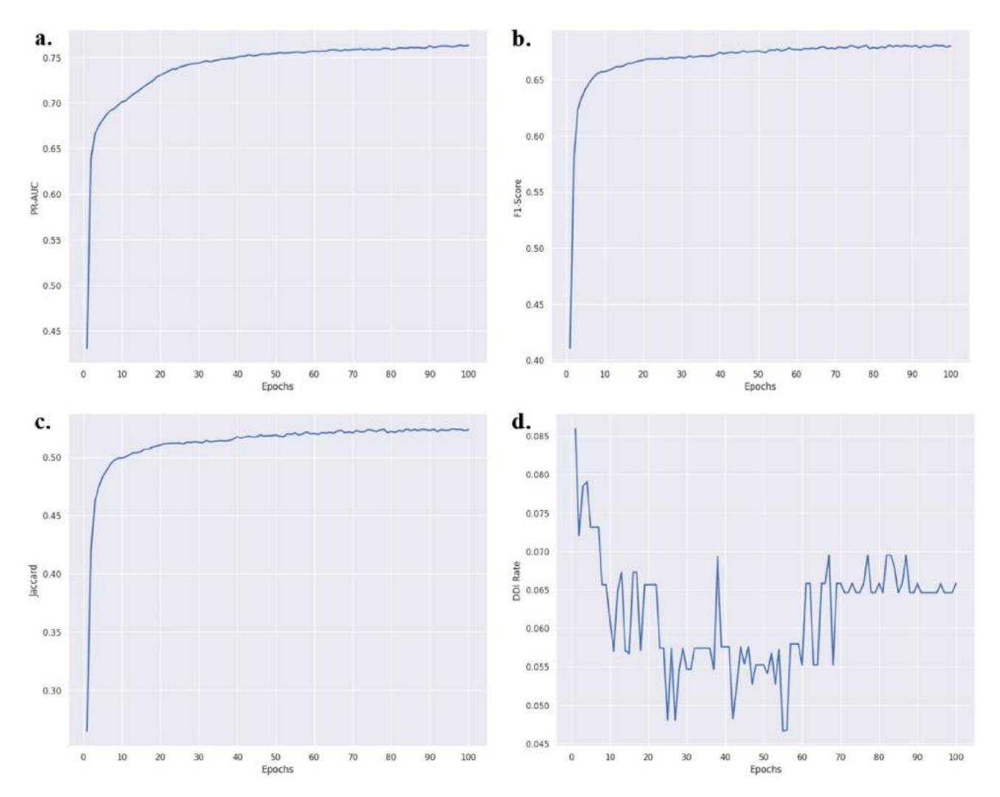
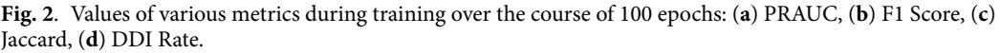
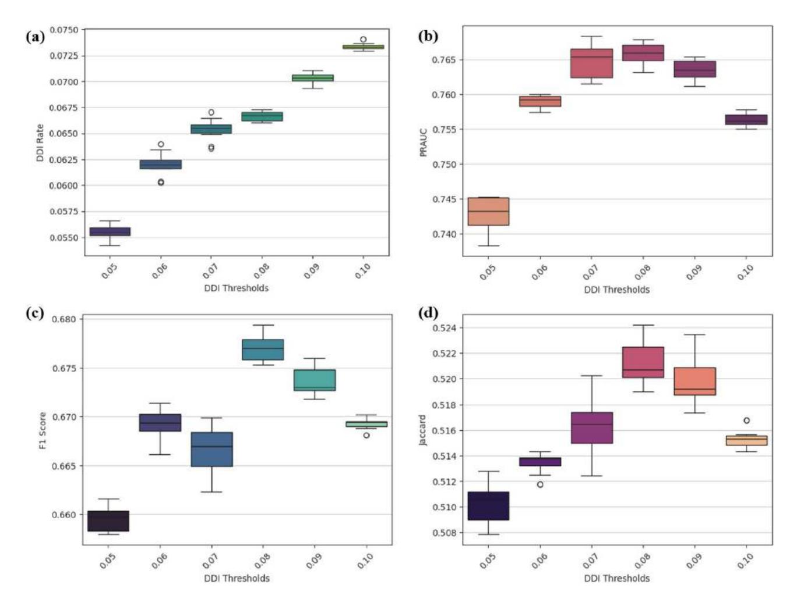
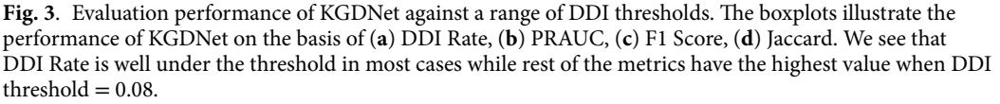
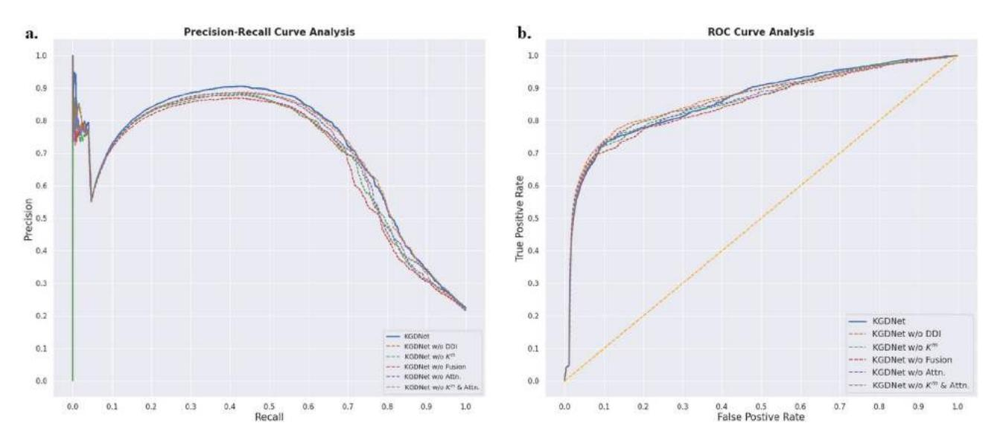
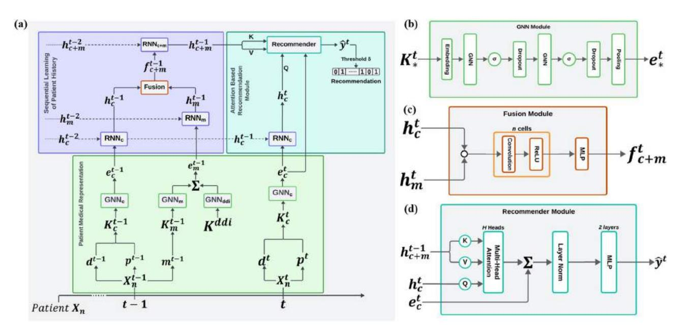
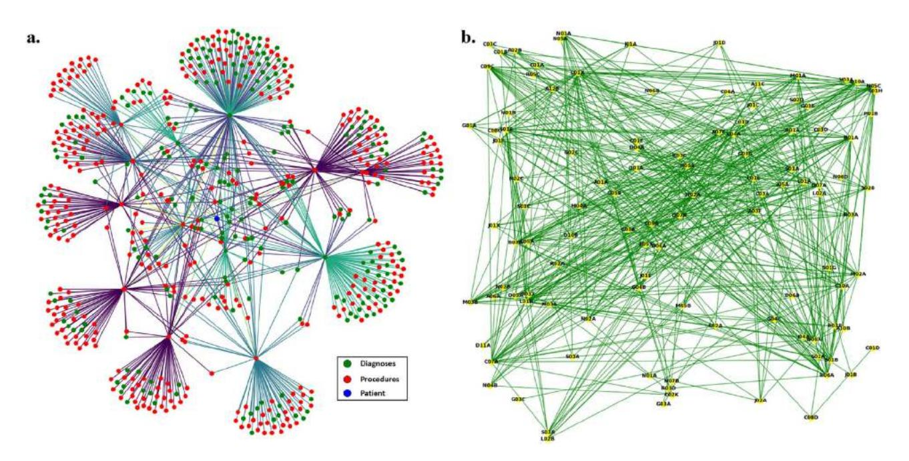

# **OPEN**

<!-- Image Description: The image is a screenshot of a "Check for updates" button, likely from software. The button is rectangular with a grey background and rounded corners. A small circular icon precedes the text, featuring a red bookmark-like shape with teal and yellow accents. The image's purpose within the paper is presumably to illustrate a user interface element or software functionality related to updates. -->

## **Knowledge graph driven medicine recommendation system using graph neural networks on longitudinal medical records**

**Rajat Mishra1 & S. Shridevi2**

**Medicine recommendation systems are designed to aid healthcare professionals by analysing a patient's admission data to recommend safe and effective medications. These systems are categorised into two types: instance-based and longitudinal-based. Instance-based models only consider the current admission, while longitudinal models consider the patient's medical history. Electronic Health Records are used to incorporate medical history into longitudinal models. This project proposes a novel Knowledge Graph-Driven Medicine Recommendation System using Graph Neural Networks, KGDNet, that utilises longitudinal EHR data along with ontologies and Drug-Drug Interaction knowledge to construct admission-wise clinical and medicine Knowledge Graphs for every patient. Recurrent Neural Networks are employed to model a patient's historical data, and Graph Neural Networks are used to learn embeddings from the Knowledge Graphs. A Transformer-based Attention mechanism is then used to generate medication recommendations for the patient, considering their current clinical state, medication history, and joint medical records. The model is evaluated on the MIMIC-IV EHR data and outperforms existing methods in terms of precision, recall, F1 score, Jaccard score, and Drug-Drug Interaction control. An ablation study on our models various inputs and components to provide evidence for the importance of each component in providing the best performance. Case study is also performed to demonstrate the real-world effectiveness of KGDNet.**

**Keywords** Medicine recommendation, Graph neural network, Knowledge graphs, Attention mechanism

Medicine recommendation has been an important area of research in the last few years. The purpose of medicine recommendation systems is to assist healthcare professionals to analyse a patient's admission data regarding diagnoses, illnesses, medical procedures to prescribe a set safe and accurate medications that will help in mitigating the patient's illness. These systems prove to be especially useful when patients are diagnosed with multiple illnesses and undergo several procedures during their stay. However, as doctors and researchers discover new diseases and develop new medicines and procedures, they have to take a number of factors into account while recommending medicines to a patient.

Firstly, they have to consider the patient's medical history while prescribing medication for the current admission. Medicine recommendation models can be divided into two categories, *instance-based* and *longitudinal-based*. *Instance-based* models provide medicine recommendations by taking only the current admission record into accoun[t1](#page-13-0),[2](#page-13-1) . These models do not consider the patient's medical history and hence cannot take into consideration any previous diagnoses and medications that could affect the recommendations. This affects the accuracy and effectiveness of such models. Recently, to address these issues, longitudinalbased recommendation methods such a[s3](#page-13-2)[–7](#page-13-3) have been proposed, which leverage the temporal dependencies present in the patient's medical history to provide personalised and safer recommendations. Electronic Health Records (EHRs) are used to incorporate medical history into *longitudinal-based* models. EHRs like MIMIC[8,](#page-13-4)[9](#page-13-5) systematically collect historical medical information of a patient including diagnoses, procedures, prescription among others in the form of medical codes across admission[s2](#page-13-1),[10.](#page-13-6)

Secondly, they have to take into consideration the presence of Drug-Drug Interactions (DDIs[\)11](#page-13-7) between different pairs of medicines. According to National Institutes of Health, DDIs can "change a drug's effect on the body when the drug is taken together with a second drug". These pairs may interact affect the action of either or both drugs and lead to adverse reactions which can deteriorate a patient's health condition[12](#page-13-8),[13.](#page-13-9) For example, a

1School of Computer Science and Engineering, Vellore Institute of Technology - Chennai, Chennai, India. 2Centre for Advanced Data Science, Vellore Institute of Technology - Chennai, Chennai, India. email: shridevi.s@vit.ac.in

patient suffering from Adenovirus Pneumonia can be prescribed Ertapanem and another patient suffering from Coronavirus Pneumonia can be prescribed Linezolid. However, if a patient is prescribed both medicines, the DDI between them can result in edema/sepsis in the patient.

Various deep learning approaches capture diverse relationships between medical entities and patients, encompassing factors such as DDIs, ontologies and semantic information from various external biomedical sources, leading to creation of Medical Knowledge Graphs (KGs). Medical KGs consist of various types of nodes representing diagnoses, procedures, medicines and patients with multiple relations connecting them together. LEAP[1](#page-13-0) introduces an *instance-based* deep learning framework that, given a patient's current medical information, utilises an attention mechanism to prescribe a safe combination of medicines by taking external DDI information into consideration. RETAI[N14](#page-14-0) proposes a "reverse time attention" system using two layers of RNN to take past admissions into account while creating a recommendation set for current admission. GAMENet[3](#page-13-2) takes into account various drug-drug interactions by adopting a dynamic "memory module" implemented using Graph Convolution Networks (GCN) which learns EHR and DDI KGs and uses RNNs to learn patient history. SafeDru[g4](#page-13-10) leverages MIMIC-III, DrugBank and molecular structure of drugs by utilising a bipartite learning module to provide safe drug recommendation with a significant reduction in DDIs. MICRON[5](#page-13-11) uses a "recurrent residual network" that updates a patient's medical information and propagates them to the next visit to preserve the patient's temporal information. COGNet[6](#page-13-12) introduces a "copy-or-predict mechanism" to that uses the patient's medical history along with current diagnoses to determine whether to prescribe ("copy") a previous medicine or recommend a new medicine. COGNet also implements a Transformer Encoder mechanism[15](#page-14-1), which consists of Self-Attention followed by Layer Normalisatio[n16](#page-14-2) to learn the patient's temporal medical history.

4SDru[g17](#page-14-3) uses a set-oriented representations, similarity metrics, and importance-based set aggregation for symptom analysis, along with intersection-based set augmentation for recommendation. DrugRec[18](#page-14-4) addresses recommendation bias by modelling causal inference to address bias, track patients' health history, and manage DDIs by solving them as a satisfiability problem. MoleRe[c19](#page-14-5) employs a hierarchical architecture to model molecular inter-substructure interactions and their effect on a patient's health condition. ACDNe[t7](#page-13-3) uses the attention-based Transformer Encoder along with GAT[20](#page-14-6) and GCN[21](#page-14-7) to learn the medication KGs and uses cosine similarity along with Feed-Forward Neural Networks for recommending medicines. PROMISE[22](#page-14-8) encodes EHR hypergraphs to learn patient representations and acquires patient representations with semantic information by encoding clinical texts from EHR. VITA[23](#page-14-9) introduces two novel ideas: relevant visit selection that excludes past visits deemed irrelevant and target aware attention to capture the relevancy between current and past visits.

Using the above findings, we propose a novel **K**nowledge **G**raph-**D**riven Medicine Recommendation System using Graph Neural **Net**works on Longitudinal Medical Records (KGDNet), as illustrated in Figure 5a., that utilises the EHR data along with ontologies and DDI knowledge from external sources to construct admission-wise clinical and medicine KGs for every patient using a variety of relations including semantic, ontological and DDI relations. These pairs of KGs for each admission will be utilised to generate temporal information to be used for providing personalised recommendation for the patient. We also create a drug knowledge base by converting the DDI information into a KG which will be leveraged to provide safe recommendations. These KGs are then learned using GNNs designed for highly relational data to generate embeddings. We then exploit RNNs to learn temporal data from medical record embeddings from each admission and generate temporal features from clinical and medicine streams across admissions. These temporal features are then combined using a Fusion Module utilising Multi-Layer Perceptrons (MLPs) to produced joint temporal features for each admission. These features are then passed onto the Recommendation module that uses a Transformer-based Attention mechanism that uses the joint temporal features, the clinical features from previous admissions and the current clinical state of a patient to prescribe a set of medicines. We utilised the EHR cohort MIMIC-IV[9](#page-13-5) along with DDI dat[a11](#page-13-7) and medical ontologies ICD and ATC from external knowledge bases to evaluate our model. We compare the performance of our model against various of deep learning medicine recommendation models. The results show that our model consistently outperforms its counterparts across multiple performance metrics including Precision-Recall Area Under Curve, Jaccard and F1 scores, and proves to be excellent at reducing DDIs while also maintaining consistently high performance.

Our main contributions are summarised as follows:

- 1. We propose a novel KGDNet framework for safe and effective medicine recommendation that maximises accuracy and minimises Drug-Drug Interactions within the medicine sets by exploiting semantic, relational and ontological knowledge to construct admission-wise medical KGs for each patient in the EHR. We use GNNs to learn the patient's medical data through the KGs. Global DDI KG is learned and removed from patient's medication embeddings.
- 2. In order to learn a patient's admission history, we utilise Recurrent Neural Networks to hierarchically learn the clinical and medicine streams using KG embeddings obtained from the GNNs and then fuse the temporal features of each stream to construct a joint medical stream using Multi-Layer Perceptrons.
- 3. Using a Transformer-based Attention mechanism, we create a recommender module that uses a patient's current clinical state and medication history along with joint medical records and clinical history to generate medication recommendations for the patient.
- 4. We optimise our model using a combined loss method that takes multi-label prediction accuracy and DDI rate into account. We evaluate our model on the MIMIC-IV EHR data using various performance metrics to demonstrate the effectiveness of our proposed KGDNet in comparison to existing methods.

## **Results**

### **Model prediction**

To evaluate the performance of our novel medication recommendation model KGDNet, we compare our method with various baselines, divided into two groups, instance-based, including Logistic Regression (LR), LEAP[1](#page-13-0) , and longitudinal-based, including RETAIN[14,](#page-14-0) GAMENe[t3](#page-13-2) , SafeDrug[4](#page-13-10) , MICRO[N5](#page-13-11) , COGNe[t6](#page-13-12) , DrugRec[18,](#page-14-4) MoleRe[c19](#page-14-5), ACDNe[t7](#page-13-3) , PROMISE[22](#page-14-8) and VIT[A23](#page-14-9). Further information is provided in Section [4.6](#page-13-13).

We compare predictive performance of the methods on the MIMIC-IV[9](#page-13-5) EHR cohort, after performing data processing as mentioned in Section [4.1,](#page-8-0) on the basis of PR-AUC, Jaccard and F1 metrics. We also test the safety of our model on the basis of DDI rates among the recommended medicines. We report KGDNet's performance comparison against baselines in Table [1](#page-2-0) and illustrate our results in Fig. [1.](#page-3-0) We set our DDI threshold to 0.08 to reflect the real-world dataset. *Instance-based* methods, LR (PR-AUC=0.7090) and LEAP (PR-AUC=0.5506), performed poorly in comparison to the *longitudinal-based* models as they do not take patient history into consideration.

The longitudinal-based models perform better as they take into consideration the patient's historical information along with the current clinical state using a variety of methods. While RETAIN (PR-AUC=0.7154, DDI=0.0904) only uses longitudinal information, GAMENet (PR-AUC=0.7487, DDI=0.0848) achieves better results by introducing DDI and drug co-occurrence information using GNNs and SafeDrug (PR-AUC=0.7503, DDI=0.0737) incorporates molecular structures of drugs and succeeds in attaining higher scores and reducing DDI. MICRON (PR-AUC=0.6842) introduced a "recurrent residual network" to tackle redundancy but fails to account for co-occurrence relationship among medicines from previous visits. COGNet (PR-AUC=0.7525) uses a "copy-or-predict" system alongside Transformers[15](#page-14-1) to consider the relationship between current and previous prescription records. 4SDrug (PR-AUC=0.7011, DDI=0.0637) achieves a good DDI Rate by utilises a set-based similarity measurement to generate small, concise medicine sets but sacrifices accuracy in doing so. DrugRec (PR-AUC=0.7225, DDI=0.0633) uses casual inference to address recommendation bias and track patient history get low DDI rates and good accuracy. MoleRec (PR-AUC=0.7288, DDI=0.0695) models the relation between the molecular structures and patient's clinical information to achieve good accuracy. ACDNet (PR-AUC=0.7501, DDI=0.0849) uses Transformers, to learn the diagnoses, procedures and medication history of the patient separately and then fuses the them using Transformers too, similar to COGNet. PROMISE (PR-AUC=0.7335, DDI=0.0621) creates hypergraphs from EHR and encodes semantic information from clinical texts to achieve very good balance between DDIs and accuracy. VITA (PR-AUC=0.7225, DDI=0.0922 ) captures the relevancy between past and current visits to get good accuracy but high DDI rates.

However, KGDNet outperforms ACDNet by using Multi-Head Attention (MHA[\)15](#page-14-1), similar to Transformers, instead of Cosine Similarity to generate recommendations and using GRU along with MHA to learn the patient's history from KG embeddings. Unlike the baselines, to account for the highly relational clinical data, we create a clinical KG along with the DDI and medicine KGs for each visit, which are learned using GNNs and passed to RNNs. We also use an attention mechanism for prescribing medicines unlike previous works. This results in superior scores in terms of both predictive efficiency and safety for KGDNet (PR-AUC=0.7657, DDI=0.0665).

During training, as shown in Fig. [2,](#page-4-0) the PRAUC, F1, and Jaccard scores all steadily increased with the number of epochs. The DDI rate, however, exhibited a more complex trend. Initially, it decreased as the number of epochs increased. However, it then began to increase before relatively stabilising at a later point in the training process. This trend along with the variations every few epochs in the DDI rate in Fig. [2](#page-4-0)d. is likely due to the fact that different sets of medicines are recommended during each epoch. The eventual stabilisation of the DDI rate suggests that the recommendation sets are becoming more consistent as training progresses.

| Model | DDI Rate | PRAUC | F1 Score | Jaccard | Avg. # of meds |
|-----------|-----------------|-----------------|-----------------|-----------------|------------------|
| LR | 0.0762 ± 0.0004 | 0.7090 ± 0.0014 | 0.6007 ± 0.0013 | 0.4510 ± 0.0013 | 8.9866 ± 0.0374 |
| LEAP1 | 0.0731 ± 0.0004 | 0.5506 ± 0.0015 | 0.5820 ± 0.0012 | 0.4287 ± 0.0012 | 11.5198 ± 0.0459 |
| RETAIN14 | 0.0904 ± 0.0011 | 0.7154 ± 0.0018 | 0.6170 ± 0.0023 | 0.4613 ± 0.0026 | 12.8949 ± 0.0923 |
| GAMENet3 | 0.0848 ± 0.0005 | 0.7487 ± 0.0015 | 0.6449 ± 0.0017 | 0.4920 ± 0.0018 | 19.3289 ± 0.0912 |
| SafeDrug4 | 0.0737 ± 0.0007 | 0.7503 ± 0.0013 | 0.6578 ± 0.0019 | 0.5065 ± 0.0020 | 15.9642 ± 0.0335 |
| MICRON5 | 0.0681 ± 0.0016 | 0.7124 ± 0.0025 | 0.6465 ± 0.0032 | 0.4754 ± 0.0026 | 15.6963 ± 0.2875 |
| COGNet6 | 0.0894 ± 0.0003 | 0.7525 ± 0.0008 | 0.6467 ± 0.0009 | 0.4884 ± 0.0009 | 19.7235 ± 0.0242 |
| 4SDrug17 | 0.0637 ± 0.0004 | 0.7011 ± 0.0011 | 0.6034 ± 0.0010 | 0.4539 ± 0.0011 | 12.5213 ± 0.0665 |
| DrugRec18 | 0.0633 ± 0.0012 | 0.7225 ± 0.0010 | 0.6455 ± 0.0007 | 0.4904 ± 0.0011 | 15.7565 ± 0.1223 |
| MoleRec19 | 0.0695 ± 0.0012 | 0.7288 ± 0.0023 | 0.6452 ± 0.0012 | 0.5001 ± 0.0015 | 18.5714 ± 0.1244 |
| ACDNet71 | 0.0849 ± 0.0005 | 0.7501 ± 0.0017 | 0.6564 ± 0.0013 | 0.5077 ± 0.0015 | 12.7024 ± 0.0005 |
| PROMISE22 | 0.0621 ± 0.0007 | 0.7335 ± 0.0010 | 0.6517 ± 0.0008 | 0.4973 ± 0.0010 | 17.1309 ± 0.0741 |
| VITA23 | 0.0922 ± 0.0034 | 0.7225 ± 0.0010 | 0.6583 ± 0.0007 | 0.5174 ± 0.0011 | 14.5454 ± 0.1001 |
| KGDNet | 0.0665 ± 0.0010 | 0.7657 ± 0.0015 | 0.6765 ± 0.0017 | 0.5218 ± 0.0018 | 19.2273 ± 0.0912 |

**Table 1**. Performance comparison of Model against baselines on MIMIC-IV EHR dataset. The base DDI rate in EHR test data is 0.0781. 1 ACDNet metrics taken from the pape[r7](#page-13-3) itself as their code was not publicly available for experimentation at the time of submission

<!-- Image Description: The image displays four radar charts comparing the performance of different drug-drug interaction (DDI) prediction methods (KGDNET, PROMISE, VITA, ACDNet, MoleRec, DrugRec, 4SDrug, COGNet, MICRON, LEAP, RETAIN, GAMEnet, SafeDrug). Each chart represents a different performance metric: (a) PRAUC (Precision-Recall Area Under the Curve), (b) F1 Score, (c) Jaccard Index, and (d) DDI Rate. The charts visually compare the strengths and weaknesses of each method across the various metrics. -->

**Figure 1**. Evaluation performance of KGDNet against baselines. All results were obtained after 10 rounds of bootstrap sampling with 80% samples. The boxplots compare our model, KGDNet, alongside various baselines on the basis of (**a**) PRAUC, (**b** F1 Score), (**c**) Jaccard, (**d**) DDI Rate. The red dot ( ) signifies the best result from the models for the respective metric.

### **Analysis of DDI rate thresholds**

Ensuring the safety of medicine recommendations is our primary concern. Hence, we test our model's capability to control DDI rates and show that DDI rates can be effectively controlled by the hyperparameter λ. The DDI rate in the MIMIC-IV EHR cohort is 0.0781. The hyperparameter λ allows us to alter the training loss for each patient such that if the patient-level DDI is less than λ, we only need to maximise the prediction accuracy but if it is greater, then we adjust our loss function to focus on minimising DDIs as well. We test our model with DDI thresholds in the range of [0.05, 0.1] with 0.01 increments. We show that our model is capable of controlling DDI rates. We report KGDNet's performance against DDI threshold in Table [2](#page-4-1) and illustrate our results in Fig. [3](#page-5-0). In lower DDI thresholds, the model controls the DDI rates well but struggles with achieving good scores due to the low threshold restricting the recommendation size. However, when the threshold is in the range [0.07, 0.1], the model does well to suppress the DDI rates well below the thresholds and performs better. Due to threshold being increased, more medicines are allowed in the recommendation set. Hence, this shows that KGDNet can successfully mimic clinicians when prescribing medicines by balancing the trade-off between DDI rates and accuracy.

### **Ablation study for feature importance**

To perform ablation study, we observe the impact of various modules by removing them from our model and training it.

• **KGDNet w/o**Km: We remove the medicine knowledge graph from the input and subsequently, we remove the DDI graph.

<!-- Image Description: This image displays four graphs illustrating model performance metrics over 100 epochs. (a) shows PR-AUC, (b) shows F1-score, (c) shows Jaccard index, all increasing over epochs indicating improved model performance. (d) shows the DDI rate, which decreases, suggesting reduced error. The graphs collectively demonstrate the training progress and convergence of a machine learning model. -->

<!-- Image Description: Figure 2 is a caption describing a missing figure that would present four metrics (PRAUC, F1 Score, Jaccard, and DDI Rate) plotted against the number of training epochs (100 in total). The figure's purpose is to visually represent the performance of a model during training, showing the trends of these four evaluation metrics over time. -->

| Threshold | DDI Rate | PRAUC | F1 Score | Jaccard | Avg. # of meds |
|-----------|-----------------|-----------------|-----------------|-----------------|------------------|
| 0.05 | 0.0527 ± 0.0004 | 0.7422 ± 0.0023 | 0.6592 ± 0.0014 | 0.5095 ± 0.0020 | 17.0847 ± 0.0663 |
| 0.06 | 0.0618 ± 0.0010 | 0.7589 ± 0.0015 | 0.6688 ± 0.0003 | 0.5136 ± 0.0011 | 19.0756 ± 0.0735 |
| 0.07 | 0.0658 ± 0.0011 | 0.7643 ± 0.0018 | 0.6668 ± 0.0023 | 0.5166 ± 0.0016 | 19.1234 ± 0.0923 |
| 0.08 | 0.0665 ± 0.0007 | 0.7657 ± 0.0015 | 0.6765 ± 0.0017 | 0.5218 ± 0.0018 | 19.2273 ± 0.0912 |
| 0.09 | 0.0703 ± 0.0004 | 0.7631 ± 0.0013 | 0.6735 ± 0.0019 | 0.5191 ± 0.0020 | 20.2971 ± 0.0335 |
| 0.10 | 0.0734 ± 0.0003 | 0.7561 ± 0.0008 | 0.6698 ± 0.0009 | 0.5149 ± 0.0009 | 21.2235 ± 0.0242 |

**Table 2**. Performance of KGDNet under a spectrum of DDI thresholds.

- **KGDNet w/o***DDI*: We remove the DDI knowledge graph and DDI adjacency matrix from the input and subsequently, the DDI loss.
- **KGDNet w/o***Fusion*: We remove the fusion module for combining the medicine and clinical streams and simply concatenate the two streams.
- **KGDNet w/o***Attn*.: We remove the attention module for recommendation and replace it with a mean operation.
- **KGDNet w/o**Km, Attn.: We remove the medicine knowledge graph from the input and subsequently, we remove the DDI graph and DDI loss. We also remove the attention module for recommendation and replace it with a mean operation.We report the results of our ablation study in Table [3](#page-5-1). **Model w/o**Km discards the medication KG Km t−1 for each admission Xt, subsequently discarding the DDI KG Kddi as it is directly connected to the medication KG. We also discard the related modules GNN m, GNNddi and RNN m and

<!-- Image Description: The image presents four box plots (a-d), each illustrating the performance of a drug-drug interaction (DDI) prediction model at different DDI thresholds. (a) shows DDI rate, (b) shows the area under the precision-recall curve (PRAUC), (c) displays the F1 score, and (d) shows the Jaccard index. All plots show how these metrics change as the DDI threshold varies, aiding in the selection of an optimal threshold for the model. -->

<!-- Image Description: Figure 3 describes the evaluation performance of the KGDNet model using boxplots across various DDI thresholds. The boxplots visualize four performance metrics: DDI Rate, PRAUC, F1 Score, and Jaccard. The figure analyzes how these metrics change based on different DDI thresholds, showing optimal performance at a threshold of 0.08 for most metrics. -->

| Model | DDI Rate | PRAUC | F1 Score | Jaccard | Avg. # of meds |
|----------------------|---------------|---------------|---------------|---------------|----------------|
| KGDNet w/o Km | 0.7538±0.0015 | 0.6748±0.0013 | 0.5183±0.0008 | 0.0679±0.005 | 19.2692±0.0230 |
| KGDNet w/o DDI | 0.7533±0.0018 | 0.6668±0.0018 | 0.5174±0.0013 | 0.0819±0.0028 | 20.3558±0.0425 |
| KGDNet w/o Fusion | 0.7584±0.0015 | 0.6729±0.0021 | 0.5207±0.0013 | 0.0688±0.0005 | 19.3876±0.0098 |
| KGDNet w/o Attn. | 0.7574±0.0023 | 0.6741±0.0023 | 0.5199±0.0015 | 0.0664±0.0014 | 19.4639±0.0154 |
| KGDNet w/o Km, Attn. | 0.7558±0.0009 | 0.6629±0.0016 | 0.5163±0.0010 | 0.0707±0.0009 | 18.3763±0.0224 |
| KGDNet | 0.7657±0.0015 | 0.6765±0.0017 | 0.5218±0.0018 | 0.0658±0.0011 | 19.2273±0.0912 |

**Table 3**. Ablation Study for Various Components of KGDNet on MIMIC-IV.

the fusion modules. We only utilise the clinical knowledge graph Kc and the attention module uses only the obtained longitudinal clinical features hc t in the MHA module. These changes result in lower scores and high DDI rate as the model lacks any knowledge of the medication history and DDI information. In **Model w/ o***DDI*, we provide patient medical history for each admission but not the DDI information by removing the DDI loss Lddi. This results in slightly higher prediction scores compared to **Model w/o**Km but due to absence of any DDI information and no feedback from the DDI loss function, this variant suffers from high levels of DDIs in the medication set.

Model w/o *Fusion* discards the fusion module that takes the longitudinal clinical and medication streams obtained from RNNs and fuses them to create the joint medical stream for a patient. Instead we perform simple concatenation of the clinical and medication streams, i.e., fc+m t = hc t · hm t , similar to GAMENe[t3](#page-13-2) . This produces slightly lower scores for PRAUC than KGDNet but the other metrics are very similar, showing better performance than other variants. These results verify that incorporating both clinical and medication data are necessary for accurate recommendations. Next, **Model w/o***Attn*. discards the MHA module and replaces it with a mean operation, i.e., lt = LayerNorm(ec t + mean(hc t, hc+m t−1 )). This produces inferior scores than KGDNet and indicates the importance of MHA in assisting the model focus on key features of the patient's medical state. We further extend this variant by introducing **Model w/o**Km, Attn. that discards the medical knowledge graph and thus the GNN m, GNNddi and RNN m and the fusion modules. The attention module is a layer normalisation of the current clinical state along with the longitudinal clinical features of the patient, i.e, lt = LayerNorm(ec t + hc t). This leads to further reduction in scores underlining the importance of the patient's medication history and the need for an Attention module. The performance of the variants are also captured in Fig. [4](#page-6-0) by comparing the Precision-Recall and ROC-AUC curves of the variants. We can see from the Precision-Recall curves that the KGDNet model achieves better precision than all ablated variants while the the True Positive Rate gradually outperforms the ablated variants at higher rates in the ROC curves.

### **Discussion**

Until recently, studies focused on genetics-based prediction[s24](#page-14-10) to provide personalised recommendations. However, research focus has shifted to recommendations using medical data from Electronic Health Records (EHRs). EHRs collect a variety of medical information relating to diagnoses, procedures and prescriptions from a large number of patients across their admissions. EHRs have become a valuable source of information for deep-learning models[25](#page-14-11)[,26](#page-14-12). Given their inherent time-series format, EHRs offer personalized insights for each patient regarding various medical entities such as medicine, diagnoses, etc. which can be leveraged to provide medication personalised to the patient's conditions[27](#page-14-13)[,28](#page-14-14). Reducing Drug-Drug Interactions (DDIs) among medicines has also been an active area of research. DDIs can result in adverse side effects that can deteriorate a patient's health. Various methods have been proposed to control DDIs in medicines. Several Graph Neural Network-methods to mitigate DDIs have been proposed[29,](#page-14-15)[30](#page-14-16) that leverage extensive biomedical networks and knowledge graphs such as DrugBank[31](#page-14-17) and TWOSIDE[S11](#page-13-7).

### **Graph neural networks for encoding patient EHRs**

Graph Neural Networks (GNNs) are deep-learning methods designed to work with heterogeneous graphstructured data[32](#page-14-18)[,33](#page-14-19). Unlike Convolutional Neural Networks (CNNs), GNNs analyse complex relational data between network entities, capturing graph dependencies through "message passing" between nodes. They are widely used in recommendation models[34,](#page-14-20)[35](#page-14-21). Models like Graph Convolutional Networks (GCNs)[21,](#page-14-7) Graph Attention Networks (GAT)[20](#page-14-6), and Message Passing Neural Networks (MPNN[\)36](#page-14-22) have been applied by[3,](#page-13-2)[6](#page-13-12),[37,](#page-14-23)[38](#page-14-24) an[d4](#page-13-10) , respectively. GAMENet, for instance, uses GCNs to learn medicine knowledge graphs (KGs) with drugdrug interaction (DDI) information and co-occurrences. Notably, no work has applied GNNs and KGs to model *patient* diagnoses and procedure data, which is highly relational. Clinical data from EHRs contain extensive ontological and semantic relationships, providing insights like disease and diagnoses co-occurrences, enriching patient-specific information. Inspired by the need for a way to account for the clinical relational data, we propose personalized medical KGs for both medication and clinical data for each patient admission. To capture these relations, we employ relation-aware GNNs (RAGNNs) to learn medical representations and use RNNs for longitudinal learning. For our multi-relational clinical data, we utilise Relational Graph Convolutional Networks (RGCN)[39,](#page-14-25) designed for highly multi-relational data, to model patient clinical KG embeddings.

<!-- Image Description: This image from an academic paper presents two graphs comparing the performance of different model variations (KGDNet). (a) is a precision-recall curve analysis showing precision against recall for each model. (b) is an ROC curve analysis, plotting true positive rate versus false positive rate. Both graphs assess the performance of KGDNet and its variations, allowing for a comparison of their effectiveness in a classification task. The different line styles represent different model configurations. -->

**Figure 4**. Comparison of (**a**) Precision-Recall Curves and (**b**) ROC-AUC curves of KGDNet along with various ablated variants. KGDNet is represented by the solid blue plot-line.

Furthermore, we propose a refined approach of developing medication-specific KGs for each patient admission. Instead of creating a shared "memory bank" for all patients, as used in[3–](#page-13-2)[7](#page-13-3) , we create individual KGs containing known drug co-occurrences associated with prescribed medications. This strategy aims to enhance the efficacy of recommendation sets, aligning more closely with the personalised nature of healthcare interventions. However, we define a global Drug-Drug Interaction (DDI) KG, similar to GAMENet[3](#page-13-2) , comprising of medicines, with edges denoting the DDIs. Employing GNNs, we learn this KG's medical representations. These representations are integrated with the medication features of an admission, to derive the unified medication features for that specific admission. Subsequently, these combined features are employed in RNNs to effectively capture and model the patient's medication history. We use Graph Convolutional Networks (GCN) to learn the medication KGs and the DDI KG. After obtaining the embeddings through GNN, they are then passed onto RNNs to learn the temporal data of the patient across admissions.

### **Gated recurrent units for longitudinal data**

From existing works we have identified that considering historical data along with current clinical information is importan[t3,](#page-13-2)[14.](#page-14-0) While GAMENet[3](#page-13-2) and SafeDrug[4](#page-13-10) use RNNs To learn historical data, COGNe[t6](#page-13-12) and ACDNe[t7](#page-13-3) make use of Self-Attention mechanisms. We make use of Recurrent Neural Networks (RNNs), a bidirectional neural network that can effectively process sequential data. Gated Recurrent Units (GRUs[\)40](#page-14-26) are a commonly used RNN that uses two gates - "reset" gate and "update" gate - that determine whether to pass features to the output or forget them. Instead of using RNNs directly on the multi-hot vector clinical data as done by[3](#page-13-2)[,4](#page-13-10) , we first create KGs, then apply GNNs and finally apply GRU on the KG embeddings.

In order to capture the temporal features of each visit, we need to comprehensively gain information about both the clinical and medication history of the patient. Previous works have used simple concatenation techniques that combine the clinical RNN features with the KG embeddings from the global medicine memory bank. We utilise a Fusion layer that performs collaborative filtering[41](#page-14-27) by taking the clinical and medication RNN streams for an admission obtained from the GRU cells and converts them to a joint medical stream that effectively captures the temporal features of the patient's diagnoses, procedure and prescription data. We concatenate the two streams and pass the result through a series of convolutions and a Multi-Layer Perceptron (MLP) to obtain the joint medical features, which are passed into another RNN for learning the joint temporal stream.

### **Attention mechanism for generating recommendations**

After obtaining the joint features for a patient, like COGNe[t6](#page-13-12) , we then use an Attention mechanism for our final recommender module to effectively learn from the temporal features extracted from the fusion module. An attention mechanism is a neural network architecture that computes the relevance of each element in a sequence to every other element, allowing the model to focus on relevant portions of the input by assigning weights. Attention mechanisms have been frequently used with GNNs[6](#page-13-12)[,7](#page-13-3),[42,](#page-14-28)[43](#page-14-29) in healthcare field. However, previous works like COGNet[6](#page-13-12) and ACDNet[7](#page-13-3) have used Transformer Encoders, i.e., self-attention followed by layer normalisatio[n16](#page-14-2), to learn the patient's clinical history. We propose using Multi-Head Attention (MHA[\)15](#page-14-1) instead of self-attention based Transformers, enabling us to provide various inputs related to different medical states of the patient to the attention module. MHA take in query, key and value objects. The joint medical stream is assigned to key and value while the current clinical temporal features are assigned to the query object to put emphasis on the current clinical state along with the patient history. The result obtained from MHA is then passed onto a layer normalisation module along with the clinical embeddings of the current state to provide emphasis on the current admission. The result of the layer normalisation is then passed to a MLP followed by a Tanh activation function to return a set of weights upon which a threshold is applied to generate the recommendation set.

### **LLMs in medical recommendation systems**

We also explore the use of Large Language Models (LLMs) in medical recommendation systems to model longitudinal patient data in comparison with our approach of using GNNs. The strong performance of LLMs like GPT[44](#page-14-30) in recent times has led them to be utilised in hugely diverse scenarios including the healthcare fiel[d45](#page-14-31) and for recommendation systems[46.](#page-14-32) Hence it becomes crucial that we look into the advantages and drawbacks of LLMs in the medicine recommendations. However, it has been found that GPTs and LLMs still have considerable room for improvement in areas such as information gathering and adhering to guidelines[47.](#page-14-33) GraphCar[e48](#page-14-34) utilises LLMs and external biomedical KGs to build patient-specific KGs, which are then used to train our proposed Biattention Augmented GNNs for drug recommendation. LEADER[49](#page-14-35) uses LLMs by employing custom prompts and a novel output layer. It transfers LLM knowledge to a smaller distilled model, balancing power with efficiency. Both models give good results on MIMIC-IV. However, a major drawback is that both models do not take into account DDIs between drugs in the recommendation sets. Both models also have shortcomings related to hallucinations, biases[48](#page-14-34) and high computational costs[49](#page-14-35) that could compromise the effectiveness of these models.

### **Measurement and performance of KGDNet**

We employ various metrics such as Precision-Recall Area Under Curve (PRAUC), F1 score, and Jaccard score are utilised to evaluate the predictive performance of KGDNet against multiple baselines. A custom DDI rate metric is introduced to evaluate the KGDNet's effectiveness in controlling DDIs within the recommendation set, drawing inspiration from the methodology introduced by SafeDru[g4](#page-13-10) . We demonstrate that KGDNet outperforms the baselines in every performance metric on the MIMIC-IV cohort. We also evaluate the performance of our model over a range of DDI thresholds to demonstrate that our model is capable of controlling the DDI rate while also maintaining a high level of performance. We conduct an ablation study to analyse the impact of various individual modules within KGDNet. Finally, we conduct a case study by selecting a patient from the test dataset and evaluate our model and the baselines' approaches against the ground truth, i.e, the patient's prescription. We show that KGDNet is successful in providing reliable recommendations reflecting the ground truth in real-world healthcare situations.

### **Methods**

### **Dataset description**

We consider EHR data from a benchmark inpatient dataset, MIMIC-IV[9](#page-13-5) , along with medical ontology data from ICD and DDI knowledge from TWOSIDES[11.](#page-13-7) Table [4](#page-8-1) provides some dataset statistics while details of the dataset and preprocessing can be found in 1.1. in Supplementary Information (Fig. [5](#page-9-0)).

### **Problem formulation**

In our medicine recommendation system, we will utilise Electronic Health Records of patients as well as external medical information like Drug-Drug Interaction Data, ontologies, etc. to create a deep learning model that will provide personalized medicine recommendations to patients.

### *Electronic health records*

Electronic Health Records (EHRs) are used to store medical histories of patients. This is done using longitudinal vectors that store information about a patient's diagnoses, procedures and drugs prescribed to them.

For a patient *n*, the EHR can be represented as Xn = {X1 n, ··· , Xt n, ··· , XT n }, with T referring to the total number of admissions. For each *t*-th admission of the *i*-th patient, Xt i = {dt , pt , mt } consists of vectors for diagnosis dt ∈ |D|, procedure pt ∈ |P| and medicine codes mt ∈ |M|.

As the diagnoses and procedures in the EHR are uniquely defined in the ICD ontology, we can integrate the diagnoses and procedure sets into one combined set we will call as clinical set, C, such that ct ∈ |C|, where C = D∪P. This will help us establish a variety of relations between the various diagnoses and procedures that a patient is or has been associated with on a patient and cohort level.

### *Patient medical knowledge graphs*

For each admission we then generate two disjoint knowledge graphs, Kt c for clinical information and Kt m for medication information. For the clinical KG, we incorporate various relations such as patient diagnoses and patient procedures along with diagnoses and procedures related to them to capture extensive information about the patient's conditions by encoding information under the ICD ontology. For the medication KG, we incorporate relations such as patient prescriptions along with related medicines under the ATC ontology.

We then transform each medicine, procedure and diagnoses nodes using embeddings to acquire node features.

$$
V_c^t = E_c \cdot c^t \tag{1}
$$

$$
V_m^t = E_m \cdot m^t \tag{2}
$$

where E{c,m} ∈ **R**n×|C|,|M| and *n* is the embedding size. We augment the set of nodes in each graph by one to denote the patient node. Fig. [6](#page-10-0)a. shows a visualisation of a sample Knowledge Graph of a patient's admission. The various diagnoses, procedures and the different relations between them are depicted.

### *DDI knowledge graph*

We also create a DDI knowledge graph, Kddi consisting of medical nodes and DDI relations between the nodes. This graph captures all the possible DDI pairs in our medicine dataset. The medical nodes, also encoded using the ATC ontology, belong to the same medicine set C. The nodes features are extracted using the same embedding methods used in K∗ m. The DDI KG we used is visualised in Fig. [6b](#page-10-0).

| Items | Size | |
|--------------------------|----------|--|
| # of Patients | 75535 | |
| # of Admissions | 194883 | |
| # of Diagnoses | 2007 | |
| # of Procedures | 1500 | |
| # of Medicines | 146 | |
| Avg./Max # of Admissions | 2.45/66 | |
| Avg./Max # of Diagnoses | 6.45/228 | |
| Avg./Max # of Procedures | 2.24/72 | |
| Avg./Max # of Medicines | 9.12/72 | |
| # of DDI pairs | 519 | |

**Table 4**. Dataset statistics.

<!-- Image Description: This image displays four diagrams detailing a medical recommendation system architecture. (a) shows the overall system, integrating Graph Neural Networks (GNNs) for patient representation, Recurrent Neural Networks (RNNs) for sequential learning, and an attention-based recommendation module. (b), (c), and (d) illustrate the GNN module, fusion module (using convolution, ReLU, and MLP), and recommender module (with multi-head attention and MLP), respectively. The diagrams illustrate the flow of information and processing steps within the system. -->

**Figure 5**. KGDNet Framework. (**a**) In the patient medical representation phase, we create medical KGs for each admission. Using diagnoses and procedure data we generate clinical KGs and using medication data, we create medicine KGs. Embeddings from medicine KGs are subtracted from DDI KG embeddings. In sequential learning of patient history, we learn the hidden temporal features of each admission using RNNs. We generate the hidden features for the clinical and medicine streams. We generate joint hidden medical streams from the clinical and medicine streams using a Fusion Module that generates joint features which are passed onto a joint RNN. In the recommendation phase, we use an Attention-based recommender module that utilises MHA which takes the joint hidden features of the previous admission along with current hidden clinical features. The output from MHA is added with the current clinical embeddings and normalised to get the recommendations. (**b**) Graph Neural Network model used in our framework. For clinical KGs, the GNN used is R-GCN and for medicine and DDI KGs, the GCN is used. σ in the image signifies the ReLU activation function. (**c**) Fusion module for fusing the clinical and medicine RNN streams to generate joint medical features. The circle signifies that the clinical and medical hidden features for the admission *t* are concatenated. (**d**) The recommender module for prescribing the medication set. The clinical embedding for the current admission is added to the output from MHA and then passed to the Layer Normalisation layer.

### *Medication recommendation*

Given the healthcare record of patients in the form of most recent clinical KG Kt c along with their past medical KGs K1:t−1 c and K1:t−1 m and DDI KG Kddi, our proposed model aims to recommend a set of medicines by generating a multi-class output yˆt ∈ {0, 1}|M| of medicines while minimising the Drug-Drug Interactions between them.

### **Patient representation using knowledge graph embedding**

In order to learn our medical KGs representations, we resort to variants of Graph Neural Networks. Several GNNs such as RGCN[39,](#page-14-25) GCN[21](#page-14-7) have been designed specifically for heterogeneous data and can efficiently account for various relations within a graph. We designate Relational Graph Convolutional Network (R-GCN) to model multi-relational data in learning the node embeddings for clinical KGs. R-GCN is used to learn the node embeddings as it enables us to apply Graph Convolution Networks on data that has a number of relations to be accounted for. Node-wise formulation for R-GCN works as below:

$$
\mathbf{V}_{c}^{i,j} = \mathbf{\Theta}_{\text{root}} \cdot \mathbf{V}_{i} + \sum_{r \in \mathcal{R}} \sum_{j \in \mathcal{N}_{r}(i)} \frac{1}{|\mathcal{N}_{r}(i)|} \mathbf{\Theta}_{r} \cdot \mathbf{V}_{c}^{j}
$$
(3)

where V c i denotes the embeddings for clinical node i and R denotes the set of relations, i.e, edge types. Edge type needs to be a one-dimensional vector which stores a relation identifier ∈ {0,..., |R| − 1} for each edge.

We designate Graph Convolutional Network (GCN) to model learn the embeddings of medication KGs and the DDI KG. GCN efficiently learns embedding of KGs with few relational types and enables us to assign weights to different types of edges, thus enabling us to assign higher weights to edges corresponding to prescriptions and assign lower weights to DDI edges in order to avoid them during recommendation. Its node-wise formulation is given by:

<!-- Image Description: The image presents two network graphs. (a) shows a patient-centered network with nodes representing diagnoses (green), procedures (red), and a single patient (blue), connected by edges indicating relationships. (b) depicts a larger network where nodes likely represent diagnoses or procedures (labels unclear), interconnected by green edges, suggesting relationships between these entities. Both graphs likely illustrate the complexity of healthcare data and relationships between diagnoses and procedures within a patient or population. -->

**Figure 6**. Visualisation of Knowledge Graphs. (**a**) Clinical knowledge graph of a patient's admission record. The nodes represent different diagnoses and procedures along with an auxiliary patient node. The various relations between the nodes are represented in different colours. (**b**) The global DDI knowledge graph used in KGDNet. The nodes are the medicines from our cohort, represented using ATC-3 ontology, which have DDIs with other medicines. The relations in both graph are bidirectional which enables backpropagation of messages in GNNs during training.

$$
\mathbf{V}_{m}^{i,j} = \mathbf{\Theta}^{\top} \sum_{j \in \mathcal{N}(i) \cup \{i\}} \frac{e_{j,i}}{\sqrt{\hat{d}_{j}\hat{d}_{i}}} \mathbf{V}_{m}^{j}
$$
(4)

with ˆ di =1+ j∈N (i) ej,i, where ej,i denotes the edge weight from source node *j* to target node *i*. To learn the medication node embeddings of a patient's admission, we perform weighted sum on the admission's medication node embeddings and the DDI KG embeddings to fuse the two KGs together in order to account for both the patient's prescriptions and the DDIs that might occur between them.

$$
\hat{V}_m^t = V_m^t - V_{ddi} \tag{5}
$$

where V t m refers to the node embeddings for admission *t*, and Vddi refers to the node embeddings of the DDI KG. For each type of graph, as shown in Fig. [1](#page-3-0), we apply two layers of GNNs to learn the node embeddings for each clinical and medication knowledge graph. The embeddings are then aggregated through a readout mechanism to obtain a tuple of medical representations of a patient's admission embeddings {e1:t c , e1:t−1 m }, for clinical and medication KG embeddings, respectively, that are then forwarded to the sequential learning mechanism. The architecture of the GNN module is illustrated in Fig. [5](#page-9-0)b.

### **Sequential learning of patient history**

Given the tuple of KG embeddings for each patient, we learn the temporal features from the patient's admissions using Recurrent Neural Networks (RNNs) on both the clinical and medication embeddings. We then fuse the hidden features obtained from both RNNs using a fusion module to get the combined hidden features of the clinical and medicine streams to learn the joint temporal features using another RNN model for combined features.

### *Learning patient history using recurrent neural networks*

Using the medical embeddings obtained through GNNs, we learn the hidden features of each admission by utilising two separate RNNs, RNNc and RNNm to encode admission-wise clinical and medicine data as follows:

$$
h_*^t = RNN_*(e_*^t, h_*^{t-1})
$$
\n(6)

For our RNNs, we use Gated Recurrent Unit (GRU)[40](#page-14-26) cells for learning the hidden features, following the example of SafeDrug[4](#page-13-10) and GAMENe[t3](#page-13-2) .

### *Fusion of clinical and medication history*

After generating hidden temporal features for each admission prior to the current, *t*, we then use a feed-forward fusion mechanism to combine the clinical and medicine streams. This is achieved using a two-step process. The first involves concatenating the clinical and medical streams and then passing them through *n* series of convolution functions and then fed into a MLP layer. The MLP is used to combine the information from the medicine and clinical stream to obtain a more comprehensive and informative feature representation. It consists of two layers of projection matrices, P1 and P2 with a ReLU activation function between them to obtain the fused features fc+m.

$$
f_{c+m}^t = P_1(P_2(h_c^t \cdot h_m^t))
$$
\n(7)

The fused features of each admission before the current one are passed through an RNN, RNNc+m, to learn the joint hidden features of the combined streams. The architecture of the Fusion module is illustrated in Fig. [5c](#page-9-0).

$$
h_{c+m}^t = RNN_{c+m}(f_{c+m}^t, h_{c+m}^{t-1})
$$
\n(8)

### **Attention mechanism for generating recommendations**

### *Attention module*

After completing the above steps, we have now obtained ht c, representing the patient's hidden clinical features and ht−1 c+m, representing joint hidden features, for each admission record t. The above features capture important information about a patient's history and current information. These features can be used to provide accurate, personalised recommendations. We use Multi-Head Attention (MHA), to learn the clinical and joint hidden features. The architecture of the attention-based recommendation module is illustrated in Fig. [5d](#page-9-0).

$$
MHA(q, k, v; \mathcal{H}) = W_{MHA}[head_1, head_2, \dots, head_{\mathcal{H}}]
$$
\n(9)

$$
head_i = attention(W_i^q, W_i^k, W_i^v v)
$$
\n
$$
(10)
$$

where query *q* is ht c, key *k* and value *v* are ht−1 c+m and H is the number of heads.

### *Decoder*

Furthermore, we intend to leverage the clinical embeddings, et c, associated with the present admission, as demonstrated by GAMENet[3](#page-13-2) . This approach ensures a comprehensive integration of the current clinical information, allowing us to factor in the current clinical state and address any potential new illnesses that may not have been documented in prior admissions. We do this by adding the current clinical embeddings with the result of MHA on the hidden features and then performing layer normalisation on the result, taking inspiration from COGNe[t6](#page-13-12) .

$$
l^{t} = LayerNorm(e_c^t + MHA(h_c^t, h_{c+m}^{t-1}, h_{c+m}^{t-1}))
$$
\n(11)

### *Recommendation*

Finally, we pass the result to an MLP module, consisting of two projection layers P1 m, P2 m, to convert the result of normalisation, l t , to a set of scores corresponding to the medicine set. This set of weights is then passed through a Tanh-activation layer to return the set of recommended medicines, yˆt .

$$
\hat{y}^t = \t{Tanh(P_m^2(\sigma(P_m^1(l^t)))} \tag{12}
$$

### **Training and baselines**

**Objective functions:** 

The recommendation task has been designed as a multi-label binary classification problem. With the size of the medication set as |M|, mt denotes the ground truth medication set at the *t*-th visit and mˆ t denotes the set of recommended medicines.

prediction loss:

**Algorithm 1**. One training epoch of KGDNet

**Prediction Loss Functions:** We use binary cross entropy loss and multi-label margin loss to evaluate the

$$
L_{bce} = -\sum_{t=1}^{T} \sum_{i=1}^{|\mathcal{M}|} y_i^t \cdot log(\hat{y}_i^t) + (1 - y_i^t) \cdot (1 - log(\hat{y}_i^t)) \tag{13}
$$

$$
L_{multi} = \sum_{t=1}^{T} \sum_{i,j=1}^{|\mathcal{M}|} \frac{max(0, 1 - (\hat{y}^t[y_i^t] - \hat{y}^t[i]))}{|\mathcal{M}|}
$$
(14)

**DDI Loss Function:** We also introduce a DDI loss to ensure safety while recommending medicines by controlling the amount of DDI present in a set of recommendations. To calculate DDI loss, we introduce DDI adjacency matrix Addi.

$$
L_{ddi} = \sum_{t=1}^{T} \sum_{i,j=1}^{|\mathcal{M}|} A_{ddi} \cdot \hat{y}_i^t \cdot y_i^t
$$
(15)

**Combined Loss Function:** We use weighted sum of the multiple loss functions as introduced by Dosovitskiy and Djolonga[50](#page-14-36) when training deep learning models. We utilise the approach introduced by SafeDru[g4](#page-13-10) .

$$
L_{total} = \Phi_{ddi}(\Phi_{pred} L_{bce} + (1 - \Phi_{pred}) L_{multi}) + (1 - \Phi_{ddi}) L_{ddi}
$$
\n(16)

Where Φpred and Φddi are pre-defined hyperparameters. Φpred weighs the prediction losses and is selected arbitrarily. Φddi is determined during the training process by observing the patient-level DDI rate, Xddi, for a patient *X*. If Xddi is below a threshold λ, then we will adjust our loss function to focus only on maximising prediction accuracy, otherwise λ will adjust our loss function to reduce DDI. Φddi is determined by the function,

$$
\Phi_{ddi} = \begin{cases} 1, & X_{ddi} < \lambda \\ \max(0, 1 - \frac{X_{ddi} - \lambda}{\rho}), & X_{ddi} \ge \lambda \end{cases} \tag{17}
$$

where ρ is the correcting factor. We can change Λ to change the DDI rate in our recommendations.

### *Baselines*

We evaluate our model against various EHR based medication recommendation models. These baselines can be categorised into two main categories, *instance-based*: LR and LEA[P1](#page-13-0) , that do not utilise past medical data of patients and *longitudinal-based*[3–](#page-13-2)[7](#page-13-3),[14,](#page-14-0)[17](#page-14-3)[–19](#page-14-5),[22](#page-14-8)[,23](#page-14-9) that utilise the historical data. Our model is compared to each of the baselines using PRAUC, Jaccard, F1 scores, DDI Rates and average number of medicines prescribed as metrics.

- **LR** is Logistic Regression with L2 regularisation
- **LEAP**[1](#page-13-0) is an instance-based sequential decision-making recommendation model
- **RETAIN**[14](#page-14-0) uses a two-level attention model to identify important past visits and clinical variables.
- **GAMENet**[3](#page-13-2) leverages graph-augmented memory networks by applying a fusion-based GCN on drug co-occurrences and DDIs and then performs attention-based memory search using queries from patient records.
- **SafeDrug**[4](#page-13-10) performs medication recommendation by considering DDIs between medicines and their molecular structure using a "message passing neural network".
- **MICRON**[5](#page-13-11) uses a "recurrent residual network" that sequentially updates and propagates a patient's medical information.
- **COGNet**[6](#page-13-12) utilises the Transformer Encoder mechanism to learn the patient's history and then uses a copyor-predict mechanism that balances historical records along with current clinical information to provide recommendations.
- **4SDrug**[17](#page-14-3) uses set-oriented representations, similarity metrics, and importance-based set aggregation for symptom analysis, along with intersection-based set augmentation for recommending medications.
- **DrugRec**[18](#page-14-4) uses causal inference to address bias, track patients' health history, and manage DDIs by solving them as a satisfiability problem.
- **MoleRec**[19](#page-14-5) employs a hierarchical architecture to model molecular inter-substructure interactions and their on a patient's health condition.
- **ACDNet**[7](#page-13-3) uses the Transformer Encoder[15](#page-14-1) mechanism to learn the patient's clinical and medication history along with GCN[21](#page-14-7) to learn the global medicine data and uses cosine similarity to provide recommendations.
- **PROMISE**[22](#page-14-8) encodes EHR hypergraphs to learn patient representations and acquires patient representations with semantic information by encoding clinical texts from EHR.
- **VITA**[23](#page-14-9) introduces two novel ideas: relevant visit selection and target aware attention to capture the relevancy between current and past visits.

### **Data availability**

The EHR cohort used in this paper, MIMIC IV v2.2, is publicly available to credentialed users after signing the data use agreement on the website. <https://physionet.org/content/mimiciv/2.2/>)

### **Code availability**

The original KGDNet code and other codes used in this work are publicly available on [https://github.com/Ra](https://github.com/Rajat1206/KGDNet)[jat1206/KGDNet.](https://github.com/Rajat1206/KGDNet)

### **References**

- 1. Zhang, Y., Chen, R., Tang, J., Stewart, W.F., & Sun, J. Leap: Learning to prescribe effective and safe treatment combinations for multimorbidity. In: *Proceedings of the 23rd ACM SIGKDD International Conference on Knowledge Discovery and Data Mining. KDD '17*, pp. 1315–1324. Association for Computing Machinery, New York, NY, USA (2017). <https://doi.org/10.1145/3097983.3098109>
- 2. Gong, F., Wang, M., Wang, H., Wang, S. & Liu, M. Smr: Medical knowledge graph embedding for safe medicine recommendation. *Big Data Res.* **23**, 100174. <https://doi.org/10.1016/j.bdr.2020.100174>(2021).
- 3. Shang, J., Xiao, C., Ma, T., Li, H., & Sun, J. GAMENet: Graph Augmented MEmory Networks for Recommending Medication Combination. arXiv preprint [arXiv:1809.01852](http://arxiv.org/abs/1809.01852) (2018).
- 4. Yang, C., Xiao, C., Ma, F., Glass, L., & Sun, J. SafeDrug: Dual Molecular Graph Encoders for Recommending Effective and Safe Drug Combinations (2022).
- 5. Yang, C., Xiao, C., Glass, L. & Sun, J. Change Matters: Medication Change Prediction with Recurrent Residual Networks (2021)
- 6. Wu, R., Qiu, Z., Jiang, J., Qi, G. & Wu, X. Conditional generation net for medication recommendation. In: *Proceedings of the ACM Web Conference 2022. WWW '22*, pp. 935–945. Association for Computing Machinery, New York, NY, USA (2022). [https://doi.](https://doi.org/10.1145/3485447.3511936) [org/10.1145/3485447.3511936](https://doi.org/10.1145/3485447.3511936) .
- 7. Mi, J., Zu, Y., Wang, Z. & He, J. Acdnet: Attention-guided collaborative decision network for effective medication recommendation. *J. Biomed. Inf.* **149**, 104570.<https://doi.org/10.1016/j.jbi.2023.104570> (2024).
- 8. Johnson, A. E. et al. Mimic-iii, a freely accessible critical care database. *Sci. Data* **3**(1), 1–9 (2016).
- 9. Johnson, A. E. et al. Mimic-iv, a freely accessible electronic health record dataset. *Sci. Data* **10**(1), 1 (2023).
- 10. Huang, X., Zhang, J., Xu, Z., Ou, L. & Tong, J. A knowledge graph based question answering method for medical domain. *PeerJ Comput. Sci.* **7**, 667 (2021).
- 11. Tatonetti, N. P., Ye, P. P., Daneshjou, R. & Altman, R. B. Data-driven prediction of drug effects and interactions. *Sci. Trans. Med.* **4**(125), 125–3112531.<https://doi.org/10.1126/scitranslmed.3003377> (2012).
- 12. Smithburger, P. L., Kane-Gill, S. L. & Seybert, A. L. Drug-drug interactions in the medical intensive care unit: an assessment of frequency, severity and the medications involved. *Int. J. Pharmacy Practice* **20**(6), 402–408 (2012).
- 13. Nyamabo, A. K., Yu, H. & Shi, J.-Y. SSI-DDI: substructure-substructure interactions for drug-drug interaction prediction. *Briefings Bioinf.* **22**(6), 133.<https://doi.org/10.1093/bib/bbab133> (2021).

- 14. Choi, E., Bahadori, M.T., Sun, J., Kulas, J., Schuetz, A. & Stewart, W. Retain: An interpretable predictive model for healthcare using reverse time attention mechanism. *Adv. Neural Inf. Process. Syst.* **29** (2016)
- 15. Vaswani, A., Shazeer, N., Parmar, N., Uszkoreit, J., Jones, L., Gomez, A.N., Kaiser, L. & Polosukhin, I. Attention Is All You Need (2023)
- 16. Ba, J.L., Kiros, J.R. & Hinton, G.E. Layer Normalization (2016)
- 17. Tan, Y., Kong, C., Yu, L., Li, P., Chen, C., Zheng, X., Hertzberg, V.S. & Yang, C. 4sdrug: Symptom-based set-to-set small and safe drug recommendation. In: *Proceedings of the 28th ACM SIGKDD Conference on Knowledge Discovery and Data Mining. KDD '22*, pp. 3970–3980. Association for Computing Machinery, New York, NY, USA (2022).<https://doi.org/10.1145/3534678.3539089>.
- 18. Sun, H. et al. Debiased, longitudinal and coordinated drug recommendation through multi-visit clinic records. *Adv. Neural Inf. Process. Syst.* **35**, 27837–27849 (2022).
- 19. Yang, N., Zeng, K., Wu, Q. & Yan, J. Molerec: Combinatorial drug recommendation with substructure-aware molecular representation learning. In: *Proceedings of the ACM Web Conference 2023. WWW '23*, pp. 4075–4085. Association for Computing Machinery, New York, NY, USA (2023). <https://doi.org/10.1145/3543507.3583872> .
- 20. Veli?kovi?, P., Cucurull, G., Casanova, A., Romero, A., Liò, P. & Bengio, Y. Graph Attention Networks (2018)
- 21. Kipf, T.N. & Welling, M. Semi-Supervised Classification with Graph Convolutional Networks (2017)
- 22. Wu, J., Yu, X., He, K., Gao, Z. & Gong, T. Promise: A pre-trained knowledge-infused multimodal representation learning framework for medication recommendation. *Inf. Process. Manage.* **61**(4), 103758 (2024).
- 23. Kim, T., Heo, J., Kim, H., Shin, K. & Kim, S.-W. Vita: 'carefully chosen and weighted less' is better in medication recommendation. In: *Proceedings of the AAAI Conference on Artificial Intelligence*, vol. 38, pp. 8600–8607 (2024)
- 24. Abul-Husn, N. S. & Kenny, E. E. Personalized medicine and the power of electronic health records. *Cell* **177**(1), 58–69 (2019).
- 25. Menachemi, N. & Collum, T.H. Benefits and drawbacks of electronic health record systems. Risk management and healthcare policy, 47–55 (2011)
- 26. Nigo, M. et al. Deep learning model for personalized prediction of positive mrsa culture using time-series electronic health records. *Nat. Commun.* **15**(1), 2036 (2024).
- 27. Li, L. et al. Real-world data medical knowledge graph: construction and applications. *Artif. Intell. Med.* **103**, 101817. [https://doi.](https://doi.org/10.1016/j.artmed.2020.101817) [org/10.1016/j.artmed.2020.101817](https://doi.org/10.1016/j.artmed.2020.101817) (2020).
- 28. Lee, E., Lee, D., Baek, J. H., Kim, S. Y. & Park, W.-Y. Transdiagnostic clustering and network analysis for questionnaire-based symptom profiling and drug recommendation in the uk biobank and a korean cohort. *Sci. Rep.* **14**(1), 4500 (2024).
- 29. Zhang, Y. et al. Emerging drug interaction prediction enabled by a flow-based graph neural network with biomedical network. *Nat. Comput. Sci.* **3**(12), 1023–1033 (2023).
- 30. Wang, Y., Yang, Z. & Yao, Q. Accurate and interpretable drug-drug interaction prediction enabled by knowledge subgraph learning. *Commun. Med.* **4**(1), 59 (2024).
- 31. Wishart, D. S. et al. DrugBank: A comprehensive resource for in silico drug discovery and exploration. *Nucleic Acids Res.* **34**, 668–672. <https://doi.org/10.1093/nar/gkj067> (2006).
- 32. Dai, Y., Wang, S., Xiong, N. N. & Guo, W. A survey on knowledge graph embedding: Approaches, applications and benchmarks. *Electronics*[SPACE]<https://doi.org/10.3390/electronics9050750> (2020).
- 33. Corso, G., Stark, H., Jegelka, S., Jaakkola, T. & Barzilay, R. Graph neural networks. *Nat. Rev. Methods Primers* **4**(1), 17 (2024).
- 34. Zhou, J. et al. Graph neural networks: A review of methods and applications. *AI Open* **1**, 57–81 (2020).
- 35. He, Q., Li, X. & Cai, B. Graph neural network recommendation algorithm based on improved dual tower model. *Sci. Rep.* **14**(1), 3853 (2024).
- 36. Gilmer, J., Schoenholz, S.S., Riley, P.F., Vinyals, O. & Dahl, G.E. Neural Message Passing for Quantum Chemistry (2017)
- 37. Shang, J., Ma, T., Xiao, C. & Sun, J. Pre-training of graph augmented transformers for medication recommendation. arXiv preprint [arXiv:1906.00346](http://arxiv.org/abs/1906.00346) (2019)
- 38. Liu, T., Shen, H., Chang, L., Li, L. & Li, J. Iterative heterogeneous graph learning for knowledge graph-based recommendation. *Sci. Rep.* **13**(1), 6987 (2023).
- 39. Schlichtkrull, M. et al. Modeling relational data with graph convolutional networks. In *The Semantic Web* (eds Gangemi, A. et al.) 593–607 (Springer, 2018).
- 40. Cho, K., Merrienboer, B., Gulcehre, C., Bahdanau, D., Bougares, F., Schwenk, H. & Bengio, Y. Learning Phrase Representations using RNN Encoder-Decoder for Statistical Machine Translation (2014)
- 41. He, X., Liao, L., Zhang, H., Nie, L., Hu, X. & Chua, T.-S. Neural collaborative filtering. In: *Proceedings of the 26th International Conference on World Wide Web. WWW '17*, pp. 173–182. International World Wide Web Conferences Steering Committee, Republic and Canton of Geneva, CHE (2017).<https://doi.org/10.1145/3038912.3052569>
- 42. Wang, S., Qiao, J. & Feng, S. Prediction of lncrna and disease associations based on residual graph convolutional networks with attention mechanism. *Sci. Rep.* **14**(1), 5185 (2024).
- 43. Hasibi, R., Michoel, T. & Oyarzún, D. A. Integration of graph neural networks and genome-scale metabolic models for predicting gene essentiality. *npj Syst. Biol. Appl.* **10**(1), 24 (2024).
- 44. Radford, A. Improving language understanding by generative pre-training (2018)
- 45. Bedi, S., Jain, S.S. & Shah, N.H. Evaluating the clinical benefits of llms. Nature Medicine, 1–2 (2024)
- 46. Wu, L. et al. A survey on large language models for recommendation. *World Wide Web* **27**(5), 60 (2024).
- 47. Hager, P., Jungmann, F., Holland, R., Bhagat, K., Hubrecht, I., Knauer, M., Vielhauer, J., Makowski, M., Braren, R. & Kaissis, G., et
- al. Evaluation and mitigation of the limitations of large language models in clinical decision-making. Nature medicine, 1–10 (2024) 48. Jiang, P., Xiao, C., Cross, A. & Sun, J. GraphCare: Enhancing Healthcare Predictions with Personalized Knowledge Graphs (2024). [arxiv:2305.12788](http://arxiv.org/abs/2305.12788)
- 49. Liu, Q., Wu, X., Zhao, X., Zhu, Y., Zhang, Z., Tian, F. & Zheng, Y. Large Language Model Distilling Medication Recommendation Model (2024). [arxiv:2402.02803](http://arxiv.org/abs/2402.02803)
- 50. Dosovitskiy, A. & Djolonga, J. You only train once: Loss-conditional training of deep networks. In: *International Conference on Learning Representations* (2019)

### **Author contributions**

S.S. conceptualized and proposed the project. R.M. developed the KGDNet model, including designing its architecture and implementing the code. R.M. also conducted model training, executed the experiments, and performed comprehensive data analysis. The initial draft of the manuscript was prepared by R.M. Both S.S. and R.M. critically reviewed, revised, and edited the manuscript to its final form. S.S. provided overall project supervision and guidance throughout the research process.

### **Funding**

### Not Applicable

Open access funding provided by Vellore Institute of Technology.

### **Declarations**

### **Competing interests**

The authors declare no competing interests.

### **Additional information**

**Supplementary Information** The online version contains supplementary material available at [https://doi.](https://doi.org/10.1038/s41598-024-75784-5) [org/10.1038/s41598-024-75784-5](https://doi.org/10.1038/s41598-024-75784-5).

**Correspondence** and requests for materials should be addressed to S.S.

**Reprints and permissions information** is available at www.nature.com/reprints.

**Publisher's note** Springer Nature remains neutral with regard to jurisdictional claims in published maps and institutional affiliations.

**Open Access** This article is licensed under a Creative Commons Attribution 4.0 International License, which permits use, sharing, adaptation, distribution and reproduction in any medium or format, as long as you give appropriate credit to the original author(s) and the source, provide a link to the Creative Commons licence, and indicate if changes were made. The images or other third party material in this article are included in the article's Creative Commons licence, unless indicated otherwise in a credit line to the material. If material is not included in the article's Creative Commons licence and your intended use is not permitted by statutory regulation or exceeds the permitted use, you will need to obtain permission directly from the copyright holder. To view a copy of this licence, visit<http://creativecommons.org/licenses/by/4.0/>.

© The Author(s) 2024

## TL;DR
Novel knowledge graph-driven medicine recommendation system that leverages graph neural networks on longitudinal medical records for personalized healthcare interventions.

## Key Insights
Proposes KGDNet using longitudinal EHR data with ontologies and Drug-Drug Interaction knowledge to construct admission-wise clinical and medicine Knowledge Graphs for every patient, achieving improved personalization through temporal modeling and relational data processing.

## Metadata Summary
### Research Context
- **Research Question**: How can knowledge graphs combined with graph neural networks effectively leverage longitudinal medical records to provide personalized medicine recommendations while considering drug interactions and patient history?
- **Methodology**: Developed KGDNet framework using Relational Graph Convolutional Networks (RGCN) for multi-relational clinical data, implemented RNNs for temporal feature learning from medical record embeddings, constructed admission-wise knowledge graphs with clinical and medicine streams, evaluated on longitudinal EHR datasets.
- **Key Findings**: Demonstrated superior performance of longitudinal-based models considering patient historical information with current clinical state, achieved improved PR-AUC scores and optimal DDI rates through personalized knowledge graph approach, showed effectiveness of RGCN for modeling patient clinical KG embeddings.

### Analysis
- **Limitations**: Evaluation limited to specific datasets, computational complexity considerations for real-time clinical deployment, potential challenges in scaling to diverse patient populations and healthcare systems requiring broader validation.
- **Future Work**: Expand evaluation to multi-institutional datasets, optimize computational efficiency for real-time deployment, integrate with existing electronic health record systems, develop clinical validation studies.