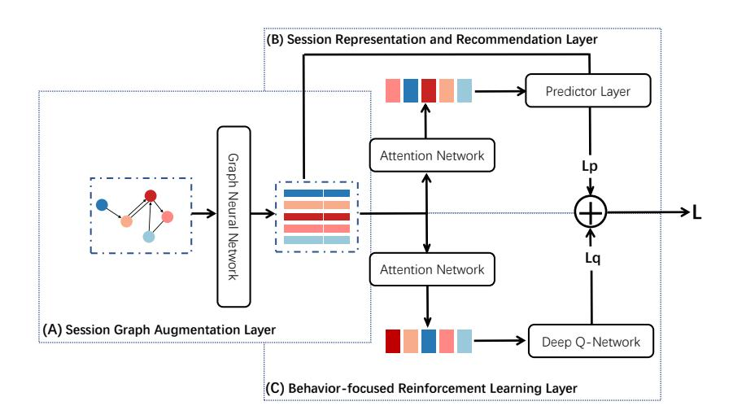
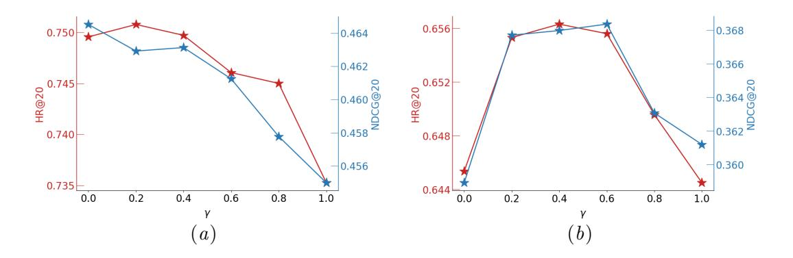
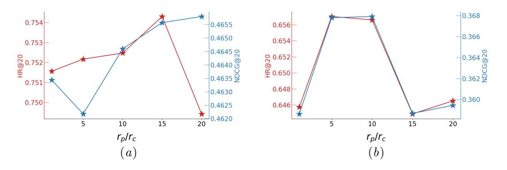

# Multi-behavior Session-based Recommendation via Graph Reinforcement Learning

Sichuan Normal University

Shuo Qin shuoqin@stu.sicnu.edu.cn Lin FengB fenglin@sicnu.edu.cn Lingxiao Xu Jayxlx@stu.sicnu.edu.cn Bowen Deng dengbw@stu.sicnu.edu.cn Siwen Li siwen@stu.sicnu.edu.cn Fancheng Yang lyric@stu.sicnu.edu.cn

Editors: Berrin Yanıko˘glu and Wray Buntine

## Abstract

Multi-behavior session-based recommendation (MBSBR) is a critical task in e-commerce and online advertising. By modeling these multiple behaviors, models can better capture the user intent and make more effective recommendations. However, existing models face the challenge of incompletely differentiating between different behavior types, which hinders their ability to fully capture the different tendencies exhibited by each behavior. In addition, most existing multi-behavior methods focus only on predicting a single target behavior and fail to achieve a unified model for predicting the next user-item interaction across multiple behavior types.

To address these limitations, we introduce reinforcement learning to the multi-behavior session-based recommendation task and propose a novel approach called the multi-behavior graph reinforcement learning network (MB-GRL). Specifically, we use a graph neural network to encode item transition information from the session graph. Then, we use an attention network to obtain a session representation and generate recommendations based on it. At the same time, we also apply Deep Q-Network (DQN) as a regularizer to improve the recommendation performance for certain behavior types. Experiments on various public benchmark datasets show that MB-GRL outperforms other models for multi-behavior session-based recommendation.

Keywords: Session-based Recommendation; Multi-behavior Recommendation; Graph Neural Network; Deep Reinforcement Learning.

### Introduction

Session-based recommendation (SBR) is an approach to recommendation systems that considers a user's previous interactions within a session to generate personalized recommendations. It is widely used in e-commerce, music and video streaming platforms, and other online services where users interact with the system over a series of sessions. SBR systems that use a sequence of user interactions (e.g. clicks, views, or purchases) within a session can deliver personalized and relevant recommendations, thereby increasing user engagement and satisfaction. With the advancement of deep learning techniques, various neural networkbased models (e.g. [\(Chung et al.,](#page-13-0) [2014;](#page-13-0) [Vaswani et al.,](#page-14-0) [2017;](#page-14-0) [Scarselli et al.,](#page-14-1) [2008\)](#page-14-1)) have been developed to capture users' short-term intentions, with promising results. Despite the significant progress in the field of SBR, most existing methods e.g. [\(Kang and McAuley,](#page-14-2) [2018\)](#page-14-2), [\(Wu et al.,](#page-15-0) [2019\)](#page-15-0) primarily focus on modeling user preferences using a single type of interactive behavior sequence. These approaches overlook the intricate patterns of behavior transitions that naturally occur in user sessions containing multiple behavior interactions. Although a few models have made efforts to incorporate multi-behavior information, they still face two major limitations.

- Different types of behaviors have different tendencies that can affect the quality of recommendations if not properly distinguished. For example, on the music streaming platforms Spotify, listening, sharing, and adding to favorites are three behaviors that reflect different aspects of the user's music preferences. Listening may shows the user's interest in the song's genre, artist, or mood. Sharing a song is a behavior that shows the user's enjoyment of the song and willingness to share it with others. Adding a song to favorites is a behavior that shows the user's desire for easy access and their attachment to the song. By correctly distinguishing these tendencies, the platform can better understand the user's music preferences and provide more personalized recommendations.
- The recommendation is constrained to a specific target behavior, which is a common practice in traditional multi-behavior session-based recommendation (MBSBR) frameworks (e.g. [Wang et al.](#page-14-3) [\(2020b\)](#page-14-3), [Yu et al.](#page-15-1) [\(2022\)](#page-15-1)). However, this approach is limited in its ability to generalize to other target behavior session recommendations and to achieve a unified model for predicting the next user-item interaction across multiple behavior types. For example, in Spotify, a recommendation method focused solely on predicting sharing behavior may not capture a comprehensive understanding of a user's music preferences. Users share songs for a variety reasons, including social signaling, promotion, or simple curiosity. Focusing only on sharing behavior may lead to inaccurate assumptions about their true music preferences, preventing the discovery of new and enjoyable music outside of their sharing patterns. This limitation can prevent the recommender system from effectively introducing users to new music.

To overcome these limitations, we incorporate reinforcement learning into the multibehavior session-based recommendation task and formulate the recommender system's decisionmaking process as a Markov Decision Process (MDP). We propose a novel method called Multi-behavior Self-supervised Graph Reinforcement Learning Network (MB-GRL) which combines the advantages of graph neural networks and reinforcement learning to capture user preferences at both item-level and behavior-level within a session. Specifically, we construct a directed graph from the session sequence and use a graph neural network (GNN) to encode item transition information from the session graph. Then, we use an attention network to obtain a session representation and generate recommendations based on it. At the same time, we also apply Deep Q-Network (DQN) as a regularizer to improve the recommendation performance for certain behavior types.

The main contributions of paper can be summarized as follows.

• We introduce reinforcement learning to the MBSBR task and model the recommender system as a Markov Decision Process.

### MB-GRL

<!-- Image Description: This flowchart depicts a three-layered recommendation system. Layer (A) shows a session graph (nodes and edges representing user interactions) inputted into a Graph Neural Network. Layer (B) uses attention networks to process the graph's embedding, generating session representations. Finally, layer (C) employs a Deep Q-Network within a reinforcement learning framework, combining outputs from (B) to predict recommendations (L), optimizing a loss function (Lp + Lq). The diagram illustrates the system's architecture, data flow, and component interactions. -->

- Figure 1: The model architecture of MB-GRl. (A) integrates the transition patterns of all items within a session along with the activated contextual information into the presentation of each item. (B) extract session representation that includes both the long-term preferences and current interests and make recommendation. (C) acts as a regularizer to fine-tune the recommendation performance.
  - We propose Multi-behavior Graph Reinforcement Learning Network (MB-GRL), a novel method that combines graph neural networks and reinforcement learning to capture user preferences at both the item and behavior level.
  - To evaluate the effectiveness of MB-GRL, we conduct extensive experiments on two benchmark datasets and compare our results with other methods. Our experimental results demonstrate the superiority of our approach in terms of recommendation performance.

# Related Work

## 1. Session-based Recommendation

Recent developments in recommendation have led to a renewed interest in session-based recommendation. From its early days, these models include the following: [\(Hidasi et al.,](#page-14-4) [2015\)](#page-14-4) adopts the GRU-based RNN for session-based recommendations. [\(Li et al.,](#page-14-5) [2017\)](#page-14-5) designed a hybrid encoder with an attention mechanism to model the user's sequential behavior and capture the current session information. Meanwhile, some models used GNN-based methods for session-based recommendation. [\(Wu et al.,](#page-15-0) [2019\)](#page-15-0) considered session sequences as graphstructured data, combined RNN to capture complex transitions of elements. [\(Xu et al.,](#page-15-2) [2019\)](#page-15-2) used GNN and self-attention mechanism for session-based recommendation. [\(Wang](#page-15-3) [et al.,](#page-15-3) [2020c\)](#page-15-3) considered global session information to better inferring the user preference of the current session. [\(Yu et al.,](#page-15-4) [2020\)](#page-15-4) promoted the representability of the recommender model.

### 2. Reinforcement Learning for Recommendation

Reinforcement Learning(RL) has achieved great performance in session-based recommendation. [\(Xin et al.,](#page-15-5) [2020\)](#page-15-5) proposes two frameworks namely Self-Supervised Q Learning (SQN) and Self-Supervised Actor-Critic (SAC) for recommendation. [\(Wang et al.,](#page-14-6) [2020a\)](#page-14-6) formalizes the sequential recommendation task as a Markov Decision Process and uses state representation, reward function and learning algorithm. [\(Zhou et al.,](#page-15-6) [2020\)](#page-15-6) via knowledge graph enhanced reinforcement learning method to solve the recommendation problem. [\(Deng et al.,](#page-13-1) [2021\)](#page-13-1) uses two action selection strategies to reduce the candidate action space. [\(Guo et al.,](#page-13-2) [2022\)](#page-13-2) proposes RL-ISN, which consists of a basic cross-domain recommender and a reinforcement learning-based domain filter to share account cross domain sequential recommendation. Therefore, we inspired these methods and design a new model that uses session information and combine with reinforcement learning.

#### 3. Multi-behavior Recommendation

Multi-behavior recommendation typically employs either collaborative filtering or graph neural network-based models to capture the user-item interaction characteristics from multiple types of behaviors [\(Gao et al.,](#page-13-3) [2019;](#page-13-3) [Jin et al.,](#page-14-7) [2020;](#page-14-7) [Xia et al.,](#page-15-7) [2021a\)](#page-15-7). [\(Wang et al.,](#page-14-3) [2020b\)](#page-14-3) first proposed learning global item-item relations using GNNs and integrating the embedding of the target and auxiliary behaviors of the current session via gating mechanisms. [\(Yu et al.,](#page-15-1) [2022\)](#page-15-1) aimed to capture potentially useful patterns of multi-behavior transitions at the feature and item levels. Meanwhile, [\(Xia et al.,](#page-15-8) [2021b\)](#page-15-8) uses the meta-learning paradigm to distill multi-behavior relationships and capture personalized high-order collaborative effects. Some multi-behavior recommendation methods focus on fine-grained interactions that occur within a session. To capture such interactions,[\(Meng et al.,](#page-14-8) [2020\)](#page-14-8) uses the sequence of item-operation pairs and employs knowledge embedding to obtain better session representations. [\(Qiao and Wang,](#page-14-9) [2022\)](#page-14-9) considers both user micro-behaviors and original interests for session-based recommendation, and learns item embedding from both item-level and operation-level to capture user intent.

### Preliminary

MBSBR systems aim to predict the user's next action or behavior based on their previous interactions within the same session, taking into account the different types of behavior exhibited by the user. Here we give a formulation of this problem as a blow.

In MBSBR, let V = {v1, v2, . . . , vm} denote the set consisting of all unique item involved in all sessions and an anonymous session sequence s ∈ S can be represented by a list s = [vs,1, vs,2, ..., vs,n] ordered by timestamps. In the context of MBSBR, a Markov Decision Process can be used to model the decision process of a recommender system. Formally, the MDP can be defined by a tuple (S, A, P, R, γ), where

• State Space S: A continuous state space describing the state o the session. In the SBR task, the session is considered to be the current state st at t time. This means that the interactions and behaviors within the current session serve as the contextual information for making recommendations.

- Action Space A: A discrete action space containing candidate items. The agent's action a is the selected item to recommend.
- Transition Probabilities P: The transition probability function P(st |st , at) represents the probability of transitioning to the next state st+1 after taking action a in state st .
- Reward Function R: The reward function r(st , at , st+1) defines the immediate reward received after transitioning from state st to st+1 by taking action at . In MBSBR with reinforcement learning, the reward function can be designed to take into account both click and purchase behavior, with different reward values assigned to each behavior.
- Discount Factor γ: The discount factor is a scalar value between [0, 1] that discounts the importance of future rewards. It represents the agent's preference for immediate rewards over delayed rewards.

The goal of the recommendation policy is to maximize the expected sum of discounted rewards over the user's session, i.e,

$$
\max_{\pi_{\theta}} \mathbb{E}_{\tau \sim \pi_{\theta}}[R(\tau)], where R(\tau) = \sum_{t=0}^{|\tau|} \gamma^t r(s_t, a_t)
$$
\n(1)

where θ ∈ R d denotes policy parameters. Note that the expectation is taken over trajectories τ = (s0, a0, s1, . . .), which are obtained by performing actions according to the target policy: , at ∼ πθ(·|st), st+1 ∼ P(·|st , at).

### Methodology

#### 1. Session Graph Augmentation Layer (module A)

### 1.1. Constructing Session Graphs

To represent a session sequence s as a directed graph, we use Gs = (Vs, Es), where each node in Vs represents an item vs,i in the sequence. The edges in Es are defined as (vs,i−1, vs,i), indicating that the user interacted with item vs,i after vs,i−1 in session s. Note that some items may appear multiple times in the sequence, so we assign a normalized weight to each edge, calculated as the frequency of that edge divided by the out-degree of its starting node. This normalization helps ensure that highly repeated items do not dominate the session graph representation.

# 1.2. Node Vectors Updating

Next, we present how to obtain latent feature vectors of nodes via graph neural network. We first convert each item v ∈ V into a unified low-dimensional latent space, and the node vector v ∈ R d and v 0 is the initial node feature in our model. For vs,i in session s, given by the adjacency matrices As,i, the information propagation at k layers GCN between different nodes can be formalized as:

$$
\mathbf{e}_{s,i}^k = \mathbf{A}_{s,i} [\mathbf{v}_1^{k-1}, \dots, \mathbf{v}_n^{k-1}]^T \mathbf{W}_a + \mathbf{b}
$$
 (2)

The weight matrices Wa ∈ R d×2d are used to control the weights in the session graph. As ∈ R n×2n determines how the nodes in the graph communicate with each other.

After [\(Li et al.,](#page-14-10) [2015\)](#page-14-10) we take it and the previous state v k−1 i as input. Thus, the final output v k i of the k-th GCN layer is computed as follows.

$$
\mathbf{v}_i^k = GRU(\mathbf{e}_{s,i}^k, \mathbf{v}_i^{k-1})
$$
\n(3)

## 2. Session Representation and Recommendation Layer (module B)

We have tried several ways to extract a session representation that includes both the longterm preference and the current interest of the session. Inspired by [\(Wu et al.,](#page-15-0) [2019\)](#page-15-0), we have found that the soft-attention mechanism already achieves comparable performance while maintaining low complexity. After feeding all session graphs into the gated graph neural networks, we obtain the vectors of all nodes. Then, to represent each session as an embedding vector hs ∈ R d .The soft-attention mechanism can be formalized as:

$$
\alpha_i = \mathbf{q}^T \sigma(\mathbf{W}_{s,1}\mathbf{v}_n + \mathbf{W}_{s,2}\mathbf{v}_i + \mathbf{b}_s)
$$
\n(4)

$$
\mathbf{h}_s = \sum_{i=1}^n \alpha_i \mathbf{v}_i \tag{5}
$$

Where the parameters q ∈ R d and Ws,1,Ws,2 ∈ R d×d correspond to long-term preference and current preference control the weights of the item embedding vectors. After obtaining the embedding of each session hs, we compute the score zs,i for each candidate item vi ∈ V by multiplying its embedding vi by the session representation hs, which can be defined as

zs,i = h T s v i (6)

$$
\mathbf{p}_s = softmax(\mathbf{z}_s) \tag{7}
$$

where z ∈ R m denotes the recommendation scores over all candidate items, and p ∈ R m denotes the probabilities of nodes appearing as the next interact in session s. For each session graph, the loss function is defined as the cross-entropy of the prediction and the ground truth y ∈ R m. It can be written as

$$
L_{SRR}(\mathbf{p}) = -\sum_{i=1}^{m} y_i log(\mathbf{p}_i) + (1 - y_i) log(1 - \mathbf{p}_i))
$$
\n(8)

### 3. Behavior-focused Reinforcement Learning layer (module C)

We incorporate a soft-attention mechanism to extract the state representation from the item sequence. Let st denote the state representation of session s at time t. The soft-attention mechanism is computed as follows:

$$
\alpha_i = \mathbf{q}_r^T \sigma(\mathbf{W}_{r,1}\mathbf{v}_n + \mathbf{W}_{r,2}\mathbf{v}_i + \mathbf{b}_r)
$$
\n(9)

$$
\mathbf{s}_t = \sum_{i=1}^n \alpha_i \mathbf{v}_i \tag{10}
$$

Importantly, although the two attention networks operate in the same way, their parameters are not shared. The importance of this approach will be demonstrated by experiments in Section 4.3, where we evaluate the performance of the model under different settings and compare the results obtained by using separate attention parameters.

After obtaining the representation st for each state, we can proceed to calculate the corresponding Q-value. This calculation allows us to estimate the expected future rewards associated with taking specific actions from that state. By considering the Q-value, we can make informed decisions on which actions to select during the recommendation process.

$$
Q(\mathbf{s}_t, \mathbf{a}_t) = \sigma(\mathbf{W}_q \mathbf{s}_t^T + \mathbf{b}_q)
$$
\n(11)

In the context of recommendation systems, where the action space consists of a large number of candidate items (on the order of magnitude of 105 ), it becomes necessary to adapt the method of calculating Q-values. As a result, we have made modifications to the traditional approach.

$$
Q(\mathbf{s}_t, \mathbf{a}_t) = \mathbf{a}_t(\mathbf{W}_q \mathbf{s}_t^T + \mathbf{b})
$$
\n(12)

where Wq ∈ R d×d , bq ∈ R d×1 are trainable parameters. To incorporate a fixed reward scheme that accounts for different user actions like clicks and purchases, we can represent the rewards using a piece-wise function. This approach allows us to assign specific values based on the user's action type.

$$
R(\mathbf{s}_t, \mathbf{a}_i) = \begin{cases} r_{\text{click}}, & \text{if user clicks item } \mathbf{a}_i \\ r_{\text{ purchase}}, & \text{if user purchases item } \mathbf{a}_i \\ 0, & \text{otherwise} \end{cases} \tag{13}
$$

Then we define the loss for behavior-focused Deep Q-learning layer based on the one-step TD error:

$$
\mathbf{a}_{t+1} = \underset{\mathbf{a}_{t+1}}{\operatorname{argmax}} Q(\mathbf{s}_{t+1}, \mathbf{a}_t) \tag{14}
$$

$$
L_{RL}(\mathbf{s}_t, \mathbf{a}_t) = (R(\mathbf{s}_t, \mathbf{a}_i) + \gamma Q(\mathbf{s}_{t+1}, \mathbf{a}_{t+1}) - Q(\mathbf{s}_t, \mathbf{a}_t))^2
$$
(15)

We jointly train the loss of the SRR and the loss of the BF-RL on the replay buffer generated from the implicit feedback data:

$$
L(\mathbf{p}, \mathbf{s}_t, \mathbf{a}_t) = L_{SRR}(\mathbf{p}) + L_{RL}(\mathbf{s}_t, \mathbf{a}_t)
$$
\n(16)

The behavior-focused reinforcement learning layer acts as a regularizer to fine-tune the recommendation performance according to our reward setting. The absence of negative rewards does not affect the model because the behavior-focused reinforcement learning layer is trained on positive actions, and the cross-entropy loss of the SRR provides the negative gradient signals coming from the denominator of Eq[.8.](#page-5-0)

To improve the stability of the learning, we use a double deep q-network (DDQN) to alternatively train two copies of the learning parameter. Algorithm [1](#page-7-0) describes the training procedure of our model.

| Algorithm 1 Training procedure of MB-GRL                                                 |
|---------------------------------------------------------------------------------------------|
| Input: : Replay buffer B; Target network update rate ϵ                             |
| Output: All parameters in learning space Θ                                               |
| Initialize all trainable parameters                                                         |
| ′ ← target network parameters θ policy network parameters θ                     |
| repeat                                                                                      |
| Draw a mini-batch of (st , at , rt , d, st+1) ∈ B                            |
| Get item embedding according to Eq.[2-3]                                                    |
| Get session representation hs according to Eq.[4, 5]                               |
| Get state representation stt , stt+1 according to Eq.[9, 10]                 |
| at+1 = agrmax Qθ(st+1, at)                                                      |
| at+1                                                                                        |
| at))2 lRL = (rt + γQθ ′(st+1, at+1) − Qθ(st ,                    |
| Calculate loss l according to [8,16]                                                  |
| Perform updates by ∇ΘL                                                                   |
| ′ ′ Update the target network parameters: θ q = ϵθq + (1 − ϵ)θ q |
| until converge                                                                           |
|                                                                                             |

### Experiment

In this section, we conduct extensive experiments on multi-behavior session-based recommendation to evaluate the performance of our model by answering the following three research questions:

- RQ1: Compared to other MBSBR models, do our models achieve better performance?
- RQ2: How do the key modules of our models affect model performance?
- RQ3: How does the setting of hyperparameters affect the effectiveness of our model?

#### 1. Experimental Setup

# 1.1. Datasets

We evaluate the proposed method on two public benchmark datasets, namely Yoochoose[1](#page-7-1) and RetailRocket[2](#page-7-2) . The Yoochoose dataset is derived from RecSys Changllenge 2015 and

1. https://recsys.acm.org/recsys15/challenge/

2. https://www.kaggle.com/datasets/retailrocket/ecommerce-dataset

# MB-GRL

| Statistic              | Yoochoose | RetailRocket |
|------------------------|-----------|--------------|
| No. of items           | 200,000   | 195,523      |
| No. of sessions        | 26,702    | 70,852       |
| Avg. of session length | 5.75      | 6.88         |
| No. of click           | 1,110,965 | 1,176,680    |
| No. of purchase        | 43,946    | 57,269       |

Table 1: Statistics of datasets used in experiments

contains a stream of user actions on an e-commerce website over a period of six months. Action types include clicks and purchases. The RetailRocket is collected from a real ecommerce website. It includes sequential view and add to cart events. To be consistent with the Yoochoose dataset, we treat views as clicks and add to cart as purchases.

For a fair comparison, follow [\(Xin et al.,](#page-15-5) [2020\)](#page-15-5) and [Liu et al.](#page-14-11) [\(2022\)](#page-14-11) we filter out all sessions whose length is less than 3 and items that are interacted with less than 3 times. then we sample 200k sessions from the Yoochoose dataset. Finally, we have 1,110,965 clicks and 43,946 purchases over 26702 items in Yoochoose dataset, while 1,176,680 clicks and 57,269 purchases over 70852 items in RetailRocket. The statistics of the datasets are summarized in Table 1.We randomly divide the two datasets into training set, validation machine and test set according to the ratio of [0.8, 0.1, 0.1].

# 1.2. Baseline Models

To demonstrate the superior performance of ousr model, we compared it to the following representative methods for MBSBR:

- GRU4Rec[\(Hidasi et al.,](#page-14-4) [2015\)](#page-14-4) used the GRU to capture the item sequence representation for session-based recommendation.
- SASRec[\(Kang and McAuley,](#page-14-2) [2018\)](#page-14-2) is motivated b self-attention and uses the Transformer architecture. The output of the Transformer encoder is treated as a the latent representation for the input session sequences.
- SR-GNN[\(Wu et al.,](#page-15-0) [2019\)](#page-15-0) used GNN to capture the item transition patterns and generated the session representation based on the attention module.
- GC-SAN[\(Xu et al.,](#page-15-2) [2019\)](#page-15-2) used the multi-head self-attention mechanism to generate the session representation based on the multi-head self-attention mechanism.
- MBGCN[\(Jin et al.,](#page-14-7) [2020\)](#page-14-7) constructed a heterogeneous graph with user-item and item-item relationships to model multi-behavior interactions.
- MGNN-SPred[\(Wang et al.,](#page-14-3) [2020b\)](#page-14-3) converted sequences into a global item-item graph and used the GNN to learn item representations and integrate different session representations through the gating mechanism.

- SASRec-SQN[\(Xin et al.,](#page-15-5) [2020\)](#page-15-5) applied the self-supervised reinforcement learning frameworks SQN to SRSRec to improve its effectiveness in MBSBR tasks
- SASRec-SA2C[\(Xin et al.,](#page-15-9) [2022\)](#page-15-9) introduce negative samples into the self-suprevised learning framework to achieve supervised advantage Actor-Critic (SA2C).
- CP4Rec[\(Xie et al.,](#page-15-10) [2022\)](#page-15-10) is a contrastive pre-training framework for sequential recommendation.
- CP4Rec-CDARL[\(Liu et al.,](#page-14-11) [2022\)](#page-14-11) is based on CP4Rec, We integrate CDARL with it to augment the recommendation performance.

Table 2: Top-k recommendation performance comparison of different models (k=5, 10, 20) on Yoochoose and RetailRocket. NG is short for NDCG. Boldface denotes the highest score.

| Yoochoose              | purchase        |                 |                 |                 |                 |                 |                 | click           |                 |                 |                 |                 |  |
|------------------------|-----------------|-----------------|-----------------|-----------------|-----------------|-----------------|-----------------|-----------------|-----------------|-----------------|-----------------|-----------------|--|
|                        | HR@5            | HR@10           | HR@20           | NG@5            | NG@10           | NG@20           | HR@5            | HR@10           | HR@20           | NG@5            | NG@10           | NG@20           |  |
| GRU4Rec                | 0.371           | 0.479           | 0.560           | 0.260           | 0.295           | 0.316           | 0.310           | 0.410           | 0.495           | 0.213           | 0.245           | 0.267           |  |
| SR-GNN                 | 0.534           | 0.641           | 0.729           | 0.384           | 0.419           | 0.441           | 0.432           | 0.555           | 0.653           | 0.300           | 0.340           | 0.365           |  |
| SR-GNN                 | 0.534           | 0.641           | 0.729           | 0.384           | 0.419           | 0.441           | 0.432           | 0.555           | 0.653           | 0.300           | 0.340           | 0.365           |  |
| GC-SAN                 | 0.486           | 0.598           | 0.689           | 0.348           | 0.384           | 0.407           | 0.394           | 0.511           | 0.608           | 0.276           | 0.314           | 0.339           |  |
| MBGCN                  | 0.318           | 0.421           | 0.496           | 0.221           | 0.255           | 0.274           | 0.320           | 0.426           | 0.516           | 0.218           | 0.253           | 0.275           |  |
| MGNN-Spred             | 0.447           | 0.562           | 0.656           | 0.319           | 0.356           | 0.380           | 0.307           | 0.419           | 0.519           | 0.208           | 0.245           | 0.270           |  |
| SASRec-SQN             | 0.434           | 0.551           | 0.644           | 0.307           | 0.344           | 0.367           | 0.327           | 0.426           | 0.507           | 0.226           | 0.258           | 0.279           |  |
| SASRec-SA2C            | 0.471           | 0.576           | 0.665           | 0.339           | 0.373           | 0.396           | 0.344           | 0.440           | 0.519           | 0.241           | 0.272           | 0.292           |  |
| CP4Rec                 | 0.424           | 0.546           | 0.642           | 0.294           | 0.334           | 0.358           | 0.315           | 0.413           | 0.495           | 0.217           | 0.249           | 0.269           |  |
| CP4Rec-CDARL           | 0.445           | 0.564           | 0.652           | 0.311           | 0.350           | 0.373           | 0.328           | 0.428           | 0.509           | 0.226           | 0.259           | 0.280           |  |
| MB-GRL (ours)          | 0.598           | 0.685           | 0.754           | 0.433           | 0.461           | 0.477           | 0.435           | 0.558           | 0.655           | 0.303           | 0.343           | 0.367           |  |
| 95% CI                 | 0.012           | 0.008           | 0.003           | 0.013           | 0.010           | 0.007           | 0.002           | 0.002           | 0.001           | 0.002           | 0.002           | 0.002           |  |
|                        | 11.906%         | 6.871%          | 3.454%          | 12.701%         | 10.016%         | 8.176%          | 0.733%          | 0.571%          | 0.325%          | 0.875%          | 0.757%          | 0.607%          |  |
| imporve                |                 |                 |                 |                 |                 |                 |                 |                 |                 |                 |                 |                 |  |
|                        | purchase        |                 |                 |                 |                 |                 |                 |                 |                 |                 |                 |                 |  |
| RetailRoctet           |                 |                 |                 |                 |                 |                 |                 |                 |                 | click           |                 |                 |  |
|                        | HR@5            | HR@10           | HR@20           | NG@5            | NG@10           | NG@20           | HR@5            | HR@10           | HR@20           | NG@5            | NG@10           | NG@20           |  |
|                        |                 |                 |                 |                 |                 |                 |                 |                 |                 |                 |                 |                 |  |
| GRU4Rec                | 0.281           | 0.312           | 0.346           | 0.241           | 0.251           | 0.260           | 0.185           | 0.218           | 0.253           | 0.150           | 0.161           | 0.170           |  |
| SASRec                 | 0.527           | 0.592           | 0.634           | 0.430           | 0.451           | 0.462           | 0.254           | 0.309           | 0.357           | 0.193           | 0.211           | 0.223           |  |
| SR-GNN                 | 0.421           | 0.454           | 0.488           | 0.366           | 0.376           | 0.385           | 0.295           | 0.319           | 0.343           | 0.260           | 0.268           | 0.274           |  |
| GC-SAN                 | 0.472           | 0.533           | 0.590           | 0.391           | 0.410           | 0.425           | 0.322           | 0.378           | 0.431           | 0.259           | 0.277           | 0.291           |  |
| MBGCN                  | 0.093           | 0.127           | 0.176           | 0.065           | 0.076           | 0.088           | 0.058           | 0.085           | 0.124           | 0.039           | 0.048           | 0.057           |  |
| MGNN-Spred             | 0.240           | 0.300           | 0.360           | 0.176           | 0.195           | 0.210           | 0.185           | 0.244           | 0.314           | 0.133           | 0.152           | 0.170           |  |
| SASRec-SQN             | 0.568           | 0.620           | 0.662           | 0.462           | 0.481           | 0.491           | 0.276           | 0.330           | 0.380           | 0.210           | 0.228           | 0.241           |  |
| SASRec-SA2C            | 0.593           | 0.644           | 0.680           | 0.508           | 0.525           | 0.534           | 0.287           | 0.341           | 0.389           | 0.224           | 0.242           | 0.254           |  |
| CP4Rec CP4Rec-CDARL | 0.536 0.582  | 0.601 0.639  | 0.649 0.685  | 0.436 0.479  | 0.456 0.498  | 0.467 0.509  | 0.261 0.280  | 0.316 0.338  | 0.368 0.391  | 0.199 0.213  | 0.217 0.231  | 0.230 0.245  |  |
|                        |                 |                 |                 |                 |                 |                 |                 |                 |                 |                 |                 |                 |  |
| MB-GRL (ours)          | 0.687           | 0.733           | 0.767           | 0.587           | 0.602           | 0.611           | 0.435           | 0.495           | 0.550           | 0.350           | 0.370           | 0.384           |  |
| 95% CI improve      | 0.016 15.87% | 0.016 13.76% | 0.016 12.82% | 0.019 15.64% | 0.017 14.72% | 0.016 14.44% | 0.012 35.01% | 0.016 30.90% | 0.019 27.70% | 0.008 35.28% | 0.010 33.52% | 0.011 31.94% |  |

For original methods GRU4REC, SASRec, SR-GNN and GC-SAN, they are designed for the general session-based recommendation, which only consider single-click behavior. And multi-behavior based models MGNN-SPred and MBGCN, which focus on next item prediction with specific target behavior based on historical multiplexed interaction sequence. To make the comparison more fairer, we revise these methods as follows.

We use the original forms of signal-behavior models and reinforcement learning model for experiments. For MGNN-SPred, we do not split the session sequence into target and

## MB-GRL

| models | purchase |       |       |        |         |         |       | click |       |        |         |         |  |
|--------|----------|-------|-------|--------|---------|---------|-------|-------|-------|--------|---------|---------|--|
|        | hr@5     | hr@10 | hr@20 | ndcg@5 | ndcg@10 | ndcg@20 | hr@5  | hr@10 | hr@20 | ndcg@5 | ndcg@10 | ndcg@20 |  |
| TD     | 0.562    | 0.666 | 0.745 | 0.404  | 0.438   | 0.458   | 0.438 | 0.560 | 0.657 | 0.305  | 0.345   | 0.369   |  |
| OA     | 0.570    | 0.668 | 0.746 | 0.410  | 0.442   | 0.462   | 0.437 | 0.559 | 0.657 | 0.305  | 0.344   | 0.368   |  |
| SP     | 0.388    | 0.517 | 0.612 | 0.255  | 0.296   | 0.321   | 0.266 | 0.385 | 0.499 | 0.170  | 0.208   | 0.237   |  |
| MB-GRL | 0.606    | 0.691 | 0.755 | 0.433  | 0.470   | 0.484   | 0.435 | 0.558 | 0.655 | 0.302  | 0.342   | 0.367   |  |

Table 3: Top-k recommendation performance comparison of different models (k=5, 10, 20) on Yoochoose. Boldface denotes the highest score.

auxiliary sequences, but use a single chronological sequence of items. In addition, we use a GRU instead of a gated mechanism to update the session representation obtained by mean pooling to reduces the influence of previous modifications. We also modified MBGCN, retaining only its item-item graph neural network component and removing the user-related module, to align with the SBR task definition and reform the item-item edges with the same behavior within a session.

# 1.3. Implementation Details

Following [\(Xin et al.,](#page-15-5) [2020\)](#page-15-5), we use the last 10 items leading up to the target time and pad shorter sequences as needed. Our models are trained using the Adam optimizer, with a mini-batch size of 256. The item embedding size is set to 64, and we initialize all parameters using a Gaussian distribution with a mean of 0 and a standard deviation of 0.1. We set the learning rate to 0.01 for the RC15 dataset and 0.005 for the RetailRocket dataset. we define the fixed behavioral rewards for our models. Specifically, we assign a click reward of 0.2 and a purchase reward of 1.0. During the hyper-parameter tuning process, we conduct experiments on the validation set to select the optimal values. We find that a discount factor γ of 0.3 and a Graph Neural Network (GNN) depth K of 1 yield the best results. To ensure a fair comparison with other models, we keep the parameters consistent. In particular, the hidden state size of GRU4Rec is set to 64. Following the original paper, we configure SASRec with 1 head in self-attention and we stack 4 self-attention blocks in GC-SAN.

# 1.4. Evaluation Metrics

We evaluate the performance of all models using the follow widely used metrics:

- Hit Ration (HR@K) is a widely used measure of predictive accuracy. It indicates the proportion of correctly recommended items among the top-K items.
- Normalized Discounted Cumulative Gain (NDCG@K) is a measure of the effectiveness of a ranking system that taking into account the position of relevant items in the ranked list. It is based on the idea that items that are higher in the ranking should be given more credit than items that are lower in the ranking.

## 2. Overall Comparison (RQ1)

The results of the comparisons on two datasets are reported in Table [2.](#page-9-0) The following significant observations can be made.

- Model Effectiveness. As shown in the table above, MB-GRL outperforms all baselines on every metric for various behaviors. This result confirms that our model is suitable for the MBSBR task.
- Our model can distinguish the different tendencies of different behavior types. Unlike other single-behavior models, such as SR-GNN or SASRec, MB-GRL excels in all behavior types. This shows the advantage of the BF-RL layer, which can learn the different intention strengths of different behavior types by assigning different rewards for each behavior type. However, SR-GNN, GC-SAN, and others cannot capture these differences and treat all items with different interaction types equally.
- Our model achieves competitive performance among the multi-behavioral approaches. Compared to other multi-behavior models such as MBGCN and MGNN-SPred, our model outperforms them. For MGNN-SPred, it uses the multiplexed behavior data in a simplified way, which may cause the loss of information in the original data. For MBGCN, the structure removed to meet the requirements of the SBR task limits the ability to capture the contextual relationship of items in a session.

### 3. Ablation Study (RQ2)

In our ablation studies, we evaluated our model under different settings:

- OA. This setting solely utilizes the SRR layer to make the final recommendation and calculate the loss during the training phase.
- TD. In this setting, we replace the soft-attention mechanism with a three-layer MLP and mean pooling to obtain the session representation in the BF-RL layer.
- SP. Here, we use only one soft-attention mechanism to generate both the session representation and state representation.

By examining the performance of our model under these ablation settings, we gain insights into the individual contributions and effects of different components and mechanisms within our proposed approach. Table [3](#page-10-0) shows the corresponding results on the Yoochoose dataset. Our model exhibits a notable advantage over other models in predicting purchasing behavior. Simultaneously, it performs on par with other models in predicting click behavior. This highlights the effectiveness of incorporating reinforcement learning in distinguishing the diverse tendencies among different behaviors. Furthermore, the attention network plays a crucial role in extracting session representations from the session item sequence. However, the SRR layer requires the session representation to encompass both long-term preferences and current interests, whereas the BF-RL layer relies on the state representation to differentiate between the varied tendencies among different behaviors. It becomes apparent that a single attention network alone cannot generate a latent vectors that fulfills both requirements simultaneously.

<!-- Image Description: The image contains two line graphs (a) and (b), each displaying the performance of two methods (red and blue stars) across varying values of γ (gamma). Each graph plots Hit Rate (HR@20) and Normalized Discounted Cumulative Gain (NDCG@20) as evaluation metrics. The graphs illustrate how these metrics change as γ changes, showing the impact of this parameter on the system's performance. The purpose is to present a comparative analysis of the two methods' sensitivity to γ. -->

#### 4. Hyper-parameters Study (RQ3)

Figure 2: MB-GRL with different discount factors on Yoochoose. (a) represent the performance change for purchase behavior prediction; (b) represent the performance change for click behavior prediction.

Effect of Discount Factor. In this section, we show how the discount factor affects recommendation performance. Figure [2](#page-12-0) shows MB-GRL's HR@20 and NDCG@20 with different discount factors on the Yoochoose dataset. The results on RetailRocket show similar trends and are not shown here. We can see that the performance of MB-GRL improves as the discount factor γ increases from 0. γ = 0 means that the model doesn't consider long-term rewards and focuses only on immediate feedback. This observation leads to the conclusion that considering long-term rewards improves the overall HR and NDCG for both click and purchase recommendations. However, we can also see the decrease in performance when the discount factor is too large. Compared to the game control domain where there may be thousands of steps in an MDP, the session sequence is much shorter. The average sequence length of two datasets is less than 7. As a result, although γ = 0.95 or 0.99 is a common setting for game control, a smaller discount factor should be applied under the recommendation settings.

Effect of Reward Settings. To evaluate the effect of the RL reward setting on model performance, we run experiments with different values of the ratio rp/rc between the purchase and click rewards. Figure [3](#page-13-4) shows the results of the HR@20 and NDCG@20 metrics on the Yoochoose dataset. We observe that the model performance improves as the ration increases, indicating that the RL head is effectively guiding the model to focus on the desired rewards. However, when the ration becomes too high, the performance deteriorates. This may be due to the instability of the TD updates caused by the large reward discrepancy.

### Conclusion

This paper introduces reinforcement learning to the multi-behavior conversational recommendation task and proposes a novel method called MB-GRL. Our method combines the advantages of graph neural networks and deep reinforcement learning to address the limitations of current models in predicting the next user-item interaction across multiple behavior

<!-- Image Description: The image contains two line graphs (a) and (b), each showing the performance of two methods (red and blue lines, marked with stars) across varying ratios (rp/rc). Graph (a) plots HR@20 and NDCG@20, while graph (b) plots HR@20 and NDCG@20 for a different dataset or scenario. The x-axis represents the ratio, while the y-axis shows the evaluation metrics (HR@20 and NDCG@20). The graphs illustrate how the performance of the two methods changes with respect to the ratio, allowing for a comparison of their sensitivity to this parameter. -->

Figure 3: MB-GRL with different reward setting on Yoochoose. (a) represent the performance change for purchase behavior prediction; (b) represent the performance change for click behavior prediction.

types and correctly distinguishing different tendencies among different behaviors. For future work, we plan to explore other applications of graph reinforcement learning in recommender systems. We will also consider additional the recommendation system performance metrics, such as diversity and fairness.

### Acknowledgments

This paper is supported by the Sichuan Science and Technology Program under Grants 2023YFS0202, 2023YFG0267 and 2023NSFSC0210.

### References

- Junyoung Chung, Caglar Gulcehre, KyungHyun Cho, and Yoshua Bengio. Empirical evaluation of gated recurrent neural networks on sequence modeling. arXiv preprint arXiv:1412.3555, 2014.
- Yang Deng, Yaliang Li, Fei Sun, Bolin Ding, and Wai Lam. Unified conversational recommendation policy learning via graph-based reinforcement learning. In Proceedings of the 44th International ACM SIGIR Conference on Research and Development in Information Retrieval, pages 1431–1441, 2021.
- Chen Gao, Xiangnan He, Dahua Gan, Xiangning Chen, Fuli Feng, Yong Li, Tat-Seng Chua, and Depeng Jin. Neural multi-task recommendation from multi-behavior data. In 2019 IEEE 35th international conference on data engineering (ICDE), pages 1554–1557. IEEE, 2019.
- Lei Guo, Jinyu Zhang, Tong Chen, Xinhua Wang, and Hongzhi Yin. Reinforcement learningenhanced shared-account cross-domain sequential recommendation. IEEE Transactions on Knowledge and Data Engineering, 2022.

- Bal´azs Hidasi, Alexandros Karatzoglou, Linas Baltrunas, and Domonkos Tikk. Session-based recommendations with recurrent neural networks. arXiv preprint arXiv:1511.06939, 2015.
- Bowen Jin, Chen Gao, Xiangnan He, Depeng Jin, and Yong Li. Multi-behavior recommendation with graph convolutional networks. In Proceedings of the 43rd International ACM SIGIR Conference on Research and Development in Information Retrieval, pages 659–668, 2020.
- Wang-Cheng Kang and Julian J. McAuley. Self-attentive sequential recommendation. CoRR, abs/1808.09781, 2018. URL <http://arxiv.org/abs/1808.09781>.
- Jing Li, Pengjie Ren, Zhumin Chen, Zhaochun Ren, Tao Lian, and Jun Ma. Neural attentive session-based recommendation. In Proceedings of the 2017 ACM on Conference on Information and Knowledge Management, pages 1419–1428, 2017.
- Yujia Li, Daniel Tarlow, Marc Brockschmidt, and Richard Zemel. Gated graph sequence neural networks. arXiv preprint arXiv:1511.05493, 2015.
- Zhuang Liu, Yunpu Ma, Marcel Hildebrandt, Yuanxin Ouyang, and Zhang Xiong. Cdarl: a contrastive discriminator-augmented reinforcement learning framework for sequential recommendations. Knowledge and Information Systems, 64(8):2239–2265, 2022.
- Wenjing Meng, Deqing Yang, and Yanghua Xiao. Incorporating user micro-behaviors and item knowledge into multi-task learning for session-based recommendation. In Proceedings of the 43rd international ACM SIGIR conference on research and development in Information Retrieval, pages 1091–1100, 2020.
- Jingjing Qiao and Li Wang. Modeling user micro-behaviors and original interest via adaptive multi-attention network for session-based recommendation. Knowledge-Based Systems, 244:108567, 2022.
- Franco Scarselli, Marco Gori, Ah Chung Tsoi, Markus Hagenbuchner, and Gabriele Monfardini. The graph neural network model. IEEE transactions on neural networks, 20(1): 61–80, 2008.
- Ashish Vaswani, Noam Shazeer, Niki Parmar, Jakob Uszkoreit, Llion Jones, Aidan N Gomez, Lukasz Kaiser, and Illia Polosukhin. Attention is all you need. Advances in neural information processing systems, 30, 2017.
- Pengfei Wang, Yu Fan, Long Xia, Wayne Xin Zhao, ShaoZhang Niu, and Jimmy Huang. Kerl: A knowledge-guided reinforcement learning model for sequential recommendation. In Proceedings of the 43rd International ACM SIGIR conference on research and development in Information Retrieval, pages 209–218, 2020a.
- Wen Wang, Wei Zhang, Shukai Liu, Qi Liu, Bo Zhang, Leyu Lin, and Hongyuan Zha. Beyond clicks: Modeling multi-relational item graph for session-based target behavior prediction. In Proceedings of the web conference 2020, pages 3056–3062, 2020b.

- Ziyang Wang, Wei Wei, Gao Cong, Xiao-Li Li, Xian-Ling Mao, and Minghui Qiu. Global context enhanced graph neural networks for session-based recommendation. In Proceedings of the 43rd international ACM SIGIR conference on research and development in information retrieval, pages 169–178, 2020c.
- Shu Wu, Yuyuan Tang, Yanqiao Zhu, Liang Wang, Xing Xie, and Tieniu Tan. Session-based recommendation with graph neural networks. In Proceedings of the AAAI conference on artificial intelligence, volume 33, pages 346–353, 2019.
- Lianghao Xia, Chao Huang, Yong Xu, Peng Dai, Xiyue Zhang, Hongsheng Yang, Jian Pei, and Liefeng Bo. Knowledge-enhanced hierarchical graph transformer network for multi-behavior recommendation. In Proceedings of the AAAI Conference on Artificial Intelligence, volume 35, pages 4486–4493, 2021a.
- Lianghao Xia, Yong Xu, Chao Huang, Peng Dai, and Liefeng Bo. Graph meta network for multi-behavior recommendation. In Proceedings of the 44th international ACM SIGIR conference on research and development in information retrieval, pages 757–766, 2021b.
- Xu Xie, Fei Sun, Zhaoyang Liu, Shiwen Wu, Jinyang Gao, Jiandong Zhang, Bolin Ding, and Bin Cui. Contrastive learning for sequential recommendation. In 2022 IEEE 38th international conference on data engineering (ICDE), pages 1259–1273. IEEE, 2022.
- Xin Xin, Alexandros Karatzoglou, Ioannis Arapakis, and Joemon M Jose. Self-supervised reinforcement learning for recommender systems. In Proceedings of the 43rd International ACM SIGIR conference on research and development in Information Retrieval, pages 931–940, 2020.
- Xin Xin, Alexandros Karatzoglou, Ioannis Arapakis, and Joemon M Jose. Supervised advantage actor-critic for recommender systems. In Proceedings of the Fifteenth ACM International Conference on Web Search and Data Mining, pages 1186–1196, 2022.
- Chengfeng Xu, Pengpeng Zhao, Yanchi Liu, Victor S Sheng, Jiajie Xu, Fuzhen Zhuang, Junhua Fang, and Xiaofang Zhou. Graph contextualized self-attention network for sessionbased recommendation. In IJCAI, volume 19, pages 3940–3946, 2019.
- Bo Yu, Ruoqian Zhang, Wei Chen, and Junhua Fang. Graph neural network based model for multi-behavior session-based recommendation. GeoInformatica, 26(2):429–447, 2022.
- Feng Yu, Yanqiao Zhu, Qiang Liu, Shu Wu, Liang Wang, and Tieniu Tan. Tagnn: Target attentive graph neural networks for session-based recommendation. In Proceedings of the 43rd international ACM SIGIR conference on research and development in information retrieval, pages 1921–1924, 2020.
- Sijin Zhou, Xinyi Dai, Haokun Chen, Weinan Zhang, Kan Ren, Ruiming Tang, Xiuqiang He, and Yong Yu. Interactive recommender system via knowledge graph-enhanced reinforcement learning. In Proceedings of the 43rd international ACM SIGIR conference on research and development in information retrieval, pages 179–188, 2020.
