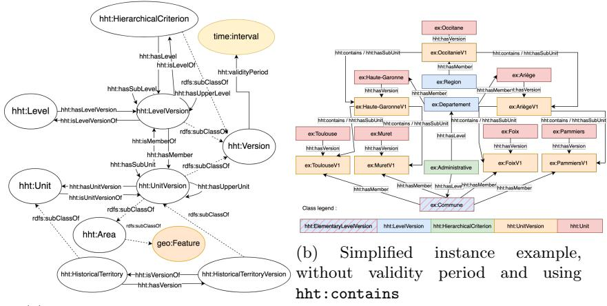
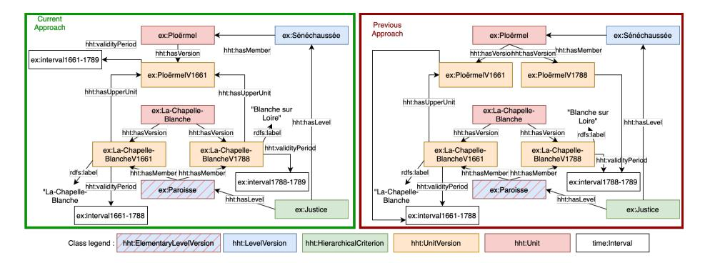
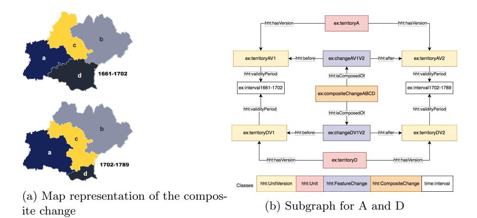
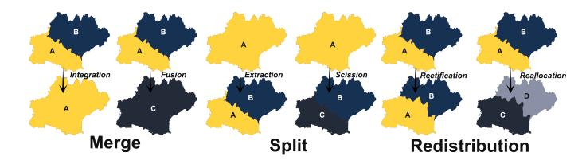

# HHT: An Approach for Representing Temporally-Evolving Historical Territories

W. Charles1 , N. Aussenac-Gilles1 , and N. Hernandez1

IRIT - Université de Toulouse name.surname@irit.fr

Abstract. The notion of territory plays a major role in human and social sciences. Representation of this spatio-temporal object and computation of the changes occurring have been tackled in various ways. However, in an historical context, most approaches are irrelevant as they rely on geometric data, which is not available. In order to represent historical territories,we conceived the HHT ontology (Hierarchical Historical Territory) to represent hierarchical historical territorial divisions, without having to know their geometry. This approach relies on a notion of building blocks to replace polygonal geometry. This representation is further used to provide an algorithm to detect and characterize territorial changes in a knowledge graph. Said algorithm creates a knowledge graph of changes at multiple levels encompassing basic changes occurring in a single territory, and composite changes, which are the abstraction of several smaller changes into a large change. The approach was followed to produce 3 knowledge graphs available online. Each of these graphs allowed to set up an analysis of the evolution of the territories during the historical period they cover.

Keywords: Territory Ontology · Evolution Representation · Change Detection Algorithm · Digital Humanities

Resource Type: Ontology Resource Type: Software and datasets License: Creative Common 4.0 License: Creative Common 4.0 DOI: 10.5281/zenodo.7451702 DOI: 10.5281/zenodo.7451408 URL:https://w3id.org/HHT URL:https://github.com/Brainchain09/HHT-SHACL

# 1 Introduction

In the context of digital humanities, representing territories as they once were is a keen issue. Among many issues arising when attempting to represent historical territories is their geometrical representation [13]. While it is common to use a vector geometry representation when tackling space-spanning entities, the available historical data generally has no geometric representation, which makes such approaches difficult to implement, whether it be for representation or reasoning about changes. In addition, in an historical approach, it is to be noted that representing the geometry of territories could be considered as a representation bias. It is known for example that, back in the 18th century, the typical representation of a territory was a list of places [6]. Another dimension of historical territories is their layered structure within multiple hierarchies. While current territorial hierarchies rely on a single territorial division, labeled as a nomenclature (example: INSEE in France), contexts such as the modern period in France call for several hierarchy layers depending on the power dimension considered (religious, administrative, etc.). As of now, to the best of our knowledge, no ontology nor change detection algorithm takes these two features into account. Thus, this paper proposes an algorithm to detect territorial changes relying on a data representation using an ontology we created, HHT (Historical Hierarchical Territories). Section 2 tackles the state of the art regarding historical territory representation. Section 3 addresses HHT, the ontology we propose for this purpose. Section 4 describes the algorithm used to detect and qualify changes in a knowledge graph relying on HHT. Finally, section 5 presents the evaluation of said algorithm for multiple datasets displaying various particularities.

# 2 Representing historical territories and changes

### 2.1 Inherent difficulties in representing historical territories

Representing historical territories is complex due to various factors. First, it is necessary to represent the hierarchical relations between the various territories. Several approaches exist to represent multi-level territorial divisions, whether they be context specific approaches (RAMON1 for NUTS) or generic approaches (TSN [3]), they all describe hierarchies covering a whole territory according to a single nomenclature. It is, for example, impossible to simultaneously represent both an administrative territorial division and a religious one in TSN. Representing the geometry is also an issue for historical territories, as it is often found to be either missing or imprecise [13]. However, most approaches [3, 15] rely on full geometry description, such as TSN which uses a GeoSPARQL representation.

#### 2.2 Territories as temporal entities

When representing historical territories, temporal evolution is to be taken into account, thus inducing these territories to be considered as perdurant entities [3] as defined in the DOLCE ontology [8]. This ontology introduces the notions of perdurants, which are objects whose temporal properties evolve, as opposed to endurants which retain the same properties through their whole existence. Several approaches have been developed over the years to represent such entities. In [10], a general conceptual framework is proposed for temporal entities that distinguishes between SNAP (endurants) and SPAN (perdurants) ontologies. The 4D-Fluents approach [17] is also a common solution when representing perdurants [2]. It relies on representing perdurants as a series of time slices. More precisely, while an instance p represents the entity itself, it is attached to several time slices which represents its state at various points in time. Some recent work go further by generalizing this approach to describe any kind of statement

1 http://ec.europa.eu/eurostat/ramon/ontologies/geographic.rdf

context [9]. However, as pointed out in [1], the main drawback is the proliferation of entities represented due to the multiple time-slices, which both increases the size of the dataset and makes reasoning more complex. In TSN, as in other approaches [12], time-slicing is handled by creating a new version of the whole hierarchy for every change, regardless of whether every territory actually evolves or not. Regarding TSN, this approach is legitimate as they represent territory nomenclatures defined by a central organism which seldom issues a new version. In an historical context, however, territories and their hierarchies tend to evolve without a centralized management. The aforementioned approach would result in an overfragmentation of the time-slices in most cases. Other approaches, such as Temporal RDF [11] rely on time stamping properties. This can be achieved using several techniques, such as reification, named graphs, n-ary relations or RDF\* [14]. However, representing and reasoning on temporally variable properties is still a challenge, as representing several temporal aspects of a single identity implies both a more complex representation and reasoning. In our approach we adapt the structure of TSN to an historical context by locating the versionning at the territory scale instead of the whole hierarchy.

### 2.3 Review of change representation and reasoning

Change ontological representation In approaches such as fluents[17], change representation is implicit. However approaches exist which rely on explicitly representing changes. The notion of Change Bridge is proposed in [13] to link two territory time slices (input and output) thus representing an evolution from one time slice to the other. A lightweight spatiotemporal vocabulary is defined, which describes changes in five classes (Changepartof, Establishment, Merge, Namechange, Split). Change representation can be furthered by defining changes on various scales. [7] introduces three levels of change representation: changes involving only one entity (such as an expansion), functional relations between two units (such as replacements), and composite changes (such as split or merge). TSN-Change [4] proposes a similar change representation. However, it only retains the single-entity and change categories, the last category being implicitly represented due to their hybrid approach relying on both fluents and change bridges. This ontology adds more categories in regard of identity, with the distinction between Continuation (identities are not impacted) and Derivation (identities are impacted) changes [16]. This ontology also provides a vocabulary to describe the relations between changes, and build a change graph. It notably defines a notion of lowerChange and upperChange which allows to define multiple levels of change. While the taxonomy of the latter is wide-ranged, the semantics of the relations between changes are not precise enough (for example, lowerChange is both used to link changes between various territories and between a territory and a nomenclature), and will be replaced with mereology relations in our approach.

Change detection algorithms TSN provides an algorithm to automatically represent changes [4]. This algorithm is used to match entities in two consecutive versions of a nomenclature. It includes both a statistical identity preservation matching of entities, and an explicit qualification of changes. However, this algorithm is not intended to reason on an existing knowledge graph but rather to create a complete knowledge graph from raw data. Furthermore, part of the analysis carried out when computing the differences between two versions is a geometric comparison relying on geospatial vector files. This issue is partly tackled in the original change bridge approach[13]. This approach comes with an algorithm which relies on explicitly representing local changes (i.e. changes at the city scale, for example) in order to infer greater scale changes. However, this approach relies on knowing the extent of the surface of local entities (50 km2 for example), which is still not always available in an historical context.

# 3 The HHT Ontology for historical territories

### 3.1 Territory representation and link with TSN

To sum up, historical territories require an ontology that would allow representation of multiple overlaying hierarchies and their evolution, without knowledge of the territories' geometry. In order to take into account all these particularities of historical territory representation, the HHT ontology was proposed, basing on the TSN ontology [3], while focusing on units instead of nomenclatures. Figure 1a presents the main concepts and main properties of the territory representation proposed by HHT. All figures are available in the ontology documentation. It mostly revolves around the classes hht:Unit which represents a territorial unit, its subtype hht:HistoricalTerritory which adds the notion of control by an actor (not discussed in this paper), hht:Level which categorizes a hierarchical level, and hht:HierarchicalCriterion which corresponds to the criterion related to a level (example: Religious). This class is one of the main differences with TSN and enables the coexistence of multiple hierarchy layers on a single geographic space. However, we retain the level and unit versioning architecture. Instances of hht:Unit and hht:Level are bearers of the identity of the real world entities they represent. In order to represent their successive states, they are provided respectively with hht:UnitVersion and hht:LevelVersion through the adequate hht:hasVersion subproperty. Each unit version is a member of a level version which materializes its level in the hierarchy. Unit versions on a given level can be linked to Sub/Upper units that are members of the Sub/Upper level. Each of these hht:Version has property hht:validityPeriod providing the time stamp of the described state relying on OWL-Time's interval concept. Considering that UnitVersions have their own validity period is one other main difference with TSN. In order to further reduce the fragmentation into slices, the impact of lower/upper territories on a hht:UnitVersion was tackled. It was first decided to redefine the time slices of a hht:Unit whenever one of its hierarchically linked territories was modified [5]. However, this naive approach was found to induce an over-fragmentation of the time slices. It was thus decided that the timeline of a hht:Unit would only be fragmented (by increasing the number of

(a) Schema of the HHT Ontology

Fig. 1: HHT Ontology: classes and instanciation

its versions) whenever a change in lower territories induces a change of the territory's geometry (see section 3.2). Hierarchical relations (hht:hasSubUnit and hht:hasUpperUnit) are thus valid only during the intersection of the validity intervals of the hht:UnitVersion it links. Note the existence of a super property for hht:hasSubUnit, hht:contains which describes geometry inclusion and is transitive. This property is notably used to access the building blocks of a version, as described in section 3.2. Figure 1b presents a multi-level description of territories using HHT. It omits validity periods, which are considered to be the same for all versions. Figure 2 presents an example of representation using HHT, both with the current and the previous time fragmenting. In the current approach (left part of the figure), the renaming of ex:La-Chapelle-Blanche leads to this entity having two versions. However, as renaming does not affect the geometry of ex:Ploëmel, this hht:Unit retains only one hht:UnitVersion to which both versions of the lower territory are related through the hht:hasUpperUnit property (the validity of said property is implicitly the intersection of the validity intervals of both versions). In the former approach (right part of the figure), however, ex:Ploëmel gets two versions, resulting in a heavier knowledge graph (that would get heavier as we get higher in the hierarchy).

#### 3.2 Discrete Geometry and building blocks

As mentioned in section 2.1, geometry is an issue when representing historical territories. In order to address this, geometry representation is achieved by using a notion of building block, which are assumed to exist across the whole study period. A subclass of hht:LevelVersion, hht:ElementaryLevelVersion qualifies a hierarchical level version whose members (instances related to the level version with the hht:isMemberOf property) are territory versions that are building

Fig. 2: Examples of current and previous version fragmentation

blocks of the geometry. In this approach, a territory geometry is discrete, and is can be defined for every hht:UnitVersion. Considering such an entity v, we define geometry as the set of hht:Unit that have a version contained by v that is identified as a member of a hht:ElementaryLevelVersion. These units are (by definition of the elementary level) hierarchically inferior to said territory. To guarantee a time-consistent geometry, we consider a set of hht:Unit, and not of hht:UnitVersion. Building blocks can go through non-geometrical evolutions (such as name changes), and thus have multiple versions even though their geometry is considered as fixed. Formally, given u a hht:UnitVersion, we can define its geometry as the set of versions of the lowest (elementary) level territorial units that compose it:

geometry(u) = {b|∃bLevel, bV ersion, hht : contains(u, bV ersion)∧ hht : isMemberOf(bV ersion, bLevel) ∧ hht : elementaryLevelV ersion(bLevel)∧ hht : hasUnitV ersion(b, bV ersion)} (1)

In figure 1b, we have geometry(ex : OccitanieV 1) = {ex : Muret, ex : T oulouse, ex : F oix, ex : P amiers}. This definition uses hht:contains, which is transitive. However it does not imply that the geometry of a unit is the sum of that of its direct sub units. This apparent flaw is legitimated in an historical context due to impreciseness in historical sources (an elementary level unit stated to be inside a higher level unit without describing the intermediate hierarchy). Note that despite describing the geometry of evolving territories, this definition is devoid of any temporal component as it is defined for hht:UnitVersion, which are already temporally stamped.

#### 3.3 HHT-Change: Representing and qualifying change

So far, we presented how HHT allows to represent hierarchical territories through time. The HHT ontology also allows to explicitly represent changes that occur between versions, and to describe their nature. Change representation in HHT is strongly based on the TSN ontology in regard of change taxonomy [3]. However,

Fig. 3: An arbitrary composite change

the change description structure is quite different. While TSN-Change relies on a multi-level change genealogy, we distinguish between feature changes, which describe a change regarding a single change, and composite changes which are linked together using a mereology approach.

In this article, we focus on hht:FeatureChange and hht:CompositeChange, which are the two relevant classes when dealing with temporal evolution. Figure 3 displays an arbitrary composite change, and figure 3b presents a simplified subgraph for territories A and D which will be used to illustrate those examples.

hht:FeatureChange represents a change involving two hht:UnitVersion of the same hht:Unit. The nature of the change can be further qualified using subclasses. These classes include attribute changes (hht:NameChange), geometry changes (hht:GeometryChange), which can further be qualified with subclasses, and life cycle related changes (hht:Appearance, hht:Disappearance). Note that a feature change should be qualified using several subclasses whenever several properties are affected by it (hht:GeometryChange and hht:NameChange). A hht:FeatureChange is linked to the two versions of the hht:Unit it involves through the relations hht:before and hht:after, as seen in figure 3b. While hht:Appearance (respectively hht:Disappearance) instances will only have a hht:after (respectively hht:before) property, all other hht:FeatureChange should have exactly one value for each property, as it is intended to link two consecutive versions of the same hht:Unit.

Further in this article, given a feature change c, we refer to the hht:Unit-Version instance b verifying hht : before(c, b) as cbefore and, similarly, to the hht:UnitVersion instance a verifying hht : af ter(c, a) as caf ter.

As opposed to a hht:FeatureChange, a hht:CompositeChange is meant to represent a change that involves unit versions related to several hht:Unit. More accurately, the goal of the hht:CompositeChange class is to assemble several feature changes in order to make sense of those changes on a broader level. As of now, the only kind of hht:CompositeChange that can be described using HHT are geometry alterations (hht:GeometryRestructuring).

A hht:GeometryRestructuring change can further be defined as the smallest non-empty set of hht:FeatureChange describing a unit of hht:Level l covering a geometric area and occurring simultaneously, meaning that a given composite change g (g rdf:type hht:GeometryRestructuring) should verify the following equations, denoting the set of the changes that are part of this composite change as gset = {c|htt : F eatureChange(c) ∧ hht : isComposedOf(c, g)} :

$$
\bigcup_{c \in g_{set}} geometry(c_{before}) = \bigcup_{c \in g_{set}} geometry(c_{after})
$$
\n(2)

$$
\forall c_s \subset g_{set} \bigcup_{c \in g_{set} \setminus c_s} geometry(c_{before}) \neq \bigcup_{c \in g_{set} \setminus c_s} geometry(c_{after})
$$
 (3)

∀c ∈ gset∃lversion, level|

(hht : isMemberOf(cbefore, lversion) ∧ hht : hasLevelV ersion(lversion, level)) ∨ (hht : isMemberOf(cafter, lversion) ∧ hht : hasLevelV ersion(lversion, level)) (4)

∃date|∀c ∈ gset

(∃interval|hht : validityP eriod(cbefore, interval) ∧ time : hasEnd(interval, date))∨ (∃interval|hht : validityP eriod(cafter, interval)∧time : hasBeginning(interval, date)) (5)

(2) guarantees that the geometry covered by the before and after territories is equal, while (3) guarantees that the composite change found is not the fusion of several composite changes. (4) guarantees that all changes that are part of g affect territories at the same level. Finally (5) specifies that all feature changes composing g should occur at the same date. Note that this last constraint prevents two changes linking versions of the same hht:Unit to be part of the same hht:GeometryRestructuring, as there should not be two simultaneous feature changes on a single territory.

HHT further defines subclasses to qualify the type of hht:GeometryRestructuration an area undergoes. They are separated into three categories depending on the type of geometry alteration (split, merge, redistribution) and further separated depending on their preserving the territories identity (continuation change) or not (derivation change). Figure 4 presents examples of these categories.

# 4 Change detection algorithm

Building on HHT-Change, we now aim to automatically detect and qualify the changes occurring between the various time slices described in a knowledge graph using HHT to describe territories. A rule based algorithm was implemented in order to achieve this goal. It is important to take into account some particularities of the knowledge graphs on which said algorithm should be applied:

Representing Temporally-Evolving Historical Territories 9

Fig. 4: The various types of hht:GeometryRestructuring

- Said knowledge graph should describe the territorial hierarchy only for a specified time period. The Third French Republic dataset used for evalution in section 5.1, for example, describes the French administrative hierarchy from 1870 to 1940. Such time boundaries are essential to properly detect appearances and disappearances. The instances of hht:UnitVersion described in the knowledge graph will have their validity interval truncated to fit in the focus of the knowledge graph, and no knowledge will be represented regarding the status of any territory before and after said time focus. Thus, the algorithm would be erroneous if it detected an appearance for each hht:UnitVersion being valid starting from 1870 and having no previous version in the knowledge graph, as this would be due to the graph focus.
- Instances of hht:Unit which are member of an elementary level should exist in the knowledge graph across its whole time focus.

The algorithm was designed to be implemented using SHACLRules which rely on SHACL and SPARQL to allow the user to write rules. Resulting implementation is available in the provided GitHub resource.

#### 4.1 Algorithm description

| Algorithm 1 Change detection and qualification algorithmic steps                    |
|-------------------------------------------------------------------------------------|
| Add the "next version" property linking each version to its chronological successor |
| Add the feature changes                                                             |
| Qualify feature changes                                                             |
| Create composite changes depending on the feature changes                           |
| Qualify composite changes                                                           |
|                                                                                     |

Algorithm 1 presents the global steps involved in fully creating and qualifying the changes. This section will further detail how each step is achieved.

Finding the next version The use of SHACLRules allows to carry out SPARQL queries to create new triples in a specified order. Thus, each of the steps of algorithm 1 will be implemented using one or several SPARQL queries included in SHACL Shapes specifying to which graph nodes these queries should be applied.

Adding feature changes This step from algorithm 1 is actually divided into four steps. The first two steps rely on the finding of the next version that has been carried out in the previous step. Considering two versions v1 and v2 such as hht : hasNextV ersion(v1, v2), the steps proceed as follows:

- Adding basic hht:FeatureChange: wherever the validity interval of v1 meets v2's (using Allen's algebra) we add a hht:FeatureChange c verifying before(c, v1) and af ter(c, v2). This case describes changes on two consecutive versions.
- Adding hht:Reappearance: wherever the validity interval of v1 does not meet v2's, we add a hht:Disappearance d verifying before(c, v1) and a hht:Reappearance verifying af ter(c, v2). This case describes the disappearance of a hht:Unit followed by its reappearance.

The next two steps will allow the algorithm to add appearances and remaining disappearances. Considering a version v1 such as there is no v2 where hht : hasNextV ersion(v1, v2), the following steps consequently are:

- Adding hht:Disappearance: if v1's end of validity interval is not the upper bound of the time focus of the knowledge graph, we add a hht:Disappearance d verifying before(c, v1).
- Adding hht:Appearance: if v1's start of validity interval is not the lower bound of the time focus of the knowledge graph, we add a hht:Appearance d verifying before(c, v1).

It is to be noted that the time focus of the knowledge graph is as of now to be specified inside SHACLRules specification. Further work should include using graph annotation mechanisms to enable a more generic use of our algorithm.

Qualifying feature changes The previous step created a set of hht:Feature-Change that we want to further qualify. Provided a c change, the algorithm will run several comparisons between cbefore and caf ter. For simple attributes such as name, the difference is quite easy to compute. Geometry comparisons however, considering our definition, require more fine grained analysis. Intuitively, a geometry change means that geometry(cbefore) ̸= geometry(caf ter). Furthermore, HHT-Change goes further by defining subclasses to hht:geometryChange, which form a partition of the possible cases:

- A hht:Contraction describes the case where:
  - geometry(cbefore) ̸⊆ geometry(caf ter)∧geometry(caf ter) ⊆ geometry(cbefore) (6)

In more common terms, a contraction describes the case of a loss of a geometry portion. As SPARQL is not designed to carry out set comparisons, it is calculated using cardinality comparisons regarding card(geometry(cbefore)), card(geometry(caf ter)) and card(geometry(cbefore) ∩ geometry(caf ter)). Equation (6) is rephrased as:

$$
card(geometry(c_{before})) > card(geometry(c_{after})) \land card(geometry(c_{after}))
$$
  
= card(geometry(c\_{before}) \cap geometry(c\_{after})) . (7)

This condition can be implemented in SPARQL using several SPARQL COUNT inside the query.

– A hht:Expansion describes the case where:

geometry(cbefore) ⊆ geometry(caf ter)∧geometry(caf ter) ̸⊆ geometry(cbefore) (8)

. In more common terms, an expansion describes the case of a gain of a geometry portion. SPARQL however, is not designed to carry out set comparisons. In a similar fashion, (8) is rephrased as:

$$
card(geometry(c_{before})) < card(geometry(c_{after})) \land card(geometry(c_{before}))
$$
  
= 
$$
card(geometry(c_{before}) \cap geometry(c_{after}))
$$
. (9)

– A hht:Deformation describes the case where:

geometry(cbefore) ̸⊆ geometry(caf ter)∧geometry(caf ter) ̸⊆ geometry(cbefore) (10)

. This case typically describes the simultaneous loss of some geometry portions and gain of others. Similarly, (10) is rephrased as follows:

$$
card(geometry(c_{before})) > card(geometry(c_{before}) \cap geometry(c_{after}))
$$
$$
\land card(geometry(c_{after}))
$$
$$
> card(geometry(c_{before}) \cap geometry(c_{after}))
$$
$$
). (11)
$$

Adding meaningful geometry Restructurings from feature changes We now aim to add composite changes that will collect several related hht:FeatureChange. As mentioned in section 3.3, as of now, composite changes are only geometry related. This section will tackle how we manage to create hht:Composite-Change which, provided the initial knowledge graph describes all building blocks across the whole graph's time focus, will respect equations (2), (3), (4) and (5). First of all, it is mandatory to identify which hht:FeatureChange subclasses can be involved in a hht:GeometryRestructuring. In addition to hht:GeometryChange, all hht:Appearance, hht:Disppearance and hht:Reappearance induce a remapping of an area, and should thus be aggregated in order to form a coherent hht:GeometryRestructuring. More importantly, if all the hht:UnitVersion are described properly in regard of the building blocks they contain, any single instance of those subtypes of change should be involved in a hht:GeometryRestructuring. Assuming the knowledge graph description of building blocks is time-exhaustive,

#### 12 W. Charles, N. Aussenac-Gilles, and N. Hernandez

any building block b disappearing from the geometry of a territory t1 should appear in another territory t2. Thus, in order to aggregate hht:FeatureChange, the algorithm relies on finding other changes happening at the same time and featuring the adding/removing of the building blocks that are removed/added during a given hht:FeatureChange. In the example in figure 3, d loses part of its geometry to a and c. Starting from the hht:FeatureChange d goes through, we will thus find the changes involving a and c. Same goes for the gains. In order to properly aggregate changes, and considering the possibilities of SHACLRules, we propose algorithm 2 to achieve those steps.

| Algorithm 2 Create a composite change |  |  |  |
|---------------------------------------|--|--|--|
|---------------------------------------|--|--|--|

Create a composite change for all geometry altering change which are not attached to one already Carry out the same operation for those who are attached For all hht:FeatureChange involved in hht:CompositeChange, declare those to be the same entity

To understand the need for those steps, consider a, b, c and d, as presented in figure 3. Consider now an execution of the rule-based algorithm. During the first step, the algorithm will create a new hht:CompositeChange cha attached to the changes of d and a, as a absorbs part of d. Then comes b. A new composite change chb is created, which is attached to the changes of c and b. c and d are skipped during this step, as they have already been attached to a composite change. In a second step, then, we aggregate the change of c to cha and d to chb, due to the change of c. We now have reached a situation where we describe cha et chb, which both represent parts of the same hht:GeometryRestructuring (note that as of now, (1) is not verified by none of those changes). The third step is thus there to unify those partial composite changes by linking them with owl:sameAs properties.

Qualifying composite changes With the composite changes being created, the next step consists in qualifying them according to the categories displayed in figure 4. This is achieved in two steps:

– Geometric nature of the composite change (Split, Merge, Redistribution): Similarly to what was done for feature changes, qualification boils down to cardinality considerations. However, the involved cardinalities are not those of geometries, but of territories before and after the change. Consider a hht:GeometricRestructuring g.

We define gb = {t|∃c, tv|hht : isComposedOf(c, g) ∧ hht : before(c, tv) ∧ hht : hasUnitV ersion(t, tv)} and ga = {t|∃c, tv|hht : isComposedOf(c, g)∧ hht : af ter(c, tv) ∧ hht : hasUnitV ersion(t, tv)}. We then give those formal definitions for Merge (12), Split (13), and Redistribution (14):

$$
card(g_b) > 1 \wedge card(g_a) = 1 \tag{12}
$$

Representing Temporally-Evolving Historical Territories 13

$$
card(g_b) = 1 \land card(g_a) > 1 \tag{13}
$$

$$
card(g_b) > 1 \wedge card(g_a) > 1 \tag{14}
$$

– Identity Preservation: A hht:DerivationChange (15) is a change which preserves no identity. A hht:ContinuationChange (16) is a change that preserves the most identities considering the change type. Similarly, we provide formal definitions that can be easily translated to SHACLRules. Note that these equations induce that derivation and continuation change are disjoint but not complementary. Redistribution can typically induce ambiguous cases where the identity of one territory is impacted while the others are not.

$$
card(g_b \cap g_a) = 0 \tag{15}
$$

$$
(card(g_a) > card(g_b) \land card(g_b \cap g_a) = card(g_b))
$$
  
 
$$
\lor card(g_b) > card(g_a) \land card(g_b \cap g_a) = card(g_a))
$$
 (16)

Those two steps being achieved, OWL inference will manage the qualification in the six final categories.

### 4.2 Extension for flawed data detection

As mentioned, the algorithm properly qualifying changes rely on a time-exhaustive description of the geometric building blocks. Thus an extension was implemented to compensate for this. This extension, named HHT-SHACL FDD (for flawed data detection), adds a step after the detection of geometric changes during which geometric changes are scrutinized to determine whether the geometric change is due to an actual building block relocation (in which place said block can be traced to another territory) or to a building block unexpected appearance/disappearance. This extension can be used to avoid erroneous change qualification, and to detect lacking territory knowledge in the graph. Typically, some of the building blocks are bound to evolve across the time focus of the knowledge graph. Sometimes, however this evolution means that they appear/disappear at some time, mainly because they merge/split with another building block. These disappearances/appearances can also be due to data that exists but is missing from the knowledge graph. This will cause invalid detection of geometry changes. The algorithm will report such changes as Incomplete.

# 5 Evaluation

Our algorithm was evaluated on several datasets which all had particularities. Tests were carried out using the TopBraid API, which allows to evaluate SHA-CLRules. This section will tackle these evaluations, and their results. All datasets complemented with data description as well as the algorithm results are available online in the git resource. A script is also provided to convert CSV tables to HHT knowledge graphs. Finally, the git resource provides several SPARQL queries, and a query comparison with TSN.

#### 14 W. Charles, N. Aussenac-Gilles, and N. Hernandez

### 5.1 French Third Republic

This dataset is the simplest the algorithm was tested on. It focuses on the French territory from 1870 to 1939. Only one hierarchy is represented, which has three levels (Commune, Arrondissement and Département). Data was represented using HHT, after being converted from CSV tables. Finally, all the building blocks (Communes, here) are described across the whole timespan of the knowledge graph, making this dataset fully-compliant with our approach. It is interesting to note that out of 211 hht:CompositeChange, only 181 are geometrically qualified. This difference is due to cases where a territory disappears to be replaced by another one occupying the exact same geometry, which were not considered in our approach. Such cases occur in this particular dataset mostly due to the reintegration of some part of the French territory following the first World War. The analysed changes were compared with results from an economists' study regarding territory evolution on this same period. The feature changes detected matched those found manually. Interestingly enough, it was shown that, by listing changes by year, it was possible to identify easily identify periods of great changes. In this dataset, for example, 241 feature changes occur in 1926, which coincides with the greatest territorial reform of the Third Republic. Humanities researches are also provided with a deeper analysis due to the aggregation of feature changes in composite changes. This dataset was also used to evaluate HHT-SHACL FDD. In order to have accurate results, it was mandatory to check that original data had been properly converted. The HHT-SHACL FDD approach was instrumental in that regard. Typically, the initial conversion script did not consider the possibility of some units disappearing to reappear afterwards. Those inconsistencies were pointed out by HHT-SHACL FDD, which allowed to reach a fully consistent knowledge graph.

### 5.2 NUTS

To evaluate our algorithm on a larger knowledge graph, it was used to detect changes in the NUTS (Nomenclature of territorial units for statistics)2 nomenclature from 2010 to 2016. More precisely, this dataset describes the NUTS and LAU (Local Administrative Units)3 nomenclatures for 14 of the 28 countries of the European Union, and was generated from an existing RDF dataset describing the NUTS hierarchy, and tables published on Eurostat describing the LAU levels. Some countries were removed due typically to arbitrary and non documented changes in territory IDs in the found data. The countries still described vary from the original dataset due to the removal of some LAU2 units which did not respect the hypothesis of description across the whole timespan. A high amount of name changes are found, mostly due to spelling variants. In addition, this particular dataset highlighted the high computing time involved whenever a territory with a large geometry (i.e. with a large number of building blocks) takes part in a geometry change (due to the computing of geometry intersection).

2 https://ec.europa.eu/eurostat/web/nuts/background

3 https://ec.europa.eu/eurostat/web/nuts/local-administrative-units

#### 5.3 France: Region reform

The goal of this evaluation was to test the behaviour of the algorithm when confronted to unproperly formalized data. This dataset was created by combining datasets provided by INSEE. Timeslicing was handled by creating one timeslice for each territory described in the original datasets, meaning that most territories are described as having two versions regardless of any difference between those two versions. As a consequence, in this dataset, Fragmentation is carried out poorly, with some hht:Unit having two temporally-consecutive hht:UnitVersion which describe the same properties. In addition, some building blocks aren't described across the whole timespan. Those inconsistencies with the algorithm's hypothesis lead to flaws in the results. Changes are detected between two versions that are describing the exact same properties, as they should be described as the same version. Geometry changes are detected where they should not, due to building block disappearances. 82 geometry changes are detected, but HHT-SHACL FDD denotes those 82 changes as Incomplete. Despite those erroneous change detections, it is to be noted that the composite changes are still properly aggregated. All the regions's fusions are detected, and qualified as merges.

# 6 Conclusion

Currently, the HHT approach allows to represent historical territories, by taking into account multiple overlaying hierarchies, providing a geometry definition that does not rely on knowledge of any vector geometry or surface figure. The evolution of territories can also be represented using an approach based on fluents[17]. This representation was chosen due to its being easily grasped by historians. However, it is important to highlight the high amount of time slices it induces, and the endeavor it requires in order to minimize overslicing. Further work will address the possible use of approaches relying on time stamping properties instead of creating new objects, notably in regard of a possible weight reduction of the final knowledge graph. Another representation dimension that is to be addressed by further work will be the linking of knowledge to the sources it has been extracted from inside the graph. The HHT approach also comes with an algorithm allowing to detect changes occurring for any territory, and aggregating those to reveal composite changes describing a global geometry remapping. Said algorithm is currently limited by the need to describe all the building blocks across the whole time focus of the graph. Though the FDD approach points out inconsistencies in the detected changes, this issue is to be further tackled. Various solutions are currently considered. The first would consist in a naive approach where disappearing/appearing building blocks would simply be ignored. A second possible approach would rely on applying part of the change bridge[13] algorithm by explicitly representing changes occurring at a local level. Finally, a third approach would consist in considering hybrid geometries, with some territories having a defined vector geometry.

# References

- 1. Batsakis, S., Petrakis, E.G.: Sowl: a framework for handling spatio-temporal information in owl 2.0. In: International Workshop on Rules and Rule Markup Languages for the Semantic Web. pp. 242–249. Springer (2011)
- 2. Batsakis, S., Petrakis, E.G., Tachmazidis, I., Antoniou, G.: Temporal representation and reasoning in owl 2. Semantic Web 8(6), 981–1000 (2017)
- 3. Bernard, C.: Immersing evolving geographic divisions in the semantic Web. Ph.D. thesis, Université Grenoble Alpes (2019)
- 4. Bernard, C., Villanova-Oliver, M., Gensel, J., Dao, H.: Modeling changes in territorial partitions over time: Ontologies tsn and tsn-change. In: Proceedings of the 33rd Annual ACM Symposium on Applied Computing Pages (SAC '18). p. 866–875 (04 2018). https://doi.org/10.1145/3167132.3167227
- 5. Bourel, L., Hernandez, N.J., Aussenac-Gilles, N., Charles, W.: HHT : une ontologie modulaire pour représenter l'évolution des territoires en Histoire. In: Saïs, F. (ed.) 33ème Journées Francophones d'Ingénierie des Connaissances (IC 2022). pp. 131– 136. IC 2022 : Journées Francophones D'Ingénierie des Connaissances, Collège SIC (Science de l'Ingénierie des Connaissances) de l'AFIA, AFIA, Saint-Etienne, France (Jun 2022), https://hal.archives-ouvertes.fr/hal-03760559
- 6. Carbonnet, A.: Léonard dauphant, géographies. ce qu'ils savaient de la France (1100-1600). ceyzérieu, champ vallon, 2018, 318 p. Médiévales. Langues, Textes, Histoire 75(75), 261–263 (2018)
- 7. Claramunt, C., Thériault, M.: Managing time in gis: An event-oriented approach. pp. 23–42 (01 1995). https://doi.org/10.1007/978-1-4471-3033-8\_2
- 8. Gangemi, A., Guarino, N., Masolo, C., Oltramari, A., Schneider, L.: Sweetening ontologies with dolce. In: International conference on knowledge engineering and knowledge management. pp. 166–181. Springer (2002)
- 9. Giménez-García, J.M.: Formalizing, Capturing, and Managing the Context of Statements in the Semantic Web. Ph.D. thesis, Université Lyon (2022)
- 10. Grenon, P., Smith, B.: Snap and span: Towards dynamic spatial ontology. Spatial Cognition & Computation 4, 104 – 69 (2004)
- 11. Gutierrez, C., Hurtado, C., Vaisman, A.: Temporal rdf. In: European Semantic Web Conference. pp. 93–107. Springer (2005)
- 12. Hyvönen, E., Tuominen, J., Kauppinen, T., Väätäinen, J.: Representing and utilizing changing historical places as an ontology time series. In: Ashish, N., Sheth, A.P. (eds.) Geospatial Semantics and the Semantic Web: Foundations, Algorithms, and Applications, pp. 1–25. Springer US, Boston, MA (2011). https://doi.org/10.1007/978-1-4419-9446-2\_1, https://doi.org/10.1007/978-1- 4419-9446-2\_1
- 13. Kauppinen, T., Hyvönen, E.: Modeling and reasoning about changes in ontology time series. In: Ontologies, pp. 319–338. Springer (2007)
- 14. Lasolle, N.: Temporalité et représentation des connaissances pour un corpus en histoire : application à la correspondance d'Henri Poincaré (May 2022), https://hal.univ-lorraine.fr/hal-03681513, working paper or preprint
- 15. Lin, C., Su, H., Knoblock, C.A., Chiang, Y.Y., Duan, W., Leyk, S., , Uhl, J.H.: Building linked data from historical maps. SemSci@ ISWC pp. 59–67 (2018)
- 16. Plumejeaud, C., Mathian, H., Gensel, J., Grasland, C.: Spatio-temporal analysis of territorial changes from a multi-scale perspective. International Journal of Geographical Information Science 25(10), 1597–1612 (2011). https://doi.org/10.1080/13658816.2010.534658, https://hal.inria.fr/hal-00953145

17. Welty, C., Fikes, R., Makarios, S.: A reusable ontology for fluents in owl. In: FOIS. vol. 150, pp. 226–236 (2006)