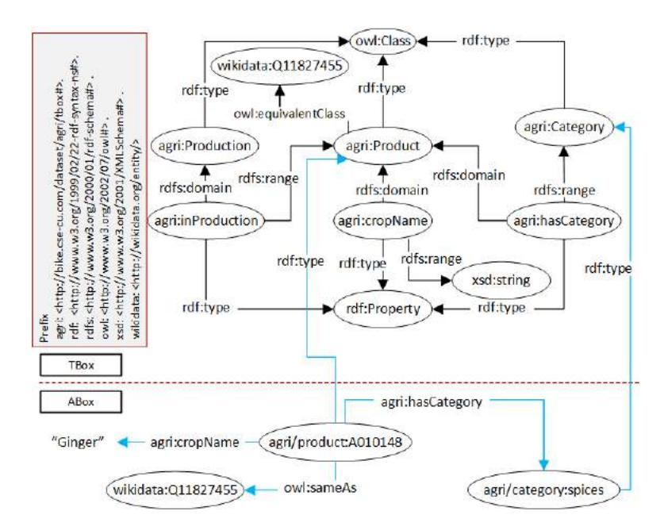
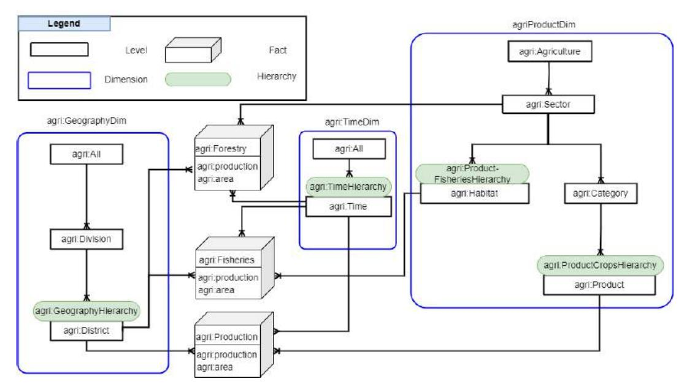
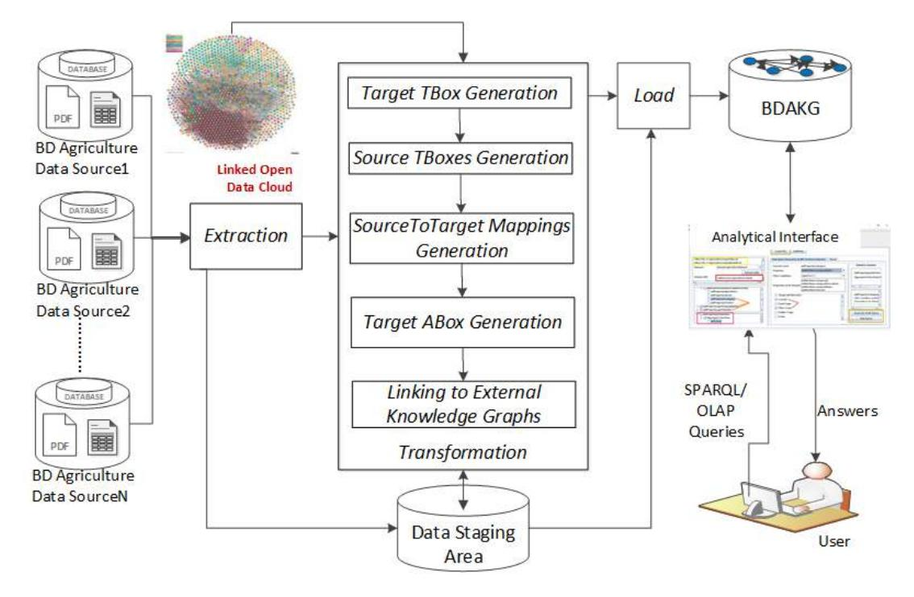
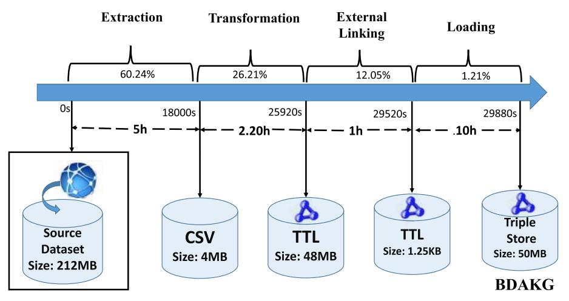
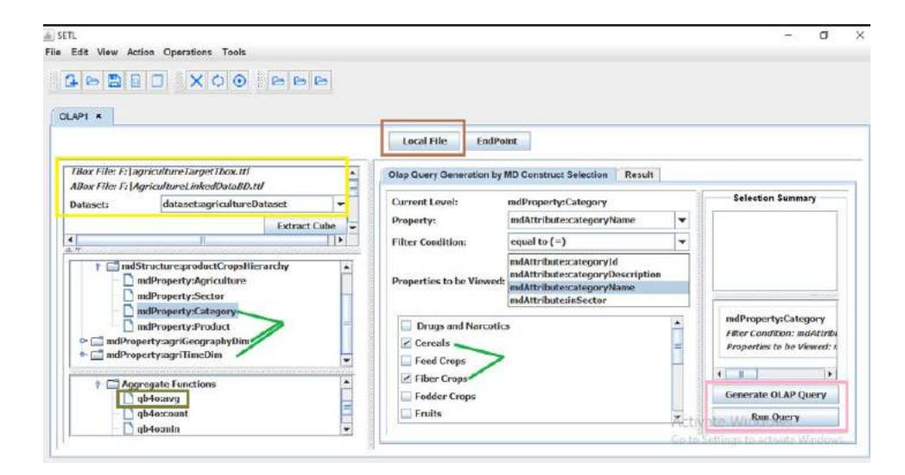
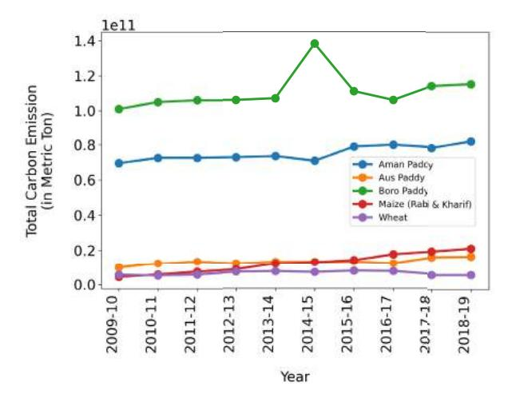
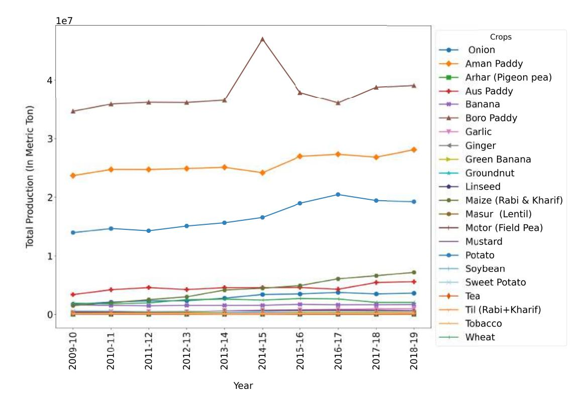

# Knowledge Graph Generation and Enabling Multidimensional Analytics on Bangladesh Agricultural Data

## RUDRA PRATAP DEB NATH, TITHI RANI DAS, TONMOY CHANDRO DAS, AND S. M. SHAFKAT RAIHAN

Department of Computer Science and Engineering, University of Chittagong, Chattogram 4331, Bangladesh Corresponding author: Rudra Pratap Deb Nath (rudra@cu.ac.bd)

This work was supported in part by the Research and Publication Cell, University of Chittagong.

**ABSTRACT** In Bangladesh, agriculture is a crucial driver for addressing Sustainable Development Goal 1 (no poverty) and 2 (zero hunger), playing a fundamental role in the economy and people's livelihoods. To enhance the sustainability and resilience of the agriculture industry through data-driven insights, the Bangladesh Bureau of Statistics, open data portal, and other organizations consistently collect and publish agricultural data on the Web. Nevertheless, the current datasets encounter various challenges: 1) they are presented in an unsustainable, static, read-only, and aggregated format, 2) they do not conform to the Findable, Accessible, Interoperable, and Reusable (FAIR) principles, and 3) they do not facilitate interactive analysis and integration with other data sources. In this paper, we present a thorough solution, delineating a systematic procedure for developing BDAKG: a knowledge graph that semantically and multidimensionally integrates Bangladesh agricultural data. BDAKG incorporates multidimensional semantics, is linked with external knowledge graphs, is compatible with OLAP, and adheres to the FAIR principles. Our experimental evaluation centers on evaluating the integration process and assessing the quality of the resultant knowledge graph in terms of completeness, timeliness, FAIRness, OLAP compatibility, correctness, and data-driven analysis. Our federated data analyses recommend a strategic approach focused on decreasing CO^2^ emissions, fostering economic growth, and promoting sustainable forestry.

**INDEX TERMS** Agriculture, data-driven analysis, FAIR principles, knowledge graph, linked data, multidimensional analysis, RDF, semantic technology.

### I. INTRODUCTION

The heyday of civilization has greatly been aided by agriculture. Its significance in the economy of any nation, whether developing, undeveloped, or developed, is incalculable and ranges from industrial production to national wealth. Nowadays, agriculture has substantially evolved with the advent of data-driven decision-making [[1]](#ref-1). This approach involves the collection, integration, publication, analysis, and interpretation of various types of data to inform and optimize agricultural practices. By harnessing data, farmers and stakeholders in the agricultural sector can make

The associate editor coordinating the review of this manuscript and approving it for publication was Mansoor Ahmed.

more informed and precise decisions, leading to improved productivity, resource management, and sustainability.

In the socio-economic context of Bangladesh, particularly as a developing nation, agriculture 1) serves as the primary pillar of its economic foundation and livelihood [[2]](#ref-2), and 2) plays a crucial role in addressing two of the United Nations Sustainable Development Goals (SDGs): SDG 1 (no poverty) and SDG 2 (zero hunger). To shape a more sustainable and resilient future for this industry through advanced technology and data-driven insights, Bangladesh government and related organizations emphasize on the synergy between agriculture and its digital twin [[3]](#ref-3). Following this trend, the Bangladesh open data portal (http://data.gov.bd), the Bangladesh Bureau of Statistics (BBS) [[4]](#ref-4) and other organizations regularly manage and publish agricultural data comprising of crops, fisheries, livestock, and forestry on the Web.

In order to fully grasp the insights within these published data, it is essential that the presentation of these data should be not only in an analytical format but also in a findable, accessible, compatible, and sustainable format, enabling the data to be repurposed and interconnected across various sources [[5]](#ref-5). However, a prevailing practice is that most of the agriculture data sources present data in an unsustainable (become unavailable before outdated), static, and read-only (pdf) format, rather than for interactive analysis or integration with other data sources. The limitations of those datasets are as follows: 1) They are not following the Findable, Accessible, Interoperable, and Reusable (FAIR) principles [[6]](#ref-6). Hence, they are difficult for researchers and other interested parties to discover, integrate with other data, and (re)use in new context or for new purposes. 2) Different sources describe the same data in different ways, introducing semantic heterogeneity problems. 3) Most of the data are published at an aggregate level, which does not present a complete understanding of complex issues and phenomena. 4) Data are not globally interlinked, therefore, deriving insights by analyzing or comparing different datasets is not supported. Despite the considerable body of research [[7]](#ref-7), [[8]](#ref-8), [[9]](#ref-9), [[10]](#ref-10) dedicated to predicting or recommending agricultural product supply and identifying associations among various factors [[11]](#ref-11), [[12]](#ref-12), employing data mining and statistical techniques, no research has focused on addressing the sustainable management and presentation of Bangladesh agricultural data.

The constraints outlined regarding the data curtail its potential worth, utility, and influence. The true potential of the data is realized when they are 1) semantically defined, 2) efficiently integrated, and 3) analytically explored. Here, semantically defined means data are clearly and explicitly specified [[13]](#ref-13). Efficient integration means data from multiple sources are semantically integrated in a single source of truth [[14]](#ref-14). Finally, analytically exploration enables descriptive—Online Analytical Processing (OLAP)-like and exploratory analysis [[15]](#ref-15) on the integrated dataset. In this context, the Semantic Web (SW) [[16]](#ref-16) emerges as a solution. The SW annotates Web-published content with machineunderstandable, semantic information so it may be efficiently retrieved and processed by both people and machines in a wide range of tasks [[17]](#ref-17). The SW encourages organizations to arrange and publish data following a set of design principles, known as Linked Data (LD) principles [[18]](#ref-18). By adhering to these principles and representing data in Resource Description Framework (RDF) [[19]](#ref-19), the LD approach allows for seamless integration of data from different sources. It models the data as a knowledge graph [[20]](#ref-20), enabling users and applications to discover, navigate, and query a vast network of interconnected information. In this way, it fulfills the FAIR principles and promotes the creation of a more coherent and comprehensive information space on the Web.

To unlock the inherent possibilities present in the open agricultural data of Bangladesh, this study follows three steps: 1) Modeling Bangladesh agriculture open data semantically and analytically, 2) Integrating data semantically from diverse sources, conforming to the model, and publishing data as LD and FAIR data, and 3) Enabling data-driven analysis over the integrated data. Firstly, we discover and collect the data related to crops, forestry, fisheries, etc. from different open sources enlisted in Table [[2]](#ref-2). Then, we follow the demand-driven approach [[21]](#ref-21) to model the data. For capturing data at schema level, we use an ontology as it provides a formal and expressive means of representing the structure and semantics of data within a domain [[22]](#ref-22). Since the dataset should also be presented in an analytical format to enable OLAP-style analysis, we use the Data Cube (QB) [[23]](#ref-23) and Data Cube for OLAP (QB4OLAP) [[24]](#ref-24) vocabularies to annotate the ontology with Multidimensional (MD) semantics. Once data are modeled, then the ontology is populated from different sources creating a semantic Extract-Transform-Load (ELT) flow [[25]](#ref-25). We name the integrated datasets (Ontology along with its instances) as BDAKG: Bangladesh Agricultural Knowledge Graph. For making BDAKG more exploreable, it is semantically linked with other external knowledge graphs. Moreover, because of annotating with MD semantics, BDAKG enables OLAP queries, where data cubes are explored through user-friendly interfaces.

We summarize the novel contributions of this paper as follows.

* We create BDAKG: a semantic repository or knowledge graph for Bangladesh agriculture open data, by semantically integrating different sources and annotating them with MD semantics.
* We outline the comprehensive and step-by-step data integration process.
* We link BDAKG internally and externally with other datasets available in Linked Open Data (LOD) cloud to enable federated analytics.
* We assess both the integration process and BDAKG concerning the data quality standards, encompassing data FAIRness, OLAP-compatibility, correctness, and federated data analysis capability. Our data-driven analysis suggests a course of action aimed at reducing CO^2^ emissions, promoting economic growth, and fostering sustainable forestry.

The remainder of the paper is organized as follows. We discuss the notations and terminologies used throughout the paper in Section [[II]](#ref-II). Section [[III]](#ref-III) details the source datasets and the ontology of the BDAKG. Section [[IV]](#ref-IV) describes the process of creating BDAKG. We describe BDAKG and evaluate it in terms of performance, quality, and federated data analysis in Section [[V]](#ref-V). We position our research contribution within the current state-of-the-art, as detailed in Section [[VI]](#ref-VI). Finally, we conclude and give pointers to future work in Section [[VII]](#ref-VII).

## II. PRELIMINARIES

Here, we introduce the fundamental concepts and terminologies used in this paper.

## A. KNOWLEDGE GRAPH

A Knowledge Graph (KG) is a directed graph designed to accumulate and communicate information about the real world. In this graph, nodes symbolize entities of interest, while edges signify the connections or relationships between these entities. A KG consists of two components: the Terminological Box (TBox) and the Assertion Box (ABox). The TBox establishes domain-specific terminology, while the ABox contains assertions representing individual instances. It is important for the ABox assertions to follow the semantics encoded in the TBox [[14]](#ref-14). In this paper, we express KG components using a collection of RDF triples. An RDF triple is formally defined as a 3-tuple (*s*, *p*, *o*), where *s* ∈ (*I* ∪ *B*) , *p* ∈ *I*, and *o* ∈ *I* ∪ *B* ∪ *L*, and a KG is defined as *KG* ⊆ (*I* ∪ *B*) × *I* × (*I* ∪ *B* ∪ *L*). Here, *I*, *B*, and *L* stand for the sets of Internationalized Resource Identifier (IRIs), blank nodes, and literals, respectively. An IRI is a unique identifier for globally identifying a resource (Web-scope). Blank nodes function as locally-scoped identifiers for resources unknown to the external world. Literals are lexical or numerical values.

We use basic constructs from formal languages such as RDF-schema (RDFS) [[26]](#ref-26) and the Web Ontology Language (OWL) [[27]](#ref-27) in conjunction with the RDF data model to impose richer constraints on data. Figure [[1]](#ref-1) shows a portion of BDAKG presenting its components. The labeled vertices depict subjects and objects in RDF triples, directed labeled edges represent predicates, and literal-vertices are represented by plain text. A reddotted line serves to distinguish the TBox and ABox. In practice, a KG is represented as an RDF graph without differentiating between classes and instances. The figure annotates agri:Product, agri:Production, and agri:Category as classes, and the properties agri:inProduction, agri:cropName, and agri:hasCategory are connected with the classes using the rdfs:domain and rdfs:range constructs. A class offers a broad overview of the characteristics shared by related resource types. Meanwhile, a property establishes connections between instances of a class or links instances to literal values. The ABox presents that agri/product:A010148 is a product, and its name and category are ginger and spices. KGs can also be linked with external KGs (in this case, Wikidata [[28]](#ref-28)) through owl:equivalentClass, owl:equivalentProperty (at the TBox level) and owl:sameAs (at the ABox level) properties. Thus, KGs enable exploration through linking.

## B. MULTIDIMENSIONAL MODELING AND THE QB4OLAP VOCABULARY

Agricultural data encompasses factual information and numerical values. Consequently, it is advisable to present the data in a format compatible with OLAP. OLAP technology plays a crucial role in facilitating data analysis to support decision-making processes. For effective OLAP queries, it is recommended to represent a KG in an MD model. The choice of the MD model is motivated by its simplicity and the straightforward, intuitive approach it provides for conducting analytical queries [[37]](#ref-37).

In the MD model, data are viewed in an n-dimensional space, generally known as a data cube, composed of facts (the cells of the cube) and dimensions (the axes of the cube). Hence, it enables users to examine data across various dimensions of relevance. For instance, a user can analyze production of products according to geographical regions and time (dimensions). Facts are the interesting things or processes to be analyzed (e.g., production of products, sales of product) and the attributes of the fact are called measures (e.g., production, area, amount of sales, quantity), usually represented as numeric values. Dimensions are organized into hierarchies (composed of a number of levels) to explore and (dis)aggregate fact measures (e.g., numerical data) at various levels of detail [[24]](#ref-24). For example, the agri:GeographyDim dimension's hierarchy agri:GeoHierarchy (*District* → *Division* → *All*) enables to explore and (dis)aggregate the agricultural production information of Bangladesh at various administrative levels of detail (see Figure [[2]](#ref-2)).

To annotate BDAKG with MD semantics, we use the QB4OLAP vocabulary [[24]](#ref-24) which extends the QB vocabulary [[23]](#ref-23) to overcome QB's limitations in presenting the MD constructs. Table [[1]](#ref-1) summarizes the different QB4OLAP constructs used to define corresponding MD constructs.

## III. DATASET DESCRIPTIONS AND THE TARGET TBox MODELING

In this section, we provide an overview of the source datasets and introduce the target TBox used to consolidate and understand the knowledge within these datasets.

## A. DESCRIPTION OF SOURCE DATASETS

We utilize an agricultural dataset obtained from the Bangladesh Bureau of Statistics (BBS) [[4]](#ref-4), specifically from the Yearbooks of Agricultural Statistics of Bangladesh, which are published annually. The BBS has consistently served as a reliable source of information on crop production since 1974, covering six major crops and over a hundred minor crops. According to the Statistics Act of 2013 [[38]](#ref-38), the BBS extensively provides data on the crop sub-sector, with a primary focus on crop data and limited information on the fisheries, forestry, and livestock sub-sectors. The yearbooks present comprehensive statistics that encompass the nation's agro-ecology, land types, soil classification, crop seasons, land use statistics, meteorological data (including rainfall, temperature, humidity, and major cyclones), agricultural inputs, livestock statistics, fisheries, forestry, crop prices, and export and import data on agricultural products. It also provides significant agricultural insights. We have organized


**FIGURE 1.** A knowledge graph presenting a portion of TBox and ABox.

**TABLE 1.** QB4OLAP constructs used to define MD constructs.

| **MD** construct | Mapped QB4OLAP construct | **MD** construct | Mapped QB4OLAP construct |
|----------------------------|-------------------------------------|------------------------------|----------------------------|
| Dimension | qb:DimensionProperty | Dataset | qb:DataSet |
| Hierarchy | qb4o: Hierarchy | Cube | qb:DataStructureDefinition |
| Connections between | qb4o:inDimension, qb4o:hasHierarchy | Fact | qb:Observation |
| Dimensions and Hierarchies | | | |
| Level | qb4o:LevelProperty | Level Instance | qb4o:LevelMember |
| Connection among<br>Levels | qb4o:HierarchyStep | Attribute | qb4o:LevelAttribute |
| **Measures** | gb:MeasureProperty | Aggregate<br>**Function** | qb4o:AqqreqateFunction |

**TABLE 2.** Overview of the data sources.

| **Dataset** | **Original format** | Number of<br>instances | Data sources |
|-----------------------|------------------------|------------------------|-----------------------------------------------------|
| Crops | Pdf, Text, Tabular | 54,712 | BBS [[4]](#ref-4), [[29]](#ref-29), Classification-of-crops [[30]](#ref-30), |
| | | | Crops-code [[31]](#ref-31) |
| Fisheries | Pdf. Text. Tabular | 6.743 | BBS [[29]](#ref-29) . Fisheries [[32]](#ref-32) |
| Forestry | Pdf, Text, Tabular | 520 | BBS [[29]](#ref-29) , Forestry [[33]](#ref-33) |
| **Other Datasets** | Text, Tabular | 73 | Division-of-the-sectors [[34]](#ref-34). |
| | | | Subentity-Codes-for-Bangladesh [[35]](#ref-35), Livestock [[36]](#ref-36) |

the dataset into three main segments: crops, fisheries, and forestry. Table [[2]](#ref-2) outlines a summary of these datasets.

*Crops Dataset:* For the crop dataset, we selectively consider data as measures that can be effectively analyzed based on three key dimensions: Time, Geography, and Product. From the yearbooks [[39]](#ref-39), we extract data for major crops (aus, aman, boro, jute, potato, and wheat) spanning from the 1969-1970 to 2019-2020 periods. Furthermore, we collect data from the study conducted by [[29]](#ref-29) on minor crops, such as barley, onion, ginger, carrot, lalsak, etc. covering the period from 2007-2008 to 2019-2020. Our focus is on gathering information regarding the cultivated area (measured in acres) and production (measured in metric tons). We also compile information on each crop's harvest and sowing time. Drawing insights from [[30]](#ref-30), we categorize all crops into 15 distinct categories such as cereals, pulses, seeds, etc. and provide comprehensive descriptions along with a unique key for easy identification of each crop category. The scientific names of the crops are sourced from various reliable websites [[40]](#ref-40).

*Fisheries Dataset:* For the fisheries dataset, we extract production data with respect to fisheries habitat (river, estuary, beel, and pond, etc.) between 2010-2011 and 2019- 2020 from [[29]](#ref-29).

*Forestry Dataset:* We gathered forestry data spanning from 2010-2011 to 2017-2018 as reported by [[29]](#ref-29).


**FIGURE 2.** The TBox of Bangladesh Agriculture Knowledge Graph (BDAKG). The figure does not display level attributes due to their substantial quantity.

*Other Datasets:* For country, district and division levels, we collect all data, including unique codes, from Divisionof-the-sectors [[34]](#ref-34), and Geonames [[35]](#ref-35).

## B. TARGET TBox DEFINITION

To integrate the agriculture datasets, we define a TBox of BDAKG. Note that our goal is not to develop a domain ontology, but instead to structure the KG using MD semantics for facilitating OLAP analytics. The TBox of BDAKG is depicted in Figure [[2]](#ref-2). The data is organized in MD structures resembling cubes, with dimensions spanning their axes. Rather than utilizing a single data cube, we employ three distinct cuboids–forestry, fisheries, and production–to formulate the fact constellation schema, where each level is normalized. We use two measures: agri:area and agri:production, which are associated with each and every point in this MD space. In the figure, the cubic box and rectangles represent the fact table cubes and levels, respectively, while the blue rectangles represent the dimensions.

The TBox has three dimensions: agri:GeographyDim, agri:ProductDim, and agri:TimeDim. Three dimensions are used to analyze the agriculture data from multiple perspectives, enabling OLAP operations. To describe the data being analyzed at various levels of abstraction, hierarchies [[41]](#ref-41) are essential components of analytical applications. The agri:GeographyDim dimension's hierarchy agri:GeoHierarchy (agri:District → agri:Division → agri:All) enables to explore and (dis)aggregate the agricultural production information of Bangladesh at various administrative levels of detail. The agri:ProductDim dimension has two hierarchies, namely agri:ProductCropsHierarchy

and agri:ProductFisheriesHierarchy. Figure [[2]](#ref-2) describes the two aggregation paths, one for each type of crop and another for fisheries data. Products must be aggregated differently according to the product's type; for crops, the aggregation path is agri:Product → agri:Category → agri:Sector → agri:Agriculture; for fisheries, the path is agri:Habitat → agri:Sector → agri:Agriculture while for forestry, the aggregation path is agri:Sector → agri:Agriculture. The time dimension has one hierarchy agri:TimeHierarchy, and the aggregation path of the hierarchy is agri:Time → agri:All.

Each level is defined by a set of attributes that describe the characteristics of its members. A level has one or more identifiers used as primary keys to uniquely identify the member of a level, and each identifier may consists of one or more attributes. In Figure [[2]](#ref-2), agri:Agriculture, agri:Sector, agri:Category, agri:Habitat, agri:Product, agri:Time, agri:District, and agri:Division levels' unique identifiers are agri:agricultureId, agri:sectorId, agri:categoryId, agri: habitatId, agri:productId, agri:yearId, agri: districtId, and agri:divisionId, respectively.

## IV. METHODOLOGY OF GENERATING BANGLADESH AGRICULTURAL KNOWLEDGE GRAPH (BDAKG)

In this section, we delineate the methodology employed for generating BDAKG. Figure [[3]](#ref-3) illustrates the various steps involved in the Extraction-Transformation-Load (ETL) process. Initially, the *Extraction* process gathers agriculture related data from diverse sources. Subsequently, the *Transformation* process transforms the extracted data according


**FIGURE 3.** Overview of the BDAKG generation process.

**TABLE 3.** Area and production of banana by district from 2017-2018 to 2019-20.

| | **District/Division** | 2017-18 | | 2018-19 | | 2019-20 | |
|---|--------------------------|---------|-------------------|---------|-------------------|---------|-------------------|
| | | | **Production** | Area | **Production** | Area | **Production** |
| | | (acre) | (MT) | (acre) | (MT) | (acre) | (MT) |
| | Barguna | 331 | 1.132 | 338 | 475 | 347 | 1,580 |
| ∍ | Barishal | 1.668 | 3.219 | 1.684 | 3,401 | 1,750 | 5,500 |
| 3 | **Bhola** | 513 | 1.178 | 520 | 1.180 | 536 | 1.879 |
| 4 | Jhallokati | 2.824 | 7.461 | 2.830 | 7.470 | 2.902 | 8.324 |
| | Patuakhali | 764 | 3.343 | 765 | 3.345 | 554 | 2.717 |
| 6 | Pirojpur | 3.240 | 14.034 | 3.280 | 13.386 | 2.768 | 13.390 |
| | **Barishal Division** | 9,340 | 30,367 | 9,417 | 29,257 | 8,857 | 33,390 |

**TABLE 4.** Representation of the production cuboid crops after processing of data enlisted in Table [[3]](#ref-3).

| **ObservationId** | CropsId | **DistrictId** | YearId | Area | **Production** |
|----------------------|---------|-------------------|--------|-------|-------------------|
| A0101921004201718 | A010192 | 1004 | 201718 | 331 | 1.132 |
| A0101921006201718 | A010192 | 1006 | 201718 | 1.668 | 3.219 |
| A0101921004201819 | A010192 | 1004 | 201819 | 338 | 475 |
| A0101921006201819 | A010192 | 1006 | 201819 | 1.664 | 6.401 |
| A0101921004201920 | A010192 | 1004 | 201920 | 347 | 1,580 |
| A0101921006201920 | A010192 | 1006 | 201920 | .750 | 5.500 |

### **TABLE 5.** Representation of the district level dataset.

| **DistrictId** | **DistrictName** | **InDivision** |
|-------------------|---------------------|-------------------|
| 1004 | **BARGUNA** | 10 |
| 1006 | **BARISAL** | 10 |
| 1009 | **BHOLA** | 10 |

to the semantics encoded in the target TBox. Within the *Transformation* process, we first implement the target TBox defined in Section [[III-B]](#ref-III-B) through the *Target TBox Generation* process. Following this, the *Source TBoxes Generation* process generates the TBoxes from the data sources. Subsequently, source and target TBoxes are mapped through

the *Target ABox Generation* process produces assertions in accordance with the target TBox. Finally, the resources of target ABox and TBox are linked with external KGs available in the Linked Open Data (LOD) cloud [[42]](#ref-42). All interim results are stored in a Data Staging Area, a temporary repository that retains data for cleansing, transforming, and future utilization. This staging area safeguards against potential loss of extracted or transformed data in case of loading process failure. Ultimately, the Load operation transfers the KG to a triple store accessible to users via either an interactive analytical interface or a SPARQL endpoint.

the *SourceToTarget Mappings Generation* process. Then,

The subsequent sections provide detailed insights into each component.

## A. EXTRACTION

Agricultural data for Bangladesh are publicly accessible from various online sources as outlined in Table [[2]](#ref-2), and they exist in different formats such as PDF, CSV, Text, etc. The data are extracted and formatted to align with the target schema. Initially, all PDF files are converted to CSV files using a PDF processing tool available at https://www.ilovepdf.com/. Since the data in the PDF files are presented in a tabular format, the CSV files generated by the tool preserve the original data without any deviations. Subsequently, microdata are obtained by eliminating aggregated information, and district, fiscal year, and crop names are replaced with their respective codes. The unique identifier for each crop's information is generated by concatenating districtCode, yearCode, and cropCode. For instance, Table [[3]](#ref-3) illustrates the area and production of bananas by district and time, sourced from BBS yearbooks. After extraction and cleansing, the processed data are organized according to the fact table agri:Production, as demonstrated in Table [[4]](#ref-4). Table [[4]](#ref-4) presents a segment of the estimated national production and cultivated area for various minor grains from 2017-18 to 2019-20. Only production and cultivated area data for minor crops (barley, bazra, laushak, etc.) are considered, categorized by district and fiscal year. As an example of a level dataset, we present a segment of the agri:District level dataset in Table [[5]](#ref-5), where the districts are encoded following the conventions of Geonames.

## B. TRANSFORMATION

After completing the data extraction and preprocessing processes, we transform all the data into a semantic version to enrich our BDAKG. The *Transformation* process includes following steps, namely

* *Target TBox Generation*
* *Source TBox Generation*
* *SourceToTarget mappings Generation*
* *Target ABox Generation*

### 1) TARGET TBox GENERATION

The aim of this step is to express the target TBox outlined in Section [[III-B]](#ref-III-B) using the constructs of RDFS, OWL, and QB4OLAP (as defined in Section [[II-B]](#ref-II-B)) in conjunction with the RDF model. QB4OLAP constructs enhance OWL classes and RDF properties with MD semantics. Users have the option to create a TBox with MD semantics either manually or by employing tools like Protege [[43]](#ref-43), *SETLBI* [[44]](#ref-44). Listing [[1]](#ref-1) shows a portion of our BDAKG TBox annoted with QB4OLAP constructs.

In QB4OLAP, dimensions, hierarchies, and levels are defined using qb4o:DimensionProperty, qb4o:- Hierarchy, qb4o:LevelProperty as demonstrated at lines 8-23. A dimension can have one or more hierarchies, and line 10 shows that agri:ProductDim has two hierarchies. The properties qb4o:inDimension

```
LISTING 1. QB4OLAP representation of BDAKG TBox.
```

and its inverse qb4o:hasHierarchy are employed to establish the relationship between a dimension and its

| | @prefix onto: <http://bike-csecu.com/datasets/agri/onto/habitat#>. |
|----|----------------------------------------------------------------------------|
| | 2 @prefix owl: <http://www.w3.org/2002/07/owl#>. |
| | 3 @prefix rdfs: <http://www.w3.org/2000/01/rdf-schema#>. |
| | $schema$ #>. |
| | 4 onto: Habitat a owl: Class. |
| | s onto: habitatId a owl: DatatypeProperty; |
| 6 | rdfs:domain onto: Habitat; |
| 7 | rdfs: range xsd: string. |
| 8 | onto:inSector a owl:DatatypeProperty; |
| Q | rdfs:domain onto: Habitat; |
| 10 | rdfs: range xsd: string. |
| | |

**LISTING 2.** Source TBox of Habitat of the Habitat dataset.

hierarchies (lines 10 and 15). A hierarchy consists of levels arranged in a specific order, and the order of levels in a hierarchy is defined using qb4o:HierarchyStep. In the listing, agri:productFisheriesHierarchy comprises three levels (line 16). The hierarchy step, defined at lines 24-30, illustrates that habitats are aggregated in sectors, i.e., agri:Habitat → agri:Sector through the roll-up property agri:inSector (line 30). Attributes of a level are defined using qb4o:LevelAttribute (lines 31-38). It is important to note that a level attribute can either be an object property (relating among instances) or a datatype property (relating instances to literal values). For instance, the agri:inSector (lines 36-38) attribute establishes a relationship between instances of agri:Habitat and agri:Sector. In QB4OLAP, a cube structure is delineated in terms of dimensions and measures, and a cuboid structure is defined in terms of levels and measures (lines 43-50). Both structures are specified using qb:DataStructureDefinition. Measures, representing the numerical data for analysis and insights, are defined using qb:MeasureProperty (lines 39-42). Finally, a dataset is defined using qb:Dataset and is assigned to the defined cube or cuboid structure (lines 51-53).

### 2) SOURCE TBox GENERATION

After defining BDAKG at the TBox level, we need to populate it from the available sources. To do so, we need to map the target and source constructs at the TBox level. Therefore, it is crucial to derive TBoxes from the existing sources and enhance them with OWL and RDFS constructs. In the *Extraction* phase, data are extracted and cleansed from various sources, and the resulting data are stored in a tabular format. In this step, for each table, we derive the schema of those tabular data sources and convert them into source TBoxes. A straightforward approach involves considering the table name as an OWL class and the attribute names as OWL datatype or object properties. Additionally, users have the option to utilize R2RML [[45]](#ref-45) or direct mapping [[46]](#ref-46) vocabularies to perform the extraction and creation of source TBoxes. Listing [[2]](#ref-2) shows the source TBox of the Habitat dataset, where onto:Habitat is considered as an OWL class and onto:habitatId and onto:inSector are datatype properties.

| | @prefix map: <http://bike-csecu.com/datasets/agri/vocabulary/s2tmap#>. | | | |
|----------------|---------------------------------------------------------------------------------|--------------------|--|--|
| $\mathbf{2}$ | #Dataset mapper | | | |
| 3 | map:habitatDataset a map:Dataset; | | | |
| $\overline{4}$ | map:sourceTBox <http://bike-csecu.com/datasets/agri/onto/habit#>; | | | |
| | datasets/agri/onto/habitat#>; | | | |
| 5 | map:targetTBox <http://bike-csecu.com/datasets/agri/tbox#>. | | | |
| | | | | |
| 6 | #Concept mapper | | | |
| 7 | map:Habitat_Habitat<br>a | map: | | |
| | ConceptMapper; | | | |
| 8 | map:dataset | map: | | |
| | habitatDataset; | | | |
| 9 | map:iriValue | onto: habitatId; | | |
| 10 | map:iriValueType | map: | | |
| | SourceAttribute; | | | |
| 11 | map:matchedInstances | $"All"$ ; | | |
| 12 | map:sourceConcept | onto: Habitat; | | |
| 13 | map:targetCommonProperty | onto: habitatId; | | |
| 14 | map:targetConcept | agri: Habitat. | | |
| 15 | #Property mapper | | | |
| 16 | map:PropertyMapper_01_habitatId_habitatId | | | |
| 17 | a | map:PropertyMapper | | |
| | ï | | | |
| 18 | map:ConceptMapping | map: | | |
| | Habitat_Habitat; | | | |
| 19 | map:sourceProperty | onto: habitatId; | | |
| 20 | map:sourcePropertyType | map:SourceProperty | | |
| | ï | | | |
| 21 | map:targetProperty | agri:habitatId. | | |

**LISTING 3.** SourceToTarget mapping definitions between the target TBox **agri**: **Habitat** and the source TBox **onto**: **Habitat**.

### 3) SourceToTarget MAPPINGS GENERATION

To map between the source and target TBox constructs, we use Source-to-Target Mapping (S2TMAP) vocabulary [[14]](#ref-14): an OWL-based mapping vocabulary. In Listing [[3]](#ref-3), the mapping definitions between BDAKG's TBox and Habitat's TBox are presented, with annotations incorporating S2TMAP constructs.

Within S2TMAP, a property-level mapping is nested within a concept-level mapping, and this, in turn, is defined within a mapping dataset. A mapping dataset is established through the use of map:Dataset, capturing the addresses of the source and target TBoxes (lines 3-5). A conceptmapping delineates the correspondence between a source and a target concept (lines 6-14). The linkage between a concept-mapping and its mapping dataset is established via the map:dataset property. The map:iriValue and map:iriValueType properties signify that the values of onto:habitatId will be utilized to generate IRIs for the members of agri:Habitat. The ''All'' value of map:matchedInstances indicates that all source instances are mapped. A property-mapping is employed for mapping at the property level (lines 15-21). The association between a property-mapping and its corresponding conceptmapping is established via map:conceptMapping. The target property of the property-mapping is specified using map:targetProperty, and this target property can be linked to either a source property or an expression. In this particular instance, the target property agri:habitatId is mapped to the source property onto:habitatId.

| | ////////////////////////////////////// |
|----------------|------------------------------------------------------------------------------|
| | agri/abox/product#>. |
| | 2 @prefix category: <http://bike-csecu.com/datasets/agri/abox/category#>. |
| | 3 product: A010189 a qb4o: LevelMember; |
| $\overline{4}$ | qb4o:memberOf aqri:Product; |
| 5 | agri: cropsCode "189"; |
| 6 | agri: cropsId "A010189"; |
| 7 | agri: cropsName "Cabbage"; |
| 8 | agri: harvestTime "Early January to Early |
| | March": |
| Q | agri:inCategory category:A01010; |
| 10 | agri: sawingTime "Late October to Mid |
| | November"; |
| 11 | agri: scientificName "Brassica oleracea var |
| | . capitata". |

**LISTING 4.** A level member of **agri**: **Product**.

## 4) TARGET ABox GENERATION

Taking the target TBox, source datasets (extracted and cleansed ones), source-to-target mapping definitions as inputs, the *Target ABox Generation* process creates the ABox of BDAKG from the source datasets according to the semantics encoded in the TBox of BDAKG. Within QB4OLAP, dimensional data are stored physically in levels. Each level member is characterized by a distinct IRI and is semantically associated with its corresponding level attributes and rollup properties. For example, Listing [[4]](#ref-4) shows a member of agri:Product. It is defined as a qb4o:LevelMember and semantically enriched with values of its linked properties. Note that, with the value of agri:inCategory (a roll-up property), the product is connected with its category, an level member of agri:Category.

To represent a fact, QB4OLAP uses an observation (an instance of qb:Observation) (line 6 in Listing [[5]](#ref-5)). A fact is defined by a unique IRI and is semantically enriched through a combination of multiple members from various levels, incorporating values for different measure properties. Note that, the dataset of the fact is agri:agricultureDataset, and its cuboid structure comprises levels such as agri:District, agri:Product, agri:Time, along with measures including agri:area and agri:production.

## 5) LINKING TO EXTERNAL KNOWLEDGE GRAPHS

Linked open datasets incorporate references to comparable elements found in external datasets, facilitating the sharing and reuse of existing knowledge. This practice aids in steering clear of redundant data inclusion, thereby contributing to the preservation of scalability. Linking can extend to both concepts in the target TBox and level members in the target ABox. BDAKG is linked to Wikidata [[28]](#ref-28), Geonames [[35]](#ref-35), Exiobase [[47]](#ref-47), and CropOntology [[48]](#ref-48). This is achieved using the OWL property owl:sameAs. For example, the triple < agri:District owl:sameAs wiki:Q152732.> indicates agri:District is connected to wiki:Q152732. We utilize OpenRefine [[49]](#ref-49) to create connections between internal and external resources.

| LISTING 5. An observation of the agri : Production cuboid. | | | | |
|------------------------------------------------------------|--|--|--|--|

## C. LOAD

BDAKG is expressed through RDF triples, and we utilize Turtle [[50]](#ref-50) as the RDF serialization format. The *Load* process involves loading BDAKG into either the triple store, Virtuoso, or as a dump to a local file.

## V. EXPERIMENTAL EVALUATION

In this section we describe the overview of the produced BDAKG and assess BDAKG in terms of three aspects: 1) ETL performance, i.e., the time required to run the ETL process; 2) quality of BDAKG, including its compatibility with OLAP operations; and 3) its preparedness for exploratory analytics, gauged by its ability to navigate for exploration and insight generation. The experiments are conducted on a laptop equipped with an Intel Core(TM) i7-4600U processor running at 2.10 GHz, 8 GB of RAM, and operating on Windows 10.

## A. DESCRIPTION OF THE PRODUCED KNOWLEDGE GRAPH BDAKG

This section provides an overview of BDAKG, covering its dimensions, factual aspects, external links, and availability.

## 1) DIMENSION OVERVIEW

Table [[6]](#ref-6) outlines the dimensions of BDAKG, the levels contained in each dimension, number of level attributes, members, external links, and RDF triples. In total, BDAKG has 9 levels, 33 level attributes, 272 level members, 363 external links, and 1738 RDF triples. All levels are linked to Wikidata [[28]](#ref-28). In addition, districts and divisions are connected to Geonames and products are linked to Exiobase [[47]](#ref-47): a semantically annotated global environmentally extended multi-regional input-output database. Exiobase is particularly useful for life cycle assessment (LCA) and environmental impact assessment studies.

## 2) FACT OVERVIEW

Within BDAKG, information is organized into three distinct cuboids to capture facts. Table [[7]](#ref-7) displays the ABox size, the count of observations, and the number of RDF triples for each of these cuboids. In summary, the total size of

| **Dimension** | | Number of<br>*attributes* | Number of<br>instances | Number of<br>external links | Number of<br>**RDF** triples |
|-------------------|------------------------------------------|--------------------------------|------------------------------------------|-----------------------------|------------------------------------------|
| | agri:District | | | 128 | 448 |
| aqri:GeographyDim | agri:Division | | | 14 | 49 |
| | agri:All | | | | |
| | agri: Product | | 114 | 134 | 704 |
| | agri:Category | | 15 | | |
| agri: ProductDim | agri: Habitat | | 14 | 14 | 84 |
| | agri:Sector | | | | 36 |
| | agri:Agriculture | | | | |
| agri:TimeDim | agri:Time | ↑ | 52 | 52 | 312 |
| Total | | 33 | 272 | 363 | .738 |

### **TABLE 6.** Overview of dimensions in BDAKG.

### **TABLE 7.** Overview of the size metrics of the cuboids.

| Cuboid | **ABox size** | **Number of observations** | **Number of RDF triples** |
|------------------|------------------|-------------------------------|------------------------------|
| agri: Production | 36.7 MB | 49.459 | 338,355 |
| agri:Fisheries | 5 MB | 5,205 | 39,004 |
| agri:Forestry | 300 KB | 384 | 2.286 |
| Total | **42 MB** | 55,048 | 379,645 |

cuboids, number of observations, the number of triples amount to 42 MB, 55048, and 379645, respectively.

### 3) AVAILABILITY

The dump files for our BDAKG are located at http://bikecsecu.com/datasets/agri/, and the KG itself is stored in the OpenLink Virtuoso Triplestore. Users have the option to remotely access the KG via the SPARQL endpoint at https://bdakg.bike-csecu.com/sparql/. They can formulate their own SPARQL queries based on their specific requirements to obtain the desired answers. To verify the correctness and OLAP-compatibility of the knowledge graph, we have formulated a set of competency questions in Table [[8]](#ref-8). These competency questions have been translated into equivalent SPARQL queries to retrieve answers from the KG. Access to this set of competency questions is available through a user interface provided at https://bikecsecu.com/datasets/agri/query. Users can pose these questions to the repository and receive answers. Additionally, we offer an interactive OLAP interface, accessible at https://github.com/bi-setl/SETL. This interface enables users to create OLAP queries using graphical user interface components and retrieve answers by submitting queries to the relevant graphs. Details about the OLAP interface are provided in Section [[V-C4]](#ref-V-C4).

## B. ETL PERFORMANCE

This section focuses on the ETL process's time required for the different stages of creating BDAKG. The duration and percentage of total time that is used on each step of ETL operations are shown in Figure [[4]](#ref-4). The *Extraction* phase takes most of the overall time (60.24%).This phase requires the most time in comparison to other phases because the Bangladesh agricultural data available at BBS are provided in a read-only format; therefore, we need to do extra preprocessing, cleansing, and formatting tasks to extract the attribute information from them and keep it into the tabular format. We utilize the *SETLBI* tool to generate TBoxes, source-to-target mapping definitions, and ABox. The entire *Transformation* phase consumes a total of 2.2 hours. Note that the TBox and mapping definition creation processes involve user intervention, leading to variable time-frames depending on user expertise. Additionally, we employ OpenRefine [[49]](#ref-49) to establish links between internal and external resources, and similar to the prior processes, the elapsed time may differ based on user proficiency.

### C. QUALITY OF BDAKG

We evaluate the quality of BDAKG using various standard metrics, including completeness, timeliness, granularity, FAIRness, OLAP compatibility, and correctness.

### 1) COMPLETENESS

Completeness [[42]](#ref-42) describes the extent to which a given dataset contains all necessary data. We demonstrate completeness in BDAKG across three aspects: schema completeness, property completeness, and linkability completeness.

*Schema Completeness:* Our agriculture constellation schema (Figure [[2]](#ref-2)) refers to the extent to which a data schema or data model effectively captures all the necessary information, attributes, entities, relationships, and constraints required to represent a real-world agriculture dataset. Such as, when a new crop is produced in Bangladesh, we can categorize it according to its name, crop ID, scientific name, harvest time, and sowing time, along with the characteristics of the crop.

*Property Completeness:* The degree of missing values for a specific property is evaluated through its property completeness, as defined in [[51]](#ref-51). For instance, our BDAKG exhibits a property completeness issue in cases such as the absence of a scientific name for instances like onion, which should ideally have the value *Allium cepa*. This deficiency is also referred to as column completeness [[52]](#ref-52).


**FIGURE 4.** Time for the ETL process to create BDAKG. Here, h and s indicate hour and second respectively.

In specific instances, particularly for products (level members of agri:Product), we encounter challenges in determining sowing and harvesting times. The calculation of the property completeness for BDAKG is determined using Equation [[1]](#ref-1), where P denotes the percentage of property completeness [[52]](#ref-52). Our analysis reveals that the property completeness score for agri:Product is 93.97%.

$$
P = [1 - \left(\frac{\text{Number of incomplete items}}{\text{Total number of items}}\right)] \times 100 \quad (1)
$$

*Population Completeness:* This evaluates [[53]](#ref-53) how effectively BDAKG represents the real-world objects. For instance, there are four sectors of agriculture in BDAKG, and in reality, Bangladesh's agriculture sectors are also classified into four categories: crop, fisheries, forestry, and livestock. BDAKG contains all products, firsheries, and forestry data found in the available open data.

*Linkability Completeness:* In Section [[IV-B5]](#ref-IV-B5), it is explained that resources within BDAKG are interconnected with Wikidata, Cropontology, Geonames, RDF, OWL, and QB4OLAP at both TBox and ABox levels. Consequently, this connectivity facilitates the exploration of other KGs for enhanced insights, as detailed in Section [[V-D]](#ref-V-D).

## 2) TIMELINESS AND GRANULARITY

The BDAKG dataset is current, encompassing the most recent data for Fisheries (2019-2020 fiscal year), Forestry (2017- 2018 fiscal year), and Agriculture (2019-2020 fiscal year). To preserve granularity, only district-level data on crops, fisheries, and forestry are retained in BDAKG. All aggregate data at the division and country levels are excluded. This modeling approach ensures that BDAKG retains valuable information for informed decision-making.

## 3) DATA FAIRness

BDAKG adheres to the four key constructs of the FAIR principles as follows:

* Findable: Each resource in BDAKG, whether at the TBox or ABox level, is uniquely identified by an IRI. For instance, the BDAKG's dump files are accessible at http://bike-csecu.com/datasets/agri/. Additionally, BDAKG's TBox and ABox can be accessed through https://bike-csecu.com/datasets/agri/ tbox/ and https://bike-csecu.com/datasets/agri/abox/, respectively.
* Accessible: Users can readily access and download BDAKG from the specified repository. Data retrieval is also possible through the SPARQL endpoint, available at https://bdakg.bike-csecu.com/sparql/.
* Interoperable: BDAKG employs standard vocabularies such as RDF, RDFS, OWL, and QB4OLAP. This adherence to standards ensures that BDAKG can be seamlessly integrated and utilized with other datasets and tools.
* Reusable: BDAKG includes comprehensive metadata and licensing information, promoting its reusability. Users can reproduce the dataset following the outlined steps in this paper. Therefore, users can easily reuse the datasets or resources within BDAKG for their specific needs.

## 4) OLAP COMPATIBILITY

BDAKG adheres to the formal semantics and constraints defined at the TBox level. The TBox is annotated with MD semantics using QB4OLAP, and the ABox, generated through the KG generation process, aligns with the semantics specified in the TBox. In this section, we assess the OLAP compatibility of BDAKG. The assessment involves the utilization of *SETLBI* 's *OLAP Layer* [[44]](#ref-44) to verify BDAKG's OLAP compatibility. We load BDAKG into the *OLAP Layer*, formulate and execute OLAP queries, and observe error-free outputs. This affirms the successful enhancement of the KG for business analytics.

Figure [[5]](#ref-5) displays the interactive interface of the *OLAP Layer*, indicating the successful loading of the TBox and


**FIGURE 5.** Enabling OLAP operations over BDAKG through SETL′ BI s OLAP Layer.

| ?agriProductDim categoryName | ?agriGeographyDim divisionName | ?agriTimeDim yearName | ?production_avg |
|------------------------------|--------------------------------|-----------------------|-----------------|
| **Cereals** | **BARISAL** | 2018-19 | 42131.055 |
| **Cereals** | CHITTAGONG DIVISION | 2018-19 | 51229.99 |
| **Cereals** | **DHAKA DIVISION** | 2018-19 | 59638.348 |
| **Cereals** | KHULNA DIVISION | 2018-19 | 64896.71 |
| Cereals | **RAISHAHI DIVISION** | 2018-19 | 94553.516 |
| Cereals | **RANGPUR DIVISION** | 2018-19 | 120876.57 |
| **Cereals** | **SYLHET DIVISION** | 2018-19 | 87628.586 |
| **Fiber Crops** | **BARISAL** | 2018-19 | 0.0 |
| **Fiber Crops** | CHITTAGONG DIVISION | 2018-19 | 125.545456 |
| **Fiber Crops** | **DHAKA DIVISION** | 2018-19 | 50.0 |
| **Fiber Crops** | KHUI NA DIVISION | 2018-19 | 1623.8 |
| **Fiber Crops** | **RAISHAHI DIVISION** | 2018-19 | 0.0 |
| **Fiber Crops** | **RANGPUR DIVISION** | 2018-19 | 85.375 |
| **Fiber Crops** | **SYLHET DIVISION** | 2018-19 | 0.0 |

**FIGURE 6.** An OLAP query result.

ABox of BDKAG, as highlighted in the upper-left corner (enclosed by the yellow rectangle). Subsequently, within the visualization panel, we specify the levels, measures, and aggregation functions to formulate the desired query. Finally, by activating the buttons labeled within a deepyellow rectangle (Run Query and Generate OLAP Query), we can examine the output and view the corresponding SPARQL query code, respectively. The generated query is provided in Listing [[6]](#ref-6), and the query result is presented in Figure [[6]](#ref-6). This SPARQL query is designed to fetch and aggregate data related to agri:Production by selecting agri:Category, agri:Division, and agri:Year from agri:ProductDim, agri:GeographyDim, agri:TimeDim, respectively. This demonstration affirms the OLAP compliance of BDAKG. On top of that, BDAKG also enables inter-cube query. An example of an inter-cube query illustrating district-wise crops and fisheries production can be found at https://bike-csecu.com/datasets/agri/query/.

### 5) CORRECTNESS

BDAKG allows data-driven analysis through SPARQL queries, OLAP (intra and inter cuboid) queries, and federated data analysis (discussed in Section [[V-D]](#ref-V-D)). Upon the execution of SPARQL/OLAP queries, we verify the accuracy of the results derived from it. To do so, we create a set of competency queries and categorize them based on different OLAP operations. The focused OLAP operations here are as follows: 1) Roll-up: This operation involves aggregating data from a specific level in a hierarchy to a higher level within the same hierarchy. Consequently, a roll-up results in reduced detail visibility. 2) Drill-down: It is the opposite operation of roll-up. Therefore, performing a drill-down operation reveals more detailed information. 3) Slice: It entails removing a dimension from a cube by fixing a single value at a particular level within that dimension. 4) Dice: Dice involves retaining the cells of a cube that satisfy a Boolean condition across dimension levels, attributes, and measures [[41]](#ref-41). We also check whether BDAKG allows inter-cuboid and federated queries. Equivalent SPARQL queries have been crafted to extract answers from the KG based on the specified competency questions. Users can access this collection of competency questions through a user interface accessible at https://bike-csecu.com/datasets/agri/query/. Users can pose these questions to the repository and receive answers.

Table [[8]](#ref-8) shows queries, their type, answer received from original dataset, answer received from BDAKG, and the correctness of BDAKG. It is shown that both the original dataset and BDAKG correctly address queries Q1-Q12. However, BDAKG achieves results in less than one minute, whereas an expert user would typically spend over two hours for manual calculations. Unlike the original dataset, BDAKG can respond to queries Q13-Q15 due to its enrichment from

**LISTING 6.** An OLAP query example.

various datasets, encompassing additional details such as harvest and sowing times, scientific names, and product descriptions. Furthermore, owing to its annotation with MD semantics, BDAKG can handle inter-cuboid queries (Q16). Its capacity to explore external KGs through links also enables it to respond to federated queries (Q17-Q19).

## D. FEDERATED DATA ANALYSIS AND FINDINGS

The presence of ample agricultural data and the ability to explore through external links, BDAKG enables federated data analysis that can assist in making educated recommendations for decision makers. In the federated setting, a query initiator aims to respond to a data analysis query by engaging multiple data owners (datasets) who possess their respective local raw data. The actual raw data is not shared or transmitted; instead, intermediary query responses, intended for aggregation at the query initiator, are exchanged to fulfill the desired query [[54]](#ref-54). Our BDAKG can be utilized to achieve 4 out of 17 of United Nations sustainable development goals (SDG) [[55]](#ref-55). They are zero hunger (SDG-2), decent work and economic growth (SDG-8), responsible consumption and production (SDG-12), and climate action (SDG-13). In the following subsections, we highlight some of the insights that we attained from our integrated KG using federated data analysis. These can be utilized as recommendations for respective decision makers.

## 1) CARBON FOOTPRINT

Carbon-di-oxide (CO^2^) is one of the major green house gases that is contributing to global warming and eventually, climate change. Carbon footprint is the amount of CO^2^ emitted in the making of an product or conduction of an activity. BDAKG consists of Bangladesh's agricultural data which unfortunately does not contain Carbon footprint information of the products. However, Exiobase [[56]](#ref-56) is a multi-regional database that provides carbon footprint details for various products. Its semantic version, available at https://odas.aau.dk/, is linked to BDAKG. The database is also accessible at https://lca.aau.dk/FootprintAnalyser. While Exiobase includes carbon footprint information by country, Bangladesh is not listed. In this case, we utilize the carbon footprint data of India for analysis since the product processing and harvesting mechanisms are similar.

Figure [[7]](#ref-7) depicts a comparative analysis of the total CO^2^ emissions across various categories from the fiscal year 2009-10 to 2018-19. Figure [[7a]](#ref-7a) illustrates CO^2^ emission for main cereal productions. It can be seen that overall paddy has a high (CO2) emission rate. That has coupled with the high production of paddy and contributed to boosting the total emission too. The high production is due to the fact, that paddy is the source of rice, the main staple food of Bangladesh. Rice in Bangladesh, is also the major source of carbohydrate too. Our analysis found Aus paddy to have lowest production among the three kinds of paddy. Yet, it yields higher than other significant crops, as can be seen in Figure [[8]](#ref-8). The trend is a rising one. Among other cereal crops produced in Bangladesh, wheat has low emission rate (see Figure [[9]](#ref-9)). Therefore, it can be recommended that

## **TABLE 8.** A set of competency queries and correctness of BDAKG.

| No of | Types of | Target | | Answer from | **Answer** from | Is BDAKG |
|------------------------------------------|--------------|-----------------------------------------------------------|------------------------------------------------------------------------------------------------------------|----------------------------------------|----------------------------------------|----------|
| Query | Query | Cuboid | Query Text | original dataset | BDAKG | correct? |
| $\bar{\circ}$ | | agri:Production | What is the total production per acre for each crop category in Bangladesh<br>division-wise? | Manually calculable | Can Give Answer | ≻ |
| $\infty$ | Roll-up | agri:Forestry | What is the total forest area in Bangladesh division-wise? | Manually calculable | Can Give Answer | ≻ |
| ြ | | agri:Fisheries | How many metric tons of total fish production in Bangladesh in division-wise? | Manually calculable | Can Give Answer | ≻ |
| ð | | agri:Production | What is the total production per acre for each crop category<br>district-wise?<br>in Bangladesh | Manually calculable | Can Give Answer | ≻ |
| $\infty$ | Drill-down | agri:Fisheries | How many metric tons of total fish production in Bangladesh in district-wise? | Manually calculable | Can Give Answer | ≻ |
| $\delta$ | | agri:Forestry | What is the total forest area in Bangladesh district-wise? | Manually calculable | Can Give Answer | ≻ |
| $\overline{\circ}$ | | agri:Forestry | What is the minimum forest area in the Bandarban district? | Manually calculable | Can Give Answer | ≻ |
| $\infty$ | Slice | agri:Production | aximum M.Ton onion have been produced in Chadpur district in<br>area?<br>the respective<br>What is the m | 4318 metric tons<br>and 1724 acres | 4318 metric tons<br>and 1724 acres | ≻ |
| $\hat{\infty}$ | | agri:Fisheries | How many average metric tons of fish have been produced in Baor habitat<br>in Barguna district? | Manually calculable | Can Give Answer | ≻ |
| $\frac{1}{2}$ | | agri:Forestry | What is the average forest area in the Bandarban district for the years 2016-17? | 797541.49 acres | 797541.49 acres | |
| $\bar{5}$ | | agri:Production | How many metric tons of onion have been produced in Chadpur district in 2018-19<br>in the respective area? | 4308.0 metric tons<br>and 1661.0 acres | 4308.0 metric tons<br>and 1661.0 acres | ≻ |
| Q12 | Dice | agri:Fisheries | How many metric tons of river fish have been produced in Barguna district in<br>2018-19? | 5845 metric tons | 5845 metric tons | ≻ |
| $\overline{O}$ | | agri:Production | What is the name, scientific name, sowing time and harvest time of Garlic? | Not Applicable | Can Give Answer | |
| $\overline{Q14}$ | Other Query | agri:Fisheries | What is the name and description of the fishery sector? | Not Applicable | Can Give Answer | ≻ |
| | | agri:Forestry | What is the name and description of the forestry sector? | Not Applicable | Can Give Answer | |
| $\frac{6}{2}$ | Inter-cuboid | agri:Fisheries | District-wise amount of total production of crops and fisheries in different year | Not Applicable | Can Give Answer | ≻ |
| | Query | agri:Production | | | | |
| Q ~17~ | Federated | agri:Production<br>and Exiobase | Year wise Carbon-di-oxide emissions for different products | Not Applicable | See Section V-D1 | ≻ |
| Q18 | Query | agri:Forestry<br> | District-wise comparison between current forest area and ideal ones. | Not Applicable | See Section V-D2 | ≻ |
| Q ~1~ | | agri:Fisheries<br>and Wikidata | District wise comparative analysis between fish production and<br>population | Not Applicable | See Section V-D3 | |




![The image displays four line graphs illustrating CO₂ emissions from various crop productions in India from 2009-10 to 2018-19. (a) shows oilseed production (groundnut, linseed, etc.), (b) pulse and lentil production (arhar, masur, etc.), (c) tea and tobacco, and (d) onion, garlic, and ginger. Each graph's y-axis represents total carbon emission in metric tons, and the x-axis denotes the year. The graphs aim to present a quantitative analysis of CO₂ emissions associated with different agricultural sectors over time.](_page_14_Figure_6.jpeg)
**FIGURE 7.** Comparative analysis of the total CO^2^ emissions across various categories from the fiscal year 2009-10 to 2018-19.

the government of Bangladesh should raise awareness to gradually reduce rice consumption and paddy production. As replacement, wheat production can be increased. Wheat based bread is already a popular cuisine in many parts of Bangladesh, especially as breakfast item. A good proportion of health conscious people - elderly and young alike - are already building the habit of having wheat based bread for lunch and dinner. Therefore, wheat can be a viable


**FIGURE 8.** Production trend of various crops in ten fiscal years.


**FIGURE 9.** CO^2^ emissions (in kg) per kg of different crop production (Kg CO^2^ / Kg).

replacement for paddy. But a matter of concern is the eminent declining trend of wheat production, as can be viewed from Figure [[8]](#ref-8). This should be countered by taking measures to increase wheat production.

On the other hand, it should be mentioned that alternate sources of carbohydrate can be found among fruits and fodder crops like potato, sweet potato, and banana, as seen from Figure [[7b]](#ref-7b). Potato is the staple food in countries such as Ireland, Peru, Bolivia, and Russia. Sweet potato is staple source of carbs in Papua New Guinea, Uganda, and parts of China and Japan. Similarly banana is a major staple food in west and central Africa, the Caribbean islands, Central America, and Northern South America. Among the three while banana has lowest CO^2^ emission, sweet potato is lowest in total emission. Irrespective of this, it is notable that these crops have low emission rates and total emissions, when compared to the cereal crops. Roasted sweet potato is already popular as a snack in Bangladesh, whereas potato is popular both in its mashed form (known as '*Aloo Bharta*') and as a curry vegetable. It can be seen from Figure [[8]](#ref-8) that banana yield has been in a slightly increasing trend. This should be maintained and enhanced. However, sweet potato production did not cross even a million metric ton in last ten years. To utilize sweet potato as a viable substitute food source that emits less CO2, its production should be increased.

From Figure [[7c]](#ref-7c), it can be seen that among oilseeds, soybean has considerably lower CO^2^ emission. Soybean oil is largely consumed in Bangladesh. However, Bangladesh heavily depends on importing for meeting the demand for soybean oil. Since soybean has such less CO^2^ emission, its production can be increased so that soybean oil can be manufactured within the country, rather than being imported. Figure [[7d]](#ref-7d) shows that among pulses and lentils, masur lentil has highest emission amount. Lentils are a significant source of protein in Bangladesh, especially masur. To reduce contribution to global warming, arhar can be a viable replacement.

Among the beverage and narcotic herbs, it can be observed from Figure [[7e]](#ref-7e) that tobacco exhibits a relatively higher CO^2^ emission rate and total emission compared to tea. This

**TABLE 9.** Districts with insufficient amount of forest.

| **District** | Forest area it has | Forest area it should have |
|-----------------|--------------------|----------------------------|
| Barguna | 75,000 | 113,131.5 |
| Habiganj | 36,360.7 | 162,879 |
| Kurigram | 128.59 | 138,690.25 |
| Nilphamari | 1200.08 | 95.543 |
| Patuakhali | 150,000 | 199,000.75 |
| Pirojpur | 6,000 | 78.938 |
| Sunamganj | 18.012.3 | 232,811.5 |

observation should be taken into consideration alongside the hazardous impact of tobacco products (such as cigarettes) on public health. The production of tobacco should hence be reduced and that of tea can be increased to substitute it. Figure [[7f]](#ref-7f) illustrates that onions release a higher amount of CO^2^ compared to garlic and ginger. Specifically, in the fiscal year 2018-19, onions emitted 2.5 and 3.5 times more CO^2^ than garlic and ginger, respectively. Meanwhile, in Bangladesh, the cost of onions is steadily rising, prompting a suggestion to consider reducing the daily consumption of onions.

We have just mentioned the potential of wheat, soy beans, arhar, tea, and ginger for an eco-friendly agriculture. However, Figure [[8]](#ref-8) shows that they have had very little production in the last few years. To capitalize on their benefits, their production should be boosted.

## 2) FOREST AREA

To meet ecological balance, at least 25% of a country should be forest area. With BDAKG, we broke it down at district level to observe districts that have insufficient forestry, as per the above mentioned metric. Since BDAKG is a KG, we were able to use the power of federated query in this analysis. Using this technique, BDAKG can incorporate additional information about its attributes that are not directly available in it. It does so, by being linked to prominent KGs such as Wikidata and Dbpedia, among others. BDAKG does not contain information on district area, For forest area analysis, it brought the data from Wikidata through a federated query. Table [[9]](#ref-9) depicts the findings.

The table lists districts that do not have sufficient forest area. It can be observed that among them are included northern districts such as Kurigram and Nilphamari. Northern Bangladesh is prone to drought. Thus government should focus on increasing the forestry in these two districts, alongside others to tackle drought and other climate calamities.

## 3) FISH SECTOR

Bangladesh has emerged as one of the world's leading fish producers after becoming self-sufficient in fish production. Bangladesh earned approximately US$533 million in the fisheries sector in the fiscal year 2021-2022, accounting for more than 1% of the nation's total export revenue and 3.57% of its GDP [[57]](#ref-57). The recommended dietary intake for fish is 60 gram per capita per day, for Bangladeshi population [[58]](#ref-58). On a yearly basis, this is 21.9 kg per capita per year. We used this figure and found some interesting patterns in BDAKG. We used the power of federated query to bring population data of each district from Wikidata and multiplied 0.0219 with the population. This gave us an estimate about required production (in metric ton) threshold of that district. We found that in 28 out of 64 districts in 2019-20 (i.e., latest fiscal year available), just inland open and closed fish production exceeds the required amount, as can be seen in Figure [[10]](#ref-10). The excess fish produced in these districts is surplus and can therefore be exported abroad.

## VI. RELATED WORK

Agriculture is the main and primary driving force of any civil institution, be it family, society, or state. It becomes even more impactful in a river-laced country like Bangladesh, comprising 42.7% of the country's workforce [[59]](#ref-59). Therefore, ample agriculture data are generated both from government and non-government sources at regular periods. To present the information hidden in such data in a useful way to decision makers, Business Intelligence (BI) tools are necessary. Such information creates a picture of the past and present scenario of the agricultural landscape. On the other hand, to make realtime future predictions and reliable prescriptive recommendations from this information, analytical approaches such as data mining prove very fruitful. In light of this understanding, previous works can be categorised into two broad categories.

* The first category contains those work that explore the application of BI tools such as data warehousing and OLAP operations to agriculture data.
* The second category of work applied data mining techniques to extract insights and patterns from agricultural datasets.

They are briefly discussed below.

## A. RESEARCH FOCUSING ON APPLICATION OF BI TOOLS AND TECHNIQUES TO AGRICULTURE DATA

Studies listed under this category investigate application of BI to draw out meaningful and actionable insights from agriculture data. In this pursuit, state-of-the-art knowledge representation techniques and data analysis tools, including data warehouse and knowledge graphs are explored in them.

In [[60]](#ref-60), authors evaluated the state of BI application to small farms in the Czech Republic. They used data of 135 farms from various regions of the country. The total land size of the farms amounted to 500 hectares. They have shown that despite investment in information technology among farmers, BI tools and techniques have not been implemented much in their agriculture. Although they highlighted this discrepancy regarding BI application in agriculture in the Czech farms, they did not model or implement any BI tool such as data warehouse or data mart in their paper.

Maliappis and Kremmydas [[61]](#ref-61) provided a layout of a data warehouse for Greek agricultural data and minimal OLAP implementation. They collected their data from Hellenistic Statistical Authority (ELSTAT) and Farm Accountancy Data Network (FADN/RICA). However, the ELSTAT data did not have access of early historical data. Also, the administrative


**FIGURE 10.** Districts with fish production exceeding demands.

division information of Greece underwent multiple changes leading to inter-temporal differences.

Radulescu et al. [[62]](#ref-62) presented a multidimensional data cube called CUBECTH for agriculture. It offers farmers solutions and responds to their ad hoc queries utilising the star schema. The model facilitates OLAP operability. Authors intended the study to be production management oriented, rather than business oriented. However, they are limited by the fact that they did not make their dataset available online.

In [[63]](#ref-63), a new spatio-temporal data warehouse was proposed that integrated service-oriented architecture and open data sources. They used data from village and rural area information system. It contains daily agricultural production transaction data. Although the open data they used is available as linked open data, constructs of the new data warehouse they formed have not been made available as linked open data.

The works mentioned above have the recurring limitation that their data is not made available as semantic linked data.

## B. RESEARCH FOCUSING ON APPLYING DATA MINING TECHNIQUES ON AGRICULTURE DATA

Agriculture data contain abundant information that can be transformed into valuable insights. This can be done using data mining techniques. These techniques extract recurring patterns in the data that can later be utilised to discover new knowledge.

In [[64]](#ref-64), they created a method for managing agriculture sustainably in the face of climate change using Data Mining and Machine Learning algorithms; however, they only assessed maize yield forecasting in a sample of 98 observations from a historical time series spanning 1921 to 2018 rather than relating other crop data like potato, amon, onion, etc..

Shakoor et al. [[65]](#ref-65) used supervised machine learning techniques to build an intelligent information prediction analysis of farms in Bangladesh. They took into account six major crops over the past twelve years. In [[7]](#ref-7) and [[66]](#ref-66), a comprehensive analysis was conducted using data mining tools to predict Bangladesh's rice yield, namely Boro, Aman and Aus, along with their subvarieties to analyse agricultural data and discover the best parameters to maximise crop yield. On the other hand, authors of [[67]](#ref-67) and [[68]](#ref-68) present the relationship between rice yields of three major rice crops (e.g., Aus, Aman, and Boro) and climate variables using aggregate-level (year-wise Bangladesh agriculture data) time series data for the 1972-2009 period using regression models and Decision Support System for Agro-technology Transfer (DSSA) model. Though in each of these studies, authors made remarkable contribution, they are not devoid of limitations. One such limitation is that they only focused on a few major crops at coarse, aggregated levels of Bangladesh agriculture data. They did not work with up-todate minor crops or disaggregated (district Level) data in Bangladesh. The data they used were not published using FAIR and linked open data principles. They did not enable semantic linking of data sources and were not connected to agricultural external data sources. So it is impossible to infer more knowledge about agriculture to find the maximum outcome.

To address the limitations mentioned above, we create BDAKG, a multi-dimensionally and semantically annotated knowledge graph. We use the most up-to-date data available in BBS [[4]](#ref-4) and other sources. BDAKG enables descriptive analysis using the OLAP analysis technique to analyze agricultural products at different granularity levels. It is also linked with external datasets. Thus, new insights can be inferred from BDAKG using SPARQL (federated) queries. Moreover, it is built in a fashion that can be incorporated into the LOD cloud.

### VII. CONCLUSION AND FUTURE WORK

In response to the ongoing open data trend, organizations like the Bangladesh Bureau of Statistics routinely collect and publish agricultural data on the Web. However, the current dataset lacks suitability for interactive analysis and integration with other datasets. Addressing these challenges, we present the creation of a knowledge graph named BDAKG, annotated semantically and multidimensionally using the RDF, RDFS, OWL, and QB4OLAP vocabularies. The step-by-step process of generating this 44 MB knowledge graph, comprising approximately 382,000 RDF triples and linked to 363 external resources, is detailed. BDAKG is assessed for ETL performance, quality, and exploratory analytics, with the knowledge graph generation taking around 8.5 hours. The evaluation reveals that BDAKG is complete, correct, adheres to OLAP and FAIR principles, and is analytically exploitable. Insights related to reducing CO^2^ emissions, promoting economic growth, and fostering sustainable forestry are drawn through analysis and exploration of BDAKG via links.

Looking ahead, we plan to employ data mining techniques for forecasting and pattern extraction. Our goal is to extend our efforts to manage and publish data from various sectors in Bangladesh, including socio-economic, healthcare, education, energy, and the environment. Exploring these datasets aims to contribute to the development of a sustainable data infrastructure for open data in Bangladesh.

### REFERENCES

* <a id="ref-1"></a>[[1]](#ref-1) D. I. Patrício and R. Rieder, "Computer vision and artificial intelligence in precision agriculture for grain crops: A systematic review," *Comput. Electron. Agricult.*, vol. 153, pp. 69–81, Oct. 2018.
* <a id="ref-2"></a>[[2]](#ref-2) E. Loizou, C. Karelakis, K. Galanopoulos, and K. Mattas, "The role of agriculture as a development tool for a regional economy," *Agricult. Syst.*, vol. 173, pp. 482–490, Jul. 2019.
* <a id="ref-3"></a>[[3]](#ref-3) C. Pylianidis, S. Osinga, and I. N. Athanasiadis, "Introducing digital twins to agriculture," *Comput. Electron. Agricult.*, vol. 184, May 2021, Art. no. 105942.
* <a id="ref-4"></a>[[4]](#ref-4) BBS. *Bangladesh Bureau of Statistics-Government of the People's Republic of Bangladesh*. Accessed: Aug. 11, 2023. [Online]. Available: http://www.bbs.gov.bd/
* <a id="ref-5"></a>[[5]](#ref-5) S. M. S. Raihan, R. P. D. Nath, and T. C. Das, "COVID-19 knowledge graph generation and enabling analysis across healthcare, socioeconomic, and environmental dimensions," in *Proc. 26th Int. Conf. Comput. Inf. Technol. (ICCIT)*, Dec. 2023, pp. 1–6.
* <a id="ref-6"></a>[[6]](#ref-6) A. Jacobsen et al., "FAIR principles: Interpretations and implementation considerations," *Data Intell.*, vol. 2, nos. 1–2, pp. 10–29, 2020.
* <a id="ref-7"></a>[[7]](#ref-7) J. Majumdar, S. Naraseeyappa, and S. Ankalaki, "Analysis of agriculture data using data mining techniques: Application of big data," *J. Big Data*, vol. 4, no. 1, p. 20, Dec. 2017.
* <a id="ref-8"></a>[[8]](#ref-8) M. S. Basir, M. Chowdhury, M. N. Islam, and M. Ashik-E-Rabbani, "Artificial neural network model in predicting yield of mechanically transplanted rice from transplanting parameters in Bangladesh," *J. Agricult. Food Res.*, vol. 5, Sep. 2021, Art. no. 100186.
* <a id="ref-9"></a>[[9]](#ref-9) P. Kamath, P. Patil, S. Shrilatha, and S. Sowmya, "Crop yield forecasting using data mining," *Global Transitions Proc.*, vol. 2, no. 2, pp. 402–407, Nov. 2021.
* <a id="ref-10"></a>[[10]](#ref-10) A. T. M. S. Ahamed, N. T. Mahmood, N. Hossain, M. T. Kabir, K. Das, F. Rahman, and R. M. Rahman, "Applying data mining techniques to predict annual yield of major crops and recommend planting different crops in different districts in Bangladesh," in *Proc. IEEE/ACIS 16th Int. Conf. Softw. Eng., Artif. Intell., Netw. Parallel/Distrib. Comput. (SNPD)*, Jun. 2015, pp. 1–6.
* <a id="ref-11"></a>[[11]](#ref-11) M. A. Al Mamun, S. A. I. Nihad, M. R. Sarker, M. A. R. Sarkar, M. I. Hossain, and M. S. Kabir, "Spatiotemporal mapping of rice acreage and productivity growth in Bangladesh," *PLoS ONE*, vol. 19, no. 3, Mar. 2024, Art. no. e0300648.
* <a id="ref-12"></a>[[12]](#ref-12) S. Afrin, A. T. Khan, M. Mahia, R. Ahsan, M. R. Mishal, W. Ahmed, and R. M. Rahman, "Analysis of soil properties and climatic data to predict crop yields and cluster different agricultural regions of Bangladesh," in *Proc. IEEE/ACIS 17th Int. Conf. Comput. Inf. Sci. (ICIS)*, Jun. 2018, pp. 80–85.
* <a id="ref-13"></a>[[13]](#ref-13) R. P. Nath, "Aspects of semantic ETL," Ph.D. dissertation, Dept. Comput. Sci., Aalborg Univ., Aalborg, Denmark, 2020. [Online]. Available: https://vbn.aau.dk/en/publications/aspects-of-semantic-etl
* <a id="ref-14"></a>[[14]](#ref-14) R. P. Deb Nath, O. Romero, T. B. Pedersen, and K. Hose, "High-level ETL for semantic data warehouses," *Semantic Web*, vol. 13, no. 1, pp. 85–132, Nov. 2021.
* <a id="ref-15"></a>[[15]](#ref-15) J. W. Tukey, *Exploratory Data Analysis*, vol. 2. London, U.K.: Pearson, 1977.
* <a id="ref-16"></a>[[16]](#ref-16) G. Antoniou and F. Van Harmelen, *A Semantic Web Primer*. Cambridge, MA, USA: MIT Press, 2004.
* <a id="ref-17"></a>[[17]](#ref-17) V. Nebot and R. Berlanga, "Building data warehouses with semantic web data," *Decis. Support Syst.*, vol. 52, no. 4, pp. 853–868, Mar. 2012.
* <a id="ref-18"></a>[[18]](#ref-18) C. Bizer, T. Heath, and T. Berners-Lee, "Linked data: The story so far," in *Semantic Services, Interoperability and Web Applications: Emerging Concepts*. Hershey, PA, USA: IGI Global, 2011, pp. 205–227.
* <a id="ref-19"></a>[[19]](#ref-19) S. Decker, S. Melnik, F. van Harmelen, D. Fensel, M. Klein, J. Broekstra, M. Erdmann, and I. Horrocks, "The semantic web: The roles of XML and RDF," *IEEE Internet Comput.*, vol. 4, no. 5, pp. 63–73, Jul. 2000.
* <a id="ref-20"></a>[[20]](#ref-20) X. Chen, S. Jia, and Y. Xiang, "A review: Knowledge reasoning over knowledge graph," *Expert Syst. Appl.*, vol. 141, Mar. 2020, Art. no. 112948.
* <a id="ref-21"></a>[[21]](#ref-21) J. Sreemathy, K. N. Durai, E. L. Priya, R. Deebika, K. Suganthi, and P. Aisshwarya, "Data integration and ETL: A theoretical perspective," in *Proc. 7th Int. Conf. Adv. Comput. Commun. Syst. (ICACCS)*, vol. 1, Mar. 2021, pp. 1655–1660.
* <a id="ref-22"></a>[[22]](#ref-22) A. Gomez-Perez and O. Corcho, "Ontology languages for the semantic web," *IEEE Intell. Syst.*, vol. 17, no. 1, pp. 54–60, Jan. 2002.
* <a id="ref-23"></a>[[23]](#ref-23) L. Etcheverry and A. A. Vaisman, "QB4OLAP: A new vocabulary for OLAP cubes on the semantic web," in *Proc. 3rd Int. Conf. Consuming Linked Data*, vol. 905, 2012, pp. 27–38.
* <a id="ref-24"></a>[[24]](#ref-24) J. Varga, L. Etcheverry, A. A. Vaisman, O. Romero, T. B. Pedersen, and C. Thomsen, "QB2OLAP: Enabling OLAP on statistical linked open data," in *Proc. IEEE 32nd Int. Conf. Data Eng. (ICDE)*, May 2016, pp. 1346–1349.
* <a id="ref-25"></a>[[25]](#ref-25) R. P. Deb Nath, K. Hose, and T. B. Pedersen, "Towards a programmable semantic extract-transform-load framework for semantic data warehouses," in *Proc. ACM 18th Int. Workshop Data Warehousing OLAP*, Oct. 2015, pp. 15–24.
* <a id="ref-26"></a>[[26]](#ref-26) A. Hogan, "RDF schema and semantics," in *The Web of Data*. Cham, Switzerland: Springer, 2020, ch. 4, pp. 111–183.
* <a id="ref-27"></a>[[27]](#ref-27) D. L. McGuinness and F. Van Harmelen, "Owl web ontology language overview," *W3C Recommendation*, vol. 10, no. 10, p. 2004, 2004.
* <a id="ref-28"></a>[[28]](#ref-28) D. Vrandečić and M. Krötzsch, "Wikidata: A free collaborative knowledgebase," *Commun. ACM*, vol. 57, no. 10, pp. 78–85, Sep. 2014.
* <a id="ref-29"></a>[[29]](#ref-29) *Yearbook of Agricultural Statistics-2012–2022*, BBS, Stat. Inf. Division, Ministry Planning, Dhaka, Bangladesh, 2023, p. 2014.
* <a id="ref-30"></a>[[30]](#ref-30) B. Leff, N. Ramankutty, and J. A. Foley, "Geographic distribution of major crops across the world," *Global Biogeochem. Cycles*, vol. 18, no. 1, pp. 1–10, Mar. 2004.
* <a id="ref-31"></a>[[31]](#ref-31) Worldbank. (2023). *Bangladesh Integrated Agricultural Productivity Project (IAPP) Baseline Household Survey Report*. Accessed: Aug. 11, 2023. [Online]. Available: https://microdata.worldbank.org/ index.php/catalog/2815/download/39859
* <a id="ref-32"></a>[[32]](#ref-32) M. M. Shamsuzzaman, M. M. Islam, N. J. Tania, M. A. Al-Mamun, P. P. Barman, and X. Xu, "Fisheries resources of bangladesh: Present status and future direction," *Aquaculture Fisheries*, vol. 2, no. 4, pp. 145–156, Jul. 2017.
* <a id="ref-33"></a>[[33]](#ref-33) J. A. Helms, "Forest, forestry, forester: What do these terms mean?" *J. Forestry*, vol. 100, no. 8, pp. 15–19, Dec. 2002.
* <a id="ref-34"></a>[[34]](#ref-34) B. Bajan and A. Mrówczyńska-Kamińska, "Supply of materials to the agribusiness sector of European union countries," *Zeszyty Naukowe SGGW Warszawie-Problemy Rolnictwa Światowego*, vol. 20, no. 1, pp. 15–24, Mar. 2020.
* <a id="ref-35"></a>[[35]](#ref-35) Geonames. (2023). *Administrative Division of Bangladesh*. Accessed: Aug. 11, 2023. [Online]. Available: https://www.geonames.org/BD/ administrative-division-bangladesh.html
* <a id="ref-36"></a>[[36]](#ref-36) P. K. Thornton, "Livestock production: Recent trends, future prospects," *Phil. Trans. Roy. Soc. B, Biol. Sci.*, vol. 365, no. 1554, pp. 2853–2867, Sep. 2010.
* <a id="ref-37"></a>[[37]](#ref-37) R. P. D. Nath, K. Hose, T. B. Pedersen, and O. Romero, "SETL: A programmable semantic extract-transform-load framework for semantic data warehouses," *Inf. Syst.*, vol. 68, pp. 17–43, Aug. 2017.
* <a id="ref-38"></a>[[38]](#ref-38) *S.R.O., no. 246-Law/2020.—The Statistics Act, 2013*, Bangladesh Government Press, Dhaka, Bangladesh, 2020.
* <a id="ref-39"></a>[[39]](#ref-39) *45 Years Agriculture Statistics of Major Crops (Aus, Amon, Boro, Jute, Potato & Wheat)*, BBS, Dhaka, Bangladesh, 2018.
* <a id="ref-40"></a>[[40]](#ref-40) R. L. Zimdahl, *Weeds and Words. The Etymology of the Scientific Names of Weeds and Crops*. Ames, IA, USA: Iowa State Univ. Press, 1989.
* <a id="ref-41"></a>[[41]](#ref-41) A. Vaisman and E. Zimányi, "Data warehouse systems," in *Data-Centric Systems and Applications*. Berlin, Germany: Springer, 2014.
* <a id="ref-42"></a>[[42]](#ref-42) C. Batini, M. Scannapieco, A. Rula, A. Maurino, and C. Batini, "Data quality issues in linked open data," in *Data and Information Quality: Dimensions, Principles and Techniques*. Cham, Switzerland: Springer, 2016, pp. 87–112.
* <a id="ref-43"></a>[[43]](#ref-43) M. A. Musen, "The protégé project: A look back and a look forward," *AI Matters*, vol. 1, no. 4, pp. 4–12, Jun. 2015.
* <a id="ref-44"></a>[[44]](#ref-44) R. P. D. Nath, K. Hose, T. B. Pedersen, O. Romero, and A. Bhattacharjee, "SETLBI: An integrated platform for semantic business intelligence," in *Companion Proc. Web Conf.*, Apr. 2020, pp. 167–171.
* <a id="ref-45"></a>[[45]](#ref-45) World Wide Web Consortium. (2012). *R2RML: RDB to RDF Mapping Language*. [Online]. Available: http://www.w3.org/TR/r2rml
* <a id="ref-46"></a>[[46]](#ref-46) M. Arenas, A. Bertails, E. Prud'hommeaux, and J. Sequeda, "A direct mapping of relational data to RDF," *W3C Recommendation*, vol. 27, pp. 1–11, Jul. 2012.
* <a id="ref-47"></a>[[47]](#ref-47) A. Ghose, M. Lissandrini, E. R. Hansen, and B. P. Weidema, "A core ontology for modeling life cycle sustainability assessment on the semantic web," *J. Ind. Ecol.*, vol. 26, no. 3, pp. 731–747, Jun. 2022.
* <a id="ref-48"></a>[[48]](#ref-48) L. Matteis et al., "Crop ontology: Vocabulary for crop-related concepts," in *Proc. 1st Int. Workshop Semantics Biodiversity (S4BioDiv)*, Montpellier, France, May 2013. [Online]. Available: https://hdl.handle.net/ 10568/52052
* <a id="ref-49"></a>[[49]](#ref-49) R. Verborgh and M. De Wilde, *Using Openrefine*. Birmingham, U.K.: Packt Publishing, 2013.
* <a id="ref-50"></a>[[50]](#ref-50) D. Beckett, T. Berners-Lee, and E. Prud'hommeaux, and G. Carothers. (2014). *RDF 1.1 Turtle*. [Online]. Available: https://www.w3.org/ TR/turtle/
* <a id="ref-51"></a>[[51]](#ref-51) A. Hogan, E. Blomqvist, M. Cochez, C. d'Amato, G. de Melo, C. Gutiérrez, S. Kirrane, J. E. L. Gayo, R. Navigli, S. Neumaier, A.-C. N. Ngomo, A. Polleres, S. M. Rashid, A. Rula, L. Schmelzeisen, J. F. Sequeda, S. Staab, and A. Zimmermann, *Knowledge Graphs* (Synthesis Lectures on Data, Semantics, and Knowledge.). Cham, Switzerland: Springer, 2021.
* <a id="ref-52"></a>[[52]](#ref-52) L. L. Pipino, Y. W. Lee, and R. Y. Wang, "Data quality assessment,"
* <a id="ref-53"></a>[[53]](#ref-53) *Commun. ACM*, vol. 45, no. 4, pp. 211–218, Apr. 2002. S. Issa, O. Adekunle, F. Hamdi, S. S. Cherfi, M. Dumontier, and A. Zaveri, "Knowledge graph completeness: A systematic literature review," *IEEE Access*, vol. 9, pp. 31322–31339, 2021.
* <a id="ref-54"></a>[[54]](#ref-54) A. R. Elkordy, Y. H. Ezzeldin, S. Han, S. Sharma, C. He, S. Mehrotra, and S. Avestimehr, "Federated analytics: A survey," *APSIPA Trans. Signal Inf. Process.*, vol. 12, no. 1, pp. 1–33, 2023.
* <a id="ref-55"></a>[[55]](#ref-55) T. Hák, S. Janoušková, and B. Moldan, "Sustainable development goals: A need for relevant indicators," *Ecol. Indicators*, vol. 60, pp. 565–573, Jan. 2016.
* <a id="ref-56"></a>[[56]](#ref-56) K. Stadler et al., "EXIOBASE 3," *Zenodo*, vol. 22, p. 2023, Jan. 2021.
* <a id="ref-57"></a>[[57]](#ref-57) S. Hossan. Fisheries Industry in Bangladesh: Current Trends and Future Opportunities. businessinspection.com. Accessed: May 17, 2023. [Online]. Available: https://businessinspection.com.bd/fisheries-industryin-bangladesh/
* <a id="ref-58"></a>[[58]](#ref-58) M. O. Faruque, S. S. S. Sultana, and M. A. Siddiquee, "Desirable dietary pattern for Bangladesh," *Final Res. Results*, vol. 3, p. 227, Jan. 2013.
* <a id="ref-59"></a>[[59]](#ref-59) CIA. (2023). *Bangladesh—The World Factbook*. Accessed: Dec. 20, 2023. [Online]. Available: https://www.cia.gov/the-world-factbook/countries/ bangladesh/
* <a id="ref-60"></a>[[60]](#ref-60) J. Tyrychtr, M. Ulman, and V. Vostrovský, "Evaluation of the state of the business intelligence among small Czech farms," *Agricult. Econ.*, vol. 61, no. 2, pp. 63–71, Feb. 2015.
* <a id="ref-61"></a>[[61]](#ref-61) M. T. Maliappis and D. Kremmydas, "An online analytical processing (OLAP) database for agricultural policy data: A Greek case study," in *Proc. HAICTA*, 2015, pp. 214–225.
* <a id="ref-62"></a>[[62]](#ref-62) C. Z. Radulescu, M. Radulescu, and A. T. Rahoveanu, "A multidimensional data model and OLAP analysis for agricultural production," in *Proc. Int. Conf. WSEAS*, no. 10, 2009, pp. 243–248.
* <a id="ref-63"></a>[[63]](#ref-63) I. Wisnubhadra, S. Baharin, and N. Herman, "Open spatiotemporal data warehouse for agriculture production analytics," *Int. J. Intell. Eng. Syst.*, vol. 13, no. 6, pp. 419–431, Dec. 2020.
* <a id="ref-64"></a>[[64]](#ref-64) E. Harsányi, B. Bashir, S. Arshad, A. Ocwa, A. Vad, A. Alsalman, I. Bácskai, T. Rátonyi, O. Hijazi, A. Széles, and S. Mohammed, "Data mining and machine learning algorithms for optimizing maize yield forecasting in central Europe," *Agronomy*, vol. 13, no. 5, p. 1297, May 2023.
* <a id="ref-65"></a>[[65]](#ref-65) M. T. Shakoor, K. Rahman, S. N. Rayta, and A. Chakrabarty, "Agricultural production output prediction using supervised machine learning techniques," in *Proc. 1st Int. Conf. Next Gener. Comput. Appl. (NextComp)*, Jul. 2017, pp. 182–187.
* <a id="ref-66"></a>[[66]](#ref-66) M. M. Rahman, N. Haq, and R. M. Rahman, "Application of data mining tools for rice yield prediction on clustered regions of Bangladesh," in *Proc. 17th Int. Conf. Comput. Inf. Technol. (ICCIT)*, Dec. 2014, pp. 8–13.
* <a id="ref-67"></a>[[67]](#ref-67) M. A. R. Sarker, K. Alam, and J. Gow, "Exploring the relationship between climate change and rice yield in bangladesh: An analysis of time series data," *Agricult. Syst.*, vol. 112, pp. 11–16, Oct. 2012.
* <a id="ref-68"></a>[[68]](#ref-68) J. K. Basak, M. A. Ali, M. N. Islam, and M. A. Rashid, "Assessment of the effect of climate change on boro rice production in Bangladesh using DSSAT model," *J. Civil Eng.*, vol. 38, no. 2, pp. 95–108, 2010.

RUDRA PRATAP DEB NATH received the M.Eng. degree in computer science from Toyohashi University of Technology, Japan, in 2012, and the Ph.D. degree in computer science from Aalborg University, Denmark, in 2020.

He was a Postdoctoral Fellow with the Danish Center for Environmental Assessment (DCEA), Aalborg University, from 2020 to 2021. Currently, he holds a position as an Associate Professor with the Department of Computer Science and

Engineering, University of Chittagong. He is the Coordinator of the Big Data, Information, and Knowledge Engineering (BIKE) Laboratory. His research interests include sustainable data integration, semantic web, data science, knowledge graph processing and analysis, and artificial intelligence. For more information, see https://sites.google.com/cu.ac.bd/rudranath/home.

TITHI RANI DAS is currently pursuing the M.Sc.Eng. degree with the Department of Computer Science and Engineering, University of Chittagong. She is an active member of the Big Data, Information, and Knowledge Engineering (BIKE) Laboratory. Her research interests include data mining, natural language processing, semantic web, and knowledge graph processing.

TONMOY CHANDRO DAS is currently pursuing the B.Sc.Eng. degree with the Department of Computer Science and Engineering, University of Chittagong. He is an active member of the Big Data, Information, and Knowledge Engineering (BIKE) Laboratory. His research interests include data mining, semantic web, and knowledge graph processing.

S. M. SHAFKAT RAIHAN is currently pursuing the M.Sc.Eng. (Thesis) degree with the Department of Computer Science and Engineering, University of Chittagong. He is a Research Assistant in the Big Data, Information, and Knowledge Engineering (BIKE) Laboratory. His research interests include data integration, business intelligence, and artificial intelligence.