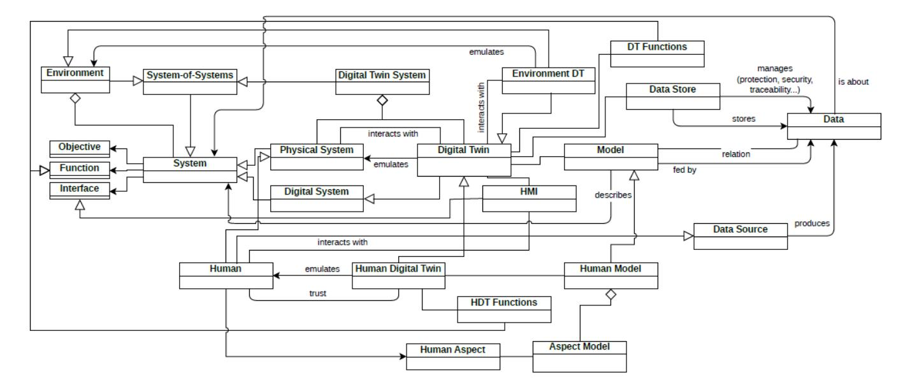

# Preliminary Systemic Model of (Human) Digital Twin

Yannick Naudet^∗^ Christoph Stahl Marie Gallais yannick.naudet@list.lu Luxembourg Institute of Science and Technology (LIST) Esch/Alzette, Luxembourg

## ABSTRACT

This paper is an ongoing work seeking to establish a generic definition and model of the Human Digital Twin (HDT) concept, independently from the application sector. The goal is to help researchers knowing more precisely what is or could be a HDT and an initial step step towards a unifying and generic definition and model grounded in the systemics theory. We propose a systemic model of Digital Twin (DT), where HDT is a specific class of DT. The last years of literature on HDT are reviewed, to build a generic definition, extract the main components and integrate them in a generic systemic model centred on the DT and HDT concepts as systems. Doing this, we make explicit the link between DT and the systems they twin, including the special system that is the human-being, when a DT becomes a HDT.

## TL;DR
Research on preliminary systemic model of (human) digital twin providing insights for knowledge graph development and data integration.

## Key Insights
Contributes to the broader understanding of knowledge graph technologies and data management practices relevant to PKG system development.

## CCS CONCEPTS

* Human-centered computing → User models;

## KEYWORDS

Digital Twin, Human Model, Industry4.0

## ACM Reference Format:

Yannick Naudet, Christoph Stahl, and Marie Gallais. 2023. Preliminary Systemic Model of (Human) Digital Twin. In Proceedings of the 16th International Conference on PErvasive Technologies Related to Assistive Environments (PE-TRA '23), July 05–07, 2023, Corfu, Greece. ACM, New York, NY, USA, [[6]](#ref-6) pages. <https://doi.org/10.1145/3594806.3596596>

### 1 INTRODUCTION

Since the Digital Twin (DT) concept appeared in 2010 [[12]](#ref-12), researchers have worked on different models and implementations, in many different areas and especially in the industrial and smart city domains. However, it is only recently that they have realised the potential of a digital twin for humans, namely a Human Digital Twin (HDT) [[9]](#ref-9). Within the last few years, the number of published articles using the term Human Digital Twin has progressively increased, including literature reviews and articles describing applications, where authors have given different definitions and models. As usual when a new concept appears in the scientific community,

This work is licensed under a [Creative Commons](https://creativecommons.org/licenses/by-nc-nd/4.0/) [Attribution-NonCommercial-NoDerivs International 4.0 License.](https://creativecommons.org/licenses/by-nc-nd/4.0/)

PETRA '23, July 05–07, 2023, Corfu, Greece © 2023 Copyright held by the owner/author(s). ACM ISBN 979-8-4007-0069-9/23/07. <https://doi.org/10.1145/3594806.3596596>

different views have emerged and have not necessarily converged. Defining a common universe of discourse remains however important, especially for a multi-disciplinary topic like the HDT.

Very recently, Miller and Spatz [[7]](#ref-7) have made an effort to propose a unifying view. However, their model, like all the conceptualisation work on HDT today, misses the important point that a DT is a digital representation of a system, be it technical or human. As a consequence, classical components of a system theorized since years are reinvented or forgotten. To establish a generic or unifying model of a HDT, extended from a generic model of a DT, we propose to give it a systemic grounding as originated in the well known and widely used Von Bertalanffy's General Systems Theory [[17]](#ref-17). This will allow to link the (relatively) new concepts of DT and HDT to established concepts from the systemic theory, which can be exploited later on with other elements of systems dynamics for example if useful. At the moment we focus on the conceptual level only, to propose a generic and unifying conceptualisation of what a HDT is.

The paper first summarizes the latest updates on HDT works, from a literature review exclusively focused on the Human Digital Twin keyword and extending past work [[9]](#ref-9). Then, we propose a generic definition and perspective aggregated from the review, we discuss the fundamental differences between a technical system's DT and a HDT, and finally we present the resulting systemic model of DT and HDT.

### 2 HDT STATE-OF-THE-ART UPDATE

A first conceptual model of HDT has been proposed by Naudet et al. [[9]](#ref-9), including a presentation of the main concepts defining a HDT and the different views of the HDT notion in the main application domains (mainly industry and health), and the other concepts that are close to HDT, e.g., Digital Human Model, Personal Digital Twin, or Virtual Human. Building up on this work, this section provides an update of the state-of-the-art on HDT. The aim is to provide a good overview of the research advances, focusing only on the Human Digital Twin concept, which is the only keyword we used here in searches. It is not intended to be a systematic review, which will be the subject of future work completing this paper and finalising our quest for defining and formalising HDT. The model presented later in section [4](#ref-4) replaces the HDT model of [[9]](#ref-9), which was not grounded in systemics. The details of the multiple facets forming a human model given in [[9]](#ref-9), are not discussed here.

An older work that was not cited in [[9]](#ref-9) highlights the potential of HDT in advanced Industry 4.0 systems. Specifically, Sparrow et al. [[15]](#ref-15) have discussed the Human Digital Twin and its use in Holonic Manufacturing Systems, presenting HDT as a tool that "can connect humans with the speed and accuracy of other digital entities, while making full use of a human's problem solving and versatility and ensure job opportunities for future factory workers". In short, holonic systems are composed of collaborating autonomous agents organised hierarchically, where each agent or holon can itself be composed of other holons. In [[15]](#ref-15), the human holon has the same functions and duties as other resource holons that are coupled with non-human entities of the system. The HDT brings in addition human-machine communication interfaces to allow gathering data from human behaviour for analysis and prediction, and automated communication with other holons on behalf of the human worker. The HDT benefits also from models of the human mental and physical behaviour, allowing predictions that can be shared with other holons needing it, for example for task scheduling. The authors of [[15]](#ref-15) highlight the following benefits brought by HDT to Industry4.0: reliable tracking data, real-time process and quality feedback both to the system and to the human worker, process and work adaptation to the worker, better safety monitoring (allowed by real-time tracking) and the possibility to gamify some aspects of the work.

An important role of the HDT which is highlighted is to be a delegate of the human in the digital world. This is essential to allow interactions with CPSs at their execution speed [[16]](#ref-16). Assuming the HDT has enough knowledge of its twinned human (profile, goals, state...), it can communicate with the other digital entities on behalf of the human, without requiring manual actions that would slower the overall interaction.

Wang et al. [[18]](#ref-18) present HDT-driven Human-Cyber-Physical system (HCPS), where the latter is roughly understood as a humancentric CPS. The HDT is part of the HCPS, where it comprises both a physical representation and virtual models of humans. The physical representation is given by sensors observing the human, part of the physical system comprising also sensors and actuators of other physical entities in the environment of the HDT, in the HCPS. It is thus illustrated as a dynamic digital human model fed by sensory inputs, simulating human dynamics for controlling a physical system through the virtual reality. Examples of teleoperation are given (e.g. where a robot reproduces movements of the human piloting remotely in a Virtual Reality setting).

In [[5]](#ref-5), HDT is a combination of individualised human models and personal data containers linked to sensors, which provides a representation of a person's physical and physiological states. Functions attached to it are: physics-based analysis, simulation, prediction of physical and physiological performance of the twinned individual. The current version of their HDT focuses on visual 3D representation integrating three models: 3D body shape with anthropometry, body musculoskeletal model and finite element model. Models of other human dimensions (e.g. behaviour, lifestyle, cognition) are expected to be integrated in the future. Among the important features highlighted for the HDT, we can keep that: HDT should be based on physics or first principle for each of the human dimensions it integrates; it is individualised for one person; it is dynamic with regular updates from sensors observations; and it is flexible and open for different use-case with different requirements regarding the human dimensions and level of details / fidelity needed. The author pushes for having a unified approach where models can share common data and information from exchanges, are synchronised, and are connected together ("work together") to enhance capabilities for analysis and prediction.

Shangguan et al. [[13]](#ref-13) propose the Triple Human-Digital Twin (THDT) architecture for CPS, where humans and physical things are both supported by individual virtual companions and implement together some services. Data from any source (e.g. sensors, documents) including generated data (e.g. from fusion, inference, etc.) is the center of the THDT. In this approach the digital twin is the entire system, where humans and other physical entities have each their synchronised digital counterpart, but share a centralised data store or access. According to the authors, this design choice eliminates information silos. Humans interact with both physical and virtual objects, and the digital twin relies on all data gathered about the three kinds to provide them functions or services. This architecture considers only the perspective of humans manipulating object; there is no virtual human counterpart interacting with virtual models.

HDT is increasingly used in healthcare, where it can support personalised medicine and individualised therapy tailored to individuals. Lauer et al. [[6]](#ref-6) highlight height specific design considerations when a HDT is used for rehabilitation and behaviour changing (of patients): identifiability and traceability, security and privacy, quality and consistency, explainability and understandability, simplicity and intuition, flexibility and adaptability, motivation and support, conceptualisation and embodiment. We summarise and extend the main points of [[6]](#ref-6) here:

* Regulation and ethics. This leads to indentifiability and traceability of data, processed and generated by the HDT. HDT should have a unique identifier (UID) and manage data according to GDPR, with all the required measures to ensure privacy, ownership and security.
* Transparency and trust. Establishing a trust relationship between a HDT and its human twin requires that the HDT makes its processes and actions transparent to the human. Explainability is here fundamental for both sides to understand each other, and more generally the HDT should follow the guidelines for Trustworthy AI^1^ , implementing ethics and fairness. Another very important aspect concerns the interface for interactions between HDT and human (i.e., the HMI or HCI), which has to be as intuitive and simple as possible, following UI ergonomics rules and maximising UX, and should be personalised for the twinned human capacities.
* Dynamism and Flexibility. This relates to continuous learning or updating, which is a characteristic of classical DT [[1]](#ref-1), meaning continuous update of data and adaptation of models exploited by the HDT. The other point is that the design of the HDT should be enough flexible to be adapted or adapt autonomously when changes occur in its environment (e.g., impacting events, but also regulation changes).
* Behaviour and cognitive mechanisms. This relates to human factors the HDT has to take into account. Cognitive mechanisms have to be understood to adapt the HDT interaction and ensure the expected impact on the human twin. More generally, any factor involved in human behaviour has to

^1^Ethics Guidelines for Trustworthy AI, 2019, https://digitalstrategy.ec.europa.eu/en/library/ethics-guidelines-trustworthy-ai

be considered, including emotions (the main research focus currently according to [[6]](#ref-6)) but not only.

* Representation and Embodiment. The digital or physical representation of the HDT plays an important role in its interaction with the human and the trust relation being built. Depending on the use-case and objective, maximising the impact of using a HDT implies using a different representation. It can be an accurate 3D/4D digital representation of the human (e.g. for personalised well-being or medicine, posturography, etc.), or an object (e.g. embodiment in a robot, mirror, etc. see [[6]](#ref-6) for references), down to a dashboard, recommender system, conversational chatbot, etc.

Miller et al. [[7]](#ref-7) proposed a unified view of a HDT in a metamodel ("block definition diagram") generalised from the review of literature in 2022. It is centred on the Digital Twin System (DTS) concept, which is composed of three elements: a real-world twin, a digital twin, and an interchange component that materialises the bi-directional link between the Digital Twin and its Physical Twin (PT) allowing synchronisation of the DT and feedback to the PT. The objective of the DTS is to optimise a functioning goal of the Physical Twin thanks to the Digital Twin. This is done with the following loop, summarised from the one presented in [[7]](#ref-7):

* (1) Sensors generate observation data about the PT and its environment;
* (2) The DT receives these data (via the interchange component);
* (3) The DT compares it to its current representation of the world (models about PT and its environment), which is adapted together with explanations of changes;
* (4) The DT creates projections of future behaviour moving the system in a state closer to its goal; and
* (5) sends accordingly modifications to apply to the PT.

This loop is repeated until the goal is reached. According to [[7]](#ref-7), the PT is composed of human agents, sensors and actuators, machines, and processes representing the mechanisms to modify the environment. The DT is then composed of models for humans, processes and machines, prediction engines, performance goals and mission descriptions. There is not clear distinction between DT systems and HDT systems as well as between DTs and HDTs.

### 3 THE HDT CONCEPT

### 1 Definitions

Taking a recent definition resulting from a systematic literature review from Semeraro et al. [[11]](#ref-11), we define Digital Twin as follows.

Definition 3.1 (Digital Twin). "A set of adaptive models that emulate the behaviour of a physical system in a virtual system getting real time data to update itself along its life cycle. The digital twin replicates the physical system to predict failures and opportunities for changing, to prescribe real time actions for optimizing and/or mitigating unexpected events observing and evaluating the operating profile system".

A digital twin of a human inherits from the DT's characteristics and functions, as highlighted in the definition given by Naudet et al. [[9]](#ref-9): "A Human Digital Twin (HDT) is a subclass of the Digital Twin whose particularity lies in the human nature of the twinned entity. It is a real-time mirroring computerized system of a human agent, able to simulate or emulate his characteristics and behavior in context". As often, there are different definitions of HDT with no real consensus. Recent literature reviews have given their own synthesis, highlighting properties and components of a HDT and sometimes proposing a definition. We propose here our own synthesis in the form of a general, domain-independent definition.

A definition from Miller et al. [[7]](#ref-7) describes HDT as "an integrated model which facilitates the description, prediction, or visualization of one or more characteristics of a human or class of humans as they perform within a real-world environment.". This one does not refer to DT, and thus does not link with research in the field and the origins of the term. However, it highlights a point that requires further discussion: can or should a HDT represent a class or a group of humans?

In the health domain, a HDT is linked to one entity, the patient, as summarised in [[2]](#ref-2) where human DTs are defined as "computer model of humans tailored to any patient to allow researchers and clinicians to monitor the patient's health, for providing and test treatment protocols". This view of an individual twin is present also in the unifying view of Cheng et al. [[5]](#ref-5), where HDT is defined as "a digital representation or virtual self of a human", which can dynamically represent personal physical and physiological states. A specificity is that it is based on individualised human models and personal data containers storing sensory observations. The most important aspect is a permanent data link between the HDT and its biological counterpart, allowing for synchronisation between DT and PT. This makes it different from classical digital models of humans or digital avatars, which are only controlled by humans. Highlighted usages of the HDT are then: "to perform physics-based analysis, simulation, and prediction of physical and physiological performance of an individual". Although not presented as a definition, the explanations here highlight important points: the personalised / individualised aspect, the data link, and the main functions a HDT should have.

The HDT as a digital representation of one single person is a view coherent with the trends for virtual humans [[3]](#ref-3) or digital human models [[4]](#ref-4) that have a lot of commonalities with the HDT. It also takes full sense when considering the personalised functions it can bring, as we describe in the following part.

In the light of the recent literature reviews and these definitions, we propose a new generic one, including all the important aspects of a HDT. It is to be noted however that this is still work in progress, where a definitive definition will be provided when the systemic meta-model is finalised.

Definition 3.2 (Human Digital Twin). A Human Digital Twin (HDT) is a personal digital representation of a human-being. It is a subclass of Digital Twin (DT) where the twinned system is a human individual.

* It inherits all functions from a DT, and has human-dedicated functions like, e.g., personal assistant and personal data management.
* It emulates characteristics and behaviours of the twinned human, based on data and a set of models about different aspects of the twinned human, the HDT itself, and their respective environments.
* A permanent, bi-directional link through dedicated Human-Machine-Interfaces (HMI) allows synchronisation where

<!-- Image Description: This diagram illustrates a Human-Digital Twin (HDT) system architecture. It shows data flow between a physical world environment (characterized by behavior and data sources like sensors) and a digital world environment (containing various models—cognitive, physical, etc.—and functions such as monitoring and personal assistance). A central human figure represents the interaction through an HMI (Human-Machine Interface), highlighting data feedback and continuous adaptation. Key aspects like privacy, security, and ethics are also emphasized. -->

**Figure 1:** HDT overview

the HDT updates from the twinned human's states and behaviour, and the latter can in turn react to HDT inputs, in a continuous feedback loop.

### 2 Overview and specificity

In addition to the given definition, the generic view of a HDT is further illustrated by Figure [[1]](#ref-1), where the couple Human-HDT is represented in their respective physical and digital environments. The human being, or PT, together with its characteristics and behaviour, evolves in its environment. Data is gathered from any kind of data source, including sensors and direct input by the human. With the created permanent bi-directional link, the HDT synchronises the digital representation of the human it maintains, with the states and behaviours of the PT. The feedback loop where the HDT gives back information or instructions to the human is very important like for any DT. The HDT lives in its own digital environment where it can be influenced by other DTs or HDTs interacting with it. It relies on a set of models of any kind (physical / mathematical models, descriptive models (e.g. ontologies), ML models...), representing any aspect of a human being in general and of the specific human it twins. The HDT should have an Human-Machine Interface (HMI), to receive inputs from the twinned human and give feedback. Last, it has all the functions of a DT (e.g. monitoring, analysis, simulation, prediction, decision-support, task automation), plus specific functions linked to its nature of HDT. In particular, it can act as a personal assistant, be the personal data keeper, or automate tasks to act on behalf of the twinned human.

The fact that a HDT twins a human instead of a controllable technical system implies new constraints and functions, often bringing new challenges that a DT implementation does not face or only partially. Figure [[1]](#ref-1) also highlights the important points of the HDT

design from [[6]](#ref-6) (see previous section). Because the twinned entity is a human-being, all HDT functions have to implement security and safety rules, but also be always in line with ethics. Especially, using a Trustworthy AI approach will support this, plus transparency and trust aspects. Maintaining a trust relation and keeping privacy is essential when the HDT performs task automation without human supervision or manages personal data. Dynamism and flexibility are supported by the continuous learning from the bidirectional data link, and HDT representation and embodiment should be supported by dedicated models in the HDT. Last, we have also seen from previous work that behaviour and cognitive mechanisms are only a part of all the human aspects that can be handled by a HDT (as illustrated by the non exhaustive list of models displayed in Figure [[1]](#ref-1)).

### 4 SYSTEMIC GROUNDING FOR DT AND HDT

In an effort to provide a generic formalisation of a Human Digital Twin (HDT), we propose in this section a preliminary model grounded in systemics for both Digital Twin (DT) and its human counterpart (HDT). A DT is an emulation of a System from the physical world [[11]](#ref-11). Because it represents a (potentially complex) system and is an engineered system itself, this seems logical to ground a meta-model describing the DT concept, in a systems theory. The most recognised and generic one is the General Systems Theory of Von Bertalanffy [[17]](#ref-17). Figure [[2]](#ref-2) shows our meta-model formalising both DT and HDT, grounded in systemics. The model follows UML notation, and should be understood as work in progress. In particular, the cardinality of associations is not represented on purpose since some of them have still to be discussed, like for example the fact that a DT can represent only one or multiple physical systems. Non-labelled links should be understood as a simple connection

<!-- Image Description: This image is a system architecture diagram illustrating a digital twin system. It uses a block diagram style showing interconnected components, including the physical system, digital system, digital twin, human, human digital twin, data store, data source, and associated functions. Arrows indicate data flow and relationships (e.g., "emulates," "interacts with"). The diagram's purpose is to visually represent the complex interactions within a holistic digital twin framework, clarifying the relationships between its various parts. -->

**Figure 2:** Preliminary Systemic model of DT and HDT

without a specific semantic. This preliminary version of the metamodel will be extended and finalised in a follow-up article.

From the systemics perspective, tacking the core of the systemic model from [[10]](#ref-10), we can formalise a System, which is part of an Environment, where the environment is indeed a System-of-Systems, a specific kind of systems emerging from the loose coupling of elements that can be systems themselves [[8]](#ref-8). A system interacts with its environment through Interfaces and works to fulfill a dedicated Objective, which is done through a set of Functions [[10]](#ref-10). To formalise the DT, we have to distinguish between Physical System and Digital System, both defined as subclasses of System. To some extent, a DT can be considered as a system of the digital world. The reality is not as simple, because a DT is built from elements of the physical world, and as such it should be considered as a physical system. However, its fundamental objective is to be a digital representation of the twinned system that it emulates. From this perspective, we consider a DT is a digital system. A DT emulates a physical system, and their bidirectional link is formalised by the interacts with relation between them. Like any system, a DT is part of an environment; the link is inherited from the System - Environment part-of relation. However, this environment needs to be distinguished from the environment of the system the DT emulates. The latter is another Digital Twin, we formalise by the Environment DT class, with which the DT interacts. As highlighted in several works, taking into account the environment is essential for implementing an accurate DT (see, e.g., [[14]](#ref-14)). However, theses are indeed two kinds of environments that have to be considered, and both are important: on one side the DT needs to know which elements impact the functioning of its twinned system to build a coherent emulation in context; and on the other side it needs to be aware of its own environment that can influence its functioning. Examples of the DT environment influence are, e.g., interactions with other DTs that can bring additional information or communication constraints, or more generally technical constraints from

the IT structure. According to the definitions in previous section, a DT emulates a physical system thanks to a set of Models. The models describe parts of all systems relevant for a DT, i.e. about the twinned (emulated) system and itself: the physical system, the DT and their respective environments. Models can be of any kind at the condition they are machine-executable or interpretable, and they are tightly linked to Data [[7]](#ref-7): they can be data-based (e.g. ML models), and in all cases should always be adapted when related data is updated. The DT integrates some Data Stores that store Data produced from Data Sources of any kind. Those data stores are also in charge of managing data protection, security, traceability, or any other aspect. A DT, like any other system, integrates a set of interfaces to interact with its environment (including other systems and DTs). In particular, it possesses HMIs, through which it interacts with humans (e.g. operator or human-as-sensor). Data like models are about the physical twin, the DT and their environments. The DT specific functions as described in previous section can be formalised as specialisations of the Function class, here with DT Functions. Finally, in our meta-model, we formalise a Digital Twin System (DTS) as a system-of-systems which is the aggregation of some physical systems and digital twins, integrating here the view of [[7]](#ref-7). The DTS has a particular Objective (like any system), that the composing systems and DTs will achieve together.

Once a DT is formalised, it becomes easy to do it for a HDT, as it is simply a specific kind of DT that emulates a Human. As such, it inherits from all properties of a DT. Then, a HDT relies on a Human Model, which is composed of Aspect Models formalising Human Aspects or dimensions such as physical, physiological, cognition, behaviour, personality, emotion [[7]](#ref-7), [[9]](#ref-9); mood, motivation, ability, biographical [[9]](#ref-9); perception, ethics [[7]](#ref-7), not represented here for the sake of clarity. It has also the specific HDT Functions as described in previous section, which are specialised functions of the HDT-asa-system.

### 5 CONCLUSION

Building on the work of [[9]](#ref-9) presenting the HDT concept and recent literature reviews [[7]](#ref-7)[[6]](#ref-6), we have proposed a generic definition for the Human Digital Twin and a meta-model grounded in systemics that can be used as a basis for a common understanding of what Digital Twin and Human Digital Twin are (e.g. to derive an ontology) and for designing them. This work in progress is an effort towards providing this common understanding, which will be completed and implemented in two case studies in the Industry and Health domains.

### REFERENCES

* [1] Barbara Rita Barricelli, Elena Casiraghi, and Daniela Fogli. 2019. A Survey on Digital Twin: Definitions, Characteristics, Applications, and Design Implications. IEEE Access 7 (12 2019), 167653–167671. [https://doi.org/10.1109/ACCESS.2019.2953499](https://doi.org/10.1109/ACCESS.2019.2953499)
* [2] Barbara Rita Barricelli, Elena Casiraghi, Jessica Gliozzo, Alessandro Petrini, and Stefano Valtolina. 2020. Human Digital Twin for Fitness Management. IEEE Access 8 (2 2020), 26637–26664.<https://doi.org/10.1109/ACCESS.2020.2971576>
* [3] David Burden and Maggi Savin-Baden. 2019. Virtual Humans: Today and Tomorrow. CRC Press, Taylor & Francis Group, New York.
* [4] Keith Case, Russel Marshall, and Steve Summerskill. 2016. Digital human modelling over four decades. International Journal of the Digital Human 1, 2 (2016), pp. 112–131.<https://doi.org/10.1504/IJDH.2016.077408>
* [5] Zhiqing Cheng. 2022. Human digital twin with applications. In Proceedings of the 7th International Digital Human Modeling Symposium, Vol. 7. University of Iowa, Iowa City, Iowa, USA, 10. Issue 1.<https://doi.org/10.17077/DHM.31783>
* [6] M. W. Lauer-Schmaltz, P. Cash, J. P. Hansen, and A. Maier. 2022. Designing Human Digital Twins for Behaviour-Changing Therapy and Rehabilitation: A Systematic Review. Proceedings of the Design Society 2 (5 2022), 1303–1312. <https://doi.org/10.1017/PDS.2022.132>
* [7] Michael E. Miller and Emily Spatz. 2022. A unified view of a human digital twin. Human-Intelligent Systems Integration 2022 4:1 4 (3 2022), 23–33. Issue 1. <https://doi.org/10.1007/S42454-022-00041-X>
* [8] Gérard Morel, Hervé Panetto, Frédérique Mayer, and Jean-Philippe Auzelle. 2007. System of Enterprise-Systems Integration Issues: an Engineering Perspective. In IFAC Conference on Cost Effective Automation in Networked Product Development andManufacturing, IFAC-CEA'07. Elsevier Ltd, Monterrey, Mexico.
* [9] Yannick Naudet, Alexandre Baudet, and Margot Risse. 2021. Human Digital Twin in Industry 4.0: Concept and Preliminary Model. In Proceedings of the 2nd International Conference on Innovative Intelligent Industrial Production and Logistics, IN4PL, Hervé Panetto, Marco Macchi, and Kurosh Madani (Eds.). SCITEPRESS, online, 137–144.<https://doi.org/10.5220/0010709000003062>
* [10] Yannick Naudet, Thibaud Latour, Wided Guédria, and David Chen. 2010. Towards a systemic formalisation of interoperability. Comput. Ind. 61 (2010), 176–185.
* [11] Concetta Semeraro, Mario Lezoche, Hervé Panetto, and Michele Dassisti. 2021. Digital Twin Paradigm: A Systematic Literature Review. Computers in Industry 130 (9 2021), 103469.<https://doi.org/10.1016/j.compind.2021.103469>
* [12] Mike Shafto, Mike Conroy, Rich Doyle, Ed Glaessgen, Chris Kemp, Jacqueline LeMoigne, and Lui Wang. 2010. DRAFT Modeling, Simulation, Information Technology & Processing Roadmap, Technology Area 11. Technical Report. National Aeronautics and Space Administration, NASA Headquarters, Washington, DC 20546.
* [13] Duansen Shangguan, Liping Chen, Chang Su, Jianwan Ding, and Chan Liu. 2022. A Triple Human-Digital Twin Architecture for Cyber-Physical Systems. Computer Modeling in Engineering & Sciences 131, 3 (2022), 1557–1578. [https://doi.org/10.32604/cmes.2022.018979](https://doi.org/10.32604/cmes.2022.018979)
* [14] Wei Shengli. 2021. Is Human Digital Twin possible? Computer Methods and Programs in Biomedicine Update 1 (1 2021), 100014. [https://doi.org/10.1016/J.CMPBUP.2021.100014](https://doi.org/10.1016/J.CMPBUP.2021.100014)
* [15] D. Sparrow, K Kruger, and A. Basson. 2019. Human DigitalTwin for integrating human workers in Industry 4.0. In Proceedings of the International Conference on Competitive Manufacturing. Stellenbosch University, Stellenbosch, South Africa.
* [16] D.E Sparrow, K Kruger, and A.H Basson. 2021. An architecture to facilitate the integration of human workers in Industry 4.0 environments. International journal of production research 60, 15 (2021), 4778–4796. [https://doi.org/10.1080/00207543.2021.1937747](https://doi.org/10.1080/00207543.2021.1937747)
* [17] Ludwig Von Bertalanffy. 1972. The history and status of general systems theory. Academy of management journal 15, 4 (1972), 407–426.
* [18] Baicun Wang, Huiying Zhou, Geng Yang, Xingyu Li, and Huayong Yang. 2022. Human Digital Twin (HDT) Driven Human-Cyber-Physical Systems: Key Technologies and Applications. Chinese Journal of Mechanical Engineering (English Edition) 35 (12 2022), 1–6. Issue 1.<https://doi.org/10.1186/S10033-022-00680-W>

## Metadata Summary
### Research Context
- **Research Question**: 
- **Methodology**: 
- **Key Findings**: 
- **Primary Outcomes**: 

### Analysis
- **Limitations**: 
- **Research Gaps**: 
- **Future Work**: 
- **Conclusion**: 

### Implementation Notes