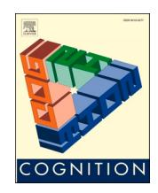
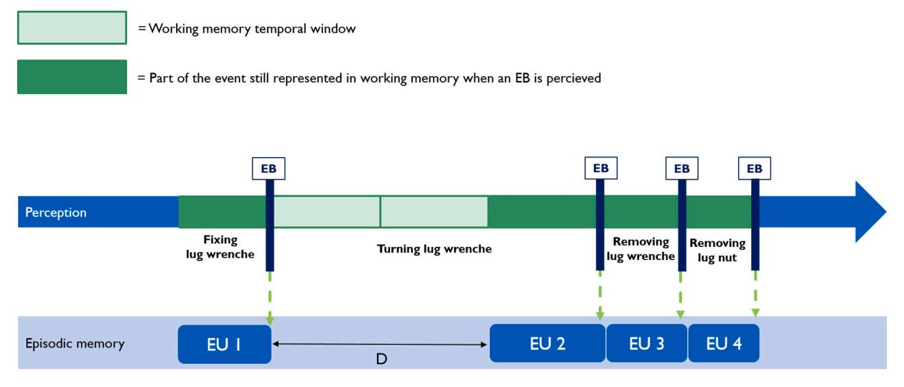
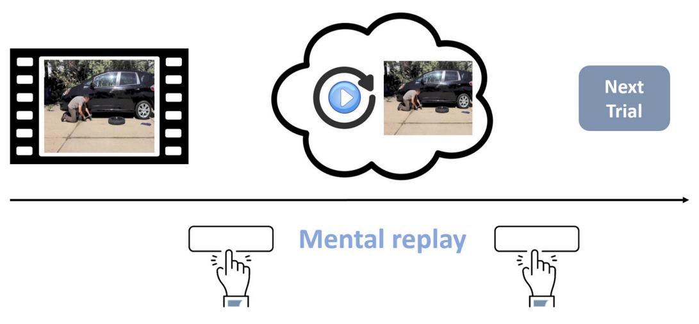
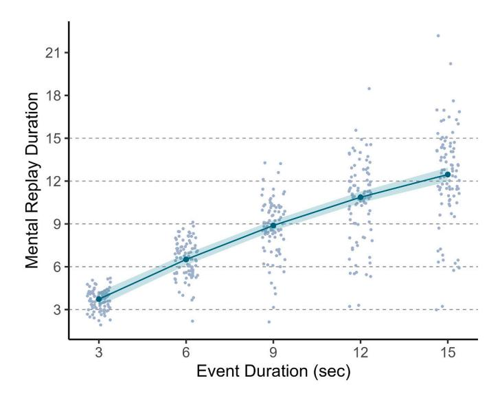
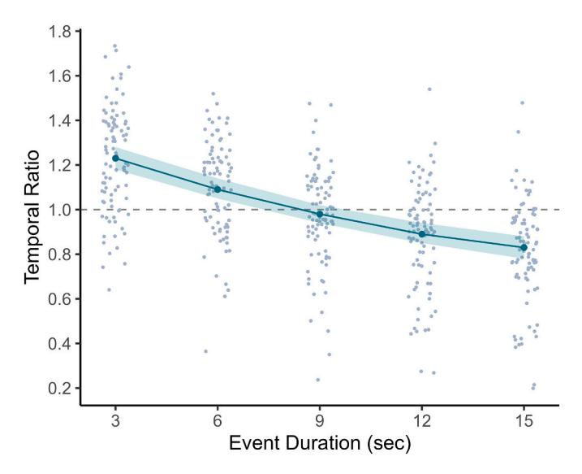

Contents lists available at [ScienceDirect](www.sciencedirect.com/science/journal/00100277)

# Cognition

<!-- Image Description: The image is a conceptual illustration, not a technical diagram or chart. It depicts a three-dimensional triangular structure with the words "EMOTION," "BEHAVIOR," and "COGNITION" displayed on its sides, suggesting an interconnected relationship between these three concepts. The visual style is artistic and symbolic, likely serving as a conceptual model or framework to illustrate the paper's central theme. No equations or data are presented. -->

journal homepage: [www.elsevier.com/locate/cognit](https://www.elsevier.com/locate/cognit)

# Working memory capacity for continuous events: The root of temporal compression in episodic memory?

<!-- Image Description: The image is not a diagram, chart, graph, equation, or technical illustration. It's a simple button graphic from a software interface, showing a circular icon (partially blue and yellow, containing a red bookmark) with the text "Check for updates". Its purpose within the academic paper is likely to indicate the availability of updated software or data relevant to the research described. It's purely a visual cue for the reader and doesn't present any technical data. -->

## Nathan Leroy \*, Steve Majerus, Arnaud D'Argembeau
*University of Li*`*ege, Belgium*

| ARTICLE INFO                                                                             | ABSTRACT                                                                                                                                                                                                                                                                                                                                                                                                                                                                                                                                                                                                                                                                                                                                                                                                                                                                                                                                                                                                                                                      |  |  |
|------------------------------------------------------------------------------------------|---------------------------------------------------------------------------------------------------------------------------------------------------------------------------------------------------------------------------------------------------------------------------------------------------------------------------------------------------------------------------------------------------------------------------------------------------------------------------------------------------------------------------------------------------------------------------------------------------------------------------------------------------------------------------------------------------------------------------------------------------------------------------------------------------------------------------------------------------------------------------------------------------------------------------------------------------------------------------------------------------------------------------------------------------------------|--|--|
| Keywords: Temporal compression Working memory Event duration Episodic memory | Remembering the unfolding of past episodes usually takes less time than their actual duration. In this study, we evaluated whether such temporal compression emerges when continuous events are too long to be fully held in working memory. To do so, we asked 90 young adults to watch and mentally replay video clips showing people performing a continuous action (e.g., turning a car jack) that lasted 3, 6, 9, 12, or 15 s. For each clip, participants had to carefully watch the event and then to mentally replay it as accurately and precisely as possible. Results showed that mental replay durations increased with event duration but in a non-linear manner: they were close to the actual event duration for short videos (3–9 s), but significantly smaller for longer videos (12 and 15 s). These results suggest that working memory is temporally limited in its capacity to represent continuous events, which could in part explain why the unfolding of events is temporally compressed in episodic memory. |  |  |

# 1. Introduction

Humans are endowed with the fascinating ability to mentally travel in time. This faculty allows us, among other things, to mentally relive episodes from our personal past [\(Conway, 2009;](#page-5-0) [D'Argembeau, 2020](#page-5-0); [Tulving, 2002\)](#page-6-0). Nevertheless, our memories are not like continuous video recordings. Events are mentally replayed as a sequence of experience units—each unit representing a moment of the past experience—that are separated by temporal discontinuities (i.e., moments that are not remembered; [D'Argembeau, Jeunehomme,](#page-5-0) & Stawarczyk, 2022). Because of these discontinuities, the time taken to mentally reexperience an event is typically shorter than its actual duration, a phenomenon referred to as the temporal compression of events in episodic memory (Jeunehomme & [D'Argembeau, 2019, 2023](#page-6-0)). However, the cognitive mechanisms underlying this compression, particularly the factors leading to temporal discontinuities in event representation, are not fully understood. Here, we aim to shed light on the mechanisms of construction of the experience units that constitute episodic memories by investigating how continuous events of various length are maintained in working memory (WM).

A consistent body of work suggests that the experience units that compose episodic memories are formed through cognitive processing taking place during event perception. In daily life, we constantly segment the continuous flow of experience into meaningful units (i.e.,

events and sub-events) that are temporally delimited by the perception of event boundaries (i.e., the end of an event and the beginning of another; Kurby & [Zacks, 2008;](#page-6-0) Radvansky & [Zacks, 2017\)](#page-6-0). Between event boundaries, WM enables us to construct and maintain a mental model of the current situation (i.e., an event model) while continuously processing incoming information [\(Loschky, Larson, Smith,](#page-6-0) & Magliano, [2020; Radvansky, 2017;](#page-6-0) Richmond & [Zacks, 2017](#page-6-0); [Zacks, 2020\)](#page-6-0). When the situation changes (i.e., when an event boundary is perceived), the current event model is updated and its previous version is integrated in the long-term memory representation of the ongoing sequence of events ([Bailey, Kurby, Sargent,](#page-5-0) & Zacks, 2017; [Bird, 2020](#page-5-0); [Loschky et al., 2020](#page-6-0); Lu, Hasson, & [Norman, 2022](#page-6-0)).

Based on this work on event segmentation, we suggest that temporal discontinuities within episodic memories may be a byproduct of the role of WM in constructing events models. When new information needs to be continuously processed, WM capacity is temporally limited: without refreshing, the information just perceived is only maintained for a limited amount of time ([Barrouillet, Bernardin,](#page-5-0) & Camos, 2004). So, in the context of event model formation (during which incoming information must be continuously accumulated), the temporal limit of WM (i. e., the time during which information can be held in WM without active refreshing) should correspond to the maximal duration of an event model that can be fully maintained in mind. When this temporal capacity is exceeded before the perception of an event boundary, the

<https://doi.org/10.1016/j.cognition.2024.105789>

Available online 6 April 2024 0010-0277/© 2024 Elsevier B.V. All rights reserved. Received 4 October 2023; Received in revised form 5 February 2024; Accepted 1 April 2024

\* Corresponding author at: Psychology and Neuroscience of Cognition Research Unit, University of Li`ege, Place des Orateurs 1 (B33), 4000 Li`ege, Belgium. *E-mail address:*[nathan.leroy@uliege.be](mailto:nathan.leroy@uliege.be) (N. Leroy).

experience unit formed at the end of the current event would only partially represent its unfolding, leading to temporal discontinuities in the long-term memory representation into which this experience unit is integrated [\(Fig. 1](#page-2-0)).

Research on temporal cognition suggests that the "subjective present" lasts about 3 s, which would correspond to the elementary units of the flow of consciousness (Fairhall, Albi, & [Melcher, 2014](#page-6-0); [Monfort](#page-6-0)  [et al., 2020;](#page-6-0) Montemayor & [Wittmann, 2014](#page-6-0); [Poppel,](#page-6-0) ¨ 1997). WM would then enable us to maintain several of these units of "now" in an active state to form more complex event representations (i.e., event models; Richmond & [Zacks, 2017](#page-6-0); [Wittmann, 2016](#page-6-0)). According to some authors, this maintenance mechanism would have an upper temporal limit situated around 10–12 s (Jeneson & [Squire, 2012](#page-6-0); [Wittmann, 2016](#page-6-0)). As a result, temporal compression in memory could emerge when individuals are faced with continuous events lasting longer than 10–12 s.

To test this hypothesis and determine the upper limit of WM capacity for continuous events, we measured the time taken by participants to mentally replay short videos depicting a single event (without event boundaries) lasting 3, 6, 9, 12 or 15 s. We expected remembering duration (the time taken by participants to mentally replay a just-seen video) to closely follow event duration for 3- to 9-s events, but then to increase less steeply for longer events (i.e., 9- to 15-s events). In other words, we predicted that the ratio between the time needed to mentally replay a video and its original duration would decrease with video length in a non-linear way: the duration of mental replay should be close to the actual stimulus duration for short videos (3 to 9 s), but smaller for longer videos (12 or 15 s). This pattern of results would suggest that the temporal limit of WM for continuous events was attained between 9 and 12 s. Beyond that duration, the maintained event model would no longer represent the entire unfolding of the current event and thus temporal compression would emerge. These hypotheses, the study design, and analysis plan were preregistered in OSF at [https://osf.io/4hxzs.](https://osf.io/4hxzs)

## 2. Method

###*2.1. Participants*

Ninety participants (49 females, 39 males, and 2 undefined) aged between 18 and 35 years (*M*= 22.3,*SD*= 3.05) were recruited through announcements on social media and word-of-mouth. The targeted sample size for this study was determined a priori with a power analysis based on Monte-Carlo simulations (Brysbaert & [Stevens, 2018](#page-5-0); [DeBruine](#page-5-0)  & [Barr, 2021](#page-5-0)). This analysis indicated that a sample size of 90 participants would provide a statistical power of at least 90% for each of the planned analyses (see Supplementary Materials for more details). To be eligible, participants had not to be currently taking any medication that could affect their ability to concentrate or have a history of psychiatric, psychological, or neurological disorders. All participants were fluent French speakers. They all provided written informed consent, and the study was approved by the local ethics committee (ref. 2122–009).

####*2.2. Materials*The stimuli were constructed based on 25 videos each showing one (or several) person(s) performing a continuous action (e.g., turning a car jack) for at least 15 s (without interruption). Some of the videos were selected from databases linked to previous studies on event segmentation (Eisenberg & [Zacks, 2016;](#page-5-0) Kurby & [Zacks, 2011](#page-6-0); [Sargent et al.,](#page-6-0)  [2013; Smith, Loschky,](#page-6-0) & Bailey, 2021; [Smith, Newberry,](#page-6-0) & Bailey, 2020; [Wahlheim, Eisenberg, Stawarczyk,](#page-6-0) & Zacks, 2022) and other videos were downloaded from a website hosting free-to-use audiovisual content ([https://pixabay.com/\)](https://pixabay.com/). Then, each video was edited to construct versions of the event that lasted 3, 6, 9, 12, and 15 s. The 3-s version corresponded to the first 3 s of the event, the 6-s version correspond to the first 6 s of the event, and so on. In total, we constituted five sets of stimuli (each containing 25 videos: 5 videos for each of the 5 durations), such that the assignment of an event to a given duration was counterbalanced across participants. Each participant was randomly assigned to one of these sets (with replacement). In each set, the 25 videos were divided into 5 blocks, each block including one video of each duration. The order of blocks, as well as trials within blocks, were fully randomized.

##*2.3. Procedure*Testing took place in a soundproof room. Participants performed the task on a laptop via the Gorilla platform [\(https://gorilla.sc/\)](https://gorilla.sc/). The experiment lasted 60 min on average.
**Temporal compression task.**In total, 25 trials (5 blocks × 5 trials per block) were presented to each participant. Each trial started with a fixation cross of 2 s, followed by a video. Participants had to carefully watch and then to mentally replay the video, as accurately and precisely as possible (as if they were watching the video again in their minds; [Fig. 2](#page-2-0)). The time taken by participants to mentally replay the unfolding of the video was measured by asking them to press the spacebar to indicate the beginning and end of their mental replay ([Jeunehomme](#page-6-0) & [D'Argembeau, 2019\)](#page-6-0). To familiarize participants with the procedure, they performed 5 practice trials (one for each duration) before starting the main task (using videos that were not used in the main task). The detailed instructions are available in OSF at [https://osf.io/zkwf2.](https://osf.io/zkwf2)

###*2.4. Statistical analyses*

Based on our pre-registered inclusion and data cleaning criteria, 17 participants were excluded and replaced by other participants (see Supplementary Materials for more details). The analyses reported here are based on 2212 observations from 90 participants.1 Following our pre-registered analyses plan, we tested our hypotheses using linear mixed-effects models (growth curve analyses; [Curran, Obeidat,](#page-5-0) & Los[ardo, 2010](#page-5-0); [Mirman, 2014](#page-6-0)). For each participant, remembering duration (RD) and temporal ratio (the ratio between RD and the actual video duration) were averaged by duration. First, we examined the relation between stimulus duration and the time taken by participants to mentally replay the videos by fitting a model with RD as outcome and a first and a second order polynomial transformation of stimulus duration as predictors. Next, we examined the relation between stimulus duration and temporal ratio in a second model with the same predictors and temporal ratio as outcome. As the conditions of application of classical linear mixed-effects models were not fully met (see<https://osf.io/zkwf2> for the complete assessment), we used a robust alternative (i.e., DAStau estimator; [Koller, 2013, 2016](#page-6-0); [Mason, 2022\)](#page-6-0).2 For the two models, the random effect structure was determined following the likelihood ratio test backward selection heuristic ([Matuschek, Kliegl, Vasishth, Baayen,](#page-6-0)  & [Bates, 2017](#page-6-0)). The model predicting RD included two random effects: a random intercept for participants, and a random slope for the linear term. The model predicting temporal ratio included three random effects: a random intercept for participants, and random slopes for the linear and quadratic terms. We assessed the statistical significance of parameter estimates with confidence intervals (*CI*s) and *p*-values (considering an alpha of 0.05, two tailed) obtained from standard errors (*SE*) and *t*-statistics of the model using the normal approximation (i.e., treating the *t*-value as a *z*-value; [Baayen, Davidson,](#page-5-0) & Bates, 2008; [Mason, 2022](#page-6-0); [Mirman, 2014](#page-6-0)). Estimated RD and temporal ratio,

1 To ensure that the observed results were not dependent on our inclusion and data cleaning criteria, we ran again all the analyses with all data (N participants = 107, N observations = 2675). Conclusions regarding our hypotheses

remained unchanged (results are available in the Supplementary Materials). 2 The results obtained with the classical and robust analyses were quite similar and conclusions regarding our hypotheses were the same. We therefore only report here the results obtained with the robust estimates, while the results of the classical analyses are available in the Supplementary Materials.

<!-- Image Description: This illustration models the interaction between working memory and episodic memory during event perception. A timeline shows an event (fixing and removing a lug nut) unfolding. Green depicts the portion of the event in working memory; light green shows the temporal window. Vertical lines mark "event boundaries" (EBs) where information is transferred to episodic memory (blue boxes labeled EU1-4). The distance 'D' represents time between episodic memory units. The figure clarifies how working memory's limited capacity impacts episodic memory formation. -->

**Fig. 1.**Hypothesized mechanism behind temporal discontinuities in episodic memories.
*Note.*The cognitive system continuously constructs memory representations of everyday activities (e.g., changing a car tire) by dividing them into discrete meaningful units (i.e., events; e.g., fixing the lug wrench, turning it, removing it, and so on). When the duration of some events exceeds WM temporal limit, their unfolding is incompletely represented, leading to temporal discontinuities in the episodic memories in which they are integrated. EB: Event Boundary; EU: Experience Unit; D: Discontinuity.

<!-- Image Description: The image diagrams an experimental procedure. A short video clip (film reel) depicting a person changing a tire is shown. This is followed by a thought bubble representing mental replay, indicated by a play button within a circular arrow. Participants seemingly interact with buttons labeled "Mental replay" before proceeding to the "Next Trial." The figure illustrates the experimental flow, highlighting the mental replay phase between video presentation and the commencement of a subsequent trial. -->
**Fig. 2.**Unfolding of a trial in the mental replay task.
*Note.*Each trial started with a video clip showing a person engaged in a continuous action (performed without interruption) during 3, 6, 9, 12 or 15-s. As soon as the video ended, participants had to mentally replay its unfolding in as much detail as possible (as if they saw again the depicted event). They were asked to press the spacebar when they started and when they finished their mental replay.

associated pointwise standard errors and Wald's 95% CIs were computed for each event duration using variance-covariance matrix of the model.

All the analyses were performed using R (version 4.2.2; [R Core Team,](#page-6-0)  [2022\)](#page-6-0) and RStudio (version 3.0.386; [Posit team., 2023](#page-6-0)). See Supplementary Materials for more details about R packages that were used.

#### 3. Results

First, we examined the evolution of mental replay durations (RD) as a function of event duration. [Fig. 3](#page-3-0) shows the averaged RD of each participant for each duration, as well as the model estimates and their 95% CIs (detailed descriptive statistics are available in the Supplementary Materials). As expected, a growth curve analysis revealed a nonlinear increase of RD as a function of event duration (linear term:*b*= 6.89,*SE* = 0.26, 95%*CI*[6.39, 7.40],*t*= 26.87,*p <*.001; quadratic term:*b*= − 0.74,*SE* = 0.08, 95%*CI*[− 0.89, − 0.59],*t*= − 9.71,*p <*.001). Indeed, the increase in RD was lower as event duration increased (e.g., the increase in RD between 3- and 6-s events was greater than the

increase in RD between 12- and 15-s events; see [Table 1](#page-3-0), [Fig. 3](#page-3-0)). Importantly, RD was close to the actual event duration for short events (i.e., 3- and 6-s events) but significantly shorter than the actual event duration for long events (12- and 15-s events; see [Table 1, Fig. 3](#page-3-0)).

To further investigate this non-linear relation between event and mental replay durations, we analyzed temporal ratios (i.e., the ratio between the time needed to mentally replay a video and its original duration; see [Fig. 4\)](#page-3-0). As predicted, a growth curve analysis revealed a non-linear decrease of temporal ratio as a function of event duration (linear term:*b*= − 0.32,*SE* = 0.02, 95%*CI*[− 0.36, − 0.27],*t*= − 14.34,*p <*.001; quadratic term:*b*= 0.05,*SE* = 0.01, 95%*CI*[0.02, 0.07],*t*=

<!-- Image Description: The scatter plot shows the relationship between event duration (seconds) and mental replay duration. Numerous data points representing individual observations are plotted, with a fitted curve indicating a positive correlation. The shaded area around the curve represents the confidence interval. The figure illustrates that longer event durations are associated with longer mental replay durations. -->
**Fig. 3.**Increase of mental replay duration as a function of event duration.*Note.*The gray dots represent the observed values. Each point corresponds to the average RD of a given participant for a given duration. The green dots and the ribbon surrounding them represent the model estimates and their 95% CIs for each event duration.

#### Table 1

Growth Curve Analyses (robust linear mixed-effects models): estimates across event durations.

| Event Duration | Remembering Duration |                | Temporal Ratio |              |
|----------------|----------------------|----------------|----------------|--------------|
|                | Estimate             | 95%CI          | Estimate       | 95%CI        |
| 3 s            | 3.73                 | [3.25, 4.22]   | 1.23           | [1.18, 1.28] |
| 6 s            | 6.51                 | [6.11, 6.90]   | 1.09           | [1.05, 1.14] |
| 9 s            | 8.89                 | [8.52, 9.25]   | 0.98           | [0.94, 1.02] |
| 12 s           | 10.87                | [10.47, 11.26] | 0.89           | [0.85, 0.94] |
| 15 s           | 12.46                | [11.97, 12.94] | 0.83           | [0.78, 0.88] |
*Note.*For each event duration: estimated RD (left) and temporal ratio (right), with associated 95% confidence intervals.

<!-- Image Description: The image displays a scatter plot showing the relationship between event duration (in seconds) and temporal ratio. Individual data points are plotted, and a fitted regression line with a confidence interval is overlaid. The plot suggests a negative correlation: as event duration increases, the temporal ratio generally decreases. A horizontal dashed line indicates a temporal ratio of 1. The graph's purpose is to visually represent and analyze the trend of temporal ratio changes across different event durations. -->
**Fig. 4.**Decrease of temporal ratio as a function of event duration.*Note.*The gray dots represent the observed values. Each point corresponds to the average temporal ratio of a given participant for a given duration. The green dots and the ribbon surrounding them represent the model estimates and their 95% CIs for each event duration.

3.79,*p <*.001).3

Importantly for our purpose, model estimates showed that mental replay durations became significantly shorter than the actual event durations when events lasted*>*9 s (i.e., temporal ratios were significantly lower than 1 only for 12- and 15-s events; see Table 1). These results suggest that continuous events start to become temporally compressed in WM representations when their duration is about 10–12 s (see also Figs. 3 and 4).4

It is also worth noting that the estimated RD for short events (i.e., 3 and 6-s events) was slightly longer than the actual event duration (temporal ratio *>*1). As a result, one could argue that the variations in temporal ratios we observed as a function of event duration could be explained by a central tendency bias. However, more detailed analyses of the evolution of RD across trials do not support this interpretation (see Supplementary Materials).

#### 4. Discussion

Episodic memories represent past events as sequences of experience units (i.e., segments of prior experience) that include discontinuities, such that the unfolding of events is temporally compressed ([D'Argem](#page-5-0)[beau et al., 2022](#page-5-0)). Previous studies suggest that the compression rate of an event depends on the number and duration of experience units representing its unfolding in memory (Jeunehomme & [D'Argembeau, 2020,](#page-6-0)  [2023\)](#page-6-0). In the current study, we aimed to shed light on the mechanisms of construction of experience units by determining at what point the unfolding of continuous events that do not include event boundaries starts to be temporally compressed in memory. Using a novel paradigm that assesses WM for continuous events, we found that, as expected, the temporal compression of continuous events held in WM is not systematic but emerges when these events exceed a given duration: RD was significantly shorter than the actual event duration only for 12- and 15-s videos. These results suggest the existence of a temporal limit of WM in representing continuous events (i.e., the maximum duration up to which the stream of current experience can be accumulated and integrated into a single event model), which may in turn determine the duration of experience units that are integrated in episodic memory.

We intentionally used continuous events that do not contain event boundaries to investigate at what point the stream of experience starts to be temporally compressed in the current event model maintained in WM. Our results suggest that the information accumulation process underlying event model formation (see [Güler, Adıgüzel, Uysal,](#page-6-0) & Gun[seli, 2023; Lu et al., 2022](#page-6-0)) can be "lossy" because of WM capacity limits in representing continuous events. This, in turn, would lead to the formation of incomplete episodic memory representations when the time elapsed between two event boundaries is too long [\(Jeunehomme](#page-6-0) & [D'Argembeau, 2020, 2023\)](#page-6-0). Nevertheless, factors other than event duration per se could also determine when an event model begins to be temporally compressed. When we are faced with objects or agents that move and change, our perceptual system divides the continuous sensory

3 Model comparisons performed on non-robust growth curves (see Supplementary Materials) revealed that a model including both linear and quadratic terms provided a significantly better fit to the data than a simpler model that only included the linear term. This was the case for both the model predicting RD (χ2 (1) = 75.69,*p <*.01) and the model predicting the temporal ratio (χ2 (1)

= 12.33,*p &lt;*.01). 4 Although temporal ratios decreased with event duration in almost all participants, the magnitude of this decrease, as well as the event duration at which it started, varied substantially between individuals (see Supplementary Materials). If, as hypothesized, the emergence of temporal compression is a byproduct of WM temporal limit, variations in WM forgetting rate should explain these individual differences. Future studies could test this hypothesis by independently measuring individual differences in WM capacity and by examining the associations between WM capacity and the event-durationdependent decrease of temporal ratios.

information into discrete perceptual units (e.g., a person raising the left arm; [Wood, 2007](#page-6-0)).5 Like verbal information chunks, the number of perceptual units that can be maintained in WM is limited ([Brady, Kon](#page-5-0)kle, & [Alvarez, 2009](#page-5-0); [Wood, 2007\)](#page-6-0). Therefore, event models could be temporally compressed when the number of perceptual units they contain exceeds WM capacity. In general, the number of perceptual units increases with event duration, but this is not always the case, and it would be interesting in future studies to investigate the independent effects of each factor on temporal compression. For that purpose, the perceptual units contained in video segments could be identified using behavioral data or an algorithmic approach (Rui & [Anandan, 2000](#page-6-0); Zacks & [Tversky, 2001\)](#page-6-0).6

In our view, the fact that RD starts to be shorter than the actual event duration for events lasting*>*9 s reflects a temporal limit of WM in representing continuous events. Beyond that duration, the stream of experience accumulated and integrated into the current event model would exceed WM capacity. As a result, the mental representation of the event would start to be truncated (i.e., part of the sensory stream is no longer represented), leading to an incomplete encoding of its unfolding in episodic memory. However, it could also be the case that some form of compression mechanism already operates at the level of WM representations (i.e., when constructing the event model of the current situation). Between event boundaries, the continuous unfolding of experience could be summarized through WM processes, enabling the construction of event models covering longer time spans, but in a format further away from reality/perception ([Al Roumi, Marti, Wang, Amalric,](#page-5-0) & Dehaene, [2021;](#page-5-0) [Brady et al., 2009;](#page-5-0) [Lazartigues, Lavigne, Aguilar, Cowan,](#page-6-0) & [Mathy, 2021\)](#page-6-0). Indeed, previous studies have shown that visuospatial information (e.g., spatial sequences, multidimensional objects, or colorchanging shapes) that includes regularities tends to be compressed in WM. Compressed representations could be formed in WM by removing redundant information, thus allowing more items to be stored ([Brady](#page-5-0)  [et al., 2009\)](#page-5-0). Although this remains to be investigated, dynamic events containing important regularities in their unfolding (such as those depicted in our videos) could be subject to similar WM compression processes when they exceed a given duration.

The current finding that continuous events are temporally compressed in memory when they exceed a given duration could be due not only to factors operating during encoding, but also during retrieval. Event models are multidimensional and temporally extended representations that integrate the different elements characterizing the ongoing situation (e.g., people, locations, objects, and so on), as well as their temporal evolution ([Bird, 2020](#page-5-0); [Loschky et al., 2020;](#page-6-0) [Richmond](#page-6-0) & [Zacks, 2017;](#page-6-0) [Zacks, Speer, Swallow, Braver,](#page-6-0) & Reynolds, 2007). The retrieval of this within-event temporal evolution (the quantity of withinevent information that can be retrieved and maintained online for the purpose of mental replay) could be limited by WM capacity. As a result, the mental replay of long continuous events could be truncated. Although this is a challenging undertaking, future studies should attempt to clarify the respective contribution of encoding and retrieval processes in determining RD, and thus temporal compression, for long continuous events.

Interestingly, we found that the estimated RD for short events (i.e., 3 and 6-s events) was slightly longer than the actual event duration (temporal ratio *>*1). In fact, it is likely that our measure of RD (asking participants to press a key when they started and finished their mental replay) reflects the combined durations of two distinct mental processes: the time needed to mentally replay the unfolding of the event (our process of interest) and the time taken to access the initial memory trace (i.e., the time needed to represent the initial visual scene from which the participants had to mentally replay the subsequent unfolding of the event). Indeed, we can realistically assume that a minimal amount of time is required to initiate memory retrieval (McElree & [Dosher, 1989](#page-6-0); Staresina & [Wimber, 2019](#page-6-0)). When this is taken into account, the temporal ratio would necessarily be higher than 1 for events that are mentally replayed without temporal compression. Furthermore, the temporal ratio would be higher for 3- than 6-s events: for example, if someone needs 500 ms to access the initial visual scene, this represents 1/6 of the event duration for 3-s events (temporal ratio = 1.17) but only 1/12 of the event duration for 6-s events (temporal ratio = 1.08). Therefore, it is possible that our measure somewhat overestimated mental replay duration and, therefore, WM temporal limit (i.e., the duration beyond which, in the absence of event boundaries, temporal compression emerges). In addition, the time needed to access the initial visual scene might increase with event duration; consequently, our estimates of temporal compression might be particularly underestimated for the longest events. Further studies controlling for the time needed to access the initial memory trace would be necessary to quantify the temporal limit of WM more precisely.

Another issue that deserves further discussion is to what extent the present results relate to previous findings on memory for durations. Indeed, it could be that mental replay and duration estimation rely in part on common cognitive processes.7 Remembered duration is constructed, at least in part, from the memory representation of "what happened" during the targeted time interval (i.e., from non-temporal information; Block & [Reed, 1978;](#page-5-0) Block & [Zakay, 1997](#page-5-0)). In line with this view, estimated durations for events (of the same length) tend to increase with the number of event boundaries (Faber & [Gennari, 2015](#page-5-0); [Roseboom, Seth, Sherman,](#page-6-0) & Fountas, 2022; Wang & [Gennari, 2019](#page-6-0)).8 Interestingly, this effect is thought to result from the weak encoding of within-event information (moments temporally distant from event boundaries; Wang & [Gennari, 2019](#page-6-0)). Thus, although the mental replay of past events (as described in our task, at least) focuses on the mental reproduction of visuospatial information evolving over time rather than on duration as such, memory for events and durations present some overlap since they partly rely on the same (sometimes incomplete)

5 So far, we have used the term "event" to refer to meaningful units or "conceptual events" as it were. Perceptual units refer to a finer/shorter-scale segmentation (from a temporal point of view). Just as conceptual events correspond to periods during which the evolution of the current situation is highly predictable (Baldwin & [Kosie, 2021\)](#page-5-0), perceptual units correspond to periods during which sensorial inputs are highly predictable ([Wood, 2007\)](#page-6-0). Perceptual units are the building blocks of the conceptual events identified by human observers, and are hierarchically nested within them ([Baldassano et al.,](#page-5-0)  [2017;](#page-5-0) [Geerligs, Van Gerven,](#page-6-0) & Güçlü, 2021). Thus, changes delimiting perceptual units do not necessarily affect the meaning of the current situation. It is likely that these changes do not trigger a global update of the event model leading to its integration into long-term memory. Rather, they would induce incremental updates participating in the information accumulation process underlying event model construction [\(Lu et al., 2022;](#page-6-0) [Richmond](#page-6-0) & Zacks,

[2017\)](#page-6-0). 6 It should also be noted that event boundaries can be endogenously generated (i.e., without any meaningful change in perceptual input). Indeed, a recent study by [Jafarpour, Buffalo, Knight, and Collins \(2022\)](#page-6-0) suggests that new event boundaries could be created when WM is overloaded. Furthermore, event boundaries can be generated following changes in affective, goal, and motivational states ([Wang, Adcock,](#page-6-0) & Egner, 2023). Such endogenously generated event boundaries might influence how events are memorized despite little changes in perceptual information.

7 This could explain the similarity between the decrease of temporal ratio with event duration observed in the current study and the decrease of the "estimated duration/actual duration" ratio typically observed with tasks assessing memory for durations (e.g., Faber & [Gennari, 2015;](#page-5-0) [Gümüs¸](#page-6-0) & Balcı,

[2023;](#page-6-0) Herbst et al., 2021; Roseboom et al., 2022; Wang & [Gennari, 2019](#page-6-0)). 8 Note that we are talking here about low-level event boundaries detectable from stability of activity patterns in low-level sensory regions [\(Baldassano et al.,](#page-5-0)  [2017;](#page-5-0) [Fountas et al., 2022;](#page-6-0) [Geerligs et al., 2021\)](#page-6-0), the kind of event boundary delimiting basic actions properties such as motion (the short perceptual events we mentioned earlier).

source of information (i.e., past event models).

In other respects, memory for the duration of time intervals that do not include perceptual changes (e.g., "empty" time interval delimited by two auditory tones; [Herbst, Mangione, Kononowicz,](#page-6-0) & van Wassenhove, [2021\)](#page-6-0) is thought to involve the memorization of temporal information itself (through the allocation of attentional resources to track the passage of time; Block & Zakay, 1997, 1997). Seminal theories proposed the idea of a mental pacemaker, producing pulses at a particular rate according to the organism's arousal. Pulses captured by attention would be accumulated in WM to form mental representations of duration. As a result, when available WM/attentional resources are reduced (e.g., because of a concurrent task; Block & Zakay, 1997; Dutke, 2005), the number of pulses integrated in the WM representation of duration would be reduced, leading to gaps in this representation and thus to shortened duration estimations ([Gibbon, Church,](#page-6-0) & Meck, 1984). Therefore, while the object of remembering is different, WM capacity limit in accumulating continuous information could be one feature of our cognitive system explaining similarities between duration reproduction of changeless time intervals and the temporal aspect of event mental replay.

# 5. Conclusion

In conclusion, this study sheds new light on the cognitive mechanisms determining the formation of experience units representing past events in memory. We showed that continuous events begin to be temporally compressed in WM when they exceed a duration of about 9 s. This temporal compression of events could be a byproduct of a temporal WM limit (i.e., WM capacity limit in representing the continuous stream of sensory input) or could reflect the operation of compression mechanisms that are already at play when building event models in WM. These findings and our novel paradigm investigating WM for continuous events open new avenues of research to determine the precise duration of WM temporal limit and its contribution to the formation and retrieval of memories for real-world events.

## Authors note

Nathan Leroy, [https://orcid.org/0000-0003-2211-1345,](https://orcid.org/0000-0003-2211-1345) Psychology and Neuroscience of Cognition Research Unit, University of Li`ege, Belgium; Steve Majerus, <https://orcid.org/0000-0002-8206-8097>, Psychology and Neuroscience of Cognition Research Unit, University of Li`ege, Belgium; Arnaud D'Argembeau, [https://orcid.org/0000-0003-](https://orcid.org/0000-0003-3618-9768)  [3618-9768](https://orcid.org/0000-0003-3618-9768), Psychology and Neuroscience of Cognition Research Unit, University of Li`ege, Belgium.

Nathan Leroy is a doctoral researcher at the Fonds de la Recherche Scientifique (F.R.S.-FNRS), Belgium. Arnaud D'Argembeau is a Research Director at the Fonds de la Recherche Scientifique (F.R.S.-FNRS), Belgium.

### Transparency and openness

The design of this study, the analysis plan, and all hypotheses were preregistered on OSF [\(https://osf.io/4hxzs\)](https://osf.io/4hxzs). We report how we determined our sample size, all data exclusions, transformations, and all measures. All data, analysis scripts, and research materials are available at [https://osf.io/zkwf2.](https://osf.io/zkwf2)

#### CRediT authorship contribution statement
**Nathan Leroy:**Conceptualization, Data curation, Formal analysis, Methodology, Writing – original draft.**Steve Majerus:**Methodology, Supervision, Writing – review & editing.**Arnaud D'Argembeau:**Conceptualization, Methodology, Supervision, Writing – original draft.

#### Declaration of competing interest

None.

#### Data availability

All data, analysis scripts, and research materials are available at [https://osf.io/zkwf2.](https://osf.io/zkwf2)

#### Acknowledgments

We thank Arya Gilles for her help in stimuli creation and data collection.

This work was supported by the Fonds de la Recherche Scientifique (F.R.S.-FNRS).

### Appendix A. Supplementary data

Supplementary data to this article can be found online at [https://doi.](https://doi.org/10.1016/j.cognition.2024.105789)  [org/10.1016/j.cognition.2024.105789](https://doi.org/10.1016/j.cognition.2024.105789).

#### References

- Al Roumi, F., Marti, S., Wang, L., Amalric, M., & Dehaene, S. (2021). Mental compression of spatial sequences in human working memory using numerical and geometrical primitives.*Neuron, 109*(16), 2627–2639.e4. [https://doi.org/10.1016/j.](https://doi.org/10.1016/j.neuron.2021.06.009)  [neuron.2021.06.009](https://doi.org/10.1016/j.neuron.2021.06.009)
- Baayen, R. H., Davidson, D. J., & Bates, D. M. (2008). Mixed-effects modeling with crossed random effects for subjects and items. *Journal of Memory and Language, 59*(4), 390–412.<https://doi.org/10.1016/j.jml.2007.12.005>
- Bailey, H. R., Kurby, C. A., Sargent, J. Q., & Zacks, J. M. (2017). Attentional focus affects how events are segmented and updated in narrative reading.*Memory & Cognition, 45*(6), 940–955.<https://doi.org/10.3758/s13421-017-0707-2>
- Baldassano, C., Chen, J., Zadbood, A., Pillow, J. W., Hasson, U., & Norman, K. A. (2017). Discovering event structure in continuous narrative perception and memory.*Neuron, 95*(3), 709–721.e5. <https://doi.org/10.1016/j.neuron.2017.06.041>
- Baldwin, D. A., & Kosie, J. E. (2021). How does the mind render streaming experience as events? *Topics in Cognitive Science, 13*(1), 79–105. [https://doi.org/10.1111/](https://doi.org/10.1111/tops.12502) [tops.12502](https://doi.org/10.1111/tops.12502)
- Barrouillet, P., Bernardin, S., & Camos, V. (2004). Time constraints and resource sharing in Adults' working memory spans. *Journal of Experimental Psychology: General, 133*(1), 83–100. <https://doi.org/10.1037/0096-3445.133.1.83>
- Bird, C. M. (2020). How do we remember events?*Current Opinion in Behavioral Sciences, 32*, 120–125. <https://doi.org/10.1016/j.cobeha.2020.01.020>
- Block, R. A., & Reed, M. A. (1978). Remembered duration : Evidence for a contextualchange hypothesis. *Journal of Experimental Psychology: Human Learning and Memory, 4*(6), 656–665. <https://doi.org/10.1037/0278-7393.4.6.656>
- Block, R. A., & Zakay, D. (1997). Prospective and retrospective duration judgments : A meta-analytic review. *Psychonomic Bulletin & Review, 4*(2), 184–197. [https://doi.org/](https://doi.org/10.3758/BF03209393)  [10.3758/BF03209393](https://doi.org/10.3758/BF03209393)
- Brady, T. F., Konkle, T., & Alvarez, G. A. (2009). Compression in visual working memory : Using statistical regularities to form more efficient memory representations. *Journal of Experimental Psychology: General, 138*(4), 487–502. [https://doi.org/10.1037/](https://doi.org/10.1037/a0016797) [a0016797](https://doi.org/10.1037/a0016797)
- Brysbaert, M., & Stevens, M. (2018). Power analysis and effect size in mixed effects models: A tutorial. *Journal of Cognition, 1*(1), 9.<https://doi.org/10.5334/joc.10>

Conway, M. A. (2009). Episodic memories. *Neuropsychologia, 47*(11), 2305–2313. <https://doi.org/10.1016/j.neuropsychologia.2009.02.003>

- Curran, P. J., Obeidat, K., & Losardo, D. (2010). Twelve frequently asked questions about growth curve modeling. *Journal of Cognition and Development, 11*(2), 121–136. <https://doi.org/10.1080/15248371003699969>
- D'Argembeau, A. (2020). Zooming in and out on One's life : Autobiographical representations at multiple time scales. *Journal of Cognitive Neuroscience, 32*(11), 2037–2055. [https://doi.org/10.1162/jocn\\_a\\_01556](https://doi.org/10.1162/jocn_a_01556)
- D'Argembeau, A., Jeunehomme, O., & Stawarczyk, D. (2022). Slices of the past : How events are temporally compressed in episodic memory. *Memory, 30*(1), 43–48. <https://doi.org/10.1080/09658211.2021.1896737>
- DeBruine, L. M., & Barr, D. J. (2021). Understanding mixed-effects models through data simulation. *Advances in Methods and Practices in Psychological Science, 4*(1), 1–15. <https://doi.org/10.1177/2515245920965119>
- Dutke, S. (2005). Remembered duration : Working memory and the reproduction of intervals. *Perception & Psychophysics, 67*(8), 1404–1413. [https://doi.org/10.3758/](https://doi.org/10.3758/BF03193645)  [BF03193645](https://doi.org/10.3758/BF03193645)
- Eisenberg, M. L., & Zacks, J. M. (2016). Ambient and focal visual processing of naturalistic activity. *Journal of Vision, 16*(2), 5. <https://doi.org/10.1167/16.2.5>
- Faber, M., & Gennari, S. P. (2015). In search of lost time : Reconstructing the unfolding of events from memory. *Cognition, 143*, 193–202. [https://doi.org/10.1016/j.](https://doi.org/10.1016/j.cognition.2015.06.014) [cognition.2015.06.014](https://doi.org/10.1016/j.cognition.2015.06.014)

- Fairhall, S. L., Albi, A., & Melcher, D. (2014). Temporal integration windows for naturalistic visual sequences. *PLoS One, 9*(7), Article e102248. [https://doi.org/](https://doi.org/10.1371/journal.pone.0102248) [10.1371/journal.pone.0102248](https://doi.org/10.1371/journal.pone.0102248)
- Fountas, Z., Sylaidi, A., Nikiforou, K., Seth, A. K., Shanahan, M., & Roseboom, W. (2022). A predictive processing model of episodic memory and time perception. *Neural Computation, 34*(7), 1501–1544. [https://doi.org/10.1162/neco\\_a\\_01514](https://doi.org/10.1162/neco_a_01514)
- Geerligs, L., Van Gerven, M., & Güçlü, U. (2021). Detecting neural state transitions underlying event segmentation. *NeuroImage, 236*, Article 118085. [https://doi.org/](https://doi.org/10.1016/j.neuroimage.2021.118085)  [10.1016/j.neuroimage.2021.118085](https://doi.org/10.1016/j.neuroimage.2021.118085)
- Gibbon, J., Church, R. M., & Meck, W. H. (1984). Scalar timing in memory. *Annals of the New York Academy of Sciences, 423*(1 Timing and Ti), 52–77. [https://doi.org/](https://doi.org/10.1111/j.1749-6632.1984.tb23417.x)  [10.1111/j.1749-6632.1984.tb23417.x](https://doi.org/10.1111/j.1749-6632.1984.tb23417.x)
- Güler, B., Adıgüzel, Z., Uysal, B., & Gunseli, E. (2023). Discrete memories of a continuous world : A working memory perspective on event segmentation [preprint]. *PsyArXiv*. <https://doi.org/10.31234/osf.io/4mx79>

Gümüs¸, G., & Balcı, F. (2023). Working memory for time intervals : Another manifestation of the central tendency effect. *Psychonomic Bulletin & Review*. [https://](https://doi.org/10.3758/s13423-023-02324-z)  [doi.org/10.3758/s13423-023-02324-z](https://doi.org/10.3758/s13423-023-02324-z)

- Herbst, S. K., Mangione, I., Kononowicz, T., & van Wassenhove, V. (2021). Abstracting time in memory [preprint]. *PsyArXiv*. <https://doi.org/10.31234/osf.io/478cx>
- Jafarpour, A., Buffalo, E. A., Knight, R. T., & Collins, A. G. E. (2022). Event segmentation reveals working memory forgetting rate. *iScience, 25*(3), Article 103902. [https://doi.](https://doi.org/10.1016/j.isci.2022.103902)  [org/10.1016/j.isci.2022.103902](https://doi.org/10.1016/j.isci.2022.103902)
- Jeneson, A., & Squire, L. R. (2012). Working memory, long-term memory, and medial temporal lobe function. *Learning & Memory, 19*(1), 15–25. [https://doi.org/10.1101/](https://doi.org/10.1101/lm.024018.111)  [lm.024018.111](https://doi.org/10.1101/lm.024018.111)
- Jeunehomme, O., & D'Argembeau, A. (2019). The time to remember : Temporal compression and duration judgements in memory for real-life events. *Quarterly Journal of Experimental Psychology, 72*(4), 930–942. [https://doi.org/10.1177/](https://doi.org/10.1177/1747021818773082)  [1747021818773082](https://doi.org/10.1177/1747021818773082)
- Jeunehomme, O., & D'Argembeau, A. (2020). Event segmentation and the temporal compression of experience in episodic memory. *Psychological Research, 84*(2), 481–490. <https://doi.org/10.1007/s00426-018-1047-y>
- Jeunehomme, O., & D'Argembeau, A. (2023). Memory editing : The role of temporal discontinuities in the compression of events in episodic memory editing. *Journal of Experimental Psychology: Learning, Memory, and Cognition, 49*(5), 766–775. [https://](https://doi.org/10.1037/xlm0001141) [doi.org/10.1037/xlm0001141](https://doi.org/10.1037/xlm0001141)
- Koller, M. (2013). *Robust estimation of linear mixed models [doctoral thesis, ETH Zurich]*. ETH Repository for Publications and Research Data. [https://doi.org/10.3929/ethz](https://doi.org/10.3929/ethz-a-007632241)[a-007632241](https://doi.org/10.3929/ethz-a-007632241).
- Koller, M. (2016). Robustlmm: An R package for robust estimation of linear mixed-effects models. *Journal of Statistical Software, 75*(6), 1–24. [https://doi.org/10.18637/jss.](https://doi.org/10.18637/jss.v075.i06) [v075.i06](https://doi.org/10.18637/jss.v075.i06)
- Kurby, C. A., & Zacks, J. M. (2008). Segmentation in the perception and memory of events. *Trends in Cognitive Sciences, 12*(2), 72–79. [https://doi.org/10.1016/j.](https://doi.org/10.1016/j.tics.2007.11.004) [tics.2007.11.004](https://doi.org/10.1016/j.tics.2007.11.004)
- Kurby, C. A., & Zacks, J. M. (2011). Age differences in the perception of hierarchical structure in events. *Memory & Cognition, 39*(1), 75–91. [https://doi.org/10.3758/](https://doi.org/10.3758/s13421-010-0027-2) [s13421-010-0027-2](https://doi.org/10.3758/s13421-010-0027-2)
- Lazartigues, L., Lavigne, F., Aguilar, C., Cowan, N., & Mathy, F. (2021). Benefits and pitfalls of data compression in visual working memory. *Attention, Perception, & Psychophysics, 83*(7), 2843–2864. <https://doi.org/10.3758/s13414-021-02333-x>
- Loschky, L. C., Larson, A. M., Smith, T. J., & Magliano, J. P. (2020). The scene perception & event comprehension theory (SPECT) applied to visual narratives. *Topics in Cognitive Science, 12*(1), 311–351. <https://doi.org/10.1111/tops.12455>
- Lu, Q., Hasson, U., & Norman, K. A. (2022). A neural network model of when to retrieve and encode episodic memories. *eLife, 11*, Article e74445. [https://doi.org/10.7554/](https://doi.org/10.7554/eLife.74445) [eLife.74445](https://doi.org/10.7554/eLife.74445)
- Mason, F. (2022). Inf´erence Statistique dans les Mod`eles Lin´eaires Mixtes avec estimation robuste, appliqu´es aux donn´ees longitudinales [Doctoral thesis, Geneva University]. Open archive UNIGE <https://archive-ouverte.unige.ch/unige:161871>.
- Matuschek, H., Kliegl, R., Vasishth, S., Baayen, H., & Bates, D. (2017). Balancing type I error and power in linear mixed models. *Journal of Memory and Language, 94*, 305–315. <https://doi.org/10.1016/j.jml.2017.01.001>
- McElree, B., & Dosher, B. A. (1989). Serial position and set size in short-term memory : The time course of recognition. *Journal of Experimental Psychology: General, 118*(4), 346–373. <https://doi.org/10.1037/0096-3445.118.4.346>

- Mirman, D. (2014). *Growth curve analysis and visualization using R*(1st ´ed.). Chapman and Hall/CRC. <https://doi.org/10.1201/9781315373218>
- Monfort, M., Vondrick, C., Oliva, A., Andonian, A., Zhou, B., Ramakrishnan, K., … Gutfreund, D. (2020). Moments in time dataset : One million videos for event understanding.*IEEE Transactions on Pattern Analysis and Machine Intelligence, 42*(2), 502–508. <https://doi.org/10.1109/TPAMI.2019.2901464>
- Montemayor, C., & Wittmann, M. (2014). The varieties of presence : Hierarchical levels of temporal integration. *Timing & Time Perception, 2*(3), 325–338. [https://doi.org/](https://doi.org/10.1163/22134468-00002030)  [10.1163/22134468-00002030](https://doi.org/10.1163/22134468-00002030)
- Poppel, ¨ E. (1997). A hierarchical model of temporal perception. *Trends in Cognitive Sciences, 1*(2), 56–61. [https://doi.org/10.1016/S1364-6613\(97\)01008-5](https://doi.org/10.1016/S1364-6613(97)01008-5)
- Posit team.. (2023). *RStudio: Integrated development environment for R [Logiciel]*. Posit Software, PBC. <http://www.posit.co/>.
- R Core Team. (2022). *R: A language and environment for statistical computing [Logiciel]*. R Foundation for Statistical Computing. [https://www.R-project.org/.](https://www.R-project.org/)
- Radvansky, G. A. (2017). Event segmentation as a working memory process. *Journal of Applied Research in Memory and Cognition, 6*(2), 121–123. [https://doi.org/10.1016/j.](https://doi.org/10.1016/j.jarmac.2017.01.002)  [jarmac.2017.01.002](https://doi.org/10.1016/j.jarmac.2017.01.002)
- Radvansky, G. A., & Zacks, J. M. (2017). Event boundaries in memory and cognition. *Current Opinion in Behavioral Sciences, 17*, 133–140. [https://doi.org/10.1016/j.](https://doi.org/10.1016/j.cobeha.2017.08.006)  [cobeha.2017.08.006](https://doi.org/10.1016/j.cobeha.2017.08.006)
- Richmond, L. L., & Zacks, J. M. (2017). Constructing experience : Event models from perception to action. *Trends in Cognitive Sciences, 21*(12), 962–980. [https://doi.org/](https://doi.org/10.1016/j.tics.2017.08.005)  [10.1016/j.tics.2017.08.005](https://doi.org/10.1016/j.tics.2017.08.005)
- Roseboom, W., Seth, A., Sherman, M. T., & Fountas, Z. (2022). The perception of time in humans, brains, and machines [preprint]. *PsyArXiv*. [https://doi.org/10.31234/osf.](https://doi.org/10.31234/osf.io/c7vzx)  [io/c7vzx](https://doi.org/10.31234/osf.io/c7vzx)
- Rui, Y., & Anandan, P. (2000). Segmenting visual actions based on spatio-temporal motion patterns. In *, 1*. *Proceedings IEEE conference on computer vision and pattern recognition. CVPR 2000 (cat. No.PR00662)*(pp. 111–118). [https://doi.org/10.1109/](https://doi.org/10.1109/CVPR.2000.855807)  [CVPR.2000.855807](https://doi.org/10.1109/CVPR.2000.855807)
- Sargent, J. Q., Zacks, J. M., Hambrick, D. Z., Zacks, R. T., Kurby, C. A., Bailey, H. R., … Beck, T. M. (2013). Event segmentation ability uniquely predicts event memory.*Cognition, 129*(2), 241–255.<https://doi.org/10.1016/j.cognition.2013.07.002>
- Smith, M. E., Loschky, L. C., & Bailey, H. R. (2021). Knowledge guides attention to goalrelevant information in older adults. *Cognitive Research: Principles and Implications, 6*(1), 56. <https://doi.org/10.1186/s41235-021-00321-1>
- Smith, M. E., Newberry, K. M., & Bailey, H. R. (2020). Differential effects of knowledge and aging on the encoding and retrieval of everyday activities.*Cognition, 196*, Article 104159. <https://doi.org/10.1016/j.cognition.2019.104159>
- Staresina, B. P., & Wimber, M. (2019). A neural chronometry of memory recall. *Trends in Cognitive Sciences, 23*(12), 1071–1085. <https://doi.org/10.1016/j.tics.2019.09.011>
- Tulving, E. (2002). Episodic memory : From mind to brain. *Annual Review of Psychology, 53*(1), 1–25. <https://doi.org/10.1146/annurev.psych.53.100901.135114>
- Wahlheim, C. N., Eisenberg, M. L., Stawarczyk, D., & Zacks, J. M. (2022). Understanding everyday events : Predictive-looking errors drive memory updating. *Psychological Science, 33*(5), 765–781. <https://doi.org/10.1177/09567976211053596>
- Wang, Y., & Gennari, S. P. (2019). How language and event recall can shape memory for time. *Cognitive Psychology, 108*, 1–21. [https://doi.org/10.1016/j.](https://doi.org/10.1016/j.cogpsych.2018.10.003)  [cogpsych.2018.10.003](https://doi.org/10.1016/j.cogpsych.2018.10.003)
- Wang, Y. C., Adcock, R. A., & Egner, T. (2023). Toward an integrative account of internal and external determinants of event segmentation. *Psychonomic Bulletin & Review*. <https://doi.org/10.3758/s13423-023-02375-2>

Wittmann, M. (2016). *[Felt time : The psychology of how we perceive time \(E. Butler, Trad.\)](http://refhub.elsevier.com/S0010-0277(24)00075-1/rf0305)*. [MIT Press.](http://refhub.elsevier.com/S0010-0277(24)00075-1/rf0305)

Wood, J. N. (2007). Visual working memory for observed actions. *Journal of Experimental Psychology: General, 136*(4), 639–652. [https://doi.org/10.1037/0096-](https://doi.org/10.1037/0096-3445.136.4.639) [3445.136.4.639](https://doi.org/10.1037/0096-3445.136.4.639)

Zacks, J. M. (2020). Event perception and memory. *Annual Review of Psychology, 71*(1), 165–191. <https://doi.org/10.1146/annurev-psych-010419-051101>

- Zacks, J. M., Speer, N. K., Swallow, K. M., Braver, T. S., & Reynolds, J. R. (2007). Event perception: A mind-brain perspective. *Psychological Bulletin, 133*(2), 273–293. <https://doi.org/10.1037/0033-2909.133.2.273>
- Zacks, J. M., & Tversky, B. (2001). Event structure in perception and conception. *Psychological Bulletin, 127*(1), 3–21.<https://doi.org/10.1037/0033-2909.127.1.3>
