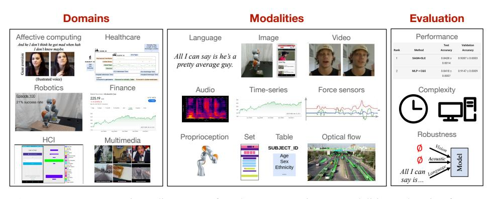
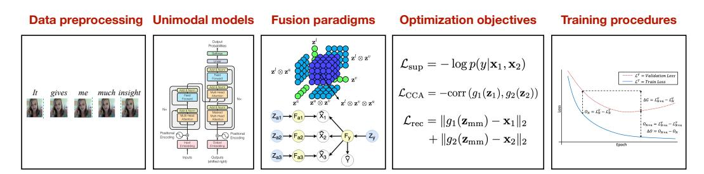
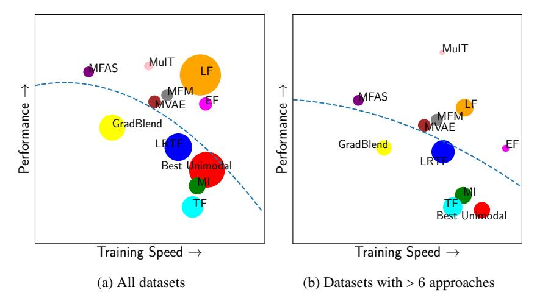
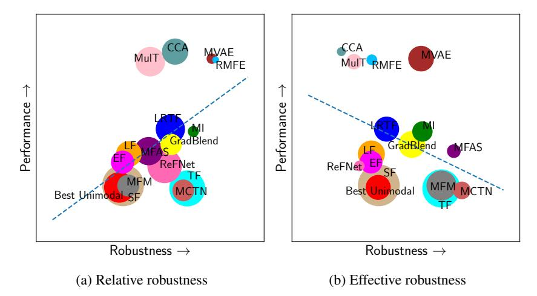

# MULTIBENCH: Multiscale Benchmarks for Multimodal Representation Learning

Paul Pu Liang<sup>1</sup> , Yiwei Lyu<sup>1</sup> , Xiang Fan<sup>1</sup> , Zetian Wu<sup>2</sup> , Yun Cheng<sup>1</sup> , Jason Wu<sup>1</sup> , Leslie Chen<sup>3</sup> , Peter Wu<sup>1</sup> , Michelle A. Lee<sup>4</sup> , Yuke Zhu<sup>5</sup> , Ruslan Salakhutdinov<sup>1</sup> , Louis-Philippe Morency<sup>1</sup> <sup>1</sup>CMU, <sup>2</sup> Johns Hopkins, <sup>3</sup>Northeastern, <sup>4</sup>Stanford, <sup>5</sup>UT Austin <https://cmu-multicomp-lab.github.io/multibench/>

## Abstract

Learning multimodal representations involves integrating information from multiple heterogeneous sources of data. It is a challenging yet crucial area with numerous real-world applications in multimedia, affective computing, robotics, finance, human-computer interaction, and healthcare. Unfortunately, multimodal research has seen limited resources to study (1) generalization across domains and modalities, (2) complexity during training and inference, and (3) robustness to noisy and missing modalities. In order to accelerate progress towards understudied modalities and tasks while ensuring real-world robustness, we release MULTIBENCH, a systematic and unified large-scale benchmark for multimodal learning spanning 15 datasets, 10 modalities, 20 prediction tasks, and 6 research areas. MULTIBENCH provides an automated end-to-end machine learning pipeline that simplifies and standardizes data loading, experimental setup, and model evaluation. To enable holistic evaluation, MULTIBENCH offers a comprehensive methodology to assess (1) generalization, (2) time and space complexity, and (3) modality robustness. MULTIBENCH introduces impactful challenges for future research, including scalability to large-scale multimodal datasets and robustness to realistic imperfections. To accompany this benchmark, we also provide a standardized implementation of 20 core approaches in multimodal learning spanning innovations in fusion paradigms, optimization objectives, and training approaches. Simply applying methods proposed in different research areas can improve the state-of-the-art performance on 9/15 datasets. Therefore, MULTIBENCH presents a milestone in unifying disjoint efforts in multimodal machine learning research and paves the way towards a better understanding of the capabilities and limitations of multimodal models, all the while ensuring ease of use, accessibility, and reproducibility. MULTIBENCH, our standardized implementations, and leaderboards are publicly available, will be regularly updated, and welcomes inputs from the community.

## 1 Introduction

Our perception of the natural world surrounding us involves multiple sensory modalities: we see objects, hear audio signals, feel textures, smell fragrances, and taste flavors. A *modality*refers to a way in which a signal exists or is experienced. Multiple modalities then refer to a combination of multiple signals each expressed in heterogeneous manners [\[10\]](#page-10-0). Many real-world research problems are inherently multimodal: from the early research on audio-visual speech recognition [\[48\]](#page-12-0) to the recent explosion of interest in language, vision, and video understanding [\[48\]](#page-12-0) for applications such as multimedia [\[102,](#page-15-0) [116\]](#page-15-1), affective computing [\[101,](#page-15-2) [127\]](#page-16-0), robotics [\[84,](#page-14-0) [91\]](#page-14-1), finance [\[70\]](#page-13-0), dialogue [\[126\]](#page-16-1), human-computer interaction [\[47,](#page-12-1) [117\]](#page-15-3), and healthcare [\[51,](#page-12-2) [172\]](#page-18-0). The research field of multimodal machine learning (ML) brings unique challenges for both computational and theoretical research given the heterogeneity of various data sources [\[10\]](#page-10-0). At its core lies the learning of*multimodal representations*that capture correspondences between modalities for prediction, and has emerged as a vibrant interdisciplinary field of immense importance and with extraordinary potential.

35th Conference on Neural Information Processing Systems (NeurIPS 2021) Track on Datasets and Benchmarks.

<span id="page-1-0"></span>
<!-- Image Description: This image from an academic paper presents a taxonomy of multimodal learning. It displays examples of data across various domains (affective computing, healthcare, finance, etc.) and modalities (language, image, video, audio, etc.). A table shows performance metrics (test and validation accuracy) for two methods. Finally, icons represent complexity and a diagram illustrates robustness, depicting the model's input from multiple modalities and potential failure points. -->

Figure 1: MULTIBENCH contains a diverse set of 15 datasets spanning 10 modalities and testing for more than 20 prediction tasks across 6 distinct research areas, thereby enabling standardized, reliable, and reproducible large-scale benchmarking of multimodal models. To reflect real-world requirements, MULTIBENCH is designed to holistically evaluate (1) performance across domains and modalities, (2) complexity during training and inference, and (3) robustness to noisy and missing modalities.

Limitations of current multimodal datasets: Current multimodal research has led to impressive advances in benchmarking and modeling for specific domains such as language and vision [\[4,](#page-10-1) [103,](#page-15-4) [105,](#page-15-5) [132\]](#page-16-2). However, other domains, modalities, and tasks are relatively understudied. Many of these tasks are crucial for real-world intelligence such as improving accessibility to technology for diverse populations [\[62\]](#page-13-1), accelerating healthcare diagnosis to aid doctors [\[78\]](#page-13-2), and building reliable robots that can engage in human-AI interactions [\[16,](#page-10-2) [83,](#page-14-2) [137\]](#page-16-3). Furthermore, current benchmarks typically focus on performance without quantifying the potential drawbacks involved with increased time and space complexity [\[148\]](#page-17-0), and the risk of decreased robustness from imperfect modalities [\[101,](#page-15-2) [123\]](#page-16-4). In real-world deployment, a balance between performance, robustness, and complexity is often required.

MULTIBENCH: In order to accelerate research in building general-purpose multimodal models, our main contribution is MULTIBENCH (Figure [1\)](#page-1-0), a systematic and unified large-scale benchmark that brings us closer to the requirements of real-world multimodal applications. MULTIBENCH is designed to comprehensively evaluate 3 main components: generalization across domains and modalities, complexity during training and inference, and robustness to noisy and missing modalities:

1.*Generalization across domains and modalities:*MULTIBENCH contains a diverse set of 15 datasets spanning 10 modalities and testing for 20 prediction tasks across 6 distinct research areas. These research areas include important tasks understudied from a multimodal learning perspective, such as healthcare, finance, and HCI. Building upon extensive data-collection efforts by domain experts, we worked with them to adapt datasets that reflect real-world relevance, present unique challenges to multimodal learning, and enable opportunities in algorithm design and evaluation.

2.*Complexity during training and inference:*MULTIBENCH also quantifies potential drawbacks involving increased time and space complexity of multimodal learning. Together, these metrics summarize the tradeoffs of current models as a step towards efficiency in real-world settings [\[142\]](#page-17-1).

3.*Robustness to noisy and missing modalities:*Different modalities often display different noise topologies, and real-world multimodal signals possibly suffer from missing or noisy data in at least one of the modalities [\[10\]](#page-10-0). MULTIBENCH provides a standardized way to assess the risk of decreased robustness from imperfect modalities through a set of modality-specific and multimodal imperfections that reflect real-world noise, thereby providing a benchmark towards safe and robust deployment.

Together, MULTIBENCH unifies efforts across separate research areas in multimodal learning to enable quick and accurate benchmarking across a wide range of datasets and metrics.

To help the community accurately compare performance and ensure reproducibility, MULTIBENCH includes an end-to-end pipeline including data preprocessing, dataset splits, multimodal algorithms, evaluation metrics, and cross-validation protocols. This includes an implementation of 20 core multimodal approaches spanning innovations in fusion paradigms, optimization objectives, and training approaches in a standard public toolkit called MULTIZOO. We perform a systematic evaluation and show that directly applying these methods can improve the state-of-the-art performance on 9 out of the 15 datasets. Therefore, MULTIBENCH presents a step towards unifying disjoint efforts in multimodal research and paves a way towards a deeper understanding of multimodal models. Most importantly, our public zoo of multimodal benchmarks and models will ensure ease of use, accessibility, and reproducibility. Finally, we outline our plans to ensure the continual availability, maintenance, and expansion of MULTIBENCH, including using it as a theme for future workshops and competitions and to support the multimodal learning courses taught around the world.

<span id="page-2-0"></span>Table 1: MULTIBENCH provides a comprehensive suite of 15 multimodal datasets to benchmark current and proposed approaches in multimodal representation learning. It covers a diverse range of research areas, dataset sizes, input modalities (in the form of `: language, i: image, v: video, a: audio, t: time-series, ta: tabular, f: force sensor, p: proprioception sensor, s: set, o: optical flow), and prediction tasks. We provide a standardized data loader for datasets in MULTIBENCH, along with a set of state-of-the-art multimodal models.

| Research Area       | Size | Dataset            |           | Modalities # Samples | Prediction task         |
|---------------------|------|--------------------|-----------|----------------------|-------------------------|
| Affective Computing | S    | MUSTARD [24]       | {`, v, a} | 690                  | sarcasm                 |
|                     | M    | CMU-MOSI [181]     | {`, v, a} | 2, 199               | sentiment               |
|                     | L    | UR-FUNNY [64]      | {`, v, a} | 16, 514              | humor                   |
|                     | L    | CMU-MOSEI [183]    | {`, v, a} | 22, 777              | sentiment, emotions     |
|                     |      |                    |           |                      |                         |
| Healthcare          | L    | MIMIC [78]         | {t, ta}   | 36, 212              | mortality, ICD-9 codes  |
|                     |      |                    |           |                      |                         |
| Robotics            | M    | MUJOCO PUSH [90]   | {i, f, p} | 37, 990              | object pose             |
|                     | L    | VISION&TOUCH [92]  | {i, f, p} | 147, 000             | contact, robot pose     |
|                     |      |                    |           |                      |                         |
| Finance             | M    | STOCKS-F&B         | {t × 18}  | 5, 218               | stock price, volatility |
|                     | M    | STOCKS-HEALTH      | {t × 63}  | 5, 218               | stock price, volatility |
|                     | M    | STOCKS-TECH        | {t × 100} | 5, 218               | stock price, volatility |
|                     |      |                    |           |                      |                         |
| HCI                 | S    | ENRICO [93]        | {i, s}    | 1, 460               | design interface        |
|                     |      |                    |           |                      |                         |
| Multimedia          | S    | KINETICS400-S [80] | {v, a, o} | 2, 624               | human action            |
|                     | M    | MM-IMDB [8]        | {`, i}    | 25, 959              | movie genre             |
|                     | M    | AV-MNIST [161]     | {i, a}    | 70, 000              | digit                   |
|                     | L    | KINETICS400-L [80] | {v, a, o} | 306, 245             | human action            |

## 2 MULTIBENCH: The MULTISCALE MULTIMODAL BENCHMARK

Background: We define a modality as a single particular mode in which a signal is expressed or experienced. Multiple modalities then refer to a combination of multiple heterogeneous signals [\[10\]](#page-10-0). The first version of MULTIBENCH focuses on benchmarking algorithms for*multimodal fusion*, where the main challenge is to join information from two or more modalities to perform a prediction (e.g., classification, regression). Classic examples for multimodal fusion include audio-visual speech recognition where visual lip motion is fused with speech signals to predict spoken words [\[48\]](#page-12-0). Multimodal fusion can be contrasted with multimodal translation where the goal is to generate a new and different modality [\[162\]](#page-18-2), grounding and question answering where one modality is used to query information in another (e.g., visual question answering [\[4\]](#page-10-1)), and unsupervised or self-supervised multimodal representation learning [\[109,](#page-15-6) [143\]](#page-17-2). We plan future versions of MULTIBENCH to study these important topics in multimodal research in Appendix [I.](#page--1-0)

Each of the following 15 datasets in MULTIBENCH contributes a unique perspective to the various technical challenges in multimodal learning involving learning and aligning complementary information, scalability to a large number of modalities, and robustness to realistic real-world imperfections.

### 1 Datasets

Table [1](#page-2-0) shows an overview of the datasets provided in MULTIBENCH. We provide a brief overview of the modalities and tasks for each of these datasets and refer the reader to Appendix [C](#page--1-1) for details.

Affective computing studies the perception of human affective states (emotions, sentiment, and personalities) from our natural display of multimodal signals spanning language (spoken words), visual (facial expressions, gestures), and acoustic (prosody, speech tone) [\[124\]](#page-16-5). It has broad impacts towards building emotionally intelligent computers, human behavior analysis, and AI-assisted education. MULTIBENCH contains 4 datasets involving fusing *language*, *video*, and *audio*time-series data to predict sentiment (CMU-MOSI [\[181\]](#page-19-0)), emotions (CMU-MOSEI [\[183\]](#page-19-1)), humor (UR-FUNNY [\[64\]](#page-13-3)), and sarcasm (MUSTARD [\[24\]](#page-11-0)). Complementary information may occurs at different moments, requiring models to address the multimodal challenges of grounding and alignment.

Healthcare: Modern medical decision-making often involves integrating complementary information and signals from several sources such as lab tests, imaging reports, and patient-doctor conversations. Multimodal models can help doctors make sense of high-dimensional data and assist them in the diagnosis process [\[5\]](#page-10-4). MULTIBENCH includes the large-scale MIMIC dataset [\[78\]](#page-13-2) which records ICU patient data including*time-series*data measured every hour and other demographic variables (e.g., age, gender, ethnicity in the form of*tabular numerical*data). These are used to predict the

disease ICD-9 code and mortality rate. MIMIC poses unique challenges in integrating time-varying and static modalities, reinforcing the need of aligning multimodal information at correct granularities.

Robotics: Modern robot systems are equipped with multiple sensors to aid in their decision-making. We include the large-scale MUJOCO PUSH [\[90\]](#page-14-3) and VISION&TOUCH [\[92\]](#page-14-4) datasets which record the manipulation of simulated and real robotic arms equipped with*visual*(RGB and depth),*force*, and *proprioception*sensors. In MUJOCO PUSH, the goal is to predict the pose of the object being pushed by the robot end-effector. In VISION&TOUCH, the goal is to predict action-conditional learning objectives that capture forward dynamics of the different modalities (contact prediction and robot end-effector pose). Robustness is important due to the risk of real-world sensor failures [\[89\]](#page-14-7).

Finance: We gathered historical stock data from the internet to create our own dataset for financial time-series prediction across 3 groups of correlated stocks: STOCKS-F&B, STOCKS-HEALTH, and STOCKS-TECH. Within each group, the previous stock prices of a set of stocks are used as multimodal*time-series*inputs to predict the price and volatility of a related stock (e.g., using Apple, Google, and Microsoft data to predict future Microsoft prices). Multimodal stock prediction [\[136\]](#page-16-6) presents scalability issues due to a large number of modalities (18/63/100 vs 2/3 in most datasets), as well as robustness challenges arising from real-world data with an inherently low signal-to-noise ratio.

Human Computer Interaction (HCI) studies the design of computer technology and interactive interfaces between humans and computers [\[43\]](#page-12-3). Many real-world problems involve multimodal inputs such as language, visual, and audio interfaces. We use the ENRICO (Enhanced Rico) dataset [\[40,](#page-11-1) [93\]](#page-14-5) of Android app screens (consisting of an*image*as well as a*set*of apps and their locations) categorized by their design motifs and collected for data-driven design applications such as design search, user interface (UI) layout generation, UI code generation, and user interaction modeling.

Multimedia: A significant body of research in multimodal learning has been fueled by the large availability of multimedia data (language, image, video, and audio) on the internet. MULTIBENCH includes 3 popular large-scale multimedia datasets with varying sizes and levels of difficulty: (1) AV-MNIST [\[161\]](#page-18-1) is assembled from*images*of handwritten digits [\[88\]](#page-14-8) and*audio*samples of spoken digits [\[94\]](#page-14-9), (2) MM-IMDB [\[8\]](#page-10-3) uses movie*titles*, *metadata*, and movie *posters*to perform multi-label classification of movie genres, and (3) KINETICS [\[80\]](#page-14-6) contains*video*, *audio*, and *optical flow*of 306, 245 video clips annotated for 400 human actions. To ease experimentation, we split KINETICS into small and large partitions (see Appendix [C\)](#page--1-1).

#### <span id="page-3-1"></span>2.2 Evaluation Protocol

MULTIBENCH contains evaluation scripts for the following holistic desiderata in multimodal learning: Performance: We standardize evaluation using metrics designed for each dataset, including MSE and MAE for regression to accuracy, micro & macro F1-score, and AUPRC for classification.

Complexity: Modern ML research unfortunately causes significant impacts to energy consumption [\[142\]](#page-17-1), a phenomenon often exacerbated in processing high-dimensional multimodal data. As a step towards quantifying energy complexity and recommending lightweight multimodal models, MULTIBENCH records the amount of information taken in bits (i.e., data size), number of model parameters, as well as time and memory resources required during the entire training process. Realworld models may also need to be small and compact to run on mobile devices [\[131\]](#page-16-7) so we also report inference time and memory on CPU and GPU (see Appendix [D.2\)](#page--1-2).

Robustness: Real-world multimodal data is often imperfect as a result of missing entries, noise corruption, or missing modalities entirely, which calls for robust models that can still make accurate predictions despite only having access to noisy and missing signals [\[101,](#page-15-2) [123\]](#page-16-4). To standardize efforts in evaluating robustness, MULTIBENCH includes the following tests: (1)*Modality-specific imperfections*are independently applied to each modality taking into account its unique noise topologies (i.e., flips and crops of images, natural misspellings in text, abbreviations in spoken audio). (2)*Multimodal imperfections*capture correlations in imperfections across modalities (e.g., missing modalities, or a chunk of time missing in multimodal time-series data). We use both qualitative measures (performance-imperfection curve) and quantitative metrics [\[149\]](#page-17-3) that summarize (1)*relative robustness*measuring accuracy under imperfections and (2)*effective robustness*measuring the*rate* of accuracy drops after equalizing for initial accuracy on clean test data (see Appendix [D.3](#page--1-3) for details).

## <span id="page-3-0"></span>3 MULTIZOO: A Zoo of Multimodal Algorithms

To complement MULTIBENCH, we release a comprehensive toolkit, MULTIZOO, as starter code for multimodal algorithms which implements 20 methods spanning different methodological innova-

<span id="page-4-0"></span>
<!-- Image Description: This image from an academic paper illustrates a multimodal learning system. It shows: 1) data preprocessing (example image sequences); 2) a unimodal model architecture (diagram of a neural network); 3) a fusion paradigm (diagram of a multi-modal fusion model with 3 input modalities); 4) optimization objectives (equations for supervised, CCA, and reconstruction loss); and 5) a training procedure (graph showing training and validation loss curves over epochs with early stopping criteria). The image visually summarizes the entire system's pipeline. -->

Figure 2: MULTIZOO provides a standardized implementation of a suite of multimodal methods in a modular fashion to enable accessibility for new researchers, compositionality of approaches, and reproducibility of results.

tions in (1) data preprocessing, (2) fusion paradigms, (3) optimization objectives, and (4) training procedures (see Figure [2\)](#page-4-0). To introduce these algorithms, we use the simple setting with 2 modalities for notational convenience but refer the reader to Appendix [E](#page--1-4) for detailed descriptions and implementations. We use x1,x<sup>2</sup> for input modalities, z1, z<sup>2</sup> for unimodal representations, zmm for the multimodal representation, and yˆ for the predicted label.

### 1 Data Preprocessing

Temporal alignment [\[26\]](#page-11-2) has been shown to help tackle the multimodal alignment problem for time-series data. This approach assumes a temporal granularity of the modalities (e.g., at the level of words for text) and aligns information from the remaining modalities to the same granularity. We call this approach WORDALIGN [\[26\]](#page-11-2) for temporal data where text is one of the modalities.

#### <span id="page-4-1"></span>3.2 Fusion Paradigms

Early and late fusion: Early fusion performs concatenation of input data before using a model (i.e., zmm = [x1,x2]) while late fusion applies suitable unimodal models to each modality to obtain their feature representations, concatenates these features, and defines a classifier to the label (i.e., zmm = [z1, z2]) [\[10\]](#page-10-0). MULTIZOO includes their implementations denoted as EF and LF respectively. Tensors are specifically designed to tackle the multimodal complementarity challenge by explicitly capturing higher-order interactions across modalities [\[179\]](#page-19-2). Given unimodal representations z1, z2, tensors are defined as zmm = [ z1 1 ] ⊗ [ z2 1 ] where ⊗ denotes an outer product. However, computing tensor products is expensive since their dimension scales exponentially with the number of modalities so several efficient approximations have been proposed [\[71,](#page-13-4) [101,](#page-15-2) [106\]](#page-15-7). MULTIZOO includes Tensor Fusion (TF) [\[179\]](#page-19-2) as well as the approximate Low-rank Tensor Fusion (LRTF) [\[106\]](#page-15-7).

Multiplicative Interactions (MI) generalize tensor products to include learnable parameters that capture multimodal interactions [\[77\]](#page-13-5). In its most general form, MI defines a bilinear product zmm = z1Wz2+z ⊺ <sup>1</sup>U+Vz2+<sup>b</sup> where <sup>W</sup>, <sup>U</sup>, <sup>Z</sup>, and <sup>b</sup> are trainable parameters. By appropriately constraining the rank and structure of these parameters, MI recovers HyperNetworks [\[61\]](#page-13-6) (unconstrained parameters resulting in a matrix output), Feature-wise linear modulation (FiLM) [\[120,](#page-16-8) [188\]](#page-19-3) (diagonal parameters resulting in vector output), and Sigmoid units [\[37\]](#page-11-3) (scalar parameters resulting in scalar output). MULTIZOO includes all 3 as MI-MATRIX, MI-VECTOR, and MI-SCALAR respectively.

Multimodal gated units learn representations that dynamically change for every input [\[25,](#page-11-4) [167,](#page-18-3) [171\]](#page-18-4). Its general form can be written as zmm = z<sup>1</sup> ⊙ h(z2), where h represents a function with sigmoid activation and ⊙ denotes element-wise product. h(z2) is commonly referred to as "attention weights" learned from z<sup>2</sup> to attend on z1. Attention is conceptually similar to MI-VECTOR but recent work has explored more expressive forms of h such as using a Query-Key-Value mechanism [\[167\]](#page-18-3) or fully-connected layers [\[25\]](#page-11-4). We implement the Query-Key-Value mechanism as NL GATE [\[167\]](#page-18-3).

Temporal attention models tackle the challenge of multimodal alignment and complementarity. Transformer models [\[158\]](#page-18-5) are useful for temporal data by automatically aligning and capturing complementary features at different time-steps [\[154,](#page-17-4) [174\]](#page-18-6). We include the Multimodal Transformer (MULT) [\[154\]](#page-17-4) which applied a Crossmodal Transformer block using z<sup>1</sup> to attend to z<sup>2</sup> (and vice-versa) to obtain a multimodal representation zmm = [z1→2, z2→1] = [CM(z1, z2), CM(z2, z1)].

Architecture search: Instead of hand-designing architectures, several approaches define a set of atomic operations (e.g., linear transformation, activation, attention, etc.) and use architecture search to learn the best order of these operations for a given task [\[122,](#page-16-9) [173\]](#page-18-7), which we call MFAS.

<span id="page-5-0"></span>Algorithm 1 PyTorch code integrating MULTIBENCH datasets and MULTIZOO models.

```text
from datasets.get_data import get_dataloader
from unimodals.common_models import ResNet, Transformer
from fusions.common_fusions import MultInteractions
from training_structures.gradient_blend import train, test
# loading Multimodal IMDB dataset
traindata, validdata, testdata = get_dataloader('multimodal_imdb')
out_channels = 3
# defining ResNet and Transformer unimodal encoders
encoders = [ResNet(in_channels=1, out_channels, layers=5),
            Transformer(in_channels=1, out_channels, layers=3)]
# defining a Multiplicative Interactions fusion layer
fusion = MultInteractions([out_channels*8, out_channels*32], out_channels*32, 'matrix')
classifier = MLP(out_channels*32, 100, labels=23)
# training using Gradient Blend algorithm
model = train(encoders, fusion, classifier, traindata, validdata,
        epochs=100, optimtype=torch.optim.SGD, lr=0.01, weight_decay=0.0001)
# testing
performance, complexity, robustness = test(model, testdata)
```text

## 3 Optimization Objectives

In addition to the standard supervised losses (e.g., cross entropy for classification, MSE/MAE for regression), several proposed methods have proposed new objective functions based on:

Prediction-level alignment objectives tackle the challenge of alignment by capturing a representations where semantically similar concepts from different modalities are close together [\[9,](#page-10-5) [33,](#page-11-5) [91,](#page-14-1) [151\]](#page-17-5). Alignment objectives have been applied at both prediction and feature levels. In the former, we implement Canonical Correlation Analysis (CCA) [\[7,](#page-10-6) [145,](#page-17-6) [166\]](#page-18-8), which maximizes correlation by adding a loss term LCCA = −corr (g1(z1), g2(z2)) where g1, g<sup>2</sup> are auxiliary classifiers mapping each unimodal representation to the label.

Feature-level alignment: In the latter, contrastive learning has emerged as a popular approach to bring similar concepts close in feature space and different concepts far away [\[33,](#page-11-5) [91,](#page-14-1) [151\]](#page-17-5). We include REFNET [\[135\]](#page-16-10) which uses a self-supervised contrastive loss between unimodal representations z1, z<sup>2</sup> and the multimodal representation zmm, i.e., Lcontrast = 1 − cos(zmm, g1(z1)) + 1 − cos(zmm, g2(z2)) where g1, g<sup>2</sup> is a layer mapping each modality's representation into the joint multimodal space.

Reconstruction objectives based on generative-discriminative models (e.g., VAEs) aim to reconstruct the input (or some part of the input) [\[91,](#page-14-1) [155\]](#page-17-7). These have been shown to better preserve task-relevant information learned in the representation, especially in settings with sparse supervised signals such as robotics [\[91\]](#page-14-1) and long videos [\[155\]](#page-17-7). We include the Multimodal Factorized Model (MFM) [\[155\]](#page-17-7) that learns a representation zmm that can reconstruct input data x1,x<sup>2</sup> while also predicting the label, i.e., adding an objective Lrec = ∥g1(zmm) − x1∥<sup>2</sup> + ∥g2(zmm) − x2∥<sup>2</sup> where g1, g<sup>2</sup> are auxiliary decoders mapping zmm to each raw input modality. MFM can be paired with any multimodal model from section [3.2](#page-4-1) (e.g., learning zmm via tensors and adding a term to reconstruct input data).

Improving robustness: These approaches modify the objective function to account for robustness to noisy [\[101\]](#page-15-2) or missing [\[89,](#page-14-7) [111,](#page-15-8) [123\]](#page-16-4) modalities. MULTIZOO includes MCTN [\[123\]](#page-16-4) which uses cycle-consistent translation to predict the noisy/missing modality from present ones (i.e., a path x<sup>1</sup> → zmm → xˆ<sup>2</sup> → zmm → xˆ1, with additional reconstruction losses Lrec = ∥x<sup>1</sup> − xˆ1∥<sup>2</sup> + ∥x<sup>2</sup> − xˆ2∥<sup>2</sup> ). While MCTN is trained with multimodal data, it only takes in one modality x<sup>1</sup> at test-time which makes it robust to the remaining modalities.

### 4 Training Procedures

Improving generalization: Recent work has found that directly training a multimodal model is sub-optimal since different modalities overfit and generalize at different rates. MULTIZOO includes Gradient Blending (GRADBLEND), that computes generalization statistics for each modality to determine their weights during fusion [\[167\]](#page-18-3), and Regularization by Maximizing Functional Entropies (RMFE), which uses functional entropy to balance the contribution of each modality to the result [\[53\]](#page-12-4).

#### 5 Putting Everything Together

In Algorithm [1,](#page-5-0) we show a sample code snippet in Python that loads a dataset from MULTIBENCH (section [C.2\)](#page--1-5), defines the unimodal and multimodal architectures, optimization objective, and training procedures (section [3\)](#page-3-0), before running the evaluation protocol (section [2.2\)](#page-3-1). Our MULTIZOO toolkit is easy to use and trains entire multimodal models in less than 10 lines of code. By standardizing the implementation of each module and disentangling the individual effects of models, optimizations, and training, MULTIZOO ensures both accessibility and reproducibility of its algorithms.

<span id="page-6-0"></span>Table 2: Standardizing methods and datasets enables quick application of methods from different research areas which achieves stronger performance on 9/15 datasets in MULTIBENCH, especially in healthcare, HCI, robotics, and finance. *In-domain*refers to the best performance across methods previously proposed on that dataset and*out-domain*shows best performance across remaining methods. ↑ indicates metrics where higher is better (Acc, AUPRC), ↓ indicates lower is better (MSE).

| Dataset     |            |            |            | MUSTARD ↑ CMU-MOSI ↑ UR-FUNNY ↑ CMU-MOSEI ↑ | MIMIC ↑    |
|-------------|------------|------------|------------|---------------------------------------------|------------|
| Unimodal    | 68.6 ± 0.4 | 74.2 ± 0.5 | 58.3 ± 0.2 | 78.8 ± 1.5                                  | 76.7 ± 0.3 |
| In-domain   | 66.3 ± 0.3 | 83.0 ± 0.1 | 62.9 ± 0.2 | 82.1 ± 0.5                                  | 77.9 ± 0.3 |
| Out-domain  | 71.8 ± 0.3 | 75.5 ± 0.5 | 66.7 ± 0.3 | 78.1 ± 0.3                                  | 78.2 ± 0.2 |
| Improvement | 4.7%       | -          | 6.0%       | -                                           | 0.4%       |

| Dataset     | MUJOCO PUSH ↓ | V&T EE ↓      |                             | STOCKS-F&B ↓ STOCKS-HEALTH ↓ STOCKS-TECH ↓ |               |
|-------------|---------------|---------------|-----------------------------|--------------------------------------------|---------------|
| Unimodal    | 0.334 ± 0.034 | 0.202 ± 0.022 | 1.856 ± 0.093               | 0.541 ± 0.010                              | 0.125 ± 0.004 |
| In-domain   | 0.290 ± 0.018 | 0.258 ± 0.011 | 1.856 ± 0.093               | 0.541 ± 0.010                              | 0.125 ± 0.004 |
| Out-domain  | 0.402 ± 0.026 |               | 0.185 ± 0.011 1.820 ± 0.138 | 0.526 ± 0.017                              | 0.120 ± 0.008 |
| Improvement | -             | 8.4%          | 1.9%                        | 2.8%                                       | 4.0%          |

| Dataset     |            |            |            | ENRICO ↑ MM-IMDB ↑ AV-MNIST ↑ KINETICS-S ↑ KINETICS-L ↑ |      |
|-------------|------------|------------|------------|---------------------------------------------------------|------|
| Unimodal    | 47.0 ± 1.6 | 45.6 ± 4.5 | 65.1 ± 0.2 | 56.5                                                    | 72.6 |
| In-domain   | 47.0 ± 1.6 | 49.8 ± 1.7 | 72.8 ± 0.2 | 56.1                                                    | 74.7 |
| Out-domain  | 51.0 ± 1.4 | 50.2 ± 0.9 | 72.3 ± 0.2 | 23.7                                                    | 71.7 |
| Improvement | 8.5%       | 0.8%       | -          | -                                                       | -    |

## 4 Experiments and Discussion

Setup: Using MULTIBENCH, we load each of the datasets and test the multimodal approaches in MULTIZOO. We only vary the contributed method of interest and keep all other possibly confounding factors constant (i.e., using the exact same training loop when testing a new multimodal fusion paradigm), a practice unfortunately not consistent in previous work. Our code is available at <https://github.com/pliang279/MultiBench>. Please refer to Appendix [G](#page--1-6) for experimental details. MULTIBENCH allows for careful analysis of multimodal models and we summarize the main take-away messages below (see Appendix [H](#page--1-7) for full results and analysis).

Benefits of standardization: From Table [2,](#page-6-0) simply applying methods proposed*outside*of the same research area can improve the state-of-the-art performance on 9 of the 15 MULTIBENCH datasets, especially for relatively understudied domains and modalities (i.e., healthcare, finance, HCI).

Generalization across domains and modalities: MULTIBENCH offers an opportunity to analyze algorithmic developments across a large suite of modalities, domains, and tasks. We summarize the following observations regarding performance across datasets and tasks (see details in Appendix [H.7\)](#page--1-8):

1. Many multimodal methods show their strongest performance on in-domain datasets and do not generalize across domains and modalities. For example, MFAS [\[122\]](#page-16-9) works well on domains it was designed for (AV-MNIST and MM-IMDB in multimedia) but does not generalize to other domains such as healthcare (MIMIC). Similarly, MULT [\[154\]](#page-17-4) performs extremely well on the affect recognition datasets it was designed for but struggles on other multimodal time-series data in the finance and robotics domains. Finally, GRADBLEND [\[167\]](#page-18-3), an approach specifically designed to improve generalization in multimodal learning and tested on video and audio datasets (e.g., Kinetics), does not perform well on other datasets. In general, we observe high variance in the performance of multimodal methods across datasets in MULTIBENCH. Therefore, there still does not exist a one-size-fits-all model, especially for understudied modalities and tasks.

2. There are methods that are surprisingly generalizable across datasets. These are typically general modality-agnostic methods such as LF. While simple, it is a strong method that balances simplicity, performance, and low complexity. However, it does not achieve the best performance on any dataset.

3. Several methods such as MFAS and CCA are designed for only 2 modalities (usually image and text), and TF and MI do not scale efficiently beyond 2/3 modalities. We encourage the community to generalize these approaches across datasets and modalities on MULTIBENCH.

Tradeoffs between modalities: How far can we go with unimodal methods? Surprisingly far! From Table [2,](#page-6-0) we observe that decent performance can be obtained with the best performing modality. Further improvement via multimodal models may come at the expense of around 2−3× the parameters.

<span id="page-7-0"></span>
<!-- Image Description: The image presents two scatter plots comparing the performance and training speed of different machine learning approaches (MFAS, MulT, LF, etc.). Each point represents an approach, with size possibly indicating dataset size or another metric. (a) shows all datasets, while (b) focuses on datasets with more than six approaches. A dashed curve suggests a trade-off: faster training generally correlates with slightly lower performance. The plots help analyze the efficiency and effectiveness of different methods. -->

Figure 3: Tradeoff between performance and complexity. Size of circles shows variance in performance across (a) all datasets and (b) datasets on which we tested > 6 approaches. We plot a dotted blue line of best quadratic fit to show the Pareto frontier. These strong tradeoffs should encourage future work in lightweight multimodal models that generalize across datasets, as well as in adapting several possibly well-performing methods (such as MFAS or MULT) to new datasets and domains.

Tradeoffs between performance and complexity: In Figure [3\(](#page-7-0)a), we summarize the performance of all methods in terms of performance and complexity. We find a strong tradeoff between these two desiderata: simple fusion techniques (e.g., LF) are actually appealing choices which score high on both metrics, especially when compared to complex (but slightly better performing) methods such as architecture search (MFAS) or Multimodal Transformers (MULT). While LF is the easiest to adapt to new datasets and domains, we encountered difficulties in adapting several possibly well-performing methods (such as MFAS or MULT) to new datasets and domains. Therefore, while their average performance is only slightly better than LF on all datasets (see Figure [3\(](#page-7-0)a)), they perform much better on well-studied datasets (see Figure [3\(](#page-7-0)b)). We hope that the release of MULTIBENCH will greatly accelerate research in adapting complex methods on new datasets (see full results in Appendix [H.8\)](#page--1-9).

Tradeoffs between performance and robustness: In Figure [4,](#page-8-0) we plot a similar tradeoff plot between accuracy and (relative & effective) robustness. As a reminder, relative robustness directly measures accuracy under imperfections while effective robustness measures the rate at which accuracy drops after equalizing for initial accuracy on clean test data (see Appendix [D.3](#page--1-3) for details). We observe a positive correlation between performance and relative robustness (see Figure [4\(](#page-8-0)a)), implying that models starting off with higher accuracy tend to stay above other models on the performanceimperfection curve. However, we observe a negative best fit between performance and effective robustness (see Figure [4\(](#page-8-0)b)) because several well-performing methods such as MULT, CCA, and MVAE tend to*drop off faster*after equalizing for initial accuracy on clean test data. Furthermore, very few models currently achieve both positive relative and effective robustness, which is a crucial area for future multimodal research (see full results in Appendix [H.9\)](#page--1-10).

## 5 Related Work

We review related work on standardizing datasets and methods in multimodal learning.

Comparisons with related benchmarks: To the best of our knowledge, MULTIBENCH is the first multimodal benchmark with such a large number of datasets, modalities, and tasks. Most previous multimodal benchmarks have focused on a single research area such as within affective computing [\[56\]](#page-12-5), human multimodal language [\[177\]](#page-19-4), language and vision-based question answering [\[50,](#page-12-6) [138\]](#page-16-11), text classification with external multimodal information [\[60\]](#page-13-7), and multimodal learning for education [\[65\]](#page-13-8). MULTIBENCH is specifically designed to go beyond the commonly studied language, vision, and audio modalities to encourage the research community to explore relatively understudied modalities (e.g., tabular data, time-series, sensors, graph and set data) and build general multimodal methods that can handle a diverse set of modalities.

Our work is also inspired by recent progress in better evaluation benchmarks for a suite of important tasks in ML such as language representation learning [\[163,](#page-18-9) [164\]](#page-18-10), long-range sequence modeling [\[150\]](#page-17-8), multilingual representation learning [\[72\]](#page-13-9), graph representation learning [\[74\]](#page-13-10), and robustness to distribution shift [\[85\]](#page-14-10). These well-crafted benchmarks have accelerated progress in new algorithms, evaluation, and analysis in their respective research areas.

<span id="page-8-0"></span>
<!-- Image Description: The image displays two scatter plots comparing the performance and robustness of different multimodal fusion methods (e.g., CCA, MVAE, MulT). Plot (a) shows "relative robustness," while plot (b) shows "effective robustness." Each colored circle represents a method, its size correlating with performance, and its position reflecting its robustness. A dashed line indicates a trade-off between performance and robustness. The plots visually compare the methods' performance and robustness characteristics. -->

Figure 4: Tradeoff between performance and robustness. Size of circles shows variance in robustness across datasets. We show the line of best linear fit in dotted blue. While better performing methods show better*relative*robustness (a), some suffer in*effective*robustness since performance*drops off faster*(b). Few models currently achieve both relative and effective robustness, which suggests directions for future research.

Standardizing multimodal learning: There have also been several attempts to build a single model that works well on a suite of multimodal tasks [\[95,](#page-14-11) [109,](#page-15-6) [143\]](#page-17-2). However, these are limited to the language and vision space, and multimodal training is highly tailored for text and images. Transformer architectures have emerged as a popular choice due to their suitability for both language and image data [\[27,](#page-11-6) [73\]](#page-13-11) and a recent public toolkit was released for incorporating multimodal data on top of text-based Transformers for prediction tasks [\[60\]](#page-13-7). By going beyond Transformers and text data, MULTIBENCH opens the door to important research questions involving a much more diverse set of modalities and tasks while holistically evaluating performance, complexity, and robustness.

Analysis of multimodal representations: Recent work has begun to carefully analyze and challenge long-standing assumptions in multimodal learning. They have shown that certain models do not actually learn cross-modal interactions but rather rely on ensembles of unimodal statistics [\[68\]](#page-13-12) and that certain datasets and models are biased to the most dominant modality [\[22,](#page-11-7) [59\]](#page-12-7), sometimes ignoring others completely [\[3\]](#page-10-7). These observations are currently only conducted on specific datasets and models without testing their generalization to others, a shortcoming we hope to solve using MULTIBENCH which enables scalable analysis over modalities, tasks, and models.

# 6 Conclusion

Limitations: While MULTIBENCH can help to accelerate research in multimodal ML, we are aware of the following possible limitations (see detailed future directions in Appendix [I\)](#page--1-0):

1.*Tradeoffs between generality and specificity:*While it is desirable to build models that work across modalities and tasks, there is undoubtedly merit in building modality and task-specific models that can often utilize domain knowledge to improve performance and interpretability (e.g., see neurosymbolic VQA [\[159\]](#page-18-11), or syntax models for the language modality [\[31\]](#page-11-8)). MULTIBENCH is not at odds with research in this direction: in fact, by easing access to data, models, and evaluation, we hope that MULTIBENCH will challenge researchers to design interpretable models leveraging domain knowledge for many multimodal tasks. It remains an open question to define "interpretability" for other modalities beyond image and text, a question we hope MULTIBENCH will drive research in.

2.*Scale of datasets, models, and metrics:*We plan for MULTIBENCH to be a continuously-growing community effort with regular maintenance and expansion. While MULTIBENCH currently does not include several important research areas outside of multimodal fusion (e.g., question answering [\[4,](#page-10-1) [63\]](#page-13-13), retrieval [\[187\]](#page-19-5), grounding [\[32\]](#page-11-9), and reinforcement learning [\[110\]](#page-15-9)), and is also limited by the models and metrics it supports, we outline our plan to expand in these directions in Appendix [I.](#page--1-0)

Projected expansions of MULTIBENCH: In this subsection, we describe concrete ongoing and future work towards expanding MULTIBENCH (see details in Appendix [I\)](#page--1-0).

1.*Other multimodal research problems:*We are genuinely committed to building a community around these resources and continue improving it over time. While we chose to focus on multimodal fusion by design for this first version to have a more coherent way to standardize and evaluate methods across datasets, we acknowledge the breadth of multimodal learning and are looking forward to expanding it in other directions in collaboration with domain experts. We have already included 2 datasets in captioning (and more generally for non-language outputs, retrieval): (1) Yummly-28K of paired videos and text descriptions of food recipes [\[114\]](#page-15-10), and (2) Clotho dataset for audio-captioning [\[45\]](#page-12-8) as well as a language-guided RL environment Read to Fight Monsters (RTFM) [\[188\]](#page-19-3) and are also working towards more datasets in QA, retrieval, and multimodal RL.

To help in scalable expansion, we plan for an open call to the community for suggestions and feedback about domains, datasets, and metrics. As a step in this direction, we have concrete plans to use MULTIBENCH as a theme for future workshops and competitions (building on top of the multimodal workshops we have been organizing at [NAACL 2021,](http://multicomp.cs.cmu.edu/naacl2021multimodalworkshop) [ACL 2020,](http://multicomp.cs.cmu.edu/acl2020multimodalworkshop) and [ACL 2019,](http://multicomp.cs.cmu.edu/acl2018multimodalchallenge) and in multimodal learning courses (starting with the [course taught annually at CMU\)](https://cmu-multicomp-lab.github.io/mmml-course/fall2020). Since MULTIBENCH is public and will be regularly maintained, the existing benchmark, code, evaluation, and experimental protocols can greatly accelerate any dataset and modeling innovations added in the future. In our public GitHub, we have included a section on contributing through task proposals or additions of datasets and algorithms. The authors will regularly monitor new proposals through this channel.

2.*New evaluation metrics:*We also plan to include evaluation for distribution shift, uncertainty estimation, tests for fairness and social biases, as well as labels/metrics for interpretable multimodal learning. In the latter, we plan to include the EMAP score [\[68\]](#page-13-12) as an interpretability metric assessing whether cross-modal interactions improve performance.

3.*Multimodal transfer learning and co-learning:*Can training data in one dataset help learning on other datasets? MULTIBENCH enables easy experimentation of such research questions: our initial experiments on transfer learning found that pre-training on larger datasets in the same domain can improve performance on smaller datasets when fine-tuned on a smaller dataset: performance on the smaller CMU-MOSI dataset improved from 75.2 to 75.8 using the same late fusion model with transfer learning from the larger UR-FUNNY and CMU-MOSEI datasets. Furthermore, recent work has shown that multimodal training can help improve unimodal performance as well [\[140,](#page-17-9) [170,](#page-18-12) [180\]](#page-19-6). While previous experiments were on a small scale and limited to a single domain, we plan to expand significantly on this phenomenon (multimodal co-learning) in future versions of MULTIBENCH.

4.*Multitask learning across modalities:*Multitask learning across multimodal tasks with a shared set of input modalities is a promising direction that can enable statistical strength sharing across datasets and efficiency in training a single model. Using MULTIBENCH, we also ran an extra experiment on multi-dataset multitask learning. We used the 4 datasets in the affective computing domain and trained a single model across all 4 of them with adjustable input embedding layers if the input features were different and separate classification heads for each dataset's task. We found promising initial results with performance on the largest CMU-MOSEI dataset improving from 79.2 to 80.9 for a late fusion model and from 82.1 to 82.9 using a multimodal transformer model, although performance on the smaller CMU-MOSI dataset decreased from 75.2 to 70.8. We believe that these potential future studies in co-learning, transfer learning, and multi-task learning are strengths of MULTIBENCH since it shows the potential of interesting experiments and usage.

In conclusion, we present MULTIBENCH, a large-scale benchmark unifying previously disjoint efforts in multimodal research with a focus on ease of use, accessibility, and reproducibility, thereby paving the way towards a deeper understanding of multimodal models. Through its unprecedented range of research areas, datasets, modalities, tasks, and evaluation metrics, MULTIBENCH highlights several future directions in building more generalizable, lightweight, and robust multimodal models.

# Acknowledgements

This material is based upon work partially supported by the National Science Foundation (Awards #1722822 and #1750439), National Institutes of Health (Awards #R01MH125740, #R01MH096951, #U01MH116925, and #U01MH116923), BMW of North America, and SquirrelAI. PPL is supported by a Facebook PhD Fellowship and a Center for Machine Learning and Health Fellowship. RS is supported in part by NSF IIS1763562 and ONR Grant N000141812861. Any opinions, findings, conclusions, or recommendations expressed in this material are those of the author(s) and do not necessarily reflect the views of the National Science Foundation, National Institutes of Health, Facebook, CMLH, Office of Naval Research, BMW of North America, and SquirrelAI, and no official endorsement should be inferred. We are extremely grateful to Amir Zadeh, Chaitanya Ahuja, Volkan Cirik, Murtaza Dalal, Benjamin Eysenbach, Tiffany Min, and Devendra Chaplot for helpful discussions and feedback, as well as Ziyin Liu and Chengfeng Mao for providing tips on working with financial time-series data. Finally, we would also like to acknowledge NVIDIA's GPU support.

## References

- [1] Free spoken digit dataset (fsdd). [https://github.com/Jakobovski/](https://github.com/Jakobovski/free-spoken-digit-dataset) [free-spoken-digit-dataset](https://github.com/Jakobovski/free-spoken-digit-dataset). Accessed: 2021-04-30.
- [2] Uncertainty toolbox. [https://github.com/uncertainty-toolbox/](https://github.com/uncertainty-toolbox/uncertainty-toolbox) [uncertainty-toolbox](https://github.com/uncertainty-toolbox/uncertainty-toolbox), 2021.
- <span id="page-10-7"></span>[3] Aishwarya Agrawal, Dhruv Batra, and Devi Parikh. Analyzing the behavior of visual question answering models. In*Proceedings of the 2016 Conference on Empirical Methods in Natural Language Processing*, pages 1955–1960, Austin, Texas, November 2016. Association for Computational Linguistics.
- <span id="page-10-1"></span>[4] Aishwarya Agrawal, Jiasen Lu, Stanislaw Antol, Margaret Mitchell, C. Lawrence Zitnick, Devi Parikh, and Dhruv Batra. VQA: Visual question answering. *International Journal of Computer Vision*, 2017.
- <span id="page-10-4"></span>[5] Paras Malik Amisha, Monika Pathania, and Vyas Kumar Rathaur. Overview of artificial intelligence in medicine. *Journal of family medicine and primary care*, 8(7):2328, 2019.
- [6] Jeffrey S Anastasi and Matthew G Rhodes. An own-age bias in face recognition for children and older adults. *Psychonomic bulletin & review*, 12(6):1043–1047, 2005.
- <span id="page-10-6"></span>[7] Galen Andrew, Raman Arora, Jeff Bilmes, and Karen Livescu. Deep canonical correlation analysis. In *International conference on machine learning*, pages 1247–1255. PMLR, 2013.
- <span id="page-10-3"></span>[8] John Arevalo, Thamar Solorio, Manuel Montes-y Gómez, and Fabio A González. Gated multimodal units for information fusion. In *5th International conference on learning representations 2017 workshop*, 2017.
- <span id="page-10-5"></span>[9] Philip Bachman, R Devon Hjelm, and William Buchwalter. Learning representations by maximizing mutual information across views. In *Advances in Neural Information Processing Systems*, pages 15535– 15545, 2019.
- <span id="page-10-0"></span>[10] Tadas Baltrušaitis, Chaitanya Ahuja, and Louis-Philippe Morency. Multimodal machine learning: A survey and taxonomy. *IEEE transactions on pattern analysis and machine intelligence*, 41(2):423–443, 2018.
- [11] Tadas Baltrušaitis, Peter Robinson, and Louis-Philippe Morency. Openface: an open source facial behavior analysis toolkit. In *2016 IEEE Winter Conference on Applications of Computer Vision (WACV)*, pages 1–10. IEEE, 2016.
- [12] David Bamman, A. Seza Dogruöz, Jacob Eisenstein, Dirk Hovy, David Jurgens, Brendan O'Connor, ˘ Alice Oh, Oren Tsur, and Svitlana Volkova. Proceedings of the first workshop on NLP and computational social science. 2016.
- [13] Solon Barocas and Andrew D Selbst. Big data's disparate impact. *Calif. L. Rev.*, 104:671, 2016.
- [14] Maria Bauzá, Ferran Alet, Yen-Chen Lin, Tomás Lozano-Pérez, Leslie Pack Kaelbling, Phillip Isola, and Alberto Rodriguez. Omnipush: accurate, diverse, real-world dataset of pushing dynamics with rgb-d video. In *IROS*, 2019.
- [15] Yonatan Belinkov and Yonatan Bisk. Synthetic and natural noise both break neural machine translation. In *International Conference on Learning Representations*, 2018.
- <span id="page-10-2"></span>[16] Tony Belpaeme, James Kennedy, Aditi Ramachandran, Brian Scassellati, and Fumihide Tanaka. Social robots for education: A review. *Science robotics*, 3(21), 2018.
- [17] Randolph Blake, Kenith V Sobel, and Thomas W James. Neural synergy between kinetic vision and touch. *Psychological science*, pages 397–402, 2004.
- [18] Tolga Bolukbasi, Kai-Wei Chang, James Y Zou, Venkatesh Saligrama, and Adam T Kalai. Man is to computer programmer as woman is to homemaker? Debiasing word embeddings. In *NIPS*, 2016.
- [19] Ajay Kumar Boyat and Brijendra Kumar Joshi. A review paper: Noise models in digital image processing, 2015.
- [20] Katherine E Brown, Farzana Ahamed Bhuiyan, and Douglas A Talbert. Uncertainty quantification in multimodal ensembles of deep learners. In *The Thirty-Third International Flairs Conference*, 2020.
- [21] Carlos Busso, Murtaza Bulut, Chi-Chun Lee, Abe Kazemzadeh, Emily Mower, Samuel Kim, Jeannette N Chang, Sungbok Lee, and Shrikanth S Narayanan. Iemocap: Interactive emotional dyadic motion capture database. *Language resources and evaluation*, 42(4):335, 2008.

- <span id="page-11-7"></span>[22] Remi Cadene, Corentin Dancette, Matthieu Cord, Devi Parikh, et al. Rubi: Reducing unimodal biases for visual question answering. *Advances in Neural Information Processing Systems*, 32:841–852, 2019.
- [23] Aylin Caliskan, Joanna J Bryson, and Arvind Narayanan. Semantics derived automatically from language corpora contain human-like biases. *Science*, 2017.
- <span id="page-11-0"></span>[24] Santiago Castro, Devamanyu Hazarika, Verónica Pérez-Rosas, Roger Zimmermann, Rada Mihalcea, and Soujanya Poria. Towards multimodal sarcasm detection (an \_obviously\_ perfect paper). In *Proceedings of the 57th Annual Meeting of the Association for Computational Linguistics*, pages 4619–4629, 2019.
- <span id="page-11-4"></span>[25] Devendra Singh Chaplot, Kanthashree Mysore Sathyendra, Rama Kumar Pasumarthi, Dheeraj Rajagopal, and Ruslan Salakhutdinov. Gated-attention architectures for task-oriented language grounding. *arXiv preprint arXiv:1706.07230*, 2017.
- <span id="page-11-2"></span>[26] Minghai Chen, Sen Wang, Paul Pu Liang, Tadas Baltrušaitis, Amir Zadeh, and Louis-Philippe Morency. Multimodal sentiment analysis with word-level fusion and reinforcement learning. In *Proceedings of the 19th ACM International Conference on Multimodal Interaction*, pages 163–171, 2017.
- <span id="page-11-6"></span>[27] Yen-Chun Chen, Linjie Li, Licheng Yu, Ahmed El Kholy, Faisal Ahmed, Zhe Gan, Yu Cheng, and Jingjing Liu. Uniter: Universal image-text representation learning. In *European Conference on Computer Vision*, pages 104–120. Springer, 2020.
- [28] Donald G Childers and CK Lee. Vocal quality factors: Analysis, synthesis, and perception. *the Journal of the Acoustical Society of America*, 90(5):2394–2410, 1991.
- [29] Junyoung Chung, Caglar Gulcehre, KyungHyun Cho, and Yoshua Bengio. Empirical evaluation of gated recurrent neural networks on sequence modeling. *arXiv preprint arXiv:1412.3555*, 2014.
- [30] Youngseog Chung, Willie Neiswanger, Ian Char, and Jeff Schneider. Beyond pinball loss: Quantile methods for calibrated uncertainty quantification. *arXiv preprint arXiv:2011.09588*, 2020.
- <span id="page-11-8"></span>[31] Volkan Cirik, Taylor Berg-Kirkpatrick, and Louis-Philippe Morency. Using syntax to ground referring expressions in natural images. In *Proceedings of the AAAI Conference on Artificial Intelligence*, volume 32, 2018.
- <span id="page-11-9"></span>[32] Volkan Cirik, Louis-Philippe Morency, and Taylor Berg-Kirkpatrick. Visual referring expression recognition: What do systems actually learn? In *Proceedings of the 2018 Conference of the North American Chapter of the Association for Computational Linguistics: Human Language Technologies, Volume 2 (Short Papers)*, New Orleans, Louisiana, June 2018. Association for Computational Linguistics.
- <span id="page-11-5"></span>[33] Wanyun Cui, Guangyu Zheng, and Wei Wang. Unsupervised natural language inference via decoupled multimodal contrastive learning, 2020.
- [34] Robert Dale. Law and word order: Nlp in legal tech. *Natural Language Engineering*, 25(1):211–217, 2019.
- [35] Fida Kamal Dankar and Khaled El Emam. Practicing differential privacy in health care: A review. *Trans. Data Priv.*, 6(1):35–67, 2013.
- [36] Abhishek Das, Samyak Datta, Georgia Gkioxari, Stefan Lee, Devi Parikh, and Dhruv Batra. Embodied question answering. In *Proceedings of the IEEE Conference on Computer Vision and Pattern Recognition*, pages 1–10, 2018.
- <span id="page-11-3"></span>[37] Yann N Dauphin, Angela Fan, Michael Auli, and David Grangier. Language modeling with gated convolutional networks. In *International conference on machine learning*, pages 933–941. PMLR, 2017.
- [38] Victoria Dean, Shubham Tulsiani, and Abhinav Gupta. See, hear, explore: Curiosity via audio-visual association. *NeurIPS*, 2020.
- [39] Gilles Degottex, John Kane, Thomas Drugman, Tuomo Raitio, and Stefan Scherer. Covarep—a collaborative voice analysis repository for speech technologies. In *Acoustics, Speech and Signal Processing (ICASSP), 2014 IEEE International Conference on*, pages 960–964. IEEE, 2014.
- <span id="page-11-1"></span>[40] Biplab Deka, Zifeng Huang, Chad Franzen, Joshua Hibschman, Daniel Afergan, Yang Li, Jeffrey Nichols, and Ranjitha Kumar. Rico: A mobile app dataset for building data-driven design applications. In *Proceedings of the 30th Annual ACM Symposium on User Interface Software and Technology*, pages 845–854, 2017.

- [41] Jia Deng, Wei Dong, Richard Socher, Li-Jia Li, Kai Li, and Li Fei-Fei. Imagenet: A large-scale hierarchical image database. In *2009 IEEE conference on computer vision and pattern recognition*, pages 248–255. Ieee, 2009.
- [42] Jacob Devlin, Ming-Wei Chang, Kenton Lee, and Kristina Toutanova. Bert: Pre-training of deep bidirectional transformers for language understanding. In *NAACL-HLT (1)*, 2019.
- <span id="page-12-3"></span>[43] Alan Dix, Janet Finlay, Gregory D Abowd, and Russell Beale. Human-computer interaction. *Harlow ua*, 2000.
- [44] Alexey Dosovitskiy, Lucas Beyer, Alexander Kolesnikov, Dirk Weissenborn, Xiaohua Zhai, Thomas Unterthiner, Mostafa Dehghani, Matthias Minderer, Georg Heigold, Sylvain Gelly, et al. An image is worth 16x16 words: Transformers for image recognition at scale. *ICLR*, 2021.
- <span id="page-12-8"></span>[45] Konstantinos Drossos, Samuel Lipping, and Tuomas Virtanen. Clotho: An audio captioning dataset. In *ICASSP 2020-2020 IEEE International Conference on Acoustics, Speech and Signal Processing (ICASSP)*, pages 736–740. IEEE, 2020.
- [46] Thomas Drugman and Abeer Alwan. Joint robust voicing detection and pitch estimation based on residual harmonics. In *Interspeech*, pages 1973–1976, 2011.
- <span id="page-12-1"></span>[47] Bruno Dumas, Denis Lalanne, and Sharon Oviatt. Multimodal interfaces: A survey of principles, models and frameworks. In *Human machine interaction*, pages 3–26. Springer, 2009.
- <span id="page-12-0"></span>[48] Stéphane Dupont and Juergen Luettin. Audio-visual speech modeling for continuous speech recognition. *IEEE transactions on multimedia*, 2(3):141–151, 2000.
- [49] Paul Ekman. Universal facial expressions of emotion.
- <span id="page-12-6"></span>[50] Francis Ferraro, Nasrin Mostafazadeh, Ting-Hao Huang, Lucy Vanderwende, Jacob Devlin, Michel Galley, and Margaret Mitchell. A survey of current datasets for vision and language research. In *Proceedings of the 2015 Conference on Empirical Methods in Natural Language Processing*, pages 207–213, Lisbon, Portugal, September 2015. Association for Computational Linguistics.
- <span id="page-12-2"></span>[51] Christos A Frantzidis, Charalampos Bratsas, Manousos A Klados, Evdokimos Konstantinidis, Chrysa D Lithari, Ana B Vivas, Christos L Papadelis, Eleni Kaldoudi, Costas Pappas, and Panagiotis D Bamidis. On the classification of emotional biosignals evoked while viewing affective pictures: an integrated data-mining-based approach for healthcare applications. *IEEE Transactions on Information Technology in Biomedicine*, 14(2):309–318, 2010.
- [52] Yarin Gal and Zoubin Ghahramani. Dropout as a bayesian approximation: Representing model uncertainty in deep learning. In *international conference on machine learning*, pages 1050–1059. PMLR, 2016.
- <span id="page-12-4"></span>[53] Itai Gat, Idan Schwartz, Alexander Schwing, and Tamir Hazan. Removing bias in multi-modal classifiers: Regularization by maximizing functional entropies. *Advances in Neural Information Processing Systems*, 33, 2020.
- [54] Timnit Gebru, Jamie Morgenstern, Briana Vecchione, Jennifer Wortman Vaughan, Hanna Wallach, Hal Daumé III, and Kate Crawford. Datasheets for datasets. *arXiv preprint arXiv:1803.09010*, 2018.
- [55] Robin C Geyer, Tassilo Klein, and Moin Nabi. Differentially private federated learning: A client level perspective. *arXiv preprint arXiv:1712.07557*, 2017.
- <span id="page-12-5"></span>[56] Dimitris Gkoumas, Qiuchi Li, Christina Lioma, Yijun Yu, and Dawei Song. What makes the difference? an empirical comparison of fusion strategies for multimodal language analysis. *Information Fusion*, 66:184–197.
- [57] Tilmann Gneiting, Fadoua Balabdaoui, and Adrian E Raftery. Probabilistic forecasts, calibration and sharpness. *Journal of the Royal Statistical Society: Series B (Statistical Methodology)*, 69(2):243–268, 2007.
- [58] Ian Goodfellow, David Warde-Farley, Mehdi Mirza, Aaron Courville, and Yoshua Bengio. Maxout networks. In Sanjoy Dasgupta and David McAllester, editors, *Proceedings of the 30th International Conference on Machine Learning*, volume 28 of *Proceedings of Machine Learning Research*, pages 1319–1327, Atlanta, Georgia, USA, 17–19 Jun 2013. PMLR.
- <span id="page-12-7"></span>[59] Yash Goyal, Tejas Khot, Douglas Summers-Stay, Dhruv Batra, and Devi Parikh. Making the v in vqa matter: Elevating the role of image understanding in visual question answering. In *Proceedings of the IEEE Conference on Computer Vision and Pattern Recognition*, pages 6904–6913, 2017.

- <span id="page-13-7"></span>[60] Ken Gu. Multimodal toolkit. <https://github.com/georgian-io/Multimodal-Toolkit>, 2020.
- <span id="page-13-6"></span>[61] David Ha, Andrew Dai, and Quoc V Le. Hypernetworks. *arXiv preprint arXiv:1609.09106*, 2016.
- <span id="page-13-1"></span>[62] Pascal Hamisu, Gregor Heinrich, Christoph Jung, Volker Hahn, Carlos Duarte, Pat Langdon, and Pradipta Biswas. Accessible ui design and multimodal interaction through hybrid tv platforms: towards a virtualuser centered design framework. In *International Conference on Universal Access in Human-Computer Interaction*, pages 32–41. Springer, 2011.
- <span id="page-13-13"></span>[63] Darryl Hannan, Akshay Jain, and Mohit Bansal. Manymodalqa: Modality disambiguation and qa over diverse inputs. In *Proceedings of the AAAI Conference on Artificial Intelligence*, volume 34, pages 7879–7886, 2020.
- <span id="page-13-3"></span>[64] Md Kamrul Hasan, Wasifur Rahman, AmirAli Bagher Zadeh, Jianyuan Zhong, Md Iftekhar Tanveer, Louis-Philippe Morency, and Mohammed Ehsan Hoque. Ur-funny: A multimodal language dataset for understanding humor. In *Proceedings of the 2019 Conference on Empirical Methods in Natural Language Processing and the 9th International Joint Conference on Natural Language Processing (EMNLP-IJCNLP)*, pages 2046–2056, 2019.
- <span id="page-13-8"></span>[65] Javaria Hassan, Jovin Leong, and Bertrand Schneider. *Multimodal Data Collection Made Easy: The EZ-MMLA Toolkit: A Data Collection Website That Provides Educators and Researchers with Easy Access to Multimodal Data Streams.*, page 579–585. Association for Computing Machinery, New York, NY, USA, 2021.
- [66] Kaiming He, Xiangyu Zhang, Shaoqing Ren, and Jian Sun. Deep residual learning for image recognition. In *Proceedings of the IEEE conference on computer vision and pattern recognition*, pages 770–778, 2016.
- [67] Lisa Anne Hendricks, Kaylee Burns, Kate Saenko, Trevor Darrell, and Anna Rohrbach. Women also snowboard: Overcoming bias in captioning models. In *Proceedings of the European Conference on Computer Vision (ECCV)*, pages 771–787, 2018.
- <span id="page-13-12"></span>[68] Jack Hessel and Lillian Lee. Does my multimodal model learn cross-modal interactions? it's harder to tell than you might think! In *EMNLP*, 2020.
- [69] Sepp Hochreiter and Jürgen Schmidhuber. Long short-term memory. *Neural computation*, 9(8):1735– 1780, 1997.
- <span id="page-13-0"></span>[70] Markus A. Hollerer, Dennis Jancsary, and Maria Grafstrom. A picture is worth a thousand words: Multimodal sensemaking of the global financial crisis. *Organization Studies*, 2018.
- <span id="page-13-4"></span>[71] Ming Hou, Jiajia Tang, Jianhai Zhang, Wanzeng Kong, and Qibin Zhao. Deep multimodal multilinear fusion with high-order polynomial pooling. *Advances in Neural Information Processing Systems*, 32:12136–12145, 2019.
- <span id="page-13-9"></span>[72] Junjie Hu, Sebastian Ruder, Aditya Siddhant, Graham Neubig, Orhan Firat, and Melvin Johnson. Xtreme: A massively multilingual multi-task benchmark for evaluating cross-lingual generalisation. In *International Conference on Machine Learning*, pages 4411–4421. PMLR, 2020.
- <span id="page-13-11"></span>[73] Ronghang Hu and Amanpreet Singh. Transformer is all you need: Multimodal multitask learning with a unified transformer. *arXiv preprint arXiv:2102.10772*, 2021.
- <span id="page-13-10"></span>[74] Weihua Hu, Matthias Fey, Marinka Zitnik, Yuxiao Dong, Hongyu Ren, Bowen Liu, Michele Catasta, and Jure Leskovec. Open graph benchmark: Datasets for machine learning on graphs. *NeurIPS*, 2020.
- [75] iMotions. Facial expression analysis, 2017.
- [76] Mohit Iyyer, Varun Manjunatha, Jordan Boyd-Graber, and Hal Daumé III. Deep unordered composition rivals syntactic methods for text classification. In *Proceedings of the 53rd annual meeting of the association for computational linguistics and the 7th international joint conference on natural language processing (volume 1: Long papers)*, pages 1681–1691, 2015.
- <span id="page-13-5"></span>[77] Siddhant M. Jayakumar, Wojciech M. Czarnecki, Jacob Menick, Jonathan Schwarz, Jack Rae, Simon Osindero, Yee Whye Teh, Tim Harley, and Razvan Pascanu. Multiplicative interactions and where to find them. In *International Conference on Learning Representations*, 2020.
- <span id="page-13-2"></span>[78] Alistair EW Johnson, Tom J Pollard, Lu Shen, H Lehman Li-Wei, Mengling Feng, Mohammad Ghassemi, Benjamin Moody, Peter Szolovits, Leo Anthony Celi, and Roger G Mark. Mimic-iii, a freely accessible critical care database. *Scientific data*, 3(1):1–9, 2016.

- [79] John Kane and Christer Gobl. Wavelet maxima dispersion for breathy to tense voice discrimination. *IEEE Transactions on Audio, Speech, and Language Processing*, 21(6):1170–1179, 2013.
- <span id="page-14-6"></span>[80] Will Kay, Joao Carreira, Karen Simonyan, Brian Zhang, Chloe Hillier, Sudheendra Vijayanarasimhan, Fabio Viola, Tim Green, Trevor Back, Paul Natsev, et al. The kinetics human action video dataset. *arXiv preprint arXiv:1705.06950*, 2017.
- [81] Douwe Kiela, Suvrat Bhooshan, Hamed Firooz, Ethan Perez, and Davide Testuggine. Supervised multimodal bitransformers for classifying images and text. *arXiv preprint arXiv:1909.02950*, 2019.
- [82] Douwe Kiela, Hamed Firooz, Aravind Mohan, Vedanuj Goswami, Amanpreet Singh, Pratik Ringshia, and Davide Testuggine. The hateful memes challenge: Detecting hate speech in multimodal memes. *Advances in Neural Information Processing Systems*, 33, 2020.
- <span id="page-14-2"></span>[83] Elizabeth S Kim, Lauren D Berkovits, Emily P Bernier, Dan Leyzberg, Frederick Shic, Rhea Paul, and Brian Scassellati. Social robots as embedded reinforcers of social behavior in children with autism. *Journal of autism and developmental disorders*, 43(5):1038–1049, 2013.
- <span id="page-14-0"></span>[84] Elsa A Kirchner, Stephen H Fairclough, and Frank Kirchner. Embedded multimodal interfaces in robotics: applications, future trends, and societal implications. In *The Handbook of Multimodal-Multisensor Interfaces: Language Processing, Software, Commercialization, and Emerging Directions-Volume 3*, pages 523–576. 2019.
- <span id="page-14-10"></span>[85] Pang Wei Koh, Shiori Sagawa, Henrik Marklund, Sang Michael Xie, Marvin Zhang, Akshay Balsubramani, Weihua Hu, Michihiro Yasunaga, Richard Lanas Phillips, Sara Beery, et al. Wilds: A benchmark of in-the-wild distribution shifts. *arXiv preprint arXiv:2012.07421*, 2020.
- [86] Benjamin Kompa, Jasper Snoek, and Andrew L Beam. Second opinion needed: communicating uncertainty in medical machine learning. *NPJ Digital Medicine*, 4(1):1–6, 2021.
- [87] Yann LeCun, Yoshua Bengio, et al. Convolutional networks for images, speech, and time series. *The handbook of brain theory and neural networks*, 3361(10):1995, 1995.
- <span id="page-14-8"></span>[88] Yann LeCun, Léon Bottou, Yoshua Bengio, and Patrick Haffner. Gradient-based learning applied to document recognition. *Proceedings of the IEEE*, 86(11):2278–2324, 1998.
- <span id="page-14-7"></span>[89] Michelle A Lee, Matthew Tan, Yuke Zhu, and Jeannette Bohg. Detect, reject, correct: Crossmodal compensation of corrupted sensors. In *IEEE International Conference on Robotics and Automation (ICRA)*, 2021.
- <span id="page-14-3"></span>[90] Michelle A Lee, Brent Yi, Roberto Martín-Martín, Silvio Savarese, and Jeannette Bohg. Multimodal sensor fusion with differentiable filters. *IROS*, 2020.
- <span id="page-14-1"></span>[91] Michelle A Lee, Yuke Zhu, Krishnan Srinivasan, Parth Shah, Silvio Savarese, Li Fei-Fei, Animesh Garg, and Jeannette Bohg. Making sense of vision and touch: Self-supervised learning of multimodal representations for contact-rich tasks. In *2019 International Conference on Robotics and Automation (ICRA)*, pages 8943–8950. IEEE, 2019.
- <span id="page-14-4"></span>[92] Michelle A Lee, Yuke Zhu, Peter Zachares, Matthew Tan, Krishnan Srinivasan, Silvio Savarese, Li Fei-Fei, Animesh Garg, and Jeannette Bohg. Making sense of vision and touch: Learning multimodal representations for contact-rich tasks. *IEEE Transactions on Robotics*, 36(3):582–596, 2020.
- <span id="page-14-5"></span>[93] Luis A Leiva, Asutosh Hota, and Antti Oulasvirta. Enrico: A dataset for topic modeling of mobile ui designs. In *22nd International Conference on Human-Computer Interaction with Mobile Devices and Services (MobileHCI'20 Extended Abstracts)*, 2020.
- <span id="page-14-9"></span>[94] R Gary Leonard and George Doddington. Tidigits speech corpus. *Texas Instruments, Inc*, 1993.
- <span id="page-14-11"></span>[95] Liunian Harold Li, Mark Yatskar, Da Yin, Cho-Jui Hsieh, and Kai-Wei Chang. Visualbert: A simple and performant baseline for vision and language. *arXiv preprint arXiv:1908.03557*, 2019.
- [96] Tian Li, Anit Kumar Sahu, Manzil Zaheer, Maziar Sanjabi, Ameet Talwalkar, and Virginia Smith. Federated optimization in heterogeneous networks. *CoRR*, abs/1812.06127, 2018.
- [97] Xiujun Li, Chunyuan Li, Qiaolin Xia, Yonatan Bisk, Asli Celikyilmaz, Jianfeng Gao, Noah Smith, and Yejin Choi. Robust navigation with language pretraining and stochastic sampling, 2019.
- [98] Paul Liang. Awesome multimodal ml. [https://github.com/pliang279/](https://github.com/pliang279/awesome-multimodal-ml) [awesome-multimodal-ml](https://github.com/pliang279/awesome-multimodal-ml), 2020.

- [99] Paul Pu Liang, Irene Li, Emily Zheng, Yao Chong Lim, Ruslan Salakhutdinov, and Louis-Philippe Morency. Towards debiasing sentence representations. In *ACL*, 2020.
- [100] Paul Pu Liang, Terrance Liu, Liu Ziyin, Nicholas B. Allen, Randy P. Auerbach, David Brent, Ruslan Salakhutdinov, and Louis-Philippe Morency. Think locally, act globally: Federated learning with local and global representations. 2020.
- <span id="page-15-2"></span>[101] Paul Pu Liang, Zhun Liu, Yao-Hung Hubert Tsai, Qibin Zhao, Ruslan Salakhutdinov, and Louis-Philippe Morency. Learning representations from imperfect time series data via tensor rank regularization. In *ACL*, 2019.
- <span id="page-15-0"></span>[102] Paul Pu Liang, Ziyin Liu, AmirAli Bagher Zadeh, and Louis-Philippe Morency. Multimodal language analysis with recurrent multistage fusion. In *EMNLP*, 2018.
- <span id="page-15-4"></span>[103] Paul Pu Liang, Ruslan Salakhutdinov, and Louis-Philippe Morency. Computational modeling of human multimodal language: The mosei dataset and interpretable dynamic fusion. *Carnegie Mellon University*, 2018.
- [104] Paul Pu Liang, Peter Wu, Liu Ziyin, Louis-Philippe Morency, and Ruslan Salakhutdinov. Cross-modal generalization: Learning in low resource modalities via meta-alignment. *arXiv preprint arXiv:2012.02813*, 2020.
- <span id="page-15-5"></span>[105] Tsung-Yi Lin, Michael Maire, Serge Belongie, James Hays, Pietro Perona, Deva Ramanan, Piotr Dollár, and C Lawrence Zitnick. Microsoft coco: Common objects in context. In *European conference on computer vision*, pages 740–755. Springer, 2014.
- <span id="page-15-7"></span>[106] Zhun Liu, Ying Shen, Varun Bharadhwaj Lakshminarasimhan, Paul Pu Liang, AmirAli Bagher Zadeh, and Louis-Philippe Morency. Efficient low-rank multimodal fusion with modality-specific factors. In *Proceedings of the 56th Annual Meeting of the Association for Computational Linguistics (Volume 1: Long Papers)*, pages 2247–2256, 2018.
- [107] Ziyin Liu, Zhikang Wang, Paul Pu Liang, Russ R Salakhutdinov, Louis-Philippe Morency, and Masahito Ueda. Deep gamblers: Learning to abstain with portfolio theory. *Advances in Neural Information Processing Systems*, 32:10623–10633, 2019.
- [108] Kirsten Lloyd. Bias amplification in artificial intelligence systems. *CoRR*, abs/1809.07842, 2018.
- <span id="page-15-6"></span>[109] Jiasen Lu, Dhruv Batra, Devi Parikh, and Stefan Lee. Vilbert: Pretraining task-agnostic visiolinguistic representations for vision-and-language tasks. *arXiv preprint arXiv:1908.02265*, 2019.
- <span id="page-15-9"></span>[110] Jelena Luketina, Nantas Nardelli, Gregory Farquhar, Jakob N Foerster, Jacob Andreas, Edward Grefenstette, Shimon Whiteson, and Tim Rocktäschel. A survey of reinforcement learning informed by natural language. In *IJCAI*, 2019.
- <span id="page-15-8"></span>[111] Mengmeng Ma, Jian Ren, Long Zhao, Sergey Tulyakov, Cathy Wu, and Xi Peng. Smil: Multimodal learning with severely missing modality. *AAAI*, 2021.
- [112] Brian McFee, Colin Raffel, Dawen Liang, Daniel PW Ellis, Matt McVicar, Eric Battenberg, and Oriol Nieto. librosa: Audio and music signal analysis in python. Citeseer, 2015.
- [113] Ninareh Mehrabi, Fred Morstatter, Nripsuta Saxena, Kristina Lerman, and Aram Galstyan. A survey on bias and fairness in machine learning. *arXiv preprint arXiv:1908.09635*, 2019.
- <span id="page-15-10"></span>[114] Weiqing Min, Shuqiang Jiang, Jitao Sang, Huayang Wang, Xinda Liu, and Luis Herranz. Being a supercook: Joint food attributes and multimodal content modeling for recipe retrieval and exploration. *IEEE Transactions on Multimedia*, 19(5):1100–1113, 2016.
- [115] Margaret Mitchell, Simone Wu, Andrew Zaldivar, Parker Barnes, Lucy Vasserman, Ben Hutchinson, Elena Spitzer, Inioluwa Deborah Raji, and Timnit Gebru. Model cards for model reporting. In *Proceedings of the conference on fairness, accountability, and transparency*, pages 220–229, 2019.
- <span id="page-15-1"></span>[116] Milind Naphade, John R Smith, Jelena Tesic, Shih-Fu Chang, Winston Hsu, Lyndon Kennedy, Alexander Hauptmann, and Jon Curtis. Large-scale concept ontology for multimedia. *IEEE multimedia*, 13(3):86–91, 2006.
- <span id="page-15-3"></span>[117] Zeljko Obrenovic and Dusan Starcevic. Modeling multimodal human-computer interaction. *Computer*, 37(9):65–72, 2004.

- [118] Jahna Otterbacher, Alessandro Checco, Gianluca Demartini, and Paul Clough. Investigating user perception of gender bias in image search: The role of sexism. In *The 41st International ACM SIGIR Conference on Research & Development in Information Retrieval*, SIGIR '18, page 933–936, New York, NY, USA, 2018. Association for Computing Machinery.
- [119] Jeffrey Pennington, Richard Socher, and Christopher D Manning. Glove: Global vectors for word representation. In *EMNLP*, volume 14, pages 1532–1543, 2014.
- <span id="page-16-8"></span>[120] Ethan Perez, Florian Strub, Harm de Vries, Vincent Dumoulin, and Aaron C Courville. Film: Visual reasoning with a general conditioning layer. In *AAAI*, 2018.
- [121] Verónica Pérez-Rosas, Mohamed Abouelenien, Rada Mihalcea, and Mihai Burzo. Deception detection using real-life trial data. In *Proceedings of the 2015 ACM on International Conference on Multimodal Interaction*, pages 59–66, 2015.
- <span id="page-16-9"></span>[122] Juan-Manuel Pérez-Rúa, Valentin Vielzeuf, Stéphane Pateux, Moez Baccouche, and Frédéric Jurie. Mfas: Multimodal fusion architecture search. In *Proceedings of the IEEE Conference on computer vision and pattern recognition*, pages 6966–6975, 2019.
- <span id="page-16-4"></span>[123] Hai Pham, Paul Pu Liang, Thomas Manzini, Louis-Philippe Morency, and Barnabás Póczos. Found in translation: Learning robust joint representations by cyclic translations between modalities. In *AAAI*, 2019.
- <span id="page-16-5"></span>[124] Rosalind W Picard. *Affective computing*. MIT press, 2000.
- [125] Karol J. Piczak. ESC: Dataset for Environmental Sound Classification. In *Proceedings of the 23rd Annual ACM Conference on Multimedia*, pages 1015–1018. ACM Press.
- <span id="page-16-1"></span>[126] Johannes Pittermann, Angela Pittermann, and Wolfgang Minker. Emotion recognition and adaptation in spoken dialogue systems. *International Journal of Speech Technology*, 2010.
- <span id="page-16-0"></span>[127] Soujanya Poria, Erik Cambria, Rajiv Bajpai, and Amir Hussain. A review of affective computing: From unimodal analysis to multimodal fusion. *Information Fusion*, 2017.
- [128] Soujanya Poria, Devamanyu Hazarika, Navonil Majumder, Gautam Naik, Erik Cambria, and Rada Mihalcea. MELD: A multimodal multi-party dataset for emotion recognition in conversations. In *Proceedings of the 57th Annual Meeting of the Association for Computational Linguistics*, 2019.
- [129] Sanjay Purushotham, Chuizheng Meng, Zhengping Che, and Yan Liu. Benchmarking deep learning models on large healthcare datasets. *Journal of Biomedical Informatics*, 83:112–134, 2018.
- [130] Stephan Rabanser, Stephan Günnemann, and Zachary C Lipton. Failing loudly: An empirical study of methods for detecting dataset shift. *NeurIPS*, 2019.
- <span id="page-16-7"></span>[131] Valentin Radu, Nicholas D Lane, Sourav Bhattacharya, Cecilia Mascolo, Mahesh K Marina, and Fahim Kawsar. Towards multimodal deep learning for activity recognition on mobile devices. In *Proceedings of the 2016 ACM International Joint Conference on Pervasive and Ubiquitous Computing: Adjunct*, pages 185–188, 2016.
- <span id="page-16-2"></span>[132] Aditya Ramesh, Mikhail Pavlov, Gabriel Goh, Scott Gray, Chelsea Voss, Alec Radford, Mark Chen, and Ilya Sutskever. Zero-shot text-to-image generation. *arXiv preprint arXiv:2102.12092*, 2021.
- [133] Candace Ross, Boris Katz, and Andrei Barbu. Measuring social biases in grounded vision and language embeddings. *arXiv preprint arXiv:2002.08911*, 2020.
- [134] David E Rumelhart, Geoffrey E Hinton, and Ronald J Williams. Learning internal representations by error propagation. Technical report, California Univ San Diego La Jolla Inst for Cognitive Science, 1985.
- <span id="page-16-10"></span>[135] Sethuraman Sankaran, David Yang, and Ser-Nam Lim. Multimodal fusion refiner networks. *arXiv preprint arXiv:2104.03435*, 2021.
- <span id="page-16-6"></span>[136] Marcelo Sardelich and Suresh Manandhar. Multimodal deep learning for short-term stock volatility prediction. *arXiv preprint arXiv:1812.10479*, 2018.
- <span id="page-16-3"></span>[137] Brian Scassellati, Henny Admoni, and Maja Mataric. Robots for use in autism research. ´ *Annual review of biomedical engineering*, 14, 2012.
- <span id="page-16-11"></span>[138] Naeha Sharif, Uzair Nadeem, Syed Afaq Ali Shah, Mohammed Bennamoun, and Wei Liu. Vision to language: Methods, metrics and datasets. In *Machine Learning Paradigms*, pages 9–62. Springer, 2020.

- [139] Karen Simonyan and Andrew Zisserman. Very deep convolutional networks for large-scale image recognition. In *International Conference on Learning Representations*, 2015.
- <span id="page-17-9"></span>[140] Richard Socher, Milind Ganjoo, Hamsa Sridhar, Osbert Bastani, Christopher D Manning, and Andrew Y Ng. Zero-shot learning through cross-modal transfer. *arXiv preprint arXiv:1301.3666*, 2013.
- [141] Tejas Srinivasan and Yonatan Bisk. Worst of both worlds: Biases compound in pre-trained vision-andlanguage models. *arXiv preprint arXiv:2104.08666*, 2021.
- <span id="page-17-1"></span>[142] Emma Strubell, Ananya Ganesh, and Andrew McCallum. Energy and policy considerations for deep learning in nlp. In *Proceedings of the 57th Annual Meeting of the Association for Computational Linguistics*, pages 3645–3650, 2019.
- <span id="page-17-2"></span>[143] Weijie Su, Xizhou Zhu, Yue Cao, Bin Li, Lewei Lu, Furu Wei, and Jifeng Dai. Vl-bert: Pre-training of generic visual-linguistic representations. In *International Conference on Learning Representations*, 2020.
- [144] L. Venkata Subramaniam, Shourya Roy, Tanveer A. Faruquie, and Sumit Negi. A survey of types of text noise and techniques to handle noisy text. In *Proceedings of The Third Workshop on Analytics for Noisy Unstructured Text Data*, AND '09, page 115–122, New York, NY, USA, 2009. Association for Computing Machinery.
- <span id="page-17-6"></span>[145] Zhongkai Sun, Prathusha Sarma, William Sethares, and Yingyu Liang. Learning relationships between text, audio, and video via deep canonical correlation for multimodal language analysis. In *Proceedings of the AAAI Conference on Artificial Intelligence*, volume 34, pages 8992–8999, 2020.
- [146] Christian Szegedy, Wojciech Zaremba, Ilya Sutskever, Joan Bruna, Dumitru Erhan, Ian Goodfellow, and Rob Fergus. Intriguing properties of neural networks. *arXiv preprint arXiv:1312.6199*, 2013.
- [147] Alon Talmor, Ori Yoran, Amnon Catav, Dan Lahav, Yizhong Wang, Akari Asai, Gabriel Ilharco, Hannaneh Hajishirzi, and Jonathan Berant. Multimodal{qa}: complex question answering over text, tables and images. In *International Conference on Learning Representations*, 2021.
- <span id="page-17-0"></span>[148] Sabine Tan, Kay O'Halloran, and Peter Wignell. Multimodal research: Addressing the complexity of multimodal environments and the challenges for call. *ReCALL*, 28(3):253–273, 2016.
- <span id="page-17-3"></span>[149] Rohan Taori, Achal Dave, Vaishaal Shankar, Nicholas Carlini, Benjamin Recht, and Ludwig Schmidt. Measuring robustness to natural distribution shifts in image classification. *NeurIPS*, 2020.
- <span id="page-17-8"></span>[150] Yi Tay, Mostafa Dehghani, Samira Abnar, Yikang Shen, Dara Bahri, Philip Pham, Jinfeng Rao, Liu Yang, Sebastian Ruder, and Donald Metzler. Long range arena: A benchmark for efficient transformers. *ICLR*, 2021.
- <span id="page-17-5"></span>[151] Yonglong Tian, Dilip Krishnan, and Phillip Isola. Contrastive multiview coding. *ECCV*, 2020.
- [152] Emanuel Todorov, Tom Erez, and Yuval Tassa. Mujoco: A physics engine for model-based control. In *2012 IEEE/RSJ International Conference on Intelligent Robots and Systems*, pages 5026–5033. IEEE, 2012.
- [153] Kevin Tran, Willie Neiswanger, Junwoong Yoon, Qingyang Zhang, Eric Xing, and Zachary W Ulissi. Methods for comparing uncertainty quantifications for material property predictions. *Machine Learning: Science and Technology*, 1(2):025006, 2020.
- <span id="page-17-4"></span>[154] Yao-Hung Hubert Tsai, Shaojie Bai, Paul Pu Liang, J Zico Kolter, Louis-Philippe Morency, and Ruslan Salakhutdinov. Multimodal transformer for unaligned multimodal language sequences. In *Proceedings of the 57th Annual Meeting of the Association for Computational Linguistics*, pages 6558–6569, 2019.
- <span id="page-17-7"></span>[155] Yao-Hung Hubert Tsai, Paul Pu Liang, Amir Zadeh, Louis-Philippe Morency, and Ruslan Salakhutdinov. Learning factorized multimodal representations. In *ICLR*, 2019.
- [156] Yao-Hung Hubert Tsai, Martin Ma, Muqiao Yang, Ruslan Salakhutdinov, and Louis-Philippe Morency. Multimodal routing: Improving local and global interpretability of multimodal language analysis. In *Proceedings of the 2020 Conference on Empirical Methods in Natural Language Processing (EMNLP)*, pages 1823–1833, 2020.
- [157] Aaron van den Oord, Sander Dieleman, Heiga Zen, Karen Simonyan, Oriol Vinyals, Alex Graves, Nal Kalchbrenner, Andrew Senior, and Koray Kavukcuoglu. Wavenet: A generative model for raw audio, 2016.

- <span id="page-18-5"></span>[158] Ashish Vaswani, Noam Shazeer, Niki Parmar, Jakob Uszkoreit, Llion Jones, Aidan N Gomez, Lukasz Kaiser, and Illia Polosukhin. Attention is all you need. In *NIPS*, 2017.
- <span id="page-18-11"></span>[159] Ramakrishna Vedantam, Karan Desai, Stefan Lee, Marcus Rohrbach, Dhruv Batra, and Devi Parikh. Probabilistic neural symbolic models for interpretable visual question answering. In *International Conference on Machine Learning*, pages 6428–6437, 2019.
- [160] Sumithra Velupillai, Hanna Suominen, Maria Liakata, Angus Roberts, Anoop D. Shah, Katherine Morley, David Osborn, Joseph Hayes, Robert Stewart, Johnny Downs, Wendy Chapman, and Rina Dutta. Using clinical natural language processing for health outcomes research: Overview and actionable suggestions for future advances. *Journal of Biomedical Informatics*, 88:11 – 19, 2018.
- <span id="page-18-1"></span>[161] Valentin Vielzeuf, Alexis Lechervy, Stéphane Pateux, and Frédéric Jurie. Centralnet: a multilayer approach for multimodal fusion, 2018.
- <span id="page-18-2"></span>[162] Oriol Vinyals, Alexander Toshev, Samy Bengio, and Dumitru Erhan. Show and tell: Lessons learned from the 2015 mscoco image captioning challenge. *IEEE transactions on pattern analysis and machine intelligence*, 39(4):652–663, 2016.
- <span id="page-18-9"></span>[163] Alex Wang, Yada Pruksachatkun, Nikita Nangia, Amanpreet Singh, Julian Michael, Felix Hill, Omer Levy, and Samuel R Bowman. Superglue: A stickier benchmark for general-purpose language understanding systems. *Advances in Neural Information Processing Systems*, 32, 2019.
- <span id="page-18-10"></span>[164] Alex Wang, Amanpreet Singh, Julian Michael, Felix Hill, Omer Levy, and Samuel Bowman. GLUE: A multi-task benchmark and analysis platform for natural language understanding. In *Proceedings of the 2018 EMNLP Workshop BlackboxNLP: Analyzing and Interpreting Neural Networks for NLP*, pages 353–355, Brussels, Belgium, November 2018. Association for Computational Linguistics.
- [165] Shirly Wang, Matthew BA McDermott, Geeticka Chauhan, Marzyeh Ghassemi, Michael C Hughes, and Tristan Naumann. Mimic-extract: A data extraction, preprocessing, and representation pipeline for mimic-iii. In *Proceedings of the ACM Conference on Health, Inference, and Learning*, pages 222–235, 2020.
- <span id="page-18-8"></span>[166] Weiran Wang, Raman Arora, Karen Livescu, and Jeff Bilmes. On deep multi-view representation learning. In *International conference on machine learning*, pages 1083–1092. PMLR, 2015.
- <span id="page-18-3"></span>[167] Weiyao Wang, Du Tran, and Matt Feiszli. What makes training multi-modal classification networks hard? In *Proceedings of the IEEE/CVF Conference on Computer Vision and Pattern Recognition*, pages 12695–12705, 2020.
- [168] Mike Wu and Noah Goodman. Multimodal generative models for scalable weakly-supervised learning. In *Advances in Neural Information Processing Systems*, pages 5575–5585, 2018.
- [169] Yingda Xia, Dong Yang, Zhiding Yu, Fengze Liu, Jinzheng Cai, Lequan Yu, Zhuotun Zhu, Daguang Xu, Alan Yuille, and Holger Roth. Uncertainty-aware multi-view co-training for semi-supervised medical image segmentation and domain adaptation. *Medical Image Analysis*, 65:101766, 2020.
- <span id="page-18-12"></span>[170] Chen Xing, Negar Rostamzadeh, Boris Oreshkin, and Pedro O O. Pinheiro. Adaptive cross-modal few-shot learning. In H. Wallach, H. Larochelle, A. Beygelzimer, F. d'Alché-Buc, E. Fox, and R. Garnett, editors, *Advances in Neural Information Processing Systems 32*. 2019.
- <span id="page-18-4"></span>[171] Kelvin Xu, Jimmy Ba, Ryan Kiros, Kyunghyun Cho, Aaron Courville, Ruslan Salakhudinov, Rich Zemel, and Yoshua Bengio. Show, attend and tell: Neural image caption generation with visual attention. In *International conference on machine learning*, pages 2048–2057, 2015.
- <span id="page-18-0"></span>[172] Keyang Xu, Mike Lam, Jingzhi Pang, Xin Gao, Charlotte Band, Piyush Mathur, Frank Papay, Ashish K Khanna, Jacek B Cywinski, Kamal Maheshwari, et al. Multimodal machine learning for automated icd coding. In *Machine Learning for Healthcare Conference*, pages 197–215. PMLR, 2019.
- <span id="page-18-7"></span>[173] Zhen Xu, David R So, and Andrew M Dai. Mufasa: Multimodal fusion architecture search for electronic health records. *arXiv preprint arXiv:2102.02340*, 2021.
- <span id="page-18-6"></span>[174] Shaowei Yao and Xiaojun Wan. Multimodal transformer for multimodal machine translation. In *Proceedings of the 58th Annual Meeting of the Association for Computational Linguistics*, Online, July 2020. Association for Computational Linguistics.
- [175] Kuan-Ting Yu, Maria Bauza, Nima Fazeli, and Alberto Rodriguez. More than a million ways to be pushed. a high-fidelity experimental dataset of planar pushing. In *2016 IEEE/RSJ international conference on intelligent robots and systems (IROS)*, pages 30–37. IEEE, 2016.

- [176] Jiahong Yuan and Mark Liberman. Speaker identification on the scotus corpus. *Journal of the Acoustical Society of America*, 123(5):3878, 2008.
- <span id="page-19-4"></span>[177] Amir Zadeh. CMU multimodal SDK. <https://github.com/A2Zadeh/CMU-MultimodalSDK>, 2019.
- [178] Amir Zadeh, Michael Chan, Paul Pu Liang, Edmund Tong, and Louis-Philippe Morency. Social-iq: A question answering benchmark for artificial social intelligence. In *Proceedings of the IEEE/CVF Conference on Computer Vision and Pattern Recognition*, pages 8807–8817, 2019.
- <span id="page-19-2"></span>[179] Amir Zadeh, Minghai Chen, Soujanya Poria, Erik Cambria, and Louis-Philippe Morency. Tensor fusion network for multimodal sentiment analysis. In *Proceedings of the 2017 Conference on Empirical Methods in Natural Language Processing*, pages 1103–1114, 2017.
- <span id="page-19-6"></span>[180] Amir Zadeh, Paul Pu Liang, and Louis-Philippe Morency. Foundations of multimodal co-learning. *Information Fusion*, 64:188–193, 2020.
- <span id="page-19-0"></span>[181] Amir Zadeh, Rowan Zellers, Eli Pincus, and Louis-Philippe Morency. Mosi: multimodal corpus of sentiment intensity and subjectivity analysis in online opinion videos. *arXiv preprint arXiv:1606.06259*, 2016.
- [182] AmirAli Bagher Zadeh, Yansheng Cao, Simon Hessner, Paul Pu Liang, Soujanya Poria, and Louis-Philippe Morency. Moseas: A multimodal language dataset for spanish, portuguese, german and french. In *Proceedings of the 2020 Conference on Empirical Methods in Natural Language Processing (EMNLP)*, pages 1801–1812, 2020.
- <span id="page-19-1"></span>[183] AmirAli Bagher Zadeh, Paul Pu Liang, Soujanya Poria, Erik Cambria, and Louis-Philippe Morency. Multimodal language analysis in the wild: Cmu-mosei dataset and interpretable dynamic fusion graph. In *ACL*, 2018.
- [184] Manzil Zaheer, Satwik Kottur, Siamak Ravanbakhsh, Barnabás Póczos, Ruslan R Salakhutdinov, and Alexander J Smola. Deep sets. In *NIPS*, 2017.
- [185] Kun Zhang, Bernhard Schölkopf, Krikamol Muandet, and Zhikun Wang. Domain adaptation under target and conditional shift. In *International Conference on Machine Learning*, pages 819–827. PMLR, 2013.
- [186] Han Zhao and Geoff Gordon. Inherent tradeoffs in learning fair representations. In H. Wallach, H. Larochelle, A. Beygelzimer, F. d'Alché-Buc, E. Fox, and R. Garnett, editors, *Advances in Neural Information Processing Systems*, volume 32, pages 15675–15685. Curran Associates, Inc., 2019.
- <span id="page-19-5"></span>[187] Liangli Zhen, Peng Hu, Xu Wang, and Dezhong Peng. Deep supervised cross-modal retrieval. In *Proceedings of the IEEE/CVF Conference on Computer Vision and Pattern Recognition*, pages 10394– 10403, 2019.
- <span id="page-19-3"></span>[188] Victor Zhong, Tim Rocktäschel, and Edward Grefenstette. Rtfm: Generalising to new environment dynamics via reading. In *International Conference on Learning Representations*, 2020.
- [189] Qiang Zhu, Mei-Chen Yeh, Kwang-Ting Cheng, and Shai Avidan. Fast human detection using a cascade of histograms of oriented gradients. In *Computer Vision and Pattern Recognition, 2006 IEEE Computer Society Conference on*, volume 2, pages 1491–1498. IEEE, 2006.
