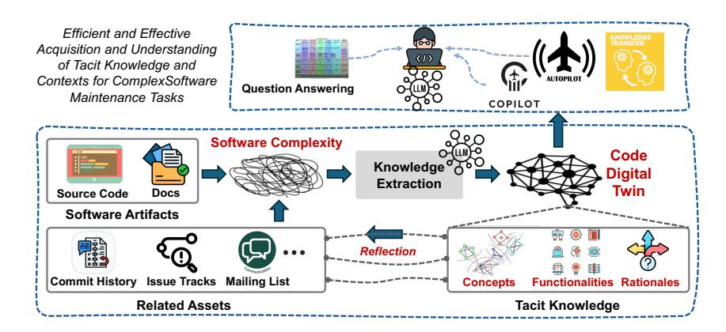
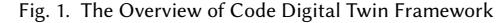

cite_key: peng_2025
title: Code Digital Twin: Empowering LLMs with Tacit Knowledge for Complex Software Maintenance
authors: Xin Peng, Chong Wang, Mingwei Liu, Yiling Lou, Yijian Wu
year: 2025
doi: 10.48550/arXiv.2503.07967
url: https://doi.org/10.48550/arXiv.2503.07967
relevancy: Medium
relevancy_justification: Contains relevant concepts applicable to HDM systems
tags:
  - ai
  - digital_twin
  - integration
  - knowledge_graph
  - llm
  - machine_learning
  - semantic
  - survey
date_processed: 2025-07-02
phase2_processed: true
original_folder: arxiv_arxiv_2503.07967_Code_Digital_Twin_Empowering_LLMs_with_Tacit_Knowledge_for_Complex_Software_Main
images_total: 2
images_kept: 2
images_removed: 0
keywords: 
---

XIN PENG, Fudan University, China CHONG WANG, Fudan University, China MINGWEI LIU, Sun Yat-sen University, China YILING LOU, Fudan University, China YIJIAN WU, Fudan University, China

While large language models (LLMs) have demonstrated promise in software engineering tasks like code completion and generation, their support for the maintenance of complex software systems remains limited. These models often struggle with understanding the tacit knowledge embedded in systems, such as responsibility allocation and collaboration across different modules. To address this gap, we introduce the concept and framework of Code Digital Twin, a conceptual representation of tacit knowledge that captures the concepts, functionalities, and design rationales behind code elements, co-evolving with the software. A code digital twin is constructed using a methodology that combines knowledge extraction from both structured and unstructured sources—such as source code, documentation, and change histories—leveraging LLMs, static analysis tools, and human expertise. This framework can empower LLMs for software maintenance tasks such as issue localization and repository-level code generation by providing tacit knowledge as contexts. Based on the proposed methodology, we explore the key challenges and opportunities involved in the continuous construction and refinement of code digital twin.

## TL;DR
Not available

## Key Insights  
Not available

# 1 Introduction

Recent advancements in large language models (LLMs) have demonstrated their impressive capabilities in software engineering (SE) tasks, such as code completion, bug detection, and software documentation. These models excel at understanding and generating code, streamlining development cycles, and assisting developers with routine tasks. Leveraging vast amounts of public domain data, LLMs have notably improved productivity and code quality in simpler, well-defined software systems.

However, as software systems increase in complexity, LLMs face significant challenges. While they are effective in tackling individual tasks, their ability to support the maintenance and evolution of large, intricate systems is limited. LLMs struggle to capture the tacit knowledge underlying complex software—such as high-level functionalities and design decisions—which is often embedded in informal documentation or resides solely in developers' minds. Moreover, LLMs lack a holistic, system-wide understanding that is necessary to manage the intricate relationships and continuous changes inherent in evolving software.

To address these challenges, we propose the concept and framework of Code Digital Twin, a conceptual representation of tacit knowledge that encapsulates the concepts, functionalities, and design rationales behind code elements, co-evolving with the software. The framework structures tacit knowledge into two key categories: the artifact-oriented backbone, which establishes a foundational structure by linking concepts and functionalities to software artifacts, and the rationale-centric explanations, which enrich this foundation by capturing the decisions that have shaped the system's design and evolution. The methodology for realizing a code digital twin combines structured and unstructured knowledge representations, integrating knowledge graphs, frames, and textual descriptions to capture domain concepts,

Authors' Contact Information: Xin Peng, pengxin@fudan.edu.cn, Fudan University, China; Chong Wang, wangchong20@fudan.edu.cn, Fudan University, China; Mingwei Liu, liumw26@mail.sysu.edu.cn, Sun Yat-sen University, China; Yiling Lou, yilinglou@fudan.edu.cn, Fudan University, China; Yijian Wu, wuyijian@fudan.edu.cn, Fudan University, China.

functionalities, and rationales. The construction pipeline consists of three key phases: artifact-oriented backbone knowledge extraction, which employs top-down schema-based and schema-free extraction from documentation and bottom-up functionality summarization from source code; rationale-centric explanatory knowledge extraction, where LLMs extract and structure design rationales from unstructured sources like mailing lists and discussions using predefined knowledge frame schemas; and artifact-knowledge reflection construction, which links extracted knowledge across software artifacts and elements to create a cohesive representation. This pipeline supports incremental updates, ensuring that the code digital twin evolves in sync with software changes, maintaining continuous alignment with the latest development state.

By providing integrated knowledge and ensuring continuous alignment with the evolving software, the code digital twin enhances collaboration between LLMs and developers. It enhances LLM capabilities in software maintenance through various modes, including software question answering, context-aware development co-pilot, and autonomous development auto-pilot. This framework presents an innovative approach for systematical accumulation of tacit knowledge in long-term software evolution, enabling more efficient maintenance and adaptation over time.

Furthermore, we outline the challenges and opportunities in the continuous construction of a code digital twin. We discuss the challenges associated with representing, updating, and integrating diverse knowledge elements when applying the construction methodology, ensuring the code digital twin remains relevant and robust as the software evolves. Additionally, we explore the difficulties in leveraging this framework to enhance collaboration between LLMs and human developers, aiming to foster more efficient and adaptive software management.

## 2 Motivation

The scale and complexity of software are constantly expanding, while the software developers are also continually changing. It results in an increasing complexity of software development, with related knowledge becoming more intricate. For example, the Linux kernel systems are still undergoing rapid and active development [\[6\]](#page-8-0), which had approximately 243,000 authors contributing more than 1,060,172 commits in 2021; additionally, its ecosystem is also evolving in a complex manner, involving developers from various countries and organizations. Furthermore, software development knowledge is continuously being lost, as the quality of documentation is often suboptimal, failing to provide and accumulate reliable sources of knowledge. As a result, although LLMs have been extensively trained upon public corpora and have shown promising results for some software development tasks, they struggle to support the development and maintenance of complex software.

Challenges in complex maintenance tasks. Software maintenance is a critical but challenging phase in development lifecycle. On the one hand, maintaining existing code involves difficulties such as pinpointing issues and determining the scope of their impact; on the other hand, new code must be integrated into the complex software architecture and existing code contexts with considering its potential effects. Based on the recent evaluation from OpenAI [\[21\]](#page-8-1), state-of-the-art LLMs exhibit limited effectiveness in addressing the challenging real-world issue resolution tasks.

Challenges in capturing tacit knowledge. In software requirements and design, a substantial amount of tacit knowledge remains difficult to capture. The success of LLMs mainly stems from their ability to learn from public textual corpora, including code, documentation, or books. However, much of the knowledge related to software requirements and design is not explicitly or well documented. For example, it often resides in the minds of developers, on whiteboards, or in discussions held during project meetings. As a result, existing LLMs have limited capabilities of capturing such important but tacit knowledge. Moreover, such tacit knowledge is difficult and unsuitable for direct injection into LLMs

<!-- Image Description: This flowchart depicts a system for acquiring tacit knowledge in software maintenance. It shows how software artifacts (source code, documentation, commit history, etc.) are processed through knowledge extraction using LLMs (Large Language Models) to create a "Code Digital Twin." This twin, representing extracted concepts, functionalities, and rationales, is visualized as a network graph. The process integrates question answering and incorporates a "Copilot" for knowledge transfer, ultimately aiming for efficient tacit knowledge acquisition. -->

<!-- Image Description: Figure 1 is a textual caption titled "The Overview of Code Digital Twin Framework". It lacks a visual diagram, chart, graph, or equation. Presumably, the figure's purpose is to introduce a conceptual framework (detailed elsewhere in the paper) for a Code Digital Twin. -->

through fine-tuning due to its domain-specific, continuously evolving nature and the needs for human expertise in inspecting and supplementing such knowledge.

Challenges in handling the internal and external complexity of software. Software exhibits both internal and external complexity. On the one hand, design decisions often span over a broad scope, involving intricate interdependencies between various parts of the code repository; on the other hand, designing software also requires consideration of external system factors. However, current LLMs lack the capabilities of higher-level "abstract" thinking and a system-level perspective to handle these complexities.

In summary, LLMs are insufficient to support the development and maintenance of complex software systems. It is necessary to design a new methodology to better prepare and organize the important knowledge missed by LLMs.

## 3 Code Digital Twin Framework

A code digital twin is a conceptual representation of tacit knowledge that encapsulates the concepts, functionalities, and design rationales behind code elements, co-evolving with the software. It enables efficient and effective software maintenance by providing on-demand, integrated insights at various granularities. Figure [1](#page-2-0) provides an overview of the code digital twin's construction process and its application paradigm.

## 1 Definition

Key terminologies in the code digital twin framework are defined as follows:

Software Artifacts and Related Assets. These are the "physical" resources of a software system, directly accessible by developers, including source code, data files, commit histories, issue tracks, change logs, etc.

Key Knowledge Elements. These are high-level, conceptual assets underlying software, including domain concepts, functionalities, and rationales (design decisions at various levels).

- Domain Concepts are background concepts for understanding the requirements and designing the solutions of a software system (e.g., basic OS concepts for Linux kernel).
- Functionalities describe core functionalities implemented in the source code and documentation, often spanning multiple functions or packages.
- Rationales explain design decisions, such as API choices or module partitioning, and are typically buried in unstructured assets like commit messages and issue threads.

Code Digital Twin. This model integrates key knowledge elements and their relationships through a unified representation closely linked to software artifacts. It consists of the following components:

- Artifact-Oriented Backbone. A high-level representation oriented to software artifacts using concepts and functionalities, providing a shared, basic understanding of the system.
- Rationale-Centric Explanations. Detailed explanatory rationales linked to the artifact-oriented backbone knowledge, supporting in-depth understanding of the system and decision-making.
- Artifact-Knowledge Reflection and Co-Evolution. The backbone knowledge and explanatory rationales evolve alongside the software artifacts, ensuring continuous alignment.

## 2 Methodology

We propose a methodology for realizing the code digital twin, including principles and guidelines from a conceptualization and knowledgefication perspective.

3.2.1 Knowledge Representation. The code digital twin leverages various knowledge representation methods to support the diverse categories of knowledge elements:

- Structured Representation. Structured representations, such as knowledge graphs, knowledge cards, and frames, model relationships and hierarchies within knowledge units, providing a formal schema for organizing and querying the knowledge. For example, we can define the schema for domain concepts and their relationships, enriched with domain expertise (e.g., categorizing domain concepts and relationships, defining top-tier concepts, based on empirical guidelines such as open coding). Additionally, knowledge frames can be defined with necessary properties to store functionalities and different types of rationales. We can also integrate interaction schemas between knowledge graphs and frames by defining unified identities for knowledge units (e.g., concepts and functionalities).
- Unstructured Representation. Textual descriptions, including natural language explanations and unstructured documents, offer flexible, context-rich representations that are not bound by predefined schemas, enabling more nuanced and descriptive knowledge capture. For instance, original functionality descriptions can be extracted from feature lists, and explanatory sentences for domain concepts can be stored.
- Synergistic Representation. This approach integrates both structured and unstructured knowledge representations to create a comprehensive view, combining the strengths of both methods to enhance overall understanding and utility of the knowledge.

3.2.2 Construction Pipeline. The code digital twin is constructed through a synergistic pipeline that leverages large language models (LLMs) and static program analysis.

• Artifact-Oriented Backbone Knowledge Extraction: This phase consists of two parts: top-down extraction of concepts and functionalities from documentation with the assistance of human expertise, and bottom-up functionality summarization from source code. In the top-down extraction, schema-based methods using LLMs are employed to extract concepts and their predefined relationships from documentation texts and to structure the original functionality descriptions into predefined frame formats. This is followed by schema-free extraction with LLMs to capture additional backbone knowledge, such as open relationships between concepts. In the bottom-up extraction, LLMs are used to hierarchically summarize functionalities from functions, function call chains, modules and other cross-cutting code elements.

- Rationale-Centric Explanatory Knowledge Extraction: This phase uses LLMs to extract instances of rationales based on predefined knowledge frame schemas. Initially, LLMs identify relevant information from a large, unstructured corpus (e.g., extensive mailing discussions). This information is then structured into predefined frame formats by using LLMs.
- Artifact-Knowledge Reflection Construction: This phase utilizes LLMs to link concepts across artifacts and knowledge elements and to map functionalities between software artifacts and knowledge elements.

3.2.3 Co-Evolution and Incremental Update. The pipeline must support incremental updates to maintain alignment with the real-time status of the software artifacts and related assets. As the software evolves, the knowledge and representation within the code digital model are updated synchronously.

## 3 Application and Impact

The code digital twin enables intelligent applications for complex software systems, categorized into three modes of collaboration between developers, LLMs, and the digital twin:

- On-Demand Knowledge Visualization. This application provides dynamic, context-sensitive visualizations of software knowledge, offering developers instant insights into the system's structure, behavior, and interdependencies, drawn from multiple sources, to aid in analysis and decision-making.
- Context-Aware Development Co-Pilot. The digital twin acts as an intelligent knowledge backbone for an AI assistant, providing task-specific insights and knowledge snippets to help LLMs navigate challenges and complete tasks more accurately.
- Autonomous Development Auto-Pilot. In this mode, LLM-based agents autonomously monitor the software lifecycle using the code digital twin, detecting and resolving issues to ensure stability and reduce the need for manual oversight.

Overall, the code digital twin will revolutionize the management and evolution of long-term complex software systems, enabling more efficient development, maintenance, and adaptation over time.

## 4 Research Agenda

To implement the code digital twin framework, we outline the following research agenda and identify actionable challenges and opportunities.

## 1 Synergistic Knowledge Representation

The goal is to develop a scalable framework for representing complex software knowledge in a digital twin model. This framework should integrate structured representations to organize code, design decisions, documentation, and historical changes, alongside unstructured representations for richer context. It should emphasize higher-level relationships and adapt to software changes. The key challenges and opportunities are outlined below:

• Structured Knowledge Representation and Integration. Developing a flexible, scalable knowledge model for complex software requires integrating diverse knowledge sources, such as domain-specific graphs and ontologies, to map relationships between components and decisions. The challenge is to align disparate sources, ensuring consistency and improving the digital twin's accuracy. Research should focus on developing knowledge fusion techniques to merge these sources efficiently.

- Integrating Structured and Unstructured Knowledge. Combining structured data (e.g., code, class hierarchies) with unstructured data (e.g., documentation, design rationale) into a unified model is complex. Actionable research should focus on creating hybrid models that integrate knowledge graphs with NLP-driven text extraction, enabling both automated LLM reasoning and human interpretation for software development and maintenance.
- Managing Ambiguity and Knowledge Versioning. Handling uncertain or evolving knowledge, such as design decision trade-offs, is a major challenge. Research should focus on using techniques like probabilistic reasoning and knowledge versioning to address ambiguity, ensuring the digital twin remains adaptable and coherent as the software evolves.

## 2 Automatic Construction Pipeline

The goal is to establish an efficient, accurate, and cost-effective pipeline for automatically extracting and structuring knowledge from software artifacts. This pipeline should integrate with the digital twin, ensuring continuous updates as the software system evolves. The key challenges and actionable opportunities are outlined below:

- Ensuring Accurate Knowledge Extraction. Extracting relevant, high-quality knowledge from diverse sources while minimizing noise is a critical challenge. To improve accuracy, focus on refining LLM-based extraction through targeted prompt engineering and fine-tuning for specific domains. This can improve the processing of both structured and unstructured data, such as source code, feature descriptions, and mailing list.
- Scalability and Efficiency of the Pipeline. Scaling the extraction pipeline for large, complex software systems while maintaining accuracy and speed is challenging. Focus on implementing distributed processing to enable parallel extraction and transformation of large data sets. Additionally, leverage incremental learning and batch processing to ensure scalability without compromising extraction quality over time.
- Adapting to Evolving Software Artifacts. Ensuring the extraction pipeline adapts to frequent software updates, including changes to code and documentation, is a key challenge. Implement real-time synchronization techniques to capture and integrate these changes into the digital twin as they occur, maintaining accurate and up-to-date knowledge representation.

## 3 Human-in-the-Loop Knowledge Accumulation

The goal is to leverage human input, through crowdsourcing and expertise, to enhance and update the digital twin. This approach fills gaps, ensures completeness, and creates a feedback loop where human insights complement automated knowledge extraction. Integrating human expertise makes the digital twin more dynamic, accurate, and reflective of real-world systems. The key challenges and opportunities are outlined below:

- Encouraging and Ensuring Quality Human Contributions. Motivating developers and experts to contribute is challenging without clear incentives. Research should focus on developing effective incentive mechanisms, such as reputation systems or gamification, to drive participation. Additionally, ensuring contribution quality requires systematic evaluation, such as using metrics (e.g., bug reduction or performance improvements), peer reviews, and expert validation to maintain accuracy and reliability.
- Designing User-Friendly Interfaces for Contributors. Creating intuitive, seamless interfaces for contributors is critical. Solutions like IDE plugins that unobtrusively capture programming activities (e.g., code maintenance patterns) will enable passive knowledge accumulation. Interfaces should offer guidance, progress tracking, and contextual feedback, focusing contributions on high-impact areas while remaining accessible to various types of participation.

• Maintaining Knowledge Completeness Over Time. As software systems evolve, keeping the accumulated knowledge up-to-date is challenging. Research should focus on developing automated tools for real-time synchronization with evolving software systems and establishing periodic reviews to identify and address knowledge gaps, ensuring the digital twin stays relevant and current.

## 4 Integration with Large Language Models

The goal of integrating the code digital twin with LLMs is to improve software development through intelligent collaboration, problem-solving, and predictive analysis. This integration combines the deep context in the digital twin with the language processing capabilities of LLMs to enhance software maintenance, issue resolution, and decision-making. The challenges and opportunities are outlined below:

- Software Question Answering. A key challenge is dynamically synthesizing contextual software views, such as architectural impact maps and rationale traces, that meet developers' evolving needs. To address this, research should focus on developing hybrid models that combine LLMs' natural language understanding with the digital twin's knowledge bases, enabling interactive visualizations. These models should translate natural language queries into actionable visual narratives, highlighting hidden relationships while managing information overload through targeted abstraction.
- Context-Aware Development Co-pilot. Balancing developer autonomy with LLM-driven suggestions is challenging, especially in modeling the semantics of code (from the digital twin) and the developer's intentions (e.g., design exploration or issue localization). A promising solution is to develop semantic retrieval techniques that extract relevant knowledge snippets from the code digital twin to support task completion.
- Autonomous Development Auto-pilot. Enabling LLMs to autonomously manage software tasks (e.g., bug fixing, refactoring) while adhering to project goals and design principles is a key challenge. Unchecked autonomy could lead to violations of system invariants or inefficient solutions. To address this, research should focus on integrating development tools (e.g., static analyzers, linters) with the code digital twin, ensuring real-time validation and contextual guidance for LLMs or LLM-based agents to support autonomous decision-making and maintain alignment with project objectives.

## 5 Co-Evolution of Code Digital Twin

The goal of a co-evolving twin is to ensure that the code digital twin remains an up-to-date, relevant, and dynamic representation of the evolving software system. This involves continuous synchronization with the codebase, incorporating developer feedback, adapting to system changes, and maintaining high-quality and consistent knowledge. Below are the key challenges and opportunities:

- Ensuring Continuous Synchronization and Adaptation. A primary challenge is keeping the code digital twin in sync with the continuously evolving codebase, which includes frequent updates, new features, and design changes. This can be achieved by automating synchronization through tools like continuous integration (CI) pipelines, change detection mechanisms, and incorporating developer feedback from issue trackers and version histories. Additionally, adopting modular frameworks and integrating automatic documentation can ensure the code digital twin dynamically adapts to system changes, maintaining relevance and accuracy over time.
- Maintaining Knowledge Quality and Consistency. As the system evolves, outdated or inconsistent knowledge may accumulate in the code digital twin. Implementing automated checks, version tracking, and semantic validation can help ensure that the digital twin's knowledge remains accurate and consistent over time, despite ongoing changes in the software system.

• Tracking the Impact of Code Changes. Assessing the impact of software changes on the accumulated knowledge in the code digital twin can be challenging. Mechanisms that trace code changes and evaluate their effect on the digital twin's knowledge will help ensure the digital twin remains responsive and accurate in reflecting the evolving system requirements.

## 5 Related Work

Repository-level code generation with LLMs. Repository-level code completion involves generating code based on cross-file context within a repository. Two main techniques assist LLMs in this task: Retrieval-Augmented Generation (RAG) [\[5,](#page-8-2) [7,](#page-8-3) [28,](#page-9-0) [33\]](#page-9-1), which retrieves similar code snippets, and static analysis [\[1,](#page-8-4) [5,](#page-8-2) [7,](#page-8-3) [18,](#page-8-5) [27\]](#page-9-2), which uses imported files or API lists. However, both approaches face challenges: retrieved snippets may not always help, and static analysis can be inaccurate, especially for dynamically typed languages. Despite advances in LLMs, accurate repository-level code completion remains difficult due to cross-file context complexities and limitations of current techniques.

Repository-level issue resolution with LLMs. Repository-level issue resolution is tackled through two main approaches: Agent-based [\[2,](#page-8-6) [32,](#page-9-3) [34\]](#page-9-4) and Pattern-based [\[29\]](#page-9-5) methods. Agent-based approaches, like SWE-Agent [\[32\]](#page-9-3), treat LLMs as agents to edit code, navigate repositories, and collaborate on issues. Pattern-based methods, such as AgentLess [\[29\]](#page-9-5), involve retrieving relevant code context in the Search/Localize stage, followed by code modification in the Edit stage. Other works [\[13,](#page-8-7) [15,](#page-8-8) [17\]](#page-8-9) mine structural knowledge from code graphs to improve search results. However, the large scale of repositories and complex issues make it challenging for LLMs to capture implicit knowledge like long call chains or design patterns.

Repository comprehension with LLMs. Many researchers are leveraging the comprehension capabilities of LLMs alongside knowledge representation techniques to address repository comprehension tasks. For instance, MutableAI [\[16\]](#page-8-10) enhances comprehension by converting codebases into Wikipedia-style articles with citations, enabling AI-powered experts to generate context-aware answers to repository queries. Similarly, CODEXGRAPH [\[12\]](#page-8-11) integrates LLMs with graph database interfaces derived from code repositories, allowing LLMs to construct and execute queries for efficient comprehension. These methods rely on the effectiveness of code wikis or graphs, highlighting the need for further research on how to better represent and use the information within code repositories to unlock the potential of LLMs. Knowledge graphs for software engineering. Researchers have developed various knowledge graphs to aid software development tasks. API KGs [\[4,](#page-8-12) [9,](#page-8-13) [10,](#page-8-14) [14,](#page-8-15) [19,](#page-8-16) [20\]](#page-8-17) summarize API knowledge, supporting tasks like migration and misuse detection. Software development concept KGs [\[11,](#page-8-18) [24–](#page-9-6)[26,](#page-9-7) [31,](#page-9-8) [35\]](#page-9-9) create domain glossaries. Programming task KGs [\[8,](#page-8-19) [23\]](#page-8-20) extract task attributes and relationships from tutorials, helping developers solve programming questions. Bug KGs [\[3,](#page-8-21) [22,](#page-8-22) [30\]](#page-9-10) capture knowledge on bug causes and solutions. However, no knowledge base specifically summarizes design-related knowledge for long-term software maintenance tasks.

## 6 Conclusion

In this work, we introduce the Code Digital Twin, a conceptual framework designed to bridge the gap between LLMs and the tacit knowledge essential for complex software maintenance. Our proposed methodology integrates LLMs, static analysis, and human expertise to construct and continuously evolve this representation in alignment with software development. Through this framework, we aim to enhance the effectiveness of LLMs in understanding system-wide dependencies, design rationales, and evolving software artifacts. Looking ahead, we identify key challenges in ensuring the scalability, adaptability, and long-term evolution of the code digital twin, opening avenues for further research in knowledge-centric software maintenance.

## References

- [1] Lakshya A Agrawal, Aditya Kanade, Navin Goyal, Shuvendu K Lahiri, and Sriram K Rajamani. 2023. Guiding language models of code with global context using monitors. arXiv preprint arXiv:2306.10763 (2023).
- [2] Dong Chen, Shaoxin Lin, Muhan Zeng, Daoguang Zan, Jian-Gang Wang, Anton Cheshkov, Jun Sun, Hao Yu, Guoliang Dong, Artem Aliev, et al. 2024. CodeR: Issue Resolving with Multi-Agent and Task Graphs. arXiv preprint arXiv:2406.01304 (2024).
- [3] Xueying Du, Yiling Lou, Mingwei Liu, Xin Peng, and Tianyong Yang. 2023. KG4CraSolver: Recommending Crash Solutions via Knowledge Graph. In Proceedings of the 31st ACM Joint European Software Engineering Conference and Symposium on the Foundations of Software Engineering (San Francisco, CA, USA) (ESEC/FSE 2023). Association for Computing Machinery, New York, NY, USA, 1242–1254. [doi:10.1145/3611643.3616317](https://doi.org/10.1145/3611643.3616317)
- [4] Hongwei Li, Sirui Li, Jiamou Sun, Zhenchang Xing, Xin Peng, Mingwei Liu, and Xuejiao Zhao. 2018. Improving API Caveats Accessibility by Mining API Caveats Knowledge Graph. In 34th IEEE International Conference on Software Maintenance and Evolution, ICSME 2018, September 23-29, 2018, Madrid, Spain. IEEE Computer Society, 183–193. [doi:10.1109/ICSME.2018.00028](https://doi.org/10.1109/ICSME.2018.00028)
- [5] Ming Liang, Xiaoheng Xie, Gehao Zhang, Xunjin Zheng, Peng Di, Hongwei Chen, Chengpeng Wang, Gang Fan, et al. 2024. REPOFUSE: Repository-Level Code Completion with Fused Dual Context. arXiv preprint arXiv:2402.14323 (2024).
- [6] Linux. 2025. Linux report. Retrieved February 21, 2025 from [https://upload.wikimedia.org/wikipedia/commons/1/1b/Linux\\_Distribution\\_Timeline.svg](https://upload.wikimedia.org/wikipedia/commons/1/1b/Linux_Distribution_Timeline.svg)
- [7] Junwei Liu, Yixuan Chen, Mingwei Liu, Xin Peng, and Yiling Lou. 2024. STALL+: Boosting LLM-based Repository-level Code Completion with Static Analysis. arXiv preprint arXiv:2406.10018 (2024).
- [8] Mingwei Liu, Xin Peng, Andrian Marcus, Christoph Treude, Jiazhan Xie, Huanjun Xu, and Yanjun Yang. 2022. How to formulate specific how-to questions in software development?. In Proceedings of the 30th ACM Joint European Software Engineering Conference and Symposium on the Foundations of Software Engineering, ESEC/FSE 2022, Singapore, Singapore, November 14-18, 2022. ACM, 306–318. [doi:10.1145/3540250.3549160](https://doi.org/10.1145/3540250.3549160)
- [9] Mingwei Liu, Xin Peng, Andrian Marcus, Zhenchang Xing, Wenkai Xie, Shuangshuang Xing, and Yang Liu. 2019. Generating Query-specific Class API Summaries. In 27th ACM Joint Meeting on European Software Engineering Conference and Symposium on the Foundations of Software Engineering, ESEC/SIGSOFT FSE 2019, August 26-30, 2019, Tallinn, Estonia. ACM, 120–130. [doi:10.1145/3338906.3338971](https://doi.org/10.1145/3338906.3338971)
- [10] Mingwei Liu, Xin Peng, Xiujie Meng, Huanjun Xu, Shuangshuang Xing, Xin Wang, Yang Liu, and Gang Lv. 2020. Source Code based On-demand Class Documentation Generation. In IEEE International Conference on Software Maintenance and Evolution, ICSME 2020, Adelaide, Australia, September 28 - October 2, 2020. IEEE, 864–865. [doi:10.1109/ICSME46990.2020.00114](https://doi.org/10.1109/ICSME46990.2020.00114)
- [11] Mingwei Liu, Simin Yu, Xin Peng, Xueying Du, Tianyong Yang, Huanjun Xu, and Gaoyang Zhang. 2023. Knowledge Graph based Explainable Question Retrieval for Programming Tasks. In 39th IEEE International Conference on Software Maintenance and Evolution, ICSME 2023, Bogotá, Colombia, October 1-6, 2023. IEEE.
- [12] Xiangyan Liu, Bo Lan, Zhiyuan Hu, Yang Liu, Zhicheng Zhang, Fei Wang, Michael Shieh, and Wenmeng Zhou. 2024. Codexgraph: Bridging large language models and code repositories via code graph databases. arXiv preprint arXiv:2408.03910 (2024).
- [13] Yizhou Liu, Pengfei Gao, Xinchen Wang, Jie Liu, Yexuan Shi, Zhao Zhang, and Chao Peng. 2024. Marscode agent: Ai-native automated bug fixing. arXiv preprint arXiv:2409.00899 (2024).
- [14] Yang Liu, Mingwei Liu, Xin Peng, Christoph Treude, Zhenchang Xing, and Xiaoxin Zhang. 2020. Generating Concept based API Element Comparison Using a Knowledge Graph. In 35th IEEE/ACM International Conference on Automated Software Engineering, ASE 2020, September 21-25, 2020, Melbourne, Australia. IEEE, 834–845. [doi:10.1145/3324884.3416628](https://doi.org/10.1145/3324884.3416628)
- [15] Yingwei Ma, Qingping Yang, Rongyu Cao, Binhua Li, Fei Huang, and Yongbin Li. 2024. How to Understand Whole Software Repository? arXiv preprint arXiv:2406.01422 (2024).
- [16] MutableAI. 2025. MutableAI. Retrieved February 21, 2025 from<https://welcome.ai/solution/mutableai>
- [17] Siru Ouyang, Wenhao Yu, Kaixin Ma, Zilin Xiao, Zhihan Zhang, Mengzhao Jia, Jiawei Han, Hongming Zhang, and Dong Yu. 2024. RepoGraph: Enhancing AI Software Engineering with Repository-level Code Graph. arXiv preprint arXiv:2410.14684 (2024).
- [18] Hengzhi Pei, Jinman Zhao, Leonard Lausen, Sheng Zha, and George Karypis. 2023. Better context makes better code language models: A case study on function call argument completion. In Proceedings of the AAAI Conference on Artificial Intelligence, Vol. 37. 5230–5238.
- [19] Xin Peng, Yifan Zhao, Mingwei Liu, Fengyi Zhang, Yang Liu, Xin Wang, and Zhenchang Xing. 2018. Automatic Generation of API Documentations for Open-Source Projects. In IEEE Third International Workshop on Dynamic Software Documentation, DySDoc@ICSME 2018, Madrid, Spain, September 25, 2018. IEEE, 7–8. [doi:10.1109/DySDoc3.2018.00010](https://doi.org/10.1109/DySDoc3.2018.00010)
- [20] Xiaoxue Ren, Xinyuan Ye, Zhenchang Xing, Xin Xia, Xiwei Xu, Liming Zhu, and Jianling Sun. 2020. API-Misuse Detection Driven by Fine-Grained API-Constraint Knowledge Graph. In 35th IEEE/ACM International Conference on Automated Software Engineering, ASE 2020, Melbourne, Australia, September 21-25, 2020. IEEE, 461–472. [doi:10.1145/3324884.3416551](https://doi.org/10.1145/3324884.3416551)
- [21] Miserendino Samuel, Wang Michele, Patwardhan Tejal, and Heidecke Johannes. 2025. SWE-Lancer: Can Frontier LLMs Earn one Million from Real-World Freelance Software Engineering? arXiv preprint arXiv:2502.12115 (2025).
- [22] Yanqi Su, Zhenchang Xing, Xin Peng, Xin Xia, Chong Wang, Xiwei Xu, and Liming Zhu. 2021. Reducing bug triaging confusion by learning from mistakes with a bug tossing knowledge graph. In 2021 36th IEEE/ACM International Conference on Automated Software Engineering (ASE). IEEE, 191–202. [doi:10.1109/ASE51524.2021.9678574](https://doi.org/10.1109/ASE51524.2021.9678574)
- [23] Jiamou Sun, Zhenchang Xing, Rui Chu, Heilai Bai, Jinshui Wang, and Xin Peng. 2019. Know-How in Programming Tasks: From Textual Tutorials to Task-Oriented Knowledge Graph. In IEEE International Conference on Software Maintenance and Evolution, ICSME 2019, September 29 - October 4,

## Xin Peng, Chong Wang, Mingwei Liu, Yiling Lou, and Yijian Wu

2019, Cleveland, OH, USA. IEEE, 257–268. [doi:10.1109/ICSME.2019.00039](https://doi.org/10.1109/ICSME.2019.00039)

- [24] Chong Wang, Xin Peng, Mingwei Liu, Zhenchang Xing, Xuefang Bai, Bing Xie, and Tuo Wang. 2019. A Learning-Based Approach for Automatic Construction of Domain Glossary from Source Code and Documentation. In 27th ACM Joint Meeting on European Software Engineering Conference and Symposium on the Foundations of Software Engineering, ESEC/SIGSOFT FSE 2019, August 26-30, 2019, Tallinn, Estonia. ACM, 97–108. [doi:10.1145/](https://doi.org/10.1145/3338906.3338963) [3338906.3338963](https://doi.org/10.1145/3338906.3338963)
- [25] Chong Wang, Xin Peng, Zhenchang Xing, and Xiujie Meng. 2023. Beyond Literal Meaning: Uncover and Explain Implicit Knowledge in Code Through Wikipedia-Based Concept Linking. IEEE Trans. Software Eng. 49, 5 (2023), 3226–3240. [doi:10.1109/TSE.2023.3250029](https://doi.org/10.1109/TSE.2023.3250029)
- [26] Chong Wang, Xin Peng, Zhenchang Xing, Yue Zhang, Mingwei Liu, Rong Luo, and Xiujie Meng. 2023. XCoS: Explainable Code Search based on Query Scoping and Knowledge Graph. ACM Transactions on Software Engineering and Methodology (2023).
- [27] Chong Wang, Jian Zhang, Yebo Feng, Tianlin Li, Weisong Sun, Yang Liu, and Xin Peng. 2024. Teaching Code LLMs to Use Autocompletion Tools in Repository-Level Code Generation. arXiv preprint arXiv:2401.06391 (2024).
- [28] Di Wu, Wasi Uddin Ahmad, Dejiao Zhang, Murali Krishna Ramanathan, and Xiaofei Ma. 2024. REPOFORMER: Selective retrieval for repository-level code completion. arXiv preprint arXiv:2403.10059 (2024).
- [29] Chunqiu Steven Xia, Yinlin Deng, Soren Dunn, and Lingming Zhang. 2024. Agentless: Demystifying llm-based software engineering agents. arXiv preprint arXiv:2407.01489 (2024).
- [30] Rui Xie, Long Chen, Wei Ye, Zhiyu Li, Tianxiang Hu, Dongdong Du, and Shikun Zhang. 2019. DeepLink: A Code Knowledge Graph Based Deep Learning Approach for Issue-Commit Link Recovery. In 26th IEEE International Conference on Software Analysis, Evolution and Reengineering, SANER 2019, Hangzhou, China, February 24-27, 2019. IEEE, 434–444. [doi:10.1109/SANER.2019.8667969](https://doi.org/10.1109/SANER.2019.8667969)
- [31] Shuangshuang Xing, Mingwei Liu, and Xin Peng. 2021. Automatic Code Semantic Tag Generation Approach Based on Software Knowledge Graph. Journal of Software 33, 11 (2021), 4027–4045.
- [32] John Yang, Carlos E Jimenez, Alexander Wettig, Kilian Lieret, Shunyu Yao, Karthik R Narasimhan, and Ofir Press. 2024. Swe-agent: Agent-computer interfaces enable automated software engineering. In The Thirty-eighth Annual Conference on Neural Information Processing Systems.
- [33] Fengji Zhang, Bei Chen, Yue Zhang, Jacky Keung, Jin Liu, Daoguang Zan, Yi Mao, Jian-Guang Lou, and Weizhu Chen. 2023. Repocoder: Repositorylevel code completion through iterative retrieval and generation. arXiv preprint arXiv:2303.12570 (2023).
- [34] Yuntong Zhang, Haifeng Ruan, Zhiyu Fan, and Abhik Roychoudhury. 2024. Autocoderover: Autonomous program improvement. In Proceedings of the 33rd ACM SIGSOFT International Symposium on Software Testing and Analysis. 1592–1604.
- [35] Xuejiao Zhao, Zhenchang Xing, Muhammad Ashad Kabir, Naoya Sawada, Jing Li, and Shang-Wei Lin. 2017. HDSKG: Harvesting domain specific knowledge graph from content of webpages. In IEEE 24th International Conference on Software Analysis, Evolution and Reengineering, SANER 2017, Klagenfurt, Austria, February 20-24, 2017. IEEE Computer Society, 56–67. [doi:10.1109/SANER.2017.7884609](https://doi.org/10.1109/SANER.2017.7884609)

## Metadata Summary
### Research Context
- **Research Question**: Not available
- **Methodology**: Not available
- **Key Findings**: Not available

### Analysis
- **Limitations**: Not available
- **Future Work**: Not available