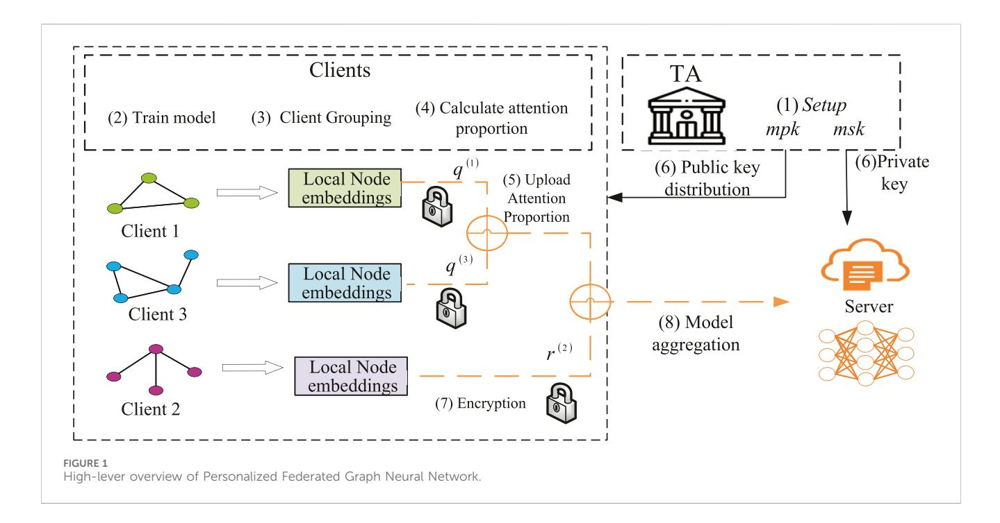
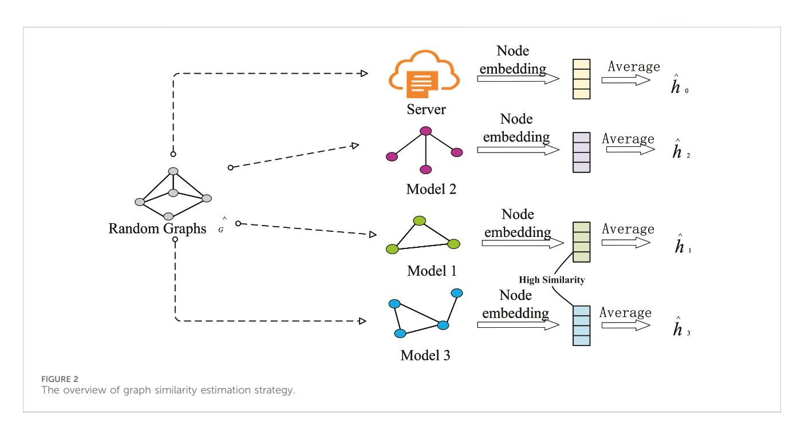
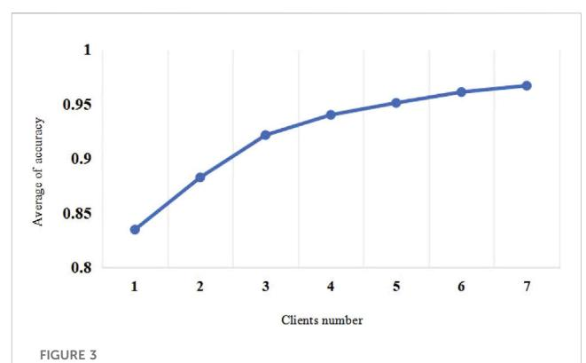
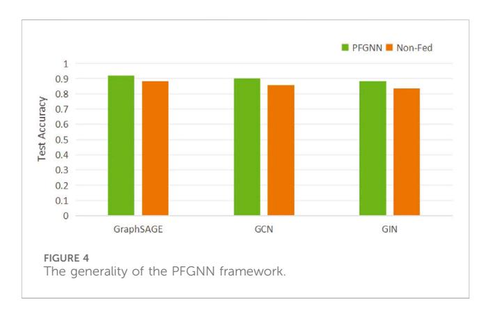

# OPEN ACCESS

EDITED BY Yuanyuan Huang, Chengdu University of Information Technology, China

REVIEWED BY Jiazhong Lu, Chengdu University of Information Technology, China Ding Zhe, Chengdu University of Information Technology, China Peilin He, University of Pittsburgh, United States

\*CORRESPONDENCE Yanjun Liu, [yanjunliu1223@163.com](mailto:yanjunliu1223@163.com)

RECEIVED 07 February 2024 ACCEPTED 26 March 2024 PUBLISHED 26 April 2024

CITATION Liu Y, Li H and Hao M (2024), Personalized and privacy-preserving federated graph neural network. Front. Phys. 12:1383276. doi: [10.3389/fphy.2024.1383276](https://doi.org/10.3389/fphy.2024.1383276)

## COPYRIGHT

© 2024 Liu, Li and Hao. This is an open-access article distributed under the terms of the [Creative Commons Attribution License \(CC BY\)](https://creativecommons.org/licenses/by/4.0/). The use, distribution or reproduction in other forums is permitted, provided the original author(s) and the copyright owner(s) are credited and that the original publication in this journal is cited, in accordance with accepted academic practice. No use, distribution or reproduction is permitted which does not comply with these terms.

# [Personalized and](https://www.frontiersin.org/articles/10.3389/fphy.2024.1383276/full) [privacy-preserving federated](https://www.frontiersin.org/articles/10.3389/fphy.2024.1383276/full) [graph neural network](https://www.frontiersin.org/articles/10.3389/fphy.2024.1383276/full)

## Yanjun Liu\*, Hongwei Li and Meng Hao

School of Computer Science and Engineering, University of Electronic Science and Technology of China, Chengdu, China

High-performance GNN obtains dependencies within a graph by capturing the mechanism of message passing and aggregation between neighboring nodes in the graph, and successfully updates node embeddings. However, in practical applications, the inherent model structure of the graph is highly susceptible to privacy attacks, and the heterogeneity of external data can lead to a decrease in model performance. Motivated by this challenge, this work proposes a novel framework called Personalized Federated Graph Neural Network for Privacy-Preserving (PFGNN). Specifically, firstly, this work introduces a graph similarity strategy. Based on the principle that clients with similar features exhibit stronger homophily, this work divides all participating clients into multiple clusters for collaborative training. Furthermore, within each group, this work employs an attention mechanism to design a federated aggregation weighting scheme. This scheme is used to construct a global model on the server, which helps mitigate the difficulty of model generalization resulting from data heterogeneity collected from different clients. Lastly, to ensure the privacy of model parameters during the training process and prevent malicious adversaries from stealing them, this work implements privacy-enhancing technology by introducing an optimized function-hiding multi-input function encryption scheme. This ensures the security of both model data and user privacy. Experiments on real datasets show that our scheme outperforms FedAvg in accuracy, and the communication overhead is linearly related to the number of clients. Through this framework, PFGNN can handle all kinds of non-Euclidean structured data, multiple clients collaborate to train high-quality and highly secure global models. This work provides the foundation for designing efficient and privacy-preserving personalized federated graph neural networks.

### KEYWORDS

federated learning, graph neural network, privacy preserving, multi-input function encryption, artificial intelligence

### 1 Introduction

Cyber-physical-social systems (CPSSs) are a new paradigm extended by cyberphysical systems (CPSs), which have attracted widespread attention in the academic community Li et al. [[1\]](#page-9-0). CPSS seamlessly connects networks, physical devices and social spaces through data. CPSS provides a more comprehensive intelligent system for federated graph neural networks, thus promoting the rapid development of artificial intelligence (AI). However, the heterogeneous of graph data in CPSS, coupled with the limitations of mobile devices and communication overhead during data transmission, makes CPSS not only vulnerable to privacy attacks, but also the heterogeneity of external data can lead to model performance degradation Wang et al. [[2](#page-9-1)]. Therefore, the security and privacy of CPSS graph data have become a key research object of artificial intelligence.

The introduction of Graph Neural Networks (GNNs) has successfully applied the concept of deep learning to non-Euclidean space data sets Bronstein et al. [\[3\]](#page-9-2). With its powerful spatial graph structure, Graph Neural Network helps various industries deeply explore the value of their own data. GNN obtains dependencies in the graph by capturing the message passing mechanism and aggregation method between adjacent nodes in the graph structure, and converts it into standardized complete node embedding information and rich data information Fu et al. [[4\]](#page-9-3), Liu et al. [\[5\]](#page-9-4).

Graph neural network training requires a large amount of graph data, which is distributed among different data owners. For instance, as described in Zhang et al. [[6\]](#page-9-5), the hospital wishes to train a graph neural network model for small cell carcinoma of lung (SCLC), each hospital has its own patient graph network that tracks common diagnoses of SCLC and other diseases. However, due to privacy issues and legal and regulatory considerations, these graph data cannot be shared with others, which leads to data isolation problems. This prompts us to ponder deeply: How to collaboratively train GNNs without leaking the local data of each institution? Federated learning is a distributed machine learning paradigm that not only protects the privacy of local data but is also the most effective way to deal with data isolation McMahan et al. [\[7\]](#page-9-6). Federated Learning (FL) with GNNs, where each client trains a GNN model locally and learns the local embedding information, and then the central server collects the gradients or model parameters of each client for federated aggregation Liu et al. [[8\]](#page-9-7).

However, an important challenge faced by federated graph neural networks is the privacy leakage issue Hu et al. [\[9\]](#page-9-8). Different from Euclidean spatial data such as pictures and texts, graph neural networks incorporate additional information because of their powerful graph structure, such as the information of nodes in the graph. It is this highly descriptive information that makes the GNN model extremely vulnerable to privacy attacks Zhang et al. [[10](#page-9-9)] and even exploited by adversaries, resulting in leakage of attribute and member information He et al. [\[11\]](#page-9-10) or affecting data set reconstruction Olatunji et al. [\[12\]](#page-9-11). Moreover, in a federated graph neural network, the adversary can reversely infer the client's local data through node embedding information, leading to the leakage or even abuse of sensitive data He et al. [[13](#page-9-12)].

Also, a more important challenge is the heterogeneity of graph data Wang et al. [[14](#page-9-13)]. In the collaborative modeling process, the graph data of different clients have varying degrees of heterogeneity in graph structure and node features, so these stored graph data are generally non independent and identically distributed (non-IID) Liu et al. [\[15\]](#page-9-14). This kind of graph data heterogeneity may cause the traditional federated averaging algorithm (FedAVG) to seriously diverge, resulting in global model performance degradation Zheng et al. [[16](#page-9-15)]. Therefore, how to design a federated graph neural network framework suitable for non-IID graph data is particularly important.

Motivated by this challenge, this work proposes a novel framework named Personalized Federated Graph Neural Network for Privacy-Preserving (PFGNN), by which a highquality and highly secure global model is trained collaboratively by multiple clients. The PFGNN framework is built on a set of state-of-the-art training paradigms, including graph similarity strategies, attention-based model aggregation schemes, and implementation of privacy-enhancing techniques to protect the uploading of sensitive model parameters. The processing of PFGNN can be divided into three stages to ensure high quality, high accuracy and high security of graph neural network training. Based on the above description of the PFGNN framework, our contributions are as follows.

- Enhanced the performance of federated learning in processing non-Euclidean spatial data. This work designs a graph similarity estimation strategy that takes stronger homophily among clients with similar characteristics as a clustering reference, while using random graphs as input of the GNN model to measure the similarity between each client and server, and dividing the clients into different clusters.
- Improved the accuracy of the global model. In order to accurately handle model parameters and replace the average mechanism, this work introduces the attention mechanism to design a federated aggregation weighting scheme to build a global model on the server. This global model can alleviate the difficulty of global model generalization caused by the heterogeneity of different client data.
- Realized personalized privacy protection. In order to hide the model parameters during the model training process and prevent malicious adversaries from stealing the model parameters, the privacy enhancement technology is implemented by introducing an optimized Function hiding multi-input function encryption scheme to ensure the privacy security of the model data and users.

# 2 Preliminaries

## 1 Federated learning

Federated learning is a type of distributed machine learning that can aggregate multiple data sources for collaborative training Lyu et al. [[17\]](#page-9-16). During the model training process, data storage and model training are performed locally, and only model parameters or intermediate results are exchanged with the central server, the central server integrates different terminal parameters to implement a complete model training process. Federated learning effectively helps multiple organizations jointly conduct training and model modeling on the premise that data does not leave the domain and data security is met, thereby improving the effectiveness of artificial intelligence models and mitigating the costs and privacy risks in the traditional machine learning process.

### 2 Graph neural network

Graph neural network is a framework that uses deep learning to learn non-Euclidean spatial data. Its superior performance can help various industries deeply mine data value from complex graph structures. The GNN framework obtains the dependencies in the graph by capturing the message passing mechanism and aggregation method between adjacent nodes in the graph structure, and converts it into standardized and standard complete node embedding information and rich data information. Therefore, GNN has been rapidly developed and achieved good results in downstream tasks such as node classification, link prediction, graph and subgraph generation, etc.

In this work, PFGNN is modeled with the message passing neural network framework (MPNN) Gilmer et al. [[18](#page-9-17)]. The forward passing process of MPNN includes two phases: Message Passing and Readout. In our framework, assume that there are K clients, and the data set of the kth client is D(k) - (G(k) , Y(k) ), where G(k) - (V(k) , E(k) ), V (k) is the node set of G(k) , E(k) is the edge set of G(k) , eij i,j∈V(k) is the edge feature set.

Phase 1: Message Passing. The function of this phase is to aggregate the node's neighborhood sampling information and update the embedding information of the node itself, as follows:

<span id="page-2-0"></span>
$$
m_i^{(k,l+1)} = AGG\Big(\Big\{M_t\big(h_i^{(k,l)}, h_j^{(k,l)}, e_{ij}\big)\Big\}j \in N(i)\Big) \tag{1}
$$

$$
h_i^{(k,l+1)} = U_t\big(h_i^{(k,t)}, m_i^{(k,l+1)}\big) \tag{2}
$$

where h(k,l) <sup>i</sup> x(k,l) <sup>i</sup> is the node feature of the Lth layer of the Kth client. AGG is an aggregate function, and Mt is a message function, Ut is the update function, N(i) represents a group of adjacent nodes of node i.

Phase 2: Readout. The function of this phase is to calculate the feature vector of the node based on the output layer for different downstream tasks.

$$
y = Q\left(\left\{h_i^{(k,T)} \mid i \in G_p\right\}\right) \tag{3}
$$

where Q is the readout function, which represents the features of the entire graph neural network, and p represents different downstream tasks.

#### 3 Functional encryption

Function encryption is a lightweight public key encryption algorithm designed to protect data security. However, function encryption cannot be applied in real distributed scenarios, such as federated learning. Therefore, multi-input function encryption (MIFE) is an enhanced version of function encryption that emerged for application in distributed scenarios Abdalla et al. [[19\]](#page-9-18). In MIFE, n participants are allowed to encrypt their own private data and generate ciphertext CT - (c1, c<sup>2</sup> ... cn), generate the private key skf through the key generation algorithm and jointly perform function operations in the ciphertext state. That is to say, holding the ciphertext CT - (c1, c<sup>2</sup> ... cn) and the private key skf can produce the calculation result y f(x1, x<sup>2</sup> ... xn) without revealing any information about the plaintext. This shows that sensitive data can be protected during the computing process while effectively preventing data leakage and privacy violations.

# 3 Proposed framework

## 1 High-level overview

In this subsection, this work gives a detailed introduction of PFGNN framework, that is, federated graph neural network for privacy-preserving. The goal of PFGNN is to achieve accurate, efficient, low communication cost, privacy-preserving personalized federated graph neural network. Participants of PFGNN include a trusted authority (TA) responsible for public key distribution and private key generation, a central server that coordinates model training and parameter aggregation, and a large number of clients that collaboratively train GNN models. Each client processes its own graph data by training a local graph neural network and uploads model parameters to the central server. Then the central server aggregates the received model parameters and iterates continuously until an excellent global model is trained. The framework diagram of PFGNN is shown in [Figure 1.](#page-3-0)

The PFGNN framework aims to achieve accurate, efficient, lowcommunication-cost, and privacy-preserving personalized federated graph neural networks. The specific steps of the PFGNN are as follows.

- 1) Global Initialization and Security Parameter Setup: Initially, a Trusted Authority (TA) conducts global initialization by defining security parameters λ and generating the master public key (mpk) and master private key (msk). and then distributes them to clients.
- 2) Client Model Training Locally: Clients independently train their graph neural network (GNN) models locally to obtain initial node embeddings.
- 3) Client Grouping: Clients are organized into different clusters based on the criteria defined by [Algorithm 1.](#page-4-0) This grouping facilitates cooperation and coordination among clients.
- 4) Attention Proportion Generation: Within each cluster, attention proportions are generated according to the definition provided in [Formula 7](#page-4-1). These proportions will be used to weight the contributions of different clients.
- 5) Client Upload of Attention Proportion: Each client uploads their computed attention proportion to a trusted third party (TA).
- 6) TA distributes cryptographic keys: TA generates the corresponding private key according to the proportion of attention uploaded by the client, and sends it to the server for decryption, which helps to ensure the data security of different clients.
- 7) Encryption of Model Parameters and Attention Proportion: The client's model parameters and attention proportion are encrypted using an optimized function-hiding MIFE algorithm.
- 8) Secure Aggregation: Upon receiving the encrypted model parameters and attention proportion, the server performs a secure aggregation operation to combine the client's attention proportion. Then, the server decrypts to obtain the aggregated model parameters, thus completing one round of model training.

### 2 Graph similarity estimation strategy

The heterogeneity of graph data is a major challenge in federated graph neural network optimization. Consider this scenario: Assuming there are three clients, the graph structure


<!-- Image Description: Figure 1 is a flowchart depicting a personalized federated graph neural network. It shows multiple clients training models on local graph data, generating node embeddings. Clients then upload attention proportions (q<sup>(1)</sup>, q<sup>(3)</sup>, r<sup>(2)</sup>) to a trusted authority (TA), which distributes a public key. The TA aggregates these proportions, encrypted (represented by padlocks), and sends the result to a server for model aggregation. The process illustrates the workflow of the system, emphasizing data privacy and security via encryption. -->

<span id="page-3-0"></span>
<!-- Image Description: Figure 2 illustrates a graph similarity estimation strategy. Three sample graphs (Models 1-3) and a random graph are shown. Each model's nodes are processed to generate node embeddings. These embeddings are then averaged to produce a single vector representation (ĥ) for each graph. The resulting vectors are compared to estimate similarity, with Models 1 and 3 exhibiting high similarity. The process is depicted as flowing through a server. -->

<span id="page-3-1"></span>between client 1 and client 3 is significantly different, and may even exhibit completely opposite properties. At the same time, there may be an overlap of nodes between Client 1 and Client 2. These nodes have similar characteristics and can form a cluster. It is known that clients with similar characteristics have stronger homophily McPherson et al. [[20](#page-9-19)]. In order to capture the data heterogeneity between clients and train an accurate model suitable for most client data, this work can analyze and measure different clients based on the similarity of the client's graph structure, similar clients are grouped into a cluster. Regarding finding similarity in graph structure, usually, everyone will use model parameters or gradients to calculate similarity. In fact, because the dimensionality is too high, the similarity between parameters will continue to grow as the dimensionality of the model increases, so this method has serious flaws.

Inspired by Jeong et al. [[21](#page-9-20)], and making it clear that our purpose is to measure the similarity between client graph structures, this work can provide the same input to all client graph structures (including the server model) and then analyze the similarity of their output results. In other words, consider all graph structure models as a black box function, input the same graph data, analyze and evaluate the output distance to represent the similarity between different graph structures. The specific algorithm is shown in [Algorithm 2](#page-5-0), where the random graph is initialized by the stochastic block model Baek et al. [\[22\]](#page-9-21), and this randomness will not bias the model structure of any client. The detailed graph similarity strategy is shown in [\(Figure 2\)](#page-3-1).

The server uses the similarity function to calculate the similarity between any client and server model. The expression is as follows:

$$
S(i) = \frac{\hat{h}_0 \cdot \hat{h}_i}{\|\hat{h}_0\| \|\hat{h}_i\|} \tag{4}
$$

the server classifies clients whose similarity is higher than a threshold (such as 0.5) into a cluster.

```text
• Public Parameters: N is the total number of clients, C
   is the fraction of client, U is a set of all clients, B is
   the local mini-batch size, E is the number of
   local epochs.
   • Input: the GNN model M(i) on the client G(i)
                                               , the GNN model
   M on the server side
    • Output: C clusters.
   /*Runs on Server*/
     Ensure Server executes:
       for each round t = 1, 2, ... do
         m ← max (C · N, 1)
         Sn ← { } ui | ui ∈ U m
                         1
         Initialize random graph G^
         With G^ on model M, compute ^
                                      h0
         Send G^ to client i
      end for
   /*Runs on Client k*/
     Ensure Client k executes:
       for each local epoch i from 1 to E do do
         for for batch b ∈ B do do
           With G^ on model M(k)
                               , compute ^
                                          hk
         end for
         Send ^
               hk to the server
       end for
   /*Runs on Server*/
     Ensure Server executes:
         Similarity S(i) calculation with ^
                                              h0 and ^
                                                     hk based
        on Eq. 2
         Group into C clusters with S(i)
Algorithm 1. Graph similarity calculation strategy.
```text

#### <span id="page-4-0"></span>3.3 A function encryption optimization algorithm with attentive aggregation

During the training process of the personalized federated graph neural network, the client trains the GNN model locally, generates local node embeddings, and directly uploads the model parameters or gradients to the server through federated aggregation, malicious adversaries can steal user data through model reconstruction attacks. At the same time, since each client's graph data has differences in graph structure and node features, this heterogeneity causes the traditional federated averaging algorithm to be seriously divergent, so this work needs to train an effective global model. To solve these problems, this work proposes a function encryption optimization algorithm based on attention aggregation, which not only considers the contribution of the client model to the global model, but also encrypts the aggregated model parameters and fusion weights.

#### 3.1 A federated graph neural network algorithm with attentive aggregation

The most important part of the federated graph neural network is the server-side federated aggregation. In the traditional federated averaging algorithm, each client is given the same weight. This averaging processing method is rough and cannot well evaluate the advantages and disadvantages of the local model, which will have an adverse impact on the performance of the model. In order to train efficient global models and focus on the importance of client models, this work proposes a federated graph neural network algorithm with attentive aggregation, focusing on using FL with a central server to train GNN models.

The intuition behind federated graph neural network optimization is to find a global model that can improve the generalizability of distributed clients, the attentive aggregation algorithm proposed is a simple reward mechanism that can evaluate the contribution of client model parameters to the global model. Next, this work focuses on the aggregation mode of the client model. Specifically, this work takes the server model parameters as the query and the client model parameters as the key, calculate their similarity, and obtain the attention proportion of each client through the SoftMax function, finally, the model parameters are weighted and summed according to the attention proportion.

Given the lth layer parameter of the server global model as h<sup>l</sup> , h(k,l) represents the model parameter of the lth layer of the kth client, and the similarity p(k,l) between hl and h(k,l) is calculated by the Frobenius norm. Which is denoted as:

$$
p^{(k,l)} = \operatorname{att}(h^{(k,l)}, h^l) = \tau \|h^{(k,l)} - h^l\|_2^2 \tag{5}
$$

In order to further explore the relationship between client model parameters and global model parameters, this work uses hyperparameters τ to adjust the similarity online.

Then, since the similarity may have large differences and needs to be normalized, this work applies SoftMax function to calculate the attention proportion of each layer.

$$
q^{(k,l)} = \text{SoftMax}(p^{(k,l)}) = \frac{\exp(p^{(k,l)})}{\sum_{k \in m} \exp(p^{(k,l)})}
$$
(6)

<span id="page-4-1"></span>where q(k,l) represents the attention proportion of the lth layer model parameter of the kth client. After the server obtains the attention proportion of each client, it generates a global model based on the proportion of each client.

$$
h_{t+1}^l = \sum_{k=1}^m q_t^{(k,l)} h^{(k,l)} \tag{7}
$$

where q(k,l) <sup>t</sup> is the proportion of the kth client at time t, and represents the global model parameters at time t + 1.

#### 3.2 Optimized function encryption algorithm

In the process of federated aggregation, in order to defend against potential adversarial attacks, it is essential to encrypt the model parameters during transmission. This work has adopted the enhanced version of the MIFE algorithm, known as the Function-Hiding Multi-Input Function Encryption (FH-MIFE) scheme Abdalla et al. [[19](#page-9-18)]. Specifically, in addition to safeguarding the uploaded model parameters, this work places particular emphasis on protecting the weights proportion by each client. The traditional single-layer MIFE falls short in adequately securing functions that may contain sensitive information. The FH-MIFE scheme employs a doublelayer encryption process on both plaintext and keys, thereby enhancing the overall security of the model.

In some actual distributed scenarios, the decryption key contains a function f, and the function f itself also contains sensitive information, which allows the decryptor to obtain the weight value of each user in the decryption result. This will lead to the leakage of the user's plaintext information, so a single layer of function encryption is not enough to protect the function f with sensitive information. Therefore, we choose the function hiding multi-input function encryption scheme, which adds an extra layer of encryption on the ciphertext and key of the original MIFE. This double-layer encryption can not only ensure the security of the plaintext and model, but also protect the function f security, providing the model with high security and efficiency. In addition, in the process of model training, the client will fail due to network instability or connection problems, thus affecting the secure communication between clients and the server. However, the PFGNN scheme allows some clients to exit and rejoin at any time during the training phase, because the function-hiding multi-input function encryption scheme does not require the order in which clients join, nor does it require resetting keys for disconnected clients. Which sum(Y) > <sup>n</sup> <sup>2</sup> indicates that TA collects the minimum number of participating clients and then generates the corresponding private key. In order to mitigate inference attacks, the sum of the number of clients participating in aggregation should be greater than or equal to <sup>n</sup> <sup>2</sup> ensure the normal progress of aggregation.

Furthermore, to more effectively apply the function hiding multiple-input function encryption in federated learning, this work has optimized the scheme. This work has introduced a key distribution phase in which the TA distributes unique public keys to each client based on their respective IDs. This allows each client to have their own unique public key for encryption, rather than using a uniform public key. This improvement enhances the security and flexibility of the scheme.

```text
• Public Parameters: N is the total number of clients, B
 is the local mini-batch size, E is the number of local
 epochs, t represents the number of layers of the neural
 network, ht
             (k) represents the model parameters of the
 client k.
```text

```text
/*Run on TA*/
 Ensure TA executes:
 Initialized with mpk, msk
 function query − key(yk,εFH−MFH)
    if sum(Y) > n
                2 then
      return sky1y2...yk
    end if
/*Runs on Client k*/
 Ensure Client k executes:
    for each local epoch i from 1 to E do do
      for for batch b ∈ B do do
      obtain exclusive public key based on ID
      function collect-client (ht(k), b)
      ck ← EncFH−MIFH pkk (ht(k))
    end for
    Send ck to the server
  end for
/*Runs on Server*/
 Ensure Server executes:
 generate batch indices {1, 2, ... , B}
    for b ∈ B do
    for k ∈ K do
      Ck ← collect-client (ht(k), b)
      sky1y2...yk ← query − key(yk,εFH−MIFH)
      ht(k) ← DecFH−MIFH sky1y2...yk
                          ({ } Ck kϵK)
    end for
end for
```text

<span id="page-5-0"></span>Algorithm 2. Optimized function encryption algorithm.

# 4 Security and privacy analysi

The goal of the PFGNN framework is to train a secure and efficient personalized federated graph neural network. This work analyzes the security and privacy of the PFGNN framework in detail.

## 1 Security analysis

Function Encryption is a cryptographic technique designed to protect data privacy, while allowing specific function computations to be performed on encrypted data without decrypting the data. This encryption method strikes a balance between privacy preserving and data processing, and is particularly suitable for scenarios such as federated learning. To prevent gradient inversion attacks in federated learning, PFGNN uses function-hiding multi-input function encryption to prevent collusion between malicious servers and TA, privately trade key parameters, and protect user encryption model gradient, so as to protect user privacy.

The cryptographic security of Function-Hiding MIFE is the top priority of the security of the PFGNN framework. Function-Hiding MIFE is a way to resist malicious adversaries from stealing model parameters and aggregate weights. In this work, to apply function hiding MIFE to federated learning more effectively, this work introduces a key distribution stage, in which a third-party server distributes an exclusive public key based on the ID of each client. This allows each client to obtain its own unique public key for encryption instead of using a unified public key. This improvement does not involve core algorithm processes, such as public key encryption and private key decryption. Therefore, this algorithm has no impact on the security of Function-Hiding MIFE. Function-Hiding MIFE is proven to be many-SEL-wFH-IND-secure, the proof process adopts a hybrid argument method, please refer to Abdalla et al. [\[19\]](#page-9-18) for detailed understanding.

### 2 Privacy analysis

Function hiding MIFE provides computational privacy guarantees for secure aggregation in the PFGNN framework. Function hiding MIFE provides computational privacy guarantees for secure aggregation in the PFGNN framework. During the model training process, the Function-Hiding MIFE protects the model parameters and client weights from the client to the server, the decrypted result only contains the aggregated results of the model parameters, and the model parameters for any specific client are not available at all. In other words, function hiding MIFE doubleencrypts the plaintext and key, effectively protecting the weight information of each client during decryption. This method can prevent malicious adversaries from using the weight of a single client to effectively speculate on the source of a certain attribute, and further prevents the adversary from identifying and leaking the client's identity through understanding the client's background knowledge.

### 5 Evaluation

In this section, this work evaluates the performance of the PFGNN scheme. This solution is a federated learning framework based on graph neural network, including n clients and a central server. This work mainly studies protocol performance evaluation in the semi-honest condition. In order to verify the effect of the proposed scheme, this work implements a federated learning prototype system based on graph similarity strategy, attentive aggregation scheme and function encryption, and conducts accuracy and efficiency experiments on it.

#### 1 Experimental settings

In order to evaluate the performance of this scheme, PFGNN chose to perform the node classification task on three graph structure datasets, namely, Cora, Pubmed and Citeseer. The statistical summary of the datasets is shown in [Table 1.](#page-6-0) And compare it with traditional graph neural network, thus proving <span id="page-6-0"></span>TABLE 1 Dataset statistic.

| Dataset  | Node  | Edge  | Feature | Classes |
|----------|-------|-------|---------|---------|
| Cora     | 2708  | 5429  | 1433    | 7       |
| Pubmed   | 19717 | 44338 | 500     | 3       |
| Citeseer | 3327  | 4732  | 3703    | 6       |

the accuracy and versatility of PFGNN in processing non-Euclidean data.

During the process of model training, the client trains the graph neural network locally, taking GraphSAGE as an example, the propagation depth is L ∈ {1, 2, 3, 4, 5}, the number of iterations of the client's local model training is set as 10, the training batch size is 60. In this work, the maximum layer of the fully connected neural network is set as 2, and hyperbolic tangent (TanH) is adopted as the activation function of the hidden layer. Parameter drop rate is d ∈ {0.0, 0.5}, learning rate lr ∈ 5e−<sup>4</sup>, 5e−<sup>3</sup>, 1e−<sup>3</sup>, 1e−<sup>2</sup> . Since the task of the graph neural network in this work is node classification, the loss function adopts cross entropy. In order to prevent the model from overfitting, an additional regular term L2 is added L2 ∈ 5e−<sup>4</sup>, 5e−<sup>3</sup>, 1e−<sup>3</sup>, 1e−<sup>2</sup>  , 0.0 . All experiments in this work are conducted on a single machine without the Internet to simulate communication in federated learning. The training set of the model is used to train the model, the verification set is used to adjust parameters, and the test set is used to measure the quality of model training. When adjusting parameters, the grid search method is selected to seek the highest accuracy under appropriate parameter settings.

This work implements PFGNN in python. Like the function encryption algorithm in MIFE Abdalla et al. [\[19\]](#page-9-18), this work employs gmpy2 to implement the Paillier function encryption system.

#### 2 Accuracy analysis

#### <span id="page-6-1"></span>5.2.1 Comparison of model accuracy under different labels

To test the accuracy of the model, PFGNN chose to perform the node classification task on three graph-structured datasets, namely, Cora, Pubmed and Citeseer. In order to test the accuracy of models under different labels, this work divides the Cora data set into C1, C<sup>2</sup> and C3, according to the types of labels, where C<sup>1</sup> has three label categories with 1,296 nodes, C<sup>2</sup> has two label categories, and finally C<sup>3</sup> has two label categories. Similarly, this paper also divides the Pubmed and Citeseer data sets into three parts.

In order to study the accuracy of model aggregation under different labels, this paper assumes that there are three clients (A, B and C), the data of client A is composed of C1, the data of client B is composed of C2, and the data of client C is composed of C3. In other words, the labels for the three clients are different. Next, comparative experiments were conducted between PFGNN, traditional Centralized machine learning (Centralized ML), and the classic FedAvg algorithm on three data sets. The local model training of the three algorithms is the graph neural network GraphSAGE. PFGNN is trained in the same way as

| Dataset  | Centralized ML | FedAvg | PFGNN  |
|----------|----------------|--------|--------|
| Cora     | 0.8345         | 0.8924 | 0.9213 |
| Pubmed   | 0.8134         | 0.8812 | 0.9315 |
| Citeseer | 0.7237         | 0.7723 | 0.8145 |
| Average  | 0.7905         | 0.8486 | 0.8891 |

<span id="page-7-0"></span>TABLE 2 Performance comparison on three datasets in terms of accuracy.

<span id="page-7-1"></span>TABLE 3 Performance comparison on different labels and different graphs.

| Dataset  | FedAvg | PFGNN  | Improvement (%) |
|----------|--------|--------|-----------------|
| Cora     | 0.7546 | 0.8085 | 7.14            |
| Pubmed   | 0.7435 | 0.7734 | 6.03            |
| Citeseer | 0.7137 | 0.7623 | 9.04            |
| Average  | 0.7078 | 0.7814 | 7.38            |

FedAvg to verify the advantages of PFGNN with attentive aggregation.

To evaluate the performance of PFGNN in classification tasks, this paper examines its average accuracy on three different data sets. As shown in [Table 2,](#page-7-0) PFGNN performs best in average accuracy on these datasets, significantly outperforming the other two models. In particular, compared with the classical FedAvg model, the average accuracy of PFGNN is improved by 5.4%. This result emphasizes the superiority of PFGNN in classification tasks and shows that after the introduction of the attentive aggregation mechanism, it has achieved satisfactory results in handling data aggregation and model updating in distributed learning scenarios.

#### 2.2 Comparison of model accuracy under different labels and different graphs

The framework of message passing neural network in this paper is GraphSAGE, which mainly includes two steps: Sample and Aggregate. Sampling is to sample the number of neighbors through fixed-length sampling with replacement, thereby ensuring that each node after sampling has the same number of neighbors. GraphSAGE model training benefits from the transfer of adjacent information. Therefore, in order to study the accuracy of the model under different labels and graphs, this section divides the data set Cora according to the average edges, the samples with edges less than or equal to 3 in Cora are recorded as Ca, and the samples with edges greater than 3 are recorded as Cb. Then, similar to [Section](#page-6-1) [5.2.1](#page-6-1), the data of client A comes from the sample number Ca1 of three label categories in sample Ca, and the data of client B consists of the sample number Ca2 of two label categories in sample Ca, the data of client C comes from the Cb3 samples of the two label categories in sample Cb. In the same way, the two data sets of Pubmed and Citeseer can be divided.

In this work, PFGNN model and FedAvg model are trained on three data sets respectively, and their accuracy is compared in [Table 3](#page-7-1). The results show that under different labels and different graphs, PFGNN model performs better than FedAvg,


<!-- Image Description: Figure 3 is a line graph showing the relationship between the number of clients and the average accuracy. The x-axis represents the number of clients (1-7), and the y-axis represents the average accuracy (0.8-1.0). The graph shows an increasing trend in accuracy as the number of clients increases, indicating a positive correlation. The graph likely demonstrates the system's performance improvement with more data from multiple clients. -->

<span id="page-7-2"></span>Average accuracy comparison of different clients' number with different labels.


<!-- Image Description: Figure 4 is a bar chart comparing the test accuracy of a PFGNN framework against a non-federated approach across three graph neural network (GNN) architectures: GraphSAGE, GCN, and GIN. The chart shows test accuracy on the y-axis and the GNN architecture on the x-axis. Each GNN has two bars representing PFGNN and Non-Fed results, demonstrating the framework's performance relative to a standard approach. The figure aims to illustrate the generality and effectiveness of the PFGNN framework. -->

<span id="page-7-3"></span>and the average accuracy rate increases from 5.48% to 7.38%. This shows that the PFGNN frame is suitable for handling different scenarios of label and graph distribution, which further emphasizes the superiority of the PFGNN model on non-IID data.

Centralized ML refers to uploading data to the server during the training process, performing training and inference on the server, and finally returning the results to the user. In this work, traditional machine learning can be regarded as the case where the PFGNN model has only one client. However, this method involves privacy and security risks in data uploading, and can also lead to excessive latency and waste the computing power of the terminal device. To study the impact of the number of clients on model performance, we increase the number of clients on the Cora dataset from 3 to 7, with each client having a different label. The [Figure 3](#page-7-2) shows that the accuracy of the PFGNN model increases with the number of clients and eventually stabilizes. This shows that as the number of clients increases, the types of tags each client has becomes smaller, but the performance of the overall model is still improved. This finding highlights the advantages of PFGNN in dealing with large-scale data sets, which can effectively utilize attentive aggregation and improve the performance and scalability of the model.

As shown in [Figure 4](#page-7-3), in order to test whether PFGNN is versatility, PFGNN is applied in different graph neural networks to test the Cora dataset, such as GCN Kipf and Welling [\[23\]](#page-9-22) and GIN Hard et al. [[24\]](#page-9-23). The green bar in the figure represents GraphSAGE with PFGNN settings, and the orange bar represents pure

| Clients | Enc (Hybrid) | Dec (Hybrid) | Enc (PFGNN) | Dec (PFGNN) |
|---------|--------------|--------------|-------------|-------------|
| 3       | 4.145        | 11.654       | 1.883       | 2.034       |
| 6       | 4.121        | 20.234       | 2.054       | 2.956       |
| 9       | 4.077        | 30.345       | 2.076       | 4.956       |

<span id="page-8-0"></span>TABLE 4 The time overhead of the function encryption scheme.

<span id="page-8-1"></span>TABLE 5 Communication per iteration for n clients.

| Phase            | Communication                 | VFGNN      | PFGNN) |
|------------------|-------------------------------|------------|--------|
| Training Process | Secure SGD: clients ↔ CSP     | n          | n      |
|                  | Secure SGD: clients ↔ clients | (n2 − n)/2 | 0      |
|                  | Secure SGD: TOTAL             | (n2 + n)/2 | n      |

GraphSAGE. The accuracy of PFGNN after 100 rounds of communication in the figure is higher than 100 epochs iterative of GraphSAGE, which shows that PFGNN is effective for federated graph neural networks and can processes various non-Euclidean structured data and can be easily embedded into other models.

#### 3 Computational overhead analysis

The PFGNN runs all encryption schemes under LAPTOP-OSDQQEMN equipped with lntel(R) Core (TM) i7-8565U CPU. In order to evaluate the computational overhead of function hiding MIFE in PFGNN, this work can set different numbers of clients and compare the encryption time of different schemes.

[Table 4](#page-8-0) clearly shows that as the number of clients increases, the time required for function encryption and decryption shows completely different trends. Specifically, as the number of clients increases, the encryption time on the client side remains almost constant, while on the server side, the decryption time grows linearly. However, the secure aggregation scheme of federated learning has a computational overhead of O(N<sup>2</sup>). In comparison, PFGNN only need O(N). Compared with the scheme proposed in Yin et al. [\[25\]](#page-9-24), the scheme adopted is not only more efficient, but also keeps the encryption and decryption time within an acceptable range even when the number of parameters reaches millions.

#### 4 Communication overhead analysis

This work performs a detailed comparison between the PFGNN framework and VFGNN, especially in terms of communication overhead within one iteration. This solution is a federated learning framework based on graph neural network, including n clients and a central server. The detailed communication overhead is shown in [Table 5](#page-8-1). During model training, there is no direct communication between clients in the PFGNN scheme. This improvement reduces the total communication overhead from (n<sup>2</sup> + n)/2 to n. This means that the communication overhead is linearly related to the number of clients throughout the model training process.

# 6 Conclusion

This work proposes the Personalized and Privacy-Preserving Federated Graph Neural Network (PFGNN). The PFGNN framework is built on a set of state-of-the-art training paradigms, including graph similarity strategies, attention mechanism-based model aggregation schemes, and optimized function hiding encryption scheme to protect the upload of sensitive model parameters. Experiments on real datasets show that our scheme outperforms FedAvg in accuracy, and the communication overhead is linearly related to the number of clients. Through this framework, PFGNN can handle all kinds of non-Euclidean structured data, multiple clients collaborate to train high-quality and highly secure global models. This work provides the foundation for designing efficient and privacy-preserving personalized federated graph neural networks.

# Data availability statement

The original contributions presented in the study are included in the article/supplementary material, further inquiries can be directed to the corresponding author.

# Author contributions

YL: Conceptualization, Formal Analysis, Investigation, Methodology, Software, Writing–original draft, Writing–review and editing. HL: Writing–review and editing. MH: Writing–review and editing.

# Funding

The author(s) declare that financial support was received for the research, authorship, and/or publication of this article. This work is supported by the National Key RD Program of China under Grant 2022YFB3103500, the Key-Area Research and Development Program of Guangdong Province under Grant 2020B0101360001, the National Natural Science Foundation of China under Grants 62020106013 and 61972454, the Fundamental Research Funds for Chinese Central Universities under Grant ZYGX2020ZB027.

# Conflict of interest

The authors declare that the research was conducted in the absence of any commercial or financial relationships that could be construed as a potential conflict of interest.

# Publisher's note

All claims expressed in this article are solely those of the authors and do not necessarily represent those of their affiliated

## References

<span id="page-9-0"></span>1. Li X, Wang P, Jin X, Jiang Q, Zhou W, Yao S. Reinforcement learning architecture for cyber–physical–social ai: state-of-the-art and perspectives. Artif Intelligence Rev (2023) 56:12655–88. doi:[10.1007/s10462-023-10450-2](https://doi.org/10.1007/s10462-023-10450-2)

<span id="page-9-1"></span>2. Wang X, Yang J, Wang Y, Miao Q, Wang F-Y, Zhao A, et al. Steps toward industry 5.0: building "6s" parallel industries with cyber-physical-social intelligence. IEEE/CAA J Automatica Sinica (2023) 10:1692–703. doi[:10.1109/jas.](https://doi.org/10.1109/jas.2023.123753) [2023.123753](https://doi.org/10.1109/jas.2023.123753)

<span id="page-9-2"></span>3. Bronstein MM, Bruna J, LeCun Y, Szlam A, Vandergheynst P. Geometric deep learning: going beyond euclidean data. IEEE Signal Process. Mag (2017) 34:18–42. doi[:10.1109/msp.2017.2693418](https://doi.org/10.1109/msp.2017.2693418)

<span id="page-9-3"></span>4. Fu X, Zhang B, Dong Y, Chen C, Li J. Federated graph machine learning: a survey of concepts, techniques, and applications. ACM SIGKDD Explorations Newsl (2022) 24: 32–47. doi:[10.1145/3575637.3575644](https://doi.org/10.1145/3575637.3575644)

<span id="page-9-4"></span>5. Liu Y, Qian X, Li H, Hao M, Guo S. Fast secure aggregation for privacypreserving federated learning. In: GLOBECOM 2022-2022 IEEE Global Communications Conference (IEEE); December, 2022; Rio de Janeiro, Brazil (2022). p. 3017–22.

<span id="page-9-5"></span>6. Zhang K, Yang C, Li X, Sun L, Yiu SM. Subgraph federated learning with missing neighbor generation. Adv Neural Inf Process Syst (2021) 34:6671–82.

<span id="page-9-6"></span>7. McMahan B, Moore E, Ramage D, Hampson S, y Arcas BA. Communicationefficient learning of deep networks from decentralized data. In: Artificial intelligence and statistics (PMLR); April, 2017; Fort Lauderdale, FL, USA (2017). p. 1273–82.

<span id="page-9-7"></span>8. Liu Y, Li H, Qian X, Hao M. Esa-fedgnn: efficient secure aggregation for federated graph neural networks. Peer-to-peer Networking Appl (2023) 16:1257–69. doi:[10.1007/](https://doi.org/10.1007/s12083-023-01472-2) [s12083-023-01472-2](https://doi.org/10.1007/s12083-023-01472-2)

<span id="page-9-8"></span>9. Hu P, Lin Z, Pan W, Yang Q, Peng X, Ming Z. Privacy-preserving graph convolution network for federated item recommendation. Artif Intelligence (2023) 324:103996. doi:[10.1016/j.artint.2023.103996](https://doi.org/10.1016/j.artint.2023.103996)

<span id="page-9-9"></span>10. Zhang Z, Liu Q, Huang Z, Wang H, Lu C, Liu C, et al. Graphmi: extracting private graph data from graph neural networksarXiv preprint arXiv:2106.02820 (2021). [https://](https://arxiv.org/abs/2106.02820) [arxiv.org/abs/2106.02820.](https://arxiv.org/abs/2106.02820)

<span id="page-9-10"></span>11. He X, Wen R, Wu Y, Backes M, Shen Y, Zhang Y. Node-level membership inference attacks against graph neural networks [J]arXiv preprint arXiv:2102.05429 (2021). [https://](https://arxiv.org/abs/2102.05429) [arxiv.org/abs/2102.05429.](https://arxiv.org/abs/2102.05429)

<span id="page-9-11"></span>12. Olatunji IE, Nejdl W, Khosla M. Membership inference attack on graph neural networks. In: 2021 Third IEEE International Conference on Trust, Privacy and Security in Intelligent Systems and Applications (TPS-ISA); December, 2021; Atlanta, GA, USA (2021). p. 11–20.

organizations, or those of the publisher, the editors and the reviewers. Any product that may be evaluated in this article, or claim that may be made by its manufacturer, is not guaranteed or endorsed by the publisher.

<span id="page-9-12"></span>13. He X, Jia J, Backes M, Gong NZ, Zhang Y. Stealing links from graph neural networks. In: 30th USENIX Security Symposium (USENIX Security 21); August, 2021; Virtual Event (2021). p. 2669–86.

<span id="page-9-13"></span>14. Wang S, Zheng Y, Jia X. Secgnn: privacy-preserving graph neural network training and inference as a cloud service. IEEE Trans Serv Comput (2023) 16:2923–38. doi[:10.](https://doi.org/10.1109/tsc.2023.3241615) [1109/tsc.2023.3241615](https://doi.org/10.1109/tsc.2023.3241615)

<span id="page-9-14"></span>15. Liu Y, Zheng Y, Zhang D, Chen H, Peng H, Pan S. Towards unsupervised deep graph structure learning. In: Proceedings of the ACM Web Conference 2022; April, 2022; Virtual Event, Lyon France (2022). p. 1392–403.

<span id="page-9-15"></span>16. Zheng X, Wang Z, Chen C, Qian J, Yang Y. Decentralized graph neural network for privacy-preserving recommendation. In: Proceedings of the 32nd ACM International Conference on Information and Knowledge Management; October, 2023; Birmingham United Kingdom (2023). p. 3494–504.

<span id="page-9-16"></span>17. Lyu L, Yu H, Ma X, Chen C, Sun L, Zhao J, et al. Privacy and robustness in federated learning: attacks and defenses. IEEE Trans Neural networks Learn Syst (2022) 1–21. doi:[10.1109/tnnls.2022.3216981](https://doi.org/10.1109/tnnls.2022.3216981)

<span id="page-9-17"></span>18. Gilmer J, Schoenholz SS, Riley PF, Vinyals O, Dahl GE. Neural message passing for quantum chemistry. In: International conference on machine learning (PMLR); August, 2017; Sydney, Australia (2017). p. 1263–72.

<span id="page-9-18"></span>19. Abdalla M, Catalano D, Fiore D, Gay R, Ursu B. Multi-input functional encryption for inner products: function-hiding realizations and constructions without pairings. In: Advances in Cryptology–CRYPTO 2018: 38th Annual International Cryptology Conference; August 19–23, 2018; Santa Barbara, CA, USA (2018). p. 597–627.

<span id="page-9-19"></span>20. McPherson M, Smith-Lovin L, Cook JM. Birds of a feather: homophily in social networks. Annu Rev Sociol (2001) 27:415–44. doi[:10.1146/annurev.soc.27.1.415](https://doi.org/10.1146/annurev.soc.27.1.415)

<span id="page-9-20"></span>21. Jeong W, Lee H, Park G, Hyung E, Baek J, Hwang SJ. Task-adaptive neural network search with meta-contrastive learning. Adv Neural Inf Process Syst (2021) 34:21310–24.

<span id="page-9-21"></span>22. Baek J, Jeong W, Jin J, Yoon J, Hwang SJ. Personalized subgraph federated learning. In: International Conference on Machine Learning (PMLR); July, 2023; Honolulu, Hawaii, USA (2023). p. 1396–415.

<span id="page-9-22"></span>23. Kipf TN, Welling M. Semi-supervised classification with graph convolutional networks [J]arXiv preprint arXiv:1609.02907 (2016). <https://arxiv.org/abs/1609.02907>.

<span id="page-9-23"></span>24. Hard A, Rao K, Mathews R, Ramaswamy S, Beaufays F, Augenstein S, et al. Federated learning for mobile keyboard prediction [J]arXiv preprint arXiv:1811.03604 (2018). [https://](https://arxiv.org/abs/1811.03604) [arxiv.org/abs/1811.03604.](https://arxiv.org/abs/1811.03604)

<span id="page-9-24"></span>25. Yin L, Feng J, Xun H, Sun Z, Cheng X. A privacy-preserving federated learning for multiparty data sharing in social iots. IEEE Trans Netw Sci Eng (2021) 8:2706–18. doi[:10.](https://doi.org/10.1109/tnse.2021.3074185) [1109/tnse.2021.3074185](https://doi.org/10.1109/tnse.2021.3074185)
