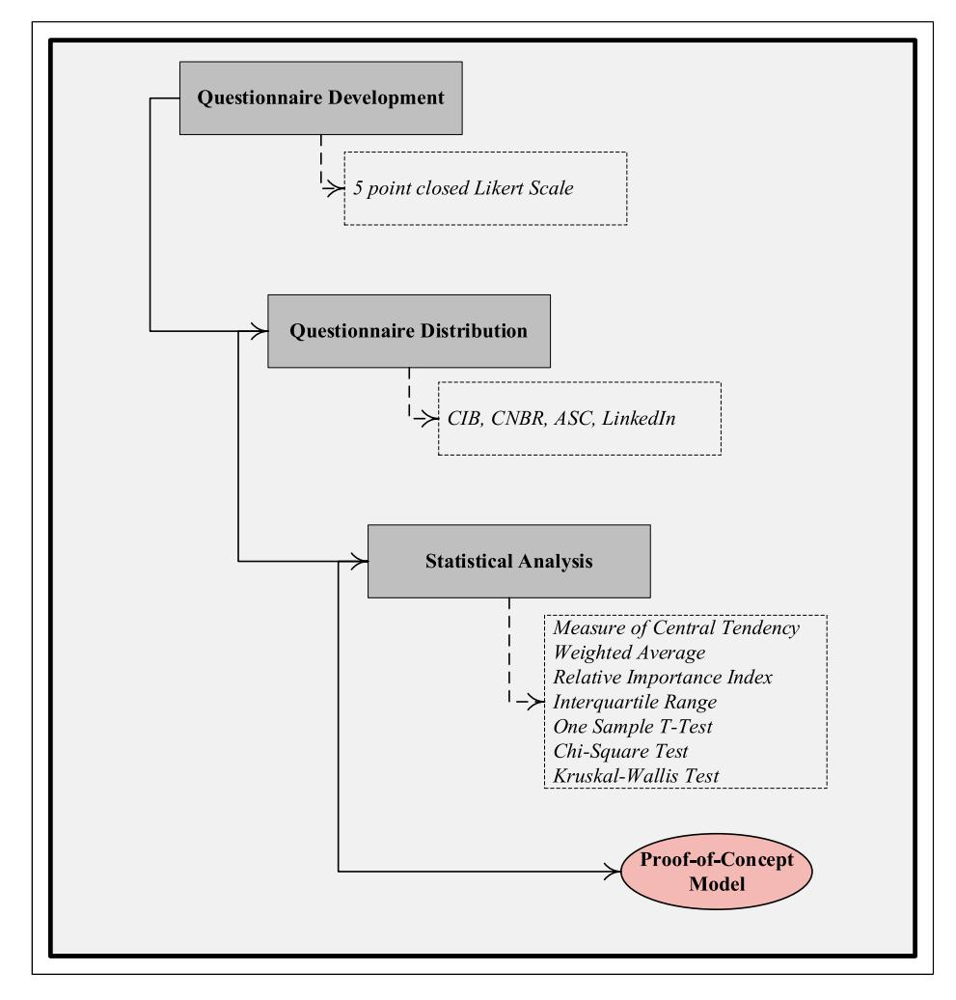
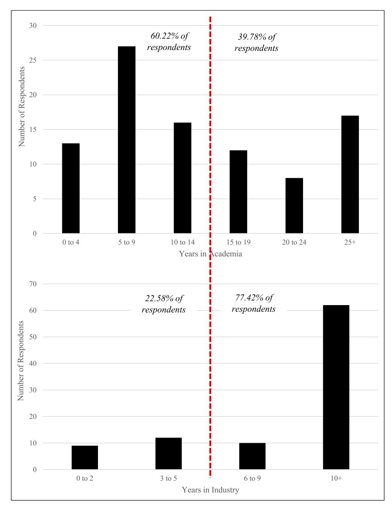
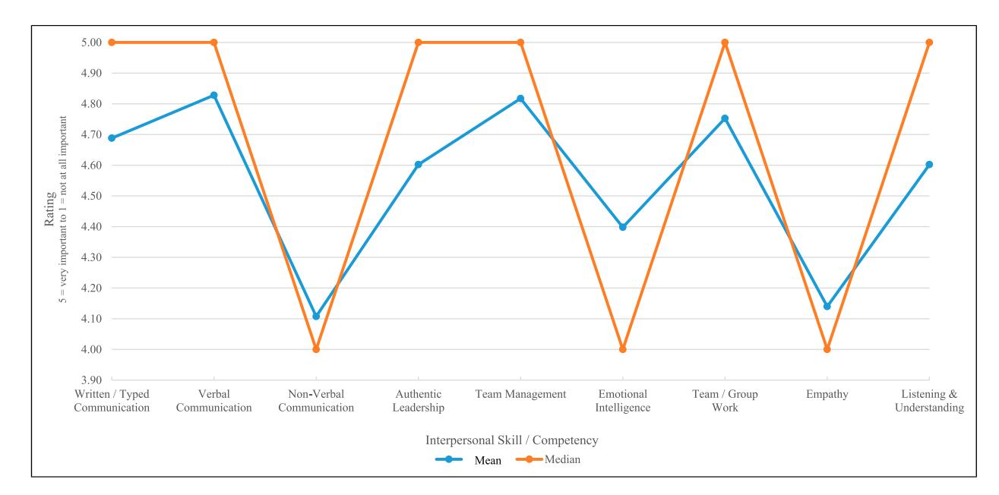
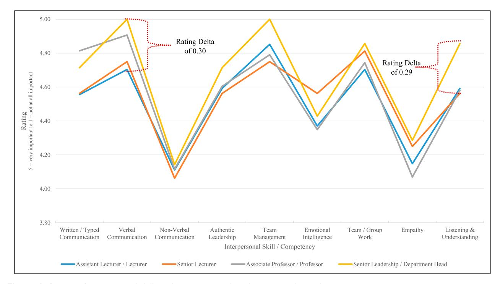
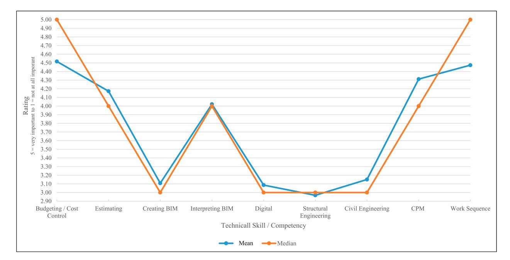
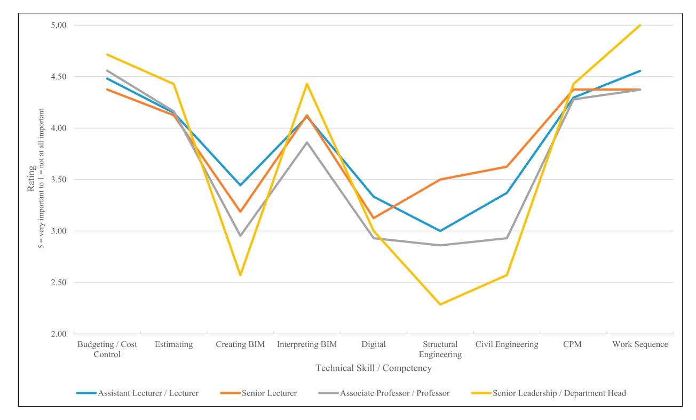
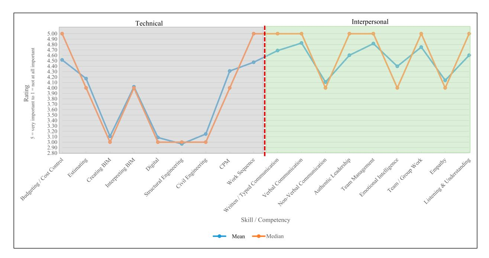
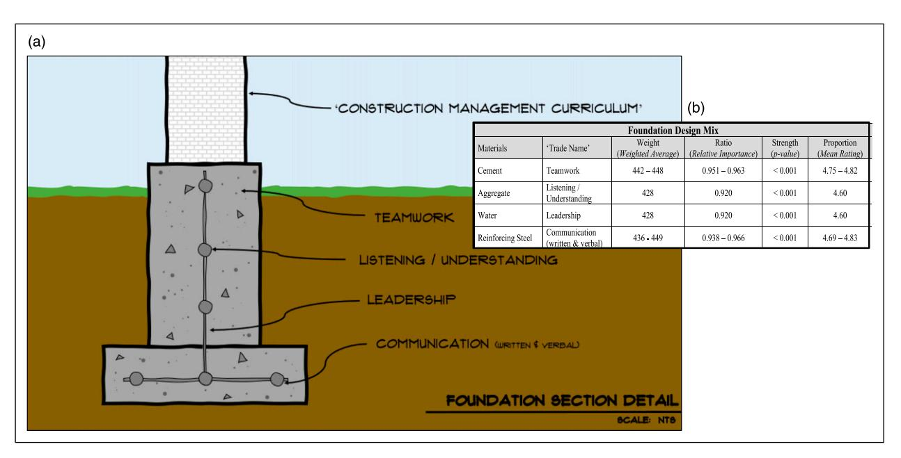

# Developing a proof-of-concept curriculum foundation model for industry 5.0: A primary data survey of built environment academics

Industry and Higher Education 2024, Vol. 38(5) 423–444 © The Author(s) 2024 Article reuse guidelines: [sagepub.com/journals-permissions](https://uk.sagepub.com/en-gb/journals-permissions) DOI: [10.1177/09504222231224090](https://doi.org/10.1177/09504222231224090) [journals.sagepub.com/home/ihe](https://journals.sagepub.com/home/ihe)

John J Posillico Birmingham City University, UK

# David J Edwards

Birmingham City University, UK; University of Johannesburg, South Africa

## Abstract

Purpose: Higher education curriculum development in the construction industry has historically received scant academic attention and often, courses/programmes are largely developed using the tacit knowledge of individual tutors. This research investigates the core interpersonal and technical skills and competencies required of a contemporary construction management graduate. Specifically, the work culminates in the development of a proof-of-concept model that could be incorporated into higher education curriculum development. Methodology: A mixed philosophical stance is implemented using both postpositivism and interpretivism together with inductive and abductive reasoning to examine built environment academics' perceptions of the phenomena under investigation. Descriptive and inferential statistics (i.e., weighted average, relative importance index, one sample t test, Chi-square test and Kruskal-Wallis test) are utilised to formulate a foundational set of core interpersonal skills for construction management curricula. Such knowledge provides a strong foundation for building an optimised course curriculum. Findings: Research findings demonstrate that, whilst technical skills are relatively important for the construction manager's role, they significantly pale in comparison to interpersonal skills. Furthermore, an aggregate ranking of skills and competencies suggests that a substantial number of interpersonal skills and competencies out-rank numerous technical skills and competencies. Surprisingly, digital-esque themes rank towards the bottom of the table, with 'traditional' skills competencies (i.e., workflow, budgeting and costing) ranking higher. Originality: This research constitutes the first attempt to: understand the core interpersonal and technical skills and competencies required of a contemporary construction manager; and premised upon this, generate a construction management education curriculum foundation model. Nascent findings pinpoint the core interpersonal skills and competencies that serve as the curriculum's foundation and expose the inadequacies of digital technical skills in core construction management teaching.

### Keywords

Construction management, curriculum development, industry 5.0, proof-of-concept model, statistical analysis, technical and interpersonal skills

# Introduction

His Majesty's Government (cf. [Rhodes, 2019\)](#page-20-0) states that the United Kingdom (UK) construction sector comprises around 343,000 companies (13% of UK businesses) which employs approximately 2.4 million individuals (7% of UK jobs). These companies and individuals are responsible for approximately £117 billion or 6% of the UK's economic output ([Rhodes, 2019](#page-20-0)). Moreover, the sector provides important socio-economic infrastructure (e.g., housing, roads, factories, amenities) that facilitates future economic growth and prosperity [\(Owusu-Manu et al., 2020](#page-20-1)). To augment sector performance, a drive towards digital innovations under the auspices of Industry 4.0 has dominated the contemporary discourse (cf. [Newman et al., 2020](#page-20-2)). Notable and prominent digital innovations such as building

Corresponding author:

John J Posillico, Department of Built Environment, Birmingham City University, Millennium Point, Curzon Street, Birmingham B4 7XG, UK. Email: [John.Posillico@bcu.ac.uk](mailto:John.Posillico@bcu.ac.uk)

information modelling (BIM) have been heralded as a panacea via which to streamline project management processes and procedures (cf. [Chan et al., 2019](#page-18-0); [Yin et al.,](#page-21-0) [2019\)](#page-21-0). Yet despite these technological advancements, construction managers remain in the vanguard of this national economic engine – ultimately responsible for a project's success (typically measured in terms of financial, safety, quality and schedule aspects) [\(Walker, 2015](#page-21-1)). Metaphorically, a construction manager constitutes the glue that holds construction team and project together ([Fewings, 2013](#page-18-1); [Harris et al., 2021\)](#page-19-0). Without the proper management and leadership of the complex teams responsible for project delivery, a project's success is severely jeopardised ([Nicholas and Steyn, 2021](#page-20-3)) – hence, the educational provision for construction managers can also be one of the requisite requirements to bolstering a nation's economy.

[Posillico et al. \(2022a\)](#page-20-4) highlighted that, whilst the current construction management curricula environment is largely fragmented and non-cohesive, there does remain a consensus that both interpersonal and technical skills are vital to a healthy curriculum that provides employable graduates. Furthermore, arguments supporting an industryinfused curriculum have been overwhelmingly supported by construction management courses that strive to engender a practice-based curriculum (cf. [Goulart et al., 2022\)](#page-19-1). This desire for training future generations of construction management practitioners has been bolstered by the UK government's modern apprentices programme which supports graduates to acquire a degree whilst in full-time employment [\(Mulkeen et al., 2017](#page-20-5)). A combination of governmental education initiatives, private financial initiatives (PFI) and public private partnerships (PPP) (such as the delivery of English hospitals procured under a PFI contract with a capital cost exceeding £50 million cf. [Adamou et al. \(2021\)](#page-18-2)) and a strong focus on increasing student employability have inevitably shaped the ensuing discourse within higher education institutions (HEIs) ([Doherty and Stephens, 2020;](#page-18-3) [Okolie et al., 2020\)](#page-20-6).

Against this prevailing landscape of a rapidly evolving and technologically advanced construction sector (and inextricably linked economic machinations that govern it), this research investigates the relevance and currency of modern construction management courses. Specifically, the research conducts descriptive and inferential statistical analyses of primary questionnaire data sourced from built environment academics to develop a proof-of-concept model of construction management curriculum foundation. Associated objectives are to: investigate the core interpersonal and technical skills and competencies required of a contemporary construction management graduate; formulate a foundational set of core interpersonal and technical skills for construction management curricula; and stimulate pathways for industry and academic informed, contemporary curriculum development research that augments graduate employability.

# Technology and the curriculum

Industry 4.0 can be characterised as a heighted presence and infiltration of digital technology, tools and information within the workplace [\(Javaid et al., 2022](#page-19-2)). Whilst the limelight of Industry 4.0 has traditionally been placed squarely in the manufacturing, engineering and computing realms, all industries have been impacted albeit to varying degrees. Higher education has also responded to Industry 4.0 by adjusting, modifying and rethinking how to incorporate the requisite skills into relevant educational provisions ([Gonz](#page-19-3)a[lez-P](#page-19-3) ´ [erez and Ram](#page-19-3) ´ ´ı[rez-Montoya, 2022;](#page-19-3) [Moraes et al., 2022\)](#page-20-7). Currently, Industry 5.0, which in response to the full throttle digital nature of Industry 4.0, has realised and reaffirmed the unwavering presence and interaction of people within industry ([Alves et al., 2023;](#page-18-4) [Golovianko et al., 2023](#page-19-4); [Hein-Pensel et al., 2023\)](#page-19-5). At the cusp of Industry 5.0 is the expectation that higher education's response to facilitate proper educational provision of students would be holistic in nature ([Broo et al., 2022;](#page-18-5) [Carayannis and Morawska-Jancelewicz, 2022\)](#page-18-6). That is, technological advancements are a tool that assist and enable construction stakeholders (e.g., designers, engineers, construction managers) to optimise the co-operative management of increasingly complex mega projects ([Ahuja et al.,](#page-18-7) [2009\)](#page-18-7). For example, at the forefront of recent prominent UK projects is the HS2 high speed rail infrastructure project which cost circa £115 billion ([Sergeeva and Zanello, 2018\)](#page-20-8). Towards the latter half of 2023, considerable modifications in the reduction of scope for the HS2 project were pursued due to cost and schedule overruns [\(His Majesty](#page-19-6)'s [Government, 2023\)](#page-19-6). For such projects, interpersonal skills and competencies remain quintessentially important in the management process ([Azim et al., 2010](#page-18-8)) and managers must remain the 'masters of technology' and not become enslaved by it (cf. [Edwards et al., 2017](#page-18-9)).

Given this rapid transition into a technologically advanced construction sector, curriculum development within HEIs has received increasing scrutiny and attention to ensure modernity and relevance of provisions (cf. [Co et al.,](#page-18-10) [2023;](#page-18-10) [Luo and Chan, 2022;](#page-19-7) [Shen et al., 2020;](#page-20-9) [Upsher et al.,](#page-20-10) [2022;](#page-20-10) [Xu et al., 2022\)](#page-21-2). Yet, this scrutiny remains at the institutional level and across the HEI sector a notable lack of connectivity between research conducted also exists [\(Posillico et al., 2021](#page-20-11)). This lack of a cohesive nucleus in the prevailing body of knowledge is further intensified by the strong prevailing academic notion of 'individualism and self' – where bespoke curriculum development prevails within an 'every person for themselves' mentality ([Hrivnak,](#page-19-8) [2019;](#page-19-8) [Trinter and Hughes, 2021](#page-20-12)). The same dispersed and detached sentiment is even more evident within a construction management curriculum development context (cf. [Posillico et al., 2022b\)](#page-20-13).

The successful delivery of curriculum rests firmly on the collective teaching expertise of academic staff. The scholarship of teaching and learning (SoTL) has increased its foothold in a wide range of academic disciplines as a valid and convincing form of scholarly work for educators [\(Van Dijk et al., 2020;](#page-21-3) [Weimer, 2006](#page-21-4); [Zeng, 2020](#page-21-5)). This work has explored questions about teaching strategies; student engagement, growth and learning; and other aspects of the teaching and learning process ([Hutchings et al., 2011;](#page-19-9) [Spooren et al., 2017](#page-20-14)). Akin to Industry 5.0, SoTL is a disruptive force in higher education by, at its very core, making clearer how to support and enhance students' learning [\(Tagg, 2003\)](#page-20-15). Higher education has witnessed a new SoTL biome, one characterised by new venues for making the work public – including journals and conferences – tools for doing SoTL and a vibrant community of scholars ([Steiner and Hakala, 2021\)](#page-20-16). No longer was SoTL the purview of faculty in schools of education. Rather, faculty from any discipline were invited to and recognised for their investigations into questions about teaching and students' learning – questions they could examine using the tools of inquiry of both disciplinary and interdisciplinary traditions ([Boyer, 2016](#page-18-11)). Despite the prominence of and increasing attention to SoTL in higher education, its presence across the spectrum of academic disciplines and professions is uneven, particularly in construction management education [\(Posillico et al., 2022b\)](#page-20-13). Any discipline disengaged from SoTL, risks utilising significantly outdated or ineffective educational theories and/or teaching strategies in the classroom [\(Neubauer et al., 2022\)](#page-20-17). Doing so would, in turn, leave a student with a grossly inadequate educational experience and lack of development in the skills needed to successfully navigate a career industry [\(Forrest et al., 2022\)](#page-19-10).

Cumulatively, the rapid technological developments within the construction industry and the drive towards SoTL across the HEI sector are shaping current curricular development. However, in a construction sector context the expansion of technology has been largely uncontrolled and construction schools and departments (notably in the UK but potentially globally) lack the finer nuances of a credible SoTL. In turn, this raises questions about the validity and appropriateness of current provisions and raises the need for a thorough review and introspection of courses for construction management graduates.

# Methodological approach

A mixed philosophical stance (using postpositivism and interpretivism) was implemented and abductive reasoning used to examine built environment academics' perceptions of professional skills required by construction management students. The purpose being to identify specific educational skills and competencies for incorporation into the higher education curriculum (cf. [Hughes et al., 2021](#page-19-11)). Interpretivism was used to ascertain the key development skills noted in construction management advertisements, whilst postpositivism was used to statistically analyse the results from a structured questionnaire survey. Abductive reasoning, which is a semi-hybrid approach where the researcher moves between inductive and deductive in a pragmatic way to establish a structure of how a phenomenon occurred ([Saunders et al., 2016\)](#page-20-18).

A three-tiered waterfall research approach is adopted ([Figure 1\)](#page-3-0). First, a structured questionnaire survey instrument was developed from the key professional development skills noted within UK construction/project manager job advertisements [\(Han et al., 2021;](#page-19-12) [Rakowska and De Juana-](#page-20-19)[Espinosa, 2021](#page-20-19)). Specifically, referencing construction industry publication company's rating and ranking indices (e.g., The Construction Index, Construction News, Construction Global and Construction Review Online), construction companies with a noteworthy impact (minimum construction revenue of £700 million, minimum of 1600 UK employees) were identified (frequency (f) = 10). The 10 companies in aggregate, according to their 2020/ 2021 Annual Reports, are responsible for £34.3 billion in global revenue and employ over 56,000 employees in the UK. Complete job advertisements for the role of 'Construction Manager' or 'Project Manager' were located within each of the companies' career/Human Resources portal. Questions posed utilised a closed Likert scale of 1 (not at all important) to 5 (very important) to collate primary quantitative data; the survey also included open-ended questions to collate primary qualitative data on the reasons for selections made. Second, the survey instrument was distributed to built environment academics (cf. [Ayodele and](#page-18-12) [Olaleye, 2021](#page-18-12); [Wang et al., 2021\)](#page-21-6). Finally, through a postpositivist lens, the results of the Likert-scale survey instrument were statistically analysed to develop a proof-ofconcept model of construction management curriculum development (CMCD) (cf. [Adepoju and Aigbavboa, 2020](#page-18-13); [Dharmapalan et al., 2021\)](#page-18-14).

# Questionnaire design

The questionnaire was divided into three key sections. Section one presented preliminary information such as the research background (to secure informed consent) and ethical statements. Specifically, participants were assured that: their information would remain strictly confidential (published in aggregate form) and not divulged or disseminated to any third party willingly or otherwise; all data would be securely stored and securely disposed of post publication; and participants could access the findings post publication (cf. [Fisher et al., 2018](#page-18-15); [Law et al., 2021\)](#page-19-13). Section

<!-- Image Description: This flowchart depicts a research methodology. It outlines questionnaire development using a 5-point Likert scale, distribution via specified channels (CIB, CNBR, ASC, LinkedIn), and subsequent statistical analysis. The analysis includes measures of central tendency, weighted average, relative importance index, interquartile range, and several hypothesis tests (one-sample t-test, Chi-square test, Kruskal-Wallis test). The process culminates in a proof-of-concept model. -->

Figure 1. Three-tier waterfall research process flow diagram.

two requested demographic information from participants (i.e., age range, role, years in academia, built environment course affiliation and years in industry), to ensure that only participants who were sufficiently knowledgeable and experienced, regards the phenomenon under investigation (i.e., selection criteria), participated in the research. Section three contained overall skill and competency ranking and ratings, as well as open-ended questions to elucidate further upon the rationale for their choices. The questions were based upon the aggregate analysis of extant literature (cf. [Posillico et al., 2021](#page-20-11); [Posillico et al., 2022a](#page-20-4)) and secondary data (i.e., UK construction management curriculum data and UK construction manager job advertisements). Cumulatively, this produced a list of core professional skills and competencies. The questionnaire comprised a total of frequency ( f ) = 28 questions ( f = 5 demographic, f = 18 Likert, f = 1 ranking and f = 4 open-ended).

The question limit was primarily based upon ease of use relative to the high-paced and high-demand nature of academia which, in turn, would help with obtaining a healthy response rate ([Yan et al., 2011](#page-21-7)). The style and user interface of the questions was also considered, primarily rating and ranking with open-ended question opportunities. This again, was utilised to dovetail with an academics' daily work constraints so that the survey could be completed quickly, easily and/or on a mobile device [\(Harrison et al.,](#page-19-14) [2019\)](#page-19-14). This strategy has been utilised by other researchers (cf. [Hassanain et al., 2022;](#page-19-15) [Pidgeon and Dawood, 2022;](#page-20-20) [Saleh and Bista, 2017\)](#page-20-21) – thus justifying this selection and method.

# Sample size determination, questionnaire administration and survey reliability

Utilising Cochran's Formula (n0): With an unknown population (p = .5), a confidence level of 95% (Z = z-score = 1.960) and a margin of error of 5% (e = 0.05), the needed sample size for the Likert-scale survey instrument is 385 construction professionals. Purposive sampling was utilised to identify academics in built environment disciplines who had sufficient knowledge and experience to comment upon curriculum design and development [\(Adabre et al., 2022](#page-18-16); [Jupp, 2006\)](#page-19-16). Specifically, the Cooperative Network of Building Researchers (CNBR), the Associated Schools of Construction (ASC), International Council for Research and Innovation in Building and Construction (CIB) and LinkedIn were utilised as the main platforms for the questionnaire's distribution due to their high membership concentrations of built environment academics. Electronic and online distribution of the survey was utilised to help reach a large population of knowledgeable respondents ([Harrison et al., 2019](#page-19-14)) and increase the likelihood of a higher response rate due to its user-friendliness and reliability ([Saleh and Bista, 2017](#page-20-21)). The online survey was open from 9 April 2022 to 25 May 2022.

At the time the questionnaire closed for responses, a total of 99 academic professionals had provided a response. After reviewing the responses for completeness, six were identified as incomplete and were removed from analysis. A final total of 93 surveys was noted. There is a discrepancy between the sample size goal ( f = 385) and the actual number of respondents. However, recent literature published does support similar research with a smaller sample size than the intended goal (cf. [Al Mawli et al., 2021;](#page-18-17) [Fatayer et al., 2021;](#page-18-18) [Shaharuddin et al., 2021](#page-20-22)). Moreover, a sample size of 93 is reflective of similar research conducted within construction management literature (cf. [Chithambo](#page-18-19) [et al., 2022](#page-18-19); [Folorunso, 2021;](#page-19-17) [Matin et al., 2021](#page-19-18)). Hence, it was decided that although imperfect, sufficient data had been collected via which to draw inference from the wider population of practicing construction management academics.

A survey scale is generally noted as reliable if the Cronbach's alpha value is >0.700 [\(Al-Emran and Shaalan,](#page-18-20) [2021](#page-18-20); [Belkhamza and Wafa, 2012](#page-18-21)). The Cronbach's alpha value, as calculated via IBM® SPSS Statistics v.28 (SPSS), for the present survey is 0.839, which is > 0.700. It can therefore be noted that the present survey is considered reliable. Both descriptive [e.g., mean, median and weighted average (WA)] and inferential statistical analyses were utilised on the data collected. Inferential statistics included: Relative Importance Index (RII); Interquartile Range; One Sample t test; Kruskal-Wallis Test; and Chi-Square Test.

# Results and analysis of Likert-scale survey instrument

The completed survey results were formatted from Jisc Online Surveys files to both Microsoft Excel and SPSS compatible files for statistical analysis.

# Demographics – overall

[Table 1](#page-5-0) displays the aggregate demographic data for the survey respondents and illustrates a good span of age ranges (not one age range dominates), breadth of academic standing (entry level to senior leadership), extensive industry experience (77.42% with more six plus years of experience) and strong focus on the construction management discipline (73.12% of respondents).

Specifically, 73.21% ( f = 68) of the survey respondents were aged between 35 and 64 years, with a similar spread between the three age-group bands: 35–44 years ( f = 20 or 21.51%), 45–54 years ( f = 24 or 25.81%) and 55–64 years ( f = 24 or 25.81%). Respondents aged 65 and over accounted for 11.83% ( f = 11) whilst respondents aged between 25 and 34 years accounted for 15.05% ( f = 14). These summary statistics demonstrate a sufficient respondent age range to complete the questionnaire and add informed knowledge. From an academic role standpoint (refer to [Table 1](#page-5-0)), the respondents predominately were in an Associate Professors/Professors role with 46.24% ( f = 43) with Assistant Lecturer/Lecturer the second most categorised with 29.03% ( f = 27). Senior Lecturers and Senior Leadership/Department Heads were a distant third and fourth with 17.20% ( f = 16) and 7.53% ( f = 7) respectively. The demographic profiles within this sample demonstrate a good breadth of academic standing, discipline knowledge and understanding; consequently, this strengthens confidence that knowledge imparted will be of value and use.

[Figure 2](#page-6-0) examines respondents' career background both from their time in academia and the construction industry. Slicing the questionnaire year range in half, a comparison of the percentages of respondents can occur. A 60%–40% split regarding years in academia is visible, with 60.22% ( f = 56) of the respondents falling within the first half of the year spectrum (0–14 years). For years in industry, a 23%–77% split is viable, with 77.42% ( f = 72) of the respondents falling within the second half of the year spectrum (6–10+). There is a strong industry practice tenure with a slightly less robust academic tenure within the respondents. From a broad view, this does appear reasonable as construction industry experience usually precedes academic experience.

# Demographics – specific academic role

Looking specifically at the 27 Assistant Lecturer/Lecturer respondents, the most frequently occurring age range was 25–34 years ( f = 11 or 40.74%) followed closely by 45– 54 years ( f = 8 or 29.63%). Around half of the respondents have spent 5 to 9 years in academia ( f = 13 or 48.15%) and 10+ years in the construction industry ( f = 14 or 51.85%). The construction management course of study is by far the most associated course with 70.37% ( f = 19) of respondents indicating such. For the 16 Senior Lecturers, the 45–54 and

| Keyword (root)                      | Options                                   |                                      |                                    |                                   |                                           |                                                    |
|-------------------------------------|-------------------------------------------|--------------------------------------|------------------------------------|-----------------------------------|-------------------------------------------|----------------------------------------------------|
| Age range                           | 18–24 0 (0.00%)                        | 25–34 14 (15.05%)                 | 35–44 20 (21.51%)               | 45–54 24 (25.81%)              | 55–64 24 (25.81%)                      | 65+ 11 (11.83%)                                 |
| Current role                        | Assist. Lecturer/Lecturer 27 (29.03%)  |                                      | Senior lecturer 16 (17.20%)  |                                   | Assoc. Professor/Professor 43 (46.24%) | Senior leadership/ Department head 7 (7.53%) |
| Years worked in academia         | 0–4 13 (13.98%)                        | 5–9 27 (29.03%)                   | 10–14 16 (17.20%)               | 15–19 12 (12.90%)              | 20–24 8 (8.60%)                        | 25+ 17 (18.28%)                                 |
| Course/ Programme affiliation | Construction management 68 (73.12%) | Quantity surveying 14 (15.05%) | Building surveying 2 (2.15%) | Civil engineering 6 (6.45%) | Architectural technology 2 (2.15%)  | Other 1 (1.08%)                                 |
| Years works in industry          | 0–2 9 (9.68%)                          |                                      | 3–5 12 (12.90%)                 |                                   | 6–9 10 (10.75%)                        | 10+ 62 (66.67%)                                 |

Table 1. Aggregate demographics of survey respondents.

The italics represents the frequency percentage.

55–64 years age ranges were both equally represented as the most frequent ( f = 5 or 31.25%). Likewise, the 25–34, 35– 44 and 65+ years age ranges were equally represented ( f = 2 or 12.50%). A total of six respondents have spent 5 to 9 years in academia ( f = 6 or 37.50%) with a quarter of the respondents ( f = 4 or 25.00%) spending <4 years. Six respondents ( f = 6 or 37.50%) had between 10 and 25+ years of academic experience. Three quarters ( f = 12 or 75.00%) had over 10 years of industry experience with all but one respondent indicating between 6 and 9 years of industry experience. Half of the respondents ( f = 8 or 50.00%) identified most closely with the construction management course of study with a fairly equal distribution spread throughout the remaining five course options ( f = 2 for Quantity Survey, Building Surveying and Architectural Technology; f = 1 for Civil Engineering and Other). Almost half ( f = 43 or 46.24%) of all survey respondents identified their role as either Associate Professor or Professor. Close to 80% (79.07% or f = 34) were within the 35–44, 45–54 and 55–64 years age bands. From time spent in academia, a very even spread across year ranges is evident. Specifically, 25+ years ( f = 11 or 25.58%), 10 to 14 and 15 to 19 ( f = 9 or 20.93%) each and 5 to 9 years ( f = 8 or 18.60%). In contrast, most respondents ( f = 30 or 69.77%) indicated 10+ years of construction industry experience. Likewise, the course which the respondents identified with (in terms their role within an academic institution) was 'construction management' ( f = 34 or 79.07%). Regards the Senior Leadership/Department Head role, this ranked as the lowest frequency of respondent identification ( f = 7). The age range for these respondents focused on 45–54 years and 55–65 years bands ( f = 3 or 42.86%) each. All respondents identified with the construction management course of study. Similarly, all respondents had over 10+ years in academia and all but one respondent had over 10+ years in the construction industry. From the above demographic statistical analysis, the respondents are very reflective of both academic and industry practice. The balance and spread of roles, ages and experiences of the respondents indicate a good distribution of knowledgeable academics at all levels of academia.

# Descriptive statistics for survey

Descriptive statistics are utilised to describe, contextualise and provide a high-level summary of basic features (e.g., measure of central tendency, frequency distribution) of the dataset ([Holcomb, 2017;](#page-19-19) [Lacort, 2014\)](#page-19-20). This type of analysis forms the basis for more advance inferential statistical analysis because it provides a general, broad-brush understanding of the dataset ([Holcomb, 2017\)](#page-19-19). For this research the mean, median and WA, along with general mathematics, such as variance and proportion, were the descriptive statistic methods utilised.

# Interpersonal skills and competencies

The mean and median values for each of the nine interpersonal skills and competencies questions were calculated and plotted in [Figure 3.](#page-7-0) All nine skills and competencies were within the 5.00 (very important) to 4.00 (important) mean and median range. Furthermore, 'very important' (5.00) and 'important' (4.00) ratings, in total, comprised 93.31% of the ratings given by the 93 respondents. Only 5.50% and 1.19% were given to ratings of 'neutral' (3.00) and 'low importance' (2.00). This suggests that overall, the spectrum of interpersonal skill and competencies was identified as being important to the role of construction management graduate.

Analysis of the interpersonal skills and competencies can also occur based on the respondents' current academic roles. [Figure 4](#page-7-1) illustrates that there is very little difference between the ratings given for each skill and competency based on the role of the respondent; all four roles appear to agree on the

<!-- Image Description: The image contains two bar charts showing respondent distributions. The top chart displays the number of respondents with varying years of experience in academia (0-4, 5-9, 10-14, 15-19, 20-24, 25+ years), split by a dashed line indicating 60.22% and 39.78% of the total. The bottom chart similarly presents the distribution of respondents based on their years in industry (0-2, 3-5, 6-9, 10+ years), showing 22.58% and 77.42% on either side of the dashed line. Both charts illustrate experience distributions across the two sectors. -->

Figure 2. Respondents time in academia and industry.

level of importance for the interpersonal skills and competencies. Specifically, the two largest rating differences, based on the four role categories for a skill/competency was 0.30 ('verbal communication') and 0.29 ('listening and understanding'), or just less than one third of a rating score. Elaborating further, this indicates that throughout academic positions/standings in HEIs, there is general agreement as to the level of importance of the interpersonal skills and competencies.

Utilising a WA, where the rating score is multiplied by the frequency of respondents selecting that specific rating score, a level of importance ranking can be visualised. As noted in [Table 2](#page-8-0), the top-rated interpersonal skill was 'verbal communication' (WA total = 449) with 'team management' an extremely close second (WA total = 448). The difference in WA totals between the top-rated skill to the sixth-rated skill was only 21 points. This indicates that the top six (66.67%) skills and competencies are closely knit

<!-- Image Description: The image displays a line graph comparing mean and median ratings of interpersonal skills' importance. The x-axis lists various skills (e.g., written communication, emotional intelligence). The y-axis shows a 1–5 rating scale (5 being "very important"). Two lines represent the mean (blue) and median (orange) ratings for each skill, illustrating the perceived importance of each skill among respondents. The graph's purpose is to visually present survey data on the relative importance of different interpersonal skills. -->

Figure 3. Mean and median values for interpersonal skills and competencies.

<!-- Image Description: The image is a line graph showing the ratings (1-5, 5 being very important) of various interpersonal skills/competencies by different academic ranks (Assistant Lecturer/Lecturer, Senior Lecturer, Associate Professor/Professor, Senior Leadership/Department Head). The graph highlights significant rating differences (deltas of 0.30 and 0.29) between certain ranks for specific skills, illustrating the perceived importance of these skills at different career stages within academia. -->

Figure 4. Ratings of interpersonal skills and competencies based on respondent role.

in terms of importance. There is a large void between the top six skills and competencies and the bottom three – 19 points from 6th ('authentic leadership' and 'listening and understanding') to 7th ('emotional intelligence'), 24 points from 7th ('emotional intelligence') to 8th ('empathy') and three points from 8th ('empathy') to 9th ('non-verbal communication'). It can be inferred that there is a general consensus of opinion regarding the importance and relevance of the top six interpersonal skills and competencies.

# Technical skills and competencies

The mean and median values for each of the nine technical skills and competencies questions were calculated and

|        | Verbal | communication | management Team |     | Team/Group work |     | communication Written/Typed |     | leadership Authentic |     | understanding Listening and |     | intelligence Emotional |     | Empathy |     | communication Non-verbal |     |
|--------|--------|---------------|--------------------|-----|--------------------|-----|--------------------------------|-----|-------------------------|-----|--------------------------------|-----|---------------------------|-----|---------|-----|-----------------------------|-----|
| Rating | f      | WA            | f                  | WA  | f                  | WA  | f                              | WA  | f                       | WA  | f                              | WA  | f                         | WA  | f       | WA  | f                           | WA  |
| 5      | 81     | 405           | 76                 | 380 | 71                 | 355 | 66                             | 330 | 60                      | 300 | 60                             | 300 | 43                        | 215 | 33      | 165 | 35                          | 175 |
| 4      | 9      | 36            | 17                 | 68  | 21                 | 84  | 25                             | 100 | 29                      | 116 | 29                             | 116 | 44                        | 176 | 43      | 172 | 39                          | 156 |
| 3      | 2      | 6             | 0                  | 0   | 1                  | 3   | 2                              | 6   | 4                       | 12  | 4                              | 12  | 6                         | 18  | 14      | 42  | 13                          | 39  |
| 2      | 1      | 2             | 0                  | 0   | 0                  | 0   | 0                              | 0   | 0                       | 0   | 0                              | 0   | 0                         | 0   | 3       | 6   | 6                           | 12  |
| 1      | 0      | 0             | 0                  | 0   | 0                  | 0   | 0                              | 0   | 0                       | 0   | 0                              | 0   | 0                         | 0   | 0       | 0   | 0                           | 0   |

| Weighted averages of interpersonal skills and competencies. |
|-------------------------------------------------------------|
|                                                             |
|                                                             |
|                                                             |
|                                                             |
|                                                             |
|                                                             |
| Table 2.                                                    |

plotted in [Figure 5.](#page-9-0) All nine skills and competencies were within the 5.00 to 3.00 mean and median. Corresponding the quantitative value to the indicated qualitative description, this ranged from 'neutral' to 'very important.' Just under 85% ( f = 79 or 84.95%) of the ratings for all nine skills and competencies range from 'neutral' to 'very important' (3.00 to 5.00). A rating of 'low importance' (2.00) comprised 12.31% and the lowest rating (1.00) which signifies no importance was noted 2.75%.

Analysis of the technical skills and competencies can also occur based on the respondents' role. As depicted in [Figure 6,](#page-10-0) there is a wide range of difference between the ratings given for some skills and competencies based on the respondents' role. Specifically, the two largest rating differences, based on the four role categories for a skill/ competency was 1.21 ('structural engineering') and 1.05 ('civil engineering'). Similarly, four additional skills and competencies depicted a smaller, yet still large, rating difference – 0.87 ('creating BIM'), 0.63 ('work sequence'), 0.57 ('interpreting BIM') and 0.40 ('digital technologies'). However, the four roles do appear to agree on the level of importance for some of the technical skills and competencies. Specifically, the three smallest rating differences, based on the four role categories for a skill/competency was 0.15 ('critical path method'), 0.30 ('estimating') and 0.34 ('budgeting and cost control'). This agreement may be because those three skills and competencies could be considered traditional, non-digital technical construction management aptitudes which suggests a possible preference for tenured skills rather than entrant skills. As noted in [Table 3](#page-10-1), the top-rated technical skill was 'budgeting/cost control' (WA total = 420) with 'work sequence' a close second (WA total = 416). The difference in WA totals between the five technical skills is around 13 – 15 points. However, there is an extremely large void between the fifthrated skill ('interpreting BIM') and the sixth-rated skill ('civil engineering') – 81 points. In summary, the top five skills are fairly dispersed in terms of importance and the respondents are in agreement regarding the bottom four technical skills.

# Inferential statistics

[Table 4](#page-11-0) notes the relative importance for each survey question. Of the 18 questions noting skills and competencies, 22.22% ( f = 4) fall below the threshold of 0.700 relative importance. Interestingly, the four skills and competencies that do not meet the RII threshold are all from the technical skills section of the questionnaire: 'creating BIM,' 'digital technologies,' 'structural engineering' and 'civil engineering.' This suggests that the spectrum of interpersonal skills have been deemed relatively important whilst some of the technical skills, as noted above, are considered less important to their counterparts.

[Table 5](#page-11-1) places the skills and competencies in order of relative importance. Only viewing the 14 skills and competencies that have a RII >0.700, two bands or groupings can be assigned. Specifically, Band 001 are the are seven skills and competencies that have a RII >0.900 (i.e., verbal communication, team management, team/group work, written/typed communication, authentic leadership, listening and understanding and budgeting/cost control).

<!-- Image Description: The image is a line graph showing the mean and median ratings of technical skills/competencies. The x-axis lists various skills (budgeting, estimating, BIM creation, etc.), and the y-axis represents a rating scale (1-5). Two lines plot mean and median importance ratings for each skill, indicating perceived importance in a context likely related to construction or engineering. The graph visually compares the relative importance of different technical skills according to the survey's mean and median responses. -->

Figure 5. Mean and median values for technical skills and competencies.

<!-- Image Description: The image displays a line graph comparing the perceived importance (rated 1-5) of various technical skills across four academic ranks (Assistant Lecturer/Lecturer, Senior Lecturer, Associate Professor/Professor, Senior Leadership/Department Head). The x-axis lists different technical skills (e.g., budgeting, BIM, structural engineering), while the y-axis represents the importance rating. The graph illustrates how the importance rating for each skill varies across different academic positions. -->

Figure 6. Ratings of technical skills and competencies based on respondent role.

|                    | Budgeting/ Cost control |     | Work sequence |     | Critical path method Estimating |     |    | BIM | Interpreting | Civil | engineering | Creating BIM |    | Digital | technologies | Structural | engineering |     |
|--------------------|-------------------------------|-----|------------------|-----|---------------------------------------|-----|----|-----|--------------|-------|-------------|-----------------|----|---------|--------------|------------|-------------|-----|
| Rating             | f                             | WA  | f                | WA  | f                                     | WA  | f  | WA  | f            | WA    | f           | WA              | f  | WA      | f            | WA         | f           | WA  |
| 5                  | 51                            | 255 | 51               | 255 | 44                                    | 220 | 30 | 150 | 27           | 135   | 9           | 45              | 6  | 30      | 8            | 40         | 8           | 40  |
| 4                  | 39                            | 156 | 36               | 144 | 38                                    | 152 | 50 | 200 | 44           | 176   | 31          | 124             | 26 | 104     | 27           | 108        | 23          | 92  |
| 3                  | 3                             | 9   | 5                | 15  | 7                                     | 21  | 12 | 36  | 19           | 57    | 23          | 69              | 36 | 108     | 30           | 90         | 28          | 84  |
| 2                  | 0                             | 0   | 1                | 2   | 4                                     | 8   | 1  | 2   | 3            | 6     | 25          | 50              | 22 | 44      | 21           | 42         | 26          | 52  |
| 1                  | 0                             | 0   | 0                | 0   | 0                                     | 0   | 0  | 0   | 0            | 0     | 5           | 5               | 3  | 3       | 7            | 7          | 8           | 8   |
| Total              |                               | 420 |                  | 416 |                                       | 401 |    | 388 |              | 374   |             | 293             |    | 289     |              | 287        |             | 276 |
| Difference between |                               |     | 4                |     | 15                                    |     | 13 |     | 14           |       | 81          |                 | 4  |         | 2            |            | 11          |     |

Table 3. Weighted averages of technical skills and competencies.

Band 002 are the remaining seven skills and competencies where their RIIs happen to fall between 0.900 and 0.800 (i.e., work sequencing, emotional intelligence, critical path method schedule, estimating, empathy, non-verbal communication and interpreting BIM). Similarly, the mean value for Band 001 falls above a score of 4.5 out of 5.0, while the mean rating value of Band 002 is from 4.5 to 4.0 out of 5.0. Furthermore, looking at the standard deviation (SD) values for each skill/competency, Band 001's SD values are below 0.6 and Band 002's SD values are from 0.6 to 0.88. The SD values of both Bands indicate, to a degree, that the ranking values are more bunched around the mean ranking value – with Band 001 having a better SD spread. Specifically, there are greater levels of agreement with less variability amongst the survey respondents, particularly regarding Band 001.

The interquartile range was also calculated for the mean rating scores for each question to give a deeper and richer summary statistical analysis of the data. The interquartile range was determined to be 0.58 (Q3 = 4.60 and Q1 = 4.02), which indicates that half of the rating scores fall with the range of 4.02 to 4.60. From this analysis, it can benoted that the data are skewed towards a higher rating of importance. Examining the entire set of 14 skills and competencies, there are nine interpersonal skills (100% of interpersonal skills) and five technical skills (55.56% of technical skills). Of

|                                        |    |    |    | Number of respondents selecting… |   |            |    |       |       |
|----------------------------------------|----|----|----|----------------------------------|---|------------|----|-------|-------|
| Question                               | 5  | 4  | 3  | 2                                | 1 | Total [ΣW] | N  | A *N | RII   |
| 6i – Written/Typed communication    | 66 | 25 | 2  | 0                                | 0 | 436        | 93 | 465   | 0.938 |
| 7i – Verbal communication           | 81 | 9  | 2  | 1                                | 0 | 449        | 93 | 465   | 0.966 |
| 8i – Non-verbal communication       | 35 | 39 | 13 | 6                                | 0 | 382        | 93 | 465   | 0.822 |
| 9i – Authentic leadership           | 60 | 29 | 4  | 0                                | 0 | 428        | 93 | 465   | 0.920 |
| 10i – Team management               | 76 | 17 | 0  | 0                                | 0 | 448        | 93 | 465   | 0.963 |
| 11i – Emotional intelligence        | 43 | 44 | 6  | 0                                | 0 | 409        | 93 | 465   | 0.880 |
| 12i – Team/Group work               | 71 | 21 | 1  | 0                                | 0 | 442        | 93 | 465   | 0.951 |
| 13i – Empathy                       | 33 | 43 | 14 | 3                                | 0 | 385        | 93 | 465   | 0.828 |
| – Listening and understanding 14i   | 60 | 29 | 4  | 0                                | 0 | 428        | 93 | 465   | 0.920 |
| 16t – Budgeting/Cost control        | 51 | 39 | 3  | 0                                | 0 | 420        | 93 | 465   | 0.903 |
| 17t – Estimating                    | 30 | 50 | 12 | 1                                | 0 | 388        | 93 | 465   | 0.834 |
| 18t – Creating BIM                  | 6  | 26 | 36 | 22                               | 3 | 289        | 93 | 465   | 0.622 |
| 19t – Interpreting BIM              | 27 | 44 | 19 | 3                                | 0 | 374        | 93 | 465   | 0.804 |
| 20t – Digital technologies          | 8  | 27 | 30 | 21                               | 7 | 287        | 93 | 465   | 0.617 |
| 21t – Structural engineering        | 8  | 23 | 28 | 26                               | 8 | 276        | 93 | 465   | 0.594 |
| 22t – Civil engineering             | 9  | 31 | 23 | 25                               | 5 | 293        | 93 | 465   | 0.630 |
| 23t – Critical path method schedule | 44 | 38 | 7  | 4                                | 0 | 401        | 93 | 465   | 0.862 |
| 24t – Work sequencing               | 51 | 36 | 5  | 1                                | 0 | 416        | 93 | 465   | 0.895 |

Table 4. Relative importance index for survey questions.

i = interpersonal, t = technical.

Table 5. Relative importance index for survey questions – ranked.

|                                                                                   |          | Number of respondents selecting… |    |    |   |            |    |       |       |      |       |
|-----------------------------------------------------------------------------------|----------|-------------------------------------|----|----|---|------------|----|-------|-------|------|-------|
| Question                                                                          | 5        | 4                                   | 3  | 2  | 1 | Total [ΣW] | N  | A* N | RII   | Mean | SD    |
| 7i – Verbal communication                                                      | 81       | 9                                   | 2  | 1  | 0 | 449        | 93 | 465   | 0.966 | 4.83 | 0.503 |
| 10i – Team management                                                          | 76       | 17                                  | 0  | 0  | 0 | 448        | 93 | 465   | 0.963 | 4.82 | 0.389 |
| 12i – Team/Group work                                                          | 71       | 21                                  | 1  | 0  | 0 | 442        | 93 | 465   | 0.951 | 4.75 | 0.458 |
| 6i – Written/Typed communication                                               | 66       | 25                                  | 2  | 0  | 0 | 436        | 93 | 465   | 0.938 | 4.69 | 0.510 |
| 9i – Authentic leadership                                                      | 60       | 29                                  | 4  | 0  | 0 | 428        | 93 | 465   | 0.920 | 4.60 | 0.574 |
| – Listening and understanding 14i                                              | 60       | 29                                  | 4  | 0  | 0 | 428        | 93 | 465   | 0.920 | 4.60 | 0.574 |
| 16t – Budgeting/Cost control                                                   |          | 39                                  | 3  | 0  | 0 | 420        | 93 | 465   | 0.903 | 4.52 | 0.564 |
| 24t – Work sequencing                                                          |          | 36                                  | 5  | 1  | 0 | 416        | 93 | 465   | 0.895 | 4.47 | 0.653 |
| 11i – Emotional intelligence                                                   | 51 43 | 44                                  | 6  | 0  | 0 | 409        | 93 | 465   | 0.880 | 4.40 | 0.610 |
| 23t – Critical path method schedule                                            | 44       | 38                                  | 7  | 4  | 0 | 401        | 93 | 465   | 0.862 | 4.31 | 0.794 |
| 17t – Estimating                                                               | 30       | 50                                  | 12 | 1  | 0 | 388        | 93 | 465   | 0.834 | 4.17 | 0.686 |
| 13i – Empathy – Non-verbal communication 8i 19t – Interpreting BIM |          | 43                                  | 14 | 3  | 0 | 385        | 93 | 465   | 0.828 | 4.14 | 0.788 |
|                                                                                   |          | 39                                  | 13 | 6  | 0 | 382        | 93 | 465   | 0.822 | 4.11 | 0.878 |
|                                                                                   |          | 44                                  | 19 | 3  | 0 | 374        | 93 | 465   | 0.804 | 4.02 | 0.794 |
| – Civil engineering 22t                                                        | 27 9  | 31                                  | 23 | 25 | 5 | 293        | 93 | 465   | 0.630 | 3.15 | 1.093 |
| 18t – Creating BIM                                                             | 6        | 26                                  | 36 | 22 | 3 | 289        | 93 | 465   | 0.622 | 3.11 | 0.949 |
| 20t – Digital technologies                                                     | 8        | 27                                  | 30 | 21 | 7 | 287        | 93 | 465   | 0.617 | 3.09 | 1.080 |
| 21t – Structural engineering                                                   | 8        | 23                                  | 28 | 26 | 8 | 276        | 93 | 465   | 0.594 | 2.97 | 1.108 |

i = interpersonal, t = technical.

Band 001s seven skills and competencies all but one (85.71%) are interpersonal skills and of Band 002s seven skills and competencies, three (42.86%) are interpersonal skills.

# One sample t test and chi-square test

One Sample t tests were conducted on the 18 interpersonal and technical skills and competencies using a hypothesised mean (or test statistic) set to 3.50 [\(Ahmed et al., 2021\)](#page-18-22). The null hypothesis states that 'the mean value is not a statistically important skill/competency (H0:U=U0)' and the alternative hypothesis states that 'the mean value is a statistically important skill/competency (Ha:U>U0).' The One Sample t test results for the nine interpersonal skills and competencies are depicted in [Table 6](#page-12-0). All nine skills had mean values > the hypothesised mean (3.50) and the p-values for all skills/competencies is < 0.001 [indicating the probability of a set of observations would occur by random change (cf. [Hayter, 2012\)](#page-19-21)]. The null hypothesis (H0) is disproven for the nine interpersonal skills and competencies indicating that these are statistically significant. Furthermore, the One Sample t test results for the eight technical skills and competencies are noted in [Table 7.](#page-13-0) Five (55.56%) of the nine technical skills and competencies had mean values > the hypothesised mean (3.50). The remaining four (44.44%) skills and competencies had mean values < the hypothesised mean. The p-values for each skill/ competency were indicate a value of .001 to < .001. For the technical skills and competencies, the null hypothesis (H0) is disproven, indicating that these are statistically significant.

Because the data are non-parametric in distribution, that is, it is skewed rather than normally distributed, the parametric One Sample t test may not provide a suitable method of statistical analysis alone. Hence, a non-parametric

Table 6. One sample t test for interpersonal skills.

Chi-Square Test was conducted on the 18 skills and competencies and the results are noted in [Table 8.](#page-13-1) As depicted, the asymptotic significance, or p-value, for all 18 skills and competencies is < .001. This, in conjunction with the One Sample T-Tests confirms a statistical significance in the skills and competencies analysed.

# Kruskal-Wallis test

A non-parametric Kruskal-Wallis Test was conducted to determine if there was a difference in ratings of interpersonal and technical skills across several respondent variables. [Table 9](#page-14-0) reveals that there is not a significant difference in rating of interpersonal and technical skills and competencies across the respondents as regards: age, academic role, number of years in academia, number of years in industry and/or course affiliation. This signifies that the rating distribution for the interpersonal and technical skills and competencies are not significantly impacted by respondents' variables – the ratings are collectively aligned.

# Comparison between interpersonal and technical

[Figure 7](#page-14-1) overlayed the mean and median values for the 18 interpersonal and technical skills and competencies and clearly depicts a higher rating trend for interpersonal skills and competencies rather than technical skills and competencies.

[Table 10](#page-15-0) depicts the WAs for the 18 skills and competencies were placed in order from highest to lowest. Looking at the top 10 skills and competencies, based on WA, which also correspond to a weight average total of >400, seven are interpersonal skills (70.00%). The three technical skills and competencies within the top 10 fall into two categories: cost control and time control. Specifically, 'budgeting/cost control', 'work sequencing' and 'critical path method

|                                  | Test value = 3.50 |    |             |             |      |                 | 99% confidence interval of the difference |       |
|----------------------------------|-------------------|----|-------------|-------------|------|-----------------|-------------------------------------------------|-------|
| Question and skill/Competency    | t                 | Df | One-sided p | Two-sided p | Mean | Mean difference | Lower                                           | Upper |
| 6 – Written/Typed communication  | 22.454            | 92 | < .001      | < .001      | 4.69 | 1.188           | 1.05                                            | 1.33  |
| 7 – Verbal communication         | 25.476            | 92 | < .001      | < .001      | 4.83 | 1.328           | 1.19                                            | 1.47  |
| 8 – Non-verbal communication     | 6.673             | 92 | < .001      | < .001      | 4.11 | 0.608           | 0.37                                            | 0.85  |
| 9 – Authentic leadership         | 18.527            | 92 | < .001      | < .001      | 4.60 | 1.102           | 0.95                                            | 1.26  |
| 10 – Team management             | 32.689            | 92 | < .001      | < .001      | 4.82 | 1.317           | 1.21                                            | 1.42  |
| 11 – Emotional intelligence      | 14.185            | 92 | < .001      | < .001      | 4.40 | 0.898           | 0.73                                            | 1.06  |
| 12 – Team/Group work             | 26.367            | 92 | < .001      | < .001      | 4.75 | 1.253           | 1.13                                            | 1.38  |
| 13 – Empathy                     | 7.826             | 92 | < .001      | < .001      | 4.14 | 0.640           | 0.42                                            | 0.85  |
| 14 – Listening and understanding | 18.527            | 92 | < .001      | < .001      | 4.60 | 1.102           | 0.95                                            | 1.26  |

|                                    | Test value = 3.50 |    |             |             |      |                 | 99% confidence interval of the difference |       |
|------------------------------------|-------------------|----|-------------|-------------|------|-----------------|-------------------------------------------------|-------|
| Question and skill/Competency      | t                 | Df | One-sided p | Two-sided p | Mean | Mean difference | Lower                                           | Upper |
| 16 – Budget/Cost control           | 17.386            | 92 | < .001      | < .001      | 4.52 | 1.016           | 0.86                                            | 1.17  |
| 17 – Estimating                    | 9.453             | 92 | < .001      | < .001      | 4.17 | 0.672           | 0.49                                            | 0.86  |
| 18 – Creating BIM                  | 3.987             | 92 | < .001      | < .001      | 3.11 | 0.392           | 0.65                                            | 0.13  |
| 19 – Interpreting BIM              | 6.336             | 92 | < .001      | < .001      | 4.02 | 0.522           | 0.31                                            | 0.74  |
| 20 – Digital technologies          | 3.696             | 92 | < .001      | < .001      | 3.09 | 0.414           | 0.71                                            | 0.12  |
| 21 – Structural engineering        | 4.633             | 92 | < .001      | < .001      | 2.97 | 0.532           | 0.83                                            | 0.23  |
| 22 – Civil engineering             | 3.084             | 92 | .001        | .003        | 3.15 | 0.349           | 0.65                                            | 0.05  |
| 23 – Critical path method schedule | 9.864             | 92 | < .001      | < .001      | 4.31 | 0.812           | 0.60                                            | 1.03  |
| 24 – Work sequencing               | 14.380            | 92 | < .001      | < .001      | 4.47 | 0.973           | 0.80                                            | 1.15  |

## Table 7. One sample t test for technical skills.

Table 8. Chi-square test for interpersonal and technical skills.

| Question and skill/Competency          | Chi-square | Df | Asymp. Sig. (p-value) |
|----------------------------------------|------------|----|-----------------------|
| 6i – Written/Typed communication    | 67.806a    | 2  | < .001                |
| 7i – Verbal communication           | 192.892b   | 3  | < .001                |
| 8i – Non-verbal communication       | 33.925b    | 3  | < .001                |
| 9i – Authentic leadership           | 50.774a    | 2  | < .001                |
| 10i – Team management               | 37.430c    | 1  | < .001                |
| 11i – Emotional intelligence        | 30.258a    | 2  | < .001                |
| 12i – Team/Group work               | 83.871a    | 2  | < .001                |
| 13i – Empathy                       | 42.183b    | 3  | < .001                |
| 14i – Listening and understanding   | 50.744a    | 2  | < .001                |
| 16t – Budget/Cost control           | 40.258a    | 2  | < .001                |
| 17t – Estimating                    | 59.473b    | 3  | < .001                |
| 18t – Creating BIM                  | 41.462d    | 4  | < .001                |
| – Interpreting BIM 19t              | 37.538b    | 3  | < .001                |
| 20t – Digital technologies          | 24.366d    | 4  | < .001                |
| 21t – Structural engineering        | 20.817d    | 4  | < .001                |
| 22t – Civil engineering             | 26.409d    | 4  | < .001                |
| 23t – Critical path method schedule | 55.172b    | 3  | < .001                |
| 24t – Work sequencing               | 75.731b    | 3  | < .001                |

i = interpersonal, t = technical. a

0 cells (0.00%) have expected frequencies less than 5. The minimum expected cell frequency is 31.0.

b 0 cells (0.00%) have expected frequencies less than 5. The minimum expected cell frequency is 23.3.

c 0 cells (0.00%) have expected frequencies less than 5. The minimum expected cell frequency is 46.5.

d 0 cells (0.00%) have expected frequencies less than 5. The minimum expected cell frequency is 18.6.

schedule' are the three technical skills. Conversely, only two interpersonal skills and competencies are in the bottom eight – 'empathy' and 'non-verbal communication'. However, six (66.67%) of the technical skills and competencies are located within the bottom eight when ranked based on WA. This clearly demonstrates that interpersonal skills and competencies have a far greater level of importance to the role of the construction management student than technical skills and competencies. Furthermore, the skills and competencies, when ranked, provide a clear hierarchy of aptitudes that can be used during module and course curricula development.

# Proof-of-concept curriculum foundation model

The HEI and CMCD landscapes were previously conceptualised by [Posillico et al. \(2023\);](#page-20-23) this aforementioned research work illustrated that the CMCD lacks a cohesive

## Table 9. Kruskal-Wallis test results.

| Group                 | Null hypothesis                                         | Test statistic | Degree of freedom | Asymptotic sig.a, b (p value) | Decision on the null hypothesis |
|-----------------------|---------------------------------------------------------|-------------------|----------------------|----------------------------------|------------------------------------|
| Academic role         | The distribution of interpersonal skills is the same | 1.334a, b         | 3                    | 0.721                            | Retain                             |
|                       | The distribution of technical skills is the same     | 4.203a, b         | 3                    | 0.240                            | Retain                             |
| Age                   | The distribution of interpersonal skills is the same | 7.814a, b         | 4                    | 0.099                            | Retain                             |
|                       | The distribution of technical skills is the same     | 7.198a, b         | 4                    | 0.126                            | Retain                             |
| Years in academia  | The distribution of interpersonal skills is the same | 7.459a, b         | 5                    | 0.189                            | Retain                             |
|                       | The distribution of technical skills is the same     | 5.283a, b         | 5                    | 0.382                            | Retain                             |
| Years in industry  | The distribution of interpersonal skills is the same | 2.562a, b         | 3                    | 0.464                            | Retain                             |
|                       | The distribution of technical skills is the same     | 6.286a, b         | 3                    | 0.098                            | Retain                             |
| Course affiliation | The distribution of interpersonal skills is the same | 5.337a, b         | 5                    | 0.376                            | Retain                             |
|                       | The distribution of technical skills is the same     | 9.659a, b         | 5                    | 0.086                            | Retain                             |

a The test statistic is adjusted for ties.

b Multiple comparisons are not performed because the overall test does not show significant differences across samples.

<!-- Image Description: This bar chart displays mean and median ratings (1-5, 5 being very important) of technical and interpersonal skills for a construction context. The x-axis lists specific skills (e.g., budgeting, communication types). A vertical dashed line separates technical from interpersonal skills. The chart likely assesses the relative importance of different skill sets in the profession. The y-axis represents the importance rating. -->

Figure 7. Mean and median values overlay for interpersonal and technical skills and competencies.

body of knowledge and defined community of practice researching in this area. Consequently, an untested conceptual model was developed from the previous literature analyses which noted the internal and external factors influencing the curriculum and its development [\(Posillico](#page-20-4) [et al., 2022a](#page-20-4)). Metaphorically speaking, the stability and longevity of any structure is inextricably dependent upon its foundation; for a weak foundation yields a weak structure

| Rank | Question                               | Weighted average |
|------|----------------------------------------|------------------|
| 1    | 7i – Verbal communication           | 449              |
| 2    | 10i – Team management               | 448              |
| 3    | – Team/Group work 12i               | 442              |
| 4    | 6i – Written/Typed communication    | 436              |
| 5    | 9i – Authentic leadership           | 428              |
|      | 14i – Listening and understanding   |                  |
| 7    | 16t – Budgeting/Cost control        | 420              |
| 8    | 24t – Work sequencing               | 416              |
| 9    | 11i – Emotional intelligence        | 409              |
| 10   | 23t – Critical path method schedule | 401              |
| 11   | 17t – Estimating                    | 388              |
| 12   | 13i – Empathy                       | 385              |
| 13   | 8i – Non-verbal communication       | 382              |
| 14   | 19t – Interpreting BIM              | 374              |
| 15   | 22t – Civil engineering             | 293              |
| 16   | 18t – Creating BIM                  | 289              |
| 17   | – Digital technologies 20t          | 287              |
| 18   | 21t – Structural engineering        | 276              |

Table 10. Weighted averages of interpersonal and technical skills and competencies.

i = interpersonal, t = technical.

no matter how aesthetically pleasing or well-constructed. The same is true for construction management curriculum – it needs a solid foundation. Therefore, utilising the final ranked list of the interpersonal and technical skills and competencies of construction management graduates presented in this present research study (refer to [Table 11](#page-16-0)), a proof-of-concept model is presented (refer to [Figure 8\(a\)](#page-16-1)–[\(b\)\)](#page-16-1) – such work takes the previously developed conceptual model to the next 'statistical testing' stage of both iterative and deductive development. The model is characterised as a structural foundation section detail where the four key interpersonal skills ('communication,' 'teamwork,' 'leadership' and 'listening and understanding') represent the material components of the foundation and its mix design (e.g., aggregate, cement, water, reinforcing steel). Specifically, as the statistics in [Figure 8\(b\)](#page-16-1) note, these four key interpersonal skills and competencies represent the top four most important skills essential to the construction manager role and thus serve as the role's nucleus. Resting upon the foundation is the entirety of the construction management curriculum, which will be delineated in future research, but broadly includes the educational mission, strategic educational plan and the matrix of course modules, all which sit in an environment inundated with external and internal factors. Whilst many structural foundations lie hidden beneath the surface with the architectural splendour of the structure standing proudly, so too does this proof-of-concept model. The core interpersonal skills and competencies that comprise the foundation are hidden from view yet provide the critical heavy lifting for the conspicuous and present curriculum.

Regards the previously identified technical skills and competencies (refer to [Table 11\)](#page-16-0), whilst their importance to the construction manager role is lower than most of the interpersonal skills and competencies noted (refer to [Table 11\)](#page-16-0), they constitute an integral supporting curriculum role. Specifically, the technical skills and competencies find their home within the matrix of course modules – explicit modules where adequate attention is given to technical skills and competencies. For example, the technical 'structural engineering' subject matter came last across all skills and competencies, because construction managers only need an appreciation of the complex mathematics and principles involved to communicate effectively with a structural engineer who is ultimately responsible for such works. Essentially, the construction manager manages the delivery and assembly of the structured engineering works to the design created by the structural engineer. However, as the proof-of-concept model indicates, it is important to note that the appropriate educational provision for the technical skills cannot be achieved without the four inextricably linked interpersonal skills and competencies. For example, a student will be unable to grasp the holistic intricacies and concepts of construction process 'workflow and sequence' without complete comprehension of 'communication,' 'teamwork,' 'leadership' and 'listening and understanding.'

# Discussion

Several practical applications of the research results are apparent for construction management education. Initially, there is an overwhelmingly strong preference from academia for interpersonal skills and competencies (i.e., 'teamwork', 'communication', 'leadership' and 'listening/understanding') rather than more technically focused skills and competencies. Interestingly, there was notable lack of support for the importance of digital and building information modelling (BIM) skills and competencies. At face value, this finding is perplexing given that current construction management curricula within UK HEIs, have doubled down on a digital infused curriculum development. Perhaps this momentum for 'all things digital' is the result of a trickle-down effect from, not only the disjointed CMCD landscape, but the individualistic perceptions of senior/course leadership of what a modern curriculum 'should' be. More worrying could be the push to capitalise on a wealth of government grants and income streams that require a stronger digital presence within the HEI landscape? Anecdotal evidence suggests that this has created a situation where digital specialists are employed to teach on construction management courses but are then constrained by their limited knowledge of the practical

| Rank | Question                               | Weighted average (WA) | Relative importance index (RII) |
|------|----------------------------------------|-----------------------|---------------------------------|
| 1    | 7i – Verbal communication           | 449                   | 0.966                           |
| 2    | 10i – Team management               | 448                   | 0.963                           |
| 3    | 12i – Team/Group work               | 442                   | 0.951                           |
| 4    | 6i – Written/Typed communication    | 436                   | 0.938                           |
| 5    | 9i – Authentic leadership           | 428                   | 0.920                           |
| 6    | 14i – Listening and understanding   | 428                   | 0.920                           |
| 7    | 16t – Budgeting/Cost control        | 420                   | 0.903                           |
| 8    | 24t – Work sequencing               | 416                   | 0.895                           |
| 9    | 11i – Emotional intelligence        | 409                   | 0.880                           |
| 10   | 23t – Critical path method schedule | 401                   | 0.862                           |
| 11   | 17t – Estimating                    | 388                   | 0.834                           |
| 12   | 13i – Empathy                       | 385                   | 0.828                           |
| 13   | 8i – Non-verbal communication       | 382                   | 0.822                           |
| 14   | – Interpreting BIM 19t              | 374                   | 0.804                           |
| 15   | 22t – Civil engineering             | 293                   | 0.630                           |
| 16   | 18t – Creating BIM                  | 289                   | 0.622                           |
| 17   | 20t – Digital technologies          | 287                   | 0.617                           |
| 18   | 21t – Structural engineering        | 276                   | 0.594                           |

Table 11. Final ranked skills and competencies.

i = interpersonal, t = technical.

<!-- Image Description: The image contains a diagram (a) showing a concrete foundation with reinforcing steel, labeled with components representing teamwork, listening/understanding, leadership, and communication skills. A table (b) presents a "Foundation Design Mix" analyzing the relative importance of these skills using weighted averages, ratios, strength (p-value), and mean ratings. The diagram visually links the construction analogy to the skills' importance in a construction management curriculum. -->

Figure 8. (a)–(b): proof-of-concept model.

aspects of employment within the sector and cannot teach practice-based work (e.g., how to manage a project). Perhaps HEIs have gone too far in their estimation of the importance of digital in a management orientated curricular? Further work is required to explore these speculations in more detail and delineate the boundaries of digital teaching on a construction management course. Anecdotal evidence suggests that construction management students need to keep abreast of digital technologies only in order to adequately converse with colleagues (such as designers) who are more immersed in such technologies as well as read digital aids (such as plans, schedules/programmes and costings). However, some construction management professional bodies, such as the Chartered Institute of Building (CIOB) and the Royal Institution of Chartered Surveyors

(RICS), have begun to offer training and development courses focusing on interpersonal skills [\(Chartered Institute](#page-18-23) [of Building, 2023](#page-18-23); [Royal Institution of Chartered](#page-20-24) [Surveyors, 2023](#page-20-24)).

Higher education institution's fascination with digital technologies within the built environment disciplines ([Macchiarella and Smith, 2021](#page-19-22)) is in stark contrast to the humanistic, interpersonal skills and competencies preference noted within the research findings. With a prominent goal of student employability upon graduation [\(Jackson and](#page-19-23) [Tomlinson, 2021\)](#page-19-23), it is a concern how curricula are currently designed, implemented and promoted with little regard to not only the voice of the industry in which they are preparing students, but front-line, industry robust academics (cf. [Akdur, 2022](#page-18-24); [Jacobs and Lu, 2022\)](#page-19-24). With such lucrative short- and long-term employment offerings leading to an increased number of students enrolling in construction management courses ([Besne et al., 2021](#page-18-25) ´ ; [Khan et al., 2021](#page-19-25)), it is worrisome that the curricula currently in place are not only insufficient in the short-term but potentially fail to adequately meet the long-term character-building needs of construction management professionals (cf. [Posillico et al.,](#page-20-4) [2022a\)](#page-20-4). The proof-of-concept model offered provides a foundational slice of an overall construction management curriculum, upon which course content is built. Validation of this model is now needed to confirm agreement of the top interpersonal skills and competencies from the primary data and how these could be better integrated in HEI practice. More importantly, future work is now required to determine how practicing academics perceive the specific interpersonal skills as the core foundational element of construction management curricula and how they integrate such within their construction management modules and courses. In addition to validation, action research within various construction management courses is required to employ the lessons learnt from this present study in practice. A longitudinal case study may provide fruitful snippets of data to determine whether the application of theory developed and now tested will augment the employability of graduates within industry.

# Conclusions

Applying the analysis conducted in this paper, a proof-ofconcept model for the foundation of a construction management curriculum is developed. This research revealed that global built environment academics, with substantial industry experience, generally rate interpersonal skills and competencies as more important than technical skills and competencies for the role of construction manager. In fact, common interpersonal skills ('communication', 'leadership' and 'teamwork') were ranked pointedly higher in importance than more trendy and glitzy technical skills such as augmented reality, virtual reality and BIM. Therefore, it can be implicitly noted that, from an educational perspective, interpersonal skills and competencies are an essential or core aspect of a construction management degree course. This makes intuitive sense given that the role is focused on the 'management' of other construction stakeholders involved in a complex project's development. The proof-of-concept model bridges this void by providing a robust, structurally sound foundation for which to construct a bespoke curriculum. Through the development of this model, it is hoped that a central foundation of interpersonal skills and competencies for construction management curricula can be shared, not only for the modification of current education provision, but for the benefit of future construction management students.

Interpersonal skills and competencies are essential to the construction manager's role and thus, should be at the heart of construction management curricula. However, with HEI's fascination with technical skills, mainly digitally based skills, a dichotomy in educational provision is born. Academic introspection is required to re-think the lowest common denominator of construction management curricula – placing interpersonal skills and competencies at the core of the curriculum.

Successful graduate employability is an overarching factor for technically based educational programmes; graduates must have the requisite skill sets to contribute to their respective discipline. Previous research (cf. [Posillico](#page-20-4) [et al., 2022a](#page-20-4)) revealed that construction management education is currently misaligned with the essential core skills required of the profession – namely management. Managers need an appreciation of advanced technologies to be able to effectively communicate with other project team stakeholders, but applications of these technologies (such as BIM) are not required nor needed within the management remit. This skewed position not only impacts students but also negatively impacts their outlook of the profession and future employability within the sector. By challenging this current status quo, this present research hopes to engender wider polemic debate and discussion within both industry and academia, whilst also create a platform for future research work in this area.

# Declaration of conflicting interests

The author(s) declared no potential conflicts of interest with respect to the research, authorship, and/or publication of this article.

## Funding

The author(s) received no financial support for the research, authorship, and/or publication of this article.

### ORCID iDs

John J Posillico <https://orcid.org/0000-0003-4818-3670> David J Edwards <https://orcid.org/0000-0001-9727-6000>

#### References

- Adabre MA, Chan APC, Edwards DJ, et al. (2022) Evaluation of symmetries and asymmetries on barriers to sustainable housing in developing countries. Journal of Building Engineering 50: 104174. DOI: [10.1016/j.jobe.2022.104174](https://doi.org/10.1016/j.jobe.2022.104174).
- Adamou M, Kyriakidou N and Connolly J (2021) Evolution of public-private partnership: the UK perspective through a case study approach. International Journal of Organizational Analysis 29(6): 1455–1466. DOI: [10.1108/IJOA-08-2020-](https://doi.org/10.1108/IJOA-08-2020-2397) [2397.](https://doi.org/10.1108/IJOA-08-2020-2397)
- Adepoju OO and Aigbavboa C (2020) Assessing knowledge and skills gap for construction 4.0 in a developing economy. Journal of Public Affairs 21(3): e2264. DOI: [10.1002/pa.](https://doi.org/10.1002/pa.2264) [2264.](https://doi.org/10.1002/pa.2264)
- Ahmed H, Edwards DJ, Lai JHK, et al. (2021) Post occupancy evaluation of school refurbishment projects: multiple case study in the UK. Buildings 11(4): 169. DOI: [10.3390/](https://doi.org/10.3390/buildings11040169) [buildings11040169](https://doi.org/10.3390/buildings11040169).
- Ahuja V, Yang J and Shankar R (2009) Benefits of collaborative ICT adoption for building project management. Construction Innovation 9(3): 323–340. DOI: [10.1108/](https://doi.org/10.1108/14714170910973529) [14714170910973529](https://doi.org/10.1108/14714170910973529).
- Akdur D (2022) What does industry suggest to academia on software engineering education? In: Proceedings of the 7th international conference on computer science and engineering (UBMK), Diuarbakir, Turkey, 14–16 September 2022, 37–42. DOI: [10.1109/UBMK55850.2022.9919527.](https://doi.org/10.1109/UBMK55850.2022.9919527)
- Al Mawli B, Al Alawi M, Elazouni A, et al. (2021) Construction SMEs safety challenges in water sector in Oman. Safety Science 136: 105156. DOI: [10.1016/j.ssci.2020.105156.](https://doi.org/10.1016/j.ssci.2020.105156)
- Al-Emran M and Shaalan K (eds) (2021) Recent Advances in Technology Acceptance Models and Theories. Cham: Springer. ISBN 9783030649876.
- Alves J, Lima TM and Gaspar PD (2023) Is industry 5.0 a humancentred approach? A systematic review. Processes 11(1): 193. DOI: [10.3390/pr11010193](https://doi.org/10.3390/pr11010193).
- Ayodele TO and Olaleye A (2021) Flexibility decision pathways in the management of uncertainty in property development: experience from an emerging market. Journal of Financial Management of Property and Construction 26(3): 408–432. DOI: [10.1108/JFMPC-05-2020-0037.](https://doi.org/10.1108/JFMPC-05-2020-0037)
- Azim S, Gale A, Lawlor-Wright T, et al. (2010) The importance of soft skills in complex projects. International Journal of Managing Projects in Business 3(3): 387–401. DOI: [10.1108/](https://doi.org/10.1108/17538371011056048) [17538371011056048.](https://doi.org/10.1108/17538371011056048)
- Belkhamza Z and Wafa SA (2012) Measuring Organizational Information Systems Success: New Technologies and Practices. Hershey, PA: Business Science Reference. ISBN 9781466601710.

- Besne A, P ´ erez M ´ A, Necchi S, et al. (2021) A systematic review of ´ current strategies and methods for bim implementation in the academic field. Applied Sciences 11(12): 5530. DOI: [10.](https://doi.org/10.3390/app11125530) [3390/app11125530.](https://doi.org/10.3390/app11125530)
- Boyer EL (2016) Scholarship reconsidered: priorities of the professoriate. In: Drew M, Todd CR and John M (eds) Braxton and Associates. New edition. San Francisco, NC: Jossey-Bass. ISBN 9781118988305.
- Gürdür Broo D, Kaynak O and Sait SM (2022) Rethinking engineering education at the age of industry 5.0. Journal of Industrial Information Integration 25: 100311. DOI: [10.](https://doi.org/10.1016/j.jii.2021.100311) [1016/j.jii.2021.100311.](https://doi.org/10.1016/j.jii.2021.100311)
- Carayannis EG and Morawska-Jancelewicz J (2022) The futures of Europe: society 5.0 and industry 5.0 as driving forces of future universities. Journal of the Knowledge Economy 13: 3445–3471. DOI: [10.1007/s13132-021-00854-2.](https://doi.org/10.1007/s13132-021-00854-2)
- Chan DWM, Olawumi TO and Ho AML (2019) Perceived benefits of and barriers to Building Information Modelling (BIM) implementation in construction: the case of Hong Kong. Journal of Building Engineering 25: 100764. DOI: [10.1016/j.](https://doi.org/10.1016/j.jobe.2019.100764) [jobe.2019.100764.](https://doi.org/10.1016/j.jobe.2019.100764)
- Chartered Institute of Building (2023) CIOB academy. Available at: [https://www.ciobacademy.org/?s=people+skills&post\\_](https://www.ciobacademy.org/?s=people+skills&post_type=product&type_aws=true) [type=product&type\\_aws=true](https://www.ciobacademy.org/?s=people+skills&post_type=product&type_aws=true) (accessed 08 December 2023).
- Chithambo L, Tauringana V, Tingbani I, et al. (2022) Stakeholder pressure and greenhouses gas voluntary disclosures. Business Strategy and the Environment 31(1): 159–172. DOI: [10.1002/](https://doi.org/10.1002/bse.2880) [bse.2880](https://doi.org/10.1002/bse.2880).
- Co MJ, Hamadeh Kerbage S, Willetts G, et al. (2023) Students coping with change in higher education: an overview. Educational Research Review 38: 100508. DOI: [10.1016/j.](https://doi.org/10.1016/j.edurev.2023.100508) [edurev.2023.100508](https://doi.org/10.1016/j.edurev.2023.100508).
- Dharmapalan V, O'Brien WJ, Morrice D, et al. (2021) Assessment of visibility in industrial construction projects: a viewpoint from supply chain stakeholders. Construction Innovation 21(4): 782–799. DOI: [10.1108/CI-07-2020-0114](https://doi.org/10.1108/CI-07-2020-0114).
- Doherty O and Stephens S (2020) The cultural web, higher education and work-based learning. Industry and Higher Education 34(5): 330–341. DOI: [10.1177/0950422219879614.](https://doi.org/10.1177/0950422219879614)
- Edwards DJ, Parn EA, Love PED, et al. (2017) Research note: ¨ machinery, manumission, and economic machinations. Journal of Business Research 70: 391–394. DOI: [10.1016/j.](https://doi.org/10.1016/j.jbusres.2016.08.012) [jbusres.2016.08.012](https://doi.org/10.1016/j.jbusres.2016.08.012).
- Fatayer FA, Issa AZ and AbnemehDwikat MMAM (2021) Investigating the causes preventing the fulfilment of construction contract requirements. Engineering, Construction and Architectural Management 29: 2577. DOI: [10.1108/](https://doi.org/10.1108/ECAM-01-2021-0083) [ECAM-01-2021-0083.](https://doi.org/10.1108/ECAM-01-2021-0083)
- Fewings P (2013) Construction Project Management: An Integrated Approach. 2nd edition. Abingdon: Routledge. ISBN 9781136827617.
- Fisher L, Edwards DJ, Parn EA, et al. (2018) Building design for ¨ people with dementia: a case study of a UK care home. Facilities 36(7/8): 349–368. DOI: [10.1108/F-06-2017-0062.](https://doi.org/10.1108/F-06-2017-0062)

- Folorunso CO (2021) Analysis of effectiveness of wooden floor finishes in some residential buildings in Lagos, Nigeria. International Journal of Building Pathology and Adaptation 39(5): 756–765. DOI: [10.1108/IJBPA-11-2019-0100](https://doi.org/10.1108/IJBPA-11-2019-0100).
- Forrest J, Elnaem MH, Gleason SE, et al. (2022) White paper on the scholarship of teaching and learning: expanding the academic pharmacy promotion and tenure process. Pharmacy Education 22(4): 115–1112. DOI: [10.46542/PE.2022.224.](https://doi.org/10.46542/PE.2022.224.115122) [115122.](https://doi.org/10.46542/PE.2022.224.115122)
- Golovianko M, Terziyan V, Branytskyi V, et al. (2023) Industry 4.0 vs. Industry 5.0: Co-existence, transition, or a hybrid. Procedia Computer Science 217: 102–113. DOI: [10.1016/j.](https://doi.org/10.1016/j.procs.2022.12.206) [procs.2022.12.206.](https://doi.org/10.1016/j.procs.2022.12.206)
- Gonzalez-P ´ erez LI and Ram ´ ´ırez-Montoya MS (2022) Components of education 4.0 in 21st century skills frameworks: systematic review. Sustainability 14(3): 1493. DOI: [10.3390/](https://doi.org/10.3390/su14031493) [su14031493](https://doi.org/10.3390/su14031493).
- Goulart VG, Liboni LB and Cezarino LO (2022) Balancing skills in the digital transformation era: the future of jobs and the role of higher education. Industry and Higher Education 36(2): 118–127. DOI: [10.1177/09504222211029796.](https://doi.org/10.1177/09504222211029796)
- Han J, Kelley T and Knowles JG (2021) Factors influencing student STEM learning: self-efficacy and outcome expectancy, 21st century skills, and career awareness. Journal for STEM Education Research 4: 117–137. DOI: [10.1007/](https://doi.org/10.1007/s41979-021-00053-3) [s41979-021-00053-3](https://doi.org/10.1007/s41979-021-00053-3).
- Harris F, McCaffer R, Baldwin A, et al. (2021) Modern Construction Management. 8th edition. Chichester: John Wiley and Sons. ISBN 9781119488354.
- Harrison S, Henderson J, Alderdice F, et al. (2019) Methods to increase response rates to a population-based maternity survey: a comparison of two pilot studies. BMC Medical Research Methodology 19(65): 65. DOI: [10.1186/s12874-](https://doi.org/10.1186/s12874-019-0702-3) [019-0702-3.](https://doi.org/10.1186/s12874-019-0702-3))
- Hassanain MA, Sanni-Anibire MO and Mahmoud AS (2022) An assessment of users' satisfaction with a smart building on university campus through post-occupancy evaluation. Journal of Engineering Design and Technology. Advance online publication. DOI: [10.1108/JEDT-12-2021-0714.](https://doi.org/10.1108/JEDT-12-2021-0714)
- Hayter A (2012) Probability and Statistics for Engineers and Scientists. 4th edition. Boston: Brooks/Cole. ISBN 9781111827045.
- Hein-Pensel F, Winkler H, Brückner A, et al. (2023) Maturity assessment for Industry 5.0: a review of existing maturity models. Journal of Manufacturing Systems 66: 200–210. DOI: [10.1016/j.jmsy.2022.12.009](https://doi.org/10.1016/j.jmsy.2022.12.009).
- His Majesty's Government (2023) Press release: PM redirects HS2 funding to revolutionise transport across the North and Midlands. Available at: [https://www.gov.uk/government/](https://www.gov.uk/government/news/pm-redirects-hs2-funding-to-revolutionise-transport-across-the-north-and-midlands) [news/pm-redirects-hs2-funding-to-revolutionise-transport](https://www.gov.uk/government/news/pm-redirects-hs2-funding-to-revolutionise-transport-across-the-north-and-midlands)[across-the-north-and-midlands](https://www.gov.uk/government/news/pm-redirects-hs2-funding-to-revolutionise-transport-across-the-north-and-midlands) (accessed 08 December 2023).
- Holcomb ZC (2017) Fundamentals of Descriptive Statistics. Abingdon: Routledge. ISBN 9781884585050.

- Hrivnak GA (2019) The increasing importance of curriculum design and its implications for management educators. Journal of Management Education 43(3): 271–280. DOI: [10.](https://doi.org/10.1177/10525629188220) [1177/10525629188220.](https://doi.org/10.1177/10525629188220)
- Hughes B, Edwards DJ, Martek I, et al. (2021) Assessing the "clerk of works" role in delivering quality affordable housing: a UK case study. Smart and Sustainable Built Environment 11(4): 996. DOI: [10.1108/SASBE-01-2021-0015](https://doi.org/10.1108/SASBE-01-2021-0015).
- Hutchings P, Huber MT and Ciccone A (2011) The Scholarship of Teaching and Learning Reconsidered: Institutional Integration and Impact. San Francisco: Jossey-Bass. ISBN 9780470599082.
- Jackson D and Tomlinson M (2021) The relative importance of work experience, extra-curricular and university-based activities on student employability. Higher Education Research and Development 41(4): 1119–1135. DOI: [10.1080/](https://doi.org/10.1080/07294360.2021.1901663) [07294360.2021.1901663](https://doi.org/10.1080/07294360.2021.1901663).
- Jacobs F and Lu R (2022) An innovative teaching model: involvement of industry practitioners in the teaching of construction management curriculum. In: Proceedings of the ASEE annual conference and exposition, Minneapolis, MN, 26th - 29th June 2022. August 2022. [https://peer.asee.org/](https://peer.asee.org/40578) [40578](https://peer.asee.org/40578)
- Javaid M, Haleem A, Singh RP, et al. (2022) Understanding the adoption of Industry 4.0 technologies in improving environmental sustainability. Sustainable Operations and Computers 3: 203–217. DOI: [10.1016/j.susoc.2022.01.008.](https://doi.org/10.1016/j.susoc.2022.01.008)
- Jupp V (ed) (2006) The Sage Dictionary of Social Research Methods. London: Sage Publications. ISBN 9780761962977.
- Khan A, Sepasgozar S, Liu T, et al. (2021) Integration of BIM and immersive technologies for AEC: a scientometric-swot analysis and critical content review. Buildings 11(3): 126. DOI: [10.3390/buildings11030126](https://doi.org/10.3390/buildings11030126).
- Lacort MO (2014) Descriptive and Inferential Statistics – Summaries of Theory and Exercises Solved. Morrisville, NC: Lulu.com. ISBN 9781291885385.
- Law RCK, Lai JHK, Edwards DJ, et al. (2021) COVID-19: research directions for non-clinical aerosol-generating facilities in the built environment. Buildings 11(7): 282. DOI: [10.](https://doi.org/10.3390/buildings11070282) [3390/buildings11070282.](https://doi.org/10.3390/buildings11070282)
- Luo J and Chan CKY (2022) Qualitative methods to assess intercultural competence in higher education research: a systematic review with practical implications. Educational Research Review 37: 100476. DOI: [10.1016/j.edurev.2022.](https://doi.org/10.1016/j.edurev.2022.100476) [100476.](https://doi.org/10.1016/j.edurev.2022.100476)
- Macchiarella G and Smith E (2021) The push and pull of digital skills in mass media curriculum. Media Practice and Education 22(2): 124–135. DOI: [10.1080/25741136.2021.](https://doi.org/10.1080/25741136.2021.1874599) [1874599](https://doi.org/10.1080/25741136.2021.1874599).
- Martin H, Mohan N, Ellis L, et al. (2021) Exploring the role of PPE knowledge, attitude and correct practices in safety outcomes on construction sites. Journal of Architectural Engineering 27(4): 05021011. DOI: [10.1061/\(ASCE\)AE.1943-5568.](https://doi.org/10.1061/(ASCE)AE.1943-5568.0000501) [0000501](https://doi.org/10.1061/(ASCE)AE.1943-5568.0000501).

- Moraes EB, Kipper LM, Hackenhaar Kellermann AC, et al. (2022) Integration of Industry 4.0 technologies with Education 4.0: advantages for improvements in learning. Interactive Technology and Smart Education 20(1): 271. DOI: [10.1108/ITSE-](https://doi.org/10.1108/ITSE-11-2021-0201)[11-2021-0201](https://doi.org/10.1108/ITSE-11-2021-0201).
- Mulkeen J, Abdou HA, Leigh J, et al. (2017) Degree and Higher Level Apprenticeships: an empirical investigation of stakeholder perceptions of challenges and opportunities. Studies in Higher Education 44(2): 333–346. DOI: [10.1080/03075079.](https://doi.org/10.1080/03075079.2017.1365357) [2017.1365357](https://doi.org/10.1080/03075079.2017.1365357).
- Neubauer LC, Merzel C, Weist EM, et al. (2022) Realizing promising educational practices in academic public health: a model for the scholarship of teaching and learning. Frontiers in Public Health 9: 750682. DOI: [10.3389/fpubh.2021.](https://doi.org/10.3389/fpubh.2021.750682) [750682.](https://doi.org/10.3389/fpubh.2021.750682)
- Newman C, Edwards D, Martek I, et al. (2020) Industry 4.0 deployment in the construction industry: a bibliometric literature review and UK-based case study. Smart and Sustainable Built Environment 10(4): 557–580. DOI: [10.1108/SASBE-](https://doi.org/10.1108/SASBE-02-2020-0016)[02-2020-0016](https://doi.org/10.1108/SASBE-02-2020-0016).
- Nicholas JM and Steyn H (2021) Project Management for Engineering, Business and Technology. 6th edition. Abingdon: Routledge. ISBN 9780429297588.
- Okolie UC, Nwajiuba CA, Binuomote MO, et al. (2020) Career training with mentoring programs in higher education: facilitating career development and employability of graduate. Education + Training 62(3): 214–234. DOI: [10.1108/ET-04-](https://doi.org/10.1108/ET-04-2019-0071) [2019-0071](https://doi.org/10.1108/ET-04-2019-0071).
- Owusu-Manu D, Edwards DJ, Ghansah FA, et al. (2020) Assessing the policy provisions and institutional behavioral factors influencing rail infrastructure financing in developing countries. Journal of Infrastructure Systems 27(2): 05021004. DOI: [10.1061/\(ASCE\)IS.1943-555X.0000610](https://doi.org/10.1061/(ASCE)IS.1943-555X.0000610).
- Pidgeon A and Dawood N (2022) Verification and validation of a framework for collaborative BIM implementation, measurement and management (CIMM). Smart and Sustainable Built Environment 12(4): 847. DOI: [10.1108/SASBE-03-](https://doi.org/10.1108/SASBE-03-2022-0051) [2022-0051](https://doi.org/10.1108/SASBE-03-2022-0051).
- Posillico JJ, Edwards DJ, Roberts C, et al. (2021) Curriculum development in the higher education literature: a synthesis focusing on construction management programmes. Industry and Higher Education 36(4): 456–470. DOI: [10.1177/](https://doi.org/10.1177/09504222211044894) [09504222211044894.](https://doi.org/10.1177/09504222211044894)
- Posillico JJ, Edwards DJ, Roberts C, et al. (2022a) A conceptual construction management curriculum model grounded in scientometric analysis. Engineering, Construction and Architectural Management 30(3): 4143. DOI: [10.1108/ECAM-](https://doi.org/10.1108/ECAM-10-2021-0899)[10-2021-0899](https://doi.org/10.1108/ECAM-10-2021-0899).
- Posillico JJ, Stanislav T, Edwards DJ, et al. (2022b) Scholarship of teaching and learning for construction management education amidst the fourth industrial revolution: recommendations from a scientometric analysis. In: Proceedings of the world building congress 2022 - IOP conference series: Earth and Environmental Science (EES), Melbourne,

Australia, 27–30 June 2022. DOI: [10.1088/1755-1315/](https://doi.org/10.1088/1755-1315/1101/3/032022) [1101/3/032022](https://doi.org/10.1088/1755-1315/1101/3/032022).

- Posillico JJ, Edwards DJ, Roberts CJ, et al. (2023) Professional skills development: foundational curriculum skills and competencies of UK construction management programmes. Education + Training 65(5): 711–730. DOI: [10.1108/ET-10-](https://doi.org/10.1108/ET-10-2022-0402) [2022-0402](https://doi.org/10.1108/ET-10-2022-0402).
- Rakowska A and de Juana-Espinosa S (2021) Ready for the future? Employability skills and competencies in the twenty-first century: the view of international experts. Human Systems Management 40(5): 669–684. DOI: [10.](https://doi.org/10.3233/HSM-201118) [3233/HSM-201118.](https://doi.org/10.3233/HSM-201118)
- Rhodes C (2019) Construction Industry: Statistics and Policy. Westminster: House of Commons Library. [pdf] Briefing Paper 01432. Available at: [https://researchbrie](https://researchbriefings.files.parliament.uk/documents/SN01432/SN01432.pdf)fings.files. [parliament.uk/documents/SN01432/SN01432.pdf](https://researchbriefings.files.parliament.uk/documents/SN01432/SN01432.pdf) (accessed 15 January 2022).
- Royal Institution of Chartered Surveyors (2023) RICS academy. Available at: [https://academy.rics.org/secondary-category/](https://academy.rics.org/secondary-category/business-skills) [business-skills](https://academy.rics.org/secondary-category/business-skills) (accessed 08 December 2023).
- Saleh A and Bista K (2017) Examining factors impacting online survey response rates in educational research: perceptions of graduate students. Journal of Multidisciplinary Evaluation 13(29): 63–74.
- Saunders M, Lewis P and Thornhill A (2016) Research Methods for Business Students. 7th edition. Harlow: Pearson. ISBN 9781292016227.
- Sergeeva N and Zanello C (2018) Championing and promoting innovation in UK megaprojects. International Journal of Project Management 36(8): 1068–1081. DOI: [10.1016/j.](https://doi.org/10.1016/j.ijproman.2018.09.002) [ijproman.2018.09.002](https://doi.org/10.1016/j.ijproman.2018.09.002).
- Shaharuddin AB, Aminudin E, Zakaria R, et al. (2021) Adoption of construction industry 4.0 among small and medium sized contractor in Malaysia. AIP Conference Proceedings 2428: 060001. DOI: [10.1063/5.0071094](https://doi.org/10.1063/5.0071094).
- Shen J, Wu H, Reeves P, et al. (2020) The association between teacher leadership and student achievement: a meta-analysis. Educational Research Review 31: 100357. DOI: [10.1016/j.](https://doi.org/10.1016/j.edurev.2020.100357) [edurev.2020.100357](https://doi.org/10.1016/j.edurev.2020.100357).
- Spooren P, Vandermoere F, Vanderstraeten R, et al. (2017) Exploring high impact scholarship in research on student's evaluation of teaching (SET). Educational Research Review 22: 129–141. DOI: [10.1016/j.edurev.2017.09.001](https://doi.org/10.1016/j.edurev.2017.09.001).
- Steiner HH and Hakala CM (2021) What do SoTL practitioners need to know about learning? Teaching & Learning Inquiry 9(1): 79–85. DOI: [10.20343/teachlearninqu.9.1.7.](https://doi.org/10.20343/teachlearninqu.9.1.7)
- Tagg J (2003) The Learning Paradigm College. Bolton: Anker Publishing Company. ISBN 9781882982585.
- Trinter CP and Hughes HE (2021) Teachers as curriculum designers: inviting teachers into the productive struggle. RMLE Online 44(3): 1–16. DOI: [10.1080/19404476.2021.](https://doi.org/10.1080/19404476.2021.1878417) [1878417](https://doi.org/10.1080/19404476.2021.1878417).
- Upsher R, Nobili A, Hughes G, et al. (2022) A systematic review of interventions embedded in curriculum to improve

university student wellbeing. Educational Research Review 37: 100464. DOI: [10.1016/j.edurev.2022.100464](https://doi.org/10.1016/j.edurev.2022.100464).

- van Dijk EE, van Tartwijk J, van der Schaaf MF, et al. (2020) What makes an expert university teacher? A systematic review and synthesis of frameworks for teacher expertise in higher education. Educational Research Review 31: 100365. DOI: [10.](https://doi.org/10.1016/j.edurev.2020.100365) [1016/j.edurev.2020.100365](https://doi.org/10.1016/j.edurev.2020.100365).
- Walker A (2015) Project Management in Construction. 6th edition. Chichester: John Wiley and Sons. ISBN 9781118500408.
- Wang Y, Liu F, Zhang Y, et al. (2021) Surviving trust from conflict in the construction industry: an interaction between conflict handling behaviors, behavioral outcomes, conflict and trust. International Journal of Conflict Management 32(4): 648–672. DOI: [10.1108/IJCMA-11-2020-0189](https://doi.org/10.1108/IJCMA-11-2020-0189).
- Weimer M (2006) Enhancing Scholarly Work on Teaching and Learning: Professional Literature that Makes a Difference. San Francisco, NC: Jossey-Bass. ISBN 9780787973810.

- Xu X, Schonrock-Adema J, Jaarsma ADC, et al. (2022) A con- ¨ ducive learning environment in international higher education: a systematic review of research on students' perspectives. Educational Research Review 37: 100474. DOI: [10.1016/j.edurev.2022.100474.](https://doi.org/10.1016/j.edurev.2022.100474)
- Yan T, Conrad FG, Tourangeau R, et al. (2011) Should I stay or should I go: the effects of progress feedback, promised task duration, and length of questionnaire on completing web surveys. International Journal of Public Opinion Research 23(2): 131–147. DOI: [10.1093/ijpor/edq046](https://doi.org/10.1093/ijpor/edq046).
- Yin X, Liu H, Chen Y, et al. (2019) Building information modelling for off-site construction: review and future directions. Automation in Construction 101: 72–91. DOI: [10.1016/j.](https://doi.org/10.1016/j.autcon.2019.01.010) [autcon.2019.01.010.](https://doi.org/10.1016/j.autcon.2019.01.010)
- Zeng LM (2020) Peer review of teaching in higher education: a systematic review of its impact on the professional development of university teachers from the teaching expertise perspective. Educational Research Review 31: 100333. DOI: [10.1016/j.edurev.2020.100333.](https://doi.org/10.1016/j.edurev.2020.100333)
