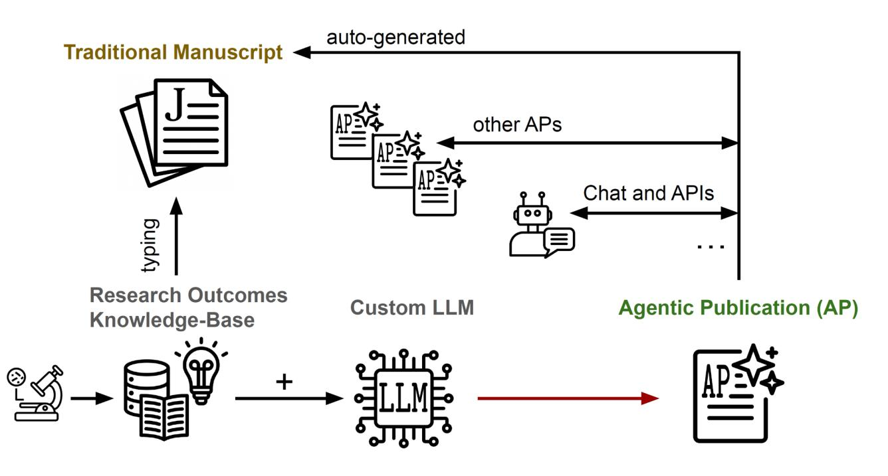
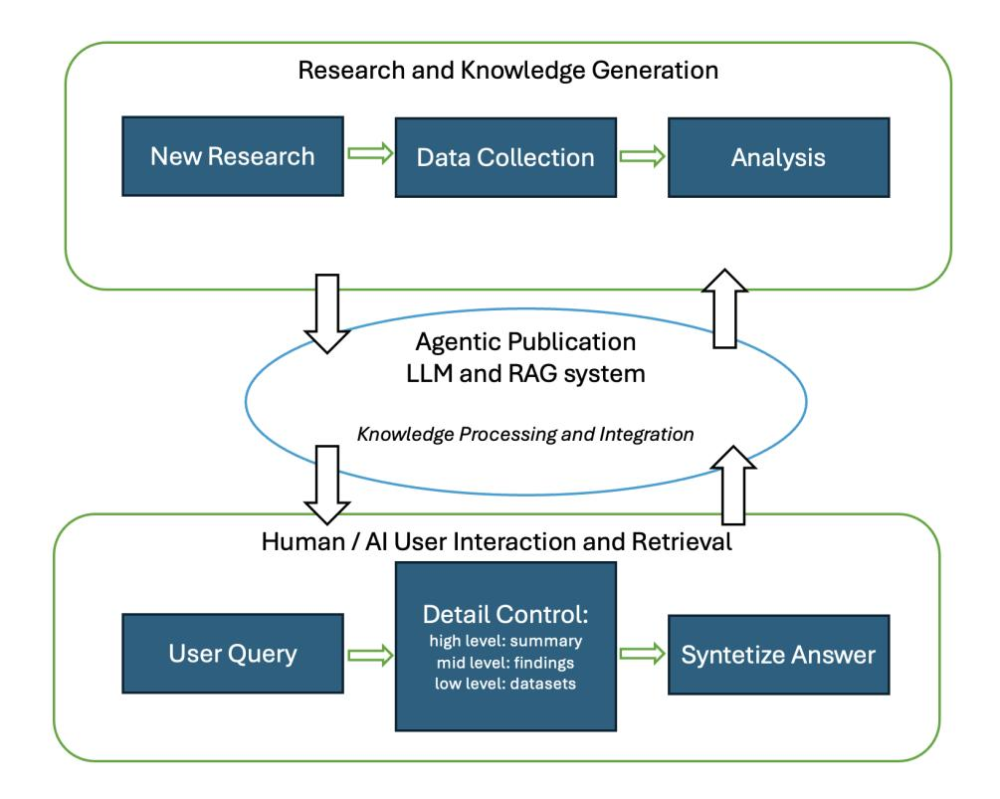
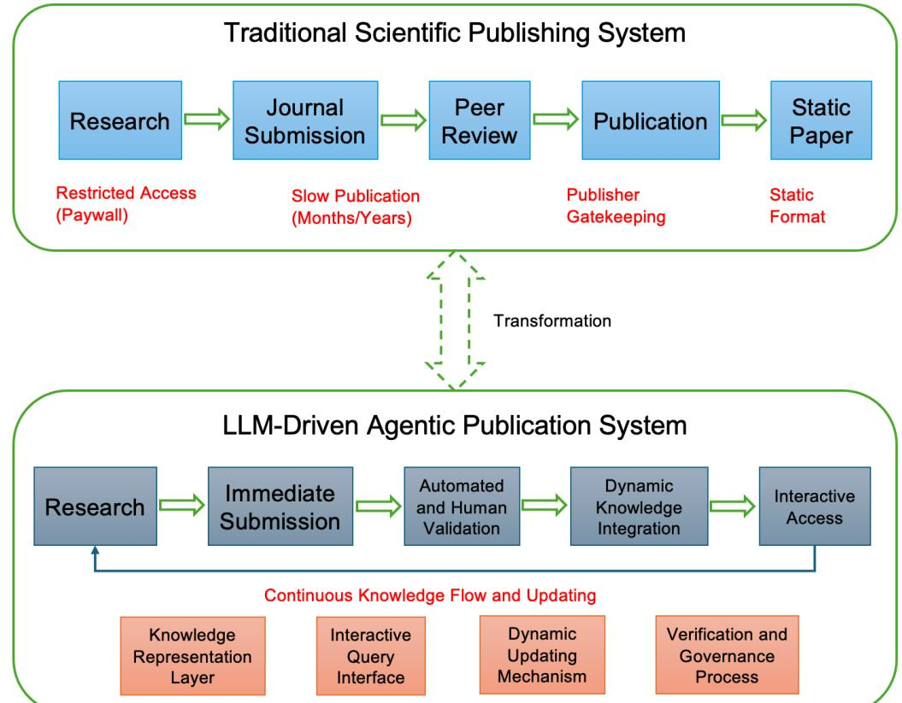

# Agentic Publications: An LLM-Driven Framework for Interactive Scientific Publishing, Supplementing Traditional Papers with AI-Powered Knowledge Systems

Roberto Pugliese <sup>a</sup> , George Kourousias <sup>b</sup> , Francesco Venier <sup>c</sup> , Grazia Garlatti Costa <sup>d</sup> \*<sup>a</sup> Elettra - Sincrotrone Trieste S.C.p.A & MIB Trieste School of Management

Elettra - Sincrotrone Trieste S.C.p.A:*Strada Statale 14 - km 163,5 in AREA Science Park 34149 Basovizza, Trieste, Italy*MIB Trieste School of Management:*Largo Caduti di Nassiriya, 1, 34142 Trieste, Italy*<sup>b</sup> Elettra - Sincrotrone Trieste S.C.p.A Elettra - Sincrotrone Trieste S.C.p.A:*Strada Statale 14 - km 163,5 in AREA Science Park 34149 Basovizza, Trieste, Italy*<sup>c</sup> DEAMS, Università degli Studi di Trieste & MIB Trieste School of Management DEAMS, Università degli Studi di Trieste:*Via Alfonso Valerio, 4/1, 34127 Trieste*MIB Trieste School of Management:*Largo Caduti di Nassiriya, 1, 34142 Trieste, Italy*

<sup>d</sup> \*corresponding author https://orcid.org/0000-0001-9093-6942

grazia.garlatticosta@units.it DEAMS, Università degli Studi di Trieste & MIB Trieste School of Management DEAMS, Università degli Studi di Trieste: *Via Alfonso Valerio, 4/1, 34127 Trieste*MIB Trieste School of Management:*Largo Caduti di Nassiriya, 1, 34142 Trieste, Italy*## Agentic Publications: An LLM-Driven Framework for Interactive Scientific Publishing, Supplementing Traditional Papers with AI-Powered Knowledge Systems

## Abstract

The exponential growth of scientific literature creates significant challenges for researchers navigating the knowledge landscape. We introduce the concept of "Agentic Publications", a novel LLM-driven framework that complements traditional scientific publishing by transforming papers into interactive knowledge systems. Our architecture integrates structured data (knowledge graphs, metadata) with unstructured content (text, multimedia) through retrieval-augmented generation and multi-agent verification, enabling responsive knowledge synthesis while maintaining scientific rigor. The proposed framework provides tailored interfaces for both humans and artificial agents, offering narrative explanations alongside machine-readable outputs. Ethical considerations are addressed through automated validation, expert oversight, and transparent governance. The system enables dynamic updating of knowledge, automatic synthesis of new findings with existing literature, and customizable detail levels - from high-level summaries to granular datasets. Our proof-of-concept demonstration showcases multilingual interaction, API accessibility, continuous knowledge flow, and structured knowledge representation. Implementation leverages vector databases for semantic search, knowledge graphs for structured reasoning, and verification agents that collaborate to ensure accuracy. Agentic Publications serves as a powerful companion that augments scientific communication across disciplines, creating a more efficient, accessible, and collaborative research ecosystem while preserving traditional publishing pathways. This approach is particularly valuable in interdisciplinary fields where transparency and knowledge integration present ongoing challenges, offering potential transformative benefits for both natural and social sciences.

## Keywords

Agentic Publications; LLM-driven framework; scientific publishing; knowledge systems; retrievalaugmented generation; multi-agent verification; interactive knowledge dissemination.

## Highlights

- Agentic Publications transforms static scientific papers into dynamic, interactive knowledge systems powered by large language models
- The architecture combines structured and unstructured data with retrieval-augmented generation and multi-agent verification processes
- The framework provides distinct interfaces for humans and artificial agents, enabling both narrative explanations and machine-readable outputs
- Ethical considerations are addressed through automated validation, expert oversight, and transparent governance principles
- A proof-of-concept demonstrates practical implementation while preserving compatibility with traditional scientific publishing workflows

## 1. Introduction

Modern scientific publishing, centered on peer-reviewed journal articles, has driven knowledge dissemination for centuries. However, there is growing recognition that the traditional model is strained and increasingly inadequate (Hughes and Van Heerden, 2024). Researchers encounter access restrictions through subscription-based articles (particularly challenging in resource-constrained environments), publication delays resulting from thorough peer review processes (Doskaliuk et al., 2025) and formatting requirements, and concentration of publishing channels among a limited number of established publishers (Hughes and Van Heerden, 2024). These inefficiencies delay the spread of new findings and can even shape what research is pursued or visible, as publication bias and editorial priorities filter what enters the public domain (Hughes and Van Heerden, 2024). Efforts like openaccess journals, preprint servers, and post-publication peer review have begun to address some issues (Hughes and Van Heerden, 2024). Yet the fundamental format – static documents written*for humans to read*– has remained unchanged since the 17th century, even as the volume of literature grows exponentially and becomes impossible for any individual to fully process, let alone absorb it (Hu et al., 2024; Bucur et al., 2022). This is particularly relevant in interdisciplinary social science fields where researchers must stay abreast of literature from various sub-disciplines. In essence, we continue to utilize a traditional dissemination framework that faces challenges in meeting the requirements of contemporary research environments, presenting anachronistic constraints related to review timelines and access limitations.

Meanwhile, advances in artificial intelligence and particularly large language models (LLMs) offer a tantalizing opportunity to reimagine how scientific knowledge is shared. Since the release of ChatGPT in late 2022, awareness and use of LLMs in academia have surged from a niche curiosity to mainstream: a recent survey found that 80% of scientists had used AI chatbots like ChatGPT in their work (Jen and Salam, 2024; Daykan and O'Reilly, 2023; Hughes and Van Heerden, 2024). Initial debates focused on using LLMs as writing assistants to polish or generate papers, raising concerns about plagiarism and accuracy (Lin, 2023; Hughes and Van Heerden, 2024). However, researchers now look beyond AI-assisted writing toward more transformative possibilities (Ahaley et al., 2023; Jen and Salam, 2024; Daykan and O'Reilly, 2023). In particular, some authors claim that nextgeneration LLMs (guided by human experts) could radically disrupt the entire scientific inquiry and knowledge-sharing system, effectively replacing conventional journals and papers (Ahaley et al., 2023; Hughes and Van Heerden, 2024). Instead of engaging solely with static documents, researchers and interested stakeholders could interact with dynamic knowledge repositories that integrate published findings and provide contextual information responsively. For social scientists, this might include upto-date economic indicators, policy analyses, and management research syntheses, enabling more informed decision-making through timely access to relevant knowledge. Similarly, natural scientists could benefit from real-time integration of experimental results across laboratories, creating opportunities for accelerated discovery through improved knowledge coordination. In this vision, the traditional paper could soon appear "as outdated as telegrams and fax machines" (Hughes and Van Heerden, 2024).

Building upon these opportunities and addressing the gaps in scientific dissemination, in this article, we propose an LLM-powered architecture as a potential complement to the traditional scientific paper for broader and more dynamic knowledge co-creation and dissemination, with implications across scientific disciplines, including both, natural and social sciences. Our goal is outlining a system – composed of large language models and intelligent agents – that can support scientists to create, store, process, and interactively disseminate scientific knowledge on demand. We outline the structure of this system, including its core components (knowledge representation, query interface, updating and verification modules), a potential technology stack, and implementation strategies. We also discuss how the system can present information differently to human users versus artificial agents, and examine the ethical implications of entrusting scientific knowledge to AI. By detailing this architecture and its feasibility, we aim to illustrate a path toward a more accessible, up-to-date, and interactive model of scientific communication (Hughes and Van Heerden, 2024) – open and responsive, benefiting researchers and society in ways the static journal article alone cannot.


<!-- Image Description: This flowchart depicts an agential publication (AP) system. Research outcomes are input into a custom large language model (LLM), which generates an AP. The AP interacts with other APs via chat and APIs. This contrasts with traditional manuscript creation via typing, highlighting the automated nature of AP generation. The diagram uses icons to represent data sources, processes (LLM), and outputs (APs), showing the workflow from research to publication. -->
***Figure 1:** Simplified overview of how research outcomes yield in a traditional manuscript and an Agentic Publication (AP). The knowledge-base without traditionally structured text is coupled with a suitable AP LLM taking into account the AP properties described in this manuscript (red arrow) resulting in an AP. APs can be used for basic "chat with your paper" but also provide APIs for computational access (inc. to the data). APs can interact with other APs but also auto-generate print-ready versions of traditional manuscripts.*## 2. Proposed System Architecture

## *2.1 System Architecture Overview*The proposed system is centered on a large language model continually enriched with scientific findings. We have named this concept "Agentic Publication" as it includes features typical of AI agents and because it may be more suitable to be used by AI agents that support at least part of the scientific research process. Figure 1 provides a conceptual overview of how such a system would function, encompassing the flow of new research information into the model and the process of querying that knowledge base for answers.

At a high level, the architecture consists of several interacting components: (1) a*Knowledge Representation Layer*to store scientific information in both human-readable and machine-interpretable forms, accommodating the diverse data types and disciplinary needs, of natural and social sciences; (2) an*Interactive Query Interface*(e.g. API, chat or voice-based) through which human or AI users pose questions and receive explanations or data; (3)*Dynamic Updating Mechanisms* that stimulated by query log analysis may ingest new findings (experimental results, datasets, analyses) into the system dynamically; and (4*) Verification and Governance Processes*to ensure the quality, credibility, and ethical integrity of the knowledge base. These components are supported by an underlying technology stack incorporating advanced LLMs, agents, databases, and integration APIs. In the following subsections, we describe each element in detail and suggest how it can be implemented using current technologies.

### *2.2 Knowledge Representation Layer*A foundational element of the architecture is how scientific knowledge, across diverse domains, is represented and stored internally. Unlike a traditional paper (unstructured text aimed at human readers), this system requires representations suitable for both LLM and direct algorithm consumption, accommodating the varied data and methodologies of different scientific fields.

We propose a hybrid knowledge store built on multiple**complementary components**that work together as an integrated system. At its foundation lies**unstructured content**comprising the full text of research findings, including methodology descriptions, observations, and results, along with associated artifacts such as figures, tables, and datasets. This comprehensive approach preserves the richness of detail essential for scientific understanding. The content is indexed in a vector database for semantic search, enabling the LLM to retrieve relevant passages when answering questions. Unlike traditional keyword approaches, semantic indexing captures conceptual relationships even when terminology differs (Hughes and Van Heerden, 2024). Each knowledge entry carries important metadata including authors, publication date, and domain keywords to provide essential context.

Working in parallel with this unstructured foundation,**structured knowledge**components store key facts and relationships from research in formats such as knowledge graphs (Wang and Shi, 2025) or relational databases. This layer employs ontologies to define entities ranging from chemical compounds and patient cohorts to algorithms, business models, processes, inflation rates, and interest rates. By encoding core claims in machine-interpretable formats, we facilitate reliable queries by other AI agents while enabling consistency checks that can flag contradictory results across studies examining the same relationships.

Previous work in semantic publishing and nanopublications has demonstrated that representing scientific claims as small, machine-readable packages (e.g. RDF triples) makes literature more accessible to automated reasoning (Bucur et al., 2022). Our system builds upon these ideas, with an LLM bridging structured and unstructured realms, interpreting raw data and text while populating or querying the knowledge graph as needed.


<!-- Image Description: The image depicts a three-layered flowchart illustrating an AI-powered knowledge generation and retrieval system. The top layer shows the research process (new research, data collection, analysis). The middle layer details an "Agentic Publication LLM and RAG system" for knowledge processing and integration. The bottom layer shows user interaction, where user queries are processed at different levels (summary, findings, datasets) to synthesize an answer. Arrows indicate the flow of information between layers. -->
***Figure 2:** Conceptual illustration of the proposed Agentic Publication (inspired by the "PLOS-LLM" model (Hughes and Van Heerden, 2024)). New research and knowledge generation steps feed data into the LLM-centric system, while user queries retrieve synthesized answers. The system allows users to zoom in and out on the level of detail – from high-level summaries (headlines/abstracts) to granular data (complete datasets). An interactive loop based on interaction log analysis helps keep knowledge updated and easily accessible.*
<!-- Image Description: The image compares traditional and LLM-driven scientific publishing systems using two flowcharts. The top chart depicts the traditional system: research → journal submission → peer review → publication → static paper. It highlights slow publication, paywalls, and publisher gatekeeping. The bottom chart shows an LLM-driven system: research → immediate submission → automated and human validation → dynamic knowledge integration → interactive access. This system emphasizes continuous knowledge flow and updating, featuring interactive query interfaces and dynamic updating mechanisms. The comparison illustrates a transformation from a static to a dynamic publication process. -->
***Figure 3:** Scientific Knowledge Workflow: Traditional versus LLM-Driven Agentic Publication System.*The system's architecture extends beyond text to encompass**multi-modal data**, addressing the reality that scientific knowledge frequently includes raw datasets, statistical models, code, images such as microscopy and charts, and audio/video recordings of experimental observations. Thanks to emerging multi-modal models, an LLM-driven system can both accept and generate multiple data types. The architecture incorporates a data repository for storing supplementary materials with links to textual descriptions. When adding new findings, researchers can upload both written summaries and all underlying data, enabling the system to provide detailed answers—such as plotting graphs from original data—while facilitating verification of claims against source data. Recent advances in visionlanguage models suggest future capabilities to reason directly over images or graphs, potentially interpreting new figures or experimental diagrams and incorporating their content. In social sciences, this could enhance the interpretation of complex economic models presented visually or analysis of organizational structures depicted in diagrams, while natural sciences might benefit from automated extraction of data from experimental results or comparative analysis of visual representations across studies (Dias et al., 2023). These capabilities would significantly enhance knowledge integration by incorporating information traditionally confined to visual elements of publications. By including raw data and narrative context, the knowledge base becomes substantially richer than conventional publications, where such data typically remains limited to supplementary materials or appears only through summary visualizations. This comprehensive approach preserves methodological nuance, enables more rigorous verification, and facilitates novel reanalyses that might reveal previously unidentified insights (Hughes and Van Heerden, 2024).

**Provenance**represents another critical dimension of our approach, as Agentic Publications inherently support enhanced tracking capabilities that document their evolution with unprecedented transparency. The system preserves the original or initial LLM used for generating publications, alongside detailed records, including reviewers' comments, revision history, and iterative updates, providing comprehensive documentation of each manuscript's intellectual journey. This systematic provenance can significantly strengthen scientific accountability, reproducibility, and the overall trustworthiness of scholarly communication.

The architecture's design incorporates**upgradability**as a fundamental principle, giving Agentic Publications inherent potential for continual improvement and upgrading. As new and more sophisticated LLMs emerge, an AP can seamlessly integrate these advancements, potentially enhancing its analytical capabilities, accuracy, and depth of interactive engagement beyond the constraints of its original publication date. This adaptability ensures that APs remain relevant and valuable long-term resources, continuously benefiting from advancements in AI and computational methodologies.

By combining these, the knowledge representation layer serves as both the*memory*of the system and the source of truth that the LLM and agents draw upon. It provides redundancy (text for flexibility; structured data for precision) that helps minimize errors. As the volume grows to potentially millions of entries, scalable data infrastructure (distributed databases, efficient indices) will be needed. Still, technologies for "big data" and existing scientific databases provide a starting point (Huang, 2021).

## *2.3 Interactive Query Interface*Users will interact with the knowledge system through an intuitive query interface, enhancing the utility of static articles (Li and Zhang, 2023). The hallmark of this interface is a conversational natural language interaction, much like chatting with an expert colleague or an AI assistant. An operator (researcher, student, or even a layperson) can pose a question in everyday language –*"What are the latest findings on X?" "How was outcome Y affected by treatment Z in recent studies?"*or even*"Show me the data supporting claim Q"*– and receive a tailored answer synthesized from the relevant body of knowledge.

The interface design incorporates several essential features that enhance scientific knowledge accessibility.**Conversational Q&A**stands at the core of this system, supporting iterative dialogue where users can ask follow-up questions, request clarification, or explore topics in greater depth. The LLM contextual understanding enables natural conversation flow, refining or expanding information as needed—offering far more flexibility than keyword searches or single-paper reading by integrating information across sources and tailoring explanations to specific questions. These capabilities prove particularly valuable when addressing complex, nuanced queries common in social science research, where multiple variables, theoretical frameworks, and methodological approaches frequently intersect (Li and Zhang, 2023).

Another crucial aspect is adjustable detail functionality, often called**"zoom"**, which acknowledges that different users and use cases require varying levels of information. Users can move between a succinct summary or high-level "headline" result for quick overviews, an abstract-style summary, detailed discussions with supporting evidence, or even raw data and specific experimental details (Hughes and Van Heerden, 2024). For instance, a policymaker might only need consensus conclusions and confidence levels, while domain experts might explore which studies support particular conclusions and inspect underlying data points. This dynamic adjustment replaces static paper text with responsive presentation tailored to user needs.

The system further enhances knowledge delivery through **multi-modal responses**that leverage the diverse data within the knowledge base. When asked about trends, the system might generate graphs from stored datasets; when analyzing images, it can invoke specialized components to identify objects or patterns. Responses can seamlessly integrate tables, images, or audio explanations alongside text, making scientific knowledge consumption more engaging and transparent—allowing visual learners to see phenomena plotted or diagrammed rather than described in words (Cardon, 2023).
**User-friendly input**mechanisms further lower usage barriers. Beyond typed queries, the interface supports voice interaction through speech-to-text queries and spoken responses, enabling hands-free and accessible operation (Hughes and Van Heerden, 2024). This proves particularly valuable for practitioners in the field, such as doctors querying latest research during patient examinations or engineers checking material properties on-site. With availability across web and mobile platforms, the chat interface ensures universal access, democratizing scientific knowledge by allowing anyone to ask questions and receive credible answers (Li and Zhang, 2023; Hughes and Van Heerden, 2024).

Finally,**context and personalization**features enhance the user experience by maintaining user profiles or contextual awareness. The system can adjust explanations based on user background using simpler language for high school students or more technical detail for experts. It remembers previous interactions to avoid redundant concept explanations. While this introduces certain privacy considerations, well-designed context management significantly improves efficiency and user satisfaction.

Behind this interface, the LLMs and associated agents do the heavy lifting, interpreting the question, fetching relevant knowledge, and composing an answer. To maintain credibility, answers should, wherever possible, be accompanied by references or links to the supporting data in the knowledge base (much as this article provides citations). For instance, the interface might show in-line citations that users can click to inspect the original study or data source that backs each statement. Combining natural language with ease with scholarly rigor (sources, evidence on demand), the interactive interface can make consuming scientific knowledge across disciplines convenient and trustworthy.

## *2.4 Dynamic Updating Mechanisms*A cornerstone of our proposed system is that it remains up-to-date, reflecting the evolving nature of scientific knowledge across all fields (Klami et al., 2024). Rather than no review or multi-month or even multi-year cycle of traditional publishing and literature reviews, this architecture allows scientific knowledge to be continuously refreshed in real time. Below we detail how new knowledge would enter and update the system.

The foundation of our approach relies on**continuous knowledge ingestion**, where researchers submit findings to the system as soon as they are available, in a streaming fashion, rather than waiting for a complete, polished paper. For example, once a study's methodology is approved and experiments, or field research, are conducted, the methods and initial results (with context but no unnecessary prose) can be uploaded to the model (Hughes and Van Heerden, 2024). This could even precede formal analysis – early hypotheses, intermediate results, or registered trial protocols can be fed in, so the model knows "something is in progress." When final results are obtained, authors upload those, along with the dataset and any analyses. This approach parallels the idea of open notebook science, where the knowledge base is incrementally built as research progresses, but here it's coupled to an intelligent model. By the time a traditional paper would be written, the LLM system may already have ingested and integrated the key findings for others to query (Klami et al., 2024).

Supporting this continuous flow of information are **automated pipelines and APIs**that facilitate ingestion by accepting various input formats. Researchers might fill out structured templates for their study (supplying fields for hypothesis, experimental design, outcomes, etc.) or upload a preprint, which the system will parse. Integration with existing databases and indexes is crucial – for instance, connecting to arXiv or PubMed to automatically pull in new preprints or publications daily. One could imagine journal platforms evolving to interface with the LLM system directly: upon publication (or submission), the content is pushed to the knowledge base. Additionally, web crawlers or agents can scan and ingest repositories for relevant updates (new gene sequence data, new clinical trial reports). All new inputs would be time stamped and labeled, enabling version control and updates. If a study is revised or corrected, the system updates the entry and flags outdated information as superseded.

To ensure reliability, each new knowledge submission triggers a**validation upon entry**routine before fully integrating with the system. This may involve automated checks (e.g. plagiarism detection, consistency checks with existing knowledge, basic statistical review) and routing to human experts if needed. Only after passing through this gate (human and/or AI "peer review") is the knowledge considered verified in the system. This ensures the model's knowledge base stays reliable and doesn't accumulate unchecked errors.

The core system architecture incorporates**model updating and learning**processes that can occur in two ways. A retrieval-augmented generation approach immediately incorporates new facts: the model references the latest information from the knowledge repository at query time without needing all facts in its parametric memory. The semantic search index enables this, akin to how question-answering systems fetch the relevant text and have the model condition on it. However, periodic fine-tuning or continuous training of the LLM will be performed to improve the model's fluency and reasoning on new data. For example, the model might be updated nightly or weekly on the new content added during that period (possibly using efficient fine-tuning methods to avoid "forgetting" earlier knowledge). Over time, as more validated data is fed, the LLM becomes increasingly expert in the domain. This dual approach (retrieval augmentation for real-time completeness and gradual weight updates for deeper integration) balances currency and performance (Hu et al., 2024). It also mitigates the context window limitation of LLMs by allowing the model to access a broad corpus without needing to see it all at once (Hu et al., 2024).

A particularly powerful feature of the system is its capacity for**automated synthesis and updates**, where it can automatically update aggregated knowledge with each new piece of evidence. For instance, meta-analyses or review syntheses in the system could be re-run or adjusted as soon as new data are added (Hughes and Van Heerden, 2024). Suppose five studies on a topic exist, and a sixth arrives. In that case, the model might update the consensus answer to a question about that topic and even recompute summary statistics if the data are available. This means that reviews never go out of date – a stark contrast to static review articles that are obsolete the day they're printed (Hughes and Van Heerden, 2024). The system can also maintain uncertainty estimates or confidence scores about answers, updating those as evidence accumulates. For example, an answer might state: "Based on available studies, treatment X improves survival by ~5%, with moderate confidence," if several new intense studies confirm the effect, the confidence level might automatically increase and the estimate refined to say, 6%.

Finally, the architecture addresses **scalability and distribution**requirements essential for dynamic updating. As the knowledge base grows, it might be partitioned by domain or distributed across servers worldwide (yet interconnected). Specialized LLM instances could exist for different fields (medicine, physics, etc.) that share a backbone but get fine-tuned on domain-specific data for efficiency. The system might use a network of models or a shared database to handle updates in parallel. These technical strategies ensure that the system remains responsive even as tens of thousands of studies pour in.

In summary, the dynamic updating mechanisms turn scientific knowledge dissemination from a slow, discontinuous process into a live, continuous, and responsive cycle, better serving the needs of diverse scientific communities. New knowledge is ingested promptly, validated, and made queryable, and the model's outputs evolve as the knowledge evolves (Klami et al., 2024). This closes the gap between discovery and dissemination, accelerating how quickly insights spread through the community.

### *2.5 Verification and Quality Control Processes*Any system disseminating scientific knowledge must uphold accuracy, credibility, and trustworthiness standards. In a traditional model, peer review and editorial oversight serve as gatekeepers of quality (albeit with well-documented flaws and delays). In our LLM-agent architecture, verification is equally – if not more – crucial, given the AI's propensity to confidently generate incorrect information if not properly checked.

We propose a multi-layered verification process combining human expertise and automated agents.

Central to our verification framework is**human expert oversight**through "AI-assisted peer review," which ensures quality and addresses the diverse expertise across scientific fields. When submitting a new result, the system can identify relevant experts (perhaps using its knowledge graph of authors and topics) and invite them to evaluate the submission (Hughes and Van Heerden, 2024). These experts might be asked to interact with the submission via the interface – for example, the system could present a summary and allow the reviewer to query the study in natural language (Hughes and Van Heerden, 2024): "How was sample size chosen? Are there similar studies to compare?" etc. This AI-assisted review can surface issues quickly (the LLM could automatically compare the new results to related literature and highlight conflicts or anomalies for the reviewer's attention). Reviewers would then provide feedback or a score (e.g. rating the rigor, novelty, and validity) (Hughes and Van Heerden, 2024). Only studies that meet a certain credibility threshold would be fully integrated (though others might still be integrated but tagged with caution or lower confidence). Importantly, this process would be transparent and open: reviews and scores could be logged and attached to the knowledge entry for others to see (unlike traditional peer review hidden behind closed doors). Over time, a reputation system could form where contributors and reviewers have track records, incentivizing quality contributions. Human oversight remains vital to catch nuances that AI might miss and to lend legitimacy to the system (Hughes and Van Heerden, 2024), especially in the early phases.

Working alongside human experts,**automated validation agents**enhance the system's verification capabilities. The system can employ specialized AI agents or sub-modules to perform specific checks on incoming information. One such agent could be an "Evidence Validator" LLM that cross-checks factual claims against the existing knowledge base to see if prior studies support or contradict them. Another could be a statistical checker that re-calculates key results from provided data or looks for common analysis errors (for example, flagging possible p-hacking or pointing out if an image appears manipulated). A third agent might be a provenance tracer, ensuring that any references or citations in the submission are real and accurately quoted – guarding against AI-generated fake citations or plagiarism. The system can catch many errors in seconds by having multiple agents "critique" a submission, akin to multiple peer reviewers (Hughes and Van Heerden, 2024). In essence, the LLM and its allied agents act as an accelerated, exhaustive reviewer ensemble: they don't get tired and can check everything from math to consistency with known physics.

Beyond initial submission verification, our system implements**continuous error monitoring**that occurs at query time. When the main LLM formulates an answer for a user, a secondary process can verify the answer before it's shown. For example, if the LLM produces a summary of results, a retrieval step can pull the original sources of those statements and ensure the answer hasn't deviated from the source content. If the LLM says, "Study X found Y," the system can double-check that Study X indeed reported Y, mitigating hallucinations. This could be implemented by prompting another agent to factcheck the answer using the knowledge base or by requiring the LLM itself to output supporting references for each claim (and then validating those references exist and are relevant). Such real-time verification builds user trust – the system essentially peer-reviews its answers on the fly.

A critical aspect of our verification approach involves the**calibration of uncertainty**as part of quality control. The LLM can be instructed to attach an uncertainty score or qualitative certainty (low/medium/high confidence) to each answer based on factors like the agreement among sources, recency and quality of data, and any conflicting evidence. If a question lacks sufficient data or is outside the system's knowledge, it should be said explicitly rather than guessing. This is analogous to a human author candidly stating when evidence is inconclusive. Calibrating the model not to overstate certainty is an active area of research, and techniques like model self-evaluation or calibration datasets can be applied (Hughes and Van Heerden, 2024).

Complementing these verification mechanisms are**safety and bias checks**that consider ethical aspects of knowledge integration. For instance, an automated filter can scan new inputs for obviously problematic content (e.g. paper text that is entirely AI-generated gibberish, which has happened in the past, or content that plagiarizes earlier work). Likewise, the system can monitor for biases. If the data coming in are overwhelmingly from one geographic region or demographic, the system might note potential skew and seek to balance with other sources if available. These issues overlap with ethical considerations (discussed later), but some mitigation can occur in the verification phase before biases propagate.

In conclusion, maintaining quality and ensuring trustworthiness in an LLM-driven knowledge repository requires reimagining peer review and validation as an integral, ongoing, and adaptable part of the system, sensitive to the nuances of different scientific disciplines. By combining *human wisdom*(experts in the loop) with*artificial vigilance*(automated checkers and cross-referencing), the system aims to ensure that the knowledge it disseminates is as reliable as the source data allows. Over time, as the LLM becomes more capable, it can expect to catch many errors autonomously (Binz et al., 2025). Still, human judgment will remain an important backstop (Klami et al., 2024; Hughes and Van Heerden, 2024), especially for nuanced or high-stakes evaluations.

### *2.6 Technology Stack and Integration*Building the above system is a significant engineering challenge, but many building blocks exist today. Here, we suggest a plausible technology stack and frameworks to implement the proposed architecture, leveraging state-of-the-art tools.

At the center of our implementation architecture stands the**Large Language Model**, forming the core intelligence of the system. This could be based on transformer architectures, with capabilities on par with GPT-4 (or its evolution GPT4.5, or similar models as Gemini 2.5, Claude 3.7 or Grok 3) given its demonstrated performance on diverse knowledge tasks (Freire et al., 2024). Organizations might choose an open-source LLM (such as LLaMA 2, Bloom, or GPT-J) and fine-tune it on scientific text to create a domain-optimized model. Techniques like LoRA (Low-Rank Adaptation) or prompt tuning can efficiently update the model on new data without full retraining, allowing continuous learning. If using a closed API (like OpenAI's GPT-4), the system could rely on retrieval augmentation exclusively. Still, an open model offers more flexibility for direct tuning and on-premises deployment (necessary for data privacy with sensitive findings). A hierarchy of models might be employed in practice: a large general model for understanding queries and generating fluent answers and smaller specialized models or prompt presets for specific domains or tasks like code execution, math, or image analysis integrated via multi-agent orchestration.

Supporting the LLM, a robust **retrieval and database layer**combines vector databases and traditional databases to implement semantic search and handle diverse data storage needs across scientific domains. Tools like FAISS, Pinecone, or Weaviate can store high-dimensional text embeddings (e.g. each paragraph or claim of a study), allowing similarity search to fetch relevant contexts in milliseconds. These would be populated by encoding new submissions using embedding models (which could be the same LLM or a smaller sibling model). For structured metadata and knowledge graphs, a graph database like Neo4j or a triplestore (RDF database) could be used to store relationships and enable complex queries (e.g. "find all compounds that bind to receptor R and were tested in disease D"). Traditional SQL databases can store tabular data (experimental results, participant info) and allow queries for specific values. The system would include an indexing pipeline: when new data comes in, generate embeddings, insert into vector DB; extract structured facts, insert into graph DB; store raw files in a distributed file store or cloud bucket with links. These databases and indexes form the memory accessible by the LLM via either toolkit or API calls.

To coordinate the various processes of ingestion, querying, and tool use,**orchestration and agents**frameworks like LangChain or Haystack can be employed. These provide abstractions for chaining LLM calls with retrieval and other actions. For instance, a chain can handle a query: user question → LLM parses question → retrieval tool fetches top relevant chunks → LLM composes answers from those. If an answer requires creating a visualization or running analysis code, the system could use an agent with a Python execution tool (in a sandbox) to, say, load the relevant dataset and produce a chart, which is then handed back to the interface. Libraries like Hugging Face's Transformers and PromptToolkit would help manage the variety of prompts and models in use. The multi-agent scenario (e.g. separate "explorer" and "evaluator" agents as in some research (Hu et al., 2024)) can be coordinated via a controller script that passes messages between agents or uses a shared memory (blackboard) for them to read/write conclusions.

The user experience is delivered through a**front-end interface**that could be implemented as a web application or mobile app. Modern web frameworks (React, Vue) could build a chat UI with features like citation highlighting, result filtering, and data visualization outputs. For voice interaction, integration with speech-to-text (e.g. Google Cloud STT or open-source Vosk) and text-to-speech for replies can be added. The front-end communicates with the backend (where the LLM and agents reside) via REST or WebSocket APIs. For example, a user query is sent to a query API endpoint, which triggers the LLM chain and streams back the answer. An emphasis on UX design is needed to present potentially complex scientific answers in an understandable way (including perhaps a mode to switch between "simplified" and "detailed" answer views).

For external connectivity and system expansion,**APIs and integration components**should expose the system's own API for external tools and agents to consume knowledge. For instance, other AI systems (robot scientists, or an AI that writes grant proposals) might query this knowledge base via an API rather than the human interface. This API could support natural language queries and return structured results (JSON containing answer, sources, etc.), or allow direct queries to the knowledge graph (SPARQL queries if using RDF). Integration with ID systems like DOIs for datasets and ORCID for authors can help maintain links between this system and the broader research ecosystem – e.g. when an author submits data, their ORCID is attached, or when an answer references a finding, it includes the DOI of the source study for provenance. Additionally, connecting to existing scientific infrastructure (like Open Researcher & Contributor ID, clinical trial registries, or data repositories like Figshare) via their APIs will enrich the system's content and reliability. The same AP can have an associated permanent DOI.

Behind the scenes, a**continuous deployment and scaling approach**based on cloud microservices architecture would host these components. The LLM may run on GPU servers or specialized AI hardware; the databases on scalable clusters. Kubernetes or similar orchestration can manage services (ingestion service, query service, etc.) and scale them based on load. For instance, during times of heavy query load (e.g. after a major discovery is announced and many users ask questions), more instances of the query worker can spin up. Conversely, ingestion might be a separate queue that can be scaled when a batch of new studies comes in. Logging and monitoring services are also critical – every answer given can be logged (along with what sources were used) to audit the model's behavior and help detect any drift or systematic errors.

To ensure ethical use and prevent misuse,**model alignment and safety**incorporate an AI ethics layer (discussed more under ethics) that could implement tools to detect toxic or biased content (Koçak, 2024). From a tech stack perspective, this could be an intermediate filter (OpenAI's moderation API or an open-source equivalent model) that checks outputs. It could also include an adversarial testing suite that regularly probes the system with known corner cases or misinformation to see how it responds, feeding that back into model refinement.

Traditional publications were historically produced in printed form, with electronic versions typically provided in PDF format to closely replicate the original print experience. Nowadays publishers have expanded their offerings to hypertext web versions enriched with additional metadata and interactive elements, yet these still generally require minimal resources, limited primarily to basic web hosting and serving. In contrast, the proposed Agentic Publications (AP) have substantially higher cloud resource requirements. APs necessitate sophisticated infrastructures capable of storing and executing associated Large Language Models (LLMs), maintaining extensive metadata, and dynamically responding to user interactions. The required computational power scales proportionally with the number of concurrent readers, introducing significant hosting considerations. Frameworks such as the European Open Science Cloud (EOSC) are ideally suited for hosting and disseminating APs. Specifically, the EOSC EU Node acts as a gateway, connecting and federating research data and services to promote FAIR (Findable, Accessible, Interoperable, and Reusable) principles. Inspired by this approach, specialized EOSC Agentic Publication Nodes can be established by major research institutions to make necessary hardware resources available to the research community. The Italian synchrotron and Free Electron Laser Elettra Sincrotrone Trieste, a prominent multidisciplinary research facility, is currently experimenting with such infrastructure based on its Data Lake ecosystem, inspired by the EOSC EU Node model. As part of this initiative, the demonstration Agentic Publication accompanying this paper is hosted and provided through Elettra's cloud infrastructure. This practical implementation is expected to yield valuable insights into the infrastructure costs, sustainability, and scalability of delivering publications in this innovative form, informing future developments and adoption strategies.

Therefore, while the overall system is ambitious, it can be constructed by integrating and extending existing technologies: LLMs for language understanding/generation, vector search for knowledge retrieval (Hu et al., 2024), knowledge graphs for structured reasoning, and orchestrators for tool use. Early prototypes might start with simpler versions (e.g. a single pretrained LLM + an ElasticSearch index of papers + a web UI) and progressively add more complex features (multimodal data, structured reasoning, multi-agent review, etc.) as these components mature in reliability.

### 3. From Concept to Prototype: Implementing the Agentic Publication System

We now outline how one would implement a prototype of this LLM-agent-based knowledge dissemination system, highlighting considerations for diverse scientific fields. The process can be broken down into several stages, from data ingestion to user interaction.

### *3.1 Knowledge Ingestion Pipeline:*The first step is assembling the knowledge base. This involves collecting research content and feeding it into the system through a series of integrated processes.

The pipeline begins with**data acquisition**, where we gather a corpus of scientific documents to serve as initial knowledge. This typically involves collecting papers from repositories such as arXiv, PubMed, Web of Science, and Scopus articles in specific domains. Tools for scraping or using public APIs (such as the Semantic Scholar API or CrossRef for DOI content) can efficiently fetch papers at scale. In parallel, we can establish a submission portal for researchers to directly submit new findings, which could be implemented as a simple web form where they upload a manuscript or fill in key details about their research.

Once data is acquired, **parsing and processing**transform raw documents into structured content. For each document, we use NLP techniques to break it into meaningful units. This involves partitioning content into sections (abstract, methods, results, etc.) and further into paragraphs or sentences to create manageable chunks. We employ PDF parsing libraries or LaTeX source when available to extract text and references, followed by cleaning procedures to remove artifacts and convert specialized notation to plain text before storing the raw content.

Alongside content extraction,**metadata extraction**identifies and records critical contextual information such as title, authors, affiliations, keywords, publication venue, date, and references cited. This can be accomplished via regex patterns or specialized libraries, as many PDFs have embedded metadata, or through services that return these fields given a DOI. The extracted metadata populates the structured database and helps in filtering and providing context, enabling answers to cite the author and year of a study appropriately.

To enable semantic search capabilities,**embeddings indexing**converts content into machineunderstandable representations. Each content chunk (e.g. paragraph or key sentence) is passed through a pre-trained embedding model, such as SciBERT for scientific text or a sentence-transformer finetuned on scholarly data, to generate vector representations. These vectors are stored in the vector database with pointers linking back to the original source document and section, allowing future semantic similarity search to fetch relevant content based on meaning rather than just keywords.

For more structured knowledge representation,**knowledge graph population**uses information extraction techniques to create semantic relationships. This involves running named entity recognition (NER) models to identify entities (e.g. diseases, chemicals, instruments) and relation extraction models to detect relationships (e.g. "X treats Y" or "A is correlated with B"). The resulting triples or nodes/edges populate the graph database. Alternatively, we can parse the paper's statements using the LLM itself with prompts like "List the main claims of this paper as triples (subject, relation, object)" to extract structured claims. These elements are linked to existing ontology terms when possible, to maintain consistency across studies.

Finally,**multimedia handling**addresses the non-textual components of scientific knowledge. For figures, tables, or datasets in papers, we store the original files in a repository while generating thumbnails or previews for images and extracting captions/labels as text to index them semantically. For datasets in common formats (CSV, JSON), we might load them into a database or at least record their schema so the system knows what kind of data is available for query and analysis.

After this pipeline completes its initial run, the system has a foundational knowledge base indexed and ready for use. Importantly, this pipeline operates continuously to incorporate new incoming submissions or publications, or updates to the already submitted publications as described in the Dynamic Updating section, ensuring the knowledge base remains current with the latest research developments.

## *3.2 LLM Integration and Training*With data in place, the next step is integrating the core LLM through a series of interconnected processes that transform a general model into a specialized scientific knowledge system.

The journey begins with**initial training**to adapt the model to scientific content. If starting from a pretrained model (like GPT-3/4, etc.), one might fine-tune it on a curated and diverse set of domain data, ensuring representation across scientific disciplines. This could involve supervised fine-tuning on a set of question-answer pairs derived from the corpus (if available) or instructing it on how to use the knowledge (perhaps by giving it examples of how to take a snippet from a paper and answer a question). If such fine-tuning data is sparse, an alternative is few-shot prompting at runtime (providing the model a few examples in the prompt of how to answer using sources), which allows the system to learn from limited examples while maintaining flexibility.

Once the model has been trained, implementing a**retrieval-augmented setup**creates the crucial connection between the LLM and the knowledge base. This mechanism ensures that before answering a query, the system performs a vector search on the indexed knowledge. For example, using the LangChain framework, create a QA chain: user query → embed query → similarity search top N passages from vector DB → feed those passages plus the question into the LLM prompt (as context) → get answer. This step is crucial for grounding the LLM answers in actual literature and preventing it from hallucinating. Ensure that the prompt template instructs the model to quote sources or use the retrieved text to justify answers, maintaining scientific rigor in responses.

To extend the system's capabilities beyond simple question answering,**tool use configuration**enables the LLM to perform specialized functions when needed. This may use a predefined prompt format (e.g. the ReAct framework or tools like OpenAI function calling) where the model can output a special token to call a tool (like a calculator, or a plot generator). For instance, if the query is numerical ("What's the average result across these studies?"), the model might call a calculator tool with the values extracted from sources, then incorporate the result into its answer. This functionality allows the system to perform computations and generate visualizations that enhance the information value of responses.

For complex queries requiring multiple perspectives or verification,**agent collaboration**establishes communication channels between specialized components. If implementing multiple agents (like a verifier agent), configure them to talk to each other. For example, the main answering agent after composing an answer could pass it to a verifier agent which has access to the knowledge base and can comment or correct, and then the final answer is returned. This can be orchestrated with a simple loop: generate answer → verify → if verifier finds issue, revise answer (perhaps by a new LLM query with more constraints). Such collaborative architecture mimics the peer review process in science, enhancing reliability.

Before deployment to users, rigorous**testing**evaluates the system's performance and safety. Begin with known questions that you can verify manually, checking if the answers are correct and if sources provided match the content. This is an iterative process: if the model is making mistakes (e.g. attributing a result to wrong paper), adjust the prompting, improve the retrieval (maybe increase number of retrieved passages or use a re-ranking step), or add more fine-tuning examples specifically addressing the error modes (like training it not to fabricate references). At this stage, it's also important to ensure the model is not returning any sensitive or disallowed content (since it might have picked up information from papers that are not appropriate to reveal without context). Thorough testing builds confidence in the system's reliability before it faces real-world scientific inquiries.

### *3.3 User Interface Development*Developing the front-end through which users (humans) and agents will interact requires a thoughtful approach to interface design that balances functionality with accessibility. At the core of this interface lies the**chat interface**, which should feature a simple chat window where users can enter queries and view the model's responses. This interface should implement essential functionality such as message history to maintain context, allowing follow-up questions to incorporate previous conversation elements for more coherent interactions. Citation display represents another critical feature—when the model response includes references such as "(Smith et al. 2021)," these should be clickable or display tooltips with complete reference details. The interface must also accommodate rich media content; if an answer includes images, graphs, or model-generated plots, these should render seamlessly within the chat flow to enhance information comprehension.

To accommodate varying information needs, the system should provide **controls for detail level**through intuitive UI elements such as sliders or buttons that adjust between "summary" and "detail" views. Behind the scenes, these controls would trigger different prompts—a summary prompt requesting brief answers or a detailed prompt soliciting comprehensive responses with methodological information and data. While users can explicitly request different detail levels through natural language, having visible UI cues serves as an important reminder of this capability, enhancing the user experience by making advanced functionality more discoverable.

Accessibility considerations lead us to incorporate**voice input/output**capabilities that expand interaction options beyond text. This involves integrating microphone input where spoken queries are transcribed through appropriate APIs and processed as text inputs. Correspondingly, text responses can be converted to speech via text-to-speech engines, creating a more natural interaction paradigm. While this feature might be optional, it significantly enhances accessibility for users with different needs and preferences, while also enabling hands-free operation in laboratory or field environments.

Beyond human interfaces, the system should implement an**agent API**that enables programmatic interaction with the knowledge base. This would typically take the form of a REST endpoint (e.g. POST /query) accepting JSON payloads containing the question and potentially authentication credentials such as API keys. Responses would return structured data including answers and references in JSON format, allowing external software systems and other AI agents to consume the knowledge programmatically. For example, a laboratory robot could query "What is the safe operating temperature for compound X according to literature?" via this API. Comprehensive documentation for this interface is essential to facilitate integration by developers and other systems, expanding the reach and utility of the knowledge system beyond human interactions.

### *3.4 Dynamic Update & Feedback Loop*Setting up the mechanisms to keep the system updated and improve it over time requires a comprehensive approach with several interconnected components.**Scheduled updates**form the foundation of this maintenance framework. We recommend implementing a scheduler (cron job) that triggers the ingestion pipeline for new content on a regular basis, either daily or weekly. If author submissions or updates on specific submissions are received directly, notifications or processes should be established to handle those in real-time. After new data is ingested, the system should schedule a re-training or at least an update of the indexes. Automating this pipeline as much as possible is crucial for efficiency and reliability. For example, continuous integration (CI) tools can be used to run ingestion scripts, with monitoring systems in place to catch any failures in the process.

Working in tandem with automated updates,**user feedback integration**provides invaluable realworld input for system refinement. The interface should allow users to rate answers or flag issues (thumbs up/down, or a flag if something seems wrong), with specific mechanisms to capture nuanced feedback relevant to different scientific domains. This feedback can be enormously valuable for retraining or tweaking the system. For instance, if many users flag an answer as incorrect, developers can investigate the issue and then use that scenario to improve the model. In the same line the authors of the AP could use this information as inputs to update their research. This might reveal cases where the model misunderstood a nuanced question, indicating it needs more training data in that particular area.

Ensuring optimal functioning requires robust**performance monitoring**across all system components. The implementation should log metrics such as response time, number of queries answered, and success rate of retrieval (how often the model actually uses the retrieved information). Additionally, tracking the distribution of queries provides strategic insights—if a certain topic is asked about frequently, it may indicate the need for more content in that area or perhaps a dedicated sub-model to handle those specific queries more effectively.

As the system gains adoption,**scaling considerations**become increasingly important. When usage grows, services will need to be replicated to maintain performance. A load balancer for the API, multiple instances of the LLM container, and autoscaling policies will be essential components of the infrastructure. Implementing a cache for common queries can also improve efficiency, so the system doesn't recompute answers repeatedly. However, this requires careful design since knowledge updates could change answers—a solution might be to cache with a short TTL (Time To Live) or to cache only when the underlying data hasn't changed.

Throughout the implementation, iterative testing and refinement are important. This is not a system you "finish" in one go – it requires continuous improvement, much like a search engine or an online service that updates regularly. The end result of the above approaches would be a working prototype: users can ask questions and get coherent answers with sources, new papers can be added and influence those answers, and the system maintains a conversational interaction. Initial user studies (even informal) could then be conducted to see how scientists interact with it – similar to how one study tested an LLM tool for factory workers and noted they appreciated quick retrieval but still valued human expertise (Freire et al., 2024). Such feedback will guide further development, for example, adding more explanatory features or tightening verification if users express trust concerns.

## *3.5*Agentic Publication Demo

In order to examine and support implementation's feasibility, a limited demo has been developed and deployed. This demo is not meant to demonstrate all the features of a complete agentic publication system, since it has already been established that this requires targeted analysis and professional software engineering. This manuscript aims to provide the concepts, architecture and insights on the Agentic Publication concept. That said, the authors coded with RAG principles a limited single Agentic Publication like version with as the knowledge-base (kb) the very same content of this manuscript. The Agentic Publication demo is accessible and has been assigned a DOI (https://doi.org/10.34965/agenticpublication.3567a) (Pugliese, 2025) and its features include:*A landing page:*- The Agentic Publication landing page presents the paper metadata and a description of the different features currently available in the demo. The current version of the demo has been implemented as a Chatbot using the VoiceFlow platform and implementing a set of workflows that define the behaviour of the Agentic Publication.
- working "chat-with-your-paper" based on VoiceFlow (figure 4)
- Voiceflow is a comprehensive platform for designing, prototyping, and deploying conversational AI applications. The platform enables the creation of voice and chat interfaces through a visual, no-code interface that allows developers and non-technical users alike to build complex conversational flows. A key feature of Voiceflow is its integrated knowledge base system that supports Retrieval-Augmented Generation (RAG) capabilities, allowing conversational agents to access and leverage external information sources to provide more accurate and contextually relevant responses. Voiceflow supports integration with various natural language understanding services and voice assistants, including Amazon Alexa, Google Assistant, and custom solutions. The platform features collaborative tools for team development, testing frameworks for conversation validation, and analytics capabilities to measure user engagement.
- As a result a first important feature of the system is the capability to respond to user interactions (i.e. chat with your paper) via chat or voice and in multiple languages thus reducing the language barrier. Figure 5 reports the demo Q&A interface.
- The different workflows currently implemented (figure 4) allow the user to download the full version of the paper (this paper), a visual presentation version of the paper, the associated datasets (in this case the paper references, with metadata, abstract, summaries), a visual representation of the paper (the architecture, a mind map, …).
*Agentic Publication API examples:*● Voiceflow chatbots allow interaction via well defined REST APIs, using different programming languages. This permits the interaction with an Agentic Publication by AI agents and other Agentic Publications. Below you can see an example code using the python-API:

```text
import import requests
url= "https://general-runtime.voiceflow.com/state/user/userID/interact?logs=off"
payload = {
"action": {
"type": "launch",
"payload": "What is an Agentic Publication?
Can you explain to me its most
important features?"
},
"config": {
"tts": False,
"stripSSML": True,
"stopAll": False,
"excludeTypes": ["block", "debug", "flow"]
}
}
headers = {
"accept": "application/json",
"content-type": "application/json"
}
response = requests.post(url, json=payload, headers=headers)
print(response.text)
```text
*Other features:*- All the interactions of the readers with the Agentic Publication are logged and a periodical revision of the interactions is examined by the authors that can decide to improve the paper by adding content and responding to the readers requests. This permits the implementation of the feedback mechanism in the architecture (the arrows pointing up in figure 2) and stimulates new data collection and new research.
- We have also implemented a couple of workflows that permit the user to interact with the authors by sending them requests or planning a virtual meeting, but the possibilities are almost endless.

This limited demo, provides an early, limited yet important insight on the feasibility of LLM integration to a specific knowledge base customised as an alternative to a print-ready publication with additional features than those found in generic LLMs. The reader is encouraged to interact with this demo which may hint on the potential of an Agentic Publication.


<!-- Image Description: This flowchart depicts a knowledge base response system. It illustrates the process flow, starting with user query optimization and language detection, followed by a knowledge base search. If information is found, a response is crafted and outputted. If not, a response acknowledging the lack of information and guiding the user is generated. The diagram also specifies the use of language models (Claude 3, GPT-40-mini) for response generation. -->
*Figure 4. The Voiceflow development environment, a workflow to respond to the reader's queries using RAG.*

*Figure 5. The Agentic Publication Q&A user interface in action.*## 4. Human vs. Artificial Agent Knowledge Consumption

A unique aspect of this system is that it serves two kinds of consumers: human users (researchers, students, practitioners, or the interested public) across diverse scientific fields, and artificial agents (software systems or algorithms that utilize scientific knowledge). These two audiences have different needs and ways of processing information. We propose tailoring the knowledge representation and access modalities accordingly.

## *4.1 Knowledge Dissemination for Human Users*For human users, the priority is clarity, context, and usability of information. The system should function as a knowledgeable assistant or interactive textbook that can adapt to the user's level of expertise. Key considerations span multiple dimensions of user experience and knowledge representation.

**Narrative explanations**form the foundation of effective human-computer knowledge exchange. Humans understand concepts through explanations, analogies, and narratives. The LLM excels at generating human-readable text, so it should present answers with sufficient context and background adapting it to the specific scientific domain. For instance, if a user asks a complex question, the answer might begin by briefly explaining necessary concepts (as a review article would), then proceed to the specific findings, rather than assuming too much prior knowledge. The tone can be adjusted (formal for a seasoned scientist, or more pedagogical for a student), but in all cases the answer should aim to educate and inform, not just output raw facts.

Building upon clear explanations,**interactive exploration**capabilities enhance the learning experience. Human users benefit from the ability to explore why and how. Thus, beyond just getting an answer, they should be able to ask follow-ups like "Why do these studies disagree?" or "How reliable is this data?" and get reasoned responses. The system might provide options to drill down: e.g. after answering a question, it could suggest: "Would you like to see the key studies that led to this conclusion?" or "See a breakdown of the data contributing to this answer." By clicking those, the user can navigate deeper. This mimics how one might read references cited in a review paper or examine data in an appendix, but in a more guided way.

Complementing textual information,**visualization and summarization**tools help users grasp complex concepts efficiently. Often, seeing a figure or a table helps humans grasp results quickly. The system can generate on-the-fly visual summaries for the user. If the question is about a comparison, it might show a bar chart of outcomes from different studies. If it's about a trend over time, a line plot could be produced. Visual elements should be accompanied by clear captions/explanations. Additionally, the interface could offer summaries at a click: e.g. the user highlights a concept in the answer and asks "summarize this concept," then the LLM provides a concise definition or explanation. This helps users unfamiliar with certain jargon (e.g. students, practitioners, and policymakers, especially in social sciences) to catch up without leaving the interface.

The foundation of user adoption rests on**trust and transparency**mechanisms that reveal the system's reasoning process. As emphasized earlier, to gain human trust, the system must be transparent about sources. Every factual statement or quantitative result in an answer to a human should be traceable to a source (and the interface should make this easy, such as via hover text or footnotes). Moreover, the system might offer explanations of its reasoning: for example, an option to "show how this answer was derived" could reveal that the system consulted 3 studies and perhaps even show the chain-of-thought (in a simplified form). While showing raw model reasoning might be too technical, a human-friendly description like "This answer is based on 5 studies published between 2018-2021, which consistently found X. The largest of these studies was... etc." provides reassurance. In a sense, the system itself can produce a mini "methods section" describing how it aggregated the answer. This addresses the blackbox concern of AI by opening a window into the process.

Recognizing the diversity of user needs,**adaptability and personalization**features tailor the experience to individual preferences. A human user may have specific goals – e.g. a clinician might always want the answer in the context of patient outcomes, whereas a basic scientist might care about mechanistic insight. The system could allow users to set preferences or have profiles. Even without explicit settings, the system could infer from interactions what the user values (if the user often drills into statistical details, the system can proactively include p-values or sample sizes in answers). In education settings (Thurzo et al., 2023; Bennett and Abusalem, 2024), the system might even have "quiz me" modes or interactive dialogues that help a person learn a topic, highlighting its flexibility compared to static text.

Ultimately, for human consumption, the focus is on communication – making the vast scientific knowledge accessible and comprehensible. By leveraging the natural language generation ability of LLMs and a thoughtful UI, the system can present knowledge in a way that aligns with how humans learn and inquire, thereby greatly enhancing the dissemination and understanding of science.

### *4.2 Knowledge Access for Artificial Agents*Artificial agents (such as other AI systems, software tools, or even robots) require knowledge in a more structured and unambiguous form that they can process effectively, while still capturing essential contextual information even if they are not able to grasp the nuances of human language. Several design considerations enable effective machine-to-machine knowledge transfer.

**Machine-readable formats**represent the foundation of effective agent communication. In addition to the natural language narratives, all information in the knowledge base should be accessible via structured data formats. This includes the knowledge graph of scientific claims, which an agent can query via SPARQL or Cypher (if using a graph database). For numerical data or experimental results, providing data in standardized formats (CSV, JSON) is crucial. When an agent queries the system, instead of receiving a paragraph, it might receive a JSON response with fields like answer\_summary, supporting\_studies (list of DOIs or IDs), data\_points (actual numeric values). For example, an agent asking "What is the band gap of material X according to the latest research?" could get a response object containing a numeric value range, units, and references. This structured answer allows the agent to directly use the data (e.g. plug the band gap into a simulation) without extra parsing.

To ensure precision and consistency across machine interactions,**ontologies and identifiers**play a critical role in knowledge representation. To avoid ambiguity that is common in natural language, the system should map knowledge to shared ontologies and use unique identifiers for entities. For instance, in the human answer we might say "Vitamin B12", but an agent would benefit from a CHEBI ID for B12, or a PubChem ID. If a disease is mentioned, linking it to an ontology like MeSH or ICD code in the background helps ensure consistency. A knowledge graph can serve this role by linking different names to the same node (synonym resolution) so that an agent querying "cobalamin" and "Vitamin B12" gets the same results. This is aligned with FAIR data principles (Findable, Accessible, Interoperable, Reusable), which emphasize the importance of unique identifiers and comprehensive metadata for machine usability and cross-disciplinary applicability.

For efficient access to structured knowledge,**API endpoints for agents**provide specialized interfaces that directly serve machine needs. As noted, we would have a dedicated API. We can create specialized endpoints that directly serve machine needs. For example, a /facts endpoint where an agent can request something like /facts?subject=CompoundX&relation=affects &object=DiseaseY to get all known facts connecting CompoundX and DiseaseY (with references and confidence scores). Another example is a /data endpoint where an agent can fetch the raw dataset of a particular study by its ID, enabling external analysis. By offering these granular access points, other systems (like a data visualization tool or a hypothesis generation algorithm) can seamlessly draw on the knowledge base.

The knowledge ecosystem can be further enriched through**agents as contributors**participating in knowledge creation. Not only will agents consume knowledge, they might also contribute back (Saito and Tsukiyama, 2024). For instance, a data mining agent might scan the latest chemistry preprints and add new entries into the knowledge base automatically. Or an agent could run meta-analyses on subsets of data and insert the results. To facilitate this, the system's input API should accept submissions from authorized agents, treating them similarly to human submissions (perhaps still requiring a human validator or additional checks). Over time, a network of specialized agents could surround the central LLM, each feeding it curated information from different domains or performing maintenance tasks like cleaning inconsistent entries. Our architecture should be open to such extensions, essentially becoming an ecosystem of AI agents collaborating on building and utilizing the scientific knowledge repository.

Supporting dynamic agent workflows,**real-time reasoning**capabilities address time-sensitive knowledge needs. Some agents might query the system as part of a larger reasoning pipeline. For example, an AI physician system might, in the course of diagnosing a patient, query our system for the latest research on a rare disease. It needs the answer quickly and in a form it can integrate with patient data. This demands that our system's responses to agent queries are concise, formalized, and reliably structured. Latency is another factor; whereas a human might tolerate a few seconds for a thoughtful answer, another program might have stricter timing. Optimizing the API for performance (caching common queries, prioritizing computational resources for machine requests that might be highfrequency) could be necessary when serving agents at scale.

To ensure reliable machine-to-machine interactions,**error handling and robustness**mechanisms must be integrated into the system design. When dealing with agents, misunderstandings that a human might spot ("this answer doesn't look right") won't be noticed by the consuming program. So it's important that the system provides, along with answers, some measure of confidence or validity. An agent can then decide to trust the data or seek an alternative. For example, the API could include a field confidence\_score or a list of warnings (like "Conflicting evidence present"). This way, agents can be programmed to handle uncertain answers (maybe query further or flag for human review). Essentially, the system should practice defensive communication when talking to other machines, anticipating that whatever it outputs might be taken at face value.

In summary, for artificial agents, we transform the richly detailed, somewhat redundant human-facing knowledge into a precise, codified knowledge base interface. Both layers are supported by the same underlying data; it's the presentation and access method that differ. By catering to machines, we ensure the knowledge is truly computationally accessible, allowing AI systems to participate in scientific workflows directly (from literature analysis to experimental design) (Eger et al., 2025). In effect, the traditional paper – which*"remains mostly inaccessible to automated approaches"*(Bucur et al., 2022) – is transcended by a format where knowledge is as legible to a computer as it is to a person.

## 5. Ethical Considerations

Augmenting scientific publishing across all disciplines, including social sciences, with an AI-driven system raises a host of ethical and societal considerations (Koçak, 2024; Fornalik et al., 2024; Ros and Samuel, 2024; Ajiye and Omokhabi, 2025; Yousaf, 2025). It's imperative to address these proactively to ensure the system advances knowledge sharing responsibly. In the following, we discuss key ethical issues and how our proposed model can mitigate them.

## 5.1. Bias and Fairness

Every dataset and model has biases, and an LLM trained on scientific literature will reflect the biases present in that literature. These could be biases in research focus (e.g. more studies on diseases prevalent in wealthy countries), gender or racial biases in study populations, bias in survey design, underrepresentation of certain communities in studies, or even bias toward positive results (since negative or null results are published less often). There is also the risk of the model developing its own blind spots if certain areas are underrepresented in the training data (Hughes and Van Heerden, 2024). To promote fairness, the system must actively monitor and correct biases.

This approach would ensure diversity within the knowledge base by incorporating research from global regions, multiple languages, and a range of publication venues — including fewer mainstream journals or conferences — to prevent homogenization of perspectives and methodological approaches. Moreover, implementing bias detection algorithms would be essential for periodically analyzing system responses to identify systematic favoritism toward certain assumptions (such as defaulting to male subjects in medical queries or undervaluing qualitative research methodologies). The system would benefit from user feedback mechanisms regarding biased or insensitive outputs, creating a continuous improvement cycle for model refinement. Crucially, development would require involvement from diverse stakeholders beyond AI engineers — including ethicists, representatives from underrepresented communities, and globally distributed domain experts — to align system behavior with inclusive values and address potential blind spots in knowledge representation.

The goal is for the AI to "design out" some of the inequities of the current system (Hughes and Van Heerden, 2024). For instance, if today certain voices are marginalized in publishing, the AI system (if properly guided) could surface their contributions more visibly, or at least not further amplify existing bias. However, this is an ongoing process – bias*mitigation*rather than a one-time fix, requiring continuous vigilance.

## *5.2 Accuracy, Misinformation, and Hallucinations*LLMs are known to sometimes**hallucinate**– i.e., generate plausible-sounding but incorrect statements – which is especially dangerous in a scientific context (Schinkel et al., 2023; Ahaley et al., 2023). An infamous example was Meta's Galactica model, which intended to answer scientific queries but was found to confidently spout incorrect information and even fake citations, leading to the project's withdrawal after just a few days (Hughes and Van Heerden, 2024). Our system must prioritize factual accuracy and have safeguards against misinformation:

The retrieval-augmented approach already serves as a primary check, grounding answers in actual literature. By always providing sources and, when uncertain, defaulting to*"the evidence is inconclusive"*rather than making something up, the model can avoid many pitfalls. We explicitly instruct the LLM to not fabricate results – if an answer isn't known, admitting ignorance is better.

The verification agents mentioned (fact-checkers, reference verifiers) act as a sieve to catch hallucinations. For example, if the LLM generates a citation that doesn't exist, the reference verifier will flag it and the output can be corrected to only use real, retrieved references.

Transparency and traceability are key: if an error slips through, it should be easy to trace how it happened, facilitating correction and preventing recurrence. Because every answer is backed by sources, a user or moderator can follow those and see if the AI misrepresented something. All answers and their generation process can be logged, creating an audit trail. If a particular user finds an answer that's wrong, they can flag it, and the system maintainers can analyze that log to see where the chain failed (did the model ignore a source? was the source itself wrong?). This is far more tractable than dealing with errors in a traditional paper after publication, where misinformation might persist uncorrected for years.

It's also important to manage the*confidence*of the AI. The system should avoid absolute terms if not warranted, and possibly include phrases that indicate the degree of consensus (e.g. "Multiple studies support this, but one study dissenting suggests…") to give a nuanced picture rather than a misleading definitive statement when the science is still uncertain.

### *5.3 Transparency and Trust*For scientists across disciplines and the public to trust an AI system with knowledge, it must operate with a high degree of transparency and accountability (Koçak, 2024). A concern with LLMs is the "black box" nature – they do not easily reveal how they derived an answer (Hughes and Van Heerden, 2024). We address this through a multi-faceted approach to system transparency.

**Making the process open**forms the foundation of our accountability framework. The criteria for including information, the way the model is trained, and the algorithms used for verification should be documented and open to inspection. This is akin to open-source software vs proprietary: trust grows when the community can see under the hood. Our proposal might thus benefit from being an open science project itself – with the model weights, code, and knowledge base openly accessible (except possibly sensitive content). This allows independent evaluation and catching of bugs or biases, creating a virtuous cycle of community-driven improvement and validation.

Building on this foundation of openness,**providing explanations**as discussed enhances user understanding of system operations. This includes features like a mode to see which data was used to form an answer, enabling users to trace conclusions back to source material. Additionally, regular reports on system performance could be published: e.g. "This quarter, the system answered X queries with Y% verified accuracy, incorporated Z new studies, identified Q potential errors autonomously ..." Such transparency metrics create accountability through measurable performance indicators that can be tracked over time.

Complementing these system-level transparency measures,**user education**plays a crucial role in developing appropriate trust relationships. The system should encourage users to approach the AI's answers critically. Just as good scientists treat any single paper's claims with scrutiny, they should verify important information from the AI system too. The interface might remind users, "Always consider verifying critical results from original sources," especially in high-stakes queries. This fosters a healthy, informed skepticism that is crucial during the transition period where people learn how to work with AI tools (Thurzo et al., 2023). By cultivating critical thinking alongside powerful AI capabilities, we create a more resilient knowledge ecosystem that combines the strengths of both human and artificial intelligence.

## *5.4. Ethical Use and Abuse*With such a system, we must anticipate potential misuse and address several ethical challenges. A significant concern involves attempts to manipulate the knowledge base by submitting misleading "research" (perhaps via an agent) to skew answers toward particular biases or agendas. Robust verification and source vetting represents our primary defense against such manipulation—the model should heavily trust sources that have passed rigorous checks and perhaps weight information by source credibility. However, we must be careful not to bake in status-quo bias by always favoring established journals; a balance is needed to ensure innovative research from less prominent sources receives appropriate consideration. Another form of misuse could be direct: users requesting unethical advice (e.g., "How to engineer a bioweapon using info from papers"). The system's content safeguards should detect and refuse blatantly dangerous or unethical requests. This approach mirrors content policies implemented in conversational AI systems—our scientific knowledge system would require similar protections, as even scholarly domains contain sensitive areas that require careful handling (Fornalik et al., 2024).

**Privacy**considerations form another critical ethical dimension of our system. If unpublished results or patient data are incorporated into the knowledge base, ensuring that private or identifiable information is handled correctly becomes crucial. This might necessitate keeping certain data confidential or implementing appropriate aggregation techniques to prevent re-identification. The system could implement tiered access levels, where general knowledge remains open and accessible, while sensitive data (such as patient-level information from clinical trials) is secured and only available in aggregated form or to authorized individuals with appropriate credentials and research purposes.

Beyond privacy concerns,**intellectual property and credit**present important challenges for scientific knowledge systems. Researchers might worry that submitting their work to this system could diminish their recognition or compromise ownership of their discoveries. To address these concerns, the system should maintain clear attribution of contributions—perhaps by tagging every piece of information with its contributor. Usage of the system could be cited similarly to traditional papers, creating a parallel recognition framework within the digital knowledge ecosystem. One could imagine a researcher receiving citation-like credit each time their contributed result helps answer a query (potentially tracked on a dashboard for transparency). Additionally, the legal framework governing the use of published content requires careful consideration; utilizing open-access content presents few barriers, but for copyrighted papers, the system might need to ingest content in a limited way or establish partnerships with publishers to provide appropriate interfaces. While open science would represent the ideal default approach, the system must avoid inadvertently violating copyrights, suggesting an initial focus on open-access and author-submitted content as the most practical implementation strategy.
**Limitations of LLMs:**Despite the promising capabilities of Large Language Models (LLMs) within the Agentic Publications (AP) framework, several technical limitations must be acknowledged. Notably, LLMs are susceptible to generating plausible yet incorrect or unsupported statements, commonly referred to as hallucinations. This tendency could potentially mislead researchers or readers who rely on precise and accurate information. Additionally, LLMs have limited context windows, restricting their ability to interpret and engage with complex or lengthy documents effectively. Moreover, despite producing seemingly insightful responses, LLMs lack genuine comprehension or deeper understanding of content, potentially limiting their effectiveness in analysis-intensive scenarios. Their knowledge is typically static, reflecting only the training data available at their development, which may hinder applicability in rapidly evolving fields unless regularly updated. Furthermore, biases inherent in their training data can propagate unintended ethical issues related to fairness, transparency, and accountability. Therefore, while integrating LLMs significantly enhances the accessibility and interactivity of research publications, careful consideration and mitigation strategies—such as rigorous validation protocols and explicit sourcing requirements—are essential to ensure reliability and trustworthiness in scientific and social science contexts.

### *5.5 Governance and Control*A fundamental and critical question is who owns or controls this knowledge system platform, ensuring equitable access and preventing misuse (Hughes and Van Heerden, 2024). If it became the de facto way science is accessed, the power held by its governing body would be immense – analogous to a publisher monopoly but potentially even greater, since the AI mediates knowledge. It's critical that this is handled as a public good as much as possible. Possible governance models include. An international consortium of scientific institutions (universities, libraries, academies, traditional publishers) collaboratively running it, similar to how arXiv is run by Cornell but with support from many, or how CERN is an international collaboration.

And also Non-profit stewardship, to avoid profit motives that conflict with open knowledge (we would not want the system to start charging exorbitant fees or giving preferential treatment to content from paying sponsors).

In addition, also community involvement could be beneficial, perhaps an open governance where users (scientists) have some input or oversight. This could be achieved via a council or via transparent reporting and feedback mechanisms as mentioned.

It should be clear that the system's purpose is to serve the scientific community and society, not corporate interests. If companies contribute (e.g. tech companies providing infrastructure), it should be under agreements that keep the information free and not exploitable for proprietary advantage.

Finally, the question of funding ties in: such a system will have significant running costs (computing, maintenance). Potential funding sources could be public research grants (treat it as critical research infrastructure), philanthropy (similar to how the Allen Institute funds Semantic Scholar, for example), or maybe a consortium model where many universities pitch in. There could be commercial API tiers for industry use that help subsidize free use for academia and the public, but we have to be careful not to create disparity. The ethical stance here is that knowledge dissemination should remain open and global, not pay-to-play (Hughes and Van Heerden, 2024).

### *5.6 Alignment with Scientific Values*We must ensure the AI's goals and actions are aligned with the values of science across all disciplines: truth-seeking, skepticism, openness, and rigor (Hughes and Van Heerden, 2024). This means the system should not favor exciting, positive results just because they are interesting; it should accurately represent consensus and uncertainty, even if the truth is dull or yields "no result." The ethical AI must acknowledge when it doesn't know or when the evidence is weak, rather than over-claim, demonstrating the intellectual honesty that forms the foundation of scientific inquiry.

Beyond simply delivering answers, the system should facilitate critical thinking. This might involve sometimes answering a question with a question or suggesting an experiment, just as a good mentor might, to engage the user in scientific inquiry rather than positioning the AI as an oracle of knowledge (Cardon, 2023). When errors are discovered — as they inevitably will be — the system should be forthright in correcting them, potentially even proactively notifying users who previously asked about a topic that an update or correction has occurred, providing a level of service that traditional journals rarely offer their readers.

New knowledge emerging from the system's analysis, such as AI-discovered connections between fields, must be subject to rigorous scrutiny and ideally tested by humans. This maintains a healthy synergy between artificial and human intelligence rather than encouraging blind trust in AI "discoveries." Additionally, the system must be carefully designed to handle value-laden research, where scientific findings intersect with social, political, or ethical considerations that cannot be resolved through data alone.

In conclusion, the ethical framework around this system is as important as the technical one. By embedding principles of**responsible AI**– bias mitigation, transparency, accountability, and human oversight – into the design, we aim to build a platform that not only accelerates knowledge sharing but does so in a way that is equitable, trustworthy, and aligned with the core mission of science. It should augment human intellect and the scientific process, not distort or dominate it. Ongoing ethical reviews and involving the community at every stage will be key to navigating this evolution in scientific communication.

### 6. Challenges and Future Directions

Implementing the proposed LLM-agent system for scientific knowledge dissemination is undoubtedly ambitious. There are significant challenges to overcome, but also exciting opportunities for future development. We discuss some of the main hurdles and how the system might evolve:

## *6.1 Challenges*Several significant challenges must be addressed to successfully implement this system.**Verification and reliability at scale**present a fundamental concern, as ensuring accuracy across an ever-growing knowledge base is a monumental task. The system will ingest millions of claims; even a tiny error rate could mean many faulty statements slip through. Ensuring near-zero tolerance for critical errors (especially in fields like medicine where lives could be impacted by bad info) is crucial. This will require continuous refinement of the AI's checking abilities and likely a tiered approach where highstakes information (say, clinical guidelines) is given extra human scrutiny. It's a challenge to decide how to prioritize verification efforts – not all knowledge is equally critical, and a smart triaging mechanism is needed.

The demands of**computational resources and scaling costs**represent another significant hurdle. The infrastructure needed (powerful GPUs or TPUs, large storage for data, bandwidth for many queries) is expensive. Unlike traditional publishing (where the cost is mainly human labor and relatively low-tech distribution), here we need cutting-edge hardware and engineering. Scaling the LLM to handle global usage (potentially hundreds of thousands of users and continuous input streams) might hit technical limits. Model inference speed, in particular, could be a bottleneck – lengthy answers from a big model can take several seconds, which might be frustrating for users used to instantaneous search engine results. Research into more efficient models or hardware (like neural engine acceleration) will be important. The community might also need to decide if multiple instances of the model (or multiple regional models) are run to share the load. The cost issue also brings up who pays, as discussed – if funding lapses, the sustainability of the platform could be at risk (Hughes and Van Heerden, 2024). Exploring funding models (maybe a hybrid of government funding, private and volunteer computing contributions, akin to SETI@home style public resource sharing) could be worthwhile.

Beyond technical considerations,**user adoption and the cultural shift**pose a substantial challenge. Even if the system works perfectly, there is the question of whether researchers will embrace it. Science has centuries of entrenched practices. Some scholars might be resistant to not writing traditional papers – after all, career advancement is tied to publications, not to contributions to an AI system. We'd need to see a cultural shift where contributing to the knowledge base (and reviewing contributions) is recognized and rewarded by academia. There might be initial skepticism about trusting an AI's summary of research. It will take time and demonstration of reliability for people to lean on it for serious work. Building trust via validations (for instance, comparing the AI's syntheses to expertwritten review articles and showing they are comparable) could help. The system might first be used in less formal ways (like helping literature reviews). Change management in the academic community – including modifying incentive structures (like tenure committees acknowledging AI-era contributions) – is a non-technical challenge but a crucial one (Lin, 2023).

The complexity of**integration with existing ystems**presents a practical implementation challenge. The AI system will coexist with traditional publishing. This can create redundancies or inconsistencies. For example, researchers might double-report (paper and AI submission). If they diverge, which is canonical? Also, how do we cite the AI knowledge base? Perhaps each "entry" needs a permanent identifier (DOI) so it can be referenced in other work. Journals might need to adapt their policies – maybe the AI system is considered a form of prior publication (could that jeopardize novelty claims?). Navigating these questions will be tricky. One path is a gradual hybrid model: maybe journals themselves adopt this system internally – e.g. a journal could run an instance that does AI-based reviews of submissions, or journals become more like data providers to the global AI rather than the final distribution point. We are likely to see experiments and a transition period before reaching an overall acceptable stable integration.

Finally, the**knowledge representation limits**introduce inherent constraints to the system's capabilities. Some types of knowledge are very hard to capture in current AI representations. Mathematical proofs, intricate theoretical arguments, or highly visual insights (like an anatomical atlas) may not lend themselves well to text-based LLM digestion. The system might initially struggle with content that requires heavy symbolic reasoning, nuanced qualitative analysis, or interactive exploration (though multimodal models are improving on this). Additionally, there is a risk of losing the "narrative" of science – reading a well-written paper often gives insight into the researchers' reasoning and the story of discovery, which is inspiring and informative. If everything is broken into Q&A form, we might lose some of that storytelling unless the system explicitly preserves it. Overcoming this means possibly incorporating more sophisticated representation for, say, mathematical knowledge (integrating with proof assistants for formal verification of mathematical results could be a future expansion) and ensuring the system can handle not just facts but also arguments and rationales.

## *6.2 Future Directions*The system we have described represents only the beginning of what's possible. Looking ahead, we envision several promising avenues for expansion and enhancement that build upon our foundational architecture.

**Enhanced reasoning and hypothesis generation**capabilities could transform the system from passive Q&A to an active contributor in the scientific process. As the system accumulates vast knowledge, it could begin proposing new insights and identifying research opportunities. We touched on the possibility that the model might identify gaps or suggest experiments (Hughes and Van Heerden, 2024). Future iterations could formalize this approach through an "AI research assistant" that not only answers questions but can scan the knowledge base to find anomalies or under-explored connections and alert scientists: "It looks like no one has tested compound X in context Y, even though related data suggests it could be promising." This moves into the territory of AI-driven discovery. Early steps of this are seen in systems that use literature to predict drug repurposing or materials with certain properties. This system could be a platform for such tools – agents that run on top of the knowledge base to generate new hypotheses. Those hypotheses could then be vetted and even tested, closing a loop where the AI not only disseminates knowledge but helps create it. For example, in social sciences, the system could assist researchers in qualitative data analysis by identifying recurring themes or sentiments within large text corpora like interview transcripts or social media posts. It could also aid in theory building by highlighting inconsistencies or gaps between existing theories and empirical findings, or by suggesting novel theoretical connections based on cross-disciplinary literature reviews. Another promising direction involves**personalized knowledge curation**that tailors information delivery to individual needs. In the future, each user could have a personalized AI researcher that uses the global knowledge base but adapts to their specific interests. For example, a researcher could "subscribe" to certain topics and the system will proactively inform them of new developments, possibly summarizing what it means for their own work. It could even read a draft of their paper and suggest relevant citations or point out related work they might have missed. This kind of hyperpersonalization would make the vastness of scientific information much more navigable on an individual level. Technically, this might involve user profiles and more advanced recommendation systems built into the AI.

The global nature of science demands**multilingual and cross-disciplinary expansion**of our system. Currently, much scientific AI focus is on English literature. LLMs allow making the system truly multilingual – ingesting papers in Chinese, Spanish, Arabic, etc., and offering Q&A in those languages. This would break down language barriers in science. Additionally, cross-disciplinary knowledge synthesis could yield new insights: the AI might connect an algorithm from computer science to a need in biology, for instance, by noticing analogous problems. Encouraging these serendipitous connections is something an AI can do more effectively than humans who often silo themselves. The architecture could include a "discovery" mode where it deliberately pulls in seemingly unrelated information to spur creative thinking.

Bridging laboratory work and knowledge dissemination,**inclusion of experimental and laboratory data streams**represents an exciting frontier. To push even further, one could integrate real-time data from experiments or sensors. Imagine lab instruments feeding data straight into the knowledge system as they produce it. The LLM could analyze preliminary data and suggest adjustments or interpretations on the fly. This blurs the line between experiment and publication – the experiment becomes selfdocumenting and immediately connected to all prior knowledge. Such a cyber-physical integration would be part of the longer-term "AI Scientist" vision: an automated or semi-automated research pipeline from data collection to hypothesis generation to dissemination (Hu et al., 2024). While our current focus is post-publication knowledge dissemination, these ideas show how the system could gradually expand upstream into the research process itself.

As these systems mature,**robust evaluation frameworks**will become increasingly important. Traditional metrics like precision/recall on a Q&A dataset are insufficient for such a complex system. Future work could establish benchmarks for "AI literature review quality" or simulate the system in assisting with writing a real review paper and have human experts rate the outcomes (Freire et al., 2024; Jen and Salam, 2024). Continual evaluation, including stress-testing the system with tricky questions or adversarial inputs, will guide future improvements. We might even see a new field of "AI scientific knowledge evaluation" emerge, akin to how NLP has many benchmarks – except here the target is moving (because knowledge itself updates).

Appropriate governance will require evolving**legal and policy frameworks**to formalize the role of such systems. Looking ahead, policy-makers and institutions might establish guidelines and standards for their use and integration into research workflows (Eger et al., 2025). For instance, grant agencies could require that results be deposited in the AI knowledge system upon project completion (similar to how data must be deposited in archives). Universities might train students on how to use and cite the AI system effectively. Journals might evolve into validating chunks of the knowledge base rather than producing separate articles. These future changes would help the system achieve its full potential. It's a socio-technical evolution where policy has to catch up with possibility.

To further enhance reliability,**automatic verification**methods can be employed, analogous to unit testing in software development. This involves systematically checking the LLM-generated outputs against predefined factual assertions, source citations, or logical consistency criteria embedded within the publication. Automatic verification could alert authors or readers to potential inaccuracies or inconsistencies, promoting greater trust and transparency. Implementing such verification processes can significantly reduce the risk of misinformation, improving the overall integrity and scholarly value of Agentic Publications (Sriram, 2025).

The collaborative potential of multiple publications is realized through manuscript cross-talk, enabling multiple AP manuscripts to communicate and interact with each other either as independent agents or collectively acting as a unified publication. This cross-talk capability allows for dynamic intermanuscript dialogue, knowledge integration, and collaborative reasoning across diverse scientific or social science domains. Such interactions can enrich scholarly discourse, facilitate deeper exploration of interconnected topics, and enable the generation of novel insights that might not emerge from isolated manuscripts alone.

To bridge traditional and agentic formats,**agentic-to-classical**conversion capabilities can be designed to transition interactive publications to print-ready formats. This approach leverages the interactivity of AP to dynamically tailor traditional publications according to user-defined preferences such as style, language, length, and level of detail. Consequently, this provides researchers and readers with personalized, accessible, and customizable content, enhancing the usability and adaptability of academic outputs in diverse educational and professional settings.

Finally,**dataset interaction**represents a significant advantage of Agentic Publications. Datasets accompanying APs can be queried interactively by their integrated LLM, allowing readers to directly analyze, visualize, and perform computations on the data. This capability transforms datasets from static supplements into dynamic analytical tools, empowering readers to explore data-driven insights actively, replicate analyses, and pursue new research questions, thereby significantly extending the value and applicability of published datasets.

In facing the challenges and pursuing these future directions, it's clear that this vision will be realized incrementally. Each success – be it a well-verified domain-specific model or a community that starts using AI for literature reviews – builds confidence and capability. The endgame we foresee is a scientific knowledge ecosystem that is interactive, up-to-the-minute, and intelligently assists researchers at every step. This could dramatically accelerate discovery by ensuring that*no information is missed and insights are synthesized on demand*.

The road to get there will require interdisciplinary collaboration: AI experts, domain scientists, librarians/information scientists, ethicists, and more, all working together. It also requires careful management of the human element – convincing the scientific community to embrace new tools while rigorously maintaining the standards of quality and integrity that science demands.

In conclusion, the transformation of scientific papers into an LLM - agent-powered knowledge system holds immense promise. By addressing the limitations of current publishing, leveraging technology for more efficient dissemination, and conscientiously managing ethical implications, we can create a platform where knowledge flows more freely and usefully. The challenges are non-trivial, but the potential benefit – a world where any researcher or student can instantly consult the entirety of human scientific knowledge as easily as having a conversation – is a powerful motivator to drive this innovation forward.

### Declaration of generative AI and AI-assisted technologies in the writing process

During the preparation of this work the authors used Local Gwen 32B in order to do text editing, improvement, and summarization. After using this tool/service, the authors reviewed and edited the content as needed and take full responsibility for the content of the published article.

## References

Ahaley, S.S., Pandey, A., Juneja, S.K., Gupta, T.S., & Vijayakumar, S. (2023). ChatGPT in medical writing: A game-changer or a gimmick? *Perspectives in Clinical Research*, 15, 165 - 171. https:// doi.org/10.4103/picr.picr\_167\_23

Ajiye, O.T., & Omokhabi, ADA DECIDE.A. (2025). The potential and ethical issues of artificial intelligence in improving academic writing. *ShodhAI: Journal of Artificial Intelligence*, 2(1), 1-9. https://doi.org/10.29121/shodhai.v2.i1.2025.24

Bennett, L., & Abusalem, A. (2024). Artificial Intelligence (AI) and its Potential Impact on the Future of Higher Education. *Athens Journal of Education*, 11(3), 195-212. https://doi.org/10.30958/aje.11-3- 2

Binz, M., Alaniz, S., Roskies, A.L., Aczél, B., Bergstrom, C.T., Allen, C., Schad, D., Wulff, D., West, J.D., Zhang, Q., Shiffrin, R.M., Gershman, S.J., Popov, V., Bender, E.M., Marelli, M., Botvinick, M.M., Akata, Z., & Schulz, E. (2025). How should the advancement of large language models affect the practice of science? *Proceedings of the National Academy of Sciences of the United States of America, 122(5), e2401227121. https://doi.org/10.1073/pnas.2401227121*

Bucur, C., Kuhn, T., Ceolin, D., & Ossenbruggen, J.V. (2022). Nanopublication-based semantic publishing and reviewing: a field study with formalization papers*. PeerJ Computer Science, 9, e1159, https://doi.org/10.7717/peerj-cs.1159*

Cardon, P.W. (2023). Searching for the Right Metaphors to Understand and Interrogate the AI Age*. Business Communication Research and Practice, 6*(2),65-69, https://doi.org/10.22682/bcrp.2023.6.2.65

Daykan, Y., & O'reilly, B. (2023). The impact of artificial intelligence on academic life. *International Urogynecology Journal, 34, 1661.*https://doi.org/10.1007/s00192-023-05613-2

Dias, F.S., Moroni, A.S., & Pedrini, H. (2023). Using Generative Models to Create a Visual Description of Climate Change.*Arts and Technology*. https://doi.org/10.1007/978-3-031-55319-6\_14

Doskaliuk, B., Zimba, O., Yessirkepov, M., Klishch, I., & Yatsyshyn, R. (2025). Artificial Intelligence in Peer Review: Enhancing Efficiency While Preserving Integrity. *Journal of Korean Medical Science*, 40. https://doi.org/10.3346/jkms.2025.40.e92

Eger, S., Cao, Y., D'Souza, J., Geiger, A., Greisinger, C., Gross, S., Hou, Y., Krenn, B., Lauscher, A., Li, Y., Lin, C., Moosavi, N.S., Zhao, W., & Miller, T. (2025). Transforming Science with Large Language Models: A Survey on AI-assisted Scientific Discovery, Experimentation, Content Generation, and Evaluation, *arXiv preprint arXiv*:2502.05151., https://doi.org/10.48550/arXiv.2502.05151

Fornalik, M., Makuch, M., Lemanska, A., Moska, S., Wiczewska, M., Anderko, I., Stochaj, L., Szczygiel, M., & Zielińska, A. (2024). Rise of the machines: trends and challenges of implementing AI in biomedical scientific writing. *Exploration of Digital Health Technologies, 2*(5), 235-248*.*https://doi.org/10.37349/edht.2024.00024

Freire, S.K., Wang, C., Foosherian, M., Wellsandt, S., Ruiz-Arenas, S., & Niforatos, E. (2024). Knowledge sharing in manufacturing using LLM-powered tools: user study and model benchmarking.*Frontiers in Artificial Intelligence, 7*, 1293084. https://doi.org/10.3389/frai.2024.1293084

Hu, Y., Liu, D., Wang, Q., Yu, C., Ji, H., & Xiong, J. (2024). Automating Knowledge Discovery from Scientific Literature via LLMs: A Dual-Agent Approach with Progressive Ontology Prompting. *arXiv preprint arXiv:2409.00054.*https://doi.org/10.48550/arXiv.2409.00054

Huang, J. (2021). Leveraging Big Data and Machine Learning for Digital Transformation.*Journal of Integrated Design and Process Science, 23*(3), 1-3. https://doi.org/10.3233/JID190020

Hughes, R.C., & Van Heerden, A.C. (2024). PLOS-LLM: Can and should AI enable a new paradigm of scientific knowledge sharing? *PLOS Digital Health, 3*(4): e0000501. https://doi.org/10.1371/journal.pdig.0000501

Jen, S.L., & Hj Salam, A.R. (2024). A Systematic Review on The Use of Artificial Intelligence in Writing. *International Journal of Academic Research in Progressive Education and Development, 13*(1), 1819-1829. http://dx.doi.org/10.6007/IJARPED/v13-i1/20584

Klami, A., Damoulas, T., Engkvist, O., Rinke, P., & Kaski, S. (2024). Virtual laboratories: transforming research with AI. *Data-Centric Engineering,*5 e19.https://doi.org/10.1017/dce.2024.15

Koçak, Z. (2024). Publication Ethics in the Era of Artificial Intelligence.*Journal of Korean Medical Science, 39*(33). https://doi.org/10.3346/jkms.2024.39.e249

Li, D., & Zhang, Z. (2023). MetaQA: Enhancing human-centered data search using Generative Pretrained Transformer (GPT) language model and artificial intelligence. *PLOS ONE 18(11), e0293034.*https://doi.org/10.1371/journal.pone.0293034

Lin, Z. (2023). Why and how to embrace AI such as ChatGPT in your academic life. *Royal Society Open Science, 10,*230658. https://doi.org/10.1098/rsos.230658

Pugliese, R. (2025) "Demo of an Agentic Publication on the concept of Agentic Publications." Elettra-Sincrotrone Trieste S.C.p.A. https://doi.org/10.34965/AGENTICPUBLICATION.3567A

Ros, T., & Samuel, A. (2024). Navigating the AI Frontier: A guide for ethical academic writing.*eLearn, 2024(10).*https://doi.org/10.1145/3703094.3694981

Saito, H., & Tsukiyama, T. (2024). Use of Artificial Intelligence in Manuscript Preparation-AI as a Co-Author.*The International Journal of Periodontics & Restorative Dentistry, 1-12.*https://doi.org/10.11607/prd.7022

Schinkel, M., Paranjape, K., & Nanayakkara, P.W. (2023). Written by Humans or Artificial Intelligence? That Is the Question.*Annals of Internal Medicine, 176*(4), 572-573. https://doi.org/10.7326/M23-0154

Sriram, N. (2025). Harmonizing Innovation and Integrity: Ethical Perspectives on Artificial Intelligence (AI) in Academic Writing. *International Journal of Pharmaceuticals and Health Care Research,*13(1). https://doi.org/10.61096/ijphr.v13.iss1.2025.59-65

Thurzo, A., Strunga, M., Urban, R., Surovková, J., & Afrashtehfar, K.I. (2023). Impact of Artificial Intelligence on Dental Education: A Review and Guide for Curriculum Update.*Education Sciences*, *13*(2), 150. https://doi.org/10.3390/educsci13020150

Wang, H., & Shi, Y. (2025). Knowledge Graph Combined with Retrieval-Augmented Generation for Enhancing LMs Reasoning: A Survey. *Academic Journal of Science and Technology*. https://doi.org/10.48550/arXiv.2503.10677

Yousaf, M.N. (2025). Practical Considerations and Ethical Implications of Using Artificial Intelligence in Writing Scientific Manuscripts. *ACG Case Reports . 12(2), e01629. https://doi.org/10.14309/crj.0000000000001629*
