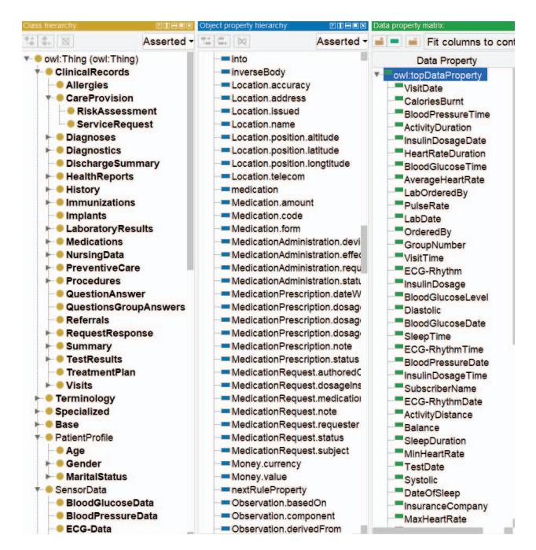
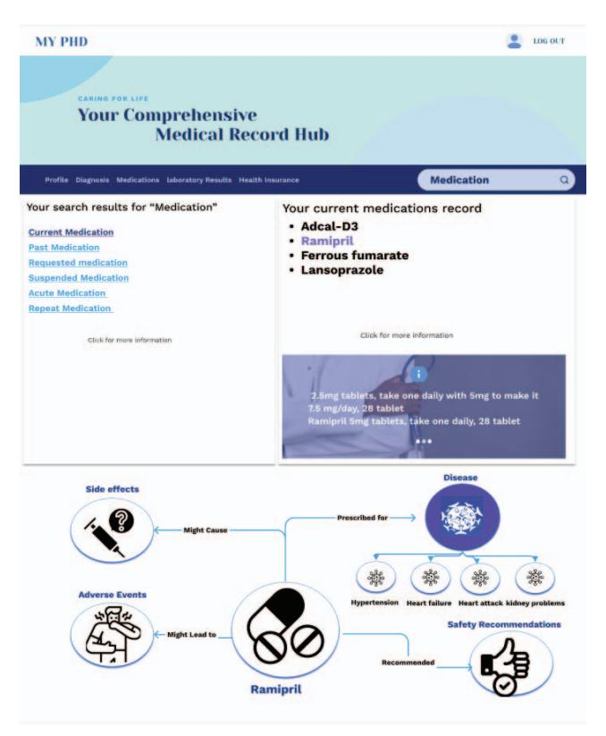
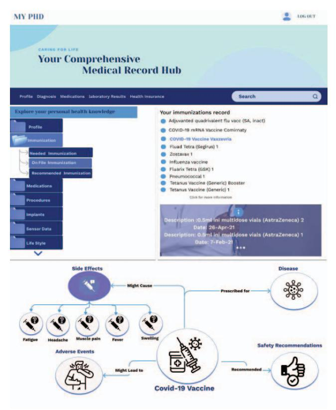

# Comprehensive Personal Health Knowledge Graph for Effective Management and Utilization of Personal Health Data

Rasha Hendawi *Department of Computer Science North Dakota State University*  Fargo, USA rasha.hendawi@ndsu.edu

*Abstract***— The widespread use of electronic health records (EHRs) and wearable devices has generated a massive amount of personal health data (PHD) that can be utilized for research and patient care. However, integrating and managing various types of PHD from different sources presents significant challenges, including data interoperability, privacy, and security concerns. In response, this paper proposes a Personal Health Knowledge Graph for integrated health data management and utilization. This approach utilizes knowledge graphs to structure and integrate different types of PHD from various sources, including EHR data, wearable device sensing data, insurance data, and social determinants of health. The proposed approach offers a comprehensive view of an individual's health, allowing for the integration and analysis of different types of PHD. Additionally, this paper proposes three use cases that illustrate the practical applications and advantages of the Personal Health Knowledge Graph (PHKG) in healthcare data management and utilization. Overall, the Personal Health Knowledge Graph (PHKG) provides a promising solution for managing and analyzing PHD, which can be used to improve healthcare outcomes and research.**

#### *Keywords—Personal Health Data, Knowledge Graphs, Ontology, Electronic Health Records, Semantic Query*

## I. INTRODUCTION

With the advent of new technologies, the amount of healthrelated data generated in our everyday lives is increasing significantly. This increase in data is due to the proliferation of various data sources, such as Electronic Health Records (EHRs), wearable sensors, mobile health (mHealth) apps, and social determinants of health. EHRs contain a variety of patient-level data, such as medical history, diagnoses, problem lists, medications, vital signs, and laboratory data. This type of data will continue to increase as more healthcare providers adopt electronic health record (EHR) systems. Wearable sensors, such as smartwatches, activity trackers, and medical devices, are another significant source of health-related data. These devices allow monitoring of daily activities such as steps taken, timing and intensity of physical activity, distance covered, calories burned, active time, and sleep assessment. They can also collect data on heart rate, blood pressure, and other vital signs. The use of wearable devices has increased exponentially in the last decade [1]. As a result, the amount of data generated is also growing.

Mobile health (mHealth) apps are also contributing to the growing amount of health-related data. Several mHealth apps were developed to collect and manage health data, such as drug dosage reference [2], weight management [3], and monitoring cardiac health [4]. The data generated by these apps can be used to gather more detailed and accurate insights into people's health [5] and can be integrated with other sources of health data. Social determinants of health, such as economic status, education, and social support, also influence health outcomes. Research shows that these factors may have a greater impact on health than health care or lifestyle decisions [6]. These factors can be measured and analyzed to provide a comprehensive view of an individual's health and identify potential health disparities.

These massive quantities of health-related data generated in our everyday lives provide valuable insights into an individual's health and can be utilized for very detailed personal profiling, which may be of great value for behavioral understanding. They also hold the promise of supporting a wide range of medical and healthcare functions, including, among others, research, patient care, clinical decision support, disease surveillance, and predicting healthcare trends. However, managing and integrating various types of PHD from different sources is incredibly challenging. The unstructured, heterogeneous, and distributed nature of this data causes problems of integration and data interoperability.

To address the challenges associated with the increasing volume of health-related data generated from diverse sources in our everyday lives, in this paper we propose a Personal Health Knowledge Graph (PHKG) to integrate and organize various types of PHD in a graph format. The PHKG offers a comprehensive and interconnected view of an individual's health by integrating and analyzing various types of PHD from different resources, including EHR data, sensing data from wearable devices and others. Which will enable detailed personal profiling, behavioral understanding, and facilitating applications in the healthcare domain. Additionally, we propose three use cases to further demonstrate the adaptability and significance of the Personal Health Knowledge Graph (PHKG)

979-8-3503-7198-7/24/\$31.00 ©2024 IEEE

Juan Li *Department of Computer Science North Dakota State University*  Fargo, USA j.li@ndsu.edu

This work was supported by the National Science Foundation (NSF) with award numbers: 1722913 and 2218046.

in addressing critical healthcare challenges. First, the Healthcare Data Graph Explorer (HDGE) simplifies interaction with the knowledge graph, making it accessible and comprehensible for users. Second, the Blockchain-based Decentralized Personal Health Data Sharing Platform strengthens data security, giving individuals control over their health data. Third, the Chatbot for Personal Health Data Querying bridges the gap between users and their health data, delivering reliable responses to healthrelated queries.

The rest of the paper is organized as follows: Section II surveys the related work. Section III explains the details of the proposed methodology. Section IV explains the use cases. Section V discusses the findings and insights of this research. Section VI concludes the paper.

#### II. RELATED WORK

 A secure and effective health data management system is necessary for better health care outcomes. EHRs are a fundamental support needed for documenting patients' health data. However, EHRs are based entirely on data reported and accessed by health care providers. Therefore, Personal Health Records (PHR) were proposed to integrate data from many sources, ranging from devices connected to the patient to health data from EHRs stored in health care provider systems. PHRs are defined by the Markle Foundation as "an electronic application through which individuals can access, manage, and share their health information and that of others for whom they are authorized, in a private, secure, and confidential environment'' [7].

 The PHR types are categorized into three categories: first, standalone applications [8], this type of PHRs does not directly connect with any other health-related systems and the users manually input medical records and related data. This type suffers from low reliability and compatibility due to its exclusive focus on personal use. The second type are tethered PHRs [9], which are connected to a single EHR. Due to the lack of interoperability between other EHR systems, it can be difficult to get a complete picture of a patient's medical history from different hospitals, healthcare providers, or healthcare systems [10]. This can necessitate repeating tests, which are timeconsuming, expensive, and bad for the patient's general health. This presses on the need for a third type, which is integrated PHR systems that collect and consolidate all personal health data from different resources into a unified framework.

To achieve interoperability, the HL7 FHIR standard [11] was adopted to build integrated PHR. In their research, Marcos C. et al. [12], discuss the design of a data integrator (HL7 Virtual Medical Record — vMR) that collects and transforms patient information from various EHRs and stores it into a personal health record. To enable smooth interaction between the personal health records and heterogeneous data resources, HL7 vMR is used as a message model for all components. The work by Hong J. et al. [13] also adopted the HL7 FHIR standard [11] to propose a system that stores EHRs data and transfers it to a PHR system via email. The authors also proposed the development of a mobile application to allow users to view and manage their data on the PHR system. Although these systems solve the problem of interoperability, they only focus on gathering relational healthcare data from EHRs neglecting other

valuable and effective resources such as data from health wearable devices, health mobile applications, and social determinants.

Semantic technologies, ontologies and knowledge graphs, have been widely used in this domain as they provide solutions that allow integrating data from various sources, querying data, and inferring new knowledge. They also enable interoperability across different healthcare applications, platforms, locations, and organizations. Plastiras et al. [14] developed an ontologydriven middleware to process data exported from EHR systems and prepare it accordingly for the receiving system. Wang H. et al. extracted rational clinical data from the database of multiple EHRs and transformed it into semantic data for constructing the knowledge graph of the PHR system to support individual healthcare management. The authors adopted semantic integration methods to ensure data integration between the proposed system and other hospital information systems [15]. Moreover, Gyrard A et al. [16] built a personal knowledge graph (PHKG) that integrates users' health-related data from diverse sources such as Internet of Things (IoT) devices, clinical notes, and EHRs. The proposed framework was evaluated using case studies of three chronic diseases: asthma, obesity, and Parkinson's. A recent work by Celuchova Bosanska et al. [17] presented a methodology on how to generate a PHKG from EHR data by applying a hierarchical ontological approach. The pipeline was applied to synthetic patient EHRs generated for the colorectal cancer diagnosis. The approach used is based on a hierarchical ontological method and aims to combine the symbolic representation of knowledge used in computational semantics with the graph data representation.

Several studies have explored the use of knowledge graphs in the healthcare domain. For example, Zhang et al. [18] developed a knowledge graph builder that can be used to construct a disease-specific health KG from multiple sources (e.g., EHR, medical standards, and expert knowledge). Similarly, the research by Shi et al. [19] focused on integrating textual medical knowledge (TMK) into conceptual graphs. The authors developed a mechanism that automatically retrieves knowledge from the knowledge graph. In another study [20] , Tao et al. proposed a disease risk prediction system that utilizes a knowledge graph-based approach. The system integrates data from various sources to generate risk prediction models.

These studies have shown that knowledge graphs can be effective in managing and integrating health data. However, there is still a need for additional research to investigate the ability to utilize personal knowledge graphs and provide users with easy and transparent access to their own health data, which will empower them to take a more active role in managing their health, gain a better understanding of their medical history and treatment options, and securely exploit their PHD data.

#### III. DESIGN OF THE FRAMEWORK

 We propose a Personal Health Knowledge Graph (PHKG) to integrate and structure various types of PHD within a graphbased framework. Fig. 1 shows the architecture of the proposed system. We present the details of framework design in the rest of this section.

#### Fig 1: System Architecture

#### *A. Knowledge Graph Creation*

Our process commences by gathering real-time relevant medical knowledge and personal health data from a wide array of sources, including IoT health data provided by wearable sensors, data residing in EHRs adopted by healthcare providers, personal health apps, laboratory data, and insurance records. These diverse sources furnish invaluable insights into the patient's health status and context, facilitating a comprehensive understanding of their overall well-being.

To guarantee consistency and interoperability, we transform the raw data from these disparate sources, harmonizing it into a standardized format presented by a common ontology. This ontology offers formal and standard representations of concepts relevant to personal health and the relationships between them. It acts as an inventory of all available medical data elements from various source systems and serves as the schema of the knowledge graph.

As illustrated in Fig. 2, this ontology defines pertinent health-related concepts such as symptoms, diseases, treatments, medications, and their associated relationships. For example, the ontology might include the concept of "heart disease," which would have relationships to other concepts such as "blood pressure," "cholesterol levels," "cardiac procedures," and "risk factors." Each of these concepts would be represented as nodes in the personal health knowledge graph, and edges would connect them to other related concepts. For instance, "cardiac procedures" could be linked to "risk factors," while "cholesterol levels" could be connected to "blood pressure" and "cardiac procedures". We reused HealthOnto, which was designed in our previous research [21]

 In designing the personal health ontology, we followed and adopted HL7 FHIR standards [11]. Defining a FHIR-based ontology allows standardizing the knowledge, which helps ensure consistency and interoperability across different sources of personal health data. It can also provide a framework for developing intelligent applications that can reason over personal health data and provide personalized insights and recommendations. We extended the HL7 FHIR-based ontology proposed in [22], which defines the domain entities of a personal health record. To enhance semantic interoperability and knowledge sharing, concepts in the ontology were linked with classes in BioPortal ontologies. The connection was based on BioPortal's PURL identifiers to establish a semantic link to existing medical vocabularies, such as SNOMED CT or LOINC. We extended the ontology to include other aspects of a user, including profiles, lifestyle interventions, healthcare providers, and data generated by health-related wearable devices. For example, additional classes LifeStyle, Diet, SmokingStatus, and Nutrition, as well as their sub-classes and properties, were added to reflect the user's lifestyle. These classes and properties can provide additional information about an individual's lifestyle.

Fig 2: Part of the HealthOnto ontology.

 The collected data will be mapped to the ontology. To transform the EHRs' relational data into semantic data represented by the RDF, we applied W3C's RDB2RDF [23] direct mapping method. It specifies the way to generate RDF triples from one or more relational tables without loss of information. It uses relational database instances and schemas as inputs and automatically generates RDF semantic data.

When dealing with semi-structured data such as the data generated from wearable sensors, which is mostly lightweight and easy to process data formats such as JSON, XML, and CSV, we utilized RML [24] which is a language and framework for mapping data from various heterogeneous sources to RDF format.

 The next step is representing the collected data as a directed graph. The graph's nodes represent entities, while the edges describe relationships between them. Two nodes that are connected via an edge are called triples. We use the semantic web standard, Resource Description Framework (RDF), where nodes are the concepts and edges are the properties. We also use some constructs from the RDF schema and the Web Ontology Language (OWL) [25]. For example, a person's medical conditions would be represented as nodes, with edges connecting them to related nodes such as medications, test results, and symptoms. Here is an example of data in a personal knowledge graph presented in triple format using RDF syntax:

- 01"^^<http://www.w3.org/2001/XMLSchema#date> .
- <https://cs.ndsu.edu/PHKG/user1> <http://schema.org/gender> "male" . <https://cs.ndsu.edu/PHKG/user1> <http://schema.org/maritalStatus> "married"
- <https://cs.ndsu.edu/PHKG/user1> <http://www.w3.org/1999/02/22-rdfsyntax-ns#type> <http://schema.org/Person> .
- <https://cs.ndsu.edu/PHKG/user1/disease1> <http://schema.org/name> "Influenza" .
- <https://cs.ndsu.edu/PHKG/user1/disease1> <http://schema.org/startDate>
- "2010-05-01"^^<http://www.w3.org/2001/XMLSchema#date> .

<https://cs.ndsu.edu/PHKG/user1/disease1> <http://www.w3.org/1999/02/22 rdf-syntax-ns#type> <http://cs.ndsu.edu/PHKG/Disease>

- .<https://cs.ndsu.edu/PHKG/user1> <http://cs.ndsu.edu/PHKG/hasDisease> <https://cs.ndsu.edu/PHKG/user1/disease1> .
- <https://cs.ndsu.edu/PHKG/user1/immunization1> <http://schema.org/name> "Flu Shot" .
- <https://cs.ndsu.edu/PHKG/user1/immunization1>

<http://schema.org/startDate> "2010-05-

- 01"^^<http://www.w3.org/2001/XMLSchema#date> .
- <https://cs.ndsu.edu/PHKG/user1/immunization1>
- <http://www.w3.org/1999/02/22-rdf-syntax-ns#type>

<http://cs.ndsu.edu/PHKG/Medication> .

<https://cs.ndsu.edu/PHKG/user1> <http://cs.ndsu.edu/PHKG/hasMedication> <https://cs.ndsu.edu/PHKG/user1/immunization1> .

In this example, we have a user identified by the URI "*https:// cs.ndsu.edu/PHKG user1*" who has a *name*, *birth date*, *gender and marital status*. The user also has a *disease* and an *immunization*. Each of the entities in the graph (*user*, *disease*, and *immunization*) has a type specified by the RDF "*type*" predicate. The user has a type of "*Person*", while the *disease* and *immunization* have types specified by the ontology. The user is linked to their disease and immunization using the predicates "*hasDisease*" and "*hasImmunization* ", respectively.

To ensure the quality of our knowledge graph and to identify conflicting information, we verified that the data has been accurately integrated into the knowledge graph and that the triples of KGs are semantically correct. This was achieved by running validation checks. Our study employed a technique known as Corroborative Fact Validation (COPAAL) [26], which relies on statements existing within a knowledge graph (KG) to validate facts. This is done in three stages: the initialization stage, where COPAAL receives a triple, and the path discovery stage, where a set of alternate paths between the subject and object of the triple are identified. And finally, the path scoring stage evaluates each alternate path using a counting approach to determine the number of paths connecting the subject and object of the triple. Based on these scores, COPAAL generates a final score that expresses the veracity of the given triple. We continuously update the knowledge graph to maintain the latest personal health data.

#### *B. Query and Navigation of the Knowledge Graph*

 The query and navigation of a knowledge graph constitute the fundamental processes through which users and applications interact with and derive insights from these rich, interconnected data structures.

Querying knowledge graphs involves formulating organized queries using a specific query language to retrieve specific information or patterns from the graph. The queries are then executed against the knowledge graph using a query engine. The engine traverses the graph, looking for matches to the specified patterns. Once the query execution is complete, the results are returned in a structured format. This process enables users to uncover meaningful insights, discover relationships, and extract data that aligns with their research objectives.

SPARQL [27] is a highly expressive query language and protocol that has become a standard query language designed specifically for querying RDF-based knowledge graphs [28]. It has a rich set of features that go beyond simple joins, which are crucial for efficiently querying complex RDF datasets. Some of these features are projection, selection, union, difference, filter expressions, path queries, etc. SPARQL allows to construct complex graph patterns by chaining together multiple triple patterns. This capability is crucial for querying interconnected data within a knowledge graph effectively. SPARQL is applied directly to search graph data in triple format, which consists of subject-predicate-object. These triple patterns serve as the basic building blocks of SPARQL queries.

For example, a SPARQL query that retrieves all the medications prescribed for diabetes for a user in the last twelve months can be as follows:

SELECT ?medicationName

WHERE {

?user :Person ;

?medication :Medication ;

?user :hasMedication ?medication ;

?medication :hasName ?medicationName ;

?medication :hasPrescriptionDate ?prescriptionDate;

?indicatedDisease :Disease;

?medication :prescribeFor ?indicatedDisease;

?indicatedDisease :hasName "Diabetes";

 FILTER(?prescriptionDate>=( NOW() -""P1Y^^xsd:duraion)) }

&lt;https://cs.ndsu.edu/PHKG/user1> <http://schema.org/name> "Sara Johnson". <https://cs.ndsu.edu/PHKG/user1> <http://schema.org/birthDate> "1980-01-

SPARQL isn't limited to structured queries alone; it also enables the formulation of advanced navigational queries, leveraging property path expressions to traverse knowledge graphs efficiently. Starting from a specific node of interest, SPARQL queries can be constructed to navigate through the graph, uncovering contextual information and hidden relationships along the way. Two primary approaches can be employed for this purpose: graph traversal-based and recursive queries. Graph traversal-based methods employ algorithms like depth-first or breadth-first search to traverse the RDF graph, identifying all paths matching the property path expression. In contrast, recursive queries break down the property path expression into sub-expressions, employing recursive SPARQL queries to discover all paths corresponding to each subexpression.

#### *C. Generating Embeddings of the Knowledge Graph*

Generating embeddings from the PHKG involves transforming the graph's entities and relationships into vector representations that capture semantic information. These embeddings can be used for various applications, such as semantic similarity measurement, personalized recommendations, and disease prediction. We can create graphbased embeddings. Methods like TransE [29], TransH [30], or GraphSAGE [31] are suitable for knowledge graphs. These methods consider the graph structure and semantic relationships between entities.

Entity embedding involves representing entities (nodes) in the knowledge graph as vectors in a continuous vector space. Each entity is assigned a unique vector representation, and these representations capture the semantic meaning of the entities. Entity embeddings are useful for various tasks such as semantic similarity measurement, recommendation systems, and graphbased machine learning. Relation embedding focuses on representing relationships (edges) between entities as vectors. These vectors capture the semantic information about the relationships and how they connect different entities in the knowledge graph. Relation embeddings are crucial for tasks that involve reasoning about relationships between entities, such as link prediction and knowledge graph completion. Together, entity embeddings and relation embeddings provide a comprehensive way to encode the semantic knowledge contained within a knowledge graph, making it possible to perform various tasks that require understanding the structure and semantics of the graph. These embeddings allow for efficient mathematical operations and reasoning on the graph, enabling applications like query answering, recommendation, and inference.

#### IV. USE CASE STUDY

In this section, we delve into three compelling use cases that demonstrate the practical applications and benefits of the Personal Health Knowledge Graph (PHKG) in the realm of healthcare data management and utilization. These use cases showcase the versatility and value of the PHKG in addressing critical challenges and enhancing healthcare-related processes.

#### *A. Healthcare Data Graph Explorer (HDGE)*

The first use case introduces the Healthcare Data Graph Explorer (HDGE), a web-based tool designed to empower users with intuitive ways to interact with their personal health knowledge graph. HDGE leverages the capabilities of the PHKG, enabling users to query and explore their health-related data using navigation tools and keyword-based searches. This user-friendly interface facilitates seamless navigation of the knowledge graph, making it accessible and comprehensible to individuals seeking insights into their health and medical history.

Users of HDEG, regardless of their technical background, can effortlessly search their health data. This eliminates the need for users to have prior knowledge of the knowledge graph structure or specific query languages. When users input keywords, HDGE interprets and reformulates them into SPARQL query language syntax. Subsequently, it retrieves related entities and displays them as hyperlinks. Moreover, users have access to additional links under each search result, enabling them to explore semantically similar entities and further refine their queries.

Consider the scenario where a user seeks information about their current medication. By simply entering the keyword "medication" into the search bar (as shown in Fig. 3), the system performs a query against the personal health knowledge graph. The results include matches to the query, such as past medication, current medication, and requested medication. Users can then click on the relevant link or use the results to deepen their query, with the displayed graph providing a visual representation of immediate entities and relationships linked to the selected entity.

Fig 3: Screenshot shows the navigation interface of the system.

To facilitate intuitive navigation, HDGE employs dropdown trees and graph links. Users can explore the knowledge graph hierarchy in a user-friendly manner. For example, in Fig. 4, when a user selects the concept "Immunization," a list of their immunization records is displayed on the right side of the screen. Additionally, HDGE provides detailed information related to a selected concept, as shown in the lower part of Fig. 4. For instance, when exploring the "Covid-19 Vaccine" concept, users can access information about its side effects, potential adverse events, safety recommendations, and the diseases it protects against.

 HDGE offers an all-encompassing tool for users to not only retrieve their health data but also to intuitively navigate and understand the complex structure of their personal health knowledge graph. By providing semantic search capabilities, easy-to-use navigation tools, and detailed information displays, HDGE enhances the accessibility and comprehension of personal health data for both patients and healthcare providers.

### *B. Blockchain-based Decentralized Personal Health Data Sharing Platform*

The second use case introduces an innovative solution known as the Blockchain-based Decentralized Personal Health Data Sharing Platform [21]. This system is designed to decentralize personal health data, providing individuals with unparalleled control over their information. It is built upon the foundation of the PHKG and leverages blockchain technology to enhance data privacy and security.

The system utilizes a decentralized peer-to-peer (P2P) network with a dual purpose: ensuring a secure blockchain for system security, including authentication, authorization, and access control, and implementing P2P-based distributed storage for users' personal health knowledge graphs. Smart contracts play a pivotal role in automating access control and data sharing policies. This empowers individuals to selectively share their data with trusted entities, bolstering data privacy and security.

PHKG data is divided into smaller chunks, each assigned a unique identifier. These data chunks are distributed across multiple chunk servers (P2P nodes) to ensure fault tolerance and availability. Metadata is stored in the name node. To expedite data retrieval, a Distributed Hash Table (DHT)-based indexing system is implemented. This allows for rapid data lookup based on the unique identifiers assigned to each data chunk. Data is replicated across multiple chunk servers, and backup mechanisms are in place to ensure data durability and recovery from potential failures.

The Ethereum blockchain platform is employed for secure user authentication through smart contracts. Each user maintains a unique Ethereum address, ensuring a secure identification process. Wearable devices are also authenticated using blockchain. Each device is assigned a unique digital identity stored on the blockchain, ensuring authorized access. Smart contracts are utilized to automate the registration, authentication, and access control of users, health data producers, and data consumers. This rigorous access control ensures that personal health data is accessible only to authorized entities, further enhancing data privacy and security.

The blockchain-based decentralized platform not only decentralizes health data but also establishes a new benchmark in data security and privacy. It provides individuals with control over their data, assures access to authorized entities, and utilizes blockchain technology to safeguard personal health information.

#### *C. Chatbot for Personal Health Data Querying*

The third use case introduces a cutting-edge solution - a Chatbot for Personal Health Data Querying, a conversational interface that seamlessly integrates the capabilities of the PHKG [32]. In today's era of abundant personal health data generated by various sources, this chatbot empowers users to effortlessly retrieve personalized health information, overcoming the challenges of data fragmentation and user proficiency.

The solution bridges the gap between users and their health data, regardless of their technological proficiency, by leveraging natural language processing and knowledge graph technology. While ChatGPT has excelled in various domains, it falls short in addressing personalized health queries and accessing private health data. Its occasional production of incorrect or nonsensical answers, referred to as "hallucination," poses risks in critical domains like healthcare. To address these limitations, PHKG was used to serve as a structured foundation for fine-tuning the GPT model. During the fine-tuning process, the GPT model is trained using a specialized dataset derived from the integrated knowledge graph. This dataset contains personalized health data, ensuring the model learns to generate Fig 4: Screenshot shows the search interface of the system. accurate and personalized answers. By incorporating the knowledge graph during the fine-tuning phase, the model gains a deeper understanding of health-related concepts, relationships, and context, resulting in context-aware and reliable responses. This approach combines GPT's natural language processing capabilities with contextual knowledge from the personal health knowledge graph, ensuring users receive accurate, reliable, and tailored responses to their health queries while maintaining privacy and data security.

These use cases collectively underscore the transformative potential of the Personal Health Knowledge Graph. By addressing challenges related to data integration, interoperability, privacy, and accessibility, the PHKG emerges as a promising solution for unlocking the value of personal health data in healthcare research and patient care.

#### V. DISCUSSIONS

The proposed PHKG represents a significant advancement in the management and utilization of personal health data (PHD). This discussion section aims to provide a comprehensive overview of the key contributions, implications, and potential impact of this innovative solution on healthcare and research.

- - Integrating and Managing Health Data: The increase in health-related data generated from various sources, including Electronic Health Records (EHRs), wearable sensors, mobile health apps, and social determinants of health, presents a monumental challenge. The PHKG offers a groundbreaking solution by structuring and integrating these diverse data types into a single comprehensive knowledge graph. This integration facilitates a holistic view of an individual's health, enabling the analysis of multiple facets of PHD.
- - Potential for In-Depth Personal Profiling: The PHKG's capability to provide a detailed and interconnected view of an individual's health has immense potential for personal profiling. It can enhance behavioral understanding, aiding medical professionals and researchers in tailoring healthcare interventions and making informed decisions.
- - Semantic Search Enhances User Experience: The semantic keyword-based search implemented in HDGE simplifies user interactions with the knowledge graph. This search method ensures that users can effortlessly access and comprehend their personal health data without requiring prior knowledge of complex query languages.
- - Comprehensive Ontology for Standardization: The adoption of HL7 standards and the Fast Healthcare Interoperability Resources (FHIR) standard for the personal health ontology offers standardization, consistency, and interoperability across different sources of personal health data. This framework is pivotal in ensuring that diverse healthcare data can be integrated effectively.

- - Knowledge Graph Embeddings for Various Applications: The generation of embeddings from the PHKG provides the foundation for semantic similarity measurement, personalized recommendations, and disease prediction. These embeddings are vital for efficient mathematical operations and reasoning on the knowledge graph, facilitating a wide range of applications.
- - Privacy and Security Concerns: As the PHKG offers comprehensive access to personal health data, addressing privacy and security concerns is of paramount importance. Ensuring that data is only accessible to authorized entities is essential for maintaining trust and compliance with privacy regulations.
- - Future Implications and Research Opportunities: The PHKG opens up several avenues for future research and development. These may include the refinement of knowledge graph embeddings, further improvements in natural language-driven query mechanisms, and the exploration of additional use cases and applications within the healthcare domain.

In conclusion, the PHKG represents a pioneering solution for the effective management and utilization of personal health data. Its potential to revolutionize healthcare, enhance patient care, and drive research makes it a significant contribution to the field of healthcare informatics. As technology and healthcare data continue to evolve, the PHKG provides a valuable framework for realizing the full potential of healthrelated data for improved healthcare outcomes and research.

#### VI. CONCLUSIONS

In the face of the growing volume of personal health data generated by diverse sources, the development of the PHKG represents a significant milestone in healthcare informatics. The proliferation of data has posed substantial challenges, including data interoperability, privacy concerns, and data security. The proposed PHKG provides a comprehensive and interconnected solution, offering a unified perspective on individual health by integrating and analyzing diverse types of personal health data. This has the potential to revolutionize personalized health profiling, enabling healthcare providers and researchers to gain profound insights into patient behavior and health trends.

The use cases further exemplify the versatility of the PHKG. The Healthcare Data Graph Explorer (HDGE) simplifies interaction with the knowledge graph, making it accessible and comprehensible for users. The Blockchain-based Decentralized Personal Health Data Sharing Platform strengthens data security, giving individuals control over their health data. The Chatbot for Personal Health Data Querying bridges the gap between users and their health data, delivering reliable responses to health-related queries.

While the PHKG holds great promise, challenges persist in ensuring data integration and interoperability. Privacy and data security remain paramount concerns that demand rigorous solutions.

VII. REFRENCES

- [1] "Earwear and Wristbands Drive First Quarter Growth in the Worldwide Wearables Market, Says IDC | Business Wire." Accessed: Mar. 22, 2023. [Online]. Available:
  - https://www.businesswire.com/news/home/202005280 05801/en/Earwear-and-Wristbands-Drive-First-Quarter-Growth-in-the-Worldwide-Wearables-Market-Says-IDC
- [2] V. L. Anthony Berauk, M. K. Murugiah, Y. C. Soh, Y. Chuan Sheng, T. W. Wong, and L. C. Ming, "Mobile Health Applications for Caring of Older People: Review and Comparison," *Ther Innov Regul Sci*, vol. 52, no. 3, pp. 374–382, May 2018, doi:
  - 10.1177/2168479017725556/METRICS.
- [3] J. P. Higgins, "Smartphone Applications for Patients' Health and Fitness," *American Journal of Medicine*, vol. 129, no. 1, pp. 11–19, Jan. 2016, doi: 10.1016/j.amjmed.2015.05.038.
  - [4] A. N. A. Yusuf, F. Y. Zulkifli, and I. W. Mustika, "Development of Monitoring and Health Service Information System to Support Smart Health on Android Platform," *4th International Conference on Nano Electronics Research and Education: Toward Advanced Imaging Science Creation, ICNERE 2018*, Jul. 2019, doi: 10.1109/ICNERE.2018.8642592.
    - [5] G. K. Garge, C. Balakrishna, and S. K. Datta, "Consumer Health Care: Current Trends in Consumer Health Monitoring," *IEEE Consumer Electronics Magazine*, vol. 7, no. 1, pp. 38–46, Jan. 2018, doi: 10.1109/MCE.2017.2743238.
- [6] "Social determinants of health." Accessed: Oct. 13, 2023. [Online]. Available: https://www.who.int/health-topics/socialdeterminants-of-health#tab=tab\_1
- [7] P. C. Tang, J. S. Ash, D. W. Bates, J. M. Overhage, and D. Z. Sands, "Personal health records: Definitions, benefits, and strategies for overcoming barriers to adoption," *Journal of the American Medical Informatics Association*, vol. 13, no. 2, pp. 121–126, Mar. 2006, doi:
  - 10.1197/JAMIA.M2025/2/JAMIAM2025.F01.JPEG.
- [8] A. Sunyaev, "Evaluation of Microsoft Healthvault and Google Health Personal Health Records." 2013. Accessed: Oct. 19, 2023. [Online]. Available: https://papers.ssrn.com/abstract=2304597
- [9] T. P. Vydra, E. Cuaresma, M. Kretovics, and S. Bose-Brill, "Diffusion and Use of Tethered Personal Health Records in Primary Care," *Perspect Health Inf Manag*, vol. 12, no. Spring, 2015, Accessed: Oct. 19, 2023. [Online]. Available: /pmc/articles/PMC4696089/
- [10] L. Ismail, H. Materwala, A. P. Karduck, and A. Adem, "Requirements of Health Data Management Systems for Biomedical Care and Research: Scoping Review," *J Med Internet Res*, vol. 22, no. 7, Jul. 2020, doi: 10.2196/17508.

- [11] " FHIR v4.3.0." Accessed: Mar. 09, 2023. [Online]. Available: https://hl7.org/fhir/overview.html
- [12] C. Marcos, A. González-Ferrer, M. Peleg, and C. Cavero, "Solving the interoperability challenge of a distributed complex patient guidance system: a data integrator based on HL7's Virtual Medical Record standard," *Journal of the American Medical Informatics Association*, vol. 22, no. 3, pp. 587–599, Mar. 2015, doi: 10.1093/JAMIA/OCV003.
- [13] J. Hong, P. Morris, and J. Seo, "Interconnected Personal Health Record Ecosystem Using IoT Cloud Platform and HL7 FHIR," *Proceedings - 2017 IEEE International Conference on Healthcare Informatics, ICHI 2017*, pp. 362–367, Sep. 2017, doi: 10.1109/ICHI.2017.82.
- [14] P. Plastiras and D. M. O'Sullivan, "Combining Ontologies and Open Standards to Derive a Middle Layer Information Model for Interoperability of Personal and Electronic Health Records," *J Med Syst*, vol. 41, no. 12, pp. 1–15, Dec. 2017, doi: 10.1007/S10916-017-0838-9/METRICS.
- [15] H. Wang, X. Miao, and P. Yang, "Design and Implementation of Personal Health Record Systems Based on Knowledge Graph," *Proceedings - 9th International Conference on Information Technology in Medicine and Education, ITME 2018*, pp. 133–136, Dec. 2018, doi: 10.1109/ITME.2018.00039.
- [16] "Personalized Health Knowledge Graph PubMed." Accessed: Oct. 13, 2023. [Online]. Available: https://pubmed.ncbi.nlm.nih.gov/34690624/
- [17] D. Celuchova Bosanska, M. Huptych, and L. Lhotská, "A Pipeline for Population and Analysis of Personal Health Knowledge Graphs (PHKGs)," 2022, Accessed: Oct. 13, 2023. [Online]. Available: https://github.com/BD2KOnFHIR/fhirtordf
- [18] Y. Zhang *et al.*, "HKGB: An Inclusive, Extensible, Intelligent, Semi-auto-constructed Knowledge Graph Framework for Healthcare with Clinicians' Expertise Incorporated," *Inf Process Manag*, vol. 57, no. 6, p. 102324, Nov. 2020, doi: 10.1016/J.IPM.2020.102324.
- [19] L. Shi, S. Li, X. Yang, J. Qi, G. Pan, and B. Zhou, "Semantic Health Knowledge Graph: Semantic Integration of Heterogeneous Medical Knowledge and Services," *Biomed Res Int*, vol. 2017, 2017, doi: 10.1155/2017/2858423.
- [20] X. Tao *et al.*, "Mining health knowledge graph for health risk prediction," *World Wide Web*, vol. 23, no. 4, pp. 2341–2362, Jul. 2020, doi: 10.1007/S11280- 020-00810-1.
- [21] "A Blockchain-Based Personal Health Knowledge Graph for Secure Integrated Health Data Management (Conference Paper) | NSF PAGES." Accessed: Oct. 13, 2023. [Online]. Available: https://par.nsf.gov/biblio/10417040
- [22] V. Kilintzis, A. Kosvyra, N. Beredimas, P. Natsiavas, N. Maglaveras, and I. Chouvarda, "A sustainable HL7 FHIR based ontology for PHR dataכ, "*Proceedings of*

*the Annual International Conference of the IEEE Engineering in Medicine and Biology Society, EMBS*, pp. 5700–5703, Jul. 2019, doi: 10.1109/EMBC.2019.8856415.

- [23] H. G. Jun and D. H. Im, "Semantics-Preserving RDB2RDF Data Transformation Using Hierarchical Direct Mapping," *Applied Sciences 2020, Vol. 10, Page 7070*, vol. 10, no. 20, p. 7070, Oct. 2020, doi: 10.3390/APP10207070.
  - [24] A. Dimou, M. Vander Sande, P. Colpaert, R. Verborgh, E. Mannens, and R. Van De Walle, "RML: A Generic Language for Integrated RDF Mappings of Heterogeneous Data", Accessed: Oct. 13, 2023. [Online]. Available: http://www.gac-grid.de/projectproducts/Software/XML2RDF.html
- [25] "OWL API by owlcs." Accessed: Sep. 16, 2020. [Online]. Available: http://owlcs.github.io/owlapi/
- [26] "COPAAL | DICE Research Group." Accessed: Oct. 13, 2023. [Online]. Available: https://diceresearch.org/COPAAL
- [27] "SPARQL Query Language for RDF." Accessed: Sep. 16, 2020. [Online]. Available: https://www.w3.org/TR/rdf-sparql-query/
- [28] W. Ali *et al.*, "A Survey of RDF Stores & SPARQL Engines for Querying Knowledge Graphs," 2021, Accessed: Oct. 14, 2023. [Online]. Available: http://prefix.cc/.
- [29] A. Bordes, N. Usunier, A. Garcia-Durán, J. Weston, and O. Yakhnenko, "Translating Embeddings for Modeling Multi-relational Data".
- [30] Z. Wang, J. Zhang, J. Feng, and Z. Chen, "Knowledge Graph Embedding by Translating on Hyperplanes," *Proceedings of the AAAI Conference on Artificial Intelligence*, vol. 28, no. 1, pp. 1112–1119, Jun. 2014, doi: 10.1609/AAAI.V28I1.8870.
- [31] W. L. Hamilton, R. Ying, and J. Leskovec, "Inductive Representation Learning on Large Graphs".
- [32] X. Wang *et al.*, "Empowering Personalized Health Data Queries with Knowledge Graph and GPT-Enhanced Voice Assistant," in *2023 International Conference on Data, Information, Knowledge and Wisdom (DIKW 2023)*, 2023.