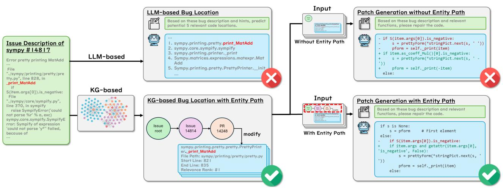
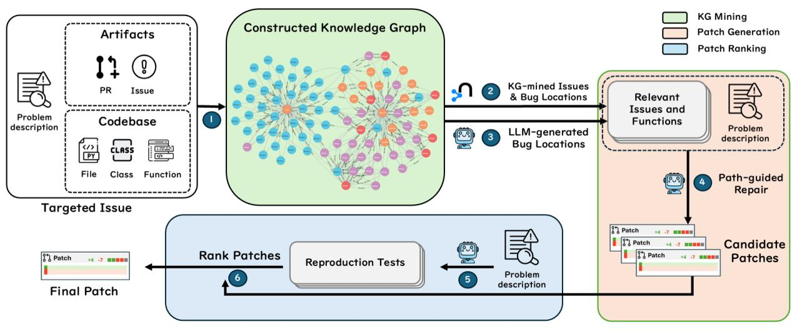
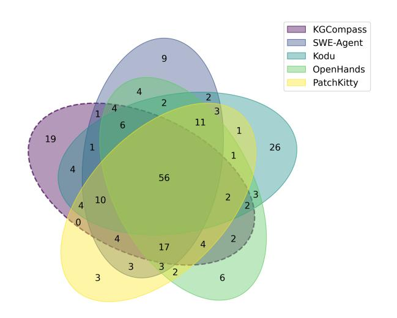
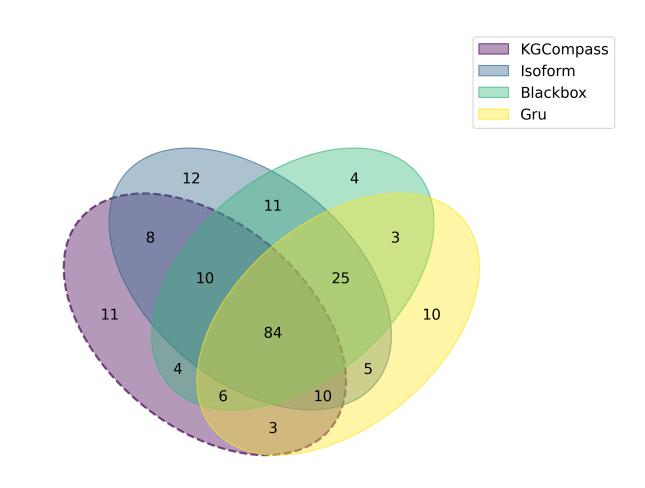
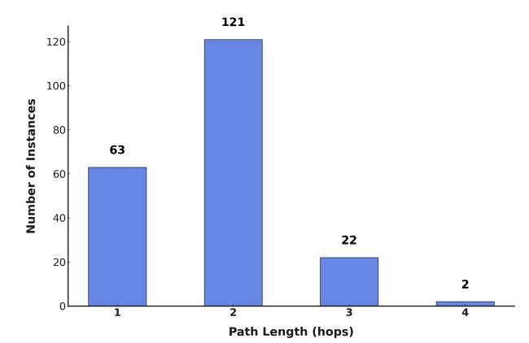
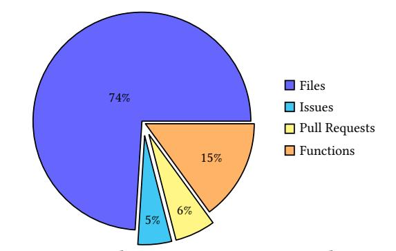
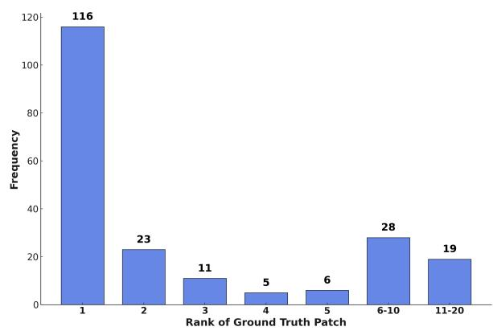

# Enhancing Repository-Level Software Repair via Repository-Aware Knowledge Graphs

Boyang Yang1,<sup>2</sup> , Haoye Tian3,<sup>∗</sup> , Jiadong Ren<sup>1</sup> , Shunfu Jin<sup>1</sup> , Yang Liu<sup>4</sup> , Feng Liu<sup>3</sup> , Bach Le<sup>3</sup>

> School of Information Science and Engineering, Yanshan University Beijing JudaoYouda Network Technology Co. Ltd. University of Melbourne Nanyang Technological University

yangboyang@jisuanke.com, tianhaoyemail@gmail.com, jdren@ysu.edu.cn, jsf@ysu.edu.cn, yangliu@ntu.edu.sg, fengliu.ml@gmail.com, bach.le@unimelb.edu.au

## Abstract

Repository-level software repair faces challenges in bridging semantic gaps between issue descriptions and code patches. Existing approaches, which mostly depend on large language models (LLMs), suffer from semantic ambiguities, limited structural context understanding, and insufficient reasoning capability. To address these limitations, we propose KGCompass with two innovations: (1) a novel repository-aware knowledge graph (KG) that accurately links repository artifacts (issues and pull requests) and codebase entities (files, classes, and functions), allowing us to effectively narrow down the vast search space to only 20 most relevant functions with accurate candidate bug locations and contextual information, and (2) a path-guided repair mechanism that leverages KG-mined entity path, tracing through which allows us to augment LLMs with relevant contextual information to generate precise patches along with their explanations. Experimental results in the SWE-Bench-Lite demonstrate that KGCompass achieves state-of-the-art repair performance (45.67%) and function-level localization accuracy (51.33%) across open-source approaches, costing only \$0.20 per repair. Our analysis reveals that among successfully localized bugs, 69.7% require multi-hop traversals through the knowledge graph, without which LLM-based approaches struggle to accurately locate bugs. The knowledge graph built in KGCompass is language agnostic and can be incrementally updated, making it a practical solution for real-world development environments.

### 1 Introduction

Large Language Models (LLMs) have demonstrated remarkable coding capabilities in code generation and repair tasks [\[27,](#page-10-0) [31,](#page-10-1) [35,](#page-10-2) [36,](#page-11-0) [45,](#page-11-1) [61\]](#page-11-2). The emergence of repository-level repair benchmarks like SWEbench [\[19\]](#page-10-3) highlights a fundamental challenge: localizing bugs in

Conference'17, Washington, DC, USA

<https://doi.org/10.1145/nnnnnnn.nnnnnnn>

large-scale codebases where code modifications require comprehending relationships across multiple files and functions [\[6,](#page-10-4) [26\]](#page-10-5). For instance, a repository in SWE-bench contains over 2,750 Python files with over 27,000 functions [\[19\]](#page-10-3). Recent studies have shown that LLM-based program repair approaches struggle with precise bug localization due to context length limitations and deteriorated inference efficiency and accuracy with extended inputs [\[57\]](#page-11-3), making them face significant challenges in repository-level repair [\[19\]](#page-10-3).

To address these repository-level repair challenges, researchers have explored two main categories of approaches: agentic [\[1,](#page-10-6) [11,](#page-10-7) [22,](#page-10-8) [50,](#page-11-4) [55\]](#page-11-5) and procedural [\[25,](#page-10-9) [42,](#page-11-6) [51\]](#page-11-7). Agentic approaches equip LLMs with various tools for autonomous planning and execution through multiple specialized agents, but lack interpretable reasoning and controlled decision planning. Procedural approaches mitigate these issues through expert-designed workflows, offering more precise and interpretable processes [\[42,](#page-11-6) [51\]](#page-11-7). However, both approaches rely on text-based LLM analysis, which faces inherent semantic ambiguities where syntactically similar terms have distinct meanings in different contexts [\[6,](#page-10-4) [58\]](#page-11-8). This issue already occurs frequently when existing procedural approaches focus on single-location contexts alone [\[51\]](#page-11-7). In practice, accurate patch generation often requires contextual information from multiple functions and files. Consequently, the existing approaches still face three major limitations:

- ① Semantic Ambiguity: LLM-based approaches across various software engineering tasks inherently struggle with semantic ambiguities when processing code and natural language [\[16,](#page-10-10) [20\]](#page-10-11). This fundamental limitation becomes particularly critical in repository-level software repair, where precise bug localization requires understanding complex semantic relationships across multiple files and components [\[6,](#page-10-4) [58\]](#page-11-8). Within large codebases such as SWE-Bench benchmark [\[19\]](#page-10-3), the same function names frequently have different semantics across different namespaces or modules, causing LLMs to misidentify bug locations. Even state-of-the-art open-source approaches achieve less than 50% accuracy in function-level localization on SWE-Bench-Lite, confirming semantic ambiguity as a critical bottleneck in repositorylevel repair.
- ② Limited Structural Understanding: Repository-level coderelated tasks require comprehending connections between repository artifacts and code entities [\[34,](#page-10-12) [37\]](#page-11-9). While LLMs and existing knowledge graph approaches excel at analyzing textual content or structural relationships among code entities, they

<sup>\*</sup>Corresponding author.

Permission to make digital or hard copies of all or part of this work for personal or classroom use is granted without fee provided that copies are not made or distributed for profit or commercial advantage and that copies bear this notice and the full citation on the first page. Copyrights for components of this work owned by others than the author(s) must be honored. Abstracting with credit is permitted. To copy otherwise, or republish, to post on servers or to redistribute to lists, requires prior specific permission and/or a fee. Request permissions from permissions@acm.org.

<sup>©</sup> 2025 Copyright held by the owner/author(s). Publication rights licensed to ACM. ACM ISBN 978-x-xxxx-xxxx-x/YYYY/MM

<span id="page-1-0"></span>
<!-- Image Description: This flowchart diagrams two approaches (LLM-based and KG-based) to bug localization and patch generation for a Python code issue (sympy #14817). The KG-based method uses a knowledge graph to identify the relevant code section, which is then used for patch generation. Both approaches with and without entity paths are shown. The figure uses boxes representing processes, arrows indicating flow, and a graph illustrating the KG-based approach. Success/failure is indicated by checkmarks/crosses. -->

**Figure 1:** Motivating Example

do not address the essential connections between repository artifacts (issues and pull requests) and codebase entities (files, classes, and functions) [\[19,](#page-10-3) [43\]](#page-11-10). Only 32.0% of SWE-Bench-Lite bugs contain direct location information [\[51\]](#page-11-7), yet all reference repository artifacts. Furthermore, existing approaches typically focus on leveraging a single bug location rather than multiple relevant locations providing the context for effective repairs. This disconnect between documentation and implementation significantly limits understanding code relationships, directly reducing localization precision and repair accuracy.

③ Lack of Decision Interpretability: Repository-level software repair requires traceable reasoning chains to validate the repair decisions [\[3\]](#page-10-13). While existing state-of-the-art approaches have achieved promising results, they lack interpretable decision processes in bug localization and patch generation [\[47\]](#page-11-11). Current agentic approaches [\[1,](#page-10-6) [50,](#page-11-4) [55\]](#page-11-5) often make decisions through complex black-box interactions without clear reasoning paths, while procedural approaches [\[42,](#page-11-6) [51\]](#page-11-7) rank multiple candidate patches but provide limited insight into their final choices for users. On SWE-Bench-Lite, while state-of-the-art open-source approaches achieve a 45.67% success rate, they fail to provide transparent reasoning information, limiting both trustworthiness and practical adoption.

This paper. We present KGCompass, a novel approach that accurately link code structure with repository metadata into a unified database, namely a knowledge graph, to achieve more accurate and interpretable software repair. Given a natural language bug report and a repository codebase, our approach constructs a knowledge graph that captures relationships between repository artifacts (issues and pull requests) and codebase entities (files, functions, classes). This unified representation allows us to effectively trace the semantic connection between bug descriptions and potential bug locations, reducing the search space from thousands to 20 most relevant candidates that accurately provide both bug locations and contextual information. The useful contextual information provided from the knowledge graph is then used to help LLMs generate more accurate patches.

Experimental results show that KGCompass achieves state-ofthe-art performance among open-source approaches on the SWEbench-lite benchmark using Claude 3.5 Sonnet (45.67%) at only \$0.20 per repair. KGCompass also demonstrates superior function-level localization accuracy (51.33%) and provides interpretable reasoning chains for repair decisions. Additionally, our analysis shows that 69.7% of successfully localized bugs required multi-hop traversals from the start issue through the knowledge graph, demonstrating the necessity of leveraging indirect entity relationships from the knowledge graph. While ablation studies validate the effectiveness of our approach overall, the gap between current performance (45.67%) and the upper bound (47.67%, achieved when validating with the benchmark's ground truth tests) suggests promising opportunities for future improvements in patch validation techniques. Our main contributions are:

- Repository-Aware Knowledge Graph: We propose a method to construct repository-aware knowledge graph that unifies codebase entities (files, classes, and functions) and issue-related repository artifacts (issues and pull requests), effectively modeling both structural dependencies and semantic relationships across the repository.
- KG-based Repair Approach: We introduce KGCompass, a knowledge graph-based approach for repository-level software repair that augments LLMs with graph analysis, e.g., structural and semantic dependencies between code and artifacts, to identify relevant bug locations and generate accurate patches.
- Efficient Search Space Reduction: We achieve significantly lower costs (\$0.20 per repair) through our candidate selection approach that narrows down from thousands to 20 relevant functions, successfully capturing 84.3% of ground truth files and 58.8% of ground truth functions containing actual bug locations.
- Comprehensive Experimental Evaluation: Comprehensive experimental evaluation on SWE-Bench-Lite demonstrates KG-Compass's highest repair accuracy (45.67%) and superior functionlevel localization accuracy (51.33%) among all open-source approaches [\[1,](#page-10-6) [3,](#page-10-13) [22,](#page-10-8) [50,](#page-11-4) [51,](#page-11-7) [55\]](#page-11-5). Further ablation studies confirm the effectiveness of each component in our approach.

### <span id="page-2-1"></span>2 Motivating Example

We present a motivating example from SWE-Bench-Lite [\[19\]](#page-10-3), a benchmark for evaluating repository-level software repair. This example illustrates the benefits of the knowledge graph constructed in our approach in both pinpointing the correct buggy location and generating the correct repair.

Knowledge Graph-guided Bug Localization. As shown in Figure [1,](#page-1-0) the problem statement of instance sympy-14814 within SWE-Bench-Lite describes an error when printing matrix expressions with special characters. When instructed to locate the bug based on the problem statement, Claude 3.5 Sonnet incorrectly identifies "print\_MatAdd" as the primary candidate function, missing the critical underscore prefix in the ground truth bug location "\_print\_MatAdd". This example highlights how LLMs inherently struggle with semantic ambiguities when processing code as natural language, misinterpreting syntactically similar terms with distinct meanings. By contrast, the knowledge graph approach KGCompass precisely disambiguates functions with identical or similar names by capturing their structural relationships and execution contexts, effectively addressing a fundamental limitation in purely text-based code understanding. By analyzing entity relationships within the knowledge graph, we identify that issue #14814 links to pull request #14248, which in turn points to the correct "\_print\_MatAdd" function with the highest relevance score.

This case illustrates a typical pattern in repository-level software repair, where bug locations are indirectly referenced through repository artifacts rather than explicitly stated. For the problem statement of each instance within SWE-Bench-Lite, while 68.0% of instances lack direct bug location information [\[51\]](#page-11-7), most instances reference repository artifacts (issues and pull requests) or codebase entities (files, classes, functions). These references create valuable contextual connections, as repository artifacts often contain bug reports, stack backtraces, and discussions about code changes, while codebase entities provide structural relationships and implementation details. They help establish semantic connections between natural language descriptions and relevant code locations.

Knowledge Graph-guided Repair. As shown in Figure [1,](#page-1-0) even when the function "\_print\_MatAdd" is correctly identified, Claude 3.5 Sonnet produces a weak fix using "item.as\_coeff\_Mul()[0].is\_neg ative" that fails when processing expressions with special characters like "y\*". However, when given the entity path (issue root → #14814 → #14248 → "\_print\_MatAdd") from the knowledge graph, the LLM generates a robust solution using "getattr(item.args[0], 'is\_negative', False)". The contextual information associated with this path includes comments in issue #14814 referencing PR #14248, suggesting that "\_print\_MatAdd" should use the same methods as "\_print\_Add" for handling plus or minus signs. This contextual information guides the LLM to adopt a more defensive programming approach rather than directly accessing attributes that might not exist. The "getattr" solution safely handles cases where the "is\_negative" attribute is unavailable, addressing the core weakness in the previous implementation. This case demonstrates how structural context from the knowledge graph helps LLMs identify relevant code patterns and relationships that would be missed when analyzing isolated code segments.

Notably, neither the procedural state-of-the-art approach Agentless [\[51\]](#page-11-7) nor the agentic state-of-the-art approach SWE-Agent [\[55\]](#page-11-5) could fix this instance, motivating our approach KGCompass to combine structural and textual information for more precise bug localization and successful patch generation.

## 3 Approach

We present KGCompass, a repository-level software repair framework that constructs a knowledge graph, through which it enables LLMs to locate accurate candidate bug locations and generate correct patches. Figure [2](#page-3-0) illustrates our approach, which unfolds in three phases: knowledge graph mining, patch generation, and patch ranking.

In the Knowledge Graph Mining phase, (i) we construct a comprehensive knowledge graph by integrating multiple information sources from codebases and GitHub artifacts, including issues and pull requests. (ii) Then, we identify top candidate bug locations by extracting the 15 highest-scoring functions from the graph and (iii) augmenting them with up to 5 additional candidates suggested by the LLM. In the Patch Generation phase, (iv) we supply the LLM with these candidate bug locations, accompanied by corresponding source code and relevant entity paths within the graph structure. In the Patch Ranking phase, (v) we leverage LLM to generate reproduction tests and (vi) utilize both LLM-generated reproduction tests and regression tests within codebases to evaluate and rank the generated candidate patches, then select the final patch that is most likely to resolve the target issue.

## 1 Knowledge Graph Mining

The Knowledge Graph mining phase constructs a comprehensive knowledge graph by analyzing problem statements to extract entities and their relationships, enabling us to model both structural and semantic connections that are critical for accurate bug localization.

We extract two categories of entities: repository structure entities (issues and pull requests) and codebase entities (files, classes, and functions). For codebase entities, we perform Abstract Syntax Tree (AST) parsing to analyze containment and reference relationships between files, classes, and functions. For repository structure entities, we apply regular expression-based parsing to extract references to code entities within textual content, establishing relationships between repository artifacts and codebase entities. To address data leakage, we strictly use only artifacts with timestamps before the benchmark instance's created\_at, simulating the information available to developers when the issue was reported in practice. To prioritize stronger relationships during path finding, we treat the edge weight as a distance, such that smaller values indicate closer connections.

After constructing the knowledge graph, we compute each function entity's relevance score ( ) through a novel formula that combines semantic similarity with structural proximity:

$$
S(f) = \beta^{l(f)} \cdot (\alpha \cdot \cos(e_i, e_f) + (1 - \alpha) \cdot \text{lev}(t_i, t_f))
$$
(1)

Where represents a candidate function entity in the knowledge graph, and are embeddings of the problem description and function entity respectively, cos(·, ·) is cosine similarity,

<span id="page-3-0"></span>
<!-- Image Description: This flowchart depicts an automated software patch generation system. It shows a six-step process: 1) inputting a problem description and codebase; 2) constructing a knowledge graph; 3) identifying bug locations using LLMs; 4) generating patches; 5) testing patches; and 6) ranking and selecting the final patch. The knowledge graph is a visual representation of code relationships. The flowchart uses color-coding to distinguish stages (KG mining, patch generation, patch ranking). Candidate patches are displayed with metrics indicating their effectiveness. -->

**Figure 2:** Overview of KGCompass

and are textual representations of the problem description and function entity , lev(·, ·) is Levenshtein similarity normalized to [0, 1], ( ) is the weighted shortest path length from the issue node to function entity using Dijkstra's algorithm [\[9\]](#page-10-14). The hyperparameter controls the balance between semantic embedding similarity and textual similarity, following the finding of [\[4\]](#page-10-15) that this combination effectively captures both contextual meaning and surface-level textual patterns. Lower values prioritize surfacelevel textual matches crucial for identifying syntactically similar but semantically distinct code elements. The path length decay factor determines how quickly relevance decreases with path distance through the exponential decay function ( ) . This function, adopted from prior work [\[60\]](#page-11-12), effectively models relevance decay with graph distance while preserving meaningful multi-hop relationships.

Based on these relevance scores ( ), we select the top 15 functions from the knowledge graph to provide candidate bug locations and context information. We then use an LLM to identify up to 5 potential bug locations from the problem statement, complementing candidate locations with semantic understanding. This hybrid approach combines the strengths of knowledge graph-based structural analysis and LLM-based textual understanding, creating a comprehensive set of up to 20 candidate functions for the following patch generation phase.

## 2 Patch Generation

The patch generation phase leverages the identified candidates and graph context to generate patches. KGCompass augments the LLM prompt with path information that illustrates structural connections (function calls, containment relationships, and references from repository artifacts). The prompt provided to the LLM consists of three key components: (1) the issue description, (2) KG-mined relevant functions with entity paths (formatted as Figure [3\)](#page-3-1), and (3) a structured format specifying how to produce search/replace edits [\[12,](#page-10-16) [51\]](#page-11-7). The entity path explicitly traces connections from

relevant functions to the targeted issue through intermediate entities like files, functions, issues, and pull requests. Incorporating KG-mined context enables KGCompass to reason about the role and relevance of each relevant function.

```text

## [full file path]

- signature: [namespace].[class].[function name]([params])
- path_info: [function reference] -> [relation type] -> [entity 1]
-> [relation type] -> [entity 2] -> ... -> root
- start_line: [start]
- end_line: [end]
...
[function code]
...
```text

### Figure 3: KG-mined Relevant Function Format with Entity Path for Bug Repair

To address LLMs' inherent context limitations and balance precision with diversity, KGCompass employs a hybrid sampling strategy, combining deterministic (temperature = 0.0) and exploratory (temperature > 0.0) sampling methods during patch generation. Deterministic sampling ensures stability and consistency, while exploratory sampling introduces diversity to cover alternative viable repair scenarios.

Generated patches commonly suffer from syntactic errors due to incorrect indentation [\[30\]](#page-10-17). To address this, KGCompass implements an adaptive indentation correction algorithm (Algorithm [1\)](#page-4-0) that systematically tests minor indentation adjustments (±1, ±2 levels) and selects syntactically valid variants, recovering 2% of invalid patches. All syntactically valid patches are then passed to the subsequent patch ranking phase for evaluation through regression and reproduction tests.

## 3 Patch Ranking

The patch ranking phase integrates reproduction test generation and patch prioritization to provide a comprehensive evaluation framework for selecting optimal repair solutions.


| Algorithm 1 | | Adaptive Indentation Correction Strategy | |
|-------------|--|------------------------------------------|--|
| | | | |

| | 1: INPUT:<br>Generated patch 𝑃, Original code<br>𝑆 |
|------|-----------------------------------------------------------------|
| | ′ or null<br>2: OUTPUT:<br>Syntactically valid patch 𝑃 |
| 3: 𝑃 | ′ ←<br>ApplyPatch(𝑃, 𝑆) |
| | ′<br>′ ≠<br>4: if<br>IsSyntaxValid(𝑃<br>) and<br>𝑃<br>𝑆<br>then |
| 5: | return<br>′<br>𝑃 |
| | 6: end if |
| | 7: 𝐼𝑛𝑑𝑒𝑛𝑡𝐿𝑒𝑣𝑒𝑙𝑠<br>← {−1,<br>1,<br>−2,<br>2} |
| | 8: for<br>𝑖<br>∈ 𝐼𝑛𝑑𝑒𝑛𝑡𝐿𝑒𝑣𝑒𝑙𝑠<br>do |
| 9: | 𝑃𝑖<br>← AdjustIndentation(𝑃,𝑖) |
| 10: | ′ ←<br>𝑃<br>ApplyPatch(𝑃𝑖<br>, 𝑆) |
| 11: | ′<br>′ ≠<br>if<br>IsSyntaxValid(𝑃<br>) and<br>𝑃<br>𝑆<br>then |
| 12: | ′<br>return<br>𝑃 |
| 13: | end if |
| | 14: end for |
| | 15: return<br>null {No valid adjustment found} |

In the reproduction test generation process, KGCompass utilizes a prompt that combines the issue description with 20 KG-mined relevant functions. Reproduction tests are specialized test cases dynamically generated by LLMs to simulate the exact conditions and environment, verifying whether a patch addresses the proposed issue. Using Deepseek-V3 [\[8\]](#page-10-18), KGCompass iteratively generates tests that reproduce the described issue, averaging 113 valid reproduction tests per iteration and successfully generating at least one reproduction test for 203 (67.7%) instances in the SWE-Bench-Lite benchmark. All generated tests are executed within isolated Docker [\[10\]](#page-10-19) containers to ensure testing consistency and reproducibility.

The patch prioritization process employs a multi-tiered ranking strategy. For each syntactically valid patch, we evaluate four metrics in descending priority: (1) regression test passing count, strictly limited to only those tests that the original codebase already passed, (2) reproduction test passing count, (3) majority voting across modelgenerated patches, and (4) normalized patch size. Larger patches are preferred when other criteria are equal, assuming they consider a broader range of edge cases. The highest-ranked patch is selected as the final solution.

## 4 Experimental Setup

### 1 Benchmark

We evaluate KGCompass on SWE-bench-lite [\[19\]](#page-10-3), a benchmark comprising 300 instances from 11 large-scale Python projects with natural language issue descriptions, codebase snapshots, and test cases. SWE-bench-lite presents distinct challenges from existing benchmarks in two aspects: unlike single-file benchmarks (such as TutorCode [\[53\]](#page-11-13), Humaneval-Java [\[18\]](#page-10-20)) or repository-level benchmarks with explicit bug locations (such as Defects4J [\[21\]](#page-10-21)), it provides only natural language descriptions, requiring approaches to first localize bugs before repairing them. This significantly increases difficulty as approaches must bridge the semantic gap between descriptions and code entities within the codebase. For instance, the Django repository within SWE-Bench-Lite contains 2,750 Python files with 27,867 functions, highlighting the substantial localization challenge without location guidance.

## <span id="page-4-2"></span>4.2 Metrics

We follow standard evaluation practices for automated program repair and bug localization [\[38,](#page-11-14) [43,](#page-11-10) [51,](#page-11-7) [57\]](#page-11-3), adopting the top-1 success criterion widely used in SWE-Bench-Lite [\[19\]](#page-10-3), which considers only the highest-ranked patch for each instance when determining success or failure. We employ four key metrics: (1) % Resolved: the primary metric measuring the percentage of bugs successfully fixed with patches that pass all test cases; (2) localization precision at both % File Match and % Func Match levels, comparing the bug locations of LLM-generated patches with ground truth patches; and (3) Avg Cost per repair instance, measuring computational efficiency across the complete pipeline. Accurate bug localization metrics are key for real-world software development [\[51,](#page-11-7) [57\]](#page-11-3). Among these metrics, % Func Match provides the best level of detail for evaluating bug localization, representing a natural organizational unit in software development practices [\[43\]](#page-11-10). For multi-function bugs (17% instances of SWE-Bench-Lite), we adopt a strict matching criterion requiring the identification of all affected functions. While successful fixes may occur at different locations than in the ground truth, which reflects the reality of multiple valid or plausible patches for specific bugs, comparing against ground truth patches provides consistent metrics that have been shown to correlate with overall repair capability [\[51\]](#page-11-7).

## <span id="page-4-1"></span>4.3 Implementation Details

We use neo4j [\[39\]](#page-11-15) for building the knowledge graph with plugins apoc-4.4 [\[41\]](#page-11-16) and gds-2.6.8 [\[40\]](#page-11-17). KGCompass integrates state-of-theart LLMs and embedding models in a task-specific manner: Claude 3.5 [\[2\]](#page-10-22) for bug location and patch generation; Deepseek-V3 [\[8\]](#page-10-18) for cost-efficient test generation. Our knowledge graph construction uses jina-embeddings-v2-base-code [\[15\]](#page-10-23) for semantic embeddings, which was selected because it is the only open-source embedding model specifically designed for mixed natural language and code content in software repositories, which can accurately capture semantic relationships between issue descriptions and code entities. We empirically determined the hyper-parameters through initial parameter exploration, setting = 0.6 for path length decay and = 0.3 for the embedding-textual similarity balance in KGCompass. We employ multiple temperature settings: 0.8 for test generation to promote diversity, 0 for deterministic LLM-based bug localization, and temperatures 0 and 0.8 for mixture patch generation, following previous empirical studies [\[46,](#page-11-18) [62\]](#page-11-19).

## 4 Research Questions

- RQ-1: How effective is KGCompass in repository-level software repair compared to state-of-the-art approaches? We evaluate the KGCompass's performance by comparing repair success rates, localization accuracy, and computational costs against existing open-source approaches, supported by case studies analyzing its strengths and limitations.
- RQ-2: How does the knowledge graph construction within KGCompass contribute to bug localization? We analyze the effectiveness of our repository-aware knowledge graph in identifying relevant functions, examining multi-hop relationships and path structures connecting issue descriptions to bug locations.

<span id="page-5-0"></span>Conference'17, July 2017, Washington, DC, USA Yang et al.

| Model | Resolved | Avg Cost | % File Match | % Func Match | Submit Time |
|----------------------------------------|--------------|----------|--------------|--------------|-------------|
| KGCompass + Claude 3.5 Sonnet @ 6 | 143 (47.67%) | \$0.20 | 77.00 | 52.67 | |
| KGCompass + Claude 3.5 Sonnet | 137 (45.67%) | \$0.20 | 76.67 | 51.33 | |
| SWE-Agent 1.0 (Claude 3.5 Sonnet + o1) | 136 (45.33%) | \$2.18 | 78.67 | 49.67 | 2025.02 |
| Kodu-v1 + Claude-3.5 Sonnet | 134 (44.67%) | | 27.67 | 16.00 | 2024.12 |
| OpenHands + CodeAct v2.1 | 125 (41.67%) | \$1.33 | 44.33 | 29.67 | 2024.10 |
| PatchKitty-0.9 + Claude-3.5 Sonnet | 124 (41.33%) | \$0.97 | 76.33 | 23.00 | 2024.12 |
| Composio SWE-Kit (2024-10-30) | 123 (41.00%) | | 77.00 | 45.33 | 2024.10 |
| Agentless + Claude 3.5 | 122 (40.67%) | \$1.12 | 76.33 | 45.00 | 2024.12 |
| Moatless Tools + Claude 3.5 Sonnet | 115 (38.33%) | \$0.30 | 43.67 | 26.33 | 2025.01 |

**Table 1:** Comparison of Top Open-Source Software Repair Approaches on SWE-Bench-Lite [\[19\]](#page-10-3)

• RQ-3: What are the impact of different components in KG-Compass on repair performance? Through ablation studies, we evaluate the contributions of key components, including candidate function selection strategies, entity path information in patch generation, various patch ranking approaches, and different top-k configurations to understand their individual effects on repair success.

## 5 Experiments & Results

### 1 RQ-1: Effectiveness of KGCompass

[Objective]: We aim to evaluate KGCompass's effectiveness in repository-level software repair by comparing its repair success rate, localization accuracy, and cost against existing state-of-the-art approaches.

[Experimental Design]: First, we compare KGCompass with stateof-the-art open-source approaches, including SWE-Agent 1.0 [\[55\]](#page-11-5), Kodu [\[22\]](#page-10-8), OpenHands [\[50\]](#page-11-4), PatchKitty, and Composio [\[1\]](#page-10-6), using the SWE-bench-lite [\[19\]](#page-10-3) benchmark. We implement KGCompass following the configuration detailed in Section [4.3.](#page-4-1) We evaluate these approaches using four types of metrics: success rate ("Resolved"), localization accuracy at both file and function levels ("% File Match" and "% Func Match"), and average cost per repair ("Avg Cost"), as detailed in Section [4.2.](#page-4-2) Additionally, we perform intersection analysis for both open-source and closed-source approaches to identify whether KGCompass can uniquely resolve bugs that other approaches cannot fix.


| Stage | Tokens | Price / M Tokens | Cost |
|-------------------|----------|------------------|----------|
| Patch - Input | 40879.99 | \$3.00 | \$0.1226 |
| Patch - Output | 3360.89 | \$15.00 | \$0.0504 |
| Location - Input | 470.76 | \$3.00 | \$0.0014 |
| Location - Output | 441.35 | \$15.00 | \$0.0066 |
| Tests - Input | 63455.72 | \$0.2763 | \$0.0175 |
| Tests - Output | 2555.87 | \$0.55 | \$0.0028 |
| Total per Bug | | | \$0.2013 |

**Table 2:** Token and Cost Statistics of KGCompass

[Experimental Results]: We evaluate KGCompass's performance against existing open-source approaches in Table [1.](#page-5-0) With Claude 3.5, KGCompass achieves state-of-the-art performance across multiple dimensions. In terms of repair success, KGCompass resolves 45.67%

<span id="page-5-2"></span>
<!-- Image Description: This Venn diagram illustrates the overlap of features in five different visual programming environments: KGCompass, SWE-Agent, Kodu, OpenHands, and PatchKitty. Each colored ellipse represents a system, with numbers indicating the count of unique features within each intersection. The diagram visually demonstrates the shared and distinct features across these systems, highlighting their commonalities and differences for comparative analysis. The largest overlap is in the center, indicating a core set of shared features. -->

**Figure 4:** Intersection Analysis of KGCompass Against Leading Open-Source Results

<span id="page-5-3"></span>
<!-- Image Description: This Venn diagram illustrates the overlap between four knowledge graph embedding methods: KGCompass, Isoform, Blackbox, and Gru. Numbers within overlapping regions represent the quantity of entities shared between methods. The diagram visually compares the unique and shared sets of entities processed by each method, providing a quantitative analysis of their commonalities and differences in the context of the paper's evaluation of knowledge graph embedding techniques. -->

### Figure 5: Intersection Analysis of KGCompass Against Leading Closed-Source Results

of bugs, matching the performance of SWE-Agent 1.0 while outperforming other approaches like Kodu (44.67%), OpenHands (41.67%),

and PatchKitty (41.33%). Notably, SWE-Agent 1.0 was developed by the SWE-Bench-Lite benchmark team [\[19,](#page-10-3) [55\]](#page-11-5), making our performance particularly significant as we outperform the benchmark authors' solution in both function-level match rate (51.33% vs 49.67%) and repair success (45.67% vs 45.33%) at substantially lower cost (\$0.20 vs \$2.18). As detailed in Table [2,](#page-5-1) this \$0.20 cost per repair breaks down to \$0.12 for input of patch generation processing, \$0.05 for output of patch generation process, \$0.01 for bug location, and \$0.03 for test generation processing. KGCompass with ground truth tests validation ("@6") further improves the repair pass rate to 47.67% while maintaining the same cost.

As shown in Figure [4,](#page-5-2) KGCompass uniquely resolves 19 cases that no other open-source approaches can fix. Comparing KGCompass with state-of-the-art closed-source systems (Figure [5\)](#page-5-3), including Isoform [\[17\]](#page-10-24), Blackbox [\[5\]](#page-10-25), and Gru [\[13\]](#page-10-26), reveals it can uniquely address 11 bugs that none of these commercial solutions could handle. This underscores KGCompass's distinct advantage in capturing fix opportunities missed by open-source and proprietary approaches, highlighting its potential in practical repair scenarios. Closed-source approaches such as Isoform [\[17\]](#page-10-24) only provide evaluation results for each instance without patch content, preventing us from conducting a more comprehensive and in-depth analysis.

[RQ-1] Findings: (1) KGCompass achieves state-of-the-art repair performance (45.67%) and function-level match rate (51.33%) on SWE-Bench-Lite, outperforming other open-source approaches. (2) KGCompass costs only \$0.20 per repair, significantly lower than other open-source approaches. Insights: Knowledge graph-based approaches show potential for repository-level software repair by bridging semantic gaps between issue descriptions and code.

### 2 RQ-2: Contribution of Knowledge Graph to Bug Localization

[Objective]: We aim to evaluate how the knowledge graph contributes to KGCompass's performance by examining its effectiveness in identifying and ranking relevant functions that contain bug locations, thereby enhancing repair efficiency and reducing costs. [Experimental Design]: We analyze the structure and effectiveness of the knowledge graph in connecting issue descriptions to bug locations. First, we evaluate the coverage of ground truth bug locations within KG-mined candidates to assess how effectively the knowledge graph identifies relevant functions. Second, we examine the hop distribution in paths leading to ground truth bug locations to understand the importance of multi-hop traversals that pure LLM-based approaches fundamentally cannot achieve through textual analysis. Third, we analyze the composition of intermediate entity types along these paths to understand how the knowledge graph integrates both codebase entities and repository artifacts to form comprehensive connections. Finally, we analyze the ranking effectiveness of our candidate functions to assess the performance of our relevance scoring formula (Equation [1\)](#page-2-0).

[Experimental Results]: First, we evaluated the coverage of ground truth bug locations within KG-mined top 20 relevant functions. Our analysis reveals that KG-mined top 20 relevant functions cover 84.3% of file-level and 58.8% of function-level ground truth bug locations. This remarkably high coverage while reducing the


<!-- Image Description: The bar chart displays the distribution of path lengths (in hops) in a network. The x-axis shows path length (1, 2, 3, 4 hops), and the y-axis represents the number of instances with that path length. Most instances (121) have a path length of 2 hops, followed by 63 instances with a path length of 1 hop. Fewer instances have longer path lengths (22 with 3 hops and 2 with 4 hops). The chart likely illustrates network topology characteristics within the paper. -->

**Figure 6:** Path Length Distribution for Ground Truth Bug Locations

<span id="page-6-1"></span>
<!-- Image Description: The image is a pie chart illustrating the composition of a software project's activity. It shows the percentage breakdown of contributions categorized as: Files (74%), Functions (15%), Issues (5%), and Pull Requests (6%). The chart likely serves to show the relative proportion of different types of activities within the project, highlighting the significant dominance of file-based contributions. -->

**Figure 7:** Intermediate Entity Types in KG Paths to Ground Truth Locations

<span id="page-6-0"></span>
<!-- Image Description: The image is a bar chart showing the frequency distribution of ground truth patch ranks. The x-axis represents the rank (1, 2, 3, 4, 5, 6-10, 11-20), and the y-axis represents the frequency. The chart illustrates that a significant number of patches (116) have a rank of 1, while the frequency decreases as the rank increases. This visualization likely demonstrates the performance or accuracy of a system by showing the distribution of correctly identified patches based on their ranking. -->

**Figure 8:** Rank of Ground Truth Patch in KG Candidates

search space from thousands to just 20 candidate functions demonstrates how KGCompass simultaneously improves performance and reduces computational costs.

Next, we analyzed path structures within the knowledge graph to evaluate its effectiveness in modeling repository relationships. As illustrated in Figure [8,](#page-6-0) a significant finding emerges from the hop distribution required to reach all 208 ground truth bug functions across 154 successfully localized instances in our benchmark: Only

30.3% (63 functions) can be reached via direct single-hop connections, while 69.7% require multi-hop traversals. Specifically, 58.2% (121 functions) necessitate two hops, and 11.5% (24 functions) require three or more hops. This predominance of multi-hop paths (69.7%) empirically validates our knowledge graph-based approach, demonstrating that most bug-location relationships cannot be captured through direct LLM-based textual matching alone but instead require the leveraging of intermediate entities that establish semantic bridges between issue descriptions and buggy functions.

Analysis of paths leading to ground truth bug locations reveals that repository artifacts (issues and pull requests) constitute 11% of intermediate entities, as shown in Figure [7.](#page-6-1) This is particularly noteworthy considering the vast quantity of code entities compared to repository artifacts in typical projects, highlighting the critical importance of these artifacts in establishing semantic connections. This result empirically validates KGCompass of integrating repository artifacts (issues and pull requests) into the knowledge graph mining.

The ranking effectiveness of our approach is demonstrated in Figure [8,](#page-6-0) which shows that 55.77% of ground truth patches are ranked in the first position within our top-20 relevant functions. This precise ranking capability is crucial to KGCompass's efficiencyperformance balance, as our patch generation strategy creates multiple candidate patches where half utilize only the top 10 relevant functions. Our similarity scoring formula (Equation [1\)](#page-2-0) effectively combines embedding similarity, textual similarity, and path length information to identify the most promising repair locations, allowing KGCompass to achieve higher performance at significantly lower cost by focusing computational resources on the most relevant functions.

[RQ-2] Findings: (1) Most (69.7%) of the ground truth bug functions require multi-hop traversal within the knowledge graph, empirically validating the necessity of modeling indirect relationships. (2) KG-mined top 20 relevant functions significantly reduce the search space while maintaining high coverage (84.3% file-level, 58.8% function-level) and ranking precision (55.77% of ground truth patches ranked first), simultaneously lowering computational costs and improving repair performance. Insights: Repository-aware knowledge graphs effectively bridge the semantic gap between issue descriptions and bug locations by capturing both direct and indirect structural relationships that pure LLMbased textual approaches cannot model.

### 3 RQ-3: Impact of Components on KGCompass's Repair Performance

[Objective]: This experiment aims to understand the individual contributions of different components within KGCompass, including bug localization, knowledge graph construction, path-guided repair, and patch ranking strategies.

[Experimental Design]: We perform ablation studies to isolate and evaluate the impact of each component in KGCompass. Specifically, we first evaluate different relevant function selection strategies by comparing LLM-based with KGCompass's hybrid KG+LLM approach. Next, we examine the role of entity path information during patch generation to assess how structural context influences

repair accuracy. We then analyze various patch ranking strategies to determine the most effective configuration for selecting the best patches. Additionally, we investigate different Top-k configurations for patch generation to understand how candidate diversity affects repair success. Through these comprehensive ablations, we analyze how each component of KGCompass contributes to overall bug localization and repair accuracy.

[Experimental Results]: We conducted ablation studies on three key components: relevant functions selection, entity path in repair generation, and patch ranking strategies.

First, we evaluated different relevant functions selection strategies, as shown in Table [3.](#page-7-0) The LLM-based strategy, which also selects the top 20 candidates through contextual analysis of the problem statement, achieves 81.0% file-level and 53.9% functionlevel coverage. Our hybrid candidate selection strategy (KG + LLM), which leverages both knowledge graph and LLM capabilities, yields the best performance with 84.3% file-level and 58.8% function-level coverage of ground truth locations. These results demonstrate that augmenting LLM-based semantic understanding with knowledge graph structural relationships improves the identification of relevant functions for repair.


| Strategy | % GT File | % GT Function |
|----------|-----------|---------------|
| LLM | 81.0 | 53.9 |
| KG + LLM | 84.3 | 58.8 |

| **Table 3:** Performance Between LLM-based and Hybrid Can | | | |
|-------------------------------------------------------|--|--|--|
| didate Selection Strategies | | | |

We analyzed the impact of KG-mined entity path information during patch generation. As shown in Table [4,](#page-7-1) using Claude 3.5 Sonnet, providing path information improved the success rate from 102 (34.00%) to 108 (36.00%) instances, under a setting of temperature 0.0 to remove randomness, ensuring that the observed improvement is solely attributed to the KG-mined entity path information. This improvement suggests that the structural context provided by entity paths extracted from the knowledge graph helps the LLM better understand the relationships between code components and generate more accurate patches. As shown in Section [2,](#page-2-1) the specific case involving matrix expressions was successfully repaired when the LLM was provided with entity path information. In contrast, without this path information, it generated an incomplete solution that failed to handle edge cases with special characters. This demonstrates how path information can guide the LLM toward considering broader implementation contexts and alternative code paths that might be overlooked when working solely with isolated code segments.


| Path Info | Resolved | |
|---------------------|--------------|--|
| Without Entity Path | 102 (34.00%) | |
| With Entity Path | 108 (36.00%) | |

**Table 4:** Ablation Study of Entity Path Information

We examined different patch ranking strategies as detailed in Table [5.](#page-8-0) We incorporated the Model Patch Size prioritization strategy

that prefers larger patches when regression and reproduction test results are equal, assuming they consider a broader range of edge cases. Our comparative evaluation demonstrates that this approach yields measurable improvements, increasing repair success from 114 (38.00%) to 121 (40.33%) instances when applied to majority voting, and from 124 (41.33%) to 129 (43.00%) instances when combined with regression tests. Greedy sampling resolved 108 instances (36.00%), while combining regression and reproduction tests with "Model Patch Size" achieved an accuracy of 45.67%. Recent work has shown that test prioritization strategies can impact APR efficiency [\[32\]](#page-10-27), and our results further demonstrate this importance in patch ranking. Notably, when using ground-truth tests for evaluation, KGCompass resolved 143 instances (47.67%), indicating room for improvement in patch ranking techniques.


| Ranking Strategy | Model Patch Size | Resolved |
|----------------------|------------------|------------------------------|
| Greedy Sampling | – | 108 (36.00%) |
| Majority Voting | without<br>with | 114 (38.00%)<br>121 (40.33%) |
| + Regression tests | without<br>with | 124 (41.33%)<br>129 (43.00%) |
| + Reproduction tests | without<br>with | 129 (43.00%)<br>137 (45.67%) |
| Ground-truth tests | – | 143 (47.67%) |

**Table 5:** Ablation Study of Patch Ranking Strategies

Finally, we examined how generating different numbers of candidate patches affects performance. Table [6](#page-8-1) compares KGCompass's best-ranking strategy and the theoretical upper bound, representing the maximum achievable performance if the optimal patch were always selected. Performance improves steadily from 36.00% with a single candidate to 45.67% with six candidates. The small gap between our best result (45.67%) and the upper bound (47.67%) validates the effectiveness of the KGCompass's ranking strategy.


| Top-k | Best Ranking | Upper Bound |
|-------|--------------|--------------|
| Top-1 | 108 (36.00%) | 108 (36.00%) |
| Top-2 | 116 (38.66%) | 125 (41.67%) |
| Top-4 | 126 (42.00%) | 136 (45.33%) |
| Top-6 | 137 (45.67%) | 143 (47.67%) |

**Table 6:** Top-k with Best Ranking Strategy

[RQ-3] Findings: (1) Entity path information utilized during patch generation improves success patches from 102 to 108 under temperature 0.0, demonstrating the consistent improvement from the structural context of the entity path. (2) The hybrid KG+LLM approach significantly outperforms the pure LLM-based approach for bug localization, with 4.0% higher file-level coverage and 9.1% higher function-level coverage of ground truth locations. Insights: Entity paths provide critical contextual information in repositorylevel coding tasks by connecting issue descriptions with relevant code locations through intermediate entities, enhancing the LLM's understanding of implementation constraints and relationships not explicitly stated in the bug description.

### 6 Discussion

### 1 Case Study of Failed Instance

This case study illustrates the strengths and limitations of KGCompass when handling semantically complex database operations. We examine instance django-12589, which involves an ambiguous "GROUP BY" clause that causes SQL errors. The issue manifests in Django 3.0 when executing queries with certain field annotations, resulting in the error: "ProgrammingError: column reference status is ambiguous". This represents a particularly challenging case for LLM-based repair approaches, as it requires a deep understanding of both SQL semantics and Django's ORM implementation details across versions.

KGCompass attempts to repair the issue by modifying the method set\_group\_by in db/models/sql/query.py, demonstrating the effectiveness of the repository-aware knowledge graph in accurately localizing the fault. KGCompass correctly identifies set\_group\_by as the primary candidate (following the path: root issue → query.py → set\_group\_by), successfully resolving the semantic ambiguity problem through structural relationships where none of the other open-source approaches have even succeeded in localizing this bug. However, while KGCompass generates a patch that disables aliasing when an alias conflicts with column names gathered from all joined tables, the ground truth patch disables aliasing based on column names extracted from the JOINed models. Although KGCompass achieves a partial fix, the repair remains incomplete because the LLM-based patch generation relies on surface-level context [\[33,](#page-10-28) [36,](#page-11-0) [56\]](#page-11-20) and lacks the domain-specific knowledge necessary for this scenario [\[14,](#page-10-29) [24,](#page-10-30) [44\]](#page-11-21). Thus, while KGCompass successfully addresses the semantic ambiguity challenge for bug localization, further improvement of the LLM-based patch generation process is required to resolve such issues.

### 2 Evaluation on Other Open-Source LLMs

While KGCompass demonstrates strong performance with Claude 3.5, we further evaluated its generalizability across different LLMs, including Deepseek V3 [\[8\]](#page-10-18) and Qwen2.5 Max [\[52\]](#page-11-22). As shown in Table [7,](#page-9-0) our approach maintains consistent effectiveness across LLMs, with even open-source LLMs achieving repair rates (36.67% and 33.33%) that surpass previous state-of-the-art approaches with closed-source LLMs. Notably, KGCompass with Deepseek V3 (36.67%)

and Qwen2.5 Max (33.33%) both outperforms closed-source approaches like CodeFuse [\[7\]](#page-10-31), MarsCode Agent + GPT 4o [\[30\]](#page-10-17), and Alibaba Lingma Agent [\[37\]](#page-11-9), demonstrating that the knowledge graph-based architecture enables even open-source LLMs to achieve superior performance compared to closed-source LLMs.


| Model | Resolved | % File Match | % Func Match |
|-------------|--------------|--------------|--------------|
| Claude 3.5 | 137 (45.67%) | 76.67% | 51.33% |
| Deepseek V3 | 110 (36.67%) | 76.33% | 43.67% |
| Qwen2.5 Max | 100 (33.33%) | 74.67% | 48.63% |

| | **Table 7:** Performance Comparison across Different LLMs | | | | |
|--|-------------------------------------------------------|--|--|--|--|
|--|-------------------------------------------------------|--|--|--|--|

## 3 Practical Applications

KGCompass offers several advantages for real-world deployment. First, the KG requires only incremental updates when code changes occur or new issues are submitted, with only referenced entities needing updates, enabling efficient KG retrieval in production environments. Second, KGCompass is extensible across programming languages, where core components of KGCompass remain language-independent due to its repository-aware design that primarily models natural language entities (issues and pull requests) and their relationships with codebase entities. The system can leverage third-party abstract syntax tree parsers to process different languages while keeping most of the KG construction process unchanged. Even in the worst-case scenario where complete repository reconstruction is required, KGCompass averages only 238.75s for the process within SWE-Bench-Lite (while incremental updates would be significantly faster) and reproduction tests running asynchronously in parallel, KGCompass efficiently integrates into development workflows, automatically locating bugs, generating patches, and proposing fixes through existing code review systems. Finally, KGCompass demonstrates scalability with large codebases, such as Django, which includes 2,750+ Python files and 27,000+ functions. These advantages position KGCompass as a valuable tool for real-world software development.

## 7 Threats to Validity

Internal Validity. Internal validity concerns potential experimental biases that could affect result fairness. To prevent this, we enforced strict temporal constraints in our knowledge graph construction, incorporating only issues and pull requests before each benchmark instance's creation time, preventing knowledge leakage from future artifacts. Similarly, for patch evaluation, we used only regression tests that passed successfully in the original codebase before the bug's introduction, ensuring fair assessment of repair capabilities.

External Validity. External validity concerns the generalizability of our findings. Though SWE-Bench-Lite focused on Python repositories, KGCompass's architecture is fundamentally languageindependent. The core methodology of constructing knowledge graphs that connect repository artifacts with code entities and leverage path information to guide repairs can be applied across different programming languages. The repository-aware design primarily models relationships between natural language artifacts (issues and

pull requests) and code structures, making the underlying approach transferable to diverse development environments regardless of the implementation language.

Construct Validity. Construct validity concerns whether we accurately measure what we claim to evaluate. To address this, we employed multiple complementary metrics: repair success rate ("Resolved"), localization accuracy at file and function levels ("File Match" and "Func Match"), and computational efficiency ("Avg Cost"). By comparing KGCompass's generated patches with ground truth patches, we provided validation beyond test-passing success, helping identify truly correct fixes rather than merely coincidental solutions that happen to pass tests.

### 8 Related Works

### 1 Repository-level Software Repair

Recent large language models (LLMs) have demonstrated remarkable capabilities in repository-level software repair tasks [\[50,](#page-11-4) [51,](#page-11-7) [54,](#page-11-23) [58\]](#page-11-8). SWE-Bench-Lite [\[19\]](#page-10-3) provides a representative benchmark of 300 real-world GitHub issues, making it suitable for evaluating LLM-based software repair approaches. Repository-level repair approaches fall into two categories: Agentic approaches coordinate multiple specialized agents through observe-think-act loops [\[1,](#page-10-6) [22,](#page-10-8) [48–](#page-11-24)[50,](#page-11-4) [55,](#page-11-5) [58\]](#page-11-8). OpenHands [\[49,](#page-11-25) [50\]](#page-11-4) employs agents interacting with sandbox environments, while AutoCodeRover [\[48,](#page-11-24) [58\]](#page-11-8) leverages hierarchical code search for repository navigation. Composio [\[1\]](#page-10-6) implements a state-machine multi-agent system using LangGraph [\[23\]](#page-10-32), and SWE-agent [\[55\]](#page-11-5) introduces specialized tools for LLM interactions. Procedural approaches employ expert-designed sequential workflows for repair [\[3,](#page-10-13) [11,](#page-10-7) [51,](#page-11-7) [58\]](#page-11-8). Agentless [\[51\]](#page-11-7) employs a threephase repair, including localization, repair, and patch validation. Moatless [\[3,](#page-10-13) [42\]](#page-11-6) proposed that rather than relying on an agent to reason its way to a solution, it is crucial to build good tools to insert the right context into the prompt and handle the response.

Pure LLM-based approaches process repository artifacts and code as separate entities rather than interconnected entities, lacking the ability to bridge the gap between natural language issues and structured codebase. In contrast, KGCompass explicitly LLMs both structural codebase and semantic relationships across repository artifacts through knowledge graphs.

### 2 Knowledge Graph for Repository-level Software

Knowledge graphs have emerged as a powerful approach for modeling code repositories by capturing complex relationships between code entities and their dependencies. [\[28,](#page-10-33) [29,](#page-10-34) [43,](#page-11-10) [59\]](#page-11-26). Recent work has demonstrated the effectiveness of knowledge graphs in understanding software repository. RepoGraph [\[43\]](#page-11-10) operates at a fine-grained code line level, demonstrating that modeling explicit definition-reference relationships can effectively guide repair decisions. GraphCoder [\[28\]](#page-10-33) introduces control flow and dependency analysis into code graphs, showing that structural code relationships are critical for understanding code context and predicting the subsequent statements in completion tasks. CodeXGraph [\[29\]](#page-10-34) represents code symbols and their relationships in graph databases,

proving that querying graph structures enables more precise retrieval of relevant code snippets than traditional sequence-based approaches.

Existing graph-based approaches focus mainly on code structure while overlooking key repository artifacts (issues and pull requests) and fail to leverage indirect entity relationships for patch generation. KGCompass integrates repository artifacts into the knowledge graph and introduces path-guided repair, strengthening the link between issues and relevant functions and enabling more precise repairs.

### 9 Conclusion

This paper introduces KGCompass, leveraging the knowledge graph to improve repository-level software repair through two key innovations. First, the repository-aware knowledge graph uniquely integrates repository artifacts with the codebase, reducing search space from thousands to the top 20 candidates. Second, the pathguided repair mechanism leverages graph relationships to provide critical contextual information and improve repair accuracy. Evaluation on SWE-Bench-Lite demonstrates state-of-the-art performance (45.67%) with superior localization accuracy (76.67% filelevel, 51.33% function-level) at only \$0.20 per repair, significantly outperforming competing approaches in both effectiveness and efficiency. Our analysis reveals that 69.7% of successfully localized bugs required multi-hop traversals through the knowledge graph, empirically validating the necessity of modeling indirect relationships that pure LLM-based textual approaches cannot capture. The knowledge graph built in KGCompass is language agnostic and can be incrementally updated, making it a practical solution for real-world development environments. Future research could focus on integrating domain-specific knowledge into the graph to provide LLMs with critical contextual information, including frameworkspecific behaviors, API usage, and basic programming knowledge, while addressing the cold start problem for new projects with limited development history.

### References

- <span id="page-10-6"></span>[1] 2024. Composio.dev.<https://composio.dev/>
- <span id="page-10-22"></span>[2] Anthropic. 2023. Claude 3.5: A New Milestone in AI Language Models. [https:](https://www.anthropic.com/news/claude-3-5-sonnet) [//www.anthropic.com/news/claude-3-5-sonnet](https://www.anthropic.com/news/claude-3-5-sonnet) Accessed: 2025-02-19.
- <span id="page-10-13"></span>[3] Antonis Antoniades, Albert Örwall, Kexun Zhang, Yuxi Xie, Anirudh Goyal, and William Wang. 2024. SWE-Search: Enhancing Software Agents with Monte Carlo Tree Search and Iterative Refinement. arXiv preprint arXiv:2410.20285 (2024).
- <span id="page-10-15"></span>[4] Andrea Ballatore, Michela Bertolotto, and David C Wilson. 2015. A structurallexical measure of semantic similarity for geo-knowledge graphs. ISPRS International Journal of Geo-Information 4, 2 (2015), 471–492.
- <span id="page-10-25"></span>[5] BlackBox. [n. d.]. BLACKBOX.AI.<https://www.blackbox.ai> Accessed: 2025-03-01.
- <span id="page-10-4"></span>[6] Dong Chen, Shaoxin Lin, Muhan Zeng, Daoguang Zan, Jian-Gang Wang, Anton Cheshkov, Jun Sun, Hao Yu, Guoliang Dong, Artem Aliev, et al. 2024. CodeR: Issue Resolving with Multi-Agent and Task Graphs. arXiv preprint arXiv:2406.01304 (2024).
- <span id="page-10-31"></span>[7] CodeFuse. 2025. CodeFuse: Make R & D Simpler.<https://codefuse.ai/>
- <span id="page-10-18"></span>[8] DeepSeek-AI et al. 2024. DeepSeek-V3 Technical Report. arXiv[:2412.19437](https://arxiv.org/abs/2412.19437) [cs.CL] <https://arxiv.org/abs/2412.19437>
- <span id="page-10-19"></span><span id="page-10-14"></span>[9] Edsger W Dijkstra. 1959. A note on two problems in connexion with graphs. [10] Docker. [n. d.]. Docker - Build, Share, and Run Your Applications. [https://www.](https://www.docker.com/) [docker.com/](https://www.docker.com/) Accessed: 2025-03-01.
- <span id="page-10-7"></span>[11] Anmol Gautam, Kishore Kumar, Adarsh Jha, Mukunda NS, and Ishaan Bhola. 2024. SuperCoder2. 0: Technical Report on Exploring the feasibility of LLMs as Autonomous Programmer. arXiv preprint arXiv:2409.11190 (2024).
- <span id="page-10-16"></span>[12] Paul Gauthier. 2024. Aider is ai pair programming in your terminal.
- <span id="page-10-26"></span>[13] Gru. [n. d.]. Gru.ai | Hire your first coding gru.<https://gru.ai> Accessed: 2025-03- 01.

- <span id="page-10-29"></span>[14] Xiaodong Gu, Meng Chen, Yalan Lin, Yuhan Hu, Hongyu Zhang, Chengcheng Wan, Zhao Wei, Yong Xu, and Juhong Wang. 2024. On the effectiveness of large language models in domain-specific code generation. ACM Transactions on Software Engineering and Methodology (2024).
- <span id="page-10-23"></span>[15] Michael Günther, Jackmin Ong, Isabelle Mohr, Alaeddine Abdessalem, Tanguy Abel, Mohammad Kalim Akram, Susana Guzman, Georgios Mastrapas, Saba Sturua, Bo Wang, Maximilian Werk, Nan Wang, and Han Xiao. 2024. Jina Embeddings 2: 8192-Token General-Purpose Text Embeddings for Long Documents. arXiv[:2310.19923](https://arxiv.org/abs/2310.19923) [cs.CL]<https://arxiv.org/abs/2310.19923>
- <span id="page-10-10"></span>[16] Xinyi Hou, Yanjie Zhao, Yue Liu, Zhou Yang, Kailong Wang, Li Li, Xiapu Luo, David Lo, John Grundy, and Haoyu Wang. 2024. Large language models for software engineering: A systematic literature review. ACM Transactions on Software Engineering and Methodology 33, 8 (2024), 1–79.
- <span id="page-10-24"></span>[17] ISOForm. 2025. ISOForm: Transforming Protein Biology with AI. [https://www.](https://www.isoform.ai/) [isoform.ai/](https://www.isoform.ai/)
- <span id="page-10-20"></span>[18] Nan Jiang, Kevin Liu, Thibaud Lutellier, and Lin Tan. 2023. Impact of Code Language Models on Automated Program Repair. In 2023 IEEE/ACM 45th International Conference on Software Engineering (ICSE). 1430–1442. [doi:10.1109/](https://doi.org/10.1109/ICSE48619.2023.00125) [ICSE48619.2023.00125](https://doi.org/10.1109/ICSE48619.2023.00125)
- <span id="page-10-3"></span>[19] Carlos E Jimenez, John Yang, Alexander Wettig, Shunyu Yao, Kexin Pei, Ofir Press, and Karthik R Narasimhan. 2024. SWE-bench: Can Language Models Resolve Real-world Github Issues?. In The Twelfth International Conference on Learning Representations.<https://openreview.net/forum?id=VTF8yNQM66>
- <span id="page-10-11"></span>[20] Haolin Jin, Linghan Huang, Haipeng Cai, Jun Yan, Bo Li, and Huaming Chen. 2024. From llms to llm-based agents for software engineering: A survey of current, challenges and future. arXiv preprint arXiv:2408.02479 (2024).
- <span id="page-10-21"></span>[21] René Just, Darioush Jalali, and Michael D. Ernst. 2014. Defects4J: a database of existing faults to enable controlled testing studies for Java programs. In Proceedings of the 2014 International Symposium on Software Testing and Analysis (San Jose, CA, USA) (ISSTA 2014). Association for Computing Machinery, New York, NY, USA, 437–440. [doi:10.1145/2610384.2628055](https://doi.org/10.1145/2610384.2628055)
- <span id="page-10-8"></span>[22] Kodu. 2024. Kodu.ai.<https://www.kodu.ai/>
- <span id="page-10-32"></span>[23] LangChain. 2024. LangGraph: Manage LLM agent state and logic as a graph. <https://www.langchain.com/langgraph> Accessed: 2025-03-01.
- <span id="page-10-30"></span>[24] Fengjie Li, Jiajun Jiang, Jiajun Sun, and Hongyu Zhang. 2024. Hybrid automated program repair by combining large language models and program analysis. ACM Transactions on Software Engineering and Methodology (2024).
- <span id="page-10-9"></span>[25] Hongwei Li, Yuheng Tang, Shiqi Wang, and Wenbo Guo. 2025. PatchPilot: A Stable and Cost-Efficient Agentic Patching Framework. arXiv preprint arXiv:2502.02747 (2025).
- <span id="page-10-5"></span>[26] Jiawei Liu, Chunqiu Steven Xia, Yuyao Wang, and Lingming Zhang. 2024. Is your code generated by chatgpt really correct? rigorous evaluation of large language models for code generation. Advances in Neural Information Processing Systems 36 (2024).
- <span id="page-10-0"></span>[27] Kui Liu, Shangwen Wang, Anil Koyuncu, Kisub Kim, Tegawendé F Bissyandé, Dongsun Kim, Peng Wu, Jacques Klein, Xiaoguang Mao, and Yves Le Traon. 2020. On the efficiency of test suite based program repair: A systematic assessment of 16 automated repair systems for java programs. In Proceedings of the ACM/IEEE 42nd International Conference on Software Engineering. 615–627.
- <span id="page-10-33"></span>[28] Wei Liu, Ailun Yu, Daoguang Zan, Bo Shen, Wei Zhang, Haiyan Zhao, Zhi Jin, and Qianxiang Wang. 2024. GraphCoder: Enhancing Repository-Level Code Completion via Coarse-to-fine Retrieval Based on Code Context Graph. In Proceedings of the 39th IEEE/ACM International Conference on Automated Software Engineering. 570–581.
- <span id="page-10-34"></span>[29] Xiangyan Liu, Bo Lan, Zhiyuan Hu, Yang Liu, Zhicheng Zhang, Fei Wang, Michael Shieh, and Wenmeng Zhou. 2024. Codexgraph: Bridging large language models and code repositories via code graph databases. arXiv preprint arXiv:2408.03910 (2024).
- <span id="page-10-17"></span>[30] Yizhou Liu, Pengfei Gao, Xinchen Wang, Jie Liu, Yexuan Shi, Zhao Zhang, and Chao Peng. 2024. Marscode agent: Ai-native automated bug fixing. arXiv preprint arXiv:2409.00899 (2024).
- <span id="page-10-1"></span>[31] Yu Liu, Sergey Mechtaev, Pavle Subotić, and Abhik Roychoudhury. 2023. Program repair guided by datalog-defined static analysis. In Proceedings of the 31st ACM Joint European Software Engineering Conference and Symposium on the Foundations of Software Engineering. 1216–1228.
- <span id="page-10-27"></span>[32] Yiling Lou, Jun Yang, Samuel Benton, Dan Hao, Lin Tan, Zhenpeng Chen, Lu Zhang, and Lingming Zhang. 2024. When Automated Program Repair Meets Regression Testing—An Extensive Study on Two Million Patches. ACM Transactions on Software Engineering and Methodology 33, 7 (2024), 1–23.
- <span id="page-10-28"></span>[33] En Low, Carmen Cheh, and Binbin Chen. 2024. Repairing Infrastructure-as-Code using Large Language Models. In 2024 IEEE Secure Development Conference (SecDev). IEEE, 20–27.
- <span id="page-10-12"></span>[34] Qinyu Luo, Yining Ye, Shihao Liang, Zhong Zhang, Yujia Qin, Yaxi Lu, Yesai Wu, Xin Cong, Yankai Lin, Yingli Zhang, et al. 2024. Repoagent: An llm-powered open-source framework for repository-level code documentation generation. arXiv preprint arXiv:2402.16667 (2024).
- <span id="page-10-2"></span>[35] Wenqiang Luo, Jacky Wai Keung, Boyang Yang, He Ye, Claire Le Goues, Tegawende F. Bissyande, Haoye Tian, and Bach Le. 2024. When Fine-Tuning LLMs

Meets Data Privacy: An Empirical Study of Federated Learning in LLM-Based Program Repair. arXiv[:2412.01072](https://arxiv.org/abs/2412.01072) [cs.SE]<https://arxiv.org/abs/2412.01072>

- <span id="page-11-0"></span>[36] Michael R Lyu, Baishakhi Ray, Abhik Roychoudhury, Shin Hwei Tan, and Patanamon Thongtanunam. 2024. Automatic programming: Large language models and beyond. ACM Transactions on Software Engineering and Methodology (2024).
- <span id="page-11-9"></span>[37] Yingwei Ma, Qingping Yang, Rongyu Cao, Binhua Li, Fei Huang, and Yongbin Li. 2024. How to Understand Whole Software Repository? arXiv preprint arXiv:2406.01422 (2024).
- <span id="page-11-14"></span>[38] Zexiong Ma, Shengnan An, Zeqi Lin, Yanzhen Zou, and Bing Xie. 2024. Repository Structure-Aware Training Makes SLMs Better Issue Resolver. arXiv preprint arXiv:2412.19031 (2024).
- <span id="page-11-15"></span>[39] Neo4j. [n. d.]. Neo4j | Graph Database Platform.<https://neo4j.com/> Accessed: 2025-03-01.
- <span id="page-11-17"></span>[40] Neo4j. 2024. Neo4j Graph Data Science. [https://github.com/neo4j/graph-data](https://github.com/neo4j/graph-data-science)[science.](https://github.com/neo4j/graph-data-science) Accessed: 2025-03-01.
- <span id="page-11-16"></span>[41] Neo4j Contributors. 2024. Awesome Procedures for Neo4j 4.4.x. [https://github.](https://github.com/neo4j-contrib/neo4j-apoc-procedures) [com/neo4j-contrib/neo4j-apoc-procedures.](https://github.com/neo4j-contrib/neo4j-apoc-procedures) Accessed: 2025-03-01.
- <span id="page-11-10"></span><span id="page-11-6"></span>[42] Albert Örwall. 2024. Moatless Tools. [https://github.com/aorwall/moatless-tools.](https://github.com/aorwall/moatless-tools) [43] Siru Ouyang, Wenhao Yu, Kaixin Ma, Zilin Xiao, Zhihan Zhang, Mengzhao Jia, Jiawei Han, Hongming Zhang, and Dong Yu. 2024. RepoGraph: Enhancing AI Software Engineering with Repository-level Code Graph. arXiv preprint arXiv:2410.14684 (2024).
- <span id="page-11-21"></span>[44] Shuyin Ouyang, Jie M Zhang, Zeyu Sun, and Albert Merono Penuela. 2025. Knowledge-Enhanced Program Repair for Data Science Code. arXiv preprint arXiv:2502.09771 (2025).
- <span id="page-11-1"></span>[45] Nikhil Parasaram, Huijie Yan, Boyu Yang, Zineb Flahy, Abriele Qudsi, Damian Ziaber, Earl Barr, and Sergey Mechtaev. 2024. The Fact Selection Problem in LLM-Based Program Repair. arXiv[:2404.05520](https://arxiv.org/abs/2404.05520) [cs.SE]<https://arxiv.org/abs/2404.05520>
- <span id="page-11-18"></span>[46] Ruizhong Qiu, Weiliang Will Zeng, James Ezick, Christopher Lott, and Hanghang Tong. 2024. How efficient is LLM-generated code? A rigorous & high-standard benchmark. arXiv preprint arXiv:2406.06647 (2024).
- <span id="page-11-11"></span>[47] Benjamin Rombaut, Sogol Masoumzadeh, Kirill Vasilevski, Dayi Lin, and Ahmed E Hassan. 2024. Watson: A Cognitive Observability Framework for the Reasoning of Foundation Model-Powered Agents. arXiv preprint arXiv:2411.03455 (2024).
- <span id="page-11-24"></span>[48] Haifeng Ruan, Yuntong Zhang, and Abhik Roychoudhury. 2024. Specrover: Code intent extraction via llms. arXiv preprint arXiv:2408.02232 (2024).
- <span id="page-11-25"></span>[49] Xingyao Wang, Boxuan Li, Yufan Song, Frank F Xu, Xiangru Tang, Mingchen Zhuge, Jiayi Pan, Yueqi Song, Bowen Li, Jaskirat Singh, et al. 2024. Opendevin: An open platform for ai software developers as generalist agents. arXiv preprint arXiv:2407.16741 (2024).
- <span id="page-11-4"></span>[50] Xingyao Wang, Boxuan Li, Yufan Song, Frank F. Xu, Xiangru Tang, Mingchen Zhuge, Jiayi Pan, Yueqi Song, Bowen Li, Jaskirat Singh, Hoang H. Tran, Fuqiang Li, Ren Ma, Mingzhang Zheng, Bill Qian, Yanjun Shao, Niklas Muennighoff, Yizhe Zhang, Binyuan Hui, Junyang Lin, Robert Brennan, Hao Peng, Heng Ji, and Graham Neubig. 2024. OpenHands: An Open Platform for AI Software Developers as Generalist Agents. arXiv[:2407.16741](https://arxiv.org/abs/2407.16741) [cs.SE]<https://arxiv.org/abs/2407.16741>
- <span id="page-11-7"></span>[51] Chunqiu Steven Xia, Yinlin Deng, Soren Dunn, and Lingming Zhang. 2024. Agentless: Demystifying llm-based software engineering agents. arXiv preprint arXiv:2407.01489 (2024).
- <span id="page-11-22"></span>[52] An Yang, Baosong Yang, Beichen Zhang, Binyuan Hui, Bo Zheng, Bowen Yu, Chengyuan Li, Dayiheng Liu, Fei Huang, Haoran Wei, et al. 2024. Qwen2. 5 technical report. arXiv preprint arXiv:2412.15115 (2024).
- <span id="page-11-13"></span>[53] Boyang Yang, Haoye Tian, Weiguo Pian, Haoran Yu, Haitao Wang, Jacques Klein, Tegawendé F. Bissyandé, and Shunfu Jin. 2024. CREF: An LLM-Based Conversational Software Repair Framework for Programming Tutors. In Proceedings of the 33rd ACM SIGSOFT International Symposium on Software Testing and Analysis (Vienna, Austria) (ISSTA 2024). Association for Computing Machinery, New York, NY, USA, 882–894. [doi:10.1145/3650212.3680328](https://doi.org/10.1145/3650212.3680328)
- <span id="page-11-23"></span>[54] Boyang Yang, Haoye Tian, Jiadong Ren, Hongyu Zhang, Jacques Klein, Tegawendé F. Bissyandé, Claire Le Goues, and Shunfu Jin. 2024. Multi-Objective Fine-Tuning for Enhanced Program Repair with LLMs. arXiv[:2404.12636](https://arxiv.org/abs/2404.12636) [cs.SE] <https://arxiv.org/abs/2404.12636>
- <span id="page-11-5"></span>[55] John Yang, Carlos E Jimenez, Alexander Wettig, Kilian Lieret, Shunyu Yao, Karthik R Narasimhan, and Ofir Press. 2024. SWE-agent: Agent-Computer Interfaces Enable Automated Software Engineering. In The Thirty-eighth Annual Conference on Neural Information Processing Systems.<https://arxiv.org/abs/2405.15793>
- <span id="page-11-20"></span>[56] Xu Yang, Wenhan Zhu, Michael Pacheco, Jiayuan Zhou, Shaowei Wang, Xing Hu, and Kui Liu. 2025. Code Change Intention, Development Artifact and History Vulnerability: Putting Them Together for Vulnerability Fix Detection by LLM. arXiv preprint arXiv:2501.14983 (2025).
- <span id="page-11-3"></span>[57] Zhongming Yu, Hejia Zhang, Yujie Zhao, Hanxian Huang, Matrix Yao, Ke Ding, and Jishen Zhao. 2025. OrcaLoca: An LLM Agent Framework for Software Issue Localization. arXiv preprint arXiv:2502.00350 (2025).
- <span id="page-11-8"></span>[58] Yuntong Zhang, Haifeng Ruan, Zhiyu Fan, and Abhik Roychoudhury. 2024. Autocoderover: Autonomous program improvement. In Proceedings of the 33rd ACM SIGSOFT International Symposium on Software Testing and Analysis. 1592–1604.
- <span id="page-11-26"></span>[59] Yanjie Zhao, Haoyu Wang, Lei Ma, Yuxin Liu, Li Li, and John Grundy. 2019. Knowledge graphing git repositories: A preliminary study. In 2019 IEEE 26th

international conference on software analysis, evolution and reengineering (SANER). IEEE, 599–603.

- <span id="page-11-12"></span>[60] Ganggao Zhu and Carlos A Iglesias. 2016. Computing semantic similarity of concepts in knowledge graphs. IEEE Transactions on Knowledge and Data Engineering 29, 1 (2016), 72–85.
- <span id="page-11-2"></span>[61] Qihao Zhu, Qingyuan Liang, Zeyu Sun, Yingfei Xiong, Lu Zhang, and Shengyu Cheng. 2024. GrammarT5: Grammar-integrated pretrained encoder-decoder neural model for code. In Proceedings of the IEEE/ACM 46th International Conference on Software Engineering. 1–13.
- <span id="page-11-19"></span>[62] Yuqi Zhu, Jia Li, Ge Li, YunFei Zhao, Zhi Jin, and Hong Mei. 2024. Hot or cold? adaptive temperature sampling for code generation with large language models. In Proceedings of the AAAI Conference on Artificial Intelligence, Vol. 38. 437–445.


## TL;DR
Research on enhancing repository-level software repair via repository-aware knowledge graphs providing insights for knowledge graph development and data integration.

## Key Insights
Contributes to the broader understanding of knowledge graph technologies and data management practices relevant to PKG system development.

## Metadata Summary
### Research Context
- **Research Question**: 
- **Methodology**: 
- **Key Findings**: 

### Analysis
- **Limitations**: 
- **Future Work**: 