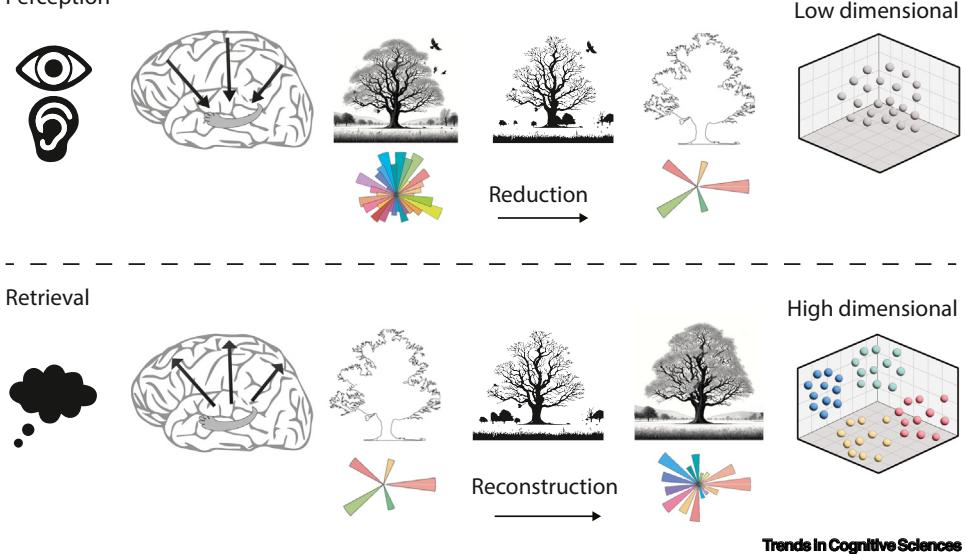
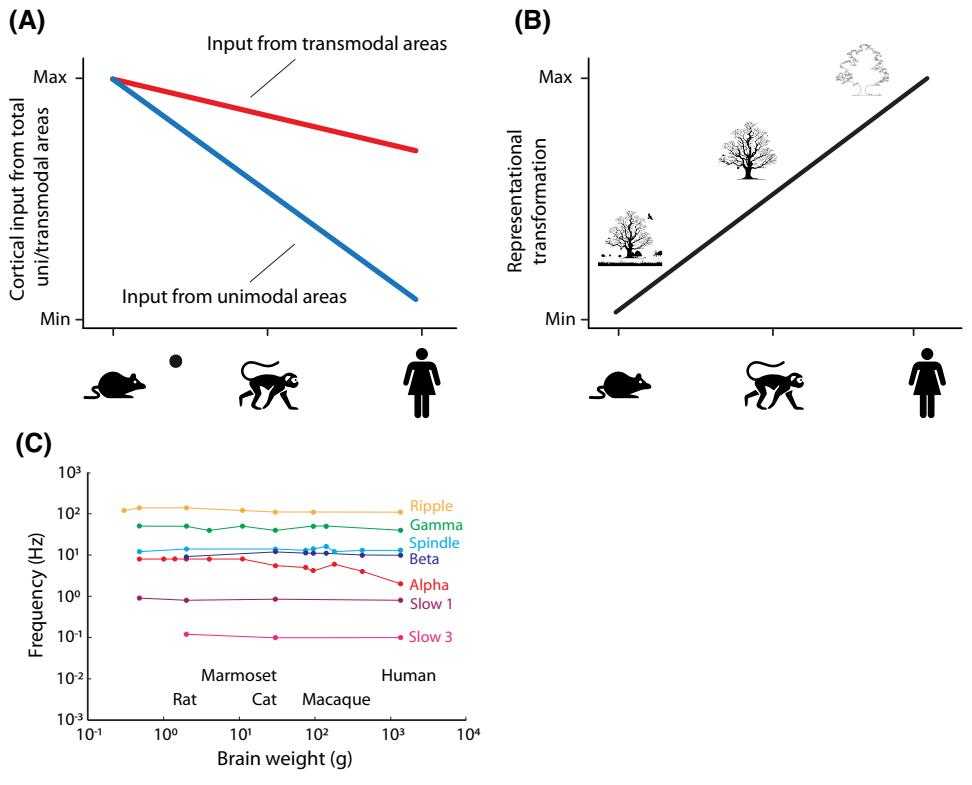

# Opinion

## Exploring the role of dimensionality transformation in episodic memory

Casper Kerrén^1^, *,@, Daniel Reznik^1^, Christian F. Doeller^1,2^, and Benjamin J. Griffiths^3^, *,@

Episodic memory must accomplish two adversarial goals: encoding and storing a multitude of experiences without exceeding the finite neuronal structure of the brain, and recalling memories in vivid detail. Dimensionality reduction and expansion ('dimensionality transformation') enable the brain to meet these demands. Reduction compresses sensory input into simplified, storable codes, while expansion reconstructs vivid details. Although these processes are essential to memory, their neural mechanisms for episodic memory remain unclear. Drawing on recent insights from cognitive psychology, systems neuroscience, and neuroanatomy, we propose two accounts of how dimensionality transformation occurs in the brain: structurally (via corticohippocampal pathways) and functionally (through neural oscillations). By examining cross-species evidence, we highlight neural mechanisms that may support episodic memory and identify crucial questions for future research.

## The necessity of dimensionality transformation in episodic memory

Episodic memory involves the encoding, storage, and retrieval of personal experience, enabling individuals to re-experience and reconstruct past events [[1]](#ref-1). However, it is unclear how we could store such vast amounts of detail, given the finite neuronal structure of the brain [[2]](#ref-2). A solution to this paradox is that complex sensory experiences are reduced into a simplified representation (see [Glossary](#glossary)) [[3]](#ref-3), capturing only what is deemed relevant, which can later be reconstructed into an approximation of the event [[4]](#ref-4)–[6]](#ref-6). Fortuitously, this not only resolves storage space issues; in other domains, it has also been shown to accentuate key information [[7]](#ref-7) and enable the stored content to generalise across contexts [[8]](#ref-8),[[9]](#ref-9). However, it remains unclear how the brain accomplishes this dimensionality transformation.

In this opinion, we propose how dimensionality transformation unfolds within the brain. Specifically, we discuss (i) how high-dimensional sensory inputs are transformed into lower-dimensional representations that can be encoded as long-term memories, and (ii) how high-dimensional sensory details can be reconstructed from lower-dimensional codes to enable us to recall the past in high detail. We begin by providing an overview of neural and behavioural evidence for dimensionality transformation across cognitive domains. We then narrow our focus to episodic memory and propose functional and structural mechanisms that can implement memory-benefitting dimensionality transformation in the brain. Finally, we address how excessive and/or insufficient transformation via these mechanisms can contribute to deficits in episodic memory function.

## Neural geometry of dimensionality transformation

Dimensionality transformation of neural representations can be depicted as geometric relationships between data points in space defined by neural activity, a concept referred to as neural geometry [[10]](#ref-10). Neural representations of the same sensory event take on different geometries as they are

### Highlights

The brain reduces and expands representations across time and regions. We propose that this is essential to episodic memory encoding, storage, and retrieval and is reflected in behaviour.

Dimensionality reduction minimises the number of features that will be encoded into a memory, reducing computational load and maximising storage capacity.

Dimensionality expansion enables experienced events to be reconstructed in vivid detail from their reduced mnemonic codes; however, this reconstruction might lack the original sensorial fidelity.

Across species, differences in corticohippocampal connectivity suggest differences in the degree of dimensionality transformation, which manifests in cross-species differences in behaviour.

Neural oscillations (gamma and thetagamma code) provide a framework to explain how the brain can implement dimensionality transformation in aid of episodic memory formation and retrieval.

1 Max Planck Institute for Human Cognitive and Brain Sciences, Leipzig, Germany

2 Kavli Institute for Systems Neuroscience, Centre for Neural Computation, Egil and Pauline Braathen and Fred Kavli Centre for Cortical Microcircuits, Jebsen Centre for Alzheimer's Disease, NTNU Norwegian University of Science and Technology, Trondheim, Norway
3 Centre for Human Brain Health, University of Birmingham, Birmingham, UK

### *Correspondence:

kerren@cbs.mpg.de (C. Kerrén) and b.griffiths.1@bham.ac.uk (B.J. Griffiths).
@ X: [@CKerren](https://twitter.com/CKerren) (C. Kerrén) and bsky: [@ckerren.bsky.social](https://bluesky.com/ckerren.bsky.social) (C. Kerrén) and [@benjamingriffiths.bsky.social](https://bluesky.com/benjamingriffiths.bsky.social) (B.J. Griffiths).

processed by different brain regions and across time. While the neural state space can have as many dimensions as recorded neurons/electrodes (e.g., 1 million dimensions from 1 million simultaneously recorded neurons [[11]](#ref-11)) and/or structure of a task (e.g., number of different experimental conditions), the correlated nature of neuronal activity (among other factors) is constrained by a low-dimensional neural manifold, where changes in the high-dimensional neural state space often reflect changes along a smaller number of latent variables. This neural manifold effectively reduces the complexity of the neural state space by focussing on the most significant patterns of variability in the data. The challenge of dimensionality transformation across regions and time is to identify the optimal number of dimensions required to balance robustness, efficiency, and flexibility to solve tasks effectively [[12]](#ref-12),[[13]](#ref-13). For instance, when there is a need for fine-grained classification, a high-dimensional representation may help distinguish variables [[8]](#ref-8). By contrast, if the same feature is shared across multiple tasks or stimuli (e.g., a shared context between conditions), a low-dimensional geometry for this feature may reduce computational load by reducing redundant representations (Box 1).

Analysis of neural geometry has provided significant insights into cognitive processes, such as working memory and decision-making (e.g., [14]](#ref-14)–[[18]](#ref-18)). For example, in an object sequence task, neurons in monkey dorsolateral prefrontal cortex exhibited representational dimensionality closely aligned with task demands, collapsing in dimensionality when errors occurred, suggesting

### Box 1. Is low dimensionality always better for episodic memory?

Dimensionality reduction algorithms aim to reduce the number of features while preserving the essential structure of the data. These methods may be critical in revealing how the brain transforms information for encoding, storage, and retrieval of episodic memories. In exploring these algorithms, it is important to consider how different dimensionality reduction techniques can enhance our understanding of episodic memory formation. However, that is not to say that episodic memory benefits from having the lowest dimensional representations possible. Indeed, there is a trade-off when it comes to determining the optimal dimensionality for a given task. While higher dimensionality offers a higher accuracy and precision in the representation (e.g., [[108]](#ref-108)) because data points are more easily separable by a linear decision boundary in higher-dimensional space [[109]](#ref-109), it also limits the capacity of the system (e.g., [[110]](#ref-110)). Therefore, one should not assume that the lowest possible dimensionality is always best for episodic memory.

Rather, we propose that the optimal dimensionality for episodic memory varies on a memory-to-memory basis and depends on specific task demands. For example, if an ongoing event takes place in a familiar location, the high statistical regularity between this instance and past instances of the location means that the representation of the location can take a low-dimensional form [[21]](#ref-21). By contrast, if we are required to remember specific details, the memory requires a higher-dimensional representation. This can be seen when participants are required to remember a series of faces: higher dimensionality during the processing of a face predicts its successful encoding [[24]](#ref-24), which might indicate that higher dimensionality could support the discrimination of fine-grained differences between other encoded faces.

This may impact the extent of dimensionality transformation to memory formation: if a high-precision memory is required, the level of reduction that occurs may be less than the reduction that occurs for other unimportant or highly predictable events. Therefore, while we continue to predict that reduction supports episodic memory formation, the extent of this reduction may vary on a memory-to-memory basis.

The variability in dimensionality transformation presents a challenge: it could render our claims difficult to falsify (also see 'Alternative accounts and falsifying the hypothesis' section in the main text). If the optimal dimensionality for episodic memory depends on the specifics of each memory and task demands, establishing a general, empirically testable rule becomes problematic. To address this, we emphasise assessing relative, rather than absolute, dimensionality [[111]](#ref-111) (also see [Box 2](#box-2) for further discussion). Thus, the focus is on the differences in dimensionality between conditions, rather than on the absolute number of dimensions representing features in specific brain areas.

To ensure consistency, task-relevant variables must remain constant across conditions. For instance, in a cued-recall task, only behavioural performance should distinguish conditions (e.g., correct vs. incorrect). This approach enables us to identify which representational dimensions differ between conditions and are relevant for correct responses. In addition, since dimensionality depends on the number of features (neurons or channels) and task-related factors, conditions should be matched accordingly.

### Glossary

### Dimensionality transformation:

number of variables required for the brain to represent a particular input, stimulus, or task space. This transformation enables the brain to extract essential features and patterns, facilitating episodic memory encoding and retrieval. This view advocates for a strong principle of dimensionality transformation, such that we believe the memory system uses different functions to transform the data, rather than it being a method of analysis.

Latent variables: variables that are not directly observed but are inferred from the observed data, often representing underlying factors or hidden structures that explain the patterns in the data.

Low-level and high-level features: in visual perception, basic and low-level perceptual features are the first to be represented, predominately in early visual sensory regions, before abstract and high-level semantic features emerge further along the visual ventral stream in the inferior temporal cortex.

Neural geometry: structured relationships among firing patterns across different input conditions. By analysing the geometric properties and spatial arrangements of neural responses in a high-dimensional space, this approach can reveal how neural circuits represent and process information, which can provide insights into the organisation and functions of the brain.

Neural manifold: low-dimensional representation or structure within a high-dimensional space of neural activity patterns, which captures the essential dynamics and relationships of neurons as they process information.

Neural oscillations: rhythmic fluctuations in neural activity that can be observed using a range of electrophysiological recording techniques (including single unit recordings, electroencephalography, and magnetoencephalography).

Representation: entities representing or signifying other entities, typically external to the mind. This premise suggests that information from the external environment is processed by the brain, encoded within some states, and subsequently influences behaviour in progressively more complex manners. State space: multidimensional space where each dimension represents a variable or the activity of a neuron, and

suboptimal representation of task-relevant information [[13]](#ref-13),[15]](#ref-15). Similarly, in human fMRI, the dimensionality of a visual representation corresponds to the number of stimulus features that are attended to [[7]](#ref-7),[[19]](#ref-19). Notably, dimensionality can fluctuate within a trial [[9]](#ref-9) and across brain regions [20]](#ref-20)–[[23]](#ref-23). These studies suggest that dimensionality transformation is a dynamic, task-driven phenomenon with a rapid onset after the event has been experienced.

Critically, this concept extends to episodic memory encoding and retrieval (Figure 1) (e.g., [[6]](#ref-6)). During encoding, dimensionality reduction can integrate responses to low-level features ('is it green?', 'is it large?', 'is it static?') into a high-level feature ('is it a tree?'), which is easy to store. Conversely, retrieval can involve dimensionality reconstruction, using high-level dimensions ('was it a tree?', 'were we in Hyde Park?') to activate lower-level sensory features related to the concept of a tree to help the vivid recollection of a past event. Notably, empirical evidence suggests that dimensionality transformations are critical to the effective operation of the memory system (e.g., [[24]](#ref-24)). Next, we explore how representational and dimensionality transformations unfold in episodic memory.

### Representational transformation and episodic memory

Representational transformations have a critical role in the encoding and retrieval of episodic memories. Encoding involves the transformation of environmental information, which passes from sensory systems (e.g., retina or inner ear) through cortical and subcortical areas to the hippocampus. This process entails progressive representational changes across brain areas, from unimodal cortical sensory regions through transmodal cortical sensory regions, each point within this space corresponds to a specific state of the neural system.

## Transmodal cortical sensory region:

cortical areas that do not show specificity for any sensory modality. Transmodal cortical areas receive direct anatomical input from unimodal areas and from other transmodal areas.

## Unimodal cortical sensory region:

cortical areas that show selective responses to one modality of sensory input, such as auditory or visual. Unimodal areas include primary sensory cortex and unimodal association cortex.

Figure 1. Dimensionality transformation across mnemonic stages. During perception, we hypothesise that neural representations need to be reduced to adhere to the finite number of neurons in the associative regions of the medial temporal lobe. This process is illustrated here as a sequence of images. Initially, a detailed image of a tree is surrounded by various elements, such as birds and other trees. Subsequently, images show a progressive reduction in detail. The final image depicts a simple outline of the original tree, symbolising a low-dimensional representation of the initial complex image. We propose that a low-dimensional representation of an event is stored in associative regions, such as the hippocampus. This reduced dimensional representation requires significantly less storage capacity compared with a high-dimensional one, thereby enabling the memory system to store a greater quantity of information. During retrieval, the low-dimensional code must be expanded, which occurs through interaction with cortical regions to reconstruct the memory. However, due to the initial reduction, the original event can never be fully reconstructed. This is depicted in the trees having fewer details and being distorted compared with the original images during perception. The polar plots symbolise that the number of dimension changes as a function of processing steps and time, from perception to storage and later retrieval.

culminating in the hippocampus, the endpoint of cortical hierarchy, where memories are stored [[25]](#ref-25)–[33]](#ref-33). During visual perception, basic low-level features are processed in early sensory regions before higher-level abstract features emerge in higher-order areas, such as the inferior temporal cortex [[34]](#ref-34)–[41]](#ref-41) and hippocampus [[20]](#ref-20),[42]](#ref-42). Importantly, this process involves transformation of the dimensions of the representation. A well-established example of this is place cells, where complex sensory information about the external world can be represented by single hippocampal cells [[20]](#ref-20) (outside of spatial navigation; e.g., [[43]](#ref-43)).

During memory retrieval, these transformations are thought to take a different form: that is, one that expands the simple stored code into a rich reconstruction of the original event [[44]](#ref-44). Evidence suggests that this process recruits regions originally involved in representing the event, as well as additional posterior cortical regions. For example, when recalling a visual object memory, the retrieved representation passes through the same visual perceptual regions engaged during encoding, undergoing the same representational transformations but in reverse order [[39]](#ref-39),[40]](#ref-40). In addition, visual features (e.g., colours or objects) represented in occipital/temporal regions during perception expand into transmodal parietal regions during retrieval [[45]](#ref-45). In both instances, these transformations relate to behaviour, with high-level features being retrieved more quickly compared with low-level details [[40]](#ref-40),[46]](#ref-46),[47]](#ref-47).

Together, these findings suggest that representational and dimensionality transformations dynamically shape memory encoding and retrieval, influencing how features of an external event are stored and reconstructed. Here, we explore how the memory system implements dimensionality transformations, how this can be assessed (Box 2), whether these processes transcend species boundaries, and how they manifest in behaviour.

### Box 2. Tracking dimensionality transformation during mnemonic processing stages

Dimensionality reduction algorithms can be broadly categorised as linear or nonlinear, both of which perform similarly when neural structures reflect simple behavioural dynamics [[112]](#ref-112). Linear methods, such as principal component analysis (PCA), identify optimal linear combinations of variables to maximise variance along new axes [[113]](#ref-113). PCA reduces dimensionality while preserving variability, making it a widely used approach in neuroscience (e.g., [[7]](#ref-7)). An extension of PCA, demixed PCA (dPCA), is particularly valuable in this context [[114]](#ref-114). dPCA demixes principal components based on experimental parameters, such as conditions, stimuli, or performance, enabling exploration of neural geometry linked to variables of interest. This approach can also extend to features of perceived stimuli and recalled memories. Other linear methods include multidimensional scaling (MDS [[115]](#ref-115)), linear discriminant analysis (LDA [[116]](#ref-116)), and factor analysis (FA [[117]](#ref-117)).

Nonlinear methods, such as t-distributed stochastic neighbour embedding (t-SNE), capture complex relationships that linear methods may miss. t-SNE retains local patterns and group relations in simplified data representations and has been used to analyse neuronal spikes [[118]](#ref-118) and visualise MRI data [[119]](#ref-119). However, t-SNE can be computationally demanding and sensitive to settings, requiring careful adjustment for optimal results. Other nonlinear methods include uniform manifold approximation and projection (UMAP) [[120]](#ref-120), locally linear embedding (LLE [[121]](#ref-121)), and Isomap [[122]](#ref-122). Sometimes, nonlinear methods can be used to interpret results from linear techniques [[123]](#ref-123).

A key challenge in dimensionality reduction is ensuring that findings reflect actual neural activity rather than methodological assumptions. For instance, PCA assumes that neural activity lies on a flat, linear surface, seeking projections that maximise variance. However, the true data structure (i.e., the manifold) may be curved or nonlinear. Linear methods, such as PCA, measure embedding dimensionality, representing the space the data occupy, while nonlinear methods aim to uncover intrinsic dimensionality (the minimal dimensions needed to describe data structure) [[109]](#ref-109),[111]](#ref-111),[124]](#ref-124). For example, data points on a 2D plane embedded in 3D space have an intrinsic dimensionality of two, because two dimensions suffice to describe the data, while the embedding dimensionality is three due to the 3D context. If the data lie on a flat plane, these dimensions agree, but differ when the structure is curved or nonlinear. Thus, selecting a method aligned with the research question and hypothesised neural data geometry is crucial.

Finally, extracted dimensions can reconstruct the original data, assessing the informativeness of retained dimensions. For linear methods, such as PCA, inverse transformations or cross-validated PCA [[125]](#ref-125) can be used. For nonlinear methods, reverse mapping via nonparametric regression can be applied [[126]](#ref-126). Correlating original and recovered data quantifies information loss during dimensionality reduction.

### Oscillatory underpinnings of reduction and reconstruction

How can memory-related dimensionality transformation be implemented in the brain? We propose that rhythmic fluctuations in neural activity, known as neural oscillations, may have a key role by facilitating the interaction of multiple stimulus dimensions and integrating them into a new, transformed representation.

Specifically, we propose that higher-frequency 'gamma' oscillations (~30–100 Hz) implement dimensionality transformation within the brain. The short excitatory window of these oscillations (~3 ms [[48]](#ref-48),[49]](#ref-49)) ensures that presynaptic neuronal assemblies coding for distinct dimensions of a stimulus can fire in unison [[50]](#ref-50), resulting in a convergent input on postsynaptic assemblies that integrate the input. Inhibition follows this wave of excitatory activity [[51]](#ref-51),[52]](#ref-52), preventing modification of the resultant transformation by other inputs. Based on these ideas, one would hypothesise that increases in gamma oscillatory activity would influence dimensionality transformation within the brain and ultimately benefit memory formation and retrieval.

There are numerous strands of support for this idea. First, gamma oscillations support local communication by functionally linking neuronal assemblies (e.g., [[53]](#ref-53),[54]](#ref-54); reviewed in [[49]](#ref-49); however, see [[55]](#ref-55)), suggesting that they relay information from presynaptic to postsynaptic assemblies. Second, gamma oscillations support the integration of unimodal inputs to produce a transmodal output [[56]](#ref-56)–[58]](#ref-58), suggesting that they facilitate representational transformation between assemblies. Third, increases in gamma oscillations are tied to successful memory formation (e.g., [59]](#ref-59)–[[61]](#ref-61)) and retrieval [[59]](#ref-59),[62]](#ref-62),[63]](#ref-63), and may be causally involved in both processes (e.g., [[64]](#ref-64),[65]](#ref-65)). Together, these findings indicate that gamma oscillations are well suited for implementing dimensionality transformation in episodic memory, but direct empirical evidence remains to be seen (see [Outstanding questions](#outstanding-questions)).

If gamma oscillations support both dimensionality reduction and dimensionality expansion, what determines whether a representation is compressed or reconstructed? One solution is to separate the two processes in time using theta oscillations (3–7 Hz). Theta oscillations facilitate switching between encoding and retrieval operations within the medial temporal lobe [[66]](#ref-66),[67]](#ref-67), coordinate activity between the hippocampus and cortex [[68]](#ref-68),[69]](#ref-69), and contain nested gamma oscillations [70]](#ref-70)–[[72]](#ref-72). Therefore, gamma-driven dimensionality transformation in the cortex could be orchestrated by medial temporal theta oscillations, with theta phase dictating whether a representation is compressed (and encoded) or expanded (during retrieval).

Alternatively, compression and reconstruction may be implemented by distinct gamma oscillations found in distinct laminar layers. Specifically, compression could be implemented by faster gamma oscillations, which are strongest in superficial laminar layers and feed information forward to high-order areas, while reconstruction could be implemented by slower gamma/beta oscillations, which are strongest in deeper layers, which feed information back to early sensory regions [[54]](#ref-54),[73]](#ref-73). Notably, these two hypotheses can be integrated: faster and slower gamma oscillations lock to distinct phases of theta [[70]](#ref-70),[72]](#ref-72), providing a mechanism to separate dimensionality reduction and expansion in temporal, spatial, and spectral domains.

Altogether, this provides a framework for how oscillatory activity supports both dimensionality reduction and dimensionality expansion in episodic memory. While there are many threads of evidence to implicate oscillatory-driven information transfer across the cortex and its benefit for memory, direct support for this framework will need to come from new research documenting how gamma oscillations influence memory-related changes in dimensionality.

## Evolutionary insights into memory-related dimensionality transformation

A key argument of this opinion is that dimensionality transformations supporting episodic memory occur through multiple processing steps transmitting information from the sensory periphery to the hippocampus. This implies that the extent of dimensionality transformations depends on the complexity of information-processing steps, which can be quantified in units of 'synaptic distance', representing the processing distance between perception and memory. Although testing this hypothesis in a single species is challenging, an evolutionary perspective offers a unique opportunity to examine how dimensionality transformations vary with the processing distance between perception and memory [[74]](#ref-74).

Comparative research into differences in the functional and structural organisation of cerebral cortex has pointed to significant changes in size, structural differentiation, and functional specialisation over mammalian phylogeny [[75]](#ref-75),[76]](#ref-76). Accordingly, human cognitive abilities, including episodic memory, are mostly attributed to the size of transmodal cortical regions, which disproportionately expanded in humans relative to other species [[77]](#ref-77). By contrast, the mammalian hippocampal formation largely retained its gross anatomical, cytoarchitectural, and functional properties over 200 million years of mammalian evolution [[74]](#ref-74). Although there is a debate over whether nonhuman animals have episodic memory, the idea of a preserved hippocampus supports the notion that animals may have prototypical forms of episodic memory. The striking contrast between the preserved hippocampus and diverse neocortex implies that the hippocampus performs similar functional roles, although operating on dramatically different types of information [[78]](#ref-78), implying that much can be learnt about the role of dimensionality transformations in episodic memory by examining differences in the corticohippocampal connectivity across species.

Anatomical tract-tracing studies in animals demonstrated that cortical projections to the perirhinal and parahippocampal/postrhinal cortex in macaques and rodents mirror species-specific cortical sensory specialisation. In macaques, most input to the perirhinal and parahippocampal cortex originates in visual areas, whereas, in rats, the input is more evenly distributed across visual, somatosensory, auditory, and olfactory sensory modalities [[79]](#ref-79). Importantly, the rat hippocampal region receives direct projections from all primary sensory cortices, while, in macaques, except from connections with the piriform cortex, only visual and auditory association regions project to the hippocampal region, suggesting that sensory information undergoes greater dimensionality transformations before encoding in macaque hippocampus.

Although tract-tracing methods are infeasible in humans, fMRI connectivity methods can explore whole-brain organisation of large-scale functional pathways by examining correlations in spontaneous brain activity across regions. Despite its limitations, fMRI recapitulates several connectivity patterns established through anatomical tract tracing. Recent fMRI connectivity research showed that the human hippocampal system is primarily associated with transmodal cortical regions [80]](#ref-80)–[[83]](#ref-83). This suggests an evolutionary shift in corticohippocampal interactions, with a recent analysis indicating an increasing dominance of transmodal over unimodal input to the hippocampal system across species, particularly from rats to humans [[84]](#ref-84). While all early sensory regions project directly to the hippocampal region in rats, the human hippocampal region shows minimal association with early sensory processing [[84]](#ref-84) (Figure 2A).

An important question is how changes in corticohippocampal interactions are reflected in dimensionality transformations. Existing behavioural evidence suggests that direct projections from sensory regions to the hippocampal system are associated with more veridical and less transformed sensory representations (Figure 2B). For example, in the visual domain, rats are more

### Trends in Cognitive Cognitive Sciences Sciences

Figure 2. Evolutionary changes in memory-related dimensionality transformations. (A) Cross-species differences in cortical unimodal and transmodal input to the parahippocampal region. The percentage of cortical input is calculated within each species separately. In the rat, all cortical unimodal and transmodal areas project to the parahippocampal region; in the human, almost no direct unimodal associations with the parahippocampal region exist. Note that, in humans, anatomical connectivity was estimated indirectly using fMRI. Adapted, with permission, from [[84]](#ref-84). (B) The hypothesised differences in the degree of representational reduction with minimal reduction indicates the highest sensorial precision and maximum reduction indicates the lowest sensorial precision. Rodents show least representational reduction and humans the most, with nonhuman primates as intermediary. (C) Frequency, waveform, and temporal evolution of neural oscillations are mostly preserved across mammals, allowing cross-species examination of dimensionality transformations using electrophysiology. Adapted, with permission, from [[89]](#ref-89).

prone to view-centred manipulations of a target object compared with nonhuman primates [[85]](#ref-85),[86]](#ref-86), which are more sensitive to low-level changes in a visual prototype assignment task [[87]](#ref-87).

Although cross-species differences in memory are challenging to study [[88]](#ref-88) due to inherent variations in sensory perception and decision-making strategies, this direction offers an exciting hypothesis space for examining the effects of cortical hierarchy on mnemonic representations (Figure 2C; see Outstanding questions). This becomes particularly interesting because the frequency, waveform, and temporal evolution of neural oscillations are mostly preserved across mammals investigated to date [[89]](#ref-89) (Figure 2D).

These findings indicate that the neuroanatomical foundation for constructing episodic memories in the human brain differs significantly from that in other species [[84]](#ref-84). Thus, the human hippocampal formation likely receives highly processed transmodal input that is more abstract than the input processed by the hippocampi of other species. This results in unique human episodic memories better described in terms of latent states [[90]](#ref-90), which lack high-dimensional sensory details [[91]](#ref-91). Importantly, this implies that human episodic memory primarily operates through reconstruction,

requiring the re-expansion of stored events. In other words, human neuroanatomy may require dimensionality transformation to encode and retrieve episodic memories. How this impacts the translation of episodic memory research across species remains to be seen.

## The behavioural consequences of dimensionality transformation

We propose that the way in which dimensionality transformation is implemented not only shapes how memories are represented in the brain, but also how memories are expressed behaviourally. Here, we discuss how such transformations can explain behavioural phenomena often observed in memory studies.

First, dimensionality transformation may explain interference- and time-dependent forgetting. Unlike static computer algorithms, the neural networks of the brain change over time, meaning that the neural network that encodes sensory information will not be the same one that later reconstructs it [[92]](#ref-92),[93]](#ref-93). Minor neural changes can reduce precision, while major changes may lead to complete forgetting. These changes, influenced by new information and time, may disrupt reconstructive processes, leading to time- or interference-dependent forgetting.

Second, dimensionality transformation can result in prototypical biases that are observable during memory retrieval. Memory distortions often result from statistical regularities (e.g., [94]](#ref-94)–[[96]](#ref-96)) or pre-existing knowledge (e.g., [[97]](#ref-97)). During encoding, dimensionality reduction may remove specific sensory details, leaving a schematic or prototypical representation. This loss of specificity increases reliance on semantic information during retrieval (e.g., [[96]](#ref-96)), leading to distortions. Studies show that memories for attributes such as colour and location shift toward prototypes during encoding and continue to distort during retrieval [[97]](#ref-97). In short, dimensionality reduction may reduce the specificity of a memory, leaving it vulnerable to distortion by semantic knowledge.

Third, dimensionality transformation can explain the phenomenon of chunking [[98]](#ref-98). Similar to data compression, chunking simplifies memory by grouping smaller elements into larger units (e.g., converting a 12-digit number into four 3-digit numbers). The similarity between chunking and data compression algorithms has already been noted [[99]](#ref-99), and we postulate that the extent of dimensionality transformation may predict the degree of chunking, with greater transformation leading to more chunking.

In short, dimensionality transformation could provide an explanation for the described behavioural phenomena. If these predictions are validated empirically, it would demonstrate that dimensionality transformation has a critical role in the phenomenological experience of remembering.

### Alternative accounts and falsifying the hypothesis

Our proposal aligns with similar theories that suggest that the hippocampus uses low-dimensional representations as pointers or keys to the content or value representation in cortical regions, such as the Hippocampal Index, Complementary Learning Systems, and pattern separation/completion [[6]](#ref-6),[[100]](#ref-100)–[103]](#ref-103). Critically, however, we distinguish ourselves from these frameworks by viewing dimensionality transformation not as a single computation accomplished by the hippocampus [[103]](#ref-103) or other medial temporal regions [[6]](#ref-6), but as a series of computations that unfold across the cortical hierarchy. We can distinguish these ideas in a simple empirical test: if dimensionality transformation arises in the hippocampus [[103]](#ref-103) or other medial temporal region [[6]](#ref-6), one would expect to see little-to-no dimensionality transformation anywhere in the neocortex, but instead a single step-like change from the neocortex to hippocampus/medial temporal lobe. By contrast, if dimensionality transformation progressively unfolds along the cortical hierarchy (as we propose here), the dimensionality of a stimulus should steadily decrease from every region

between early sensory regions and the hippocampus. Such an experiment would present key insights into how dimensionality transformation unfolds in the brain.

What would it take to refute the idea that dimensionality transformation supports episodic memory function? Perhaps the simplest approach is to demonstrate that dimensionality transformation does not correlate with successful memory formation/retrieval. Such evidence would again raise the question of how a rich sensory world can be stored in a brain with finite storage capacity, but this could be addressed by proposing that the brain reduces the number of neurons coding for each dimension in higher-order regions (rather than reducing the number of dimensions). However, in our opinion, such a mechanism would render memories highly unstable, whereby small modifications to neuronal connections could decimate key features of a memory. Therefore, we consider dimensionality reduction/expansion to be the more viable method for storing and recalling complex episodic memories.

Our testable hypotheses are also falsifiable. For example, our oscillatory framework for dimensionality transformation can be refuted if it is demonstrated that dimensionality transformation arises in a different frequency band (e.g., alpha oscillations) or in aperiodic activity. Our account proposes that dimensionality transformation arises through tight synchrony between presynaptic neuronal assemblies, which ensures information converges on a postsynaptic assembly that integrates the input. However, slower oscillations and aperiodic dynamics do not produce such tight coupling [[50]](#ref-50); thus, observations that these patterns of activity accomplish dimensionality transformation would question our proposal. Indeed, these patterns of activity could explain dimensionality transformation without coupling if the input to receiving assemblies is asynchronous but rapid enough to outpace and decay to membrane resting potential. While viable, we think that this mechanism is less reliable than an oscillatory model because the transformation will likely vary based on stochastic differences in the asynchronous input, making it substantially more difficult to accurately compress an incoming stimulus or reconstruct a recalled memory.

Our argument pertaining to cross-species differences in dimensionality transformations could be falsified by examining the differences between neural activity evoked during encoding and neural activity evoked during recall. Our working hypothesis is that reduced unimodal input to the hippocampal system is associated with increased dimensionality transformations. This hypothesis would be supported by data showing that the neural activity in species that have direct anatomical projections from early sensory regions to the hippocampal system (e.g., rats) is more similar between encoding versus recall, compared with species that have less, or not at all, direct anatomical projections from early sensory regions to the hippocampal system (e.g., macaques or humans).

### Concluding remarks

Recalling a past event is not identical to experiencing it firsthand. Details may be lost, altered, or added over time, indicating that our episodic memories are dynamic and subject to constant change. Here, we highlight the role of neural representations inherently undergoing transformations as they progress through the processing hierarchy of the brain [[104]](#ref-104). We propose that these transformations are implemented by gamma oscillations, which facilitate the integration of multiple dimensions to compress or expand the representation. Future studies using perturbation techniques, such as various forms of brain stimulation [[105]](#ref-105), can validate the significant role of neural oscillations in memory transformations.

Moreover, we review recent evidence demonstrating that the input pathways to the hippocampus vary across species, constraining the types of information that can be stored and retrieved. In humans, the hippocampal region is primarily associated with transmodal cortical regions,

### Outstanding questions

When information is encoded, how does the representational dimensionality change across regions? How does this affect successful storage?

Once a cue prompts a retrieval process, how is the brain unwrapping a low-dimensional latent space that might then orchestrate the retrieval process and how does this impact behaviour?

What is the neural trajectory of representational dimensionality signalling from the hippocampus to neocortical regions during episodic memory retrieval? To what extent is this supported by hippocampal ripples and replay?

How does prior knowledge interact with the process of dimensionality transformation during the formation of new memories?

Does the transformation of memory shift viewpoints from an egocentric to allocentric reference frame (akin to that seen in cells coding for ego- versus allocentric reference frames)?

What is the difference between brain activity evoked during perception versus retrieval across species? Do humans have the greatest perception– retrieval discrepancy compared with other species, as predicted by neuroanatomy?

What is the optimal level of reduction for memory formation: does too much reduction lead to a vague memory or only the gist of an event? Does too little reduction mean that we have exceptional detail for some aspects of the event, but nothing for other parts? Is this related to post-traumatic stress disorder, where the remembering of the trauma event is much more vivid and detailed compared with the surrounding details?

What is the relative importance of oscillatory power and oscillatory frequency for dimensionality transformation? Can an increase in power without a shift in frequency accomplish reduction, or does reduction rely on both phenomena co-occurring?

## Trends in Cognitive Sciences

### Box 3. Dimensionality transformation beyond episodic memory

While we focussed in the main text on dimensionality transformation in episodic memory, dimensionality transformation may also play a significant role in several other cognitive domains.

### Working memory

Similar to episodic memory, working memory is of limited capacity. Therefore, dimensionality reduction may help increase the amount of information that can be simultaneously maintained in working memory. For example, the decodability of distinct dimensions of a stimulus held in working memory is tied to the task-relevance of the dimension: the greater its relevance, the easier it is to decode [[127]](#ref-127). Moreover, as alluded to in the main text, dimensionality transformation may explain how the cognitive construct of 'chunking' is implemented in the brain.

### Future thinking

The mechanisms that enable us to look back upon our past (i.e., episodic memory) are thought to also enable us to plan for the future [[128]](#ref-128), and dimensionality transformation may be a key tool for this. Lower-dimensional representations of memories are believed to aid generalisation by focussing on the core, essential features of experiences while filtering out extraneous details [[8]](#ref-8),[9]](#ref-9). This enables individuals to draw on past experiences and apply them more effectively to novel situations. By using low-dimensional memories [[107]](#ref-107), individuals can adapt lessons from the past to guide future behaviour and solve new problems, without being overwhelmed by the specific details of the original event. Thus, the transformation of episodic memories into low-dimensional formats supports both the flexible use of past knowledge and the anticipation of future scenarios.

### Object recognition

Dimensionality reduction facilitates object recognition by filtering out irrelevant, superficial details (e.g., lighting or position) and accentuating the prototypical aspects of the object, facilitating classification [[29]](#ref-29),[129]](#ref-129).

### Goal-directed behaviour

Dimensionality reduction can facilitate goal-directed behaviour by placing current circumstance and future goals on the same dimension [[19]](#ref-19).

suggesting that memory retrieval in humans is more about reconstructing reduced information rather than replicating it exactly (see [[84]](#ref-84) for a discussion). Future research should explore the differences in content by the means of representational dimensions conveyed by unimodal and transmodal areas across species, providing further insights into the potentially unique characteristics of the human memory system.

A critical question in memory research is how the brain can recall intricate details of past events, given that it does not operate as a lossless compression algorithm [[106]](#ref-106). Recent computational models suggest that memory reconstruction depends on the number of stored memories, with the details for individual memories decreasing as more memories are accumulated [[107]](#ref-107). This reduction in computational load prevents a 'memory cliff,' reflecting everyday memory retrieval, where we might not recall all details but remember the gist. Developing biologically plausible computational models is essential for understanding the memory system, where we propose that reduction and expansion across time and regions have a crucial role.

In summary, we emphasise here the importance of dimensionality transformation in the neural mechanisms underlying episodic memory and beyond (Box 3). By examining advances in cognitive psychology, systems neuroscience, and neuroanatomy, we show how these transformations can be empirically assessed and implemented.

### Acknowledgements

The authors would like to thank Andrej Bicanski, Paul Muhle-Karbe, and Sander Van Bree for their constructive input and discussions on this work. C.K., D.R., and C.F.D. are supported by the Max Planck Society. B.J.G. is supported by a Leverhulme Trust Early Career Fellowship (ECF-2021-628).

Can deep neural networks be used to identify the number of relevant dimensions in an encoded image and allow assessment of the capability of the brain to perform dimensionality transformation for encoding, storage, and retrieval?

### Declaration of interests

The authors declare no competing interests.

### References

- 1. Tulving, E. (1972) Episodic and semantic memory. In Organization of Memory (Tulving, E. and Donaldson, W., eds), pp. 590–600, Academic Press
- 2. Almeida, L. de et al. (2007) Memory retrieval time and memory capacity of the CA3 network: role of gamma frequency oscillations. Learn. Mem. 14, 795–806
- 3. Frankish, K. and Ramsey, W. (2012) The Cambridge Handbook of Cognitive Science, Cambridge University Press
- 4. Bartlett, F.C. (1932) Remembering: A Study in Experimental and Social Psychology, Cambridge University Press
- 5. Bates, C.J. and Jacobs, R.A. (2020) Efficient data compression in perception and perceptual memory. Psychol. Rev. 127, 891–917
- 6. McClelland, J.L. et al. (1995) Why there are complementary learning systems in the hippocampus and neocortex: insights from the successes and failures of connectionist models of learning and memory. Psychol. Rev. 102, 419–457
- 7. Mack, M.L. et al. (2020) Ventromedial prefrontal cortex compression during concept learning. Nat. Commun. 11, 46
- 8. Badre, D. et al. (2021) The dimensionality of neural representations for control. Curr. Opin. Behav. Sci. 38, 20–28
- 9. Bernardi, S. et al. (2020) The geometry of abstraction in the hippocampus and prefrontal cortex. Cell 183, 954–967
- 10. Chung, S. and Abbott, L.F. (2021) Neural population geometry: an approach for understanding biological and artificial neural networks. Curr. Opin. Neurobiol. 70, 137–144
- 11. Manley, J. et al. (2024) Simultaneous, cortex-wide dynamics of up to 1 million neurons reveal unbounded scaling of dimensionality with neuron number. Neuron 112, 1694–1709
- 12. Luppi, A.I. et al. (2024) Information decomposition and the informational architecture of the brain. Trends Cogn. Sci. 28, 352–368
- 13. Rigotti, M. et al. (2013) The importance of mixed selectivity in complex cognitive tasks. Nature 497, 585–590
- 14. Menghi, N. et al. (2021) Multitask learning over shared subspaces. PLoS Comput. Biol. 17, e1009092
- 15. Bartolo, R. et al. (2020) Dimensionality, information and learning in prefrontal cortex. PLoS Comput. Biol. 16, e1007514
- 16. Brincat, S.L. et al. (2018) Gradual progression from sensory to task-related processing in cerebral cortex. Proc. Natl. Acad. Sci. U. S. A. 115, E7202–E7211
- 17. Theves, S. et al. (2020) The hippocampus maps concept space, not feature space. J. Neurosci. 40, 7318–7325
- 18. Kikumoto, A. et al. (2024) A transient high-dimensional geometry affords stable conjunctive subspaces for efficient action selection. Nat. Commun. 15, 8513
- 19. Muhle-Karbe, P.S. et al. (2023) Goal-seeking compresses neural codes for space in the human hippocampus and orbitofrontal cortex. Neuron 111, 3885–3899
- 20. Reber, T.P. et al. (2019) Representation of abstract semantic knowledge in populations of human single neurons in the medial temporal lobe. PLoS Biol. 17, e3000290
- 21. Benna, M.K. and Fusi, S. (2021) Place cells may simply be memory cells: memory compression leads to spatial tuning and history dependence. Proc. Natl. Acad. Sci. U. S. A. 118, e2018422118
- 22. Tang, E. et al. (2019) Effective learning is accompanied by highdimensional and efficient representations of neural activity. Nat. Neurosci. 22, 1000–1009
- 23. Park, S.A. et al. (2023) The representational geometry of cognitive maps under dynamic cognitive control. bioRxiv, Published online February 4, 2023. https://doi.org/10.1101/2023.02.04.527142
- 24. Sheng, J. et al. (2022) Higher-dimensional neural representations predict better episodic memory. Sci. Adv. 8, eabm3829
- 25. Hubel, D.H. and Wiesel, T.N. (1962) Receptive fields, binocular interaction and functional architecture in the cat's visual cortex. J. Physiol. 160, 106–154
- 26. Felleman, D.J. and Van Essen, D.C. (1991) Distributed hierarchical processing in the primate cerebral cortex. Cereb. Cortex 1, 1–47
- 27. Pandya, D.N. and Seltzer, B. (1982) Intrinsic connections and architectonics of posterior parietal cortex in the rhesus monkey. J. Comp. Neurol. 204, 196–210
- 28. Bar-Gad, I. et al. (2003) Information processing, dimensionality reduction and reinforcement learning in the basal ganglia. Prog. Neurobiol. 71, 439–473
- 29. DiCarlo, J.J. and Cox, D.D. (2007) Untangling invariant object recognition. Trends Cogn. Sci. 11, 333–341
- 30. Hung, C.P. et al. (2005) Fast readout of object identity from macaque inferior temporal cortex. Science 310, 863–866
- 31. Mishkin, M. et al. (1983) Object vision and spatial vision: two cortical pathways. Trends Neurosci. 6, 414–417
- 32. Tanaka, K. et al. (1991) Coding visual images of objects in the inferotemporal cortex of the macaque monkey. J. Neurophysiol. 66, 170–189
- 33. Kaas, J.H. and Hackett, T.A. (2000) Subdivisions of auditory cortex and processing streams in primates. Proc. Natl. Acad. Sci. U. S. A. 97, 11793–11799
- 34. Lehky, S.R. and Tanaka, K. (2016) Neural representation for object recognition in inferotemporal cortex. Curr. Opin. Neurobiol. 37, 23–35
- 35. Tyler, L.K. et al. (2013) Objects and categories: feature statistics and object processing in the ventral stream. J. Cogn. Neurosci. 25, 1723–1735
- 36. Cichy, R.M. et al. (2014) Resolving human object recognition in space and time. Nat. Neurosci. 17, 455–462
- 37. Guclu, U. and van Gerven, M.A.J. (2015) Deep neural networks reveal a gradient in the complexity of neural representations across the ventral stream. J. Neurosci. 35, 10005–10014
- 38. Hebart, M.N. et al. (2018) The representational dynamics of task and object processing in humans. eLife 7, e32816
- 39. Lifanov-Carr, J. et al. (2024) Reconstructing Spatiotemporal Trajectories of Visual Object Memories in the Human Brain. eNeuro 11, ENEURO.0091-24.2024
- 40. Linde-Domingo, J. et al. (2019) Evidence that neural information flow is reversed between object perception and object reconstruction from memory. Nat. Commun. 10, 179
- 41. Allen, E.J. et al. (2022) A massive 7T fMRI dataset to bridge cognitive neuroscience and artificial intelligence. Nat. Neurosci. 25, 116–126
- 42. Krenz, V. et al. (2023) Time-dependent memory transformation in hippocampus and neocortex is semantic in nature. Nat. Commun. 14, 6037
- 43. Kolibius, L.D. et al. (2023) Hippocampal neurons code individual episodic memories in humans. Nat. Hum. Behav. 7, 1968–1979
- 44. Cheng, Z. et al. (2018) Deep convolutional AutoEncoder-based Lossy image compression. In 2018 Picture Coding Symposium (PCS), pp. 253–257, IEEE
- 45. Favila, S.E. et al. (2018) Parietal representations of stimulus features are amplified during memory retrieval and flexibly aligned with top-down goals. J. Neurosci. 38, 7809–7821
- 46. Lifanov, J. et al. (2021) Feature-specific reaction times reveal a semanticisation of memories over time and with repeated remembering. Nat. Commun. 12, 3177
- 47. Mirjalili, S. et al. (2021) Context memory encoding and retrieval temporal dynamics are modulated by attention across the adult lifespan. eNeuro 8, ENEURO.0387-20.2020
- 48. Csicsvari, J. et al. (2003) Mechanisms of gamma oscillations in the hippocampus of the behaving rat. Neuron 37, 311–322
- 49. Fries, P. (2015) Rhythms for cognition: communication through coherence. Neuron 88, 220–235
- 50. Jensen, O. et al. (2007) Human gamma-frequency oscillations associated with attention and memory. Trends Neurosci. 30, 317–324

## OPEN ACCESS

## Trends in Cognitive Sciences

- 51. Wang, X.-J. and Buzsáki, G. (1996) Gamma oscillation by synaptic inhibition in a hippocampal interneuronal network model. J. Neurosci. 16, 6402–6413
- 52. Cardin, J.A. et al. (2009) Driving fast-spiking cells induces gamma rhythm and controls sensory responses. Nature 459, 663–667
- 53. Womelsdorf, T. et al. (2007) Modulation of neuronal interactions through neuronal synchronization. Science 316, 1609–1612
- 54. Bastos, A.M. et al. (2020) Layer and rhythm specificity for predictive routing. Proc. Natl. Acad. Sci. U. S. A. 117, 31459–31469
- 55. Vinck, M. et al. (2023) Principles of large-scale neural interactions. Neuron 111, 987–1002
- 56. Senkowski, D. et al. (2005) Multisensory processing and oscillatory gamma responses: effects of spatial selective attention. Exp. Brain Res. 166, 411–426
- 57. Senkowski, D. et al. (2007) Good times for multisensory integration: effects of the precision of temporal synchrony as revealed by gamma-band oscillations. Neuropsychologia 45, 561–571
- 58. Misselhorn, J. et al. (2019) Synchronization of sensory gamma oscillations promotes multisensory communication. eNeuro 6, ENEURO.0101
- 59. Griffiths, B.J. et al. (2019) Directional coupling of slow and fast hippocampal gamma with neocortical alpha/beta oscillations in human episodic memory. Proc. Natl. Acad. Sci. U. S. A. 116, 21834–21842
- 60. Costa, M. et al. (2022) Aversive memory formation in humans involves an amygdala-hippocampus phase code. Nat. Commun. 13, 6403
- 61. Karlsson, A.E. et al. (2022) Out of rhythm: compromised precision of theta-gamma coupling impairs associative memory in old age. J. Neurosci. 42, 1752–1764
- 62. Pacheco Estefan, D. et al. (2019) Coordinated representational reinstatement in the human hippocampus and lateral temporal cortex during episodic memory retrieval. Nat. Commun. 10, 2255
- 63. Treder, M.S. et al. (2021) The hippocampus as the switchboard between perception and memory. Proc. Natl. Acad. Sci. U. S. A . 118, e2114171118
- 64. Wang, D. et al. (2023) Altering stimulus timing via fast rhythmic sensory stimulation induces STDP-like recall performance in human episodic memory. Curr. Biol. 33, 3279–3288.e7
- 65. Etter, G. et al. (2019) Optogenetic gamma stimulation rescues memory impairments in an Alzheimer's disease mouse model. Nat. Commun. 10, 5322
- 66. Kerrén, C. et al. (2018) An optimal oscillatory phase for pattern reactivation during memory retrieval. Curr. Biol. 28, 3383–3392.e6
- 67. Kunec, S. et al. (2005) Encoding and retrieval in the CA3 region of the hippocampus: a model of theta-phase separation. J. Neurophysiol. 94, 70–82
- 68. Backus, A.R. et al. (2016) Hippocampal-prefrontal theta oscillations support memory integration. Curr. Biol. 26, 450–457
- 69. Sirota, A. et al. (2008) Entrainment of neocortical neurons and gamma oscillations by the hippocampal theta rhythm. Neuron 60, 683–697
- 70. Colgin, L.L. et al. (2009) Frequency of gamma oscillations routes flow of information in the hippocampus. Nature 462, 353–357
- 71. Griffiths, B.J. et al. (2021) Disentangling neocortical alpha/beta and hippocampal theta/gamma oscillations in human episodic memory formation. NeuroImage 242, 118454
- 72. Lopes-dos-Santos, V. et al. (2018) Parsing hippocampal theta oscillations by nested spectral components during spatial exploration and memory-guided behavior. Neuron 100, 940–952.e7
- 73. Miller, E.K. et al. (2018) Working Memory 2.0. Neuron 100, 463–475
- 74. Manns, J.R. and Eichenbaum, H. (2006) Evolution of declarative memory. Hippocampus 16, 795–808
- 75. Kaas, J.H. (1989) The evolution of complex sensory systems in mammals. J. Exp. Biol. 146, 165–176
- 76. Krubitzer, L. (2007) The magnificent compromise: cortical field evolution in mammals. Neuron 56, 201–208
- 77. Buckner, R.L. and Krienen, F.M. (2013) The evolution of distributed association networks in the human brain. Trends Cogn. Sci. 17, 648–665
- 78. Zhu, S.L. et al. (2023) Computational cross-species views of the hippocampal formation. Hippocampus 33, 586
- 79. Burwell, R.D. et al. (1995) Perirhinal and postrhinal cortices of the rat: a review of the neuroanatomical literature and comparison with findings from the monkey brain. Hippocampus 5, 390–408
- 80. Reznik, D. et al. (2023) Dissociating distinct cortical networks associated with subregions of the human medial temporal lobe using precision neuroimaging. Neuron 111, 2756–2772.e7
- 81. Zheng, C. et al. (2021) Hippocampal place cell sequences differ during correct and error trials in a spatial memory task. Nat. Commun. 12, 3373
- 82. Reznik, D. et al. (2024) Evidence for convergence of distributed cortical processing in band-like functional zones in human entorhinal cortex. Curr. Biol. 34, 5457–5469.e2
- 83. Angeli, P.A. et al. (2025) Specialization of the human hippocampal long axis revisited. Proc. Natl. Acad. Sci. U. S. A. 122, e2422083122
- 84. Reznik, D. et al. (2024) Phylogeny of neocortical-hippocampal projections provides insight in the nature of human memory. bioRxiv, Published online May 09, 2024. https://doi.org/10.1101/2024.05.09.593130
- 85. Kell, A.J.E. et al. (2022) Marmoset core visual object recognition behavior is comparable to that of macaques and humans. iScience 26, 105788
- 86. Zoccolan, D. et al. (2009) A rodent model for the study of invariant visual object recognition. Proc. Natl. Acad. Sci. U. S. A. 106, 8748–8753
- 87. Smith, J.D. et al. (2008) Prototype abstraction by monkeys (Macaca mulatta). J. Exp. Psychol. Gen. 137, 390–401
- 88. Jeffery, K.J. et al. (2024) Unpacking the navigation toolbox: insights from comparative cognition. Proc. Biol. Sci. 291, 20231304
- 89. Buzsáki, G. et al. (2013) Scaling brain size, keeping timing: evolutionary preservation of brain rhythms. Neuron 80, 751–764
- 90. Tolman, E.C. (1948) Cognitive maps in rats and men. Psychol. Rev. 55, 189–208
- 91. Autore, L. et al. (2023) Adaptive expression of engrams by retroactive interference. Cell Rep. 42, 112999
- 92. Geva, N. et al. (2023) Time and experience differentially affect distinct aspects of hippocampal representational drift. Neuron 111, 2357–2366.e5
- 93. Khatib, D. et al. (2023) Active experience, not time, determines within-day representational drift in dorsal CA1. Neuron 111, 2348–2356.e4
- 94. Bowman, C.R. et al. (2020) Tracking prototype and exemplar representations in the brain across learning. eLife 9, e59360
- 95. Tompary, A. and Thompson-Schill, S.L. (2021) Semantic influences on episodic memory distortions. J. Exp. Psychol. Gen. 150, 1800–1824
- 96. Huttenlocher, J. et al. (1991) Categories and particulars: prototype effects in estimating spatial location. Psychol. Rev. 98, 352–376
- 97. Kerrén, C. et al. (2024) A reduction in self-reported confidence accompanies the recall of memories distorted by prototypes. Commun. Psychol. 2, 58
- 99. Miller, G.A. (1956) The magical number seven, plus or minus two: Some limits on our capacity for processing information. Psychol. Rev. 63, 81–97
- 99. Norris, D. and Kalm, K. (2021) Chunking and data compression in verbal short-term memory. Cognition 208, 104534
- 100. Teyler, T.J. and DiScenna, P. (1986) The hippocampal memory indexing theory. Behav. Neurosci. 100, 147–154
- 101. O'Reilly, R.C. and Norman, K.A. (2002) Hippocampal and neocortical contributions to memory: advances in the complementary learning systems framework. Trends Cogn. Sci. 6, 505–510
- 102. Kumaran, D. and McClelland, J.L. (2012) Generalization through the recurrent interaction of episodic memories. Psychol. Rev. 119, 573–616
- 103. Yassa, M.A. and Stark, C.E.L. (2011) Pattern separation in the hippocampus. Trends Neurosci. 34, 515–525
- 104. Andermane, N. et al. (2021) Forgetting across a hierarchy of episodic representations. Curr. Opin. Neurobiol. 67, 50–57
- 105. Hanslmayr, S. et al. (2019) Modulating human memory via entrainment of brain oscillations. Trends Neurosci. 42, 485–499
- 106. Loewenstein, Y. et al. (2015) Predicting the dynamics of network connectivity in the neocortex. J. Neurosci. 35, 12535
- 107. Chandra, S. et al. (2025) Episodic and associative memory from spatial scaffolds in the hippocampus. Nature, Published online January 15, 2025. https://doi.org/10.1038/s41586-024-08392-y
- 108. Zylberberg, J. et al. (2017) Robust information propagation through noisy neural circuits. PLoS Comput. Biol. 13, e1005497
- 109. Jazayeri, M. and Ostojic, S. (2021) Interpreting neural computations by examining intrinsic and embedding dimensionality of neural activity. Curr. Opin. Neurobiol. 70, 113–120
- 110. Kafashan, M. et al. (2021) Scaling of sensory information in large neural populations shows signatures of information-limiting correlations. Nat. Commun. 12, 473
- 111. Humphries, M.D. (2021) Strong and weak principles of neural dimension reduction. NBDT 5, 1–28
- 112. Mitchell-Heggs, R. et al. (2023) Neural manifold analysis of brain circuit dynamics in health and disease. J. Comput. Neurosci. 51, 1–21
- 113. Ivosev, G. et al. (2008) Dimensionality reduction and visualization in principal component analysis. Anal. Chem. 80, 4933–4944
- 114. Kobak, D. et al. (2016) Demixed principal component analysis of neural population data. eLife 5, e10989
- 115. Kruskal, J.B. and Wish, M. (1978) Multidimensional Scaling, SAGE
- 116. Fisher, R.A. (1936) The use of multiple measurements in taxonomic problems. Ann. Eugenics 7, 179–188
- 117. Spearman, C. (1904) The proof and measurement of association between two things. Am. J. Psychol. 15, 72–101
- 118. Dimitriadis, G. et al. (2018) t-SNE visualization of large-scale neural recordings. Neural Comput. 30, 1750–1774
- 119. Panta, S.R. et al. (2016) A tool for interactive data visualization: application to over 10,000 brain imaging and phantom MRI data sets. Front. Neuroinform. 10, 9
- 120. McInnes, L. et al. (2018) UMAP: uniform manifold approximation and projection. J. Open Source Softw. 3, 861
- 121. Roweis, S.T. and Saul, L.K. (2000) Nonlinear dimensionality reduction by locally linear embedding. Science 290, 2323–2326
- 122. Tenenbaum, J.B. et al. (2000) A global geometric framework for nonlinear dimensionality reduction. Science 290, 2319–2323
- 123. Gardner, R.J. et al. (2022) Toroidal topology of population activity in grid cells. Nature 602, 123–128
- 124. Camastra, F. (2003) Data dimensionality estimation methods: a survey. Pattern Recogn. 36, 2945–2954
- 125. Diana, G. and Tommasi, C. (2002) Cross-validation methods in principal component analysis: a comparison. Stat. Methods Appl. 11, 71–82
- 126. Nieh, E.H. et al. (2021) Geometry of abstract learned knowledge in the hippocampus. Nature 595, 80–84
- 127. Cueva, C.J. et al. (2020) Low-dimensional dynamics for working memory and time encoding. Proc. Natl. Acad. Sci. U. S. A. 117, 23021–23032
- 128. Schacter, D.L. et al. (2007) Remembering the past to imagine the future: the prospective brain. Nat. Rev. Neurosci. 8, 657–661
- 129. Fusi, S. et al. (2016) Why neurons mix: high dimensionality for higher cognition. Curr. Opin. Neurobiol. 37, 66–74

## TL;DR
Research on exploring the role of dimensionality transformation in episodic memory providing insights for knowledge graph development and data integration.

## Key Insights
Contributes to the broader understanding of knowledge graph technologies and data management practices relevant to PKG system development.

## Metadata Summary
### Research Context
- **Research Question**: 
- **Methodology**: 
- **Key Findings**: 

### Analysis
- **Limitations**: 
- **Future Work**: 

KERRÉN: Kerrén