# BEYOND INFORMATION SILOS — AN OMNIPRESENT APPROACH TO SOFTWARE EVOLUTION

JUERGEN RILLING∗, RENE WITTE ´ † and PHILIPP SCHUEGERL‡

*Department of Computer Science and Software Engineering Concordia University, Montreal, Quebec, Canada* ∗*rilling@cse.concordia.ca* <sup>∗</sup>*www.cse.concordia.ca/*∼*rilling*†*rwitte@cse.concordia.ca* ‡*p schueg@cse.concordia.ca*## PHILIPPE CHARLAND
*System of Systems Section, Defence R&D Canada – Valcartier Quebec, Quebec, Canada philippe.charland@drdc-rddc.gc.ca*Nowadays, software development and maintenance are highly distributed processes that involve a multitude of supporting tools and resources. Knowledge relevant for a particular software maintenance task is typically dispersed over a wide range of artifacts in different representational formats and at different abstraction levels, resulting in isolated 'information silos'. An increasing number of task-specific software tools aim to support developers, but this often results in additional challenges, as not every project member can be familiar with every tool and its applicability for a given problem. Furthermore, historical knowledge about successfully performed modifications is lost, since only the result is recorded in versioning systems, but not how a developer arrived at the solution. In this research, we introduce conceptual models for the software domain that go beyond existing program and tool models, by including maintenance processes and their constituents. The models are supported by a pro-active, ambient, knowledgebased environment that integrates users, tasks, tools, and resources, as well as processes and history-specific information. Given this ambient environment, we demonstrate how maintainers can be supported with contextual guidance during typical maintenance tasks through the use of ontology queries and reasoning services.
*Keywords*: Semantic Web technologies; software evolution; ambient software development environment; knowledge modeling.

## 1. Introduction

Software is used to implement solutions that are expected to change periodically to adapt to ever-changing environments [1]. The efficient management and execution of these changes are critical to software quality and evolution [2]. Managing and supporting software maintenance create an ongoing challenge for both the research community and tool developers, due to the variations and interrelationships that exist among software artifacts, tool resources, maintenance processes, and tasks [3–6].

Software development and maintenance usually take place in a distributed environment, involving a multitude of supporting tools and resources, integrated in complex and often only partially defined workflows and processes. On a technical level, software maintainers use numerous tools while working on a certain task to help them understand and modify the involved artifacts [4, 7, 8]. These include classical software development tools such as integrated development environments (IDE), but also knowledge-based tools, from group emails to (largely) static documents, such as library and process descriptions, to dynamic blogs and wiki systems. Identifying knowledge resources that are applicable in a given maintenance context can become a major challenge for software maintainers. However, the required knowledge often exists implicitly due to actions performed by other maintainers within the group. Someone might have solved a similar task using a different tool or a combination of tools, accessed certain resources [7, 9, 10] to help him, and also exchanged emails, wrote documentation, or edited wiki pages. If we can capture, combine, and automatically apply this 'ambient' knowledge, starting from a whole software development group up to a (virtual or physical) organization, we can bring software maintenance to a completely new level: an omnipresent, active software maintenance environment.

It is important to point out that the idea behind our approach has been used successfully in many other domains, like online shopping. Websites such as Amazon.com are not passive blank pages that wait for explicit procurement instructions. Instead, they constantly and proactively suggest new products and services, based on the user's current status, history, and the combined actions of other shoppers. We aim to bring a similar experience to the software engineering domain: a proactive, ambient, knowledge-based environment that makes information about users and their tasks, tools and resources, processes and histories available, in order to better support developers while working on complex systems.

In the context of our work, we define ambient as the process of integrating numerous information resources to semi-automatically build a knowledge base (KB) surrounding a (physical or virtual) group of developers. Combining the KB with "hard" sensors (external resources) allows for feedback on the actions of a user or group of users.

On the conceptual side, our approach is based on ontologies and Semantic Web [11] technologies. We developed ontological models for the software domain that go beyond the typically used program and tool models, by including maintenance processes and their constituents [3, 5, 12, 13, 14]. By automatically capturing information from various artifacts through ontology population, we can build an extensible, distributed KB. This extensible model does not only include existing tools and artifacts (e.g., source code, documents), but also their relevance within a certain program comprehension or maintenance task context, and knowledge collected through mining the behavior of developers while solving similar tasks (Fig. 1). Note

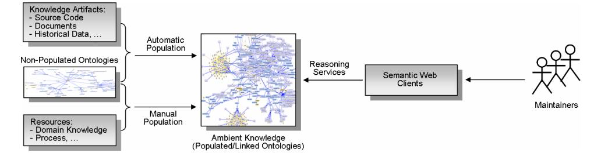
<!-- Image Description: This diagram illustrates a knowledge management system. Non-populated ontologies, populated using both automatic and manual methods from various knowledge artifacts and resources, form an "ambient knowledge" base (a populated/linked ontology graph). Reasoning services process this ambient knowledge, providing data to semantic web clients, ultimately maintained by a team. The diagram visually depicts the workflow and components of the system. -->

Fig. 1. Overview — Ambient process environment.

that in this paper, we do not propose the adaptation of a new tool or development process, but rather examine how existing resources can be integrated to implement the next generation of software maintenance environments, which is an important contribution neglected by current research [5, 15].

The remainder of this paper is organized as follows: Section 2 provides a brief review of existing software maintenance research and its limitations. Section 3 introduces our approach of an ambient software maintenance environment. Section 4 describes its implementation, in particular the ontology-based technologies used in our approach. How this approach is applied in practice is described in Sec. 5. An evaluation, based on a case study, is presented in Sec. 6. Related work is discussed in Sec. 7, followed by conclusions and future work in Sec. 8.

## 2. Software Engineering Foundations

Before we describe our approach in detail, we first introduce the software engineering foundations relevant for our research, i.e., software maintenance (Sec. 2.1) and its underlying processes (Sec. 2.2).

## 2.1. *Software maintenance*As software ages, the task of maintaining it becomes more complex and expensive. Software maintenance, also often referred to as software evolution, constitutes the majority of the total cost occurring during the life span of a software system [16, 17]. With the ever increasing number of computers and their support for business processes, an estimated 250 billion lines of source code were being maintained in 2000, with that number rapidly increasing [17]. The relative cost of maintaining and managing the evolution of this large software base represents now more than 90% of the total cost [65] associated with a software product.

Software maintenance is a multi-faceted domain. Its aspects range from low-level technical aspects (e.g., source code, operating systems and tools such as compilers and editors) over organizational and legal concerns (e.g., prescribed workflows, international standards) to social and cognitive aspects (e.g., communication behavior and cognitive models) [4, 8]. Providing automated support that addresses these concerns is difficult, due to the different representations and interrelationships that exist among software artifacts and knowledge resources [1, 5, 18, 19]. From a maintainer's perspective, exploring [8] and linking them becomes a key challenge [6], as they have to comprehend a multitude of disconnected artifacts created originally as part of the software development process [20]. This can be interpreted as a knowledge-driven process, where information is being continually integrated from different sources (including source code repositories, documentation, test case results) and at different abstraction levels (from single variables to complete system architectures). Moreover, for maintainers to be able to perform and complete a particular maintenance task, they typically need to use and interact with various tools and techniques (e.g., parsers, debuggers, source code analyzers, visualization tools). Helping developers in identifying and correctly applying available resources is a challenge for both the individuals and organizations [4–6, 17]. One approach lies in explicitly describing and abstracting the activities that have to be performed by a developer to successfully perform a particular task. These descriptions are formalized through*process models.*## 2.2.*Software evolution process models*Various process models [3, 5, 13, 14, 17] supporting the evolution of software have been introduced. Historically, they have focused on the software development cycle. However, as pointed out previously, with much of a system's operational lifetime cost occurring during the maintenance phase, this should be reflected in both the development practices and process models supporting maintenance activities. One approach to model software maintenance is to include its aspects as part of the total system life cycle/process model, as suggested for example in [3, 13, 21]. Other approaches include deriving maintenance-specific process models. Among these models are the quick-fix, iterative enhancement, and full-reuse model [3], the staged model [6], the SEI CMMI model [13], and the IEEE Std 14764-2006 – Software Engineering – Software Life Cycle Processes – Maintenance [14].

One of the challenges in applying these models is that various aspects can affect software evolution [5, 7, 22], making it an inherently complex and difficult problem to address. Some of these aspects include the user's ability (e.g., experience, knowledge, background), the characteristics of the software system to be maintained (e.g., its application domain, size, and complexity), the maintenance task itself to be performed (e.g., adaptive, corrective, or perfective maintenance), as well as the tools and software artifacts available to support it.

Common to most existing process models, including evolution models, is that they do not specify*how*any available supporting resource (e.g., tool, system, user expertise, software artifact) should be integrated within the process in a given context. Current research in software maintenance focuses mostly on providing conceptual guidance (such as the documented standards) or on developing tool support to address some specific aspects of a software maintenance task. An example of such a process model is the IEEE Std 14764-2006 [14] that lists and describes activities and their sub-activities, referred to as*task-steps*, as part of the process model.

It is possible to enrich these models by including additional details, by not only describing as part of the process the required activities to be performed, but also the resources that must be employed during these activities. However, deriving such well defined processes requires that the knowledge to be incorporated and used to support them is known already at the time of their definition. Furthermore, these processes tend to be quite static in their nature, lacking both the ability to dynamically integrate new knowledge resources and the ability to provide guidance that is specific to a given maintenance context. It is out of this observation that our idea was born to create a dynamic, context-aware KB that can support the existing process models with active and adaptive support, based on a formal model of the users (software maintainers), available artifacts (tools, resources) and tasks (process model steps).

## 3. Ambient Semantic Software Maintenance Support

We now present our contribution, an ambient semantic software maintenance environment. Its goal is to support developers throughout maintenance tasks, as discussed in Sec. 2.1, by providing a context-sensitive KB that can be queried either directly by a user or indirectly through supporting tools. More precisely, our environment supports maintainers by managing two knowledge-intensive aspects of software evolution:

- 1. Collecting and maintaining semantic links, i.e., *traceability links*, between software artifacts, in particular those at different abstraction levels, such as source code and its associated documentation.
- 2. Maintaining knowledge about available tools, software evolution processes, users, and their history of solving tasks with the available artifacts, to provide contextual guidance during complex maintenance tasks.

The first goal is motivated by the observation that maintainers tend to spend a large amount of manual effort on synthesizing and integrating information from various sources in order to establish their connections, i.e., the traceability links [23–25]. Existing research in software process modeling focuses on reducing the cost associated with this manual effort by developing automatic assistance in establishing and maintaining traceability links among software artifacts [24]. Various software and software evolution artifacts, like requirements, design documents, or bug reports, contain a large amount of information in the form of descriptions and text often written in natural language. These documents combined with source code represent two of the main software artifact types utilized in software evolution [23, 24]. Existing source code/document traceability research [23, 25] mainly focuses on connecting documents and source code using Information Retrieval (IR) techniques. However, these IR approaches ignore structural and semantic information that can be found in both documents and source code, limiting therefore both their precision and applicability. In previous research [26, 27], we already introduced a formal ontological representation that covers source code and documentation and shows how to establish these links through a combination of code analysis and text mining techniques. We address our stated second goal by providing maintainers with not only the ability to explore knowledge relevant to their given task across different artifacts, but also to support an iterative approach to enrich their current understanding of a system. In this paper, we demonstrate some recent additions to the traceability support by modeling the domain of version control systems (e.g., subversion) and bug report systems (e.g., Bugzilla), for which we added automatic ontology population support.

To deliver the context-sensitive software evolution process support, we have to additionally enhance our model of the software domain [28]. That is, we have to establish connections not only between various software artifacts, but also between these artifacts and the process model(s). This involves a number of steps:

- *•*Conceptualizing the software domain, including users and processes (Secs. 3.2 and 3.3).
-*•*Creating a KB by automatically populating the sub-ontologies using static code analysis for source code (Sec. 4.2.1), text mining for documents (Sec. 4.2.3), and the analysis of Subversion and Bugzilla repositories (Sec. 4.2.2).
-*•*Establishing traceability links between source code, software artifacts, and process ontologies through ontology alignment (Sec. 4.2.4) and by resolving the inconsistencies (Sec. 4.2.5).

Before we describe our model in detail, we briefly introduce the foundations used for our formal knowledge representation model, namely ontologies based on description logics.

## 3.1.*Ontologies and reasoning*The term "ontology" originates from philosophy, where it denotes the study of existence. In computer science, the most common definition has been provided by Gruber [29]: "An ontology is an explicit specification of a conceptualization." Ontologies are typically used as a formal and explicit way of specifying the concepts and relationships in a domain of discourse. Ontologies can overcome portability, flexibility, and information sharing problems associated with databases [30]. Compared to relational approaches which assume complete knowledge (closed world assumption), ontologies support the modeling of incomplete knowledge (open world assumption) and extensibility of the ontological model [29, 31]. Semantic Web technologies allow for machine understandable Web resources that can be shared and processed by both software tools (e.g., search engines) and humans [32]. Ontologies are an important foundation of Semantic Web enabled technologies, as they allow sharing knowledge between different agents and creating common terminologies for understanding [32]. They are also an important step towards enrichment of services and content of the next generation of the Internet ("Web 3.0").

The Web Ontology Language (OWL) [33, 34] is a standard put forward by the W3C. It provides for creating machine understandable information to enable the automatic processing and integration of Web resources. The sub-language OWL-DL, which we use in our approach, is based on Description Logics (DLs) [31]. Using OWL-DL allows us to enrich our platform with*reasoning*services provided by DL-based knowledge representation systems [31]. Unlike many logic programming approaches that cannot guarantee completeness, DL reasoning services are proven to be sound, complete, and terminating. Moreover, not only can DL be considered to be truly declarative while logic programming is not ("semi-declarative"), but it also supports automated reasoning without the need for developing logic programs to extract the desired inferences. DL reasoning is usually performed on demand and triggered by relevant queries to the KB. OWL ontologies can also simply be used as a data storage medium, similar to traditional databases. However, the use of DL to define the ontological model allows for a more precise and expressive representation than traditional data semantics [31].

For a more detailed discussion on OWL ontologies, DL, and reasoning, we refer the reader to [31, 34, 35].

## 3.2.*Software artifact ontology*As stated earlier, one of the goals of our work is to enable maintainers to be immersed in an omnipresent environment that integrates knowledge resources at different abstraction levels. In particular, we are concerned with "deep links" between individual entities at the process level (tasks, task-steps, source code side — e.g., a class or method) and the corresponding mentions of these entities in a document at the level of individual words or phrases. That is, in contrast to IR approaches [24, 25], we are not only interested in creating links at the level of complete documents or paragraphs, but also much more fine-grained links that precisely show the connections between individual words and code entities. Obviously, these links can only be created between entities that are shared among different knowledge resources. But documents and process level descriptions may also contain many more higherlevel concepts that cannot be directly mapped to a single code entity, such as algorithm descriptions, architectures, or requirements. It is here that our ontologybased method provides a strong advantage compared with existing, semantic-poor approaches. It allows us to explicitly encode knowledge of the software and process domain in a formal language that can be automatically evaluated, e.g., through queries and reasoning. For example, we can model knowledge about change impact (e.g., bug reports, log files) and their relations with other entities (e.g., classes, methods) as an ontology. An end user, such as a software maintainer, can then navigate a single, unified, and formal representation that covers process, source code, and documents. This navigation ability allows for a number of novel use cases, such as the automatic creation of traceability links and the creation of contextual views through both pre- and user defined queries.

Building a formal ontology for software evolution requires the analysis of concepts and relations in this domain of discourse. From a software practitioner's perspective, it is therefore essential that the ontological KB includes and models concepts and roles critical to software evolution processes. Indeed, our conceptualization work has been influenced by other works on software maintenance modeling [18, 23, 36–38] and the observations of best software maintenance practices. Existing work on ontological modeling of the software engineering domain, including its processes, has focused on conceptualizing the domain [10, 38] to establish a common terminology or to model specific aspects of software engineering processes [10, 38, 40]. In the context of our research, we adopt core parts of these ontologies and further enrich them with new concepts and relationships to (1) more closely reflect the particular needs of our specific modeling goal — establishing traceability links between the process and various knowledge related resources, and (2) provide a design that fully supports and utilizes optimized DL reasoners, such as Racer [35] or Pellet<sup>a</sup>, to infer additional knowledge.

## 3.3.*Software evolution process ontology*Modeling the software evolution process requires the introduction of a process sub-ontology. At the upper level, we integrate sub-ontologies through a number of abstract concepts, like*tool, task, artifact*, and *user*. An artifact can be anything involved in the software maintenance process. In particular, emails, source code files, natural language documents, Subversion entries, or bug reports are sub-classes of *artifact*. Figure 2 provides a simplified view of the resulting ontology model, focusing only on the major concepts and their roles. In what follows, we briefly summarize these key sub-ontologies.

**Task**: Describes a unit of work that is triggered by an emerging modification request (MR) or problem report (PR). Information about MRs or PRs, task assignment, tool log (tool used in the task solving process), activity log, etc. is modeled in this sub-ontology. For example, the instances in this sub-ontology might be "Debrief XML decrypt/encrypt component substitution request" (an instance of concept Request), "corrective" (an instance for concept RequestType), and "successfully finished" (an instance for concept TaskStatus).

**User**: Describes maintainers involved in the software maintenance process. Information about the involved roles and their related skills, competencies, and responsibilities are modeled. The users involved in the software maintenance process can be an individual, an organizational team, or an entire organization. The example instances in this sub-ontology might be "Mike Smith" (an instance of concept

<sup>a</sup>http://pellet.owldl.com/

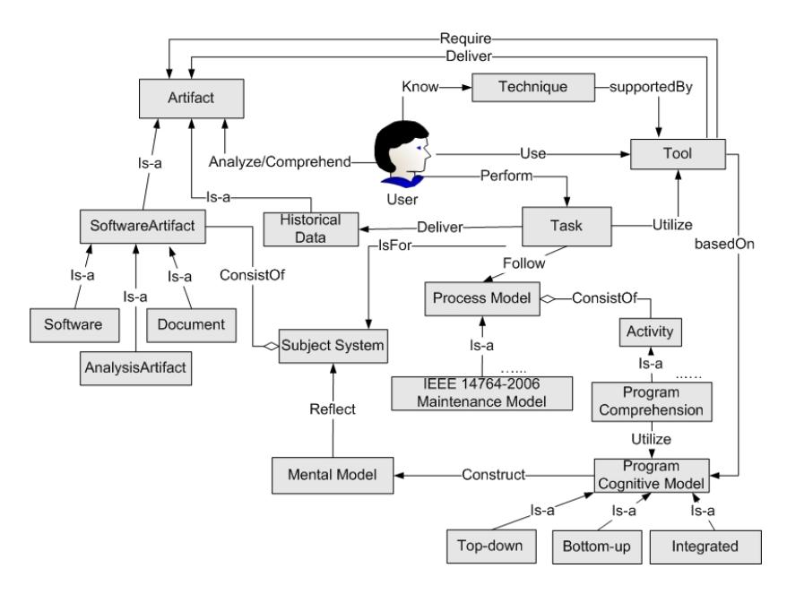
<!-- Image Description: This image is a UML-like diagram depicting a model of software maintenance. Rectangles represent entities (e.g., Artifact, Tool, Task, User), diamonds represent relationships, and arrows show connections between entities and relationships, labeled with verbs describing the actions. The diagram illustrates the interactions between users, tools, tasks, and various artifacts during a software maintenance process, including the use of process models (like IEEE 14764-2006) and cognitive models in program comprehension. The relationships among different types of artifacts (software, documents) are also presented. -->

Fig. 2. Software maintenance meta-model.

Person), "SE group" (an instance of concept Maintainer), and "MR reporter" (an instance of concept Role).

**Artifact:**Describes artifacts associated with both the software product (e.g., source code, documentation) and the maintenance process (e.g., documents, models) (Fig. 3). It has two sub-ontologies: SoftwareArtifact and TaskArtifact. Software artifacts are described in Sec. 3.2. Task artifacts are process-related artifacts, such as guidelines and reports.
**Subject system:**Describes the software system to be maintained and includes information about the programming language(s) used, application domain, etc.
**Process:**Describes the interactions and relationships among different sub-activities within a maintenance process model. Example instances in this sub-ontology are the IEEE Std 14764-2006 – Software Engineering – Software Life Cycle Processes – Maintenance" (an instance of concept ProcessModel), "5.3 Modification Implementation" (an instance of concept Activity), "5.3.2.1 Analysis" (an instance of concept Task), and "5.3.2.1 a" (an instance of concept TaskStep) [14].
**Technique:**Describes the software techniques that can be used for supporting software maintenance (e.g., program comprehension technique, source code analysis technique, impact analysis technique). Based on the previous work by Dias*et al.*[18] and Pressman [41], the techniques supporting the following activities can be identified: requirements elicitation, maintenance support, programming related, testing, configuration management, documentation, and modeling.

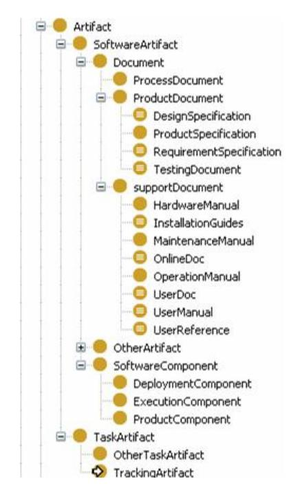
<!-- Image Description: The image is a hierarchical tree diagram illustrating a classification of software artifacts. It organizes artifacts into categories like "Document" (with subcategories such as "Requirement Specification" and "User Manual"), "Software Component," and "Task Artifact." The diagram likely serves to define and structure the types of artifacts considered within the paper's scope, aiding in analysis or modeling of a software development process. -->

Fig. 3. Partial view of the Artifact sub-ontology.
**Tool:**Describes the software tools used to carry out a function or service with the goal to simplify maintenance tasks [19]. At the current stage, our tool sub-ontology provides general categories for commonly used maintenance tools and describes their key features for supporting software maintenance activities. Tools can be classified by their functionality, their role in supporting managers and maintainers, their particular use during the various steps of a software engineering process, their supported environment (hardware and software), or even by their origin or cost. Pressman [41] provides a comprehensive classification of tools by their functions, which includes, among others, analysis, design, programming, software configuration management, testing and documentation. In our approach, tools and techniques in the KB are automatically classified through the use of reasoning. For example, programming tools can be classified based on their support for a particular programming language, operating system, applicability for a specific task, etc.

## 4. Implementation

In this section, we provide an overview of our implementation and describe its system architecture (Sec. 4.1) and the various ontology population subsystems (Sec. 4.2). We also discuss our strategy for managing inconsistencies in the ontological knowledge integration process (Sec. 4.2.5).

## 4.1.*System architecture*While developing a context-sensitive system, two key aspects have to be taken into consideration. First, maintainers spend a significant amount of time searching and exploring source code within their IDE to comprehend the overall structure of a system [4, 5, 22]. Second, context changes caused by the need to switch between applications, views, etc. should be limited to ensure that a user's comprehension context is not lost. For example, in modern IDEs, contextually relevant information with respect to the currently edited or analyzed source code is automatically made available (e.g., available methods, auto-completion of partially typed source code). Similarly, we have integrated our ambient knowledge environment through Eclipse by taking advantage of the extensibility provided by its plug-in architecture.

We selected a client-server architecture to support a centralized management facility, shown in Fig. 4. Its key components are Eclipse plug-ins and a Web server. The Eclipse plug-ins are responsible for collecting context information, forwarding requests to the server, and displaying results. The server, on the other hand, provides persistent ontology support, aligns the sub-ontologies, and provides ontology management services, including querying/reasoning and data mining services for the clients. The server side utilizes the Prot´eg´e API and the Jena Semantic Web Framework<sup>b</sup> to access ontologies. Jena provides the backend repository for both concepts (TBox) and instance data (ABox). In our implementation, we leverage Jena's persistent storage support and a MySQL database to store and query persistent Resource Description Framework (RDF) graphs. TBox management is centralized on the server to ensure consistency, quality of the ontology design, and standardization of the KB. Reasoning services are provided by Pellet, which provides optimized TBox and ABox reasoning capabilities.

A successful context-sensitive support system is based on the premise that the right information should be made available at the right time and in the right format.

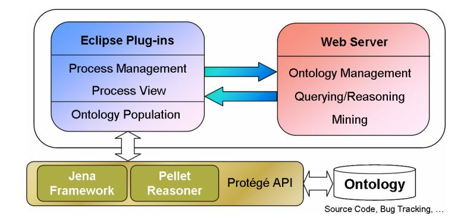
<!-- Image Description: This diagram depicts the architecture of a software system for ontology management. It shows an Eclipse plugin interacting with a web server via bidirectional communication. The plugin handles process management, viewing, and ontology population. The server manages the ontology, performs querying/reasoning, and mining. The system uses Jena framework, Pellet reasoner, and Protégé API to interact with the underlying ontology database, which contains source code, bug tracking data, etc. -->

Fig. 4. System architecture overview.

From a software maintainer's perspective, the challenge is specifically the need to adjust both information and context in real time to the current process task-step being performed. Our implementation thereby follows two strategies. Firstly, process information is made explicit and visible to the current developer. This is achieved by developing an Eclipse*Cheat Sheet*<sup>c</sup> plug-in to provide extended process information. Secondly, information from the current Eclipse workspace is maintained and process context sensitive information is provided by querying the underlying KB.

The client provides the foundation for our visual integration, supporting the interaction and linking between the maintenance process activities and the relevant knowledge resources. Similar to more traditional database applications, ABox management is provided through the client.

## 4.2.*Ontology population*One of the major challenges for software maintainers is the large amount of information that has to be explored and analyzed as part of typical maintenance activities. Therefore, support for automatic ontology population is essential for the successful adoption of Semantic Web technologies in supporting software maintenance. In this section, we describe the automatic population of four of the sub-ontologies from existing artifacts, such as source code, Bugzilla, Subversion (SVN) and documents.

## 2.1.*Source code ontology population*Concepts in the source code ontology typically have a direct mapping to source code entities, allowing instances of these concepts to be automatically recognized by our source code ontology population subsystem. Within our implementation, we utilize the Eclipse JDT compiler in order to read the source code, perform common tokenization and syntax analysis to produce an*Abstract Syntax Tree*(AST). Our population subsystem traverses the AST created by the JDT compiler to identify concept instances and their relations, which are then passed to an OWL generator for ontology population (Fig. 5). Furthermore, it can also identify instances of roles (i.e., relations between source code entities) by statically analyzing the source code.

The number of instances and relations identified by our system depends on the complexity of the ontology and the size of the source code to be analyzed. At the current stage of our research, we limit the population of the source code ontology to 38 of the higher-level concepts (classes) and 41 types of relations (ObjectProperties). We restrict the ontology population currently to these high-level concepts (e.g., package, class, method) due to the application domain of the ontology. Our objective is to support system evolution at a higher level of abstraction, rather than focusing on specific, low-level source code analysis (e.g., at the expression level).

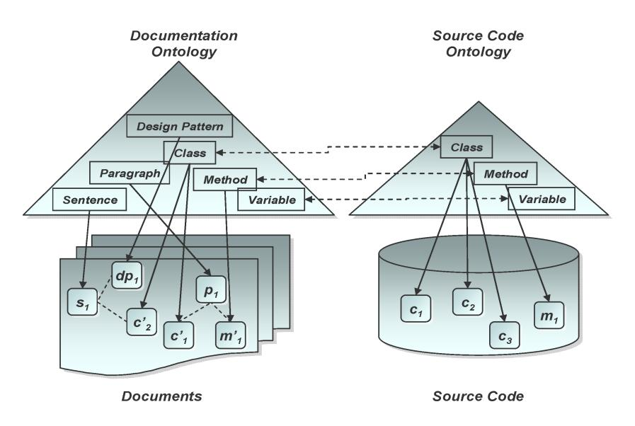
<!-- Image Description: The image displays two ontologies: a documentation ontology and a source code ontology, represented as pyramids. The documentation ontology's pyramid layers represent design patterns, classes, paragraphs, sentences, and variables. The source code ontology shows classes, methods, and variables. Dashed lines indicate mappings between corresponding elements across the ontologies. The bottom of each pyramid connects to a database-like structure representing the documents and source code respectively. The diagram illustrates the relationship and mapping between documentation and source code elements. -->

Fig. 5. Linking instances from source code and documents.

## 2.2.*SVN and bugzilla ontology population*SVN and Bugzilla are two typical examples of version management and bug tracking systems that are used in both open source and industrial applications, containing typically large amounts of software maintenance relevant information. We use these existing KBs to populate our SVN and Bugzilla sub-ontologies. We use Mylyn<sup>d</sup>, an Eclipse plug-in that provides connectors to Bugzilla and SVN as well as supports the data export from these repositories. Both the version management ontology (consisting of concepts*File, Revision, Release*) and the bug tracking ontology (consisting of concepts *Issue, Milestone, Person, Product, Activity, Comment, Attachment, Component, Computersystem*) have been integrated using an existing ontology model [42]. Through the use of Mylyn, we can now populate our SVN and Bugzilla sub-ontologies and make this knowledge an integral part of our ambient KB.

## 2.3. *Documentation ontology population*We developed a custom text mining system to extract knowledge from software documents and populate the corresponding sub-ontology [28, 43]. The system reads software documents and uses a number of Natural Language Processing (NLP) techniques to identify*named entities*that correspond to one of the concepts defined in the software ontology, like*person, class, method, software architecture,*or*design pattern*. A particular feature of our system is that it can use the results from the automatic code analysis described in Sec. 4.2.1 to facilitate the detection of corresponding entities in natural language documents. For further details on our software text mining system, we refer the reader to [28].

## 2.4. *Ontology alignment and linking*After having populated and represented the various software artifacts in the form of ontologies, traceability links are established through ontology alignment [11, 44]. Traceability links between source code and documentation are created based on concept and instance information. Since our documentation, Bugzilla, and source code ontologies share many concepts from the programming language domain such as Class or Method, we apply in this research an instance matching approach, based on common names and properties. This allows us to directly connect instances from the source code, Bugzilla and document ontologies. For example, our source code analysis tool may identify*c*<sup>1</sup> and *c*<sup>2</sup> as classes, and this information is used by the text mining system to identify the named entities *c*<sup>1</sup>,*c*2, and their associated information in the documents. As a result (exemplified in Fig. 5), source code entities*c*<sup>1</sup> and *c*<sup>2</sup> are now linked to their occurrences in the documents (*c*<sup>1</sup> and*c*<sup>2</sup>), as well as other information about the two entities mentioned in the document, such as design patterns, architectures, etc.

After the source code and documentation ontology have been linked, users can then perform ontological queries on either documents or source code, regarding properties of*c*<sup>1</sup> or *c*2. For example, "retrieve document passages that describe both *c*<sup>1</sup> and *c*2", or "retrieve design pattern descriptions referring to the class that contains the class currently analyzed". Note that the alignment process might also identify inconsistencies — the documentation might list a method for a different class, for example — which are detected through the alignment process and registered for further review by the user.

In addition, users can always manually define new concepts/instances and relationships in both ontologies to establish the links that cannot be detected by the automated alignment. For example, as Fig. 6 shows, the text mining system may

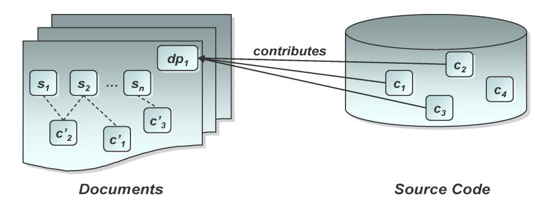
<!-- Image Description: The diagram illustrates a data model showing how documents contribute to source code. A stack of documents ("Documents") contains multiple sections (S1, S2...Sn) connected to code components (C'1, C'2, C'3). These components, in turn, contribute to elements (C1, C2, C3, C4) within a database representing the "Source Code." The diagram visually depicts the relationship and flow of information from documents to the source code database. -->

Fig. 6. Retrieve implicit information from documents.

detect an instance of DesignPattern — *dp*<sup>1</sup> and users can then create the relationships between the pattern and the classes that implement the pattern (e.g., *c*1, *c*2, and *c*3) through our query interface. The newly created links then become an integrated part of the ontology, and can be used to, for example, retrieve all documents related to the pattern (i.e., *s*1, *s*2, ..., *sn*).

Furthermore, documents can not only be linked to source code, but also to design-level concepts that relate to particular software maintenance tasks. For example, in contrast to the serialized view of software documents, i.e., sentence by sentence, or paragraph by paragraph, our formal ontological representation of software documentation also provides the ability to create hierarchical documentation views. Using the classification service of the ontology reasoner, one can classify document pieces that relate to a specific concept or a set of concepts.

## 2.5. *Inconsistency management*The problem of ontology change is far from trivial. The large size of modern day ontologies makes this problem even more complicated [75]. Furthermore, the Semantic Web is characterized by decentralization, heterogeneity, and lack of central control or authority. These new features have greatly contributed to the success of the Web but at the same time, also introduced several new challenges.. Given these heterogeneous environments, knowledge integration, as we perform it for the software domain, becomes also the management of inconsistent information. It is not realistic to expect all the sources to share a single, consistent view at all times. Rather, we expect disagreements between individual users and tools during an analysis. An elegant model for managing (possibly conflicting) information from different sources has been proposed by [45]: Knowledge is structured into*viewpoints*and*topics*. Viewpoints are environments that represent a particular point of view (e.g., information stemming from a particular *tool*or entered by a*user*). Topics are environments that contain knowledge that is relevant to a given subject (e.g., design patterns, architectural recovery). These environments are *nested*within each other: viewpoints can contain either other viewpoints or topics. A topic can contain knowledge pertaining to its subject, but also other viewpoints, e.g., when the subject is another user.

Through this approach, we can explicitly distinguish between the knowledge a particular resource has about a certain topic and at the same time, manage possible conflicting knowledge about what a resource*believes other resources may believe*about the same topic, since this information is contained within different, nested viewpoints. These viewpoints create*spaces*within which to do reasoning: consistency can be maintained within a topic or a viewpoint, but at the same time, conflicting information about the same topic can be stored in another viewpoint. This allows us to collect and maintain as much knowledge as possible, attributing it to its sources, without having to decide on a "correct" set of information, thereby losing information prematurely. For example, a user might believe that a certain

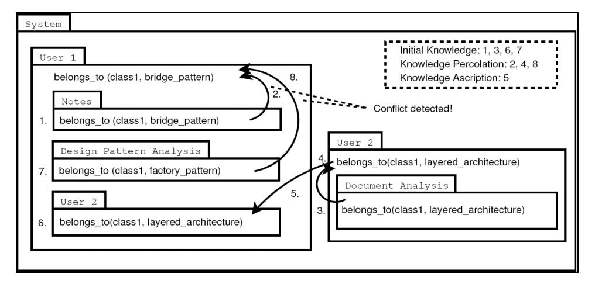
<!-- Image Description: This diagram illustrates a knowledge conflict detection system. Two users, User 1 and User 2, contribute knowledge (numbered items 1-8) about design patterns within a system. Arrows depict knowledge percolation, showing how information flows. A dashed line indicates a conflict detected between User 1's and User 2's classifications of 'class1,' specifically regarding the "bridge_pattern" and "layered_architecture." The box denotes initial knowledge, its percolation, and the ascription of new knowledge leading to conflict resolution. -->

Fig. 7. Knowledge merging using ascription and percolation.

set of classes form the*bridge design pattern*, while the documentation states they belong to an *architectural layer*, and the design pattern analysis tool identifies them as a *factory pattern*(Fig. 8).

Viewpoints can be constructed as well as destructed through the processes of*ascription*and*percolation*. Stated briefly, the process of ascription allows incorporating knowledge from other viewpoints (users, tools) unless there is already conflicting information on the same topic. The mechanism of percolation is introduced for the deconstruction of nested knowledge. Here, some (assumed) held knowledge on a topic contained in a nested viewpoint may be percolated into its outer environments, up to the top-level viewpoint of a user (or the main environment) and be thus acquired as knowledge.

## 5. Threat to Validity

In what follows, we discuss how to apply our environment in practice. In particular, we demonstrate that our system is not limited to static knowledge-based IR, but also allows for a dynamic and context-sensitive guidance in which implicit as well as explicit information is processed. Thereby, developers and maintainers are provided with information beneficial in fulfilling their work efficiently. As pointed out before, our research focus is not on the development of a new software tool or technique in attempt to support a specific maintenance activity. Rather, our goal is to automatically integrate various existing tools and knowledge resources through the use of queries and automated reasoning within a maintenance process.

The application is discussed in three steps: In Sec. 5.1, we illustrate the use of ontologies in supporting software evolution. We describe the use of ontologies to support different comprehension strategies used to describe the cognitive process applied by maintainers to integrate various knowledge abstractions and model them. We also illustrate how questions arising during a maintenance process can be encoded in ontology queries and answered by our system. Section 5.2 introduces the context-sensitive guidance layer on top of these low-level queries.

## 5.1. *Software evolution support*Through the use of a standard ontology model, our environment provides builtin support for ontology queries. Thus, the central paradigm of our approach is to encode a higher-level question into an ontology query through a query language such as SPARQL<sup>e</sup>. The answer retrieved from the KB can then be used either directly, or applied for further queries in order to provide a solution to the user.

## 1.1.*Software comprehension support*In what follows, we describe the use of ontologies in supporting program comprehension as an essential part of any software evolution process, as well as their support for strategies on how to support cognitive models used in program comprehension. These comprehension strategies provide the essential guidance for programmers in understanding software systems and involve ontology exploration and automated reasoning. We now describe when and how different comprehension activities may be invoked in the context of specific comprehension strategies.

## Bottom-up comprehension strategy

Using a bottom-up comprehension strategy, programmers understand a program based on*chunking*[67]. Chunks are portions of an artifact that the programmer recognizes. Larger chunks contain smaller chunks nested within them.
*•*The programmer pieces together his/her understanding by combining chunks into increasingly larger chunks. In the perspective of ontology-based comprehension, chunks are concept instances. Smaller chunks or larger chunks denote concept instances at different granularity levels, such as statement, method, class, or package levels. Therefore, recognizing smaller chunks and formulating larger chunks are a set of activities called*concept identification and specification*. More specifically, in this context, concept identification refers to an activity by which programmers retrieve information related to a specific portion of a software artifact. The software ontology contains rich concept instances at different granularity levels, as well as the relationships among these instances. The ontology can therefore assist programmers in identifying concepts and relationships that are related to a specific portion of the code, e.g., a method he/she is currently reading. For example, during the reading of a smaller chunk — a variable usage, a programmer may query the ontology about the type of this variable or the place where it is defined.

- *•*In order to understand a larger chunk such as a class, a programmer may first retrieve smaller chunks that are contained within the larger chunk, such as methods defined or variables used in the class. Only once all retrieved smaller chunks have been comprehended is the programmer able to obtain a complete understanding of the larger chunk. After such a localized understanding of a program chunk has been obtained, programmers often continue the comprehension process by introducing additional concepts or relationships with regard to their specific maintenance tasks, or specifying understood chunks as instances of existing concepts/relationships.
-*•*The newly added knowledge then becomes an integrated part of the ontology and can be reused in other comprehension tasks. For example, in order to comprehend data structures implemented in a software system, a programmer may define new concepts such as*Array*, *LinkedList*, *Stack*, or *Heap*as part of the ontology. He/she thus can use these new concepts to specify recognized chunks, e.g., a class is an instance of*LinkedList*. This information can then be further reused by the programmer to identify larger chunks. For example, a *Stack*is implemented by a*LinkedList*.

## Top-down comprehension strategy

In situations where a top-down comprehension strategy is adopted, programmers start reading source code with certain hypotheses and then confirm or reject these hypothesis based on identified evidences, the so-called *beacons*[68]. Within the ontology-based program comprehension model, a hypothesis can be regarded as a concept description or a query. When the concept description or the query returns one or more concrete instances, the hypothesis is confirmed and retained, becoming part of their understanding. Otherwise, the hypothesis is discarded.

-*•*Programmers typically start the comprehension process by formulating hypotheses concerning properties of the program. The ontology language can help programmers to specify their hypotheses. For example, a programmer may suspect that a class implements a specific design pattern [69]. In a next step, an ontology query is composed and performed to validate if any of the software documents describe this class in terms of design patterns. Another example is that a programmer may hypothesize a software package is a self-contained component, i.e., there exists no dependencies to other classes/packages outside the package it is implemented. A simple query can help the programmer to verify this hypothesis by retrieving all classes that are used by this package, but not defined within it.
-*•*The software ontology can answer queries through automated reasoning and thus confirm/refute these hypotheses. Through each confirmation or refutation, the programmer obtains a better understanding of the program. In the previous example, the documentation ontology was used to identify whether any design patterns

are related to the class and the source code ontology returned the number of classes that are used by the package. These provided answers which can help programmers verify their hypothesis and thus accelerate the comprehension process.

## As-needed comprehension strategy

As the size and complexity of a software system increases, a complete understanding of the whole system is less feasible [70]. Instead, programmers often adopt an*asneed*strategy [71]. For this reason, programmers tend only to comprehend these portions of the program that are relevant for a specific software evolution task.

Adopting an as-needed strategy as part of the ontology-based program comprehension approach requires a programmer to start the comprehension process with an initial mental ontology. This mental ontology consists of a set of concepts/relationships that are considered essential for a maintenance task.

-*•*Through reading different artifacts, instances of the initial software ontology are comprehended in the first step (i.e., ontology population). In the case more concepts/relationships are necessary, the ontology has to be extended, and more effort is required to comprehend instances of these newly introduced concepts/relationships. Therefore, the as-need comprehension process can also be regarded as an iterative process of concept recognition and relationship discovery, except that the comprehension goal is not to construct a complete mental model, but rather a minimum subset that is required for the completion of a particular comprehension task. The software ontology contains detailed information with regard to source code and other software relevant documents (e.g., subversion information, bugzilla, design documents).
-*•*Programmers can identify a certain subset of the software ontology as their starting point. By exploring and querying the ontology, they can not only investigate specific properties of a concept and its instance, but also enlarge the subset by utilizing existing or newly defined concepts/relationships. The process finishes once sufficient confidence was established that their understanding is adequate to complete the particular task.

## 1.2.*Process support*What makes the query paradigm so useful in our approach is the fact that the KB integrates knowledge from different sources and at very different levels of abstraction. Thereby, even a seemingly simple query can provide insights to a software engineer that would otherwise require a significant amount of manual searching. Furthermore, through the integration of the process model, questions that relate to tasks can be asked as well. For example:
*•*Which source code and documentation artifacts related to my current modification requests can support an early impact analysis, as requested in the IEEE Std 14764-2006 activity 5.3.1?

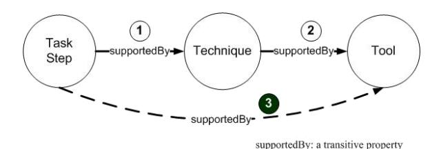
<!-- Image Description: The image is a directed graph illustrating a transitive relationship. Three nodes represent "Task Step," "Technique," and "Tool." Arrows labeled "supportedBy" show that a task step uses a technique, and a technique uses a tool. A dashed arrow demonstrates the transitive property: a task step indirectly uses a tool. The graph visually explains the relationship between task steps, techniques, and tools within a system. -->

Fig. 8. Transitive design-level links.

-*•*What are the document passages (e.g., sentences, paragraphs) describing the source code entity (e.g., class, method) I am currently inspecting in my editor?
-*•*Given a modification to a method implementation, which requirements documents would be affected by a change and who has the most expertise with making this change?

Note that these queries cross conceptual boundaries between process, source code, and natural language document ontologies, which is not possible with other approaches that lack the ability to model these artifacts in a common formal representation.

In terms of the design-level links, OWL-DL axioms or concepts can be used to establish the links between the process model and the modeled knowledge resources. Relationships and properties, specified as OWL axioms, can be used to establish implicit links as well. For example, in the IEEE Std 14764-2006 task-step*"5.3.2.1 a) Identify the elements to be modified in the existing system"*[14], the supportedBy property can be utilized to automatically link the task-step with supporting tool resources. The supportedBy relation in Fig. 8 is defined as a transitive property used to link*Task Step*with*Technique*(1) as well as for linking*Technique*with*Tool*(2). Then, the links between*Task Step*and*Tool*can be automatically derived through the inferred link (3). As a result, each task-step in the process ontology can automatically be linked through this transitive supportedBy property to the sub-ontologies of*Technique*and*Tool*. Through further traversing of the transitive closure across the sub-ontologies, other knowledge resources can be identified as well.

In addition to these design-level links, logical links between the process and the knowledge resources can be established through predefined queries for each task-step.

Figure 9 illustrates the use of a set of predefined queries to support different process task-steps. Users can also define their own supporting queries based on their experience to extract, explore, and reason upon the information stored in the KB.

These predefined queries supporting the different task-steps allow users to retrieve explicitly modeled knowledge, as well as inferring implicit knowledge across the KB to support a particular task-step.

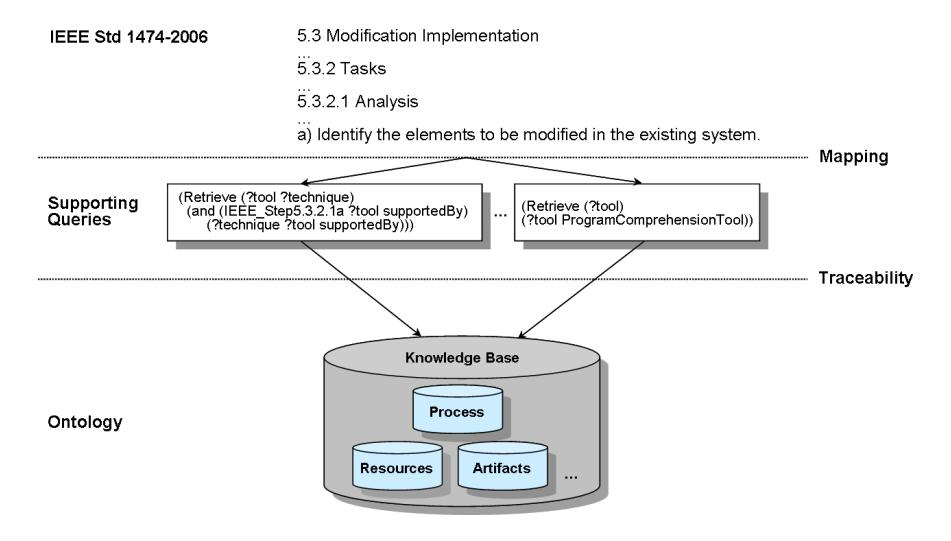
<!-- Image Description: The image is a diagram illustrating a knowledge base system for modification implementation, referencing IEEE Std 1474-2006. Two supporting queries retrieve data (tool and technique information) from the knowledge base, which contains information categorized as Process, Resources, and Artifacts. The diagram shows how these queries, linked by mapping and traceability, support the identification of elements for modification within an existing system. -->

Fig. 9. Task supporting queries.

## 1.3. *Eclipse integration*A successful process-centered support system has to continuously provide information to the user taking in consideration the current context. Thereby, contextual information originates from both a process and the IDE perspective. Achieving this premise depends greatly on the available knowledge resources and their accessibility. Our process environment explicitly supports such connections between the involved process steps and other supporting resources (e.g., artifacts, maintainers, techniques, and tools).

In what follows, we describe a general application scenario as supported by our environment. In a first step, a process and its activities are defined by either creating an organization specific process or by adopting and tailoring an existing process model and its workflow. In this example, we customize the IEEE maintenance standard [14], by specifying which of the IEEE process activities, tasks, and task-steps are required. The process model is defined through the use of the Eclipse Cheat Sheet mechanism, which also provides the option to assign Eclipse commands, ontology queries, and additional resources (such as help pages) to the various activities. Cheat sheets were originally contributed by Eclipse as an important productivity tool that lets users view interactive tutorials from within the Eclipse Workbench [46]. We have extended the Cheat sheets plug-in using the Eclipse's plug-in mechanism to integrate and support ontology queries.

Tasks and task-steps can be made mandatory or optional, depending on the needs of the process to be defined. After completing the process definition, the information can be stored centrally on the server (as an Eclipse XML Cheat Sheet). Figure 10 shows the adapted cheat sheet editor.

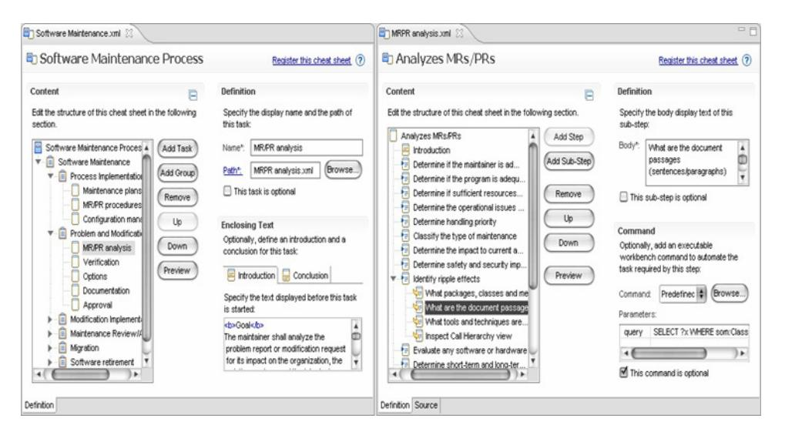
<!-- Image Description: The image displays two screenshots of a software interface, likely a tool for creating structured documentation or process models. The left panel shows a hierarchical structure for a "Software Maintenance Process," allowing users to add, remove, or reorder tasks and subtasks. The right panel shows similar functionality for a specific task, "Analyzes MRS/PRs," with options to define text descriptions, and optional executable commands for automation. Both panels show interface elements for defining task names, paths, and descriptions, illustrating the software's capabilities for creating and managing structured content. -->

Fig. 10. Creating and managing processes.
**Eclipse commands:**By enriching the process definition with commands that directly interact with the Eclipse IDE, some activities can be further explained or even enforced. An example for such Eclipse commands could be to enforce specific refactoring methods of the source code after a modification request was encoded, e.g., "Encapsulate Field" or "Extract Method".
**Ontology queries:** Query templates are managed centrally by the server and can be integrated into cheat sheets as Eclipse commands. Figure 11 shows the dialog to assign a query to a task or task-step. For example, given is the following query to support the initial impact analysis in the IEEE maintenance process (*Activity 5.2: Problem and Modification Analysis*):

*Given a modification to a method implementation, which requirements documents would be affected by the change and who has the most expertise with making this change?*The query uses the current method name given in the editing window as an input parameter and queries across the source code (the method, its class, and parameters), documents (connections between source code elements and requirements documents) and bug tracking (e.g., users who have previously worked on the same method) ontologies. Maintainers include the existing process template in their own IDE by loading the process definition file from the server. They are provided with a simple and integrated textual description of the process (shown in Fig. 12), providing them with step by step guidance through the pre-defined process. Contextual information is gathered while they are working and is used to complete the query parameters or commands available at the current process step. Such contextual information might be extracted from the current method

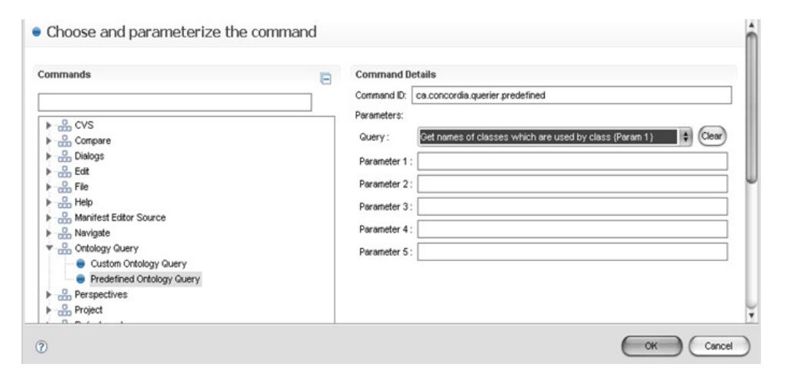
<!-- Image Description: The image displays a software interface for choosing and parameterizing commands. A tree view lists available commands, including "Predefined Ontology Query," which is selected. A form allows users to input a command ID and parameters for a query, shown as "Get names of classes which are used by class (Param 1)." Five parameter fields are provided, illustrating the process of executing a predefined ontology query within the software. -->

Fig. 11. Query management.

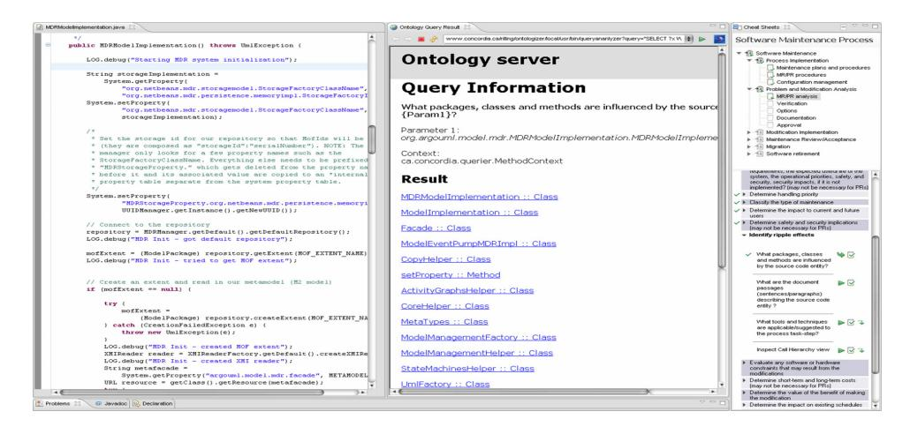
<!-- Image Description: The image displays a screenshot showing three panels. The left panel shows Java code for initializing a model repository. The center panel shows an ontology query interface and results listing classes and methods influenced by a source parameter. The right panel presents a checklist for a software maintenance process, focusing on impact analysis and ripple effects. The image illustrates the integration of ontology querying with software maintenance tasks to identify affected components. -->

Fig. 12. Ambient software evolution environment.

field being analyzed or edited by the maintainer. Ontology queries themselves are executed by the Web server and results are shown in a Web browser (integrated as part of the Eclipse IDE). Additional ontology exploration can be performed by selecting parts of the query results to return additional properties related them.

The process state is stored within the Eclipse project information, to allow for its interruption and continuation. Modifications to the knowledge (such as changed source code) are automatically transferred to the server which incrementally updates the ontology.

In what follows, we introduce different context sensitivity levels that are supported through customizable views from pre-defined queries that establish the links with the KB. For a specific task-step, we also support context switching to the advisor views that provide suggestions on what relevant knowledge resources and other related task-steps might be applicable in the given context.

## 5.2.*Establishing contextual guidance*We adopt the following informal definition of context-sensitivity in our research. Context-sensitivity refers to the capability of an environment to identify the knowledge resources relevant to the interactions among a user, the process, and its resources, in a given task setting. We consider a process model to be contextsensitive if it provides guidance to a user's state while performing a particular task. A task context can be established by constraining the scope of available information and by inferring additional knowledge from an existing KB. We introduce three levels of context sensitivity, referred to as context level 0-2 (Table 1). These levels are used to define the scope and knowledge inference applied at each of them. The context levels range from level 0 (all available information resources are considered without any constraints or additional knowledge inference), to level 2 (not only does it constrain the available resources to the specific task, organization, and user, but it also considers historical data and infers additional knowledge from the KB to support this context level).

In what follows, we introduce a use case to describe in more detail these different contextual levels.
**Use Case:**"Identify the elements to be modified in the existing system" [14].

This use case corresponds directly to the IEEE maintenance standard task-step 5.3.2.1a. During the modification implementation phase, maintainers will perform impact analysis to determine the affected parts of a system. Maintainers will have to decide on resources such as analysis techniques, tools, and artifacts that are available or should be utilized to perform the analysis.

| Table 1. Context levels descriptions. |                                                                                                                                                                                                                                                                    |  |  |  |  |
|---------------------------------------|--------------------------------------------------------------------------------------------------------------------------------------------------------------------------------------------------------------------------------------------------------------------|--|--|--|--|
| Context                               | Characteristics                                                                                                                                                                                                                                                    |  |  |  |  |
| Level<br>0                            | Main<br>focus<br>is<br>on<br>instance<br>retrieval.<br>No<br>or<br>only<br>very<br>limited<br>use<br>of<br>constraints<br>and<br>reasoning<br>services<br>is<br>made.                                                                                              |  |  |  |  |
| Level<br>1                            | Constraints<br>are<br>added<br>by<br>considering<br>direct<br>and<br>indirect<br>dependencies<br>among<br>sub-ontologies<br>and<br>their<br>concepts.<br>Additional<br>use<br>of<br>constraints,<br>parameters,<br>and<br>reasoning<br>services.                   |  |  |  |  |
| Level<br>2                            | Provides<br>an<br>additional<br>refinement<br>to<br>the<br>context<br>level<br>1<br>by<br>using<br>historical<br>data<br>collected<br>from<br>previous<br>tasks<br>as<br>well<br>as<br>by<br>applying<br>data<br>mining<br>and<br>other<br>analysis<br>techniques. |  |  |  |  |

Table 1. Context levels descriptions.

## 2.1.*Context level 0*At this context level, the environment would not define any specific constraints with respect to the scope of the knowledge retrieval. The information retrieved will focus mainly on instance retrieval. The following SPARQL query example provides contextual support at level 0 for the defined use case.
*Query: Show all programmers and maintainers working on the current project?*```text
PREFIX vom: <http://ontoweb.concordia.ca/son>
PREFIX rdf: <http://www.w3.org/1999/02/22-rdf-syntax-ns>
SELECT DISTINCT ?user
WHERE {
?R vom:author ?user.
}
```text

The query returns all distinct programmers/maintainers who have previously worked on the current project. This query provides knowledge about users who have previous project related knowledge and might be good candidates for the current maintenance task.

## 2.2.*Context level 1*From an organizational viewpoint, one of the major challenges in adopting a process model is the need to adopt and integrate the new process within an existing organizational structure. Processes that will allow/support the reuse of existing resources and infrastructure can ease both the integration and acceptance of such a new process.

This context level constrains the query results with respect to a user's expertise level, the specific task setting, and available resources within an organization by including additional constraints and dependencies.
*Query: Show all classes affected by changes in method {Parameter %1}*```text
PREFIX vom: <http://ontoweb.concordia.ca/son>
SELECT DISTINCT ?class
WHERE {
{?method vom:invokes %1.
 ?method vom:isMethodOf ?class}
UNION
{?method vom:isInvokedBy %1.
 ?method vom:isMethodOf ?class}
}
```text

In this example, we use a parameter to restrict the query results to the specific context the user is working on. Query parameters are provided either through the user or by the system itself (e.g., current editing context in the source code). The query returns all classes that are potentially affected by a modification in the method name provided by the parameter.

# 2.3.*Context level 2*Common to most process models is the need to collect and analyze previous processrelated data to improve and optimize them. Within our unified process model, we also collect such data, namely the ones related to the resources utilized to complete a modification request (MR) and the applicability of these resources in completed MRs. This historical data enriches our KB and allows for a further refinement of the context according to similarities between the current MR and previously performed MRs. At this level, simple statistical processing, data mining techniques, or other advanced analysis techniques can be applied to enrich the results provided by the queries.
*Query: Show all classes that are directly or indirectly affected by changes in method {Parameter %1}?*```text
PREFIX sem: <http://ontoweb.concordia.ca/son>
SELECT DISTINCT ?class
WHERE {
{ ?class sem:isSubclassOf %1 }
UNION
{ ?class sem:hasSubclass %1 }
UNION
{?method sem:isMethodOf %1.
 ?method1 sem:invokes ?method.
 ?method1 sem:isMethodOf ?class}
UNION
{?method sem:isMethodOf %1.
 ?method1 sem:isInvokedBy ?method.
 ?method1 sem:isMethodOf ?class}
UNION{
?attr sem:isAttributeOf %1.
?attr sem:hasDeclaredClass ?class}
UNION{
?method sem:isMethodOf %1.
?LV sem:isLocalVariableOf ?method.
?LV sem:hasDeclaredClass ?class}
UNION{
?method sem:isMethodOf %1.
?FP sem:isFormalParameterOf ?method.
?FP sem:hasDeclaredClass ?class}
```text

```text
UNION{
?attr1 sem:hasDeclaredClass %1.
?attr1 sem:isAttributeOf ?class.}
UNION{
?LV1 sem:hasDeclaredClass %1.
?LV1 sem:isLocalVariableOf ?class.}
UNION{
?FP1 sem:hasDeclaredClass %1.
?FP1 sem:isFormalParameterOf ?class.}
}
```text

This query performs an impact analysis for the class specified by*Parameter %1*. It takes advantage of transitive closure relations to identify also the indirect call dependencies that exist among the class *Parameter %1*and the rest of the system.

## 6. Case Study

As discussed throughout the article, software evolution requires the integration of knowledge from all aspects of the software life cycle, through the use of Semantic Web technologies. In order to validate our approach, we have performed two successive case studies in a graduate software maintenance course setting, with a total of 18 students participating in each study. Student expertise varied significantly, from recent graduate students with no or very limited industrial experience, to students with several years of industrial programming/software maintenance experience.

The course material covered was based on the IEEE maintenance standard [14], including the major activities specified by the standard's document, as well as techniques and tools supporting them. For the case study, students had to apply and follow the IEEE maintenance process standard workflow on two medium-size open source software systems, developed in Java. The first application, Debrief <sup>f</sup> , is an analysis and reporting software for tracking maritime exercises. The second application, Lobo<sup>g</sup>, is a Java-based Web browser. For each application, we defined two maintenance tasks. The first task category involved a component substitution that required the replacement of an existing component with a functionally equivalent one. The second task category corresponded to a typical corrective maintenance activity, i.e., fixing a bug (which was seeded in our case). Each student was randomly assigned two maintenance tasks. Table 2 provides a more detailed description of the tasks performed.

## 6.1.*Case study settings*The two case studies mainly differ in the amount of knowledge and level of detail made available through our environment. The tool support for the first case study

<sup>f</sup>http://www.debrief.info/index.php

<sup>g</sup>http://www.lobobrowser.org

| Software<br>system | Maintenance<br>task       |                                                                                                                                   | Number<br>of<br>participants<br>in the case study |    |
|--------------------|---------------------------|-----------------------------------------------------------------------------------------------------------------------------------|---------------------------------------------------|----|
|                    |                           | Description                                                                                                                       | #1                                                | #2 |
| Debrief            | Component<br>Substitution | Non-encrypted XML files component had to<br>be substituted with a component that<br>implements XML encryption.                    | 5                                                 | 4  |
|                    | Bug Fixing                | A seeded error in Debrief affecting the<br>saving of plot data had to be corrected.                                               | 4                                                 | 5  |
| Lobo               | Component<br>Substitution | The standard Java SSL libraries to<br>communicate with secure websites had to be<br>replaced with a more secure SSL<br>component. | 5                                                 | 4  |
|                    | Bug Fixing                | A bug in one of the menu options resulting<br>in undesired system behavior had to be<br>corrected.                                | 4                                                 | 5  |

Table 2. Case studies.

can be best described by its limited KB and as a result, limited process/contextsensitivity. For this case study, we only modeled and populated the following subontologies:

-*•*The process ontology was populated with a concrete instance of the IEEE maintenance standard and its activities [14].
-*•*We also populated the tools and techniques sub-ontologies to provide users with some guidance in selecting applicable tools/techniques for the different maintenance process activities and tasks specified in the process model. For this reason, we introduced pre-defined queries at the context level 0 that focused mainly on instance retrieval from the KB.

For the second case study, we significantly enriched the KB with the following additional information:

-*•*We added a source code ontology to the KB and populated it with instances from the Debrief and Lobo source code.
-*•*We made historical data collected during the first study available. This historical information included, among others, tools and techniques utilized by the participants during the first case study, Subversion information with respect to source code modification, and who performed the actual changes.
-*•*Additional pre-defined queries were created to provide not only contextual views across the different sub-ontologies, but also to use the now available historical data and additional reasoning services to support contextual queries at the different context levels (0–2).

Initial tool usage was recommended to the users, but they were under no obligation to use it throughout the case studies.

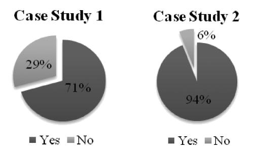
<!-- Image Description: The image presents two pie charts comparing results from two case studies. Each chart displays the percentage of "Yes" and "No" responses. Case Study 1 shows 71% "Yes" and 29% "No", while Case Study 2 shows a stark contrast with 94% "Yes" and only 6% "No". The charts likely illustrate the prevalence of a particular phenomenon or agreement on a specific issue in the two different case studies. -->

Fig. 13. Overall user acceptance rate.

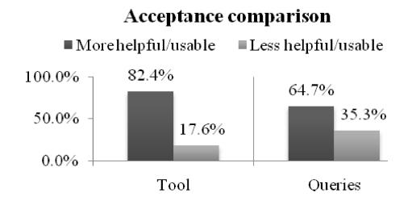
<!-- Image Description: The image presents a bar chart comparing user acceptance of a "tool" and "queries." Two bars for each category show the percentage of respondents rating them as "more helpful/usable" (darker gray) versus "less helpful/usable" (lighter gray). The tool shows 82.4% positive acceptance, while queries receive 64.7%. This suggests the tool is more favorably received than the queries. -->

Fig. 14. Comparison of tool and query applicability.

## 6.2.*Results and discussion*Data collection for the evaluation was performed through a log file created automatically by our environment, capturing the process activities, task steps and queries performed, as well as through an online survey collecting more specific user feedback.
**Tool acceptance:**As mentioned previously, students were only encouraged to use our environment throughout the case study if they felt the environment would provide them with some added benefit in completing their software evolution tasks. The acceptance rate (Fig. 13) corresponds to users who utilized our environment throughout a complete case study. A comparison of the results from the first and second case study shows that the acceptance for our environment increased from 71% to 94% in the second case study.

We further analyzed the collected feedback to identify which factors in particular contributed to the improved tool acceptance. From the analysis, we identified two major factors: perceived tool usefulness and the availability of additional contextual queries. The perceived usability/helpfulness of the tool reached 82% (Fig. 14). Almost twice as many students found the tool environment useful during the second case study. With respect to the contextual queries, 65% (compared to the first case study) of students indicated that the contextual queries and the additional knowledge they provided helped them during the completion of their assigned maintenance task.

This initial case study shows that through the use of the unified ontological representation and pre-defined queries, we were able to provide users with a contextsensitive ubiquitous knowledge environment by hiding language specific aspects of the underlying knowledge resources. We also observed that providing additional contextual queries does not only improve the acceptance of the tool, but also enhances the use and perceived benefits of knowledge provided by the environment.

Given the results and feedback collected from the second case study, we are currently in the process of further extending and refining our ontological model to enhance its ability to support additional tasks and context specific queries. The two case studies provided us with a proof of concept that our approach is capable of providing additional benefits to maintainers. It was in particular the integration of process, tasks, and resources relevant information that was well received. Furthermore, we demonstrated the use of automatic ontology population to provide a populated KB to be able to deliver context-sensitive guidance to maintainers during typical maintenance tasks. However, given the complexity of the software evolution domain (including the variations of artifacts, knowledge resources, user expertise, etc.), additional larger user studies are needed to further evaluate our approach.

## 7. Related Work

Most of the existing work on ambient software development [47–49] has focused on defining what constitutes an ambient environment and formalizing the services provided by such environments [48–50]. Visualization aspects of ambient software development were addressed for example in [52], in which the visualization of software artifacts from the perspective of supporting teams in coordinating efforts is discussed. The development of environments that hide external resources (e.g., sensors) from end-users by allowing them to be immersed without having direct exposure to the sensor data was presented in [50, 51].

In our approach, the focus is on a particular user group, i.e., software maintainers, and the formal model required for supporting their work through contextsensitive, process-oriented guidance. It is ambient in the sense that we integrate numerous sources to semi-automatically build the KB surrounding a (physical or virtual) group of developers. We see the combination of our KB with "hard" sensors providing further feedback on the actions of a user or group of users as a promising extension of our work.

As a knowledge representation language, OWL has already been applied in many applications of the software engineering domain, such as model-driven software development [44], a CMMI-SW model representation and reasoning for classifying and organizational maturity levels [53], reverse engineering tool integration [15], component reuse [54], and open source bug tracking [55]. However, there exists only limited research in modeling software maintenance and evolution using ontologies. Ruiz et al. [37] present a semi-formal ontology based on REFSENO for managing software maintenance projects. They consider both the static and dynamic aspects, such as workflows in software maintenance processes. The ontology was constructed using KM-MANTIS, a knowledge management system with the goal of improving the management of maintenance projects. However, no implementation or usage details are provided. Kitchenham*et al.*[36] designed a UML-based ontology for software maintenance to identify and model factors that affect the results of empirical studies. Their goal differs from ours by utilizing ontologies to establish a common understanding context for empirical studies. Furthermore, the resulting ontology was not formally modeled and no reasoning services were used to infer implicit knowledge. Dias*et al.*[18] extended the work by Kitchenham by applying a first order logic to formalize knowledge involved in software maintenance. Although they stated that it is worthwhile to provide a KB, they only identified knowledge relevant to the software maintenance domain without actually providing a concrete KB implementation. Gonz´alez-P´erez and Henderson-Sellers present a comprehensive ontology for software development [56] that includes a process sub-ontology modeling, among others, techniques, tasks, and workflows. The ontology is presented using UML diagrams. No implementation is given, implying that the authors also have not examined the integration of their ontology in an actual software development process.

From an ontology consistency management perspective, several philosophical problems related to the adaptation of knowledge in general have been identified in the research area of belief change (also known as belief revision) [72–74]. These have also been applied to knowledge represented in ontologies [66, 78]. One such work, at a preliminary stage, is [76], where the authors propose the use of the AGM theory [39] for ontology evolution. Only some informal ideas regarding the connection of the AGM theory with ontology evolution are provided. The focus lies on the operations of contraction and revision, whereby, following the lead of the AGM postulates [39], certain properties that should hold in a rational contraction and revision operation are presented. However, these properties are not directly applicable to many DLs, for the same reasons that the AGM theory is not directly applicable to such DLs.

An interesting extension of a belief change algorithm appears in [66], where the authors attempt to recast the maxi-adjustment algorithm, originally introduced for propositional knowledge integration, to the context of DLs. This algorithm allows the elimination of any inconsistencies that could arise in a stratified KB after its expansion with a new proposition, which, in turn, allows the development of a revision algorithm. The authors propose a basic and a refined algorithm which apply the ideas of maxi-adjustment to DLs. Unfortunately, for their method to be applicable, the disjunction of DL axioms needs to be definable, which is not possible in standard DLs.

In our approach, we essentially decouple the strategy for revising the KB (such as belief revision) from the representation of different beliefs (using viewpoints and topics). The percolation and ascription operators can be implemented using different strategies, for example, using an adapted version of fuzzy belief revision [79] as recently demonstrated in the Fuzzy Believer system [80].

There exists relevant work on conceptualizing the software engineering domain to support teaching of software engineering, including establishing a common software engineering terminology [40, 57] or defining common concepts found in process models [14]. Petrenco*et al.*[58] used open source software systems in teaching software evolution. Their experience showed that by integrating CVS into course projects and by collecting feedback, it was possible to enhance the assessment of student performance. Falbo*et al.*[59] reported on shared conceptualizations for integrated tool development, and Deridder*et al.*[60] have used ontologies for linking artifacts at several phases of the development process. The SWEBOK project [40] applies ontologies in SE to provide pointers to relevant literature on each of its concepts. Current Web-based learning approaches based on concept of*learning object*[61] focus on reusability in their content design.

Common to all of these approaches is that their main intent is to support in one form or another the conceptualization of knowledge, mainly by standardizing the terminology and to support knowledge sharing based on a common understanding. These approaches typically fall short on adopting and formalizing a process model that supports connecting knowledge resources in the KB with process activities. They also lack the use of querying and reasoning services to infer implicit knowledge that provides contextual guidance. Compared to these approaches, our work represents a first step towards the notion of "Web 3.0" [62]. We do not only support the formal conceptualization and integration of knowledge, but also the ability to query and to infer knowledge from the existing KB by utilizing reasoning services.

The collaborative nature of software engineering has more recently been addressed by introducing Wiki systems into the SE process. Semantic Wiki extensions like Semantic MediaWiki [63] or IkeWiki [64] add formal structuring and querying extensions based on RDF/OWL metadata. This work can be seen as complementary to our approach, in that they can support the creation and visualization of the developed KB. However, by themselves they do not address the main concern covered by our approach, i.e, delivering active and context-sensitive guidance to an individual developer for his current task, based on knowledge both explicitly encoded and implicitly derived by actions performed by other developers.

Compared to other modeling approaches such as Model Driven Architecture (MDA) and related modeling standards (e.g., UML/MOF [65] or the Eclipse Modeling Framework (EMF) [46]), our approach differs fundamentally in its objective. (1) These modeling approaches focus on forward engineering, i.e., produce code from abstract, human-elaborated specifications, following a strict modeling process. We, on the other hand, focus on software evolution, where one has to extract, model, integrate, and utilize knowledge from various and often not well defined resources. (2) MDA and EMF both focus on modeling well defined processes, in an attempt to derive complete models. Our approach, on the other hand, is based on an open world assumption, focusing on the integration of existing and newly gained knowledge and by making this knowledge available to the end-user.

With regard to tool support for process guidance, recent work by IBM Rational on its Method Composer (RMC) [17] and Process Advisor [9] are the closest related approaches to our research. RMC is a process management tool for authoring, configuring, and publishing development processes like the Rational Unified Process (RUP). The IBM Rational Process Advisor integrates RUP process guidance within the context of software development tools [9]. Due to the required tool customization, the contextual guidance through the Process Advisor is currently only supported within a selected set of Rational tools. Our approach differs in its overall motivation, as we focus on knowledge integration rather than tool integration, by providing a flexible and dynamic knowledge management that allows newly gained knowledge (process and/or resources) to become an integrated part of our model. Furthermore, we support reasoning services that can infer implicit knowledge not explicitly modeled in the KB to provide contextual guidance.

## 8. Conclusions and Future Work

Software evolution is a major part in terms of effort and cost involved in any software life cycle model. Software maintainers have an ever-growing number of tools and resources at their disposal, but this also results in a form of information and tool overload, as they are all "passive" in today's environments. The user has to manually identify, retrieve, and activate the tools with the proper resources before they can help him in the completion of a given maintenance task. In addition, implicit knowledge is often lost, since it is not captured by today's environments. A similar task might have been successfully performed by a different developer using a tool the user is unaware of, but if this knowledge is not captured, stored, and delivered in a context-sensitive manner to the end user, it cannot serve as a "corporate memory" for future problem-solving. Our research evolves common software engineering environments towards ambient, knowledge-managing platforms. These integrate existing tools and resources using ontological representation and reasoning models, enabling them for the first time to deliver context-sensitive guidance, based on a formal model of existing maintenance process standards.

Our work promotes the use of formal ontology formats and automated reasoning in software evolution. We demonstrate their applicability by providing a formal OWL-DL-based ontological representation that models both the software evolution processes and the resources relevant to support them. A contemporary industryrelevant IEEE standard for software maintenance has been successfully integrated to model the software evolution processes. The resulting unified ontological representation allows for the integration of different knowledge sources. The flexibility and extensibility provided by Web ontologies also enable the evolution and enrichment of the KB. A case study demonstrates the user acceptance and usefulness of our ideas and their initial implementation.

As future work, we aim to integrate additional clients and resources into our environment, such as mailing list and blogs, to extend the scope of collecting and exchanging data, thereby enhancing the guidance. We also plan to investigate the use of other queries languages like iSPARQL<sup>h</sup> or SPARQL-DL that might be better suited for our application purpose. Additionally, we plan to use rule languages like SWRL<sup>i</sup> to support more complex queries. We also plan for more user studies involving a larger number of human subjects are required to be able to claim the significance of the results.

## Acknowledgements

This research was partially funded by DRDC Valcartier (contract no. W7701- 052936/001/QCL).

## References

- [1] S. A. Bohner and R. S. Arnold, An introduction to software change impact analysis,*Software Change Impact Analysis*, 1996, pp. 1–26.
- [2] K. Breitman and J. Leite, Scenario evolution: A closer view on relationships, *Proc.of the 4th Intl Conf. on Requirements Eng. (ICRE 2000)*, pp. 95–105.
- [3] V. R. Basili, Viewing maintenance as reuse oriented software development, *IEEE Software*, (1990) 19–25.
- [4] A. V. Mayhauser and A. M. Vans, Program comprehension during software maintenance and evolution, *IEEE Computer*, (1995) 44–55.
- [5] M. M. Lehman and L. A. Belady, *Program Evolution: Processes of Software Change*(Academic Press, San Diego, 1985).
- [6] M.-A. D. Storey, S. E. Sim and K. Wong, A collaborative demonstration of reverse engineering tools,*ACM SIGAPP Applied Computing Review* **10**(1) (2002) 18–25.
- [7] M.-A. D. Storey, K. Wong and H. A. M¨uller, How do program understanding tools affect how programmers understand programs?, *Science of Computer Programming* **36**(2–3) (2000) 183–207.
- [8] R. Brooks, Towards a theory of the comprehension of computer programs, *International Journal of Man-Machine Studies* **18**(1983) 543–554.
- [9] J. Smith, D. Popescu and A. Bencomo, IBM Rational Process Advisor: Integrating the Software Development Process with IBM Rational Developer and Tester V7 tools, IBM report, December 2006.
- [10] K. Bontcheva and M. Sabou, Learning ontologies from software artifacts: Exploring and combining multiple sources,*Proceedings of the 2nd International Workshop on Semantic Web Enabled Software Engineering (SWESE 2006).*- [11] T. Berners-Lee, J. Hendler and O. Lassila, The semantic web,*Scientific American* **284**(5) (2001) 34–43.
- [12] K. H. Bennett and V. T. Rajlich, Software maintenance and evolution: A roadmap, *Proceedings of the Conference on the Future of Software*, 2000, pp. 73–87.

<sup>h</sup>http://www.ifi.uzh.ch/ddis/isparql.html

i http://www.w3.org/Submission/SWRL/

- [13] *CMMI for Development*, Version 1.2, Technical Report CMU/SEI-2006-TR-008, Carnegie Mellon Software Engineering Institute, USA, 2006.
- [14] International Standard ISO/IEC 14764 IEEE Std 14764–2006 Software Engineering, Software Life Cycle Processes, Maintenance.
- [15] D. Jin and J. R. Cordy, Ontology-based software analysis and reengineering tool integration: The OASIS service-sharing methodology, *21st IEEE International Conference on Software Engineering (ICSM)*, 2005.
- [16] I. Sommerville, *Software Engineering*, 6th edn. (Addison-Wesley, 2000).
- [17] R. Seacord, D. Plakosh and G. Lewis, *Modernizing Legacy Systems: Software Technologies, Engineering Processes, and Business Practices*(Addison-Wesley, 2003).
- [18] M. G. B. Dias, N. Anquetil and K. M. D. Oliveira, Organizing the knowledge used in software maintenance,*J. of Universal C. S.* **9**(7) (2003) 641–658.
- [19] Jens H. Jahnke and A. Walenstein, Reverse engineering tools as media for imperfect knowledge, *IEEE Working Conference on Reverse Engineering (WCRE'2000)*, pp. 22–31.
- [20] P. Kroll and P. Kruchten, *The Rational Unified Process Made Easy: A Practitioner's Guide to the RUP*(Addison-Wesley, 2003).
- [21] L. Aversno, G. Canfora, A. D. Lucia and S. Stefanucci, Automating the management of software maintenance workflows in a large software enterprise: A case study,*Journal of Software Maintenance and Evolution: Research and Practice* **14**(2002) 229–255.
- [22] M.-A. Storey, Theories, methods and tools in program comprehension: Past, present, and future.*13th IWPC*, 2005, pp. 181–191.
- [23] J. Ratzinger, T. Sigmund, P. Vorburger and H. Gall, Mining software evolution to predict refactoring, *Proceedings of the International Symposium on Empirical Software Engineering and Measurement (ESEM 2007)*, IEEE Computer Society, 2007, p. 10.
- [24] P. Arkley, P. Mason and S. Riddle, Position paper: Enabling traceability, *Proceedings of the 1st International Workshop on Traceability in emerging Forms of Software Engineering*, Edinburgh, Scotland, September 2002, pp. 61–65.
- [25] A. Marcus and J. I. Maletic, Recovering documentation-to-source-code traceability links using latent semantic indexing, in *Proceedings of the 25th International Conference on Software Engineering*, 2002.
- [26] Y. Zhang, R. Witte, J. Rilling and V. Haarslev, An ontology-based approach for the recovery of traceability links, in *3rd International Workshop on Metamodels, Schemas, Grammars, and Ontologies for Reverse Engineering (ATEM 2006)*, Genoa, Italy, 1 Oct. 2001.
- [27] R. Witte, Q. Li, Y. Zhang and J. Rilling, Text mining and software engineering: An integrated source code and document analysis approach, *IET Software Journal, Special Section on Natural Language in Software Development*, 2008.
- [28] W. J. Meng, J. Rilling, Y. Zhang, R. Witte and P. Charland, An ontological software comprehension process model, *3rd International Workshop on Metamodels, Schemas, Grammars, and Ontologies for Reverse Engineering (ATEM 2006)*, 1 October, Genoa, Italy.
- [29] T. R. Gruber, A translation approach to portable ontology specifications, *Knowledge Acquisition* **5**(2) (1993) 199–220.
- [30] H. Wache, T. V¨ogele, U. Visser, H. Stuckenschmidt, G. Schuster, H. Neumann and S. H¨ubner, Ontology based integration of information — a survey of existing approaches, *IJCAI-01 Workshop: Ontologies and Information Sharing*, 2001, pp. 108–117.
- [31] F. Baader *et al.*, *The Description Logic Handbook*(Cambridge Univ. Press, 2003).

- [32] F. Baader, I. Horrocks and U. Sattler, Description logics as ontology languages for the semantic web, Dieter Hutter and Werner Stephan, editors, LNAI 2605 (Springer, 2005), pp. 228–248.
- [33] Web Ontology Language, http://www.w3.org/2004/OWL/ (accessed: June 2007).
- [34] OWL Web Ontology Language Reference, W3C Recommendation, http://www.w3. org/TR/owl-ref (accessed June 2007).
- [35] V. Haarslev and R. M¨oller, RACER system description, in*Proc. of Int. Joint Conference on Automated Reasoning (IJCAR'2001)*(Springer-Verlag, 2001), pp. 701–705.
- [36] B. Kitchenham, G. H. Travassos, A. V. Mayrhauser, F. Niessink, N. F. Schneidewind, J. Singer, S. Takada, R. Vehvilainen and H. Yang, Towards an ontology of software maintenance,*Journal of Software Maintenance and Practice* **11**(6) (1999) 365–389.
- [37] F. Ruiz, A. Vizca´ıno, M. Piattini and F. Garc´ıa, An ontology for the management of software maintenance projects, *International Journal of Software Engineering and Knowledge Engineering* **14**(3) (2004) 323–349.
- [38] P. Wongthongtham, E. Chang, T. S. Dillon and I. Sommerville, Software engineering ontology – Instance knowledge Part I, *International Journal of Computer Science and Network Security*, 2007.
- [39] C. Alchourron, P. G¨ardenfors and D. Makinson, On the logic of theory change: Partial meet contraction and revision functions, *Journal of Symbolic Logic* **50**(1985) 510–530.
- [40] Software Engineering Coordinating Committee, SWEBOK, version 2004, http://www.swebok.org.
- [41] R. Pressman,*Software Engineering: A Practioner's Approach, 6th Edition*(McGraw-Hill College, 2005).
- [42] C. Kiefer, A. Bernstein and J. Tappolet, Mining software repositories with iSPARQL and a software evolution ontology,*Proceedings of the 29th International Conference on Software Engineering Workshops (ICSEW)*2007, p. 10.
- [43] R. Witte, Q. Li, Y. Zhang and J. Rilling, Text mining and software engineering: An integrated source code and document analysis approach,*IET Software Journal* **2**(1) (2008) 3–16.
- [44] Ontological Driven Architectures and potential uses of the semantic web in systems and SE, www.w3.org/2001/sw/BestPractices/SE/ODA/ (accessed Feb. 2008).
- [45] A. Ballim and Y. Wilks, *Artificial Believers: The Ascription of Belief*(Lawrence Erlbaum, 1991).
- [46] Eclipse and Open Development Platform, www.eclipse.org (last accessed 2/2008).
- [47] E. Aarts and J. Encarna¸c˜ao,*True Visions: The Emergence of Ambient Intelligence*(Springer, 2006).
- [48] J. Encarna¸c˜ao (ed.)*et al.*, Ambient intelligence The new paradigm for computer science and for information technolgy, *Special Topic of Journal IT — Information Technology* **50**(2008).
- [49] G. Riva*et al.*, *Ambient Intelligence: The Evolution of Technology, Communication and Cognition towards the Future of Human-Computer Interaction*(IOS, Amsterdam, The Netherlands, 2005).
- [50] A. Greenfield,*Everyware: The Dawning Age of Ubiquitous Computing*(New Riders Publishing, 2006).
- [51] Wright, David, S. Gutwirth, M. Friedewald*et al.*, *Safeguards in a World of Ambient Intelligence*(Springer, Dordrecht, 2008).
- [52] C. Parnin and C. Gorg, Design Guidelines for Ambient Software Visualization in the Workplace,*Visualizing Software for Understanding and Analysis*, 2007.
- [53] G. H. Soydan and M. Kokar, An OWL ontology for representing the CMMI-SW model, *Workshop on Semantic Web Enabled Software Engineering (SWESE)*, 2006.

- [54] H.-J. Happel, A. Korthaus, S. Seedorf and P. Tomczyk, KOntoR: An ontology-enabled approach to software reuse, *18th International Conference on Software Engineering and Knowledge Engineering (SEKE)*, San Francisco, July, 2006.
- [55] A. Ankolekar, *Supporting Online Problem—Solving Communities with the Semantic Web*, PhD Thesis, Carnegie Mellon University, Pittsburgh, 2005.
- [56] C. Gonzalez-Perez and B. Henderson-Sellers, Modelling software development methodologies: A conceptual foundation, *Journal of Systems and Software* **80**(11) (2007) 1778–1796.
- [57] K.-D. Althoff, A. Birk, S. Hartkopf, W. M¨uller, M. Nick, D. Surmann and C. Tautz, Systematic population, utilization, and maintenance of a repository for comprehensive reuse, in G. Ruhe and F. Bomarius (eds.), *Learning Software Organizations — Methodology and Applications*, LNCS 1756, pp. 25–50.
- [58] M. Petrenko, D. Poshyvanyk, V. Rajlich and J. Buchta, Teaching software evolution in open source, *Computer* **40**(11) (2007) 25–31.
- [59] R. A. Falbo, A. C. C. Natali, P. G. Mian, G. Bertollo and F. B. Ruy, ODE: Ontologybased software development environment, *Proceedings of the "IX Congreso Argentino de Ciencias de la Computaci'on*, pp. 1124–1135.
- [60] D. Deridder, B. Wouters and W. Lybaert, The use of an ontology to support a coupling between software models and implementation, *Proc. of the Int. Workshop on Model Eng., 14th European Conf. on Object-Oriented Progrmming (ECOOP)*, 2000.
- [61] P. R. Polsani, Use and abuse of reusable learning objects, *Journal of Digital information*3(4) (2003).
- [62] http://www.w3.org/2007/Talks/0123-sb-W3CEmergingTech/Overviewp.pdf (last accessed Dec. 2007).
- [63] M. Kr¨otzsch, D. Vrandei and M. V¨olkel, Semantic MediaWiki, in I. Cruz, S. Decker, D. Allemang, C. Preist, D. Schwabe, P. Mika, M. Uschold and L. Aroyo, editors,*The Semantic Web — ISWC 2006*, LNCS 4273, pp. 935–942.
- [64] S. Schaffert, IkeWiki: A semantic Wiki for collaborative knowledge management, in WETICE (IEEE Computer Society, 2006), pp. 388–396.
- [65] Open Management Group (OMG) Unified Modeling Language, www.uml.org (last accessed 2/2008).
- [66] T. Meyer, K. Lee and R. Booth, Knowledge integration for description logics, *Proceedings of the 7th International Symposium on Logical Formalizations of Commonsense Reasoning*, 2005.
- [67] S. Letovsky, *Cognitive Processes in Program Comprehension*(Ablex Publishing Corp., 1986).
- [68] F. P. Brooks, No Silver Bullet Essence and accidents of software engineering,*IEEE Computer* **20**(4) (1987) 10–20.
- [69] E. Gamma, R. Helm, R. Johnson, and J. Vlissides, *Design Patterns: Elements of Reusable Object-Oriented Software*(Addison-Wesley Professional, Reading, MA, 1995).
- [70] V. Rajlich and N. Wilde, (2002). The role of concepts in program comprehension,*Proceedings of the 10th IEEE International Workshop on Program Comprehension (IWPC'02)*, pp. 271–278.
- [71] J. Koenemann and S. Robertson, *Expert Problem Solving Strategies for Program Comprehension, Human Factors in Computing Systems*(ACM Press, 1991).
- [72] P. G¨ardenfors, Belief revision: An introduction, in P. G¨ardenfors (ed.),*Belief Revision*(Cambridge University Press, 1992), pp. 1–20.

- [73] P. G¨ardenfors, The dynamics of belief systems: Foundations vs coherence theories,*Revue Internationale de Philosophie* **44**, pp. 24–46. Reprinted in C. Bicchieri, M. L. Dalla Chiara (eds.), *Knowledge*, *Belief and Strategic Interaction*(Cambridge University Press, 1992), pp. 377–396.
- [74] H. Katsuno and A. O. Mendelzon, On the Difference between Updating a Knowledge Base and Revising It, Technical Report on Knowledge Representation and Reasoning, University of Toronto, Canada, KRR-TR-90–6, 1990.
- [75] D. McGuiness, R. Fikes, J. Rice and S. Wilder, An environment for merging and testing large ontologies,*Proceedings of the 7th International Conference on Principles of Knowledge Representation and Reasoning (KR-00)*, Technical Report KSL-00–16, Knowledge Systems Laboratory, Stanford University, 2000.
- [76] S. H. Kang and S. K. Lau, Ontology revision using the concept of belief revision, *Proceedings of the 8th International Conference on Knowledge-Based Intelligent Information and Engineering Systems (KES-04)*, part III, 2004, pp. 8–15.
- [77] K. Lee and T. Meyer, A classification of ontology modification, *Proceedings of the 17th Australian Joint Conference on Artificial Intelligence (AI-04)*, 2004, pp. 248–258.
- [78] P. Liberatore, The complexity of iterated belief revision, *Proceedings of the 6th International Conference on Database Theory (ICDT-97)*, 1997, pp. 276–290.
- [79] R. Witte, Fuzzy belief revision, *Proceedings of the 9th International Workshop on Non-Monotonic Reasoning (NMR'02)*, April 19–21, 2002, Toulouse, France, pp. 311– 320.
- [80] R. Krestel, R. Witte and S. Bergler, Processing of beliefs extracted from reported speech in newspaper articles, *International Conference on Recent Advances in Natural Language Processing (RANLP 2007)*, 27–29 September 2007, Borovets, Bulgaria.
