# Big data fusion with knowledge graph: a comprehensive overview

**Jia Liu[1](https://orcid.org/0000-0002-2910-3447) · Ruo[tian](https://orcid.org/0000-0002-7090-0325) Lan1 · Yajun Du[1](https://orcid.org/0000-0001-5999-6699) · Xipeng Yuan1 · Huan Xu1 · Tianrui Li[2](https://orcid.org/0000-0001-7780-104X) · Wei Huang[3](http://orcid.org/0000-0001-9031-107X) · Pengfei Zhang4**## Accepted: 6 April 2025

© The Author(s), under exclusive licence to Springer Science+Business Media, LLC, part of Springer Nature 2025

### Abstract

Along with the wide application of intelligent systems in various fields, the combination of data fusion and knowledge graph has become the key to enhance the system's problem solving capability. However, existing data fusion methods still face challenges when dealing with multi-source heterogeneous data, especially in how to effectively combine knowledge graph. Therefore, this paper systematically reviews existing data fusion methods based on knowledge graph and classifies them into three categories: fusion of raw data, fusion of raw data with knowledge graph, and fusion of knowledge graphs. Each category of methods is described and analyzed in detail by combining a general framework with specific examples. In addition, this paper also discusses the future research direction of data fusion based on knowledge graph, and analyzes the challenges and opportunities it faces. This paper provides a theoretical framework and practical guidance for the problem of multi-source heterogeneous data fusion, and provides methodological support for the development of intelligent systems.
**Keywords**Big data fusion · Knowledge fusion · Multi-source heterogeneous data fusion · Semantic data fusion · Artificial intelligence application

B Wei Huang huangweifujian@126.com B Pengfei Zhang zhangpengfei@cdutcm.edu.cn Jia Liu xiaoke92@foxmail.com; jialiu@mail.xhu.edu.cn Ruotian Lan 2533657141@qq.com Yajun Du duyajun@mail.xhu.edu.cn Xipeng Yuan 3360556049@qq.com Huan Xu m15680510163@163.com

Tianrui Li trli@swjtu.edu.cn

- 1 School of Computer and Software Engineering, Xihua University, Chengdu 610039, China
- 2 School of Computing and Artificial Intelligence, Southwest Jiaotong University, Chengdu 611756, China
- 3 College of Computer and Data Science, Fuzhou University, Fuzhou 350208, China
- 4 School of Intelligent Medicine, Chengdu University of Traditional Chinese Medicine, Chengdu 611137, China
**1 Introduction**

revision of the total global data volume from 163ZB to 175ZB in 2025 [\[93](#page-22-0)]. The latest forecast shows that global data generation will reach 159.2ZB in 2024 and is expected to grow to 384.6ZB in 2028, a Compound Annual Growth Rate (CAGR) of 24.4%. It shows the explosive growth of data in the era we are currently living in (the era of big data). The essential characteristics of big data are mainly reflected in the following aspects: (1) With the popularization of highly developed network technology and data-carrying devices (e.g., personal computers, cell phones, tablet computers, etc.), the range of data sources is constantly expanding, and the generation and acquisition of data have become more convenient. The daily activities of human beings have begun to frequently change the unit of measurement of data, which is precisely the embodiment of big data in terms of "volume". (2) According to "Data Age 2025" [\[93](#page-22-0)], the growth rate of big data is extremely rapid, the total amount of data shows an exponential growth, which fully reflects the "rapidity" of big data. (3) Big data not only includes text-based structured data, but also includes semi-structured or unstructured data information such as web logs, audio, video, pictures, geographic location, which is a reflection of the "diversity" of big data.

IDC's 2018 whitepaper, Data Age 2025, predicted an upward

(4) Big data contains information of high value about human production activities, business activities, and even psychological activities, which reflects the "high value" of big data. (5) In the information management system, data quality, data governance and metadata management have become the core issues [\[6\]](#page-19-0), which reflects the requirements of big data in terms of "accuracy". Faced with these big data with the characteristics of large volume, high speed and diversity, what we urgently require is to extract the effective value from these massive data to solve the problems we encounter.

With the rapid development of modern sensing technology and sensing devices, some mobile sensors we carry with us, such as cell phone and electronic watch, and sensors deployed in our living environment, such as highway speedometers and weather monitoring stations, are able to collect a variety of data, including motion track data, traffic data, weather data, air quality data, noise data and so on. These big data can not only reflect personal preferences and quality of life, but also show the real state of the environment we live in. It can also capture the needs of individuals and the possible problems and challenges of the environment, such as optimal route selection [\[58](#page-21-0), [99\]](#page-22-1), medical services [\[1](#page-19-1), [102](#page-22-2)], traffic congestion [\[86](#page-22-3), [125](#page-23-0)], air pollution [\[3,](#page-19-2) [135\]](#page-23-1), energy consumption, etc. Therefore, analyzing and mining big data is an effective way to provide services and solve problems. It is worth noting that data fusion is an extremely important step in the process of data mining due to the large volume and diversity of data. In practice, the vast majority of problems and challenges in applications require fusion of heterogeneous data from multiple sources to better solve them. For example, when predicting traffic flow in a city, multiple machine learning models are proposed to fuse multiple data, including road network data, historical traffic flow, Point of Interest (POI), weather data, holiday data and so on [\[140\]](#page-24-0).

Data fusion techniques are well-established and have performed satisfactorily in many fields, such as spatiotemporal data mining [\[39](#page-20-0)] and image fusion [\[8](#page-20-1)]. Several works in the literatures provide systematic reviews of existing data fusion methods from different perspectives [\[26](#page-20-2), [43,](#page-21-1) [60](#page-21-2), [67,](#page-21-3) [74,](#page-22-4) [91](#page-22-5), [112,](#page-23-2) [145](#page-24-1), [147](#page-24-2), [150,](#page-24-3) [158](#page-24-4)], including cross-domain data fusion methods [\[150\]](#page-24-3), urban data fusion methods [\[67](#page-21-3)], machine learning-based data fusion methods [\[75](#page-22-6)] and Internet of Things-oriented (IoT-oriented) data fusion methods [\[27](#page-20-3)], etc. However, many existing works use knowledge graph to fuse heterogeneous data from multiple sources, but there is a lack of review of this work. On the one hand, some machine learning methods combined with knowledge graph can realize the extraction, fusion and storage of the data values. For example, Liu et al. combined self-encoder and knowledge graph embedding technique to achieve mining, storing and reusing multi-source heterogeneous big data of cities [\[69\]](#page-21-4). On the other hand, some techniques for research on knowledge graph such as knowledge graph embedding and path reasoning can be employed to fuse multi-source heterogeneous data. For instance, knowledge graph-based recommendation methods usually fuse user preference data and domain knowledge graph to achieve recommendation with the help of techniques such as knowledge graph embedding [\[57,](#page-21-5) [110\]](#page-23-3). Benefiting from its structured and hierarchical features, there are a large number of logical relationships in the knowledge graph. Data fusion technology not only does not change the existing logical relationships in the knowledge graph, but also can greatly enhance the performance of the knowledge graph in the reasoning and application process. For example, fusing new information to realize dynamic expansion of the knowledge graph, and combining non-knowledgeable data to extract more effective and richer features for application in real-world scenarios.

Therefore, this paper provides a systematic review of existing data fusion methods from the perspective of knowledge graph, aiming to provide a comprehensive reference for related researchers and to promote the development and application of the field of multi-source heterogeneous data fusion. In general, our contributions are listed below.

- Different from the existing review literatures on data fusion, this paper systematically reviews the role of knowledge graph in data fusion for the first time, which is mainly categorized into fusion of raw data (*Data*+*Data*), fusion of raw data and knowledge graph (*Data*+*KG*), and fusion of knowledge graphs (*K G*+*KG*) [1.](#page-1-0)
- This paper provides examples and in-depth analyses of diverse data fusion methods with knowledge graph, covering the general framework, practical applications, and a comprehensive review of recent research advancements in this field.
- In the discussion of future research directions, this paper explores the research prospects of data fusion based on knowledge graph, taking into account the features of multi-source heterogeneity, dynamic evolution and privacy security of data, respectively.

The remainder of this paper is organized as follows. Related works on data fusion and knowledge graph are presented in Section [2.](#page-2-0) Section [3](#page-3-0) provides a systematic review of existing knowledge graph-based data fusion methods as well as categorizing, summarizing, and discussing these methods in depth. Section [4](#page-17-0) discusses future directions of knowledge graph-based data fusion research. Section [5](#page-18-0) summarizes some publicly available datasets and provides download links. Conclusion will be given in Section [6.](#page-19-3)

1 The definitions of *Data*and*K G* are given in Section [3.](#page-3-0)

## 2 Related work

### 2.1 Data fusion

Data fusion makes consistent, accurate and useful representation of datasets from different sources, types and distributions to reduce uncertainty, improving reliability and correlation [\[34](#page-20-4), [91,](#page-22-5) [150](#page-24-3)]. It can provide richer and higher quality information compared to individual data. Some studies also summarize data fusion methods well from the perspectives of cross-domain data [\[150\]](#page-24-3), deep learning [\[67\]](#page-21-3) and multimodality [\[34](#page-20-4), [145](#page-24-1)].

Zheng indicated that traditional data fusion starts from merging multiple data sets into one data with consistent data patterns through pattern mapping and duplicate detection [\[150](#page-24-3)]. In contrast, data from different domains are implicitly connected by latent objects and thus cannot be directly fused using schema mapping and duplicate detection. Therefore, Zheng reviewed data fusion methods from the perspective of cross-domain data in distinction from traditional data fusion, and divided them into three categories: stage-based, semantic-based and feature-based methods. Stage-based data fusion splits the problem into different sub-problems to be solved separately before fusing the answers. Zheng et al. divided the city into several different irregular regions by major roads, then analyzed the traffic flow in each region, and finally viewed the regions as nodes and connected the regions to form a graph [\[151\]](#page-24-5). Semantic-based data fusion analyzes the semantics of each data and the relationship between various data, which is interpretable and meaningful. In collaborative filtering-based recommendation system (RS), Feng et al. achieved semantic fusion of user neighborhood information and rating information by building a fusion probability matrix decomposition model to achieve a unified probability matrix of user neighborhood information and rating information [\[33](#page-20-5)]. Feature-based data fusion learns feature representations from different modalities of data and performs fusion, which includes direct concatenation and deep learning-based fusion. Chen et al. developed a multi-modal magnetic resonance image fusion network to efficiently fuse low-level features and high-level features in nasopharyngeal carcinoma segmentation and obtain the interdependence of multi-source features in 3D medical image data [\[17](#page-20-6)].

Liu et al. further summarized the existing deep learningbased data fusion and classified it into deep learning inputbased fusion, deep learning output-based fusion, and deep learning two-stage fusion [\[67\]](#page-21-3). Deep learning input-based fusion achieves feature fusion by defining a deep fusion network to extract the input multiple data simultaneously. Yi et al. proposed a deep distributed fusion network for feature extraction and fusion of urban multi-source heterogeneous data, which contains a fusion layer consisting of a connection layer, a fully connected layer, a residual layer, and a fully connected layer [\[134\]](#page-23-4). Deep learning output-based fusion utilizes multiple deep networks to extract features from disparate data and then fuses the multiple outputs. Zheng et al. designed multiple different residual networks to extract trend, periodicity and closeness of temporal data, and then fused these temporal features [\[139\]](#page-24-6). Deep learning based two-stage fusion performs the first fusion while learning the features of the data and performs feature fusion again on the output of the deep network. Du et al. first extracted the deeply correlated features of different data with convolutional neural network (CNN) and gate recurrent unit (GRU), and then performed adaptive cross-fusion on the spatio-temporal features of multiple data [\[30](#page-20-7)].

Multi-modal data fusion techniques have a wide-range of applications, and existing studies have reviewed them from deep learning [\[34](#page-20-4)], medical neuroimaging [\[145](#page-24-1)] and multimedia analysis [\[5\]](#page-19-4), respectively. According to the paper [\[60](#page-21-2)], multi-modal data fusion techniques are broadly classified as model-driven and data-driven. Model-driven data fusion methods evaluate how well the data align with prior knowledge regarding the experimental paradigm and inherent data properties [\[10,](#page-20-8) [63\]](#page-21-6). Dynamic causal model is a model framework for neuroelectrical and metabolic activity in neuronal populations [\[16](#page-20-9)]. Data-driven approaches have proven successful in many problems and practical applications, such as energy consumption [\[32\]](#page-20-10), medical field [\[1](#page-19-1)], question and answer (Q&A) [\[31](#page-20-11)], 5G technology [\[101](#page-22-7)], etc. Data-driven data fusion is achieved by analyzing the characteristics of multiple data and the correlation between them. Ji et al. proposed a data-driven real-time ambulance redeployment method for fusion of five complex and dynamic data [\[50\]](#page-21-7).

Besides the data fusion methods mentioned above, some existing studies have made use of knowledge graph in the data fusion. And there is no review of this work, so this paper provides a systematic review of knowledge graph-based data fusion.

#### 2.2 Knowledge graph

KG is a collection of multiple fact triples, each of which consists of a head entity, a relation and a tail entity. Each fact triple denotes an objective fact, e.g.-*Battle of Chosin Reservior, genre, war film*describes the fact that the genre of the movie "Battle of Chosin Reservior" is a war film. Because of KG's efficient feedback capability, extreme expressiveness and reuse flexibility, it has been successfully applied to many fields, such as urban traffic analysis [\[69,](#page-21-4) [143\]](#page-24-7), natural language understanding [\[88](#page-22-8), [136](#page-23-5)], RS [\[94](#page-22-9), [98\]](#page-22-10) and Q&A [\[118](#page-23-6), [129](#page-23-7)].

To make efficient utilization of knowledge graph in various applications, two popular and essential research techniques are used to analyze KG, that is, knowledge graph embedding (KGE) and path-based analysis. KGE embeds the entities and relations in the KG into a low-dimensional vector space to quantify the KG while preserving its properties [\[38](#page-20-12)]. Existing KGE methods can be broadly classified into Trans-based methods [\[12](#page-20-13), [49](#page-21-8), [66](#page-21-9), [126,](#page-23-8) [127\]](#page-23-9) and deep learning-based methods [\[24,](#page-20-14) [80](#page-22-11), [87](#page-22-12), [96](#page-22-13), [97](#page-22-14)]. The Trans-based approach is essentially a geometric approach, which considers relations as geometric transformations of entities in the potential space, i.e.,*h*+*r*≈*t*[\[12\]](#page-20-13). Many other Transbased methods are derived from this. TransH maps entities to the plane where the relations lie [\[119\]](#page-23-10), while TransD makes each entity has different embeddings under various relations [\[48](#page-21-10)]. The deep learning-based approach learns the head entity and the relation into a more relevant representation with the tail entity. ConvE [\[24](#page-20-14)] and ConvKB [\[79\]](#page-22-15) respectively used 2D CNN and 1D CNN to learn the representation of the knowledge triples. ConvR takes relations as the convolutional kernel for 2D convolution of entities to reduce the number of parameters and enrich the interaction between entities and relations, which is an improvement of ConvE [\[53](#page-21-11)].

The path-based approach analyzes the knowledge triples by studying the structure of the KG, and it can greatly improve the inference performance of the KG [\[18\]](#page-20-15). Path ranking algorithm (PRA) is a general technique for KG inference, which finds the relation paths between a given entity pair by depth-first search [\[61](#page-21-12)]. Based on the PRA approach, some studies have modeled relation paths by analyzing textual relation representations [\[35](#page-20-16), [36\]](#page-20-17) or applying recurrent neural network (RNN) [\[22,](#page-20-18) [78\]](#page-22-16) to improve inference performance. Li et al. presented a multi-agent and reinforcement learning based path inference method, in which two agents perform relation selection and entity selection in an iterative manner respectively to achieve complex path inference [\[64](#page-21-13)]. Wang et al. converted the triples of the KG into sequences (actually as paths) that could be processed by the Transformer to capture the direct relations, potential semantic associations, and indirect interactions between entities [\[111](#page-23-11)].

Many existing studies on multi-source heterogeneous data mining have utilized the techniques related to KG, especially KGE. Therefore, a systematic review of existing knowledge graph-based data fusion methods is presented for big data.

## 3 Knowledge graph-based data fusion

In this paper, we focus on a systematic review of existing methods for data fusion with knowledge graph technology from the perspective of data types. For now, we first give definitions and descriptions of some notations.

•*K G* = {*< eh,r, et >* |*eh, et*∈*E,r*∈*R*} denotes the knowledge graph, which is a collection of multiple knowledge triples *< eh,r, et >*, where *eh*and*et*are the head entity and tail entity, and*r*denotes the relation.*E*and*R* are the set of entities and the set of relations, respectively.

• In this paper, data specifically refer to two types of data, which are raw data (*Data*) and knowledge graph (*K G*). *Data*stands for data acquired through sensors and without any processing, including textual data, numerical data and image data, etc. It is multi-source heterogeneous data.

According to the types of data in this paper, we classify the existing knowledge graph-based data fusion methods into*Data*+*Data*fusion,*Data*+*K G*fusion and*K G*+*K G*fusion, as shown in Fig. [1.](#page-4-0) Next, we provide a detailed overview of each category of methods.

## 3.1 The fusion of*Data+Data*Fusion of*Data*+*Data*is often employed in knowledge graph construction or complementation [\[70,](#page-21-14) [85](#page-22-17)]. It uses techniques such as machine learning and natural language processing to extract useful information from multiple sources of heterogeneous data and form this information into knowledge to achieve data fusion. Figure [2](#page-4-1) shows the general framework of*Data*+*Data*fusion approach, including data layer, data analysis layer and data fusion layer.

In the data layer, the multiple data to be fused are usually heterogeneous, including textual data, numerical data, image data, code data and video data. Moreover, some publicly available knowledge graphs, such as Freebase [\[11](#page-20-19)], YAGO [\[103](#page-22-18)] and DBpedia [\[62\]](#page-21-15), are also used as auxiliary data to enhance the trustworthiness of the data and the connections between them. In the data analysis layer, there are two ways to process the data here. The first one is to mine knowledge from the data through techniques such as named entity recognition, relation extraction and knowledge distillation. The other one is to extract features from the data through techniques such as deep learning and image processing. In the data fusion layer, if the input is knowledge, fusion is performed using techniques such as entity alignment and knowledge graph embedding. If the input is data features, initial fusion is required first by connection fusion, average fusion and attention mechanism. From the Fig. [2,](#page-4-1) we are able to conclude that the fusion process of*Data*+*Data*both transform data into knowledge.

The most popular*Data*+*Data*fusion methods are combined with natural language processing technique to extract entities and their relations from textual data for mining knowledge and building (or complementing) knowledge graph. This category of methods is oriented to the fusion of textual data.
*Example 1* **Deep News Knowledge Awareness**[\[109\]](#page-23-12). Wang et al. proposed a deep knowledge-aware network (DKN) capable of fusing semantic-level and knowledge-level repremethods based on knowledge

graph

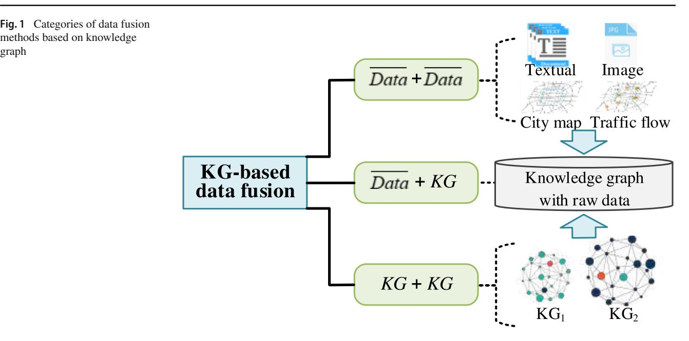

sentations of news to fully discover the potential knowledgelevel connections among news by applying KGE technique. The framework of this approach is shown in Fig. [3.](#page-5-0) We summarize the framework into three layers: data layer, data analysis layer, and data fusion layer. The data layer includes candidate texts and historical texts clicked by users. In the data analysis layer, knowledge distillation is performed on text data based on existing knowledge graph (auxiliary data) using techniques such as entity linking and KGE to extract relevant entities and their contextual embeddings. The entities and their contextual embeddings are then fed into knowledge-aware CNN (KCNN) to fuse the knowledge from the knowledge graph into the sentence representation. KCNN achieves fusion of lexical semantic and knowledge information through concatenate (Concat) and convolution. In the data fusion layer, user's embeddings employ attention networks to learn the weights of historical texts to achieve weighted fusion of historical texts. Then, the candidate texts and user's embeddings are fused by linking operations and the user click probability is predicted by deep neural network (DNN). This deep news knowledge-aware approach not only uses knowledge graphs to embed text data, but also achieves the fusion of multiple text data through techniques such as attention mechanism.

Since deep learning has greater strengths in learning new feature representations compare to manually generated features [\[7,](#page-20-20) [59](#page-21-16), [67,](#page-21-3) [150](#page-24-3)], some studies extract data features as entities and relations from numerical data via deep learn-

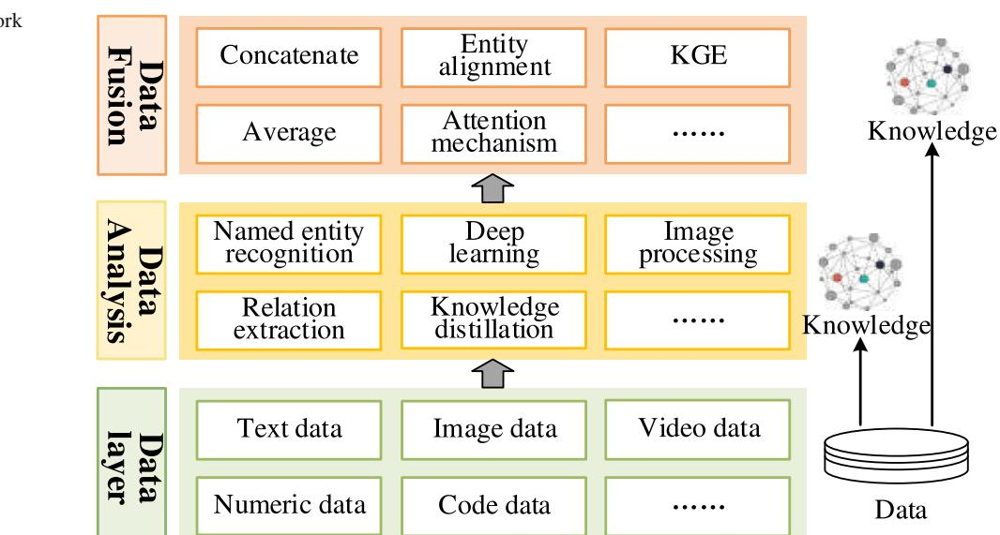

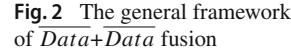

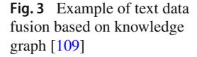

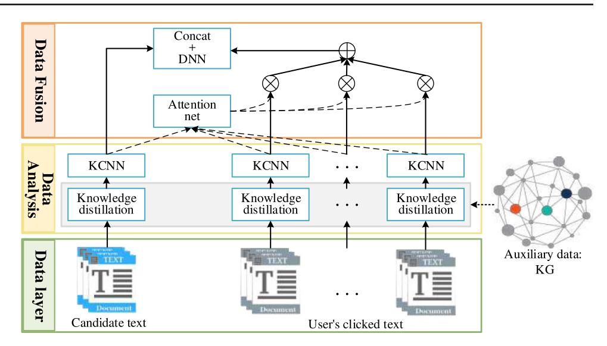

ing. This achieves knowledge mining from numerical data. This category of methods is oriented towards the fusion of numerical data.
*Example 2* **Knowledge mining for traffic flow** [\[69\]](#page-21-4). Liu et al. suggested a knowledge mining network for regional traffic pattern (RFP-KMN) to analyze the continuous state of urban traffic flow, as shown in Fig. [4.](#page-5-1) The approach enables the mining, storage and re-application of multi-source heterogeneous data. We summarize the framework into three layers: data layer, data analysis layer and data fusion layer.

The data layer includes migration volume of time, migration volume of space, spatial location and POI information of the region. In the data analysis layer, four deep self-encoders are designed to extract features from the four datasets with a focused goal. The POITrans is used to convert the POI semantic features of regions into inter-regional POI semantic variations. In the data fusion layer, the temporal features and POI semantic variation features are fused first using an attention-based mechanism fusion method. Then, the two spatial features are fused using the average fusion method and the fused results are concatenated to the POI semantic features. Finally, TransE [\[12\]](#page-20-13), which is a KGE technique, is utilized to fuse the temporal features and spatial features to achieve storage of data values. This traffic flow knowledge mining method achieves data mining from numerical data and is able to complement the generic knowledge graph with more implicit knowledge.

Besides textual data and numerical data, image data, audio data and video data are also widely available. For these data, existing fusion methods usually combine them with textual and numerical data for analysis. This category of methods

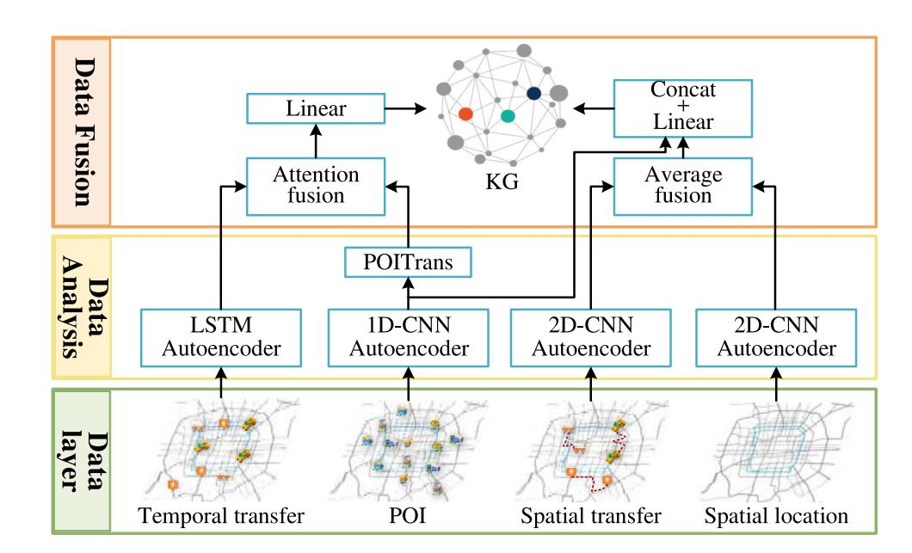

**Fig. 4**Example of numerical data fusion based on knowledge graph [\[69\]](#page-21-4)

is oriented to the fusion of hybrid data. The main approach of this category of methods is to represent or structure each type of data first, and then the processed multiple data are formed into a reasonable knowledge triplet and learned.

##*Example 3*Multi-modal knowledge graph extraction [\[55](#page-21-17)].

For representing and querying an increasing number of publications, Kannan et al. demonstrated a method capable of extracting knowledge graph from data of different modalities (i.e., text, model image and source code), as shown in Fig. [5.](#page-6-0) The method is able to represent multi-modal information using knowledge graph and can query this information. We summarize the framework into three layers: data layer, data analysis layer and data fusion layer. The data layer involves the summary and introduction of the publication (text), the model architecture diagram (image), and the reference code implementation (code). In the data analysis layer, knowledge is mined from the text, graph and code, and the corresponding knowledge graphs are constructed, respectively. Specifically, knowledge is mined from the text using named entity recognition and relation extraction techniques. For model architecture graph, graph representation is constructed by text/symbol segmentation, recognition and structure analysis. For code, the architectural information of the model (e.g., layer type, activation function and optimizer, etc.) is extracted and a static call graph of the code is constructed by using ontology and vocabulary. At the data fusion layer, local alignment is first achieved by finding similar entities across modalities and later concatenating them together, and then global alignment is achieved by using additional knowledge graph (i.e., computer science ontology) to enhance the entity alignment. This approach enables the fusion of hybrid data through knowledge mining and entity alignment techniques.

In general, the fusion methods of*Data*+*Data*all have the process of converting data into knowledge during the data fusion process. Table [1](#page-7-0) summarizes a portion of the latest existing works on*Data*+*Data* fusion. Where the KG construction and embedding in the column of data fusion structures the data into knowledge triples according to defined rules and utilizes the KGE method to learn thus achieving fusion. It essentially does not perform direct fusion of data.

For data type, most of the studies analyze hybrid data and the rest analyze textual or numerical data. The hybrid data fusion methods based on knowledge graph are all analyzed with textual data as the benchmark. Besides, since the existing knowledge graph construction methods are based on textual data for operations such as named entity identification and relation extraction, there are fewer studies on the fusion of numerical data based on knowledge graph. This part of work needs to be further studied in future work. For data analysis, due to the superiority of deep learning in feature extraction, a large amount of works combine deep learning with knowledge graph construction techniques (e.g., word embedding, named entity recognition and relation extraction) to learn the features of data. For data fusion, most of

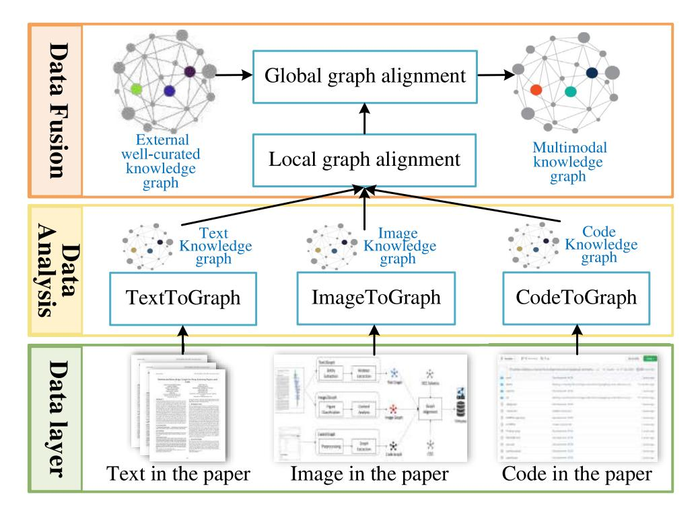

**Fig. 5**Example of hybrid data fusion based on knowledge graph [\[55](#page-21-17)]

| Summary of Table 1  | Data+Data fusion works      |                                       |                                               |                                    |
|------------------------|-----------------------------|---------------------------------------|-----------------------------------------------|------------------------------------|
| Model                  | Data type                   | Data analysis                         | Data fusion                                   | Verification/Application           |
| DKN [109]              | Textual data                | Knowledge distillation CNN and     | Attention and Concat                          | News recommendation                |
| NPA [122]              | Textual data                | Word embedding CNN and             | Attention and Dot                             | News recommendation                |
| NAML [121]             | Textual data                | Word embedding CNN and             | Attention and Dot                             | News recommendation                |
| NRMS [123]             | Textual data                | Word embedding CNN and             | Attention and Dot                             | News recommendation                |
| Hierarchical KG [154]  | Textual data                | Knowledge distillation                | Knowledge fusion [116]                     | Socioeconomic indicator prediction |
| RFP-KMN [69]           | Numeric data                | LSTM and CNN                          | Attention, Concat and Average              | Traffic flow prediction            |
| KG-Trans [21]          | Numeric data                | feature engineering GCN and        | KG Construction and Embeadding             | Travel destination prediction      |
| Multi-modal KG [55]    | Textual, Image and Code     | DL, NER and RE                        | Graph alignment                               | Paper2Graph                        |
| Multi-modal KG [149]   | Textual and Image           | VGG-16 [100] and Bert [25]         | MLP                                           | COVID-19 diagnosis                 |
| Seeing is knowing [92] | Textual and Image           | KGE and LSTM                          | Attention and MLP                             | Visual Q&A                         |
| KB system [156]        | Textual, Image and Metadata | Structural                            | Rule-based                                    | Visual query                       |
| CUImage [89]           | Textual, Image and URL      | GCN and CNN                           | Label propagation                             | Image recognition                  |
| Multi-modal KG [128]   | Textual and Image           | NER and Component analysis            | Entity alignment                              | Oracle bone study                  |
| KDTCN [23]             | Textual and Numeric         | KGE and Mapping                       | Concat and TCN                                | Stock trend prediction             |
| MKRLN [106]            | Textual and Image           | Metapath2Vec VGG [100] [29] and | single-layer neural network and a softmax  | Explainable recommendation         |
| MultiJAF [20]          | Textual and Image           | Neural network                        | Attention-based multi-modal fusion network | Entity alignment                   |
| HRGAT [65]             | Textual, Image and Numeric  | Bert [25] and VGG [100]            | Low-rank multi-modal fusion [73]           | KGC                                |

the works use dot product or Concat fusion combined with attention mechanism to accomplish, and some works build neural network as fusion network to achieve data fusion, and some works adopt common approaches such as rule-based, entity alignment and label propagation. From the applications of existing works, it is clear that the fusion of*Data*+*Data*plays a very critical role in RS, urban computing, COVID-19 diagnosis and Q&A system.

## 3.2 The fusion of*Data+KG*Fusion of*Data*+*K G*is one of the most popular and widely used techniques, especially in the research of knowledge graph-based recommendation and enhancing knowledge graph embedding using auxiliary data. It combines*Data*with*K G*to form a heterogeneous knowledge graph, and then analyzes the heterogeneous knowledge graph to achieve data fusion. Figure [6](#page-8-0) shows the general framework of the*Data*+*K G*fusion approach, including data layer, data analysis layer and data fusion layer.

In the data layer, the basic data for analysis are directly generated by users, which are the history interactions of useritem in the recommender system (e.g., purchases and clicks). Since it is difficult to get an accurate embedding analysis for a single data, existing knowledge graph is applied as auxiliary information for users and items. A new heterogeneous knowledge graph is formed by aligning raw data with the knowledge graph in a reasonably consistent manner through techniques such as entity alignment. In the data analysis layer, the initial embedding of users and items can be achieved based on historical interactions through techniques such as collaborative filtering and matrix decomposition. Heterogeneous knowledge graph is analyzed through path inference, rule-based method and knowledge graph embedding to further enhance the semantic representation of users and items. The primary goal of this layer is to analyze heterogeneous knowledge graphs to enhance the learning of users and items. In the data fusion layer, the information (e.g., neighbor information and higher-order information) of users and items are first fused separately through Concat fusion, average fusion, information propagation and attention mechanism, and then the heterogeneous knowledge graph is learned and recommended through collaborative joint learning. In the Fig. [6,](#page-8-0) we can conclude that the fusion process of*Data*+*K G*connects data and knowledge graph to reconstruct the heterogeneous knowledge graph, and enhances the information of the original data by learning the heterogeneous knowledge graph.

Lots of recommendation algorithms rely on knowledge graph to more accurately analyze the implicit relationships between users and items, such as food recommendation [\[41](#page-21-19)], travel recommendation [\[144\]](#page-24-10) and Web service recommendation [\[14\]](#page-20-26), etc. The main idea of these methods is to connect user and item data with knowledge graph to form a new heterogeneous knowledge graph, and then learn the heterogeneous knowledge graph by techniques such as KGE and path inference to finally make recommendation.
*Example 1* **Collaborative joint recommendation** [\[138](#page-24-11)]. Auxiliary information is frequently used to address the problem of limited collaborative filtering performance due to the scarcity of user-item interactions. Therefore, Zhang et al. exploited heterogeneous information including structured and unstructured data with different semantics in knowledge base to

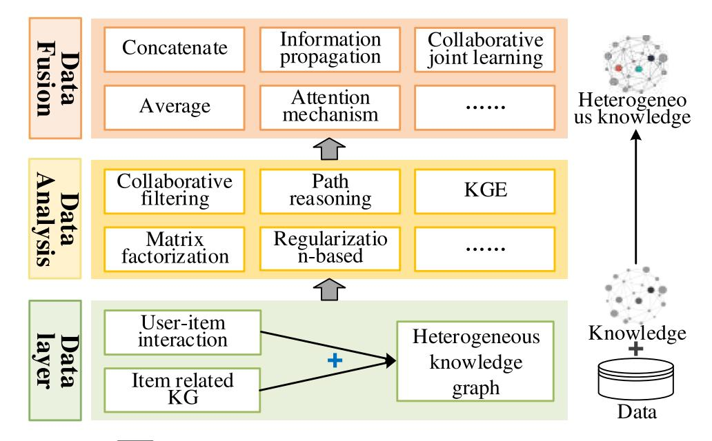

**Fig. 6**The general framework of*Data*+*K G*fusion

improve the quality of recommendation system and proposed collaborative knowledge base embedding (CKBE) approach to jointly learn the potential representations of users and potential representations of items in collaborative filtering. As shown in Fig. [7,](#page-9-0) the approach is summarized in three layers: data layer, data analysis layer and data fusion layer.

The data layer contains two types of data, i.e., raw data and knowledge graph. The raw data are user-item interactions, and the knowledge graph includes structured knowledge base, textual knowledge base and visual knowledge base. In the data analysis layer, users and items are first initially embedded based on implicit user feedback, and then the three knowledge bases are embedded separately. Specifically, TransR [\[66](#page-21-9)] is employed to embed structured knowledge. TransR is a variant of TransE, which bridges entities and relations in different semantic spaces through a relationship matrix. For textual knowledge, the stacked denoising auto-encoder (SDAE) is designed to obtain the textual representation of item entities. Similar to textual knowledge embedding, stacked convolutional auto-encoder (SCAE) is constructed to extract the semantic representation of item entities from the visual knowledge. In the data fusion layer, the item embeddings of collaborative filtering and the item embeddings in the knowledge base are fused by collaborative joint learning to learn effective potential representations of users and items. Specifically, direct fusion is first used to acquire both the item potential representation in collaborative filtering and the representation in the knowledge base, and then the user potential embedding and the item potential embedding are learned collaboratively based on collaborative filtering. The method achieves the fusion of the original data and the knowledge graph through the KGE technique.
*Example 2* **Recommendation based on higher-order path exploration** [\[115\]](#page-23-18). Similarly, Wang et al. argued that considering additional information can provide more accurate, diverse and interpretable recommendation. Not only can heterogeneous knowledge graph breaks the assumption of independent interactions, but the study of higher-order relationships in KG is the key to successful recommendation making. Therefore, a knowledge graph attention network (KGAT) is proposed to model exactly the higher-order links in heterogeneous knowledge graph with an end-to-end manner. As shown in Fig. [8,](#page-10-0) the approach is summarized in three layers: data layer, data analysis layer and data fusion layer.

The data layer contains two types of data, i.e., raw data and knowledge graph. The raw data is the user-item interaction, and the knowledge graph is the set of knowledge triples associated with the items. User interactions and knowledge graph are seamlessly reconstructed into a unified heterogeneous knowledge graph by aligning entities and items. At the data analysis layer, TransR is applied to learn the embedding of entities and relations by optimizing the translation principle. In the data fusion layer, entities/users are first fused with their higher-order neighbor information through the attention embedding propagation method, and then the entities/users fused with different orders of neighbor information are merged into the final embedding through the Concat fusion method. Based on the embedding of entities and users, recommendation is realized by inner product. The

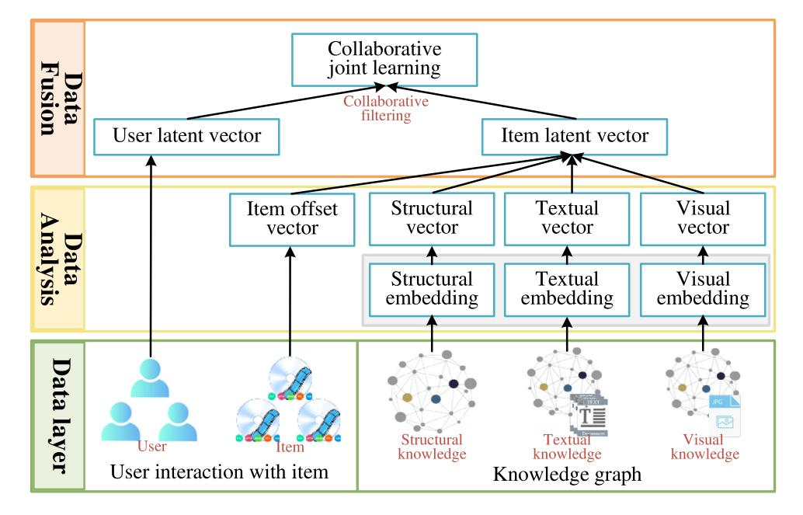

**Fig. 7** Example 1 of raw data and knowledge graph fusion method [\[138](#page-24-11)]

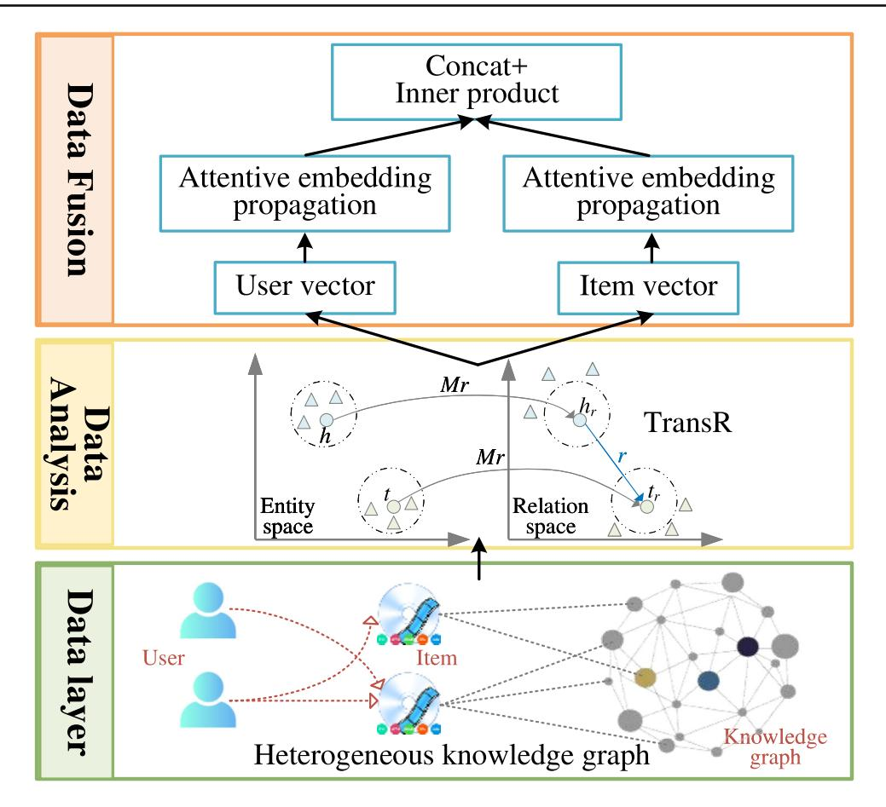

**Fig. 8**Example 2 of raw data and knowledge graph fusion method [\[115](#page-23-18)]

method achieves the fusion of raw data and knowledge graph by analyzing the paths of heterogeneous knowledge graph.

In general, the fusion of*Data*+*K G*takes knowledge graph as important information to learn from existing data. Table [2](#page-11-0) summarizes some of the latest existing*Data*+*K G*fusion efforts. For data type, interaction data, text data and knowledge graph are the most frequently employed and important. Depending on various research techniques, it's a common way to construct heterogeneous knowledge graph by fusing data and knowledge graph. Another one is to learn data and knowledge graph separately. For example, Liu et al. utilized a semantic encoder and a visual encoder for feature extraction of city knowledge graph and city images, respectively, and designed Image-KG contrast learning loss to fuse these features [\[72](#page-22-23)].

For data analysis, knowledge graph embedding techniques such as the classical TransE and its variants are the most common methods for learning heterogeneous knowledge graph. Techniques such as named entity recognition and relation extraction are utilized to analyze textual data, and deep learning methods such as visual geometry group network (VGG) and graph convolutional network (GCN), are used to extract image features. For data fusion, Concat is a commonly adopted technique due to its ability to simply connect multiple feature vectors. After that, some deep learning methods (e.g. pooling, dense and convolution) combined with collaborative filtering and inner product can further enable data fusion. From Table [2,](#page-11-0) it is clear that recommendation system is the most common application of*Data*+*K G*fusion. This also indicates that*Data*+*K G*fusion has contributed to the development of recommendation system research.

## 3.3 The fusion of*KG+KG*The fusion of*K G*+*K G*is essentially the fusion of multiple knowledge graphs, i.e., different knowledge graphs are fused into a unified form [\[146](#page-24-12)]. The typical tasks are entity alignment and knowledge graph complement. It achieves knowledge graph complement by fusing other knowledge into the existing knowledge graph through techniques such as knowledge graph embedding. This process enables the fusion of knowledge. Figure [9](#page-12-0) shows the general framework of the*K G*+*K G*fusion method, including data layer, data analysis layer and data fusion layer.

| Data type                              | Data analysis                                  | Data fusion                                | Verification/Application      |
|----------------------------------------|------------------------------------------------|--------------------------------------------|-------------------------------|
| Interaction data and Multiple KGs   | Auto-encoder TransR and                     | Collaborative filtering Concat and      | Recommender system            |
| Heterogeneous KG                       | TransR                                         | Inner product Concat and                | Recommender system            |
| Heterogeneous KG                       | Hyperplane-based Translation                   | Joint learning via TransH                  | Recommender system            |
| Heterogeneous KG                       | Path-based and RNN                             | Max pooling and Dense layer             | Recommender system            |
| Heterogeneous KG Textual, Image and | ResNet50 [42], Word2Vec [76] and SIF [4] | Attention and Propagation                  | Recommender system            |
| Textual, Image and KG               | Auto-encoder and TransE                        | Concat and CNN                             | Knowledge representation      |
| Textual, Image and KG               | Bidirectional GRUs and VGG [100]            | Tense layer                                | KGC                           |
| Interaction data and KG             | GCN                                            | Concat and Pooling                         | Recommender system            |
| Textual, Image and KG               | Path-based and DNN                             | Concat and CNN                             | Sequential recommendation     |
| Textual, Image and KG               | Path-based and DNN                             | Feature propagation and Concat          | recommendation Trust-aware |
| Textual and KG                         | NER and RE                                     | Entity linking and Concat               | Q&A system                    |
| Image and KG                           | GCN and ResNet                                 | Knowledge infusion                         | Socioeconomic prediction      |
| Textual and KG                         | Bert and Multi-attention                       | Adaptive fusion based on gate mechanism | Temporal Q&A system           |
| Textual and KG                         | GCN                                            | Temporal convolution                       | Equipment fault diagnosis     |
|                                        |                                                |                                            |                               |

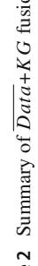

In the data layer, multiple knowledge graphs are the object of our study. Each knowledge graph contains a number of knowledge triples consisting of entities and relations. These knowledge graphs can be either domain knowledge graph or general knowledge graph. For multiple domain knowledge graphs, we can analyze the representation of each knowledge graph independently, or we can learn them jointly together. The fusion of these knowledge graphs can be applied to solve domain-specific problems. For multiple generic knowledge graphs, jointly learning the embedding representation or path relationship of these knowledge graphs is crucial to fuse these knowledge graphs. In addition, some auxiliary data, such as seed-aligned entity pairs, can also be available to learn multiple knowledge graphs. In the data analysis layer, techniques such as rule-based pattern matching, path inference, knowledge graph embedding and graph neural network are adopted to associate multiple knowledge graphs and learn the embedding representation of these knowledge graphs in the same potential space. Meanwhile, exploiting the information complementarity of diverse knowledge graphs (e.g., the link between an entity and the neighbors of the entity in another knowledge graph) can serve to enhance the embedding representation of entities and relations. In the data fusion layer, on the basis of the collaborative learning of knowledge graphs, the fusion of knowledge is carried out through the techniques of entity alignment, relation alignment, ontology matching, entity disambiguation and information interaction, so as to achieve the fusion of multiple knowledge graphs. In the Fig. [9,](#page-12-0) we can conclude that the fusion process of*K G*+*K G*can fuse the knowledge in multiple knowledge

graphs into a unified knowledge representation. This is also a very critical step in many practical downstream applications.

After representing entities and relations in knowledge graphs as dense low-dimensional vectors, we can efficiently compute the semantic connections of entities and relations in this space, which effectively solves the data sparsity problem and significantly improves the performance of knowledge acquisition, fusion and inference [\[52](#page-21-22), [113](#page-23-24)]. Therefore, the accurate fusion of multiple knowledge graphs can be achieved by mapping them into the same semantic space through knowledge graph embedding.
*Example 1* **Cross-domain chiasmal embedding** [\[68\]](#page-21-23). A prerequisite for the reasonable fusion of multiple knowledge graphs is the efficient cooperative embedding of these knowledge graphs. Liu et al. argued that entity/relation embedding in multiple knowledge graphs needs not only to contain information from multiple domains, but also to be able to distinguish information from different domains. To achieve this, a cross-domain knowledge graph chiasmal embedding approach (CDKG-CE) is proposed to efficiently distinguish and associate all items in multiple domains, as shown in Fig. [10.](#page-13-0)

The data layer contains three diverse knowledge graphs, which are music knowledge graph, movie knowledge graph and novel knowledge graph. It is noteworthy that these knowledge graphs are somewhat connected based on entities and relations. For example, the same entity appears in both the music knowledge graph and the movie knowledge graph. Since TransE is a classical and effective knowledge graph

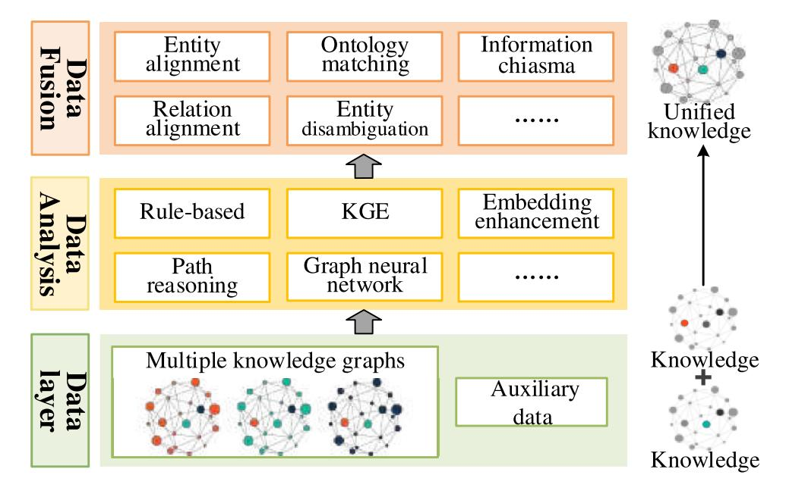

**Fig. 9**The general framework of*K G*+*K G* fusion

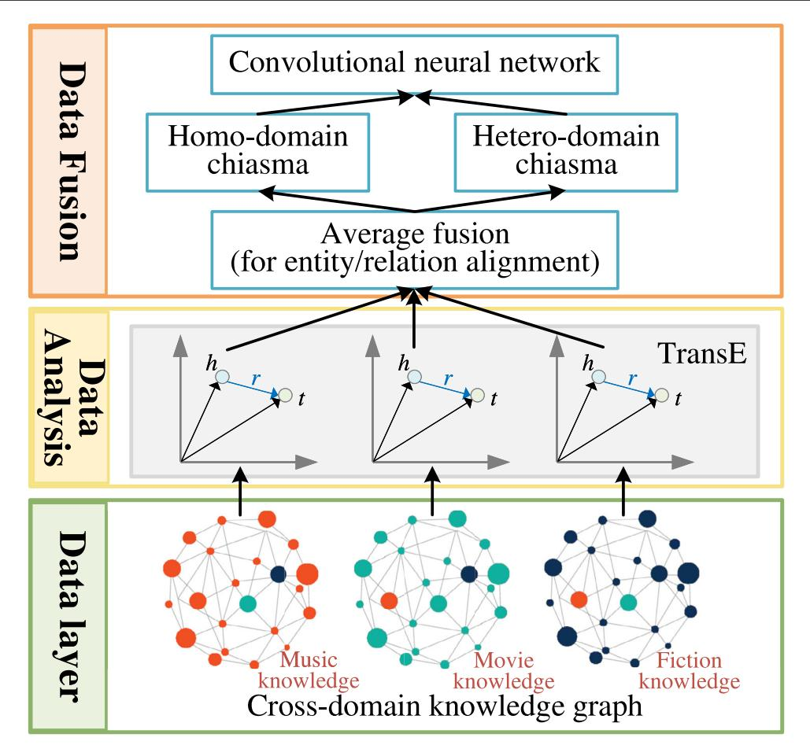

**Fig. 10**Example 1 of knowledge graph fusion method [\[68](#page-21-23)]

embedding method, it is used to learn the initial embedding of each of the three knowledge graphs in the data analysis layer. This not only speeds up the convergence of the proposed method, but also improves the performance of the embedding. In the data fusion layer, the average fusion method is first applied to fuse the multiple initialized embeddings of entities/relations. The reason for this is because entities/relations existing in multiple knowledge graphs at the same time generate multiple embeddings after initializing the embedding, while only one embedding representation is actually needed for the same entity/relation. Then, the knowledge triples in the same domain and the knowledge triples in different domains are cross-interacted by embedding cut and embedding interaction, respectively. Finally, a CNN is constructed to learn these interacted knowledge triples to achieve the purpose of collaborative learning of multiple knowledge graphs. The multiple knowledge graphs learned by this method can then be reasonably fused. This method achieves the fusion of multiple knowledge graphs based on the knowledge graph embedding method.
*Example 2* **Relation-aware alignment** [\[157](#page-24-13)]. Entity alignment is an important step to achieve knowledge fusion by associating entities with the same meaning in different knowledge graphs. Entity alignment and relation alignment are two related tasks of knowledge fusion. Zhu et al. designed a relational-aware neighborhood matching model for entity alignment to achieve knowledge fusion in two knowledge graphs. The model considers the connection relationship between adjacent entities, and it contains important information for both neighborhood matching and entity alignment. The model is summarized into three layers: data layer, data analysis layer and data fusion layer, as shown in Fig. [11.](#page-14-0)

The data layer contains two generic knowledge graphs and some auxiliary information. It is noticeable that the multiple knowledge graphs in Fig. [10](#page-13-0) are the ones with clear domain information, i.e., the music knowledge graph, the movie knowledge graph and the novel knowledge graph. And the multiple knowledge graphs in Fig. [11](#page-14-0) are generic knowledge graphs, which contain confounded knowledge. The auxiliary information is some seed entity pairs that have been aligned.

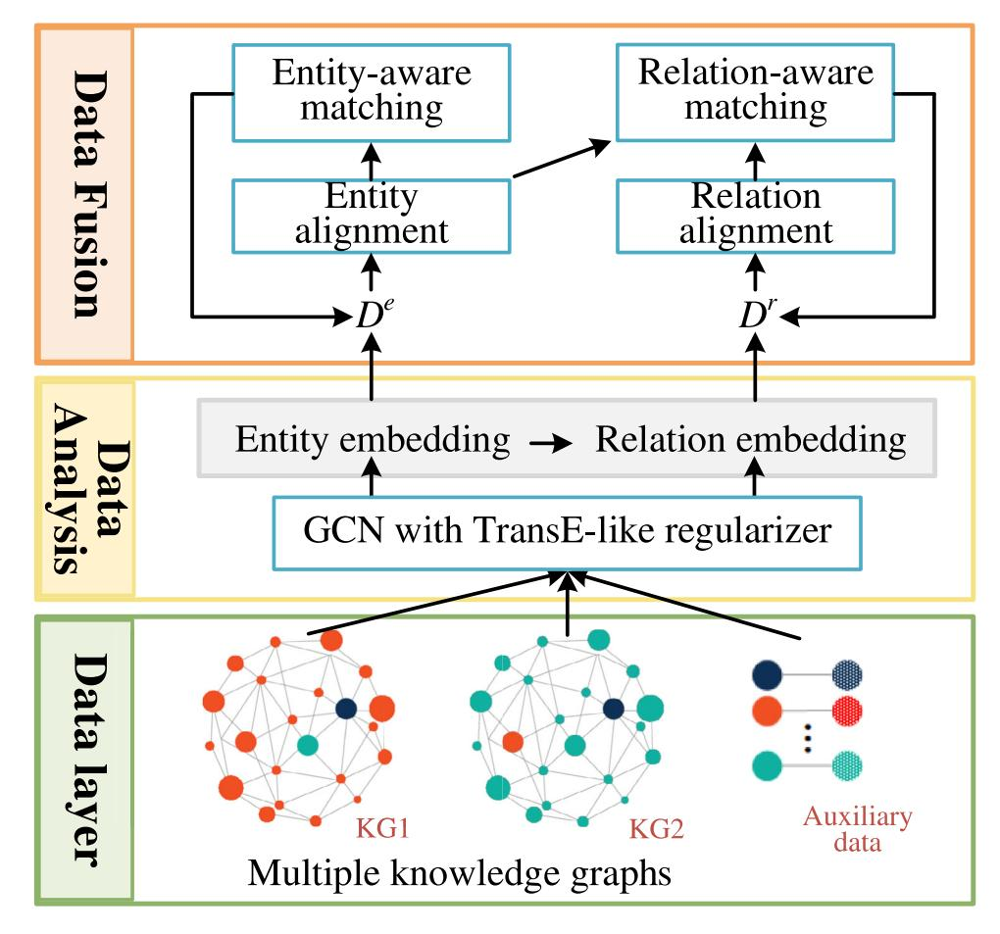

**Fig. 11**Example 2 of knowledge graph fusion method [\[157](#page-24-13)]

In the data analysis layer, a GCN with a TransE-like regularizer is used to jointly learn the embeddings of entities and relations. The aim is to embed two knowledge graphs into a shared latent space. Further, augmented embeddings of entities and relations are performed using seed entity pairs. For entity embedding, seed alignments are used as training data and a margin-based loss function is defined for learning. For relations, embedding is performed by connecting the embedding of head and tail entities as the embedding of relations and using TransE for learning. In the data fusion layer, the distance matrix is utilized for the association and fusion of two knowledge graphs.*De*and*Dr*denote the distance matrices of entities and relations from the knowledge graph*G*1 to *G*2, respectively. First, the distance matrices *De*and*Dr*are learned using relation-aware neighbor matching and entityaware matching, respectively. Then, the alignment ranking or generation of alignment sets of entities and relations are learned by*De*and*Dr*.

Table [3](#page-15-0) summarizes the recent part of the existing *K G*+*K G*fusion work. For data type, apart from multiple basic knowledge graphs, elements in some knowledge triples (e.g., entities) can also be used as auxiliary information. Knowledge graph embedding techniques combined with deep learning are the predominant approach. For data fusion, there are many methods here that enable the fusion of knowledge, such as embedding cut and interaction, binary classifier, mutual information and Manhattan distance. Their goal is to compute the semantic information of entities/relations in diverse knowledge graphs and thus analyze the association relationships between them. The fusion of*K G*+*K G*is most applied to entity alignment and is also frequently applied to recommender system.

However, the existing*K G*+*K G* fusion techniques are more than only as shown in Table [3.](#page-15-0) Although knowledge graph fusion has not yet formed a unified theoretical system, the key techniques for knowledge fusion, such as entity alignment, entity disambiguation, and knowledge representation, have been extensively studied in both industry and academia [\[146\]](#page-24-12). Nguyen et al. summarized techniques that can be applied to fuse multiple knowledge graphs, including tensor factorization-based methods, embeddingbased methods, entity disambigation-based methods and probabilistic-based methods [\[81](#page-22-26)]. Tensor factorization-based

| Summary of Table 3                | K G+K G fusion works            |                                    |                                    |                            |
|--------------------------------------|---------------------------------|------------------------------------|------------------------------------|----------------------------|
| Model                                | Data type                       | Data analysis                      | Data fusion                        | Verification/Application   |
| CDKG-CE [68]                         | Multiple KGs                    | TransE and CNN                  | Embedding cut and chiasm        | Cross-domain recommender   |
| RNM [157]                            | Seed entity and Multiple KGs | GCN and TransE                  | Entity and relation alignment      | Entity alignment           |
| Knowledge vault [28]                 | Multiple KGs                    | RE                                 | Binary classifier                  | KG construction            |
| [152] semantic fusion KG-based | Multiple KGs                    | GCN                                | Mutual Information Maximization | Conversational recommender |
| KAGNN [47]                           | Multiple KGs                    | TransE and GCN                     | Manhattan distance Concat and   | Entity alignment           |
| MR-GAT [131]                         | Multiple KGs                    | Graph attention                    | Manhattan distance Concat and   | Enterprise system          |
| DFMKE [155]                          | Multiple KGs                    | and graph embedding GCN, ResNet | Multi-linear computing             | Entity alignment           |

method represents the knowledge graph as a binary tensor model and learns the correlation between two entities in the knowledge graph by tensor factorization. Kazemi et al. proposed a simple enhancement of a typical multivariate decomposition in the first tensor factorization method that allows to learn independently the two embeddings of each entity [\[56\]](#page-21-25). The embedding-based approach learns the semantic representation of entities and relations by building a fractional function to measure the plausibility of triples in the embedding space and analyzes the associative relations between entities. Nickel et al. designed holographic embedding to learn the combinatorial vector space representation of the entire knowledge graph, which captures rich interactions by using correlation as a combinatorial operator [\[83](#page-22-27)]. The entity disambigation-based approach achieves knowledge fusion by identifying two entities that correspond to the same real-world entity in multiple knowledge graphs to remove duplicate information. Zhou et al. used multimodal graph convolution to aggregate visual and contextual linguistic information for accurate entity disambiguation of short texts [\[153](#page-24-16)]. Probabilistic-based approach analyzes the plausibility and accuracy of knowledge triples or entities by probabilistic models such as path ranking [\[61\]](#page-21-12) and multilayer perceptron (MLP). This category of methods replaces neural inference with a probabilistic framework, i.e., probabilistic models are built to infer answer, where logical rule is designed as feature in the probabilistic model, called symboldriven probabilistic inference. In symbol-driven probabilistic reasoning for knowledge graph, probabilistic model was built and the rationality of entities was recommended by analyzing the logical rule [\[141](#page-24-17)]. The details of knowledge graph fusion techniques can be read in the paper [\[81](#page-22-26)].

### 3.4 Discussion

Big data fusion and knowledge graph is mutually reinforcing and supportive. First of all, big data fusion provides rich multi-source heterogeneous data for knowledge graph, which promotes the construction and refinement of knowledge graph and thus further achieves complementation. With the diversity of data sources and the increase in data volume, traditional knowledge graph is usually hard to deal with these massive and diverse data. Big data technology is capable of fusing data from different sources, including structured data, unstructured data (e.g., text, images, etc.), and real-time data. Through data fusion, more and more precise information about entities and relations can be provided for the knowledge graph construction. For example, by fusing data from sensors, social media, and enterprise databases, the knowledge graph can be infused with more information to enhance its value in real-world applications. Second, knowledge graph provides a structured knowledge framework for big data fusion. Big data fusion usually involves the integration and processing of information from different data sources, while knowledge graph can provide a unified semantic hierarchy and knowledge framework, enabling heterogeneous data to be represented in a consistent way. Through knowledge graph, various entities and relations in the data can be structurally related and organized, which makes the information produced by big data fusion more readable and usable. When dealing with complex tasks, the semantic association capability of knowledge graphs can help big data systems understand the intrinsic connections between different data sources, so that the potential value in big data can be mined and utilized more effectively. In addition, the combination of data fusion and knowledge graph can help promote the development of intelligent reasoning and decision support systems. For example, in the field of intelligent healthcare, the combination of patients' health data and medical knowledge graphs can help doctors make more accurate diagnosis and treatment decisions [\[124\]](#page-23-26).

According to the above review of three categories of data fusion methods with knowledge graph-based technology, we can derive the following conclusions.

First, the raw data (*Data*) are usually transformed into knowledge in the process of fusion, which is roughly divided into two processing ways. One way is to mine the features of the data by machine learning methods, and then fuse them with the embedded knowledge graph at the feature level. The other way is to directly treat the data as entities and construct a heterogeneous knowledge graph by defining the relation between the entities and the ones in the existing knowledge graph, and then learn further. The data in the second way is generally textual data.

Second, both *Data*+*K G*fusion and*K G*+*K G*fusion methods use existing knowledge graph as input data, and some of the*Data*+*K G*fusion methods also employ existing knowledge graph as auxiliary data. Generic knowledge graphs, such as Freebase [\[11\]](#page-20-19), YAGO [\[103\]](#page-22-18), and DBpedia [\[62](#page-21-15)], can increase the reliability of the data, and therefore they are often used in these fusion methods.

Third, from the fusion layers of Figs. [2,](#page-4-1) [6](#page-8-0) and [9,](#page-12-0) we can see that most of the fusion approaches are derived from the research techniques of knowledge graphs, such as entity alignment, information propagation and knowledge graph embedding, with the exception of the basic fusion approaches often available in deep learning (e.g., connection fusion and attention-based fusion). These fusion approaches cannot be applied by other fusion methods that do not use knowledge graph techniques.

Fourth, data from diverse sources have certain information, and the fusion of*Data*+*Data*can analyze the overall information more comprehensively. However, the fusion of raw data with knowledge graph technology has problems that it takes a lot of time and effort to mine the knowledge and the information of the constructed knowledge graph is not accurate, so it is a good choice to use the generic knowledge graph as the supervised information. In addition, the generic knowledge graph can also be taken as the main input data to fuse the raw data, i.e., the fusion of*Data*+*K G*. Usually, the raw data has only a small amount of unstructured information, and by putting the raw data into a knowledge base, we can take this raw data as the origin to learn more relevant information. Moreover, a knowledge graph is also one that does not contain all the knowledge in the real world, so the knowledge graph also needs information from other knowledge bases to complement the knowledge it lacks, i.e., the *K G*+*K G*fusion. Therefore, in our research work, it is necessary to use knowledge graph techniques to fuse the raw data we have and thus help us solve the problems we face.

Finally, several key factors need to be considered to select a suitable fusion method in specific application scenarios. First, it is necessary to determine whether the problem or task to be solved relies on knowledge as input. For example, knowledge is enriched by fusing multiple knowledge graphs in a knowledge graph completion task. Next, it is important to consider whether the multiple sources of heterogeneous data in the application scenario have relevant and appropriate knowledge bases, e.g., traffic flow prediction usually lacks the support of appropriate knowledge bases. Lastly, other factors such as data availability, quality, and complexity of the task need to be evaluated to ensure that the selected fusion method is effective in improving the performance and accuracy of the task.

## 4 Future direction

Knowledge graph-based data fusion not only enables the fusion of textual data, numerical data and image data (raw data*Data*), but also allows the fusion of knowledge (*K G*) based on these data. This can also solve the challenge of knowledge mining research in which it is difficult to mine knowledge triples from data such as numerical and image data. Moreover, data fusion based on knowledge graph has also been successfully applied in many applications, especially recommendation system. However, due to the multi-source heterogeneity, dynamic evolutionary nature and privacy security of the data, knowledge graph-based data fusion is still facing many problems. Therefore, knowledge graph-based data fusion opens several issues for further research as follows.

**Fusing multi-source heterogeneous data**Multi-source heterogeneous data fusion technology successfully supports many applications, such as traffic flow prediction [\[2,](#page-19-6) [142](#page-24-18)], ambulance deployment [\[50,](#page-21-7) [51\]](#page-21-26) and air quality prediction [\[40](#page-21-27), [54](#page-21-28)]. However, the data studied in these works are broadly numerical and image data, etc., and there is a lack of research on textual data. Due to the heterogeneity of data, the vast majority of existing knowledge graph construction methods are oriented to textual data, where entities and relations are also represented in the form of word. In fact, numerical data and image data, etc. contain a large amount of knowledge. If this knowledge can be mined and fused with the existing knowledge graph, it will be very significant. On the one hand, the knowledge mined from numerical data and image data, etc. can further improve the existing knowledge graph. On the other hand, using the facts in the knowledge graph can further enhance the possibility of data-driven practical applications. For example, Liu et al. verified that the accuracy of using knowledge triples to predict traffic flow is no less than that of using urban spatio-temporal data [\[69](#page-21-4)].
**Fusing dynamically evolving data**For*Data*, the data is changing over time according to the five basic characteristics of big data. For example, Sina Weibo generates from tens to hundreds of thousands of new posts every day in 2024. The volume of traffic on a particular road in a city varies from time to time. There will be 100 to 200 million photos generated every year due to the increasingly advanced networks and devices nowadays. For *K G*, it is also time-sensitive to a certain extent. For example, the knowledge triplet -*Battle of Chosin Reservior, box office, 5.495 billion*only exists on October 31, 2021. Several existing works have analyzed the dynamically changing*Data*and*K G*, respectively. Cermelli et al. proposed a weak incremental learning framework for semantic segmentation aimed at learning to segment new classes among the large and continuously generated imagelevel labels [\[15](#page-20-30)]. Sadeghian et al. achieved an embedding representation of the temporal knowledge graph by capturing the rich interactions between temporal and multi-relational features of the temporal knowledge graph [\[95\]](#page-22-28). Therefore, the dynamic evolution of the data needs to be considered when fusing the data, especially fusing the dynamically changing raw data with the knowledge graph. This is also of interest for practical applications. For example, in the recommendation scenario with high real-time requirement, the user-item interaction data is also changing constantly, so the knowledge graph should also have high real-time capability. However, in the case of frequent updates of both the original data and the knowledge graph, there is a problem of high training time cost. This needs further research.

**Fusion of privacy-secure data**Although machine learning as an analysis and processing technique for massive data has been widely served, the issue of data privacy and security as well as the inability to share data securely are still issues to be addressed [\[132](#page-23-27)]. Thus, there is an urgent need to protect user privacy and data security, both for data fusion and for training data using machine learning method. Federated learning can support multiple data owners to collaboratively perform data mining under the premise of protecting data privacy and data security, and ultimately solve the problem of data silos [\[133,](#page-23-28) [137\]](#page-24-19). Therefore, it's a very worthy research problem to achieve the fusion of data while protecting data privacy and security with the help of federal learning framework. On the one hand, how to fuse data with other data while protecting its privacy and security under the federal learning framework. On the other hand, how to build a unified data description framework without sharing data with the federal learning framework. For example, embedding the knowledge graph and enabling downstream applications, such as natural language understanding, Q&A system and RS, without sharing the knowledge graph across clients.
**Fusing data with LLMs**Large Language Models (LLMs) are artificial intelligence models for understanding and generating human language, which have been successfully applied in many tasks, such as natural language processing [\[77\]](#page-22-29), knowledge graph construction [\[9](#page-20-31)], healthcare [\[107\]](#page-23-29), and so on. In the construction of urban knowledge graph, Ning et al. presented a a unified large language model agent framework to mine knowledge triples from Geographic data and textual data [\[84\]](#page-22-30). Wan et al. introduced the notion of knowledge fusion for LLMs, which aims to combine the capabilities of existing LLMs and transfer them into a single LLM to achieve the enhancement of the target model [\[108](#page-23-30)]. Existing research has shown that LLMs can not only assist in the fusion of multi-source heterogeneous data, as the work [\[44,](#page-21-29) [148\]](#page-24-20) shows, but also that data fusion (or knowledge fusion) can enhance the performance of LLMs in turn, as the work [\[45](#page-21-30), [82](#page-22-31)] shows. Thus, we can see that LLMs exhibit great potential in data fusion and knowledge graph construction, and future research is expected to further promote the indepth development and application of this direction.

## 5 Public datasets

To help researchers further engage and contribute more valuable work, we have collected and organized some relevant open datasets. Below are details of these datasets.**Raw datasets:**• Book-Crossing: [http://www2.informatik.uni-freiburg.de](http://www2.informatik.uni-freiburg.de/Xcziegler/BX/.) [/Xcziegler/BX/.](http://www2.informatik.uni-freiburg.de/Xcziegler/BX/.) This dataset contains user ratings of the books that have been read. [2](#page-18-1)

- Amazon-Book: <http://jmcauley.ucsd.edu/data/amazon/.> This dataset is also the user's rating data for the books they have read. [3](#page-18-2)
- Didi order data in Chengdu: [https://gaia.didichuxing.com.](https://gaia.didichuxing.com) The dataset is applied in knowledge mining for traffic flow [\[69](#page-21-4)], including order id, time, and latitude and longitude of boarding and alighting.
- MovieLens: <https://grouplens.org/datasets/movielens/.> The dataset is a collection of movie ratings from the MovieLens website, including movie, user, user rating data and tagging data.
- Linked Movie DataBase: [https://old.datahub.io/dataset/](https://old.datahub.io/dataset/linkedmdb.) [linkedmdb.](https://old.datahub.io/dataset/linkedmdb.) It provides a demonstration of an open-linked dataset linking several major existing film web resources.
- IMDB: <http://www.imdb.com/.> IMDB contains ancillary information about movies, such as genre, actors, directors, etc. This dataset can be utilized in association with the MovieLens dataset.
- Yelp: [https://www.yelp.com/dataset\\_challenge.](https://www.yelp.com/dataset_challenge.) This dataset contains user check-ins for local businesses, as well as user comments and a network of local business information (e.g., categories and locations).
- CiteULike dataset: <http://www.citeulike.org/faq/data.adp.> CiteULike allows users to create their own collection of articles.
- DBbook2014: [https://2014.eswc-conferences.org/](https://2014.eswc-conferences.org/important-dates/call-RecSys.html.) [important-dates/call-RecSys.html.](https://2014.eswc-conferences.org/important-dates/call-RecSys.html.) The dataset is primarily devoted to the study of how to facilitate the creation of a new knowledge support and content-based recommendation system.
- NYC open data: [https://opendata.cityofnewyork.us/.T](https://opendata.cityofnewyork.us/.)his open data is free public data released by New York City agencies and other partners.
- Chicago's open data: <https://data.cityofchicago.org/.>This open data platform allows us to find city data, including facts about the community, maps and charts of the city, and more.

## Knowledge graph: 2

- Freebase: <https://developers.google.com/freebase.> Freebase was launched in 2007 by Metaweb Technologies, Inc. and became a Google knowledge graph in 2010.
- DBpedia: <https://wiki.dbpedia.org/.> DBpedia was created in 2007 and has since become the most popular and well known knowledge graph.

2 Book-Crossing: The dataset enables to find the corresponding items by applying the knowledge graph DBpedia or Freebase.

3 Amazon-Book: The dataset enables to find the corresponding items by applying the knowledge graph DBpedia or Freebase.

- Wikidata: <https://www.wikidata.org/.>Wikidata is a project launched in 2012 that aims to create new ways to manage Wikipedia's data at scale.
- YAGO: [https://www.mpi-inf.mpg.de/departments/datab](https://www.mpi-inf.mpg.de/departments/databases-and-information-systems/research/yago-naga/yago.) [ases-and-information-systems/research/yago-naga/yago.](https://www.mpi-inf.mpg.de/departments/databases-and-information-systems/research/yago-naga/yago.) YAGO is a knowledge graph developed by the Max Planck Institute for Computer Science in 2007.
- AceKG: <https://www.acemap.info/app/AceKG/.> AceKG describes the academic facts of 3.13 billion triples, including the necessary attributes of papers, authors, fields of study, sites and institutions, and the connections between them [\[114](#page-23-31)].
- Microsoft Satori: [https://searchengineland.com/library/](https://searchengineland.com/library/bing/bing-satori.) [bing/bing-satori.](https://searchengineland.com/library/bing/bing-satori.) Microsoft Satori was built by Microsoft in 2010 to enhance Bing's search capabilities.
- Baidu knowledge graph: <https://kgopen.baidu.com/index.> The Baidu knowledge graph is a grand data model that can build a huge knowledge network.
- OwnThink KG: [https://github.com/ownthink/Knowledge](https://github.com/ownthink/KnowledgeGraphData.) [GraphData.](https://github.com/ownthink/KnowledgeGraphData.) Ownthink has open-sourced the largest Chinese knowledge graph ever, and the data is organized as a mixture of*entities, attributes, values*,*entities, relations, entities*.
- UMLS KG: [https://www.nlm.nih.gov/research/umls/](https://www.nlm.nih.gov/research/umls/index.html.) [index.html.](https://www.nlm.nih.gov/research/umls/index.html.) UMLS integrates key terminology, classification and coding standards, and related resources to facilitate the creation of more efficient and interoperable biomedical information systems and services.
- Douban Film's KG: [http://openkg.cn/dataset/douban](http://openkg.cn/dataset/douban-movie-kg.)[movie-kg.](http://openkg.cn/dataset/douban-movie-kg.)Douban Film's knowledge graph illustrates the relationship between directors, screenwriters, actors and films.
- MusicBrainz: <https://musicbrainz.org/.> MusicBrainz is an open access music encyclopedia that collects a wide range of music metadata.
- KnowledgeWorkshop of Fudan University: [http://kw.fudan](http://kw.fudan.edu.cn/.) [.edu.cn/.](http://kw.fudan.edu.cn/.) The Knowledge Works platform provides largescale, high-quality knowledge graphs that can meet the needs of machine language understanding. The knowledge graph obtained through the Knowledge Base Cloud Service Platform API is successfully applied in Crossdomain chiasmal embedding [\[68](#page-21-23)].

## 6 Conclusion

In this paper, we systematically reviewed existing data fusion methods with knowledge graph and categorized them according to data types, including raw data fusion, fusion f raw data with knowledgegraph, and fusion between knowledge graphs. We further discussed several key directions for future research, including dynamic evolutionary data fusion and privacy-secure data fusion, with the aim of promoting continuous development and innovation in the field. Finally, we provided some publicly available links of multi-source heterogeneous big data and knowledge graphs for references of further research and applications.

In future research, several key directions are first explored in depth, including fusion methods for dynamic evolutionary data, fusion techniques for privacy and security data, and data fusion methods based on large language models (LLMs). Secondly, suitable multi-source heterogeneous datasets should be collected, and scientifically reasonable evaluation metrics should be defined to systematically evaluate and compare different categories of data fusion methods, so as to guide the optimization and practical application of future research.
**Acknowledgements**This research was supported by the National Natural Science Foundation of China (Grant Nos. 62402395, 62406070 and 62406044) and the Natural Science Foundation of Sichuan Province, China (Grant No. 2025ZNSFSC0481).
**Author Contributions**Jia Liu: Conceptualization, Methodology, Writing - original draft; Ruotian Lan: Investigation, Writing - review & editing; Yajun Du: Supervision; Xipeng Yuan: Investigation, Writing review & editing; Huan Xu: Investigation, Writing - review & editing; Tianrui Li: Supervision, Data curation; Wei Huang: Conceptualization, Methodology, Writing - review & editing; Pengfei Zhang: Conceptualization, Methodology, Writing - review & editing.
**Availability of Data**My manuscript has no associated data.

## Declarations
**Conflicts of Interest**The authors declare that they have no conflict of interest.

## References

- 1. Ahmed SF, Alam MSB, Afrin S et al (2024) Insights into internet of medical things (iomt): data fusion, security issues and potential solutions. Inf Fusion 102:102060. [https://doi.org/10.1016/j.](https://doi.org/10.1016/j.inffus.2023.102060) [inffus.2023.102060](https://doi.org/10.1016/j.inffus.2023.102060)
- 2. Alves MA, Cordeiro RL (2021) Effective and unburdensome forecast of highway traffic flow with adaptive computing. Knowl-Based Syst 212:106603. [https://doi.org/10.1016/j.knosys.2020.](https://doi.org/10.1016/j.knosys.2020.106603) [106603](https://doi.org/10.1016/j.knosys.2020.106603)
- 3. Apte JS, Manchanda C (2024) High-resolution urban air pollution mapping. Science 385(6707):380–385. [https://doi.org/10.1126/](https://doi.org/10.1126/science.adq3678) [science.adq3678](https://doi.org/10.1126/science.adq3678)
- 4. Arora S, Liang Y, Ma T (2017) A simple but tough-tobeat baseline for sentence embeddings. In: Proceedings of the 5th international conference on learning representations, pp 1–16. [https://oar.princeton.edu/bitstream/88435/pr1rk2k/1/](https://oar.princeton.edu/bitstream/88435/pr1rk2k/1/BaselineSentenceEmbedding.pdf) [BaselineSentenceEmbedding.pdf](https://oar.princeton.edu/bitstream/88435/pr1rk2k/1/BaselineSentenceEmbedding.pdf)
- 5. Atrey PK, Hossain MA, El Saddik A et al (2010) Multimodal fusion for multimedia analysis: a survey. Multimedia Syst 16(6):345–379. <https://doi.org/10.1007/s00530-010-0182-0>
- 6. Bello-Orgaz G, Jung JJ, Camacho D (2016) Social big data: recent achievements and new challenges. Inf Fusion 28:45–59. [https://](https://doi.org/10.1016/j.inffus.2015.08.005) [doi.org/10.1016/j.inffus.2015.08.005](https://doi.org/10.1016/j.inffus.2015.08.005)

- 7. Bengio Y, Courville A, Vincent P (2013) Representation learning: a review and new perspectives. IEEE Trans Pattern Anal Mach Intell 35(8):1798–1828. <https://doi.org/10.1109/TPAMI.2013.50>
- 8. Bhat S, Koundal D (2021) Multi-focus image fusion techniques: a survey. Artif Intell Rev 54(8):5735–5787. [https://doi.org/10.](https://doi.org/10.1007/s10462-021-09961-7) [1007/s10462-021-09961-7](https://doi.org/10.1007/s10462-021-09961-7)
- 9. Bi Z, Chen J, Jiang Y et al (2024) Codekgc: code language model for generative knowledge graph construction. ACM Trans Asian Low-Resour Lang Inf Process 23(3):1–16. [https://doi.org/](https://doi.org/10.1145/3641850) [10.1145/3641850](https://doi.org/10.1145/3641850)
- 10. Biessmann F, Plis S, Meinecke FC et al (2011) Analysis of multimodal neuroimaging data. IEEE Rev Biomed Eng 4:26–58. <https://doi.org/10.1109/RBME.2011.2170675>
- 11. Bollacker K, Evans C, Paritosh P et al (2008) Freebase: a collaboratively created graph database for structuring human knowledge. In: Proceedings of the 2008 ACM SIGMOD international conference on management of data, pp 1247–1250. [https://doi.org/10.](https://doi.org/10.1145/1376616.1376746) [1145/1376616.1376746](https://doi.org/10.1145/1376616.1376746)
- 12. Bordes A, Usunier N, Garcia-Duran A et al (2013) Translating embeddings for modeling multi-relational data. In: Neural information processing systems, pp 1–9. [https://hal.science/hal-](https://hal.science/hal-00920777)[00920777](https://hal.science/hal-00920777)
- 13. Cao Y, Wang X, He X et al (2019) Unifying knowledge graph learning and recommendation: towards a better understanding of user preferences. In: The world wide web conference, pp 151– 161. <https://doi.org/10.1145/3308558.3313705>
- 14. Cao Z, Qiao X, Jiang S et al (2019) An efficient knowledgegraph-based web service recommendation algorithm. Symmetry 11(3):392–408. <https://doi.org/10.3390/sym11030392>
- 15. Cermelli F, Fontanel D, Tavera A et al (2022) Incremental learning in semantic segmentation from image labels. In: Proceedings of the IEEE/CVF conference on computer vision and pattern recognition, pp 4371–4381. [https://openaccess.thecvf.com/](https://openaccess.thecvf.com/content/CVPR2022/papers/Cermelli_Incremental_Learning_in_Semantic_Segmentation_From_Image_Labels_CVPR_2022_paper.pdf) [content/CVPR2022/papers/Cermelli\\_Incremental\\_Learning\\_in\\_](https://openaccess.thecvf.com/content/CVPR2022/papers/Cermelli_Incremental_Learning_in_Semantic_Segmentation_From_Image_Labels_CVPR_2022_paper.pdf) [Semantic\\_Segmentation\\_From\\_Image\\_Labels\\_CVPR\\_2022\\_](https://openaccess.thecvf.com/content/CVPR2022/papers/Cermelli_Incremental_Learning_in_Semantic_Segmentation_From_Image_Labels_CVPR_2022_paper.pdf) [paper.pdf](https://openaccess.thecvf.com/content/CVPR2022/papers/Cermelli_Incremental_Learning_in_Semantic_Segmentation_From_Image_Labels_CVPR_2022_paper.pdf)
- 16. Chen CC, Kiebel SJ, Kilner JM et al (2012) A dynamic causal model for evoked and induced responses. Neuroimage 59(1):340– 348. <https://doi.org/10.1016/j.neuroimage.2011.07.066>
- 17. Chen H, Qi Y, Yin Y et al (2020) Mmfnet: a multi-modality mri fusion network for segmentation of nasopharyngeal carcinoma. Neurocomputing 394:27–40. [https://doi.org/10.1016/j.neucom.](https://doi.org/10.1016/j.neucom.2020.02.002) [2020.02.002](https://doi.org/10.1016/j.neucom.2020.02.002)
- 18. Chen X, Jia S, Xiang Y (2020) A review: knowledge reasoning over knowledge graph. Expert Syst Appl 141:112948. [https://doi.](https://doi.org/10.1016/j.eswa.2019.112948) [org/10.1016/j.eswa.2019.112948](https://doi.org/10.1016/j.eswa.2019.112948)
- 19. Chen Z, Wan Y, Liu Y et al (2024) A knowledge graph-supported information fusion approach for multi-faceted conceptual modelling. Inf Fusion 101:101985. [https://doi.org/10.1016/j.inffus.](https://doi.org/10.1016/j.inffus.2023.101985) [2023.101985](https://doi.org/10.1016/j.inffus.2023.101985)
- 20. Cheng B, Zhu J, Guo M (2022) Multijaf: multi-modal joint entity alignment framework for multi-modal knowledge graph. Neurocomputing 500:581–591. [https://doi.org/10.1016/j.](https://doi.org/10.1016/j.neucom.2022.05.058) [neucom.2022.05.058](https://doi.org/10.1016/j.neucom.2022.05.058)
- 21. Chi H, Wang B, Ge Q et al (2022) Knowledge graph-based enhanced transformer for metro individual travel destination prediction. J Adv Transp 2022(1):8030690. [https://doi.org/10.1155/](https://doi.org/10.1155/2022/8030690) [2022/8030690](https://doi.org/10.1155/2022/8030690)
- 22. Das R, Neelakantan A, Belanger D et al (2017) Chains of reasoning over entities, relations, and text using recurrent neural networks. In: Proceedings of the 15th conference of the european chapter of the association for computational linguistics, pp 132–141. <https://doi.org/10.18653/v1/e17-1013>
- 23. Deng S, Zhang N, Zhang W et al (2019) Knowledge-driven stock trend prediction and explanation via temporal convolutional network. In: Companion proceedings of The 2019 world wide

web conference, pp 678–685. [https://doi.org/10.1145/3308560.](https://doi.org/10.1145/3308560.3317701) [3317701](https://doi.org/10.1145/3308560.3317701)

- 24. Dettmers T, Minervini P, Stenetorp P et al (2018) Convolutional 2d knowledge graph embeddings. In: Proceedings of the 2018 AAAI conference on artificial intelligence, pp 1811–1818. [https://](https://doi.org/10.1609/aaai.v32i1.11573) [doi.org/10.1609/aaai.v32i1.11573](https://doi.org/10.1609/aaai.v32i1.11573)
- 25. Devlin J, Chang MW, Lee K et al (2019) BERT: pre-training of deep bidirectional transformers for language understanding. In: Proceedings of the 2019 conference of the North American chapter of the association for computational linguistics: human language technologies. Association for Computational Linguistics, pp 4171–4186. <https://doi.org/10.18653/v1/N19-1423>
- 26. Diez-Olivan A, Del Ser J, Galar D et al (2019) Data fusion and machine learning for industrial prognosis: trends and perspectives towards industry 4.0. Inf Fusion 50:92–111. [https://doi.org/10.](https://doi.org/10.1016/j.inffus.2018.10.005) [1016/j.inffus.2018.10.005](https://doi.org/10.1016/j.inffus.2018.10.005)
- 27. Ding W, Jing X, Yan Z et al (2019) A survey on data fusion in internet of things: towards secure and privacy-preserving fusion. Inf Fusion 51:129–144. [https://doi.org/10.1016/j.inffus.2018.12.](https://doi.org/10.1016/j.inffus.2018.12.001) [001](https://doi.org/10.1016/j.inffus.2018.12.001)
- 28. Dong X, Gabrilovich E, Heitz G et al (2014) Knowledge vault: a web-scale approach to probabilistic knowledge fusion. In: Proceedings of the 20th ACM SIGKDD international conference on knowledge discovery and data mining, pp 601–610. [https://doi.](https://doi.org/10.1145/2623330.2623623) [org/10.1145/2623330.2623623](https://doi.org/10.1145/2623330.2623623)
- 29. Dong Y, Chawla NV, Swami A (2017) metapath2vec: scalable representation learning for heterogeneous networks. In: Proceedings of the 23rd ACM SIGKDD international conference on knowledge discovery and data mining, pp 135–144. [https://doi.org/10.](https://doi.org/10.1145/3097983.3098036) [1145/3097983.3098036](https://doi.org/10.1145/3097983.3098036)
- 30. Du S, Li T, Gong X et al (2020) A hybrid method for traffic flow forecasting using multimodal deep learning. Int J Comput Intell Syst 13(1):85–97. <https://doi.org/10.2991/ijcis.d.200120.001>
- 31. Du Y, Jin X, Yan R et al (2023) Sentiment enhanced answer generation and information fusing for product-related question answering. Inf Sci 627:205–219. [https://doi.org/10.1016/j.ins.](https://doi.org/10.1016/j.ins.2023.01.098) [2023.01.098](https://doi.org/10.1016/j.ins.2023.01.098)
- 32. Fang L, He B (2023) A deep learning framework using multifeature fusion recurrent neural networks for energy consumption forecasting. Appl Energy 348:121563. [https://doi.org/10.1016/j.](https://doi.org/10.1016/j.apenergy.2023.121563) [apenergy.2023.121563](https://doi.org/10.1016/j.apenergy.2023.121563)
- 33. Feng C, Liang J, Song P et al (2020) A fusion collaborative filtering method for sparse data in recommender systems. Inf Sci 521:365–379. <https://doi.org/10.1016/j.ins.2020.02.052>
- 34. Gao J, Li P, Chen Z et al (2020) A survey on deep learning for multimodal data fusion. Neural Comput 32(5):829–864. [https://](https://doi.org/10.1162/neco_a_01273) [doi.org/10.1162/neco\\_a\\_01273](https://doi.org/10.1162/neco_a_01273)
- 35. Gardner M, Talukdar P, Kisiel B et al (2013) Improving learning and inference in a large knowledge-base using latent syntactic cues. In: Proceedings of the 2013 conference on empirical methods in natural language processing, pp 833–838. [https://](https://aclanthology.org/D13-1080.pdf) [aclanthology.org/D13-1080.pdf](https://aclanthology.org/D13-1080.pdf)
- 36. Gardner M, Talukdar P, Krishnamurthy J et al (2014) Incorporating vector space similarity in random walk inference over knowledge bases. In: Proceedings of the 2014 conference on empirical methods in natural language processing, pp 397–406. <https://doi.org/10.3115/v1/d14-1044>
- 37. Guo J, Zhou Y, Zhang P et al (2021) Trust-aware recommendation based on heterogeneous multi-relational graphs fusion. Inf Fusion 74:87–95. <https://doi.org/10.1016/j.inffus.2021.04.001>
- 38. Guo Q, Zhuang F, Qin C et al (2020) A survey on knowledge graph-based recommender systems. IEEE Trans Knowl Data Eng 34(8):3549–3568. <https://doi.org/10.1109/TKDE.2020.3028705>
- 39. Hamdi A, Shaban K, Erradi A et al (2022) Spatiotemporal data mining: a survey on challenges and open problems. Artif Intell Rev 55(2):1441–1488. <https://doi.org/10.1007/s10462-021-09994-y>

- 40. Han J, Liu H, Zhu H et al (2021) Joint air quality and weather prediction based on multi-adversarial spatiotemporal networks. In: Proceedings of the AAAI conference on artificial intelligence, pp 4081–4089. [https://ojs.aaai.org/index.php/](https://ojs.aaai.org/index.php/AAAI/article/view/16529/16336) [AAAI/article/view/16529/16336](https://ojs.aaai.org/index.php/AAAI/article/view/16529/16336)
- 41. Haussmann S, Seneviratne O, Chen Y et al (2019) Foodkg: a semantics-driven knowledge graph for food recommendation. In: International semantic web conference. Springer, pp 146–162. [https://doi.org/10.1007/978-3-030-30796-7\\_10](https://doi.org/10.1007/978-3-030-30796-7_10)
- 42. He K, Zhang X, Ren S et al (2016) Deep residual learning for image recognition. In: Proceedings of the IEEE conference on computer vision and pattern recognition, pp 770–778. [https://doi.](https://doi.org/10.1109/cvpr.2016.90) [org/10.1109/cvpr.2016.90](https://doi.org/10.1109/cvpr.2016.90)
- 43. Himeur Y, Alsalemi A, Al-Kababji A et al (2020) Data fusion strategies for energy efficiency in buildings: overview, challenges and novel orientations. Inf Fusion 64:99–120. [https://doi.org/10.](https://doi.org/10.1016/j.inffus.2020.07.003) [1016/j.inffus.2020.07.003](https://doi.org/10.1016/j.inffus.2020.07.003)
- 44. Hu K, Sainath TN, Li B et al (2023) Massively multilingual shallow fusion with large language models. In: ICASSP 2023-2023 IEEE international conference on acoustics, speech and signal processing. IEEE, pp 1–5. [https://doi.org/10.1109/](https://doi.org/10.1109/ICASSP49357.2023.10094796) [ICASSP49357.2023.10094796](https://doi.org/10.1109/ICASSP49357.2023.10094796)
- 45. Huang H, Xu B, Liang X et al (2024)Multi-view fusion for instruction mining of large language model. Inf Fusion 110:102480. <https://doi.org/10.1016/j.inffus.2024.102480>
- 46. Huang X, Fang Q, Qian S et al (2019) Explainable interactiondriven user modeling over knowledge graph for sequential recommendation. In: Proceedings of the 27th ACM international conference on multimedia, pp 548–556. [https://doi.org/10.1145/](https://doi.org/10.1145/3343031.3350893) [3343031.3350893](https://doi.org/10.1145/3343031.3350893)
- 47. Huang Z, Li X, Ye Y et al (2022) Multi-view knowledge graph fusion via knowledge-aware attentional graph neural network. Appl Intell, pp 1–20. [https://doi.org/10.1007/s10489-022-03667-](https://doi.org/10.1007/s10489-022-03667-1) [1](https://doi.org/10.1007/s10489-022-03667-1)
- 48. Ji G, He S, Xu L et al (2015) Knowledge graph embedding via dynamic mapping matrix. In: Proceedings of the 53rd annual meeting of the association for computational linguistics and the 7th international joint conference on natural language processing, pp 687–696. <https://doi.org/10.3115/v1/P15-1067>
- 49. Ji G, Liu K, He S et al (2016) Knowledge graph completion with adaptive sparse transfer matrix. In: Proceedings of the thirtieth AAAI conference on artificial intelligence, pp 985–991. [https://](https://doi.org/10.1609/aaai.v30i1.10089) [doi.org/10.1609/aaai.v30i1.10089](https://doi.org/10.1609/aaai.v30i1.10089)
- 50. Ji S, Zheng Y, Wang W et al (2019) Real-time ambulance redeployment: a data-driven approach. IEEE Trans Knowl Data Eng 32(11):2213–2226. [https://doi.org/10.1109/TKDE.](https://doi.org/10.1109/TKDE.2019.2914206) [2019.2914206](https://doi.org/10.1109/TKDE.2019.2914206)
- 51. Ji S, Zheng Y, Wang Z et al (2019) A deep reinforcement learning-enabled dynamic redeployment system for mobile ambulances. Proceedings of the ACM on interactive, mobile, wearable and ubiquitous technologies, pp 1–20. [https://doi.org/10.1145/](https://doi.org/10.1145/3314402) [3314402](https://doi.org/10.1145/3314402)
- 52. Ji S, Pan S, Cambria E et al (2021) A survey on knowledge graphs: representation, acquisition, and applications. IEEE Trans Neural Netw Learn Syst 33(2):494–514. [https://doi.org/10.1109/](https://doi.org/10.1109/TNNLS.2021.3070843) [TNNLS.2021.3070843](https://doi.org/10.1109/TNNLS.2021.3070843)
- 53. Jiang X, Wang Q, Wang B (2019) Adaptive convolution for multirelational learning. In: Proceedings of the 2019 conference of the north american chapter of the association for computational linguistics: human language technologies, pp 978–987. [https://](https://doi.org/10.18653/v1/n19-1103) [doi.org/10.18653/v1/n19-1103](https://doi.org/10.18653/v1/n19-1103)
- 54. Jin N, Zeng Y, Yan K et al (2021) Multivariate air quality forecasting with nested long short term memory neural network. IEEE Trans Industr Inf 17(12):8514–8522. [https://doi.org/10.1109/TII.](https://doi.org/10.1109/TII.2021.3065425) [2021.3065425](https://doi.org/10.1109/TII.2021.3065425)

- 55. Kannan AV, Fradkin D, Akrotirianakis I et al (2020) Multimodal knowledge graph for deep learning papers and code. In: Proceedings of the 29th ACM international conference on information and knowledge management, pp 3417–3420. [https://doi.org/10.](https://doi.org/10.1145/3340531.3417439) [1145/3340531.3417439](https://doi.org/10.1145/3340531.3417439)
- 56. Kazemi SM, Poole D (2018) Simple embedding for link prediction in knowledge graphs. In: Proceedings of the 32nd international conference on neural information processing systems, pp 4289– 4300. <https://dl.acm.org/doi/pdf/10.5555/3327144.3327341>
- 57. Khan N, Ma Z, Ullah A et al (2022) Categorization of knowledge graph based recommendation methods and benchmark datasets from the perspectives of application scenarios: a comprehensive survey. Expert Syst Appl 206:117737. [https://doi.org/10.1016/j.](https://doi.org/10.1016/j.eswa.2022.117737) [eswa.2022.117737](https://doi.org/10.1016/j.eswa.2022.117737)
- 58. Koohathongsumrit N, MeethomW (2021) An integrated approach of fuzzy risk assessment model and data envelopment analysis for route selection in multimodal transportation networks. Expert Syst Appl 171:114342. [https://doi.org/10.1016/j.eswa.](https://doi.org/10.1016/j.eswa.2020.114342) [2020.114342](https://doi.org/10.1016/j.eswa.2020.114342)
- 59. Krizhevsky A, Sutskever I, Hinton GE (2012) Imagenet classification with deep convolutional neural networks. Adv Neural Inf Process Syst 25:1097–1105. <https://doi.org/10.1145/3065386>
- 60. Lahat D, Adali T, Jutten C (2015) Multimodal data fusion: an overview of methods, challenges, and prospects. Proc IEEE 103(9):1449–1477. [https://doi.org/10.1109/JPROC.2015.](https://doi.org/10.1109/JPROC.2015.2460697) [2460697](https://doi.org/10.1109/JPROC.2015.2460697)
- 61. Lao N, Mitchell T, Cohen W (2011) Random walk inference and learning in a large scale knowledge base. In: Proceedings of the 2011 conference on empirical methods in natural language processing, pp 529–539. [https://dl.acm.org/doi/10.5555/](https://dl.acm.org/doi/10.5555/2145432.2145494) [2145432.2145494](https://dl.acm.org/doi/10.5555/2145432.2145494)
- 62. Lehmann J, Isele R, Jakob M et al (2015) Dbpedia-a large-scale, multilingual knowledge base extracted from wikipedia. Semantic Web 6(2):167–195. <https://doi.org/10.3233/SW-140134>
- 63. Lei X, Valdes-Sosa PA, Yao D (2012) Eeg/fmri fusion based on independent component analysis: integration of data-driven and model-driven methods. J Integr Neurosci 11(03):313–337. [https://](https://doi.org/10.1142/S0219635212500203) [doi.org/10.1142/S0219635212500203](https://doi.org/10.1142/S0219635212500203)
- 64. Li Z, Jin X, Guan S et al (2018) Path reasoning over knowledge graph: a multi-agent and reinforcement learning based method. In: 2018 IEEE international conference on data mining workshops. IEEE, pp 929–936. <https://doi.org/10.1109/ICDMW.2018.00135>
- 65. Liang S, Zhu A, Zhang J et al (2022) Hyper-node relational graph attention network for multi-modal knowledge graph completion. ACM Trans Multimed Comput Commun Appl, pp 1–21. [https://](https://doi.org/10.1145/3545573) [doi.org/10.1145/3545573](https://doi.org/10.1145/3545573)
- 66. Lin Y, Liu Z, Sun M et al (2015) Learning entity and relation embeddings for knowledge graph completion. In: Proceedings of the 29th AAAI conference on artificial intelligence, pp 2181– 2187. <https://doi.org/10.1609/aaai.v29i1.9491>
- 67. Liu J, Li T, Xie P et al (2020) Urban big data fusion based on deep learning: an overview. Inf Fusion 53:123–133. [https://doi.org/10.](https://doi.org/10.1016/j.inffus.2019.06.016) [1016/j.inffus.2019.06.016](https://doi.org/10.1016/j.inffus.2019.06.016)
- 68. Liu J, Huang W, Li T et al (2022) Cross-domain knowledge graph chiasmal embedding for multi-domain item-item recommendation. EEE Trans Knowl Data Eng, pp 1–13. [https://doi.org/10.](https://doi.org/10.1109/TKDE.2022.3151986) [1109/TKDE.2022.3151986](https://doi.org/10.1109/TKDE.2022.3151986)
- 69. Liu J, Li T, Ji S et al (2023) Urban flow pattern mining based on multi-source heterogeneous data fusion and knowledge graph embedding. IEEE Trans Knowl Data Eng 35(02):2133–2146. <https://doi.org/10.1109/TKDE.2021.3098612>
- 70. Liu Y, Ding J, Fu Y et al (2023) Urbankg: an urban knowledge graph system. ACM Trans Intell Syst Technol 14(4):1–25. [https://](https://doi.org/10.1145/3588577) [doi.org/10.1145/3588577](https://doi.org/10.1145/3588577)
- 71. Liu Y, Liang D, Fang F et al (2023) Time-aware multiway adaptive fusion network for temporal knowledge graph question answer-

ing. In: ICASSP 2023-2023 IEEE international conference on acoustics, speech and signal processing. IEEE, pp 1–5. [https://](https://doi.org/10.1109/ICASSP49357.2023.10095395) [doi.org/10.1109/ICASSP49357.2023.10095395](https://doi.org/10.1109/ICASSP49357.2023.10095395)

- 72. Liu Y, Zhang X, Ding J et al (2023) Knowledge-infused contrastive learning for urban imagery-based socioeconomic prediction. In: Proceedings of the ACM web conference 2023, pp 4150–4160. <https://doi.org/10.1145/3543507.3583876>
- 73. Liu Z, Shen Y, Lakshminarasimhan VB et al (2018) Efficient low-rank multimodal fusion with modality-specific factors. In: Proceedings of the 56th annual meeting of the association for computational linguistics, pp 2247–2256. [https://doi.org/10.18653/](https://doi.org/10.18653/v1/p18-1209) [v1/p18-1209](https://doi.org/10.18653/v1/p18-1209)
- 74. Mandic DP, Obradovic D, Kuh A et al (2005) Data fusion for modern engineering applications: an overview. In: International conference on artificial neural networks. Springer, pp 715–721. [https://doi.org/10.1007/11550907\\_114](https://doi.org/10.1007/11550907_114)
- 75. Meng T, Jing X, Yan Z et al (2020) A survey on machine learning for data fusion. Inf Fusion 57:115–129. [https://doi.org/10.1016/](https://doi.org/10.1016/j.inffus.2019.12.001) [j.inffus.2019.12.001](https://doi.org/10.1016/j.inffus.2019.12.001)
- 76. Mikolov T, Sutskever I, Chen K et al (2013) Distributed representations of words and phrases and their compositionality. Adv Neural Inf Process Syst 26:3111– 3119. [https://proceedings.neurips.cc/paper/2013/file/](https://proceedings.neurips.cc/paper/2013/file/9aa42b31882ec039965f3c4923ce901b-Paper.pdf) [9aa42b31882ec039965f3c4923ce901b-Paper.pdf](https://proceedings.neurips.cc/paper/2013/file/9aa42b31882ec039965f3c4923ce901b-Paper.pdf)
- 77. Min B, Ross H, Sulem E et al (2023) Recent advances in natural language processing via large pre-trained language models: a survey. ACM Comput Surv 56(2):1–40. [https://doi.org/10.1145/](https://doi.org/10.1145/3605943) [3605943](https://doi.org/10.1145/3605943)
- 78. Neelakantan A, Roth B, McCallum A (2015) Compositional vector space models for knowledge base inference. In: Proceedings of the 2015 AAAI spring symposium series, pp 1–4. [https://doi.](https://doi.org/10.3115/v1/p15-1016) [org/10.3115/v1/p15-1016](https://doi.org/10.3115/v1/p15-1016)
- 79. Nguyen DQ, Nguyen TD, Nguyen DQ et al (2018) A novel embedding model for knowledge base completion based on convolutional neural network. In: 16th annual conference of the north american chapter of the association for computational linguistics: human language technologies, pp 327–333. [https://doi.org/](https://doi.org/10.18653/v1/n18-2053) [10.18653/v1/n18-2053](https://doi.org/10.18653/v1/n18-2053)
- 80. Nguyen DQ, Vu T, Nguyen TD et al (2019) A capsule networkbased embedding model for knowledge graph completion and search personalization. In: 2019 annual conference of the north american chapter of the association for computational linguistics, pp 2180–2189. <https://doi.org/10.18653/v1/n19-1226>
- 81. Nguyen HL, Vu DT, Jung JJ (2020) Knowledge graph fusion for smart systems: a survey. Inf Fusion 61:56–70. [https://doi.org/10.](https://doi.org/10.1016/j.inffus.2020.03.014) [1016/j.inffus.2020.03.014](https://doi.org/10.1016/j.inffus.2020.03.014)
- 82. Nguyen-Mau T, Le AC, Pham DH et al (2024) An information fusion based approach to context-based fine-tuning of gpt models. Inf Fusion 104:102202. [https://doi.org/10.1016/j.inffus.2023.](https://doi.org/10.1016/j.inffus.2023.102202) [102202](https://doi.org/10.1016/j.inffus.2023.102202)
- 83. Nickel M, Rosasco L, Poggio T (2016) Holographic embeddings of knowledge graphs. In: Proceedings of the 30th AAAI conference on artificial intelligence, pp 1955–1961. [https://doi.org/10.](https://doi.org/10.1609/aaai.v30i1.10314) [1609/aaai.v30i1.10314](https://doi.org/10.1609/aaai.v30i1.10314)
- 84. Ning Y, Liu H (2024) Urbankgent: a unified large language model agent framework for urban knowledge graph construction. [arXiv:2402.06861,](http://arxiv.org/abs/2402.06861) <https://doi.org/10.48550/arXiv.2402.06861>
- 85. Ning Y, Liu H, Wang H et al (2024) Uukg: unified urban knowledge graph dataset for urban spatiotemporal prediction. Adv Neural Inf Process Syst 36:62442–62456. [https://dl.acm.org/doi/](https://dl.acm.org/doi/abs/10.5555/3666122.3668849) [abs/10.5555/3666122.3668849](https://dl.acm.org/doi/abs/10.5555/3666122.3668849)
- 86. Ounoughi C, Yahia SB (2023) Data fusion for its: a systematic literature review. Inf Fusion 89:267–291. [https://doi.org/10.1016/](https://doi.org/10.1016/j.inffus.2022.08.016) [j.inffus.2022.08.016](https://doi.org/10.1016/j.inffus.2022.08.016)
- 87. Pan Q, Chen Y, Shen G et al (2024) Spatio-temporal knowledge embedding via circular correlation: insights into functional urban

area travel pattern mining. Neural Comput Appl 36(30):19075– 19095. <https://doi.org/10.1007/s00521-024-10167-5>

- 88. Pan S, Luo L, Wang Y et al (2024) Unifying large language models and knowledge graphs: a roadmap. IEEE Trans Knowl Data Eng 36(07):3580–3599. [https://doi.org/10.1109/](https://doi.org/10.1109/TKDE.2024.3352100) [TKDE.2024.3352100](https://doi.org/10.1109/TKDE.2024.3352100)
- 89. Peng Z, Wu L, Ren J et al (2018) Cuimage: a neverending learning platform on a convolutional knowledge graph of billion web images. In: Proceedings of the 2018 IEEE international conference on big data. IEEE, pp 1787–1796. [https://doi.org/10.1109/](https://doi.org/10.1109/BigData.2018.8622090) [BigData.2018.8622090](https://doi.org/10.1109/BigData.2018.8622090)
- 90. Pezeshkpour P, Chen L, Singh S (2018) Embedding multimodal relational data for knowledge base completion. In: Proceedings of the 2018 conference on empirical methods in natural language processing, pp 3208–3218. [https://doi.org/10.18653/v1/](https://doi.org/10.18653/v1/D18-1359) [D18-1359](https://doi.org/10.18653/v1/D18-1359)
- 91. Qi J, Yang P, Newcombe L et al (2020) An overview of data fusion techniques for internet of things enabled physical activity recognition and measure. Inf Fusion 55:269–280. [https://doi.org/](https://doi.org/10.1016/j.inffus.2019.09.002) [10.1016/j.inffus.2019.09.002](https://doi.org/10.1016/j.inffus.2019.09.002)
- 92. Ramnath K, Hasegawa-Johnson M (2020) Seeing is knowing! fact-based visual question answering using knowledge graph embeddings. [arXiv:2012.15484.](http://arxiv.org/abs/2012.15484) [https://doi.org/10.48550/arXiv.](https://doi.org/10.48550/arXiv.2012.15484) [2012.15484](https://doi.org/10.48550/arXiv.2012.15484)
- 93. Reinsel D, Gantz J, Rydning J (2018) Data age 2025: the digitization of the world from edge to core. Seagate. [https://](https://www.seagate.com/files/www-content/our-story/trends/files/idc-seagate-dataage-whitepaper.pdf) [www.seagate.com/files/www-content/our-story/trends/files/idc](https://www.seagate.com/files/www-content/our-story/trends/files/idc-seagate-dataage-whitepaper.pdf)[seagate-dataage-whitepaper.pdf](https://www.seagate.com/files/www-content/our-story/trends/files/idc-seagate-dataage-whitepaper.pdf)
- 94. Ren X, Chen T, Nguyen QVH et al (2024) Explicit knowledge graph reasoning for conversational recommendation. ACM Trans Intell Syst Technol 15(4):1–21. <https://doi.org/10.1145/3637216>
- 95. Sadeghian A, Armandpour M, Colas A et al (2021) Chronor: rotation based temporal knowledge graph embedding. In: Proceedings of the AAAI conference on artificial intelligence, pp 6471–6479. <https://ojs.aaai.org/index.php/AAAI/article/view/16802/16609>
- 96. Schlichtkrull M, Kipf TN, Bloem P et al (2018) Modeling relational data with graph convolutional networks. In: European semantic web conference. Springer, pp 593–607. [https://doi.org/](https://doi.org/10.1007/978-3-319-93417-4_38) [10.1007/978-3-319-93417-4\\_38](https://doi.org/10.1007/978-3-319-93417-4_38)
- 97. Shang B, Zhao Y, Liu J et al (2024) Lafa: multimodal knowledge graph completion with link aware fusion and aggregation. In: Proceedings of the AAAI conference on artificial intelligence, pp 8957–8965. <https://doi.org/10.1609/aaai.v38i8.28744>
- 98. Shao B, Li X, Bian G (2021) A survey of research hotspots and frontier trends of recommendation systems from the perspective of knowledge graph. Expert Syst Appl 165:113764. [https://doi.](https://doi.org/10.1016/j.eswa.2020.113764) [org/10.1016/j.eswa.2020.113764](https://doi.org/10.1016/j.eswa.2020.113764)
- 99. Simi´c V, Milovanovi´c B, Panteli´c S et al (2023) Sustainable route selection of petroleum transportation using a type-2 neutrosophic number based itara-edas model. Inf Sci 622:732–754. [https://doi.](https://doi.org/10.1016/j.ins.2022.11.105) [org/10.1016/j.ins.2022.11.105](https://doi.org/10.1016/j.ins.2022.11.105)
- 100. Simonyan K, Zisserman A (2014) Very deep convolutional networks for large-scale image recognition. [arXiv:1409.1556.](http://arxiv.org/abs/1409.1556) <https://doi.org/10.48550/arXiv.1409.1556>
- 101. Song PC, Pan JS, Chao HC et al (2023) Collaborative hotspot data collection with drones and 5g edge computing in smart city. ACM Trans Internet Technol 23(4):1–15. [https://doi.org/10.1145/](https://doi.org/10.1145/3617373) [3617373](https://doi.org/10.1145/3617373)
- 102. Steyaert S, Pizurica M, Nagaraj D et al (2023) Multimodal data fusion for cancer biomarker discovery with deep learning. Nat Mach Intell 5(4):351–362. [https://doi.org/10.1038/s42256-023-](https://doi.org/10.1038/s42256-023-00633-5) [00633-5](https://doi.org/10.1038/s42256-023-00633-5)
- 103. Suchanek FM, Kasneci G, Weikum G (2007) Yago: a core of semantic knowledge. In: Proceedings of the 16th international conference on world wide web, pp 697–706. [https://doi.org/10.](https://doi.org/10.1145/1242572.1242667) [1145/1242572.1242667](https://doi.org/10.1145/1242572.1242667)

- 104. Sun R, Cao X, Zhao Y et al (2020) Multi-modal knowledge graphs for recommender systems. In: Proceedings of the 29th ACM international conference on information and knowledge management, pp 1405–1414. <https://doi.org/10.1145/3340531.3411947>
- 105. Sun Z, Yang J, Zhang J et al (2018) Recurrent knowledge graph embedding for effective recommendation. In: Proceedings of the 12th ACM conference on recommender systems, pp 297–305. <https://doi.org/10.1145/3240323.3240361>
- 106. Tao S, Qiu R, Ping Y et al (2021) Multi-modal knowledge-aware reinforcement learning network for explainable recommendation. Knowl-Based Syst 227:107217. [https://doi.org/10.1016/j.knosys.](https://doi.org/10.1016/j.knosys.2021.107217) [2021.107217](https://doi.org/10.1016/j.knosys.2021.107217)
- 107. Thirunavukarasu AJ, Ting DSJ, Elangovan K et al (2023) Large language models in medicine. Nat Med 29(8):1930–1940. [https://](https://doi.org/10.1038/s41591-023-02448-8) [doi.org/10.1038/s41591-023-02448-8](https://doi.org/10.1038/s41591-023-02448-8)
- 108. Wan F, Huang X, Cai D et al (2024) Knowledge fusion of large language models. In: The Twelfth international conference on learning representations, pp 1–20. [https://openreview.net/forum?](https://openreview.net/forum?id=jiDsk12qcz) [id=jiDsk12qcz](https://openreview.net/forum?id=jiDsk12qcz)
- 109. Wang H, Zhang F, Xie X et al (2018) Dkn: deep knowledge-aware network for news recommendation. In: Proceedings of the 2018 world wide web conference, pp 1835–1844. [https://doi.org/10.](https://doi.org/10.1145/3178876.3186175) [1145/3178876.3186175](https://doi.org/10.1145/3178876.3186175)
- 110. Le W, Qi Y, Sun Z et al (2024) Mknbl: joint multichannel knowledge-aware network and broad learning for sparse knowledge graph-based recommendation. Neurocomputing 575:127277. <https://doi.org/10.1016/j.neucom.2024.127277>
- 111. Wang M, Li Z, Wang J et al (2024) Trackge: transformer with relation-pattern adaptive contrastive learning for knowledge graph embedding. Knowl-Based Syst 301:112218. [https://doi.org/10.](https://doi.org/10.1016/j.knosys.2024.112218) [1016/j.knosys.2024.112218](https://doi.org/10.1016/j.knosys.2024.112218)
- 112. Wang P, Yang LT, Li J et al (2019) Data fusion in cyberphysical-social systems: State-of-the-art and perspectives. Inf Fusion 51:42–57. <https://doi.org/10.1016/j.inffus.2018.11.002>
- 113. Wang Q, Mao Z, Wang B et al (2017) Knowledge graph embedding: a survey of approaches and applications. IEEE Trans Knowl Data Eng 29(12):2724–2743. [https://doi.org/10.1109/](https://doi.org/10.1109/TKDE.2017.2754499) [TKDE.2017.2754499](https://doi.org/10.1109/TKDE.2017.2754499)
- 114. Wang R, Yan Y, Wang J et al (2018) Acekg: a large-scale knowledge graph for academic data mining. In: Proceedings of the 27th ACM international conference on information and knowledge management, pp 1487–1490. [https://doi.org/10.1145/3269206.](https://doi.org/10.1145/3269206.3269252) [3269252](https://doi.org/10.1145/3269206.3269252)
- 115. Wang X, He X, Cao Y et al (2019) Kgat: knowledge graph attention network for recommendation. In: Proceedings of the 25th ACM SIGKDD international conference on knowledge discovery and data mining, pp 950–958. [https://doi.org/10.1145/3292500.](https://doi.org/10.1145/3292500.3330989) [3330989](https://doi.org/10.1145/3292500.3330989)
- 116. Wang X, Ji H, Shi C et al (2019) Heterogeneous graph attention network. In: The world wide web conference, pp 2022–2032. <https://doi.org/10.1145/3308558.3313562>
- 117. Wang X, Wang D, Xu C et al (2019) Explainable reasoning over knowledge graphs for recommendation. In: Proceedings of the AAAI conference on artificial intelligence, pp 5329–5336. [https://](https://doi.org/10.1609/aaai.v33i01.33015329) [doi.org/10.1609/aaai.v33i01.33015329](https://doi.org/10.1609/aaai.v33i01.33015329)
- 118. Wang Y, Lipka N, Rossi RA et al (2024) Knowledge graph prompting for multi-document question answering. In: Proceedings of the AAAI conference on artificial intelligence, pp 19206–19214. <https://doi.org/10.1609/aaai.v38i17.29889>
- 119. Wang Z, Zhang J, Feng J et al (2014) Knowledge graph embedding by translating on hyperplanes. In: Proceedings of the AAAI conference on artificial intelligence, pp 1112–1119. [https://doi.](https://doi.org/10.1609/aaai.v28i1.8870) [org/10.1609/aaai.v28i1.8870](https://doi.org/10.1609/aaai.v28i1.8870)
- 120. Wang Z, Li L, Li Q et al (2019) Multimodal data enhanced representation learning for knowledge graphs. In: Proceedings of the

2019 international joint conference on neural networks. IEEE, pp 1–8. <https://doi.org/10.1109/IJCNN.2019.8852079>

- 121. Wu C, Wu F, An M et al (2019) Neural news recommendation with attentive multi-view learning. In: Proceedings of the 28th international joint conference on artificial intelligence, pp 3863– 3869. <https://doi.org/10.24963/ijcai.2019/536>
- 122. Wu C, Wu F, An M et al (2019) Npa: neural news recommendation with personalized attention. In: Proceedings of the 25th ACM SIGKDD international conference on knowledge discovery and data mining, pp 2576–2584. [https://doi.org/10.1145/](https://doi.org/10.1145/3292500.3330665) [3292500.3330665](https://doi.org/10.1145/3292500.3330665)
- 123. Wu C, Wu F, Ge S et al (2019) Neural news recommendation with multi-head self-attention. In: Proceedings of the 2019 conference on empirical methods in natural language processing and the 9th international joint conference on natural language processing, pp 6389–6394. <https://doi.org/10.18653/v1/d19-1671>
- 124. Wu J, He K, Mao R et al (2023) Megacare: knowledgeguided multi-view hypergraph predictive framework for healthcare. Inf Fusion 100:101939. [https://doi.org/10.1016/j.inffus.](https://doi.org/10.1016/j.inffus.2023.101939) [2023.101939](https://doi.org/10.1016/j.inffus.2023.101939)
- 125. Wu X, Chow AH, Zhuang L et al (2024) Estimation of vehicular journey time variability by bayesian data fusion with general mixture model. IEEE Trans Intell Transp Syst 25:13640–13652. <https://doi.org/10.1109/TITS.2024.3401709>
- 126. Xiao H, HuangM, Hao Y et al (2015) Transa: an adaptive approach for knowledge graph embedding. [arXiv:1509.05490.](http://arxiv.org/abs/1509.05490) [https://doi.](https://doi.org/10.48550/arXiv.1509.05490) [org/10.48550/arXiv.1509.05490](https://doi.org/10.48550/arXiv.1509.05490)
- 127. Xiao H, Huang M, Zhu X (2016) Transg: a generative mixture model for knowledge graph embedding. In: Proceedings of the 54th annual meeting of the association for computational linguistics, pp 2316–2325. <https://doi.org/10.18653/v1/P16-1219>
- 128. Xiong J, Liu G, Liu Y et al (2021) Oracle bone inscriptions information processing based on multi-modal knowledge graph. Comput Electr Eng 92:107173. [https://doi.org/10.1016/j.](https://doi.org/10.1016/j.compeleceng.2021.107173) [compeleceng.2021.107173](https://doi.org/10.1016/j.compeleceng.2021.107173)
- 129. Xu Z, Cruz MJ, Guevara M et al (2024) Retrieval-augmented generation with knowledge graphs for customer service question answering. In: Proceedings of the 47th international ACM SIGIR conference on research and development in information retrieval, pp 2905–2909. <https://doi.org/10.1145/3626772.3661370>
- 130. Yang B, Liao Y (2022) Research on enterprise risk knowledge graph based on multi-source data fusion. Neural Comput Appl 34(4):2569–2582. <https://doi.org/10.1007/s00521-021-05985-w>
- 131. Yang J, Yang LT, Wang H et al (2022) Multi-relational tensor graph attention networks for knowledge fusion in smart enterprise systems. IEEE Trans Industr Inform, pp 1–9. [https://doi.org/10.](https://doi.org/10.1109/TII.2022.3190548) [1109/TII.2022.3190548](https://doi.org/10.1109/TII.2022.3190548)
- 132. Yang Q, Liu Y, Chen T et al (2019) Federated machine learning: concept and applications. ACM Trans Intell Syst Technol 10(2):1– 19. <https://doi.org/10.1145/3298981>
- 133. Yang Q, Liu Y, Cheng Y et al (2019) Federated learning. Synth Lect Artif Intell Mach Learn 13(3):1–207. [https://doi.org/10.](https://doi.org/10.2200/S00960ED2V01Y201910AIM043) [2200/S00960ED2V01Y201910AIM043](https://doi.org/10.2200/S00960ED2V01Y201910AIM043)
- 134. Yi X, Zhang J, Wang Z et al (2018) Deep distributed fusion network for air quality prediction. In: Proceedings of the 24th ACM SIGKDD international conference on knowledge discovery and data mining, pp 965–973. [https://doi.org/10.1145/3219819.](https://doi.org/10.1145/3219819.3219822) [3219822](https://doi.org/10.1145/3219819.3219822)
- 135. Yu C, Wang F, Wang Y et al (2025) Mgsfformer: a multigranularity spatiotemporal fusion transformer for air quality prediction. Inf Fusion 113:102607. [https://doi.org/10.1016/j.inffus.](https://doi.org/10.1016/j.inffus.2024.102607) [2024.102607](https://doi.org/10.1016/j.inffus.2024.102607)
- 136. Yu D, Zhu C, Yang Y et al (2022) Jaket: joint pre-training of knowledge graph and language understanding. In: Proceedings of the AAAI conference on artificial intelligence, pp 11630–11638. <https://doi.org/10.1609/aaai.v36i10.21417>

- 137. Zhang C, Xie Y, Bai H et al (2021) A survey on federated learning. Knowl-Based Syst 216:106775. [https://doi.org/10.1016/j.knosys.](https://doi.org/10.1016/j.knosys.2021.106775) [2021.106775](https://doi.org/10.1016/j.knosys.2021.106775)
- 138. Zhang F, Yuan NJ, Lian D et al (2016) Collaborative knowledge base embedding for recommender systems. In: Proceedings of the 22nd ACM SIGKDD international conference on knowledge discovery and data mining, pp 353–362. [https://doi.org/10.1145/](https://doi.org/10.1145/2939672.2939673) [2939672.2939673](https://doi.org/10.1145/2939672.2939673)
- 139. Zhang J, Zheng Y, Qi D (2017) Deep spatio-temporal residual networks for citywide crowd flows prediction. In: Proceedings of the Thirty-first AAAI conference on artificial intelligence, pp 1655–1661. <https://doi.org/10.1609/aaai.v31i1.10735>
- 140. Zhang J, Zheng Y, Qi D et al (2018) Predicting citywide crowd flows using deep spatio-temporal residual networks. Artif Intell 259:147–166. <https://doi.org/10.1016/j.artint.2018.03.002>
- 141. Zhang J, Chen B, Zhang L et al (2021) Neural, symbolic and neural-symbolic reasoning on knowledge graphs. AI Open 2:14– 35. <https://doi.org/10.1016/j.aiopen.2021.03.001>
- 142. Zhang S, Guo Y, Zhao P et al (2021) A graph-based temporal attention framework for multi-sensor traffic flow forecasting. IEEE Trans Intell Transp Syst 23(7):7743–7758. [https://doi.org/](https://doi.org/10.1109/TITS.2021.3072118) [10.1109/TITS.2021.3072118](https://doi.org/10.1109/TITS.2021.3072118)
- 143. Zhang S, Li T, Hui S et al (2023) Deep transfer learning for cityscale cellular traffic generation through urban knowledge graph. In: Proceedings of the 29th ACM SIGKDD conference on knowledge discovery and data mining, pp 4842–4851. [https://doi.org/](https://doi.org/10.1145/3580305.3599801) [10.1145/3580305.3599801](https://doi.org/10.1145/3580305.3599801)
- 144. Zhang W, Gu T, Sun W et al (2018) Travel attractions recommendation with travel spatial-temporal knowledge graphs. In: International conference of pioneering computer scientists, engineers and educators. Springer, pp 213–226. [https://doi.org/10.](https://doi.org/10.1007/978-3-319-49004-5_27) [1007/978-3-319-49004-5\\_27](https://doi.org/10.1007/978-3-319-49004-5_27)
- 145. Zhang YD, Dong Z, Wang SH et al (2020) Advances in multimodal data fusion in neuroimaging: overview, challenges, and novel orientation. Inf Fusion 64:149–187. [https://doi.org/10.](https://doi.org/10.1016/j.inffus.2020.07.006) [1016/j.inffus.2020.07.006](https://doi.org/10.1016/j.inffus.2020.07.006)
- 146. Zhao X, Jia Y, Li A et al (2020) Multi-source knowledge fusion: a survey. World Wide Web 23(4):2567–2592. [https://doi.org/10.](https://doi.org/10.1109/dsc.2019.00026) [1109/dsc.2019.00026](https://doi.org/10.1109/dsc.2019.00026)
- 147. Zhao Y, Li X, Zhou C et al (2024) A review of cancer data fusion methods based on deep learning. Inf Fusion, p 102361. [https://](https://doi.org/10.1016/j.inffus.2024.102361) [doi.org/10.1016/j.inffus.2024.102361](https://doi.org/10.1016/j.inffus.2024.102361)
- 148. Zhao Z, Deng L, Bai H et al (2024) Image fusion via vision-language model. In: Forty-first international conference on machine learning, pp 1–17. [https://openreview.net/forum?](https://openreview.net/forum?id=eqY64Z1rsT) [id=eqY64Z1rsT](https://openreview.net/forum?id=eqY64Z1rsT)
- 149. Zheng W, Yan L, Gou C et al (2021) Pay attention to doctorpatient dialogues: multi-modal knowledge graph attention imagetext embedding for covid-19 diagnosis. Inf Fusion 75:168–185. <https://doi.org/10.1016/j.inffus.2021.05.015>
- 150. Zheng Y (2015) Methodologies for cross-domain data fusion: an overview. IEEE Trans Big Data 1(1):16–34. [https://doi.org/10.](https://doi.org/10.1109/TBDATA.2015.2465959) [1109/TBDATA.2015.2465959](https://doi.org/10.1109/TBDATA.2015.2465959)
- 151. Zheng Y, Liu Y, Yuan J et al (2011) Urban computing with taxicabs. In: Proceedings of the 13th international conference on ubiquitous computing, pp 89–98. [https://doi.org/10.1145/](https://doi.org/10.1145/2030112.2030126) [2030112.2030126](https://doi.org/10.1145/2030112.2030126)
- 152. Zhou K, Zhao WX, Bian S et al (2020) Improving conversational recommender systems via knowledge graph based semantic fusion. In: Proceedings of the 26th ACM SIGKDD international conference on knowledge discovery and dat mining, pp 1006– 1014. <https://doi.org/10.1145/3394486.3403143>
- 153. Zhou P, Ying K,Wang Z et al (2022) Self-supervised enhancement for named entity disambiguation via multimodal graph convolution. IEEE Trans Neural Netw Learn Syst, pp 1–15. [https://doi.](https://doi.org/10.1109/TNNLS.2022.3173179) [org/10.1109/TNNLS.2022.3173179](https://doi.org/10.1109/TNNLS.2022.3173179)

- 154. Zhou Z, Liu Y, Ding J et al (2023) Hierarchical knowledge graph learning enabled socioeconomic indicator prediction in locationbased social network. In: Proceedings of the ACM web conference 2023, pp 122–132. <https://doi.org/10.1145/3543507.3583239>
- 155. Zhu J, Huang C, De Meo P (2023) Dfmke: a dual fusion multimodal knowledge graph embedding framework for entity alignment. Inf Fusion 90:111–119. [https://doi.org/10.1016/j.inffus.](https://doi.org/10.1016/j.inffus.2022.09.012) [2022.09.012](https://doi.org/10.1016/j.inffus.2022.09.012)
- 156. Zhu Y, Zhang C, Ré C et al (2015) Building a large-scale multimodal knowledge base system for answering visual queries. [arXiv:1507.05670.](http://arxiv.org/abs/1507.05670) <https://doi.org/10.48550/arXiv.1507.05670>
- 157. Zhu Y, Liu H, Wu Z et al (2021) Relation-aware neighborhood matching model for entity alignment. In: Proceedings of the AAAI conference on artificial intelligence, pp 4749–4756. [https://doi.](https://doi.org/10.23919/fusion49465.2021.9626917) [org/10.23919/fusion49465.2021.9626917](https://doi.org/10.23919/fusion49465.2021.9626917)
- 158. Zou X, Yan Y, Hao X et al (2025) Deep learning for crossdomain data fusion in urban computing: taxonomy, advances, and outlook. Inf Fusion 113:102606. [https://doi.org/10.1016/j.inffus.](https://doi.org/10.1016/j.inffus.2024.102606) [2024.102606](https://doi.org/10.1016/j.inffus.2024.102606)
**Publisher's Note**Springer Nature remains neutral with regard to jurisdictional claims in published maps and institutional affiliations.

Springer Nature or its licensor (e.g. a society or other partner) holds exclusive rights to this article under a publishing agreement with the author(s) or other rightsholder(s); author self-archiving of the accepted manuscript version of this article is solely governed by the terms of such publishing agreement and applicable law.

**Jia Liu**received the Ph.D. degree in computer science and technology from the Southwest Jiaotong University, Chengdu, China in 2022. He is currently a researcher at Xihua University. His reseach interests include data mining, machine learning, and knowledge graph, etc. He has published several papers in journals such as IEEE TNNLS, IEEE TKDE, IEEE TC, IEEE TBD, Information Fusion and Information Sciences etc.
**Ruotian Lan**is currently working toward the MS degree with the School of Computer and Software Engineering at Xihua University, Chengdu, China. His general research interests include deep learning, knowledge graph and data mining.

mining, and computer networks.

**Yajun Du**a professor of School of Computer and Software Engineering, Xihua University. He has published several papers in the fields of information retrieval, search engines, focused crawlers, and knowledge graph. He serves on the committees of Chinese information and is a PC member for some leading international conferences, WISE, ICIC, CCIR, and WMSE. His experience and research work focus on information retrieval, software engineering, search engines, Web
**Xipeng Yuan**is currently working toward the MS degree with the School of Computer and Software Engineering at Xihua University, Chengdu, China. His general research interests include multimodal sentiment analysis and federated learning.

toward the MS degree with the School of Computer and Software Engineering at Xihua University, Chengdu, China. Her general research interests include graph neural networks and knowledge graph.

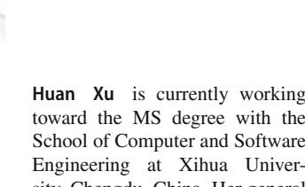

sity. He has authored or coauthored more than 300 research papers in refereed journals and conferences. He is a fellow of IRSS and senior member of ACM and IEEE.

**Wei Huang**received the B.S. degree from Fujian University of Technology, Fuzhou, China in 2016. She received M.S. degree from Fujian Normal University, Fuzhou, China in 2019. She received the Ph.D. degree from the Southwest Jiaotong University, Chengdu, China in 2023. She is currently a associate researcher with Fuzhou University. Her research interests include federated learning, deep learning, data mining, and urban computing, etc. She has published several papers

in journals such as IEEE Transactions on Knowledge and Data Engineering, Information Sciences, Information Fusion etc.

**Pengfei Zhang**received the PhD degree in computer science and technology in 2023 at Southwest Jiaotong University, Chengdu, China. He is currently an associate professor at the School of Intelligent Medicine, Chengdu University of Chinese Medicine, and is engaged in postdoctoral research on the integrated Chinese and Western medicine. His research interests include granular computing, Traditional Chinese Medicine Informatics, data mining and information fusion. He

has published over 50 papers in prestigious journals, including IEEE TNNLS, IEEE TFS, ACM TKDD, ACM TIST, Information Fusion, Information Sciences, Knowledge-Based Systems, Applied Soft Computing, Engineering Applications of Artificial Intelligence. Additionally, he serves as a reviewer for various esteemed journals including IEEE TFS, ACM TIST, IEEE TKDE, Information Fusion, Information Processing & Measurement, Artificial Intelligence Review, Information Processing and Management, Expert Systems With Applications, and Advanced Engineering Informatics, Applied Intelligence, etc.

**Tianrui Li** received the B.S., M.S., and Ph.D. degrees from the Southwest Jiaotong University, Chengdu, China in 1992, 1995, and 2002, respectively. He was a postdoctoral researcher with SCK CEN, Belgium from 2005 to 2006, and a visiting professor with Hasselt University, Belgium, in 2008, the University of Technology, Sydney, Australia, in 2009, and the University of Regina, Canada, 2014. He is currently a Professor and the Director of the Key Laboratory of Cloud

Computing and Intelligent Techniques, Southwest Jiaotong Univer-
