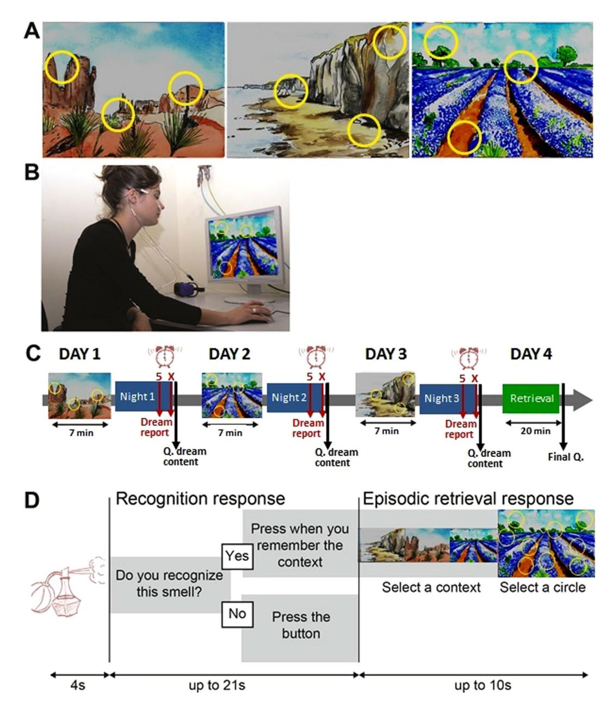
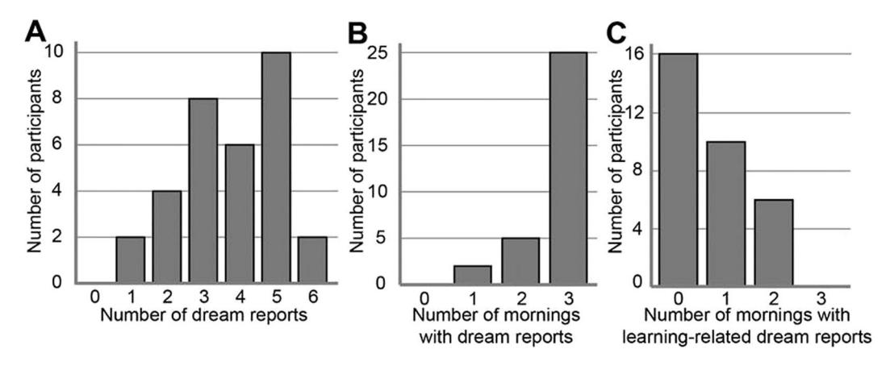
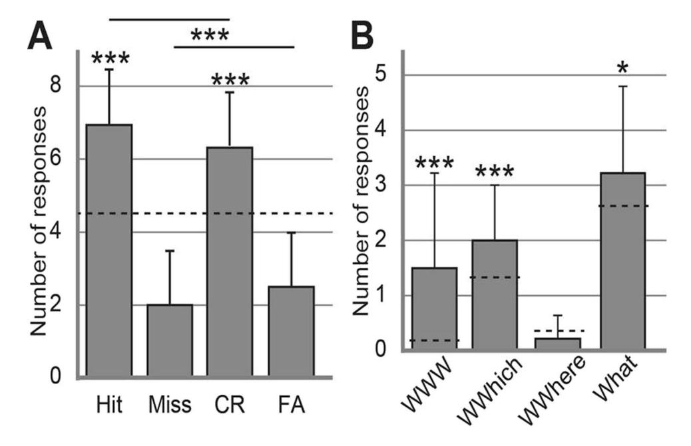
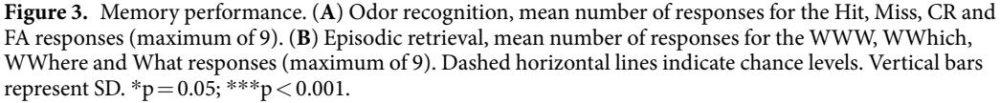
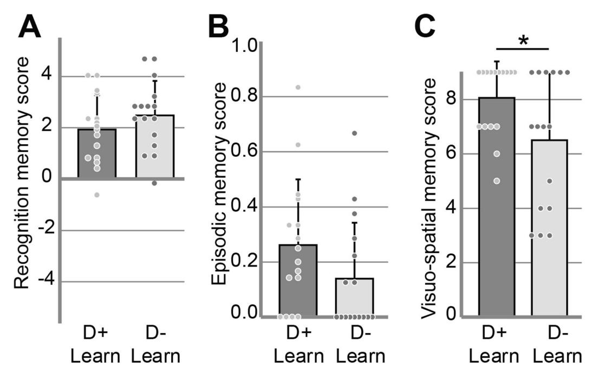
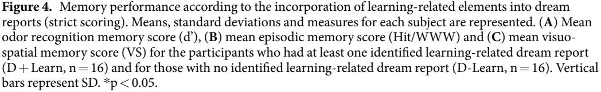
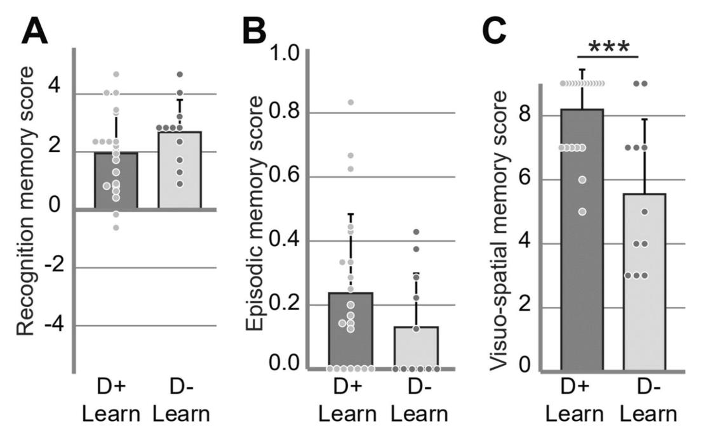
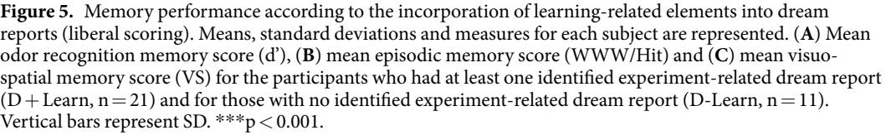

## **OPEN**

# **Incorporation of fragmented visuoolfactory episodic memory into dreams and its association with memory performance**

**J. Plailly1, M.Villalba1,2, R.Vallat 2, A. Nicolas2,3 & P. Ruby2\***

**The question of a possible link between dream content and memory consolidation remains open. After a comprehensive review of the literature, we present novel fndings from an experiment testing whether the incorporation of recently learned stimuli into dream reports is associated with improved post-sleep memory performance. Thirty-two high dream recallers freely explored new visuo-olfactory episodes for 3 consecutive days. During the nights following each non-explicit encoding, participants wore a wrist actimeter, and woke up at 5am and their usual waking time to record their dreams (intensity of all oneiric sensory perception was assessed using scales). A total of 120 dreams were reported and elements related to the encoding phase were identifed in 37 of them, either learning-related (mainly visual- and rarely olfactory-related elements), or experiment-related (lab- or experimenters-related elements). On the 4th day, we found that participants with learning-related (n=16) and participants with learning-related and/or experiment-related dreams (n=21) had similar odor recognition and odor-evoked episodic memory with the other participants. However, they had signifcantly better visuo-spatial memory of the episodes in comparison to the other participants. Our results support the hypothesis that the learning phase is loosely incorporated into dreams and that this incorporation is associated with sleep related memory consolidation.**

Sleep is essential for procedural and declarative memory consolidation[1](#page-12-0)[–3](#page-12-1) . Post-learning sleep is hypothesized to have a benefcial efect on memory through reactivation and reorganization of the memory trace at the cerebral leve[l4](#page-12-2) (and for reviews[5,](#page-12-3)[6\)](#page-12-4) . Because the cognitive experience of dreaming during sleep[7,](#page-12-5)[8](#page-12-6) regularly incorporates waking life element[s9](#page-12-7)[–11](#page-12-8) (and for a review[12\)](#page-12-9) , the idea of a possible link between dream content and memory consolidation has rapidly emerged. A current hypothesis postulates that dream content refects memory consolidation and predicts better post-sleep performance when a recent learning experience is incorporated into dreams[13–](#page-12-10)[17](#page-12-11).

Only a few studies have experimentally addressed this issue and tested whether memory performance improved when participants reported learning-related dreams. An up-to-date and comprehensive review of these studies is presented in Table [1](#page-1-0). Various kinds of tasks were used such as learning a story[18,](#page-12-12) a foreign language[19,](#page-12-13) meaningless sentences[20](#page-12-14), word-picture associations[21,](#page-12-15) vertical inversion of the visual feld with goggles[22,](#page-12-16) the computer game "Doom["23](#page-12-17), a virtual balancing motor tas[k24](#page-12-18), mirror tracing[25](#page-12-19) and navigating a virtual maze[26.](#page-12-20) Inconsistent results were obtained: fve studies reported better memory performance in participants who recalled learning-related dreams, one study reported inconclusive results, and six studies reported no relationship between memory performance and learning-related dreams. Even more puzzling, inconsistent results were reported with the same paradigm, in the same team, and across repeated studies[26–](#page-12-20)[29](#page-12-21).

In addition to the studies' discordant results, several limitations prevented these studies from conclusively answering the question of whether there is a link between the incorporation of a memory into dreams and memory consolidation. First, most of the studies had a low statistical power due to a small sample size in either the number of participants or in the number of dreams, which makes the interpretations and generalizations of

1 Olfaction: from coding to memory Team, Lyon Neuroscience Research Center, CNRS UMR 5292 - INSERM U1028 - University Lyon1, Lyon, F-69366, France. 2 DYCOG Team, Lyon Neuroscience Research Center, CNRS UMR 5292 - INSERM U1028 - University Lyon1, Lyon, F-69366, France. 3 Centre Hospitalier Le Vinatier, Bron, F-69678, France. \*email: [perrine.ruby@inserm.fr](mailto:perrine.ruby@inserm.fr)

| Ref                          | Memory                                                           | Task                                                         | Nt | nLRD        | Scoring                                                                                                                                                              | Dreams collection                                                                                 | Statistical paradigm                                                                                                                                   | Res                            |
|------------------------------|------------------------------------------------------------------|--------------------------------------------------------------|----|-------------|----------------------------------------------------------------------------------------------------------------------------------------------------------------------|------------------------------------------------------------------------------------------------------|--------------------------------------------------------------------------------------------------------------------------------------------------------|--------------------------------|
| 18) (Fiss et al.          | Explicit verbal                                                  | Story recall                                                 | 6  | ?           | Content checklist procedure                                                                                                                                       | 1 night in the lab with REM awakening                                                          | Correlation between inc of the story into dreams and memory performance                                                                          | YES                            |
| (De Koninck 19) et al. | Explicit verbal                                                  | French language learning                                     | 8  | ?           | External-scoring: detection of French                                                                                                                             | Dream journal from pre-course to post-course                                                   | Correlation between learning efciency and latency to frst French inc into dreams                                                              | YES                            |
| (Wamsley 26) et al.    | Explicit visuo-spatial                                           | virtual maze navigation task                                 | 50 | 4, 8%    | Self-scoring & experimenter validation                                                                                                                            | Awakenings in N1 and at the end of the nap                                                     | Group comparison                                                                                                                                       | YES                            |
| (Schoch 21) et al.     | Explicit visuo-verbal                                            | Word-picture association                                     | 22 | ?           | External-scoring by 2 blind raters of congruent vs incongruent inc                                                                                          | 1 night in the lab with multiple awakenings (REM & NREM)                                    | Correlation between inc score and overnight memory retention                                                                                     | YES in NREM NO in REM |
| (Wamsley & Stickgold27)   | Explicit visuo-spatial                                           | virtual maze navigation task                                 | 17 | 8, 47%   | External-scoring by blind raters of direct explicit inc* of the maze                                                                                           | 1 night in the lab with multiple awakenings in N1, 1 in N2 and 1 in N2 or REM sleep   | - Group comparison (those with at least one direct inc vs those with no direct inc of the task into dreams) - ANCOVA                    | YES NO                      |
| (De Koninck 22) et al. | Explicit visuo-spatial                                           | Vertical inversion of the visual feld with goggles        | 8  | 4, 50%   | External-scoring: incorporations of visual inversions                                                                                                          | 2 night in the laboratory with REM awakening                                                   | Better score on 2/3 of the tests of adaptation to the visual inversion for the participants with inc of the task into dreams (tendency) | ?                              |
| (Cipolli 20) et al.    | Explicit verbal                                                  | Meaningless sentences (3×19 words)                        | 12 | 12, 100% | External scoring by 2 blind raters looking for loose associations with the stimuli in dreams resulting in 31/35 dream reports with inc of the task | Several awakenings in the lab afer 5min of REM sleep                                     | ANOVA testing the retention rate for content words as a function of inc into dream reports+moment of recall+REM period                  | NO                             |
| (Pantoja 23) et al.    | Perceptuo-motor spatial-emotional & higher level cognition | Computer game « Doom »                                       | 22 | 17, 77%  | Not specifed                                                                                                                                                         | 2 nights in the laboratory with REM awakenings in the 2nd night                             | Correlation between the amount of game-related elements into dreams and performance gains (inverted U function)                            | NO                             |
| (Schredl & Erlacher25)    | Procedural & visuo spatial                                    | Mirror tracing                                               | 20 | 1, 5%    | External-scoring: laboratory experiment and mirror tracing task references (binary score).                                                               | 2 nights in the lab with REM awakenings in the second night (from the 2nd REM period) | Correlation between reference to 1) the experiment, 2) the laboratory, and 3) the task into dreams and performance to the task          | NO                             |
| (Stamm 29) et al.      | Explicit visuo-spatial                                           | virtual maze navigation task                                 | 65 | 24, 37%  | External-scoring by blind raters of direct and indirect inc of the maze                                                                                     | 1 night in the lab with multiple awakenings in N1, 1 in N2 and 1 in N2 or REM sleep   | Group comparison (those with inc vs those with no inc of the task into dreams)                                                                | NO                             |
| (Wamsley 28) et al.    | Explicit visuo-spatial & procedural motor                     | virtual maze navigation task & motor sequence typing task | 51 | 6, 12%   | External-scoring by blind raters of direct and indirect inc of the maze                                                                                     | 1 night in the lab with multiple awakenings in N1, 1 in N2 and 1 in N2 or REM sleep   | Group comparison (those with inc vs those with no inc of the task into dreams)                                                                | NO                             |
| (Nefodov 24) et al.    | Procedural & visuo spatial                                    | Computer coordination and balance motor task              | 13 | ≥7, ≥53% | Self- & external-scoring                                                                                                                                             | 1 night in the laboratory with REM awakenings (from the 2nd REM period)                  | Correlation between reference to balance related elements into dreams and task performance                                                 | NO                             |

**Table 1.** Review of the experiments which investigated the link between learning-related dream reports and memory performance. Ref, references; Memory, type of memory targeted by the task; Task, task performed before sleeping and which presence in dreams was scored; Nt , total number of participants; nLRD, number and percentage of participants with learning-related dreams; Scoring, method for scoring whether dreams were learning-related or not; Dream collection, method used to collect dreams; Statistical paradigm, method used to test whether dreaming of the learning phase was associated with improved memory performance; Res, results i.e. response to the question "*Did the results show that the more the dreams are learning-related or the more learning-related dreams*, *the better the performance afer sleep?*"; ?, unknown; inc, incorporation; N1, sleep stage N1; N2, sleep stage N2; \* indirect incorporations excluded because not related to performance.

these fndings difcult. Second, the criteria used to score the incorporation of the task into dreams were ofen scarcely described although the pertinence of the test critically relied on the specifcity with which the task could be recognized into dream reports. Tird, most of these studies employed a serial awakening paradigm to collect multiple dream reports, which disrupts sleep and may thus also disrupt the sleep-related memory consolidation processes[1](#page-12-0),[30](#page-12-24)[–33](#page-12-25) (only one study so far reported no declarative memory alterations the day afer participants were awakened a few times per night to report dreams[21](#page-12-15)). Fourth, while people mostly encode events implicitly in their daily lives, these studies mainly targeted explicit encoding memory tasks. Finally, not all the sensory modalities have been tested and therefore the possible interaction between dreaming-related memory consolidation and the sensory modalities involved remains unknown.

In an attempt to minimize the limitations listed above, the study was designed with the following characteristics. We chose a paradigm designed to investigate episodic memory[34](#page-12-26),[35](#page-12-27) of multisensory episodes (odors perceived at specifc locations of a landscape picture, Fig. [1A\)](#page-3-0). Each of the three episodes was experienced only once (i.e. on 3 successive days) by the participants for 7minutes and without any explicit instruction to memorize it. Te 32 participants (with a dream recall frequency superior to 4 mornings per week with a dream in mind[36](#page-12-28)[–40\)](#page-12-29) slept at home with a wrist actimeter (to assess sleep duration) during the 3 nights following each encoding day and woke up at 5 am and at their usual waking time to report possible dreams with a voice recorder (orally reporting dreams is easier than writing). Teir memory performance was tested on the fourth day (Fig. [1\)](#page-3-0). To keep sleep disturbances at a minimum, dream reports were collected in a natural setting at home, without EEG recordings, and with only one intra-sleep awakening.

Te frst objective was to further test whether recalling a dream related to a recent experience is associated with improved memory performance, when memory encoding is not explicitly required and when odors are a part of the experience to be later recalled. Te hypothesis proposing a link between memory consolidation during sleep and dream conten[t13](#page-12-10)[–17](#page-12-11) has not been restricted to explicit memory, and some results have shown that olfactory memory is consolidated by sleep[41](#page-12-30)[–43.](#page-12-31) Better memory performance in participants with learning-related dream reports were thus expected. Te postulate underlying this prediction is that the more one reports dreams with elements of the task or of the context of the task, the more one dreams of the task. Te second objective was to discuss, at the theoretical level, the plausibility to test whether dreaming of a task is associated with improved memory performance.

### **Materials and Methods**

**Participants.** Tirty two healthy persons [8 males; age: 21.94±2.18 years (mean±standard deviation)] participated in the study. Participants were selected based on their self-assessed (*a posteriori*) dream recall frequency (DRF; the threshold for selection was at least 4 mornings per week with a dream in min[d39](#page-12-32)) which resulted in an average DRF of 4.89±1.21 dream reports per week in the fnal sample. All participants reported normal senses of smell and vision, and no psychiatric, neurologic or sleep disorders (participants with a previously diagnosed disorder in any of these domains were excluded). All participants agreed to report dreams without censorship. Te local ethical committee (Comité de Protection des Personnes Sud Est IV; ID RCB: 2015-A01595-44) approved this study on December 2015, 17th. Te study was conducted in conformity with the Declaration of Helsinki. Participants provided written informed consent and received fnancial compensation.

**Stimuli and materials.** *Odorants*. Eighteen odorants consisting of essential oils and single or mixtures of monomolecular chemical compounds, were selected *a priori* based on their distinctiveness and relatively low identifability and familiarity (2-Heptanone, 9-decen-1-ol, basil, butanol, birch oil, carrot, cis-3-hexenyl salicylate, citronellol, dihydromyrcenol, ethyl acetyl acetate, linalyl acetate, methyl octane carbonate, musk, rosemarel, rose oxide, stemone, tobacco and tomato[\)34,](#page-12-26)[35.](#page-12-27) Te odorants were randomly subdivided into two sets (target, distractor) of nine odorants each for each participant.

Te odorants were presented using a 20-channel computer-controlled olfactometer adapted from an olfactometer previously described by Sezille *et al*. [44.](#page-12-33) Briefy, this odor difusion system was developed to synchronize odorous stimuli with breathing. Undiluted odorants were contained in a 10-ml U-shaped Pyrex® tube (VS Technologies, France) flled with odorized microporous substances. Odorized airfows and air carrier were sent to and mixed in a homemade mixing head made of polytetrafuoroethylene and connected to the nostrils. Te participant's respiratory signal was acquired using a nasal cannula and was used to trigger the odor stimulation through an airfow sensor (Fig. [1B](#page-3-0), informed consent for publication of identifying information/images in an online open-access publication have been obtain for the picture used in Fig. [1B\)](#page-3-0). Te air fow rate was set at 3 l/ min, and the odorants were delivered over 4 s.

*Spatio-contextual environment.* Tree landscape pictures presented full-screen (1280×1024 pixels, 72 dpi, Fig. [1B\)](#page-3-0) constituted the visual contexts (a desert landscape, a coastal clif, and a lavender feld). For each of these three visual contexts, yellow circles symbolized three spatial locations, leading to a total of 9 non-overlapping spatial locations (Fig. [1A\)](#page-3-0).

*Multidimensional episodes.* Tree multidimensional episodes were created, each composed of three target odors (What) associated with specifc locations (Where) within a given visual context (Which context). To limit associative semantic processes, the odors, spatial locations, and visual context were arbitrarily linked (the odors were not congruent with the landscapes). An in-house LabView sofware (version 8.6 or higher) controlled the presentation of odors, pictures, and circles and recorded the participants' responses and breathing throughout the experiment. To interact with the sofware, the participants used a trackball (Kensington, Redwood Shores, CA, USA). Whenever the participants clicked on a circle, the odor stimulus was delivered at the beginning of the subsequent expiration, enabling the odor to be perceived at the beginning of the next inspiration.

**Figure 1.** Experimental task. (**A**) Drawings of the 3 visuo-spatial contexts (drawings of the pictures used were made by Salomé Blain, the original pictures can be seen in Saive *et al*. [34](#page-12-26),[35](#page-12-27)). Te odors were presented when clicking in the yellow circles added on the pictures. (**B**) Photo showing the experimental setup with the breathing apparatus (copyright holder: Partick Minary, INSERM). (**C**) Te temporal course of the encoding and retrieval sessions. During the encoding, the participants discovered one episode per day (during 7min) over 3 days. During the night at home, they woke up at 5 am and at their usual waking time to record their dreams with a voice recorder (Dream report). In the morning they fll in a questionnaire about dream content (Q. dream content). Te last day, they underwent a retrieval session and flled in a fnal questionnaire (Final Q.). (**D**) In the retrieval session, the memory of the episodes was tested using an odor-recognition task followed for the 'Yes' trials by an episodic memory retrieval task. Te perfume bottle and the clock were drawn by the authors. All rights reserved, this image is not included under the Creative Commons licence for the article.

**Experimental procedure.** Te experimental procedure consisted of four sessions performed over the course of four successive days (Fig. [1C\)](#page-3-0). Te frst three sessions were used for encoding, and the retrieval occurred in the fourth session to assess the participants' memory of the episodes perceived during encoding. A night of sleep at home followed each of the encoding sessions to reduce interference between episodes and to promote consolidation[45,](#page-12-34)[46.](#page-12-35) Participants had to wear a wrist actimeter (Actigraph link GT9x, Actigraph, FL, USA) on the dominant hand without interruption during the 4 days of the experiment to assess sleep parameters. While the time of the sessions difered between participants (from 9h30 to 16h30), each participant completed the four sessions at the same time of the day to limit the diferential infuence of internal states (e.g. hunger, digestion, fatigue) on olfactory and cognitive processes between sessions[47](#page-12-36),[48](#page-13-0).

*Encoding.* During encoding, participants were not given explicit instructions to memorize the episodes and they were not told that the goal of the study was to test for a possible link between dreaming and memory. Tey were told the following: "*In this experiment we investigate the perception of episodes comprising odors positioned at specifc locations of a background picture and its infuence on dream frequency*. *For 3 days*, *you will be presented each day with a new episode that you will explore for 7minutes*. *At night you will wear a wrist actimeter measuring movements (it is to assess your sleep duration)*, *and wake up at 5am and at your usual waking time to report possible dreams*. *Te 4th day we will ask you about the impressions you had when you explored the episodes*." Afer such instructions, participants freely discovered one episode per day for 7 min (Fig. [1C\)](#page-3-0). Te participants could explore the visuo-olfactory environment and smell the odors by clicking on the yellow circles in an unlimited manner (they were told to wait 20s between 2 clicks to avoid saturation of the smell sensation). Te absence of memorization instruction ensured free encoding, in a similar way to what happens in real-life situations. Te order of presentation of the three episodes (desert landscape, coastal clif and lavender feld) was randomized between the participants.

*Dream recall.* During each night at home following an encoding day, participants were instructed to wake up at 5 am and at their usual waking time to report dreams. 5 am was chosen rather than an earlier time in the night for the frst awakening to increase the chances to get dream reports e.g.[49.](#page-13-1) Participants were asked to record their dreams, if any, with a voice-recorder immediately afer each awakening and to give all the details they could possibly recall (Fig. [1C\)](#page-3-0). If they had no dream in mind, participants were asked to explicitly state it in the voice-recorder. In the morning they flled in a questionnaire about the content of the night's dreams. For each dream, they reported (1) the amount of positive and negative emotions (1 neutral, 10 very intense), bizarreness (1 not at all, 10 completely), amount of interactions between characters, images, sounds, odors, taste and touch sensations (1 not at all, 10 many) (Q1), (2) the place(s), character(s) and actions(s), and (3) the element of their waking life that they felt were related to the dream (Q2). For each awakening, all the oneiric content reported was considered as one single dream.

*Retrieval.* Retrieval was tested on the fourth day. Te Episodic Retrieval test was composed of 18 trials consisting of the presentation of 9 target and 9 distractor odors. Te target and distractor odors were presented in diferent pseudorandom orders (no more than 3 target or 3 distractor odors in a row) for each participant.

Each trial began with an odor recognition task (Fig. [1D\)](#page-3-0). Te participants were presented with the odors for 4s and determined whether they recognized the smell as having been previously presented during the encoding ("*Do you recognize this smell?*"). Two situations could happen: 1) If the participants responded "*Yes*", they were asked to retrieve the entire episode associated with the odorant and to press on the trackball if they succeeded in less than 25 s afer the odor was sent ("*Press when you remember the context*"). Afer this delay, they were given up to 10s to choose both the accurate visual context and the exact location of the odor by selecting one of the three pictures, and then one of the nine circles superimposed on the chosen picture. A response was considered correct when the participants selected both the accurate context and the specifc location previously associated with the odor during the encoding. 2) If the participants responded "*No*", they had to press on the trackball ("*Press the button*") and rest until the next trial. At the end of a trial, a new odor was presented to the participant afer a rest of 3s.

Following this retrieval task, the strength of the association between the spatial location and the visual context of an event was tested in the Visuo-spatial (VS) association test. Te participants were presented with the three landscape pictures with all the nine circles superimposed, and they had to choose the three circles that were associated with each of the pictures during the encoding.

*Rating of odors intensity, pleasantness and familiarity.* At the end of the retrieval session, the participants were presented again with the 18 odors and were asked to rate the odorants in terms of intensity (from "extremely weak" to "extremely strong"), pleasantness (from "extremely unpleasant" to "extremely pleasant") and familiarity (from "unknown" to "extremely familiar") using visual analogue (non-graduated) scales. Te pleasantness scale was divided into two equal parts by a "*neutral*" value separating the ratings of unpleasantness and pleasantness. Te intensity, pleasantness, and familiarity ratings were transformed into scores from 0 to 10.

At the end of the experiment, the participants flled in a fnal questionnaire to assess: (1) how much they found the experiment difcult (on a scale from 1 to 5), (2) whether they had guessed that they would eventually be asked to retrieve the episodes perceived the 3 frst days, (3) the strategy that they used to explore or memorize the episodes and to retrieve them, (4) whether they thought about the episodes between the sessions, and (5) whether they dreamt of all or parts of the multisensory episodes they discovered in the lab (Q3). If they answered yes to this last question, participants had to tell which element(s) of which episode(s) had been incorporated in which dream(s).

**Data analysis.** *Dream reports*. Dreams rarely replay a complete episodic memory. Rather, they incorporate isolated elements of an episodic memory with more or less distortion[s11.](#page-12-8) As the learning phase may be replayed in a modifed and partial way during dreaming, learning-related was considered as any element of a dream report resembling the specifc constituent of episodes presented before the dream report, such as odors or visuo-spatial elements of the landscapes (strict scoring). Te resemblance could be metaphoric as it was shown that dreams can evoke recent memories in such a way[17](#page-12-11),[50](#page-13-2). As done in previous studies, we also performed a more liberal scoring that included the experimental context of the learning phase (e.g. the lab's building, experimenters, the olfactometer, the breathing apparatus also called "nasal glasses" in French).

In order to detect incorporation of the encoding phase in the dream reports of the participants, the experimenters considered the following data:

- (1) the audio dream report: identifcation of elements related to the encoding phase;
- (2) the waking life elements considered as linked to the dream by the dreamer in Q2;
- (3) the answer to the question Q3 "*In the last 3 days did you dream of all or parts of the multisensory episodes you discovered in the lab?*".

Elements related to the episodes presented during the encoding phase were searched in the audio dream reports, in Q2, and in Q3. A dream was considered as learning-related if elements related to episodes presented before the dream report were identifed in at least one of the three types of data considered. Two experimenters (JP and PR) blind to which episode was presented before each dream report realized independent scoring. When the two scorers disagreed, a consensus was reached afer discussion.

*Memory performance.* Tree types of memory performance were calculated. First, recognition memory of odor was assessed in the Episodic Retrieval test using parameters from the signal detection theory[51](#page-13-3). From the experimental conditions (target odor *vs*. distractor odor) and the participants' behavioral responses ("*Yes*" *vs*. "*No*"), four response categories were defned: Hit and Miss occurred when the target odors were accurately recognized or incorrectly rejected, respectively, and correct rejection (CR) and false alarm (FA) occurred when the distractor odors were correctly rejected or incorrectly recognized, respectively. Te odor recognition memory score (*d'*) refecting the participant's ability to discriminate between target and distractor odors, was calculated as follows: d'=ln [HR (1−FR)/FR (1−HR)], where *HR* represents the Hit rate [(Hit+0.5)/(*Nt*+1)], *FR* represents the false alarm rate [(FA+0.5)/(*Nd*+1)] and *Nt* and *Nd* represent the number of target and distractor odors, respectively, for which the participants provided an answer. Such score may be good (positive, maximum score of 5.89) or poor (negative values, minimum score of −5.89). To assess odor recognition memory performance for each day or context of the encoding, we measured the ratio of the Hit to the number of detected target odor (Hit/detected target odor).

Second, odor-evoked episodic memory performance was calculated. In the Episodic Retrieval test, we focused the analyses on the participants' accurate responses for the target odors (Hit). Four types of responses were defned depending on the recall accuracy. When the participants correctly recognized the target odors, they could accurately remember both the location and the context (WWW), the location only (WWhere), or the context only (WWhich) or they could be mistaken about both dimensions (What). Tese diferent scenarios were named *episodic combinations*. Te theoretical proportions of these episodic combinations resulting from responses given randomly were 0.019 for WWW [1 response ("*Yes/No*") out of 2×1 context out of 3×1 location out of 9], 0.148 for WWhich [1 response ("*Yes/No*") out of 2×1 context out of 3×8 locations out of 9], 0.037 for WWhere [1 response ("*Yes/No*") out of 2×2 contexts out of 3×1 location out of 9] and 0.296 for What [1 response ("*Yes/ No*") out of 2×2 contexts out of 3×8 locations out of 9]. Te episodic memory score was calculated as the ratio WWW/Hit.

Tird, we evaluated the visuo-spatial memory of the episodes by calculating the visuo-spatial memory score (VS). VS corresponds to the number of yellow circles accurately placed onto the three landscape images (3 yellow circles per image), and ranges from 0 to 9. Te VS score evaluates the memory of the visuo-spatial location of the circles for each landscape picture presented during the encoding phase.

*Sleep parameters.* Te wrist-actigraphy data were analyzed with the ActiLife sofware (Actigraph 2012, ActiLife 6.13.2; sampling rate 30Hz; settings: gender, age, weight, dominant hand; Kole Kriple algorithm: minimum sleep period time=80min, minimum inactive time to defne bed time=5min, minimum activity time to defne waking time=10min) to assess two sleep parameters, the sleep period time (SPT) corresponding to the time between "lights of " and "lights on", and the wake afer sleep onset (WASO), corresponding to the period of wakefulness between the frst falling asleep and the last wake up. Note that according to validation studies that compared Actigraph link GT3x performance with gold-standard polysomnography, actigraphy overestimates the average WAS[O49](#page-13-1).

**Statistical analyses.** Te statistical main efects of the factors and interactions were determined using repeated measures ANOVAs followed by *post-hoc* bilateral Student *t-*tests when the main efects and/or interactions were signifcant. For between-groups comparisons and for the comparison with random score, we used bilateral and unilateral Student *t-*tests, respectively. Te correlations between the factors were determined using the non-parametric Spearman's rank correlation. Te chi-squared test was used to determine whether distributions of categorical variables difer between groups. Te efects were considered signifcant at p <0.05. Efect size was determined using Cohen's *d* for unpaired t-test. Statistical analyses were performed using Statistica (StatSof®, Tulsa, OK, USA).

### **Results**

**Odor ratings.** As expected from previous studie[s34,](#page-12-26)[35,](#page-12-27) the odorants were considered as moderately intense (5.89±1.13, on a scale of 1 to 10), moderately familiar (5.24±1.10), and relatively neutral (4.81±1.25).

**Dream recall.** Te 192 awakenings (32 participants×2 awakenings per night×3 nights) resulted in 120 dream reports (62.5%), comprising 158±201 words in average (between subjects average of within subject averages=158±145 words). Of all the dream reports, 56 were reported at 5 am (actigraphy confrmed that participants awakened at 5 am, mean word count=140±209), and 64 afer the awakening at the usual waking time

**Figure 2.** Dream reports frequency. (**A**) Number of dream reports (maximum of 6) per participant. (**B**) Number of mornings with dream reports (maximum of 3) per participant. (**C**) Number of mornings with learning-related dream reports (maximum of 3) per participant.

(6.30 to 10 am, mean word count=174±193). Participants reported on average 3.75±1.37 dreams (from 1 to 6) over the three nights (Fig. [2A\)](#page-6-0). Te majority of the participants reported at least a total of 3 dreams and at least one dream per morning (Fig. [2B\)](#page-6-0).

Te grand average of the oneiric parameters were as follows: clarity = 5.46 ± 1.42 (on a scale of 1 to 10), bizarreness=5.07±1.79, positive emotions=3.32±1.71, negative emotions=3.37±2.06, interactions between characters=6.26±2.37, images=6.85±1.91, sounds=6.40±2.11, odors=1.86±1.24, tastes=1.69±1.04, and touch=3.60±2.36. Further results and discussion regarding sensory perceptions in dream reports are presented in the Supplementary Material.

*Scoring of the incorporation of learning-related elements into dream reports.* Te Cohen's kappa coefcient assessing inter-rater reliability was of 0.68. Te strict scoring resulted in the identifcation of 22 learning-related dreams reported by 16 participants (D+Learn group). On average, participants had 0.7±0.8 mornings with a learning-related dream (Fig. [2C](#page-6-0)). Te learning-related dreams were distributed across the frst, second, and third night (n=10/6/6, respectively). Ten participants had 1 learning-related dream, 6 participants had 2. Te majority of learning-related dreams (19/22, 86%) happened the night just following the discovery of the dreamt episode, 2 learning-related dreams happened the second night afer the discovery of the dreamt episode, and 1 happened the third night afer the discovery of the dreamt episode. Tis is what could be expected according to previous results which have shown that memories from the day before the dream were more ofen incorporated into dreams than memories dating from 2, 3, or 4 days before the drea[m11.](#page-12-8) Te average dream reports word count for dreams of the D+Learn group was 227±163 and 90±82 for dreams of the D-Learn group (bilateral unpaired t-test: t(30)=3.00, p=0.005, Cohen's *d*=1.06).

Learning-related elements were: odors, elements of the landscapes (clifs, beach, sea, feld of odorant herb, desert, places with arid climate), or the yellow circles. Only 5 dream reports (from 4 diferent participants) mentioned explicitly olfaction or odors ("I am annoyed by the cigarettes they smoke", "a warm odor of desert", "good odors of food", "a fsh without any odors", "I smelt the odor of cigarette"), and only 2 oneiric odors could be related to the encoding phase. Some examples of dream reports considered as learning-related with the strict scoring are listed below.

*"I was at the top of a clif*. *It was really resembling the one I saw in the lab yesterday"*

*"I was swimming in the sea*, *there were waves… on the beach I saw an old pair of glasses made out of metal and with curved branches to go around the ears… I scratch my nose and three boogers got out of it*, *they looked like little characters with a corn seed shape"*

*"I walk in a place where there is nothing*, *I am alone*, *I am looking for people because I'm lost"*

*"I knew that I was looking for something and that I found it*, *but I didn't know what … it was a feld of wild mint*, *it was what I was looking for"*

« *A yellow circle associated with the word lemon* »

Te liberal scoring resulted in the identifcation of 37 learning-related dreams by 21 participants. Te average word count for the dreams of the D+Learn group was 191±156 and 95±99 for dreams of the D-Learn group (bilateral unpaired t-test: t(30)=1.85, p=0.073, Cohen's *d*=0.73). Te 15 supplementary learning-related dreams were related to the task/experiment in a metaphorical way and/or by evoking odors or taste. Some examples of dream reports considered as learning-related with the liberal scoring are listed below.

"*I dreamt that I woke up to report my dream using the voice recorder just as in the experiment*"

"*I was in the building for the study of dreams*, *downstairs in the cafeteria*, *and I was explaining to a rhinoceros that I was preparing my dreams as my hand-bags*, *with many objects which could be useful in case*"

"*Te 4th day I learn that some elements which could induce fear reactions were hidden in the images presented for the experiment which explained why I had rather negative dreams the last couple of days*"

"*Some guys with white coats were doing experiments on us*"

"*We had 1hour and 30min to drink diferent drinks that we did not know*, *we had to hurry*"

"*I smelt the odor of cigarette on my little brother*"

**Memory performance.** *Encoding*. Te participants clicked on average 18.54±8.41 (range from 8.33 to 39.00) times on the circles per episode and consequently smelt 6.18±2.88 times each odorant. One-way ANOVAs performed on the number of click related to each episode showed that it did not difer between days (day1, day2, day3; F(2,93)=0.19, p=0.83) or contexts (desert, coastal clif or lavender feld; F(2,93)=0.15, p=0.86).

*Odor recognition.* Te participants were presented the target and distractor odors and were asked whether they had smelled them during the encoding phase. Te recognition memory score was high (*d*'=2.20±1.35; range from −0.62 to 4.68), which indicated that the participants were profcient in recognizing target odors and rejecting distractor ones. Te number of responses in the four response categories (Hit, Miss, CR and FA) is shown in Fig. [3A](#page-7-0). Te proportions of Hit (0.78±0.17) and CR (0.72±0.17) responses were above the chance level [0.5; unilateral t-tests: Hit, t(31)=9.34, p=10−6 , CR, t(31)=7.29, p=10−6 ]. A two-way repeated measure ANOVA on the recognition memory responses showed that the number of correct responses (Hit+CR) was signifcantly higher than the number of incorrect responses (Miss+FA) [F(1,31)=109.75, p=10−6 ]. Tere was no signifcant interaction between Odor type (target vs. distractor) and Response accuracy (correct vs. incorrect) [F(1,31)=3.19, p=0.08]. Te recognition memory score (d') was not correlated with the number of clicks (Spearman's rank correlation: r=0.06, p=0.76), suggesting that odor recognition performance did not depend on the exploratory behavior of the odors during the encoding. One-way ANOVAs performed on the Hit/detected target odor ratio related to each episode showed that the recognition memory performance was similar for the three contexts [F(2,93)=0.12, p=0.89] and for the three days [F(2,93)=0.74, p=0.48].

*Episodic retrieval.* When the participants recognized an odor as a target, they were asked to retrieve the spatio-contextual environment in which they smelled it. We focused our analysis on the responses following correct odor recognition (Hit). Te number of responses in each categories (WWW, WWhich, WWhere, What) are presented in Fig. [3B.](#page-7-0) Te proportion of complete accurate episodic response (WWW, 0.17±0.19), the proportion of correct retrieval of the context but not of the location (WWhich, 0.22±0.01) and the proportion of the complete inaccurate episodic responses (What, 0.36±0.03) were signifcantly higher than what could be expected by chance [unilateral t-tests: WWW, chance=0.019, t(31)=4.38, p=0.0001, WWhich, chance=0.148, t(31)=3.92, p=0.0005, What, chance=0.296, t(31)=2.04, p=0.05]. Te proportion of the WWhere responses (correct location but incorrect context, 0.02±0.00) did not signifcantly difer from chance level [unilateral t-test: chance=0.037, t(31)=−1.54, p=0.13]. On average, the episodic memory score (WWW/Hit) was of 0.20±0.23 (range from 0.00 to 0.83). One-way ANOVAs performed on the episodic memory score related to each episode showed that it did not signifcantly depend on the visual context [F(2,93)=0.33, p=0.72] nor on the day [F(2,93)=0.17, p=0.84].

*Visuo-spatial memory.* Te participants accurately recognized 7.28±2.10 (out of nine, 81±23%) of the spatial locations (yellow circles) associated with each visual context. Tis performance difered from random response [0.33; unilateral t-test, t(31)=11.62, p=10−6 ]. One-way ANOVAs performed on the visuo-spatial memory score

related to each episode showed that it did not signifcantly depend on the visual context [F(2,93)=2.53, p=0.09] and the day [F(2,93)=0.38, p=0.68].

*Memory performance as a function of dream content.* According to the post-retrieval questionnaire on day 4, 14 participants had suspected a possible memory test, of which 7 thought about the episodes before Day 4 and 7 did not. By contrast, 17 participants had not suspected a memory test and thought about the episodes before Day 4. Only 1 participant had not suspected a memory test and had not thought about the episodes before Day 4.

For the strict scoring, we compared memory performance between participants who recalled learning-related dreams (D+Learn, n=16) and those who did not (D-Learn, n=16). Between group comparison of the performance for odor recognition (d') and episodic retrieval (WWW/Hit) resulted in non-signifcant diference (bilateral unpaired t-tests: d' D+Learn=1.93±1.34, d' D-Learn=2.48±1.35, t(30)=1.15, p=0.26, Cohen's *d*=0.40, Fig. [4A](#page-8-0); WWW/hit D+Learn=0.26±0.24, WWW/hit D-Learn=0.14±0.20, t(30)=1.57, p=0.13, Cohen's *d*=0.54, Fig. [4B](#page-8-0)). However, the visuo-spatial memory score (VS) did difer signifcantly between the two groups. Te participants who had dreams scored as learning related had a better visuo-spatial memory of the episodes than the participants who had no dream scored as learning related (bilateral unpaired t-test, VS D+Learn=8.06±1.34, VS D-Learn=6.50±2.45, t(30)=2.24, p=0.03, Cohen's *d*=0.83, Fig. [4C](#page-8-0)). Te number of participants who suspected a possible memory test did not signifcantly difer between the D+Learn and the D-Learn groups [Chi-square test, X 2 (1)=2.03, p=0.15].

For the liberal scoring, we compared the memory performance between participants who recalled experimentand/or learning-related dreams (D+Learn, n=21) and those who did not (D-Learn, n=11). Te results (bilateral unpaired t-tests: d' D + Learn = 1.95 ± 1.42, d' D-Learn = 2.69 ± 1.11, t(30) = −1.48, p = 0.15, Cohen's *d*=0.58; WWW/Hit D+Learn=0.24±0.25, WWW/Hit D-Learn=0.13±0.17, t(30)=1.28, p=0.21, Cohen's *d*=0.51; VS D+Learn=8.19±1.25, VS D-Learn=5.55±2.34, t(30)=4.19, p=0.0002, Cohen's *d*=1.47) are presented in Fig. [5](#page-9-0). Te number of participants who suspected a possible memory test did not signifcantly difer between the D+Learn and the D-Learn groups [Chi-square test, X 2 (1)=2.69, p=0.10].

**Sleep parameters.** We collected wrist-actigraphy data for 30 participants (2 actimeter watches did not work properly). Te average sleep period time (SPT) was close to 8 hours (486±49 min) and the average wake afer sleep onset (WASO) was 73±24 min. Memory performance was not signifcantly associated with the SPT or WASO (Spearman's rank correlations: WASO & *d*': r=0.30, p=0.11; WASO & WWW/Hit: r=0.22, p=0.25; WASO & VS: r=0.20, p=0.29; SPT & *d*': r=−0.08, p=0.64; SPT & WWW/Hit: r=0.21, p=0.27; SPT & VS: r=0.32, p=0.09).

### **Discussion**

Te objective of this study was to provide further data to test whether recalling a dream related to a recent experience was associated with improved post-sleep memory of this experience. Te protocol used has several benefts compared to previous ones. First, it increases the chances of obtaining numerous dream reports (2 awakenings per night during 3 nights in high dream recallers using a voice recorder), and thus the chances to get learning-related dream reports, while keeping sleep disruption to a minimum (at-home recording with only one induced awakening per night). Second, it introduces a sensory perception rarely explored – olfaction – which is a non-dominant sense in wake and dreams (at least in modern industrialized countries). Tird, by using pictures with specifc, highly distinguishable attributes which are rare in the participant's daily life (landscapes of coast clif, desert, and lavender feld, Fig. [1A](#page-3-0)), the specifc detection of learning-related elements into dream reports is more likely. Finally, this protocol is closer to real-life situations than previous paradigms due to the use of non-explicit memory encoding (i.e. each unique episode is experienced shortly with no explicit instructions to memorize it), which better fts with the content-based defnition of episodic memory[52](#page-13-4),[53.](#page-13-5) Te use of such a paradigm resulted, as expected, in an important amount of learning-related dream reports (22 from 16 subjects for the strict scoring and 37 from 21 subjects for the liberal scoring). Te elements of the task incorporated into dreams were most ofen elements of the landscape pictures, but rarely odors. Te participants who reported learning-related dreams (and those who reported learning-related and/or experiment-related dreams) did not have signifcantly better performance at odor recognition nor odor-evoked episodic memory. However, they did have better visuo-spatial memory of the episodes than other participants. Tese results suggest a link between dream content and memory consolidation and support the hypothesis of the learning phase being loosely incorporated into dreams and this incorporation being associated with sleep related memory consolidation.

**Sleep and memory performance.** According to the wrist-actigraphy data, the participants slept on average approximately eight hours, a result that is consistent with a recent epidemiological survey about the sleep and dream habits of healthy Lyon University student[s39](#page-12-32). Te average waking time afer sleep onset (WASO) was approximately 75 min, which is more than what can be expected in young and healthy high dream recallers[37.](#page-12-37) Tis high amount of WASO is partly explained by the 5 am awakening but is also most probably overestimated. Validation studies have indeed shown that in comparison to gold-standard polysomnography, wrist actigraphy overestimates WASO[54](#page-13-6). In addition, the participants wore the actimeter watch on the dominant hand whereas it is usually worn on the non-dominant hand which may have in turn increased the number of movements, resulting in the false positive for wakefulness detection. Importantly, no signifcant correlation between the sleep parameters and memory performance was observed.

Odor recognition and episodic retrieval performance followed a pattern similar to that reported by Saive *et al*. [35.](#page-12-27) In other words, if the dream report part of the protocol might have induced some stress in participants (e.g. some of them may have feared not to succeed in reporting dreams), it did not seem to have afected memory performance. Similarly, the single nocturnal awakening apparently did not afect the sleep-related memory consolidation process, which is coherent with previous results showing no alteration of memory performance afer few awakenings per night[21,](#page-12-15)[55](#page-13-7). Altogether, the results suggest that the experimental paradigm did not disturb the memory consolidation process known to be at play during sleep[45](#page-12-34),[46](#page-12-35).

**Dream reports.** An important number of dream reports were obtained by recruiting high dream recallers and asking them to awaken two times per night (i.e. only one middle sleep awakening) during the three days of the experiment, once at 5 am and once at their usual waking time. Te great majority of the participants reported at least three dreams (average number of dreams reported=3.7±1.4).

The paradigm of Saive *et al*. [34,](#page-12-26)[35](#page-12-27) made it possible to specifically and accurately identify learning-related elements within dream reports, as demonstrated by the good between-scorers agreement. The scoring of dream reports for incorporation of the encoding phase resulted in the detection of an important number of learning-related dreams (18% for the strict scoring with ndreams=22 and nsubjects=16, 31% for the liberal scoring with ndreams = 37 and nsubjects = 21). The protocol thus succeeded in yielding an important number of learning-related dream reports, which in turn enabled a between-group comparison of memory performance according to dream report content in a satisfying (statistically speaking) number of participants.

Even if odors are rarely explicitly mentioned in dream reports[56](#page-13-8), we expected that presenting unusual odors the day before the night of dream collection would increase the chances of their incorporation into dreams. We indeed know from previous work that among all the memories incorporated into dreams a large part date from the day before (the so-called "*day residues*"[\)11.](#page-12-8) Tis strategy resulted in only a weak increase (at the descriptive level) in the percentage of dream reports with explicit mention of odors (e.g. 4% in our study vs 1% in Zadra *et al*. [53\)](#page-13-5), coherently with previous results[57.](#page-13-9) In other words, our protocol did not succeed in improving greatly and signifcantly the amount of incorporation of odors into dream reports. Te incorporation rate of odors into dream reports seems to mostly depend on olfactory expertise[58](#page-13-10)[,59](#page-13-11).

**Memory performance as a function of dream report content.** Te between-group comparisons of memory performance yielded signifcant efect for the visuo-spatial memory of the episodes, be it for the strict or the liberal scoring (Figs [4](#page-8-0) and [5](#page-9-0)). Te participants who had dreams scored as learning-related had a better visuo-spatial memory of the episodes than the participants who had no dream scored as learning-related. Moreover, participants who dreamt of the clif episodes (the most dreamt episode) tended to show a better visuo-spatial memory of this episode than the other participants (see the Supplementary Data). Tis result is in favor of a link between memory consolidation and learning-related dreams.

One tricky issue about testing a possible efect of incorporating a task into dreams on memory performance is where to draw the limit between elements related to the task versus not related to the task. In this study, elements specifc to the learnt episodes in dream reports were initially identifed (strict scoring). Ten, a second, more liberal scoring that also included elements that were specifc to the context of the experiment, such as the lab building, the experimenters, and the experimental setup, was carried out. Tis second method resulted in more learning-related dreams and interestingly yielded the same results as the conservative scoring but with an even larger main efect of the improved visuo-spatial memory of the episodes in participants who had learning-related and/or experiment-related dreams (Fig. [5\)](#page-9-0). Tis result suggests that the incorporation into dreams of elements related to the task and the incorporation into dreams of elements related to the context of the encoding phase, can both be considered as associated with the memory consolidation process taking place during night sleep.

It is unclear why participants with learning-related dreams did not show a better olfactory memory than participants with no learning-related dream reports. Tere are several potential explanations for this result. First, it is possible that only the memory elements that are incorporated into dreams are better consolidated. Consistent with this, participants of the D+Learn group dreamt predominantly of the landscape pictures and only little about the odors, and had better scores than the D-Learn group only for the visuo-spatial memory. Second, it could be that when incorporated into a dream, elements of the episodes as well as elements of the experimental context trigger the reactivation of the memory trace formed during the encoding phase (because the dreaming brain is fundamentally associativ[e50,](#page-13-2)[60\)](#page-13-12), as would do a context-related stimulation presented during slee[p61](#page-13-13)[–63.](#page-13-14) In this experiment the improved performance in the visuo-spatial domain but not in the olfactory domain for the D+Learn group could be explained by the fact that the visuospatial representation of the episodes was more easily reactivated during sleep than the olfactory representation, whatever the element triggering the memory trace was (visual or olfactory). It could be due to the lack of olfactory expertise of the participants, i.e. to an insufcient perceptual sensitivity and imagery ability in non experts[64](#page-13-15), or to the unfamiliarity of the odors presented (they were difcult to verbalize and to associate to known odors), or to a combination of these factors. Finally, given the few studies that have tested the impact of sleep on olfactory memory consolidation, one cannot exclude that sleep is less critical for olfactory memory consolidation than for the consolidation of memories in other sensory modalities. Tis would be coherent with the fact that olfaction and taste are typically the less-represented sensory modalities in dream reports (see Supplementary Data).

As a whole, our fndings suggest (1) that the incorporation of an element of the task into dreams is associated with the reactivation during sleep of the encoding phase's memory trace, yielding improved memory performance and, (2) that during sleep in our study, the olfactory component of the memory trace was less reactivated than the visuo-spatial component.

Regarding the possible interaction between sleep stages and the efect of interest (improved memory performance when dreams incorporate a recent learning), the present study do not provide helping data because the sleep stages at awakening were not recorded. It would be worth testing in future studies whether NREM sleep learning-related dreams show more ofen a link with improved memory performance than REM sleep learning-related dreams and whether this possible efect is dependant on the task used.

**Limitations and theoretical considerations.** To interpret the results and to discuss the possible answers to the original question asked in the introduction of this article, one has to bear in mind the theoretical and methodological considerations below.

First, given that longer dream reports were observed in the D+Learn group as compared to the D-Learn group for the strict scoring, one cannot exclude that the more important amount of learning-related dream reports in the D+Learn group is due to a better sampling of the dreaming activity in this group. As visual memory has been related to dream recall frequency and dream length in some studies[65](#page-13-16), the diference in word count between the D+Learn and D-Learn groups could explain why the D+Learn group improved signifcantly more on the visual component of the task only. However, given that dream length did not signifcantly difer between the two groups for the liberal scoring, this hypothesis does not seem the strongest, but would be worth testing more thoroughly in future studies.

Second, the occurrences of the learning-related elements in the dreams reported before the experiment were not measured, and it is thus difcult to know whether those elements were incorporated into dream reports during the experiment on a level that exceeds the chance level. However, for 86% of the learning-related dreams, the episode incorporated was discovered by the participants the day before, which shows that the incorporation of the episodes into dreams was not randomly distributed across nights. Rather, it was biased towards what would be expected according to the known rules of incorporation of recent memories into dreams (more incorporation of episodes discovered the day before than of episodes discovered 2 and 3 days before the drea[m11\)](#page-12-8).

Tird, learning-related dream reports may act as a reminder of the task and induce a cerebral reprocessing of the encoding phase. Tis efect may contribute to the improved performance observed in the D+Learn group.

Fourth, given that dream content is ofen social e.g[.66](#page-13-17), it may be pertinent to use a memory task with a social dimension to test a possible link between incorporation of memories into dream content and memory consolidation in future studies.

Fifh, in the present study, the inter-scorer agreement for the scoring of dreams as learning-related was moderate (kappa=0.68). It can probably be explained by the fact that we considered both strict and loose associations with the learning phase to score dream content as learning-related. For the loose associations, a great extent of possible fragmented and metaphoric representations of the task in the dream content was possible, which made the scoring much more difcult and subjective than when only strict associations are considered. Even if moderate, a kappa of 0.68 may be thus considered as quite convincing, given the difculty of scoring loose associations.

More generally, while testing whether the incorporation of a learning-phase into dream reports is associated with improved memory performance is feasible (Table [1](#page-1-0)), it is not what dream scientists truly want to test. What dream scientists are really interested in is whether the incorporation of a learning-phase into *dreams* (not dream *reports*) yields better memory performance. Te problem is that we cannot test this last hypothesis, because we cannot access all the dreams someone had during his/her night of sleep. Repeatedly awakening the dreamer to ask for dream reports might increase the sampling of the dreaming activity, but this could also lead to a serious alteration of sleep and to undesired impairments of the normal memory consolidation process[30](#page-12-24)[,31](#page-12-38) (a limited amount of awakenings per night may not disturb declarative memory consolidatio[n21,](#page-12-15) but repetitive and numerous awakenings per night may severely impair memory consolidation[30](#page-12-24)[–33\)](#page-12-25). And even in the unlikely event that we could have a dream report for all the dreams of the night, there is still the issue that dream reports are a posteriori subjective reports, and therefore do not equal the dream experience (reports may be partial and distorted by the waking brain). As a consequence, for all the experiments presented in Table [1](#page-1-0), we do not know, and cannot know for a fact whether those who had no learning-related dream reports did not dream of the learning phase at some unknown point during their sleep. If some did, the results are biased because these participants have been put in the no learning-related dream group whereas they should de facto have been placed in the learning-related dream group. Tis problem may explain the inconsistent results obtained so far in the literature, even with the same paradigm used several times by the same team (Table [1\)](#page-1-0). In the present study, our hypothesis was that the participants who have more experimentor learning-related dream reports do dream more of the learning phase than those who do not report experiment- or learning-related dreams (if learning-related dreams happen regularly during sleep and if participants are randomly awaken during sleep to get dream reports, one should get more learning-related dream reports in those who dream more of the learning phase). In this case, and only if this assumption is true, our results would argue in favor of a link between sleep related memory consolidation and dreaming of recently formed memories.

As mentioned earlier, another complex and critical issue relates to the method of scoring dream reports as learning-related or not. We know from our own experience and from previous work that dreams nearly never reproduce an episodic memory[67,](#page-13-18)[68,](#page-13-19) but are rather composed of elements more or less transformed from several memory traces e.g[.11](#page-12-8). We also know that our brain does function in an associative way[17](#page-12-11),[50](#page-13-2), and even more so during sleep (during which the dorsolateral prefrontal cortex is hypo active[50](#page-13-2),[60](#page-13-12),[69](#page-13-20)). Terefore, there are strong reasons to believe that if a learning phase is incorporated into dreams, it should be partial and possibly transformed. Te tricky issue is then to draw a line, that is, do we only score as learning-related the dream reports that explicitly and precisely mention an element of the learning phase (only the task/stimuli to learn or also the context), or should we also consider modifed/transformed/associated elements, and if so, using which criterion? Te question remains open, and the diferent methods used to score dreams as learning-related in previous studies may explain inconsistencies in the results (Table [1\)](#page-1-0). Regarding the context, previous results have shown that when stimuli (sounds or odors) representing the context of the learning phase were presented during sleep, it reactivated the cerebral representation of the memory trace and led to improved memory performance the next da[y61–](#page-13-13)[63](#page-13-14). Te results of the present study showed that when the context of the experiment is considered as learning related, the memory improvement is even larger than when only specifc incorporations are considered. Tese results speak for the consideration of the context in dreams as learning-related. Regarding transformed memories of the learing phase or memories associated with the learning phase, further studies are needed to decipher how to recognize them in dream reports and how to score them (as learning-related or not).

Received: 17 January 2019; Accepted: 26 September 2019; Published: xx xx xxxx

### **References**

- 1. Diekelmann, S. & Born, J. Te memory function of sleep. *Nat. Rev. Neurosci.* **11**, 114–126 (2010).
- 2. Rauchs, G., Desgranges, B., Foret, J. & Eustache, F. Te relationships between memory systems and sleep stages. *J Sleep Res* **14**, 123–140 (2005).
- 3. Muto, V. *et al*. Reciprocal interactions between wakefulness and sleep infuence global and regional brain activity. *Curr Top Med Chem* **11**, 2403–2413 (2011).
- 4. Yamaguchi, M., Manabe, H., Murata, K. & Mori, K. Reorganization of neuronal circuits of the central olfactory system during postprandial sleep. *Front Neural Circuits* **7**, 132 (2013).
- 5. Dang-Vu, T. T. *et al*. Functional neuroimaging insights into the physiology of human sleep. *Sleep* **33**, 1589–1603 (2010).
- 6. Landmann, N. *et al*. Te reorganisation of memory during sleep. *Sleep Med Rev* **18**, 531–541 (2014).
- 7. Guénolé, F. À quel moment le rêve se produit-il au cours d'une nuit de sommeil? Une revue des données psychophysiologiques. *Médecine du Sommeil* **6**, 56–64 (2009).
- 8. Guénolé, F. & Nicolas, A. Le rêve est un état hypnique de la conscience: pour en fnir avec l'hypothèse de Goblot et ses avatars contemporains. *Neurophysiologie Clinique/Clinical Neurophysiology* **40**, 193–199 (2010).
- 9. Nielsen, T. A. & Stenstrom, P. What are the memory sources of dreaming? *Nature* **437**, 1286–1289 (2005).
- 10. Schredl, M. & Hofmann, F. Continuity between waking activities and dream activities. *Conscious Cogn* **12**, 298–308 (2003).
- 11. Vallat, R., Chatard, B., Blagrove, M. & Ruby, P. Characteristics of the memory sources of dreams: A new version of the contentmatching paradigm to take mundane and remote memories into account. *PLoS ONE* **12**, e0185262 (2017).
- 12. Ruby, P. M. Experimental research on dreaming: state of the art and neuropsychoanalytic perspectives. *Front Psychol* **2**, 286 (2011). 13. Llewellyn, S. Such stuf as dreams are made on? Elaborative encoding, the ancient art of memory, and the hippocampus. *Behav Brain Sci* **36**, 589–607 (2013).
- 14. Payne, J. D. & Nadel, L. Sleep, dreams, and memory consolidation: the role of the stress hormone cortisol. *Learn. Mem.* **11**, 671–678 (2004).
- 15. Wamsley, E. J. Dreaming and ofine memory consolidation. *Curr Neurol Neurosci Rep* **14**, 433 (2014).
- 16. Eichenlaub, J.-B. *et al*. Incorporation of recent waking-life experiences in dreams correlates with frontal theta activity in REM sleep. *Soc Cogn Afect Neurosci* **13**, 637–647 (2018).
- 17. Malinowski, J. E. & Horton, C. L. Metaphor and hyperassociativity: the imagination mechanisms behind emotion assimilation in sleep and dreaming. *Front Psychol* **6**, 1132 (2015).
- 18. Fiss, H., Kremer, E. & Litchman, J. Te mnemonic function of dreaming. *Sleep Res* **6**, 122 (1977).
- 19. De Koninck, J., Christ, G., Hébert, G. & Rinfret, N. Language learning efciency, dreams and REM sleep. *Psychiatr J Univ Ott* **15**, 91–92 (1990).
- 20. Cipolli, C., Fagioli, I., Mazzetti, M. & Tuozzi, G. Incorporation of presleep stimuli into dream contents: evidence for a consolidation efect on declarative knowledge during REM sleep? *J Sleep Res* **13**, 317–326 (2004).
- 21. Schoch, S. F., Cordi, M. J., Schredl, M. & Rasch, B. Te efect of dream report collection and dream incorporation on memory consolidation during sleep. *J Sleep Res* **28**, e12754 (2019).
- 22. De Koninck, J., Prévost, F. & Lortie-Lussier, M. Vertical inversion of the visual feld and REM sleep mentation. *J Sleep Res* **5**, 16–20 (1996).
- 23. Pantoja, A. *et al*. Assessment of the adaptative value of dreams. *Sleep* **32**, A421 (2009).
- 24. Nefodov, I., Winkler, A. & Erlacher, D. Balancing in dreams: Efects of playing games on the Wii balance board on dream content. *International*. *Journal of Dream Research* **9**, 89–92 (2016).
- 25. Schredl, M. & Erlacher, D. Is sleep-dependent memory consolidation of a visuo-motor task related to dream content? *International*. *Journal of Dream Research* **3**, 74–79 (2010).
- 26. Wamsley, E. J., Tucker, M., Payne, J. D., Benavides, J. A. & Stickgold, R. Dreaming of a learning task is associated with enhanced sleep-dependent memory consolidation. *Curr. Biol.* **20**, 850–855 (2010).
- 27. Wamsley, E. J. & Stickgold, R. Dreaming of a learning task is associated with enhanced memory consolidation: Replication in an overnight sleep study. *J Sleep Res* **28**, e12749 (2019).
- 28. Wamsley, E. J., Hamilton, K., Graveline, Y., Manceor, S. & Parr, E. Test Expectation Enhances Memory Consolidation across Both Sleep and Wake. *PLoS ONE* **11**, e0165141 (2016).
- 29. Stamm, A. W. *et al*. Negative reinforcement impairs overnight memory consolidation. *Learn. Mem.* **21**, 591–596 (2014).
- 30. Cipolli, C., Mazzetti, M. & Plazzi, G. Sleep-dependent memory consolidation in patients with sleep disorders. *Sleep Med Rev* **17**, 91–103 (2013).
- 31. Djonlagic, I., Saboisky, J., Carusona, A., Stickgold, R. & Malhotra, A. Increased sleep fragmentation leads to impaired of-line consolidation of motor memories in humans. *PLoS ONE* **7**, e34106 (2012).
- 32. Mary, A., Schreiner, S. & Peigneux, P. Accelerated long-term forgetting in aging and intra-sleep awakenings. *Front Psychol* **4** (2013).
- 33. Ficca, G., Lombardo, P., Rossi, L. & Salzarulo, P. Morning recall of verbal material depends on prior sleep organization. *Behav. Brain Res.* **112**, 159–163 (2000).
- 34. Saive, A.-L., Ravel, N., Tévenet, M., Royet, J.-P. & Plailly, J. A novel experimental approach to episodic memory in humans based on the privileged access of odors to memories. *J. Neurosci. Methods* **213**, 22–31 (2013).
- 35. Saive, A.-L. *et al*. A unique memory process modulated by emotion underpins successful odor recognition and episodic retrieval in humans. *Front Behav Neurosci* **8**, 203 (2014).
- 36. Eichenlaub, J.-B. *et al*. Resting brain activity varies with dream recall frequency between subjects. *Neuropsychopharmacology* **39**, 1594–1602 (2014).
- 37. Eichenlaub, J.-B., Bertrand, O., Morlet, D. & Ruby, P. Brain reactivity differentiates subjects with high and low dream recall frequencies during both sleep and wakefulness. *Cereb. Cortex* **24**, 1206–1215 (2014).
- 38. Ruby, P. *et al*. Alpha reactivity to frst names difers in subjects with high and low dream recall frequency. *Front Psychol* **4**, 419 (2013).
- 39. Vallat, R., Eskinazi, M., Nicolas, A. & Ruby, P. Sleep and dream habits in a sample of French college students who report no sleep disorders. *J Sleep Res* **27**(5), e12659 (2018).
- 40. Vallat, R., Eichenlaub, J.-B., Nicolas, A. & Ruby, P. Dream Recall Frequency Is Associated With Medial Prefrontal Cortex White-Matter Density. *Front Psychol* **9**, 1856 (2018).
- 41. Barnes, D. C. & Wilson, D. A. Sleep and olfactory cortical plasticity. *Front Behav Neurosci* **8**, 134 (2014).
- 42. Gais, S., Rasch, B., Dahmen, J. C., Sara, S. & Born, J. Te memory function of noradrenergic activity in non-REM sleep. *J Cogn Neurosci* **23**, 2582–2592 (2011).
- 43. Prehn-Kristensen, A., Lotzkat, K., Bauhofer, E., Wiesner, C. D. & Baving, L. Sleep Supports Memory of Odors in Adults but Not in Children. *PLoS One* **10**, e0139069 (2015).
- 44. Sezille, C. *et al*. A portable experimental apparatus for human olfactory fMRI experiments. *J. Neurosci. Methods* **218**, 29–38 (2013).
- 45. Maquet, P. Te role of sleep in learning and memory. *Science* **294**, 1048–52 (2001).
- 46. Stickgold, R. Sleep-dependent memory consolidation. *Nature* **437**, 1272–8 (2005).
- 47. Jiang, T. *et al*. Alliesthesia to food cues: heterogeneity across stimuli and sensory modalities. *Physiol. Behav.* **95**, 464–470 (2008).

- 48. Plailly, J. *et al*. Alliesthesia is greater for odors of fatty foods than of non-fat foods. *Appetite* **57**, 615–622 (2011).
- 49. Chellappa, S. L. & Cajochen, C. Ultradian and circadian modulation of dream recall: EEG correlates and age effects. *Int J*
- *Psychophysiol* **89**, 165–170 (2013). 50. Blagrove, M. T. *et al*. Insight from the Consideration of REM dreams, Non-REM Dreams and Daydreams. *Psychology of Consciousness: Teory, Research, and Practice* **6**(2), 138–162 (2019).
- 51. Lockhart, R. & Murdock, B. Memory and the theory of signal detection. *Psychol. Bull.* **74**, 100–9 (1970).
- 52. Easton, A. & Eacott, M. J. In *Handbook of Behavioral Neuroscience* (Ekrem Dere, A. E.) Volume 18, 185–196 (Elsevier, 2008).
- 53. Tulving, E. In *Organization of memory* 381–405 (Academic Press, 1972).
- 54. Slater, J. A. *et al*. Assessing sleep using hip and wrist actigraphy. *Sleep and Biological Rhythms* **13**, 172–180 (2015).
- 55. Nguyen, N. D., Tucker, M. A., Stickgold, R. & Wamsley, E. J. Overnight Sleep Enhances Hippocampus-Dependent Aspects of Spatial Memory. *Sleep* **36**, 1051–1057 (2013).
- 56. Zadra, A. L., Nielsen, T. A. & Donderi, D. C. Prevalence of auditory, olfactory, and gustatory experiences in home dreams. *Percept Mot Skills* **87**, 819–826 (1998).
- 57. Schredl, M., Hofmann, L., Sommer, J. U. & Stuck, B. A. Olfactory stimulation during sleep can reactivate odor-associated images. *Chemosensory Perception* **7**, 140–146 (2014).
- 58. Stevenson, R. J. & Case, T. I. Olfactory Dreams: Phenomenology, Relationship to Volitional Imagery and Odor Identifcation. *Imagination, Cognition and Personality* **24**, 69–90 (2004).
- 59. Weitz, H., Croy, I., Seo, H. S., Negoias, S. & Hummel, T. Studies on Olfactory Dreaming. *Chem. Percept.* **3**, 129–134 (2010).
- 60. Edwards, C. L. *et al*. Comparing personal insight gains due to consideration of a recent dream and consideration of a recent event using the Ullman and Schredl dream group methods. *Front Psychol* **6**, 831 (2015).
- 61. Smith, C. & Weeden, K. Post training REMs coincident auditory stimulation enhances memory in humans. *Psychiatr J Univ Ott* **15**, 85–90 (1990).
- 62. Rasch, B., Büchel, C., Gais, S. & Born, J. Odor cues during slow-wave sleep prompt declarative memory consolidation. *Science* **315**, 1426–1429 (2007).
- 63. Oudiette, D. & Paller, K. A. Upgrading the sleeping brain with targeted memory reactivation. *Trends Cogn. Sci. (Regul. Ed.)* **17**, 142–149 (2013).
- 64. Royet, J.-P., Plailly, J., Saive, A.-L., Veyrac, A. & Delon-Martin, C. Te impact of expertise in olfaction. *Front Psychol* **4**, 928 (2013).
- 65. Waterman, D. Aging and memory for dreams. *Percept Mot Skills* **73**, 355–365 (1991).
- 66. Tuominen, J., Stenberg, T., Revonsuo, A. & Valli, K. Social contents in dreams: An empirical test of the Social Simulation Teory. *Conscious Cogn* **69**, 133–145 (2019).
- 67. Fosse, M. J., Fosse, R., Hobson, J. A. & Stickgold, R. J. Dreaming and episodic memory: a functional dissociation? *J Cogn Neurosci* **15**, 1–9 (2003).
- 68. Schwartz, S. Are life episodes replayed during dreaming? *Trends Cogn. Sci. (Regul. Ed.)* **7**, 325–327 (2003).
- 69. Edwards, C. L., Ruby, P. M., Malinowski, J. E., Bennett, P. D. & Blagrove, M. T. Dreaming and insight. *Front Psychol* **4**, 979 (2013).

### **Acknowledgements**

We thank Halee Yue for proofreading the manuscript, Salomé Blain for her drawings of the landscape pictures, Anne-Lise Saive for her comments on a previous version of the manuscript and Aurélien de La Chapelle, Romane Truc and Laurelenn Jacquet for their help in dream reports transcription. Tis research was funded by the CRNL and conducted in the framework of the LabEx CeLyA ("Centre Lyonnais d'Acoustique", ANR-10-LABX-0060) and of the LabEx Cortex ("Construction, Function and Cognitive Function and Rehabilitation of the Cortex", ANR-11-LABX-0042) of Université de Lyon, within the program "Investissements d'avenir" (ANR-11-IDEX-0007) operated by the French National Research Agency (ANR).

### **Author contributions**

J.P., A.N. and P.R. conceived the protocol, M.V. and J.P. acquired the data, M.V., J.P., R.V. and P.R. analyzed the data, all authors participated in the interpretation of the data, P.R. and J.P. wrote the article and all authors reviewed the manuscript critically for content.

### **Competing interests**

Te authors declare no competing interests.

## **Additional information**

**Supplementary information** is available for this paper at<https://doi.org/10.1038/s41598-019-51497-y>.

**Correspondence** and requests for materials should be addressed to P.R.

**Reprints and permissions information** is available at [www.nature.com/reprints.](http://www.nature.com/reprints)

**Publisher's note** Springer Nature remains neutral with regard to jurisdictional claims in published maps and institutional afliations.

**Open Access** This article is licensed under a Creative Commons Attribution 4.0 International License, which permits use, sharing, adaptation, distribution and reproduction in any medium or format, as long as you give appropriate credit to the original author(s) and the source, provide a link to the Creative Commons license, and indicate if changes were made. Te images or other third party material in this article are included in the article's Creative Commons license, unless indicated otherwise in a credit line to the material. If material is not included in the article's Creative Commons license and your intended use is not permitted by statutory regulation or exceeds the permitted use, you will need to obtain permission directly from the copyright holder. To view a copy of this license, visit [http://creativecommons.org/licenses/by/4.0/.](http://creativecommons.org/licenses/by/4.0/)

© Te Author(s) 2019