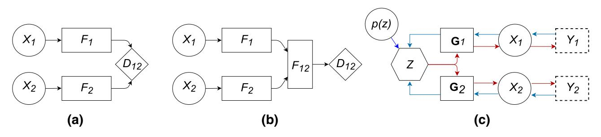
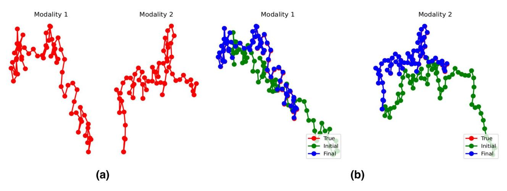
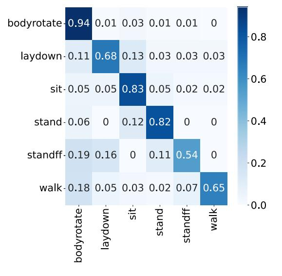
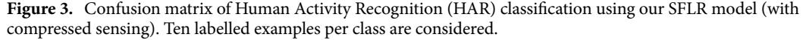
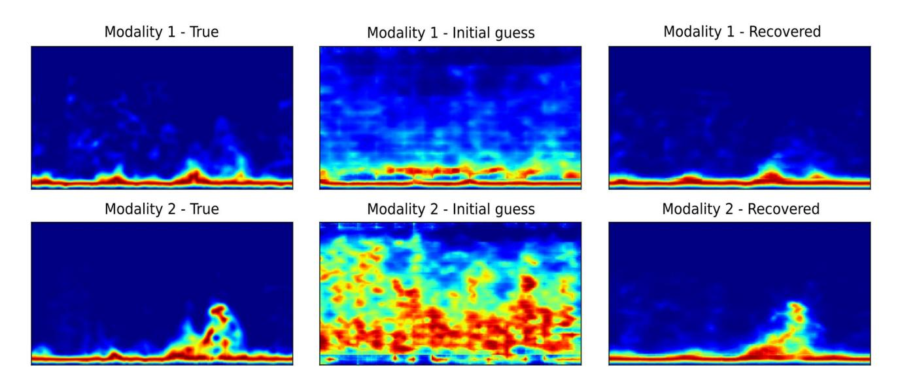
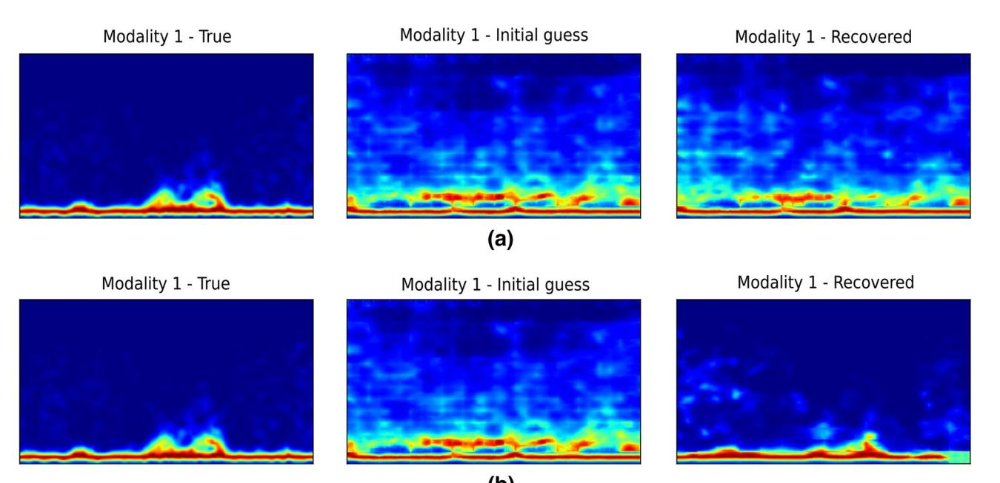

**OPEN**# Multimodal sensor fusion in the latent representation space
**Robert J. Piechocki**\***, XiaoyangWang  & Mohammud J. Bocus**

**A new method for multimodal sensor fusion is introduced. The technique relies on a two-stage process. In the frst stage, a multimodal generative model is constructed from unlabelled training data. In the second stage, the generative model serves as a reconstruction prior and the search manifold for the sensor fusion tasks. The method also handles cases where observations are accessed only via subsampling i.e. compressed sensing. We demonstrate the efectiveness and excellent performance on a range of multimodal fusion experiments such as multisensory classifcation, denoising, and recovery from subsampled observations.**

*Controlled hallucination*[1](#page-8-0) is an evocative term referring to the Bayesian brain hypothesi[s2](#page-8-1) . It posits that perception is not merely a function of sensory information processing capturing the world as is. Instead, the brain is a predictive machine - it attempts to infer the causes of sensory inputs. To achieve this, the brain builds and continually refnes its world model. Te world model serves as a prior and when combined with the sensory signals will produce the best guess for its causes. Hallucination (uncontrolled) occurs when the sensory inputs cannot be reconciled with, or contradict the prior world model. Tis might occur in our model, and when it does, it manifests itself at the fusion stage with the stochastic gradient descent procedure getting trapped in a local minimum. Te method presented in this paper is somewhat inspired by the Bayesian brain hypothesis, but it also builds upon multimodal generative modelling and deep compressed sensing.

Multimodal data fusion attracts academic and industrial interests alike[3](#page-8-2) and plays a vital role in several applications. Automated driving is arguably the most challenging industrial domai[n4](#page-8-3) . Automated vehicles use a plethora of sensors: Lidar, mmWave radar, video and ultrasonic, and attempt to perform some form of sensor fusion for environmental perception and precise localization. A high-quality of fnal fusion estimate is a prerequisite for safe driving. Amongst other application areas, a notable mention deserves eHealth and Ambient Assisted Living (AAL). Tese new paradigms are contingent on gathering information from various sensors around the home to monitor and track the movement signatures of people. Te aim is to build long-term behavioral sensing machine which also afords privacy. Such platforms rely on an array of environmental and wearable sensors, with sensor fusion being one of the key challenges.

In this contribution, we focus on a one-time snapshot problem (i.e. we are not building temporal structures). However, we try to explore the problem of multimodal sensor fusion from a new perspective, essentially, from a Bayesian viewpoint. Te concept is depicted in Fig. [1,](#page-1-0) alongside two main groups of approaches to sensor fusion. Traditionally, sensor fusion for classifcation tasks has been performed at the decision level as in Fig. [1\(](#page-1-0)a). Assuming that conditional independence holds, a pointwise product of fnal pmf (probability mass function) across all modalities is taken. Feature fusion, as depicted in Fig. [1](#page-1-0)(b), has become very popular with the advent of deep neural networks[3](#page-8-2) , and can produce very good results. Figure [1](#page-1-0)(c) shows our technique during the fusion stage (Stage 2). Blue arrows indicate the direction of backpropagation gradient fow during fusion.

## Contributions.

- A novel method for multimodal sensor fusion is presented. Te method attempts to fnd the best estimate (*maximum a posteriori*) for the causes of observed data. Te estimate is then used to perform specifc downstream fusion tasks.
- Te method can fuse the modalities under lossy data conditions i.e. when the data is subsampled, lost and/ or noisy. Such phenomena occur in real-world situations such as the transmission of information wirelessly, or intentional subsampling to expedite the measurement (rapid MRI imaging and radar) etc.
- It can leverage between modalities. A strong modality can be used to aid the recovery of another modality that is lossy or less informative (weak modality). Tis is referred to as asymmetric Compressed Sensing.

School of Computer Science, Electrical and Electronic Engineering, and Engineering Maths, University of Bristol, Bristol BS8 1UB, UK. \*email: r.j.piechocki@bristol.ac.uk

<!-- Image Description: The image presents three block diagrams illustrating a system's evolution. (a) shows two independent inputs ($X_1$, $X_2$) processed by separate functions ($F_1$, $F_2$). (b) extends this by combining the outputs through $F_{12}$. (c) depicts a more complex system with inputs ($X_1$, $X_2$) influencing $Z$ through functions ($G_1$, $G_2$), and a feedback loop from $p(z)$ affecting $Z$. The diagrams likely illustrate different stages of model development or variations in system architecture. -->

**Figure 1.** Multimodal Sensor Fusion: (**a**) Decision fusion, (**b**) Feature fusion, (**c**) Our technique: fusion in the latent representation *Z*with optional compressed sensing measurements; Red arrows show the generative model from the latent space and the data subsampling; Blue arrows show the fusion process, guided by the prior model.*F*features,*p*(*z*) prior model, **G**generators,*X*complete data,*Y*subsampled data. For clarity M = 2 modalities are shown, the concept generalises to any*M*.

### Related work

In this section, we review the state-of-the-art in three areas directly relevant to our contributions: multimodal generative modeling, sensor fusion, and compressed sensing. One of the main aims of Multimodal Variational Autoencoders (MVAEs) is to learn a shared representation across diferent data types in a fully self-supervised manner, thus avoiding the need to label a huge amount of data, which is time-consuming and expensiv[e5](#page-8-4) . It is indeed a challenge to infer the low-dimensional joint representation from multiple modalities, which can ultimately be used in downstream tasks such as self-supervised clustering or classifcation. Tis is because the modalities may vastly difer in characteristics, including dimensionality, data distribution, and sparsity[6](#page-8-5) . Recently, several methods have been proposed to combine multimodal data using generative models such as Variational Autoencoders (VAEs)[5,](#page-8-4)[7](#page-8-6)[–11.](#page-9-0) Tese methods aim to learn a joint distribution in the latent space via inference networks and try to reconstruct modality-specifc data, even when one modality is missing. In these works, a modality can refer to natural images, text, captions, labels or visual and non-visual attributes of a person. JMVAE (Joint Multimodal Variational Autoencoder[\)9](#page-8-7) makes use of a joint inference network to learn the interaction between two modalities and they address the issue of missing modality by training an individual (unimodal) inference network for each modality as well as a bimodal inference network to learn the joint posterior, based on the product-of-experts (PoE). Tey consequently minimize the distance between unimodal and multimodal latent distribution. On the other hand, MVA[E7](#page-8-6) , which is also based on PoE, considers only a partial combination of observed modalities, thereby reducing the number of parameters and improving the computational efciency. Referenc[e8](#page-8-8) uses the Mixture-of-Experts (MoE) approach to learn the shared representation across multiple modalities. Te latter two models essentially difer in their choices of joint posterior approximation functions. MoPoE (Mixture-of-Products-of-Experts)-VAE[5](#page-8-4) aims to combine the advantages of both approaches, MoE and PoE, without incurring signifcant trade-ofs. DMVAE (Disentangled Multimodal VAE)[10](#page-9-1) uses a disentangled VAE approach to split up the private and shared (using PoE) latent spaces of multiple modalities, where the latent factor may be of both continuous and discrete nature. CADA (Cross- and Distribution Aligned)-VAE[11](#page-9-0) uses a cross-modal embedding framework to learn a latent representation from image features and classes (labels) using aligned VAEs optimized with cross- and distribution- alignment objectives.

In terms of multimodal/sensor fusion for human activity sensing using Radio-Frequency (RF), inertial and/ or vision sensors, most works have considered either decision-level fusion or feature-level fusion. For instance, the work in[12](#page-9-2) performs multimodal fusion at the decision level to combine the benefts of WiFi and vision-based sensors using a hybrid Deep Neural Network (DNN) model to achieve good activity recognition accuracy for 3 activities. Te model essentially consists of a WiFi sensing module (dedicated Convolutional Neural Network (CNN) architecture) and a vision sensing module (based on the Convolutional 3D model) for processing WiFi and video frames for unimodal inference, followed by a multimodal fusion module. Multimodal fusion is performed at the decision level (afer both WiFi and vision modules have made a classifcation) because this framework is stated to be more fexible and robust to unimodal failure compared to feature level fusion. Reference[13](#page-9-3) presents a method for activity recognition, which leverages four sensor modalities, namely, skeleton sequences, inertial and motion capture measurements and WiFi fngerprints. Te fusion of signals is formulated as a matrix concatenation. Te individual signals of diferent sensor modalities are transformed and represented as an image. Te resulting images are then fed to a two-dimensional CNN (EfcientNet B2) for classifcation. Te authors of[14](#page-9-4) proposed a multimodal HAR system that leverages WiFi and wearable sensor modalities to jointly infer human activities. Tey collect Channel Sate Information (CSI) data from a standard WiFi Network Interface Card (NIC), alongside the user's local body movements via a wearable Inertial Measurement Unit (IMU) consisting of an accelerometer, gyroscope, and magnetometer sensors. Tey compute the time-variant Mean Doppler Shif (MDS) from the processed CSI data and magnitude from the inertial data for each sensor of the IMU. Ten, various time and frequency domain features are separately extracted from the magnitude data and the MDS. Te authors apply a feature-level fusion method which sequentially concatenates feature vectors that belong to the same activity sample. Finally supervised machine learning techniques are used to classify four activities, such as walking, falling, sitting, and picking up an object from the foor. Te work in[15](#page-9-5) proposed a feature-level sensor fusion approach for HAR and validated on a WiFi platform. Te authors o[f16](#page-9-6) proposed a decision-level sensor fusion network for HAR using LiDAR and visual sensors.

Compared to the aforementioned works[12–](#page-9-2)[16](#page-9-6) which consider supervised models with feature-level fusion or decision-level fusion, our technique, in contrast, performs multimodal sensor fusion in the latent representation space leveraging a self-supervised generative model. Our method is diferent from current multimodal generative models such as those proposed in[5,](#page-8-4)[7–](#page-8-6)[9](#page-8-7) in the sense that it can handle cases where observations are accessed only via subsampling (i.e. compressed sensing with signifcant loss of data and no data imputation). And crucially our technique attempts to directly compute the MAP (*maximum a posteriori*) estimate.

Te presented method is related to and builds upon Deep Compressed Sensing (DCS) technique[s17](#page-9-7)[,18.](#page-9-8) DCS, in turn, is inspired by Compressed Sensing (CS)[19](#page-9-9),[20](#page-9-10). In CS, we attempt to solve what appears to be an underdetermined linear system, yet the solution is possible with the additional prior sparsity constraint on the signal: min L0. Since *L*0 is non-convex, *L*1 is used instead to provide a convex relaxation, which also promotes sparsity and allows for computationally efcient solvers. DCS, in essence, replaces the *L*0 prior with a low dimensional manifold, which is learnable from the data using generative models. Concurrently to DCS, Deep Image Prior[21](#page-9-11) was proposed. It used un-trained CNNs to solve a range of inverse problems in computer vision (image inpainting, super-resolution, denoising).

#### Methods

Assume the data generative process so that latent and common cause *Z*gives rise to Xm, which in turn produces observed Ym, i.e. Z → Xm → Ym forms a Markov chain. Here, Xm is the full data pertaining to mth modality, m ∈ {1, ... , M}. Crucially, the modalities collect data simultaneously "observing" the same scene. As an example, in this work, we consider the diferent views (obtained via multiple receivers) from the opportunistic CSI WiFi radar as diferent modalities. Te variable*Z*encodes the semantic content of the scene and is typically of central interest. Furthermore, Xm is not accessed directly, but is observed via a*subsampled*Ym. Tis is a compressed sensing setup: Ym = χm(Xm): χm is a deterministic and known (typically many-to-one) function. Te only condition we impose on χm is to be Lipschitz continuous. With the above, the conditional independence between modalities holds (conditioned on*Z*). Terefore, the joint density factors as:

$$
p(z, x_{1:M}, y_{1:M}) = p(z) \prod_{m=1}^{M} p(y_m | x_m) p(x_m | z).
$$
 (1)

Te main task in this context is to produce the best guess for latent *Z*, and possibly, to recover the full signal(s) Xm, given subsampled data Y1:M. We approach the problem in two stages. First we build a joint model which approximates Eq. [\(1\)](#page-2-0), and will be instantiated as a Multimodal Variatational Autoencoer (M-VAE). More specifcally, the M-VAE will provide an approximation to pφ1:M ,ψ1:M (z, x1:M), parameterized by deep neural networks {φ1, ... , φM}, {ψ1, ... , ψM}, referred to as *encoders*and*decoders*, respectively. Te trained M-VAE will then be appended with pχm (ym|xm) for each modality *m*: {χ1, ... , χM} referred to as *samplers*. In the second stage, we use the trained M-VAE and χ1:M to facilitate the fusion and reconstruction tasks. Specifcally, our sensor fusion problem amounts to fnding the maximum a posteriori (MAP) zˆMAP estimate of the latent cause for a given (i th) data point Y1:M = y (i) 1:M:

$$
\hat{z}_{MAP} = \arg \max_{z} p(z|Y_{1:M} = y_{1:M}^{(i)}),
$$
\n(2)

where,

$$
p(z|Y_{1:M} = y_{1:M}^{(i)}) \propto p(z) \prod_{m=1}^{M} \int_{X_m} p(Y_m = y_m^{(i)} | x_m) p(x_m | z) dx_m.
$$
 (3)

Te above MAP estimation problem is hard, and we will resort to approximations detailed in the sections below.

**Multimodal VAE.**Te frst task is to build a model of Eq. [\(1](#page-2-0)). As aforementioned, this will be accomplished in two steps. Firstly, during the training stage we assume access to full data X1:M, therefore training an approximation to pφ1:M ,ψ1:M (z, x1:M) is a feasible task. Te marginal data log-likelihood for the multimodal case is:

$$
\log p(x_{1:M}) = D_{KL}(q(z|x_{1:M}||p(z|x_{1:M})) \tag{4}
$$

$$
+\left[\sum_{X_m}\mathbb{E}_{z\sim q(z|x_{1:M})}\log p(x_m|z)-\mathbb{E}_{z\sim q(z|x_{1:M})}\log\frac{q(z|x_{1:M})}{p(z)}\right],\tag{5}
$$

where DKL is the Kullback-Leibler (KL) divergence. Te frst summand in Eq. [\(4](#page-2-1)), i.e. the sum over modalities follows directly from the conditional independence. And since KL is non-negative, Eq. [\(4\)](#page-2-1) represents the lower bound (also known as Evidence Lower Bound - ELBO) on the log probability of the data (and its negative is used as the loss for the M-VAE). Tere exist a body of work on M-VAEs, the interested reader is referred t[o5](#page-8-4)[,7](#page-8-6)[–9](#page-8-7) for details and derivation. Te key challenge in training M-VAEs is the construction of variational posterior q(z|x1:M). We dedicate a section in the Supplementary Information document to the discussion on choices and implications for the approximation of variational posterior. Briefy, we consider two main cases: a missing data case - i.e. where particular modality data might be missing (Xm = x(i) m = ∅); and the full data case. Te latter is straightforward and is tackled by enforcing a particular structure of the encoders. For the former case variational Product-of-Experts (PoE) is used:

$$
q_{\Phi}(z|x_{1:M}) = p(z) \prod_{m=1}^{M} q_{\phi_m}(z|x_m).
$$
 (6)

Should the data be missing for any particular modality, qφm (z|xm) = 1 is assumed. Derivation of Eq. [\(6\)](#page-3-0) can be found in the Supplementary Information document.
**Fusion on the M‑VAE prior.**Recall the sensor fusion problem as stated in Eq. ([2](#page-2-2)). Te*p*(*z*) is forced to be isotropic Gaussian by M-VAE, and the remaining densities are assumed to be Gaussian. Furthermore, we assume that p(xm|z) = δ(xm − ψm(z)). Terefore Eq. [\(2\)](#page-2-2) becomes:

$$
\hat{z}_{MAP} = \arg \max_{z} p\left(z|Y_{1:M} = y_{1:M}^{(i)}\right) \propto \exp\left(-\|z\|^2\right) \prod_{m=1}^{M} \exp\left(-\frac{1}{2\sigma_m^2} \|y_m^{(i)} - \chi_m(\psi_m(z))\|^2\right). \tag{7}
$$

Hence, the objective to minimize becomes:

$$
\mathcal{L}(z) = \lambda_0 \|z\|^2 + \sum_{m=1}^{M} \lambda_m \|y_m^{(i)} - \chi_m(\psi_m(z))\|^2.
$$
 (8)

Recall that the output of the frst stage is *p*(*z*) and the decoders m pψn (x|z) are parameterized by {ψ1:M}, {0:M} are constants. Te MAP estimation procedure consists of backpropagating through the sampler χm and decoder ψm using Stochastic Gradient Descent (SGD). In this step {ψ1:M} are non-learnable, i.e. jointly with χm are some non-linear known (but diferentiable) functions.

$$
z \leftarrow z - \eta_0 \nabla_z (\|z\|^2) - \sum_{m=1}^M \eta_m \nabla_z (\|y_m^{(i)} - \chi_m(\psi_m(z))\|^2).
$$
 (9)

Te iterative fusion procedure is initialized by taking a sample from the prior z0 ∼ p(z), {η0:M} are learning rates. One or several SGD steps are taken for each modality in turn. Te procedure terminates with convergence - see Algorithm 1. In general, the optimization problem as set out in Eq. ([8](#page-3-1)) is non-convex. Terefore, there are no guarantees of convergence to the optimal point (zˆMAP). We deploy several strategies to minimize the risk of getting stuck in a local minimum. We consider multiple initialization points (a number of points sampled from the prior with Stage 2 replicated for all points). In some cases it might be possible to sample from: z0 ∼ p(z) p z X = ˇx (j) m . Depending on modality, this might be possible with data imputation (xˇm are imputed data). Te fnal stage will depend on a particular task (multisensory classifcation/reconstruction), but in all cases it will take zˆMAP as an input. In our experiments, we observe that the success of Stage 2 is crucially dependent on the quality of M-VAE.

| <b>Algorithm 1</b> Multimodal Sensor Fusion in the Latent Representation Space (SFLR) |  |  |  |
|---------------------------------------------------------------------------------------|--|--|--|
|---------------------------------------------------------------------------------------|--|--|--|

#### Experiments

In this work, we investigate the performance of the proposed method on two datasets for multimodal sensor fusion and recovery tasks: i) a synthetic "toy protein" dataset and ii) a passive WiFi radar dataset intended for Human Activity Recognition (HAR).

**Synthetic toy protein dataset.** A synthetic dataset containing two-dimensional (2D) protein-like data samples with two modalities is generated. Te latent distribution p(z), z ∈ R4 is a Gaussian mixture model with 10 components, simulating 10 diferent "classes" for samples. For each modality, the data generative model p(xm|z), xm ∈ RN is a one-layer multilayer perceptron (MLP) with random weights. Here m = 1, 2 represents two modalities. 10,000 pairs of samples are generated using the generative model, with the protein size N = 32. Figure [2](#page-4-0)(a) shows an instance of the 2D protein data with N = 64.

<!-- Image Description: The image displays two sets of diagrams (a and b) illustrating a process on two modalities. (a) shows initial states (red) for two modalities. (b) compares the true state (red) to the initial (green) and final (blue) states after applying a method to align the modalities. The diagrams visualize the alignment process, showing how initial estimates are refined to approach the true values. -->

**Figure 2.** (**a**) Generated toy proteins examples (N = 64) and (**b**) reconstruction from compressed sensing observations. With 2 out of 64 measurements (3.125%), near perfect reconstruction is possible even though the modalities are individually subsampled.

| Model                             | 1 example | 5 examples | 10 examples |
|-----------------------------------|-----------|------------|-------------|
| 2-channel CNN                     | 0.427272  | 0.570888   | 0.618501    |
| 1-channel CNN (Modality 1)        | 0.349084  | 0.451328   | 0.504462    |
| 1-channel CNN (Modality 2)        | 0.446554  | 0.600084   | 0.605678    |
| Probability fusion (product rule) | 0.440414  | 0.584726   | 0.641922    |
| Dual-branch CNN                   | 0.508243  | 0.568795   | 0.575914    |
| SFLR (ours)                       | 0.652699  | 0.718180   | 0.737507    |

**Table 1.**Few-shot learning sensor fusion classifcation results (F1 macro) for Human Activity Recognition. Best results are shown in bold.
**Passive WiFi radar dataset.**We use the OPERAnet[22](#page-9-12) dataset which was collected with the aim to evaluate Human Activity Recognition (HAR) and localization techniques with measurements obtained from synchronized Radio-Frequency (RF) devices and vision-based sensors. Te RF sensors captured the changes in the wireless signals while six daily activities were being performed by six participants, namely, sitting down on a chair ("sit"), standing from the chair ("stand"), laying down on the foor ("laydown"), standing from the foor ("standf "), upper body rotation ("bodyrotate"), and walking ("walk"). It should be noted that the six activities were performed in two diferent ofce rooms and in each room the participants performed the activities at diferent locations. Te distribution of the six activities performed by the six participants in the two rooms is reported i[n22.](#page-9-12) We convert the raw time-series CSI data from the WiFi sensors into the image-like format, namely, spectrograms using signal processing techniques. More details are available in Sect. S2 of the Supplementary Information document. Te interested reader is kindly referred to our previous work[s23–](#page-9-13)[25](#page-9-14) for more details on the signal processing pipelines for WiFi CSI. In this paper, we focus mainly on the design of a model that can fuse data from multiple modalities/sensors in the latent representation space efectively for several downstream tasks such as multisensory classifcation, denoising, and recovery from subsampled observations and missing pixels. 2,906 spectrogram samples (each of 4s duration window) were generated for the 6 human activities and 80% of these were used as training data while the remaining 20% as testing data (random train-test split).

#### Results and discussion
**Classifcation results of WiFi CSI spectrograms for HAR.**In this section, we evaluate the HAR sensor fusion classifcation performance under a few-shot learning scenario, with 1, 5 and 10 labelled examples per class. Tese correspond to 0.05%, 0.26% and 0.51% of labelled training samples, respectively. We randomly select 80% of the samples in the dataset as the training set and the remaining 20% is used for validation. Te average F1 -macro scores for the HAR performance are shown in Table [1](#page-4-1) for diferent models. To allow for a fair comparison, the same random seed was used in all experiments with only two modalities (processed spectrograms data obtained from two diferent receivers).

Prior to training our model (see Supplementary Fig. S1, the spectrograms were reshaped to typical image dimensions of size (1 × 224 × 224). Our model was trained for 1,000 epochs using the training data with a fxed KL scaling factor of β = 0.02. Te encoders comprised of the ResNet-18 backbone with the last fully-connected layer dimension having a value of 512. For the decoders, corresponding CNN deconvolutional layers were used to reconstruct the spectrograms from each modality with the same input dimension. Te latent dimension, batch size, and learning rate are set at 64, 64, and 0.001, respectively. Our model was implemented in PyTorch. We

<!-- Image Description: This image displays a confusion matrix, a type of heatmap, showing the performance of a classification model for human activity recognition. The matrix visualizes the model's accuracy in classifying six activities (bodyrotate, laydown, sit, stand, standff, walk). Each cell represents the proportion of instances of a given activity that were correctly or incorrectly classified as another activity. Diagonal elements (e.g., 0.94 for bodyrotate) indicate the accuracy of correct classification; off-diagonal values represent misclassifications. Darker blue indicates higher values (higher accuracy or frequency of misclassification). The matrix aids in assessing the model's strengths and weaknesses in differentiating between various activities. -->

<!-- Image Description: Figure 3 is a caption describing a missing confusion matrix. The caption states that the matrix visualizes the performance of a Sparse Feature Learning and Regression (SFLR) model for Human Activity Recognition (HAR) classification using compressed sensing. The model was evaluated with ten labeled examples per class. The figure is absent from the provided image. -->

used a single NVIDIA GeForce RTX 2080 Ti (11 GB) GPU for training our model. Te latter consists of 29.6M trainable parameters. Te time taken for training our model on such a setup was approximately 1.94 hours. In the second stage, the generative model serves as a reconstruction prior and the search manifold for the sensor fusion tasks. Essentially, in this stage, we obtain the maximum a posteriori estimate of zˆMAP through the process described in Algorithm 1. Te fnal estimate of the class is produced by*K*-NN in the latent representation space, with labelled examples sampled from the training set.

To benchmark our technique we investigate the performance of other state-of-the-art sensor fusion techniques. Te feature-fusion is represented by CNN models (1-channel CNN, 2-channel CNN, dual-branch CNN). All are trained in a conventional supervised fashion from scratch using the ResNet-18 backbone and a linear classifcation head is appended on top of it consisting of a hidden linear layer of 128 units and a linear output layer of 6 nodes (for classifying 6 human activities). Te dual-input CNN refers to the case where the embeddings from the two modalities' CNNs are concatenated, and a classifcation head is then added (as illustrated in Fig. [1b](#page-1-0)). Te "Probability Fusion" (decision fusion) model refers to a score-level fusion method where the classifcation probabilities (P1 and P2) from each modality are computed independently (using an output SofMax layer) and then combined using the product rule (this is optimal given conditional independence). Tese models are fne-tuned with labelled samples over 200 epochs, with a batch size of 64 and the Adam optimizer was used with learning rate of 0.0001, weight decay of 0.001 and β1 = 0.95, β2 = 0.999.

It can be observed from Table [1](#page-4-1) that our method signifcantly outperforms all other conventional feature and decision fusion methods. Te confusion matrix for HAR classifcation using our SFLR (Sensor Fusion in the Latent Representation space) model is shown in Fig. [3](#page-5-0) for the case when only ten labelled examples are used at the (classifcation) fusion stage.

**Sensor fusion from subsampled observations (WiFi spectrogram data).**Next, we evaluate the recovery performance of spectrograms under diferent numbers of compressed sensing measurements. Te measurement function χm is a matrix initialized randomly and we assume that there is no additive Gaussian noise. Te Adam optimizer is used to optimize zˆMAP with a learning rate of 0.01. Te algorithm is run for 10,000 iterations. Afer the loss in Eq. [\(8\)](#page-3-1) has converged during the optimization process, the samples are decoded/ recovered for modality 1 and modality 2 using their respective decoders xˆm = ψm(zˆMAP). Table [2](#page-6-0) shows the compressed sensing results when a batch of 50 images is taken from the testing dataset and evaluated under diferent number of measurements (without noise). It can be observed that the samples can be recovered with very low reconstruction error when the number of measurements is as low as 196 (0.39%). An illustration is also shown in Fig. [4](#page-6-1) where very good reconstruction is observed for the case when the number of measurements is equal to 784. Algorithm 1 was run for 10,000 iterations on a single GPU (GeForce RTX 2080 Ti) for a batch of 50 subsampled WiFi spectrograms (number of measurements = 784 (1.56%)), and the optimisation process took on average approximately 48.1 seconds to converge for a given subsampled WiFi CSI spectrogram sample. More illustrations are shown in Fig. S6 in the Supplementary Information document, with further experimental results in Sects. S4 and S5.
**Sensor fusion from asymmetric compressed sensing (WiFi spectrogram data).** In this experiment, we analyse the reconstruction of the WiFi spectrogram samples under two diferent scenarios, where we demonstrate the benefts of having multiple modalities. We are interested in recovery for one modality that is subsampled (loss of data) and noisy. Tis can be referred to as the weak data (or weak modality). Using the

<!-- Image Description: The image displays six spectrograms, two modalities each shown as "True," "Initial guess," and "Recovered." Each spectrogram shows a color-coded representation of spectral data, likely representing frequency and intensity over time. The purpose is to visually compare the accuracy of a recovery method, contrasting the original ("True") data with an initial estimate and the final recovered result for two different modalities. The color scale represents intensity, with red/yellow indicating higher intensity. -->

**Figure 4.** Illustration of spectrogram recovery (for sitting down activity) using compressed sensing with measurements as low as 784 out of 50,176 (1.56%). No additive white Gaussian noise is considered. Te lef column shows the true spectrogram sample, the middle column shows reconstruction with an initial guess (no optimization) while the right column shows reconstruction with zˆMAP.

| No. of measurements | Modality 1 | Modality 2 |
|---------------------|------------|------------|
| 1 (0.002%)          | 0.03118854 | 0.15024841 |
| 10 (0.02%)          | 0.00938917 | 0.02824161 |
| 196 (0.39%)         | 0.00348606 | 0.00613665 |
| 784 (1.56%)         | 0.00305005 | 0.00505758 |
| 1,568 (3.125%)      | 0.00284343 | 0.00489433 |

**Table 2.** Compressed sensing mean reconstruction error over a batch of 50 WiFi spectrogram data samples (No additive Gaussian noise). An illustration is shown in Fig. [4](#page-6-1).

|                                    | No. of Measurements | Modality 1 | Modality 2 |
|------------------------------------|---------------------|------------|------------|
| Modality 1 with compressed sensing | 1 (0.002%)          | 0.0246185  | –          |
|                                    | 10 (0.02%)          | 0.01075371 | –          |
|                                    | 196 (0.39%)         | 0.00258467 | –          |
|                                    | 784 (1.56%)         | 0.00195997 | –          |
|                                    | 1,568 (3.125%)      | 0.00184247 | –          |
| Modality 1 with compressed sensing | 1 (0.002%)          | 0.00892453 | 0.00380795 |
|                                    | 10 (0.02%)          | 0.00798366 | 0.00420512 |
|                                    | 196 (0.39%)         | 0.0034269  | 0.00460956 |
| Modality 2 with full information   | 784 (1.56%)         | 0.0030373  | 0.00466936 |
|                                    | 1,568 (3.125%)      | 0.0028537  | 0.00469946 |

**Table 3.** Asymmetric compressed sensing. Mean reconstruction error over 50 WiFi spectrogram data samples. Noise standard deviation: 0.1.

SFLR method, we leverage the second modality data, which has no loss of information or does not sufer from noise (strong modality), to improve the recovery for the modality of interest i.e., the weak modality. In the frst case, only modality 1 (subsampled and noisy) is considered in the reconstruction process. In the second case, modality 2 (strong modality) is added in the iterative fusion process to improve the reconstruction quality of modality 1.

Te results are tabulated in Table [3](#page-6-2), where additive Gaussian noise with a standard deviation of 0.1 is considered. Te results show the mean reconstruction errors (over 50 WiFi spectrogram samples) when modality 1 is subsampled to diferent extents. We see that reconstruction error has a general tendency to decrease with increasing number of measurements. It can be observed that the samples can be recovered with very low reconstruction error when the number of measurements is as low as 196 (0.39%). Furthermore, from Table [3](#page-6-2), we observe that

<!-- Image Description: The image displays spectrograms comparing true, initial guess, and recovered data for "Modality 1". Two sets (a) and (b) of three spectrograms each are shown. Each spectrogram uses a color scale (blue to red) to represent signal strength. The image illustrates a data recovery or reconstruction process, likely showcasing the effectiveness of a method by comparing the recovered spectrogram to the true one. The initial guess represents the starting point of the recovery algorithm. -->

**Figure 5.** Reconstruction examples showing the beneft of multimodal system compared to a unimodal system. Modality 1 is subsampled data with 1 single measurement while modality 2 has full information (no noise and no loss of data). Additive Gaussian noise with a standard deviation of 0.1 is considered in this example: (**a**) reconstruction with modality 1 only, (**b**) reconstruction with both modalities 1 and 2. Lef column shows true spectrogram sample, middle column shows reconstruction with initial guess (no optimization) while right column shows reconstruction with zˆMAP. Adding modality 2 during reconstruction stage helps in the sample recovery of modality 1.

when only modality 1 is considered in the reconstruction process, the reconstruction errors are high when the number of measurements is equal to 1 (0.002%) and 10 (0.02%). However, by leveraging the good modality 2, the reconstruction quality is greatly improved for the same number of measurements, demonstrating the clear beneft of having multiple modalities. An illustration of the reconstruction quality is depicted in Fig. [5](#page-7-0), where it can be observed that the unimodal reconstruction of modality 1 is far from the true sample. On the other hand, the reconstruction quality of modality 1 is improved by leveraging the good modality data.

**Toy protein classifcation.**Similar to the experiments on the OPERAne[t22](#page-9-12) dataset, we perform two tasks, classifcation and sensor fusion from compressed sensing observations, on the synthetic toy protein dataset. As mentioned previously, the toy protein dataset contains 10 classes. Te dataset is split into a training set and a test set, containing 80% and 20% of samples, respectively. We evaluate the classifcation performance under a fewshot learning setting, using 1, 5 or 10 labelled samples per class. Te few-shot classifcation via the SFLR model consists of two stages. In the frst stage, the M-VAE is trained in an unsupervised manner using the training set. Using the maximum a posterior zˆMAP and a few labels, the*K*-NN classifer is applied to the latent representation space. Here the *encoder*and*decoder*in M-VAE are two-layer MLPs, with 16 neurons in the hidden layer.

We compare the SFLR method with 4 baseline models. Te single modality model only considers one modality without sensor fusion. Te probability fusion model independently computes the classifcation probability for each modality, which is a representative model for decision-fusion (Fig. [1a](#page-1-0)). Te dual-branch feature fusion model concatenates the embedding of two modalities before the classifcation layer, which is a feature fusion method (Fig. [1b](#page-1-0)). All baseline models are trained in a supervised manner, with the same neural network structure as the*encoder*. Table [4](#page-8-9) shows the *F*1-macro scores for diferent methods on the test set. On the 10-class protein dataset, SFLR outperforms other sensor fusion models using limited labelled samples.

**Sensor fusion from subsampled toy proteins.**Another advantage of the proposed SFLR model is that it can fuse modalities in subsampled cases. We use a set of*samplers* χ1:M to simulate the subsampled observations. Te measurement function χm is a matrix initialized randomly. Here we use 10 initialization points to reduce the risk of getting trapped in a local minimum (points sampled from the prior with Stage 2 replicated for all of them). Figure [2\(](#page-4-0)b) shows the recovered protein from subsampled observations, with only 2 measurements for each modality. Both modalities are successfully recovered from the latent representation space, even though the initial guess z0 is far from the true modality. Note that the proteins in Fig. [2](#page-4-0) have a higher dimension than in the dataset, showing the robustness of the SFLR method. Table [5](#page-8-10) shows the average reconstruction error of the synthetic protein dataset using diferent subsamplers. Te reconstruction error reduced signifcantly when having 2 measurements for each modality, showing superior sensor fusion abilities.

| Model                             | 1 example | 5 examples | 10 examples |
|-----------------------------------|-----------|------------|-------------|
| Single modality (Modality 1)      | 0.3188    | 0.4342     | 0.5843      |
| Single modality (Modality 2)      | 0.3221    | 0.4849     | 0.5555      |
| Probability fusion (product rule) | 0.2256    | 0.3736     | 0.3836      |
| Dual-branch feature fusion        | 0.3769    | 0.4973     | 0.5953      |
| SFLR (ours)                       | 0.4183    | 0.5501     | 0.6120      |

**Table 4.** Few-shot learning sensor fusion classifcation results (F1 macro) for synthetic proteins. Best results are shown in bold.

| No. of measurements | Modality 1 (10−5 ) | Modality 2 (10−5 ) |
|---------------------|-----------------------|-----------------------|
| 1 (3.125%)          | 4,622.4               | 4,923.5               |
| 2 (6.250%)          | 22.5                  | 27.9                  |
| 4 (12.500%)         | 7.1                   | 7.4                   |
| 8 (25.000%)         | 2.3                   | 2.7                   |

**Table 5.**Compressed sensing mean reconstruction error over a batch of 100 protein samples.

Te Supplementary Information document (see Sect. S6) contains additional experiments, including tasks showcasing the ability to leverage between modalities, where a strong modality can be used to aid the recovery of a weak modality. It also presents the performance under subsampled and noisy conditions.

Despite the fact that the SFLR method achieves superior performance in the HAR problem, it has its weaknesses and limitations. Te performance of sensor fusion heavily relies on the success of the frst stage, which requires high-quality training data. Learning the manifold of*p*(*z*) is the key to the estimation of zˆMAP. In stage 2, *z*might fall into local minima which leads to sub-optimal solutions. Tis is a common issue when using gradient descent in optimization problems, with existing solutions to mitigate it.

# Conclusions and broader impacts

Te paper presents a new method for sensor fusion. Specifcally, we demonstrate the efectiveness of classifcation and reconstruction tasks from radar signals. Te intended application area is human activity recognition, which serves a vital role in the E-Health paradigm. New healthcare technologies are the key ingredient to battling spiralling costs of provisioning health services that beset a vast majority of countries. Such technologies in a residential setting are seen as a key requirement in empowering patients and imbuing a greater responsibility for own health outcomes. However, we acknowledge that radar and sensor technologies also fnd applications in a military context. Modern warfare technologies (principally defensive) could potentially become more apt if they were to beneft from much-improved sensor fusion. We frmly believe that, on balance, it is of beneft to the society to continue the research in this area in the public eye.

## Data availibility

Te data that support the fndings of this study are openly available in fgshare at [https://doi.org/10.6084/m9.](https://doi.org/10.6084/m9.figshare.c.5551209.v1) [fgshare.c.5551209.v1](https://doi.org/10.6084/m9.figshare.c.5551209.v1)[26](#page-9-15). Te toy protein dataset is not publicly available at this time but can be made available from the authors upon request.

Received: 2 August 2022; Accepted: 21 November 2022

### References

- 1. Seth, A.*Being You: A New Science of Consciousness (Te Sunday Times Bestseller)*(Faber & Faber, 2021).
- 2. Doya, K., Ishii, S., Pouget, A. & Rao, R. P. N.*Bayesian Brain: Probabilistic Approaches to Neural Coding*(Te MIT Press, 2007). 3. Gao, J., Li, P., Chen, Z. & Zhang, J. A survey on deep learning for multimodal data fusion.*Neural Comput.* **32**, 829–864. [https://](https://doi.org/10.1162/neco_a_01273) [doi.org/10.1162/neco\\_a\\_01273](https://doi.org/10.1162/neco_a_01273) (2020).
- 4. Wang, Z., Wu, Y. & Niu, Q. Multi-sensor fusion in automated driving: A survey. *IEEE Access* **8**, 2847–2868. [https://doi.org/10.1109/](https://doi.org/10.1109/ACCESS.2019.2962554) [ACCESS.2019.2962554](https://doi.org/10.1109/ACCESS.2019.2962554) (2020).
- 5. Sutter, T. M., Daunhawer, I. & Vogt, J. E. Generalized multimodal ELBO. Preprint at [arxiv:2105.02470](http://arxiv.org/abs/2105.02470) (2021).
- 6. Minoura, K., Abe, K., Nam, H., Nishikawa, H. & Shimamura, T. A mixture-of-experts deep generative model for integrated analysis of single-cell multiomics data. *Cell Rep. Methods* **1**, 100071. <https://doi.org/10.1016/j.crmeth.2021.100071>(2021).
- 7. Wu, M. & Goodman, N. Multimodal generative models for scalable weakly-supervised learning. In *Proceedings of the 32nd International Conference on Neural Information Processing Systems*, NIPS'18, 5580-5590 (Curran Associates Inc., Red Hook, NY, USA, 2018).
- 8. Shi, Y., N, S., Paige, B. & Torr, P. Variational mixture-of-experts autoencoders for multi-modal deep generative models. In Wallach, H. *et al.*(eds.)*Advances in Neural Information Processing Systems*, vol. 32 (Curran Associates, Inc., 2019).
- 9. Suzuki, M., Nakayama, K. & Matsuo, Y. Joint multimodal learning with deep generative models. Preprint at [arxiv:1611.01891](http://arxiv.org/abs/1611.01891) (2016).

- 10. Lee, M. & Pavlovic, V. Private-shared disentangled multimodal VAE for learning of latent representations. In *IEEE Conference on Computer Vision and Pattern Recognition Workshops, CVPR Workshops 2021, virtual, June 19-25, 2021*, 1692–1700, [https://doi.](https://doi.org/10.1109/CVPRW53098.2021.00185) [org/10.1109/CVPRW53098.2021.00185](https://doi.org/10.1109/CVPRW53098.2021.00185) (Computer Vision Foundation / IEEE, 2021).
- 11. Schönfeld, E., Ebrahimi, S., Sinha, S., Darrell, T. & Akata, Z. Generalized zero- and few-shot learning via aligned variational autoencoders. In *2019 IEEE/CVF Conference on Computer Vision and Pattern Recognition (CVPR)*, 8239–8247, [https://doi.org/](https://doi.org/10.1109/CVPR.2019.00844) [10.1109/CVPR.2019.00844](https://doi.org/10.1109/CVPR.2019.00844) (2019).
- 12. Zou, H. *et al.*WiFi and vision multimodal learning for accurate and robust device-free human activity recognition. In*2019 IEEE/ CVF Conference on Computer Vision and Pattern Recognition Workshops (CVPRW)*, 426–433, [https://doi.org/10.1109/CVPRW.](https://doi.org/10.1109/CVPRW.2019.00056) [2019.00056](https://doi.org/10.1109/CVPRW.2019.00056) (2019).
- 13. Memmesheimer, R., Teisen, N. & Paulus, D. Gimme signals: Discriminative signal encoding for multimodal activity recognition. In *2020 IEEE/RSJ International Conference on Intelligent Robots and Systems (IROS)*, 10394–10401, [https://doi.org/10.1109/IROS4](https://doi.org/10.1109/IROS45743.2020.9341699) [5743.2020.9341699](https://doi.org/10.1109/IROS45743.2020.9341699) (2020).
- 14. Muaaz, M., Chelli, A., Abdelgawwad, A. A., Mallofré, A. C. & Pätzold, M. WiWeHAR: Multimodal human activity recognition using Wi-Fi and wearable sensing modalities. *IEEE Access* **8**, 164453–164470.<https://doi.org/10.1109/ACCESS.2020.3022287> (2020).
- 15. Ding, J., Wang, Y., Si, H., Gao, S. & Xing, J. Multimodal fusion-adaboost based activity recognition for smart home on wif platform. *IEEE Sens. J.* **22**, 4661–4674 (2022).
- 16. Roche, J., De-Silva, V., Hook, J., Moencks, M. & Kondoz, A. A multimodal data processing system for lidar-based human activity recognition. *IEEE Transactions on Cybernetics*(2021).
- 17. Bora, A., Jalal, A., Price, E. & Dimakis, A. G. Compressed sensing using generative models. In Precup, D. & Teh, Y. W. (eds.)*Proceedings of the 34th International Conference on Machine Learning*, vol. 70 of *Proceedings of Machine Learning Research*, 537–546 (PMLR, 2017).
- 18. Wu, Y., Rosca, M. & Lillicrap, T. Deep compressed sensing. In *Proceedings of the 36th International Conference on Machine Learning*, vol. 97 (PMLR, 2019).
- 19. Candès, E. J., Romberg, J. K. & Tao, T. Stable signal recovery from incomplete and inaccurate measurements. *Commun. Pure Appl. Math.* **59**, 1207–1223.<https://doi.org/10.1002/cpa.20124>(2006).
- 20. Donoho, D. Compressed sensing. *IEEE Trans. Inf. Teory* **52**, 1289–1306.<https://doi.org/10.1109/TIT.2006.871582> (2006).
- 21. Ulyanov, D., Vedaldi, A. & Lempitsky, V. Deep image prior. In *Proceedings of the IEEE Conference on Computer Vision and Pattern Recognition (CVPR)*(2018).
- 22. Bocus, M. J.*et al.*OPERAnet, a multimodal activity recognition dataset acquired from radio frequency and vision-based sensors.*Sci. Data* **9**, 474.<https://doi.org/10.1038/s41597-022-01573-2> (2022).
- 23. Bocus, M. J. *et al.*Translation resilient opportunistic WiFi sensing. In*2020 25th Int. Conf. Pattern Recogn. (ICPR)*, 5627–5633, <https://doi.org/10.1109/ICPR48806.2021.9412263>(2021).
- 24. Li, W. *et al.*On CSI and passive Wi-Fi radar for opportunistic physical activity recognition.*IEEE Trans. Wireless Commun.*(2022).
- 25. Li, W.*et al.*A taxonomy of WiFi sensing: CSI vs passive WiFi radar. In*2020 IEEE Globecom Workshops (GC Wkshps*, 1–6, [https://](https://doi.org/10.1109/GCWkshps50303.2020.9367546) [doi.org/10.1109/GCWkshps50303.2020.9367546](https://doi.org/10.1109/GCWkshps50303.2020.9367546) (2020).
- 26. Bocus, M. J., Li, W., Vishwakarma, S. & Tang, C. A comprehensive multimodal activity recognition dataset acquired from radio frequency and vision-based sensors. *fgshare*[https://doi.org/10.6084/m9.fgshare.c.5551209.v1](https://doi.org/10.6084/m9.figshare.c.5551209.v1) *(2022).*# Acknowledgements

Tis work was performed as a part of the OPERA Project, funded by the UK Engineering and Physical Sciences Research Council (EPSRC), Grant EP/R018677/1. Tis work has also been funded in part by the Next-Generation Converged Digital Infrastructure (NG-CDI) Project, supported by BT and Engineering and Physical Sciences Research Council (EPSRC), Grant ref. EP/R004935/1.

# Author contributions

All authors, R.P, X.W and M.B, contributed equally to this work. Te main tasks involved conceiving and conducting the experiments, algorithm implementation, analysis, validation and interpretation of results, and fnally preparing and reviewing the manuscript.

# Competing interests

Te authors declare no competing interests.

# Additional information
**Supplementary Information**Te online version contains supplementary material available at [https://doi.org/](https://doi.org/10.1038/s41598-022-24754-w) [10.1038/s41598-022-24754-w](https://doi.org/10.1038/s41598-022-24754-w).
**Correspondence**and requests for materials should be addressed to R.J.P.
**Reprints and permissions information**is available at [www.nature.com/reprints.](www.nature.com/reprints)
**Publisher's note**Springer Nature remains neutral with regard to jurisdictional claims in published maps and institutional afliations.
**Open Access** Tis article is licensed under a Creative Commons Attribution 4.0 International License, which permits use, sharing, adaptation, distribution and reproduction in any medium or format, as long as you give appropriate credit to the original author(s) and the source, provide a link to the Creative Commons licence, and indicate if changes were made. Te images or other third party material in this article are included in the article's Creative Commons licence, unless indicated otherwise in a credit line to the material. If material is not included in the article's Creative Commons licence and your intended use is not permitted by statutory regulation or exceeds the permitted use, you will need to obtain permission directly from the copyright holder. To view a copy of this licence, visit<http://creativecommons.org/licenses/by/4.0/>.

© Te Author(s) 2023
