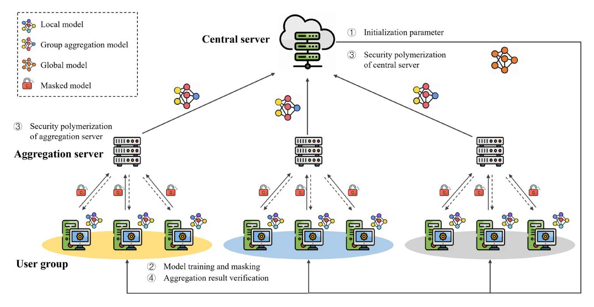
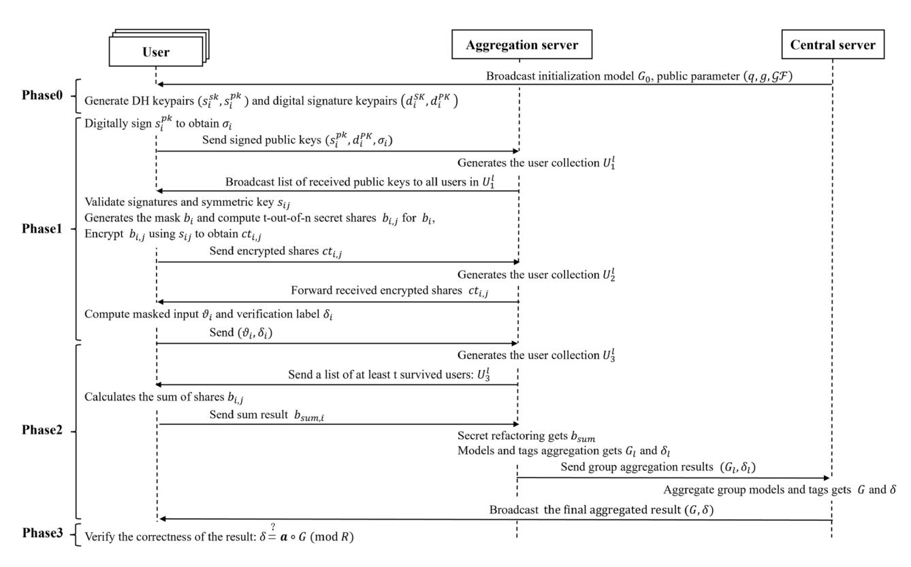
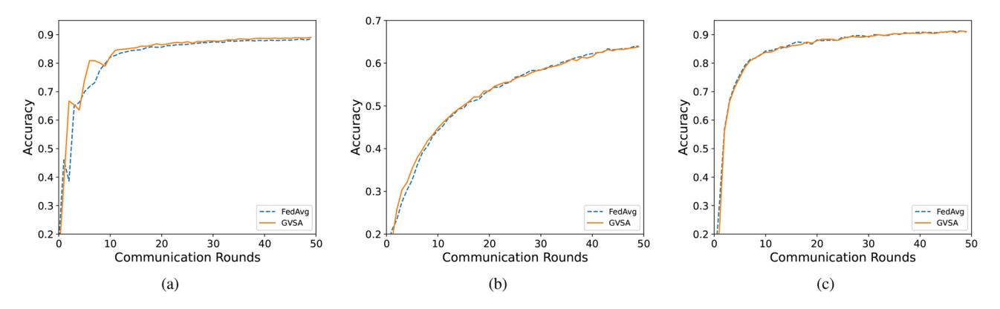
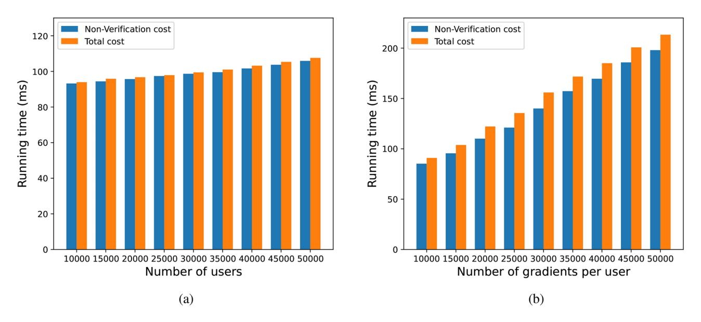
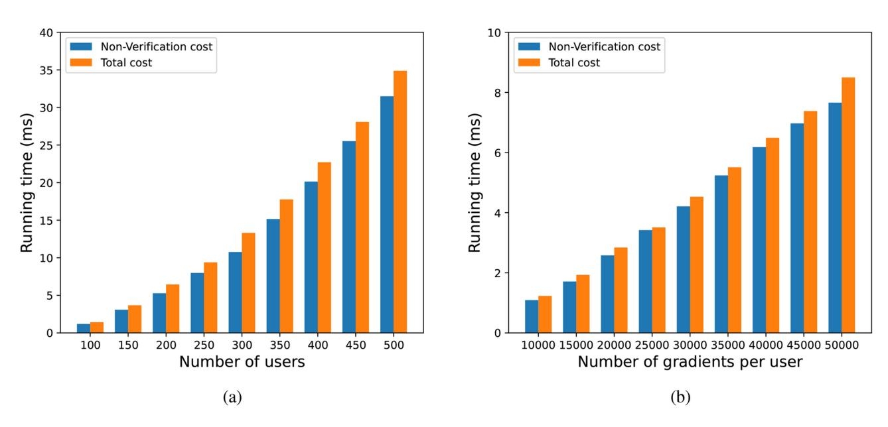
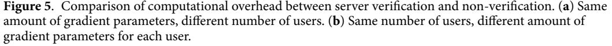
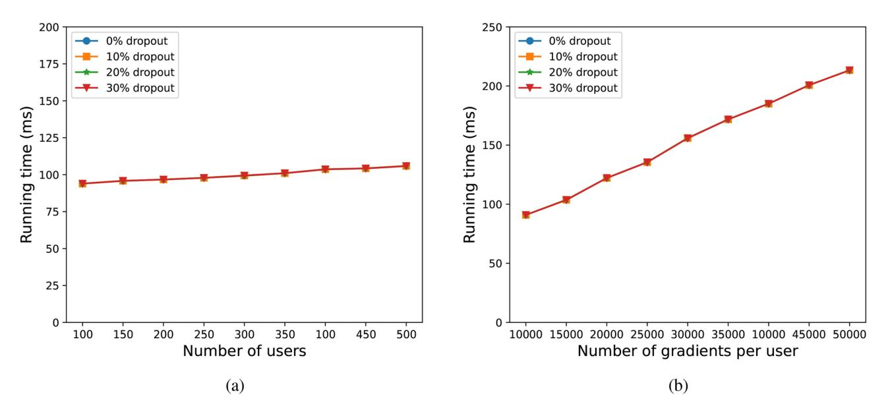
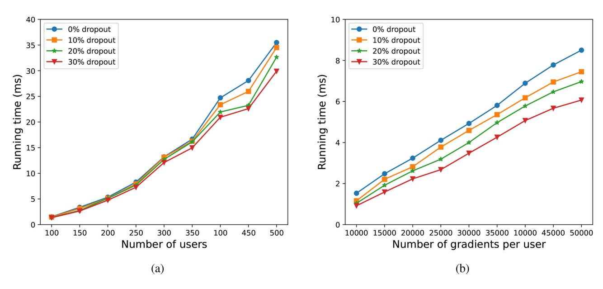

<!-- cite_key: s41598_025_94478_0 -->

# OPEN

# Group verifiable secure aggregate federated learning based on secret sharing

**Sufang Zhou1,2, LinWang1, Liangyi Chen1, Yifeng Wang1 & KeYuan1,3**

**Federated learning is a distributed machine learning approach designed to tackle the problems of data silos and the security of raw data. Nevertheless, it remains susceptible to privacy leakage risks and aggregation server tampering attacks. Current privacy-preserving methods often involve significant computational and communication overheads, which can be challenging in resource-limited settings, hindering their practical application. To overcome these obstacles, this article proposes an efficient secure aggregation scheme based on secret sharing-GVSA. GVSA safeguards the privacy of local models through a masking technique and improves the system's resilience to user dropouts by utilizing secret sharing. Furthermore, GVSA implements a dual aggregation approach and incorporates lightweight validation tags to verify the accuracy of the aggregation results. By adopting a grouping strategy, GVSA effectively minimizes the computational burden on both users and the server, making it well-suited for resource-constrained environments. We compare GVSA with leading existing methods and assess its performance through various experimental setups. Experimental results demonstrate that GVSA maintains high security while effectively preserving model accuracy. Compared to FedAvg, GVSA incurs only approximately 7% additional computational overhead. Furthermore, compared to other secure aggregation schemes with the same security level, GVSA achieves approximately a 2.3***×* **improvement in training speed.**

**Keywords**Federated learning, Privacy-preserving, Secret sharing, Verifiable, Secure aggregate

With the global wave of digitization, machine learning has made significant strides in fields such as computer vision[1](#page-15-0) , autonomous driving[2](#page-15-1) , smart healthcare[3](#page-15-2) , and smart cities[4](#page-15-3) , fueled by the massive influx of data. However, as digital transformation accelerates, the proliferation of devices like smartphones, wearables, and smart home products has resulted in data that is not only vast in volume but also highly distributed. This creates unprecedented challenges for centralized data management and effective utilization. At the same time, the public is increasingly concerned about the protection of privacy, data transmission and sharing process need to strictly abide by the privacy protection regulations, data transmitted over the network must be encrypted to prevent leakage and misuse. Consequently, traditional centralized machine learning frameworks face significant limitations in terms of data management and privacy protection, making it difficult to address issues like privacy preservation and data silos.

In this context, Federated Learning (FL)[5](#page-15-4) , an innovative distributed machine learning framework, has emerged. FL distributes the training task across multiple data holders (i.e., clients or devices), where each data holder trains a model on its local data and uploads the training results (e.g., gradients or model parameters) to a central server for aggregation, which generates a global model. This approach not only avoids the direct transmission of raw data, reducing the risk of privacy leakage, but also fully utilizes distributed data resources, improving model generalization and training efficiency.

However, despite not transmitting raw data, local gradients or model parameters can still leak sensitive user informatio[n6](#page-15-5),[7](#page-15-6) . Adversaries may intercept these parameters and, using advanced machine learning or statistical techniques, reconstruct parts of the original user data, thus compromising privacy. Furthermore, the central server, as a core component of the FL system, directly affects the correctness of the global model and the reliability of the system. If manipulated by an adversary or subjected to failure, the server can disrupt the entire system's functionality[8](#page-15-7) . For instance, an attacker could inject malicious data or forge updates, leading the aggregation server to return an erroneous global model and undermine the effectiveness of the entire system.

1School of Computer and Information Engineering, Henan University, Kaifeng 475004, China. 2Henan Province Engineering Research Center of Spatial Information Processing, Henan University, Kaifeng 475004, China. 3Henan Engineering Research Center for Industrial Internet of Things, Zhengzhou 450046, China. email: yuanke@henu.edu.cn

To address these concerns, existing research has proposed various security schemes, including Homomorphic Encryption (HE)[9,](#page-15-8)[10](#page-15-9), Secure Multiparty Computation (SMC[\)11](#page-15-10),[12,](#page-15-11) and Differential Privacy (DP[\)13](#page-15-12)–[15](#page-15-13) However, these methods have their limitations. HE, while offering strong privacy protection, come with high computational and communication Overhead, making them inappropriate for environments with limited computational resources. DP, which protects privacy by introducing noise into gradients or raw data, frequently necessitates a compromise between privacy and model accuracy. SMC avoids the high computational cost associated with performing complex operations on encrypted data, which is a limitation of HE. Compared to DP, SMC preserves data privacy without introducing significant accuracy loss in the model. As a result, SMC demonstrates greater adaptability and advantages in applications that require both privacy protection and efficient computation. However, most existing schemes primarily focus on protecting user privacy while overlooking the challenge of effectively mitigating the single point of failure risk at the aggregation server.

In response to this, some studies have proposed solutions to mitigate the single point of failure of the server[16](#page-15-14)[–18](#page-15-15). While these solutions offer some degree of privacy protection and allow for result verification, they often incur high computational and communication overheads, which hinder their application in large-scale, practical settings. Furthermore, user dropouts are unavoidable owing to unreliable communication networks, and the protocol's fault tolerance has a direct impact on the usability of FL systems.

To address these challenges, this article proposes a group verifiable secure aggregation scheme based on secret sharing-GVSA. GVSA leverages SMC to protect data privacy while designing a low-overhead verification protocol. Additionally, it exhibits a certain level of fault tolerance to user dropouts. The main contributions of this article are as follows:

- Based on key agreement and the homomorphic properties of secret sharing, this article implements a single-mask secure aggregation method that can tolerate user dropouts during training, and adopts a double aggregation approach to prevent malicious servers from tampering.
- GVSA separates users into several groups. Within each group, users only need to perform a small number of digital signature and key generation operations. This design effectively reduces computational overhead, thereby improving training efficiency and making it suitable for resource-constrained environments.
- This study presents a complete theoretical analysis of GVSA's security and proves its performance through tests. GVSA has a reduced computational overhead during verification than current state-of-the-art solutions, resulting in rapid and low-communication verification. Additionally, the security scheme does not negatively impact model accuracy, demonstrating that GVSA is an efficient and feasible solution for FL.

The remainder of this article is organized as follows. "Related Work" discusses related efforts on privacy-preserving FL and verifiable FL. "Preliminary" introduces some cryptographic primitives used in GVSA. "System Model" outlines the threat model, design goals, and scheme overview. "GVSA Design" provides a detailed description of the proposed security scheme. "Security Analysis" presents a security analysis of the scheme. "Evaluation" evaluates the performance of the scheme through experiments. "Discuss and Future Work" discusses a number of issues surrounding actual deployment and future work. Finally, "Conclusion" summarizes the article and discusses future directions.

## Related work

### Privacy-preserving federated learning

In FL, privacy and security have always been key challenges. Existing privacy-preserving schemes mainly include Homomorphic Encryption (HE), Differential Privacy (DP), and Secure Multiparty Computation (SMC). HE is a powerful privacy protection method that ensures privacy during data transmission through encryption algorithms. Zhang et al.[19](#page-15-16) implemented secure aggregation of gradients using the Paillier encryption technique, guaranteeing privacy while preserving data security. Du et al.[20](#page-15-17) proposed the threshold multi-key homomorphic encryption scheme—tMK-CKKS, which enhances security against collusion attacks compared to singlekey encryption and provides post-quantum security under the RLWE assumption. However, homomorphic encryption involves complex encryption and decryption operations as well as ciphertext expansion, resulting in high computational and communication overhead. Consequently, both single-key and threshold multi-key homomorphic encryption schemes may significantly degrade system efficiency in federated learning scenarios with limited computational resources. DP adds noise to safeguard user privacy. Abadi et al.[21](#page-15-18) introduced a approach based on differential privacy, where Gaussian noise was used to obfuscate the gradients, thereby preventing data leakage. Although differential privacy plays an important role in privacy protection, its training efficiency is low in scenarios with uneven data distribution or large computational gaps. To address this, Zhou et al.[22](#page-15-19) proposed a FL scheme based on local differential privacy to safeguard user privacy and improve training efficiency. However, the use of differential privacy's privacy budget often leads to a drop in model accuracy, making the balance between privacy and model performance a key issue for differential privacy in FL. SMC utilizes multiparty computation technology, allowing multiple server[s23](#page-15-20)[–25](#page-15-21) to compute jointly without disclosing each other's private data. Chaudhari et al[.26](#page-15-22) developed a 4PC privacy-preserving machine learning framework that utilizes multiparty computation technologies to safeguard user privacy. Bonawitz et al[.27](#page-15-23) designed an SMCbased single-server FL method to protect each user's local gradient. However, these schemes face significant computational and communication overheads in practice. Consequently, subsequent research has improved these schemes to enhance their performance and efficiency.

Liu et al[.28](#page-15-24) proposed replacing the conventional Diffie–Hellman key exchange protocol with homomorphic pseudorandom generators, which somewhat lowers communication and computing overhead. However, it cannot effectively handle user dropouts. Kadhe et al.[29](#page-15-25) proposed a FastSecAgg scheme based on Fast Fourier Transform (FFT) and multi-secret sharing, but it can only tolerate a fixed proportion of user dropouts, which may lead to system instability in practical applications. Bonawitz et al[.27](#page-15-23) used a double masking scheme where model efficiency falls as the user dropout ratio rises. Therefore, EPPDA[30](#page-15-26) and AHSecAg[g31](#page-15-27) utilize the homomorphism of secret sharing to encrypt model parameters using only a single mask, significantly reducing computational overhead without affecting the user's offline processing capabilities and model accuracy. Additionally, Xu et al[.32](#page-15-28) proposed LaF, a lattice-based communication-efficient federated learning protocol that achieves post-quantum security. LaF replaces the multi-round communication of Shamir's secret sharing with secret updates, thereby improving efficiency. However, it still suffers from the high computational overhead of the dual-masking scheme during the aggregation phase. Moreover, lattice-based cryptographic methods inherently require significant computational resources, which can impose a substantial burden on IoT devices with limited processing capabilities.

#### Verifiable federated learning

In FL, the aggregation server plays a critical role in consolidating model parameters from various clients. Consequently, this central component may become a prime target for malicious attacks. One major problem is the potential single point of failure, in which the aggregation server might undermine the integrity of the aggregate findings, resulting in an erroneous global model and jeopardizing the system's overall security and accuracy. To safeguard the aggregation process and ensure its integrity and reliability, it is imperative to design verifiable secure aggregation schemes. Xu et al.[33](#page-15-29) introduced VerifyNet, the first verifiable secure FL scheme. This solution incorporates homomorphic hash functions into a double-masking security protocol to ensure that the server's aggregate results are correct. Specifically, VerifyNet employs homomorphic encryption properties to hash the aggregation results, ensuring that even under attack, the aggregation server cannot tamper with or forge these results. However, the introduction of homomorphic hashing and pseudorandom number encryption in VerifyNet significantly increases computational and communication overhead, which can limit its performance in high-concurrency or large-scale user environments. To mitigate the overhead in VerifyNet, Guo et al[.34](#page-15-30) introduced the VeriFL scheme, which integrates homomorphic hashing with equivalent commitments, Zhou et al[.35](#page-15-31) designed a non-traceable, low-communication verification scheme PVFL using homomorphic hashing and signature. However, VeriFL and PVFL still rely on homomorphic hashing, therefore, remain expensive in terms of computation and communication overhead. To address the high overhead associated with homomorphic hashing, Hahn et al[.36](#page-15-32) proposed the VERSA scheme. VERSA employs lightweight pseudorandom generators (PRGs) as a substitute for homomorphic hashing to verify the correctness of aggregation results. This approach significantly lowers the verification process's computing overhead, enhancing verification efficiency by several orders of magnitude compared to previous schemes. Despite the significant performance improvements offered by VERSA, the system still necessitates interaction between each user and the server. This requirement places a substantial burden on the aggregation server, potentially impacting the overall efficiency of the system. To further enhance verification efficiency, G-VCFL[37](#page-15-33) adopts a chain-grouping strategy, decomposing verification tasks into multiple intra-group operations.To further enhance verification efficiency, G-VCFL[37](#page-15-33) adopts a chain-grouping strategy, decomposing verification tasks into multiple intra-group operations. This approach minimizes the number of users each aggregation server must process, substantially improving verification efficiency while optimizing verification performance. However, a notable drawback of G-VCFL is its limited robustness in dynamic environments, particularly in handling user dropouts. When a user exits, the entire group is unable to participate in subsequent aggregation processes, which undermines the system's adaptability to changing conditions.

Based on the above research work, we propose a grouping verifiable FL scheme based on secret sharing, considering the efficiency, verifiability and fault tolerance of the security aggregation scheme. It does not use linear homomorphic hashing, uploads lightweight authentication tags to aggregation services, and users only need to secretly share with group users, so the computing overhead of both users and servers is greatly reduced. Therefore, this scheme is better suited to FL in large-scale user scenarios with limited computational resources.

#### Preliminary Federated learning

Federated learning[5](#page-15-4) generally involves a server and*N*users, each possessing a local dataset*Di*. Each user performs multiple rounds of iterative training on *Di*, generating a local model, and then sends updates of these models (such as gradients or parameters) to the server. The server usually uses the FedAvg algorithm (Eq. ([1\)](#page-2-0)) for aggregation to generate global model, which is then returned to all participating users:

$$
G = \frac{1}{N} \sum_{i=1}^{n} w_i
$$
\n(1)

The user starts a fresh cycle of training, which continues until the model converges or meets predefined termination conditions. However, there is still a possibility of privacy leakage during this process. Attackers may intercept intermediate parameters to obtain the user's sensitive information. As a result, it is critical to ensure the model's local parameters are secure and that the model training is executed correctly.

#### Shamir secret sharing

Shamir's Secret Sharin[g38](#page-15-34) is a classic cryptographic algorithm. Its main idea is to divide a secret into multiple secret shares using a polynomial and distribute them to multiple holders. As long as a sufficient number of holders participate (at least the threshold *t*), they can jointly reconstruct the secret; however, if the number of holders is insufficient to meet the threshold, the secret cannot be reconstructed. This method ensures that during the secret distribution process, no single holder can independently learn the secret, thereby enhancing the security of the data.

In the Shamir secret sharing scheme, the secret *s*is a number sampled over a finite field (with*Q* being a large prime). Shamir secret sharing primarily composed of two algorithms: SSS.share and SSS.recons.

- SSS.share (*s, t, U*) *→ {*(*i, si*)*}i∈U*: With the secret*s*and the threshold*t*as inputs, it generates*|U|*secret shares for the user set*U*. After executing the secret sharing algorithm, each user *i ∈ U* in the set will obtain one secret share.
- SSS.recons (*{*(*i, si*)*}i∈U′ , t*) *→ s*: Get secret shares from at least *t*users from the set*i ∈ U′* (*t ≤ U′ ≤ U*) and restore the secret *s*through Lagrange interpolation.

Additionally, Shamir's secret sharing has homomorphic additivity[39](#page-15-35), which means that the sum of the shares of different secrets can be used to reconstruct the sum of the secrets. For example, if two secrets*s*1*, s*2 are shared among the user set *U*, their secret shares *{*(*i, s*1*,i*)*}i∈U , {*(*i, s*2*,i*)*}i∈U*are generated. When at least*t*users participate in the reconstruction, the sum of the secrets can be reconstructed through the reconstruction algorithm SSS.recons (*{*(*i, s*1*,i*+*s*2*,i*)*}i∈U′ , t*) *→ s*1 + *s*2.

#### Diffie–Hellman key agreement

The Diffie–Hellman key exchange protoco[l40](#page-15-36) is a key exchange protocol in public key cryptography that enables secure communication between two parties in an insecure environment. The basic idea is to allow two parties to obtain a shared symmetric key without exchanging any secret information. The Diffie–Hellman key exchange protocol consists of three algorithms: KE.pa, KE.gen, KE.ag.

- KE.pa *→ {q, g, G F}*: Generate public parameters. Given a security parameter *k*as input, output a generator and a large prime order finite field*G F*.
- KE*.*gen *→* (*ssk i , spk i*): Generate a private key pair. The user selects a private key*ssk i*(*ssk i ∈ G F*) , computes the public key *spk i*=*gssk i* , and broadcasts the public key to other users.
- KE*.*ag(*ssk i , spk j*)*→ sij*: Any user*i*uses his private key*ssk i*and the public key*spk j*of user*j*to generate a session

$$
\text{key } s_{ij} = \left(s_j^{pk}\right)^{s_i^{sk}} = \left(g^{s_j^{sk}}\right)^{s_i^{sk}}. \text{ Similarly, user } j \text{ also generates a session key } s_{ji} = \left(s_i^{pk}\right)^{s_j^{sk}} = \left(g^{s_i^{sk}}\right)^{s_j^{sk}}
$$

with user*i*. Thus, a symmetric session key *sij*= (*gssk j* )*ssk i*= (*gssk i* )*ssk j*=*sji* is generated between every

two users.

#### Authenticated encryption

Authenticated Encryption (AE[\)41](#page-16-0) is a cryptographic technique that integrates encryption and authentication functions to enhance data security. AE typically comprises two primary components: AE.enc for encryption and AE.dec for decryption. During the encryption process, the sender employs a shared symmetric key to encrypt the data and generates an accompanying authentication tag. This tag serves a dual purpose: it confirms the correctness of the data content and verifies that the data has not been altered. Upon receiving the encrypted data, the receiver utilizes the decryption algorithm to first recover the plaintext and subsequently verify the authentication tag, ensuring both the data integrity and the reliability of its origin. The correctness of this process can be mathematically represented as AE.dec (*c,* AE.enc (*c, m*)) = *m* (*∀c, ∀m*), where *c*denotes the symmetric key and*m* denotes the plaintext.

#### Digital signature

Digital signature[42](#page-16-1) is an important cryptographic technology in information security. Its primary purpose is to validate the provenance of information, ensure data integrity, and prevent data from being tampered with during transmission. It is often based on public key cryptography and implemented using a key pair. The specific procedure includes: SIG*.*gen, SIG*.*sign, SIG*.*ver.

- SIG.gen(*k*) *→*(*dSK, dPK*) : Input security parameters, output the private key *dSK*for signing, and the public key*dPK* for verification.
- SIG.sign(*dSK, m*) *→ σ*: Use the private key *dSK*to sign the plaintext*m*, generating the signature *σ*.
- SIG.ver(*dSK, m, σ*) *→ {*0*,* 1*}*: Use the public key *dPK*and plaintext*m*to verify the signature*σ*, and return 0 or 1 as the result, where 0 indicates verification failure and 1 indicates verification success.

### System model

#### Threat model

In this study, we consider two primary threat models to thoroughly evaluate the security of our protocol under different attack scenarios:

• **Honest-but-curious Model:**In this model, all participants are assumed to be semi-honest, meaning they adhere to the rules of the protocol and do not deliberately break the protocol or launch attacks. However, participants are curious and may be interested in other users' information. While they do not actively manipulate or tamper with the data within the protocol, they might utilize the information they legitimately receive to deduce private data of other users. Consequently, even though users act in accordance with the protocol, their potential for inquisitive behavior necessitates the implementation of protection mechanisms to ensure privacy preservation.

•**Malicious Model:**In this threat model, external attackers have malicious intent and may actively disrupt the normal operation of the protocol through various means. Attackers will not only steal information by intercepting communication data, but may also tamper with data during transmission, or even tamper with aggregation results, causing the wrong global model to be broadcast to all participants. Therefore, the protocol needs to have strong anti-tampering and anti-eavesdropping capabilities to deal with such more invasive attacks.

In addition to the threats posed by users and external attackers, we also assume that the server may be malicious. The server is often in charge of aggregating model changes from several users and broadcasting the global model to all participants. However, a malicious server may exploit its control over the aggregation process to introduce bias into the global model and propagate these incorrect model parameters to the users. This not only affects the accuracy of the global model but may also lead to data leakage.

#### Design objectives

Our protocol is designed to enable the server to aggregate models without accessing users' local model information, thereby effectively defending against inference attacks and server-initiated tampering attacks, while achieving the following key security properties:

-**Confidentiality:**Confidentiality is a critical aspect of data transmission, ensuring that external adversaries are unable to extract any non-public information from communications. By employing encryption and privacy protection measures, we can safeguard the integrity of the data being transmitted. These measures ensure that even if the communication is intercepted or eavesdropped upon, malicious parties are unable to recover users' private information.
-**Privacy:**Privacy protection primarily addresses internal threats, especially from malicious server behavior. The server is restricted to accessing only the model parameters submitted by users, which are both encrypted and masked. This ensures that the server cannot access the users' raw local models, thereby safeguarding sensitive information. Additionally, users are unable to learn each other's models, preventing privacy leakage due to model exchanges or mutual inference.
-**Correctness:**Correctness guarantees that the aggregation results cannot be altered by the server, ensuring that the global model received by each user is completely correct. By introducing an anti-tampering mechanism, the data in the aggregation process cannot be tampered with, thereby maintaining the accuracy and integrity of the global model and ensuring that users can always obtain correct updated information.

#### System architecture

The participants in the system include users, multiple aggregation servers, and a central server:

-**Users:**Users participate in model training through smart devices. Each user has a unique legal identity and participates in the generation of the global model by training the local model with their own data.
-**Aggregation Servers:**Aggregation servers provide computational services for users and are responsible for aggregating the models of users within local groups. Each aggregation server serves a specific number of users and forwards the aggregated results to the central server. Aggregation servers handle intermediate computations and ensure the smooth collaborative training process within the group.
-**Central Server:**The central server is charged with initializing model parameters and providing computational services for aggregation servers to upload their data, ultimately performing the global model aggregation.

As shown in Fig. [1](#page-5-0), the protocol operates in four stages (the protocol terminates immediately if any user drops out in any stage):

① Initialization: Users are organized into groups, with each group assigned an aggregation server. The central server distributes the initialized model parameters to all users. Each user generates a Diffie–Hellman key pair (*ssk i , spk i*) for key exchange and a key pair (*dSK i , dPK i* ) for digital signatures, as needed.

② Model Training and Masking: Users within each group digitally sign the public key of Diffie–Hellman and share the public key*spk i*along with the signature*σi*with other users. Each user generates a random mask *bi*and performs secret sharing, using their private key*ssk i*and other users' public keys*spk j*to generate a session

key*si,j*. This key is then used to encrypt the secret shares. To protect the privacy of the local model, users encrypt their models using the mask to obtain the masked model*ϑi*and generate a verification label*δi*. Both *ϑi*and*δi*are then sent to the aggregation server.

③ Secure Aggregation: The aggregation server constructs a list of participating users and broadcasts it. Each user aggregates the secret shares of the users in the list and transmits the result*bsum,i*to the aggregation server. The aggregation server uses these shares to perform secret reconstruction and aggregates to obtain the group model*Gl*and aggregation verification tag*δl*. Both *Gl*and*δl*are uploaded to the central server, which further aggregates results from different groups to obtain*G, δ*and broadcasts the final aggregated result to all users.

④ Aggregation Result Verification: Users verify the aggregated result. If successful, the system proceeds to the next round of model training; otherwise, the protocol terminates.

**Figure 1**. The architecture of GVSA.

#### Figure 2. GVSA interactive view.

## GVSA design

In this section, we introduce the technical details of GVSA and present its implementation through four stages (as shown in Fig. [2](#page-5-1)): initialization, model training and masking, secure aggregation, and aggregation result verification. We assume that the system consists of one central server, *l*aggregation servers, and*n*user.

### Initialization

In this stage, the central server initializes the global model parameters*G*0, learning rate *η*, number of epochs for training, Shamir secret sharing threshold *t*, and selects secure parameters *k* as inputs. The central server then generates and broadcasts the output public parameters (*q, g, G F*) to the users in the system. The users are divided into *l*distinct groups, represented by the set*L*, and and generate two pairs of keys ( *ssk i , spk i*) and (*dSK i , dPK i*)

to ensure the security and reliability of subsequent data transmission and authentication processes.

In the process of user group partitioning, we take into account the impact of physical distance between devices on communication latency and data transmission quality. As the distance between devices increases, communication latency becomes longer, and the packet loss rate may also rise. To mitigate these adverse effects, we sort device nodes based on their physical distance from the aggregation server and adopt a proximity-first strategy to assign devices to different user groups. This approach effectively reduces communication latency and packet loss risk, ensuring system stability and efficiency.

Furthermore, since devices may drop out or join the system at any time, we regenerate key pairs (*ssk i , spk i*) and (*dSK i , dPK i*) in each round. By refreshing the keys in every iteration, any potential key leakage

in a given round will not compromise the security of previous rounds. For expired historical keys, users will permanently delete and erase them from memory upon expiration to eliminate potential security risks.

#### Model training and masking

Users access their local data*Di*and train to generate the local model:

$$
w_i = G - \eta \nabla \mathcal{L}(G, D_i)
$$
 (2)

where*wi*represents the updated local model and*L*() represents the loss function.

However, the process of uploading models is not always secure. To prevent eavesdropping by malicious external adversaries and malicious servers, we employ random masking to protect the privacy of the models. According to the research by Song et al.[30](#page-15-26), although the double-mask scheme provides a certain level of privacy protection, it may cause the server to fail in successfully reconstructing the masked model during the secret sharing process when users exit. Therefore, compared with the double-mask scheme, the single-mask scheme not only avoids this problem, but also has better performance than the double-mask scheme through experimental verification.

Specifically, each user generates a random mask*bi*and performs secret sharing, generating multiple secret shares*bi,j*, which are then shared with other users within the group:

$$
\text{SSS}.\text{share}(b_i, t, U) \to \{ (j, b_{i,j}) \}_{j \in U \setminus \{i\}} \tag{3}
$$

To enhance security during transmission, users employ the Diffie–Hellman key exchange protocol to generate session keys, which are then used to encrypt the secret shares. However, the exchange of the public key*spk i*is susceptible to man-in-the-middle attacks. To mitigate this risk and ensure both the authenticity and integrity of the public key, we digitally sign it using the private key*dSK i* . This process is represented as SIG.sign(*dSK i , spk i*)*→ σi*. Users then send ( *spk i , dPK i , σi*) to the aggregation server. The aggregation server generates a user list*Ul*1. If*|Ul* 1*| < t*, the protocol terminates; otherwise, the aggregation server broadcasts {(*i, spk i , dPK i , σi*)}*j∈Ul*to the users within the group.

1 After the users receive the broadcast information from the server, they verify the signature SIG.ver (*dpk i ||spk i , σi*) =1. If the signature is invalid, the protocol terminates immediately. The users then compute the session key KE.ag (*ssk i , spk j*)*→ sij*, and use it to encrypt the secret share*s*ij with the mask *bi,j* , generating the ciphertext AE.enc (*sij , bi,j*)*→ cti,j*, and send*cti,j*to the aggregation server. The aggregation server generates a user list*Ul* 2*, Ul*2*⊂ Ul*1, and if*|Ul* 2*| < t*occurs, the protocol terminates immediately; otherwise, the aggregation server broadcasts*{cti,j}j∈Ul*2 to the users within the group.

When the users receive*cti,j*, they perform a decryption operation using the corresponding session key*sji*, generating *bi,j* = AE.Dec (*sji, cti,j*). At this point, users must securely store all secret shares.

After obtaining the model parameters, the users encrypt the model with a random mask, generating a masked local model:

$$
\vartheta_i = w_i + b_i(\bmod R) \tag{4}
$$

A malicious server within the system may send false messages to other users and actively undermine the correctness and availability of the model. To prevent this, the server must not only provide the aggregated results but also supply a proof of the correctness of the aggregation results. A common approach to achieve this is through homomorphic hashing and aggregate signatures, which verify the equality between the hash of the aggregated result and the hash of the users' local models. However, this method introduces significant computational overhead. Therefore, we employ a double verification approach to check the correctness of the aggregation results. Specifically, each user uses function*F* (*x*) = *a ◦ x*+*b*to encrypt*wi*, and obtains the verification tag *δi*:

$$
\delta_i = \boldsymbol{a} \circ w_i + b_i \pmod{R} \tag{5}
$$

where *◦*denotes the Hadamard product operation. To prevent honest-but-curious users from stealing the model parameters of other honest users, we use a random mask*bi*instead of the unified vector*b*used in the G-VCFL scheme (which is generated by function*F* (*x*) = *a ◦ x*+*b*). Only when at least *t*users collude can the real mask*bi*be reconstructed. Therefore, even if some users in the system, driven by curiosity or malicious intent, obtain the verification tags of other honest users, they will still be unable to infer the original model parameters from them. The verification tag*δi*need to be sent to the aggregation server along with the masked model*ϑi*.

#### Secure aggregation

After the server receives the masked models *ϑi*uploaded by the users, it generates a user list*Ul* 3*, Ul*3*⊂ Ul*2 and performs the aggregation operation:

$$
G_l = \frac{1}{U_3^l} \left( \sum_{i \in U_3} \vartheta_i - \sum_{i \in U_3} b_i \right) \tag{6}
$$

During the aggregation process, the aggregation server should not directly obtain any user's random mask*bi*to avoid disclosing the user's local model data. To achieve this, we use homomorphic secret sharing to ensure that the server does not gain access to any user's private information. By leveraging the homomorphic property of secret sharing, the aggregation server can only obtain the sum of secret shares and the sum of random masks, without exposing any user's privacy. Specifically, the aggregation server broadcasts*Ul*3 to the users. Each online user computes the sum of the secret shares for user*Ul*3 as follows:

$$
b_{sum,i} = \sum_{i \in U_3^1} b_{j,i} \tag{7}
$$

The users upload*bsum,i*to the aggregation server, which then performs a secret reconstruction algorithm to obtain the sum of random masks:

$$
SSS\text{.recons}\left(\{b_{sum,i}\}_{u\in U_4^l},t\right)\to b_{sum}\tag{8}
$$

The aggregated result for the model within the group is:

$$
G_{l} = \frac{1}{|U_{3}^{l}|} \left( \sum_{i \in U_{3}^{l}} \vartheta_{i} - \sum_{i \in U_{3}^{l}} b_{i} \right) = \frac{1}{|U_{3}^{l}|} \left( \sum_{i \in U_{3}^{l}} \vartheta_{i} - b_{sum} \right) = \frac{1}{|U_{3}^{l}|} \sum_{i \in U_{3}^{l}} w_{i}
$$
(9)

The aggregated result for the verification tags within the group is:

$$
\delta_l = \frac{1}{|U_3^l|} \left( \sum_{i \in U_3^l} \delta_i - b_{sum} \right) = \frac{1}{|U_3^l|} \sum_{i \in U_3^l} a \circ w_i \tag{10}
$$

The aggregation server then sends the group aggregation results*Gl*and*δl*to the central server for further aggregation, which computes the global model aggregation result and the global verification tag aggregation result:

$$
G = \frac{1}{|L|} \sum_{l \in L} G_l \text{ and } \delta = \frac{1}{|L|} \sum_{l \in L} \delta_l \tag{11}
$$

Finally, the central server broadcasts the aggregated results*G, δ* to all users.

#### Aggregation result verification

After receiving the aggregate result, the user verifies the correctness of the global model using the global verification tag and checks whether the Eq. [\(12\)](#page-7-0) holds:

$$
\delta = \mathbf{a} \circ G(\bmod R) \tag{12}
$$

If the equation holds, this indicates that the aggregation result sent by the server is correct, and the users can proceed to the next round of training iterations.

#### Security analysis

In this section, we analyze the security of the protocol under the assumption of honest-but-curious participants and the presence of malicious adversaries. Lemma [1](#page-8-0) is used to demonstrate that if users submit their local models as genuine inputs and add random numbers for masking, the resulting outputs will appear uniformly random.

**Lemma 1**Given*R, bi, {wi}i∈U*,*ri*, where *wi ∈ Zm R*, it holds that:

$$
\left\{b_i \in Z_R^m : \{w_i + b_i \, (\text{mod } R)\}_{u \in U}\right\} \stackrel{c}{=} \left\{r_i \in Z_R^m : \{r_i \, (\text{mod } R)\}_{u \in U}\right\}
$$

Where*c ≡*denotes that the two sets of computed results are indistinguishable.

#### Security in honest-but-curious setting

Here, we assume that the protocol is executed in an honest-but-curious environment, where participants do not actively launch attacks but may individually or collaboratively infer other users' private information. Since users may drop out during any round of communication, we categorize users into four types:*U*4 *⊆ U*3 *⊆ U*2 *⊆ U*1 *⊆ U*, where*U*represents all users within a group,*U*1 represents users participating in key sharing within the group, *U*2 represents users participating in secret share distribution within the group, *U*3 represents users participating in model aggregation within the group, and *U*4 represents users participating in secret reconstruction within the group. The aggregation server is denoted as *S*, and the subset of participants is denoted as *A* ,*A ⊆ U ∪ S*. The joint view of the parties in *A* can be treated as a random variable REAL*U,k,t A* (*wU , U*1*, U*2*, U*3*, U*4), with the threshold for participating in the secret sharing algorithm denoted as and the security parameter as *k*.

Next, we analyze two types of collusion attacks, one is collusion between users and the other is collusion between some users and servers. Based on the security of Shamir secret sharing, we assume that the maximum number of colluding participants is *t −*1.
**Theorem 1**(Collusion among Honest-but-Curious Users): Given*A t*,*k*,*U*,*wU*where*|A | <t< |U|*,*A ⊆ U* , assume there exists a probabilistic polynomial-time (PPT) simulator SIM whose output is indistinguishable from REAL*k,t A*, then

$$
\text{REAL}^{k,t}_{\mathscr{A}}(w_U, U_1, U_2, U_3, U_4) \stackrel{c}{\equiv} \text{SIM}^{k,t}_{\mathscr{A}}(w_{\mathscr{A}}, U_1, U_2, U_3, U_4)
$$
**Proof**In this threat model, we only consider collusion among users, assuming that the server is honest and only performs data transmission and aggregation for the users. Honest users only communicate with the server and do not share their masks*bi*with other users. Therefore, the joint view of the parties in*A*does not depend on the real input of any honest user*i ∈ U\A*. Thus, the simulator SIM can use the real inputs from the colluding users to perfectly simulate the situation. Specifically, during the model training and masking phase, the simulator uses random values (e.g., 0) instead of the real model parameters to generate masked results*ϑi*for the honest users*i ∈ U\A*. Furthermore, the server only provides an online user list to the participants, without disclosing any specific inputs or other sensitive information about the users. This means that even though the parties in*A*can see which users are online, they cannot confirm whether the aggregation result is based on the real input of the honest users. Therefore, we can conclude that the simulated view of the parties in*A* is indistinguishable from the real view REAL*k,t A* . □

**Theorem 2**(Collusion between Honest-but-Curious Users and the Aggregation Server): Given*A , t*,*k*,*U*,*wU*, where*|A | <t< |U ∪ S|*,*A ⊆ U ∪ S*, assume there exists a probabilistic polynomial-time (PPT) simulator SIM whose output is indistinguishable from REAL*k,t A*, then

$$
\begin{aligned} \text{REAL}_{\mathscr{A}}^{k,t}(w_U,U_1,U_2,U_3,U_4) &\stackrel{c}{=} \text{SIM}_{\mathscr{A}}^{k,t}(w_{\mathscr{A}},z,U_1,U_2,U_3,U_4) \\ \text{where } z &= \sum_{i \in U_3 \setminus \mathscr{A}} w_i. \end{aligned}
$$
**Proof**We use the standard hybrid argument to prove Theorem [2.](#page-8-1) This method begins with the real view and modifies a series of random variables to define the simulated view, ensuring that the simulated view is ultimately indistinguishable from the real view.

Hyb0 This random variable represents the joint view of all parties in*A*during the actual execution of the protocol.

Hyb1 In this hybrid, we simulate the behavior of honest user*i ∈ U*1*\A*, replacing the symmetric key KE.ag (*ssk i , spk j*)*→ sij*between two users with a random key*cij*, and using*cij*to encrypt the secret shares*bi,j*, then transmitting the generated ciphertext. According to the DDH assumption[43](#page-16-2), the random key*cij* is indistinguishable from the public key of the symmetric key s*ij*when the private key is unknown. Therefore, this hybrid is indistinguishable from the previous one.

Hyb2 In this hybrid, we simulate the behavior of the honest user*i ∈ U*2*\A*. When performing secret sharing, the secret share of the random number*bi*is replaced with a secret share of 0, while the honest user still sends the correct secret share. Since the joint view of*A ⊆ U ∪ S*only contains*|A | < t*shares of*bi*, the semi-honest party cannot reconstruct the mask, so only the plaintext information is changed, and the encryption operation is not changed. The symmetric encryption IND-CPA ensures that this mix is no different from the previous one.

Hyb3 In the masking phase, we simulate the behavior of an honest user *i ∈ U*3*\A*and forge the masking result: replace the real masking value*bi*with a randomly generated forged value*b′ i*, and send *ϑi*=*wi*+*b′ i*(mod*R*) to the server instead of *ϑi*=*wi*+*bi*(mod*R*). Since both *b′ i*and*bi*are random numbers, and based on the security of the random numbers, this hybrid result is indistinguishable from the previous hybrid.

Hyb4 In this hybrid, we simulate the behavior of an honest user*i ∈ U*3*\A*, selecting random numbers to replace the model parameters, given ∑*U*3 *xi*= ∑*U*3 *wi*, and send *ϑi*=*xi*+*bi*(mod*R*) instead of *ϑi*=*wi*+*bi*(mod*R*). According to Lemma [1](#page-8-0), the simulator SIM cannot obtain the real input of each user *i ∈ U*3*\A*. The simulator's view is merely the sum of their real inputs, so this hybrid result is indistinguishable from the previous hybrid.

Hyb5 In this hybrid, we simulate an honest user*i ∈ U*4*\A*, using*rsum,i*= ∑*U*3 *rji*to replace*bsum,i*= ∑*U*3 *bj,i*, where ∑*j∈U*3 *rj*= ∑*j∈U*3 *bj*, and is the secret share of*rj* . The security of Shamir's secret sharing ensures that this hybrid is indistinguishable from the previous hybrid.

Thus, the simulator completes the proof, demonstrating that SIM, without knowing the model parameters of all users, can simulate REAL*k,t A* , and that the output of SIM is computationally indistinguishable from REAL*k,t A*. □

#### Security against active attacks

We consider active adversaries to include external attackers and malicious servers. During the communication process, we employ a series of encryption algorithms to ensure the confidentiality of the transmitted data, effectively preventing adversaries from intercepting the ciphertext to gain access to any confidential information or disrupt the protocol.

Specifically, during key sharing among users, digital signature techniques ensure the integrity and authentication of communications, preventing adversaries from tampering with or forging user identities through man-in-the-middle attacks. Digital signatures ensure that only legitimate users can participate in the protocol, and adversaries cannot forge valid signatures to impersonate users and obtain the session key*si,j*. When users share data, we employ authenticated encryption with semantic security to ensure the safety of the data. Unless the adversary possesses the correct key, they cannot extract any useful information from the intercepted ciphertext*cti,j*. Furthermore, key sharing and management are strictly controlled, preventing the adversary from decrypting or tampering with the data without the correct key. To further enhance privacy protection, users add a random mask*bi*on top of their local model*wi*to obscure it, making the masked result*ϑi*=*wi*+*bi*(mod*R*) appear uniformly random. According to Lemma [1](#page-8-0), the masked result *ϑi*and random number*ri*are indistinguishable, so the adversary cannot infer the true input*wi*by observing the masked result. We assume that users do not actively disclose their privacy, so the adversary can only recover the random mask*bi*by collecting secret shares from*t*dishonest users. Since the results uploaded by users are the sum of their individual secret shares, the adversary cannot isolate any single user's mask and thus cannot obtain the true model parameters of any individual user. The mask effectively hides each user's real input, ensuring that even if the adversary attempts to disrupt the protocol or steal data, they cannot access the users' private information.

Additionally, considering that a malicious server might alter the aggregation results, we employ a double aggregation strategy to ensure the correctness of the results. After completing the aggregation calculation, the central server will return the final aggregation result*G*and the corresponding verification tag*δ*to the user. Once each user receives this information, they need to verify whether equation*δ*=*a ◦ G*(mod*R*) holds. If the equation holds, the user can confirm the correctness of the aggregation result. This verification process not only guarantees the integrity and security of the data during transmission and computation but also effectively prevents the possibility of malicious tampering or incorrect calculations.

#### Evaluation

In this section, we evaluate the performance of GVSA through experiments and compare it with existing stateof-the-art schemes, including PPML[27,](#page-15-23) EPPD[A30](#page-15-26), and VerS[A36](#page-15-32). The comparison aims to demonstrate that GVSA achieves a higher level of security while improving efficiency.

#### Experimental setup

We implemented the GVSA, PPML[27,](#page-15-23) EPPD[A30](#page-15-26), and VerSA[36](#page-15-32) protocols in Python on an Intel Core i7-10700 CPU @ 2.90 GHz, using the PyTorch framework for building and training neural networks. To comprehensively evaluate the performance and efficiency of these protocols, we selected three datasets: MNIST, CIFAR10, and SVHN. The MNIST dataset contains 70,000 grayscale images of handwritten digits, with 60,000 used for training and 10,000 for testing. We employed a Multilayer Perceptron (MLP) model with two hidden layers and a softmax activation function for training. The CIFAR10 dataset consists of 60,000 color images of natural scenes, with 50,000 for training and 10,000 for testing. For this dataset, we used a Convolutional Neural Network (CNN) with three convolutional layers, two fully connected layers, and ReLU activation for image classification. The SVHN dataset contains 73,257 training images and 26,032 test images. The model used for training consists of 3 convolutional layers and 3 fully connected layers, with ReLU as the activation function. In the experimental setup, the datasets were randomly divided and assigned to different users. Local training for each user involved setting initial learning rates of 0.001 (for MNIST and SVHN) and 0.04 (for CIFAR10), using the SGD optimizer with 0.9 momentum, and a batch size of 100 per epoch. These settings allowed us to simulate realistic federated learning scenarios and perform a comparative analysis of various security protocols' performance.

**Figure 3**. Model accuracy of FedAvg and GVSA.

|         | Key distribution (ms) | Secret sharing (ms) | Model training and masking (ms) | Aggregation (ms) | Verify (ms) |
|---------|-----------------------|---------------------|---------------------------------|------------------|-------------|
| PPML27  | 40.66                 | 15.88               | 624.95                          | 665.13           |             |
| EPPDA30 | 40.87                 | 15.37               | 625.59                          | 27.56            |             |
| VerSA36 | 40.77                 | 16.01               | 628.86                          | 687.13           | 0.21        |
| GVSA    | 40.83                 | 1.54                | 628.19                          | 2.93             | 0.19        |

**Table 1**. Computational overhead of completing one round of training.

#### Experimental results

#### *Model accuracy*To assess the impact of GVSA on model accuracy, we conducted a systematic experiment on the MNIST, CIFAR10, and SVHN datasets. The experiment simulated a scenario with 100 users participating in 50 rounds of federated training, assuming all users remained online throughout the training process to simplify the analysis and focus on the algorithm's performance. The experimental results, shown in Fig. [3,](#page-10-0) demonstrate that the convergence curves of GVSA and FedAvg[5](#page-15-4) closely align across different datasets. The model accuracy steadily improves with the number of training rounds, reaching convergence at round 40 (MNIST), round 45 (CIFAR10), and round 35 (SVHN), respectively. Ultimately, the model accuracy of GVSA is almost identical to that of FedAvg (MNIST: GVSA 0.888 vs FedAvg 0.885; CIFAR10: GVSA 0.639 vs FedAvg 0.638; SVHN: GVSA 0.911 vs FedAvg 0.909). This result validates two key characteristics of the GVSA security scheme: first, the collaborative design based on random number masking and Shamir's secret sharing ensures that the masking factors are accurately canceled out during global aggregation, allowing for the lossless recovery of gradient information; second, the decoupling of secure operations from model updates ensures that the encryption process only affects the gradient transmission phase, without interfering with parameter update logic. In conclusion, GVSA ensures privacy security while fully preserving model performance, demonstrating an efficient balance between privacy protection and model accuracy.

####*Computational overhead*

We compared the computational overhead of GVSA, PPML[27](#page-15-23), EPPD[A30](#page-15-26), and VerS[A36](#page-15-32) across the key distribution, secret sharing, model masking, validation, and aggregation phases. Table [1](#page-10-1) displays each user's runtime for every step. The computing overhead of the user is primarily derived from four steps: key distribution, secret sharing, model masking, and validation. In the key distribution phase, users generate Diffie–Hellman public-private key pairs and key pairs for digital signatures, and perform signing operations. In the secret sharing phase, users verify the correctness of signatures and generate symmetric keys. Users share random masks using secret sharing and symmetrically encrypt the secret shares. In the model masking phase, users train the model, encrypt it with random masks, and generate validation tags. In the validation phase, users verify the correctness of the global model parameters issued by the central server.

As shown in Table [1,](#page-10-1) there is no significant difference in the time overhead for key distribution and verification phases among the four schemes. In contrast, GVSA and VerSA incur higher overhead during the model masking phase, as they require the generation of verification labels, while PPML and EPPDA do not require this step. In the secret sharing phase, GVSA exhibits significantly lower time overhead compared to the other three schemes. This difference primarily arises from GVSA's use of a grouping strategy, where 100 users are evenly divided into 10 groups, each containing 10 users. In this setup, each GVSA user only needs to generate session keys with the other 9 users in the group, while each user in the other three schemes must generate session keys with all 99 other users. Therefore, the computational overhead of GVSA in the secret sharing phase is significantly lower than that of the other schemes.In the aggregation phase, we calculated the total computational overhead for both the aggregation server and the central server. As shown in Table [1](#page-10-1), the total runtime of GVSA is significantly lower than that of the other three schemes. Specifically, when model masking is excluded, GVSA requires only one secret reconstruction on the aggregation server, while PPML and VerSA require 100 secret reconstructions. Furthermore, compared to EPPDA, GVSA's aggregation server only needs to aggregate data from 10 users. Thus, the computational overhead on the server side for GVSA is significantly lower than that of the other schemes. Additionally, the time per round of training for FedAvg is 627.37ms, while for GVSA it is 673.68ms, representing an increase of only about 7%. For VerSA, which has the same level of security, GVSA provides approximately a 2.3*×* speedup.

To evaluate the scalability of GVSA, we measured the computational overhead for completing one round of training under different numbers of users. As shown in Table [2](#page-11-0), when the number of aggregation servers and the Shamir threshold (*t*) remain unchanged, the running time for key distribution, secret sharing, and aggregation phases increases linearly with the number of users. This is because the number of user-generated and encrypted digital signature keys, Diffie–Hellman keys, and secret reconstructions during the aggregation phase all scale with the number of users, while other steps are independent of the number of users. Relative to the overall computational overhead, the increase in computational load due to the growth in the number of users is not significant. When the number of users increases from 100 to 500, the computational overhead only increases by 4.3%.

In conclusion, GVSA significantly reduces the computational overhead on both the user and server sides through the introduction of the grouping strategy, demonstrating its advantage in computational efficiency. However, in large-scale federated learning environments, GVSA may impose additional burdens on devices with limited computational resources.

#### *Verification overhead comparison*In the process of preventing server tampering, the main computational overhead comes from the generation of verification tags, aggregation, and the verification of aggregation results. These operations involve only linear operations on the model parameters, with a computational complexity of*O*(2*m*+*mn*) , where *m*represents the model parameter dimension and*n*is the number of users. In contrast, operations such as key generation, secret sharing, and model training involve more complex computations. Specifically, the computational complexity of the key generation phase is as high as*O*(*k*3), where *k*is the key bit length, while the secret sharing process, which involves encryption operations, has a complexity of*O*(*k*3 + *n*2 + *nk*). The complexity of model training and masking is *O*(*T*+*m*) , where *T*is the training time, influenced by factors such as data size and model complexity, and the computational overhead of global model aggregation is*O*(*n*2 + 2*mn*) . Overall, the total computational complexity of other operations needed to complete one round of training is *O*(2*k*3 + *nk* + 2*n*2 + *T*+*m* + 2*mn*). In most cases, the complexity of model training is much higher than that of other encryption and verification operations, so the generation of verification tags and aggregation result verification, as relatively lightweight tasks, do not significantly increase the system's burden.

In Fig. [4](#page-12-0), we systematically evaluate and compare the computational overhead on the user side under verification and non-verification settings. The experimental results indicate that the computational overhead introduced by the verification process is relatively small, and the total computational overhead per user increases gradually with the scaling of gradient parameters and the number of users. Specifically, Fig. [4a](#page-12-0) shows that, compared to the non-verification setting, the verification overhead is not affected by the number of users, with only slight fluctuations in the difference caused by the experimental platform. Figure [4b](#page-12-0) further demonstrates that the verification overhead is positively correlated with the gradient parameter size, as the verification overhead mainly depends on the number of gradients each user processes; the larger the parameter size, the longer the verification time required. However, compared to the overall computational overhead per training round, the additional overhead introduced by the verification process always accounts for less than 8%. Notably, in a typical scenario with 100 users and a total of 50,000 gradients in the system, the average time per user for completing a parameter update iteration in the GVSA scheme is only 213 ms, fully reflecting its efficiency. Therefore, the GVSA scheme ensures computational security while verifying aggregation results quickly with low overhead, meeting the needs of practical deployment.

Additionally, in Fig. [5](#page-12-1), we evaluate and compare the computational overhead on the server side under verification and non-verification settings. As shown in Fig. [5,](#page-12-1) the server's running time increases linearly with the scaling of gradient parameters or the number of users, as the amount of parameters the server needs to aggregate is proportional to the system size. For example, when the number of users increases from 100 to 500, the server's verification time increases by approximately 14.12*×*, and when the gradient parameter size increases from 10,000 to 50,000, the verification time increases by approximately 6*×*. Nonetheless, the verification overhead always accounts for less than 12% of the total computational overhead on the server side, indicating that the GVSA scheme is also efficient on the server side. This characteristic allows GVSA to maintain a low

|     | Key distribution (ms) | Secret sharing (ms) | Model training and masking (ms) | Aggregation (ms) | Verify (ms) |
|-----|-----------------------|---------------------|---------------------------------|------------------|-------------|
| 100 | 40.83                 | 1.54                | 625.19                          | 2.93             | 0.19        |
| 200 | 41.40                 | 3.19                | 627.33                          | 6.51             | 0.22        |
| 300 | 42.76                 | 5.38                | 623.13                          | 9.37             | 0.18        |
| 400 | 43.37                 | 7.27                | 631.65                          | 11.54            | 0.19        |
| 500 | 45.01                 | 9.13                | 625.82                          | 18.91            | 0.21        |

**Table 2**. The computational overhead of GVSA for one training round with varying user numbers.

**Figure 4**. Comparison of computational overhead between user verification and non-verification. (**a**) Same number of gradient parameters, different number of users. (**b**) Same number of users, different number of gradient parameters.

computational load in large-scale federated learning scenarios while ensuring the reliability and security of aggregation results.

#### *User dropout*During training, user dropouts are inevitable due to network fluctuations, hardware failures, and other reasons. Therefore, we evaluated the computational overhead of the GVSA protocol under different user dropout rates (0%, 10%, 20%, 30%). Figure [6](#page-13-0) shows the runtime for each user. According to the experimental findings, individual user runtime is little impacted by the user dropout rate. This is because user dropouts only affect the summing of secret shares, and the dropouts reduce the number of secret shares that need to be aggregated. However, this process incurs minimal computational overhead compared to the total computational overhead of the user. Figure [7](#page-13-1) shows the server's runtime. We discovered that the user dropout rate significantly affects the server's computational overhead. The server's runtime reduces as the rate of user dropout increases. The

**Figure 6**. Comparison of computational overhead of users. (**a**) Same amount of gradient parameters, different number of users. (**b**) Same number of users, different amount of gradient parameters.

**Figure 7**. Comparison of computational overhead between server verification and non-verification. (**a**) Same amount of gradient parameters, different number of users. (**b**) Same number of users, different amount of gradient parameters for each user.

server's computational process includes secret reconstruction by the aggregation server, parameter aggregation, and validation tag aggregation, as well as parameter and validation tag aggregation by the central server. It is noteworthy that the secret reconstruction phase is unaffected by user dropouts because this process only requires one secret reconstruction. As the user dropout rate increases, the amount of computation in the parameter aggregation and validation tag aggregation phases for both the aggregation server and the central server decreases significantly. Furthermore, as shown in Fig. [7](#page-13-1), the impact of user dropout rate on server computational overhead becomes more significant as the number of users and gradients increases. Compared to the PPML[27](#page-15-23), EPPD[A30](#page-15-26), and VerS[A36](#page-15-32) schemes, which use dual-mask strategies, these schemes see an increase in server computational overhead as the user dropout rate rises. In contrast, our GVSA protocol shows a clear advantage in handling user dropouts, effectively reducing the server's computational burden.

| Function    | Data privacy | Verifiability | Robustness to Dropout | Efficiency |
|-------------|--------------|---------------|-----------------------|------------|
| G-VCFL37    | ✓            | ✓             |                       | ✓          |
| PPML27      | ✓            |               | ✓                     |            |
| VerifyNet33 | ✓            | ✓             | ✓                     |            |
| EPPDA30     | ✓            |               | ✓                     | ✓          |
| VerSA36     | ✓            | ✓             | ✓                     |            |
| GVSA        | ✓            | ✓             | ✓                     | ✓          |

**Table 3**. Comparison of privacy-preserving schemes features.

#### *Functional comparison*To comprehensively evaluate GVSA's functionality, we compared GVSA with existing works. The results are shown in Table [3](#page-14-0). Specifically, all the schemes in the table can protect user data privacy, and except for G-VCF[L37](#page-15-33), all can resist user dropouts. Compared to PPML[27](#page-15-23) and EPPD[A30](#page-15-26), GVSA improves security by adding a validation process, making it resistant to malicious server attacks. Compared to VerifyNe[t33](#page-15-29) and VerS[A36](#page-15-32), GVSA further reduces computational overhead by employing a more lightweight validation method and a grouping strategy, offering more efficient performance.

#### Discuss and future work

Although GVSA demonstrates excellent performance and security in experiments, it still faces a series of challenges in practical deployment. First, this paper assumes synchronized updates, but in real-world environments, network latency may lead to asynchronous updates. Asynchronous updates can cause instability in the global model training process, slow down model convergence, or prevent it from converging correctly, possibly resulting in a suboptimal solution. To address this, we plan to introduce an adaptive update mechanism in our future work, where each user dynamically adjusts their update frequency based on their computational and communication state, in order to mitigate the impact of latency on the overall system process.

As the number of users and devices increases, maintaining aggregation efficiency and security becomes more complex. With a fixed number of aggregation servers, the network bandwidth pressure within each group grows linearly as the number of users increases. Therefore, more efficient user grouping methods[44](#page-16-3)[,45](#page-16-4) are needed to alleviate the communication burden. Furthermore, as the number of users increases, the probability of user dropouts also increases, which means that the Shamir threshold*t*cannot be set too high. This also implies a reduction in system security. To address this, we will consider integrating blockchain technology[46](#page-16-5)[–48](#page-16-6) in future work to enhance the system's security in large-scale scenarios.

The current GVSA scheme focuses on the security aggregation logic at the protocol layer and does not explicitly address side-channel threats at the physical or implementation layers. Variations in power consumption during encryption operations may leak keys or intermediate states, and attackers could infer private information by observing computation delays. Therefore, in future research, we need to strengthen GVSA's resilience to sidechannel attacks by designing more balanced computational paths, introducing fixed delays to mitigate timing attacks, and incorporating noise at the hardware level or using low-power designs to reduce the possibility of information leakage through power analysis.

In addition, the practical deployment of GVSA must also consider regulatory compliance, ethical, and logistical issues. Differences in data privacy regulations across regions may impact the compliance of GVSA, especially in cross-border data flows and audits. Therefore, the system must be adaptable to various regulatory requirements and provide transparent auditing mechanisms. Furthermore, in certain scenarios, there may be issues of model unfairness or bias, so it is crucial to ensure that the model is fair and non-discriminatory for a diverse user base. Lastly, although GVSA accounts for fault tolerance, device resource limitations, failures, and network fluctuations may still affect the system's stability and accuracy. In practical deployment, we will further consider these issues to ensure the wide applicability and long-term stability of GVSA.

#### Conclusion

In this article, we proposed the GVSA protocol for secure aggregation in FL. GVSA employs a lightweight validation method to ensure the correctness of aggregation results, effectively preventing malicious server attacks. Additionally, by introducing a secret sharing strategy, GVSA can tolerate user dropouts, making the scheme particularly suitable for mobile application scenarios. Furthermore, GVSA improves the efficiency of FL by using a grouping strategy while ensuring security. However, GVSA still has limitations in large-scale practical deployment, and we will further optimize its efficiency and security in future work.

#### Data availability

The datasets analysed during the current study are available in the MNIST repository, [http://yann.lecun.com/ex](http://yann.lecun.com/exdb/mnist/) [db/mnist/,](http://yann.lecun.com/exdb/mnist/) CIFAR10 repository, [https://www.cs.toronto.edu/~kriz/cifar.html,](https://www.cs.toronto.edu/%7ekriz/cifar.html) and SVHN repository, [http://ufld](http://ufldl.stanford.edu/housenumbers/) [l.stanford.edu/housenumbers/](http://ufldl.stanford.edu/housenumbers/).

Received: 7 January 2025; Accepted: 13 March 2025

#### References

- 1. Krizhevsky, A., Sutskever, I. & Hinton, G. E. Imagenet classification with deep convolutional neural networks.*Commun. ACM* **60**, 84–90.<https://doi.org/10.1145/3065386>(2017).
- 2. Kiran, B. et al. Deep reinforcement learning for autonomous driving: A survey. *IEEE Trans. Intell. Transp. Syst.* **23**, 4909–4926. <https://doi.org/10.1109/TITS.2021.3054625> (2020).
- 3. Waring, J., Lindvall, C. & Umeton, R. Automated machine learning: review of the state-of-the-art and opportunities for healthcare. *Artif. Intell. Med.* **104**, 101822.<https://doi.org/10.1016/j.artmed.2020.101822> (2020).
- 4. Khattak, S. B. A., Nasralla, M. M. & Rehman, I. U. The role of 6g networks in enabling future smart health services and applications. In *2022 IEEE International Smart Cities Conference (ISC2)*1–7. <https://doi.org/10.1109/isc255366.2022.9922093> (2022).
- 5. McMahan, B., Moore, E., Ramage, D., Hampson, S. & y Arcas, B. A. Communication-efficient learning of deep networks from decentralized data. In*Artificial Intelligence and Statistics*1273–1282 (2017).
- 6. Wang, Z.*et al.*Beyond inferring class representatives: User-level privacy leakage from federated learning. In*IEEE INFOCOM 2019—IEEE Conference on Computer Communications*2512–2520.<https://doi.org/10.1109/infocom.2019.8737416> (2019).
- 7. Melis, L., Song, C., De Cristofaro, E. & Shmatikov, V. Exploiting unintended feature leakage in collaborative learning. In*2019 IEEE Symposium on Security and Privacy (SP)*691–706. <https://doi.org/10.1109/sp.2019.00029> (2019).
- 8. Nasr, M., Shokri, R. & Houmansadr, A. Comprehensive privacy analysis of deep learning: Passive and active white-box inference attacks against centralized and federated learning. In*2019 IEEE Symposium on Security and Privacy (SP)*739–753. [https://doi.org](https://doi.org/10.1109/sp.2019.00065) [/10.1109/sp.2019.00065](https://doi.org/10.1109/sp.2019.00065) (2019).
- 9. Hesamifard, E., Takabi, H., Ghasemi, M. & Wright, R. N. Privacy-preserving machine learning as a service. In*Proceedings on Privacy Enhancing Technologies*123–142. <https://doi.org/10.1515/popets-2018-0024>(2018).
- 10. Nandakumar, K., Ratha, N., Pankanti, S. & Halevi, S. Towards deep neural network training on encrypted data. In*Proceedings of the IEEE/CVF Conference on Computer Vision and Pattern Recognition Workshops*. <https://doi.org/10.1109/cvprw.2019.00011> (2019).
- 11. Yu, L., Liu, L., Pu, C., Gursoy, M. E. & Truex, S. Differentially private model publishing for deep learning. In *2019 IEEE Symposium on Security and Privacy (SP)*332–349.<https://doi.org/10.1109/sp.2019.00019>(2019).
- 12. Wu, N., Farokhi, F., Smith, D. & Kaafar, M. A. The value of collaboration in convex machine learning with differential privacy. In*2020 IEEE Symposium on Security and Privacy (SP)*304–317. <https://doi.org/10.1109/sp40000.2020.00025> (2020).
- 13. Mohassel, P. & Zhang, Y. Secureml: A system for scalable privacy-preserving machine learning. In*2017 IEEE Symposium on Security and Privacy (SP)*19–38. <https://doi.org/10.1109/sp.2017.12>(2017).
- 14. Xu, R., Baracaldo, N., Zhou, Y., Anwar, A. & Ludwig, H. Hybridalpha: An efficient approach for privacy-preserving federated learning. In*Proceedings of the 12th ACM Workshop on Artificial Intelligence and Security*13–23. <https://doi.org/10.1145/3338501.3357371> (2019).
- 15. Yao, A. et al. Fedshufde: A privacy preserving framework of federated learning for edge-based smart uav delivery system.*Future Gen. Comput. Syst.* **166**, 107706. <https://doi.org/10.1016/j.future.2025.107706> (2025).
- 16. Gao, H., He, N. & Gao, T. Sverifl: Successive verifiable federated learning with privacy-preserving. *Inf. Sci.* **622**, 98–114. [https://do](https://doi.org/10.1016/j.ins.2022.11.124) [i.org/10.1016/j.ins.2022.11.124](https://doi.org/10.1016/j.ins.2022.11.124) (2023).
- 17. Mou, W., Fu, C., Lei, Y. & Hu, C. A verifiable federated learning scheme based on secure multi-party computation. In *International Conference on Wireless Algorithms, Systems, and Applications*198–209 (2021).
- 18. Zhao, J. et al. Pvd-fl: A privacy-preserving and verifiable decentralized federated learning framework.*IEEE Trans. Inf. Forensics Secur.* **17**, 2059–2073. <https://doi.org/10.1109/tifs.2022.3176191> (2022).
- 19. Zhang, X., Fu, A., Wang, H., Zhou, C. & Chen, Z. A privacy-preserving and verifiable federated learning scheme. In *ICC 2020— 2020 IEEE International Conference on Communications (ICC)*1–6.<https://doi.org/10.1109/icc40277.2020.9148628>(2020).
- 20. Du, W. et al. A efficient and robust privacy-preserving framework for cross-device federated learning.*Complex Intell. Syst.* **9**, 4923–4937. <https://doi.org/10.1007/s40747-023-00978-9> (2023).
- 21. Abadi, M. *et al.*Deep learning with differential privacy. In*Proceedings of the 2016 ACM SIGSAC Conference on Computer and Communications Security*308–318. <https://doi.org/10.1145/2976749.2978318> (2016).
- 22. Zhou, C. et al. Privacy-preserving federated learning in fog computing.*IEEE Internet Things J.* **7**, 10782–10793. [https://doi.org/10](https://doi.org/10.1109/jiot.2020.2987958) [.1109/jiot.2020.2987958](https://doi.org/10.1109/jiot.2020.2987958) (2020).
- 23. Mohassel, P. & Zhang, Y. Secureml: A system for scalable privacy-preserving machine learning. In *2017 IEEE Symposium on Security and Privacy (SP)*19–38. <https://doi.org/10.1109/sp.2017.12>(2017).
- 24. Mohassel, P. & Rindal, P. Aby3: A mixed protocol framework for machine learning. In*Proceedings of the 2018 ACM SIGSAC Conference on Computer and Communications Security*35–52.<https://doi.org/10.1145/3243734.3243760> (2018).
- 25. Byali, Megha, Chaudhari, Harsh, Patra, Arpita & Suresh, Ajith. FLASH: Fast and robust framework for privacy-preserving machine learning.*Proc. Privacy Enhanc. Technol.* **2020**(2), 459–480. <https://doi.org/10.2478/popets-2020-0036> (2020).
- 26. Chaudhari, H., Rachuri, R. & Suresh, A. Trident: Efficient 4pc framework for privacy preserving machine learning. In *Proceedings 2020 Network and Distributed System Security Symposium*. <https://doi.org/10.14722/ndss.2020.23005> (2020).
- 27. Bonawitz, K. *et al.*Practical secure aggregation for privacy-preserving machine learning. In*proceedings of the 2017 ACM SIGSAC Conference on Computer and Communications Security*1175–1191.<https://doi.org/10.1145/3133956.3133982>(2017).
- 28. Liu, Ziyao, Guo, Jiale, Lam, Kwok-Yan. & Zhao, Jun. Efficient dropout-resilient aggregation for privacy-preserving machine learning.*IEEE Trans. Inf. Forensics Secur.* **18**, 1839–1854. <https://doi.org/10.1109/TIFS.2022.3163592>(2023).
- 29. Kadhe, S., Rajaraman, N., Koyluoglu, O. O. & Ramchandran, K. Fastsecagg: Scalable secure aggregation for privacy-preserving federated learning. arXiv preprint, [arXiv:2009.11248](http://arxiv.org/abs/2009.11248). <https://doi.org/10.48550/arXiv.2009.11248> (2020).
- 30. Song, J., Wang, W., Gadekallu, T. R., Cao, J. & Liu, Y. Eppda: An efficient privacy-preserving data aggregation federated learning scheme. *IEEE Trans. Netw. Sci. Eng.* **10**, 3047–3057.<https://doi.org/10.1109/tnse.2022.3153519>(2022).
- 31. Zhang, S., Liao, Y. & Zhou, P. Ahsecagg and tskg: Lightweight secure aggregation for federated learning without compromise. arXiv preprint, [arXiv:2312.04937](http://arxiv.org/abs/2312.04937). <https://doi.org/10.48550/arXiv.2312.04937> (2023).
- 32. Xu, P., Hu, M., Chen, T., Wang, W. & Jin, H. Laf: Lattice-based and communication-efficient federated learning. *IEEE Trans. Inf. Forensics Secur.* **17**, 2483–2496. <https://doi.org/10.1109/TIFS.2022.3186739>(2022).
- 33. Xu, G., Li, H., Liu, S., Yang, K. & Lin, X. Verifynet: Secure and verifiable federated learning. *IEEE Trans. Inf. Forensics Secur.* **15**, 911–926. <https://doi.org/10.1109/TIFS.2019.2929409>(2019).
- 34. Guo, X. et al. Verifl: Communication-efficient and fast verifiable aggregation for federated learning. *IEEE Trans. Inf. Forensics Secur.* **16**, 1736–1751. <https://doi.org/10.1109/TIFS.2020.3043139>(2020).
- 35. Zhou, H., Yang, G., Huang, Y., Dai, H. & Xiang, Y. Privacy-preserving and verifiable federated learning framework for edge computing. *IEEE Trans. Inf. Forensics Secur.* **18**, 565–580.<https://doi.org/10.1109/TIFS.2022.3227435> (2022).
- 36. Hahn, C., Kim, H., Kim, M. & Hur, J. Versa: Verifiable secure aggregation for cross-device federated learning. *IEEE Trans. Dependable Secure Comput.* **20**, 36–52 (2021).
  - 37. Zhang, Z. et al. G-vcfl: Grouped verifiable chained privacy-preserving federated learning. *IEEE Trans. Netw. Serv. Manag.* **19**, 4219–4231. <https://doi.org/10.1109/TNSM.2022.3196404> (2022).
  - 38. Shamir, A. How to share a secret. *Commun. ACM* **22**, 612–613. <https://doi.org/10.1145/359168.359176>(1979).
  - 39. Goldreich, O. Secure multi-party computation. *Manuscr. Prelim. Vers.* **78**, 1–108 (1998).
- 40. Diffie, W. & Hellman, M. E. New directions in cryptography. In *Democratizing Cryptography: The Work of Whitfield Diffie and Martin Hellman*365–390 (2022).

- 41. Needham, R. M. & Schroeder, M. D. Using encryption for authentication in large networks of computers.*Commun. ACM* **21**, 993–999 (1978).
- 42. Kaur, R. & Kaur, A. Digital signature. In *2012 International Conference on Computing Sciences*295–301 (2012).
- 43. Boneh, D. & Franklin, M. Identity-based encryption from the weil pairing. In*Annual International Cryptology Conference*213– 229. [https://doi.org/10.1007/3-540-44647-8\\_13](https://doi.org/10.1007/3-540-44647-8_13) (2001).
- 44. Yao, A. et al. A privacy-preserving location data collection framework for intelligent systems in edge computing.*Ad Hoc Netw.* **161**, 103532. <https://doi.org/10.1016/j.adhoc.2024.103532> (2024).
- 45. Yao, A., Pal, S., Dong, C., Li, X. & Liu, X. A framework for user biometric privacy protection in uav delivery systems with edge computing. In *2024 IEEE International Conference on Pervasive Computing and Communications Workshops and other Affiliated Events (PerCom Workshops)*631–636.<https://doi.org/10.1109/PerComWorkshops59983.2024.10502849> (2024).
- 46. Fu, X., Xiong, L., Li, F., Yang, X. & Xiong, N. Blockchain-based efficiently privacy-preserving federated learning framework using Shamir secret sharing.*IEEE Trans. Consum. Electron.*<https://doi.org/10.1109/TCE.2024.3439437> (2024).
- 47. Dong, C. A. et al. IEEE/ACM 21st international symposium on cluster. In*Cloud and Internet Computing (CCGrid)*622–624. <https://doi.org/10.1109/CCGrid51090.2021.00074>(2021).
- 48. Yao, A.*et al.*A novel security framework for edge computing based uav delivery system. In*2021 IEEE 20th International Conference on Trust, Security and Privacy in Computing and Communications (TrustCom)*1031–1038. [https://doi.org/10.1109/TrustCom5337](https://doi.org/10.1109/TrustCom53373.2021.00142) [3.2021.00142](https://doi.org/10.1109/TrustCom53373.2021.00142) (2021).

#### Acknowledgements

This work is supported by the Henan Province Science Foundation of Young Scholars (No. 242300420678), the National Natural Science Foundation of China (Nos. 62202375 and 62106066).

#### Author contributions

S.Z. and K.Y. provided technical support and financial guarantee for the article, L.W. wrote the main manuscript text, L.C. and Y.W. checked the formulas and pictures. All authors reviewed the manuscript.

#### Declarations

#### Competing interests

The authors declare no competing interests.

#### Ethics declarations

This study does not involve human participants. The term "participants" in this manuscript refers to computational entities (e.g., server and user device) in the federated learning framework.

#### Additional information
**Correspondence**and requests for materials should be addressed to K.Y.
**Reprints and permissions information**is available at www.nature.com/reprints.
**Publisher's note**Springer Nature remains neutral with regard to jurisdictional claims in published maps and institutional affiliations.
**Open Access** This article is licensed under a Creative Commons Attribution-NonCommercial-NoDerivatives 4.0 International License, which permits any non-commercial use, sharing, distribution and reproduction in any medium or format, as long as you give appropriate credit to the original author(s) and the source, provide a link to the Creative Commons licence, and indicate if you modified the licensed material. You do not have permission under this licence to share adapted material derived from this article or parts of it. The images or other third party material in this article are included in the article's Creative Commons licence, unless indicated otherwise in a credit line to the material. If material is not included in the article's Creative Commons licence and your intended use is not permitted by statutory regulation or exceeds the permitted use, you will need to obtain permission directly from the copyright holder. To view a copy of this licence, visit [http://creativecommo](http://creativecommons.org/licenses/by-nc-nd/4.0/) [ns.org/licenses/by-nc-nd/4.0/.](http://creativecommons.org/licenses/by-nc-nd/4.0/)

© The Author(s) 2025
