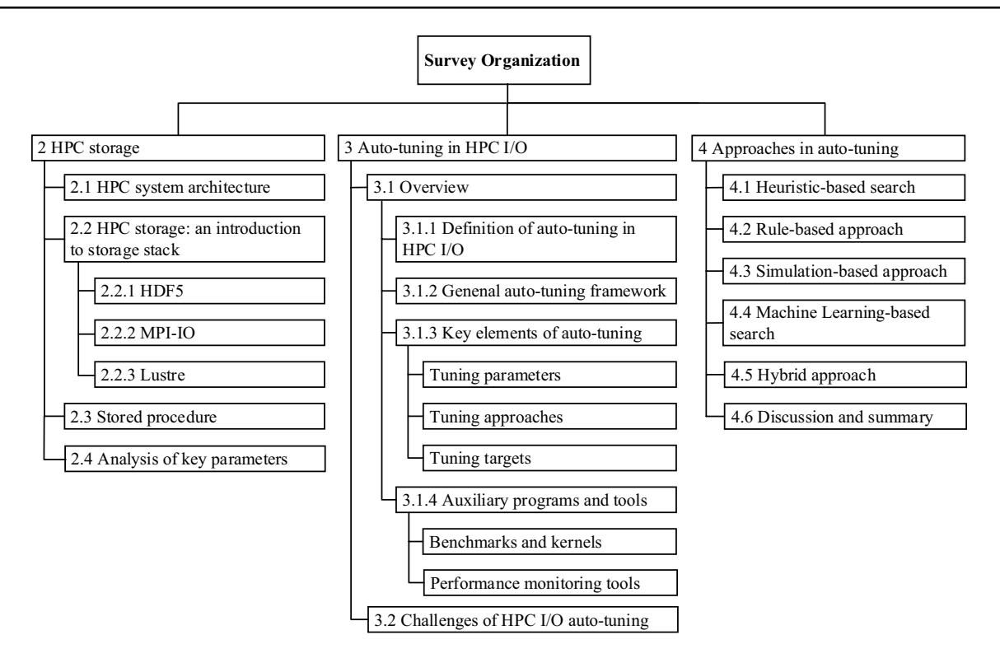
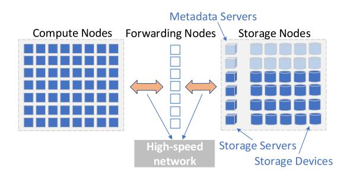
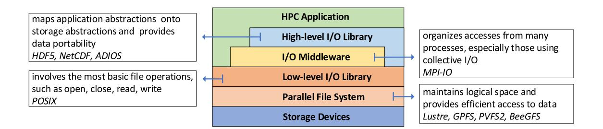
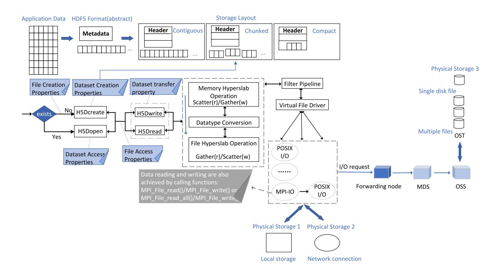
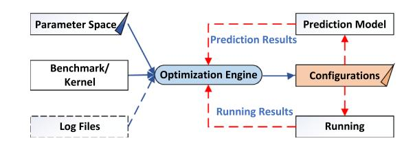

#### **REGULAR PAPER**

# **Auto‑tuning for HPC storage stack: an optimization perspective**

**Zhangyu Liu[1](http://orcid.org/0000-0002-2655-1500) · Jinqiu Wang1 · Huijun Wu2 · Qingzhen Ma3 · Lin Peng2 · Zhanyong Tang1**

Received: 26 June 2024 / Accepted: 30 September 2024 / Published online: 13 December 2024 © The Author(s) 2024

#### **Abstract**

Storage stack layers in high-performance computing (HPC) systems ofer many tunable parameters controlling I/O behaviors and underlying fle system settings. The setting of these parameters plays a decisive role in I/O performance. Nevertheless, the increasing complexity of data operations and storage architectures makes identifying a set of well-performing confgurations a challenge. Auto-tuning is a promising technology. This paper presents a comprehensive survey on "Auto-tuning in HPC I/O". We expound a general storage structure based on a general storage stack and critical elements of auto-tuning, and categorize related studies according to the way of tuning. On the basis of the order in which the approaches were applied, we introduce the specifc works of each approach in detail, and summarize and compare the pros and cons of these approaches. Through a comprehensive and in-depth study of existing research, we elaborate on the development history of auto-tuning technology in HPC I/O, analyze the current situation, and provide guidance for optimization technology in the future.

**Keywords** High performance computing · Storage system · Parallel I/O · Auto-tuning

# **1 Introduction**

With changing needs of technological advancements and emerging needs for AI, industrial loT, etc., the volume and characteristics of data processed by HPC systems are constantly expanding and changing. Workloads have shifted from traditional numerical simulations to ML applications for learning, inference, and decision-making at fner granularities and more massive scales. Moreover, the amount of data generated by various applications is ever-increasing, routinely performing PetaByte(PB) (Tseng et al. [2021\)](#page-22-0) in I/O. Rapid data growth in size and complexity triggers a higher demand for HPC systems' computing power and I/O capability. The 63*rd* edition of Global Top 500

\* Zhangyu Liu liuzhangyu@stumail.nwu.edu.cn

\* Huijun Wu wuhuijun@nudt.edu.cn

\* Zhanyong Tang zytang@nwu.edu.cn

- 1 School of Information Science and Technology, Northwest University, Xi'an, China
- 2 College of Computer, National University of Defense Technology, Changsha, China
- 3 National Supercomputer Center in Tianjin, Tianjin, China

Supercomputer Rankings published in June 2024 shows that Frontier system and Aurora system break through the exascale level. Compared with the frst ranking in 1993, HPC system's computing power has been dramatically improved.

Diferent from computing power, with the continuous improvement of hardware equipment and system architecture, I/O capability has not been improved at the same speed because requirements for efcient execution of I/O requests have not been fully considered in the development of fle and storage systems, resulting in a historical gap between computing and I/O. Several factors afect the I/O performance of HPC applications, including slow hardware devices, ever-growing scale and complexity of the system architecture, complex shared storage systems, parallel applications with high I/O requirements, network performance and other uncertainties, and limited understanding of humans. These factors have caused a series of problems, such as more complex I/O paths from storage media to applications, increased resource contention, load imbalance, and I/O interference, leading to high variability in performance. They work together, making it a challenge to obtain good I/O performance. Slow I/O may become the main factor restricting the development of high performance, especially in the exascale system (Han et al. [2016\)](#page-21-0). Among various optimization potentials, I/O is one of the most needed parts (Bağbaba and Wang [2021](#page-20-0)).

To clarify the optimization direction that researchers have concentrated on in the HPC I/O feld recently, we have looked up works of top conferences and publications in the past ten years. We found feld workers focus on various aspects when optimizing I/O performance from the software level, such as studying I/O workload characterization and benchmarking for HPC applications to understand performance bottlenecks better (Bez et al. [2022](#page-20-1); Patel et al. [2019a](#page-22-1), [2020;](#page-22-2) Devarajan and Mohror [2022](#page-20-2); Patel et al. [2019b\)](#page-22-3), performance modeling and analysis (Kim et al. [2020](#page-21-1); Isakov et al. [2020b\)](#page-21-2), adjusting strategies to fully use hardware resources (Logan et al. [2022](#page-21-3); Kang et al. [2020](#page-21-4); Lv et al. [2022;](#page-21-5) Dorier et al. [2022\)](#page-20-3). There are many studies on performance improvement by adjusting strategies, and some of them are based on confgurable parameters and algorithms provided by HPC storage systems. Improper setting of parameters adversely afects overall performance and stability of the system. So choosing a good set of confgurations becomes the key to achieving high performance. I/O performance relates to many parameters. Many are distributed in storage stack layers and control various stages of I/O, from chunk size in high-level libraries to stripe setting on storage devices. Notably, the optimal value is fexible and varies with multiple factors, such as the system, application, and scale. So there is no set of absolutely excellent confgurations. When running an application, developers need to fnd the optimal confguration according to the current situation. Consequently, it is necessary to fnd a method to eliminate diferences between systems and applications and quickly fnd suitable confgurations in a vast search space. Auto-tuning algorithms have emerged as a promising solution. It can automatically fnd the confguration suitable for the current scene without human involvement and any assumption on system behaviors.

**Contribution.** This survey provides an extensive overview of HPC I/O auto-tuning works. First, it introduces the I/O process on HPC system in combination with the storage stack and the general auto-tuning process. Then, it focuses on tuning algorithms and classifes, narrates, and summarizes them. Overall, the comprehensive nature of this survey serves as a technical reference for selecting existing tuning strategies and simultaneously helps to motivate new autotuning techniques. The key contributions of this survey are:

- We detail key elements in the storage stack and the autotuning process in HPC I/O.
- We research existing works, summarize key features of tuning approaches, and compare the pros and cons.
- We analyze the development status and limiting factors of auto-tuning technology in HPC I/O, and describe the future development direction in combination with the development of tuning algorithms.

**Related work.** Storage systems and their performance optimization have been the topic of several surveys. Lüttgau et al. ([2018\)](#page-21-6) introduced several widely used highperformance storage and fle systems and compared their characteristics. Boito et al. ([2018](#page-20-4)) discussed I/O optimization methods related to data access. Liu et al. [\(2022\)](#page-21-7) summarized and compared AI algorithms applied throughout the entire storage system. Neuwirth and Paul ([2021\)](#page-22-4) summarized emerging workloads, and introduced every stage of large-scale I/O performance evaluations, as well as strategies and tools used in each stage. However, the challenge of automatically adjusting I/O parameters is not the focus of these papers. Herodotou et al. [\(2020\)](#page-21-8) proposed the classifcation of parameter auto-tuning techniques for big data analysis systems. Nevertheless, there are many diferences in architectures between big data processing systems and HPC storage systems. Noticeably, no corresponding survey exists in HPC I/O auto-tuning. Therefore, we hope to analyze and summarize current studies to help researchers understand auto-tuning in HPC I/O more quickly and comprehensively. We have searched conferences and journals related to storage and high-performance computing over the past decade for research related to HPC I/O auto-tuning. Moreover, related works of these studies have been further searched, dating back to the earliest work published in 1998.

**Organization.** The remainder of this survey is structured as follows: Section [2](#page-1-0) introduces HPC storage architecture. A comprehensive introduction to auto-tuning in HPC I/O is given in Sect. [3](#page-6-0). The most critical part, tuning approaches, is described in Sect. [4.](#page-9-0) While introducing specifc works, key settings of each approach are summarized in tables. Finally, Sect. [5](#page-19-0) concludes this survey by summarizing the development and application of auto-tuning technology in HPC I/O and describing the possible direction for future research. The organizational structure of the survey is shown in Fig. [1](#page-2-0).

# **2 HPC storage**

HPC is the ability to process data and perform complex calculations at high speeds (Raj et al. [2020](#page-22-5)). It utilizes the most advanced computing technology to build parallel computers to solve complex problems that ordinary computers cannot solve. One of the best-known HPC solutions is the supercomputer. A supercomputer contains thousands of compute nodes that work together to complete one or more tasks, called parallel processing. In addition, it also contains forwarding nodes and storage nodes to read and write data. Thus complex I/O path is formed. This section describes the storage structure and I/O libraries in detail.

**Fig. 1** Organization of the survey

**Fig. 2** Overall architecture of HPC system

# **2.1 HPC system architecture**

A general HPC system mainly includes compute nodes, forwarding nodes, storage nodes, and high-speed networks. Figure [2](#page-2-1) presents an overview of a typical HPC cluster backed by a parallel fle system. Compute nodes are responsible for executing processing functions. Forwarding nodes aggregate I/O requests from various nodes, avoiding direct access to storage nodes to avoid too much workload. Storage nodes are responsible for storing fles and their metadata. These nodes communicate with each other based on high-speed networks.

#### **Fig. 3** Typical HPC storage stack

### **2.2 HPC storage: an introduction to storage stack**

To control behaviors of data transmission and storage, HPC systems provide a multi-layered software stack. Figure [3](#page-2-2) demonstrates a typical HPC storage stack (He et al. [2019](#page-21-9); Wang [2017](#page-22-6)), including I/O libraries, parallel fle systems, and storage devices. I/O libraries cover high-level I/O libraries (e.g., HDF5 (Folk et al. [2011](#page-21-10)), netCDF (Li et al. [2003](#page-21-11)) and ADIOS (Lofstead et al. [2008\)](#page-21-12)), middleware layer(e.g., MPI-I/O (Thakur et al. [1999\)](#page-22-7)), and low-level I/O libraries(e.g., POSIX).

Typical data access usually requires multiple I/O libraries, which generally goes: HPC application—high-level I/O library (optional)—I/O middleware (optional)—low-level I/O library—parallel fle system—specifc storage devices. Therefore, data access efciency is determined by layers passed through. Each layer provides many tunable parameters, which not only does it afect its own layer, but also interact closely with other layers, thus afecting the overall I/O performance. There are multiple library implementations at each layer, and in existing tuning works, the most selected ones are HDF5, MPI-IO, and Lustre. So we introduce in detail tuning parameters provided by the three layers to understand what functions are implemented by these parameters.

#### **2.2.1 HDF5**

Hierarchical Data Format version 5 (HDF5) (hdfgroup [2023\)](#page-21-13) is a general data model, a portable fle format, and a crossplatform software library. As an extensible data model, it supports heterogeneous data of unlimited size, and supports complex data relationships and dependencies through its grouping and linking mechanisms, giving great fexibility for big data. It enables users to focus on high-level concepts of relationships between data objects rather than descending into details of the specifc layout of every byte in the data fle. As a portable fle format, it is a self-describing fle format, with no vendor lock-in, and all data and metadata can be passed along in one fle. As a cross-platform software library, it implements a high-level API with C, C++, Fortran 90, and Java interfaces that can be cross-platform. HDF5 provides highly fexible storage and I/O functions through its virtual fle layer, which provides standard (POSIX), parallel (MPI-IO), and network I/O fle drivers and also employs various compression, scalability, and chunking strategies to improve access, management, and storage efciency. Meanwhile, it owns a rich set of integrated performance features allowing access time and storage space optimizations in high-performance I/O, e.g., partial I/O.

HDF5 is a high-level I/O library scheduled by high-level languages such as C/C++ and Java, so it organizes data and executes the high-level fle operations frst. It is necessary to determine fle layout, alignment, etc., to determine how data is stored in devices. HDF5 provides some parameters to help users customize, which form the parameter space of HDF5 (hdfgroup [2022\)](#page-21-14), including dataset space structure, alignment, storage layout, serial or parallel read and write, etc., described in more detail in hdfgroup [\(2019a\)](#page-21-15), hdfgroup ([2019b\)](#page-21-16), hdfgroup ([2019c](#page-21-17)). These parameters mainly determine two aspects: the form in which data is stored (such as continuous or chunked) and the method in which data is transmitted (such as serial or parallel). It can be said that HDF5 builds a bridge between users and the underlying storage: it provides users with a fexible and fast way to perform fle operations without paying attention to specifc implementations, and it conveys specifc requirements to lowerlevel libraries and lets them implement.

#### **2.2.2 MPI‑IO**

There is an I/O middleware between high-level and lowlevel libraries, MPI-IO (Message Passing Interface Forum [2021](#page-22-8)), which provides an interface for parallel I/O. MPI is a communication protocol for parallel computing, and MPI-IO is a parallel I/O library built on top of MPI. It can be directly called by applications and also be used as a lower implementation of high-level I/O libraries such as HDF5. MPI-IO contains two interfaces: independent I/O and collective I/O. In independent I/O, each process independently processes I/O. All processes in collective I/O perform I/O in a specifc order. MPI-IO supports partitioning fle data among processes and a collective interface to transfer data between process memories and fles.

MPI-IO provides facilities to gain further efciencies via support for asynchronous I/O, stripe accesses, and control over physical fle layout on storage devices. Tunable parameters provided by MPI-IO are intended to control access patterns and data layout on I/O devices, all described in subsection 14.2.8 in Message Passing Interface Forum [\(2021](#page-22-8)). Furthermore, One of the most common implementations of MPI-IO is ROMIO. It provides two optimization techniques: data sieving for noncontiguous requests from one process and collective I/O (two-phase I/O) for noncontiguous requests from multiple processes (Thakur et al. [1999](#page-22-7)). ROMIO also provides settable hints to control behaviors in data sieving and collective I/O.

#### **2.2.3 Lustre**

Lustre lustre [\(2021\)](#page-21-18) is an object-based distributed storage system. It mainly consists of Metadata Servers (MDS), Metadata Targets (MDT), Object Storage Servers (OSS), Object Storage Targets (OST), and Lustre clients, responsible for managing and processing metadata and raw data. Lustre uses an improved version of the ext4 journaling fle system, called ldiskfs, as the backend storage for MDTs and OSTs. As the most widely used parallel fle system, Lustre provides many features, including easily scalable capacity and performance, support for high-performance heterogeneous networks, controlled fle layout, and examination of performance and tuning, etc.

Lustre provides many confgurable parameters to help users determine the actual confguration according to their needs (lustre [2021\)](#page-21-18), which introduces these parameters in subchapter 10.2 and chapter 39 in (lustre [2021\)](#page-21-18). These parameters are mainly divided into two categories: stripe setting, which determines how data is distributed on storage devices, and RPC-related setting, which determines the interaction between clients and servers.

### **2.3 Stored procedure**

Same as local computers, I/O requests in HPC are also issued through function calls. Similar to the stdio library in C language, which provides many interfaces to help users realize input and output, I/O libraries in storage stack also play the same role, while they provide more methods and properties to control data transmission and storage, such as chunked data, alignment, etc. Figure [4](#page-4-0) describes the I/O process taking HDF5 as an example.

An I/O request is issued on a compute node. I/O process can be divided into three stages.

The frst stage is creating and accessing fles and datasets, where HDF5 provides many attributes to control the storage and transmission of data. File creation properties control aspects of fle creation, such as setting a fle space management strategy or creating a user block. They cannot be changed once a fle has been created. Dataset creation properties control aspects of dataset creation such as fll time, storage layout, compression methods, optional flters, etc. They cannot be changed once a dataset has been created. Dataset access properties adjust the chunk cache size, provide prefxes for external content and virtual dataset fle paths, control fush behavior, etc. File access properties control aspects of fle I/O and structure, such as data alignment, data sieve bufer size, etc. Dataset transfer properties customize certain aspects of reading and writing datasets, such as transformations, MPI-IO I/O mode, error detection, etc. In this process, many parameter values that have an important impact on performance are determined.

The second stage is data transfer between the memory and the dataset's raw data array, where HDF5 passes the data through a series of processing steps called the HDF5 data pipeline. The data pipeline performs operations on data, such as scatter-gather, datatype conversion, and flters. When the memory dataspace selection is other than the whole dataspace, the memory hyperslab stage scatters/ gathers data elements between the application memory (described by the selection) and a contiguous memory bufer for the pipeline. When the memory data type differs from the fle data type, the datatype conversion converts each data element. For example, if the data is written from 32-bit big-endian storage, and the fle data type is 32-bit little-endian storage, the datatype conversion will swap bytes for each element. Filters set during the dataset creation phase will come into play here. The standard library includes flters for implementing compression, data

**Fig. 4** The complete I/O process taking HDF5 as an example

shufing, and error detection code. Additional user-defned flters are also available.

The third stage is to call fle drivers to perform I/O to fles. File drivers map simple abstract HDF5 fles to specifc access methods. The HDF5 virtual fle layer performs fle driver I/O, which implements standard interfaces to alternative I/O methods, including in-memory fles, single serial fle I/O, multiple fle I/O, and parallel I/O. The fle driver interface writes and reads chunked data, and each driver module implements the interface using a diferent I/O mechanism. It should be noted that the I/O mechanism is separate from pipe handling: pipe and flter operations are the same no matter which data access mechanism is used. If the physical storage of data is located on a compute node or in network storage, then the data can be read and written directly in the corresponding place. If data is to be read and written from the fle system, requests need to be sent over a high-speed network.

I/O requests sent by compute nodes are transmitted to forwarding nodes through a high-speed network. These nodes can aggregate requests from diferent compute nodes and then send aggregated requests to fle systems. It reduces the number of requests and prevents direct access from bringing too much workload to fle systems.

In parallel fle systems, I/O requests will frst reach the MDS to obtain the fle's metadata, including information such as fle attributes, directory structure, and data layout details. Once the client has the necessary metadata, it can directly interact with OSSes and OSTs responsible for storing specifc data chunks of fles and perform read or write operations on the fle data. OSSes translate these requests into operations on corresponding OSTs, ensuring data access and retrieval from appropriate OSTs according to the fle's stripe layout.

### **2.4 Analysis of key parameters**

Parameters are created to solve specifc problems, especially some critical ones, and they largely determine performance. In this subsection, we will elaborate on some critical parameters around what problems they are created to solve and how they afect performance. This will provide a clearer understanding of why tuning is necessary and help understand how to do it.

**HDF5: align(thresh,bndry)** The HDF5 library typically packs data as tightly as possible in HDF5 fles rather than aligning data to a specifc byte boundary. However, most parallel fle systems are tuned to perform best when data accesses fall on a specifc chunk boundary. It avoids multiple read and write cycles to the data. Therefore, HDF5 added parameters to align all objects in a fle that exceed a threshold value. This allows chunks of a chunked dataset to be aligned to the block boundaries favored by the fle system.

**HDF5: chunk size** To minimize lock contention in parallel fle systems and maximize fle system throughput, HDF5 sets parameters to select the size of each chunk so that a subset of the dataset accessed by each parallel process maps to exactly one chunk in the fle.

**MPI-IO: collective bufer node** Single-shared-fle may not perform as well as the File-Per-Process due to lock contention. One key strategy for bringing single-shared-fle performance up to the level of the independent access is to employ "collective" optimizations. One such optimization called two-phase I/O or collective bufering assigns a subset of processes to act as "aggregators". Aggregators gather smaller, non-contiguous accesses into a larger, contiguous bufer in the frst phase, and write this bufer to the fle system in the second phase. The parameter, collective bufer node, specifes the number of nodes to be used as aggregators.

**MPI-IO: collective bufer size** In parallel fle systems like Lustre, which use server-side fle range locks, diferent transfer sizes often lead to uneven distribution of accesses and misaligned boundaries relative to locks. Therefore, one of the main benefts of collective bufering is that the bufer size can be set to a multiple of the lock granularity, signifcantly reducing lock contention.

**MPI-IO: striping**\_**factor & striping**\_**unit** In collective optimization, the collective bufering algorithm CB 0, based on the original ROMIO algorithm, divides the I/O workload equally among all aggregators, regardless of physical I/O boundaries or Lustre stripes. This can result in multiple aggregators referencing the same physical I/O blocks or Lustre stripes, or each aggregator having multiple data segments with large gaps between them, making this approach inefcient. The CB 1 algorithm improves the performance of CB 0 by aggregating data into stripe-sized blocks and aligning I/O with stripe boundaries but does not maintain a one-to-one mapping between aggregators and I/O servers over multiple I/O calls. The CB 2 algorithm rapidly replaces CB 1 with a more efcient approach to data aggregation. It implements a Lustre optimization scheme that uses staticcyclic and group cyclic Lustre stripe-aligned methods (Howison et al. [2010](#page-21-19)). To control the distribution of I/O workload among aggregators, the alignment of chunk sizes to stripe boundaries, and the mapping between aggregators and I/O servers, two MPI-IO hints are introduced: striping\_factor and striping\_unit. Striping\_factor sets the Lustre stripe count at fle creation, while striping\_unit sets the Lustre stripe size. Setting collective bufer node prompt to stripe count creates a static circular, one-to-one mapping between the aggregator and OST. Alternatively, setting collective bufer node to a multiple of the stripe count creates a group-loop, many-toone mapping.

**Lustre: stripe count & stripe size** One of the main reasons Lustre can achieve high performance is the ability to stripe data across multiple OSTs. It both provides high bandwidth access for large fles or fles accessed by multiple nodes at once, which a single OST cannot provide, and increases parallelism by accessing multiple OSTs simultaneously. It also provides space for very large fles, solving the problem of a single OST not having enough available space for the entire fle. The parameters, stripe count and stripe size, provide interfaces that allow one to specify the number of OSTs to be used, as well as the size of the stripe.

**Summary** The storage stack and representative tunable parameters provided by typical implements in each layer are described above. They show how parameter values in such a storage structure can afect the transfer and storage of data and thus have a signifcant impact on performance. This is why choosing an appropriate set of values is particularly important.

# **3 Auto‑tuning in HPC I/O**

### **3.1 Overview**

This section will comprehensively introduce auto-tuning in HPC I/O. First, we defne auto-tuning in HPC I/O to understand what it is. Then its general framework is introduced, which includes its execution process. Key elements in the tuning process are then introduced, including parameters, approaches, and targets. Finally, we give a brief on auxiliary programs and tools used during tuning.

#### **3.1.1 Defnition of auto‑tuning in HPC I/O**

Auto-tuning refers to a methodology with models that infer one or more objectives with minimal or no interaction from users Wilson et al. [\(1994\)](#page-22-9). The purposes of auto-tuning are:

- Crossing the diferences between applications and systems.
- Reducing the attempts to parameters with poor performance.
- Reducing the time and space consumption.
- Requiring no or little manual participation.

Using this technique to tune I/O performance in HPC enables transparently determining and executing an I/O policy without human involvement. In this case, I/O performance is the tuning objective, and I/O policy is a combination of tuning parameters. Auto-tuning process is to fnd the best set of confgurations to achieve the best performance under constraints such as time. The problem can be stated as follows:

$$
\max_{c \in C} P(e, A, c) \tag{1}
$$

$$
s.t. \ t \leq N \tag{2}
$$

Formula [\(1](#page-6-1)) indicates that the objective of the optimization problem is to fnd a confguration c that leads to the optimal performance of application A under a particular operating environment e by exploring the parameter space C. Formula ([2\)](#page-6-2) indicates that the problem has a stringent constraint that it cannot exceed a set threshold N. This threshold can be set in terms of time, the number of tuning iterations, or others.

#### **3.1.2 Genenal auto‑tuning framework**

Figure [5](#page-6-3) shows a general auto-tuning framework. Many elements work together to achieve tuning targets during the process. This subsection will describe how these parts work together to auto-tune.

Firstly, it is necessary to manually determine benchmarks/kernels and parameter space as input to a optimization engine. In addition, log fles can be provided (optional), and the optimization engine can learn historical information from them to generate better initial confgurations. Then the optimization engine utilizes strategies to fnd optimal confgurations in this space. Confgurations produced in each round can be evaluated in two ways. One way is putting them into a prediction model and generating corresponding performance results. Then the optimization engine is adjusted based on prediction results. This way avoids the actual execution of applications and reduces the consumption of space-time resources. It is worth noting that models play a vital role. If the model performs poorly, it may provide wrong information to the optimization engine, thereby misleading the search and generating confgurations with poor performance. Another way is to run applications with confgurations on actual systems and directly adjust the optimization engine with actual performance results. This way increases the optimization time as the training scale increases, which may result in a long optimization time of several hours, which is unacceptable for HPC systems. The entire tuning process is terminated until the predetermined time or round is reached.

#### **3.1.3 Key elements of auto‑tuning**

When considering optimization, three most important elements are tunable parameters, tuning algorithms or models,

**Fig. 5** A general auto-tuning framework

and performance targets. We will describe the specifcs of these elements in this part.

### **(1) Tuning parameters**

As an example, we have introduced tunable parameters provided by three main libraries in Sect. [2.2.](#page-3-0) This subsection focuses on parameters tuned by existing tuning works. These parameters come from high-level I/O libraries Panda, HDF5, PIDX, IO-middleware MPI-IO, and parallel fle systems Lustre, as shown in Table [1](#page-7-0). Among all these parameters, the most selected are stripe count, stripe size, and cb\_nds.

It should be noted that parameters with the same meaning may use diferent names in diferent systems. For example, cb\_nds is used on Hopper and Stampede platforms to set the number of aggregators for collective bufering, while the parameter that implements the same function is bgl-nodes-Pset on Intrepid. Here we use the most widely used parameter name to represent all parameters with the same meaning.

### **(2) Tuning approaches**

Due to various challenges and scenarios addressed, diferent strategies or approaches are proposed. We classify these approaches into following fve categories:

- **Heuristic-based Search** approaches utilize heuristic algorithms to search in a parameter space. This method usually requires no model but relies on search strategies of search algorithms to fnd better confgurations.
- **Rule-based** approaches tune parameters based on internal working mechanism of a system or experience of human experts. They usually require no models or log information and are easy to implement quickly.
- **Simulation-based** approaches utilizes running data to construct a performance model and traverses the search

space by model predictions instead of actual runs, signifcantly reducing tuning time.

- **Machine Learning-based Search** approa-ches continuously improve tuning strategies through trial-and-error.
- **Hybrid** approaches combine diferent algorithms to complement each other, or test and compare multiple algorithms and then choose one based on their strengths and weaknesses.

## **(3) Tuning targets**

The purpose of auto-tuning is to improve resource utilization by adjusting policies to achieve higher goals, such as improving I/O bandwidth or shortening I/O time. Furthermore, some studies not only focus on program performance but also pay attention to the performance of tuning algorithms, that is, to ensure consistency and stability of performance results.

Tuning targets related to I/O performance include the following:

- **I/O bandwidth** is calculated as the ratio of the amount of data written into a fle to the time taken for writing the data. In the measured I/O time, opening, writing, and closing the fle overhead is included.
- **Throughput** represents the total data transfers per second, quantifying the rate of successfully delivered messages.
- **IOPS** measures the number of I/O operations per second.
- **Write time** is defned to be the time elapsed from calling a write operation in a higher-level library until the function is done, consisting of all the communication and I/O time needed for this operation.

| Layer  | Name                           | Parameter Description                                                               |
|--------|--------------------------------|-------------------------------------------------------------------------------------|
| HDF5   | Align(thresh,bndry)            | Files with sizes more than a threshold value address a multiple of a boundary value |
|        | Chunk size                     | The size of the chunk for independent storage                                       |
| PIDX   | Set of nodes after restructure | The set of nodes after restructure                                                  |
|        | Number of aggregators          | Number of aggregators at the end of aggregation                                     |
|        | Aggregation factor             | Provides the fexibility to use all available cores as aggregators                   |
|        | File counts                    | Number of fles in the fle IO phase                                                  |
| Panda  | Array disk layout              | The layout used to store arrays on disk                                             |
|        | Disk unit size                 | The size of disk units(also the bufer size on each I/O node)                        |
|        | Communication strategy         | Strategies used to move data between clients and servers                            |
| MPI-IO | cb_nds                         | The number of aggregators for collective bufering                                   |
|        | cb_buf_size                    | The size of the bufer on an aggregator for collective I/O                           |
|        | romio_cb_read                  | Enable or disable the collective bufering optimization for reading operations       |
|        | romio_cb_write                 | Enable or disable the collective bufering optimization for writing operations       |
| Lustre | Stripe count                   | The number of OSTs over which a fle is distributed                                  |
|        | Stripe size                    | The number of bytes written to an OST before cycling to the next OST or stripe      |

**Table 1** Tuning parameters in storage stack

The targets related to the performance of algorithms include:

- **Capability** at fnding the true optimal value within a fnite budget, by measuring their success.
- **Speed** at which they can fnd the true optimal value.
- **Distance** between the returned optimum and the true one.
- **Consistency** of the function value at each step, by respectively averaging the distance between the current ftness value and the true optimum value and summing up the losses due to regressions.
- **Time** spent by the algorithm to terminate its iterations budget.

#### **3.1.4 Auxiliary programs and tools**

There are some auxiliary programs or tools to help implement the auto-tuning process, such as benchmarks/kernels in place of actual applications, and performance monitoring tools providing statistical data to refect performance results.

#### **(1) Benchmarks and Kernels**

In tuning process, instead of using real applications for tuning tests, researchers often use I/O kernels or benchmarks. The reason is that real applications are complex and do not expose their I/O parameters, making it difcult to efectively collect the data. Meanwhile, the calculation part that is not concerned about will consume time, resulting in extended tuning time in set iterations or reduced iterations within the set time.

I/O kernels are the I/O part extracted from actual applications, which are simpler applications that issue the same I/O operations as full-scale HPC applications (Behzad et al. [2015a\)](#page-20-5). Table [2](#page-8-0) lists some commonly used kernels.

Benchmarks are programs generated for testing I/O performance. The most representative benchmark is *InterleavedOrRandom*(IOR) (Shan et al. [2008](#page-22-10); LLNL [2015](#page-21-20)). It provides a fexible measure of I/O performance, exercising confgurations across diferent storage stack layers. It has been shown to reproduce representative parallel I/O access patterns accurately and can refect most HPC I/O requirements in broader workloads. Real applications can be efectively replaced by it. In addition, there are some other benchmarks, such as FIO (J. Axboe [1998\)](#page-20-6) creating a separate fle for each process, the OSU MPI benchmark (OMB) ([2023\)](#page-22-11) containing all collective operations, and Filebench ([FSL](#page-22-12)). More detailed information is listed in Table [3.](#page-8-1)

#### **(2) Performance monitoring tools**

The challenge of optimizing parallel I/O is not only to adjust parameters but also to evaluate confgurations reasonably. So there is a need for tools that can capture/analyze I/O activities and guide optimization. They need to provide I/O usage information and performance records to judge the current parameter confguration, determine whether to continue tuning and guide the next tuning step. In particular, some feedback-based tuning algorithms strictly rely on performance results obtained from monitoring. To this end, some analysis/tracking tools and frameworks have been developed, which can be simply classifed according to monitoring objects, including application-oriented tools, back-end-oriented tools, and multi-layer tools (Yang et al. [2023](#page-23-0)). Application-oriented tools provide means to extract and analyze I/O behaviors of applications and tune I/O at the

| Table 2 Overview of Common Kernels | Kernel     | Science Area             | File Format   | Propose             |
|---------------------------------------|------------|--------------------------|---------------|---------------------|
|                                       | VPIC-IO    | Plasma particle codes    | HDF5          | Checkpoint/Analysis |
|                                       | GCRM-IO    | Global atmospheric model | HDF5          | Analysis            |
|                                       | FLASH-IO   | Atmospheric              | HDF5          | Checkpoint/Analysis |
|                                       | FLASH3-I/O | Astrophysics             | PnetCDF, HDF5 | Checkpoint/Analysis |
|                                       | VORPAL-I/O | Fusion                   | HDF5          | Checkpoint/Analysis |
|                                       | Chombo     | Various                  | HDF5          | Checkpoint/Analysis |
|                                       | MADbench2  | MADspec                  | MPI-IO        | Analysis            |

|            | Table 3 Overview of Common |  |
|------------|----------------------------|--|
| benchmarks |                            |  |

| Benchmark   | Layers              | Features                         | Parallel | References    |
|-------------|---------------------|----------------------------------|----------|---------------|
| IOR         | POSIX, MPI-IO, HDF5 | Data, metadata                   | MPI      | LLNL (2015)   |
| NPB         | MPI-IO              | Metadata, data                   | MPI      | NPB (2023)    |
| FIO         | POSIX               | Metadata, data, pro grammable | Pthreads | FIO (2023)    |
| MPI-Tile-IO | POSIX, MPI-IO       | Data                             | MPI      | MIT (2020)    |
| IOzone      | POSIX               | Data, analyzable                 | Pthreads | IOzone (2016) |
| MDTest      | POSIX,MPI-IO        | Metadata                         | MPI      | LLNL (2017)   |

application level according to I/O activities. For example, there are many tools including Darshan (Carns et al. [2009](#page-20-7)), HPCT-IO (Seelam et al. [2008\)](#page-22-15), RIOT I/O (Wright et al. [2013\)](#page-22-16), TRACE (Mesnier [2007](#page-22-17)), Omnisc'IO (Dorier et al. [2014\)](#page-21-24), ScalableIOTrace (Vijayakumar et al. [2009](#page-22-18)), IPM (Wright et al. [2009](#page-22-19)) and IOPin (Kim et al. [2012\)](#page-21-25). Back-endoriented tools utilize existing server-side monitoring and log data (collected with near-zero overhead), and can provide additional I/O characteristics data to developers. Such tools including LustreDU (Carlyle et al. [2012\)](#page-20-8), AID (Liu et al. [2016b\)](#page-21-26), IOSI (Liu et al. [2014](#page-21-27)) and LIOProf (Xu et al. [2016](#page-23-1)). Multi-layer tools take into account the monitoring of various types of nodes, and aim to provide information from both the client and server. These tools include EZIOTracer (Naas et al. [2021\)](#page-22-20), GUIDE (Vazhkudai et al. [2017](#page-22-21)) and Logaider (Di et al. [2017](#page-20-9)). More comprehensive knowledge can be obtained through (Kunkel et al. [2018;](#page-21-28) Gupta et al. [2021](#page-21-29)).

The most widely used tool is Darshan (Carns et al. [2009](#page-20-7)), which can transparently capture I/O access information of applications. The information includes the number of POSIX operations, the I/O access mode, and the timestamp of events, such as opening or closing the fle. It can also store I/O information of jobs, such as the number of bytes written and the time spent in an I/O operation. Darshan focuses on a single application and stores detailed I/O information about each application, so it is a vital tool for users to analyze I/O behaviors of applications.

### **3.2 Challenges of HPC I/O auto‑tuning**

Auto-tuning technology is a promising but challenging method to optimize I/O performance. Major challenges include:

**(1) The complexity of the storage system.** In order to serve the increasing scale and complexity of applications, modern supercomputers have increasingly deep storage systems, resulting in long I/O paths from storage media to applications, as well as complex software stacks and hardware confgurations. In addition, there is complex interdependence between I/O middleware and hardware (Yang et al. [2023](#page-23-0); Behzad et al. [2013b](#page-20-10), [2014\)](#page-20-11).

**(2) Parallelism and variability of applications.** On the one hand, many applications often run concurrently, competing for I/O resources and infuencing each other. On the other hand, constantly changing I/O workloads from concurrent applications also complicate the problem of parameterbased I/O performance optimization (He et al. [2019](#page-21-9)).

**(3) Limited understanding.** As the storage architecture becomes increasingly complex, adjustable parameters may lead to complex performance behaviors. Therefore, it is difcult to make a good choice only depending on the administrators' experience. Furthermore, HPC application developers are usually experts in their scientifc felds. They do not have time or expertise to explore the complexity of I/O systems, nor can they expect to know the impact of each parameter. Therefore, they usually resort to using system defaults, often leading to poor performance. Sometimes, they may even reduce I/O performance by mistake (Wang [2017](#page-22-6)). Generally, developers and system administrators fnd that despite their best eforts, their HPC jobs only use a small part of the promised I/O throughput (Behzad et al. [2013b,](#page-20-10) [2014](#page-20-11); Zadok et al. [2015;](#page-23-2) Isakov et al. [2020a;](#page-21-30) Bağbaba and Wang [2021](#page-20-0); Yang et al. [2022](#page-23-3)).

**(4) Search space.** The frst problem is that the exploration space may be large because of large number of crosslayer adjustable parameters and wide range of their values. The second problem is that the space could be more sparse. Most parameter combinations will lead to poor performance. The third issue is the sensitivity of parameters to workload and deployed environment. Lastly, the interaction between parameters from diferent layers can also be complex, and it is difcult to model by using simple regression methods. Furthermore, the best settings in a layer do not necessarily lead to the best performance across layers. Therefore, existing researches often only focus on parameters of specifc layers (Paul et al. [2017](#page-22-22); Behzad et al. [2013b;](#page-20-10) Zadok et al. [2015](#page-23-2)).

**(5) Optimize features.** The importance of parameters varies: some parameters are important for optimization; some are highly related to others, and such dependencies must be found; others are insignifcant, and it is a waste to try. The performance of parameters depends largely on the combination of hardware, software, and workload. Even small changes to a part of the environment will make the system deviate from its optimal performance. This problem leads to a complex, large, multidimensional search space and many sub-optimal local maxima (Zadok et al. [2015](#page-23-2)).

These challenges make auto-tuning difcult. Researchers try to solve these problems with various algorithms. Later, we will provide a detailed introduction to these algorithms.

# **4 Approaches in auto‑tuning**

According to the way of parameter tuning, rather than the algorithms, existing tuning works are divided into fve categories. The diference between ways and algorithms is that a way can be implemented by various algorithms, such as simulation-based approaches can be implemented through various modeling algorithms. Below is a brief description of fve approaches. Rule-based approach is based on prior knowledge of internal mechanism of systems and analysis of experimental results, and values of tuning parameters are obtained by establishing equations with some parameters whose values can be obtained in advance. Simulationbased approach uses prediction models to predict all confgurations in a given parameter space and then selects top k confgurations based on predictions for actual runs. The results of runs are used to guide the model's improvement further. The frst two approaches focus on analysis and predictions and use no strategies to search for confgurations. Heuristic-based search approach uses search algorithms to search in parameter space. It focuses on using characteristics of the algorithm itself to guide the search. Machine Learning-based search approach aims to gradually approach the optimal exploration through a trial-and-error strategy. Hybrid approach uses two or more algorithms above. One way is that algorithms work together to achieve tuning, each doing part of the work. The purpose is to combine advantages of diferent algorithms. Another is that each algorithm completes the tuning task independently to compare tuning results and speed. We will introduce in chronological order the application of each algorithm in the feld of HPC I/O tuning.

### **4.1 Heuristic‑based search approach**

In existing works, applied algorithms are mainly Genetic Algorithm(GA), Simulated Annealing(SA), and Bayesian Optimization(BO). In addition, there are A\* Algorithm and

**Table 4** Optimizing Settings for Heuristic-based Search Algorithm

works involving multiple algorithms. Table [4](#page-10-0) describes key information of existing works.

GA is among the two earliest algorithms used for HPI I/O auto-tuning. Chen et al. ([1998b\)](#page-20-12) frst used it to optimize scientifc applications performing collective I/O on multidimensional arrays. They used application profling and platform microbenchmarking techniques to extract I/O workload and platform information. The optimizer digested the information and generated high-quality parallel I/O parameter settings for the given I/O request sequence. The optimizer mainly consisted of two components: the performance model, built in Chen et al. ([1996](#page-20-13)), to predict I/O performance for diferent parameter settings, and the optimization algorithm, using GA in this paper, to identify optimal parameter settings based on model-predicted I/O costs. The optimization time was short because predicted results were used instead of actual running results. However, optimization cost increased with the number of compute and I/O nodes. They had designed a strategy to avoid repeated calculations on diferent nodes as much as possible. However, this strategy had not been implemented in this optimizer version.

Diferent from Chen et al. [\(1998b](#page-20-12)), combining performance prediction models to optimize Panda library that is not in use now, Behzad et al. [\(2013a\)](#page-20-14) focused on optimizing

| Author                                 | Algorithm           | Prediction       | Parameters                                                                                                                                                                                               |
|----------------------------------------|---------------------|------------------|----------------------------------------------------------------------------------------------------------------------------------------------------------------------------------------------------------|
| Chen et al. (1998b)                    | GA                  | Analytical model | Disk layout,disk unit size                                                                                                                                                                               |
| Behzad et al. (2013a)                  | GA                  | /                | Alignment(thrsh,bndry),cb bufer size/stripe size,cb nodes,strip count                                                                                                                                 |
| Behzad et al. (2013b)                  | GA                  | /                | AlignmenT(thresh,bndry),cb bufer size/stripe size,cb nodes,strip count,IBM_largeblock_io,bglockless,chunk_size                                                                                        |
| Bağbaba and Wang (2021)                | GA                  | /                | Number of core,number of bytes,number of aggregators,striping count,striping size,collective I/O,I/O pattern                                                                                       |
| Chen et al. (1998a)                    | Ruled-based + ASA   | Analytical model | Disk layout,disk unit size                                                                                                                                                                               |
| Chen and Winslett (1998)               | ASA                 | Analytical model | I/O bufer size,disk layout,communication strategy                                                                                                                                                        |
| Chen and Winslett (2000)               | Ruled-based + ASA   | Analytical model | Disk layout,disk unit size,communication strategy                                                                                                                                                        |
| Agarwal et al. (2019)                  | TPE                 | XGBoost          | Romio ds read,romio ds write,romio cb read,romio cb write,cb bufer size,cb nodes,stripe count,stripe size                                                                                             |
| Agarwal et al. (2021)                  | TPE                 | XGBoost          | Romio ds read,romio ds write,romio cb read,romio cb write,cb bufer size,cb nodes,stripe count,stripe size                                                                                             |
| Wanek and Schikuta (1999)              | A⋆ algorithm        | /                | /                                                                                                                                                                                                        |
| You et al. (2011a), You et al. (2011b) | Multiple heuristics | Math model       | Stripe count,stripe size,I/O transfer size,number of I/O pro cesses                                                                                                                                   |
| Vincent et al. (2018)                  | NM,PSO,CMA-ES       | BRR,SVR,GPR      | Metadata                                                                                                                                                                                                 |
| Robert et al. (2019)                   | SM,SA,GA            | /                | /                                                                                                                                                                                                        |
| Robert et al. (2020)                   | SM,SA,GA            | /                | Cluster threshold,binsize,sequence length,prefetch size                                                                                                                                                  |
| Robert et al. (2021a)                  | SM,SA,GA            | /                | Cluster threshold,binsize,sequence length,prefetch size                                                                                                                                                  |
| Robert et al. (2021)                   | SM,SA,GA            |                  | Cluster threshold,binsize,sequence length,prefetch size, number of workers,RDMA Polling Threads,number of RAM destagers,number of fash destagers,RAM and NVME Cache size,RAM and NVME threshold |

HDF5 applications to adjust parameters in HDF5, MPI-IO, and Lustre based on execution. The proposed framework consisted of three main components. H5Evolve used GA to sample parameter space and determined confgurations with good performance. H5Tuner provided transparent parameter injection into parallel I/O calls, which was a shared library preloaded before the native HDF5 library. H5PerfCapture gathered parallel I/O performance statistics and traced HDF5 calls. This framework had excellent prospects in hiding the complexity of I/O stack and providing performance portability.

Based on the work of Behzad et al. ([2013a\)](#page-20-14), which studied the performance at a small scale, Behzad et al. ([2013b\)](#page-20-10) focused on a more thorough analysis under various platforms and scales. This work was based on a real system, reducing the possibility of producing inaccurate performance results compared to You et al. ([2011a\)](#page-23-4), which developed a model in a training phase close to the real system. However, there are still a series of problems to be solved: (1) How to extend results from benchmark to any application. (2) The long time of GA severely limits its applicability, reaching 10 h, 12 h, and 24 h at three concurrencies. (3) No consideration of the runtime workload that is not comparable to the one encountered during the auto-tuning process, which is very likely to be seriously disturbed. In response to above problems, authors put forward a series of solutions and look forward to implementing them in future works.

The same approach is used for the Vulcan platform. Bağbaba and Wang ([2021](#page-20-0)) tuned the parameters in MPI-IO ROMIO library and Lustre parallel fle system. This approach has two modules: IO\_Tuner and IO\_Optimizer. IO\_Optimizer searches suitable confgurations using IO\_ search, a GA model. The model starts with a random initial set and is continuously reftted by generated performance results. Then IO\_Tuner injects parameters from IO\_Optimizer transparently as applications call MPI-IO subroutines. Compared with tuning time of more than ten hours in Behzad et al. ([2013b](#page-20-10)), this work has been reduced to 1 to 4 h. Due to diferences, for example, systems, workloads, and scales, there is no way to compare whose performance is better, but it can be concluded that GA is efective on different platforms.

SA is another algorithm that was frst applied. Using the same tuning framework as Chen et al. [\(1998b](#page-20-12)), Chen et al. [\(1998a](#page-20-15)) added new methods and experiments, published in the same year. A new way was added to obtain I/O workload, summarizing directly by users. A combination of a rulebased approach and SA replaced GA. Rule-based approach was used when optimal settings were understood in advance, and SA was used otherwise. With several strategies proposed in Chen and Winslett ([1998\)](#page-20-16), optimization overhead was greatly reduced. Future work aimed to broaden validation tests to include more complex I/O patterns and investigate issues when request descriptions do not exactly match the actual application execution.

Diferent from previous works on optimizing I/O performance, Chen and Winslett [\(1998](#page-20-16)) intended to reduce the optimization time. They identifed primary factors afecting the optimization time, i.e., the model evaluation cost, the parameter search space size, and the search algorithm used. Then some techniques were presented to reduce the infuence of above factors. A classifcation-based approach was used to lower the cost of model evaluation by classifying disk chunks and representing the time spent on a disk chunk of the class by the time on one of disk blocks in the class. A constraint-based method was proposed to reduce the size of the search space by devising a set of constraints based on the target execution environment and I/O workload characteristics. An adaptive approach, incremental tuning based on performance goals, was proposed to select proper annealing scales to speed up adaptive simulated annealing. Future work aimed to examine the impact of enlarging the number of parameters on the optimization cost.

Combining above two works, Chen and Winslett ([2000\)](#page-20-17) made two expansions. On the one hand, tuning components were more specifc and improved, such as a detailed introduction to three cost models and the generalization of optimization methods. On the other hand, the experiment has been expanded to more workloads and an out-of-core matrix multiplication application with one of the fastest incore matrix multiplication algorithms.

Bayesian Optimization is also used in auto-tuning for HPC I/O. Agarwal et al. [\(2019\)](#page-20-18) proposed two auto-tuning models based on active learning to tune MPI-IO and Lustre parameters. The frst was an execution-based model. The model used Bayesian Optimization for parameter selection based on performance in previous runs, which built a surrogate model using Tree-structured Parzen Estimator (TPE) and used Expected Improvement (EI) criteria. It required no manual efort beyond the initial set-up of selecting the range for parameters and had faster convergence, but the training time included the application's runtime. Based on the frst model, the second model, prediction-based, is proposed. The model utilized a prediction model, XGBoost, as the objective function. It signifcantly reduced the execution time, drastically reduced from few hours to only 20 s on average.

Using the method in Agarwal et al. [\(2019](#page-20-18)), Agarwal et al. ([2021\)](#page-20-19) proposed separate tuning models for read and write because tuning parameters required for read-intensive and write-intensive applications may difer. Experimental results indicate that separate models can achieve higher speedup than combined models, compared to the bandwidth obtained with default parameters.

A new method was introduced in Wanek and Schikuta ([1999\)](#page-22-23), a combination of a blackboard system and A\* algorithm. It used blackboard method in I/O, creating three regions: server distribution region, disk distribution region, and communication scheme region, and showing how each region corresponded to a level in a decision tree that selected an execution plan for a given I/O request. Then, a cost model was established based on the I/O process to estimate the minimum time required for each region to perform I/O operations. Finally, use a search algorithm A\* to search the decision tree for optimal solutions. The algorithm started at the root of the decision tree and only expanded a node to the next level if the estimated cost associated with that node was lower than cost of any solution that had been found so far. The A\* algorithm only can be guaranteed to fnd optimal solutions if all costs in branch nodes underestimate actual costs associated with respective leaf nodes.

As the frst work combining queuing models with an auto-tuning framework for a parallel fle system, You et al. [\(2011a\)](#page-23-4) developed a mathematical model based on queuing theory, which was close to a real system. The search overhead was reduced using simulation instead of real runs. Firstly, they ran a benchmark and compared its results with simulation results to adjust setup parameters of mathematical models. Then for a given I/O setup, they used the mathematical model to generate an initial set of parameters, then searched for optimal parameters using heuristics search such as SA, GA, etc. It could tune I/O with only a small number of runs on a real system. You et al. ([2011b\)](#page-23-5) used the framework to solve intense disk I/O problems in HMMER3 after parallelization. However, there are some disadvantages. The mathematical model provides accurate predictions specifc to systems or kernels, resulting in poor generality. The simulation-based approach can be farther from the real system and may produce inaccurate performance results.

Compared to You et al. [\(2011a](#page-23-4)), using a mathematical model specifc to systems or kernels, Vincent et al. ([2018\)](#page-22-24) built a more applicable prediction model based on statistical and machine learning methods. They proposed a self-optimization strategy that aimed to automatically optimize the performance by collecting data (I/O metrics, performance, etc.) and metadata (parameters, etc.) and ofine analyzing them. Because no material was available to model the objective function theoretically, a mathematical regression was performed using past runs as a sparse description of the objective function. Diferent regression techniques were considered to compare their efciency, including Bayesian Ridge Regression (BRR), Support Vector Machine for Regression (SVR), and Gaussian Process Regression (GPR). Considering the training time and quality, it was better to choose GPR. Heuristics algorithms were used to resolve optimization problems in a reasonable time. The work focused on three algorithms: the Nelder-Mead algorithm(NM), the Particle Swarm Optimization algorithm(PSO), and the Covariance Matrix Adaptive - Evolution Strategy algorithm(CMA-ES). Considering the root mean square error (RMSE) and the coefcient of determination (R2), CMA-ES was chosen as the optimization algorithm. Experiments showed that selfoptimization method converged in a reasonable number of iterations.

The team of Sophie Robert also published several works exploring the performance of multiple heuristics. Robert et al. ([2019](#page-22-25)) proposed an auto-tuning loop using black-box optimization, including GA, SA, and surrogate model, to fnd optimal parameters for I/O accelerators. Latin Hypercube Designs (LHD) was adopted as starting designs for the methodology. This work not only focused on fnding good parameters but also defned some metrics to compare the relevance and usefulness of algorithms and ensure consistency and stability of results, such as the number of iterations to reach success, exploration cost, and so on. Experimental results showed that the surrogate model performed best in fnding optimal parameters, while GA ofered the best trade-of between accuracy and stability.

Based on auto-tuning loop in Robert et al. [\(2019](#page-22-25)), Robert et al. ([2020\)](#page-22-26) presented an auto-tuning framework called Smart HPC Application MANager (SHAMan). There were two apparent improvements. First, it provided three ways to use the framework: a web application, a command line interface, an interactive Python session or a third-party library. Moreover, it supported the visualization of information about fnished or running experiments and permanent storage of experiment data. Second, this work designed 90 synthetic applications with diferent read-write ratios and sizes of operation to test the tuning process on a real cluster. It was an extension of Robert et al. ([2019](#page-22-25)) in the structure of framework and application examples. In the future, they plan to increase the convergence rate, add a noise reduction step and support for other I/O accelerators. They also intend to build a Machine Learning model to directly infer best parameters from the I/O profle and skip the black-box optimization process.

Considering high number of iterations and natural fuctuations of the cluster in Robert et al. ([2020](#page-22-26)), Robert et al. ([2021a\)](#page-22-27) proposed an optimization framework called the Smart HPC MANager, adding a resampling strategy to deal with noise and a pruning strategy to speed up the convergence process. This framework applied the web interface, one of three ways in Robert et al. [\(2020\)](#page-22-26). It consisted of three components: a front-end Web application, a backend store, and an optimization engine. Several services communicated through a REST API. Compared with other works using heuristic algorithms, the advantage of this work was that it provided an out-of-the-box optimization framework. Users could launch optimization experiments by setting menu options and intuitively see performance improvement brought by parameter change. They planed to add more sophisticated resampling and pruning strategies to enhance efciency of the optimization engine further and add stop criteria diferent than a budget-based one.

Following the approach of Robert et al. ([2019](#page-22-25)), Robert et al. ([2021\)](#page-22-28) was extended in terms of framework, optimization algorithms, and experiments. For the framework, if the application was known by the system based on metadata, it would be executed with parameters from the previous history. Otherwise, parameters were selected by the optimization algorithm. As for optimization algorithms, diferent variants of GA, SA, and surrogate models were implemented. In the experimental part, six metrics were set to verify the quality and stability of the optimization, the elapsed time, success rate, convergence rate, and results consistency for each variant of the heuristics. Moreover, they explored the impact of hyperparameters on heuristics' behaviors, taking GA as an Example.

**Summary.** Heuristic-based Search approach can efectively improve the performance compared to the default confguration. But there is a trade-of in the overhead of optimization. This approach has a long run time. GA-based tuning requires running many time-consuming experiments for each input size. For example, Behzad et al. ([2013b](#page-20-10)) usually takes 12 h to run GA with 40 members. The overhead is signifcant. And it is specifc to the application and input scale, which severely limits the scalability of optimization results. How to reduce optimization costs and promote applicability may be problems that algorithms need to solve.

### **4.2 Rule‑based approach**

The profound idea of rule-based approach is to use directly available data to calculate tuning parameters, such as number of processes, fle size, etc. Specifcally, rules can mainly be classifed into two categories according to their sources. One is based on prior knowledge, which requires a good understanding of storage systems and relevant experience. These rules are static. Another is based on experimental analysis or other strategies, and it can adapt to the environment more dynamically. Corresponding works are specifed below, and key information is summarized in Table [5](#page-13-0).

Following works apply rules based on prior knowledge.

Chaarawi and Gabriel [\(2011\)](#page-20-20) dynamically adjusted number of aggregators depending on the fle view, process topology, per-process write saturation point, and the actual amount of data written in a collective write operation. The method consisted of three processes. First, determine the minimum data size k for the write saturation of a single process by a benchmarking method. Then the initial number of aggregators and process grouping were determined based on the process topology. Finally, the amount of data written by each group was examined, and number of aggregators would be refned by comparing it against the value k. The process groupings were further partitioned or combined. One noticeable feature of this method is that it is not specifc to individual applications but provides a consistent and automated algorithm.

Behzad et al. ([2015a](#page-20-5)) developed a pattern-driven autotuning framework for parallel I/O. It traced high-level I/O access through Recorder and used H5Analyze to get I/O patterns by dimensions, distributions, and sizes of applications. The same I/O pattern required same dimensions and distributions while sizes should be within a threshold. If a corresponding I/O pattern in the database, the associated model suggested tuned parameters as XML fles. If not, they used an prediction model, proposed in Behzad et al. ([2014\)](#page-20-11), to fnd tuning parameters ofine and store them in the database for future use. This work chose the high-level library HDF5 for tracking and analysis so that rich information about data structure was not lost, so more accurate and simpler analysis could be performed.

TAPP-IO (Transparent Automatic Placement of Parallel I/O) Neuwirth et al. ([2017\)](#page-22-29) is a dynamic, shared load balancing framework that evenly balance the I/O workload among storage system components. It proposed a set of rules based on number of fles and processes to specify stripe size, number of stripes, and OST ofsets, providing a

**Table 5** An overview of rule-based approaches for optimizing confguration parameter settings

| Author                      | Rule Source                             | Parameters for creating rules                                                                               |
|-----------------------------|-----------------------------------------|-------------------------------------------------------------------------------------------------------------|
| Chaarawi and Gabriel (2011) | Priori knowledge                        | File view, process topology, the per-process write saturation point, the amount of written data          |
| Behzad et al. (2015a)       | I/O pattern                             | Data dimension, distribution, sizes of applications                                                         |
| Neuwirth et al. (2017)      | Priori knowledge                        | The number of fles and processes                                                                            |
| McLay et al. (2014)         | Experiment-driven                       | Stripe size,stripe count,aggregators,nodes                                                                  |
| Li et al. (2015)            | Dynamic update                          | Parameters m and b controlling the congestion window,the minimum gap between two successive I/O requests |
| Liu et al. (2016a)          | Experiment-driven+priori knowledge      | Switch of two-phase I/O, collective bufer size, Aggregators per node                                        |
| Wang (2017)                 | Statistical strageties in logs          | /                                                                                                           |
| Kim et al. (2019)           | Neuwirth et al. (2017)+linear increment | The number of fles and processes,stripe count,stripe size                                                   |

topology-aware balanced placement policy. The framework supported both statically and dynamically linked applications, as well as per-process fles and a single shared fle I/O. Once TAPP-IO was designated as a preloaded library via LD\_PRELOAD, it intercepted POSIX I/O, MPI-IO, and HDF5 fle creation calls and rerouted them to the framework. The library must be added transparently during the linking phase for statically linked applications. They verifed that even in a noisy production environment, the rule-based tuning scheme could signifcantly improve the performance of large-scale applications.

Following works apply rules based on experimental analysis or other strategies, which can adapt more dynamically to the environment.

McLay et al. ([2014](#page-21-31)) systematically studied collective write performance of Lustre-based systems and implemented heuristics in a user-friendly way with T3PIO (McLay [2012](#page-21-35)), a software tool. T3PIO tuned the stripe count, stripe size, and maximum writers by defning entries in MPI\_Info object. The values of above three parameters were determined through a heuristic method, which was obtained by analyzing experimental results combined with Lustre and ROMIO's internal mechanisms. The impact of other factors on performance was explored, including fle size, architecture, and independent MPI-IO, to introduce more sophisticated dependencies into the work.

ASCAR Li et al. ([2015\)](#page-21-32) was a storage traffic management system using a rule-based algorithm to control the congestion window and rate limit, tuning for higher throughput and fairness. The system comprised two components: ASCAR Rule Manager and client controllers. The former was responsible for generating rules, using the rule set of the most similar workload in the database or using a SHAred-nothing Rule Producer (SHARP) to produce and optimize trafc rules for the new workload, which worked in an unsupervised manner and systematically explored the solution space of possible designs. The latter was deployed on storage clients to execute rules to control the upperspeed limit and the congestion window size of each connection. Compared to previous works, this system did not require any system model, related equipment, or human involvement but automatically generated rules on a real system to control congestion. Moreover, client controllers could respond faster to burst I/O because they were autonomous and required no communication with other clients or a central coordinator, resulting in the independence between the overhead in optimizing and controlling and the scale of the system. So it could easily scale to larger systems. The limitation included not implementing metadata trafc control in ASCAR, even though it could be done similarly. Besides, a rogue or selfsh client could use the system to destroy the global optimum by always sending a request without restraint.

Liu et al. ([2016a\)](#page-21-33) designed and implemented an autotuning plugin for MPI-IO. The plugin relied on the Periscope tuning framework (PTF) Miceli et al. [\(2012](#page-22-30)) to transparently pass hints to the MPI-IO library and automatically collect performance data. They proposed a performance tuning approach for two-phase I/O. First tune the collective bufer size, step through the space of possible values starting with the minimum value and always double it. During the process, the aggregator number was set to the default value. Then set the collective bufer to the value that leads to the best performance and start to tune the aggregator number in the same way. They did not introduce fle system-related parameters into models and only considered fle system's input and output speeds. The model was generic, and building a new one for each platform was unnecessary.

SAIO (Wang [2017\)](#page-22-6), an auto-tuning framework implemented on the MPI-IO library, read and parsed generated log fles, then used diferent statistical policies to mine for optimal confgurations. SAIO had two main modules: core and learning modules. In core module, SAIO tracked component by a "one process" tracking policy and set the optimal MPI object on all running MPI processes. The learning module ran independently of the core module, using diferent policies to fnd the optimal confguration from log fles. SAIO consisted of two phases, a training phase and a learning phase. The former aimed to fnd the best confguration with respect to the "application" and "data transfer size". The training process was divided into two steps. In the frst step, SAIO tracked I/O simulations and generated log fles by applying various confgurations. In the second step, the learning module parsed log fles in a log fle pool and stored generated optimal confgurations in a confguration pool. The latter was to update the confguration pool as the application and system changed.

DCA-IO (Kim et al. [2019\)](#page-21-34) adjusted confgurations for both the initial execution and the recurring execution. The former referred there is no prior knowledge of the incoming application, providing a way to set parameters for applications without historical information. DCA-IO chose the stripe count and stripe size with the highest average I/O throughput from other applications with equal processes. This operation was based on these applications running on the same hardware confguration. The latter referred to entries in a integrated database that matched the application name. In the recurring execution, DCA-IO optimized the confguration in rule-based and heuristic phases. The rule-based phase was based on rules from previous studies (Neuwirth et al. [2017](#page-22-29)) to set the initial count and size of stripes. The heuristic phase was to adjust confgurations linearly until the performance dropped or reached the system limit. DCA-IO increased the stripe size until the performance decreased keeping stripe count unchanged, which isolated the stripe size's impact from the varying stripe count. Compared with Neuwirth et al. [\(2017](#page-22-29)), this work could dynamically adjust settings.

**Summary.** Rule-based approach is simple to implement, do not require additional software or models, and are usually efective in avoiding poor performance. Rules based on experiments or other strategies are more applicable than rules that rely on prior knowledge. Optimal rules may change according to application's I/O behaviors. However, the performance of these approaches extremely depends on the quality of rules, which requires rule-makers to have a deep understanding of system internals, set up practical and comprehensive experiments, and analyze results efectively. Rule-based approaches are generally helpful for guiding applications to avoid bad parameter settings but are difcult to obtain near-optimal performance. Meanwhile, they fail to capture the dynamic nature of shared systems and are application-specifc.

### **4.3 Simulation‑based approach**

The performance of simulation-based approach depends on the choice of attributes, models, and training data. In existing works, researchers have frst explored nonlinear models. These works make predictions with a single model. Then they used integration algorithms to aggregate predictions of diferent models. With the development of machine learning, artifcial neural networks are also used to build performance models. These works are specifed below, and Table [6](#page-15-0) summarizes key points.

Kumar et al. ([2013](#page-21-36)) modeled the performance of PIDX high-level library using regression models. They selected nine attributes to express application and system-level information, four of which were identifed as tunable parameters, and obtained datasets from an I/O characterization study. After trying various linear regression models, nonlinear regression models, and ensemble models, they chose the tree-based model (Decision trees, Random forests, Gradient Boosted Decision Trees) with the lowest test error. Following advantages of the model were observed through experiments. First, the model was sufciently general and performed well across diferent target applications, even when using models trained on micro-benchmarks for S3D. Second, an adaptive modeling framework based on the model was fully automatic and adapted its performance at each iteration. Third, the model trained on a low-core dataset performed quite well on a high-core data after some online adaptive updates. Overall, the trained model was independent of the target machine, the underlying fle system, and custom I/O libraries, and could be applied to other I/O application scenarios.

Nonlinear models were also used to create performance models in Behzad et al. ([2014](#page-20-11)). They used the forward-selection approach to select constituent terms of the nonlinear model from basis terms. This model was not dedicated to precise prediction, only needing to provide the ranking of confgurations. Then top k confgurations were selected to run, and the model was reftted based on newly collected write time. The model-based approach had a one-time cost ftting a model for a specifc kernel but could be used for any number of processors, with a fractional cost for reftting. Compared with GA in Behzad et al. [\(2013b\)](#page-20-10), this method achieved consistent optimization results and good adaptability in diferent scales, and signifcantly reduced search time from 12 h to a maximum of 2 h.

Based on the work of Behzad et al. ([2014\)](#page-20-11), Behzad et al. ([2015b\)](#page-20-21) mainly expanded it in two aspects. Experiments had been extended to multiple platforms and multiple I/O kernels. Furthermore, they evaluated inter-dependencies of various parameters. In detail, they frst proposed a simple model on a single node to observe the output variability and

**Table 6** An overview of simulation-based approaches for optimizing confguration parameter settings

| Author                | Attribute                                                                                                                                                                                                        | Model selection              |
|-----------------------|------------------------------------------------------------------------------------------------------------------------------------------------------------------------------------------------------------------|------------------------------|
| Kumar et al. (2013)   | Total data block dimensions, data block dimensions per core, participating processes, number of felds,system memory,number of aggregators, aggregation factor, number of fles, whether using restructuring | Tree-based regression models |
| Behzad et al. (2014)  | Stripe size, stripe count, the number of aggregators, ancillary parameter determined from an input                                                                                                            | A nonlinear model            |
| Behzad et al. (2015b) | Stripe size, stripe count, aggregators, fle size                                                                                                                                                                 | Nonlinear models             |
| Bağbaba (2020)        | The number of processes, number of bytes, state of collective bufering optimization, cb_nodes, stripe count, stripe size                                                                                      | Random forest regression     |
| Bağbaba et al. (2021) | Number of cores, number of bytes, number of aggregators, stripe count, stripe size, col lective I/O, I/O pattern                                                                                              | Random forest regression     |
| Tipu et al. (2023)    | MPI nodes, processes per node, stripe count, stripe size, number of traces, samples per trace, fle access pattern                                                                                             | ANN                          |
| Tipu et al. (2022)    | Number of MPI nodes, MPI processes per node, stripe count, stripe size, File size, Chunk size, File access pattern                                                                                            | ANN                          |

then built a model for multi-node writing to the shared fle system. By analyzing experimental results, they analyzed the impact of individual tuning parameters on performance and then discussed dependencies between diferent parameters.

Random forest regression was used to develop prediction models to estimate I/O performance based on historical running logs (Bağbaba [2020\)](#page-20-22). It evaluated the quality of a performance model with accuracy, Mean Absolute Error (MAE), and Root Mean Squared Error (RMSE) values. The larger the depth of each tree in the forest, the better the results of above three metrics. The auto-tuning solution was implemented upon MPI-IO library to be compatible with MPI-based engineering applications and portable to diferent HPC platforms.

Based on the work of Bağbaba ([2020\)](#page-20-22), Bağbaba et al. [\(2021\)](#page-20-23) mainly expanded on experimental scenarios. A new benchmark, MPI-Tile-IO, and a real Molecular Dynamics code, namely ls1 Mardyn, were added. Experiments were conducted on all test programs under diferent number of cores and sizes. Results showed that this framework could fnd efcient confgurations with much shorter tuning times, drastically reduced from hours (application-dependent) to only a few seconds (data-dependent) on average.

Artifcial neural networks (ANNs) were used to predict I/O bandwidth for a large SEG-Y format seismic data fle scaling to petabytes (Tipu et al. [2023\)](#page-22-31). Varying numbers of nodes in hidden layers of ANNs were tested to observe the variation in prediction accuracy. Additionally, statistical analysis was conducted on default and tuned confgurations, showing bandwidth improvements.

Compared to Tipu et al. ([2023\)](#page-22-31), Tipu et al. ([2022](#page-22-32)) was diferent in two aspects. Firstly, it did not introduce I/O optimization in a specifc feld but rather a common optimization method. Secondly, it added the saving of common tuned parameters. If an ML optimization approach was unavailable, these confgurations could be easily applied to beneft the bandwidth utilization.

**Summary.** A simulation-based approach can signifcantly reduce optimization time and avoid wasting time on confgurations with poor performance. However, its performance is closely tied to the model performance. If model's predictions are not accurate enough, good-performing confgurations may be missed, and attempts made on bad ones.

### **4.4 Machine learning‑based search approach**

The core idea of this approach is to use machine learning algorithms to learn patterns and then guide the search and optimization process based on learned knowledge. Existing works use reinforcement learning for exploration, including DQN, A2C, PPO, and DDPG. Reinforcement learning (RL) Sutton and Barto [\(2018\)](#page-22-33) is a branch of machine learning. It focuses on how an agent should take action in an environment to maximize certain rewards. By observing indicators in target systems, users can maximize cumulative performance rewards. Works are specifed below, and Table [7](#page-16-0) summarizes key points.

CAPES Li et al. ([2017](#page-21-37)) was a model-less deep reinforcement learning-based parameter tuning system. It trained a deep neural network(DNN) to approximate the Q function and introduced some techniques to solve challenges caused by a nonlinear function approximator being used in reinforcement learning, including using experience replay to prevent overftting and limiting the update rate of the target Q-network to increase the stability and efciency of training process. The action checker component was introduced into CAPES to rule out egregiously bad actions. The whole evaluation system was not located on an isolated network because noise benefts the evaluation, making the training and tuning process challenging. However, CAPES still had many problems, such as few tunable parameters, only two parameters being adjusted, and the setting of optimization elements such as reward is too simple, which cannot adapt to complex and dynamically changing workloads.

Considering issues in Li et al. ([2017](#page-21-37)), Wentao et al. ([2019\)](#page-22-34) improved reward settings, action information, algorithm selection, standardization of training data, and state settings. They used deep neural networks to approximate value functions or strategy functions of reinforcement learning, so factors related to system performance were included as many as possible because the deep neural network will automatically extract important features for training. They defned the reward information as the throughput change within a certain period after dynamic execution rather than the throughput diference at a single time point, efectively reducing the impact of load

**Table 7** An overview of machine learning-based approach

| Author               | Profling        | Parameters                                                                                                                               | Algorithm     |
|----------------------|-----------------|------------------------------------------------------------------------------------------------------------------------------------------|---------------|
| Li et al. (2017)     | Historical logs | max_rpc_in_fight, I/O rate limit                                                                                                         | DQN           |
| Wentao et al. (2019) | /               | max dirty space,max pages per RPC, max RPCs in fight,max read ahead space,max cached space,max read ahead whole space, stat ahead max | DQN, A2C, PPO |
| Cheng et al. (2021)  | Historical logs | max_rpcs_in_fight, min_brw_rpc_gap, tbf_rate, max_ewma                                                                                   | DQN           |
| Zhu et al. (2022)    | Historical logs | stripe count, stripe size                                                                                                                | DDPG          |

changes. Three algorithms, DQN, PPO, and A2C, were introduced for testing, and A2C performed the best in this optimization scenario.

AIOC2 Cheng et al. ([2021\)](#page-20-24) was an adaptive I/O congestion control framework that combined feedback-based dynamic I/O congestion control techniques with deep Q-learning-based parameter tuning. It further refned parameter settings and controlled client's sending window based on the ASCAR scheme Li et al. [\(2015\)](#page-21-32) by introducing an I/O load characteristic statistical analysis mechanism and a machine learning method. By coordinating client I/O behaviors and server I/O processing for diferent workloads, AIOC2 apparently improved I/O throughput and reduced I/O latency. It was the frst work to apply the deep Q-Learning algorithm to optimize the I/O congestion in distributed clusters by tuning both client and server at the time. However, AIOC2 was implemented on small-scale Lustre clusters. How to adaptively control I/O congestion in large-scale Lustre clusters still deserve comprehensive research.

Magpie Zhu et al. ([2022\)](#page-23-6) utilized Deep Deterministic Policy Gradient (DDPG), which could learn promising actions in high-dimensional continuous space, to tune static parameters of distributed fle systems. Diferent from previous works, Magpie employed both server and client metrics to understand the relationship between static parameters and performance. Its advantages included: (1) using a limitedsized replay bufer obeying the FIFO principle to avoid the model overftting; (2) adjusting all parameter values at one step; (3) not only being signifcantly optimized with a small number of tuning steps but also qualifying for continuous tuning on a previous basis when more tuning costs were provided. From experimental results, Magpie performed better than Best Confg, a general parameter tuning system, in both single and multiple performance indicators.

**Summary.** The methods used are all model-free reinforcement learning. Observed states, actions, and rewards obtained by agents in their interaction with the environment form sample sequences, through which they learn relationships between data. This approach does not require establishing models but instead explores strategies through a trialand-error approach.

**Table 8** An overview of hybrid approach

| Author                   | Included methods                       |
|--------------------------|----------------------------------------|
| Chen et al. (1998a)      | Rules-based, ASA (Ingber 1993)         |
| Chen and Winslett (2000) | Rules-based, ASA (Ingber 1993)         |
| Isaila et al. (2015)     | analytical and machine learning models |
| Behzad et al. (2019)     | GA, simulation, Pattern-driven         |
| Lyu et al. (2020)        | SA, GA, RL, BO                         |
| Tyagi (2022)             | SA, GA, DQN and BO                     |

### **4.5 Hybrid approach**

There are two ways: taking responsibility for part of the work and jointly completing the tuning, or independently conducting the tuning and comparing results. Table [8](#page-17-0) introduces specifc algorithms involved in each work.

Chen et al. [\(1998a](#page-20-15)) combined a rule-based approach and Simulated Annealing(SA). The rule-based approach was used when the optimal settings were understood in advance, and SA was used otherwise. Future work aimed to broaden validation tests to include more complex I/O patterns and investigated issues when request descriptions did not exactly match the actual application execution. Chen and Winslett [\(2000\)](#page-20-17) extended tuning components and experiments on the basis of Chen et al. ([1998a](#page-20-15)).

A hybrid methodology combining analytical models and machine learning models was presented by Isaila et al. [\(2015](#page-21-38)) to auto-tune ROMIO collective I/O implementation. Algorithms for building performance models included linear regression, neural networks, support vector machines, random forest, and cubist. The best one was support vector machines using radial basis functions, while no single algorithm performed best for all components. Compared to ML, whose performance was signifcantly related to the quality and quantity of training data, the hybrid approach was signifcantly better and showed more robustness to noise. The hybrid methodology overcame limitations of previously proposed search-based tuning methods with signifcant runtime overhead because there was no need for any application runs but only the evaluation of elementary network and storage operations through an arbitrary benchmark when applying to a new platform.

In order to solve problems of genetic algorithms (timeconsuming and parameter values are specifc to each application and input size), Behzad et al. ([2019](#page-20-25)) added two methods to the tuning framework in Behzad et al. ([2013b\)](#page-20-10): (1) Performance Modeling: Using a set of real measurements from running an I/O kernel as a training set, one could generate a nonlinear regression model. Then the model was used to predict the top k confgurations and the I/O kernel was run to select the best confgurations under the current condition. Compared to GA, the model-based method could fast reduce the search space and did not spend time evaluating confgurations with bad performance. (2) Pattern-driven tuning. By analyzing high-level I/O calls to obtain I/O pattern information, the framework matched the pattern with previously tuned I/O kernels to obtain their optimal confgurations. If a matching tuned pattern was unavailable, the system would use the prediction model to fnd optimal parameters ofine and store them in the database for future use.

Four widely used algorithms, Simulated Annealing (SA), Genetic Algorithm (GA), Reinforcement Learning (RL), and Bayesian Optimization(BO), were analyzed and compared in Lyu et al. [\(2020\)](#page-21-39). Finally, BO was chosen to search the near-optimal settings. Authors proposed an automatic optimal confguration recommendation system, SAPPHIRE, to overcome parameter tuning challenges in distributed storage system Ceph. Clean and confgurable parameter space was generated through parameter washing, pruning, and boundary. Then in parameter space, they used Lasso method to select the most important parameters to tune. The most signifcant advantage of this work was it solved constraints of the parameter space of the distributed fle system very well.

Based on the unobservability of parameter efects and the loss of data structure information due to dimensionality reduction methods, an auto-tuning framework was proposed in Tyagi [\(2022\)](#page-22-35) by combining black-box optimization, machine learning, and visualization analysis methods. The framework contained fve components, optimizer, visualizer, monitor, history database, and controller. The topic of this paper was the visual analysis of parameters and reports on a visualization tool, INTERACTIVE CONFIGURATION EXPLORER ICE, as the frst step toward visualizing the parameter space. ICE helped users understand how parameter confgurations of multiple optimization targets afected dependent variables without information loss. These parameters were studied as individual identities, and categorical variables were not converted to numerical variables, thus preserving properties of ordered and unordered categorical variables. It provided a generic approach to visualization and was not limited to local or parallel fle systems.

**Summary.** Hybrid approach that jointly complete tuning tasks can simultaneously utilize characteristics of diferent algorithms to assist in tuning, resulting in better results or lower costs than a single algorithm. For hybrid methods that independently complete tuning tasks, the most suitable algorithm can be selected from multiple ones based on the current system, application, and other conditions, reducing the impact of selecting unsuitable algorithms.

### **4.6 Discussion and summary**

This section elaborates in detail on tuning approaches for fnding near optimal parameter settings for various scenarios. These approaches can be divided into fve categories: heuristic-based search, rule-based, simulation-based, machine learning-based search, and hybrid approaches. Ying Chen's team frst used the heuristic search approach in HPC I/O autotuning, using the strategy of search algorithms to fnd good confgurations. With deepening understanding of I/O, the rulebased approach emerged, and these rules came from researcher's prior knowledge or experiments. Due to the development of machine learning techniques, researchers have focused on using these techniques for auto-tuning, resulting in simulationbased tuning with regression algorithms as the primary method and later machine learning search with reinforcement learning as the method. Finally, the hybrid approach involving multiple algorithms was introduced, which combined or compared advantages of multiple algorithms. The strengths and weaknesses of each approach are summarized in Table [9](#page-18-0).

Table [9](#page-18-0) compares strengths and weaknesses of various approaches from a theoretical analysis perspective. In order to make the summary more convincing, it is necessary to add experimental comparisons to confrm these strengths and weaknesses from the perspective of specifc data. Data compared in the experiment should come from indicators that can refect the strengths and weaknesses. These strengths and weaknesses mainly revolve around the consumption of time

|  |  |  |  |  | Table 9 Strengths and weaknesses of various approaches for auto-tuning |
|--|--|--|--|--|------------------------------------------------------------------------|
|--|--|--|--|--|------------------------------------------------------------------------|

| Approach               | Strengths                                                                            | Weaknesses                                                                                                           |  |  |
|------------------------|--------------------------------------------------------------------------------------|----------------------------------------------------------------------------------------------------------------------|--|--|
| Heuristic-based        | Easy to implement                                                                    | Time consuming and easy to waste too much time on bad confgurations                                               |  |  |
|                        | Find a confguration that performs well                                               | Specifc to application and scale                                                                                     |  |  |
| Rule-based             | No additional tools required and simple to implement                                 | Time-consuming and labor-intensive process                                                                           |  |  |
|                        | Get decent confgurations                                                             | Require in-depth knowledge of system internals                                                                       |  |  |
|                        |                                                                                      | Higher risk of performance degradation                                                                               |  |  |
| Simulation-based       | Save time and resources required to run                                              | Extremely dependent on the quality of the model                                                                      |  |  |
|                        | More adaptable to changes in the environment                                         | Difculty in simulating complex system interiors                                                                      |  |  |
| Machine Learning-based | Ability to capture complex system dynamics                                           | Require a long exploratory period                                                                                    |  |  |
|                        | Learning based on real observations of system perfor mance                        | Unable to demonstrate their abilities within limited time                                                            |  |  |
|                        | Independent of system and application                                                |                                                                                                                      |  |  |
| Hybrid                 | Combine the advantages of multiple algorithms                                        | More time and resources are needed to verify the performance of confgurations generated by diferent algorithms |  |  |
|                        | Choose the most suitable algorithm for the current scene from multiple algorithms | No knowledge sharing between algorithms to overcome the shortcomings of individual algorithms                     |  |  |

and space resources and optimization performance. Therefore, selected indicators specifcally include tuning time, actual execution runs on system, and maximum speedup relative to the default confguration. Table [10](#page-19-1) presents the experimental results of representative works for various approaches. Different magnitudes of tuning time directly refect the degree of time consumption of various approaches.

Two groups have played important roles in the history of HPC I/O auto-tuning. One is Ying Chen, who frst published work on auto-tuning in this feld, which is the starting point for auto-tuning in HPC I/O. Another is Babak Behzad. His works almost include above approaches. It can be said that his works represent the development process of the entire HPC I/O auto-tuning.

Of tuning works, most come from several laboratories, namely Argonne National Laboratory, Lawrence Berkeley National Laboratory, and Oak Ridge National Laboratory. The phenomenon provides a perspective: the work of which laboratories can be followed to understand the current status and future development direction of this feld.

# **5 Discussion and conclusion**

Auto-tuning is an efective technology for parameter tuning. It greatly improves performance with almost no human intervention and continuously adapts to diferences between systems, applications, and scales to achieve better migration. In this survey, we frst introduce the auto-tuning framework to get a holistic view of its workfow and tuning components. Then we provide a detailed description of the most essential part: the tuning approaches. Finally, we summary these approaches and introduce some teams and laboratories that play a decisive role in the development of HPC I/O automatic tuning technology.

At the beginning of the research, some problems confuse us, which limit the understanding of the development and application of these technologies. Therefore, the followup study focuses on fnding answers to these questions. Issues and refections are described in detail below. First, with many tuning methods, why are only some algorithms applied? In recent years, tuning work has not been too innovative in methods. Taking the heuristic method as an example, many heuristic algorithms exist, but almost only GA, SA, and BO are used, and many algorithms have not been applied. The possible reason is that in limited works, algorithms used are validated as efective in other optimization problems. Second, the I/O capability greatly afects the overall performance of high performance. It determines the utilization of computing and storage resources. Among them, storage stack parameters greatly determine the I/O capability. However, there is not much work on the automatic optimization of storage stack parameters. The possible reason is auto-tuning requires prior knowledge in the storage feld and requires support from high-performance computing platforms. It is difcult to stop a high-performance production environment that is running normally to adjust and test I/O. Many tuning works are tested on small-scale environments with a few nodes, limiting the use of these eforts in actual production environments. Migrating from a small environment to a large environment may cause many issues that have not been considered before.

As the scale and complexity of high-performance systems increase, as well as growing data requirements in actual production, researchers will face more open challenges:

- An increasingly complex I/O path. This means that a more comprehensive consideration needs to be given to settings of I/O components themselves and the interactions between components.
- I/O requirements with higher speed and quantity requirements. Continuous development of high-performance applications has led to an increasing and changing demand for I/O.

Combining the development status of auto-tuning technology, the application status of this technology in this feld, and above challenges, the development direction of HPC I/O auto-tuning technology may include the following:

- Abstract each application into an I/O pattern and tune it for specifc I/O patterns.
- Combine tuning with other technologies, such as resource allocation, etc., to improve the accuracy and stability of tuning.

**Table 10** Comparison of experimental results of various approaches based on representative work

| Approach               | Tuning time   | Actual execution runs | Speedup | Representative work     |
|------------------------|---------------|-----------------------|---------|-------------------------|
| Heuristic-based        | 1 to 4 h      | Maximum of 300 runs   | 7.74×   | Bağbaba and Wang (2021) |
| Rule-based             | /             | /                     | 1.89×   | Neuwirth et al. (2017)  |
| Simulation-based       | A few seconds | /                     | 32×     | Bağbaba et al. (2021)   |
| Machine Learning-based | Minutes       | /                     | 4.25×   | Zhu et al. (2022)       |
| Hybrid                 | /             | /                     | 3.3×    | Isaila et al. (2015)    |

**Acknowledgments** This work was supported in part by the Shaanxi International Science and Technology Cooperation Program (2023- GHZD-04), the Shaanxi Province "Engineers + Scientists" Team Building Program (2023KXJ-055).

**Data availability** Data availability is not applicable to this article as no new dataset were created or analyzed in this study.

# **Declarations**

**Conflict of interest** The authors have no confict of interest to declare that are relevant to the content of this article.

**Open Access** This article is licensed under a Creative Commons Attribution 4.0 International License, which permits use, sharing, adaptation, distribution and reproduction in any medium or format, as long as you give appropriate credit to the original author(s) and the source, provide a link to the Creative Commons licence, and indicate if changes were made. The images or other third party material in this article are included in the article's Creative Commons licence, unless indicated otherwise in a credit line to the material. If material is not included in the article's Creative Commons licence and your intended use is not permitted by statutory regulation or exceeds the permitted use, you will need to obtain permission directly from the copyright holder. To view a copy of this licence, visit <http://creativecommons.org/licenses/by/4.0/>.

# **References**

- Agarwal, M., Jain, P., Singhvi, D., et al.: Execution-and predictionbased auto-tuning of parallel read and write parameters. In: 2021 IEEE 23rd Int Conf on High Performance Computing & Communications; 7th Int Conf on Data Science & Systems; 19th Int Conf on Smart City; 7th Int Conf on Dependability in Sensor, Cloud & Big Data Systems & Application (HPCC/DSS/Smart-City/DependSys), IEEE, pp. 587–594 (2021)
- Agarwal, M., Singhvi, D., Malakar, P., et al.: Active learning-based automatic tuning and prediction of parallel i/o performance. In: 2019 IEEE/ACM Fourth International Parallel Data Systems Workshop (PDSW), IEEE, pp. 20–29 (2019)

Axboe, J.: Fiobenchmark. (1998). [http://freecode.com/projects/fo](http://freecode.com/projects/fio)

- Bağbaba, A., Wang, X., Niethammer, C., et al.: Improving the i/o performance of applications with predictive modeling based autotuning. In: 2021 International Conference on Engineering and Emerging Technologies (ICEET), IEEE, pp. 1–6 (2021)
- Bağbaba, A., Wang, X.: Improving the mpi-io performance of applications with genetic algorithm based auto-tuning. In: 2021 IEEE International Parallel and Distributed Processing Symposium Workshops (IPDPSW), IEEE, pp. 798–805 (2021)
- Bağbaba, A.: Improving collective i/o performance with machine learning supported auto-tuning. In: 2020 IEEE International Parallel and Distributed Processing Symposium Workshops (IPDPSW), IEEE, pp. 814–821 (2020)
- Behzad, B., Byna, S., Snir, M.: Pattern-driven parallel i/o tuning. In: Proceedings of the 10th Parallel Data Storage Workshop, pp. 43–48 (2015a)
- Behzad, B., Byna, S., Wild, S.M., et al.: Dynamic model-driven parallel i/o performance tuning. In: 2015 IEEE International Conference on Cluster Computing, IEEE, pp. 184–193 (2015b)
- Behzad, B., Byna, S., Wild, S.M., et al.: Improving parallel i/o autotuning with performance modeling. In: Proceedings of the 23rd international symposium on High-performance parallel and distributed computing, pp. 253–256 (2014)

- Behzad, B., Huchette, J., Luu, H.V.T., et al.: A framework for autotuning hdf5 applications. In: Proceedings of the 22nd international symposium on High-performance parallel and distributed computing, pp. 127–128 (2013a)
- Behzad, B., Luu, H.V.T., Huchette, J., et al.: Taming parallel i/o complexity with auto-tuning. In: Proceedings of the international conference on high performance computing, networking, storage and analysis, pp. 1–12 (2013b)
- Behzad, B., Byna, S., Snir, M.: Optimizing i/o performance of hpc applications with autotuning. ACM Transactions on Parallel Computing (TOPC) **5**(4), 1–27 (2019)
- Bez, J.L., Karimi, A.M., Paul, A.K., et al.: Access patterns and performance behaviors of multi-layer supercomputer i/o subsystems under production load. In: Proceedings of the 31st International Symposium on High-Performance Parallel and Distributed Computing. Association for Computing Machinery, New York, NY, USA, HPDC '22, pp. 43–55, (2022). [https://doi.org/10.1145/](https://doi.org/10.1145/3502181.3531461) [3502181.3531461](https://doi.org/10.1145/3502181.3531461)
- Boito, F.Z., Inacio, E.C., Bez, J.L., et al.: A checkpoint of research on parallel i/o for high-performance computing. ACM Computing Surveys (CSUR) **51**(2), 1–35 (2018)
- Carlyle, A.G., Miller, R.G., Leverman, D.B., et al.: Practical support solutions for a workfow-oriented cray environment. In: Proceedings of Cray User Group Conference (CUG 2012) (2012)
- Carns, P., Latham, R., Ross, R., et al.: 24/7 characterization of petascale i/o workloads. In: 2009 IEEE International Conference on Cluster Computing and Workshops, IEEE, pp. 1–10 (2009)
- Chaarawi, M., Gabriel, E.: Automatically selecting the number of aggregators for collective i/o operations. In: 2011 IEEE International Conference on Cluster Computing, IEEE, pp. 428–437 (2011)
- Chen, Y., Winslett, M., Cho, Y., et al.: Automatic parallel i/o performance optimization in panda. In: Proceedings of the tenth annual ACM symposium on Parallel algorithms and architectures, pp. 108–118 (1998a)
- Chen, Y., Winslett, M., Cho, Y., et al.: Automatic parallel i/o performance optimization using genetic algorithms. In: Proceedings. The Seventh International Symposium on High Performance Distributed Computing (Cat. No. 98TB100244), IEEE, pp. 155–162 (1998b)
- Chen, Y., Winslett, M., Kuo, S.W., et al.: Performance modeling for the panda array i/o library. In: Proceedings of the 1996 ACM/IEEE Conference on Supercomputing, pp. 45–es (1996)
- Chen, Y., Winslett, M.: Speeding up automatic parallel i/o performance optimization in panda. In: High Performance Computing Systems and Applications, Springer, pp. 149–162 (1998)
- Chen, Y., Winslett, M.: Automated tuning of parallel i/o systems: An approach to portable i/o performance for scientifc applications. IEEE Trans. Software Eng. **26**(4), 362–383 (2000)
- Cheng, W., Deng, S., Zeng, L., et al.: Aioc2: A deep q-learning approach to autonomic i/o congestion control in lustre. Parallel Comput. **108**, 102855 (2021)
- Devarajan, H., Mohror, K.: Extracting and characterizing i/o behavior of hpc workloads. In: 2022 IEEE International Conference on Cluster Computing (CLUSTER), pp. 243–255, (2022). [https://](https://doi.org/10.1109/CLUSTER51413.2022.00037) [doi.org/10.1109/CLUSTER51413.2022.00037](https://doi.org/10.1109/CLUSTER51413.2022.00037)
- Di, S., Gupta, R., Snir, M., et al.: Logaider: A tool for mining potential correlations of hpc log events. In: 2017 17th IEEE/ACM International Symposium on Cluster, Cloud and Grid Computing (CCGRID), IEEE, pp. 442–451 (2017)
- Dorier, M., Egele, R., Balaprakash, P., et al.: Hpc storage service autotuning using variational- autoencoder -guided asynchronous bayesian optimization. In: 2022 IEEE International Conference on Cluster Computing (CLUSTER), pp. 381–393, (2022). [https://](https://doi.org/10.1109/CLUSTER51413.2022.00049) [doi.org/10.1109/CLUSTER51413.2022.00049](https://doi.org/10.1109/CLUSTER51413.2022.00049)

- Dorier, M., Ibrahim, S., Antoniu, G., et al.: Omnisc'io: a grammarbased approach to spatial and temporal i/o patterns prediction. In: SC'14: Proceedings of the International Conference for High Performance Computing, Networking, Storage and Analysis, IEEE, pp. 623–634 (2014)
- FIO: (2023) [https://git.kernel.dk/?p=fo.git](https://git.kernel.dk/?p=fio.git)
- Folk, M., Heber, G., Koziol, Q., et al.: An overview of the hdf5 technology suite and its applications. In: Proceedings of the EDBT/ ICDT 2011 workshop on array databases, pp. 36–47 (2011)
- Gupta AK, Budroo B, Shinde S, et al (2021) Survey of open source tools for monitoring i/o & storage performance of hpc systems. International Journal of Computer Techniques 8(1)
- Han, J., Kim, D., Eom, H.: Improving the performance of lustre fle system in hpc environments. In: 2016 IEEE 1st International Workshops on Foundations and Applications of Self\* Systems (FAS\* W), IEEE, pp. 84–89 (2016)
- hdfgroup: (2019a) [https://portal.hdfgroup.org/display/HDF5/Chunk](https://portal.hdfgroup.org/display/HDF5/Chunking+in+HDF5) [ing+in+HDF5](https://portal.hdfgroup.org/display/HDF5/Chunking+in+HDF5)
- hdfgroup: (2019b) [https://portal.hdfgroup.org/display/HDF5/H5P\\_](https://portal.hdfgroup.org/display/HDF5/H5P_SET_ALIGNMENT) [SET\\_ALIGNMENT](https://portal.hdfgroup.org/display/HDF5/H5P_SET_ALIGNMENT)
- hdfgroup: (2019c) [https://portal.hdfgroup.org/display/HDF5/Prope](https://portal.hdfgroup.org/display/HDF5/Property+Lists) [rty+Lists](https://portal.hdfgroup.org/display/HDF5/Property+Lists)
- hdfgroup: (2022) [https://www.hdfgroup.org/wp-content/uploads/2022/](https://www.hdfgroup.org/wp-content/uploads/2022/05/2022_ECP-Parallel-HDF5-Performance-Tuning.pdf) [05/2022\\_ECP-Parallel-HDF5-Performance-Tuning.pdf](https://www.hdfgroup.org/wp-content/uploads/2022/05/2022_ECP-Parallel-HDF5-Performance-Tuning.pdf)
- hdfgroup: (2023)<https://docs.hdfgroup.org/hdf5/develop/index.html>
- He, Y., Dai, D., Bao, F.S.: Modeling hpc storage performance using long short-term memory networks. In: 2019 IEEE 21st International Conference on High Performance Computing and Communications; IEEE 17th International Conference on Smart City; IEEE 5th International Conference on Data Science and Systems (HPCC/SmartCity/DSS), IEEE, pp. 1107–1114 (2019)
- Herodotou, H., Chen, Y., Lu, J.: A survey on automatic parameter tuning for big data processing systems. ACM Computing Surveys (CSUR) **53**(2), 1–37 (2020)
- Howison, M., Koziol, Q., Knaak, D., et al.: Tuning HDF5 for Lustre File Systems. Workshop on Interfaces and Abstractions for Scientifc Data Storage (IASDS10), Heraklion, Crete, Greece, September 24, 2010. Lawrence Berkeley National Laboratory.
- Ingber, L.: Simulated annealing: Practice versus theory. Math. Comput. Model. **18**(11), 29–57 (1993)
- IOzone: (2016) <http://www.iozone.org/>
- Isaila, F., Balaprakash, P., Wild, S.M., et al.: Collective i/o tuning using analytical and machine learning models. In: 2015 IEEE International Conference on Cluster Computing, IEEE, pp. 128–137 (2015)
- Isakov, M., del Rosario, E., Madireddy, S., et al.: Toward generalizable models of i/o throughput. In: 2020 IEEE/ACM International Workshop on Runtime and Operating Systems for Supercomputers (ROSS), pp. 41–49 (2020b). [https://doi.org/10.1109/ROSS5](https://doi.org/10.1109/ROSS51935.2020.00010) [1935.2020.00010](https://doi.org/10.1109/ROSS51935.2020.00010)
- Isakov, M., Del Rosario, E., Madireddy, S., et al.: Hpc i/o throughput bottleneck analysis with explainable local models. In: SC20: International Conference for High Performance Computing, Networking, Storage and Analysis, IEEE, pp. 1–13 (2020a)
- Kang, Q., Ross, R., Latham, R., et al.: Improving all-to-many personalized communication in two-phase i/o. IEEE Press, SC '20 (2020)
- Kim, S., Sim, A., Wu, K., et al.: Dca-io: a dynamic i/o control scheme for parallel and distributed fle systems. In: 2019 19th IEEE/ ACM International Symposium on Cluster, Cloud and Grid Computing (CCGRID), IEEE, pp. 351–360 (2019)
- Kim, S., Sim, A., Wu, K., et al.: Towards hpc i/o performance prediction through large-scale log analysis. Association for Computing Machinery, New York, NY, USA, HPDC '20, pp. 77–88 (2020). <https://doi.org/10.1145/3369583.3392678>
- Kim, S.J., Son, S.W., Liao, W.k., et al.: Iopin: Runtime profling of parallel i/o in hpc systems. In: 2012 SC Companion: High

Performance Computing, Networking Storage and Analysis, IEEE, pp. 18–23 (2012)

- Kumar, S., Saha, A., Vishwanath, V., et al.: Characterization and modeling of pidx parallel i/o for performance optimization. In: Proceedings of the international conference on high performance computing, networking, storage and analysis, pp. 1–12 (2013)
- Kunkel, J.M., Betke, E., Bryson, M., et al.: Tools for analyzing parallel i/o. In: High Performance Computing: ISC High Performance 2018 International Workshops, Frankfurt/Main, Germany, June 28, 2018, Revised Selected Papers 33, Springer, pp. 49–70 (2018)
- Li, Y., Chang, K., Bel, O., et al.: Capes: Unsupervised storage performance tuning using neural network-based deep reinforcement learning. In: Proceedings of the international conference for high performance computing, networking, storage and analysis, pp. 1–14 (2017)
- Li, J., Liao, W.k., Choudhary, A., et al.: Parallel netcdf: A high-performance scientifc i/o interface. In: Proceedings of the 2003 ACM/ IEEE conference on Supercomputing, p 39 (2003)
- Li, Y., Lu, X., Miller, E.L., et al.: Ascar: Automating contention management for high-performance storage systems. In: 2015 31st Symposium on Mass Storage Systems and Technologies (MSST), IEEE, pp. 1–16 (2015)
- Liu, Y., Gunasekaran, R., Ma, X., et al.: Automatic identifcation of application i/o signatures from noisy server-side traces. In: 12th { USENIX} Conference on File and Storage Technologies ({FAST} 14), pp. 213–228 (2014)
- Liu, Y., Gunasekaran, R., Ma, X., et al.: Server-side log data analytics for i/o workload characterization and coordination on large shared storage systems. In: SC'16: Proceedings of the International Conference for High Performance Computing, Networking, Storage and Analysis, IEEE, pp. 819–829 (2016b)
- Liu, W., Gerndt, M., Gong, B.: Model-based mpi-io tuning with periscope tuning framework. Concurrency and Computation: Practice and Experience **28**(1), 3–20 (2016a)
- Liu, Y., Wang, H., Zhou, K., et al.: A survey on ai for storage. CCF Transactions on High Performance Computing **4**(3), 233–264 (2022)
- LLNL: (2015) Ior.<https://github.com/hpc/ior>
- LLNL: (2017)<https://github.com/LLNL/mdtest>
- Lofstead, J.F., Klasky, S., Schwan, K., et al.: Flexible io and integration for scientifc codes through the adaptable io system (adios). In: Proceedings of the 6th international workshop on Challenges of large applications in distributed environments, pp. 15–24 (2008)
- Logan, L., Garcia, J.C., Lofstead, J., et al.: Labstor: A modular and extensible platform for developing high-performance, customized i/o stacks in userspace. In: Proceedings of the International Conference on High Performance Computing, Networking, Storage and Analysis. IEEE Press, SC '22 (2022)
- lustre: (2021) [https://doc.lustre.org/lustre\\_manual.pdf](https://doc.lustre.org/lustre_manual.pdf)
- Lüttgau J, Kuhn M, Duwe K, et al (2018) Survey of storage systems for high-performance computing. Supercomputing Frontiers and Innovations 5(1)
- Lv, W., Lu, Y., Zhang, Y., et al.: InfniFS: An efcient metadata service for Large-Scale distributed flesystems. In: 20th USENIX Conference on File and Storage Technologies (FAST 22). USENIX Association, Santa Clara, CA, pp. 313–328 (2022). [https://www.](https://www.usenix.org/conference/fast22/presentation/lv) [usenix.org/conference/fast22/presentation/lv](https://www.usenix.org/conference/fast22/presentation/lv)
- Lyu, W., Lu, Y., Shu, J., et al.: Sapphire: Automatic confguration recommendation for distributed storage systems. (2020). arXiv preprint [arXiv:2007.03220](http://arxiv.org/abs/2007.03220)
- McLay, R., James, D., Liu, S., et al.: A user-friendly approach for tuning parallel fle operations. In: SC'14: Proceedings of the International Conference for High Performance Computing, Networking, Storage and Analysis, IEEE, pp. 229–236 (2014)
- McLay, R.: T3pio: Tacc's terrifc tool for parallel i/o. github com/ TACC/t3pio (2012)

- Mesnier, M.P.: //TRACE: Parallel trace replay with approximate causal events. In: 5th USENIX Conference on File and Storage Technologies (FAST 07). USENIX Association (2007)
- Message Passing Interface Forum MPI: A Message-Passing Interface Standard Version 4.0. (2021). [https://www.mpi-forum.org/docs/](https://www.mpi-forum.org/docs/mpi-4.0/mpi40-report.pdf) [mpi-4.0/mpi40-report.pdf](https://www.mpi-forum.org/docs/mpi-4.0/mpi40-report.pdf)
- Miceli, R., Civario, G., Sikora, A., et al.: Autotune: A plugin-driven approach to the automatic tuning of parallel applications. In: PARA, Springer, pp. 328–342 (2012)
- MIT: (2020). [https://www.mcs.anl.gov/research/projects/pio-bench](https://www.mcs.anl.gov/research/projects/pio-benchmark/) [mark/](https://www.mcs.anl.gov/research/projects/pio-benchmark/)
- Naas, M.I., Trahay, F., Colin, A., et al.: Eziotracer: unifying kernel and user space i/o tracing for data-intensive applications. In: Proceedings of the Workshop on Challenges and Opportunities of Efcient and Performant Storage Systems, pp. 1–11 (2021)
- Neuwirth, S., Paul, A.K.: Parallel i/o evaluation techniques and emerging hpc workloads: A perspective. In: 2021 IEEE International Conference on Cluster Computing (CLUSTER), IEEE, pp. 671–679 (2021)
- Neuwirth, S., Wang, F., Oral, S., et al.: Automatic and transparent resource contention mitigation for improving large-scale parallel fle system performance. In: 2017 IEEE 23rd International Conference on Parallel and Distributed Systems (ICPADS), IEEE, pp. 604–613 (2017)

NPB: (2023) <https://www.nas.nasa.gov/software/npb.html>

- Osu mpi benchmark. (2023). [https://mvapich.cse.ohio-state.edu/bench](https://mvapich.cse.ohio-state.edu/benchmarks/) [marks/](https://mvapich.cse.ohio-state.edu/benchmarks/)
- Patel, T., Byna, S., Lockwood, G.K., et al.: Revisiting i/o behavior in large-scale storage systems: The expected and the unexpected. Association for Computing Machinery, New York, NY, USA, SC '19, (2019b).<https://doi.org/10.1145/3295500.3356183>
- Patel, T., Byna, S., Lockwood, G.K., et al.: Revisiting i/o behavior in largescale storage systems: The expected and the unexpected. In: Proceedings of the International Conference for High Performance Computing, Networking, Storage and Analysis, pp. 1–13 (2019a)
- Patel, T., Byna, S., Lockwood, G.K., et al.: Uncovering access, reuse, and sharing characteristics of i/o-intensive fles on large-scale production hpc systems. In: Proceedings of the 18th USENIX Conference on File and Storage Technologies. USENIX Association, USA, FAST'20, pp. 91–102 (2020)
- Paul, A.K., Goyal, A., Wang, F., et al.: I/o load balancing for big data hpc applications. In: 2017 IEEE International Conference on Big Data (Big Data), IEEE, pp. 233–242 (2017)
- Raj, R.K., Romanowski, C.J., Aly, S.G., et al.: Toward high performance computing education. In: Proceedings of the 2020 ACM Conference on Innovation and Technology in Computer Science Education, pp. 504–505 (2020)
- Robert, S., Zertal, S., Couvee, P.: Shaman: a fexible framework for auto-tuning hpc systems. In: Modelling, Analysis, and Simulation of Computer and Telecommunication Systems: 28th International Symposium, MASCOTS 2020, Nice, France, November 17–19, 2020, Revised Selected Papers 28, Springer, pp. 147–158 (2021a)
- Robert, S., Zertal, S., Goret, G.: Auto-tuning of io accelerators using black-box optimization. In: 2019 International Conference on High Performance Computing & Simulation (HPCS), IEEE, pp. 1022–1027 (2019)
- Robert, S., Zertal, S., Goret, G.: Shaman: an intelligent framework for hpc auto-tuning of i/o accelerators. In: Proceedings of the 13th International Conference on Intelligent Systems: Theories and Applications, pp. 1–6 (2020)
- Robert, S., Zertal, S., Vaumourin, G., et al.: A comparative study of black-box optimization heuristics for online tuning of high performance computing i/o accelerators. Concurrency and Computation: Practice and Experience **33**(16), e6274 (2021)

- Seelam, S., Chung, I.H., Hong, D.Y., et al.: Early experiences in application level i/o tracing on blue gene systems. In: 2008 IEEE International Symposium on Parallel and Distributed Processing, IEEE, pp. 1–8 (2008)
- Shan, H., Antypas, K., Shalf, J.: Characterizing and predicting the i/o performance of hpc applications using a parameterized synthetic benchmark. In: SC'08: Proceedings of the 2008 ACM/ IEEE Conference on Supercomputing, IEEE, pp. 1–12 (2008)
- SUN Microsystems Fs, Storage Lab (FSL) at Stony Brook University OC (2016) Filebench. [https://github.com/flebench/flebench](https://github.com/filebench/filebench)
- Sutton, R.S., Barto, A.G.: Reinforcement learning: An introduction. MIT press (2018)
- Thakur, R., Gropp, W., Lusk, E.: Data sieving and collective i/o in romio. In: Proceedings. Frontiers' 99. Seventh Symposium on the Frontiers of Massively Parallel Computation, IEEE, pp. 182–189 (1999)
- Tipu, A.J.S., Conbhuí, P.Ó., Howley, E.: Artifcial neural networks based predictions towards the auto-tuning and optimization of parallel io bandwidth in hpc system. Cluster Computing pp. 1–20 (2022)
- Tipu, A.J.S., Conbhuí, P.Ó., Howley, E.: Seismic data io and sorting optimization in hpc through anns prediction based auto-tuning for exseisdat. Neural Comput. Appl. **35**(8), 5855–5888 (2023)
- Tseng, S.M., Nicolae, B., Cappello, F., et al.: Demystifying asynchronous i/o interference in hpc applications. The International Journal of High Performance Computing Applications **35**(4), 391–412 (2021)
- Tyagi, A.: Visualization and optimization techniques for high dimensional parameter spaces. (2022). arXiv preprint [arXiv:2204.](http://arxiv.org/abs/2204.13812) [13812](http://arxiv.org/abs/2204.13812)
- Vazhkudai, S.S., Miller, R., Tiwari, D., et al.: Guide: a scalable information directory service to collect, federate, and analyze logs for operational insights into a leadership hpc facility. In: Proceedings of the International Conference for High Performance Computing, Networking, Storage and Analysis, pp. 1–12 (2017)
- Vijayakumar, K., Mueller, F., Ma, X., et al.: Scalable i/o tracing and analysis. In: Proceedings of the 4th Annual Workshop on Petascale Data Storage, pp. 26–31 (2009)
- Vincent, L., Nabe, M., Goret, G.: Self-optimization strategy for io accelerator parameterization. In: High Performance Computing: ISC High Performance 2018 International Workshops, Frankfurt/Main, Germany, June 28, 2018, Revised Selected Papers 33, Springer, pp. 157–170 (2018)
- Wanek, H., Schikuta, E.: A blackboard approach for the automatic optimization of parallel i/o operations. In: Parallel Computing Technologies: 5th International Conference, PaCT-99 St. Petersburg, Russia, September 6–10, 1999 Proceedings 5, Springer, pp. 141–150 (1999)
- Wang, X.: A light weighted semi-automatically i/o-tuning solution for engineering applications. PhD thesis, Dissertation, Stuttgart, Universität Stuttgart, 2017 (2017)
- Wentao, Z., Lu, W., Yaodong, C.: Performance optimization of lustre fle system based on reinforcement learning. Journal of Computer Research and Development (2019)
- Wilson, R.P., French, R.S., Wilson, C.S., et al.: Suif: An infrastructure for research on parallelizing and optimizing compilers. ACM Sigplan Notices **29**(12), 31–37 (1994)
- Wright NJ, Pfeifer W, Snavely A (2009) Characterizing parallel scaling of scientifc applications using ipm. In: The 10th LCI International Conference on High-Performance Clustered Computing, pp. 10–12
- Wright, S.A., Hammond, S.D., Pennycook, S.J., et al.: Parallel fle system analysis through application i/o tracing. Comput. J. **56**(2), 141–155 (2013)

- Xu, C., Byna, S., Venkatesan, V., et al.: Lioprof: Exposing lustre fle system behavior for i/o middleware. In: 2016 Cray User Group Meeting (2016)
- Yang, B., Zou, Y., Liu, W., et al.: An end-to-end and adaptive i/o optimization tool for modern hpc storage systems. In: 2022 IEEE International Parallel and Distributed Processing Symposium (IPDPS), IEEE, pp. 1294–1304 (2022)
- Yang, B., Xue, W., Zhang, T., et al.: End-to-end i/o monitoring on leading supercomputers. ACM Transactions on Storage **19**(1), 1–35 (2023)
- You, H., Liu, Q., Li, Z., et al.: The design of an auto-tuning i/o framework on cray xt5 system. In: Cray User Group meeting (CUG 2011) (2011a)
- You, H., Rekapalli, B., Liu, Q., et al.: Autotuned parallel i/o for highly scalable biosequence analysis. In: Proceedings of the 2011 Tera-Grid Conference: Extreme Digital Discovery, pp. 1–8 (2011b)
- Zadok, E., Arora, A., Cao, Z., et al.: Parametric optimization of storage systems. In: HotStorage (2015)
- Zhu, H., Scheinert, D., Thamsen, L., et al.: Magpie: Automatically tuning static parameters for distributed fle systems using deep reinforcement learning. In: 2022 IEEE International Conference on Cloud Engineering (IC2E), IEEE, pp. 150–159 (2022)

**Huijun Wu** received his Ph.D. degree in computer science and engineering from the University of New South Wales, Sydney, in 2019. He is now an assistant professor in the College of Computer, National University of Defense Technology, Changsha. His research interests mainly focus on optimizing parallel fle systems, operating systems, and other system software using machine learning-based methods, while also paying attention to the security and robustness of AI algorithms themselves.

**Qingzhen Ma** is a Associate Senior Engineer in National Super-Computer Center in Tianjin, His research interests is mainly in High-Performance Computing.

**Zhangyu Liu** obtained her Master's degree in Computer Science and Technology from Northwest University, with her research focusing on the auto-tuning of HPC I/O performance. Currently, she is studying for her doctorate in National University of Defense Technology, with her research direction being highperformance storage optimization, primarily focusing on performance optimization at the fle system level.

China, specializes in high-peroptimization.

**Lin Peng** is a associate research fellow in computer science at NUDT. His research interests include high performance computer system development.

**Zhanyong Tang** received his Ph.D. in Computer Software and Theory from Northwest University, Xi'an, China in 2014. He is currently a professor at the School of Information Science and Technology, Northwest University. His research interests include software and system security, mobile computing, and programming languages. His address is School of Information Science and Technology, Northwest University, Xi'an, 710127, P.R. China and his email address is zytang@nwu.edu.cn.

**Jinqiu Wang** is a graduate student at Northwest University in for mance computing IO