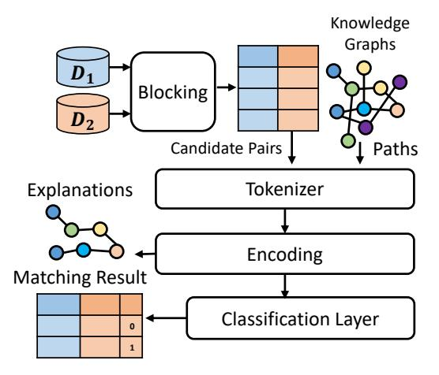
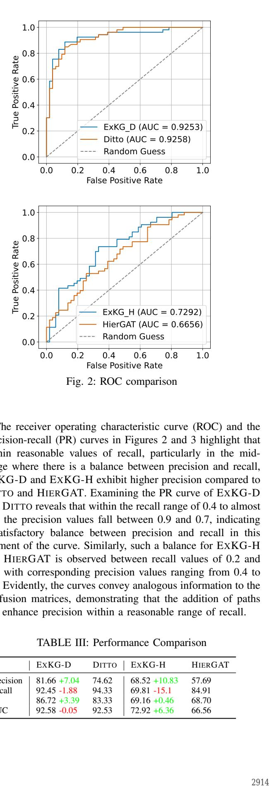
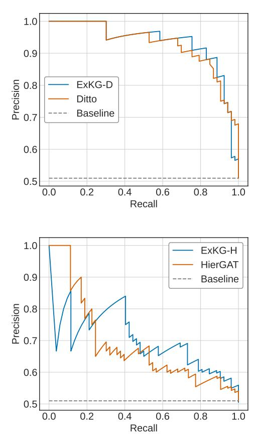
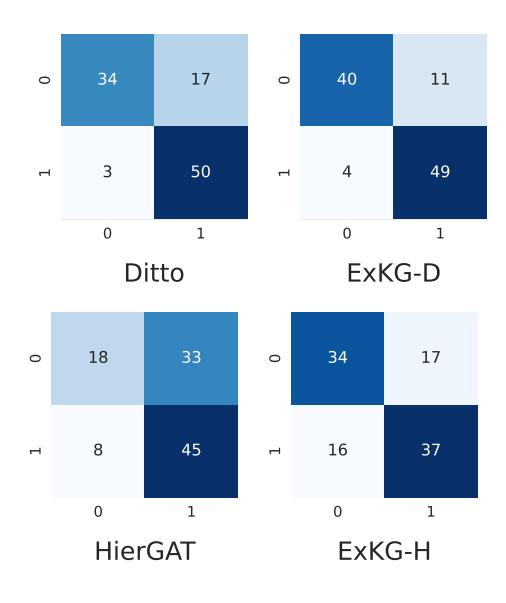
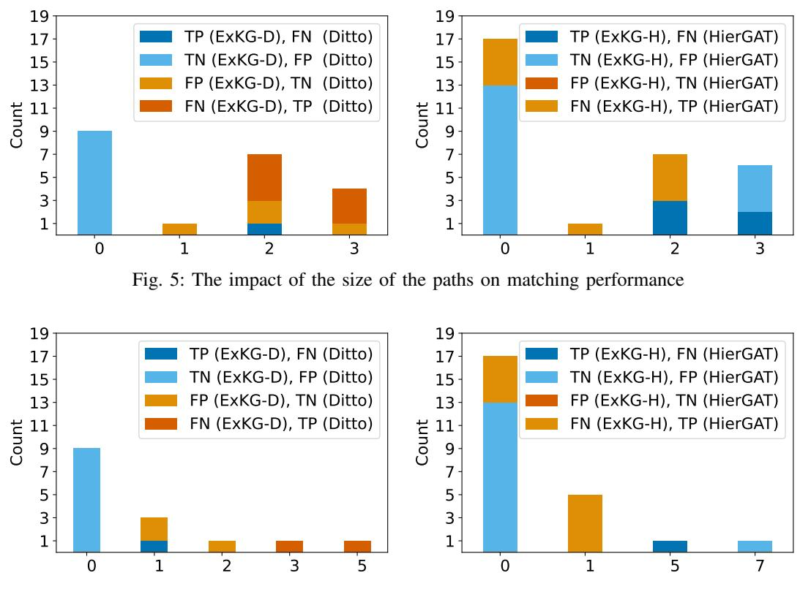
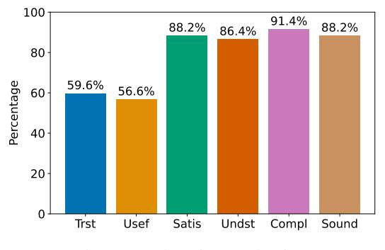
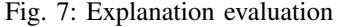

# Leveraging Knowledge Graphs for Matching Heterogeneous Entities and Explanation

Sahar Ghassabi *Department of Computer Engineering Ferdowsi University of Mashhad* Mashhad, Iran sahar.ghassabi@mail.um.ac.ir

Behshid Behkamal\* *Department of Computer Engineering Ferdowsi University of Mashhad* Mashhad, Iran

behkamal@um.ac.ir

Mostafa Milani *Department of Computer Science Western University* Ontario, Canada mostafa.milani@uwo.ca

*Abstract*—Entity matching (EM), also known as record linkage, is crucial in data integration, cleaning, and knowledge base construction. Modern matching techniques leverage deep learning and pre-trained language models (PLMs) to effectively identify matching records, showcasing significant advancements over traditional methods. However, certain critical matching aspects have received limited attention in these techniques. They heavily rely on PLMs' encodings and face challenges in integrating external sources of knowledge to enhance matching accuracy. Additionally, these techniques often lack transparency, impeding users' understanding of the underlying rationale for matching decisions. Furthermore, they exhibit limitations and decreased performance in handling heterogeneous records from datasets with diverse schemas. This paper presents EXKG, a novel technique that addresses these challenges and effectively matches heterogeneous records with varying attributes. EXKG combines the power of knowledge graphs (KGs) and PLMs to perform record linkage while offering explanatory insights into the matching results. We demonstrate that EXKG achieves competitive performance through experimental studies compared to state-of-the-art matching techniques. As a by-product, our solution generates explanations that give end users a comprehensive understanding of the matching process. We evaluate the quality of these explanations by using a user study and show they empower end users to make informed decisions

*Index Terms*—Entity matching, Explainable AI, Knowledge Graph

#### I. INTRODUCTION

Entity Matching (EM) is vital in numerous practical applications, aiming to recognize linked entities across different datasets. The success of EM techniques has been significantly bolstered by the advancements in deep learning and natural language processing (NLP), with PLMs like Bidirectional Encoder Representations from Transformers (BERT) [1]–[5] taking the spotlight. These PLMs have showcased remarkable performance by generating highly contextualized embeddings of terms, allowing for accurate matching of entity descriptions. However, when it comes to handling heterogeneous data, providing transparent explanations for decision-making, and incorporating external sources of knowledge, existing EM approaches heavily reliant on PLMs face limitations.

Real-world scenarios often require EM solutions that can handle diverse data formats and incorporate flexible and semantics-rich matching definitions, for instance, matching electronic health records of patients from different institutions. These tasks demand matching data entries that may exhibit varying formats and require a more sophisticated matching approach beyond the traditional EM task formulation. While state-of-the-art EM approaches, including those leveraging BERT-based models, have demonstrated effectiveness in matching heterogeneous entities, challenges arise in extremely heterogeneous applications with limited attribute overlap. In such cases, maintaining the high performance of these models becomes more challenging. Furthermore, many of these EM approaches act as black boxes, lacking transparency and providing limited insights into the decision-making process. This limitation is especially crucial in heterogeneous record matching, where the utilization of heterogeneous attributes in matching may be unclear.

To overcome these challenges, this paper proposes the incorporation of knowledge graphs (KGs) into existing EM solutions. We introduce EXKG, a novel EM solution that leverages PLMs and KGs for matching heterogeneous records. Using the rich knowledge captured by KGs, EM approaches can provide accurate matching for heterogeneous records and inject valuable domain-specific knowledge that may be missing in PLMs alone. KGs represent entities, their attributes, and relationships in a structured manner, facilitating the integration of additional information into the matching process. Moreover, KGs offer the ability to explain matching results, enhancing transparency and interoperability in the EM process. Integrating KGs with deep learning techniques can improve entity matching, enabling the development of more precise, domainaware, and interpretable matching solutions. In the subsequent sections, we delve into the details of this innovative approach and its potential impact on heterogeneous record matching.

*Example 1.1:* To show KGs can improve matching accuracy in the existing solutions, we explain examples of matching scholarly profiles from two heterogeneous sources: Google Scholar and a university academic dataset [6]. EXKG is based on the matching methods that use PLMs. We mainly focus on DITTO and HIERGAT, two state-of-the-art EM solutions based on BERT [1], [2] and extend them to use the knowledge obtained from KGs. We have named these two proposed models EXKG-D and EXKG-H, respectively.

<sup>\*</sup> The author was a visitor at the University of Western Ontario University, Department of Computer Science, while working on this research.

| TABLE I: Records from an academic database |  |
|--------------------------------------------|--|
|--------------------------------------------|--|

| ID | Name         | Faculty     | Department | Field        |
|----|--------------|-------------|------------|--------------|
| r1 | Javad Safaie | Engineering | Department | Material Sci |
|    |              |             | of Eng     | ence         |
| r2 | Ali Moghimi  | Science     | Department | Psychology   |
|    |              |             | of Biology |              |

TABLE II: Records from Google Scholar

| ID | Name         | Title           | Research     | Email          |
|----|--------------|-----------------|--------------|----------------|
|    |              |                 | Area         |                |
| t1 | Javad Safaie | PhD<br>in       | IBM, Bioero  | verified email |
|    |              | Neuroscience    | sion         | at ut          |
|    |              | and<br>Bio      |              |                |
|    |              | instrumentation |              |                |
| t2 | Ali Moghimi  | University of   | Digital      | verified       |
|    |              | California,     | Agriculture, | email<br>at    |
|    |              | Davis           | Remote       | ucdavis.edu    |
|    |              |                 | Sensing, Hy  |                |
|    |              |                 | perspectral  |                |
|    |              |                 | Imaging, and |                |
|    |              |                 | Artificial   |                |
|    |              |                 | Intelligence |                |

Here, we demonstrate two cases where the knowledge from the Microsoft Academic Knowledge Graph (MAKG) [7] helped EXKG-D outperform DITTO by correctly labeling record pairs mislabeled by DITTO. Table I and II show the records from two tables with the heterogeneous format. In this example, (r1, t1) are equivalent and refer to the same person, while (r2, t2) refer to different persons. DITTO incorrectly labels (r1, t1) as non-match due to a lack of similarity in attributes other than the name. Due to the name coincidence, it incorrectly labels (r2, t2) as a match. Upon examination, it is evident that there is no direct relationship between the attributes of these two records except Name. However, despite the lack of a direct relationship, our solution, EXKG-D, correctly labeled both pairs. This is achieved using paths between "Field" and "Research Areas" extracted from MAKG. Specifically, a path is identified that connects the attribute "IBM" from the research area in t<sup>1</sup> to "Material Science" from the field of study in r<sup>1</sup> using an intermediate node with a value of "Nanotechnology." The existence of this path signifies a connection between the two records and assists in the matching process. EXKG-D also correctly labels r<sup>2</sup> and t<sup>2</sup> as non-match. It successfully recognizes the lack of any path between the attributes of these two profiles in MAKG. In this particular case, the input path can be described as "empty" since no meaningful connection exists between the attributes. This absence of a path plays a crucial role in enabling our model to classify these profiles as non-match accurately. □

Our approach focuses on identifying the paths that establish semantic relationships between the attribute values present in the records (e.g., "IBM" ⇝ "Nanotechnology" ⇝ "Material Science" for matching r1, t1). These paths serve to highlight the underlying connections between the records and offer justifications for why a certain pair is determined to be a match. Conversely, in the case of non-match pairs, the absence of such paths can help explain the rationale behind the nonmatching decision (e.g., the lack of any path for not matching r<sup>2</sup> and t2). To achieve this, given multiple paths to select from, we prioritize them based on their size and exclude paths that exceed a specified size limit.

The paper is structured as follows. We review the related work in Section II, formalize the problem of heterogeneous EM and generate explanations using KGs in Section III, explain our solution, EXKG, in Section IV, present our experimental results in Section V, and conclude in Section VI.

#### II. RELATED WORK

This section first reviews previous research in the domain of heterogeneous EM and then proceeds to investigate studies focusing on generating explanations for EM.

#### *A. Heterogeneous Entity Matching*

Heterogeneous EM has received widespread attention in the past few years. Seq2SeqMatcher [8] is a method designed for this type of matching but only models structural information at the token level. HierMatcher [9], another recent solution, is a hierarchical matching network that addresses this limitation by modeling EM at multiple levels (token, attribute, and entity) within a unified neural framework.

With the expansion of Transformer architectures, like BERT, and their good results in the fields of NLP, they were also used in the EM task. DITTO [1] is an EM method based on BERT, demonstrating superior performance in both homogeneous and heterogeneous datasets. In another work, HIERGAT [2] introduces a new framework that combines graph-attention capability with DITTO to identify discriminative words and attributes. Both DITTO and HIERGAT evaluate their solutions using "dirty datasets" to test their effectiveness in handling the challenge of matching heterogeneous entities. These dirty datasets contain corrupted entity structures with randomly injected attribute values. However, when the heterogeneity becomes more complex, such as having only semantic similarities between attributes, these frameworks cannot perform optimally. In this study, we introduce EXKG-D and EXKG-H that leverage the power of external KGs to address this issue.

#### *B. Explainablity in Entity Matching*

Explaining the output generated by an EM method has encountered specific challenges. The study in [10] categorized these challenges into three main groups:

- Cross-Record Interaction Effects: The matching problem is characterized by strong interactions among features in a record pair. Linear surrogate models, as used in LIME [11], assume feature independence, which can seriously compromise the accuracy of the surrogate model, and therefore are ineffective for EM.
- Explanation of Non-match Cases: Numerous feature attribution methods measure the influence of removing features to estimate their respective contributions. However, in cases involving record pairs where the matcher expresses a high level of confidence that they do not match (indicated by a close-to-zero match score), removing features is unlikely to modify the score significantly. Consequently, this results

in a lack of meaningful attributions to explain the reasons behind the non-matching prediction of the records.

• Sensitivity Variation: In some cases, altering a few features in a record pair can significantly influence the matcher's output, while in others, numerous features make it challenging to impact the matching score and generate substantial attributions meaningfully. Striking the right balance between token and attribute-level feature granularity poses a challenge. There is a risk of being either overly detailed or coarse; this trade-off varies between specific record pairs within the same or across different datasets.

Various studies in this domain have attempted to propose effective methods to address these challenges. For example, Landmark [12], Mojito [13], and LEMON [10] are three explanation methods that utilized different techniques to tackle these challenges.

Landmark takes a unique approach to deal with the first challenge by creating two explanations for a pair of input entities. In each explanation, one record is kept constant while the other is modified, generating a perturbation dataset. This dataset is then used by LIME to generate scores for input tokens based on their importance in the EM task.

Addressing the second challenge, Mojito introduces a novel extension to LIME known as LIME-COPY. This extension aims to enhance the similarity between two input entities by copying different tokens from one entity to the other. The perturbed entities, thus created, can be used in nonmatch cases to evaluate the importance of the copied tokens in predicting non-match cases by the EM task. Finally, the third challenge addressed by LEMON. LEMON automatically adapts granularity to the changes needed to flip the prediction. This method starts with fine granularity features and then groups them exponentially if needed to reflect sensitivity. Striking a balance between interpretability and faithfulness, the method tailors its approach to the specific adjustments needed for each case, considering how understandable the explanation is for humans and how accurately it represents the model's internal behaviors.

In [14], [15], counterfactual explanations are used to explain EM results. A counterfactual explanation generally shows how small changes to a record could have resulted in a different prediction by the model.

In [16], authors introduced SystemER, which employs active learning to minimize the labeled data required for learning explainable EM models. It iteratively learns firstorder logic rules that are easily understandable by humans. The process involves learning candidate rules, selecting informative examples for users to label, and providing an explanation for the final user with these logical rules.

While KGs have been widely used for generating explanations, for example, in the medical and commercial recommender systems [17]–[20], their usage in EM is limited. In this work, we utilize paths from a KG used for EM to generate explanations, and we can address the mentioned challenges. In terms of cross-record interaction effects, KG paths could capture interactions and relationships between records in a more structured and interpretable way compared to complex model interactions. This could reduce issues with linear model assumptions. Also in terms of the second challenge, the absence of such paths can indicate the absence of a relation between input entity pairs which are non-match. Regarding the last challenge, since we do not use attribute contribution as our explanatory method, there is no need to evaluate different sensitivity levels in various input record pairs.

#### III. PROBLEM DEFINITION

We start from two databases D<sup>1</sup> and D<sup>2</sup> that include relations R<sup>1</sup> and R<sup>2</sup> with relation schemas S<sup>1</sup> = {A1, ..., An} and S<sup>2</sup> = {B1, ..., Bm}. The problem of *heterogeneous EM* is to find a function f : dom(S1) × dom(S2) 7→ {0, 1}, called a *matcher*, that returns f(t, r) = 1 if t and r match, and returns f(t, r) = 0 otherwise. A matcher is accurate if it matches two records if and only if they are equivalent, i.e., they refer to the same real-world entity.

Our EM method, EXKG, use KGs. A *knowledge graph (KG)* K = (E, P, T) consists of a set of entities E, a set of predicates (relationships) P, and a set of triples T. A triple tp ∈ T is of the form (s, p, o) where s, o ∈ E are respectively the subject and the object of the triple, and p ∈ P is the triple's predicate. In a KG, a *path* π of size k between e1, e<sup>2</sup> ∈ E is a sequence of triples (tp<sup>1</sup> , ..., tp<sup>k</sup> ) such that o<sup>i</sup> = si+1 for every triple tp<sup>i</sup> = (s<sup>i</sup> , p<sup>i</sup> , oi), s<sup>1</sup> = e1, o<sup>k</sup> = e2. The entities e<sup>1</sup> and e<sup>2</sup> are called the source and destination of the path.

We propose EXKG, a matcher that uses a set of KGs K. Each KG K ∈ K overlaps with the domains of some pairs of attributes A<sup>i</sup> ∈ S<sup>1</sup> and B<sup>j</sup> ∈ S<sup>2</sup> in relations R<sup>1</sup> and R<sup>2</sup> and will be used to improve matching through the comparison of the values of those attributes. Here, we assume the value of attributes A<sup>i</sup> and B<sup>j</sup> can be found in the KG K using entity alignment and matching methods for KGs [21], [22]. Using these KGs, we also explain our matcher's results. An explanation for a matching record pair (r, t) is a set of k shortest paths in the KGs in K where each path π<sup>i</sup> is from an attribute value in t to an attribute value in r or vice versa.

#### IV. PROPOSED APPROACH

Similar to other EM models, EXKG comprises two main phases: blocking and matching. However, EXKG introduces an additional phase of generating explanations. In the subsequent section, we will provide a concise overview of each of these phases.

#### *A. Pre-processing and Blocking*

To initiate the matching process, EXKG takes two heterogeneous relations, denoted as R<sup>1</sup> ∈ D<sup>1</sup> and R<sup>2</sup> ∈ D2. The first step in EXKG is to compare the active domains of attribute pairs in these relations, aiming to identify suitable attribute pairs for matching. Utilizing fast string similarity checking techniques, EXKG identifies sets of attribute pairs with similar values (e.g., Name attribute in the given example). These identified attribute pairs are then utilized in the blocking phase, where they are used to create blocks of records for further



Fig. 1: Architecture of EXKG

comparison. During the blocking phase, EXKG leverages KGs by searching for values from the active domains of attributes in the KGs. When attributes from both relations appear in the same KGs, they are paired and used in the subsequent matching phase, enabling the discovery of paths in the KGs for enhanced matching capabilities.

### *B. Record Matching*

Figure 1 provides an overview of our solution. To leverage KGs in our study, we utilize the attributes that are paired during the preprocessing phase, as their corresponding values appear in the same KG. Subsequently, we extract all paths connecting these two attributes within the KG and introduce these paths as an additional input to models, along with the record pairs. As mentioned before, for the matching model we utilize two state-of-the-art models, DITTO and HIERGAT. DITTO uses BERT for embeddings of input data and HIER-GAT uses a combination of BERT and graph attention network for generating such embeddings. We refer to these proposed variations as variations EXKG-D and EXKG-H, respectively.

#### *C. Explanation Generation*

After classifying two input records, EXKG uses the paths connecting their attributes to generate explanations for the output. In cases where the two records are predicted as a match, EXKG presents the paths in the KGs that establish the connection between them. These paths serve as evidence supporting the match prediction. EXKG orders these paths based on their size to provide a more informative explanation. This ordering highlights the most relevant paths. If the two records are classified as non-match, and there are no existing paths between them in the KG, the absence of such paths can serve as an explanation for their non-matching explanation.

#### V. EXPERIMENTS

We conducted experiments to assess the effectiveness of EXKG in two distinct tasks: matching and explanation generation.

#### *A. Dataset Details*

As mentioned, our research uses two datasets: an academic dataset and Google Scholar profiles.<sup>1</sup> The academic dataset comprises attributes such as Name, Faculty, Field of Study, and Department, while the Google Scholar dataset includes attributes such as Name, Title, Research Areas, and Email. Additionally, we utilize MAKG as our KG. The academic dataset initially consisted of 933 records, and the Google Scholar dataset contained 3,136 records. However, we encountered null values for "Research Areas" in certain profiles within the Google Scholar dataset.Since this attribute is crucial for mapping to the KG, we removed records with null values. Consequently, our final dataset was reduced to 1035 records after the blocking step. To ensure comprehensive evaluation, we divided the dataset into three subsets: training, validation, and testing. Specifically, 837 data items were for training, 94 for validating, and 104 for testing.

#### *B. Comparative Evaluation of Matching Method*

To evaluate the effectiveness of our approach, we compare our approach, EXKG, with DITTO [1] and HIERGAT [2], two state-of-the-art matching methods. Our method can be used to extend these methods by providing paths in KGs as input in the matching processes and also for explanation generation, as we explained before. We use EXKG-D and EXKG-H respectively to refer to the extensions of HIERGAT and DITTO using EXKG. We assess the performance of EXKG-D and EXKG-H using various metrics, including F1 score, precision, recall, and AUC. The results are presented in Table III and Figures 2, 3, and 4. Experimental results show EXKG-D and EXKG-H achieve notable performance advantages and outperform both DITTO and HIERGAT in terms of F1 score and precision.

Comparing the confusion matrices for EXKG-D with DITTO and EXKG-H with HIERGAT in Figure 4, it becomes evident that the incorporation of paths from the KG has resulted in a reduction of false positive cases in both EXKG-D and EXKG-H when compared to DITTO and HIERGAT. However, this enhancement has a small increase in the false negative cases for EXKG-D and EXKG-H. This can be due to the inclusion of paths providing evidence to our models, indicating a relationship between two entity pairs that should be strongly classified as match cases. Conversely, the absence of such paths provides a robust signal favoring the classification of a case as a non-match. Nevertheless, despite being labeled as matches, certain entity pairs in our dataset lack paths due to reasons such as the incompleteness of the KG or the use of entirely different keywords in the research area of Google Scholar, not within the domain of the individual's field of study. Consequently, EXKG-D and EXKG-H predict these cases as non-match cases, resulting in an increase in false negative cases and a decrease in recall. This can be resolved using a better alignment technique with KGs and enriched KGs, which we postpone to future work.

<sup>1</sup>The datasets and our code are available in the reference [6].



The receiver operating characteristic curve (ROC) and the precision-recall (PR) curves in Figures 2 and 3 highlight that within reasonable values of recall, particularly in the midrange where there is a balance between precision and recall, EXKG-D and EXKG-H exhibit higher precision compared to DITTO and HIERGAT. Examining the PR curve of EXKG-D and DITTO reveals that within the recall range of 0.4 to almost 0.9, the precision values fall between 0.9 and 0.7, indicating a satisfactory balance between precision and recall in this segment of the curve. Similarly, such a balance for EXKG-H and HIERGAT is observed between recall values of 0.2 and 0.6, with corresponding precision values ranging from 0.4 to 0.8. Evidently, the curves convey analogous information to the confusion matrices, demonstrating that the addition of paths can enhance precision within a reasonable range of recall.

TABLE III: Performance Comparison

| EXKG-D                                                                                       | DITTO                            | EXKG-H                                                    | HIERGAT                          |
|----------------------------------------------------------------------------------------------|----------------------------------|-----------------------------------------------------------|----------------------------------|
| Precision<br>81.66 +7.04<br>Recall<br>92.45 -1.88<br>F1<br>86.72 +3.39<br>AUC<br>92.58 -0.05 | 74.62<br>94.33<br>83.33<br>92.53 | 68.52 +10.83<br>69.81 -15.1<br>69.16 +0.46<br>72.92 +6.36 | 57.69<br>84.91<br>68.70<br>66.56 |



Fig. 3: Precision-Recall Curve



Fig. 4: Confusion matrices



Fig. 6: The impact of the number of the paths on matching performance

#### *C. The Effect of Path Length on Performance*

a path length of 0 proves effective for non-match cases.

## *D. The Effect of Number of Paths on Performance*

Figur 5 shows the impact of the path length on matching performance for test data using EXKG-D and EXKG-H.

The left chart in Figure 5 illustrates the effect of path lengths on the matching performance of EXKG-D. As is evident, when the path length is 3, it results in more false positive and false negative predictions by our model. For path length 2, the frequency of false positive and false negative predictions is higher than that of true positive predictions. Also, regarding path length 1, it leads to a false negative prediction. However, path length 0 affects the prediction accuracy of non-match cases. Therefore, it is clear that the correct prediction of nonmatch cases requires shorter paths. Especially when there are no paths between two input record pair, EXKG-D have better performance on prediction of these cases.

However, as we limited path length to 3, and the longest paths with this length negatively affect the prediction of match cases, we can say in our model that keeping paths shorter to predict match cases is beneficial.

The right side chart in Figure 5 also shows the impact of path length on EXKG-H. The analysis indicates that paths with a length of 3 are advantageous for predicting match cases, while paths with a length of 2 tend to result in more failures than benefits in these cases. Moreover, paths with lengths 0 and 1 negatively impact match case predictions. In general, having longer paths is recommended for accurate match case prediction by EXKG-H, and similar to EXKG-D,

Figure 6 shows the impact of the number of paths on matching accuracy in EXKG-D and EXKG-H.

The left side chart in Figure 6 illustrates the effect of the number of paths on the matching performance of EXKG-D. When the number of paths is 3 and 5, EXKG-D predicts more false negative cases, which means the high number of paths can have a negative effect on the correct prediction of match cases. However, one path positively affects the prediction of match cases. For non-match cases, it even fails with more than 0 number of paths. Interestingly, in cases with 0 paths, the model performs well in the prediction of non-match cases in comparison with DITTO. Therefore, it is evident that adding paths from KGs can introduce a signal to the model for nonmatch cases that there is no relation between input record pairs. Also, the high number of paths for match cases leads to incorrect predictions, so it is better to keep this number small. In summary, a smaller number of paths is better for both match and non-match predictions by EXKG-D.

The right side chart in Figure 6 illustrates the effect of the number of paths on the matching performance of EXKG-H. When the number of paths is 5 and 7, EXKG-H predicts more true positive cases, which means the high number of paths can have a positive effect on the correct prediction of match cases. However, it made the most incorrect prediction with the number of paths 0 and 1 in comparison with HIERGAT. Also, in the non-match cases, with a number of paths 0, the model excels at the prediction of non-match cases. So, it is clear that a smaller number of paths contributes more to non-match prediction in comparison with HIERGAT. For instance,

In summary, for non-match cases in both models, a smaller number and shorter paths prove to be the better choice. On the contrary, in the case of match cases, EXKG-D benefits from using a smaller number and shorter paths, while EXKG-H performs better with a larger number and longer paths. This difference in path selection is attributed to the matching methods employed by DITTO and HIERGAT.

In DITTO, all input tokens are encoded independently with repetition, whereas HIERGAT utilizes a graph-based network to embed unique tokens from the input. Consequently, longer paths or a higher number of paths with repeated nodes can potentially reduce the performance of DITTO. In contrast, HIERGAT can effectively leverage the contextual information contained within these paths to improve its performance.

## *E. Evaluation of Explanations*

In evaluating the explanations within this study, we have adopted and refined the approach outlined in [23], incorporating slight enhancements to better suit our specific needs and objectives. We have conducted a comprehensive evaluation covering six distinct aspects of explanation quality: trust, understandability, usefulness, satisfaction, soundness, and completeness. This assessment is carried out using a combination of direct and indirect methods. Direct methods involve gathering feedback or data from users or experts, focusing on their explicit judgments or responses regarding the explanations. In contrast, indirect methods measure aspects of the explanation quality through observations, calculations, or comparisons, deriving conclusions from the resulting data or behavioral changes without directly asking for explicit opinions.

In this work, we have devised a Likert-scale questionnaire to directly ask users for their opinions and perceptions on three aspects of Understandability, Satisfaction, and Soundness. To measure completeness, we calculated the percentage of records for which explanations were generated compared to the total number of records. To assess trust and usefulness, we have implemented a novel approach by comparing user selections before and after viewing explanations, which indirectly reflects their trust in and perceived usefulness of the explanations.

Therefore, Our evaluation strategy incorporates a combination of quantitative and qualitative approaches to comprehensively assess the quality of the explanation. In the following, each of these assessment methods and their respective results will be discussed.

- *Understandability* is characterized by the ability to make a human understand and attribute meaning to the explanations provided by the XAI system. In this study, we explicitly inquire whether the generated explanations enable users to grasp the logic of our EM system.
- *Satisfaction* refers to the extent to which users find the provided explanations for AI system predictions aligned

with their expectations, fostering a positive user experience. To assess satisfaction, we directly ask how satisfied users are with the explanations provided.

- *Soundness* pertains to the accuracy, reliability, and validity of the explanations provided by AI systems. For assessing this aspect, users are directly asked to express their opinions regarding the suitability of the proposed method for generating explanations.
- *Completeness* involves assessing the capacity of an explanation generation method to encompass explanations for all records. To evaluate this criterion, we calculate the percentage of records for which we can generate explanations compared to the total number of records. Our method can generate an explanation when input record pairs are predicted to match accurately and there are paths between them extracted from the knowledge graph (KG). It can also provide explanations when two input records are accurately predicted as non-matches and there is no path between them in the KG.
- *Trust* is a variable factor that focuses on understanding if the user would rely on the system's decision. In assessing user trust, this study employs a multi-choice questionnaire where users select the entity they believe matches with the existing entity. For example, individuals should choose the appropriate field of study based on keywords in the research area. Afterward, when users select an incorrect option, they are prompted to reconsider their choice by providing the correct answers along with explanations. The percentage of users who switch their selection to the model's output reflects trust in our explanations.
- *Usefulness* enables us to assess an explanation's real benefit toward users' needs. To assess the usefulness, we ask users to select records that may match existing entities using a multi-choice question. We also asked them to indicate their confidence level in the selected option before and after viewing the explanations. Suppose they choose the correct entity before seeing explanations or change their selected option to the correct option after seeing explanations. In that case, the percentage of increase in confidence level after seeing explanations can show the usefulness of our explanations.

We sent the questionnaire to a group of 22 individuals who were experts in the field of computer science and were familiar with the concepts of KG and XAI. The findings from our experiment, as depicted in Figure 7, highlight the favorable reception and effectiveness of employing KG for explanation generation in the domain of Entity EM domain. The positive outcomes affirm the utility of our approach from both end-user and technical standpoints.

The results indicate a significant agreement among participants, with 60% acknowledging the usefulness and trustworthiness of the explanations, emphasizing a substantial impact on user perception. Additionally, nearly 90% reported high satisfaction, finding the explanations both understandable and user-friendly. Furthermore, 88.2% endorsed the soundness of our explanations, affirming their technical robustness.

The substantial 60% agreement among participants on the usefulness and trustworthiness of the explanations underscores a meaningful impact on user perception. The high satisfaction rate, reaching nearly 90%, along with a similar proportion finding the explanations understandable, reinforces the userfriendly nature of our generated explanations. Furthermore, the significant endorsement of 88.2% for the soundness of our explanations solidifies the technical robustness of our methodology.

Our method of explanation generation is equally significant due to its extensive coverage. It spans across more than 90% of both matching and non-matching cases, showcasing the adaptability and relevance of our approach across diverse scenarios within the EM domain.

In summary, these results collectively suggest that integrating KGs into the process of explanation generation holds promise for providing effective and well-received explanations in EM. The positive responses from participants position our approach as a valuable contribution to end-users seeking comprehensibility in the EM domain.





#### *F. Case Study*

In this section, we carefully look at a few examples of matching results in EXKG. The input of our model comprises the serialization of two input entities. The features of each entity are provided to the model as follows:

```
[COL] attr1 [VAL] val1 [COL] attr2
[VAL] val2 ... [COL] attrk [VAL] valk
```

where [COL] and[VAL] are special tokens for indicating the start of attribute names and values, respectively. For example, the first entry of the Table I is serialized as:

```
[COL] Uni name [VAL] Javad Safaie
[COL] Uni faculty [VAL] Engineering
[COL] Uni department [VAL] Department of Eng
[COL] Uni field of study [VAL] Materials sci.
```

To serialize a candidate pair (e, e′ ), we used:

[CLS] serialize(e) [SEP] serialize(e') [SEP]

Here,[SEP] serves as the distinctive token that separates the two sequences, while [CLS] is the essential token for BERT to encode the sequence pair.

Additionally, the output of our model for each entity pair is as follows:

Prediction: Matched or Non-matched Explanation:

- path<sup>1</sup>
- path<sup>2</sup>
- . . .
- path<sup>k</sup>

It is worth noting that we sort paths in ascending order based on the length of the paths and present them to the user. This sorting is done because a shorter path is simpler for the user to understand, and it can be asserted that a closer relationship exists between the mentioned entity pairs.

In the following, two case studies are examined; one serves as an instance of accurate prediction by EXKG, while the other represents an example of incorrect prediction by the model.

In each case, two entities are identified by t and r, and the model's task is to predict the matching or non-matching between these two entities, along with generating an explanation for each prediction.

*1) Case Study A: Examples Related to Strengths of* EXKG-D*:* In this case, we will evaluate examples where our model accurately predicted whether they were matched or nonmatched. However, DITTO or HIERGAT failed to predict the true output accurately.

The first example (t1, r1) is a case where the ground truth label indicates a match, and our proposed model correctly identifies it as a match. However, HIERGAT misidentifies it as a non-match.

These paths, as elucidated in the explanation, are derived from the KG. These paths are incorporated into our model's input data, thereby contributing to the matching process. This strategic inclusion enhances the model's ability to facilitate the matching process by leveraging the information encapsulated in the specified path.

EXKG's output for this sample data is as follows:

## Prediction: Matched

## Explanation:

- Heterocyclic compound ⇝ Stereochemistry ⇝ Chemistry
- Heterocyclic compound ⇝ Organic chemistry ⇝ Chemistry
- Heterocyclic compounds ⇝ Polymer Chemistry ⇝ Chemistry
- Organic synthesis ⇝ Catalysis ⇝ Organic chemistry ⇝ Chemistry
- Organic synthesis ⇝ Catalysis ⇝ Inorganic chemistry ⇝ Chemistry

It is evident that, even when the person's name is the same in two entities, the similarity of the two entities alone is not enough for HIERGAT to recognize a match between them without considering these paths. The added paths show the relationship between the field of study in the first entity and the person's research areas in the second entity.

| t1: [COL] Uni name [VAL] Ali Shiri [COL] Uni faculty<br>[VAL] Science [COL] Uni department [VAL] Department<br>of Chemistry, Sciences [COL] Uni field of study<br>[VAL] Chemistry                                                                                                                                                                                                                  | t1: [COL] Uni name [VAL] Majid Azizi [COL] Uni<br>faculty [VAL] Agriculture [COL] Uni department [VAL]<br>Department of Gardening, Agriculture [COL] Uni field<br>of study [VAL] Biology                                                                                                                                                                                                 |
|----------------------------------------------------------------------------------------------------------------------------------------------------------------------------------------------------------------------------------------------------------------------------------------------------------------------------------------------------------------------------------------------------|------------------------------------------------------------------------------------------------------------------------------------------------------------------------------------------------------------------------------------------------------------------------------------------------------------------------------------------------------------------------------------------|
|                                                                                                                                                                                                                                                                                                                                                                                                    |                                                                                                                                                                                                                                                                                                                                                                                          |
| r1: [COL] Scholar name [VAL] Ali Shiri<br>[COL]Scholar Title [VAL] Professor, School of<br>Library and Information Studies, University of<br>Alberta [COL] Research Areas [VAL] Organic synthesis,<br>Heterocyclic compound, Medicinal chemistry<br>[COL] Scholar Email [VAL] Verified email at<br>ualberta.ca [COL] Paths [VAL] Organic synthesis,<br>Catalysis, Organic chemistry, Chemistry AND | r1: [COL] Scholar name [VAL] Majid Azizi [COL]<br>Scholar Title [VAL] Academy of Science [COL]<br>researchAreas [VAL] Medicinal plants, Bioactive<br>molecules [COL] Scholar_Email [VAL] Verified email<br>at um.ac.ir [COL] paths [VAL] Medicinal plants,<br>Biochemistry, Biology AND Medicinal plants, Botany,<br>Biology AND Bioactive molecules, Molecule,<br>Biochemistry, Biology |
| Organic synthesis, Catalysis, Inorganic chemistry,<br>Chemistry AND Heterocyclic compound, Stereochemistry,<br>Chemistry AND Heterocyclic compound, Organic<br>chemistry, Chemistry AND Heterocyclic compounds,<br>Polymer Chemistry, Chemistry                                                                                                                                                    | t2: [COL] Uni name [VAL] Hossein Askari [COL] Uni<br>faculty [VAL] Science [COL] Uni department [VAL]<br>Department of Biology, Sciences [COL] Uni field of<br>study [VAL] Biology                                                                                                                                                                                                       |
|                                                                                                                                                                                                                                                                                                                                                                                                    |                                                                                                                                                                                                                                                                                                                                                                                          |
| t2: [COL] Uni name [VAL] Mohammad Amini<br>[COL] Uni faculty [VAL] Mathematical Sciences<br>[COL] Uni department [VAL] Department of Statistics,<br>Mathematics [COL] Uni field of study<br>[VAL] Mathematics                                                                                                                                                                                      | r2: [COL] Scholar name [VAL] Hossein Askari<br>Lyarjdameh [COL] Scholar Title [VAL] The University<br>of Adelaide [COL] researchAreas [VAL] Machine<br>learning, Computer vision, Medical imaging [COL]<br>Scholar Email [VAL] Verified email at Adelaide.<br>edu.au [COL] paths [VAL] Medical imaging, Diabetes                                                                         |
|                                                                                                                                                                                                                                                                                                                                                                                                    | mellitus, Endocrinology, Biology                                                                                                                                                                                                                                                                                                                                                         |
| r2:[COL] Scholar name [VAL] Mohamadamin Amini<br>[COL] Scholar Title [VAL] PhD student, Amirkabir<br>University of Technology [COL] research Areas<br>[VAL] CTD, Multiphase flow, Diffusion dynamics<br>[COL] Scholar Email [VAL] Verified email<br>at aut.ac.ir [COL] paths [VAL] empty                                                                                                           | The shortcomings observed in our model stem from the<br>number of paths, as elucidated in Section V-D. This specific<br>case is an example of the output of EXKG-D and as previously                                                                                                                                                                                                     |

For a non-expert user in the field of "Chemistry", it will be difficult to understand the connection between research areas like "Heterocyclic compounds" or "Organic synthesis" and the field of "Chemistry" without explanation, but the presentation of the mentioned paths offers that there is a relationship between them.

The second example, (t2, r2), is a case where there are no paths in KG between the values of these two entities, so we added the value "empty" as the path value for this example.

The ground truth label indicates a non-match, and our proposed model correctly identifies it as a non-match. However, without this signal of empty value for path, DITTO misidentifies it as a match. Our model's output for this sample data is as follows:

#### Prediction: Non-matched

#### Explanation: Empty

This example shows that adding a column of the path to data also helps predict non-match cases. In this example, an empty path signals to the model that there is no relation between these two entities.

*2) Case Study B: Examples Related to Failure of* EXKG*:* In this case, we will evaluate examples where our model failed to predict true output. However, DITTO correctly predicts the true output for them.

In the first example, (t1, r1), the ground truth label indicates a match, and our proposed model incorrectly identifies it as a non-match. However, DITTO accurately recognizes this case as a match.

expounded, the higher number of paths in EXKG-D detrimentally influences matching identification due to the presence of recurring tokens in the input data. These repeated tokens are indiscriminately supplied to the model as input and it causes an incorrect prediction by the model.

The second example which means (t2, r2) is a case where the ground truth label indicates a non-match, and our proposed model incorrectly identifies it as a match. However, DITTO accurately recognizes this case as a non-match.

This type of incorrect prediction occurs when there is an overlap between keywords associated with the different academic fields of study. In this specific case, The existence of a path such as Medical Imaging ⇝ Diabetes Mellitus ⇝ Endocrinology ⇝ Biology sends a signal of the relation between two entities to the model, leading to the inaccurate prediction. The occurrence of such cases is typically limited across all domains; nevertheless, it is essential to adopt a suitable approach to effectively address this issue.

#### VI. CONCLUSION

EM is a pivotal component in data management, drawing significant attention to developing various effective matching techniques. This area of research has evolved considerably, with recent studies increasingly focusing on key dimensions such as explainability [10]–[13], robustness [24], [25], and fairness [26]–[28]. These aspects represent crucial challenges and opportunities for advancing the field. Our current work contributes to this ongoing discourse by specifically exploring the intricacies of heterogeneity and explainability in EM, aiming to enhance both the effectiveness and interpretability of EM processes.

In this study, we aim to leverage the paths extracted from a KG to enhance the performance of two state-of-the-art models: DITTO and HIERGAT. We also employ these paths to provide insights into the results of matching in a heterogeneous setting. The results demonstrate superior performance compared to these two models. However, it's worth noting that different settings are required when adding paths to the inputs of DITTO and HIERGAT. This is because of their difference in the matching model. When integrating paths from external knowledge graphs into matching models, it is essential to take into account the model's architecture and incorporate an appropriate model configuration based on the number and length of paths. In addition, the utilization of these paths allows us to explain the outcomes of matching tasks in a heterogeneous environment where the rationale behind a match or non-match is ambiguous. Our experimental findings on generated explanations demonstrate that this type of explanation can yield high scores across various dimensions.

#### REFERENCES

- [1] Y. Li, J. Li, Y. Suhara, A. Doan, and W. C. Tan, "Deep entity matching with pre-trained language models," *Proceedings of the VLDB Endowment*, vol. 14, pp. 50–60, 9 2020. [Online]. Available: https://dl.acm.org/doi/10.14778/3421424.3421431
- [2] D. Yao, Y. Gu, G. Cong, H. Jin, and X. Lv, "Entity resolution with hierarchical graph attention networks," *Proceedings of the ACM SIGMOD International Conference on Management of Data*, vol. 14, pp. 429–442, 6 2022. [Online]. Available: https://dl.acm.org/doi/10. 1145/3514221.3517872
- [3] M. Paganelli, F. Del Buono, A. Baraldi, F. Guerra *et al.*, "Analyzing how bert performs entity matching," *Proceedings of the VLDB Endowment*, vol. 15, no. 8, pp. 1726–1738, 2022.
- [4] U. Brunner and K. Stockinger, "Entity matching with transformer architectures-a step forward in data integration," in *23rd International Conference on Extending Database Technology, Copenhagen, 30 March-2 April 2020*. OpenProceedings, 2020.
- [5] B. Li, Y. Miao, Y. Wang, Y. Sun, and W. Wang, "Improving the efficiency and effectiveness for bert-based entity resolution," in *Proceedings of the AAAI Conference on Artificial Intelligence*, vol. 35, no. 15, 2021, pp. 13 226–13 233.
- [6] (2023) Ferdowsi and beheshti university scimet system. [Online]. Available: https://github.com/saharyi/ExKG-Datasets-
- [7] (2023) Microsoft academic knowledge graph (makg). [Online]. Available: https://makg.org/
- [8] H. Nie, X. Han, B. He, L. Sun, B. Chen, W. Zhang, S. Wu, and H. Kong, "Deep sequence-to-sequence entity matching for heterogeneous entity resolution," *International Conference on Information and Knowledge Management, Proceedings*, pp. 629–638, 2019.
- [9] C. Fu, X. Han, J. He, and L. Sun, "Hierarchical matching network for heterogeneous entity resolution," vol. 4. International Joint Conferences on Artificial Intelligence, 7 2020, pp. 3665–3671. [Online]. Available: https://www.ijcai.org/proceedings/2020/507
- [10] N. Barlaug, "Lemon: Explainable entity matching," *IEEE Transactions on Knowledge and Data Engineering*, pp. 1–23, 2022.
- [11] M. T. Ribeiro, S. Singh, and C. Guestrin, ""why should i trust you?": Explaining the predictions of any classifier," *NAACL-HLT 2016 - 2016 Conference of the North American Chapter of the Association for Computational Linguistics: Human Language Technologies, Proceedings of the Demonstrations Session*, pp. 97–101, 2 2016. [Online]. Available: https://arxiv.org/abs/1602.04938v3
- [12] A. Baraldi, F. D. Buono, M. Paganelli, and F. Guerra, "Using landmarks for explaining entity matching models," *Advances in Database Technology - EDBT*, vol. 2021-March, pp. 451–456, 2021. [Online]. Available: https://iris.unimore.it/handle/11380/1247078
- [13] V. D. Cicco, D. Firmani, N. Koudas, P. Merialdo, and D. Srivastava, "Interpreting deep learning models for entity resolution: An experience report using lime." Association for Computing Machinery, 7 2019. [Online]. Available: https://dl.acm.org/doi/10.1145/3329859.3329878

- [14] J. Wang and Y. Li, "Minun: evaluating counterfactual explanations for entity matching," in *Proceedings of the Sixth Workshop on Data Management for End-To-End Machine Learning*, 2022, pp. 1–11.
- [15] K. Qian, D. Burdick, S. Gurajada, and L. Popa, "Learning explainable entity resolution algorithms for small business data using systemer," in *Proceedings of the 5th Workshop on Data Science for Macro-modeling with Financial and Economic Datasets*, 2019, pp. 1–6.
- [16] K. Qian, L. Popa, and P. Sen, "Systemer: A human-in-the-loop system for explainable entity resolution," *Proceedings of the VLDB Endowment*, vol. 12, no. 12, pp. 1794–1797, 2019.
- [17] Y. Huo, D. F. Wong, L. M. Ni, L. S. Chao, and J. Zhang, "Hetropy: Explainable learning diagnostics via heterogeneous maximum-entropy and multi-spatial knowledge representation," *Knowledge-Based Systems*, vol. 207, 11 2020. [Online]. Available: https://www.researchgate.net/publication/343679892 HeTROPY Explainable learning diagnostics via heterogeneous maximum-entropy and multi-spatial knowledge representation
- [18] A. K. Talukder, J. B. Sanz, and J. Samajpati, "'precision health': Balancing reactive care and proactive care through the evidence based knowledge graph constructed from real-world electronic health records, disease trajectories, diseasome, and patholome," vol. 12581 LNCS. Springer Science and Business Media Deutschland GmbH, 2020, pp. 113–133. [Online]. Available: https://link.springer.com/chapter/10.1007/ 978-3-030-66665-1 9
- [19] O. I. Orhobor, J. French, L. N. Soldatova, and R. D. King, "Generating explainable and effective data descriptors using relational learning: Application to cancer biology," *Lecture Notes in Computer Science (including subseries Lecture Notes in Artificial Intelligence and Lecture Notes in Bioinformatics)*, vol. 12323 LNAI, pp. 374–385, 2020. [Online]. Available: https://link.springer.com/chapter/10.1007/ 978-3-030-61527-7 25
- [20] Y. Zhang, X. Xu, H. Zhou, and Y. Zhang, "Distilling structured knowledge into embeddings for explainable and accurate recommendation." Association for Computing Machinery, Inc, 1 2020, pp. 735–743. [Online]. Available: https://dl.acm.org/doi/10.1145/3336191.3371790
- [21] K. Zeng, C. Li, L. Hou, J. Li, and L. Feng, "A comprehensive survey of entity alignment for knowledge graphs," *AI Open*, vol. 2, pp. 1–13, 2021.
- [22] B. D. Trisedya, J. Qi, and R. Zhang, "Entity alignment between knowledge graphs using attribute embeddings," in *Proceedings of the AAAI conference on artificial intelligence*, vol. 33, no. 01, 2019, pp. 297–304.
- [23] P. Lopes, E. Silva, C. Braga, T. Oliveira, L. Rosado, S. Lorente, P. Angelov, J. Antonio, I. Martinez, P. Lopes, E. Silva, C. Braga, T. Oliveira, and L. Rosado, "Xai systems evaluation: A review of human and computer-centred methods," *Applied Sciences (Switzerland)*, vol. 12, p. 9423, 9 2022. [Online]. Available: https://www.mdpi.com/2076-3417/ 12/19/9423/htmhttps://www.mdpi.com/2076-3417/12/19/9423
- [24] E. Boros, E. L. Pontes, L. A. Cabrera-Diego, A. Hamdi, J. G. Moreno, N. Sidere, and A. Doucet, "Robust named entity recognition and linking ` on historical multilingual documents," in *Conference and Labs of the Evaluation Forum (CLEF 2020)*, vol. 2696, no. Paper 171. CEUR-WS Working Notes, 2020, pp. 1–17.
- [25] M. Akbarian Rastaghi, E. Kamalloo, and D. Rafiei, "Probing the robustness of pre-trained language models for entity matching," in *Proceedings of the 31st ACM International Conference on Information & Knowledge Management*, 2022, pp. 3786–3790.
- [26] S. Nilforoushan, Q. Wu, and M. Milani, "Entity matching with aucbased fairness," in *2022 IEEE International Conference on Big Data (Big Data)*. IEEE, 2022, pp. 5068–5075.
- [27] V. Efthymiou, K. Stefanidis, E. Pitoura, and V. Christophides, "Fairer: entity resolution with fairness constraints," in *Proceedings of the 30th ACM International Conference on Information & Knowledge Management*, 2021, pp. 3004–3008.
- [28] N. Shahbazi, N. Danevski, F. Nargesian, A. Asudeh, and D. Srivastava, "Through the fairness lens: Experimental analysis and evaluation of entity matching," *Proceedings of the VLDB Endowment*, vol. 16, no. 11, pp. 3279–3292, 2023.