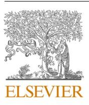
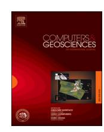
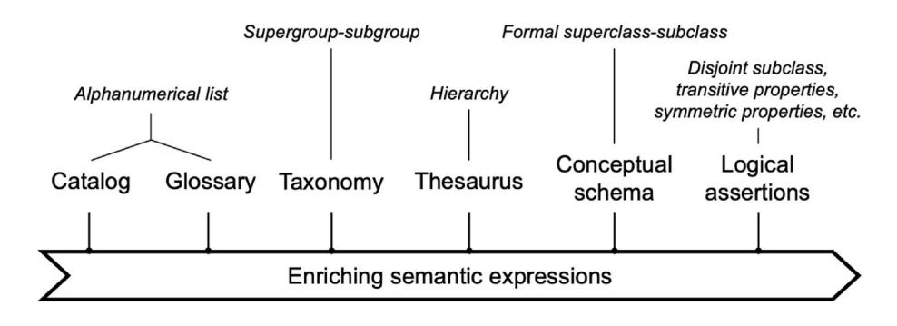
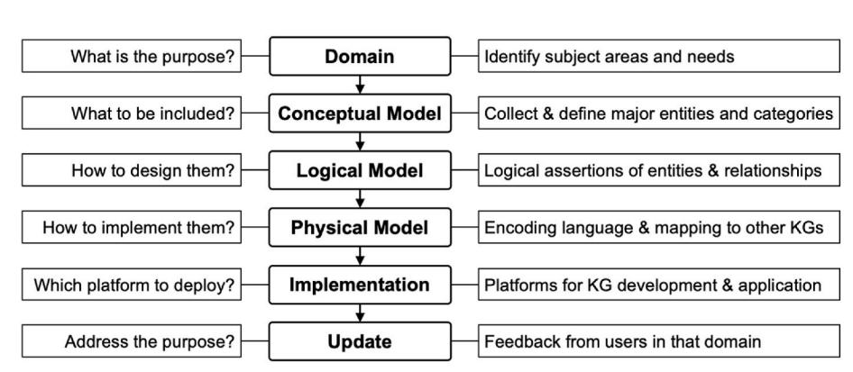
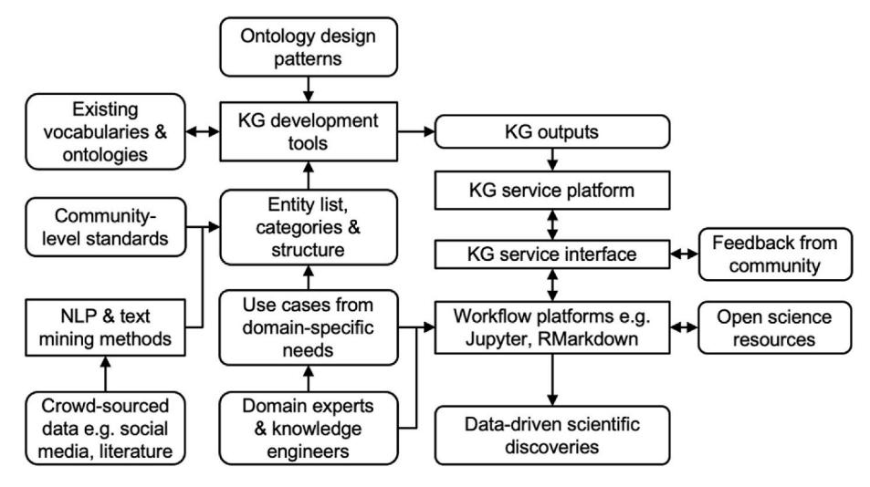
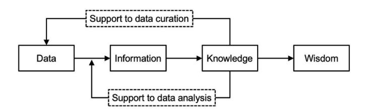
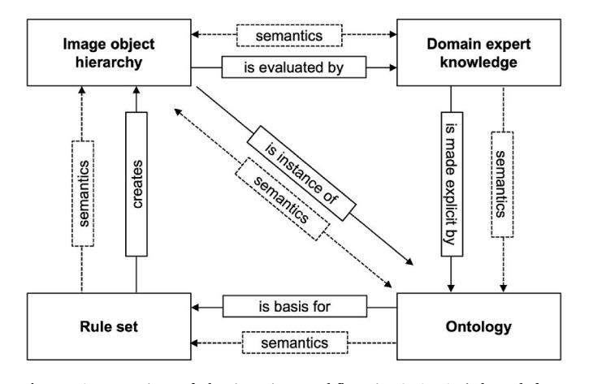
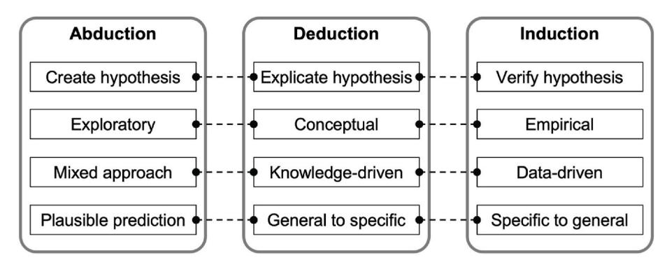

<!-- cite_key: sciences2019 -->

Contents lists available at [ScienceDirect](www.sciencedirect.com/science/journal/00983004)

# Computers and Geosciences

journal homepage: [www.elsevier.com/locate/cageo](https://www.elsevier.com/locate/cageo)

# Knowledge graph construction and application in geosciences: A review

# Xiaogang Ma

*Department of Computer Science, University of Idaho, 875 Perimeter Drive, MS 1010, Moscow, ID 83844-1010, USA*# ARTICLE INFO
*Keywords:*Knowledge graph Open data Machine learning Artificial intelligence Data science

ABSTRACT

Knowledge graph (KG) is a topic of great interests to geoscientists as it can be deployed throughout the data life cycle in data-intensive geoscience studies. Nevertheless, comparing with the large amounts of publications on machine learning applications in geosciences, summaries and reviews of geoscience KGs are still limited. The aim of this paper is to present a comprehensive review of KG construction and implementation in geosciences. It consists of four major parts: 1) concepts relevant to KG and approaches for KG construction, 2) KG application in data collection, curation, and service, 3) KG application in data analysis, and 4) challenges and trends of geoscience KG creation and application in the near future. For each of the first three parts, a list of concepts, exemplar studies, and best practices are summarized. Those summaries are synthesized together in the challenge and trend analyses. As artificial intelligence and data science are thriving in geosciences, we hope this review of geoscience KGs can be of value to practitioners in data-intensive geoscience studies.

# 1. Introduction

Artificial intelligence (AI) has received increasing attention in geosciences in the past decade [\(Gil et al., 2019\)](#page-12-0). In particular, for data-intensive geosciences there has been a significant growth of machine learning (ML) and deep learning (DL) applications in recent years ([Lary et al., 2016](#page-12-0); [Bergen et al., 2019](#page-11-0); [Karpatne et al., 2018;](#page-12-0) [Reichstein](#page-13-0)  [et al., 2019\)](#page-13-0). Besides ML and DL, knowledge engineering, logic, and reasoning are also essential topics in AI ([Russell and Norvig, 2021](#page-13-0)), among which the knowledge graph (KG) rises as a unique subject. A KG is a graphical representation of structured knowledge from the real world, in which the nodes represent entities of interest and the edges represent relationships between those entities ([Sheth et al., 2019b](#page-13-0); [Hogan et al., 2020\)](#page-12-0). In a data life cycle ([Wing, 2019](#page-14-0)), such as the data-intensive geoscience research ([Gil et al., 2019\)](#page-12-0), the associated works of KG connect the upstream work of knowledge engineering and representation, the midstream work of data curation and integration, and the downstream work of data analysis and result communication. For instance, the OneGeology-Europe project [\(Laxton, 2017\)](#page-12-0) illustrated intelligent applications of KGs in geologic map integration and service. About 20 European countries participated in the project to share national geologic map services, but many of them were originally recorded in their national official languages. The project has built multi-lingual vocabularies to mediate across those map services. On the data portal of OneGeology-Europe, a user can write a query with English labels of rock age or type, then the functions based on the vocabularies can translate the query into different languages and send them to the corresponding services. The records returned from multiple services are organized in a consistent form just like they are returned from a single European geologic map service.

As a reflection, earlier publications in geoinformatics and geomathematics have addressed the importance of machine-readable knowledge models in the cyberinfrastructure (e.g., [Loudon, 2000](#page-12-0), [2009\)](#page-13-0) and the flexible application of data-driven and knowledge-driven approaches in data analysis (e.g., [Bonham-Carter, 1994;](#page-11-0) [Carranza,](#page-11-0)  [2009\)](#page-11-0). Very recently, [Gutierrez and Sequeda \(2021\)](#page-12-0) reviewed the interweaving of data and knowledge since the advent of modern computing in the 1950s, to reveal the historical roots of the KGs in nowadays. They suggested that both statistical and logical methods contribute to the convergent work of data science, and the next-generation scientists should be aware of the KG developments in addition to the overwhelming ML and DL studies. However, comparing with the many recent review papers on ML and DL in geosciences, there is a shortage of summary and review of KGs in geosciences. Although there has been some progress in geoscience KG construction and application in the past decades, such as the work on geospatial semantics ([Compton et al., 2012;](#page-11-0) [Janowicz et al., 2012](#page-12-0); [Tandy et al., 2017](#page-14-0)), the entrance barrier to KG still seems high to many geoscientists, especially newcomers.

The history of KG can be traced back to ancient people's idea of representing knowledge in a diagrammatic form [\(Gutierrez and](#page-12-0)  [Sequeda, 2021](#page-12-0)). The Google Knowledge Graph released in 2012,

<https://doi.org/10.1016/j.cageo.2022.105082>

Available online 28 February 2022 Received 4 May 2021; Received in revised form 23 February 2022; Accepted 24 February 2022

0098-3004/© 2022 The Author. Published by Elsevier Ltd. This is an open access article under the CC BY license [\(http://creativecommons.org/licenses/by/4.0/\)](http://creativecommons.org/licenses/by/4.0/).
*E-mail address:*[max@uidaho.edu.](mailto:max@uidaho.edu)

together with similar ideas at Microsoft, Facebook, eBay, and IBM, significantly increased the visibility of KG as an AI approach to researchers and the public [\(Noy et al., 2019b](#page-13-0)). Yet, for KG practitioners in geosciences, it is necessary to realize that KG is rooted in several areas in computer science. At the 2019 U.S. Semantic Technologies Symposium (Durham, NC), there was an active discussion on the statement that "In the 1990s, we talked about vocabularies; in the 2000s, we talked about ontologies; and in the 2010s, we began to talk about knowledge graphs." There have been several initiatives on building vocabularies, ontologies and KGs in geosciences and applying them to improve the data life cycle in geosciences. The Commission for Geoinformation within the International Union of Geological Sciences (IUGS-CGI) is a facilitator of standardized geoscience vocabularies and schemas for geologic data ([Asch and Jackson, 2006](#page-11-0)). Part of the IUGS-CGI outputs were adapted in the OneGeology, OneGeology-Europe and the INSPIRE programs to harmonize geologic data from distributed sources [\(Laxton, 2017\)](#page-12-0). Federal agencies in U.S. such as USGS and NASA have also invested efforts on KGs for geoscience data management and analysis (e.g., [Zhang et al.,](#page-14-0)  [2016; USGS NCGMP, 2020](#page-14-0)). The EarthCube, an NSF initiated program, has led to many recent progresses on geoscience vocabularies, ontologies and KGs (e.g., [Richard et al., 2014;](#page-13-0) [Gupta et al., 2015;](#page-12-0) [Zhou et al.,](#page-14-0)  [2020\)](#page-14-0). Two recent reports released by the World Wide Web Consortium (W3C) summarized the best practices for publishing data on the Web: one focused on the open data in its broad sense ([Loscio et al., 2017\)](#page-12-0) and the other specifically on spatial data ([Tandy et al., 2017](#page-14-0)). Those best practices show a clear trend that KGs will take an essential role for better data services on the Web. It is also encouraging to see that a few examples from geosciences were included in the two reports.

Geoscience KG is an interdisciplinary subject. Despite those abovementioned progresses of KG in geosciences, the gap between geoscience and computer science still makes it hard for many real-world practitioners to see a roadmap to incorporate KGs into data-intensive geoscience research. Semantic technologies ([Berners-Lee et al., 2001](#page-11-0); [Bizer et al., 2011\)](#page-11-0) are a key topic of KG in existing studies. [Narock and](#page-13-0)  [Wimmer \(2017\)](#page-13-0) conducted a bibliometric analysis of semantic technologies with literature from the American Geophysical Union (AGU) Fall Meetings (i.e., a representative geoscience conference) and the International Semantic Web Conference (ISWC) series (i.e., a representative computer science conference). Their results show that the overlap between AGU and ISWC is minimal. While computer scientists focus more on the precision of their algorithms and the efficiency in big data processing, geoscientists and geoinformaticians focus on the actual improvement enabled by semantic technologies in their geoscience work (cf. [Hogan 2020](#page-12-0); [Hitzler 2021](#page-12-0)). Comparing with the KG construction and application in biology and biomedical studies (e.g., [Ashburner et al.,](#page-11-0)  [2000;](#page-11-0) [Gene Ontology Consortium, 2019;](#page-12-0) [Nicholson and Greene, 2020](#page-13-0)), most existing geoscience KGs focus on lightweight semantics, and their applications are limited to data harmonization and integration. Computer scientists can see the potential of deeper applications of KGs in geosciences, but geoscientists would like to see a list of KG technologies that can guide them from simple to sophisticated applications ([4D](#page-11-0)  [Initiative, 2018](#page-11-0); [Gil et al., 2019;](#page-12-0) [NASEM, 2020;](#page-13-0) [Wang et al., 2021](#page-14-0)).

The purpose of this paper is to review the existing work of KGs in geosciences, summarize the best practices, and discuss the trends of KG construction and application. The remainder of the paper is organized as follows. Section 2 summarizes the concepts associated with KG and ways to construct a KG in geosciences. Section [3](#page-3-0) focuses the progress of KG applications in geoscience data collection, curation, and service. Section [4](#page-6-0) summarizes KG applications in geoscience data analysis, including topics of data mining processes, social media and literature data, image analysis, vector data, and integrated applications. Section [5](#page-8-0) discusses the trends in the near future. Finally, Section [6](#page-10-0) concludes the paper. We hope this review will be beneficial to many geoscientists who would like to deploy KGs in their data-intensive studies.

# 2. Knowledge graph construction: associated concepts and approaches

A KG, in its broad sense, can be envisioned as a group of nodes connected by edges, where the nodes represent entities in the real world and edges for the relationships between those entities. This is a good way to lower the barrier of entrance for geoscientists to work on KG. However, it is important to note that a graphic conceptual map is just the beginning stage. A more functional part of KG is the logical assertations we can add to the nodes and edges and the capability of reasoning and inference enabled by them.

##*2.1. A spectrum of knowledge graphs*As introduced in [Hogan et al. \(2020\),](#page-12-0) [Abu-Salih \(2021\)](#page-11-0), and [Gutierrez and Sequeda \(2021\)](#page-12-0), the work on KGs in AI has close relationship to scientific advancements in Semantic Web, databases, knowledge engineering, natural language processing, and ML. In the past decades, the approach of an ontology spectrum [\(Welty, 2002](#page-14-0); [McGuinness, 2003](#page-13-0); [Obrst, 2003](#page-13-0); [Uschold and Gruninger, 2004\)](#page-14-0) has established a roadmap for many researchers to build vocabularies, schemas, and ontologies to meet the needs of various applications. Intuitively, we can adapt that approach to establish a KG spectrum ([Fig. 1\)](#page-2-0) to guide KG construction in geosciences.

For all the KG types in [Fig. 1,](#page-2-0) there are existing examples in geosciences. Here we will give an inter-comparison about the characteristics of those types by using those real-world examples. Catalog and glossary are often seen at the end of a book. They are normally an alphanumerical list of keywords for the content of the book. In some glossaries, each keyword is appended by all the page numbers where the keyword appears, which offer readers a quick overview about the major subjects of a book. Some glossaries are also published independently, such as the Glossary of Geology ([Neuendorf et al., 2011\)](#page-13-0). Taxonomy is the classification of concepts, which often shows a supergroup-subgroup structure. For example, paleobiologists use the taxonomy of domain, kingdom, phylum, class, order, family, genus, and species in the classification of life. In the geologic time scale, there is a hierarchal structure of eon, era, period, epoch and age. The periodic table arranges chemical elements by their atomic number and electron configuration, and it demonstrates the periodic trends in the rows and columns of the table. Thesaurus, sometimes called controlled vocabulary, is like a mixture of glossary and taxonomy, in which the terminology is organized within a hierarchy. The Glossary of Geology ([Neuendorf et al., 2011\)](#page-13-0), although organized in an alphabetical structure, shows such taxonomical information in the annotation of some terms. There are more typical examples of geoscience thesaurus (e.g., [AQSIQ, 1988](#page-11-0); [Rassam et al., 1988;](#page-13-0) [Gravesteijn](#page-12-0)  [et al., 1995;](#page-12-0) [CCOP and CIFEG, 2006](#page-11-0)), and an interesting pattern of them is the inclusion of multilingual labels. Recently, many thesauri (e.g., [Caracciolo et al., 2013;](#page-11-0) [Stevens, 2019\)](#page-13-0) were also encoded with semantic technologies, such as the Simple Knowledge Organization System (SKOS) [\(Miles and Bechhofer, 2009](#page-13-0)).

Conceptual schemas, also called conceptual models, are often seen in the design of data structures for relational databases. Sometimes there will be formal relationship of superclass-subclass for two entities in a schema, where a subclass inherits all the properties of the superclass. The Unified Modeling Language (UML) is widely used in the design of conceptual schemas. A good example is the conceptual model for the geologic maps in North America [\(NADM Steering Committee, 2004](#page-13-0)). There were also conceptual schemas designed for data exchange on the Internet, such as GeoSciML ([Sen and Duffy, 2005\)](#page-13-0). The INSPIRE program, a pan-European spatial data infrastructure, is developing data and metadata schemas for 34 subjects in Earth and environmental sciences, with the full implementation aimed by 2021 ([Bartha and Kocsis, 2011](#page-11-0)). Ontology with formal logical assertions is the last type on the KG spectrum [\(Fig. 1](#page-2-0)). Each ontology is the formal specification of a shared conceptualization of a domain ([Gruber, 1995\)](#page-12-0). Semantic technologies

**Fig. 1.**A spectrum of knowledge graphs (from [Welty, 2002](#page-14-0); [McGuinness, 2003](#page-13-0); [Obrst, 2003;](#page-13-0) [Uschold and Gruninger, 2004\)](#page-14-0).

such as Resource Description Framework (RDF) ([Klyne and Carroll,](#page-12-0)  [2004\)](#page-12-0) and Web Ontology Language (OWL) [\(McGuinness and van Har](#page-13-0)[melen, 2004\)](#page-13-0) are widely used to add logical assertations on classes and properties in an ontology, such as disjoint classes, equivalent classes, transitive properties, and more. A well-known ontology in Earth and environmental sciences is SWEET [\(Raskin and Pan, 2005](#page-13-0)). There are also ontologies built for themed geoscience subjects, such as geologic time ([Cox and Richard, 2015](#page-11-0)), hydrology [\(Brodaric et al., 2019\)](#page-11-0), hydrogeology ([Tripathi and Babaie, 2008\)](#page-14-0), structural geology [\(Babaie et al.,](#page-11-0)  [2006\)](#page-11-0), fractures [\(Zhong et al., 2009](#page-14-0)), and sensor networks ([Compton](#page-11-0)  [et al., 2012\)](#page-11-0), just to name a few.

As reflected by the spectrum in Fig. 1, A KG in the real-world geoscience applications is often seen as a mixture of TBox and ABox. The former is the classes and properties representing a domain (cf. logical assertion statements at the right part of Fig. 1), and the latter is the instances of those classes (cf. terminology statements at the left part of Fig. 1). To which level should we detail the semantics of a KG is decided by the needs of research activities.

###*2.2. How to build knowledge graphs*KG construction is an iterative engineering process where many methods and tools can be applied ([Fox and McGuinness, 2008\)](#page-11-0). The existing approaches can be grouped in two clusters: top-down and bottom-up. The top-down approach stems from the modeling process in database construction (Fig. 2). First, a subject domain and a list of research needs are identified. Second, a conceptual model will be designed to collect the entities of interest, their inter-relationships, and the categories. A useful tool for conceptual modeling is the CmapTools ([Cmap, 2021\)](#page-11-0). Third, the logical and physical models will add logical representation and assertions to the collected entities and relationships. Fourth, the technical development and implementation need to consider the coding language to use (e.g., RDF and OWL), the serialization formats (e.g., RDF/XML, Turtle, and JSON-LD), and the KG development platforms such as Prot´eg´e [\(Tudorache et al., 2008](#page-14-0)) and DOGMA [\(Spyns](#page-13-0)  [et al., 2008\)](#page-13-0). The last step is to deploy the KG as a service to allow the community reuse and provide feedback. In general, this is a process to transform the knowledge in the domain experts' brain to a machine-readable representation. Many existing geoscience KGs were constructed through this approach, such as the schema for mineral classification [\(Garvie, 1995](#page-12-0)), the SWEET ontology ([Raskin and Pan,](#page-13-0)  [2005\)](#page-13-0), the GeoCore ontology [\(Garcia et al., 2020](#page-12-0)), and the other examples mentioned in Section [2.1.](#page-1-0) Recently, the Deep-time Digital Earth (DDE) Big Science Program of the International Union of Geological Sciences built its own platform for building and serving KGs [\(Shi et al.,](#page-13-0)  [2020;](#page-13-0) [Wang et al., 2021](#page-14-0)). KG practitioners can also refer to summaries and reviews of KG development tools (e.g., [Corcho et al., 2003;](#page-11-0) [Slimani,](#page-13-0)  [2015;](#page-13-0) [W3C, 2015\)](#page-14-0) to find a good match to their work.

The bottom-up approach of KG construction is based on crowedsources data, such as social media and the literature legacy. Earlier discussions include mining Web content to build knowledge bases ([Craven et al., 2000\)](#page-11-0) and use an observation-driven approach in geo-ontology engineering ([Janowicz, 2012](#page-12-0)). The thriving social media and open access to published literature further extend the scope of data sources to be used in KG construction. The number of publications following this bottom-up approach has increased significantly in recent years. For example, [Gao et al. \(2017\)](#page-12-0) used Hadoop to process geotagged data in Flickr and successfully built gazetteers in geography. [Zhu et al.](#page-14-0)  [\(2017\), Wang et al. \(2018b\)](#page-14-0) and [Fan et al. \(2020\)](#page-11-0) used natural language processing (NLP) and text mining to process geoscience literature (reports, books, and journal papers, etc.) and then use the results to guide the process of KG construction. Although the bottom-up approach is able to process a large number of datasets and quickly build a big KG, a remaining challenge is the precise logical representation and assertations for the entities and relationships in the resulting KG. Very often, they still need to be specified by the domain experts and knowledge engineers, where existing KGs can be reused.

**Fig. 2.** A top-down approach for knowledge graph construction and implementation.

## *2.3. Best practices in knowledge graph construction*Researchers have summarized workflows and recommendations for KG construction, and some of them are based on examples from geosciences ([Fox and McGuinness, 2008](#page-11-0); [Kendall and McGuinness, 2019](#page-12-0)). They highlighted a use case-driven iterative approach to leverage existing resources and improve the usability of the resulting KG. Fig. 3 put together those recommendations together with the approaches discussed in Sections [2.1 and 2.2](#page-1-0) to present a suggested workflow for building and applying KGs in geosciences. Each use case has a specific topic relevant to the domain, such as discovering datasets with one or a few keywords, recommending algorithms to analyze a certain type of data, and finding researchers who share the same research interests. Domain experts (e.g., geoscientists) will work together with knowledge engineers to analyze each use case to get a draft list of entities, relationships, categories, and structures. If necessary, the bottom-up approach can also be used to augment the list. Based on the first one or two use cases, a KG prototype can be established and tested. Then more use cases will be analyzed in an iterative process to enrich the KG. In this process, some ontology design patterns ([Gangemi, 2005;](#page-12-0) [Gang](#page-12-0)[emi and Presutti, 2009](#page-12-0); [Blomqvist et al., 2016\)](#page-11-0) can be reused and adapted from community standards (e.g., the mineral classification chart, the nomenclature of petrology, and the geologic time scale) as well as existing ontologies and vocabularies (e.g., the SWEET ontology). Ontology design patterns are distinctive and repetitive invariants across the various models, data and processes of a domain. Reusing them will improve the interoperability and usability of the resulting KG.

There is a 3C (Correct, Consistent, and Complete) guideline ([Asch](#page-11-0)  [and Jackson, 2006](#page-11-0)) to determine an appropriate termination point for the use case analyses. The practitioners need to verify that the entities and relationships collected in the KG are correctly defined and annotated, and they are organized in a consistent structure. Moreover, the established entity and relationship lists and the logical assertations are complete enough to address the subject areas and research questions proposed in the beginning of the whole work. Once a relatively stable version of the KG is generated, a service can be set up for it, either through an individual server or a community portal (right part of Fig. 3). As workflow platforms such as [Jupyter \(2021\)](#page-12-0) and RMarkdown ([RStu](#page-13-0)[dio, 2021\)](#page-13-0) are increasingly used by geoscientists in nowadays for data-driven discoveries, for the KG service it is a good practice to develop a Python or R package as the interface to access the KG server. Then users can apply the KG from workflow platforms together with many other data and model resources in the open science world. They can also provide feedback to the KG developers. As the FAIR (findable, accessible, interoperable, and reusable) data principles [\(Wilkinson et al.,](#page-14-0)  [2016\)](#page-14-0) are widely accepted in the open data endeavors of various disciplines, there were also discussions on how to build FAIR KGs. For example, [Cox et al. \(2020\)](#page-11-0) proposed "Ten Simple Rules" towards FAIR vocabularies: 1) Verify the license for repurposing a legacy vocabulary; 2) Determine the governance model and custodian for the legacy vocabulary; 3) Check minimal term definition completeness; 4) Select a domain and service for the Web identifiers; 5) Design a pattern for the identifier scheme; 6) Reuse semantic standards for the vocabulary to increase its interoperability; 7) Add rich metadata to increase reusability; 8) Register the vocabulary to increase findability; 9) Make the Web identifiers resolvable to increase accessibility; and 10) Implement a mechanism for maintaining the FAIR vocabulary.

# 3. Knowledge graphs in geoscience data collection, curation and service

Geoscientists have realized the importance of using machinereadable standards in data collection and management since the 1950s when they began to use digital computers. Many publications have discussed topics associated with KG, such as consensus on data models ([Dillon, 1964;](#page-11-0) [Hubaux, 1970](#page-12-0), [1972,](#page-12-0) [1973\)](#page-12-0), semantic symbols and nets ([Dixon, 1970](#page-11-0); [Garvie, 1995\)](#page-12-0), controlled vocabularies [\(Rassam and](#page-13-0)  [Gravesteijn, 1982](#page-13-0); [Shimomura, 1989\)](#page-13-0), rules for spatial data manipulation ([Buttenfeld and McMaster, 1991](#page-11-0); [Chung and Fabbri, 1993](#page-11-0)), and more. Now, in the era of the Internet and Web, KG still takes an essential role in geoscience data management, and there are new progresses on applying KGs for open and FAIR data.

##*3.1. Knowledge graphs and FAIR data*While almost all geoscientists are using computers in their work, many people are spending about 80% of their time on data preparation before analysis (i.e., the 80/20 rule) ([Press, 2016;](#page-13-0) [Mons, 2018;](#page-13-0) [Fox,](#page-11-0)  [2019\)](#page-11-0).

The FAIR data principles [\(Wilkinson et al., 2016](#page-14-0)) emphasize the machine-readability and machine-actionability of data, i.e., improving the capacity of computer systems to find, access, interoperate, and reuse data. In that way, the manual intervention and operation from human scientists will be reduced to the minimum and, thus, to mitigate or even reverse the 80/20 rule. The FAIR principles have been well received by researchers in various disciplines in the past five years. In particular, the geoscience communities have not only showed the support but also analyzed the challenges and drafted action items towards FAIR data in geosciences ([Stall et al., 2018, 2019\)](#page-13-0). Here we would like to address the close relationship between the FAIR principles and the theories and

**Fig. 3.**A workflow for constructing and implementing knowledge graphs.

technologies of KG (Table 1). The findability and accessibility rely on the cyberinfrastructure for persistent and stable identifiers and the protocols and interfaces to resolve those identifiers and retrieve the metadata associated with them. Most of the principles under those two themes have light to medium relevance to KG. In comparison, most items under interoperability and reusability can be directly supported by KGs [\(Mons,](#page-13-0)  [2018;](#page-13-0) [Guizzardi, 2020](#page-12-0)). The FAIR principles can also be compared to the Five-Star Open Data scheme proposed by [Berners-Lee \(2009\)](#page-11-0). [Hasnain](#page-12-0)  [and Rebholz-Schuhmann \(2018\)](#page-12-0) conducted a detailed mapping between the FAIR principles and the Five-Star scheme, and showed that they share topics on identifiers, metadata, vocabularies and community standards.

Although the FAIR principles were recently proposed, there have been many earlier efforts working on various items covered in the principles, and some of them highlighted the use of KGs. For example, in the Virtual Solar-Terrestrial Observatory ([Fox et al., 2009](#page-11-0)), a set of OWL-based ontologies were developed to represent the concepts, relationships and attributes in the fields of solar physics, space physics and solar-terrestrial physics. The ontologies were then used to reconcile distributed and heterogeneous datasets and present them to the end users in an organized form. In the EarthCube Geolink project ([Krisnadhi](#page-12-0)  [et al., 2015](#page-12-0); [Cheatham et al., 2018](#page-11-0)), the method of ontology design patterns [\(Gangemi, 2005\)](#page-12-0) was used to develop a modular ontology to support data integration from seven geoscience data repositories. The Google Dataset Search was released in 2018. It is based on [Schema.org](http://Schema.org), which provides metadata schemas to markup datasets shared on the Web ([Noy et al., 2019a\)](#page-13-0). Numerous geoscience datasets can already be discovered on the Google Dataset Search. Researchers in the EarthCube GeoCODES project have been conducting more case studies to adapt and extend [Schema.org,](http://Schema.org) with the aim to build best practices to enable cross-domain discovery and access to geoscience data and research tools ([Shepherd et al., 2019\)](#page-13-0). Another interesting work is using ontologies to represent the FAIR principles and evaluate the FAIRness of open data. Examples can be seen in [Alowairdhi and Ma \(2019\)](#page-11-0) and [Brewster et al.](#page-11-0)

### Table 1

| FAIR data principles and their relevance to knowledge graphs. |  |  |
|---------------------------------------------------------------|--|--|
|---------------------------------------------------------------|--|--|

| FAIR data principles (F-Findable, A-Accessible, I |                                                                                                                                                | Relevance to KG |        |       |  |
|---------------------------------------------------|------------------------------------------------------------------------------------------------------------------------------------------------|-----------------|--------|-------|--|
|                                                   | Interoperable, R-Reusable)                                                                                                                     | Strong          | Medium | Light |  |
| F                                                 | F1 (Meta)data are assigned a globally unique and persistent identifier F2 Data are described with rich metadata (defined by R1 below) | x               |        | x     |  |
|                                                   | F3 Metadata clearly and explicitly include the identifier of the data they describe                                                         |                 | x      |       |  |
|                                                   | F4 (Meta)data are registered or indexed in a searchable resource                                                                            |                 |        | x     |  |
| A                                                 | A1 (Meta)data are retrievable by their identifier using a standardized communications protocol                                              |                 | x      |       |  |
|                                                   | A1.1 The protocol is open, free, and universally implementable                                                                              |                 |        | x     |  |
|                                                   | A1.2 The protocol allows for an authentication and authorization procedure, where necessary                                                 |                 | x      |       |  |
|                                                   | A2 Metadata are accessible, even when the data are no longer available                                                                      | x               |        |       |  |
| I                                                 | I1 (Meta)data use a formal, accessible, shared, and broadly applicable language for knowledge representation.                            | x               |        |       |  |
|                                                   | I2 (Meta)data use vocabularies that follow FAIR principles                                                                                  | x               |        |       |  |
|                                                   | I3 (Meta)data include qualified references to other (meta)data                                                                              | x               |        |       |  |
| R                                                 | R1 (Meta)data are richly described with a plurality of accurate and relevant attributes                                                     | x               |        |       |  |
|                                                   | R1.1 (Meta)data are released with a clear and accessible data usage license                                                                 |                 | x      |       |  |
|                                                   | R1.2 (Meta)data are associated with detailed provenance                                                                                     | x               |        |       |  |
|                                                   | R1.3 (Meta)data meet domain-relevant community standards                                                                                    | x               |        |       |  |

# [\(2020\).](#page-11-0)

A comparison can be made between the approaches of Google Dataset Search and the Linked Open Data. Although they both have strong relationships with the semantic technologies, the focus of Google Dataset Search and [Schema.org](http://Schema.org) is on the metadata. Accordingly, when a data repository incorporates [Schema.org](http://Schema.org) in its structure, the technical development is mostly on the metadata schemas. Although domainspecific vocabularies might also be built to facilitate data annotation and discovery, the data repository can retain its original data structure and data format rather than be transformed into RDF. The Linked Open Data has also been a big success [\(Auer et al., 2014](#page-11-0)) on several aspects: 1) extraction, creation and enrichment of structured RDF data, 2) interlinking and fusion of RDF data from different sources, 3) management of RDF data to a large scale, and 4) exploration and visualization of Linked Data. It is clear that a big effort of Linked Open Data is the creation and curation of data in RDF format. Accordingly, specific KGs are needed to underpin the RDF data and the work is more extensive than the work focused on metadata. This perhaps is a partial reason that very few geoscience repositories have fully deployed the Linked Open Data approach in their technical development. Nevertheless, Linked Open Data has initiated many discussions on how to improve the visibility and accessibility of data on the Internet and Web. Many established methods in Linked Open Data, such as enrichment and interlinking of RDF data, can also be adapted in the deployment of [Schema.org](http://Schema.org) metadata in geoscience data repositories, to help pursue the goal of FAIR data.

##*3.2. Knowledge as a service in open data and open science*When the KGs of a domain are established, one way to continue their maintenance and populate their application is to build a service for them on the Internet and Web. For example, in the field of biology and biomedical studies, the BioPortal provides Web services to various ontologies, which can be used to drive data integration, information retrieval, data annotation, natural language processing, and decision making ([Noy et al., 2009](#page-13-0); [Whetzel et al., 2011\)](#page-14-0). The Web-based concept browsing and graph visualization allow users quickly see the landscape of a subject domain of interest, while the logical assertions and rules in the KGs can be used in the data integration and analysis processes. Geospatial semantics is another domain where significance progress has been made on KG development and service in the past decades [\(Frank,](#page-12-0)  [2001; Kuhn, 2001;](#page-12-0) [Lutz and Klien, 2006](#page-13-0); [Janowicz et al., 2012\)](#page-12-0). Besides the increasing number of books and journal articles, geospatial semantics has also been a long-lasting theme in many scientific communities and their conferences, such as the American Association of Geographers, the International Society for Photogrammetry and Remote Sensing, the International Cartographic Association, and the Conference on Spatial information Theory, just to name a few. Relevant committees and/or working groups have also been established in big computer science communities such as those in the Institute of Electrical and Electronics Engineers (IEEE) and the Association for Computing Machinery (ACM). Several KG outputs were formally released by W3C and/or the Open Geospatial Consortium (OGC), such as GeoSPARQL ([Battle and Kolas,](#page-11-0)  [2011\)](#page-11-0) and the Semantic Senor Network ontology ([Compton et al., 2012](#page-11-0)). Many of the established technologies in geospatial semantics have been used in geoscience for data and knowledge service. For instance, in the W3C Working Group Note "Spatial Data on the Web Best Practices" (i.e., [Tandy et al., 2017](#page-14-0)), examples from several geoscience disciplines were introduced.

The geoscience communities have also taken initiatives to build similar services. For instance, NASA is leading the maintenance and service of the SWEET ontology ([Raskin and Pan, 2005\)](#page-13-0) and the GCMD keywords [\(Stevens, 2019\)](#page-13-0). The former is a foundational ontology that covers more than 200 subject areas and over 6,000 concepts in Earth and environmental sciences. The latter is a hierarchical set of controlled vocabularies covering 14 categories of keywords in Earth science, and it has been used in NASA's Earth Observing System Data and Information System (EOSDIS). USGS has been developing and maintaining thesauri in the past two decades with semantic technologies. The current USGS thesaurus service ([USGS, 2021b](#page-14-0)) hosts a long list of controlled vocabularies that provide category terms for data and information products of USGS. IUGS-CGI has also built a website to host the services of the geoscience schemas and vocabularies built by its international working groups ([IUGS-CGI, 2021](#page-12-0)). Researchers have also discussed methods for building service structures of geoscience KGs and best practices ([Cox and](#page-11-0)  [Richard, 2015](#page-11-0); [Zhao et al., 2019](#page-14-0); [Cox et al., 2020;](#page-11-0) [Ma et al., 2020](#page-13-0)). Very recently, the Semantic Technologies Committee of the Federation of Earth Science Information Partners (ESIP) has established a community ontology repository (COR) ([ESIP, 2021](#page-11-0)) to host KGs from the geoscience communities, coordinate collaboration, and promote best practices.

A recent topic of high interest among the geoinformatics community is Knowledge as a Service (KaaS). Besides the service capabilities mentioned in the above paragraph, another key advantage of KaaS is to provide context information for data and data science processes. A key work in the Semantic Web community, the Provenance Ontology (PROV-O) [\(Lebo et al., 2013\)](#page-12-0), has been widely applied in the past years to enable the documentation of context information. Provenance literally means the origin of something. In data science it means to chain up scientific results and findings with the various data, methods, platforms, instruments, people, organizations involved in research [\(Groth et al.,](#page-12-0)  [2012\)](#page-12-0). For example, in the Global Change Information System (GCIS) of the U.S. Global Change Research Program, a PROV-O-based GCIS ontology was built to capture the provenance of global change research. The collected information was published on the GCIS portal [\(Tilmes](#page-14-0)  [et al., 2013](#page-14-0); [Ma et al., 2014b\)](#page-13-0). In the work on Essential Climate Variables in Europe, approaches similar to GCIS have also been taken to enable traceability of scientific results ([Zeng et al., 2019](#page-14-0)). The granularity of provenance can go even deeper to steps in algorithms and data analytics workflows. For instance, The METACLIP R package developed by [Bedia](#page-11-0)  [et al. \(2019\)](#page-11-0) was able to capture the detailed steps in an R workflow (e. g., raw data input, derived data, packages import, functions, and variables, etc.) that leads to a resulting image. In the work of [Stasch et al.](#page-13-0)  [\(2014\),](#page-13-0) KGs were used to suggest appropriate steps in spatial statistics for certain structures and patterns in the input data. An increasingly discussed topic in computer science of nowadays is explainable AI ([Hagras, 2018;](#page-12-0) [Lundberg et al., 2020\)](#page-13-0). Provenance, semantic technologies, and KGs will make solid contributions to that field of work (cf. [Goebel et al., 2018;](#page-12-0) [Palmonari and Minervini, 2020;](#page-13-0) [Kale et al., 2022](#page-12-0)).

#*3.3. Best practices of applying knowledge graphs for data curation in the data ecosystem*Researchers have argued that the power of machine learning and big data processing does not mean we can simply dump all the digital records without any structure and order and rely on machine to find patterns out of the chaos – If the data is the train, then semantics will be the rail ([Janowicz et al., 2015\)](#page-12-0). An essential goal of the Web is to promote interconnection, interaction, and intercreation among different people, resources, and facilities [\(Berners-Lee and Fischetti, 2000\)](#page-11-0). Now, the open data and open science activities have created a data ecosystem on the Internet and Web ([Berman, 2008;](#page-11-0) [Wing, 2019](#page-14-0)). This is a socio-technical system of many interacting factors. The technical part covers many topics relevant to data collection, curation, distribution, analysis, and communication. The social part covers topics of data privacy, license, ethics in data access and reuse, citation guidelines, feedback from data consumers, trustworthiness, informed decision making, and more. Appropriate handling of those issues will help establish a virtuous cycle in the data ecosystem to facilitate data-driven science.

The W3C community have summarized a list of best practices about the publication and application of data on the Web and their benefits to the data ecosystem [\(Loscio et al., 2017\)](#page-12-0). Table 2 puts the list together with the FAIR data principles and shows the relevance of each best practice to KGs. As reflected in the table, those items have strong
**Table 2**

Best practices of publishing and using data on the Web, their benefits to the data ecosystem and FAIR data principles, and their relevance to knowledge graphs.

| Category     | Best Practice                                                      | Benefits to Data Ecosystem | Benefits to FAIR Data | Relevance to KG            |
|--------------|--------------------------------------------------------------------|----------------------------------|-----------------------------|-------------------------------|
| Metadata     | Provide metadata Provide descriptive                            | C, D, P, R C, D, R            | F, R F, R                | S S                        |
|              | metadata Provide structural metadata                         | C, P, R                          | F, R                        | S                             |
| License      | Provide data license information                                | R, T                             | R                           | M                             |
| Provenance   | Provide data provenance                                         | C, R, T                          | R                           | S                             |
| Quality      | information Provide data quality information                 | R, T                             | R                           | S                             |
| Versioning   | Provide a version indicator                                     | R, T                             | R                           | S                             |
|              | Provide version history                                         | R, T                             | R                           | S                             |
| Identifier   | Use persistent URIs as identifiers of datasets               | D, I, L, R                       | F, I, R                     | L                             |
|              | Use persistent URIs as identifiers within                       | D, I, L, R                       | F, I, R                     | M                             |
|              | datasets Assign URIs to dataset versions and                 | D, R, T                          | F, R                        | M                             |
| Format       | series Use machine readable standardized data             | P, R                             | I, R                        | M                             |
|              | formats Use locale-neutral                                      | C, R                             | I, R                        | M                             |
|              | data representations Provide data in                            | P, R                             | I, R                        | M                             |
|              | multiple formats                                                   |                                  |                             |                               |
| Vocabulary   | Reuse vocabularies, preferably standardized ones             | C, I, P, R, T                    | I, R                        | S                             |
|              | Choose the right formalization level                            | C, I, R                          | I, R                        | S                             |
| Access       | Provide bulk download                                           | A, R                             | A, R                        | L                             |
|              | Provide subsets for large datasets                              | A, L, P, R                       | A, R                        | L                             |
|              | Use content negotiation to serve data in multiple formats | A, R                             | A, R                        | M                             |
|              | Provide real-time access                                        | A, R                             | A, R                        | L                             |
|              | Provide data up to date                                         | A, R                             | A, R                        | L                             |
|              | Provide an explanation for data that is not available        | R, T                             | R                           | L                             |
|              | Make data available through an API                              | A, I, P, R                       | A, I, R                     | L                             |
|              | Use Web standards as the foundation of APIs                  | A, D, I, L, P, R              | F, A, I, R                  | S                             |
|              | Provide complete documentation for                              | R, T                             | R                           | S                             |
|              | your API Avoid breaking changes to your API                  | I, T                             | I, R                        | L                             |
| Preservation | Preserve identifiers Assess dataset                             | R, T R, T                     | R R                      | L M                        |
| Feedback     | coverage Gather feedback                                        | C, R, T                          | R                           | L                             |
|              | from data consumers Make feedback available                  | R, T                             | R                           | L                             |
| Enrichment   |                                                                    | C, P, R, T                       | R                           | M (continued on next page) |

## Table 2 (*continued*)

| Category      | Best Practice                                                                      | Benefits to Data Ecosystem | Benefits to FAIR Data | Relevance to KG |
|---------------|------------------------------------------------------------------------------------|----------------------------------|-----------------------------|--------------------|
|               | Enrich data by generating new data Provide complementary presentations | A, C, R, T                       | A, R                        | M                  |
| Republication | Provide feedback to the original publisher                                   | I, R, T                          | I, R                        | L                  |
|               | Follow licensing terms                                                          | R, T                             | R                           | M                  |
|               | Cite the original publication                                                   | D, R, T                          | F, R                        | L                  |
**Benefits to the data ecosystem: A**-Access, **C**-Comprehension, **D**-Discoverability, **I**-Interoperability, **L**-Linkability, **P**-Processability, **R**-Reuse, and **T**-Trust. **Benefits to FAIR data: F**-Findable, **A**-Accessible, **I**-Interoperable, and **R**-Reusable.

**Relevance to KG: S**-Strong, **M**-Medium, and **L**-Light.

relevance to KGs: metadata and annotation, provenance of data source and origin, standards and vocabularies, and data structure and formats. For data on the Web, vocabularies, models and ontologies enabled by semantic technologies will be a big advantage to increase machine accessibility and readability. We currently mark a light relevance between KGs and data identifiers. However, there are many interacting factors in the data ecosystem, such as platforms and instruments, people, organizations, research programs, models and algorithms, software packages and functions, workflows and model-runs, with others. If we want to offer formal definition for the categories and properties of those factors and then assign unique identifiers for all of them, then KGs will also take a fundamental role in that work.

### 4. Knowledge graphs in geoscience data analysis

A good way to envision the role of KG in geoscience data management and analysis is to put it in the context of the data-informationknowledge-wisdom (DIKW) model (Fig. 4). Conventionally, people think DIKW is a one-direction process, and the steps of knowledge and wisdom rely more on human experience and decision-making. KGs will complement the DIKW process by encoding human knowledge in machine-readable formats, which can be applied to aid data management and analysis. Section 4 has given a summary of KGs in geoscience data management. This section will focus on KGs in geoscience data analysis. In geoinformatics and geomathematics, researchers have discussed the studies of embedding qualitative AI methods in quantitative data analysis models since decades ago (e.g., [Bugaets et al., 1991](#page-11-0); [Dimitrakopoulos, 1993](#page-11-0)). Now, the big geoscience data such as literature and crowd-sourced records, remote sensing images, and accumulated digital maps pose both challenges and opportunities for the application of KGs in data analysis.

**Fig. 4.**The role of machine-readable knowledge graphs in the datainformation-knowledge-wisdom model.
*Computers and Geosciences 161 (2022) 105082*Textural records are a unique type of big data in geosciences, and they are widely distributed in published literature and the crowdsourcing data platforms. KGs such as community-level dictionaries and ontologies have been used to aid NLP and text mining in geoscience literature analysis. Typical use cases include: 1) To summarize and visualize the key information of a document in a graph; 2) Intercomparison of themes and writing patterns of chapters/sections in a long document; 3) Domain-specific gazetteer or corpus construction; and 4) KG augmentation and iterative usage in text mining. [Wang et al.](#page-14-0)  [\(2018b\)](#page-14-0) used community-level standards, including geological dictionaries and terminology classification schemes ([AQSIQ, 1988\)](#page-11-0) to build a large corpus, then used it to train word segmentation rules and applied them together for processing geologic reports. The results included word frequency diagrams, word clouds, bigrams showing clusters of key content-words, and chord graphs showing inter-relationships between content words. The results can uncover the key subjects and structure of a document and show the potential of KG augmentation based on multi-document analysis. In [Qiu et al. \(2020a\)](#page-13-0), spatial and temporal gazetteers were built to support the process of information extraction for literature. The spatial gazetteer included place names and spatial relationships well known in geosciences, and the temporal gazetteers included both geologic time scale and the general temporal expressions in the Gregorian calendar form. In [Qiu et al. \(2020b\)](#page-13-0), a geoscience dictionary matching step was used to guide the bidirectional long short-term memory (LSTM) neural network in text classification.
*4.1. Knowledge graphs and literature and crowd-sourced data analysis*In the field of geoscience literature mining, the work of GeoDeepDive ([Zhang et al., 2013](#page-14-0); [Peters et al., 2017b\)](#page-13-0) is worth a special note. Geo-DeepDive is a machine learning package and digital library for discovering data and knowledge from published literature. Many publishers in the field of geosciences, such as Elsevier, Wiley, Taylor & Francis, USGS, the Society for Sedimentary Geology, the Geological Society of America, Canadian Science Publishing, and PubMed have signed agreements to set up full-text access to GeoDeepDive. By March 2021, GeoDeepDive has preprocessed more than 13.4 million documents, and set up interfaces and guidelines to allow other researchers to use the data. [Peters](#page-13-0)  [et al. \(2014\)](#page-13-0) have successfully used GeoDeepDive to extract fossil records and enhance the Paleobiology Database, which in turn has benefited several recent data-driven studies (e.g., [Peters et al., 2017a](#page-13-0); [Muscente et al., 2018\)](#page-13-0). The workflow of GeoDeepDive ([Peters et al.,](#page-13-0)  [2017b\)](#page-13-0) shows that a good way to rescue dark data from literature is by ingesting a structured vocabulary with specific scientific foci. Then the terms in the vocabulary can be indexed against the preprocessed literature in GeoDeepDive to create a subset of documents for data extraction.

Another type of textual data is collected through the crowd-sourcing mode, such as social media platforms, news reports, and citizen science Web portals. They have been increasingly used in hazard mitigation, public health surveillance in space and time, and other themed geoscience studies. A review of social media data analysis ([Ravi and Ravi,](#page-13-0)  [2015\)](#page-13-0) shows that lexica are functional in opinion mining and sentiment analysis. In the context of that paper, a lexicon is a controlled vocabulary of sentiment words with respective sentiment polarity and strength value. Lexica can be used together with ontologies to enable reasoning and inference tasks. A similar technical approach was seen in [Wang and](#page-14-0)  [Stewart \(2015\)](#page-14-0), but on a different scientific topic: hazard information extraction from news reports. In their work, ontologies were used together with natural language gazetteers to improve the quality of hazard event extraction from online news reports. Then, the spatiotemporal patterns (i.e., occurrence and evaluation) of those events were analyzed. In [Jayawardhana and Gorsevski \(2019\),](#page-12-0) ontologies were used for similarity computation, with the aim to tackle the heterogeneous labels in Tweets and maximize the detection of influenza. Another interesting example of crowd-sourcing data and KG construction and application is [Mindat \(2021\)](#page-13-0). It is a leading web portal on minerals and

their localities, deposits and mines worldwide. By March 2021, Mindat has more than 55,000 users and about 6,000 of them have contributor rights. Many Mindat data such as alternative names of mineral species and literal records of localities depend on users with local expertise of a certain region to cleanse and reconcile the records. In the meantime, the Mindat team has applied community standards such as nomenclatures in mineralogy and petrology, taxonomy in paleobiology, and terminology in geologic time, and has set up mappings between community standards and the alternative names. Mindat has underpinned many data-driven geoscience studies in recent years ([Hazen et al., 2019\)](#page-12-0).

#*4.2. Knowledge graphs and geographic object-based image analysis*The Geographic Object-based Image Analysis (GEOBIA) is a new paradigm for remote sensing image analysis in addition to the conventional "per-pixel paradigm" ([Blaschke et al., 2014](#page-11-0)). Here the image-objects are meaningful entities or scene components that are distinguishable in an image, such as a house, a tree, or a vehicle ([Blaschke, 2010](#page-11-0)). Ontologies and semantics are key components in the workflow of GEOBIA as they provide a machine-readable representation of objects in the real world (Fig. 5). [Blaschke et al. \(2014\)](#page-11-0) addressed that there are no one-fit-all ontology solutions even for the same types of objects in GEOBIA. As reflected in Fig. 5, the GEOBIA workflow is normally an iterative process. For the domain of the image-objects, ontologies will be constructed to capture the knowledge of domain experts and will be used together with a rule set in image analysis. The initially generated image-objects will be classified and enhanced iteratively by applying the ontology and the rule set. In this process, the ontologies can also be extended or updated. Although the focus of Fig. 5 is image analysis, the iterative workflow in it can be compared to [Fig. 3.](#page-3-0) Another thought is that the KG engineering workflow in [Fig. 3](#page-3-0) can be used to extend the ontology engineering step in GEOBIA.

GEOBIA, the "per-object paradigm", and the methodology of incorporating ontologies and semantics in image analysis have received significantly increasing attention in the past two decades [\(Liu et al.,](#page-12-0)  [2007;](#page-12-0) [Arvor et al., 2013,](#page-11-0) [2019](#page-11-0); [Blaschke et al., 2014](#page-11-0); [Gu et al., 2017](#page-12-0)). There have been successful applications of this new paradigm of remote sensing image analysis in many geoscience domains. In [Dragut](#page-11-0) ˘ ¸ and [Blaschke \(2006\),](#page-11-0) a list of nine classes were built to represent landform elements based on the surface shape and the altitudinal position of objects. The classes were defined using flexible fuzzy membership functions and were successfully used for automated classification of landform elements in two case studies. To detect and classify off-shore oil slicks, [Akar et al. \(2011\)](#page-11-0) applied object-based classification with fuzzy membership functions derived from the features of categorized scenes in the ENVISAT Advanced Synthetic Aperture Radar (ASAR)

**Fig. 5.**An overview of the iterative workflow in GEOBIA (adapted from [Blaschke et al., 2014](#page-11-0)).

imagery. The parameters of the detection algorithms were tuned for each category to improve the quality of results. In [de Bertrand de](#page-11-0)  [Beuvron et al. \(2013\)](#page-11-0), an ontology was built to represent urban objects and the spatial relationships between them, which came to be a powerful support for object-based image analysis in urban environment studies. [Kohli et al. \(2012](#page-12-0), [2013\)](#page-12-0) built ontologies of slums by using indicators related to the morphology of the built environment, and successfully used them for slum identification from high-resolution imagery (i.e., GeoEye-1). In [Belgiu et al. \(2014\)](#page-11-0), an ontology was created to represent three classes of building types, and then used in an GEOBIA process to identify buildings extracted from airborne laser scanning data. The Random Forest classifier was applied to select the relevant features for predicting the classes of interest. An interesting finding of their work is using the Random Forest classifier to predict the explanatory power of the input variables (i.e., Variable Importance), which was addressed again in a review article later ([Belgiu and Dr](#page-11-0)˘ agut¸, 2016). From our point of view, the Variable Importance can also be used to augment ontology engineering in the iterative GEOBIA process (cf. [Janowicz, 2012](#page-12-0)).

##*4.3. Knowledge graphs and digital map analysis*If remote sensing images are the big raster data, then the digital maps and associated databases are the big vector data. In the domain of cartography and GIScience, the incorporation of semantics and KGs to spatial data service and analysis has been an active research topic for decades ([Lüscher et al., 2009;](#page-13-0) [Janowicz et al., 2010;](#page-12-0) [Li et al., 2014](#page-12-0); [Gould and Mackaness, 2016](#page-12-0)). Many of them have been mingling with the standards and building blocks established by OGC, W3C, and other communities. [Yue et al. \(2007](#page-14-0), [2011\)](#page-14-0) have done extensive work to establish online spatial data processing service chains by integrating semantic technologies and spatial data services. [Stasch et al. \(2014\)](#page-13-0)  incorporated KGs to estimate the correspondence between data sets and analysis functions, and they developed a prototype of meaningful spatial statistics. [Scheider et al. \(2017\)](#page-13-0) examined the role of semantic technology in data-driven analysis and workflow platforms and proposed eight challenging questions for future work. Very recently, Geographic Question Answering (GeoQA) became a new topic of interest in GIScience. [Mai et al. \(2021\)](#page-13-0) gave a comprehensive review of that domain, including the role of KG. [Scheider et al. \(2021\)](#page-13-0) also reviewed the same subject, but with a standpoint in computation and automation of workflows. Now, the FAIR data principles ([Wilkinson et al., 2016](#page-14-0)) and the Five-Star Open Data scheme ([Berners-Lee, 2009](#page-11-0)) are driving spatial data to be made open in more structured and interoperable forms. OGC and W3C are also working on more powerful fundamental KGs for spatial data. For example, the GeoSPARQL [\(Battle and Kolas, 2011\)](#page-11-0) has incorporated spatial topology and the Time Ontology ([Cox and Little,](#page-11-0)  [2020\)](#page-11-0) has included temporal topology. Those endeavors together have laid the foundation for more innovative approaches of online spatial data analysis ([Varanka and Usery, 2018\)](#page-14-0).

Geologic mapping is a fundamental work in geosciences and has seen many studies on developing and implementing KGs. When GIS software was first introduced to the work of field geologic mapping in the early 2000s, geoscientists already began to use ontologies to maintain consistent data structure and facilitate interoperability between databases (e.g., [Brodaric, 2004;](#page-11-0) [De Donatis and Bruciatelli, 2006](#page-11-0)). As the digital geologic maps were increasingly shared online, researchers also began to implement ontologies to mediate multi-source geologic map services, such as those produced at different states in US [\(Lin and](#page-12-0)  [Ludascher,](#page-12-0) ¨ 2003). In the OneGeology map data portal [\(Jackson, 2007\)](#page-12-0), a common geologic data schema GeoSciML ([Sen and Duffy, 2005\)](#page-13-0) was used to mediate distributed map services from more than one hundred countries across the world. In OneGeology-Europe ([Laxton, 2017](#page-12-0)), multilingual vocabularies were developed for rock age and type, and were used to support federated data queries sent to map services in different languages. With the multilingual vocabularies, functions were developed to match the query keywords with the map services in their original languages. Although there are multiple map service providers across the European countries, the front end of OneGeology-Europe is built like an integrated data portal with harmonized map services, which is a great advantage for end users. Using the open geologic map services, researchers were able to incorporate data visualization techniques and other open data and knowledge resources to build themed data analysis functions (e.g., [Ma et al., 2012; Ma, 2017](#page-13-0); [Wang et al., 2018a\)](#page-14-0). Similar to the active discussion in cartography and GIScience, KGs in geologic map service and analysis will be a long-lasting research topic (cf. [Mantovani](#page-13-0)  [et al., 2020\)](#page-13-0).

##*4.4. Integrated application of knowledge graphs and machine learning*Comparing with KG construction and KGs for geoscience data curation, the application of KGs in geoscience data analysis is still in the early stage, and it is hard to list the best practices. However, we can summarize some integrated applications of the above-mentioned technologies. A common question from many geoscientists is how KGs and KGenabled capabilities could be used to drive new discoveries in geoscience, either on scientific or engineering topics. In particular, geoscientists would like to see platforms and applications that are able to lower the access requirements of semantic and AI technologies to them, such as the Google Dataset Search engine [\(Noy et al., 2019a\)](#page-13-0) and the Question Answering systems (Hoffner ¨ [et al., 2017](#page-12-0)). The highlights of a few recent examples from both industry and academia are summarized below.

The interweaving between KGs and machine learning has generated successful applications in the industry. [Marr \(2019\)](#page-13-0) listed several latest works at Google, Oracle, Facebook, Netflix, Siemens, and described the trends of integrating KGs and machine learning in the field of financial services. For the field of oil and gas exploration, there has been solid progress of using KGs to boost big data processing and aid decision making [\(Kimbleton and Matson, 2018;](#page-12-0) [Sumbal et al., 2017\)](#page-14-0). Specific examples can be seen in the capabilities enabled by IBM. In [Guichet et al.](#page-12-0)  [\(2019\),](#page-12-0) the IBM Watson was used to identify documents relevant to source rock characterization in petroleum exploration. Two types of machine learning algorithms were tested. The first was trained to identify images and charts in literature, and the second was trained to understand the semantic framework of textual records related to source rocks. The two algorithms were applied to extract information from many documents and save the result in a database. Finally, a user interface was built to translate natural language questions into computer queries to the database. The work showed promising performance in finding the most relevant documents. In another work [\(Bekas and Staar,](#page-11-0)  [2019\)](#page-11-0), a KG was built based on large amounts of geological, physical and geochemical data. Geoscientists then were able to use the KG to contextualize questions and retrieve relevant information. The work was useful in the identification and verification of alternative exploration scenarios, and it can help geoscientists to improve decision making.

Putting those examples from industry together with the progress

mentioned in above sections, we can see the application of KG in data analysis is often an iterative approach of dual benefits (cf. [Ristoski and](#page-13-0)  [Paulheim, 2016](#page-13-0)). KGs can be used to improve data analysis workflows, and in turn KGs themselves can also be extended and enhanced when more patterns and information are discovered in data analysis. Recent work on mineral evolution resonates with this approach. Mineral evolution is the study of mineral diversity and distribution through the Earth's long history ([Hazen, 2010](#page-12-0)). Abductive (i.e., exploratory), deductive (i.e., knowledge-driven), and inductive (i.e., data-driven) approaches (Fig. 6) have all been used in recent studies of this field ([Hazen, 2014; Hazen et al., 2019](#page-12-0)). A typical example that demonstrates the dual benefits to both KG and data analysis is the natural kind clustering of mineral species. This is a subfield of mineral evolution with the aim to amplify the current mineral taxonomy. The present mineral classification system is based on idealized major element chemistry and crystal structure, which lacks consideration on time and cannot reflect planetary evolution or formational conditions ([Hazen, 2019a,b;](#page-12-0) [Cleland](#page-11-0)  [et al., 2021](#page-11-0)). Natural kind clustering relies on the many attributes of mineral samples to relate each sample to its paragenesis and thereby develop a scheme for classifying the origin of mineral samples when their context is unknown. Two recent studies of natural kind clustering have demonstrated impressive results. The first is classifying formational environments of pyrite based on geochemical information ([Zhang](#page-14-0)  [et al., 2019](#page-14-0)), and the second is analyzing the presolar silicon carbide grains [\(Boujibar et al., 2020](#page-11-0)).

# 5. A vision for geoscience knowledge graphs in the near future

With data science thriving in geosciences, we anticipate more KGs will be built and implemented. Several recent review and survey articles ([Noy et al., 2019b](#page-13-0); [Hogan et al., 2020](#page-12-0); [Abu-Salih, 2021](#page-11-0); [Gutierrez and](#page-12-0)  [Sequeda, 2021\)](#page-12-0) have discussed the challenges that KG practitioners face, which are synthesized below:

- KG entity disambiguation and identification, and quality measure: Synonyms, homonyms, entity types are still active research topics, especially for KG construction from un-structured literature. To sustain KGs in the cyberinfrastructure, the unique, persistent and Web-resolvable identifier of each entity needs more coordination among different communities. A system of metrics is also needed to measure the quality and usability of KGs.
- Semantic enrichment and reasoning capability: KGs and data are increasingly bound together. A topic worth attention in KGs is the granularity of semantics in the definition and annotation of entities and relationships, as well as how it will address the needs of data curation. Another topic is the reasoning capability enabled by the logic assertions in KGs, which will be necessary to further leverage KG usage in data analysis.
- KG evolution and versioning: Our knowledge is evolving with the progress of scientific discoveries and new understanding of the

**Fig. 6.**Inter-comparison of key characteristics of the abductive, deductive, and inductive approaches in data science.

world. Also, there will be new encoding languages for KGs as well as new KG management systems. Method and technologies are needed to organize KG evolution and versioning, and to provide KG as a stable service in the cyberinfrastructure.

- Interconnection among KGs and scaling up in big data applications: The works on KG construction and application are scaling up, and interconnection will be needed between high-level and domainspecific KGs, as well as between KGs of different domains and subjects. Multilingualism is another topic to be addressed when KGs are scaled up and used together with big data analysis.
- Security, privacy and ethics: Similar to the community recommendations and best practices in open data and open science, KGs will also need a system of licenses for sharing and reuse. Also needed are the regulations and guidelines for protecting privacy and sensitive information, and recommendations for ethical operation of KGs.

Sections [2 to 4](#page-1-0) in this paper summarized the progress of KG construction and application in geosciences. By incorporating the best practices and exemplar studies from them, this section will discuss the trends of geoscience KG in the next decade and present a few suggestions for practitioners to address the challenges listed above.

#*5.1. Knowledge graph creation and curation in geosciences*An appropriate workflow for ontology engineering in geosciences in a mixture of the bottom-up and top-down approaches through a use case-driven, iterative process [\(Fig. 3](#page-3-0)). The bottom-up approach can benefit from the powerful NLP and text mining technologies and the large amounts of accumulated literature legacy and crowd-sourced data. The patterns discovered through big data analysis may reflect interesting rules that are outside the existing human expertise. The top-down approach can bring together researchers sharing the same research interests and leverage existing community standards and ontology patterns. Geoscientists' verification and control can improve the quality and precision of the outcomes from the bottom-up approaches. The adaptation of community standards and ontology patterns can reduce inconsistency and duplicated efforts in the resulting KGs. The use-case driven, iterative process has been proven efficient for facilitating the collaboration between geoscientists and data scientists, as well as increasing the usability of the resulting KGs. The 3C (Correct, Consistent, and Complete) guideline [\(Asch and Jackson, 2006\)](#page-11-0) and the Ten Simple Rules [\(Cox et al., 2020](#page-11-0)) for KG construction were proposed by researchers in the field of geoinformatics, and they are applicable to many geoscience topics.

Geoscience KG evolution and curation will need more attention. New entities and relationships can appear in a field of study as our understanding deepens. Also possible is the update and revision to existing definitions and descriptions, as well as the inter-mapping between KGs. Technical approaches are needed to tackle those different situations and take actions to update the KG at different levels, such as numeric and literal attributes, instance records, data properties, object properties, classes, and even the whole KG. The situation can be more complicated as KGs are increasingly bound with steps in the data life cycle [\(Ma et al.,](#page-13-0)  [2014a;](#page-13-0) [BDIWG-NITRD, 2018\)](#page-11-0), such as standardizing the structure of databases and terminology of records, annotating data products, providing precise results in data search and discovery, and enabling innovative operations in data analysis. The goal is that the updated KGs will benefit the data life cycle, but will that require extra work to update the data and the steps mentioned above? One possible way is to use persistent and resolvable Web identifiers for different types of records in a KG and archive detailed versioning history of any updates. When the content of that KG is used, the identifiers and version codes can be cited.

Community of practice remains an effective way to facilitate the creation, evolution, and curation of geoscience KGs. W3C and OGC have had successful collaborations on large KGs relevant to geosciences, such as GeoSPARQL [\(Battle and Kolas, 2011](#page-11-0)) and the Semantic Sensor Network ontology ([Compton et al., 2012\)](#page-11-0). The Federation of Earth Science Information Partners (ESIP) has created a Community Ontology Repository (COR) [\(ESIP, 2021](#page-11-0)) to host many KGs from the geoscience community, such as the SWEET ontology ([Raskin and Pan, 2005](#page-13-0)), the geologic time ontology and vocabularies [\(Cox and Richard, 2015\)](#page-11-0), the GCMD keywords [\(Stevens, 2019](#page-13-0)), and many others. The ESIP Semantic Technologies Committee is also coordinating the revision of a few widely used KGs, such as the SWEET ontology [\(McGibbney, 2018\)](#page-13-0). The IUGS-CGI is continuously leading the creation of geoscience schemas and vocabularies the coordination of their applications across the world ([IUGS-CGI, 2021](#page-12-0)). The ESIP and IUGS-CGI efforts represent the essential nature of KGs: from the community, by the community, and for the community. Geoscientists in different disciplines have also begun to work with computer scientists to standardize the terminology, data structures, and data formats in their work. A representative example is the PaCTS 1.0 data standard in paleoclimatology, in which both the bottom-up and top-down approaches for KG engineering were applied ([Khider et al., 2019](#page-12-0)). In the United States, the academia, industry, and government are jointly promoting a national Open Knowledge Network, with the aim to establish an open infrastructure that links cross-disciplinary KGs and underpins the cyberinfrastructure ecosystem ([Guha and Moore, 2016](#page-12-0); [BDIWG-NITRD, 2018](#page-11-0); [Baru, 2018;](#page-11-0) [Sheth et al.,](#page-13-0)  [2019b\)](#page-13-0). In that endeavor, community of practice is recommended for increasing the interoperability and reusability of KGs.

#*5.2. Intelligent geosciences underpinned by knowledge graphs*

The thriving AI and data science applications are moving geosciences into the "intelligent" stage ([Merriam, 2004; Ma, 2018](#page-13-0); [Gil et al., 2019](#page-12-0)). As discussed by both computer scientists and geoscientists [\(Domingos,](#page-11-0)  [2012;](#page-11-0) [USGS, 2021a](#page-14-0)), data alone are not enough to drive the scientific discovery. Each data mining, predictive analytics, or machine learning process needs to embody some knowledge or assumptions besides the data that are given. The interaction of data and knowledge in the data science process can be explained with the abductive, deductive, and inductive approaches [\(Tukey, 1977;](#page-14-0) [Ho, 1994](#page-12-0); [Hazen, 2014\)](#page-12-0). For example, as illustrated in [Fig. 6](#page-8-0), if there is enough knowledge about the requested attributes of each class, then a deductive approach can be the best option to conduct logic inferences. If not, then the data-driven inductive approach can be applied. The abductive approach is another useful approach in the open data environment when a study is based on other people's data. It means to explore the characteristics of the data and generate assumptions or hypotheses for the scientific discovery. [Ho](#page-12-0)  [\(1994\)](#page-12-0) summarized that abduction creates, deduction explicates, and induction verifies. [Brodaric \(2012\)](#page-11-0) also discussed abduction, deduction, and induction as a virtuous cycle for KG creation and evolution in geosciences.

Geoscience KGs need to enrich their embedded semantics to improve the capacity of reasoning, inference, and verification in a data science process. For example, the GeoSPARQL [\(Battle and Kolas, 2011](#page-11-0)) defines a vocabulary for representing spatial data on the Web. More importantly, it embeds the spatial topology in its design and can describe various relationships between spatial objects (e.g., points, lines, and polygons). Based on those, it is able to support both quantitative and qualitative query and spatial reasoning. Similarly, the Time Ontology ([Cox and](#page-11-0)  [Little, 2020\)](#page-11-0) embeds temporal topology in its design and can describe relationships between temporal objects (e.g., instants and intervals). They both have been used in many geoscience applications ([Ma et al.,](#page-13-0)  [2020\)](#page-13-0). For many other subjects in geosciences, such as rock types, mineral species, and fossil species, the detailed semantics are already included in conventional databases and can be transferred into KGs. [Chen et al. \(2020\)](#page-11-0) summarized the existing methods of knowledge reasoning into three categories: rule-based reasoning, distributed representation-based reasoning and neural network-based reasoning. They also listed several applications that can be supported by knowledge reasoning, such as KG completion, question answering, and

recommender systems. More specifically, [Gil et al. \(2019\)](#page-12-0) summarized several geoscience research themes that can benefit from knowledge-rich intelligent systems, including model-driven sensing, thrusted information threads, theory-guided learning, and integrative workspaces.

KGs will take active roles in machine learning processes to tackle the challenge of big data. Geosciences are facing a boost of machine learning and deep learning applications [\(Lary et al., 2016](#page-12-0); [Bergen et al., 2019](#page-11-0); [Karpatne et al., 2018;](#page-12-0) [Reichstein et al., 2019](#page-13-0)), and there is a big potential for deploying KGs in those applications. [Sheth et al. \(2019a\)](#page-13-0) discussed three types of knowledge-infused learning, shallow, semi-deep, and deep. The shallow infusion means using KGs to improve the semantics and conceptual processing of data. The semi-deep infusion means congruent integration of KGs in machine learning techniques, and deep infusion means combining the bottom-up statistical intelligence with the top-down symbolic intelligence for hybrid intelligent systems. [Hogan](#page-12-0)  [et al. \(2020\)](#page-12-0) presented similar perspectives, and pointed out the integrated machine learning processes can also be a way to update, extend, and improve the KGs. A unique topic in those hybrid, integrated processes is using machine learning to analyze knowledge graphs and/or data in graph forms, which has also been incorporated into the workflow of big data processing (e.g., [Li and Chen, 2013](#page-12-0); [Nickel et al., 2015](#page-13-0); [Martinez-Rodriguez et al., 2020\)](#page-13-0). The perspectives presented by [Sheth](#page-13-0)  [et al. \(2019a\)](#page-13-0) and [Hogan et al. \(2020\)](#page-12-0) as well as the recent discussion of AI approaches in GIScience [\(Li, 2020](#page-12-0); [Gahegan, 2020\)](#page-12-0) all resonate with the above-mentioned integration of abductive, deductive, and inductive approaches. A few innovative examples of those knowledge-infused intelligent systems have already appeared in geosciences, such as mineral grains recognition [\(Maitre et al., 2019](#page-13-0)), rock classification ([Ran](#page-13-0)  [et al., 2019](#page-13-0)), petrographic microfacies classification [\(de Lima et al.,](#page-11-0)  [2020\)](#page-11-0), and map service theme classification [\(Wei et al., 2021](#page-14-0)). Such systems and applications will significantly increase in the coming years.

KGs are also able to provide support to explainable AI (XAI), which recently has received a lot of attention. For opaque machine learning processes such as neural networks and genetic algorithms, KGs can help document the provenance of the workflow and improve the interpretability of results. A key feature of KGs is their capability of defining groups or clusters and their associated attributes, which can be leveraged to add a semantic layer to many machine learning algorithms ([Lecue, 2020\)](#page-12-0). For example, by explicating typical attributes of instances in a subgroup, KGs can explain the grouping process in a machine learning process and demonstrate the meaning of results [\(Ristoski and](#page-13-0)  [Paulheim, 2016](#page-13-0)). Geoscientists have used the W3C PROV-O ontology ([Lebo et al., 2013\)](#page-12-0) for documenting provenance of data and scientific workflows (e.g., [Tilmes et al., 2013;](#page-14-0) [Bedia et al., 2019\)](#page-11-0). Those studies share common topics with XAI. With the wide use of workflow platforms such as Jupyter and RMarkdown in geosciences, there will be more studies of using KGs to improve XAI.

## 6. Concluding remarks

Data-intensive geosciences often rely on the collaboration of researchers from different disciplinary backgrounds, such as computer science, statistics, information science, and the various sub-disciplines in geosciences. KGs have been proved to be an efficient way to bridge the gap between those disciplines and facilitate communication and collaboration within a team. First, KGs can present a quick overview of the major entities, relationships, and structures of the scientific subjects in research. Second, there can be smart functions that chain up data, software, research topics, and researchers in the cyberinfrastructure underpinned by KGs, such as those in recommender systems. Third, KGs can be used into data analysis workflows to improve the quality and interoperability of results. Together with the open data environment, advanced data science methods, and innovative data visualization techniques, KGs will make solid contribution to data-intensive, multidisciplinary geoscience studies.

This review paper shows that there is a lot of space and flexibility for the future work of KG creation and application in geosciences. In the field of Semantic Web, there is a famous slogan "A little semantics goes a long way", which is also true for KGs in geosciences. Any KG-based updates to the data life cycle, such as metadata annotation, data discovery, data cleansing and integration, and KG-infused machine learning will benefit the data-intensive geosciences. Usually, researchers need to balance three factors relevant to a KG: expressivity, implementability, and maintainability [\(Ma and Fox, 2013\)](#page-13-0). Expressivity is the granularity of semantics in a KG; implementability is the usability and usefulness of the KG in the real-world applications; and maintainability is the evolution and upgrading of the KG in a long-term perspective.

A higher visibility of KGs in geosciences rely on the appearance of more innovative research results as well as the education of this topic among geoscience practitioners, especially students. The Living Textbook developed by geoscience researchers and educators ([Augustijn](#page-11-0)  [et al., 2018;](#page-11-0) [Lemmens et al., 2018\)](#page-12-0) demonstrate several interesting features by using KGs. It deploys a concept map to visualize the key knowledge items and their relationships in a course, together with wiki-style text to show the details. Several interactive functions are made available for teachers and students. Teachers can create mind maps to customize the clusters and learning paths of subjects in a course. Students can explore the concept map of the whole course, follow the learning paths created by teachers, and make notes in the text. The Living Textbook not only creates a better learning experience of geosciences but also demonstrates the advantage of KGs to students.

We hope the concept descriptions, exemplar studies, best practices, and trend analyses presented in this paper will be of benefit to both geoscientists and computer scientists, especially those who are working on the creation and implementation of KGs in geosciences.

## Computer code availability

No software/code was developed or used in this paper.

## Declaration of competing interest

The authors declare that they have no known competing financial interests or personal relationships that could have appeared to influence the work reported in this paper.

# Acknowledgments

The author dedicates this paper to his late postdoctoral mentor Prof. Peter Fox at Rensselaer Polytechnic Institute, who passed away in 2021. Several topics presented here are derived from previous discussion with Prof. Fox. The work was supported by the National Science Foundation under Grants No. 2126315, No. 2019609, and No. 1835717, the National Aeronautics and Space Administration under Grant No. 80NSSC21M0028, and the Alfred P. Sloan Foundation under Grant No. G-2018-10121. The author thanks the Earth Science Information Partners, the Deep-time Data Driven Discovery (4D) initiative, the Carnegie Institution for Science, the IUGS Deep-time Digital Earth (DDE) Big Science Program, and the Deep Carbon Observatory for invitations to present relevant studies at several workshops and meetings in the past years. The author also thanks Prof. Mariana Belgiu at University of Twente, Netherlands and Prof. John Carranza at University of KwaZulu-Natal, South Africa for discussing knowledge graph application in geosciences. The author is grateful to three anonymous reviewers for their constructive comments on an original version of the manuscript, which led to improvement in the revision. Any remaining errors in the paper are the author's own responsibility.

## References

[Krisnadhi, A.A., Presutti, V. \(Eds.\), Ontology Engineering with Ontology Design](http://refhub.elsevier.com/S0098-3004(22)00045-0/optRYSTkjfV8A)

- 4 D Initiative, 2018. White Paper of the 4D Initiative: Deep-Time Data Driven Discovery. [https://4d.carnegiescience.edu/sites/default/files/4D\\_materials/4D\\_WhitePaper.](https://4d.carnegiescience.edu/sites/default/files/4D_materials/4D_WhitePaper.pdf) [pdf.](https://4d.carnegiescience.edu/sites/default/files/4D_materials/4D_WhitePaper.pdf) (Accessed 4 March 2021).
- [Abu-Salih, B., 2021. Domain-specific knowledge graphs: a survey. J. Netw. Comput.](http://refhub.elsevier.com/S0098-3004(22)00045-0/sref2) [Appl. 185, 103076](http://refhub.elsevier.com/S0098-3004(22)00045-0/sref2).
- [Akar, S., Süzen, M.L., Kaymakci, N., 2011. Detection and object-based classification of](http://refhub.elsevier.com/S0098-3004(22)00045-0/sref3) [offshore oil slicks using ENVISAT-ASAR images. Environ. Monit. Assess. 183 \(1\),](http://refhub.elsevier.com/S0098-3004(22)00045-0/sref3)  409–[423](http://refhub.elsevier.com/S0098-3004(22)00045-0/sref3).
- Alowairdhi, A., Ma, X., 2019. In: Toward an Implementable Framework of FAIR Principles for Earth Science Data Management and Stewardship. 2019 ESIP Summer Meeting, Tacoma, WA, USA. Poster. [https://doi.org/10.6084/m9.figshare.7949441.](https://doi.org/10.6084/m9.figshare.7949441.v1)  [v1.](https://doi.org/10.6084/m9.figshare.7949441.v1)
- [AQSIQ, 1988. GB/T 9649-1988 the Terminology Classification Codes of Geology and](http://refhub.elsevier.com/S0098-3004(22)00045-0/sref5) [Mineral Resources. General Administration of Quality Supervision, Inspection and](http://refhub.elsevier.com/S0098-3004(22)00045-0/sref5) [Quarantine of P.R. China \(AQSIQ\). Standars Press of China, Beijing, China, p. 1937](http://refhub.elsevier.com/S0098-3004(22)00045-0/sref5)  [\(In Chinese and English\).](http://refhub.elsevier.com/S0098-3004(22)00045-0/sref5)
- Arvor, D., Durieux, L., Andr´[es, S., Laporte, M.-A., 2013. Advances in geographic object](http://refhub.elsevier.com/S0098-3004(22)00045-0/sref6)[based image analysis with ontologies: a review of main contributions and limitations](http://refhub.elsevier.com/S0098-3004(22)00045-0/sref6)  [from a remote sensing perspective. ISPRS J. Photogrammetry Remote Sens. 82,](http://refhub.elsevier.com/S0098-3004(22)00045-0/sref6)  125–[137](http://refhub.elsevier.com/S0098-3004(22)00045-0/sref6).
- [Arvor, D., Belgiu, M., Falomir, Z., Mougenot, I., Durieux, L., 2019. Ontologies to interpret](http://refhub.elsevier.com/S0098-3004(22)00045-0/sref7)  [remote sensing images: why do we need them? GIScience Remote Sens. 56 \(6\),](http://refhub.elsevier.com/S0098-3004(22)00045-0/sref7)  911–[939](http://refhub.elsevier.com/S0098-3004(22)00045-0/sref7).
- [Asch, K., Jackson, I., 2006. Commission for the management](http://refhub.elsevier.com/S0098-3004(22)00045-0/sref8) & application of geoscience [information \(CGI\). Episodes 29 \(3\), 231](http://refhub.elsevier.com/S0098-3004(22)00045-0/sref8)–233.
- [Ashburner, M., Ball, C.A., Blake, J.A., Botstein, D., Butler, H., Cherry, J.M., Davis, A.P.,](http://refhub.elsevier.com/S0098-3004(22)00045-0/sref9)  [Dolinski, K., Dwight, S.S., Eppig, J.T., Harris, M.A., 2000. Gene ontology: tool for the](http://refhub.elsevier.com/S0098-3004(22)00045-0/sref9)  [unification of biology. Nat. Genet. 25 \(1\), 25](http://refhub.elsevier.com/S0098-3004(22)00045-0/sref9)–29.
- [Auer, S., Bryl, V., Tramp, S. \(Eds.\), 2014. Linked Open Data–Creating Knowledge Out of](http://refhub.elsevier.com/S0098-3004(22)00045-0/sref10)  [Interlinked Data: Results of the LOD2 Project \(LNCS, vol. 8661. Springer, Cham,](http://refhub.elsevier.com/S0098-3004(22)00045-0/sref10) [p. 215pp.](http://refhub.elsevier.com/S0098-3004(22)00045-0/sref10)
- [Augustijn, P.W.M., Lemmens, R.L.G., Verkroost, M.J., Ronzhin, S., Walsh, N., 2018. The](http://refhub.elsevier.com/S0098-3004(22)00045-0/sref11)  [living Textbook: towards a new way of teaching geo-science. In: AGILE 2018 -](http://refhub.elsevier.com/S0098-3004(22)00045-0/sref11)  [Proceedings of the 21st AGILE Conference on Geo-Information Science, Lund,](http://refhub.elsevier.com/S0098-3004(22)00045-0/sref11) [Sweden, p. 4](http://refhub.elsevier.com/S0098-3004(22)00045-0/sref11).
- [Babaie, H.A., Oldow, J.S., Babaei, A., Lallemant, H.G.A., Watkinson, A.J., Sinha, A.K.,](http://refhub.elsevier.com/S0098-3004(22)00045-0/sref12)  [2006. Designing a modular architecture for the structural geology ontology. In:](http://refhub.elsevier.com/S0098-3004(22)00045-0/sref12) [Sinha, A.K. \(Ed.\), Geoinformatics: Data to Knowledge - Geological Society of](http://refhub.elsevier.com/S0098-3004(22)00045-0/sref12) [America Special Papers 397. Boulder, CO, USA, pp. 269](http://refhub.elsevier.com/S0098-3004(22)00045-0/sref12)–282.
- [Bartha, G., Kocsis, S., 2011. Standardization of geographic data: the European INSIPIRE](http://refhub.elsevier.com/S0098-3004(22)00045-0/sref13)  [Directive. Eur. J. Geogr. 2 \(2\), 79](http://refhub.elsevier.com/S0098-3004(22)00045-0/sref13)–89.
- [Baru, C., 2018. In: Perspectives on Open Knowledge Networks, the First U.S. Semantic](http://refhub.elsevier.com/S0098-3004(22)00045-0/sref14)  [Technologies Symposium \(US2TS\), Dayton, OH, USA. Oral Presentation.](http://refhub.elsevier.com/S0098-3004(22)00045-0/sref14)
- [Battle, R., Kolas, D., 2011. GeoSPARQL: enabling a geospatial semantic web. Semantic](http://refhub.elsevier.com/S0098-3004(22)00045-0/sref15)  [Web 3 \(4\), 355](http://refhub.elsevier.com/S0098-3004(22)00045-0/sref15)–370.
- BDIWG-NITRD, 2018. Big Data Interagency Working Group, Networking and Information Technology Research and Development Program). Open Knowledge Network: Summary of the Big Data IWG Workshop of October 2017. NITRD, Alexandria, VA, 8pp. Accessible at: [https://www.nitrd.gov/pubs/Open-Kno](https://www.nitrd.gov/pubs/Open-Knowledge-Network-Workshop-Report-2018.pdf)  [wledge-Network-Workshop-Report-2018.pdf.](https://www.nitrd.gov/pubs/Open-Knowledge-Network-Workshop-Report-2018.pdf)
- [Bedia, J., San-Martín, D., Iturbide, M., Herrera, S., Manzanas, R., Guti](http://refhub.elsevier.com/S0098-3004(22)00045-0/sref17)´errez, J.M., 2019. [The METACLIP semantic provenance framework for climate products. Environ.](http://refhub.elsevier.com/S0098-3004(22)00045-0/sref17) [Model. Software 119, 445](http://refhub.elsevier.com/S0098-3004(22)00045-0/sref17)–457.
- Bekas, C., Staar, P., 2019. Eni and IBM Boost Geological Data Interpretation with AI. <https://www.ibm.com/blogs/research/2019/06/eni-ibm-geological-data>. (Accessed 16 February 2021).
- Belgiu, M., Dr˘ [agut¸, L., 2016. Random forest in remote sensing: a review of applications](http://refhub.elsevier.com/S0098-3004(22)00045-0/sref19)  [and future directions. ISPRS J. Photogrammetry Remote Sens. 114, 24](http://refhub.elsevier.com/S0098-3004(22)00045-0/sref19)–31.
- [Belgiu, M., Tomljenovic, I., Lampoltshammer, T.J., Blaschke, T., Hofle,](http://refhub.elsevier.com/S0098-3004(22)00045-0/sref20) ¨ B., 2014. [Ontology-based classification of building types detected from airborne laser](http://refhub.elsevier.com/S0098-3004(22)00045-0/sref20) [scanning data. Rem. Sens. 6 \(2\), 1347](http://refhub.elsevier.com/S0098-3004(22)00045-0/sref20)–1366.
- Bergen, K.J., Johnson, P.A., Maarten, V., Beroza, G.C., 2019. Machine learning for datadriven discovery in solid Earth geoscience. Science 363 (6433). [https://doi.org/](https://doi.org/10.1126/science.aau0323) [10.1126/science.aau0323](https://doi.org/10.1126/science.aau0323) eaau0323.
- Berman, F., 2008. 100 Years of Digital Data. [http://hdl.handle.net/1853/20066.](http://hdl.handle.net/1853/20066) (Accessed 15 March 2021).
- Berners-Lee, T., 2009. Linked Data Design Issues. [https://www.w3.org/DesignIssues/](https://www.w3.org/DesignIssues/LinkedData.html) [LinkedData.html.](https://www.w3.org/DesignIssues/LinkedData.html) (Accessed 13 March 2021).
- [Berners-Lee, T., Fischetti, M., 2000. Weaving the Web: the Original Design and Ultimate](http://refhub.elsevier.com/S0098-3004(22)00045-0/sref24)  [Destiny of the World Wide Web. Happer, New York, p. 246pp](http://refhub.elsevier.com/S0098-3004(22)00045-0/sref24).
- [Berners-Lee, T., Hendler, J., Lassila, O., 2001. The semantic web. Sci. Am. 284 \(5\),](http://refhub.elsevier.com/S0098-3004(22)00045-0/sref25)  34–[43](http://refhub.elsevier.com/S0098-3004(22)00045-0/sref25).
- [Bizer, C., Heath, T., Berners-Lee, T., 2011. Linked data: the story so far. In: Sheth, A.](http://refhub.elsevier.com/S0098-3004(22)00045-0/sref26)  [\(Ed.\), Semantic Services, Interoperability and Web Applications: Emerging Concepts.](http://refhub.elsevier.com/S0098-3004(22)00045-0/sref26)  [IGI global, pp. 205](http://refhub.elsevier.com/S0098-3004(22)00045-0/sref26)–227.
- [Blaschke, T., 2010. Object based image analysis for remote sensing. ISPRS J.](http://refhub.elsevier.com/S0098-3004(22)00045-0/sref27)  [Photogrammetry Remote Sens. 65 \(1\), 2](http://refhub.elsevier.com/S0098-3004(22)00045-0/sref27)–16.
- [Blaschke, T., Hay, G.J., Kelly, M., Lang, S., Hofmann, P., Addink, E., Feitosa, R.Q., Van](http://refhub.elsevier.com/S0098-3004(22)00045-0/sref28)  [der Meer, F., Van der Werff, H., Van Coillie, F., Tiede, D., 2014. Geographic object](http://refhub.elsevier.com/S0098-3004(22)00045-0/sref28)based image analysis–[towards a new paradigm. ISPRS J. Photogrammetry Remote](http://refhub.elsevier.com/S0098-3004(22)00045-0/sref28)  [Sens. 87, 180](http://refhub.elsevier.com/S0098-3004(22)00045-0/sref28)–191.
- [Blomqvist, E., Hammar, K., Presutti, V., 2016. Engineering ontologies with patterns](http://refhub.elsevier.com/S0098-3004(22)00045-0/optRYSTkjfV8A)  the [extreme design methodology. In: Hitzler, P., Gangemi, A., Janowicz, K.,](http://refhub.elsevier.com/S0098-3004(22)00045-0/optRYSTkjfV8A)

[Patterns: Foundations and Applications. IOS Press, Amsterdam, pp. 23](http://refhub.elsevier.com/S0098-3004(22)00045-0/optRYSTkjfV8A)–50. [Bonham-Carter, G.F., 1994. Geographic Information Systems for Geoscientists: Modeling](http://refhub.elsevier.com/S0098-3004(22)00045-0/sref29)  [with GIS. Pergamon, Kidlington, UK, p. 398pp.](http://refhub.elsevier.com/S0098-3004(22)00045-0/sref29)

- [Boujibar, A., Howell, S., Zhang, S., Hystad, G., Prabhu, A., Liu, N., Stephan, T.,](http://refhub.elsevier.com/S0098-3004(22)00045-0/sref30)  [Narkar, S., Eleish, A., Morrison, S.M., Hazen, R.M., Nittler, L.R., 2020. Cluster](http://refhub.elsevier.com/S0098-3004(22)00045-0/sref30)  [analysis of presolar silicon carbide grains: evaluation of their classification and](http://refhub.elsevier.com/S0098-3004(22)00045-0/sref30) [astrophysical implications. Astrophys. J. Lett. 907, L39](http://refhub.elsevier.com/S0098-3004(22)00045-0/sref30).
- [Brewster, C., Nouwt, B., Raaijmakers, S., Verhoosel, J., 2020. Ontology-based access](http://refhub.elsevier.com/S0098-3004(22)00045-0/sref31) [control for FAIR data. Data Intell. 2 \(1](http://refhub.elsevier.com/S0098-3004(22)00045-0/sref31)–2), 66–77.
- [Brodaric, B., 2004. The design of GSC FieldLog: ontology-based software for computer](http://refhub.elsevier.com/S0098-3004(22)00045-0/sref32) [aided geological field mapping. Comput. Geosci. 30 \(1\), 5](http://refhub.elsevier.com/S0098-3004(22)00045-0/sref32)–20.
- [Brodaric, B., 2012. Characterizing and representing inference histories in geologic](http://refhub.elsevier.com/S0098-3004(22)00045-0/sref33)  [mapping. Int. J. Geogr. Inf. Sci. 26 \(2\), 265](http://refhub.elsevier.com/S0098-3004(22)00045-0/sref33)–281.
- [Brodaric, B., Hahmann, T., Gruninger, M., 2019. Water features and their parts. Appl.](http://refhub.elsevier.com/S0098-3004(22)00045-0/sref34)  [Ontol. 14 \(1\), 1](http://refhub.elsevier.com/S0098-3004(22)00045-0/sref34)–42.
- [Bugaets, A.N., Vostroknutov, E.P., Vostroknutova, A.I., 1991. Artificial intelligence](http://refhub.elsevier.com/S0098-3004(22)00045-0/sref35)  [methods in geological forecasting. Math. Geol. 23 \(1\), 9](http://refhub.elsevier.com/S0098-3004(22)00045-0/sref35)–13.
- [Buttenfeld, B.B., McMaster, R.B. \(Eds.\), 1991. Map Generalization: Making Rules for](http://refhub.elsevier.com/S0098-3004(22)00045-0/sref36) [Knowledge Representation \(Symposium Papers\). Wiley, New York, p. 245pp](http://refhub.elsevier.com/S0098-3004(22)00045-0/sref36).
- [Caracciolo, C., Stellato, A., Morshed, A., Johannsen, G., Rajbhandari, S., Jaques, Y.,](http://refhub.elsevier.com/S0098-3004(22)00045-0/sref37) [Keizer, J., 2013. The AGROVOC linked dataset. Semantic Web 4 \(3\), 341](http://refhub.elsevier.com/S0098-3004(22)00045-0/sref37)–348.
- [Carranza, E.J.M., 2009. Geochemical Anomaly and Mineral Prospectivity Mapping in](http://refhub.elsevier.com/S0098-3004(22)00045-0/sref38)  [GIS. Elsevier, Amsterdam, p. 366.](http://refhub.elsevier.com/S0098-3004(22)00045-0/sref38)
- CCOP and CIFEG, 2006. In: Asian Multilingual Thesaurus of Geosciences. Coordinating Committee for Geoscience Programmes in East and Southeast Asia (CCOP) & Centre International pour la Formation et les Echanges en G´eosciences (CIFEG), p. 563. [http://www.ccop.or.th/download/pub/AMTG\\_2006.pdf.](http://www.ccop.or.th/download/pub/AMTG_2006.pdf) (Accessed 7 February 2021).
- [Cheatham, M., Krisnadhi, A., Amini, R., Hitzler, P., Janowicz, K., Shepherd, A.,](http://refhub.elsevier.com/S0098-3004(22)00045-0/sref40) [Narock, T., Jones, M., Ji, P., 2018. The GeoLink knowledge graph. Big Earth Data 2](http://refhub.elsevier.com/S0098-3004(22)00045-0/sref40)  [\(2\), 131](http://refhub.elsevier.com/S0098-3004(22)00045-0/sref40)–143.
- [Chen, X., Jia, S., Xiang, Y., 2020. A review: knowledge reasoning over knowledge graph.](http://refhub.elsevier.com/S0098-3004(22)00045-0/sref41)  [Expert Syst. Appl. 141, 112948.](http://refhub.elsevier.com/S0098-3004(22)00045-0/sref41)
- [Chung, C.J.F., Fabbri, A.G., 1993. The representation of geoscience information for data](http://refhub.elsevier.com/S0098-3004(22)00045-0/sref42)  [integration. Nonrenewable Resour. 2 \(2\), 122](http://refhub.elsevier.com/S0098-3004(22)00045-0/sref42)–139.
- Cleland, C.E., Hazen, R.M., Morrison, S.M., 2021. Historical natural kinds and mineralogy: Systematizing contingency in the context of necessity. Proc. Natl. Acad. Sci. U.S.A. 118 (1), e2015370118 <https://doi.org/10.1073/pnas.2015370118>.
- Cmap, 2021. CMap Tool Software. <https://cmap.ihmc.us>. (Accessed 10 March 2021). [Compton, M., Barnaghi, P., Bermudez, L., Garcia-Castro, R., Corcho, O., Cox, S.,](http://refhub.elsevier.com/S0098-3004(22)00045-0/sref44)
- [Graybeal, J., Hauswirth, M., Henson, C., Herzog, A., Huang, V., 2012. The SSN](http://refhub.elsevier.com/S0098-3004(22)00045-0/sref44)  [ontology of the W3C semantic sensor network incubator group. J. Web. Semant. 17,](http://refhub.elsevier.com/S0098-3004(22)00045-0/sref44)  25–[32](http://refhub.elsevier.com/S0098-3004(22)00045-0/sref44).
- Corcho, O., Fernandez-L ´ opez, ´ M., Gomez-P ´ ´[erez, A., 2003. Methodologies, tools and](http://refhub.elsevier.com/S0098-3004(22)00045-0/sref45) [languages for building ontologies. Where is their meeting point? Data Knowl. Eng.](http://refhub.elsevier.com/S0098-3004(22)00045-0/sref45) [46 \(1\), 41](http://refhub.elsevier.com/S0098-3004(22)00045-0/sref45)–64.
- Cox, S., Little, C., 2020. Time Ontology in OWL. [https://www.w3.org/TR/owl-time/.](https://www.w3.org/TR/owl-time/) (Accessed 25 June 2020).
- [Cox, S.J., Richard, S.M., 2015. A geologic timescale ontology and service. Earth Sci. Inf. 8](http://refhub.elsevier.com/S0098-3004(22)00045-0/sref47)  [\(1\), 5](http://refhub.elsevier.com/S0098-3004(22)00045-0/sref47)–19.
- [Cox, S.J., Gonzalez-Beltran, A.N., Magagna, B., Marinescu, M.C., 2020. Ten Simple Rules](http://refhub.elsevier.com/S0098-3004(22)00045-0/sref48)  [for Making a Vocabulary FAIR arXiv preprint arXiv:2012.02325.](http://refhub.elsevier.com/S0098-3004(22)00045-0/sref48)
- [Craven, M., DiPasquo, D., Freitag, D., McCallum, A., Mitchell, T., Nigam, K., Slattery, S.,](http://refhub.elsevier.com/S0098-3004(22)00045-0/sref49)  [2000. Learning to construct knowledge bases from the world wide web. Artif. Intell.](http://refhub.elsevier.com/S0098-3004(22)00045-0/sref49)  [118 \(1](http://refhub.elsevier.com/S0098-3004(22)00045-0/sref49)–2), 69–113.
- [de Bertrand de Beuvron, F., Marc-Zwecker, S., Puissant, A., Zanni-Merk, C., 2013. From](http://refhub.elsevier.com/S0098-3004(22)00045-0/sref50)  [expert knowledge to formal ontologies for semantic interpretation of the urban](http://refhub.elsevier.com/S0098-3004(22)00045-0/sref50)  [environment from satellite images. Int. J. Knowl. Base. Intell. Eng. Syst. 17 \(1\),](http://refhub.elsevier.com/S0098-3004(22)00045-0/sref50) 55–[65](http://refhub.elsevier.com/S0098-3004(22)00045-0/sref50).
- [De Donatis, M., Bruciatelli, L., 2006. MAP IT: the GIS software for field mapping with](http://refhub.elsevier.com/S0098-3004(22)00045-0/sref51)  [tablet PC. Comput. Geosci. 32 \(5\), 673](http://refhub.elsevier.com/S0098-3004(22)00045-0/sref51)–680.
- [de Lima, R.P., Duarte, D., Nicholson, C., Slatt, R., Marfurt, K.J., 2020. Petrographic](http://refhub.elsevier.com/S0098-3004(22)00045-0/sref52)  [microfacies classification with deep convolutional neural networks. Comput. Geosci.](http://refhub.elsevier.com/S0098-3004(22)00045-0/sref52)  [142, 104481.](http://refhub.elsevier.com/S0098-3004(22)00045-0/sref52)
- [Dillon, E.L., 1964. Electronic storage, retrieval, and processing of well data. AAPG \(Am.](http://refhub.elsevier.com/S0098-3004(22)00045-0/sref53)  [Assoc. Pet. Geol.\) Bull. 48 \(11\), 1828](http://refhub.elsevier.com/S0098-3004(22)00045-0/sref53)–1836.
- [Dimitrakopoulos, R., 1993. Artificially intelligent geostatistics: a framework](http://refhub.elsevier.com/S0098-3004(22)00045-0/sref54) [accommodating qualitative knowledge-information. Math. Geol. 25 \(3\), 261](http://refhub.elsevier.com/S0098-3004(22)00045-0/sref54)–279.
- [Dixon, C.J., 1970. Semantic symbols. J. Int. Assoc. Math. Geol. 2 \(1\), 81](http://refhub.elsevier.com/S0098-3004(22)00045-0/opthZJN4OZVRV)–87. [Domingos, P., 2012. A few useful things to know about machine learning. Commun. ACM](http://refhub.elsevier.com/S0098-3004(22)00045-0/sref55)
- [55 \(10\), 78](http://refhub.elsevier.com/S0098-3004(22)00045-0/sref55)–87. Dragut ˘ [¸, L., Blaschke, T., 2006. Automated classification of landform elements using](http://refhub.elsevier.com/S0098-3004(22)00045-0/sref56)
- [object-based image analysis. Geomorphology 81 \(3](http://refhub.elsevier.com/S0098-3004(22)00045-0/sref56)–4), 330–344.
- ESIP, 2021. Community Ontology Repository. <http://cor.esipfed.org>. (Accessed 26 April 2021).
- [Fan, R., Wang, L., Yan, J., Song, W., Zhu, Y., Chen, X., 2020. Deep learning-based named](http://refhub.elsevier.com/S0098-3004(22)00045-0/sref58)  [entity recognition and knowledge graph construction for geological hazards. ISPRS](http://refhub.elsevier.com/S0098-3004(22)00045-0/sref58) [Int. J. Geo-Inf. 9 \(1\), 15](http://refhub.elsevier.com/S0098-3004(22)00045-0/sref58).
- [Fox, P., 2019. Disruption in biogeosciences: conceptual, methodological, digital, and](http://refhub.elsevier.com/S0098-3004(22)00045-0/sref59) [technological. Acta Geol. Sin. 93 \(s1\), 17](http://refhub.elsevier.com/S0098-3004(22)00045-0/sref59)–18.
- Fox, P., McGuinness, D.L., 2008. TWC Semantic Web Methodology. [https://tw.rpi.ed](https://tw.rpi.edu/web/doc/TWC_SemanticWebMethodology)  [u/web/doc/TWC\\_SemanticWebMethodology.](https://tw.rpi.edu/web/doc/TWC_SemanticWebMethodology) (Accessed 10 March 2021).
- [Fox, P., McGuinness, D.L., Cinquini, L., West, P., Garcia, J., Benedict, J.L., Middleton, D.,](http://refhub.elsevier.com/S0098-3004(22)00045-0/sref61)  [2009. Ontology-supported scientific data frameworks: the virtual solar-terrestrial](http://refhub.elsevier.com/S0098-3004(22)00045-0/sref61) [observatory experience. Comput. Geosci. 35 \(4\), 724](http://refhub.elsevier.com/S0098-3004(22)00045-0/sref61)–738.

[Frank, A.U., 2001. Tiers of ontology and consistency constraints in geographical](http://refhub.elsevier.com/S0098-3004(22)00045-0/sref62)  [information systems. Int. J. Geogr. Inf. Sci. 15 \(7\), 667](http://refhub.elsevier.com/S0098-3004(22)00045-0/sref62)–678.

[Gahegan, M., 2020. Fourth paradigm GIScience? Prospects for automated discovery and](http://refhub.elsevier.com/S0098-3004(22)00045-0/sref63)  [explanation from data. Int. J. Geogr. Inf. Sci. 34 \(1\), 1](http://refhub.elsevier.com/S0098-3004(22)00045-0/sref63)–21.

[Gangemi, A., 2005. Ontology design patterns for semantic web content. In: Gil, Y.,](http://refhub.elsevier.com/S0098-3004(22)00045-0/sref64)  [Motta, E., Benjamins, V.R., Musen, M.A. \(Eds.\), Proceedings of the 4th International](http://refhub.elsevier.com/S0098-3004(22)00045-0/sref64)  [Semantic Web Conference. Galway, Ireland, pp. 262](http://refhub.elsevier.com/S0098-3004(22)00045-0/sref64)–276.

[Gangemi, A., Presutti, V., 2009. Ontology design patterns. In: Staab, S., Studer, R. \(Eds.\),](http://refhub.elsevier.com/S0098-3004(22)00045-0/sref65)  [Handbook on Ontologies. Springer, Berlin/Heidelberg, pp. 221](http://refhub.elsevier.com/S0098-3004(22)00045-0/sref65)–243.

[Gao, S., Li, L., Li, W., Janowicz, K., Zhang, Y., 2017. Constructing gazetteers from](http://refhub.elsevier.com/S0098-3004(22)00045-0/sref66) [volunteered big geo-data based on Hadoop. Comput. Environ. Urban Syst. 61,](http://refhub.elsevier.com/S0098-3004(22)00045-0/sref66) 172–[186](http://refhub.elsevier.com/S0098-3004(22)00045-0/sref66).

[Garcia, L.F., Abel, M., Perrin, M., dos Santos Alvarenga, R., 2020. The GeoCore ontology:](http://refhub.elsevier.com/S0098-3004(22)00045-0/sref67)  [a core ontology for general use in Geology. Comput. Geosci. 135, 104387](http://refhub.elsevier.com/S0098-3004(22)00045-0/sref67).

[Garvie, L.A., 1995. A semantic net representation for the classification of minerals.](http://refhub.elsevier.com/S0098-3004(22)00045-0/sref68)  [Comput. Geosci. 21 \(3\), 387](http://refhub.elsevier.com/S0098-3004(22)00045-0/sref68)–396.

- [Gene Ontology Consortium, 2019. The gene ontology resource: 20 years and still GOing](http://refhub.elsevier.com/S0098-3004(22)00045-0/sref69)  [strong. Nucleic Acids Res. 47 \(D1\), D330](http://refhub.elsevier.com/S0098-3004(22)00045-0/sref69)–D338.
- [Gil, Y., Pierce, S.A., Babaie, H., Banerjee, A., Borne, K., Bust, G., Cheatham, M., Ebert-](http://refhub.elsevier.com/S0098-3004(22)00045-0/sref70)[Uphoff, I., Gomes, C., Hill, M., Horel, J., 2019. Intelligent systems for geosciences: an](http://refhub.elsevier.com/S0098-3004(22)00045-0/sref70)  [essential research agenda. Commun. ACM 62 \(1\), 76](http://refhub.elsevier.com/S0098-3004(22)00045-0/sref70)–84.

[Goebel, R., Chander, A., Holzinger, K., Lecue, F., Akata, Z., Stumpf, S., Kieseberg, P.,](http://refhub.elsevier.com/S0098-3004(22)00045-0/sref71) [Holzinger, A., 2018. August. Explainable ai: the new 42?. In: Proceedings of the](http://refhub.elsevier.com/S0098-3004(22)00045-0/sref71) [International Cross-Domain Conference for Machine Learning and Knowledge](http://refhub.elsevier.com/S0098-3004(22)00045-0/sref71)  [Extraction, Hamburg, Germany, pp. 295](http://refhub.elsevier.com/S0098-3004(22)00045-0/sref71)–303.

- [Gould, N., Mackaness, W., 2016. From taxonomies to ontologies: formalizing](http://refhub.elsevier.com/S0098-3004(22)00045-0/sref72) [generalization knowledge for on-demand mapping. Cartogr. Geogr. Inf. Sci. 43 \(3\),](http://refhub.elsevier.com/S0098-3004(22)00045-0/sref72) 208–[222](http://refhub.elsevier.com/S0098-3004(22)00045-0/sref72).
- [Gravesteijn, J., Kortman, C., Potenza, R., Rassam, G.N. \(Eds.\), 1995. Multilingual](http://refhub.elsevier.com/S0098-3004(22)00045-0/sref73) [Thesaurus of Geosciences, second ed. Information Today, Inc., Medford, NJ, USA.,](http://refhub.elsevier.com/S0098-3004(22)00045-0/sref73)  [p. 645pp](http://refhub.elsevier.com/S0098-3004(22)00045-0/sref73)
- [Groth, P., Gil, Y., Cheney, J., Miles, S., 2012. Requirements for provenance on the web.](http://refhub.elsevier.com/S0098-3004(22)00045-0/sref74)  [Int. J. Digit. Curation 7 \(1\), 39](http://refhub.elsevier.com/S0098-3004(22)00045-0/sref74)–56.
- [Gruber, T.R., 1995. Toward principles for the design of ontologies used for knowledge](http://refhub.elsevier.com/S0098-3004(22)00045-0/sref75)  [sharing? Int. J. Hum. Comput. Stud. 43 \(5](http://refhub.elsevier.com/S0098-3004(22)00045-0/sref75)–6), 907–928.

[Gu, H., Li, H., Yan, L., Liu, Z., Blaschke, T., Soergel, U., 2017. An object-based semantic](http://refhub.elsevier.com/S0098-3004(22)00045-0/sref76)  [classification method for high resolution remote sensing imagery using ontology.](http://refhub.elsevier.com/S0098-3004(22)00045-0/sref76)  [Rem. Sens. 9 \(4\), 329](http://refhub.elsevier.com/S0098-3004(22)00045-0/sref76).

- Guha, R.V., Moore, A., 2016. The OKN White Paper: Open Knowledge Network: Creating the Semantic Information Infrastructure for the Future, p. 7. [http://ichs.ucsf.ed](http://ichs.ucsf.edu/wp-content/uploads/2017/08/OKN-White-Paper.docx)  [u/wp-content/uploads/2017/08/OKN-White-Paper.docx](http://ichs.ucsf.edu/wp-content/uploads/2017/08/OKN-White-Paper.docx). (Accessed 12 April 2018).
- Guichet, X., Dubos-Sall´[ee, N., Cacas-Stentz, M.C., Rahon, D., Martinez, V., 2019. Efficient](http://refhub.elsevier.com/S0098-3004(22)00045-0/sref78)  [access to relevant knowledge extracted from geoscience literature dedicated to](http://refhub.elsevier.com/S0098-3004(22)00045-0/sref78) [petroleum basin exploration by using IBM Watson. In: 2019 AAPG Annual](http://refhub.elsevier.com/S0098-3004(22)00045-0/sref78)  [Convention and Exhibition. Oral Presentation, San Antonio, TX.](http://refhub.elsevier.com/S0098-3004(22)00045-0/sref78)
- [Guizzardi, G., 2020. Ontology, ontologies and the](http://refhub.elsevier.com/S0098-3004(22)00045-0/sref79) "I" of FAIR. Data Intell. 2 (1–2), 181–[191](http://refhub.elsevier.com/S0098-3004(22)00045-0/sref79).
- [Gupta, A., Schachne, A., Condit, C., Valentine, D., Richard, S., Zaslavsky, I., 2015.](http://refhub.elsevier.com/S0098-3004(22)00045-0/sref80) [GeoSciGraph: an Ontological Framework for EarthCube Semantic Infrastructure.](http://refhub.elsevier.com/S0098-3004(22)00045-0/sref80) [AGU 2015 Fall Meeting. Abstract No.IN41C-1715.](http://refhub.elsevier.com/S0098-3004(22)00045-0/sref80)
- [Gutierrez, C., Sequeda, J.F., 2021. Knowledge graphs. Commun. ACM 64 \(3\), 96](http://refhub.elsevier.com/S0098-3004(22)00045-0/sref81)–104. [Hagras, H., 2018. Toward human-understandable, explainable AI. Computer 51 \(9\),](http://refhub.elsevier.com/S0098-3004(22)00045-0/sref82)  28–[36](http://refhub.elsevier.com/S0098-3004(22)00045-0/sref82).
- [Hasnain, A., Rebholz-Schuhmann, D., 2018. Assessing FAIR data principles against the 5](http://refhub.elsevier.com/S0098-3004(22)00045-0/sref83)  [star open data principles. In: Gangemi, A., Gentile, A.L., Nuzzolese, A.G.,](http://refhub.elsevier.com/S0098-3004(22)00045-0/sref83) [Rudolph, S., Maleshkova, M., Paulheim, H., Pan, J.Z., Alam, M. \(Eds.\), Proceedings](http://refhub.elsevier.com/S0098-3004(22)00045-0/sref83)  [of the ESWC 2018 Satellite Events, Heraklion, Crete, Greece, pp. 469](http://refhub.elsevier.com/S0098-3004(22)00045-0/sref83)–477.
- [Hazen, R.M., 2010. The evolution of minerals. Sci. Am. 303 \(3\), 58](http://refhub.elsevier.com/S0098-3004(22)00045-0/sref84)–65.
- [Hazen, R.M., 2014. Data-driven abductive discovery in mineralogy. Am. Mineral. 99,](http://refhub.elsevier.com/S0098-3004(22)00045-0/sref85)  [2165](http://refhub.elsevier.com/S0098-3004(22)00045-0/sref85)–2170.
- [Hazen, R.M., 2019a. An evolutionary system of mineralogy: proposal for a classification](http://refhub.elsevier.com/S0098-3004(22)00045-0/sref86)  [based on natural kind clustering. Am. Mineral. 104, 810](http://refhub.elsevier.com/S0098-3004(22)00045-0/sref86)–816.
- [Hazen, R.M., 2019b. Symphony in C: Carbon and the Evolution of \(Almost\) Everything.](http://refhub.elsevier.com/S0098-3004(22)00045-0/sref87)  [W.W. Norton, New York, p. 288pp](http://refhub.elsevier.com/S0098-3004(22)00045-0/sref87).
- [Hazen, R.M., Downs, R.T., Eleish, A., Fox, P., Gagn](http://refhub.elsevier.com/S0098-3004(22)00045-0/sref88)´e, O.C., Golden, J.J., Grew, E.S., [Hummer, D.R., Hystad, G., Krivovichev, S.V., Li, C., 2019. Data-driven discovery in](http://refhub.elsevier.com/S0098-3004(22)00045-0/sref88)  [mineralogy: recent advances in data resources, analysis, and visualization.](http://refhub.elsevier.com/S0098-3004(22)00045-0/sref88)  [Engineering 5 \(3\), 397](http://refhub.elsevier.com/S0098-3004(22)00045-0/sref88)–405.

[Hitzler, P., 2021. A review of the semantic web field. Commun. ACM 64 \(2\), 76](http://refhub.elsevier.com/S0098-3004(22)00045-0/sref89)–83.

- [Ho, Y.C., 1994. Abduction? Deduction? Induction? Is there a logic of exploratory data](http://refhub.elsevier.com/S0098-3004(22)00045-0/sref90)  [analysis?. In: Proceedings of the Annual Meeting of the American Educational](http://refhub.elsevier.com/S0098-3004(22)00045-0/sref90) [Research Association, New Orleans, LA, USA, p. 28pp.](http://refhub.elsevier.com/S0098-3004(22)00045-0/sref90)
- Hoffner, ¨ [K., Walter, S., Marx, E., Usbeck, R., Lehmann, J., Ngomo, A., 2017. Survey on](http://refhub.elsevier.com/S0098-3004(22)00045-0/sref91) [challenges of question answering in the Semantic Web. Semantic Web 8 \(6\),](http://refhub.elsevier.com/S0098-3004(22)00045-0/sref91)  895–[920](http://refhub.elsevier.com/S0098-3004(22)00045-0/sref91).
- [Hogan, A., 2020. The semantic web: two decades on. Semantic Web 11 \(1\), 169](http://refhub.elsevier.com/S0098-3004(22)00045-0/sref92)–185.
- Hogan, A., Blomqvist, E., Cochez, M., d'[Amato, C., de Melo, G., Gutierrez, C., Gayo, J.E.](http://refhub.elsevier.com/S0098-3004(22)00045-0/sref93)  [L., Kirrane, S., Neumaier, S., Polleres, A., Navigli, R., 2020. Knowledge Graphs arXiv](http://refhub.elsevier.com/S0098-3004(22)00045-0/sref93)  [preprint arXiv:2003.02320.](http://refhub.elsevier.com/S0098-3004(22)00045-0/sref93)

[Hubaux, A., 1970. Description of geological objects. J. Int. Assoc. Math. Geol. 2 \(1\),](http://refhub.elsevier.com/S0098-3004(22)00045-0/sref94) 89–[95](http://refhub.elsevier.com/S0098-3004(22)00045-0/sref94).

[Hubaux, A., 1972. Dissecting geological concepts. J. Int. Assoc. Math. Geol. 4 \(1\), 77](http://refhub.elsevier.com/S0098-3004(22)00045-0/sref95)–80. [Hubaux, A., 1973. A new geological tool-the data. Earth Sci. Rev. 9 \(2\), 159](http://refhub.elsevier.com/S0098-3004(22)00045-0/sref96)–196.

IUGS-CGI, 2021. GeoSciML, EarthREsourceML, and CGI Vocabularies. [http://geosciml.](http://geosciml.org)  [org.](http://geosciml.org) (Accessed 14 March 2021).

[Jackson, I., 2007. OneGeology: making geological map data for the earth accessible.](http://refhub.elsevier.com/S0098-3004(22)00045-0/sref98)  [Episodes 30 \(1\), 60](http://refhub.elsevier.com/S0098-3004(22)00045-0/sref98)–61.

- [Janowicz, K., 2012. Observation-driven geo-ontology engineering. Trans. GIS 16,](http://refhub.elsevier.com/S0098-3004(22)00045-0/sref99)  351–[374](http://refhub.elsevier.com/S0098-3004(22)00045-0/sref99).
- [Janowicz, K., Schade, S., Broring,](http://refhub.elsevier.com/S0098-3004(22)00045-0/sref100) ¨ A., Keßler, C., Mau´e, P., Stasch, C., 2010. Semantic [enablement for spatial data infrastructures. Trans. GIS 14 \(2\), 111](http://refhub.elsevier.com/S0098-3004(22)00045-0/sref100)–129.
- [Janowicz, K., Scheider, S., Pehle, T., Hart, G., 2012. Geospatial semantics and linked](http://refhub.elsevier.com/S0098-3004(22)00045-0/sref101) spatiotemporal data–[Past, present, and future. Semantic Web 3 \(4\), 321](http://refhub.elsevier.com/S0098-3004(22)00045-0/sref101)–332.
- [Janowicz, K., van Harmelen, F., Hendler, J.A., Hitzler, P., 2015. Why the data train needs](http://refhub.elsevier.com/S0098-3004(22)00045-0/sref102)  [semantic rails. AI Mag. 36 \(1\), 5](http://refhub.elsevier.com/S0098-3004(22)00045-0/sref102)–14.
- [Jayawardhana, U.K., Gorsevski, P.V., 2019. An ontology-based framework for extracting](http://refhub.elsevier.com/S0098-3004(22)00045-0/sref103)  [spatio-temporal influenza data using Twitter. Int. J. Digit. Earth 12 \(1\), 2](http://refhub.elsevier.com/S0098-3004(22)00045-0/sref103)–24.
- Jupyter, 2021. About Project Jupyter. [http://jupyter.org/about.](http://jupyter.org/about) (Accessed 20 February 2021).
- Kale, A., Nguyen, T., Harris, F.C., Li, C., Zhang, J., Ma, X., 2022. Provenance Documentation to Enable Explainable and Trustworthy AI: A Literature Review. Data Intelligence. In Press. [https://doi.org/10.1162/dint\\_a\\_00119](https://doi.org/10.1162/dint_a_00119).

[Karpatne, A., Ebert-Uphoff, I., Ravela, S., Babaie, H.A., Kumar, V., 2018. Machine](http://refhub.elsevier.com/S0098-3004(22)00045-0/sref106)  [learning for the geosciences: challenges and opportunities. IEEE Trans. Knowl. Data](http://refhub.elsevier.com/S0098-3004(22)00045-0/sref106)  [Eng. 31 \(8\), 1544](http://refhub.elsevier.com/S0098-3004(22)00045-0/sref106)–1554.

- [Kendall, E.F., McGuinness, D.L., 2019. Ontology Engineering. Morgan](http://refhub.elsevier.com/S0098-3004(22)00045-0/sref107) & Claypool, [Williston, VT, p. 102pp](http://refhub.elsevier.com/S0098-3004(22)00045-0/sref107).
- [Khider, D., Emile-Geay, J., McKay, N.P., Gil, Y., Garijo, D., Ratnakar, V., Alonso-](http://refhub.elsevier.com/S0098-3004(22)00045-0/sref108)[Garcia, M., Bertrand, S., Bothe, O., Brewer, P., Bunn, A., Chevalier, M., Comas-](http://refhub.elsevier.com/S0098-3004(22)00045-0/sref108)Bru, L., Csank, A., Dassi´[e, E., DeLong, K., Felis, T., Francus, P., Frappier, A., Gray, W.,](http://refhub.elsevier.com/S0098-3004(22)00045-0/sref108)  [Goring, S., Jonkers, L., Kahle, M., Kaufman, D., Kehrwald, N.M., Martrat, B.,](http://refhub.elsevier.com/S0098-3004(22)00045-0/sref108) [McGregor, H., Richey, J., Schmittner, A., Scroxton, N., Sutherland, E.,](http://refhub.elsevier.com/S0098-3004(22)00045-0/sref108) [Thirumalai, K., Allen, K., Arnaud, F., Axford, Y., Barrows, T., Bazin, L., Pilaar](http://refhub.elsevier.com/S0098-3004(22)00045-0/sref108) [Birch, S.E., Bradley, E., Bregy, J., Capron, E., Cartapanis, O., Chiang, H.-W., Cobb, K.](http://refhub.elsevier.com/S0098-3004(22)00045-0/sref108)  [M., Debret, M., Dommain, R., Du, J., Dyez, K., Emerick, S., Erb, M.P., Falster, G.,](http://refhub.elsevier.com/S0098-3004(22)00045-0/sref108)  [Finsinger, W., Fortier, D., Gauthier, N., George, S., Grimm, E., Hertzberg, J.,](http://refhub.elsevier.com/S0098-3004(22)00045-0/sref108)  [Hibbert, F., Hillman, A., Hobbs, W., Huber, M., Hughes, A.L.C., Jaccard, S., Ruan, J.,](http://refhub.elsevier.com/S0098-3004(22)00045-0/sref108)  [Kienast, M., Konecky, B., Le Roux, G., Lyubchich, V., Novello, V.F., Olaka, L.,](http://refhub.elsevier.com/S0098-3004(22)00045-0/sref108) [Partin, J.W., Pearce, C., Phipps, S.J., Pignol, C., Piotrowska, N., Poli, M.-S.,](http://refhub.elsevier.com/S0098-3004(22)00045-0/sref108) [Prokopenko, A., Schwanck, F., Stepanek, C., Swann, G.E.A., Telford, R., Thomas, E.,](http://refhub.elsevier.com/S0098-3004(22)00045-0/sref108)  [Thomas, Z., Truebe, S., Gunten, L., Waite, A., Weitzel, N., Wilhelm, B., Williams, J.,](http://refhub.elsevier.com/S0098-3004(22)00045-0/sref108)  [Williams, J.J., Winstrup, M., Zhao, N., Zhou, Y., 2019. PaCTS 1.0: a crowdsourced](http://refhub.elsevier.com/S0098-3004(22)00045-0/sref108) [reporting standard for paleoclimate data. Paleoceanogr. Paleoclimatol. 34 \(10\),](http://refhub.elsevier.com/S0098-3004(22)00045-0/sref108)  [1570](http://refhub.elsevier.com/S0098-3004(22)00045-0/sref108)–1596.
- [Kimbleton, S., Matson, J., 2018. Guest editorial: cognitive computing: augmenting](http://refhub.elsevier.com/S0098-3004(22)00045-0/sref109)  [human intelligence to improve oil and gas outcomes. J. Petrol. Technol. 70 \(4\),](http://refhub.elsevier.com/S0098-3004(22)00045-0/sref109) 14–[15](http://refhub.elsevier.com/S0098-3004(22)00045-0/sref109).
- Klyne, G., Carroll, J.J., 2004. Resource Description Framework (RDF): Concepts and Abstract Syntax. W3C Recommendation. <https://www.w3.org/TR/rdf-concepts/>. (Accessed 9 March 2021).
- [Kohli, D., Sliuzas, R., Kerle, N., Stein, A., 2012. An ontology of slums for image-based](http://refhub.elsevier.com/S0098-3004(22)00045-0/sref111) [classification. Comput. Environ. Urban Syst. 36 \(2\), 154](http://refhub.elsevier.com/S0098-3004(22)00045-0/sref111)–163.
- [Kohli, D., Warwadekar, P., Kerle, N., Sliuzas, R., Stein, A., 2013. Transferability of object](http://refhub.elsevier.com/S0098-3004(22)00045-0/sref112)[oriented image analysis methods for slum identification. Rem. Sens. 5 \(9\),](http://refhub.elsevier.com/S0098-3004(22)00045-0/sref112) [4209](http://refhub.elsevier.com/S0098-3004(22)00045-0/sref112)–4228.
- [Krisnadhi, A., Hu, Y., Janowicz, K., Hitzler, P., Arko, R., Carbotte, S., Chandler, C.,](http://refhub.elsevier.com/S0098-3004(22)00045-0/sref113)  [Cheatham, M., Fils, D., Finin, T., Ji, P., 2015. The GeoLink modular oceanography](http://refhub.elsevier.com/S0098-3004(22)00045-0/sref113) [ontology. In: Arenas, M., Corcho, O., Simperl, E., Strohmaier, M., d](http://refhub.elsevier.com/S0098-3004(22)00045-0/sref113)'Aquin, M., [Srinivas, K., Groth, P., Dumontier, M., Heflin, J., Thirunarayan, K., Staab, S. \(Eds.\),](http://refhub.elsevier.com/S0098-3004(22)00045-0/sref113)  [Proceedings of the 14th International Semantic Web Conference, Bethlehem, PA,](http://refhub.elsevier.com/S0098-3004(22)00045-0/sref113) [USA, pp. 301](http://refhub.elsevier.com/S0098-3004(22)00045-0/sref113)–309.
- [Kuhn, W., 2001. Ontologies in support of activities in geographical space. Int. J. Geogr.](http://refhub.elsevier.com/S0098-3004(22)00045-0/sref114)  [Inf. Sci. 15 \(7\), 613](http://refhub.elsevier.com/S0098-3004(22)00045-0/sref114)–631.
- [Lary, D.J., Alavi, A.H., Gandomi, A.H., Walker, A.L., 2016. Machine learning in](http://refhub.elsevier.com/S0098-3004(22)00045-0/sref115)  [geosciences and remote sensing. Geosci. Front. 7 \(1\), 3](http://refhub.elsevier.com/S0098-3004(22)00045-0/sref115)–10.
- [Laxton, J.L., 2017. Geological Map Fusion: OneGeology-Europe and INSPIRE, vol. 408.](http://refhub.elsevier.com/S0098-3004(22)00045-0/sref116)
- [Geological Society of London Special Publications, pp. 147](http://refhub.elsevier.com/S0098-3004(22)00045-0/sref116)–160. Lebo, T., Sahoo, S., McGuinness, D., 2013. PROV-O: the PROV Ontology. [https://www.](https://www.w3.org/TR/prov-o/)  [w3.org/TR/prov-o/.](https://www.w3.org/TR/prov-o/) (Accessed 14 March 2021).

[Lecue, F., 2020. On the role of knowledge graphs in explainable AI. Semantic Web 11 \(1\),](http://refhub.elsevier.com/S0098-3004(22)00045-0/sref118)  41–[51](http://refhub.elsevier.com/S0098-3004(22)00045-0/sref118).

- [Lemmens, R.L.G., Ronzhin, S., Augustijn, P.W.M., Verkroost, M.J., Walsh, N., 2018.](http://refhub.elsevier.com/S0098-3004(22)00045-0/sref119) [Space education with the living Textbook, A web-based tool using a concept](http://refhub.elsevier.com/S0098-3004(22)00045-0/sref119)  [browser. In: SSEA 2018 - the 2nd Symposium on Space Educational Activities,](http://refhub.elsevier.com/S0098-3004(22)00045-0/sref119) [Budapest, Hungary, p. 4pp.](http://refhub.elsevier.com/S0098-3004(22)00045-0/sref119)
- [Li, W., 2020. GeoAI: where machine learning and big data converge in GIScience.](http://refhub.elsevier.com/S0098-3004(22)00045-0/sref120)  [J. Spatial Inf. Sci. 20, 71](http://refhub.elsevier.com/S0098-3004(22)00045-0/sref120)–77.
- [Li, X., Chen, H., 2013. Recommendation as link prediction in bipartite graphs: a graph](http://refhub.elsevier.com/S0098-3004(22)00045-0/sref121) [kernel-based machine learning approach. Decis. Support Syst. 54 \(2\), 880](http://refhub.elsevier.com/S0098-3004(22)00045-0/sref121)–890.
- [Li, W., Goodchild, M.F., Raskin, R., 2014. Towards geospatial semantic search: exploiting](http://refhub.elsevier.com/S0098-3004(22)00045-0/sref122)  [latent semantic relations in geospatial data. Int. J. Digit. Earth 7 \(1\), 17](http://refhub.elsevier.com/S0098-3004(22)00045-0/sref122)–37.
- Lin, K., Lud¨ ascher, B., 2003. A system for semantic integration of geologic maps via ontologies. In: Proceedings of ISWC2013 Workshop: Semantic Web Technologies for Searching and Retrieving Scientific Data (SCISW), Sanibel Island, FL, USA, p. 6. [http://ceur-ws.org/Vol-83/sia\\_2.pdf.](http://ceur-ws.org/Vol-83/sia_2.pdf) (Accessed 15 March 2021).
- [Liu, Y., Zhang, D., Lu, G., Ma, W.Y., 2007. A survey of content-based image retrieval with](http://refhub.elsevier.com/S0098-3004(22)00045-0/sref124)  [high-level semantics. Pattern Recogn. 40 \(1\), 262](http://refhub.elsevier.com/S0098-3004(22)00045-0/sref124)–282.

Loscio, B.F., Burle, C., Calegari, N. (Eds.), 2017. Data on the Web Best Practices. [https://www.w3.org/TR/sdw-bp/.](https://www.w3.org/TR/sdw-bp/) (Accessed 18 February 2021).

[Loudon, T.V., 2000. Geoscience after it: A View of the Present and Future Impact of](http://refhub.elsevier.com/S0098-3004(22)00045-0/sref126)  [Information Technology on Geoscience. Elsevier, Oxford, p. 142pp.](http://refhub.elsevier.com/S0098-3004(22)00045-0/sref126)

- [Lundberg, S.M., Erion, G., Chen, H., DeGrave, A., Prutkin, J.M., Nair, B., Katz, R.,](http://refhub.elsevier.com/S0098-3004(22)00045-0/sref128)  [Himmelfarb, J., Bansal, N., Lee, S.I., 2020. From local explanations to global](http://refhub.elsevier.com/S0098-3004(22)00045-0/sref128)  [understanding with explainable AI for trees. Natr. Mach. Intell. 2 \(1\), 56](http://refhub.elsevier.com/S0098-3004(22)00045-0/sref128)–67.
- [Lüscher, P., Weibel, R., Burghardt, D., 2009. Integrating ontological modelling and](http://refhub.elsevier.com/S0098-3004(22)00045-0/sref129)  [Bayesian inference for pattern classification in topographic vector data. Comput.](http://refhub.elsevier.com/S0098-3004(22)00045-0/sref129)  [Environ. Urban Syst. 33 \(5\), 363](http://refhub.elsevier.com/S0098-3004(22)00045-0/sref129)–374.
- [Lutz, M., Klien, E., 2006. Ontology-based retrieval of geographic information. Int. J.](http://refhub.elsevier.com/S0098-3004(22)00045-0/sref130) [Geogr. Inf. Sci. 20 \(3\), 233](http://refhub.elsevier.com/S0098-3004(22)00045-0/sref130)–260.
- [Ma, X., 2017. Linked Geoscience Data in practice: where W3C standards meet domain](http://refhub.elsevier.com/S0098-3004(22)00045-0/sref131)  [knowledge, data visualization and OGC standards. Earth Sci. Inf. 10 \(4\), 429](http://refhub.elsevier.com/S0098-3004(22)00045-0/sref131)–441.
- [Ma, X., 2018. Data science for geoscience: leveraging mathematical geosciences with](http://refhub.elsevier.com/S0098-3004(22)00045-0/sref132) [semantics and open data. In: Sagar, B.S.D., Cheng, Q., Agterberg, F.D. \(Eds.\),](http://refhub.elsevier.com/S0098-3004(22)00045-0/sref132)  [Handbook of Mathematical Geosciences: Fifty Years of IAMG. Springer, Cham,](http://refhub.elsevier.com/S0098-3004(22)00045-0/sref132)  [Switzerland, pp. 687](http://refhub.elsevier.com/S0098-3004(22)00045-0/sref132)–702.
- [Ma, X., Fox, P., 2013. Recent progress on geologic time ontologies and considerations for](http://refhub.elsevier.com/S0098-3004(22)00045-0/sref133)  [future works. Earth Sci. Inf. 6 \(1\), 31](http://refhub.elsevier.com/S0098-3004(22)00045-0/sref133)–46.
- [Ma, X., Carranza, E.J.M., Wu, C., van der Meer, F.D., 2012. Ontology-aided annotation,](http://refhub.elsevier.com/S0098-3004(22)00045-0/sref134)  [visualization, and generalization of geological time-scale information from online](http://refhub.elsevier.com/S0098-3004(22)00045-0/sref134) [geological map services. Comput. Geosci. 40, 107](http://refhub.elsevier.com/S0098-3004(22)00045-0/sref134)–119.
- [Ma, X., Fox, P., Rozell, E., West, P., Zednik, S., 2014a. Ontology dynamics in a data life](http://refhub.elsevier.com/S0098-3004(22)00045-0/sref135)  [cycle: challenges and recommendations from a Geoscience Perspective. J. Earth Sci.](http://refhub.elsevier.com/S0098-3004(22)00045-0/sref135)  [25 \(2\), 407](http://refhub.elsevier.com/S0098-3004(22)00045-0/sref135)–412.
- [Ma, X., Fox, P., Tilmes, C., Jacobs, K., Waple, A., 2014b. Capturing provenance of global](http://refhub.elsevier.com/S0098-3004(22)00045-0/sref136)  [change information. Nat. Clim. Change 4 \(6\), 409](http://refhub.elsevier.com/S0098-3004(22)00045-0/sref136)–413.
- [Ma, X., Ma, C., Wang, C., 2020. A new structure for representing and tracking version](http://refhub.elsevier.com/S0098-3004(22)00045-0/sref137)  [information in a deep time knowledge graph. Comput. Geosci. 145, 104620](http://refhub.elsevier.com/S0098-3004(22)00045-0/sref137).
- Mai, G., Janowicz, K., Zhu, R., Cai, L., Lao, N., 2021. Geographic question answering: challenges, uniqueness, classification, and future directions. AGILE: GIGIScience 2 (8). <https://doi.org/10.5194/agile-giss-2-8-2021>.
- Maitre, J., Bouchard, K., B´[edard, L.P., 2019. Mineral grains recognition using computer](http://refhub.elsevier.com/S0098-3004(22)00045-0/sref139)  [vision and machine learning. Comput. Geosci. 130, 84](http://refhub.elsevier.com/S0098-3004(22)00045-0/sref139)–93.
- [Mantovani, A., Piana, F., Lombardo, V., 2020. Ontology-driven representation of](http://refhub.elsevier.com/S0098-3004(22)00045-0/sref140)  [knowledge for geological maps. Comput. Geosci. 139, 104446.](http://refhub.elsevier.com/S0098-3004(22)00045-0/sref140)
- Marr, B., 2019. Knowledge Graphs and Machine Learning the Future of AI Analytics? [https://www.forbes.com/sites/bernardmarr/2019/06/26/knowledge-graphs-an](https://www.forbes.com/sites/bernardmarr/2019/06/26/knowledge-graphs-and-machine-learning-the-future-of-ai-analytics/) [d-machine-learning-the-future-of-ai-analytics/.](https://www.forbes.com/sites/bernardmarr/2019/06/26/knowledge-graphs-and-machine-learning-the-future-of-ai-analytics/) (Accessed 15 March 2021).
- [Martinez-Rodriguez, J., Hogan, A., Lopez-Arevalo, I., 2020. Information extraction meets](http://refhub.elsevier.com/S0098-3004(22)00045-0/sref142)  [the semantic web: a survey. Semantic Web 11 \(2\), 255](http://refhub.elsevier.com/S0098-3004(22)00045-0/sref142)–335.
- [McGibbney, L.J., 2018. In: Semantic Web for Earth and Environmental Terminology](http://refhub.elsevier.com/S0098-3004(22)00045-0/sref143) [\(SWEET\) 2018: Status, Future Development and Community Building. ESIP](http://refhub.elsevier.com/S0098-3004(22)00045-0/sref143)  [GeoSemantics Symposium, Bethesda, MD, USA. Oral Presentation](http://refhub.elsevier.com/S0098-3004(22)00045-0/sref143).
- [McGuinness, D.L., 2003. Ontologies come of age. In: Fensel, D., Hendler, J.,](http://refhub.elsevier.com/S0098-3004(22)00045-0/sref144) [Lieberman, H., Wahlster, W. \(Eds.\), Spinning the Semantic Web: Bringing the World](http://refhub.elsevier.com/S0098-3004(22)00045-0/sref144)  [Wide Web to its Full Potential. MIT Press, Cambridge, MA, USA, pp. 171](http://refhub.elsevier.com/S0098-3004(22)00045-0/sref144)–196.
- McGuinness, D.L., van Harmelen, F., 2004. OWL Web Ontology Language Overview. W3C Recommendation.<https://www.w3.org/TR/owl-features/>. (Accessed 9 March 2021).
- [Merriam, D., 2004. The quantification of geology: from abacus to pentium: a chronicle of](http://refhub.elsevier.com/S0098-3004(22)00045-0/sref146)  [people, places, and phenomena. Earth Sci. Rev. 67 \(1](http://refhub.elsevier.com/S0098-3004(22)00045-0/sref146)–2), 55–89.
- Miles, A., Bechhofer, S., 2009. SKOS Simple Knowledge Organization System Reference. W3C Recommendation.<https://www.w3.org/TR/skos-reference/>. (Accessed 9 March 2021).
- Mindat, 2021. Mindat Statistics.<https://www.mindat.org/stats.php>. (Accessed 15 March 2021).
- [Mons, B., 2018. Data Stewardship for Open Science: Implementing FAIR Principles.](http://refhub.elsevier.com/S0098-3004(22)00045-0/sref149)  [Chapman and Hall, New York, NY, p. 244pp.](http://refhub.elsevier.com/S0098-3004(22)00045-0/sref149)
- [Muscente, A.D., Prabhu, A., Zhong, H., Eleish, A., Meyer, M.B., Fox, P., Hazen, R.M.,](http://refhub.elsevier.com/S0098-3004(22)00045-0/sref150) [Knoll, A.H., 2018. Quantifying ecological impacts of mass extinctions with network](http://refhub.elsevier.com/S0098-3004(22)00045-0/sref150)  [analysis of fossil communities. Proc. Natl. Acad. Sci. Unit. States Am. 115 \(20\),](http://refhub.elsevier.com/S0098-3004(22)00045-0/sref150) [5217](http://refhub.elsevier.com/S0098-3004(22)00045-0/sref150)–5222.
- [NADM Steering Committee, 2004. NADM Conceptual Model 1.0](http://refhub.elsevier.com/S0098-3004(22)00045-0/optQVIKNbM7HP)  A conceptual model [for geologic map information: U.S. Geological Survey Open-File Report 2004-1334.](http://refhub.elsevier.com/S0098-3004(22)00045-0/optQVIKNbM7HP)  [North American Geological Map Data Model \(NADM\) Steering Committee, Reston,](http://refhub.elsevier.com/S0098-3004(22)00045-0/optQVIKNbM7HP) [VA, USA](http://refhub.elsevier.com/S0098-3004(22)00045-0/optQVIKNbM7HP).
- [Narock, T., Wimmer, H., 2017. Linked data scientometrics in semantic e-Science.](http://refhub.elsevier.com/S0098-3004(22)00045-0/sref151) [Comput. Geosci. 100, 87](http://refhub.elsevier.com/S0098-3004(22)00045-0/sref151)–93.
- NASEM (National Academies of Sciences, Engineering, and Medicine), 2020. A Vision for NSF Earth Sciences 2020-2030: Earth in Time. The National Academies Press, Washington, DC, p. 172. [https://doi.org/10.17226/25761.](https://doi.org/10.17226/25761)
- [Neuendorf, K.K.E., Mehl Jr., J.P., Jackson, J.A., 2011. Glossary of Geology, fifth ed.](http://refhub.elsevier.com/S0098-3004(22)00045-0/sref153) [American Geological Institute, Alexandria, VA, p. 800](http://refhub.elsevier.com/S0098-3004(22)00045-0/sref153).
- [Nicholson, D.N., Greene, C.S., 2020. Constructing knowledge graphs and their](http://refhub.elsevier.com/S0098-3004(22)00045-0/sref154)  [biomedical applications. Comput. Struct. Biotechnol. J. 18, 1414](http://refhub.elsevier.com/S0098-3004(22)00045-0/sref154)–1428.
- [Nickel, M., Murphy, K., Tresp, V., Gabrilovich, E., 2015. A review of relational machine](http://refhub.elsevier.com/S0098-3004(22)00045-0/sref155)  [learning for knowledge graphs. Proc. IEEE 104 \(1\), 11](http://refhub.elsevier.com/S0098-3004(22)00045-0/sref155)–33.
- [Noy, N.F., Shah, N.H., Whetzel, P.L., Dai, B., Dorf, M., Griffith, N., Jonquet, C., Rubin, D.](http://refhub.elsevier.com/S0098-3004(22)00045-0/sref156)  [L., Storey, M.A., Chute, C.G., Musen, M.A., 2009. BioPortal: ontologies and](http://refhub.elsevier.com/S0098-3004(22)00045-0/sref156)  [integrated data resources at the click of a mouse. Nucleic Acids Res. 37 \(Suppl. l\\_2\),](http://refhub.elsevier.com/S0098-3004(22)00045-0/sref156)  W170–[W173](http://refhub.elsevier.com/S0098-3004(22)00045-0/sref156).
- [Noy, N., Burgess, M., Brickley, D., 2019a. Google Dataset Search: building a search](http://refhub.elsevier.com/S0098-3004(22)00045-0/sref157) [engine for datasets in an open Web ecosystem. In: Proceedings of the 2019 World](http://refhub.elsevier.com/S0098-3004(22)00045-0/sref157)  [Wide Web Conference, San Francisco, CA, USA, pp. 1365](http://refhub.elsevier.com/S0098-3004(22)00045-0/sref157)–1375.
- [Noy, N., Gao, Y., Jain, A., Narayanan, A., Patterson, A., Taylor, J., 2019b. Industry-scale](http://refhub.elsevier.com/S0098-3004(22)00045-0/sref158)  [knowledge graphs: lessons and challenges. Commun. ACM 62 \(8\), 36](http://refhub.elsevier.com/S0098-3004(22)00045-0/sref158)–43.

- [Obrst, L., 2003. Ontologies for semantically interoperable systems. In: Proceedings of the](http://refhub.elsevier.com/S0098-3004(22)00045-0/sref159)  [Twelfth International Conference on Information and Knowledge Management, New](http://refhub.elsevier.com/S0098-3004(22)00045-0/sref159)  [Orleans, LA, USA, pp. 366](http://refhub.elsevier.com/S0098-3004(22)00045-0/sref159)–369.
- [Palmonari, M., Minervini, P., 2020. Knowledge graph embeddings and explainable AI. In:](http://refhub.elsevier.com/S0098-3004(22)00045-0/sref160)  [Tiddi, I., Lecue, F., Hitzler, P. \(Eds.\), Knowledge Graphs for Explainable Artificial](http://refhub.elsevier.com/S0098-3004(22)00045-0/sref160) [Intelligence: Foundations, Applications and Challenges. IOS Press, Amsterdam,](http://refhub.elsevier.com/S0098-3004(22)00045-0/sref160)  [pp. 49](http://refhub.elsevier.com/S0098-3004(22)00045-0/sref160)–72.
- Peters, S.E., Zhang, C., Livny, M., R´e, C., 2014. A machine reading system for assembling synthetic paleontological databases. PLoS One 9 (12), e113523. [https://doi.org/](https://doi.org/10.1371/journal.pone.0113523)  [10.1371/journal.pone.0113523.](https://doi.org/10.1371/journal.pone.0113523)
- [Peters, S.E., Husson, J.M., Wilcots, J., 2017a. The rise and fall of stromatolites in shallow](http://refhub.elsevier.com/S0098-3004(22)00045-0/sref162)  [marine environments. Geology 45 \(6\), 487](http://refhub.elsevier.com/S0098-3004(22)00045-0/sref162)–490.
- Peters, S.E., Ross, I., Czaplewski, J., Glassel, A., Husson, J., Syverson, V., Zaffos, A., Livny, M., 2017b. A new tool for deep-down data mining. Eos 98. [https://doi.org/](https://doi.org/10.1029/2017EO082377) [10.1029/2017EO082377](https://doi.org/10.1029/2017EO082377).
- Press, G., 2016. Cleaning Big Data: Most Time-Consuming, Least Enjoyable Data Science Task, Survey Says. [https://www.forbes.com/sites/gilpress/2016/03/23/data](https://www.forbes.com/sites/gilpress/2016/03/23/data-preparation-most-time-consuming-least-enjoyable-data-science-task-survey-says)[preparation-most-time-consuming-least-enjoyable-data-science-task-survey-says.](https://www.forbes.com/sites/gilpress/2016/03/23/data-preparation-most-time-consuming-least-enjoyable-data-science-task-survey-says) (Accessed 18 June 2019).
- [Qiu, Q., Xie, Z., Wu, L., Tao, L., 2020a. Automatic spatiotemporal and semantic](http://refhub.elsevier.com/S0098-3004(22)00045-0/sref165)  [information extraction from unstructured geoscience reports using text mining](http://refhub.elsevier.com/S0098-3004(22)00045-0/sref165)  [techniques. Earth Sci. Inf. 13 \(4\), 1393](http://refhub.elsevier.com/S0098-3004(22)00045-0/sref165)–1410.
- [Qiu, Q., Xie, Z., Wu, L., Tao, L., 2020b. Dictionary-based automated information](http://refhub.elsevier.com/S0098-3004(22)00045-0/sref166)  [extraction from geological documents using a deep learning algorithm. Earth Space](http://refhub.elsevier.com/S0098-3004(22)00045-0/sref166)  [Sci. 7 \(3\), e2019EA000993.](http://refhub.elsevier.com/S0098-3004(22)00045-0/sref166)
- Ran, X., Xue, L., Zhang, Y., Liu, Z., Sang, X., He, J., 2019. Rock classification from field image patches analyzed using a deep convolutional neural network. Mathematics 7 (8), 755. [https://doi.org/10.3390/math7080755.](https://doi.org/10.3390/math7080755)
- [Raskin, R.G., Pan, M.J., 2005. Knowledge representation in the semantic web for Earth](http://refhub.elsevier.com/S0098-3004(22)00045-0/sref168)  [and environmental terminology \(SWEET\). Comput. Geosci. 31 \(9\), 1119](http://refhub.elsevier.com/S0098-3004(22)00045-0/sref168)–1125.
- [Rassam, G.N., Gravesteijn, J., 1982. Cross-database, cross-national geologic indexing:](http://refhub.elsevier.com/S0098-3004(22)00045-0/sref169)  [problems and solutions. Geology 10 \(11\), 600](http://refhub.elsevier.com/S0098-3004(22)00045-0/sref169)–603.
- [Rassam, G.N., Gravesteijn, J., Potenza, R. \(Eds.\), 1988. Multilingual Thesaurus of](http://refhub.elsevier.com/S0098-3004(22)00045-0/sref170)  [Geosciences. Pergamon Press, New York, USA, p. 516pp.](http://refhub.elsevier.com/S0098-3004(22)00045-0/sref170)
- [Ravi, K., Ravi, V., 2015. A survey on opinion mining and sentiment analysis: tasks,](http://refhub.elsevier.com/S0098-3004(22)00045-0/sref171) [approaches and applications. Knowl. Base Syst. 89, 14](http://refhub.elsevier.com/S0098-3004(22)00045-0/sref171)–46.
- [Reichstein, M., Camps-Valls, G., Stevens, B., Jung, M., Denzler, J., Carvalhais, N., 2019.](http://refhub.elsevier.com/S0098-3004(22)00045-0/sref172)  [Deep learning and process understanding for data-driven Earth system science.](http://refhub.elsevier.com/S0098-3004(22)00045-0/sref172)  [Nature 566 \(7743\), 195](http://refhub.elsevier.com/S0098-3004(22)00045-0/sref172)–204.
- [Richard, S.M., Pearthree, G., Aufdenkampe, A.K., Cutcher-Gershenfeld, J., Daniels, M.,](http://refhub.elsevier.com/S0098-3004(22)00045-0/sref173) [Gomez, B., Kinkade, D., Percivall, G., 2014. Community-developed geoscience](http://refhub.elsevier.com/S0098-3004(22)00045-0/sref173)  [cyberinfrastructure. Eos. Trans. Am. Geophys. Union 95 \(20\), 165](http://refhub.elsevier.com/S0098-3004(22)00045-0/sref173)–166.
- [Ristoski, P., Paulheim, H., 2016. Semantic Web in data mining and knowledge discovery:](http://refhub.elsevier.com/S0098-3004(22)00045-0/sref174)  [a comprehensive survey. J. Web. Semant. 36, 1](http://refhub.elsevier.com/S0098-3004(22)00045-0/sref174)–22.
- RStudio, 2021. R Markdown.<https://rmarkdown.rstudio.com/index.html>. (Accessed 20 February 2021).
- [Russell, S., Norvig, P., 2021. Artificial Intelligence: A Modern Approach, fourth ed.](http://refhub.elsevier.com/S0098-3004(22)00045-0/sref176)  [Pearson, Hoboken, NJ, p. 1115pp](http://refhub.elsevier.com/S0098-3004(22)00045-0/sref176).
- [Scheider, S., Ostermann, F.O., Adams, B., 2017. Why good data analysts need to be](http://refhub.elsevier.com/S0098-3004(22)00045-0/sref177) [critical synthesists. Determining the role of semantics in data analysis. Future](http://refhub.elsevier.com/S0098-3004(22)00045-0/sref177) [Generat. Comput. Syst. 72, 11](http://refhub.elsevier.com/S0098-3004(22)00045-0/sref177)–22.
- [Scheider, S., Nyamsuren, E., Kruiger, H., Xu, H., 2021. Geo-analytical question](http://refhub.elsevier.com/S0098-3004(22)00045-0/sref178)[answering with GIS. Int. J. Digit. Earth 14 \(1\), 1](http://refhub.elsevier.com/S0098-3004(22)00045-0/sref178)–14.
- [Sen, M., Duffy, T., 2005. GeoSciML: development of a generic geoscience markup](http://refhub.elsevier.com/S0098-3004(22)00045-0/sref179)  [language. Comput. Geosci. 31 \(9\), 1095](http://refhub.elsevier.com/S0098-3004(22)00045-0/sref179)–1103.
- [Shepherd, A., Minnett, R., Jarboe, N., Koppers, A., Tauxe, L., Constable, C.,](http://refhub.elsevier.com/S0098-3004(22)00045-0/sref180)  [Jonestrask, L., 2019. In: Thorough Annotation of Magnetics Information Consortium](http://refhub.elsevier.com/S0098-3004(22)00045-0/sref180)  [\(MagIC\) Contributions with Schema.Org Structured Metadata. 2019 AGU Fall](http://refhub.elsevier.com/S0098-3004(22)00045-0/sref180)  [Meeting, San Francisco, CA, USA. Abstract No. IN22B-01](http://refhub.elsevier.com/S0098-3004(22)00045-0/sref180).
- [Sheth, A., Gaur, M., Kursuncu, U., Wickramarachchi, R., 2019a. Shades of knowledge](http://refhub.elsevier.com/S0098-3004(22)00045-0/sref181)[infused learning for enhancing deep learning. IEEE Internet Comput. 23 \(6\), 54](http://refhub.elsevier.com/S0098-3004(22)00045-0/sref181)–63.
- [Sheth, A., Padhee, S., Gyrard, A., 2019b. Knowledge graphs and knowledge networks:](http://refhub.elsevier.com/S0098-3004(22)00045-0/sref182) [the story in brief. IEEE Internet Comput. 23 \(4\), 67](http://refhub.elsevier.com/S0098-3004(22)00045-0/sref182)–75.
- [Shi, S., Lyu, H., Dong, S., Li, Y., Tang, X., Zhou, C., 2020. An editing platform of](http://refhub.elsevier.com/S0098-3004(22)00045-0/sref183)  [geoscience knowledge system. Geol. J. China Univ. 26 \(4\), 384](http://refhub.elsevier.com/S0098-3004(22)00045-0/sref183)–394 (In Chinese with [English abstract\)](http://refhub.elsevier.com/S0098-3004(22)00045-0/sref183).
- [Shimomura, R.H. \(Ed.\), 1989. GeoRef Thesaurus and Guide to Indexing, sixth ed.](http://refhub.elsevier.com/S0098-3004(22)00045-0/sref184)  [American Geological Institute, Falls Church, VA, 803pp.](http://refhub.elsevier.com/S0098-3004(22)00045-0/sref184)
- [Slimani, T., 2015. Ontology development: a comparing study on tools, languages and](http://refhub.elsevier.com/S0098-3004(22)00045-0/sref185) [formalisms. Indian J. Sci. Technol. 8 \(24\), 1](http://refhub.elsevier.com/S0098-3004(22)00045-0/sref185)–12.
- [Spyns, P., Tang, Y., Meersman, R., 2008. An ontology engineering methodology for](http://refhub.elsevier.com/S0098-3004(22)00045-0/sref186)  [DOGMA. Appl. Ontol. 3 \(1](http://refhub.elsevier.com/S0098-3004(22)00045-0/sref186)–2), 13–39.
- Stall, S., Yarmey, L.R., Boehm, R., Cousijn, H., Cruse, P., Cutcher-Gershenfeld, J., Dasler, R., de Waard, A., Duerr, R., Elger, K., Fenner, M., 2018. Advancing FAIR data in Earth, space, and environmental science. Eos Earth Space Sci. News 99. [https://](https://doi.org/10.1029/2018EO109301) [doi.org/10.1029/2018EO109301](https://doi.org/10.1029/2018EO109301).
- [Stall, S., Yarmey, L., Cutcher-Gershenfeld, J., Hanson, B., Lehnert, K., Nosek, B.,](http://refhub.elsevier.com/S0098-3004(22)00045-0/sref188)  [Parsons, M., Robinson, E., Wyborn, L., 2019. Make scientific data FAIR. Nature 570,](http://refhub.elsevier.com/S0098-3004(22)00045-0/sref188)  27–[29](http://refhub.elsevier.com/S0098-3004(22)00045-0/sref188).
- [Stasch, C., Scheider, S., Pebesma, E., Kuhn, W., 2014. Meaningful spatial prediction and](http://refhub.elsevier.com/S0098-3004(22)00045-0/sref189)  [aggregation. Environ. Model. Software 51, 149](http://refhub.elsevier.com/S0098-3004(22)00045-0/sref189)–165.
- [Stevens, T., 2019. In: Global Change Master Directory \(GCMD\) Keyword Management](http://refhub.elsevier.com/S0098-3004(22)00045-0/sref190)  [Process and Lifecycle. ESIP Winter Meeting 2019, Bethesda, MD, USA. Oral](http://refhub.elsevier.com/S0098-3004(22)00045-0/sref190) [Presentation.](http://refhub.elsevier.com/S0098-3004(22)00045-0/sref190)

[Sumbal, M.S., Tsui, E., See-To, E.W., 2017. Interrelationship between big data and](http://refhub.elsevier.com/S0098-3004(22)00045-0/sref191) [knowledge management: an exploratory study in the oil and gas sector. J. Knowl.](http://refhub.elsevier.com/S0098-3004(22)00045-0/sref191) [Manag. 21 \(1\), 180](http://refhub.elsevier.com/S0098-3004(22)00045-0/sref191)–196.

Tandy, J., van den Brink, L., Barnaghi, P. (Eds.), 2017. Spatial Data on the Web Best Practices. [https://www.w3.org/TR/sdw-bp/.](https://www.w3.org/TR/sdw-bp/) (Accessed 18 February 2021).

[Tilmes, C., Fox, P., Ma, X., McGuinness, D.L., Privette, A.P., Smith, A., Waple, A.,](http://refhub.elsevier.com/S0098-3004(22)00045-0/sref193) [Zednik, S., Zheng, J.G., 2013. Provenance representation for the national climate](http://refhub.elsevier.com/S0098-3004(22)00045-0/sref193) [assessment in the global change information system. IEEE Trans. Geosci. Rem. Sens.](http://refhub.elsevier.com/S0098-3004(22)00045-0/sref193)  [51 \(11\), 5160](http://refhub.elsevier.com/S0098-3004(22)00045-0/sref193)–5168.

[Tripathi, A., Babaie, H.A., 2008. Developing a modular hydrogeology ontology by](http://refhub.elsevier.com/S0098-3004(22)00045-0/sref194)  [extending the SWEET upper-level ontologies. Comput. Geosci. 34 \(9\), 1022](http://refhub.elsevier.com/S0098-3004(22)00045-0/sref194)–1033.

[Tudorache, T., Noy, N.F., Tu, S., Musen, M.A., 2008. Supporting collaborative ontology](http://refhub.elsevier.com/S0098-3004(22)00045-0/sref195)  development in Prot´eg´[e. In: Sheth, A., Staab, S., Dean, M., Paolucci, M., Maynard, D.,](http://refhub.elsevier.com/S0098-3004(22)00045-0/sref195)  [Finin, T., Thirunarayan, K. \(Eds.\), Proceedings of the 7th International Semantic](http://refhub.elsevier.com/S0098-3004(22)00045-0/sref195) [Web Conference, Karlsruhe, Germany, pp. 17](http://refhub.elsevier.com/S0098-3004(22)00045-0/sref195)–32.

[Tukey, J.W., 1977. Exploratory Data Analysis. Addison-Wesley, Reading, PA, USA,](http://refhub.elsevier.com/S0098-3004(22)00045-0/sref196) [p. 688pp.](http://refhub.elsevier.com/S0098-3004(22)00045-0/sref196)

[Uschold, M., Gruninger, M., 2004. Ontologies and semantics for seamless connectivity.](http://refhub.elsevier.com/S0098-3004(22)00045-0/sref197) [SIGMOD Rec. 33 \(4\), 58](http://refhub.elsevier.com/S0098-3004(22)00045-0/sref197)–64.

USGS (U.S. Geological Survey), 2021a. U.S. Geological Survey 21st-Century Science Strategy 2020–2030, vol. 1476. U.S. Geological Survey Circular, Reston, VA, p. 20. <https://doi.org/10.3133/cir1476>.

USGS, 2021b. USGS Thesaurus. <https://apps.usgs.gov/thesaurus/>. (Accessed 14 March 2021).

USGS NCGMP (U.S. Geological Survey National Cooperative Geologic Mapping Program), 2020. GeMS (Geologic Map Schema)—A Standard Format for the Digital Publication of Geologic Maps. U.S. Geological Survey, Reston, VA, p. 74. [https://doi.](https://doi.org/10.3133/tm11B10)  [org/10.3133/tm11B10](https://doi.org/10.3133/tm11B10).

[Varanka, D.E., Usery, E.L., 2018. The map as knowledge base. Int. J. Cartogr. 4 \(2\),](http://refhub.elsevier.com/S0098-3004(22)00045-0/sref201) 201–[223](http://refhub.elsevier.com/S0098-3004(22)00045-0/sref201).

W3C (World Wide Web Consortium), 2015. Ontology. [https://www.w3.org/wiki](https://www.w3.org/wiki/Ontology_editors)  [/Ontology\\_editors](https://www.w3.org/wiki/Ontology_editors). (Accessed 10 March 2021).

[Wang, W., Stewart, K., 2015. Spatiotemporal and semantic information extraction from](http://refhub.elsevier.com/S0098-3004(22)00045-0/sref203)

[Web news reports about natural hazards. Comput. Environ. Urban Syst. 50, 30](http://refhub.elsevier.com/S0098-3004(22)00045-0/sref203)–40. [Wang, C., Ma, X., Chen, J., 2018a. Ontology-driven data integration and visualization for](http://refhub.elsevier.com/S0098-3004(22)00045-0/sref204)  [exploring regional geologic time and paleontological information. Comput. Geosci.](http://refhub.elsevier.com/S0098-3004(22)00045-0/sref204)  [115, 12](http://refhub.elsevier.com/S0098-3004(22)00045-0/sref204)–19.

[Wang, C., Ma, X., Chen, J., Chen, J., 2018b. Information extraction and knowledge graph](http://refhub.elsevier.com/S0098-3004(22)00045-0/sref205)  [construction from geoscience literature. Comput. Geosci. 112, 112](http://refhub.elsevier.com/S0098-3004(22)00045-0/sref205)–120.

Wang, C., Hazen, R.M., Cheng, Q., Stephenson, M.H., Zhou, C., Fox, P., Shen, S., Oberh¨ ansli, R., Hou, Z., Ma, X., Feng, Z., Fan, J., Ma, C., Hu, X., Luo, B., Wang, J., 2021. The Deep-time Digital Earth program: data-driven discovery in geosciences. Natl. Sci. Rev. 8 (9), nwab027. [https://doi.org/10.1093/nsr/nwab027.](https://doi.org/10.1093/nsr/nwab027)

[Wei, Z., Gui, Z., Zhang, M., Yang, Z., Mei, Y., Wu, H., Liu, H., Yu, J., 2021. Text GCN-SW-](http://refhub.elsevier.com/S0098-3004(22)00045-0/sref207)[KNN: a novel collaborative training multi-label classification method for WMS](http://refhub.elsevier.com/S0098-3004(22)00045-0/sref207) [application themes by considering geographic semantics. Big Earth Data 5 \(1\),](http://refhub.elsevier.com/S0098-3004(22)00045-0/sref207)  66–[89](http://refhub.elsevier.com/S0098-3004(22)00045-0/sref207).

Welty, C., 2002. Ontology-driven conceptual modeling. In: Pidduck, A.B., Mylopoulos, J., Woo, C.C., Ozsu, M.T. (Eds.), Advanced Information Systems Engineering, Lecture Notes in Computer Science, vol. 2348. Springer-Verlag, Berlin & Heidelberg, 3–3, Presentation notes: <http://www.cs.toronto.edu/caise02/cwelty.pdf>. (Accessed 15 February 2021).

[Whetzel, P.L., Noy, N.F., Shah, N.H., Alexander, P.R., Nyulas, C., Tudorache, T.,](http://refhub.elsevier.com/S0098-3004(22)00045-0/sref209) [Musen, M.A., 2011. BioPortal: enhanced functionality via new Web services from the](http://refhub.elsevier.com/S0098-3004(22)00045-0/sref209)  [National Center for Biomedical Ontology to access and use ontologies in software](http://refhub.elsevier.com/S0098-3004(22)00045-0/sref209)  [applications. Nucleic Acids Res. 39 \(Suppl. l\\_2\), W541](http://refhub.elsevier.com/S0098-3004(22)00045-0/sref209)–W545.

Wilkinson, M.D., Dumontier, M., Aalbersberg, I.J., Appleton, G., Axton, M., Baak, A., Blomberg, N., Boiten, J.W., da Silva Santos, L.B., Bourne, P.E., Bouwman, J., 2016. The FAIR Guiding Principles for scientific data management and stewardship. Sci. Data 3, 160018. <https://doi.org/10.1038/sdata.2016.18>.

Wing, J.M., 2019. The data life cycle. Harv. Data Sci. Rev. 1 (1) [https://doi.org/10.1162/](https://doi.org/10.1162/99608f92.e26845b4)  [99608f92.e26845b4.](https://doi.org/10.1162/99608f92.e26845b4)

[Yue, P., Di, L., Yang, W., Yu, G., Zhao, P., 2007. Semantics-based automatic composition](http://refhub.elsevier.com/S0098-3004(22)00045-0/sref212)  [of geospatial Web service chains. Comput. Geosci. 33 \(5\), 649](http://refhub.elsevier.com/S0098-3004(22)00045-0/sref212)–665.

[Yue, P., Gong, J., Di, L., He, L., Wei, Y., 2011. Integrating semantic web technologies and](http://refhub.elsevier.com/S0098-3004(22)00045-0/sref213)  [geospatial catalog services for geospatial information discovery and processing in](http://refhub.elsevier.com/S0098-3004(22)00045-0/sref213) [cyberinfrastructure. GeoInformatica 15 \(2\), 273](http://refhub.elsevier.com/S0098-3004(22)00045-0/sref213)–303.

[Zeng, Y., Su, Z., Barmpadimos, I., Perrels, A., Poli, P., Boersma, K.F., Frey, A., Ma, X., de](http://refhub.elsevier.com/S0098-3004(22)00045-0/sref214)  [Bruin, K., Goosen, H., John, V.O., 2019. Towards a traceable climate service:](http://refhub.elsevier.com/S0098-3004(22)00045-0/sref214)  [assessment of quality and usability of essential climate variables. Rem. Sens. 11 \(10\),](http://refhub.elsevier.com/S0098-3004(22)00045-0/sref214)  [1186.](http://refhub.elsevier.com/S0098-3004(22)00045-0/sref214)

[Zhang, C., Govindaraju, V., Borchardt, J., Foltz, T., R](http://refhub.elsevier.com/S0098-3004(22)00045-0/sref215)´e, C., Peters, S., 2013. GeoDeepDive: [statistical inference using familiar data-processing languages. In: Proceedings of the](http://refhub.elsevier.com/S0098-3004(22)00045-0/sref215)  [2013 ACM SIGMOD International Conference on Management of Data, New York,](http://refhub.elsevier.com/S0098-3004(22)00045-0/sref215)  [USA, pp. 993](http://refhub.elsevier.com/S0098-3004(22)00045-0/sref215)–996.

[Zhang, J., Lee, T.J., Ramachandran, R., Shi, R., Bao, Q., Gatlin, P.N., Weigel, A.M.,](http://refhub.elsevier.com/S0098-3004(22)00045-0/sref216) [Maskey, M., Miller, J.J., 2016. In: Building Knowledge Graphs for NASA](http://refhub.elsevier.com/S0098-3004(22)00045-0/sref216)'s Earth [Science Enterprise. AGU 2016 Fall Meeting. Abstract No.IN14A-08](http://refhub.elsevier.com/S0098-3004(22)00045-0/sref216).

[Zhang, S., Morrison, S.M., Prabhu, A., Ma, C., Huang, F., Gregory, D., Large, R.R.,](http://refhub.elsevier.com/S0098-3004(22)00045-0/sref217) [Hazen, R., 2019. In: Natural Clustering of Pyrite with Implications for its](http://refhub.elsevier.com/S0098-3004(22)00045-0/sref217) [Formational Environment. AGU Fall Meeting 2019, pp. EP23D](http://refhub.elsevier.com/S0098-3004(22)00045-0/sref217)–2284.

[Zhao, Z., Liao, X., Martin, P., Maduro, J., Thijsse, P., Schaap, D., Stocker, M.,](http://refhub.elsevier.com/S0098-3004(22)00045-0/sref218) [Goldfarb, D., Magagna, B., 2019. Knowledge-as-a-service: a community knowledge](http://refhub.elsevier.com/S0098-3004(22)00045-0/sref218)  [base for research infrastructures in environmental and earth sciences. In:](http://refhub.elsevier.com/S0098-3004(22)00045-0/sref218)  [Proceedings of the 2019. IEEE World Congress on Services, Milan, Italy,](http://refhub.elsevier.com/S0098-3004(22)00045-0/sref218) [pp. 127](http://refhub.elsevier.com/S0098-3004(22)00045-0/sref218)–132.

[Zhong, J., Aydina, A., McGuinness, D.L., 2009. Ontology of fractures. J. Struct. Geol. 31](http://refhub.elsevier.com/S0098-3004(22)00045-0/sref219)  [\(3\), 251](http://refhub.elsevier.com/S0098-3004(22)00045-0/sref219)–259.

[Zhou, L., Cheatham, M., Krisnadhi, A., Hitzler, P., 2020. GeoLink data set: a complex](http://refhub.elsevier.com/S0098-3004(22)00045-0/sref220) [alignment benchmark from real-world ontology. Data Intell. 2 \(3\), 353](http://refhub.elsevier.com/S0098-3004(22)00045-0/sref220)–378.

Zhu, Y., Zhou, W., Xu, Y., Liu, J., Tan, Y., 2017. Intelligent Learning for Knowledge Graph towards Geological Data. Scientific Programming, p. 5072427. [https://doi.](https://doi.org/10.1155/2017/5072427)  [org/10.1155/2017/5072427](https://doi.org/10.1155/2017/5072427), 2017.
