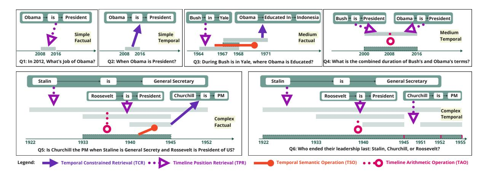
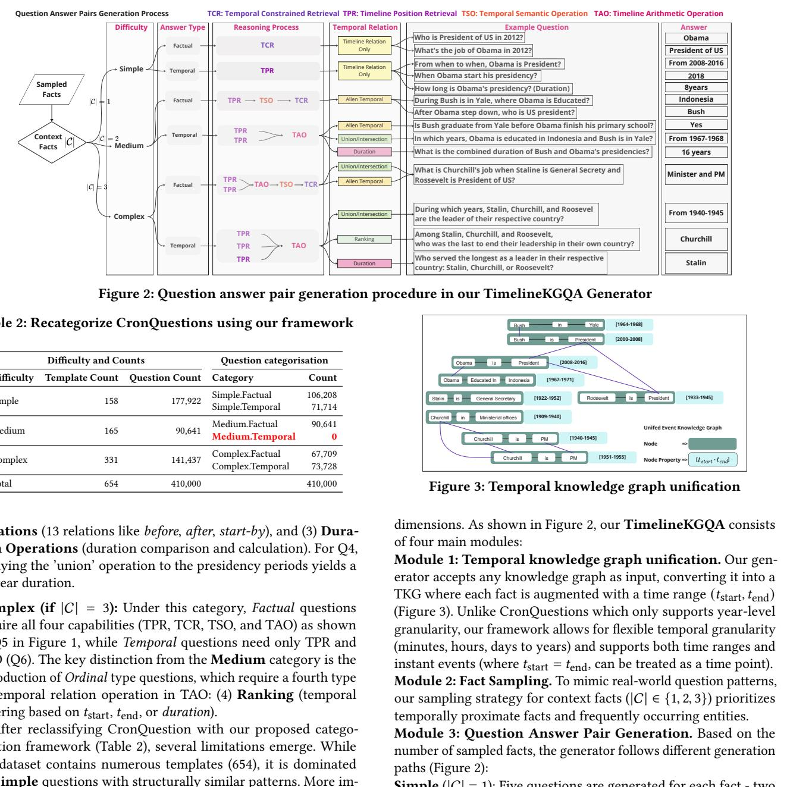
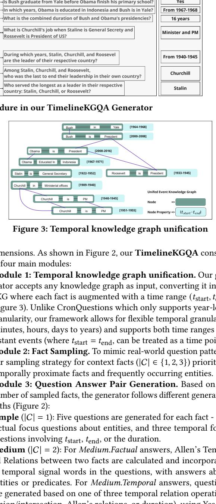

# TimelineKGQA: A Comprehensive Question-Answer Pair Generator for Temporal Knowledge Graphs

[Qiang Sun](https://orcid.org/0000-0002-4445-0025)

pascal.sun@research.uwa.edu.au The University of Western Australia Perth, WA, Australia

[Sirui Li](https://orcid.org/0000-0002-2504-3790) sirui.li@murdoch.edu.au Murdoch University Perth, WA, Australia

[Mark Reynolds](https://orcid.org/0000-0002-5415-0544) mark.reynolds@uwa.edu.au The University of Western Australia Perth, WA, Australia

[Wei Liu](https://orcid.org/0000-0002-7409-0948) wei.liu@uwa.edu.au The University of Western Australia Perth, WA, Australia

**Table 1:** Summary of existing TKGQA datasets

[Du Huynh](https://orcid.org/0000-0003-3080-9655) du.huynh@uwa.edu.au The University of Western Australia Perth, WA, Australia

| | | TempQuestions Time-Sensitive QA TimeQuestions CronQuestions | | | TIQ | |
|-------------------|-----------------|-------------------------------------------------------------|-----------------|----------------------------------|----------|--|
| Author | Jia et al. [2] | Chen et al. [1] | Jia et al. [5] | Saxena et al. [7] Jia et al. [4] | | |
| Year | 2018 | 2021 | 2021 | 2021 | 2024 | |
| Size | 1,364 | 20,000 | 16,181 | 410k | 10,000 | |
| Source | 3 KGQA datasets | WikiData | 8 KGQA datasets | WikiData | WikiData | |
| Explicit/Implicit | ✓ | ✓ | ✓ | ✗ | ✓ | |
| Simple Time | ✓ | ✓ | ✓ | ✓ | ✓ | |
| Simple Entity | ✗ | ✗ | ✗ | ✓ | ✗ | |
| Before/After | ✗ | ✗ | ✗ | ✓ | ✗ | |
| Time Join | ✗ | ✗ | ✗ | ✓ | ✗ | |
| First/Last | ✗ | ✗ | ✗ | ✓ | ✗ | |
| Ordinal | ✓ | ✓ | ✓ | ✗ | ✗ | |
| Aggregation | ✗ | ✓ | ✗ | ✗ | ✗ | |

and most complex TKGQA dataset available, current TKG embeddingbased QA methods have already achieved Hits@1 metrics well above 0.9. More concerning is the trend observed in recent publications: the work proposed by [Liu et al.](#page-3-6) [\[6\]](#page-3-6) in 2023 achieved 0.969 for Hits@1, followed by two suspicious works by [Zha et al.](#page-3-7) [\[9\]](#page-3-7) and [Xue et al.](#page-3-8) [\[8\]](#page-3-8) in 2024 that present nearly identical methodological pipelines and benchmark results without cross-referencing. Notably, the ablation study diagram in [\[8\]](#page-3-8) is identical to that of [\[6\]](#page-3-6). This situation not only highlights potential academic integrity concerns but also exemplifies how current dataset limitations are effectively blocking advancement in TKGQA research.

Secondly, from the dataset perspective, since the introduction of TempQuestions [\[2\]](#page-3-2), the TKGQA research community has recognized the need to address complex temporal questions, yet approaches to modeling this complexity remain divergent. While TempQuestions initially considered ordinal and implicit questions as complex, subsequent datasets [\[1,](#page-3-3) [3,](#page-3-9) [5,](#page-3-4) [7\]](#page-3-1) explored different dimensions including Before/After relationships, First/Last ordering, and Aggregation operations. However, no existing dataset comprehensively incorporates all these complexity dimensions - even CronQuestion [\[7\]](#page-3-1), the largest available dataset, lacks temporal aggregation questions such as How long in total did Obama and Bush served as president of the US?, as summarized in Table [1.](#page-0-0) This suggests the fundamental challenge lies in developing a comprehensive categorization framework that can characterize various dimensions of temporal complexity within a unified dataset.

Thirdly, while Large Language Models offer promising directions for domain-specific TKGQA applications through fine-tuning, the lack of effective temporal QA pair generation methods for private domains has left this potential largely unexplored.

## ABSTRACT

Question answering over temporal knowledge graphs (TKGs) is crucial for understanding evolving facts and relationships, yet its development is hindered by limited datasets and difficulties in generating custom QA pairs. We propose a novel categorization framework based on timeline-context relationships, along with TimelineKGQA, a universal temporal QA generator applicable to any TKGs. The code is available at: [https://github.com/PascalSun/](https://github.com/PascalSun/TimelineKGQA) [TimelineKGQA](https://github.com/PascalSun/TimelineKGQA) as an open source Python package.

### CCS CONCEPTS

• Do Not Use This Code → Generate the Correct Terms for Your Paper; Generate the Correct Terms for Your Paper; Generate the Correct Terms for Your Paper; Generate the Correct Terms for Your Paper.

## KEYWORDS

knowledge graph, temporal knowledge graph, question answering

### ACM Reference Format:

Qiang Sun, Sirui Li, Du Huynh, Mark Reynolds, and Wei Liu. 2024. TimelineKGQA: A Comprehensive Question-Answer Pair Generator for Temporal Knowledge Graphs. In Proceedings of The Web Conference 2025 (WWW). ACM, New York, NY, USA, [4](#page-3-0) pages.<https://doi.org/XXXXXXX.XXXXXXX>

### 1 INTRODUCTION

Temporal knowledge graphs (TKGs) extend standard knowledge graph triples (1, , 2) to quintuples (1, , 2, start, end) by incorporating temporal stamps. TKGQA, temporal knowledge graph question answering, can be seen as a transitional task from knowledge graph information retrieval (IR) to knowledge graph reasoning, in particular, temporal reasoning.

Firstly, current research in TKGQA is significantly constrained by dataset limitations. While CronQuestion [\[7\]](#page-3-1) stands as the largest

WWW, April 28–May 02, 2025, Sydney, Australia

© 2024 Copyright held by the owner/author(s). Publication rights licensed to ACM. ACM ISBN 978-1-4503-XXXX-X/18/06. . . \$15.00 <https://doi.org/XXXXXXX.XXXXXXX>

Permission to make digital or hard copies of all or part of this work for personal or classroom use is granted without fee provided that copies are not made or distributed for profit or commercial advantage and that copies bear this notice and the full citation on the first page. Copyrights for components of this work owned by others than the author(s) must be honored. Abstracting with credit is permitted. To copy otherwise, or republish, to post on servers or to redistribute to lists, requires prior specific permission and/or a fee. Request permissions from permissions@acm.org.

<!-- Image Description: The image presents six example question-answer pairs illustrating different types of temporal reasoning. Each pair shows a timeline with boxes representing entities and their relationships, along with colored symbols (purple triangles, red circles, magenta dots) representing different reasoning operations (Temporal Constrained Retrieval, Timeline Position Retrieval, Temporal Semantic Operation, Timeline Arithmetic Operation). The purpose is to visually categorize and exemplify the complexity of temporal question answering. -->

**Figure 1:** Categorization framework for Temporal Questions

We propose a comprehensive temporal question categorization framework by treating timeline linearly and homogeneously, addressing complexity through multiple dimensions: (1) context complexity (Simple, Medium, Complex), (2) answer focus (Temporal vs. Factual), (3) temporal relations (Thirteen Allen Temporal Relations, Three Time Range Set Relations, Duration Comparisons and Ranking), and (4) temporal capabilities, grouped into temporal retrieval capabilities (temporal constrained retrieval (TCR) and timeline position retrieval (TPR)) and temporal operation capabilities (temporal semantic operation (TSO) and timeline arithmetic operation (TAO)). Based on this framework, we develop a Python package that can generate TKGQA datasets incorporating all these complexity dimensions from any given TKG, supporting answer formats including not only traditional entity and timestamp answers, but also Yes/No, time range, and duration answers.

### 2 RELATED WORK

TempQuestions [\[2\]](#page-3-2), one of the early TKGQA datasets, introduced basic categories including Explicit Temporal, Implicit Temporal, Temporal Answer, and Ordinal Constraints. CronQuestions [\[7\]](#page-3-1) further developed this categorization with Simple Time, Simple Entity, Before/After, First/Last, and Time Join, essentially extending temporal relations through a fuzzy version of Allen's temporal logic. Complex-CronQuestions [\[5\]](#page-3-4) focused on complex questions, while the recent Temporal Implicit Questions (TIQ) [\[4\]](#page-3-5) dataset emphasized challenging implicit questions. However, as shown in Table [1,](#page-0-0) these datasets not only lack comprehensive coverage of temporal question types (e.g., Aggregation, Ordinal, First/Last), but more fundamentally, they fail to establish a systematic framework for characterizing temporal complexity across different dimensions. This absence of a multi-dimensional temporal complexity framework, combined with incomplete coverage of temporal operations, significantly limits our ability to advance TKGQA research.

### 3 CONCEPTS AND NOTATION

TKG. A TKG, denoted as G := (E, R, T, F ), is a directed graph that incorporates temporal relationships between entities. In this notation, E represents the set of entities, R denotes the set of relations, T signifies the set of timestamps, and F is the set of facts. Each fact is represented as = (1, , 2, start, end), where ∈ F; 1, 2 ∈ E; ∈ R and start, end ∈ T.

TKGQA and Context Facts. Given a TKG G and a natural language question , TKGQA aims to find the relevant facts in F that can answer . These relevant facts are referred to as context facts, represented as a set C = {1, 2, ...} ⊂ F where |C| is the number of contextual facts for .

### 4 QUESTION COMPLEXITY DIMENSIONS

Our categorization framework classifies question-answer pairs based on four dimensions: context complexity (|C|), answer focus, temporal relations, and temporal capabilities, with detailed illustrations shown in Figures [1](#page-1-0) and [2.](#page-2-0)

Simple (if |C| = 1): Questions requiring a single context fact are further categorized by their answer focus. Factual questions need temporal constrained retrieval (TCR) to find facts within given time constraints ( ′ start, ′ end), while Temporal questions require timeline position retrieval (TPR) to determine time ranges (start, end) of given facts. In Figure [1,](#page-1-0) Q1 exemplifies Simple.Factual and Q2 represents Simple.Temporal.

Medium (if |C| = 2): Questions involving two context facts require more complex temporal capabilities. For Factual questions, both TPR and TCR are needed, along with temporal semantic operation (TSO). For example, Q3 in Figure [1](#page-1-0) first uses TPR to retrieve Bush's Yale period = (1964, 1968), then applies TSO with the temporal signal "during" to infer a new time range ′ = (1964, 1968), and finally uses TCR with the new ′ to retrieve Obama's education facts within this period. TSO generates a new time range ′ based on a time range = (start, end) and a temporal signal word (e.g., before, after, during):

$$
T' = op(w, t_{start}, t_{end})
$$
(1)

For Temporal questions like Q4, TPR will be first applied to retrieve relevant time ranges (e.g., presidency periods of Bush and Obama), then Timeline Arithmetic Operation (TAO) processes these ranges through three types of temporal relation operations: (1) Set Operations (union, intersection, negation), (2) Allen's Temporal

<!-- Image Description: Figure 2 is a flowchart illustrating a question-answer pair generation process, categorized by question difficulty (simple, medium, complex) and answer type (factual, temporal). It details the reasoning process using Temporal Constrained Retrieval (TCR), Timeline Position Retrieval (TPR), Temporal Semantic Operation (TSO), and Timeline Arithmetic Operation (TAO). Figure 3 displays a temporal knowledge graph unification, showing how individual facts with time ranges are integrated into a unified event knowledge graph. The figures demonstrate the framework's capabilities in handling temporal information for question answering. -->

**Figure 2:** Question answer pair generation procedure in our TimelineKGQA Generator

**Table 2:** Recategorize CronQuestions using our framework

| | Difficulty and Counts | Question categorisation | | |
|------------|-----------------------|-------------------------|---------------------------------------------|-------------------|
| Difficulty | Template Count | Question Count | Category | Count |
| Simple | 158 | | 177,922 Simple.Factual Simple.Temporal | 106,208 71,714 |
| Medium | 165 | | 90,641 Medium.Factual Medium.Temporal | 90,641 0 |
| Complex | 331 | | 141,437 Complex.Factual Complex.Temporal | 67,709 73,728 |
| Total | 654 | 410,000 | | 410,000 |

Relations (13 relations like before, after, start-by), and (3) Duration Operations (duration comparison and calculation). For Q4, applying the 'union' operation to the presidency periods yields a 16-year duration.

Complex (if |C| = 3): Under this category, Factual questions require all four capabilities (TPR, TCR, TSO, and TAO) as shown in Q5 in Figure 1, while Temporal questions need only TPR and TAO (Q6). The key distinction from the Medium category is the introduction of Ordinal type questions, which require a fourth type of temporal relation operation in TAO: (4) Ranking (temporal ordering based on start, end, or duration).

After reclassifying CronQuestion with our proposed categorization framework (Table 2), several limitations emerge. While the dataset contains numerous templates (654), it is dominated by Simple questions with structurally similar patterns. More importantly, it lacks diversity in temporal relation complexity: the Medium.Temporal category is entirely absent, ranking questions are limited to "first" and "last" operations, and Allen's temporal relations only cover basic relationships (before, after, during). The dataset also lacks duration comparisons and time range inference questions.

### 5 QUESTION ANSWER PAIR GENERATOR

Based on the aforementioned categorization framework, we develop TimelineKGQA, an open-source automated QA pair generator for temporal knowledge graphs. This tool can generate diverse QA pairs from any TKG while incorporating all identified complexity

<!-- Image Description: Figure 3 displays a temporal knowledge graph, illustrating the unification module of the TimelineKGQA system. The graph visually represents facts about historical figures (Obama, Bush, Stalin, Churchill, Roosevelt) and their activities, each fact augmented with a time range [tstart, tend]. The graph's purpose is to show how the system integrates temporal information into a knowledge graph for question answering. -->

**Figure 3:** Temporal knowledge graph unification

dimensions. As shown in Figure 2, our TimelineKGQA consists of four main modules:

Module 1: Temporal knowledge graph unification. Our generator accepts any knowledge graph as input, converting it into a TKG where each fact is augmented with a time range (start, end) (Figure 3). Unlike CronQuestions which only supports year-level granularity, our framework allows for flexible temporal granularity (minutes, hours, days to years) and supports both time ranges and instant events (where start = end, can be treated as a time point). Module 2: Fact Sampling. To mimic real-world question patterns, our sampling strategy for context facts (|C| ∈ {1, 2, 3}) prioritizes temporally proximate facts and frequently occurring entities.

Module 3: Question Answer Pair Generation. Based on the number of sampled facts, the generator follows different generation paths (Figure 2):

Simple (|C| = 1): Five questions are generated for each fact - two factual focus questions about entities, and three temporal focus questions involving start, end, or the duration.

Medium (|C| = 2): For Medium.Factual answers, Allen's Temporal Relations between two facts are calculated and incorporated as temporal signal words in the questions, with answers about entities or predicates. For Medium.Temporal answers, questions are generated based on one of three temporal relation operations (union/intersection, Allen's relations, or duration), using Yes/No, multiple-choice or open-end answer format.

Complex (|C| = 3): Follows similar generation process, with additional support for ranking-based questions where fact rankings are calculated before question formulation.

Module 4: LLM Paraphrase. To avoid the limitations of templatebased questions (e.g., unnatural expressions and trivial entity matching seen in CronQuestions), we use an LLM to paraphrase questions into more natural and diverse expressions. The code for TimelineKGQA is available via GitHub[1](#page-3-10) .

### 6 DATASET GENERATION

Using TimelineKGQA, we create two benchmark datasets from the ICEWS Coded Event Data[2](#page-3-11) (Time Range) and CronQuestion knowledge graph (Time Point) for demonstration purposes, generating 89,372 and 41,720 questions respectively. The distribution of questions across categories and answer types for both ICEWS Actor and CronQuestion KG datasets is shown in Tables [3](#page-3-12) and [4.](#page-3-13)

**Table 3:** Questions distribution across Train/Val/Test sets and required temporal capabilities for ICEWS Actor and Cron-Question KG.

| Source KG | | Train | Val | | Test Temporal capabilities | Count |
|-----------------|---------|--------|--------|--------|--------------------------------------|--------|
| ICEWS Actor | Simple | 17,982 | 5,994 | | 5,994 Temporal Constrained Retrieval | 34,498 |
| | Medium | 15,990 | 5,330 | | 5,330 Timeline Position Retrieval | 79,382 |
| | Complex | 19,652 | 6,550 | | 6,550 Timeline Operation | 34,894 |
| | | | | | Temporal Semantic Operation | 24,508 |
| | Total | 53,624 | 17,874 | 17,874 | | 89,372 |
| CronQuestion KG | Simple | 7,200 | 2,400 | | 2,400 Temporal Constrained Retrieval | 19,720 |
| | Medium | 8,252 | 2751 | | 2751 Timeline Position Retrieval | 37,720 |
| | Complex | 9580 | 3,193 | | 3,193 Timeline Arithmetic Operation | 21,966 |
| | | | | | Temporal Semantic Operation | 15,720 |
| | Total | 25,032 | 8,344 | 8,344 | | 41,720 |

**Table 4:** Distribution of various detailed answer types for ICEWS Actor and CronQuestions KG

| Detailed answer types | ICEWS Actor | CronQuestions KG | | |
|--------------------------------|-------------|------------------|--|--|
| Subject | 17,249 | 9,860 | | |
| Object | 17,249 | 9,860 | | |
| Timestamp Start | 4,995 | 2,000 | | |
| Timestamp End | 4,995 | 2,000 | | |
| Timestamp Range | 4,995 | 2,000 | | |
| Duration | 4,995 | 2,000 | | |
| Relation Duration | 9,971 | 4,000 | | |
| Relation Ranking | 4,981 | 2,000 | | |
| Relation Union or Intersection | 19,942 | 8,000 | | |

Due to the unique characteristics of our more challenging datasets, particularly the presence of time range inputs and diverse answer formats beyond simple entity/timestamp pairs, existing embeddingbased TKGQA models (which typically only handle time points as input and output either timestamps or entities) cannot be directly applied. To evaluate whether question difficulty aligns with our complexity categorization, we implement a Retrieval Augmented Generation (RAG) baseline. Facts are first encoded as natural language statements following the format

{subject} {predicate} {object} from {start} to {end}

and embedded using OpenAI'stext-embedding-3-small model. Queries are embedded similarly, followed with semantic similarity search retrieving the top relevant facts. We evaluate the retrieval performance using modified versions of Mean Reciprocal Rank (MRR) and

**Table 5:** RAG baseline performance. O: Overall, S: Simple, M: Medium, C: Complex.

| | ICEWS Actor | | | CronQuestions KG | | | | |
|----------------------------------------------------------|-------------|---|---|-------------------------------------------------|---|---|---|---|
| | O | S | M | C | O | S | M | C |
| MRR ↑ | | | | 0.365 0.726 0.274 0.106 0.331 0.771 0.218 0.101 | | | | |
| Hits@1 ↑ 0.265 0.660 0.128 0.011 0.235 0.704 0.092 0.009 | | | | | | | | |
| Hits@3 ↑ 0.391 0.776 0.331 0.086 0.348 0.824 0.249 0.077 | | | | | | | | |

Hits@K metrics, where for questions requiring multiple context facts (2 facts for Medium, 3 for Complex), all context facts must be retrieved within the top |C| · positions.

The results are reported in Table [5,](#page-3-14) showing that our categorisation framework effectively reflects question difficulty, as RAG's performance consistently decreases from Simple to Medium and Complex categories (e.g., Hits@1 on ICEWS Actor drops from 0.660 to 0.128 and 0.011 respectively).

### 7 CONCLUSION

We present a comprehensive temporal question categorization framework and a universal TKGQA dataset generator that addresses the limitations of existing datasets. Our framework introduces a systematic approach to classify question complexity through context facts, answer focus, and temporal operations, while identifying four key temporal capabilities (TCR, TPR, TSO, and TAO). Using our TimelineKGQA generator to create two benchmark datasets, we demonstrate that question difficulty aligns with our complexity categorization through empirical evaluation. This work provides a foundation for developing and evaluating more advanced TKGQA solutions, and enables widespread application in private domains.

### REFERENCES

- [1] Wenhu Chen, Xinyi Wang, and William Yang Wang. 2021. A Dataset for Answering Time-Sensitive Questions. arXiv[:2108.06314 \[cs\]](https://arxiv.org/abs/2108.06314 [cs])<http://arxiv.org/abs/2108.06314>
- [2] Zhen Jia, Abdalghani Abujabal, Rishiraj Saha Roy, Jannik Strötgen, and Gerhard Weikum. 2018. TempQuestions: A Benchmark for Temporal Question Answering. In Companion of the The Web Conference 2018 (Lyon, France, 2018). ACM Press, 1057–1062.<https://doi.org/10.1145/3184558.3191536>
- [3] Zhen Jia, Philipp Christmann, and Gerhard Weikum. 2024. Faithful Temporal Question Answering over Heterogeneous Sources. In Proceedings of the ACM on Web Conference 2024. ACM, 2052–2063.<https://doi.org/10.1145/3589334.3645547>
- [4] Zhen Jia, Philipp Christmann, and Gerhard Weikum. 2024. TIQ: A Benchmark for Temporal Question Answering with Implicit Time Constraints. In Companion Proceedings of the ACM on Web Conference 2024. ACM, 1394–1399. [https://doi.org/](https://doi.org/10.1145/3589335.3651895) [10.1145/3589335.3651895](https://doi.org/10.1145/3589335.3651895)
- [5] Zhen Jia, Soumajit Pramanik, Rishiraj Saha Roy, and Gerhard Weikum. 2021. Complex Temporal Question Answering on Knowledge Graphs. In Proceedings of the 30th ACM International Conference on Information & Knowledge Management (CIKM '21). Association for Computing Machinery, 792–802. [https://doi.org/10.](https://doi.org/10.1145/3459637.3482416) [1145/3459637.3482416](https://doi.org/10.1145/3459637.3482416)
- [6] Yonghao Liu, Di Liang, Mengyu Li, Fausto Giunchiglia, Ximing Li, Sirui Wang, Wei Wu, Lan Huang, Xiaoyue Feng, and Renchu Guan. 2023. Local and Global: Temporal Question Answering via Information Fusion. In Proceedings of the Thirty-Second International Joint Conference on Artificial Intelligence. 5141–5149. [https:](https://doi.org/10.24963/ijcai.2023/571) [//doi.org/10.24963/ijcai.2023/571](https://doi.org/10.24963/ijcai.2023/571) Main Track.
- [7] Apoorv Saxena, Soumen Chakrabarti, and Partha Talukdar. 2021. Question Answering Over Temporal Knowledge Graphs. In Proceedings of the 59th Annual Meeting of the Association for Computational Linguistics and the 11th International Joint Conference on Natural Language Processing (Online, 2021-08). 6663–6676. <https://doi.org/10.18653/v1/2021.acl-long.520>
- [8] Chao Xue, Di Liang, Pengfei Wang, and Jing Zhang. 2024. Question Calibration and Multi-Hop Modeling for Temporal Question Answering. Proceedings of the AAAI Conference on Artificial Intelligence 38, 17 (Mar. 2024), 19332–19340. [https:](https://doi.org/10.1609/aaai.v38i17.29903) [//doi.org/10.1609/aaai.v38i17.29903](https://doi.org/10.1609/aaai.v38i17.29903)
- [9] Zhiyuan Zha, Pengnian Qi, Xigang Bao, Mengyuan Tian, and Biao Qin. 2024. M3TQA: Multi-View, Multi-Hop and Multi-Stage Reasoning for Temporal Question Answering. In ICASSP 2024 - 2024 IEEE International Conference on Acoustics, Speech and Signal Processing (ICASSP). 10086–10090. [https://doi.org/10.1109/ICASSP48485.](https://doi.org/10.1109/ICASSP48485.2024.10448071) [2024.10448071](https://doi.org/10.1109/ICASSP48485.2024.10448071)

1<https://github.com/PascalSun/TimelineKGQA>

2<https://dataverse.harvard.edu/dataset.xhtml?persistentId=doi:10.7910/DVN/28075>
