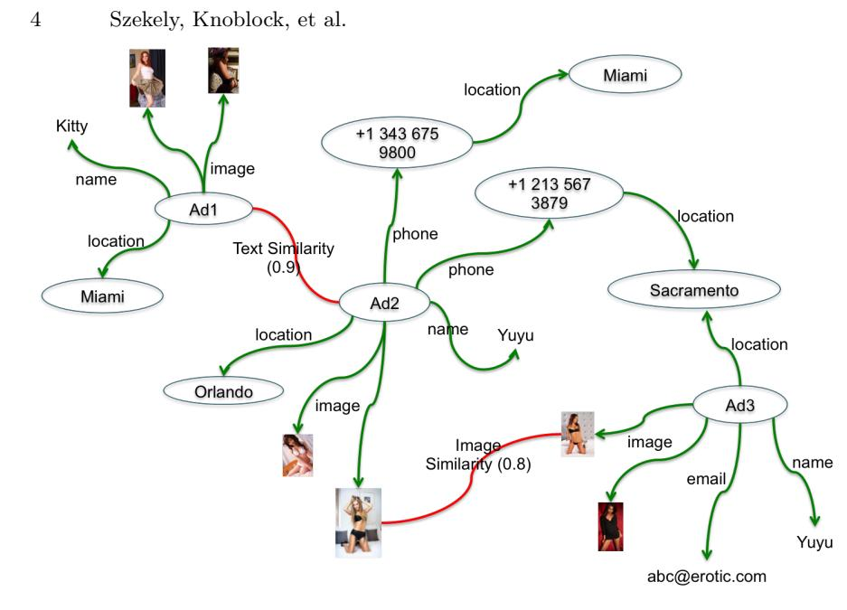
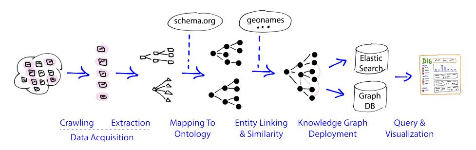
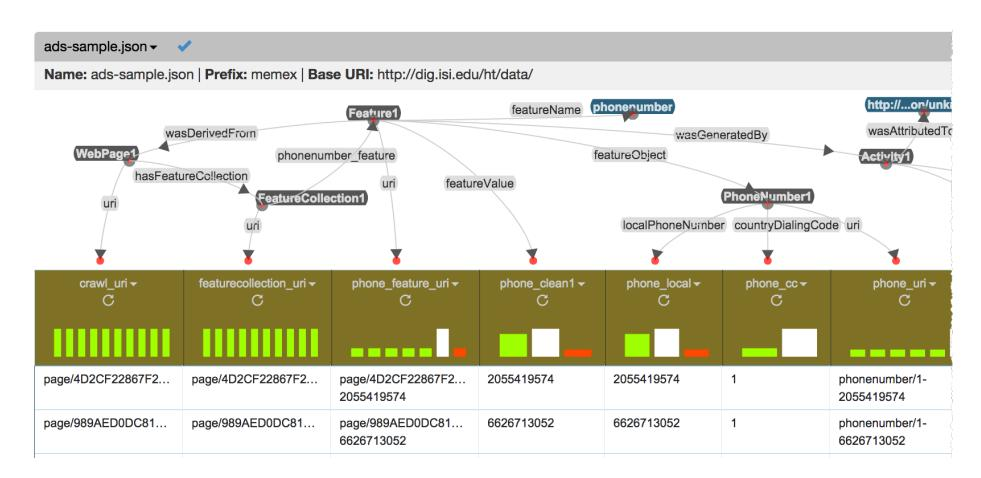

# Building and Using a Knowledge Graph to Combat Human Trafficking

Pedro Szekely<sup>1</sup> , Craig A. Knoblock<sup>1</sup> , Jason Slepicka<sup>1</sup> , Andrew Philpot<sup>1</sup> , Amandeep Singh<sup>1</sup> , Chengye Yin<sup>1</sup> , Dipsy Kapoor<sup>1</sup> , Prem Natarajan<sup>1</sup> , Daniel Marcu<sup>1</sup> , Kevin Knight<sup>1</sup> , David Stallard<sup>1</sup> , Subessware S. Karunamoorthy<sup>1</sup> , Rajagopal Bojanapalli<sup>1</sup> , Steven Minton<sup>2</sup> , Brian Amanatullah<sup>2</sup> , Todd Hughes<sup>3</sup> , Mike Tamayo<sup>3</sup> , David Flynt<sup>3</sup> , Rachel Artiss<sup>3</sup> , Shih-Fu Chang<sup>4</sup> , Tao Chen<sup>4</sup> , Gerald Hiebel<sup>5</sup> , and Lidia Ferreira<sup>6</sup>

<sup>1</sup> University of Southern California, Information Sciences Institute, Marina del Rey, CA, USA 2

InferLink Corporation, El Segundo, CA, USA <sup>3</sup> Next Century Corporation, Columbia, MD, USA

<sup>4</sup> Columbia University, New York, USA <sup>5</sup> Universitt Innsbruck, Austria <sup>6</sup> Universidade Federal de Minas Gerais, Brazil

Abstract. There is a huge amount of data spread across the web and stored in databases that we can use to build knowledge graphs. However, exploiting this data to build knowledge graphs is difficult due to the heterogeneity of the sources, scale of the amount of data, and noise in the data. In this paper we present an approach to building knowledge graphs by exploiting semantic technologies to reconcile the data continuously crawled from diverse sources, to scale to billions of triples extracted from the crawled content, and to support interactive queries on the data. We applied our approach, implemented in the DIG system, to the problem of combating human trafficking and deployed it to six law enforcement agencies and several non-governmental organizations to assist them with finding traffickers and helping victims.

Keywords: linked data, knowledge graphs, entity linkage, data integration, information extraction

# 1 Introduction

Human trafficking is a form of modern slavery where people profit from the control and exploitation of others, forcing them to engage in commercial sex or to provide services against their will. The statistics of the problem are shocking. In 2014 the International Labor Organization on The Economics of Forced Labour<sup>7</sup> reported that \$99 billion came from commercial sexual exploitation. Polaris<sup>8</sup> reports that in the United States 100,000 children are estimated to be involved

<sup>7</sup> http://bit.ly/1oa2cR3

<sup>8</sup> http://www.polarisproject.org/index.php

in the sex trade each year, and that the total number of victims is likely much larger when estimates of both adults and minors as well as sex trafficking and labor trafficking are aggregated. Estimates indicate that traffickers control an average of six victims and derive \$150,000 from each victim per year. The sex trafficking industry is estimated to spend about \$30 million in online advertising each year. These advertisements appear in hundreds of web sites that advertise escort services, massage parlors, etc. The total number of such advertisements is unknown, but our database of escort ads crawled from the most popular sites contains over 50 million ads.

The objective of our work is to create generic technology to enable rapid construction of knowledge graphs for specific domains together with query, visualization and analysis capabilities that enable end-users to solve complex problems. The challenge is to exploit all available sources, including web pages, document collections, databases, delimited text files, structured data such as XML or JSON, images, and videos. This paper describes the technologies and their application to build a large knowledge graph for the human trafficking domain. We focus on the role of Semantic Web techniques to address the technical challenges, and we describe the challenges in using Semantic Web techniques given the scale of the data, the performance requirements of the application, and the social challenges of working within a large consortium of developers unfamiliar with Semantic Web technologies.

In the following sections we describe the challenges that we faced, present our approach to building a knowledge graph applied to human trafficking and how we addressed these challenges, describe how the system is being used in practice, and then present the related work, discussion, and future directions.

# 2 Challenges

The main source of data for the human trafficking domain is the web. There are hundreds of web sites containing millions of escort ads that sex providers use to attract clients. Figure 1 shows a screenshot of one web site containing the titles of escort ads. The actual ads contain photos of the provider and text that describe the services provided, prices and contact information. The ads use coded language, and often purposefully obfuscate the information to make it difficult for law enforcement to use search engines such as Google to look for information, as shown here:

The phone number is obfuscated, using unicode characters and letters to code the phone number. The rates are listed as roses instead of dollars, and abbreviations such as HH stand for time periods (half hour). Capitalization is often arbitrary, which lowers the effectiveness of standard entity extractors.

Building and Using a Knowledge Graph to Combat Human Trafficking 3

Fig. 1. Example page with an index of escort ads

In addition to escort ads, we use reference datasets such as Geonames, which provides geographic location information, and phone exchange databases, which provide information about the locations where phone numbers are registered.

Figure 2 shows a small example of the knowledge graph that we want to construct. The graph has nodes representing ads and data extracted from the ads, including images, phone numbers, locations and working names. The figure does not show a wide array of other attributes extracted from ads, including the title and text of the ad, physical attributes such as ethnicity, eye color, and hair type, and attributes such as rates. Note that the graph includes edges that represent the output of analytic processes such as Jaccard similarity among the text of ads and similarity of the images.

The main objective of our work is to construct a high quality knowledge graph and to provide a flexible and easy-to-use query interface to enable law enforcement agencies and non-governmental organizations (NGOs) to investigate leads and to assemble comprehensive evidence of trafficking for legal cases. A typical law enforcement scenario is to search the graph using the phone number of a suspected trafficker, retrieve all ads that mention the phone number, display the ads on a map or a timeline, find other ads that contain similar images or text, assemble a list of other phone numbers mentioned in the resulting set of ads, and then cross-reference the discovered numbers in law enforcement databases. A typical NGO scenario is to assist families in identifying lost children. In this case, strong attributes such as phone numbers are usually not available, so the search uses soft attributes such as physical characteristics, photos, likely locations, etc.

Building a knowledge graph to effectively support these types of scenarios requires addressing a number of challenges:

No agreement on APIs or schemas: Our team is part of a large consortium of over 15 organizations funded to develop "domain-specific search and indexing" technology and applying it to address the human trafficking challenge. Different organizations focus on different aspects of the problem, crawling, extraction, knowledge-graph creation, query, analytics and visualization. Needless to say, it


<!-- Image Description: The image is a graph illustrating relationships between online advertisements (Ad1, Ad2, Ad3). Nodes represent ads, locations (Miami, Orlando, Sacramento), names (Kitty, Yuyu), phone numbers, emails, and images. Edges, colored green and red, show connections; green indicates attributes associated with ads, while red represents text (0.9 similarity) and image (0.8 similarity) comparisons between ads. The graph visually depicts the similarity and connections between seemingly unrelated advertisements based on shared attributes. -->

Fig. 2. Example knowledge graph

is not possible for a large group of organizations to agree on APIs or schemas for the inputs and outputs of the various components of a larger system. For example, several organizations are developing extraction technologies focusing on different aspects of the problem. The result is a collection of extraction tools that produce output in completely different formats and using completely different schemas. Some encode their extractions in relational databases, some produce text delimited files, and some produce JSON objects. All use different attribute names and structures to encode the information, and they produce literals in different formats (different formats for dates, phone numbers, etc., different units for physical characteristics, time periods, etc.) Our challenge as builders of the knowledge graph is to consume the output of the various extractor and analytic components produced by other organizations.

Provenance: A key requirement for law enforcement is to trace back from the knowledge graph to the original documents as they need to subpoena the raw documents from the web site providers. Furthermore, different extractors often extract the same attributes from pages (e.g., multiple phone number extractors) and sometimes they produce conflicting extractions. To produce a high quality knowledge graph, it is necessary to reason about the origin of the different extractors to determine which extractions should be added to the knowledge graph and which ones should be discarded. To address this concern, it is necessary to record provenance for every node and edge in the knowledge graph.

Scale: The consortium has already crawled 50 million web pages, and is continuously crawling the sources, producing on average 160,000 additional pages every day resulting in a knowledge graph with over 1.4 billion nodes. One challenge is to rebuild the complete knowledge graph from scratch in less than one day to incorporate improvements resulting from new versions of extractors and other software components. A second challenge is to incrementally extend the knowledge graph to incorporate the data from newly crawled pages.

Query flexibility and performance: Today's users expect the ease of use and performance of search engines such as Google and web portals such as Amazon. A key challenge is to support efficient keyword search to produce a ranked list of matching nodes and to support efficient faceted browsing to enable users to quickly and easily filter the results.

Opposition to Semantic Web technology: Most other organizations in the consortium are unfamiliar with Semantic Web technologies, and after initial discussions, clearly unwilling to learn or use these technologies. Our challenge is to seamlessly integrate the Semantic Web technologies we advocate with the "mainstream" technologies that other organizations are comfortable with (e.g., relational databases, NoSQL, Hadoop, JSON).

# 3 Building Knowledge Graphs

In this section we describe our overall approach to building knowledge graphs. We present the techniques using the human trafficking domain as an example, although the general approach can be applied to many other domains. Figure 3 shows the architecture of the overall system, called DIG (Domain-Insight Graphs). Each of the following subsections present the components of the DIG architecture in detail and describes how they were applied on the human trafficking data to build a knowledge graph for that domain.

## 1 Data Acquisition

Data acquisition requires finding relevant pages and extracting the required information from those pages. DIG uses Apache Nutch (nutch.apache.org) to support crawling at scale. Nutch offers a RESTful configuration interface that makes it easy to specify the URL patterns to be crawled, to monitor crawling


<!-- Image Description: This flowchart illustrates a knowledge graph construction pipeline. It depicts data acquisition (crawling and extraction), mapping to ontologies (schema.org and geonames), entity linking and similarity checks, knowledge graph deployment to ElasticSearch and a Graph DB, and finally, query and visualization. Nodes and edges represent the data transformations at each stage. The final output is a visualized query result from the knowledge graph. -->

Fig. 3. Architecture for building a knowledge graph

progress, and to define revisit cycles to re-crawl periodically, downloading revisions to already crawled pages. To support focused crawling, we integrated a semi-structured content extractor into Nutch. The extractor can identify specific elements within a page, such as the list page with the ads shown in Figure 1, and direct Nutch to follow only those links.

After crawling, the next step is to extract features from the harvested data to produce a structured representation that can be used for indexing and linking in the next step of the DIG construction pipeline. Given the wide variety of pages and data on the web, it is infeasible to develop data extraction technology that works for any page and any type of data. DIG provides an open architecture that makes it easy to integrate a wide range of extraction technologies, so that data scientists can select the extraction technology most appropriate for the pages in their application domain. In addition to providing an open data extraction architecture, DIG also provides components for extracting data from both semistructured pages and plain text.

The DIG semi-structured page extractor, called the landmark extractor, identifies elements in a page using landmarks defined with regular expressions. DIG provides a learning component that automatically infers rules for the landmark extractor from examples. To train an extractor, the data scientist provides a collection of pages and corresponding extractions (e.g., name, phone number and location from a set of pages that all come from the same site). Using a handful of examples, the learning component automatically creates a landmark extractor that extracts data from similar pages.

To support extraction from text, DIG offers a capability to enable data scientists to easily train extractors specialized to an application domain. In the human trafficking domain we need to extract data elements such as eye-color, hair type and color, and ethnicity from the escort advertisements. To train a new extractor for a text corpus, a data scientist highlights the desired data elements in a small number of sample sentences or short paragraphs selected from the corpus. For example, in the sentence "Perfect Green eyes Long curly black hair Im a Irish, Armenian and Filipino", the data scientists highlights "Green eyes" and "Long curly black hair". After the data scientist designates a text corpus and defines the examples, DIG automatically constructs thousands of tasks to acquire additional annotations using the Amazon Mechanical Turk crowd sourcing platform (www.mturk.com). The output of the Mechanical Turk tasks feeds a Conditional Random Field [6] that learns an extractor from the annotations provided.

### 2 DIG Ontology

The DIG ontology defines the terminology for representing the nodes and edges of the knowledge graph. A key decision in the design of our knowledge graph is the desire to record provenance data for each node and edge of the graph. In addition, we want to store the values of nodes in different representations, including a string representation used for keyword search and display, and a structured representation used for structured query and analysis.

Consider, for example, the representation of a phone number (e.g., +1 343 675 9800) extracted from an ad (e.g., Ad2). Figure 2 depicts the ad and the phone number as nodes and uses a labeled edge to depict the relationship. The figure does not show the provenance and other metadata associated with each node and edge in the graph.

Unfortunately, RDF does not provide a convenient way to represent provenance and other metadata for each edge in the graph. The recommended way is to represent this information using reification. Reification is inconvenient as the metadata points to the edge it annotates, and retrieving it requires an additional query that requires a join.

In DIG we represent the graph edges as first class objects called Features. Each node in the graph can contain a collection of Feature objects, where each Feature represents an outgoing edge from the node. To represent the knowledge graph in RDF we introduce the following classes and properties:

```text
FeatureCollection a owl:Class .
hasFeatureCollection a owl:ObjectProperty ;
    rdfs:range FeatureCollection .
Feature a owl:Class .
featureValue a owl:DatatypeProperty ;
    rdfs:domain Feature .
featureObject a owl:ObjectProperty ;
    rdfs:domain Feature .
```text

An instance of FeatureCollection represents the collection of edges associated with a node in the graph; hasFeatureCollection associates such an instance with a node in the graph. An instance of Feature represents an edge in the graph. The featureValue represents the value of the Feature as a literal and corresponds to what normally would be a data property in an ontology. When the value of a Feature can also be represented as a structured object, featureObject represents the value of the feature as an RDF object. For each type of edge in the graph, the ontology also includes a property as illustrated in the following example for phone numbers:

```text
phonenumber_feature a owl:ObjectProperty ;
    rdfs:domain FeatureCollection ;
    rdfs:range Feature .
```text

The main benefit of our ontology is that all the information about a node or an edge in the graph can be conveniently accessed using property paths without the need to do separate queries to retrieve metadata or provenance. Consider the following examples:

```text
1. hasFeatureCollection / phonenumber_feature
2. hasFeatureCollection / phonenumber_feature / featureValue
3. hasFeatureCollection / phonenumber_feature / featureObject
4. hasFeatureCollection / phonenumber_feature / featureObject / countryCode
5. hasFeatureCollection / phonenumber_feature / prov:wasDerivedFrom
6. hasFeatureCollection / phonenumber_feature / prov:wasAttributedTo
```text


<!-- Image Description: The image displays a graph-based visualization of data from a JSON file ("ads-sample.json"). Nodes represent entities (e.g., WebPage, PhoneNumber, FeatureCollection) and edges represent relationships (e.g., `wasDerivedFrom`, `hasFeatureCollection`). Below the graph, a table shows data instances linked to the nodes, with bar charts indicating data counts for specific URIs. The figure illustrates the data structure and relationships within the JSON file, likely to demonstrate the application of a knowledge representation or data integration method. -->

Fig. 4. Screenshot of Karma showing data extracted from escort ads and the associated model of this source for phone numbers

The first property path returns the Feature objects that hold the phone values as well as the provenance and other metadata associated with each phone number edge; the second one returns the phone numbers as literals, and the third returns the phone numbers as structured objects; the fourth returns the country codes of the phone numbers; the fifth returns the URIs of the original documents from which the phone numbers were extracted; and the sixth returns the URIs that identify the extraction software that produced the value. DIG uses the PROV ontology to record provenance.

### 3 Mapping Data to the DIG Ontology

The data extraction processes produce a variety of data in different formats. The next step towards construction of a knowledge graph is to convert all the extracted data as well as auxiliary structured sources to the DIG ontology. The data conversion process consists of two parts. We first define a mapping from the source schema to the ontology, and then we execute the mapping to convert the data into JSON-LD, a Linked Data representation in JSON.

To convert the data, we build on our previous work on Karma [5, 10, 11], which provides a semi-automatic approach to defining mappings from a data source to an ontology. Figure 4 is a screenshot of Karma showing the mapping of phone numbers extracted from escort ads to the DIG ontology. The challenge in using Karma for this task was creating a representation of the data that could be efficiently queried and converting the data into this representation at a massive scale. In the remainder of this section, we first describe how Karma is used to clean and model the data and then we describe the new capabilities to support creating large-scale knowledge graphs.

Karma provides an integrated environment to clean data while mapping it to an ontology. The user interface for cleaning the data is similar to a spreadsheet in that users can define new attributes as functions of existing attributes. Karma uses Python as its formula language enabling users to define arbitrary data transformations succinctly. For example, the first column in Figure 4 (crawl uri) defines the URI for a page as the SHA1 hash<sup>9</sup> of the concatenation of the url and the timestamp attributes of the source. All other columns in the figure are also defined using Python scripts. Note that the phone clean1 column contains a normalized representation of the phone numbers.

The graph in the figure defines the mapping of the source to the DIG ontology as a model of the source in terms of the classes and properties defined in the ontology. In the model shown in the figure, the dark ovals represent classes and the links labeled with gray rectangles represent properties. The links between classes are object properties and the links between a class and an attribute of the source denote either data properties or specify that an attribute contains the URI for an instance of a class. The model shows that a WebPage has a FeatureCollection, which has a phonenumber feature. The phone Feature has a featureValue that points to the phone clean1 attribute and a featureObject property that points to a structured representation of the phone. Properties such as wasDerivedFrom and wasGeneratedBy record provenance. The URIs are important because several sources contain extractions from the same web pages, and the URIs are used to merge the converted data. For example, the FeatureCollection of each web page has a unique URI so that when the URI is reused in models the corresponding features are added to the same FeatureCollection.

One of Karma's unique capabilities is that it learns to define the mappings from sources to an ontology. Each time a user maps an attribute of a source to a class in the ontology, Karma uses the values of the attribute to learn the mapping [8]. When users define relationships between classes, Karma also learns so that later, when a user models a new source, Karma can automatically suggest the properties and classes to model the new source. For the human trafficking application we constructed 21 models with very similar structures. The learning component coupled with the easy-to-use graphical interface makes it possible to define a model of the complexity shown in Figure 4 in about 30 minutes. Karma proved to be effective to address the data heterogeneity challenge.

By default, Karma generates n-triples for every record and every node and link in a model. This serialization of RDF can be loaded in any RDF triple store. However, many of the big data tools, such as ElasticSearch (www.elastic.co), cannot read triples and require data about objects to be represented in JSON documents. We extended Karma to also generate JSON-LD and to allow developers to customize the organization of the JSON-LD documents. For example, if a developer specifies a root such as WebPage1 in Figure 4, Karma will generate the JSON-LD shown in Table 1 for the first row of the source (URIs omitted for brevity).

The JSON-LD document is organized according to the structure of the model. Developers can customize the generation of the JSON-LD documents by specifying constraints to stop expansion at specified nodes (e.g., do not expand the

<sup>9</sup> https://en.wikipedia.org/wiki/SHA-1

Table 1. Example JSON-LD generated by Karma

```text
{ "@context": "http://...",
    "a": "WebPage",
    "hasFeatureCollection": {
        "a": "FeatureCollection
        "phonenumber_feature": {
            "a": "Feature",
            "featureObject": {
                "a": "PhoneNumber",
                "localPhoneNumber": "6626713052" },
            "featureName": "phonenumber",
            "wasGeneratedBy": {
                "wasAttributedTo": "http://dig.isi.edu/ht/data/soft...",
                "a": "Activity",
                "endedAtTime": "2014-04-02T17:55:23" },
            "wasDerivedFrom": "http://dig.isi.edu/ht/data/page/5C27...",
            "featureValue": "6626713052" }}}
```text

Activity1 object) and constraints to include or exclude specific properties. If the developer does not specify any constraints, Karma uses all nodes connected to the root, breaking cycles arbitrarily. The approach is flexible, allowing developers to specify how much information around the root should be included in the JSON-LD documents. Furthermore, developers can generate JSON-LD documents organized around different roots. For example, developers can produce JSON-LD documents organized around phone numbers, and these would contain all web pages referring to a given phone number.

In addition to extending Karma to support JSON-LD, we also modified Karma so that it would run under Hadoop. After we have built a model for a given source, Karma can then apply this model to convert each source, with potentially millions of records, into JSON-LD, running the process on a cluster such as Amazon Web Services (AWS).

### 4 Computing Similarity

The next step in the processing is to identify potential links between similar data items. Due to the size of the datasets, this is a challenging problem. DIG provides capabilities to compute similarity for images and for text data. DIG's image similarity capability uses DeepSentiBank, a deep convolutional neural networks approach [3]. The approach extracts over 2,000 features from each image and computes compact hash codes (only 256 bits per image) that can be used to retrieve similar images. An important benefit of such similarity sensitive hash codes is that there is no need to train the similarity algorithms with images in the domain of interest. In our human trafficking application we used this approach with a database of 20 million images. The system precomputes the compact hash codes, which requires about 40 hours on a single machine, and is then able to find identical and near duplicate images for a new image over the entire 20 million images in less than 2 seconds. For example, given a photo of a person, the system can find other photos of that person taken in similar settings (e.g., in the same room) or with similar clothing, even if the person is in a different pose.

DIG uses Minhash/LSH algorithms [7] to compute similarity on text data, as these algorithms can scale to large datasets containing hundreds of millions of documents. These algorithms work by computing random hashing functions on the tokens of a document, and can find pairs of similar items in a large dataset in O(n ∗ log(n)) time. Minhash/LSH computes an approximation of Jaccard similarity, defined as the ratio of tokens two documents have in common over the combined number of tokens in the two documents. The text similarity can be precomputed offline, which requires 12 hours on a single machine, and as new documents are added the similarity is incrementally evaluated.

To use these algorithms, DIG constructs a document for each data record and then runs the Minhash/LSH algorithms over the associated documents. DIG provides a library of tokenization methods to compute the tokens that form the document associated with a data record. If a data record contains sentences or larger texts, then the document can be formed using the words in the document, or word n-grams (sequences of several words). If the data records contain small values such as names of people or geographic locations, then the document can be formed using character n-grams (sequences of several characters). These ngrams are useful because they allow the algorithm to find similar items when they use slightly different spellings for words.

In the human trafficking application, we currently compute the similarity of ads based on the text of the ads. This type of similarity helps investigators find ads that are likely authored by the same person or organization. We are currently working to compute similarity on locations, phone numbers, names, etc. and then use the various similarity scores for performing entity resolution.

### 5 Resolving Entities

The next step in the DIG pipeline is to find the matching entities (often called entity resolution). Consider the entities shown in the knowledge graph in Figure 2. The entities are people, locations, phone numbers, etc. and each of these entities has one or more properties associated with them. The task in this step is to determine which data corresponds to the same entities. For example, we want to know which web ads refer to the same person or which geographic references actually refer to the same location. The output of this step is a set of explicit links between entities extracted from different sources.

DIG addresses two variations of the problem. The easier case is when there is an appropriate reference dataset that contains all the relevant entities. For example, GeoNames (geonames.org) is a comprehensive geographical database containing over 2.8 million populated places, so it can be used as a reference set for cities. In DIG, we use GeoNames as a reference set for populated places, so entity resolution for cities becomes the problem of mapping mentions of cities

to the appropriate entity in GeoNames (e.g., mapping the string "Los Angeles, CA" to the record identifier for the city of Los Angeles in California.

To solve this variant of the entity resolution problem, a data scientist first uses Karma to map the reference dataset to the ontology being used. Then, the data scientist uses the similarity analysis discussed in the previous section to compute similarities between records in the reference dataset and other records in the knowledge base. The output of the similarity matching step is a small number of candidate entities for each entity mention in the knowledge base, typically less than 100. Next we define matching algorithms tuned to the entity type. Data scientists can define custom matching algorithms or use classifiers such as support vector machines (SVM) to define custom matching components to determine whether a mention should be matched with an entity. This matching step only needs to operate on the small number of similar candidates generated in the similarity matching, so this matching step can evaluate all candidates without affecting the overall scalability.

The second variant of the entity resolution problem addresses the case when there is no reference set for the entities of interest. For example, there is no reference set for the individuals described in the ads. For these cases it is necessary to infer the set of entities from the ads. DIG represents each entity as a set of features (e.g., a person can be represented by the phone number, the photos, the locations mentioned, and so on). This first step creates entities for each of the individuals in the ads. The second step eliminates the redundant entities using a clustering approach similar to Swoosh [1].

### 6 Generating the Graph

At this point, all datasets have been converted into JSON-LD using the domain ontology, and the links between similar records have been identified and evaluated. Next, records containing unique identifiers are merged. A key feature of the approach, is that Karma can use the URIs in the documents to merge JSON-LD documents generated using different models, denormalizing them and thereby precomputing joins. For example, Karma can merge the JSON-LD document shown in Figure 1 with similar documents generated for other features (e.g., location, email, etc.). The resulting merged document will have a single FeatureCollection object containing all the features generated from the various models. The merging occurs at all levels of the JSON documents.

In the human trafficking domain, the result is a connected knowledge graph where ads are connected via entities such as phone numbers and email addresses, as well as through text and image similarity. Consider the case of several phone extractors. When extractors agree, there will be a single phonenumber feature with multiple wasGeneratedBy provenance objects, one for each extractor. When the extractors disagree, the phonenumber feature will contain an array of two Feature objects, each with a single wasGeneratedBy provenance object.

The beauty of our overall approach is that we can use Karma models to generate alternative representations of the knowledge graph, each tuned to different uses of the data. This addresses one of the challenges discussed earlier, which is the opposition to Semantic Web technologies. By enabling developers to customize the root and contents of JSON-LD documents, and by customizing the JSON-LD context file, Karma can generate JSON documents that mainstream developers desire. This approach simultaneously illustrates the benefit and addresses their reluctance to use Semantic Web technologies.

We take advantage of this flexibility, and we index the JSON-LD documents in ElasticSearch, a distributed search and analytics engine supporting full text search and structured search over extremely large collections of JSON documents. ElasticSearch, like Apache Solr (lucene.apache.org/solr), is built on Lucene, a widely used technology familiar to many developers. ElasticSearch offers great scalability and performance and is being used by very large, hightraffic web sites such as GitHub and LinkedIn. Unlike an RDF triple store, ElasticSearch has no support for joins, but this is not a problem because Karma denormalizes the data producing self-contained JSON-LD documents that contain all the information that the application wants to show users as a result of a query.

Karma can also store the data in AVRO format (avro.apache.org), a format compatible with the Hadoop processing stack. Storing the knowledge graph in AVRO format makes it possible to process the graph data using map/reduce on Hadoop, enabling scalable processing of all the data (e.g., to compute node similarity.)

### 7 Query & Visualization

Figure 5 shows a screenshot of the DIG query interface. The interface paradigm is similar to that of popular web sites such as Amazon (amazon.com). Users can search using keywords, and can filter results by clicking on check-boxes to constrain the results. For example, the figure shows that the user clicked on "latina", to filter results to ads with the selected ethnicity. The user interface issues queries to the ElasticSearch index, responding to queries and updating all facets over the 1.4 billion node graph in under 2 seconds.

# 4 In Use

The application of DIG to combat human trafficking is in use today. The system has currently been deployed to six law enforcement agencies and several NGOs that are all using the system in various ways to fight human trafficking, such as by locating victims or researching organizations that are engaging in human trafficking. After evaluation of the current prototype is completed, a updated version of this application will be deployed to more than 200 government agencies that are interested in using DIG. Reports to date indicate that DIG tool has already been successfully used to identify several victims of human trafficking, but due to privacy concerns we cannot provide additional details.

All of the data used in the deployed application comes from publicly available web sites that contain advertisements for services. In the currently deployed

Fig. 5. Screenshot of DIG query interface showing results a query on the keyword "jessica", filtered by city/region, ethnicity and date to focus on a small number of ads

application as of July 2015, there are 60 million ads with roughly 162,000 new ads per day (with new ads updated every hour). The number of objects (RDF subjects) is 1.4 billion and the number of feature objects is 222 million. These features are broken down in Table 2.

The DIG data processing pipeline and the ElasticSearch index that supports the query interface runs on a cluster with 23 nodes (384GB of RAM, 16 cores). The processing pipeline is implemented using Oozie workflows (oozie.apache.org). The times to rebuild the knowledge graph from scratch on a 23 node cluster is 27 hours and 15 minutes. Data files do not need to be redeployed to HDFS for re-processing, so the time to rebuild the graph is under 19 hours, satisfying our requirement to be able to rebuild the knowledge graph in under 24 hours.

| Feature      |                     | Count Feature          |                | Count Feature                     | Count     |
|--------------|---------------------|------------------------|----------------|-----------------------------------|-----------|
| Payment      |                     | 533,506 Gender         |                | 823,577 # Tattoos                 | 277,597   |
| Email        |                     | 1,212,299 Grooming     |                | 181,544 Username                  | 297,287   |
| In/Out Call  |                     | 92,564 Hair Color      |                | 760,312 Phone Number 46,410,902   |           |
| Age          |                     | 33,668,863 Hair Length |                | 626,333 Postal Address 49,446,945 |           |
| Person Build |                     | 1,071,288 Hair Type    |                | 614,043 Provider Name 52,925,078  |           |
| Bust         | 602,235 Height      |                        | 6,631,311 Rate |                                   | 7,208,428 |
| Cup Size     |                     | 434,762 Hips Type      |                | 39,375 Website                    | 811,218   |
| Ethnicity    | 12,790,179 Zip Code |                        |                | 101,749 Eye Color                 | 581,263   |

Table 2. Breakdown with number of each feature object in the datastore

# 5 Related Work

There is a variety of related work on building knowledge graphs. The Linked Open Data can be viewed as a large, heterogeneous knowledge graph. However, the data it contains has not been mapped to a single domain ontology, there is only limited linking, and the quality of the data is highly variable. Nevertheless, there are many useful and high quality sources that do form the basis of a knowledge graph, including DBpedia, Geonames, and the New York Times. These are heavily curated and carefully linked and provide coverage for very specific types of data. Each source in the Linked Open Data is created using different methods and tools and it results in a highly variable knowledge graph that requires considerable additional effort to use to build new applications.

Several commercial efforts that are building knowledge graphs, including the Google Knowledge Graph<sup>10</sup> and the Microsoft Satori Knowledge Repository<sup>11</sup> . These graphs provide general knowledge about people places, organizations, and things with the purpose of improving search results. Since these systems are used to improve the search query results, the knowledge contained in these systems is general and spans many different domains. In contrast to the general Google and Microsoft knowledge graphs, our goal is to build comprehensive domain-specific graphs that can then be used for analysis in a specific domain.

The Linked Data Integration Framework (LDIF) [9] also focuses on building domain-specific knowledge graphs. Like DIG, it provides a data access module, a data translation module [2], and an identity resolution module [4]. LDIF also addresses scalability, processing data in a cluster using Hadoop. The most significant difference is that LDIF focuses on existing RDF and structured sources while DIG aggregates data from both structured and unstructured sources, including text documents, web pages, databases, and photographs. DIG also provides a highly extensible architecture for integrating new capabilities.

# 6 Conclusion

In this paper we described the DIG system<sup>12</sup> and discussed how it can be used to build a knowledge graph for combating human trafficking. The role of Semantic Web technologies is central to the success of the system. We represent all the data in a common ontology, define URIs for all entities, link to external Semantic Web resources (e.g. Geonames), and publish data in RDF using multiple serializations for different back-end databases. DIG is not limited to human trafficking and has already been applied in other problems domains including illicit weapons, counterfeit electronics, identifying patent trolls, and understanding research trends in both material science and autonomous systems.

In future work, we plan to refine the tools and technology to make it easier and faster to build new applications. We will also investigate techniques to lever-

<sup>10</sup> https://en.wikipedia.org/wiki/Knowledge Graph

<sup>11</sup> https://blogs.bing.com/search/2013/03/21/understand-your-world-with-bing/

<sup>12</sup> Available under an Apache Version 2 License (dig.isi.edu).

age ontological axioms to enable richer queries and facets in the user interface. For example, subclass relationships (e.g., Escort sub-class-of Person) could be used to produce facets that enable users to narrow results to specific subclasses of objects. This will require techniques to efficiently forward-chain the inferences and explicitly represent them in the knowledge graph.

Acknowledgements This research is supported in part by the Defense Advanced Research Projects Agency (DARPA) and the Air Force Research Laboratory (AFRL) under contract number FA8750-14-C-0240, and in part by the National Science Foundation under Grant No. 1117913. Cloud computing resources were provided in part by Microsoft under a Microsoft Azure for Research Award. The views and conclusions contained herein are those of the authors and should not be interpreted as necessarily representing the official policies or endorsements, either expressed or implied, of DARPA, NSF, or the U.S. Government.

# References

- 1. Benjelloun, O., Garcia-Molina, H., Menestrina, D., Su, Q., Whang, S.E., Widom, J.: Swoosh: A generic approach to entity resolution. The VLDB Journal 18(1), 255–276 (Jan 2009), http://dx.doi.org/10.1007/s00778-008-0098-x
- 2. Bizer, C., Schultz, A.: The r2r framework: Publishing and discovering mappings on the web. In: Workshop on Consuming Open Linked Data (COLD) (2010)
- 3. Chen, T., Borth, D., Darrell, T., Chang, S.: Deepsentibank: Visual sentiment concept classification with deep convolutional neural networks. CoRR abs/1410.8586 (2014), http://arxiv.org/abs/1410.8586
- 4. Jentzsch, A., Isele, R., Bizer, C.: Silk: Generating RDF links while publishing or consuming linked data. In: 9th International Semantic Web Conference (2010)
- 5. Knoblock, C.A., Szekely, P., Ambite, J.L., , Goel, A., Gupta, S., Lerman, K., Muslea, M., Taheriyan, M., Mallick, P.: Semi-automatically mapping structured sources into the semantic web. In: Semantic Web: Research and Applications. pp. 375–390. Springer (2012)
- 6. Lafferty, J., McCallum, A., Pereira, F.C.: Conditional random fields: Probabilistic models for segmenting and labeling sequence data. In: Proceedings of the 18th International Conference on Machine Learning (ICML) (2001)
- 7. Leskovec, J., Rajaraman, A., Ullman, J.D.: Mining of massive datasets. Cambridge University Press (2014)
- 8. Ramnandan, S., Mittal, A., Knoblock, C.A., Szekely, P.: Assigning semantic labels to data sources. In: Proceedings of the 12th ESWC (2015)
- 9. Schultz, A., Matteini, A., Isele, R., Mendes, P.N., Bizer, C., Becker, C.: LDIF:A framework for large-scale linked data integration. In: 21st International World Wide Web Conference (WWW 2012), Developers Track (2012)
- 10. Taheriyan, M., Knoblock, C.A., Szekely, P., Ambite, J.L.: A graph-based approach to learn semantic descriptions of data sources. In: Proceedings of the 12th International Semantic Web Conference (ISWC 2013) (2013)
- 11. Taheriyan, M., Knoblock, C.A., Szekely, P., Ambite, J.L.: A Scalable Approach to Learn Semantic Models of Structured Sources. In: Proceedings of the 8th IEEE International Conference on Semantic Computing (ICSC 2014) (2014)
